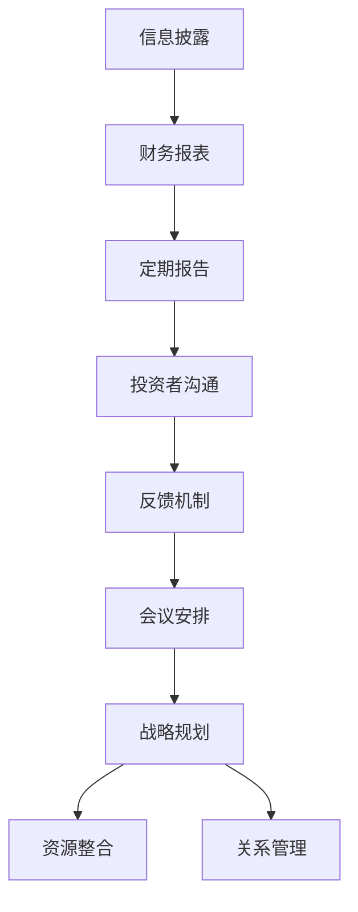

                 

# 《创业路上的投资者关系管理：与投资人建立长期互信的策略》

> **关键词：** 创业、投资者关系管理、长期互信、沟通策略、案例分析

> **摘要：** 本文深入探讨了创业企业如何通过有效的投资者关系管理，建立与投资人之间的长期互信。文章分为五个部分，从基础理论到实战案例，全面解析了投资者关系管理的核心要素、建立信任与沟通的策略、关系维护技巧以及策略优化方法，旨在为创业企业提供一套实用的投资者关系管理指南。

## 第一部分：引言与基础

### 1.1 创业的挑战与机遇

创业之路充满了挑战和机遇。对于创业者来说，除了要面对技术创新、市场开拓、团队建设等内部问题，还需要处理与外部投资者之间的关系。投资者关系管理成为创业成功的关键因素之一。

- **挑战：**
  - **资金压力：** 创业初期，资金是企业的生命线。如何获得足够的投资，是每个创业者都需要解决的问题。
  - **信任建立：** 投资者对创业企业的信任程度直接影响投资决策。如何建立长期互信，是投资者关系管理的核心问题。

- **机遇：**
  - **资金支持：** 投资者能够为企业提供资金、资源、人脉等支持，助力企业快速发展。
  - **战略指导：** 投资者往往具备丰富的行业经验，可以为创业企业提供宝贵的战略指导。

### 1.2 投资者关系管理的定义与意义

投资者关系管理（Investor Relationship Management，简称IRM）是指企业通过有效的沟通、合作、服务等方式，与投资者建立和保持长期稳定的合作关系，以提高企业价值和市场竞争力。

- **定义：** 投资者关系管理是一种战略性行为，旨在通过建立和维持良好的投资者关系，实现企业的长期发展目标。

- **意义：**
  - **提升企业价值：** 通过有效的投资者关系管理，可以提高企业在资本市场的声誉和认可度，从而提升企业价值。
  - **获得投资支持：** 良好的投资者关系有助于吸引更多投资者关注，提高企业获得投资的机会。
  - **战略指导：** 投资者可以为企业提供行业洞察、市场趋势等信息，帮助企业制定更科学的战略规划。

### 1.3 投资者关系管理的基础知识

投资者关系管理需要从以下几个方面入手：

- **投资者的类型与需求：** 了解投资者的类型和需求，有助于企业有针对性地开展投资者关系管理工作。

- **吸引投资者的策略：** 创业企业需要通过产品、市场、团队等方面的优势，吸引投资者的关注。

- **核心要素：** 投资者关系管理的核心要素包括沟通、合作、透明度、诚信等。

### 1.4 创业企业如何进行投资者关系管理

创业企业进行投资者关系管理，需要遵循以下原则：

- **明确目标：** 确定投资者关系管理的具体目标，如获得资金支持、战略指导等。

- **建立团队：** 搭建专业的投资者关系管理团队，明确各成员的职责和任务。

- **制定计划：** 制定详细的投资者关系管理计划，包括沟通策略、活动安排等。

- **持续沟通：** 保持与投资者的持续沟通，及时传递企业动态和业绩表现。

- **透明度与诚信：** 做到信息透明、诚信经营，增强投资者对企业的信任。

### 1.5 投资者关系管理的核心要素

投资者关系管理的核心要素包括以下几个方面：

- **沟通：** 沟通是投资者关系管理的基础。创业者需要通过多种渠道与投资者保持沟通，传递企业信息。

- **合作：** 与投资者建立良好的合作关系，共同推动企业发展。

- **透明度：** 做到信息透明，让投资者了解企业的真实情况。

- **诚信：** 诚信是企业发展的基石，也是投资者关系管理的关键。

- **服务：** 为投资者提供优质的服务，满足他们的需求。

## 第二部分：建立信任与沟通

### 2.1 了解投资者：投资者背景与偏好分析

了解投资者的背景和偏好，是建立长期互信的重要前提。创业者可以从以下几个方面入手：

- **投资者背景：**
  - **投资领域：** 投资者关注哪些行业或领域？
  - **投资风格：** 投资者是倾向于风险投资还是股权投资？
  - **投资偏好：** 投资者偏好何种类型的创业项目？

- **投资者偏好分析：**
  - **市场前景：** 投资者关注企业的市场前景和成长潜力。
  - **团队实力：** 投资者重视创业团队的实力和经验。
  - **商业模式：** 投资者对企业的商业模式和盈利模式有较高的要求。

### 2.2 建立良好的第一印象

第一印象对投资者关系管理至关重要。创业者可以从以下几个方面着手：

- **形象塑造：** 着装得体、仪表端庄，展示专业形象。

- **言谈举止：** 言辞得体、举止优雅，展现自信和真诚。

- **资料准备：** 提前准备好企业的相关资料，如商业计划书、财务报表等。

### 2.3 保持透明度与诚信

透明度与诚信是建立长期互信的关键。创业者需要做到以下几点：

- **信息透明：** 定期向投资者报告企业动态和业绩表现，让投资者了解企业的真实情况。

- **诚信经营：** 在与投资者的沟通中，保持诚信，不夸大事实、不隐瞒信息。

- **风险提示：** 充分告知投资者企业面临的潜在风险，提高他们的风险意识。

## 第三部分：沟通的艺术

### 3.1 有效沟通的基本原则

有效沟通是投资者关系管理的关键。以下是一些基本原则：

- **尊重对方：** 对投资者保持尊重，倾听他们的意见和需求。

- **明确表达：** 用简洁明了的语言表达观点，避免使用模糊不清的表述。

- **情绪管理：** 在沟通中保持冷静，避免情绪化的表达。

- **一致性：** 保持与企业价值观和战略目标的一致性。

### 3.2 面对面的沟通技巧

面对面沟通有助于建立信任和加深了解。以下是一些技巧：

- **准备充分：** 提前准备讨论话题和资料，确保沟通内容有条理。

- **主动提问：** 通过提问引导对话，了解投资者的需求和关切。

- **倾听：** 充分倾听投资者的意见和建议，表现出对他们的重视。

- **回应及时：** 对投资者的问题和意见给予及时回应，展现诚意。

### 3.3 文字沟通的要点

文字沟通包括邮件、报告等形式。以下是一些要点：

- **结构清晰：** 遵循逻辑顺序，使沟通内容条理清晰。

- **简洁明了：** 使用简洁明了的语言，避免冗长和复杂的句子。

- **注意语气：** 保持礼貌和尊重，避免使用命令式语言。

- **确认收悉：** 在邮件结束时，表达感谢和确认对方已收到信息。

## 第四部分：数据与信息的有效传达

### 4.1 如何准备投资者材料

准备投资者材料是投资者关系管理的重要环节。以下是一些建议：

- **商业计划书：** 详细阐述企业的商业模式、市场前景、团队介绍等。

- **财务报表：** 提供详细的财务数据，包括收入、成本、利润等。

- **市场分析：** 分析市场需求、竞争对手、行业趋势等。

- **风险评估：** 描述企业可能面临的风险和应对措施。

### 4.2 财务报表的解读与展示

财务报表是投资者关注的重要数据。以下是一些解读与展示的要点：

- **收入结构：** 分析收入来源，展示企业的盈利能力。

- **成本控制：** 分析成本结构，评估企业的成本控制能力。

- **利润率：** 分析利润率的变化，评估企业的盈利状况。

- **现金流：** 分析现金流状况，评估企业的财务稳定性。

### 4.3 数据可视化技巧

数据可视化有助于投资者更好地理解和分析数据。以下是一些建议：

- **图表选择：** 选择合适的图表类型，如折线图、柱状图、饼图等。

- **颜色搭配：** 使用易于区分的颜色，使图表更加直观。

- **数据标注：** 对重要数据和趋势进行标注，提高图表的可读性。

- **交互性：** 使用交互性图表，使投资者可以自定义数据范围和分析角度。

## 第五部分：实战案例与策略优化

### 5.1 创业企业成功投资者关系案例分析

以下是一两个成功投资者关系管理案例，供读者参考：

- **案例一：某创新科技公司的成功经验**
  - **背景：** 该公司是一家专注于人工智能领域的创新企业，获得了多家顶级投资者的关注。
  - **策略：**
    - **透明度与诚信：** 公司在投资者关系管理中始终保持透明度，及时向投资者报告企业动态和业绩表现。
    - **沟通与反馈：** 公司建立了完善的沟通机制，定期与投资者进行面对面沟通，积极收集并处理投资者反馈。
    - **资源整合：** 公司充分利用投资者的人脉资源，拓展市场渠道，提升企业竞争力。

- **案例二：某消费品牌企业的投资者关系管理**
  - **背景：** 该公司是一家专注于消费品牌的企业，通过有效的投资者关系管理，成功获得多轮融资。
  - **策略：**
    - **品牌建设：** 公司注重品牌建设，提升品牌知名度和美誉度，吸引投资者关注。
    - **市场拓展：** 公司通过市场拓展，提升市场份额，增加投资者信心。
    - **产品创新：** 公司持续进行产品创新，提高产品竞争力，满足投资者对业绩增长的期望。

### 5.2 投资者关系管理策略优化

投资者关系管理策略需要根据市场环境和企业发展的变化进行优化。以下是一些建议：

- **市场环境变化对投资者关系管理的影响**
  - **经济形势：** 经济形势的好坏直接影响投资者的信心和投资意愿。企业需要密切关注经济形势，调整投资者关系管理策略。
  - **行业趋势：** 行业趋势的变化会影响投资者的关注点和投资方向。企业需要及时调整战略，抓住行业发展的机遇。

- **策略优化的方法与工具**
  - **数据分析：** 通过数据分析，了解投资者的需求和关注点，优化沟通内容和方式。
  - **市场调研：** 定期进行市场调研，了解投资者对企业的评价和期望，发现潜在问题。
  - **培训与辅导：** 加强团队成员的培训与辅导，提高他们的投资者关系管理能力。

- **持续改进与效果评估**
  - **效果评估：** 定期评估投资者关系管理的效果，发现问题和不足，及时进行调整。
  - **持续改进：** 根据评估结果，持续改进投资者关系管理策略，提高沟通效率和质量。

### 5.3 持续优化投资者关系管理的策略

为了持续优化投资者关系管理，企业可以采取以下策略：

- **建立投资者数据库：** 收集和管理投资者的信息，包括背景、偏好、投资领域等，为有针对性的沟通提供依据。

- **定期培训：** 定期对投资者关系管理团队成员进行培训，提高他们的专业素养和沟通技巧。

- **内部协作：** 加强企业内部各部门之间的协作，确保投资者关系管理工作的顺利进行。

- **反馈机制：** 建立有效的反馈机制，及时收集和处理投资者的意见和建议，提高沟通效果。

- **资源整合：** 充分利用企业内外部资源，为投资者提供优质的服务和支持，提升投资者满意度。

## 第六部分：投资者关系管理的常见问题与解答

### 6.1 如何应对投资者的质疑

投资者在投资前和投资后可能会对创业企业提出各种质疑。以下是一些建议：

- **提前准备：** 在与投资者沟通前，提前准备可能被问到的问题，并制定合理的解答方案。

- **诚实回应：** 对投资者的质疑，要保持诚实和坦率，不回避问题。

- **数据支持：** 使用数据和事实来支持解答，提高说服力。

- **积极应对：** 对投资者的质疑，要表现出积极的态度，展示企业解决问题的决心和能力。

### 6.2 如何处理投资者关系管理中的危机

投资者关系管理过程中，可能会出现一些危机事件。以下是一些建议：

- **及时应对：** 一旦发现危机，要迅速采取应对措施，防止事态扩大。

- **透明沟通：** 及时向投资者传达危机事件的信息，保持沟通的透明度。

- **积极解决：** 通过有效措施，积极解决危机，恢复投资者信心。

- **反思总结：** 危机事件结束后，进行反思总结，分析原因，改进投资者关系管理策略。

## 第七部分：总结与展望

### 7.1 投资者关系管理的重要性

投资者关系管理在创业企业的发展中具有重要地位。通过有效的投资者关系管理，企业可以建立与投资者之间的长期互信，获得资金支持、战略指导等资源，助力企业快速发展。

### 7.2 投资者关系管理的发展趋势

随着创业环境的不断优化，投资者关系管理将呈现以下发展趋势：

- **数字化转型：** 企业将更多地利用数字化工具和平台，提高投资者关系管理的效率和质量。

- **个性化服务：** 企业将根据投资者的特点和需求，提供个性化的投资者关系管理服务。

- **数据驱动：** 企业将更加注重数据分析和应用，通过数据驱动投资者关系管理决策。

### 7.3 未来展望

随着创业环境的不断优化，投资者关系管理在创业企业中的作用将日益凸显。未来，创业者将更加重视投资者关系管理，通过不断创新和优化，为企业的发展奠定坚实基础。

## 附录 A：常用投资者关系管理工具与资源

### A.1 投资者关系管理软件介绍

- **CRM系统：** 客户关系管理系统可以帮助企业收集和管理投资者信息，提高沟通效率。
- **邮件营销软件：** 邮件营销软件可以帮助企业自动化发送邮件，提高沟通效果。
- **在线会议平台：** 在线会议平台可以方便企业进行远程沟通，提高会议效率。

### A.2 投资者关系管理相关书籍推荐

- **《投资者关系管理实战指南》**：一本全面介绍投资者关系管理策略和实践的书籍。
- **《创业企业的投资者关系管理》**：一本专门针对创业企业的投资者关系管理指南。

### A.3 投资者关系管理网站与社交媒体

- **Investor Relations Association：** 一个提供投资者关系管理资源和资讯的网站。
- **LinkedIn：** LinkedIn上有许多投资者关系管理专家和行业群组，可以交流经验和资源。

## 附录 B：投资者关系管理常用模板与示例

### B.1 投资者沟通邮件模板

**邮件标题：** 投资者关系管理 - {企业名称}最新动态

**邮件内容：**

尊敬的{投资者姓名}，

您好！

感谢您一直以来对{企业名称}的支持与关注。在此，我想向您简要汇报我们近期的发展动态，并期待与您保持长期的合作关系。

1. **企业最新动态：**
   - {企业最新进展，如产品发布、市场拓展等}
   - {企业当前面临的挑战和应对措施}

2. **财务状况：**
   - {近期财务报表摘要，如收入、成本、利润等}
   - {未来财务规划和目标}

3. **投资者关系活动：**
   - {近期投资者关系活动，如投资者会议、调研等}
   - {后续投资者关系活动计划}

4. **联系方式：**
   - {联系方式，如电话、邮箱等}

如有任何疑问或建议，请随时与我联系。期待与您的深入交流，共同推动{企业名称}的发展。

祝商祺！

{您的姓名}
{您的职位}
{企业名称}

### B.2 投资者会议报告模板

**报告标题：** 投资者关系管理 - {企业名称}投资者会议报告

**报告内容：**

尊敬的投资者，

感谢您参加本次投资者会议。以下是{企业名称}的投资者关系管理报告，供您参考。

1. **会议概况：**
   - **会议时间：** {会议时间}
   - **会议地点：** {会议地点}
   - **参会人员：** {参会人员名单}

2. **企业最新动态：**
   - {企业最新进展，如产品发布、市场拓展等}
   - {企业当前面临的挑战和应对措施}

3. **财务状况：**
   - {近期财务报表摘要，如收入、成本、利润等}
   - {未来财务规划和目标}

4. **投资者关系活动：**
   - {近期投资者关系活动，如投资者会议、调研等}
   - {后续投资者关系活动计划}

5. **投资者提问与回应：**
   - {投资者提问及企业回应内容}

6. **后续工作安排：**
   - {后续工作安排，如会议通知、财务报告等}

如有任何疑问或建议，请随时与我们联系。我们将继续努力，为投资者创造价值。

谢谢！

{您的姓名}
{您的职位}
{企业名称}

### B.3 财务报表解读示例

**报表名称：** {企业名称}财务报表解读

**解读内容：**

1. **收入结构：**
   - **主营业务收入：** {主营业务收入金额及占比}
   - **其他业务收入：** {其他业务收入金额及占比}

2. **成本结构：**
   - **直接成本：** {直接成本金额及占比}
   - **间接成本：** {间接成本金额及占比}

3. **利润率：**
   - **毛利率：** {毛利率数值}
   - **净利润率：** {净利润率数值}

4. **现金流：**
   - **经营活动现金流：** {经营活动现金流金额及占比}
   - **投资活动现金流：** {投资活动现金流金额及占比}
   - **筹资活动现金流：** {筹资活动现金流金额及占比}

5. **财务指标分析：**
   - **收入增长率：** {收入增长率数值}
   - **净利润增长率：** {净利润增长率数值}
   - **资产负债率：** {资产负债率数值}

**结论：**
根据财务报表分析，{企业名称}在报告期内实现了稳定的收入增长和良好的利润水平。同时，公司现金流状况良好，具备较强的资金运作能力。然而，公司还需关注成本控制和资产负债结构，以提高财务稳定性。

以上是财务报表的解读示例，企业可以根据自身情况调整内容。## 1. 引言：投资者关系管理的重要性

在创业的道路上，投资者关系管理（IRM）被视为一项至关重要的任务。对于创业公司来说，吸引并维持投资者的兴趣不仅是获取资金的关键，更是推动公司长期成功的关键因素之一。投资者关系管理不仅涉及到资金筹集，还包括如何构建和维护与投资者之间的信任和合作关系，从而实现双方共同的目标。

### 核心概念与联系

投资者关系管理的核心概念包括透明度、诚信、沟通和合作。这些概念之间相互联系，共同构成了一个有效的投资者关系管理体系。

- **透明度：** 企业应向投资者提供准确、及时和全面的信息，使他们能够了解企业的真实状况。
- **诚信：** 企业在与投资者互动中应始终保持诚信，这是建立长期信任关系的基础。
- **沟通：** 企业应与投资者建立有效的沟通机制，确保信息的双向流动。
- **合作：** 企业与投资者应形成合作关系，共同面对市场挑战，实现企业发展目标。

### 架构

投资者关系管理的架构可以分为三个层次：

1. **基础层：** 包括信息披露、财务报表和定期报告，确保信息的透明度和及时性。
2. **中间层：** 包括投资者沟通、反馈机制和会议安排，确保与投资者的有效互动。
3. **高层：** 包括战略规划、资源整合和关系管理，确保投资者关系管理的长期有效性。

### Mermaid 流程图

### 核心算法原理讲解

投资者关系管理并非一门精确的科学，但其中包含了一些关键原则和方法，可以帮助创业公司优化其与投资者的互动。

- **信任模型：**
  - **信任 = 诚信 + 透明度 + 沟通 + 合作**
  - 企业应通过诚信行为、透明度提升和有效沟通来建立信任。
  
- **沟通模型：**
  - **沟通 = 信息传递 + 反馈收集 + 情感交流**
  - 企业应确保信息传递准确无误，同时积极收集投资者的反馈，并建立情感上的联系。

### 数学模型和公式

在投资者关系管理中，可以使用一些数学模型和公式来评估和管理投资者关系。以下是一个简单的数学模型：

- **信任评分（TS）：**
  $$ TS = \frac{C + T + M + B}{4} $$
  - **C：** 诚信评分
  - **T：** 透明度评分
  - **M：** 沟通评分
  - **B：** 合作评分

这个模型可以帮助企业了解其在投资者关系管理中的整体表现，并针对性地进行改进。

### 举例说明

假设一家创业公司，其诚信评分为90，透明度评分为85，沟通评分为80，合作评分为75。根据上述模型，其信任评分计算如下：

$$ TS = \frac{90 + 85 + 80 + 75}{4} = \frac{330}{4} = 82.5 $$

这个评分表明该企业在投资者关系管理方面整体表现良好，但仍有提升空间，特别是在沟通和合作方面。

### 文章总结

投资者关系管理是创业公司成功的关键因素之一。通过理解核心概念、构建有效的架构和运用数学模型，企业可以优化与投资者的互动，建立长期的信任和合作关系。有效的投资者关系管理不仅能帮助企业获取资金支持，还能提供战略指导，助力企业在激烈的市场竞争中脱颖而出。

---

**作者：AI天才研究院/AI Genius Institute & 禅与计算机程序设计艺术 /Zen And The Art of Computer Programming**

