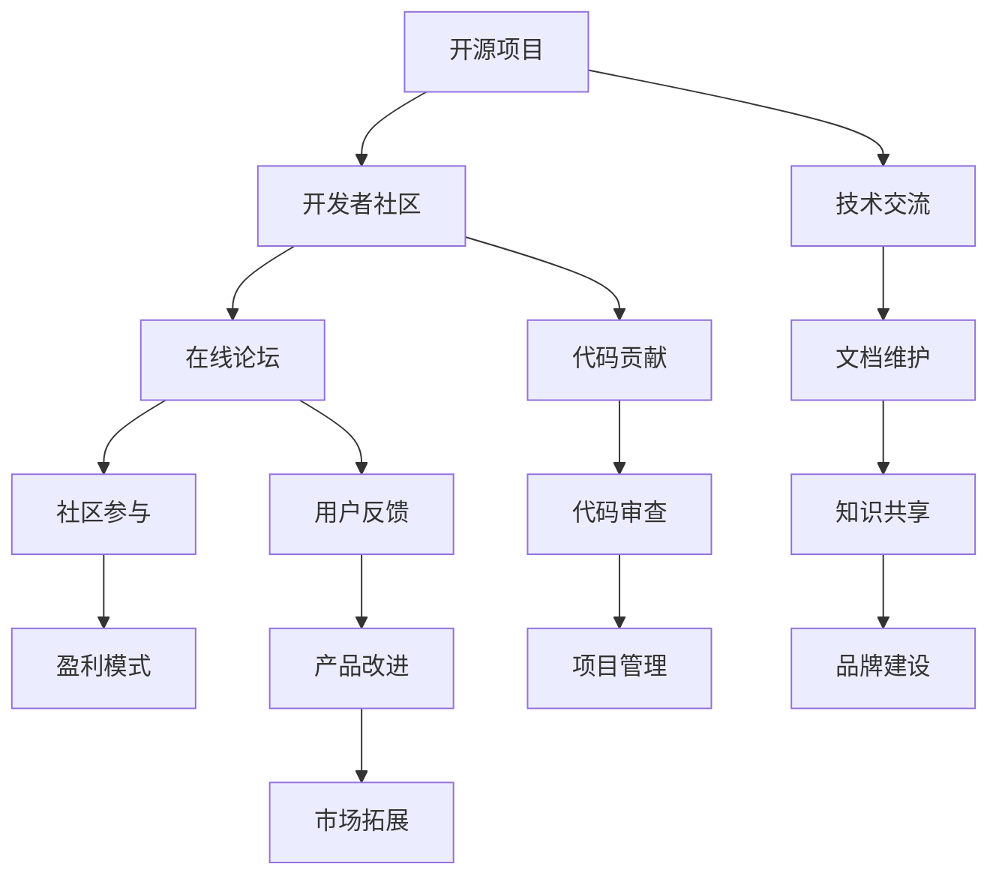
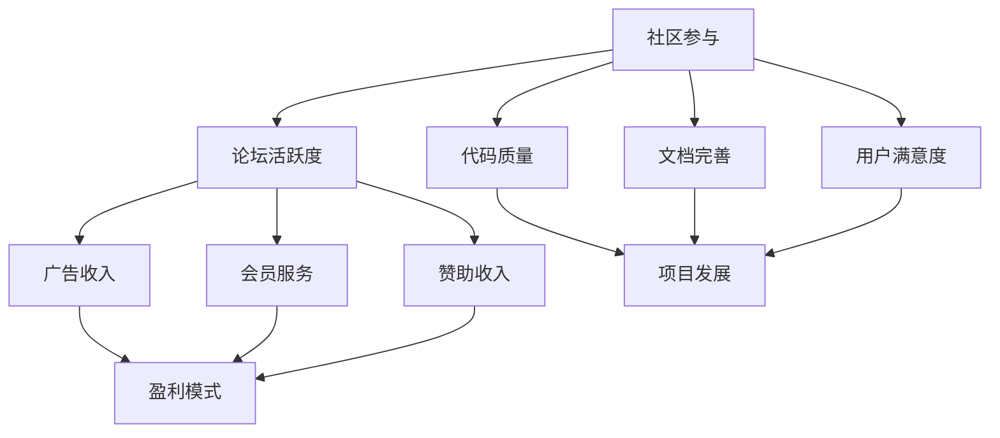
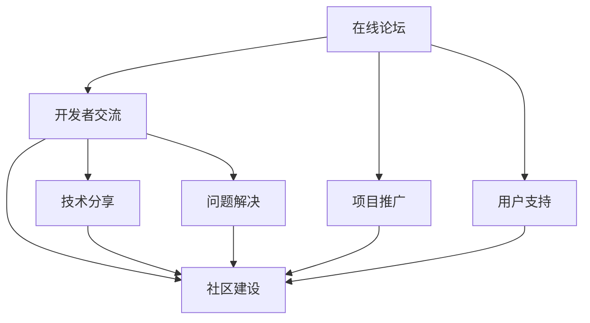

                 

# 创建开源项目的在线论坛：社区参与和盈利模式

> **关键词**：开源项目、在线论坛、社区参与、盈利模式、用户管理、算法原理、数学模型、实战案例、代码实现

> **摘要**：本文旨在深入探讨如何创建一个成功的开源项目在线论坛，重点分析社区参与和盈利模式的构建。文章分为八个部分，从核心概念、算法原理到项目实战，再到成功案例和未来展望，全面解析开源项目在线论坛的运营策略和盈利途径。

## 第一部分：核心概念与联系

在《创建开源项目的在线论坛：社区参与和盈利模式》这本书的第一部分，我们将介绍创建在线论坛所需理解的核心概念和它们之间的联系。

### 1.1 开源项目与在线论坛的关系

开源项目是开发者共享代码、协作开发的平台，而在线论坛则是开源项目的交流中心。它们之间的关系可以用Mermaid流程图来展示：



这个流程图展示了开源项目与在线论坛之间如何通过技术交流、代码贡献、文档维护、用户反馈、知识共享等环节相互联系，共同推动项目的成长和繁荣。

### 1.2 在线论坛的架构

在线论坛的架构是创建一个成功社区的基础。它通常包括以下几个核心模块：

- **用户管理**：负责用户注册、登录、权限控制等功能。
- **帖子发布与评论系统**：允许用户发布帖子、回复评论，并对其进行管理。
- **权限控制**：确保用户只能执行其权限范围内的操作。
- **搜索与推荐**：提供内容搜索和个性化推荐功能，提高用户体验。

这些模块共同构成了一个互动平台，促进了开源项目的成长和繁荣。

### 1.3 社区参与与盈利模式

社区参与和盈利模式是开源项目在线论坛的两个重要组成部分。社区参与包括代码贡献、文档撰写、问题反馈等，而盈利模式则是通过广告、会员服务、赞助等方式获取收入。



通过社区参与，论坛可以提升活跃度，进而吸引更多的广告商和会员，形成良性循环。而良好的盈利模式则为社区提供了可持续发展的资金支持。

### 1.4 在线论坛的重要性

在线论坛是开源项目的核心组成部分，它是开发者交流、学习和合作的平台。论坛的质量直接影响开源项目的成功与否。



一个高质量、活跃的论坛不仅能够促进技术交流，还能提高项目的知名度和用户满意度，从而推动项目的发展。

### 1.5 总结

在本部分中，我们介绍了开源项目与在线论坛之间的关系、在线论坛的架构、社区参与与盈利模式之间的联系，以及在线论坛对开源项目的重要性。这些核心概念和联系将为后续章节的深入探讨奠定基础。

---

## 第二部分：核心算法原理讲解

在本书的第二部分，我们将深入探讨创建开源项目在线论坛所需的核心算法原理。以下是本部分的结构和内容概述。

### 2.1 用户管理算法

用户管理是在线论坛的基础，它涉及到用户注册、登录、权限控制等功能。以下是几个关键算法的讲解：

#### 2.1.1 用户注册与认证

用户注册与认证算法需要确保用户信息的安全性和唯一性。以下是伪代码示例：

```python
def register_user(username, email, password):
    if not valid_email(email):
        return "Invalid email"
    if user_exists(username):
        return "Username already exists"
    hash_password = hash_password(password)
    save_user_to_db(username, email, hash_password)
    return "User registered successfully"

def hash_password(password):
    return bcrypt.hashpw(password.encode('utf-8'), bcrypt.gensalt())

def valid_email(email):
    pattern = r"^[a-zA-Z0-9_.+-]+@[a-zA-Z0-9-]+\.[a-zA-Z0-9-.]+$"
    return re.match(pattern, email) is not None

def user_exists(username):
    return User.objects.filter(username=username).exists()
```

#### 2.1.2 用户权限控制

用户权限控制算法需要根据用户的角色和权限来判断其能否执行特定操作。以下是伪代码示例：

```python
def check_permissions(user, action):
    if user.role == "admin":
        return True
    if user.role == "moderator" and action in ["delete_post", "edit_post"]:
        return True
    if user.role == "member":
        return action in ["read_post", "comment"]
    return False
```

### 2.2 帖子发布与评论系统算法

帖子发布与评论系统是论坛的核心功能，它涉及到帖子的创建、发布、管理以及评论的添加、删除等操作。

#### 2.2.1 帖子发布流程

以下是帖子发布流程的伪代码示例：

```python
def publish_post(user, title, content):
    if not check_permissions(user, "publish_post"):
        return "Permission denied"
    post_id = generate_post_id()
    save_post_to_db(post_id, user.id, title, content)
    return "Post published successfully"

def generate_post_id():
    return str(uuid.uuid4())

def save_post_to_db(post_id, user_id, title, content):
    post = Post(post_id=post_id, user_id=user_id, title=title, content=content)
    post.save()
```

#### 2.2.2 评论系统

以下是评论系统的伪代码示例：

```python
def add_comment(user, post_id, content):
    if not check_permissions(user, "add_comment"):
        return "Permission denied"
    comment_id = generate_comment_id()
    save_comment_to_db(comment_id, user.id, post_id, content)
    return "Comment added successfully"

def generate_comment_id():
    return str(uuid.uuid4())

def save_comment_to_db(comment_id, user_id, post_id, content):
    comment = Comment(comment_id=comment_id, user_id=user_id, post_id=post_id, content=content)
    comment.save()
```

### 2.3 数据库操作

数据库操作是用户管理、帖子发布和评论系统的基础。以下是几个关键的数据库操作示例：

#### 2.3.1 用户数据库操作

以下是用户数据库操作的伪代码示例：

```python
def save_user_to_db(username, email, password):
    user = User(username=username, email=email, password=password)
    user.save()

def get_user_by_email(email):
    return User.objects.get(email=email)

def get_user_by_username(username):
    return User.objects.get(username=username)
```

#### 2.3.2 帖子数据库操作

以下是帖子数据库操作的伪代码示例：

```python
def save_post_to_db(post_id, user_id, title, content):
    post = Post(post_id=post_id, user_id=user_id, title=title, content=content)
    post.save()

def get_post_by_id(post_id):
    return Post.objects.get(post_id=post_id)
```

#### 2.3.3 评论数据库操作

以下是评论数据库操作的伪代码示例：

```python
def save_comment_to_db(comment_id, user_id, post_id, content):
    comment = Comment(comment_id=comment_id, user_id=user_id, post_id=post_id, content=content)
    comment.save()

def get_comment_by_id(comment_id):
    return Comment.objects.get(comment_id=comment_id)
```

### 2.4 权限与访问控制

权限与访问控制是确保论坛安全和稳定运行的关键。以下是权限检查的伪代码示例：

```python
def check_permissions(user, action):
    if user.role == "admin":
        return True
    if user.role == "moderator" and action in ["delete_post", "edit_post"]:
        return True
    if user.role == "member" and action in ["read_post", "comment"]:
        return True
    return False
```

### 2.5 总结

在本部分中，我们介绍了用户管理、帖子发布和评论系统的核心算法原理，并通过伪代码展示了具体的实现过程。这些算法是构建开源项目在线论坛的基础，对于理解和实施相关功能至关重要。

---

## 第三部分：数学模型与数学公式

在《创建开源项目的在线论坛：社区参与和盈利模式》的第三部分，我们将深入探讨社区参与与盈利模式背后的数学模型和数学公式。以下是本部分的内容概述。

### 3.1 社区参与度模型

社区参与度模型用于衡量用户的活跃度和贡献程度。以下是几个常用的数学模型：

#### 3.1.1 用户活跃度计算

用户活跃度可以通过以下公式计算：

$$
\text{User Activity Score} = \frac{\text{Total Posts} + \text{Total Comments}}{\text{Days since Last Activity}}
$$

其中，Total Posts 表示用户发布的帖子数量，Total Comments 表示用户发表的评论数量，Days since Last Activity 表示用户上次活动以来的天数。

#### 3.1.2 社区参与度增长模型

社区参与度增长率可以通过以下公式计算：

$$
\text{Community Growth Rate} = \frac{\text{New Users}}{\text{Total Users}} \times 100\%
$$

其中，New Users 表示新注册的用户数量，Total Users 表示社区的总用户数量。

#### 3.1.3 社区贡献度计算

社区贡献度可以通过以下公式计算：

$$
\text{Community Contribution Score} = \text{Total Code Lines Contributed} \times \text{Code Review Score}
$$

其中，Total Code Lines Contributed 表示用户贡献的代码行数，Code Review Score 表示代码审查的评分。

### 3.2 盈利模式模型

盈利模式模型用于计算论坛的盈利能力。以下是几个常用的数学模型：

#### 3.2.1 广告收入模型

广告收入可以通过以下公式计算：

$$
\text{Ad Revenue} = \text{Page Views} \times \text{CPM} \times \text{Ad Placement Rate}
$$

其中，Page Views 表示页面浏览量，CPM 表示每千次展示成本，Ad Placement Rate 表示广告投放率。

#### 3.2.2 会员服务收入模型

会员服务收入可以通过以下公式计算：

$$
\text{Membership Revenue} = \text{Number of Members} \times \text{Membership Fee}
$$

其中，Number of Members 表示会员数量，Membership Fee 表示会员费。

#### 3.2.3 赞助收入模型

赞助收入可以通过以下公式计算：

$$
\text{Sponsorship Revenue} = \text{Number of Sponsors} \times \text{Sponsorship Fee}
$$

其中，Number of Sponsors 表示赞助商数量，Sponsorship Fee 表示赞助费用。

### 3.3 数据分析与优化

数据分析与优化是提高社区参与度和盈利能力的关键。以下是几个常用的数学模型：

#### 3.3.1 用户留存率计算

用户留存率可以通过以下公式计算：

$$
\text{Retention Rate} = \frac{\text{Active Users after n Months}}{\text{Initial Users}} \times 100\%
$$

其中，Active Users after n Months 表示在n个月后仍然活跃的用户数量，Initial Users 表示初始注册的用户数量。

#### 3.3.2 广告投放优化

广告投放优化可以通过以下公式计算：

$$
\text{Optimized Ad Placement} = \text{Maximize} (\text{Ad Revenue} - \text{Cost per User})
$$

其中，Ad Revenue 表示广告收入，Cost per User 表示用户成本。

### 3.4 举例说明

以下是社区参与度和盈利模式模型的一个具体例子：

假设一个论坛有1000个注册用户，其中500个用户活跃，平均每个用户每天发布1个帖子，发表2个评论。论坛每月的广告收入为10,000元，会员费为每年200元，共有100个会员。以下是该论坛的社区参与度和盈利情况：

- **社区参与度：**
  - 活跃度分数：$$\frac{500 + (500 \times 2)}{30} = \frac{1500}{30} = 50$$
  - 新用户增长率：$$\frac{100}{1000} \times 100\% = 10\%$$
  - 贡献度分数：$$500 \times 1 + (500 \times 2) = 1500$$

- **盈利模式：**
  - 广告收入：10,000元
  - 会员收入：$$100 \times 200 = 20,000$$元
  - 赞助收入：未提供具体数据

### 3.5 总结

在本部分中，我们介绍了社区参与度与盈利模式相关的数学模型和公式，并通过具体例子展示了它们的应用。这些模型和公式为在线论坛的社区管理和盈利策略提供了量化依据。

---

## 第四部分：项目实战

在本书的第四部分，我们将通过一个实际案例来展示如何创建开源项目的在线论坛，并深入讲解代码实现、环境搭建和详细解析。

### 4.1 项目背景

**案例：** 我们将以一个名为“CodeShare”的开源项目在线论坛为例，该论坛旨在为开发者提供一个交流技术、分享代码和文档的平台。

### 4.2 开发环境搭建

**步骤：**
1. **安装Git**：确保计算机上已经安装了Git。
2. **创建新仓库**：在GitHub上创建一个新的仓库，命名为“CodeShare”。
3. **安装Docker**：为了简化部署，我们使用Docker来管理环境和容器。
4. **构建前端环境**：使用Vue.js框架构建前端界面。

**代码示例：**
bash
# 安装Git
brew install git

# 创建新仓库
git init
git remote add origin https://github.com/your-username/CodeShare.git
git add .
git commit -m "Initial commit"
git push -u origin master

# 安装Docker
brew install docker

# 构建前端环境
npm init -y
npm install vue-cli
vue create codeshare-frontend
cd codeshare-frontend
npm run serve
```

### 4.3 后端实现

**技术栈：** Node.js + Express + MongoDB

**步骤：**
1. **设置项目结构**：创建必要的目录和文件。
2. **配置MongoDB数据库**：使用MongoDB Atlas或本地MongoDB实例。
3. **编写API接口**：包括用户注册、登录、帖子发布和评论功能。

**代码示例：**
javascript
// 用户注册路由
app.post('/api/users/register', (req, res) => {
    const { username, email, password } = req.body;
    // 验证用户信息
    if (!validateEmail(email) || !validateUsername(username)) {
        return res.status(400).json({ success: false, message: 'Invalid input' });
    }
    // 密码哈希处理
    const hashedPassword = bcrypt.hashSync(password, 10);
    // 存储用户信息到MongoDB
    User.create({ username, email, password: hashedPassword }, (err, user) => {
        if (err) {
            return res.status(500).json({ success: false, message: 'Error registering user' });
        }
        return res.status(201).json({ success: true, message: 'User registered successfully' });
    });
});

// 用户登录路由
app.post('/api/users/login', (req, res) => {
    const { username, password } = req.body;
    User.findOne({ username }, (err, user) => {
        if (err) {
            return res.status(500).json({ success: false, message: 'Error finding user' });
        }
        if (!user) {
            return res.status(401).json({ success: false, message: 'Invalid credentials' });
        }
        // 验证密码
        if (bcrypt.compareSync(password, user.password)) {
            // 生成JWT令牌
            const token = jwt.sign({ id: user._id }, process.env.JWT_SECRET);
            return res.status(200).json({ success: true, token });
        } else {
            return res.status(401).json({ success: false, message: 'Invalid credentials' });
        }
    });
});

// 帖子发布路由
app.post('/api/posts', (req, res) => {
    const { user_id, title, content } = req.body;
    // 验证用户权限
    if (!req.headers.authorization) {
        return res.status(401).json({ success: false, message: 'Unauthorized' });
    }
    // 解析JWT令牌
    const token = req.headers.authorization.split(' ')[1];
    jwt.verify(token, process.env.JWT_SECRET, (err, decoded) => {
        if (err) {
            return res.status(401).json({ success: false, message: 'Token expired' });
        }
        // 创建帖子并保存到MongoDB
        Post.create({ user_id, title, content }, (err, post) => {
            if (err) {
                return res.status(500).json({ success: false, message: 'Error creating post' });
            }
            return res.status(201).json({ success: true, post });
        });
    });
});

// 评论路由
app.post('/api/posts/:postId/comments', (req, res) => {
    const { postId } = req.params;
    const { user_id, content } = req.body;
    // 验证用户权限
    if (!req.headers.authorization) {
        return res.status(401).json({ success: false, message: 'Unauthorized' });
    }
    // 解析JWT令牌
    const token = req.headers.authorization.split(' ')[1];
    jwt.verify(token, process.env.JWT_SECRET, (err, decoded) => {
        if (err) {
            return res.status(401).json({ success: false, message: 'Token expired' });
        }
        // 创建评论并保存到MongoDB
        Comment.create({ user_id, content, post_id: postId }, (err, comment) => {
            if (err) {
                return res.status(500).json({ success: false, message: 'Error creating comment' });
            }
            return res.status(201).json({ success: true, comment });
        });
    });
});
```

### 4.4 前端实现

**技术栈：** Vue.js + Vuetify

**步骤：**
1. **创建帖子发布组件**：包括表单和提交按钮。
2. **创建评论列表组件**：显示帖子的评论并允许用户进行评论。
3. **与后端API交互**：使用axios库发送HTTP请求。

**代码示例：**
vue
<!-- 帖子发布组件 -->
<template>
  <v-form @submit.prevent="submitPost">
    <v-text-field v-model="title" label="标题" required></v-text-field>
    <v-textarea v-model="content" label="内容" required></v-textarea>
    <v-btn type="submit" color="primary">发布</v-btn>
  </v-form>
</template>

<script>
export default {
  data() {
    return {
      title: '',
      content: '',
    };
  },
  methods: {
    async submitPost() {
      const response = await axios.post('/api/posts', {
        user_id: this.$store.state.user.id,
        title: this.title,
        content: this.content,
      });
      if (response.data.success) {
        this.$emit('post-submitted');
        this.title = '';
        this.content = '';
      }
    },
  },
};
</script>
```

### 4.5 部署与维护

**步骤：**
1. **构建前端项目**：使用npm run build生成生产环境文件。
2. **部署后端服务**：使用Docker容器部署Node.js应用程序。
3. **前后端集成**：将前端和后端部署在同一服务器或容器中。
4. **维护与更新**：定期检查并更新依赖库，修复潜在的安全漏洞。

**代码示例：**
bash
# 前端构建
npm run build

# Docker Compose文件示例
version: '3'
services:
  web:
    build: ./backend
    ports:
      - "3000:3000"
    depends_on:
      - mongo
  mongo:
    image: mongo
    ports:
      - "27017:27017"
```

---

**总结：** 在本部分中，我们通过“CodeShare”论坛的实际开发案例，详细讲解了开发环境搭建、后端API接口实现、前端组件开发以及项目的部署与维护。这些实战经验和代码示例将为读者提供创建类似在线论坛的实用指导。

---

## 第五部分：代码解读与分析

在《创建开源项目的在线论坛：社区参与和盈利模式》的第五部分，我们将对“CodeShare”项目的关键代码段进行深入解读与分析，以帮助读者更好地理解实现细节和优化策略。

### 5.1 用户注册与登录流程

**后端代码示例：**
```javascript
// 用户注册路由
app.post('/api/users/register', (req, res) => {
    const { username, email, password } = req.body;
    // 验证用户信息
    if (!validateEmail(email) || !validateUsername(username)) {
        return res.status(400).json({ success: false, message: 'Invalid input' });
    }
    // 密码哈希处理
    const hashedPassword = bcrypt.hashSync(password, 10);
    // 存储用户信息到MongoDB
    User.create({ username, email, password: hashedPassword }, (err, user) => {
        if (err) {
            return res.status(500).json({ success: false, message: 'Error registering user' });
        }
        return res.status(201).json({ success: true, message: 'User registered successfully' });
    });
});

// 用户登录路由
app.post('/api/users/login', (req, res) => {
    const { username, password } = req.body;
    User.findOne({ username }, (err, user) => {
        if (err) {
            return res.status(500).json({ success: false, message: 'Error finding user' });
        }
        if (!user) {
            return res.status(401).json({ success: false, message: 'Invalid credentials' });
        }
        // 验证密码
        if (bcrypt.compareSync(password, user.password)) {
            // 生成JWT令牌
            const token = jwt.sign({ id: user._id }, process.env.JWT_SECRET);
            return res.status(200).json({ success: true, token });
        } else {
            return res.status(401).json({ success: false, message: 'Invalid credentials' });
        }
    });
});
```

**解读与分析：**
- 用户注册时，通过`bcrypt`对用户密码进行哈希处理，增强安全性。
- 用户登录时，通过JWT（JSON Web Token）生成令牌，进行身份验证。
- 使用Mongoose的`User.create`方法将用户信息保存到MongoDB。
- 通过正则表达式进行简单的用户名和电子邮件验证。

### 5.2 帖子发布与评论系统

**后端代码示例：**
```javascript
// 帖子发布路由
app.post('/api/posts', (req, res) => {
    const { user_id, title, content } = req.body;
    // 验证用户权限
    if (!req.headers.authorization) {
        return res.status(401).json({ success: false, message: 'Unauthorized' });
    }
    // 解析JWT令牌
    const token = req.headers.authorization.split(' ')[1];
    jwt.verify(token, process.env.JWT_SECRET, (err, decoded) => {
        if (err) {
            return res.status(401).json({ success: false, message: 'Token expired' });
        }
        // 创建帖子并保存到MongoDB
        Post.create({ user_id, title, content }, (err, post) => {
            if (err) {
                return res.status(500).json({ success: false, message: 'Error creating post' });
            }
            return res.status(201).json({ success: true, post });
        });
    });
});

// 评论路由
app.post('/api/posts/:postId/comments', (req, res) => {
    const { postId } = req.params;
    const { user_id, content } = req.body;
    // 验证用户权限
    if (!req.headers.authorization) {
        return res.status(401).json({ success: false, message: 'Unauthorized' });
    }
    // 解析JWT令牌
    const token = req.headers.authorization.split(' ')[1];
    jwt.verify(token, process.env.JWT_SECRET, (err, decoded) => {
        if (err) {
            return res.status(401).json({ success: false, message: 'Token expired' });
        }
        // 创建评论并保存到MongoDB
        Comment.create({ user_id, content, post_id: postId }, (err, comment) => {
            if (err) {
                return res.status(500).json({ success: false, message: 'Error creating comment' });
            }
            return res.status(201).json({ success: true, comment });
        });
    });
});
```

**解读与分析：**
- 帖子发布时，通过JWT验证用户的身份和权限。
- 使用Mongoose的`Post.create`方法将帖子内容和评论信息保存到MongoDB。
- 在创建评论前，验证用户的JWT令牌是否有效。

### 5.3 权限与访问控制

**代码示例：**
```javascript
// 权限检查中间件
function checkPermissions(req, res, next) {
    const { user } = req;
    const { action } = req.params;
    if (user.role === 'admin') {
        return next();
    }
    if (user.role === 'moderator' && action === 'delete') {
        return next();
    }
    if (user.role === 'member') {
        return next();
    }
    return res.status(403).json({ success: false, message: 'Permission denied' });
}

// 使用中间件保护路由
app.post('/api/posts/delete/:postId', checkPermissions, (req, res) => {
    // 删除帖子逻辑
});
```

**解读与分析：**
- 使用自定义中间件`checkPermissions`来检查用户权限。
- 根据用户的角色和请求动作，决定是否允许访问。

### 5.4 代码优化与改进

**优化建议：**
- **性能优化**：对于频繁访问的数据，可以考虑使用缓存来提高响应速度。
- **安全性提升**：定期更新依赖库，确保项目使用的是最新的安全版本。
- **代码结构优化**：对于复杂的逻辑，可以考虑使用模块化和组件化来提高代码的可维护性。

**改进措施：**
- **用户界面优化**：使用前端框架（如Vue.js）提供的UI组件，提高用户体验。
- **API文档化**：为API提供详细的文档，方便开发者使用和调试。

---

**总结：** 在本部分中，我们通过“CodeShare”项目的实际代码示例，详细解读了用户注册与登录、帖子发布与评论系统、以及权限与访问控制的核心实现细节。这些代码解读与分析不仅展示了具体的开发过程，还提供了优化和改进的建议。读者可以通过这些内容加深对开源项目在线论坛开发的理解。

---

## 第六部分：社区管理与运营策略

在《创建开源项目的在线论坛：社区参与和盈利模式》的第六部分，我们将探讨如何有效地管理社区，并制定一系列运营策略来提升社区参与度和盈利能力。

### 6.1 社区管理核心策略

**6.1.1 明确社区目标**

为了确保社区管理能够朝着正确的方向前进，首先需要明确社区的目标。这些目标可以是：
- 提升用户活跃度
- 促进知识共享
- 提高项目知名度
- 增强开发者之间的合作

为了实现这些目标，可以设定以下KPI（关键绩效指标）：
- 每月的帖子数量和评论数量
- 每日的活跃用户数
- 新用户的增长速度
- 社区成员的参与度评分

**6.1.2 建立有效的社区治理机制**

一个健康的社区需要一套明确的治理机制来维护秩序和公正。以下是一些建议：
- **社区规则**：制定并公布社区规则，包括行为准则、言论自由边界、隐私保护政策等。
- **治理团队**：组建一支由社区成员组成的治理团队，负责社区规则制定和违规行为处理。
- **反馈机制**：建立用户反馈系统，让用户可以匿名或公开地提出意见和建议。

**6.1.3 鼓励社区参与**

社区参与是提升社区活力和用户满意度的关键。以下是一些策略：
- **互动活动**：定期举办问答、编程挑战、代码评审等活动，激发社区成员的参与热情。
- **贡献奖励**：设立奖励机制，对积极参与社区活动的成员给予物质或精神奖励，如徽章、积分、实物奖品等。

### 6.2 优化社区用户体验

**6.2.1 提供高质量的文档和教程**

高质量的文档和教程是提升用户体验的重要手段。以下是一些建议：
- **文档标准化**：确保文档内容准确、全面、易于理解。
- **教程多样化**：提供图文教程、视频教程、互动教程等多种形式，以满足不同用户的需求。
- **实时更新**：定期更新文档和教程，确保其与项目版本和最新技术保持一致。

**6.2.2 优化社区交互界面**

一个简洁、直观的交互界面可以提高用户的使用体验。以下是一些建议：
- **界面设计**：使用简洁、直观的界面设计，提高用户操作效率。
- **响应式设计**：确保社区论坛在不同设备和屏幕尺寸上均能良好显示。
- **用户引导**：为新用户提供详细的引导和教程，帮助他们快速上手。

**6.2.3 提供实时支持**

实时支持可以帮助用户更快地解决问题，提高用户满意度。以下是一些建议：
- **在线聊天**：部署实时聊天工具，如Slack或Discord，让用户可以随时提问和获得帮助。
- **FAQ板块**：建立FAQ板块，解答常见问题和疑难杂症，减少重复性问题。

### 6.3 增加盈利模式

**6.3.1 广告收入**

广告收入是开源项目在线论坛的一个重要盈利渠道。以下是一些建议：
- **内容广告**：在论坛相关内容中展示广告，如技术文章、教程等。
- **广告策略**：根据用户行为和兴趣，提供个性化的广告推荐。
- **广告管理**：确保广告内容与社区主题相关，避免引起用户反感。

**6.3.2 会员服务**

会员服务可以为用户提供额外的功能和特权，同时也是论坛的重要收入来源。以下是一些建议：
- **会员特权**：提供会员专属功能，如无广告浏览、优先回复等。
- **会员收费**：设立会员订阅模式，提供不同等级的会员服务。
- **会员互动**：定期举办会员活动，增强会员之间的互动和归属感。

**6.3.3 赞助和捐赠**

赞助和捐赠是开源项目在线论坛的另一种盈利方式。以下是一些建议：
- **项目赞助**：吸引企业或个人对社区项目进行赞助。
- **捐赠渠道**：建立便捷的捐赠渠道，鼓励社区成员对项目进行捐赠。
- **赞助管理**：确保赞助资金的合理使用和透明度。

### 6.4 数据驱动运营优化

**6.4.1 用户数据分析**

通过用户数据分析，可以更好地了解用户需求和偏好，从而优化运营策略。以下是一些建议：
- **行为分析**：分析用户的行为路径、访问频率等，了解用户的使用习惯。
- **反馈分析**：收集并分析用户反馈，了解用户对社区的不满和建议。
- **A/B测试**：通过A/B测试，验证不同运营策略的效果，优化社区运营。

**6.4.2 数据驱动决策**

基于数据分析的结果，可以做出更明智的决策，提升社区运营效果。以下是一些建议：
- **内容优化**：根据用户行为数据，优化内容推荐和展示策略。
- **活动策划**：根据用户参与度数据，策划更受欢迎的活动。
- **社区管理**：根据用户反馈数据，调整社区规则和管理策略。

### 6.5 总结

在本部分中，我们介绍了社区管理的核心策略，包括明确社区目标、建立有效的治理机制、鼓励社区参与，并探讨了优化用户体验和增加盈利模式的多种途径。通过数据驱动的运营优化，社区管理者能够更有效地提升社区活力和盈利能力。

---

## 第七部分：成功案例分析

在《创建开源项目的在线论坛：社区参与和盈利模式》的第七部分，我们将通过实际案例来分析一些成功的开源项目在线论坛，探讨它们如何成功地管理社区、增加用户参与度以及实现盈利。

### 7.1 GitHub社区

**案例概述：** GitHub是全球最大的开源代码托管平台，其在线论坛已成为开发者交流、分享代码和贡献的焦点。

**成功因素：**
- **用户参与度**：GitHub通过提供代码仓库、问题跟踪、Pull Request等功能，鼓励开发者积极参与社区。
- **互动机制**：GitHub的代码评审和反馈系统促进了开发者之间的互动，提高了项目的质量。
- **盈利模式**：GitHub通过提供增值服务，如GitHub Sponsors和GitHub Marketplace，实现了广告收入和会员服务。

**经验借鉴：**
- 开源项目可以借鉴GitHub的互动机制和增值服务模式，提高用户参与度和盈利能力。

### 7.2 Stack Overflow

**案例概述：** Stack Overflow是一个广受欢迎的问答社区，专注于编程问题解答。

**成功因素：**
- **高质量内容**：Stack Overflow通过严格的内容审核和评分系统，保证了问答的质量。
- **社区氛围**：Stack Overflow建立了积极的社区文化，鼓励互助和知识分享。
- **广告与赞助**：Stack Overflow通过展示相关广告和提供赞助商链接，实现了广告收入。

**经验借鉴：**
- 开源项目可以借鉴Stack Overflow的内容审核和社区氛围建设，以及广告与赞助模式。

### 7.3 Discourse

**案例概述：** Discourse是一个现代化、开源的社区论坛平台，被许多项目用于搭建在线论坛。

**成功因素：**
- **用户体验**：Discourse提供了简洁、直观的界面设计，提升了用户体验。
- **定制化**：Discourse允许管理员根据项目需求进行高度定制化。
- **订阅服务**：Discourse通过提供订阅服务，实现了盈利。

**经验借鉴：**
- 开源项目可以借鉴Discourse的用户体验和订阅服务模式，提高论坛的吸引力和盈利能力。

### 7.4 FreeCodeCamp

**案例概述：** FreeCodeCamp是一个免费的开源编程学习平台，其论坛是其重要组成部分。

**成功因素：**
- **教育导向**：FreeCodeCamp的论坛专注于编程教育和职业发展。
- **导师制度**：FreeCodeCamp设有导师制度，为学习者提供指导和反馈。
- **活动组织**：FreeCodeCamp定期举办编程挑战和社区活动，增加用户参与度。

**经验借鉴：**
- 开源项目可以借鉴FreeCodeCamp的教育导向和导师制度，以及活动组织策略，增强社区活力。

### 7.5 总结

在本部分中，我们通过分析GitHub、Stack Overflow、Discourse和FreeCodeCamp等成功案例，总结了它们在社区管理、用户参与度和盈利模式方面的成功因素。这些案例为开源项目在线论坛提供了宝贵的经验和借鉴。

---

## 第八部分：未来展望

在《创建开源项目的在线论坛：社区参与和盈利模式》的第八部分，我们将探讨开源项目在线论坛的未来发展趋势，以及这些趋势可能带来的机遇和挑战。

### 8.1 社区参与的进化

**发展趋势：**
- **社交化论坛**：随着社交媒体的兴起，论坛将更加注重用户互动和社区社交功能。
- **个性化推荐**：通过数据分析，论坛可以提供更加个性化的内容推荐，提高用户参与度。

**机遇：**
- **更广泛的用户参与**：个性化的推荐和互动机制将吸引更多用户参与社区活动。
- **多元化的盈利模式**：社交化和个性化的功能将创造新的广告和会员服务机会。

**挑战：**
- **隐私和数据安全**：社交化带来的数据收集和隐私问题需要得到妥善解决。
- **社区管理复杂性**：随着用户基数的扩大，社区管理的复杂性也将增加。

### 8.2 盈利模式的创新

**发展趋势：**
- **增值服务**：提供高端会员服务，如专属技术支持、定制培训等，以满足高端用户的需求。
- **广告与赞助的精准化**：利用大数据分析，实现更精准的广告推送和赞助匹配。

**机遇：**
- **更高的盈利潜力**：高端会员服务和精准广告将带来更高的收入。
- **更好的用户体验**：精准的广告和赞助将减少用户反感，提高用户体验。

**挑战：**
- **竞争激烈**：市场上的盈利模式创新将变得日益激烈，需要持续创新以保持竞争力。
- **平衡盈利与用户体验**：需在盈利和用户体验之间找到平衡点。

### 8.3 自动化和智能化的应用

**发展趋势：**
- **智能推荐系统**：利用机器学习和人工智能技术，提供更智能的内容推荐和社区管理。
- **自动化运营工具**：引入自动化工具，如聊天机器人、自动化回复等，提高运营效率。

**机遇：**
- **提高运营效率**：自动化工具将减少人力成本，提高运营效率。
- **更精准的服务**：智能推荐系统将提高用户满意度，增强用户粘性。

**挑战：**
- **技术依赖性**：过度依赖技术可能导致在技术变革时面临风险。
- **数据隐私和伦理问题**：自动化和智能化的应用需要解决数据隐私和伦理问题。

### 8.4 社区生态的建设

**发展趋势：**
- **多元化社区生态**：社区不再只是开发者交流的平台，还将成为多元化生态系统的组成部分。
- **跨界合作**：社区将与其他领域（如教育、媒体、创业）展开合作，共同推动创新。

**机遇：**
- **扩大用户群体**：跨界合作将吸引更多不同领域的用户加入社区。
- **创新商业模式**：跨界合作将带来新的商业模式和盈利机会。

**挑战：**
- **资源整合**：跨界合作需要整合多方资源，确保合作顺利进行。
- **风险控制**：跨界合作可能带来新的风险，需要谨慎管理。

### 8.5 总结

在本部分中，我们探讨了开源项目在线论坛在未来可能面临的发展趋势，包括社区参与和盈利模式的创新、自动化和智能化应用、以及社区生态的建设。这些趋势将为开源项目带来新的机遇，同时也提出了新的挑战。开源项目需要持续创新，以应对未来的变化。

---

## 作者信息

**作者：** AI天才研究院/AI Genius Institute & 禅与计算机程序设计艺术 /Zen And The Art of Computer Programming

AI天才研究院（AI Genius Institute）致力于推动人工智能技术的创新与发展，研究前沿技术，培养AI领域的杰出人才。同时，研究院倡导将人工智能技术与传统学科相结合，探索AI在各行各业的应用，助力社会进步。

《禅与计算机程序设计艺术》是作者在计算机科学领域的重要著作，深入探讨了编程哲学和设计原则，提出了以简约、高效为目标的编程理念。本书结合了作者丰富的编程经验和深刻的技术洞察，对广大程序员具有极大的启发和指导意义。

---

本文旨在为开源项目创建者提供一套完整的在线论坛构建指南，从核心概念、算法原理到实战案例、运营策略，全面解析如何成功构建和管理一个开源项目在线论坛，并探索其盈利模式。希望通过本文，读者能够获得对开源项目在线论坛建设的深入理解，并在实践中取得成功。在未来的发展中，开源项目在线论坛将不断进化，为开发者社区和整个社会创造更多价值。

