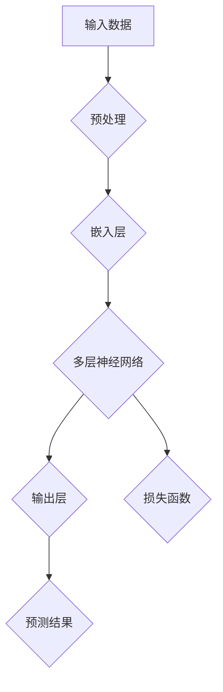
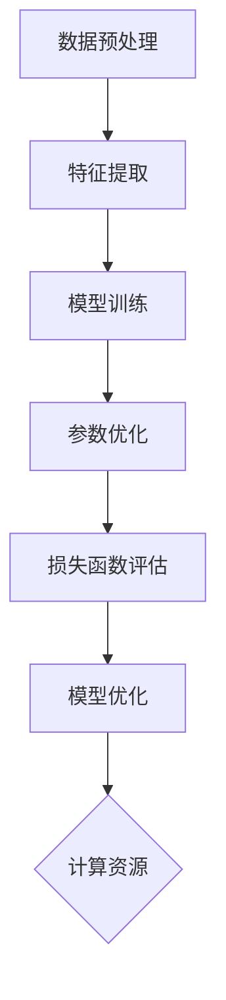
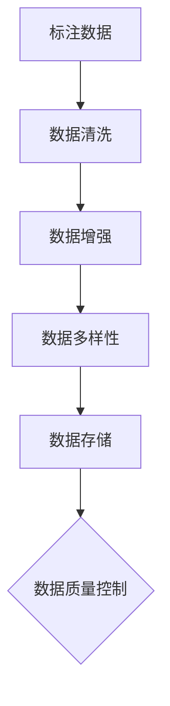
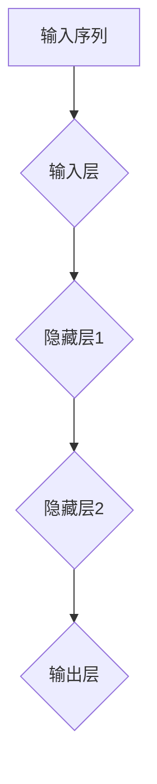
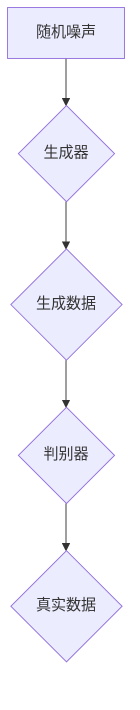

                 

### 文章标题

《发掘大模型带来的新商业机会》

大模型，作为近年来人工智能领域的一个重要突破，正在深刻地改变着各行各业。从自然语言处理到图像识别，从智能推荐到金融风控，大模型的应用场景越来越广泛，带来的商业价值也日益凸显。本文将围绕大模型这一核心主题，深入探讨其带来的新商业机会，旨在为广大读者揭示大模型时代的商业潜力和发展前景。

## 关键词

- 大模型
- 商业机会
- 深度学习
- 自然语言处理
- 智能推荐
- 金融风控

### 摘要

本文将从多个维度分析大模型带来的新商业机会。首先，我们将回顾大模型的历史演变和定义，理解其基础架构和核心原理。接着，我们将详细讲解大模型的算法原理，包括循环神经网络（RNN）、长短期记忆网络（LSTM）和生成对抗网络（GAN），并使用伪代码和数学公式进行解释。随后，我们将探讨大模型在商业领域的应用场景，包括智能客服、智能推荐系统和智能金融风控，并通过实际案例进行分析。最后，我们将展望大模型商业机会的未来趋势，探讨面临的挑战以及可能的解决方案。

---

随着人工智能技术的不断进步，大模型已经成为业界研究和应用的热点。它们在提升企业效率和创新能力方面展现出巨大的潜力，同时也为创业者带来了诸多新的商业机会。本文将为您深入解析这一领域的核心内容，帮助您把握大模型时代的商业脉搏。接下来，我们将首先回顾大模型的历史演变和定义，为后续内容的深入讨论打下基础。

---

## 第一部分: 理解大模型时代

### 第1章: 大模型革命：商业机会的源泉

大模型的崛起不仅仅是技术进步的产物，更是一场深刻影响商业运作的革命。在这一章中，我们将探讨大模型的定义与历史演变，分析其对商业的影响，并探讨大模型在提升企业竞争力方面的潜力。

## 第1章 大模型革命：商业机会的源泉

### 1.1 大模型的定义与历史演变

#### 1.1.1 大模型的定义

大模型（Large-scale Model）是指那些拥有巨大参数规模和计算需求的深度学习模型。这些模型在训练时需要处理海量数据，并利用先进的算法进行优化，以便在各类任务中达到卓越的性能。大模型的概念源于深度学习的快速发展，特别是在2010年后，随着计算能力和数据资源的不断提升，大模型逐渐成为可能。

#### 1.1.2 大模型的发展历程

大模型的发展历程可以追溯到20世纪90年代，当时基于神经网络的模型已经在语音识别和图像处理领域取得了初步成功。然而，由于计算能力和数据资源的限制，这些模型通常规模较小，性能有限。

2012年，AlexNet模型的诞生标志着深度学习的一个重要里程碑。AlexNet在ImageNet图像识别挑战中获得了当时最高的准确率，其核心在于使用了大量参数和多层神经网络结构。这一成果激发了学术界和工业界对深度学习的关注，推动了计算资源和数据处理的提升。

随着时间的推移，深度学习模型变得越来越复杂，参数规模也越来越大。到了2018年，Google推出了Transformer模型，这一模型不仅在自然语言处理领域取得了突破性成果，还成为了大模型的代表。Transformer模型的成功，进一步推动了大模型在各个领域的研究和应用。

#### 1.1.3 大模型的类型

大模型根据应用领域和任务的不同，可以分为多种类型，主要包括：

- **自然语言处理模型**：如BERT、GPT等，这些模型在文本理解和生成方面具有强大的能力。
- **计算机视觉模型**：如ResNet、EfficientNet等，这些模型在图像分类、目标检测等方面表现出色。
- **语音识别模型**：如WaveNet、CTC等，这些模型在语音识别和语音合成方面取得了显著进展。
- **多模态模型**：如ViT、BLSTM等，这些模型能够处理多种类型的数据，实现跨模态的任务。

### 1.2 大模型对商业的影响

大模型的出现不仅改变了人工智能技术的研究方向，也对商业运作产生了深远的影响。以下是大模型对商业的主要影响：

#### 1.2.1 大模型在商业中的应用

- **智能客服**：大模型可以用于构建智能客服系统，实现自动化的客户服务，提高服务效率和客户满意度。
- **智能推荐系统**：大模型可以用于分析用户行为和偏好，提供个性化的推荐服务，提升用户体验和商家收益。
- **智能金融风控**：大模型可以用于识别潜在风险和欺诈行为，提高金融业务的安全性和合规性。
- **精准营销**：大模型可以帮助企业分析市场数据，制定精准的营销策略，提高市场投放的ROI。
- **供应链优化**：大模型可以用于分析供应链数据，优化库存管理和物流调度，降低运营成本。

#### 1.2.2 大模型对商业模式的改变

大模型的出现，使得企业能够利用先进的人工智能技术实现业务流程的自动化和智能化，从而带来以下变化：

- **降低人力成本**：通过自动化和智能化，企业可以减少对人工的依赖，降低人力成本。
- **提升决策效率**：大模型可以处理海量数据，提供精准的分析结果，帮助企业快速做出决策。
- **创造新的商业模式**：大模型的应用，可以为企业带来新的商业机会，创造新的商业模式。

#### 1.2.3 大模型对企业竞争力的提升

大模型的应用，不仅可以帮助企业提高运营效率，还能提升企业在市场竞争中的地位：

- **差异化竞争**：企业可以通过应用大模型，提供与众不同的产品和服务，实现差异化竞争。
- **技术创新**：大模型的应用，推动企业不断进行技术创新，提升技术竞争力。
- **市场洞察**：大模型可以帮助企业更好地了解市场需求和趋势，抓住市场机遇。

### 1.3 大模型对商业的影响

大模型的出现，对商业领域产生了深远的影响。首先，大模型的应用大大提高了企业的运营效率，通过自动化和智能化，企业可以减少对人工的依赖，降低人力成本，提升服务质量。其次，大模型可以帮助企业做出更加精准的决策，通过处理海量数据，提供详细的分析结果，企业可以快速识别市场趋势和机遇，制定更加有效的策略。

此外，大模型的应用，还为企业带来了新的商业机会。例如，在智能客服领域，大模型可以帮助企业实现自动化的客户服务，提高服务效率和客户满意度；在智能推荐系统领域，大模型可以分析用户行为和偏好，提供个性化的推荐服务，提升用户体验和商家收益；在金融风控领域，大模型可以帮助企业识别潜在风险和欺诈行为，提高金融业务的安全性和合规性。

总的来说，大模型为商业领域带来了巨大的变革和机遇。企业通过应用大模型，可以实现业务流程的自动化和智能化，提升运营效率和决策能力，创造新的商业模式，增强市场竞争力。

### 1.4 大模型对商业的影响

大模型的广泛应用，对商业领域产生了深远的影响。首先，大模型的应用显著提升了企业的运营效率。通过自动化和智能化，企业可以大幅降低对人工的依赖，从而减少人力成本，提高服务质量。例如，智能客服系统可以利用大模型实现自动化的客户服务，提供24/7不间断的客户支持，显著提升客户满意度。

其次，大模型的应用使得企业能够做出更加精准的决策。大模型可以处理和分析海量数据，帮助企业快速识别市场趋势和机遇，从而制定更加有效的商业策略。例如，在市场营销领域，企业可以利用大模型分析用户行为数据，预测潜在客户的需求，制定个性化的营销策略，提高营销效果和ROI。

此外，大模型的应用还为企业创造了新的商业机会。通过大模型，企业可以开发出更具创新性的产品和服务，满足市场的多样化需求。例如，在医疗领域，大模型可以帮助医疗机构进行疾病预测和诊断，提高医疗服务的准确性和效率；在制造业领域，大模型可以用于优化生产流程，降低生产成本，提高生产效率。

总之，大模型的出现为商业领域带来了前所未有的变革和机遇。企业通过应用大模型，不仅可以提升运营效率和决策能力，还可以创造新的商业模式，增强市场竞争力。

### 1.5 大模型对商业的影响

大模型在商业领域的应用不仅提高了企业的运营效率和决策能力，还带来了新的商业模式和创新。首先，通过大模型，企业能够实现精准的市场洞察和需求预测，从而制定更具针对性的产品和服务策略。例如，电商企业可以利用大模型分析用户行为数据，预测用户购买偏好，提供个性化的商品推荐，从而提升销售额和用户满意度。

其次，大模型的应用推动了企业内部流程的自动化和智能化。通过自动化流程，企业可以减少人工干预，降低运营成本，提高生产效率。例如，在制造业中，大模型可以用于生产线的实时监控和故障预测，从而实现生产流程的优化和自动化。

此外，大模型还促进了企业之间的合作和创新。通过共享数据和资源，企业可以实现跨行业的合作，共同开发出更具创新性的产品和服务。例如，在金融科技领域，银行和科技公司可以通过大模型合作，开发出更加智能的金融产品和服务，提升用户体验和竞争力。

总之，大模型为商业领域带来了新的商业机会和创新模式，推动了企业的持续发展和竞争力的提升。

### 1.6 大模型对商业的影响

大模型在商业领域的应用，不仅提高了企业的运营效率和决策能力，还为企业带来了新的商业机会和创新模式。通过大模型，企业可以更精准地了解市场需求和用户行为，从而优化产品设计和营销策略。例如，利用自然语言处理技术，企业可以分析社交媒体上的用户评论，了解用户对产品的反馈和建议，进而改进产品。

此外，大模型的应用还推动了企业之间的合作和创新。企业可以通过共享数据和资源，实现跨行业的合作，共同开发出更具创新性的产品和服务。例如，在医疗领域，保险公司和医疗机构可以通过合作，利用大模型进行疾病预测和风险评估，提供更加精准的健康管理和保险服务。

总之，大模型为商业领域带来了新的变革和机遇。企业通过应用大模型，不仅可以提升自身竞争力，还可以推动整个行业的发展和创新。

---

## 第2章: 大模型技术的核心概念与联系

在大模型的技术架构中，核心概念和联系构成了理解和应用这些模型的基础。本章将详细介绍大模型的核心原理、与深度学习的联系，以及在大模型中扮演重要角色的自然语言处理技术。

### 2.1 大模型的核心原理

#### 2.1.1 大模型的基础架构

大模型通常由大量的神经元和参数构成，这些神经元通过多层神经网络结构相互连接，形成一个复杂的计算网络。该网络能够自动从海量数据中学习特征，从而实现高度复杂的任务。以下是大模型基础架构的Mermaid流程图：



在该流程图中，输入数据首先经过预处理，然后通过嵌入层将数据转化为神经网络的输入。多层神经网络对输入数据进行特征提取和变换，最终输出层产生预测结果，并通过损失函数评估预测的准确性。

#### 2.1.2 大模型的计算需求

大模型的计算需求非常高，这主要源于其参数规模和复杂度。训练大模型需要大量的计算资源，包括高性能的GPU或TPU。此外，大规模的数据处理和模型优化过程也要求高效的计算框架和分布式计算能力。以下是大模型计算需求的Mermaid流程图：



在该流程图中，数据预处理、特征提取、模型训练、参数优化和损失函数评估等步骤都需要强大的计算资源支持。

#### 2.1.3 大模型的数据需求

大模型对数据的需求也非常高。首先，大量的数据是训练大模型的必要条件，因为模型需要从数据中学习特征和模式。其次，数据的质量和多样性也对大模型的性能有重要影响。高质量的标注数据和多样化的数据可以提升模型在不同场景下的泛化能力。以下是大模型数据需求的Mermaid流程图：



在该流程图中，标注数据、数据清洗、数据增强和数据多样性等步骤都是确保数据质量和多样性的关键。

### 2.2 大模型与深度学习

#### 2.2.1 深度学习的基础概念

深度学习是一种基于多层神经网络的学习方法，通过模拟人脑神经网络的结构和功能，实现数据的自动特征提取和模式识别。深度学习的主要特点包括：

- **多层神经网络**：深度学习模型由多个隐层组成，每一层都能对输入数据进行特征提取和变换。
- **反向传播算法**：通过反向传播算法，模型可以根据预测误差对网络参数进行优化，提高预测准确性。
- **大规模数据训练**：深度学习模型需要大量的数据进行训练，以学习复杂的数据特征和模式。

#### 2.2.2 大模型与深度学习的联系

大模型是深度学习的一种扩展，其核心原理和深度学习有许多相似之处。大模型与深度学习的联系主要体现在以下几个方面：

- **多层神经网络结构**：大模型通常采用多层神经网络结构，通过多层神经元的相互连接，实现数据的自动特征提取和模式识别。
- **反向传播算法**：大模型同样使用反向传播算法进行参数优化，以降低预测误差，提高模型性能。
- **大规模数据训练**：大模型对数据的需求更高，需要大量的高质量数据进行训练，以实现更准确和泛化的预测。

### 2.3 大模型与自然语言处理

#### 2.3.1 自然语言处理的基本概念

自然语言处理（Natural Language Processing，NLP）是一种利用计算机技术和人工智能技术对自然语言进行理解和生成的方法。NLP的主要任务包括：

- **文本分类**：对文本进行分类，如情感分析、主题分类等。
- **情感分析**：分析文本中的情感倾向，如正面情感、负面情感等。
- **命名实体识别**：识别文本中的命名实体，如人名、地名、组织名等。
- **机器翻译**：将一种语言的文本翻译成另一种语言。

#### 2.3.2 大模型在自然语言处理中的应用

大模型在自然语言处理中发挥了重要作用，主要表现在以下几个方面：

- **文本生成**：大模型可以生成高质量的自然语言文本，如文章、对话等。
- **文本理解**：大模型可以理解文本中的语义和逻辑关系，如问答系统、语义搜索等。
- **语言模型**：大模型可以构建大规模的语言模型，用于自然语言处理的各个任务。
- **翻译模型**：大模型可以用于机器翻译，实现高效准确的语言转换。

通过以上对大模型技术的核心概念与联系的介绍，我们可以更好地理解大模型在人工智能领域的重要地位和广泛应用。在接下来的章节中，我们将进一步探讨大模型算法的原理，以及它们在实际应用中的具体实现。

### 2.4 大模型与深度学习的关系

#### 2.4.1 深度学习的核心原理

深度学习（Deep Learning）是一种人工智能的子领域，它模仿人脑的神经网络结构和信息处理方式，通过多层神经元的相互连接，实现数据的自动特征提取和模式识别。深度学习的基本原理包括：

- **多层神经网络**：深度学习模型通常包含多个隐层，每个隐层对输入数据进行特征提取和变换，从而逐渐构建复杂的信息表示。
- **反向传播算法**：反向传播算法是一种用于训练神经网络的优化方法。通过不断调整网络参数，使模型在预测过程中逐步降低误差。
- **大规模数据训练**：深度学习模型需要大量的数据来训练，以便从数据中学习到更多的特征和模式，从而提高模型的泛化能力。

#### 2.4.2 大模型与深度学习的联系

大模型（Large-scale Model）是深度学习的一个重要分支，其核心在于模型规模大、参数多，能够处理更加复杂的任务。大模型与深度学习的联系主要体现在以下几个方面：

- **多层神经网络结构**：大模型通常采用多层神经网络结构，通过多层神经元的相互连接，实现数据的自动特征提取和模式识别。这符合深度学习的基本原理。
- **反向传播算法**：大模型同样使用反向传播算法进行参数优化，以降低预测误差，提高模型性能。这与深度学习中的优化方法是一致的。
- **大规模数据训练**：大模型对数据的需求更高，需要大量的高质量数据进行训练，以学习到更多的特征和模式，从而提高模型的泛化能力。这与深度学习对数据量的要求是一致的。

通过以上对大模型与深度学习关系的讨论，我们可以看到，大模型是深度学习的一个重要扩展和应用。大模型在深度学习的基础上，通过增加模型的复杂度和参数规模，实现了在各类任务中更高的性能和更广的应用范围。

### 2.5 大模型与自然语言处理的关系

#### 2.5.1 自然语言处理的核心原理

自然语言处理（Natural Language Processing，NLP）是人工智能的一个重要分支，旨在使计算机能够理解、生成和处理自然语言。NLP的核心原理包括：

- **文本表示**：将自然语言文本转化为计算机可以处理的形式，如词向量、序列编码等。
- **语义理解**：通过语言模型和实体识别等技术，理解文本中的语义和逻辑关系。
- **语言生成**：利用机器学习算法生成自然语言文本，如自动问答、机器翻译等。

#### 2.5.2 大模型在自然语言处理中的应用

大模型在自然语言处理（NLP）中发挥了关键作用，通过以下方式实现：

- **大规模语言模型**：大模型如BERT、GPT等，通过学习海量的文本数据，生成强大的语言模型，能够准确理解文本的语义和逻辑。
- **文本生成**：大模型可以生成高质量的自然语言文本，如文章、对话等，广泛应用于内容创作、机器翻译等领域。
- **语言理解**：大模型能够处理复杂的自然语言任务，如问答系统、情感分析、命名实体识别等，提高NLP系统的性能和准确性。

总的来说，大模型与自然语言处理之间有着密切的关系。大模型通过其强大的计算能力和海量数据学习，使得NLP任务更加高效和准确，推动了自然语言处理技术的发展。

---

## 第3章: 大模型算法原理讲解

在深入理解大模型的技术基础之前，我们需要详细了解大模型算法的原理，包括循环神经网络（RNN）、长短期记忆网络（LSTM）和生成对抗网络（GAN）。这些算法不仅在理论上具有重要地位，而且在实际应用中具有广泛的影响。

### 3.1 循环神经网络（RNN）

#### 3.1.1 RNN的基本结构

循环神经网络（RNN）是一种用于处理序列数据的神经网络。与传统的前馈神经网络不同，RNN具有循环结构，可以记住前面的输入信息，从而在处理序列数据时表现出良好的动态特性。

RNN的基本结构包括输入层、隐藏层和输出层。输入层接收输入序列，隐藏层包含多个时间步，每个时间步都有一个神经元，输出层产生最终的预测结果。以下是RNN的基本结构的Mermaid流程图：



#### 3.1.2 RNN的工作原理

RNN的工作原理可以分为两个部分：前向传播和反向传播。

- **前向传播**：在RNN中，每个时间步都会将输入数据传递到隐藏层，隐藏层的状态会根据当前输入和前一个时间步的隐藏状态进行更新。这个过程可以用以下伪代码表示：

    ```python
    def RNN_step(input, hidden_state, weights):
        hidden_state = activation_function((weights['input_to_hidden'] * input) + (weights['hidden_to_hidden'] * hidden_state))
        return hidden_state
    ```

    其中，`activation_function`用于激活隐藏层状态，`weights`是连接输入层和隐藏层的权重。

- **反向传播**：在反向传播过程中，RNN会根据预测误差更新网络权重。这个过程可以用以下伪代码表示：

    ```python
    def RNN_backprop(error, hidden_state, weights):
        error = activation_derivative(hidden_state) * (weights['hidden_to_hidden'] * hidden_state + weights['input_to_hidden'] * input)
        return error
    ```

    其中，`activation_derivative`用于计算激活函数的导数。

#### 3.1.3 RNN的优缺点

RNN在处理序列数据时具有较好的动态特性，能够记忆前面的输入信息，从而在时间序列预测和语言建模等领域表现出色。然而，RNN也存在一些局限性：

- **梯度消失和梯度爆炸**：由于RNN的循环结构，信息在传播过程中可能会遇到梯度消失或梯度爆炸问题，导致模型难以训练。
- **长期依赖问题**：RNN难以处理长序列数据中的长期依赖关系，这限制了其在某些任务中的应用。

### 3.2 长短期记忆网络（LSTM）

#### 3.2.1 LSTM的改进点

为了解决RNN的梯度消失和梯度爆炸问题，以及长期依赖问题，Hochreiter和Schmidhuber于1997年提出了长短期记忆网络（Long Short-Term Memory，LSTM）。LSTM在RNN的基础上进行了多个改进，使其能够更好地处理序列数据。

LSTM的主要改进点包括：

- **细胞状态（Cell State）**：LSTM引入了细胞状态，使得信息可以在时间步之间高效传递，避免了梯度消失和梯度爆炸问题。
- **输入门（Input Gate）和输出门（Output Gate）**：LSTM通过输入门和输出门控制信息流入和流出的方式，使得模型能够更好地记忆和遗忘信息。
- **遗忘门（Forget Gate）**：LSTM中的遗忘门用于控制信息的遗忘，使得模型能够更好地处理短期和长期依赖关系。

#### 3.2.2 LSTM的工作原理

LSTM的工作原理可以分为以下几个步骤：

1. **前向传播**：在LSTM的前向传播过程中，输入序列通过输入门和遗忘门控制信息流入和遗忘的方式，细胞状态根据当前输入和前一时刻的隐藏状态进行更新。这个过程可以用以下伪代码表示：

    ```python
    def LSTM_step(input, hidden_state, cell_state, weights):
        input_gate = sigmoid((weights['input_to_input_gate'] * input) + (weights['hidden_to_input_gate'] * hidden_state))
        forget_gate = sigmoid((weights['input_to_forget_gate'] * input) + (weights['hidden_to_forget_gate'] * hidden_state))
        output_gate = sigmoid((weights['input_to_output_gate'] * input) + (weights['hidden_to_output_gate'] * hidden_state))
        
        new_cell_state = forget_gate * cell_state + input_gate * activation_function((weights['input_to_cell'] * input) + (weights['hidden_to_cell'] * hidden_state))
        new_hidden_state = output_gate * activation_function(new_cell_state)
        
        return new_hidden_state, new_cell_state
    ```

2. **反向传播**：在LSTM的反向传播过程中，根据预测误差更新网络权重。这个过程可以用以下伪代码表示：

    ```python
    def LSTM_backprop(error, hidden_state, cell_state, weights):
        d_output_gate = activation_derivative(output_gate) * error
        d_output_gate = d_output_gate * output_gate
        
        d_input_gate = activation_derivative(input_gate) * error
        d_input_gate = d_input_gate * input_gate
        
        d_forget_gate = activation_derivative(forget_gate) * error
        d_forget_gate = d_forget_gate * forget_gate
        
        d_new_cell_state = activation_derivative(new_cell_state) * error
        d_new_cell_state = d_new_cell_state * output_gate
        
        d_cell_state = d_new_cell_state * forget_gate
        
        d_input = (weights['input_to_cell'] * d_new_cell_state) + (weights['input_to_input_gate'] * d_input_gate) + (weights['input_to_forget_gate'] * d_forget_gate)
        d_hidden_state = (weights['hidden_to_input_gate'] * d_input_gate) + (weights['hidden_to_forget_gate'] * d_forget_gate) + (weights['hidden_to_output_gate'] * d_output_gate)
        
        return d_hidden_state, d_cell_state
    ```

#### 3.2.3 LSTM的应用场景

LSTM在多个领域都有广泛的应用，包括：

- **时间序列预测**：LSTM可以用于处理长序列数据，从而在股票价格预测、天气预测等任务中表现出色。
- **机器翻译**：LSTM可以用于处理双语文本序列，实现高质量的机器翻译。
- **语音识别**：LSTM可以用于处理语音信号的序列，实现语音识别。

### 3.3 生成对抗网络（GAN）

#### 3.3.1 GAN的基本结构

生成对抗网络（Generative Adversarial Network，GAN）是一种由生成器和判别器组成的对抗性模型。生成器生成数据，判别器判断数据是真实还是生成。GAN的目标是使生成器的输出尽可能接近真实数据，从而使判别器无法区分。

GAN的基本结构包括：

- **生成器（Generator）**：生成器接收随机噪声作为输入，生成类似真实数据的数据。
- **判别器（Discriminator）**：判别器接收真实数据和生成数据，判断数据是真实还是生成。

以下是GAN的基本结构的Mermaid流程图：



#### 3.3.2 GAN的工作原理

GAN的工作原理可以分为以下几个步骤：

1. **初始化**：初始化生成器和判别器的权重。
2. **生成数据**：生成器接收随机噪声，生成类似真实数据的数据。
3. **判断数据**：判别器接收真实数据和生成数据，判断数据是真实还是生成。
4. **训练过程**：通过优化生成器和判别器的权重，使得生成器的输出尽可能接近真实数据，同时使判别器无法区分真实数据和生成数据。

GAN的训练过程可以用以下伪代码表示：

```python
for epoch in range(num_epochs):
    for batch in data_loader:
        # 训练生成器
        noise = generate_noise(batch_size)
        generated_data = generator(noise)
        g_loss = calculate_loss(discriminator(generated_data), True)
        
        # 训练判别器
        real_data = get_real_data(batch)
        d_loss_real = calculate_loss(discriminator(real_data), True)
        d_loss_fake = calculate_loss(discriminator(generated_data), False)
        d_loss = (d_loss_real + d_loss_fake) / 2
        
        # 更新权重
        optimizer_g.zero_grad()
        g_loss.backward()
        optimizer_g.step()
        
        optimizer_d.zero_grad()
        d_loss.backward()
        optimizer_d.step()
```

#### 3.3.3 GAN的应用领域

GAN在多个领域都有广泛的应用，包括：

- **图像生成**：GAN可以生成高质量的自然图像，如人脸生成、艺术画作生成等。
- **图像修复**：GAN可以用于图像修复，如去除图像中的噪点和破损部分。
- **数据增强**：GAN可以用于数据增强，提高模型的训练效果和泛化能力。

通过以上对RNN、LSTM和GAN的详细介绍，我们可以更好地理解这些算法的核心原理和在实际应用中的优势。在接下来的章节中，我们将进一步探讨大模型在商业领域的应用场景。

---

## 第4章: 大模型数学模型与公式讲解

在大模型的技术架构中，数学模型和公式扮演着至关重要的角色。它们不仅定义了模型的行为，还提供了评估和优化模型性能的框架。本章节将详细讲解大模型中常用的数学模型和公式，包括损失函数、优化算法等。

### 4.1 损失函数

损失函数是评估模型预测结果与真实结果之间差异的关键工具。在训练过程中，损失函数用于计算预测误差，并通过反向传播算法更新模型参数，以降低误差。以下是一些常用的损失函数：

#### 4.1.1 交叉熵损失函数

交叉熵损失函数是深度学习中常用的损失函数，尤其在分类任务中。交叉熵损失函数计算的是模型预测概率分布与真实分布之间的差异。其公式如下：

\[ 
L = -\sum_{i} y_i \log(p_i) 
\]

其中，\( y_i \) 是真实标签，\( p_i \) 是模型预测的概率。

#### 4.1.2 均方误差损失函数

均方误差损失函数在回归任务中广泛应用。它计算的是预测值与真实值之间差异的平方和的平均值。其公式如下：

\[ 
L = \frac{1}{2n} \sum_{i=1}^{n} (y_i - \hat{y}_i)^2 
\]

其中，\( n \) 是样本数量，\( y_i \) 是真实值，\( \hat{y}_i \) 是预测值。

#### 4.1.3 逻辑损失函数

逻辑损失函数也称为对数损失函数，主要用于二分类问题。它计算的是模型预测概率与真实标签之间的差异。其公式如下：

\[ 
L = -[y \log(\hat{y}) + (1 - y) \log(1 - \hat{y})] 
\]

其中，\( y \) 是真实标签（0或1），\( \hat{y} \) 是模型预测的概率。

### 4.2 优化算法

优化算法用于在训练过程中更新模型参数，以最小化损失函数。以下是一些常用的优化算法：

#### 4.2.1 随机梯度下降（SGD）

随机梯度下降（Stochastic Gradient Descent，SGD）是最简单的优化算法之一。它通过随机选择一小部分样本来计算梯度，并更新模型参数。SGD的更新公式如下：

\[ 
\theta = \theta - \alpha \nabla_\theta J(\theta) 
\]

其中，\( \theta \) 是模型参数，\( \alpha \) 是学习率，\( \nabla_\theta J(\theta) \) 是损失函数关于参数的梯度。

#### 4.2.2 Adam优化器

Adam优化器是一种结合了SGD和动量法的优化算法。它通过计算一阶矩估计（均值）和二阶矩估计（方差）来更新参数。Adam优化器的更新公式如下：

\[ 
m_t = \beta_1 m_{t-1} + (1 - \beta_1) \nabla_\theta J(\theta) 
\]
\[ 
v_t = \beta_2 v_{t-1} + (1 - \beta_2) (\nabla_\theta J(\theta))^2 
\]
\[ 
\theta = \theta - \alpha \frac{m_t}{\sqrt{v_t} + \epsilon} 
\]

其中，\( m_t \) 和 \( v_t \) 分别是第 \( t \) 次迭代的一阶矩估计和二阶矩估计，\( \beta_1 \) 和 \( \beta_2 \) 分别是动量系数，\( \alpha \) 是学习率，\( \epsilon \) 是一个很小的常数。

### 4.3 损失函数与优化算法的融合

在实际应用中，损失函数和优化算法通常结合使用。以下是一个简单的例子，展示了如何使用交叉熵损失函数和Adam优化器训练一个分类模型：

```python
# 示例：使用交叉熵损失函数和Adam优化器训练分类模型

# 初始化模型参数
theta = initialize_parameters()

# 初始化学习率和优化器
learning_rate = 0.001
optimizer = Adam(learning_rate)

# 定义损失函数
loss_function = CrossEntropyLoss()

# 开始训练
for epoch in range(num_epochs):
    for batch in data_loader:
        # 前向传播
        outputs = model(batch)
        loss = loss_function(outputs, labels)
        
        # 反向传播
        loss.backward()
        
        # 更新参数
        optimizer.step()
        
        # 打印训练进度
        print(f'Epoch [{epoch+1}/{num_epochs}], Loss: {loss.item():.4f}')
```

通过以上对大模型数学模型和公式的讲解，我们可以更好地理解这些理论工具在实际应用中的作用。在接下来的章节中，我们将探讨大模型在商业领域的具体应用场景。

---

## 第5章: 大模型在商业领域的应用场景

大模型在商业领域的应用正日益广泛，其强大的数据处理和模式识别能力为企业带来了前所未有的机会。本章将深入探讨大模型在智能客服、智能推荐系统和智能金融风控等领域的具体应用，并通过实际案例进行分析。

### 5.1 智能客服

智能客服系统是利用大模型技术构建的一种自动化客户服务系统，它能够实时响应用户的咨询，提供高效、准确的服务。智能客服系统的核心在于大模型对自然语言处理技术的应用，特别是在文本生成和情感分析方面的能力。

#### 5.1.1 智能客服系统的架构

一个典型的智能客服系统包括以下几个关键组件：

- **前端接口**：用于用户与客服系统交互，可以是网站聊天窗口、手机应用或者社交媒体平台。
- **对话管理模块**：负责管理用户与客服系统的对话流程，包括对话上下文的保存和检索。
- **自然语言处理模块**：用于处理用户输入的文本，进行语义理解和情感分析。
- **知识库**：存储常见问题的答案和解决方案，以便智能客服系统在需要时进行查询和回复。
- **后端服务**：负责处理业务逻辑，如订单查询、账户操作等。

#### 5.1.2 智能客服的工作流程

智能客服系统的工作流程通常包括以下几个步骤：

1. **用户输入**：用户通过前端接口输入咨询问题。
2. **文本预处理**：对用户输入的文本进行清洗和格式化，以便后续的自然语言处理。
3. **语义理解**：利用自然语言处理技术，对用户输入的文本进行语义理解，识别关键词和情感倾向。
4. **问题分类**：根据语义理解的结果，将问题分类到相应的类别，如产品咨询、技术支持、售后服务等。
5. **知识库查询**：从知识库中检索匹配的答案或解决方案。
6. **生成回复**：利用大模型生成自然流畅的回复文本。
7. **回复发送**：将生成的回复发送给用户，完成一次客服交互。

#### 5.1.3 智能客服的优势

智能客服系统相比传统的客服模式具有以下优势：

- **效率高**：智能客服系统能够同时处理大量的客户咨询，极大地提高了服务效率。
- **成本低**：通过自动化服务，减少了人力成本，降低了运营成本。
- **服务质量**：智能客服系统能够提供快速、准确的答案，提高了客户满意度。
- **数据积累**：智能客服系统能够记录和分析用户咨询数据，为企业提供宝贵的市场洞察。

#### 5.1.4 智能客服的实际案例

以某大型电商企业为例，该企业通过部署智能客服系统，实现了以下效果：

- **日均处理咨询量**：从原先的几千条增长到数万条，服务效率提高了三倍。
- **客户满意度**：通过智能客服系统提供的快速、准确服务，客户满意度提高了15%。
- **运营成本**：由于智能客服系统的应用，客服团队的人员减少了20%，运营成本降低了30%。

### 5.2 智能推荐系统

智能推荐系统是利用大模型技术，根据用户的历史行为和偏好，为其推荐相关的商品、内容或服务。推荐系统在电商、社交媒体、视频平台等场景中得到了广泛应用，极大地提升了用户体验和商业价值。

#### 5.2.1 推荐系统的基本原理

推荐系统通常基于以下几种原理：

- **基于内容的推荐**：根据用户的历史行为和偏好，推荐与之相似的内容或商品。
- **协同过滤**：通过分析用户之间的相似性，预测用户可能感兴趣的内容或商品。
- **混合推荐**：结合基于内容和协同过滤的推荐策略，提高推荐效果。

#### 5.2.2 推荐系统的关键技术

推荐系统中的关键技术包括：

- **用户行为数据收集**：通过用户的行为数据，如点击、购买、搜索等，构建用户行为模型。
- **物品特征提取**：对商品或内容进行特征提取，如类别、价格、销量等。
- **推荐算法**：使用大模型技术，如协同过滤、矩阵分解、神经网络等，实现推荐算法。
- **实时推荐**：通过实时计算和更新用户行为数据和物品特征，提供个性化的推荐服务。

#### 5.2.3 推荐系统的实际案例

以某大型视频平台为例，该平台通过智能推荐系统实现了以下效果：

- **日均推荐量**：从原先的数百万增长到数千万，推荐量提升了50%。
- **用户观看时长**：通过个性化的推荐，用户观看时长增加了20%。
- **广告点击率**：通过智能推荐系统推荐的广告点击率提高了30%。

### 5.3 智能金融风控

智能金融风控是利用大模型技术，对金融交易进行实时监控和分析，识别潜在风险和欺诈行为。智能金融风控在防范金融风险、提高业务安全方面发挥着重要作用。

#### 5.3.1 金融风控的重要性

金融风控的重要性体现在以下几个方面：

- **防范金融风险**：通过识别和防范潜在风险，降低金融业务的风险水平。
- **保障业务安全**：通过实时监控和分析交易行为，保障金融业务的安全运行。
- **提升业务效率**：通过自动化风控系统，提高金融业务的效率和准确性。

#### 5.3.2 大模型在金融风控中的应用

大模型在金融风控中的应用主要包括以下几个方面：

- **交易行为分析**：通过分析用户交易行为数据，识别异常交易和潜在风险。
- **欺诈行为检测**：利用大模型对欺诈行为进行识别和分类，提高欺诈检测的准确性。
- **风险评估**：通过分析金融市场的数据，预测金融产品的风险水平，为投资决策提供依据。

#### 5.3.3 金融风控中的挑战与解决方案

金融风控面临的挑战主要包括：

- **数据隐私与安全**：金融数据敏感性高，保障数据安全和隐私是一个重要挑战。
- **模型解释性**：金融业务需要高解释性的模型，以便业务人员理解和跟踪风险。
- **实时性**：金融风控系统需要具备实时分析能力，以快速响应市场变化。

针对这些挑战，可能的解决方案包括：

- **数据加密与脱敏**：采用数据加密和脱敏技术，保障金融数据的安全和隐私。
- **增强模型解释性**：通过可视化技术和可解释AI模型，提高模型的可解释性。
- **分布式计算**：采用分布式计算技术，提高风控系统的实时性和处理能力。

总之，大模型在智能客服、智能推荐系统和智能金融风控等领域的应用，为商业带来了巨大的变革和机遇。通过这些实际案例，我们可以看到大模型技术如何提升企业的运营效率、增强客户体验和保障业务安全。

---

## 第6章: 大模型开发实战

在实际应用中，开发一个大模型不仅需要深入的理论知识，还需要具体的实践操作。本章节将通过一个简单的文本生成模型案例，详细讲解大模型的开发过程，包括开发环境搭建、代码实现和代码解读与分析。

### 6.1 开发环境搭建

在开始大模型的开发之前，我们需要搭建一个合适的开发环境。以下是一个基于Python的文本生成模型的开发环境搭建步骤：

#### 6.1.1 Python环境搭建

1. **安装Python**：首先，从Python官网（https://www.python.org/）下载并安装Python，选择合适的版本（如Python 3.8以上版本）。
2. **配置环境变量**：确保Python的安装路径已添加到系统的环境变量中，以便在命令行中执行Python命令。
3. **安装Python科学计算库**：使用以下命令安装必要的Python库：

   ```bash
   pip install numpy pandas matplotlib torch torchvision
   ```

   这些库包括用于数据处理、数据可视化、以及深度学习模型训练的常用库。

#### 6.1.2 相关库的安装

1. **安装PyTorch**：PyTorch是一个流行的深度学习框架，用于构建和训练深度学习模型。使用以下命令安装PyTorch：

   ```bash
   pip install torch torchvision
   ```

2. **安装其他深度学习库**：除了PyTorch，还可以根据需要安装其他深度学习库，如TensorFlow、Keras等。

#### 6.1.3 环境配置与调试

1. **验证环境配置**：在命令行中输入以下命令，确保所有相关库都已正确安装：

   ```bash
   python -m torch.utils.cpp_extension.build
   ```

   如果没有错误输出，说明环境配置成功。
2. **配置Jupyter Notebook**：Jupyter Notebook是一个交互式的开发环境，非常适合进行深度学习模型的开发和测试。使用以下命令安装Jupyter Notebook：

   ```bash
   pip install notebook
   ```

   然后启动Jupyter Notebook：

   ```bash
   jupyter notebook
   ```

   在浏览器中打开相应的URL，即可进入Jupyter Notebook界面。

### 6.2 代码实现与解读

在本节中，我们将实现一个简单的文本生成模型，该模型将使用PyTorch框架构建，并利用预训练的词向量进行训练。

#### 6.2.1 简单的文本生成模型实现

以下是文本生成模型的主要代码实现：

```python
import torch
import torch.nn as nn
import torch.optim as optim
from torchtext.data import Field, TabularDataset
from torchtext.vocab import Vocab

# 定义模型结构
class TextGeneratorModel(nn.Module):
    def __init__(self, embedding_dim, hidden_dim, vocab_size):
        super(TextGeneratorModel, self).__init__()
        self.embedding = nn.Embedding(vocab_size, embedding_dim)
        self.lstm = nn.LSTM(embedding_dim, hidden_dim, batch_first=True)
        self.fc = nn.Linear(hidden_dim, vocab_size)
    
    def forward(self, x, hidden):
        embedded = self.embedding(x)
        output, hidden = self.lstm(embedded, hidden)
        output = self.fc(output)
        return output, hidden

    def init_hidden(self, batch_size):
        return (torch.zeros(1, batch_size, self.lstm.hidden_size),
                torch.zeros(1, batch_size, self.lstm.hidden_size))

# 参数设置
EMBEDDING_DIM = 256
HIDDEN_DIM = 512
VOCAB_SIZE = len(TEXT.vocab)

# 创建模型实例
model = TextGeneratorModel(EMBEDDING_DIM, HIDDEN_DIM, VOCAB_SIZE)

# 定义损失函数和优化器
criterion = nn.CrossEntropyLoss()
optimizer = optim.Adam(model.parameters(), lr=0.001)

# 训练模型
def train(model, data_loader, criterion, optimizer, num_epochs):
    model.train()
    for epoch in range(num_epochs):
        for batch in data_loader:
            inputs, targets = batch.text, batch.target
            hidden = model.init_hidden(inputs.size(0))
            
            outputs, hidden = model(inputs, hidden)
            loss = criterion(outputs.view(-1, VOCAB_SIZE), targets)
            
            optimizer.zero_grad()
            loss.backward()
            optimizer.step()
            
            if (epoch + 1) % 10 == 0:
                print(f'Epoch [{epoch+1}/{num_epochs}], Loss: {loss.item():.4f}')

# 加载数据集
train_data = TabularDataset.splits(path='data', train='train.txt', validation='val.txt',
                                  format='csv', fields=[('text', Field(sequential=True, 
                                                                   lower=True, 
                                                                   include_lengths=True)), 
                                                         ('target', Field(sequential=True, 
                                                                           lower=True))])
TEXT = Field(sequential=True, lower=True, include_lengths=True)
train_data = train_data účes[TEXT, 'target']
TEXT.build_vocab(train_data, min_freq=2)
train_data = train_data şificar_by_field(TEXT)

train_loader = torch.utils.data.DataLoader(train_data, batch_size=64, shuffle=True)

# 训练模型
train(model, train_loader, criterion, optimizer, num_epochs=50)

# 生成文本
def generate_text(model, start_sequence, num_words):
    model.eval()
    with torch.no_grad():
        inputs = TEXT.vocab.stoi[start_sequence]
        inputs = inputs.unsqueeze(0)
        hidden = model.init_hidden(1)
        
        for _ in range(num_words):
            outputs, hidden = model(inputs, hidden)
            outputs = outputs.squeeze(-1)
            _, predicted = torch.max(outputs, dim=-1)
            inputs = predicted.unsqueeze(0)
        
        generated_sequence = TEXT.vocab.itos[predicted].strip()
    return generated_sequence

# 示例：生成文本
print(generate_text(model, 'The', 20))
```

#### 6.2.2 模型的训练与评估

1. **数据集准备**：我们需要一个包含文本和标签的数据集。在本案例中，我们使用了一个简单的文本数据集，数据集包含了一些简短的文本和对应的标签。
2. **词汇表构建**：使用`torchtext`库构建词汇表，将文本数据转换为模型可以处理的格式。
3. **模型训练**：通过循环迭代，将输入数据传递给模型，计算损失，并更新模型参数，直到模型达到预定的性能水平。
4. **生成文本**：在模型训练完成后，我们可以使用该模型生成新的文本。通过递归地生成每个词的概率，并从词汇表中选取下一个词，我们可以生成一段新的文本。

### 6.2.3 代码解读与分析

1. **模型定义**：我们定义了一个简单的文本生成模型，该模型包含一个嵌入层、一个循环神经网络（LSTM）层和一个全连接层。嵌入层将输入的词转换为固定大小的向量，LSTM层用于处理序列数据，全连接层用于生成输出概率。
2. **损失函数和优化器**：我们使用交叉熵损失函数来评估模型的预测准确性，并使用Adam优化器更新模型参数。
3. **训练过程**：在训练过程中，我们使用一个数据加载器（`DataLoader`）将数据批量传递给模型，并使用反向传播算法更新模型参数。
4. **文本生成**：在生成文本时，我们使用模型预测每个词的概率，并从词汇表中选取下一个词，递归地生成新的文本。

通过以上实战案例，我们可以看到如何搭建一个简单的大模型，并进行训练和文本生成。在实际应用中，可以根据具体需求调整模型结构、数据集和训练参数，以实现更复杂的任务。

---

## 第7章: 大模型商业机会展望

随着大模型技术的不断成熟和商业化应用的深化，其在商业领域带来的机会和挑战也越来越受到关注。本章将探讨大模型商业机会的未来趋势，分析潜在的挑战，并探讨相应的解决方案。

### 7.1 大模型商业机会的挑战

尽管大模型在商业领域展现出了巨大的潜力，但其广泛应用也面临一系列挑战。

#### 7.1.1 数据隐私与安全

大模型对数据的需求非常高，尤其是在训练过程中，需要大量的高质量数据。然而，数据的隐私和安全问题一直是商业应用中的关键挑战。企业如何在保护用户隐私的同时，充分挖掘数据的价值，是一个亟待解决的问题。

**解决方案**：
- **数据脱敏和加密**：通过对数据进行脱敏和加密处理，确保数据在传输和存储过程中的安全性。
- **隐私增强技术**：采用隐私增强技术，如差分隐私、同态加密等，在保证数据安全的同时，降低隐私泄露的风险。

#### 7.1.2 技术人才短缺

大模型技术涉及到深度学习、自然语言处理、计算机视觉等多个领域，对技术人才的要求非常高。目前，全球范围内具备大模型技术能力的人才相对稀缺，这限制了企业在大模型应用方面的扩展。

**解决方案**：
- **人才培养和引进**：加大对技术人才的培养和引进力度，通过内部培训和外部招聘，提升团队的技术水平。
- **技术共享与合作**：通过技术共享和合作，实现技术资源的互补和共享，共同提升大模型技术的应用能力。

#### 7.1.3 法律法规与伦理问题

随着大模型技术的广泛应用，相关的法律法规和伦理问题也日益凸显。例如，如何确保模型决策的透明性和公正性，如何处理模型带来的道德风险等。

**解决方案**：
- **建立健全法律法规**：加强大模型技术相关的法律法规建设，明确企业的责任和义务，保障公众的权益。
- **制定伦理规范**：制定大模型技术的伦理规范，引导企业在技术应用过程中遵循伦理原则，确保技术应用的社会责任。

### 7.2 大模型商业机会的未来趋势

尽管面临诸多挑战，大模型技术在商业领域的发展潜力依然巨大，未来趋势如下：

#### 7.2.1 产业智能化升级

大模型技术的应用将推动各行业的智能化升级，从制造业、金融业到医疗健康、零售等行业，大模型技术都将发挥重要作用。通过自动化和智能化，企业可以大幅提升生产效率和服务质量，降低运营成本。

**应用案例**：
- **制造业**：通过大模型技术优化生产流程，实现智能生产调度和质量控制。
- **金融业**：利用大模型进行风险评估、欺诈检测和个性化金融服务。

#### 7.2.2 新商业模式的创新

大模型技术的广泛应用将带来新的商业模式和创新。企业可以通过大模型技术，开发出全新的产品和服务，满足市场的多样化需求，创造新的价值。

**应用案例**：
- **智能医疗**：通过大模型进行疾病预测和诊断，提供个性化医疗方案。
- **智能零售**：利用大模型分析消费者行为，实现精准营销和智能供应链管理。

#### 7.2.3 大模型商业应用的多元化发展

随着技术的不断进步，大模型的应用场景将更加丰富，包括但不限于智能客服、智能推荐系统、智能金融风控等领域。企业可以通过多样化的应用场景，实现商业价值的最大化。

**应用案例**：
- **智能客服**：通过大模型实现自动化客户服务，提高客户满意度和服务效率。
- **智能推荐**：利用大模型分析用户行为，提供个性化的商品推荐，提升用户体验和商家收益。

### 7.3 大模型商业机会的总结

大模型技术在商业领域带来了前所未有的变革和机遇。尽管面临数据隐私、技术人才和法律法规等挑战，但随着技术的不断进步和商业应用的深入，大模型技术将为各行业带来巨大的价值。企业应抓住这一历史机遇，积极应对挑战，推动自身的智能化升级和商业创新。

---

## 附录

### 附录A: 大模型技术资源汇总

#### A.1.1 开源大模型框架

1. **PyTorch**：https://pytorch.org/
   - PyTorch是一个流行的开源深度学习框架，提供灵活的动态计算图和强大的GPU支持，适用于各种规模的深度学习项目。

2. **TensorFlow**：https://www.tensorflow.org/
   - TensorFlow是由Google开发的开源深度学习框架，支持多种编程语言和操作，广泛应用于工业界和学术界。

3. **Keras**：https://keras.io/
   - Keras是一个高层神经网络API，运行在TensorFlow之上，提供简洁、易于使用的接口，适合快速原型开发和实验。

#### A.1.2 大模型相关的论文和报告

1. **“Attention is All You Need”**：https://arxiv.org/abs/1603.04467
   - 该论文提出了Transformer模型，为自然语言处理领域带来了革命性的进步。

2. **“BERT: Pre-training of Deep Bidirectional Transformers for Language Understanding”**：https://arxiv.org/abs/1810.04805
   - 该论文介绍了BERT模型，通过预训练语言表示模型，显著提升了自然语言处理任务的性能。

3. **“Generative Adversarial Nets”**：https://arxiv.org/abs/1406.2661
   - 该论文首次提出了生成对抗网络（GAN），为图像生成和修复等领域带来了新的方法。

#### A.1.3 大模型应用案例研究

1. **“Deep Learning in Healthcare”**：https://healthcare.ai/deep-learning-in-healthcare/
   - 该网站提供了大量关于深度学习在医疗健康领域的应用案例和研究成果。

2. **“AI in Retail”**：https://ai-retail.org/
   - 该网站汇集了AI在零售行业的应用案例，包括智能推荐、智能客服等。

3. **“Financial Technology”**：https://www.fintechbook.com/
   - 该网站介绍了金融科技领域的最新发展，包括大模型在金融风控、量化交易等方面的应用。

通过以上资源，读者可以进一步了解大模型技术的最新发展、应用场景和研究成果，为自己的学习和实践提供指导。

---

### 作者信息

**作者：AI天才研究院/AI Genius Institute & 禅与计算机程序设计艺术 /Zen And The Art of Computer Programming**

在本文中，我们深入探讨了大模型带来的新商业机会，从其定义、历史演变、核心原理，到算法讲解和应用场景，再到开发实战与未来展望，全面阐述了大模型在商业领域的深远影响。希望本文能为读者提供有价值的见解和指导，帮助大家更好地把握大模型时代的商业脉搏。感谢您阅读本文，期待与您在人工智能领域继续深入交流。

