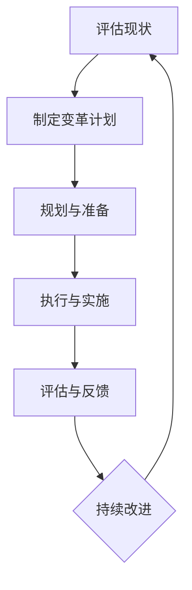

                 

### 《变革管理：引导组织转型的技巧》

> **关键词**：（变革管理、组织转型、领导角色、沟通技巧、团队建设、案例研究）

**摘要**：
本文旨在探讨变革管理的核心概念、理论基础、实施方法以及关键技能，以引导组织实现成功的转型。文章分为四个部分：第一部分介绍变革管理的核心概念和理论基础；第二部分详细阐述变革管理的过程和方法；第三部分关注变革管理中的关键技能；第四部分通过实际案例展示变革管理的成功实践。本文旨在为管理者提供实用的变革管理指南，帮助他们在快速变化的环境中引领组织走向成功。

### 《变革管理：引导组织转型的技巧》目录大纲

#### 第一部分：变革管理的理论基础

## 第1章：变革管理的核心概念

### 1.1 变革管理的定义

### 1.2 变革管理的背景和重要性

### 1.3 变革管理的基本原则

## 第2章：组织变革的理论框架

### 2.1 变革的类型

### 2.2 变革模型概览

### 2.3 变革的驱动力与阻力分析

## 第3章：变革管理中的领导角色

### 3.1 领导者在变革管理中的职责

### 3.2 变革领导力模型

### 3.3 变革中的领导风格与策略

#### 第二部分：变革管理的过程与方法

## 第4章：规划与准备阶段

### 4.1 变革的可行性分析

### 4.2 制定变革计划

### 4.3 变革动员与沟通策略

## 第5章：执行与实施阶段

### 5.1 变革的实施策略

### 5.2 变革过程中的监控与调整

### 5.3 变革中的风险管理

## 第6章：变革的评估与反馈

### 6.1 变革效果的评估指标

### 6.2 变革后的反馈收集与分析

### 6.3 持续改进的策略

#### 第三部分：变革管理中的关键技能

## 第7章：变革管理中的沟通技巧

### 7.1 有效沟通的重要性

### 7.2 沟通障碍与解决方法

### 7.3 变革中的沟通策略

## 第8章：变革管理中的团队建设

### 8.1 团队建设在变革管理中的作用

### 8.2 团队发展的阶段

### 8.3 提升团队协作的技巧

## 第9章：变革管理中的领导力发展

### 9.1 领导力的发展路径

### 9.2 变革中的领导力挑战

### 9.3 领导力提升的方法与实践

#### 第四部分：变革管理的案例研究

## 第10章：成功变革管理案例

### 10.1 案例一：苹果公司的转型之路

### 10.2 案例二：谷歌的敏捷变革

### 10.3 案例三：丰田的精益变革

## 第11章：变革管理中的挑战与对策

### 11.1 变革失败的常见原因

### 11.2 应对变革阻力的策略

### 11.3 持续变革的组织文化构建

#### 附录

## 附录A：变革管理工具与方法

### A.1 SWOT分析

### A.2 五力模型

### A.3 变革管理流程图

## 附录B：变革管理资源与参考书籍

### B.1 顶级变革管理资源网站

### B.2 推荐的变革管理相关书籍

### **第1章：变革管理的核心概念**

变革管理，是一个在组织管理中至关重要的概念，它涉及到如何引导组织成功地实现变革，以应对外部环境的快速变化和内部发展的需求。为了更好地理解变革管理的核心概念，我们将从定义、背景和重要性，以及基本原则三个方面进行探讨。

#### **1.1 变革管理的定义**

变革管理可以被定义为“引导组织变革的过程，确保变革能够被组织中的个体所接受和实施。”这一过程不仅仅关注变革本身，更关注变革如何在不同层面上影响组织的运作。

首先，从战略层面来看，变革管理涉及组织的愿景、使命和目标的调整，以适应市场的变化和客户需求。其次，从结构层面来看，变革管理包括组织结构、流程和职责的重新设计，以提高组织的效率和响应速度。最后，从文化层面来看，变革管理关注组织价值观和行为规范的变化，以增强组织的凝聚力和创新能力。

变革管理的过程通常包括以下几个关键步骤：规划与准备、执行与实施、评估与反馈。在规划与准备阶段，组织需要明确变革的目标和范围，制定详细的变革计划，并进行可行性分析。在执行与实施阶段，组织需要动员员工参与变革，实施变革计划，并对变革过程进行监控和调整。在评估与反馈阶段，组织需要评估变革的效果，收集员工的反馈，并制定持续改进的策略。

#### **1.2 变革管理的背景和重要性**

在当今全球化和信息化的背景下，组织面临着前所未有的变革压力。外部环境的变化，如市场波动、技术进步、政策调整等，要求组织不断调整自己的战略和结构，以保持竞争力。内部发展的需求，如提升效率、提高创新能力、满足员工需求等，也促使组织进行变革。

首先，从外部环境的变化来看，全球化使得市场竞争日益激烈，消费者需求快速变化，新技术不断涌现，这要求组织必须具备快速响应变化的能力。其次，从内部发展的需求来看，组织需要通过变革来提升自身的运营效率，降低成本，提高员工的工作满意度，从而实现可持续发展。

变革管理的重要性体现在以下几个方面：

1. **提升组织的竞争力**：通过变革管理，组织可以更好地适应外部环境的变化，提高市场竞争力。

2. **提高员工的参与度**：变革管理强调员工的参与和沟通，可以增强员工对组织的认同感和归属感，提高员工的工作积极性。

3. **确保变革的顺利进行**：变革管理通过系统化的规划和实施，可以降低变革过程中的风险和阻力，确保变革的顺利进行。

4. **持续改进**：变革管理不仅关注一次性的变革，更关注变革后的持续改进，以实现组织的长期发展。

#### **1.3 变革管理的基本原则**

为了确保变革管理的有效性，组织需要遵循以下几个基本原则：

1. **明确目标**：变革的目标应该是明确、具体和可测量的，以指导变革的整个过程。

2. **领导先行**：领导者需要率先接受和推动变革，发挥示范作用，同时建立与员工的信任关系。

3. **全员参与**：变革不仅仅是管理层的责任，全体员工都需要参与其中，共同推动变革。

4. **持续沟通**：通过持续的沟通，确保员工理解变革的必要性和意义，降低变革的阻力。

5. **逐步实施**：变革需要逐步推进，避免一步到位，给员工足够的时间和空间适应变革。

通过上述核心概念的阐述，我们可以看出，变革管理是一个复杂但必要的过程，它涉及到组织的多个层面，需要领导者、员工以及整个组织的共同努力。在接下来的章节中，我们将进一步探讨变革管理的理论框架、过程和方法，以及变革管理中的关键技能，帮助读者深入理解变革管理的本质和实施技巧。

### **第1章：变革管理的核心概念**

#### **1.1 变革管理的定义**

变革管理，即引导组织变革的过程，确保变革能够被组织中的个体所接受和实施。它不仅关注变革本身，还涉及变革如何在不同层面上影响组织的运作。具体来说，变革管理包括以下几个方面：

1. **战略层面**：涉及组织的愿景、使命和目标的调整，以适应市场的变化和客户需求。这包括重新评估和定义组织的核心价值、竞争优势以及长远发展方向。

2. **结构层面**：包括组织结构、流程和职责的重新设计，以提高组织的效率和响应速度。这可能涉及到部门重组、工作流程优化、角色分配等。

3. **文化层面**：涉及组织价值观和行为规范的变化，以增强组织的凝聚力和创新能力。这包括培养员工的新思维模式、工作习惯和价值观念，促进组织文化的变革。

变革管理的过程通常包括以下几个关键步骤：

1. **规划与准备**：在这一阶段，组织需要明确变革的目标和范围，制定详细的变革计划，并进行可行性分析。这包括评估当前状态、确定变革需求、设定变革目标、制定策略和时间表等。

2. **执行与实施**：在执行阶段，组织需要动员员工参与变革，实施变革计划，并对变革过程进行监控和调整。这包括沟通策略、培训计划、变革动员、实际变革操作等。

3. **评估与反馈**：在评估与反馈阶段，组织需要评估变革的效果，收集员工的反馈，并制定持续改进的策略。这包括设定评估指标、分析变革效果、收集反馈、调整改进计划等。

4. **持续改进**：变革管理不仅关注一次性的变革，更关注变革后的持续改进，以实现组织的长期发展。这包括建立持续改进的机制、鼓励创新、定期评估和调整等。

通过上述关键步骤，变革管理可以确保组织在变化的环境中保持竞争力，实现持续发展和增长。变革管理的成功不仅取决于领导者的决策和执行，还需要全体员工的积极参与和支持。

#### **1.2 变革管理的背景和重要性**

在当今全球化和信息化的背景下，组织面临着前所未有的变革压力。外部环境的变化，如市场波动、技术进步、政策调整等，要求组织不断调整自己的战略和结构，以保持竞争力。内部发展的需求，如提升效率、提高创新能力、满足员工需求等，也促使组织进行变革。

首先，从外部环境的变化来看，全球化使得市场竞争日益激烈，消费者需求快速变化，新技术不断涌现，这要求组织必须具备快速响应变化的能力。例如，互联网和电子商务的兴起改变了传统的零售模式，许多企业不得不迅速调整自己的战略和运营方式，以适应这一新的市场环境。

其次，从内部发展的需求来看，组织需要通过变革来提升自身的运营效率，降低成本，提高员工的工作满意度，从而实现可持续发展。例如，随着技术的发展，自动化和人工智能的应用越来越广泛，许多企业需要通过变革来引入新技术，提高生产效率和产品质量。

变革管理的重要性体现在以下几个方面：

1. **提升组织的竞争力**：通过变革管理，组织可以更好地适应外部环境的变化，提高市场竞争力。例如，通过变革管理，企业可以优化产品和服务，提升客户满意度，从而在激烈的市场竞争中脱颖而出。

2. **提高员工的参与度**：变革管理强调员工的参与和沟通，可以增强员工对组织的认同感和归属感，提高员工的工作积极性。例如，通过参与变革过程，员工可以更好地理解组织的愿景和目标，从而更加积极地投身于工作中。

3. **确保变革的顺利进行**：变革管理通过系统化的规划和实施，可以降低变革过程中的风险和阻力，确保变革的顺利进行。例如，通过详细的规划和沟通，可以减少变革过程中的误解和冲突，确保变革计划的顺利执行。

4. **持续改进**：变革管理不仅关注一次性的变革，更关注变革后的持续改进，以实现组织的长期发展。例如，通过持续改进机制，企业可以不断优化自己的产品和服务，提高生产效率和产品质量。

总之，变革管理在当今环境中具有重要的战略意义，它是组织实现可持续发展、提升竞争力的关键。通过有效的变革管理，组织可以在快速变化的环境中保持竞争优势，实现长期成功。

#### **1.3 变革管理的基本原则**

为了确保变革管理的有效性，组织需要遵循以下几个基本原则：

1. **明确目标**：变革的目标应该是明确、具体和可测量的，以指导变革的整个过程。明确的目标有助于组织集中资源和精力，确保变革的顺利进行。例如，组织可以设定具体的绩效指标，如市场份额提升、客户满意度提高等，作为变革的目标。

2. **领导先行**：领导者需要率先接受和推动变革，发挥示范作用，同时建立与员工的信任关系。领导者的支持是变革成功的关键，他们的积极参与可以增强员工对变革的信心和认同感。例如，领导者可以通过公开演讲、会议讨论等方式，传达变革的愿景和目标，激发员工的参与热情。

3. **全员参与**：变革不仅仅是管理层的责任，全体员工都需要参与其中，共同推动变革。全员参与可以确保变革的广泛性和深度，提高变革的接受度和执行力。例如，组织可以通过员工会议、培训、工作坊等方式，鼓励员工提出建议和反馈，共同参与变革过程。

4. **持续沟通**：通过持续的沟通，确保员工理解变革的必要性和意义，降低变革的阻力。沟通是变革管理的重要手段，它可以帮助员工了解变革的计划和进展，减少误解和焦虑。例如，组织可以通过定期召开沟通会议、发布内部通讯、设置反馈渠道等方式，与员工保持密切沟通。

5. **逐步实施**：变革需要逐步推进，避免一步到位，给员工足够的时间和空间适应变革。逐步实施可以减少变革对日常运营的干扰，降低员工的心理压力。例如，组织可以在变革初期先进行试点项目，收集反馈并进行调整，逐步推广到整个组织。

6. **风险管理**：在变革过程中，需要对潜在的风险进行识别和管理，确保变革的顺利进行。风险管理包括评估风险的可能性、制定应对策略、监控风险的变化等。例如，组织可以通过风险评估矩阵，对潜在的风险进行优先级排序，并制定相应的应对措施。

7. **评估与反馈**：在变革过程中，需要定期评估变革的效果，收集员工的反馈，并根据反馈进行调整。评估与反馈可以帮助组织了解变革的实际效果，发现存在的问题，及时进行改进。例如，组织可以通过定期的绩效评估、员工调查等方式，评估变革的效果，并根据反馈进行改进。

8. **持续改进**：变革管理是一个持续的过程，它需要组织不断地评估和改进。通过持续改进，组织可以不断优化自己的变革策略和实施方法，提高变革的成功率。例如，组织可以建立持续改进的机制，鼓励员工提出改进建议，并制定具体的行动计划。

总之，变革管理的基本原则是确保变革的有效性和持续性，它需要组织在战略规划、领导力建设、员工参与、沟通策略、风险管理、评估与反馈等方面进行全面的考虑和实施。通过遵循这些基本原则，组织可以更好地应对外部环境的挑战，实现长期的发展和成功。

### **第2章：组织变革的理论框架**

组织变革是一个复杂且动态的过程，涉及到组织结构、文化、流程等多个方面的调整。为了更好地理解和实施组织变革，我们需要借助一些理论框架来指导我们的实践。本章将介绍几种常见的组织变革理论框架，包括变革的类型、变革模型以及变革的驱动力与阻力。

#### **2.1 变革的类型**

组织变革可以分为多种类型，每种类型都有其特定的目标和影响。以下是几种常见的变革类型：

1. **结构性变革**：这种变革主要涉及组织结构、职责和权力的调整。例如，部门重组、岗位调整、合并或拆分部门等。结构性变革旨在提高组织的效率、灵活性和响应能力。

2. **技术变革**：技术变革涉及组织采用新的技术、工具和方法，以提高生产效率、降低成本和提升产品质量。例如，自动化、信息化和数字化等。技术变革通常与工作流程、操作方法和员工技能的提升相关。

3. **文化变革**：文化变革是指改变组织的价值观、信仰、行为规范和工作方式。文化变革旨在培育创新、协作和积极的工作氛围。例如，建立开放沟通、鼓励创新、强化团队合作等。

4. **战略变革**：战略变革是指调整组织的战略方向、目标和业务模式。战略变革可能涉及市场定位、产品开发、业务扩展或收缩等。战略变革旨在帮助组织适应外部环境的变化，实现长期发展目标。

5. **流程变革**：流程变革是指优化和改进组织的工作流程和操作方法，以提高效率和效果。例如，采用精益管理、六西格玛等管理方法，改进生产流程、服务流程等。

#### **2.2 变革模型概览**

在组织变革的实践中，有许多模型和理论可以指导我们。以下是几种常见的变革模型：

1. **Kotter模型**：约翰·科特（John Kotter）提出的变革模型包括八个阶段，分别是：
   - 建立紧迫感
   - 形成领导团队
   - 制定愿景和策略
   - 沟通愿景
   - 激励和参与
   - 短期突破
   - 建立持续机制
   - 文化变革

   这个模型强调领导者在变革过程中的关键作用，以及建立愿景和激励机制的重要性。

2. **Logan和Moore模型**：詹姆斯·R.洛根（James R. Logan）和迈克尔·A.摩尔（Michael A. Moore）提出的模型将变革过程分为两个阶段：
   - 释放（Release）
   - 创造（Create）

   释放阶段涉及消除阻碍变革的障碍，如旧有流程、组织结构等；创造阶段涉及设计新的流程、文化、价值观等，以实现变革。

3. **Rogers模型**：埃弗雷特·M.罗杰斯（Everett M. Rogers）提出的模型基于变革的接受过程，包括五个阶段：
   - 知晓（Knowledge）
   - 兴趣（Interest）
   - 评估（Evaluation）
   - 尝试（Trial）
   - 采纳（Adoption）

   这个模型强调变革接受者的行为和心理过程，对于理解员工如何接受变革具有重要指导意义。

4. **Lewin模型**：库尔特·卢因（Kurt Lewin）提出的模型将变革过程分为三个阶段：
   - 解冻（Unfreezing）
   - 改变（Change）
   - 冻结（Freezing）

   解冻阶段涉及打破旧有的思维和行为模式；改变阶段涉及引入新的思维和行为模式；冻结阶段涉及巩固变革成果，防止回归旧有模式。

#### **2.3 变革的驱动力与阻力分析**

组织变革的驱动力和阻力是影响变革成功与否的重要因素。以下是对这些因素的详细分析：

1. **驱动力**：

   - **外部环境的变化**：如市场变化、技术进步、政策调整等，迫使组织进行变革以适应外部环境。

   - **内部需求**：如提升效率、提高创新能力、满足员工需求等，组织内部对变革的期望和需求。

   - **领导层的决策**：领导者对变革的重视和推动是变革成功的关键因素。

   - **技术进步**：新技术的发展和应用可以推动组织进行技术变革，提高生产效率和质量。

   - **员工参与**：员工的积极性和参与度是推动变革的重要力量。

2. **阻力**：

   - **习惯性思维**：员工对现状的依赖和舒适感，可能导致对变革的抵触。

   - **恐惧与不确定**：对未知的恐惧和对变革可能带来负面影响的担忧，是变革过程中的主要阻力。

   - **资源限制**：如时间、资金、人力资源等资源的限制，可能影响变革的顺利进行。

   - **利益相关者的反对**：如管理层、员工、客户等利益相关者对变革的反对，可能影响变革的推进。

   - **沟通不畅**：变革过程中信息传递不畅，可能导致误解和冲突，增加变革的阻力。

为了有效应对这些驱动力和阻力，组织需要制定全面的变革计划，明确变革的目标和策略，建立有效的沟通机制，提高员工的参与度和理解度，并逐步推进变革过程，确保变革的顺利进行。

### **第3章：变革管理中的领导角色**

#### **3.1 领导者在变革管理中的职责**

领导者在变革管理中扮演着至关重要的角色，他们的行为和决策直接影响变革的进程和结果。以下是领导者在变革管理中的主要职责：

1. **明确变革方向**：领导者需要明确变革的目标、愿景和策略，为变革提供明确的方向。他们需要与高层管理团队和其他关键利益相关者进行沟通，确保变革目标的一致性和可执行性。

2. **建立信任**：在变革过程中，领导者需要建立与员工的信任关系，通过沟通、透明度和诚信来减少变革的阻力。他们需要向员工传达变革的必要性和意义，并展示对员工的信心和支持。

3. **激励员工**：领导者需要激励员工接受和参与变革，提供必要的支持和资源。他们可以通过设定激励措施、认可员工的贡献和成就等方式，激发员工的积极性和创造力。

4. **处理冲突**：在变革过程中，领导者需要处理各种冲突和问题，确保变革的顺利进行。他们需要具备良好的沟通和冲突解决技能，能够冷静、客观地分析和解决矛盾。

5. **提供指导和支持**：领导者需要为员工提供指导和支持，帮助他们适应变革。他们可以组织培训、研讨会和工作坊等活动，提高员工的技能和知识水平。

6. **监控变革进程**：领导者需要持续监控变革的进程和效果，确保变革计划按计划进行。他们需要及时识别和解决潜在的问题，并根据实际情况进行调整。

7. **评估变革效果**：变革完成后，领导者需要评估变革的效果，收集员工的反馈，并根据反馈进行持续改进。他们需要确保变革目标达成，并为组织带来实际的改进。

#### **3.2 变革领导力模型**

变革领导力是一种特殊的领导能力，它涉及到领导者如何应对变革、引导变革和推动变革。以下是几种常见的变革领导力模型：

1. **愿景领导力**：领导者通过明确和传达组织愿景，激励员工为实现愿景而努力。愿景领导力强调领导者需要具备远见和洞察力，能够看到变革后的美好前景。

2. **变革领导力**：领导者需要具备推动变革的能力，能够激发和引导团队共同参与变革。变革领导力强调领导者需要具备执行力、适应性和灵活性，能够应对变革中的各种挑战和不确定性。

3. **关系领导力**：领导者通过建立良好的人际关系和信任，促进变革的顺利进行。关系领导力强调领导者需要具备良好的沟通和人际交往技能，能够与员工建立信任和合作关系。

4. **变革管理技能**：领导者需要具备变革管理的技能，包括计划与组织、沟通与协调、冲突解决、风险评估和反馈等。这些技能有助于领导者有效地应对变革过程中的各种问题。

5. **学习领导力**：领导者需要具备持续学习和自我提升的能力，以适应快速变化的环境。学习领导力强调领导者需要不断学习新知识、新技能和新方法，并将其应用于实际工作中。

6. **变革型领导**：变革型领导通过激发员工的内在动力，引导员工参与变革，实现组织的转型。变革型领导强调领导者需要具备激励、启发和变革能力，能够推动组织实现根本性的变革。

#### **3.3 变革中的领导风格与策略**

在变革过程中，领导者的风格和策略对变革的成功与否具有重要影响。以下是几种常见的领导风格和策略：

1. **授权型领导**：授权型领导通过授权给员工，激发员工的积极性和创造力，推动变革。授权型领导强调领导者需要信任员工，赋予员工自主权和决策权，鼓励员工提出创新和建议。

2. **变革型领导**：变革型领导通过激发员工的内在动力，引导员工参与变革，实现组织的转型。变革型领导强调领导者需要具备愿景和激情，能够激发员工的认同感和使命感。

3. **参与式领导**：参与式领导通过鼓励员工参与决策和变革过程，增强员工的参与感和归属感。参与式领导强调领导者需要建立开放的沟通机制，鼓励员工提出意见和建议。

4. **变革策略**：领导者需要制定具体的变革策略，包括明确变革目标、制定行动计划、建立激励机制等。变革策略强调领导者需要制定详细的变革计划，确保变革的有序进行。

5. **沟通策略**：领导者需要建立有效的沟通机制，确保员工理解变革的必要性和意义。沟通策略强调领导者需要采用多种沟通方式，如会议、邮件、内部社交媒体等，确保信息传递的及时性和准确性。

6. **反馈与支持**：领导者需要提供及时的反馈和支持，帮助员工克服变革中的困难和挑战。反馈与支持强调领导者需要关注员工的反馈和需求，提供必要的培训和资源。

总之，领导者在变革管理中的角色和职责至关重要。他们需要通过明确的变革方向、建立信任、激励员工、处理冲突等方式，引导组织成功地实现变革。同时，领导者需要采用适当的领导风格和策略，确保变革的顺利进行和成功实施。

### **第4章：规划与准备阶段**

#### **4.1 变革的可行性分析**

在组织变革的初期，进行可行性分析是至关重要的一步。这一过程涉及对组织的当前状态进行深入分析，评估变革的必要性和可能性，以确保变革计划具有实际意义和可行性。

首先，我们需要对组织的当前状态进行全面评估。这包括以下几个方面：

1. **业务现状**：分析组织的业务流程、运营效率、市场份额等，了解组织的整体表现和存在的问题。
2. **技术现状**：评估组织现有的技术水平和设备状况，确定是否需要引入新技术或改进现有技术。
3. **人员现状**：分析组织的人力资源状况，包括员工的技能水平、工作经验、工作态度等，了解员工是否具备适应变革的能力。
4. **文化现状**：评估组织的文化氛围，包括价值观、行为规范、沟通方式等，了解文化是否支持变革。

其次，我们需要评估变革的必要性。这包括以下几个方面：

1. **外部环境变化**：分析市场趋势、竞争环境、政策法规等外部因素，了解外部环境是否对组织提出了变革的需求。
2. **内部发展需求**：分析组织内部对效率、创新、改进等方面的需求，了解内部是否需要通过变革来提升竞争力。
3. **变革目标**：明确组织希望通过变革实现的具体目标和预期成果，如提升市场份额、提高运营效率、增强员工满意度等。

然后，我们需要评估变革的可能性。这包括以下几个方面：

1. **资源可用性**：分析组织是否有足够的资源（如时间、资金、人力资源等）来支持变革的实施。
2. **变革阻力**：评估组织内部可能存在的变革阻力，如员工抵触、利益相关者的反对、资源限制等。
3. **变革成本**：评估变革的实施成本，包括直接成本（如培训、技术引入等）和间接成本（如变革过程中的运营风险等）。

最后，我们根据评估结果制定具体的变革计划。这包括以下几个方面：

1. **确定变革目标**：根据评估结果，明确变革的具体目标和预期成果。
2. **制定变革策略**：根据组织的实际情况，制定具体的变革策略和行动计划。
3. **确定变革范围**：明确变革的影响范围，包括哪些部门、哪些流程、哪些人员将受到影响。
4. **制定时间表**：制定详细的变革时间表，明确各阶段的起止时间和关键节点。

通过上述步骤，组织可以确保变革计划的可行性和有效性，为后续的变革实施打下坚实的基础。

#### **4.2 制定变革计划**

在完成了可行性分析后，下一步就是制定具体的变革计划。一个详细的、具有可操作性的变革计划是确保变革成功实施的关键。以下是制定变革计划的主要步骤：

1. **明确变革目标**：
   - **目标设定**：首先，组织需要明确变革的具体目标和预期成果。这些目标应该具体、明确且可衡量，以便在后续过程中进行评估。
   - **目标分解**：将总目标分解为具体的子目标和行动项，以便更具体地指导变革的实施。

2. **制定变革策略**：
   - **策略选择**：根据组织的实际情况和评估结果，选择最适合的变革策略。常见的变革策略包括渐进式变革、激进式变革、文化变革等。
   - **策略细化**：对选定的变革策略进行细化，包括具体的实施步骤、所需资源、负责部门等。

3. **确定变革范围**：
   - **范围界定**：明确变革的影响范围，包括哪些部门、哪些流程、哪些人员将受到影响。确保所有相关方都清楚变革的范围和内容。
   - **资源评估**：评估变革所需的各种资源，包括人力资源、资金、技术等，确保资源充足且合理分配。

4. **制定时间表**：
   - **阶段划分**：将变革过程划分为不同的阶段，如规划阶段、实施阶段、评估阶段等，确保每个阶段都有明确的时间节点和目标。
   - **时间节点**：为每个阶段设定具体的时间节点，包括开始时间、结束时间以及关键任务的时间节点。

5. **风险评估与应对**：
   - **风险识别**：识别变革过程中可能遇到的风险，如员工抵触、资源不足、技术问题等。
   - **风险应对**：为每个风险制定相应的应对策略，包括风险预防措施、应急计划等，确保风险在可控范围内。

6. **沟通与动员**：
   - **沟通计划**：制定详细的沟通计划，包括沟通内容、沟通方式、沟通对象等，确保员工和其他利益相关者了解变革的进展和目标。
   - **动员策略**：制定动员策略，通过内部会议、培训、宣传等方式，激发员工的积极性和参与度。

7. **培训与支持**：
   - **培训计划**：为员工提供必要的培训，包括新技能、新流程、新工具等，确保员工具备实施变革的能力。
   - **支持措施**：提供必要的支持和资源，如技术支持、心理支持等，帮助员工克服变革中的困难和挑战。

8. **持续改进**：
   - **评估机制**：建立持续评估机制，定期评估变革的效果，收集员工的反馈，并根据反馈进行调整。
   - **改进策略**：根据评估结果，制定持续改进的策略，确保变革的长期效果。

通过上述步骤，组织可以制定出一个全面、详细的变革计划，为变革的实施提供明确的指导和保障。

#### **4.3 变革动员与沟通策略**

在变革管理过程中，变革动员和沟通策略是确保变革顺利推进和成功实施的关键。有效的动员和沟通可以降低变革的阻力，增强员工的参与感和认同感，从而提高变革的成功率。

**1. 内部动员策略**

- **高层领导的支持**：高层领导需要率先支持变革，通过公开演讲、会议发言等方式，表达对变革的坚定信念和支持，为变革树立榜样。
- **员工参与**：鼓励员工积极参与变革，可以通过员工会议、小组讨论、工作坊等形式，让员工了解变革的背景、目标和实施计划，增强员工的参与感和责任感。
- **宣传材料**：制作宣传海报、手册、视频等材料，通过公司的内部网站、电子邮件、内部通讯等渠道，向员工传达变革的信息，提高员工的关注度和理解度。
- **激励机制**：为积极参与变革的员工提供奖励和激励措施，如奖金、晋升机会等，激发员工的积极性。

**2. 沟通策略**

- **透明沟通**：确保变革信息透明，通过定期的沟通会议、内部培训、问卷调查等方式，向员工传达变革的进展和成果，让员工了解变革的实际效果。
- **多渠道沟通**：利用多种沟通渠道，如面对面沟通、电子邮件、内部社交媒体、电话会议等，确保员工能够方便地获取变革信息，并有机会提问和反馈。
- **个性化沟通**：针对不同部门和员工的特性，采用个性化的沟通策略。对于关键员工和领导层，可以采用一对一沟通或专门的小组讨论，确保沟通的深度和效果。
- **反馈机制**：建立有效的反馈机制，鼓励员工提出意见和建议，通过定期的反馈会议或反馈表单，收集员工的反馈，并进行分析和改进。

**3. 沟通障碍与解决方法**

- **信息不对称**：解决方法：通过定期的沟通会议和信息公开，确保员工能够获取到全面、准确的信息。
- **文化差异**：解决方法：加强文化融合和沟通技巧的培训，提高员工的沟通能力，促进跨部门的合作。
- **沟通渠道不畅**：解决方法：优化沟通渠道，建立多种沟通方式，确保信息的传递及时、准确。

通过上述动员和沟通策略，组织可以有效地激发员工的积极性，增强员工对变革的理解和认同，从而确保变革的顺利推进和成功实施。

### **第5章：执行与实施阶段**

#### **5.1 变革的实施策略**

在变革的执行与实施阶段，制定合适的实施策略至关重要。这一阶段的目标是将变革计划转化为实际操作，确保变革能够在组织中顺利落地并产生预期效果。以下是几种常见的实施策略：

1. **逐步推进**：逐步推进策略是将变革计划分解为多个小步骤，逐步实施。这种方法有助于减少变革对日常运营的冲击，让员工有足够的时间适应变化。例如，可以先从某一部门或团队开始试点，成功后再逐步推广到整个组织。

2. **重点突破**：重点突破策略是在变革过程中确定关键节点和关键领域，优先突破。这种方法有助于集中资源和精力，确保变革的关键部分能够顺利实施。例如，可以优先改进最影响效率的流程或引入最急需的技术。

3. **全员参与**：全员参与策略是通过鼓励员工参与变革过程，提高变革的接受度和执行力。这种方法有助于建立员工的归属感和责任感，从而推动变革的顺利进行。例如，可以通过员工会议、小组讨论、工作坊等形式，让员工参与到变革的讨论和决策中。

4. **试点项目**：试点项目策略是在组织内部选择一个或多个部门作为试点，进行变革的试验。这种方法有助于在实际操作中检验变革方案的有效性和可行性，为全面推广提供参考。例如，可以选取一个部门进行流程再造试点，成功后再推广到其他部门。

5. **领导带头**：领导带头策略是要求领导者率先接受和推动变革，通过领导者的示范作用，激励员工积极参与变革。这种方法有助于建立变革的权威性和可信度，从而提高变革的执行力。例如，领导者可以亲自参与变革的执行，为员工树立榜样。

6. **激励机制**：激励机制策略是通过奖励和激励措施，鼓励员工积极参与变革。这种方法有助于提高员工的积极性和主动性，从而推动变革的顺利进行。例如，可以设立变革奖励基金，对在变革中表现突出的员工进行表彰和奖励。

#### **5.2 变革过程中的监控与调整**

在变革的执行过程中，对变革进行持续的监控与调整是确保变革按计划进行的重要措施。以下是如何进行监控与调整的几个关键步骤：

1. **设定监控指标**：首先，组织需要设定具体的监控指标，如项目进度、员工参与度、变革效果等。这些指标应与变革目标紧密相关，能够量化评估变革的进展和效果。

2. **建立监控机制**：建立监控机制，包括定期检查、报告和评估等。可以通过定期召开会议、发布进展报告、进行现场检查等方式，确保变革过程的透明度和可控性。

3. **反馈机制**：建立有效的反馈机制，鼓励员工提出意见和建议。可以通过员工调查、意见箱、定期反馈会议等方式，收集员工的反馈，并及时进行回应和调整。

4. **问题解决**：在监控过程中，如发现任何问题或偏差，应立即采取措施进行解决。可以设立问题解决小组，对发现的问题进行分析和讨论，制定解决方案，并迅速实施。

5. **调整策略**：根据监控结果和反馈，对变革策略进行调整。如果发现原计划存在问题或不足，应灵活调整计划，确保变革能够按预期进行。

6. **持续改进**：变革不是一次性的活动，而是一个持续的过程。在变革过程中，应不断总结经验教训，对变革方法进行优化和改进，以确保变革的长期效果。

通过上述监控与调整措施，组织可以确保变革过程中的问题能够及时得到解决，策略能够根据实际情况进行调整，从而提高变革的执行力和成功率。

#### **5.3 变革中的风险管理**

在变革过程中，风险管理是确保变革顺利实施和成功完成的关键。以下是如何进行风险管理的几个关键步骤：

1. **风险评估**：首先，组织需要对变革过程中可能出现的风险进行全面评估。这包括识别潜在的风险因素，如技术风险、人员风险、资源风险等。可以通过风险识别会议、风险评估问卷等方式，收集和分析相关信息。

2. **风险分类**：将识别出的风险进行分类，如按照风险的性质、影响的范围、发生的可能性等分类。这有助于组织集中资源和精力，优先应对关键风险。

3. **风险优先级排序**：根据风险的影响程度和发生概率，对风险进行优先级排序。可以将风险分为高、中、低三个等级，确保组织能够优先关注和应对高优先级风险。

4. **风险控制措施**：制定相应的风险控制措施，以降低风险发生的概率和影响。例如，对于技术风险，可以提前进行技术验证和测试；对于人员风险，可以提供培训和支持；对于资源风险，可以提前进行资源规划和调配。

5. **应急预案**：制定应急预案，以应对可能出现的突发事件。应急预案应包括应急响应步骤、责任人、资源分配等，确保在风险发生时能够迅速、有效地应对。

6. **风险监控**：对风险进行持续监控，及时发现新的风险或现有风险的变化。可以通过定期风险检查、风险报告等方式，确保风险在可控范围内。

7. **反馈与改进**：根据风险监控的结果，及时调整风险控制措施和应急预案。通过不断总结经验教训，优化风险管理流程，提高组织的风险管理能力。

通过上述风险管理措施，组织可以降低变革过程中的风险，确保变革的顺利进行和成功完成。

### **第6章：变革的评估与反馈**

#### **6.1 变革效果的评估指标**

在变革完成后，对变革效果进行评估是确保变革成功的重要步骤。评估指标的选择和设定直接影响评估结果的有效性和可靠性。以下是一些常用的评估指标：

1. **目标达成度**：这是评估变革目标实现程度的关键指标。可以通过比较实际结果与预定目标，计算目标达成率。目标达成度可以量化变革的效果，为后续的改进提供依据。

2. **员工满意度**：员工满意度是评估变革接受度和效果的重要指标。可以通过员工调查问卷、访谈等方式，收集员工对变革的反馈和评价。高满意度表明变革得到了员工的认同和支持，有利于变革的持续。

3. **组织绩效**：组织绩效是评估变革对组织整体表现影响的关键指标。可以通过财务指标（如盈利能力、市场份额）、运营指标（如生产效率、服务质量）等来衡量。组织绩效的提升表明变革达到了预期效果。

4. **流程改进**：流程改进是评估变革对组织运营效率影响的指标。可以通过流程分析、时间节约、成本降低等指标来衡量。流程改进的成效可以直观反映变革对组织运营的积极影响。

5. **员工技能提升**：员工技能提升是评估变革对员工能力发展的影响。可以通过培训记录、技能评估等方式，衡量员工在变革过程中技能的提升程度。员工技能的提升有助于提高组织整体竞争力。

6. **客户满意度**：客户满意度是评估变革对客户体验影响的指标。可以通过客户调查、反馈等方式，了解客户对变革前后服务质量的评价。高客户满意度表明变革得到了客户认可，有利于组织的长期发展。

#### **6.2 变革后的反馈收集与分析**

收集变革后的反馈是了解变革实际效果和员工感受的重要环节。以下是如何进行反馈收集与分析的几个关键步骤：

1. **确定反馈渠道**：首先，组织需要确定反馈渠道，如员工调查问卷、意见箱、内部会议、一对一访谈等。多种反馈渠道可以确保反馈信息的全面性和准确性。

2. **设计反馈问卷**：设计详细的反馈问卷，包括变革过程中的各个方面，如变革目标、沟通策略、变革实施过程、员工参与度等。问卷应简洁明了，避免复杂的问题，以便员工能够轻松作答。

3. **进行反馈收集**：通过多种渠道广泛收集员工的反馈。可以组织员工填写问卷、召开反馈会议、设立意见箱等方式，确保员工有机会表达自己的意见和建议。

4. **整理与分析反馈**：对收集到的反馈进行整理和分析，识别出变革中的优点和不足。可以通过数据统计、主题分析等方式，归纳反馈的主要内容和关键点。

5. **反馈汇报**：将分析结果向管理层和全体员工进行汇报，明确变革的成效和存在的问题。反馈汇报应包括定量数据和定性分析，以便全面展示变革的实际效果。

6. **反馈应用**：根据反馈结果，制定具体的改进措施，对变革过程中存在的问题进行优化和改进。通过持续改进，确保变革能够达到预期效果。

通过上述反馈收集与分析步骤，组织可以更好地了解变革的实际效果和员工感受，为后续的改进提供有力支持。

#### **6.3 持续改进的策略**

持续改进是确保变革效果长期持续的重要策略。以下是如何实施持续改进的几个关键步骤：

1. **建立持续改进机制**：首先，组织需要建立持续改进的机制，确保变革后的效果能够持续提升。可以设立专门的改进小组或委员会，负责持续改进的工作。

2. **定期评估与反馈**：定期对变革效果进行评估和反馈，通过定量和定性的方法，全面了解变革的实际效果。可以设立定期评估会议，邀请关键利益相关者参与，确保评估的全面性和客观性。

3. **制定改进计划**：根据评估结果，制定具体的改进计划，明确改进的目标、策略、时间表和责任人。改进计划应具有可操作性和实施性，确保能够落实到实际行动中。

4. **实施改进措施**：按照改进计划，实施具体的改进措施。可以设立项目小组，负责改进措施的执行和监控，确保改进措施的有效实施。

5. **跟踪改进效果**：对改进措施的实施效果进行跟踪和评估，确保改进目标的达成。可以设立定期跟踪会议，收集改进措施的实施情况和效果数据。

6. **总结经验与优化**：在改进过程中，不断总结经验教训，优化改进流程和方法。通过持续改进，提升组织的整体效能和竞争力。

7. **鼓励创新与建议**：鼓励员工提出创新的想法和建议，建立反馈机制，确保员工的参与度和积极性。通过持续的创新和改进，推动组织的长期发展。

通过上述持续改进策略，组织可以确保变革的效果能够长期持续，实现组织的持续发展和成功。

### **第7章：变革管理中的沟通技巧**

#### **7.1 有效沟通的重要性**

有效沟通在变革管理中扮演着至关重要的角色。它是确保变革顺利实施、降低变革阻力、提高变革成功率的关键因素。以下从几个方面阐述有效沟通的重要性：

1. **降低变革阻力**：变革往往伴随着不确定性，员工可能对变革持有疑虑和抵触情绪。通过有效沟通，组织可以传递变革的必要性和意义，帮助员工理解变革的重要性，从而降低变革的阻力。

2. **提高员工参与度**：有效沟通可以激发员工的参与感和责任感，使员工更加主动地参与变革过程。员工参与度越高，变革的执行力和成功率就越高。

3. **增强信任和合作关系**：通过有效沟通，组织可以建立与员工之间的信任关系，增强员工对组织的认同感和归属感。信任和合作关系有助于减少变革中的冲突和误解，提高变革的顺利进行。

4. **确保信息传递的准确性**：在变革过程中，准确的信息传递至关重要。通过有效沟通，组织可以确保信息的准确性和一致性，避免因信息误解导致的错误决策和行动。

5. **提高变革的透明度**：有效沟通可以提高变革的透明度，让员工了解变革的进展和成果。透明度有助于增强员工对变革的信心，减少不必要的焦虑和担忧。

#### **7.2 沟通障碍与解决方法**

尽管有效沟通在变革管理中至关重要，但在实际操作中，沟通障碍常常存在。以下是一些常见的沟通障碍及其解决方法：

1. **信息不对称**：解决方法：通过建立透明的沟通机制，确保信息的广泛传播和共享，减少信息不对称。

2. **文化差异**：解决方法：加强文化融合和沟通技巧的培训，提高员工的跨文化沟通能力。

3. **沟通渠道不畅**：解决方法：优化沟通渠道，建立多种沟通方式，如面对面沟通、电子邮件、内部社交媒体等。

4. **语言障碍**：解决方法：提供语言培训，鼓励使用通俗易懂的语言，避免专业术语的使用。

5. **心理障碍**：解决方法：通过心理辅导和沟通技巧培训，帮助员工克服变革中的心理障碍。

6. **时间压力**：解决方法：合理安排沟通时间，确保员工有足够的时间参与沟通和反馈。

#### **7.3 变革中的沟通策略**

为了确保变革管理中的沟通有效，组织需要制定合适的沟通策略。以下是一些常用的沟通策略：

1. **提前沟通**：在变革计划制定初期，就开始与员工进行沟通，让员工提前了解变革的计划和目标。提前沟通有助于员工做好准备，减少变革的阻力。

2. **多次沟通**：在变革过程中，多次与员工进行沟通，确保员工对变革的理解和接受。多次沟通可以及时发现和解决员工的疑问和担忧。

3. **双向沟通**：鼓励员工表达意见和建议，建立双向沟通的机制，增强员工的参与感。双向沟通有助于增强员工对变革的认同感和归属感。

4. **个性化沟通**：针对不同部门和员工的特性，采取个性化的沟通策略。个性化沟通可以确保沟通的针对性和有效性。

5. **及时反馈**：对员工的反馈及时回应，确保员工感受到自己的意见被重视。及时反馈有助于建立信任和合作关系。

6. **透明沟通**：确保变革的透明度，让员工了解变革的进展和成果。透明沟通有助于增强员工对变革的信心。

7. **激励沟通**：通过激励措施，鼓励员工积极参与变革沟通。激励沟通可以提高员工的积极性和主动性。

通过上述沟通策略，组织可以确保变革管理中的沟通有效，从而提高变革的成功率。

### **第8章：变革管理中的团队建设**

#### **8.1 团队建设在变革管理中的作用**

在变革管理过程中，团队建设起着至关重要的作用。一个高效的团队可以增强组织的凝聚力和协作能力，提高变革的执行力和成功率。以下是团队建设在变革管理中发挥的主要作用：

1. **提高团队凝聚力**：团队建设可以增强团队成员之间的信任和合作关系，提高团队的凝聚力。凝聚力高的团队在面对变革时能够更好地协同合作，共同应对挑战。

2. **提升团队协作能力**：通过团队建设，团队成员可以更好地理解彼此的角色和职责，提高协作能力和问题解决能力。协作能力强的团队可以更有效地实施变革计划，确保变革目标的实现。

3. **促进知识共享**：团队建设有助于促进团队成员之间的知识共享和经验交流。知识共享可以增强团队的创新能力和适应能力，为变革提供源源不断的动力。

4. **增强员工的归属感**：团队建设可以增强员工对组织的归属感，提高员工的工作满意度和忠诚度。归属感强的员工更愿意积极参与变革，为组织的长期发展贡献力量。

5. **降低变革阻力**：通过团队建设，可以减少员工对变革的抵触情绪，降低变革阻力。团队成员之间的良好关系和相互支持有助于缓解变革过程中的紧张和焦虑，提高变革的接受度。

#### **8.2 团队发展的阶段**

团队发展通常可以分为以下四个阶段：

1. **形成阶段**：在形成阶段，团队成员刚刚开始合作，彼此之间相对陌生。团队成员需要相互了解，建立基本的工作关系。团队领导需要提供明确的指导和支持，帮助团队快速融入。

2. **冲突阶段**：在冲突阶段，团队成员之间可能会出现分歧和冲突。这些冲突可能是由于观点不同、职责分配不均等原因引起的。团队领导需要通过有效的沟通和冲突解决策略，帮助团队克服冲突，建立共识。

3. **规范阶段**：在规范阶段，团队成员开始形成共同的价值观和行为规范，团队协作能力提升。团队成员之间建立了信任关系，能够更好地协同工作。团队领导需要维持团队的规范，鼓励团队成员积极参与。

4. **执行阶段**：在执行阶段，团队达到了最佳状态，能够高效地完成工作任务。团队成员之间高度协作，能够灵活应对各种挑战。团队领导需要提供持续的支持和反馈，确保团队的长期稳定和高效。

5. **成熟阶段**：在成熟阶段，团队已经发展到了非常高效和稳定的阶段。团队成员之间的合作和沟通达到了顶峰，能够迅速应对各种变化和挑战。团队领导需要继续关注团队的发展，提供必要的支持和资源。

#### **8.3 提升团队协作的技巧**

提升团队协作是团队建设的重要目标之一。以下是一些提升团队协作的技巧：

1. **明确目标**：团队需要明确共同的目标和愿景，确保团队成员对团队的方向和任务有清晰的理解。明确的目标有助于提高团队的协作效率和执行力。

2. **有效沟通**：建立有效的沟通机制，确保信息传递的及时性和准确性。团队成员之间需要保持开放和诚实的沟通，及时分享信息和经验。

3. **分工合作**：合理分配工作任务，确保每个成员能够发挥自己的优势。分工合作可以提高团队的效率和成果。

4. **鼓励反馈**：建立反馈机制，鼓励团队成员提出意见和建议。反馈有助于团队不断改进和优化工作流程。

5. **建立信任**：通过共同完成任务和相互支持，建立团队成员之间的信任关系。信任是高效团队的基础。

6. **提供培训**：为团队成员提供培训和学习机会，提高团队的整体能力和素质。培训可以增强团队成员的专业知识和技能。

7. **激励措施**：通过奖励和激励措施，鼓励团队成员积极参与和贡献。激励措施可以提高团队的工作积极性和创造力。

通过上述团队建设和协作技巧，组织可以培养出高效、协作的团队，从而在变革管理中取得成功。

### **第9章：变革管理中的领导力发展**

#### **9.1 领导力的发展路径**

领导力的发展是一个持续的过程，需要领导者不断地学习、成长和实践。以下是从几个方面探讨领导力的发展路径：

1. **自我认知**：领导力的发展首先需要领导者进行自我认知。领导者需要深入了解自己的优点和不足，明确自己的价值观、信念和领导风格。自我认知有助于领导者更好地理解自己，为领导力的发展奠定基础。

2. **学习与成长**：领导力的发展离不开学习和成长。领导者需要不断学习新知识、新技能和新方法，以适应快速变化的环境。学习可以来自于阅读书籍、参加培训、听取专家讲座、参与实际项目等多种途径。

3. **实践与反思**：领导力的发展需要通过实践来检验和提升。领导者需要在实际工作中运用所学知识和技能，并通过反思和总结，不断改进自己的领导方式。实践和反思是领导力成长的两个关键环节。

4. **建立人脉**：领导力的发展还需要建立广泛的人脉网络。领导者可以通过参加行业会议、社交活动、行业论坛等方式，与其他领导者建立联系和交流。建立人脉有助于领导者获取更多的资源和信息，提高自己的领导能力。

5. **获取反馈**：领导者需要主动寻求他人的反馈和建议。反馈是领导力发展的宝贵资源，可以帮助领导者了解自己的优势和不足，找到改进的方向。获取反馈可以通过定期进行员工满意度调查、一对一交流、团队反馈会议等方式。

#### **9.2 变革中的领导力挑战**

在变革过程中，领导者面临着一系列独特的领导力挑战。以下是一些常见的挑战及其应对策略：

1. **变革推动力不足**：在变革过程中，领导者需要具备足够的推动力，激发员工的积极性和参与度。如果领导者的推动力不足，可能会导致变革进展缓慢甚至失败。应对策略包括明确变革的愿景和目标，建立激励机制，提升领导者的沟通能力和影响力。

2. **员工抵触情绪**：变革往往伴随着不确定性和风险，员工可能会对变革持有抵触情绪。领导者需要通过有效沟通和信任建立，帮助员工理解变革的必要性和意义，减少抵触情绪。应对策略包括提前沟通、透明化变革过程、提供心理支持等。

3. **资源限制**：变革通常需要大量的资源和资金支持，如果资源有限，可能会影响变革的顺利进行。领导者需要制定详细的资源规划和管理策略，确保资源的合理分配和有效利用。应对策略包括优先分配关键资源、寻求外部支持等。

4. **变革过程中的冲突**：变革过程中可能会出现不同部门和团队之间的冲突，这些冲突可能会阻碍变革的推进。领导者需要具备冲突解决能力，通过有效的沟通和协调，化解冲突，确保变革的顺利进行。应对策略包括建立沟通渠道、促进跨部门合作、制定冲突解决机制等。

5. **持续改进的挑战**：变革不仅是一次性的活动，而是一个持续的过程。领导者需要确保变革后的效果能够持续改进和提升。这需要领导者具备持续改进的能力和策略，通过定期的评估和反馈，不断优化变革成果。应对策略包括建立持续改进的机制、鼓励创新和反馈等。

#### **9.3 领导力提升的方法与实践**

为了提升领导力，领导者可以采取以下几种方法和实践：

1. **参加领导力培训**：参加专业的领导力培训，学习领导力的理论和实践技巧。这些培训可以帮助领导者了解最新的领导力研究和方法，提升自身的领导能力。

2. **阅读领导力书籍**：阅读领导力相关的书籍和案例研究，学习其他领导者的成功经验和失败教训。阅读可以拓宽领导者的视野，提供新的思路和方法。

3. **实践锻炼**：通过实际工作中的领导实践，提升领导能力。领导者可以在实际工作中应用所学知识和技能，通过不断的实践和反思，逐步提升自己的领导力。

4. **寻求导师指导**：寻找经验丰富的导师，向他们请教领导力方面的问题，获取宝贵的建议和指导。导师可以提供直接的反馈和指导，帮助领导者更快地成长。

5. **建立学习社区**：与其他领导者建立学习社区，共同学习和分享领导经验。学习社区可以提供一个交流和学习的平台，帮助领导者相互支持和成长。

6. **参与实际项目**：积极参与实际项目，担任项目负责人或关键角色。通过实际项目的实践，领导者可以锻炼自己的决策能力、沟通能力和团队合作能力。

7. **寻求反馈**：定期寻求员工的反馈和建议，了解自己的优势和不足。反馈可以帮助领导者识别问题，找到改进的方向。

通过上述方法和实践，领导者可以不断提升自己的领导力，更好地应对变革中的挑战，引领组织走向成功。

### **第10章：成功变革管理案例**

#### **10.1 案例一：苹果公司的转型之路**

**背景**：苹果公司在2001年面临市场份额下降、创新乏力的问题，决定进行一系列重大变革。

**变革过程**：
1. **明确愿景**：苹果公司提出了“创造更加简单、优雅的产品”的愿景，以重新定义其产品策略。
2. **领导力建设**：史蒂夫·乔布斯回归苹果公司，成为CEO，亲自领导变革。乔布斯以其独特的领导风格和创新思维，激发团队的潜力。
3. **产品创新**：苹果公司推出了iPod、iPhone、iPad等创新产品，彻底改变了个人科技产品的市场格局。
4. **文化重塑**：苹果公司重塑企业文化，强调创新和用户体验，建立了以用户为中心的文化价值观。

**变革效果**：
- **市场份额提升**：苹果公司的市场份额大幅提升，重新成为全球最具影响力的科技公司之一。
- **品牌价值提升**：苹果公司的品牌价值得到了显著提升，成为全球知名品牌。

#### **10.2 案例二：谷歌的敏捷变革**

**背景**：谷歌在2015年面对组织结构复杂、创新速度放缓的问题，决定进行敏捷变革。

**变革过程**：
1. **明确目标**：谷歌提出了“让谷歌更加敏捷、高效”的目标，以提升组织的灵活性和响应速度。
2. **组织重构**：谷歌进行了组织重构，将原本的矩阵式结构改为更加扁平的团队结构，减少了管理层级，提高了决策效率。
3. **敏捷实践**：谷歌推行了敏捷开发方法，采用了迭代和增量的开发模式，提高了产品的迭代速度和创新能力。
4. **领导力建设**：谷歌的CEO拉里·佩奇和桑达尔·皮查伊亲自推动变革，提供领导力和支持。

**变革效果**：
- **组织效率提升**：谷歌的组织效率显著提升，创新速度加快，能够更快地推出新产品和服务。
- **员工满意度提升**：员工对工作的满意度提升，员工的创造力和主动性增强。

#### **10.3 案例三：丰田的精益变革**

**背景**：丰田公司在20世纪80年代面临生产效率低、产品质量不稳定的问题，决定进行精益变革。

**变革过程**：
1. **明确目标**：丰田提出了“消除浪费、提高效率”的目标，以优化生产流程和提升产品质量。
2. **领导力建设**：丰田的总裁丰田章男亲自领导变革，确保变革的深入和持续。
3. **精益实践**：丰田推行了精益生产方法，包括5S、JIT（准时制）等，减少了生产过程中的浪费，提高了生产效率。
4. **持续改进**：丰田建立了持续改进机制，通过PDCA（计划-执行-检查-行动）循环，不断优化生产流程。

**变革效果**：
- **生产效率提升**：丰田的生产效率显著提升，生产周期缩短，产品质量得到了显著改善。
- **市场份额提升**：丰田在全球市场的份额大幅提升，成为全球最具有竞争力的汽车制造商之一。

#### **案例分析总结**

通过上述案例，我们可以总结出成功变革管理的关键要素：

1. **明确愿景和目标**：成功的变革首先需要明确的愿景和目标，为变革提供方向和动力。
2. **领导先行**：领导者的积极参与和推动是变革成功的关键，领导者的决策和行动直接影响变革的进程和效果。
3. **全员参与**：变革不仅仅是领导者的责任，全体员工的参与和认同至关重要，只有全员参与，变革才能真正成功。
4. **持续沟通**：有效的沟通是确保变革顺利进行的重要手段，通过持续的沟通，可以减少误解和冲突，增强员工的参与感和认同感。
5. **灵活调整**：在变革过程中，组织需要根据实际情况进行灵活调整，以应对变化和挑战。
6. **持续改进**：变革不是一次性的活动，而是一个持续的过程，组织需要建立持续改进的机制，确保变革的长期效果。

通过这些成功案例的启示，组织可以更好地理解和应用变革管理的方法和技巧，实现组织的持续发展和成功。

### **第11章：变革管理中的挑战与对策**

#### **11.1 变革失败的常见原因**

在变革管理过程中，变革失败的情况并不少见。以下是导致变革失败的一些常见原因：

1. **领导力不足**：领导者在变革过程中缺乏足够的领导力和影响力，无法有效地推动变革。如果领导者无法提供清晰的愿景、指导和支持，变革很难成功。
2. **沟通不畅**：变革过程中信息传递不畅，导致员工对变革的理解和接受度低。如果员工对变革的目标、原因和预期效果不清楚，可能会产生抵触情绪，影响变革的顺利进行。
3. **缺乏支持**：变革过程中缺乏员工的支持，导致变革无法顺利进行。变革需要全体员工的参与和合作，如果员工缺乏参与感和认同感，变革很难取得成功。
4. **资源不足**：变革过程中缺乏足够的资源和资金支持，导致变革无法持续。例如，如果缺乏足够的培训资源或技术支持，员工可能无法适应新的工作流程或系统。
5. **变革阻力**：变革过程中可能遇到各种阻力，如员工对现状的依赖、恐惧未知的情绪、文化阻力等。这些阻力可能会阻碍变革的推进，导致变革失败。
6. **缺乏持续改进机制**：变革完成后，组织没有建立持续改进的机制，导致变革效果无法持续。如果组织不进行持续的评估和改进，变革成果可能会逐渐消失。

#### **11.2 应对变革阻力的策略**

在变革管理过程中，应对变革阻力是确保变革成功的重要环节。以下是一些有效的应对策略：

1. **提前沟通**：在变革计划制定初期，就开始与员工进行沟通，让员工提前了解变革的计划和目标。通过提前沟通，可以减少员工的误解和担忧，增强员工对变革的理解和接受度。
2. **提供培训**：为员工提供相关的培训和指导，帮助员工适应变革。培训可以包括新技能、新流程、新系统等，确保员工具备实施变革的能力。
3. **激励措施**：通过奖励和激励措施，鼓励员工积极参与变革。激励措施可以包括奖金、晋升机会、荣誉称号等，激发员工的积极性和参与度。
4. **建立信任**：通过建立信任关系，减少员工对变革的抵触情绪。领导者可以通过诚实、透明和开放的沟通，建立与员工的信任关系。
5. **促进参与**：鼓励员工参与变革过程，提高员工的参与度和认同感。可以通过员工会议、小组讨论、工作坊等形式，让员工参与到变革的讨论和决策中。
6. **解决冲突**：在变革过程中，领导者需要具备冲突解决能力，及时解决员工之间的冲突和矛盾，确保变革的顺利进行。
7. **提供支持**：为员工提供必要的支持和资源，帮助他们克服变革中的困难和挑战。可以通过心理辅导、技术支持、培训等方式，为员工提供帮助。
8. **持续改进**：建立持续改进的机制，通过定期的评估和反馈，不断优化变革效果。持续改进可以确保变革的长期效果，减少变革阻力的再次出现。

通过上述策略，组织可以更好地应对变革中的阻力，提高变革的成功率。

#### **11.3 持续变革的组织文化构建**

持续变革的组织文化构建是确保变革长期成功的关键。以下是如何构建持续变革的组织文化的几个关键步骤：

1. **明确核心价值观**：首先，组织需要明确核心价值观，这些价值观应体现变革的精神和目标。例如，创新、学习、开放、透明等。明确的核心价值观可以帮助员工理解组织对变革的重视，并作为指导变革行为的标准。

2. **倡导变革思维**：组织需要倡导变革思维，鼓励员工具备适应变化、勇于创新的能力。可以通过内部培训和外部学习机会，提升员工的变革意识和能力。

3. **建立持续学习机制**：持续学习是组织文化的重要组成部分。组织应建立持续学习机制，为员工提供学习和发展的机会。可以通过内部培训、在线学习、外部交流等方式，促进员工的知识更新和能力提升。

4. **鼓励员工参与**：组织应鼓励员工积极参与变革过程，提高员工的参与感和认同感。可以通过设立员工建议机制、定期召开员工会议、开展员工调研等方式，让员工有机会表达意见和建议。

5. **建立反馈机制**：建立有效的反馈机制，确保员工的意见和建议能够及时得到回应。可以通过定期的员工满意度调查、工作坊、一对一沟通等方式，收集员工的反馈，并根据反馈进行改进。

6. **奖励创新和成功**：通过奖励机制，鼓励员工提出创新的想法和建议，并对成功实施变革的员工进行表彰和奖励。这可以增强员工的创新动力和参与热情。

7. **建立学习社区**：建立学习社区，促进员工之间的经验分享和知识交流。可以通过内部论坛、学习小组、研讨会等方式，为员工提供一个交流和学习的平台。

8. **领导示范**：领导者应通过自身的言行示范，展示对变革的坚定支持和积极参与。领导者的行为可以影响员工的态度和行为，从而推动组织文化的变革。

通过上述步骤，组织可以构建一个持续变革的组织文化，确保变革的长期成功和持续发展。

### **附录A：变革管理工具与方法**

#### **A.1 SWOT分析**

**SWOT分析**是一种常用的战略规划工具，用于评估组织的优势、劣势、机会和威胁。以下是SWOT分析的具体步骤和示例：

1. **优势（Strengths）**：分析组织的内部优势，如资源、能力、品牌、市场份额等。例如，组织拥有强大的研发团队、丰富的客户资源、先进的技术等。
   
2. **劣势（Weaknesses）**：分析组织的内部劣势，如管理不善、技术落后、市场定位不准等。例如，组织在市场营销方面存在不足，缺乏有效的客户关系管理系统。

3. **机会（Opportunities）**：分析外部环境中的机会，如市场趋势、技术进步、政策变化等。例如，新兴市场的出现为组织提供了新的发展机遇。

4. **威胁（Threats）**：分析外部环境中的威胁，如竞争加剧、政策变化、技术挑战等。例如，竞争对手的新产品可能会抢占市场份额。

**示例**：
- **优势**：强大的研发团队、丰富的产品线、稳定的客户基础。
- **劣势**：市场营销不足、客户满意度有待提高、技术更新滞后。
- **机会**：全球市场的扩张、新兴技术的应用、政策支持。
- **威胁**：激烈的市场竞争、政策变化、技术创新的挑战。

通过SWOT分析，组织可以更全面地了解自身的优势和劣势，抓住机会，应对威胁，制定更有效的战略规划。

#### **A.2 五力模型**

**五力模型**是由迈克尔·波特（Michael Porter）提出的，用于分析行业竞争态势的工具。以下是五力模型的具体内容：

1. **供应商的议价能力**：分析供应商对行业的影响力和议价能力。高议价能力的供应商可能提高成本，影响企业的利润。

2. **买家的议价能力**：分析买家对行业的影响力和议价能力。高议价能力的买家可能降低产品价格，影响企业的利润。

3. **新进入者的威胁**：分析新进入者对行业的威胁。新进入者可能通过创新产品或低价策略，影响市场格局。

4. **替代品的威胁**：分析替代品对行业的威胁。替代品可能通过提供类似的功能，影响企业的市场份额。

5. **现有竞争者的竞争程度**：分析现有竞争者之间的竞争程度。激烈的竞争可能导致价格战、市场份额争夺等。

**示例**：
- **供应商的议价能力**：供应商数量较少，产品差异化高，议价能力强。
- **买家的议价能力**：客户数量众多，对产品要求高，议价能力强。
- **新进入者的威胁**：新进入者通过创新技术和市场策略，威胁现有企业的市场份额。
- **替代品的威胁**：替代品价格低、功能相似，对现有产品构成威胁。
- **现有竞争者的竞争程度**：竞争者众多，竞争激烈，价格战频发。

通过五力模型，组织可以更深入地了解行业的竞争环境，制定相应的战略对策。

#### **A.3 变革管理流程图**

**变革管理流程图**是一个描述变革管理过程的图表，通常包括以下几个关键步骤：

1. **评估现状**：评估组织的当前状态，确定变革的必要性和目标。
2. **制定变革计划**：制定具体的变革计划，包括目标、策略、时间表等。
3. **规划与准备**：进行详细的规划和准备，包括资源分配、沟通策略等。
4. **执行与实施**：按照变革计划执行变革，监控变革过程。
5. **评估与反馈**：对变革效果进行评估，收集员工的反馈，并根据反馈进行持续改进。

以下是变革管理流程图的 Mermaid 流程图表示：

通过流程图，组织可以清晰地了解变革管理的各个阶段和步骤，确保变革的有序进行。

### **附录B：变革管理资源与参考书籍**

#### **B.1 顶级变革管理资源网站**

- **Harvard Business Review**：提供丰富的变革管理文章和案例分析。
- **MIT Sloan Management Review**：提供创新的变革管理研究和实践。
- **McKinsey & Company**：提供专业的变革管理咨询和工具。
- **CIO.com**：涵盖广泛的IT变革管理内容和案例。

#### **B.2 推荐的变革管理相关书籍**

- **"The Change Master: How to Lead People Through Organizational Change" by Marshall Goldsmith**：详细探讨了变革过程中的领导力和沟通技巧。
- **"Leading Change: The Essentials of People, Strategy, and Results" by John P. Kotter**：阐述了Kotter变革模型的八步骤。
- **"The Heart of Change: Real-Life Stories of How People Make Things Happen" by John P. Kotter**：通过实际案例展示了变革管理的关键要素。
- **"The Agile Organization: How to Build an Agile Business by Making Change Fast and Easy" by John P. Kotter**：介绍了敏捷组织建设和变革管理的最佳实践。
- **"Change Management: A Practical Guide to Managing Change in Your Organization" by Peter C. Plastrik and Rebecca A. Scholl**：提供了实用的变革管理策略和方法。
- **"Becoming a Technical Leader: An Organic Problem-Solving Approach" by Dale R. Larson**：探讨了技术领导者如何在变革中发挥作用。

通过这些资源和书籍，读者可以进一步深入学习和理解变革管理的理论和实践，为组织的成功变革提供指导。

