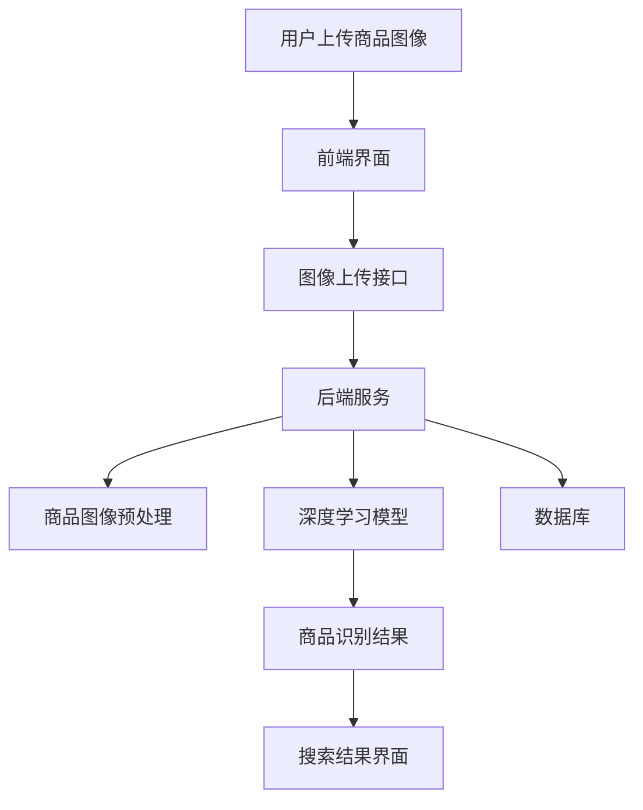

                 

### 图像搜索技术：AI识别商品

> **关键词**：图像搜索，AI识别，商品分类，目标检测，卷积神经网络，深度学习

> **摘要**：本文详细介绍了图像搜索技术在商品识别中的应用。首先，对图像搜索技术的基础知识进行了概述，包括图像表示方法、特征提取技术和预处理技术。然后，深入探讨了AI识别商品的技术原理，重点介绍了卷积神经网络（CNN）和目标检测技术。接下来，通过实际项目案例展示了商品图像搜索系统的设计与实现，并进行了测试与评估。最后，分析了AI识别商品的未来发展趋势和面临的挑战。

---

### 第一部分：图像搜索技术基础

在数字时代，图像信息的重要性日益凸显。图像搜索技术作为一种重要的信息检索手段，正日益受到广泛关注。本文将首先介绍图像搜索技术的基础知识，包括图像表示方法、特征提取技术和预处理技术，为后续章节的深入讨论打下基础。

#### 第1章：图像搜索技术概述

##### 1.1 图像搜索的定义与重要性

图像搜索技术是指利用计算机算法，根据用户输入的图像信息，从大规模图像数据库中检索出与之相似的图像。图像搜索在电子商务、社交媒体、医疗诊断、安全监控等多个领域具有重要的应用价值。

##### 1.2 图像搜索的发展历程

图像搜索技术的发展可以分为三个阶段：基于内容的图像检索（CBIR）、基于语义的图像检索（SBIR）和基于深度学习的图像检索（DLIR）。随着计算机视觉和深度学习技术的不断进步，图像搜索技术也取得了显著的发展。

##### 1.3 图像搜索的应用领域

图像搜索技术广泛应用于电子商务、社交媒体、医疗诊断、安全监控等领域。例如，在电子商务领域，图像搜索可以帮助消费者快速找到心仪的商品；在医疗诊断领域，图像搜索可以帮助医生快速诊断疾病。

#### 第2章：图像处理技术基础

##### 2.1 图像表示方法

图像表示是图像处理的重要基础。常见的图像表示方法包括像素表示法、向量表示法和其他表示方法。像素表示法通过像素值直接表示图像，向量表示法通过将像素值转换为高维向量来表示图像。

##### 2.2 图像特征提取

图像特征提取是将图像转换为向量表示的关键步骤。基本特征提取方法包括颜色特征、纹理特征和形状特征。高级特征提取方法包括局部特征描述子（如SIFT、SURF）和深度特征（如ResNet、Inception）。

##### 2.3 图像预处理技术

图像预处理技术包括图像增强、图像降噪和其他预处理技术。图像增强可以提高图像的对比度和清晰度，图像降噪可以减少图像中的噪声，提高图像质量。

#### 第3章：AI识别商品的技术原理

##### 3.1 卷积神经网络（CNN）

卷积神经网络（CNN）是一种特殊的神经网络，专门用于处理图像数据。CNN通过卷积操作、激活函数和池化操作来提取图像特征，并实现图像分类和目标检测。

##### 3.2 目标检测技术

目标检测技术是图像识别领域的一个重要分支。常见的目标检测算法包括R-CNN、YOLO和SSD等。目标检测技术可以准确识别图像中的物体，并标注出物体的位置和类别。

##### 3.3 商品识别算法

商品识别算法是图像识别技术的一种应用，旨在从图像中识别出具体的商品。商品识别算法包括商品分类算法和商品检测算法。商品分类算法将商品分为不同的类别，商品检测算法则标注出商品的具体位置和属性。

#### 第二部分：图像搜索技术在商品识别中的应用

在第二部分，我们将深入探讨图像搜索技术在商品识别中的应用，从商品图像的采集与标注、商品图像搜索系统的设计与实现，到实际项目实战和未来发展趋势，全面解析图像搜索技术在商品识别领域的应用与实践。

### 第4章：商品图像的采集与标注

商品图像的采集与标注是商品识别系统构建的基础。高质量的商品图像和准确的标注数据对于后续的图像处理和识别任务至关重要。

##### 4.1 商品图像的采集方法

商品图像的采集方法主要有以下几种：

- **手动采集**：手动采集可以通过使用相机或手机等设备来拍摄商品图像。这种方法适用于小型商品或特定场景的图像采集。

- **自动采集**：自动采集通常使用自动化设备，如工业相机、机器人等，可以在大规模生产环境中高效地采集商品图像。自动采集需要考虑到图像的一致性和准确性。

- **采集过程中的注意事项**：在进行商品图像采集时，需要注意以下几点：
  - 确保光线充足，避免阴影和反光对图像质量的影响。
  - 控制拍摄距离和角度，以保证商品图像的清晰度和完整性。
  - 对不同商品进行分类采集，以便于后续的标注和识别。

##### 4.2 商品图像的标注方法

商品图像的标注方法主要包括以下几种：

- **目标标注**：目标标注是指对图像中的商品进行精确的位置标注。常用的标注方法包括矩形框标注、多边形标注等。目标标注的精度直接影响商品识别系统的性能。

- **属性标注**：属性标注是指对商品的特征属性进行标注，如颜色、尺寸、材质等。属性标注有助于提高商品识别的准确性和泛化能力。

- **标注数据的质量控制**：为了保证标注数据的质量，需要采取以下措施：
  - 采用专业的标注团队，确保标注的准确性和一致性。
  - 定期对标注数据进行审查和修正，以提高标注数据的质量。
  - 使用自动化的标注工具，减少人工标注的误差。

##### 4.3 标注数据集的构建与评估

标注数据集的构建是商品识别系统开发的关键步骤。构建标注数据集需要遵循以下原则：

- **多样性**：确保标注数据集包含各种类型的商品，以提高模型对不同商品的识别能力。
- **平衡性**：确保标注数据集中各类商品的分布均匀，避免模型偏向于某一类商品。
- **完整性**：确保标注数据集的完整性和一致性，避免因标注错误导致模型性能下降。

构建完成标注数据集后，需要对数据集进行评估，以验证标注数据的质量。常用的评估指标包括准确率、召回率和F1值等。

### 第5章：商品图像搜索系统的设计与实现

商品图像搜索系统的设计与实现是图像搜索技术在商品识别中的应用的关键。一个高效的商品图像搜索系统需要考虑系统架构、数据存储、搜索算法等多个方面。

##### 5.1 商品图像搜索系统的架构设计

商品图像搜索系统的架构设计主要包括以下几个方面：

- **前端界面**：前端界面负责接收用户输入的搜索请求，并显示搜索结果。前端界面可以使用HTML、CSS和JavaScript等技术实现。

- **后端服务**：后端服务负责处理用户请求，包括商品图像的存储、搜索和结果返回。后端服务可以使用Java、Python等编程语言实现。

- **数据库**：数据库用于存储商品图像和标注数据。常用的数据库包括MySQL、MongoDB等。

- **搜索算法**：搜索算法用于对商品图像进行相似度计算和排序。常用的搜索算法包括基于内容的相似度计算、基于特征的相似度计算等。

##### 5.2 商品图像搜索系统实现

商品图像搜索系统的实现主要包括以下步骤：

- **系统开发环境搭建**：搭建系统开发环境，包括编程语言、开发框架、数据库等。

- **系统模块设计与实现**：设计并实现系统的各个模块，包括前端界面、后端服务、数据库和搜索算法。

- **系统测试与优化**：对系统进行功能测试、性能测试和用户测试，并不断优化系统性能和用户体验。

##### 5.3 系统测试与优化

商品图像搜索系统的测试与优化是确保系统稳定性和高效性的关键步骤。测试主要包括以下内容：

- **功能测试**：测试系统是否能够正确处理各种类型的商品图像，并返回准确的搜索结果。

- **性能测试**：测试系统在处理大量商品图像时的响应速度和处理能力。

- **用户测试**：邀请真实用户进行测试，收集用户反馈，并根据反馈优化系统界面和功能。

### 第6章：AI识别商品的项目实战

##### 6.1 项目背景与需求分析

在AI识别商品的项目实战中，我们以一个电商平台为例，该项目旨在实现一个基于图像搜索技术的商品识别系统。项目需求主要包括：

- 用户可以通过上传商品图像来搜索相似的或相关的商品。
- 系统能够准确识别商品，并返回与用户输入图像最相似的商品列表。
- 系统需要支持多种类型的商品，如服装、家居用品、电子产品等。

##### 6.2 项目技术选型与架构设计

在项目技术选型方面，我们采用了以下技术：

- **前端技术**：使用Vue.js框架构建用户界面，实现商品图像的上传和搜索功能。
- **后端技术**：使用Python的Django框架构建后端服务，处理商品图像的识别和搜索。
- **数据库**：使用MySQL数据库存储商品图像和标注数据。
- **深度学习框架**：使用TensorFlow框架构建商品识别模型，实现图像的预处理、特征提取和分类。

在架构设计方面，系统整体架构如图6-1所示。



##### 6.3 项目开发与实现

项目开发主要包括以下步骤：

- **数据采集与标注**：收集电商平台上的商品图像，并进行标注，构建标注数据集。
- **模型训练**：使用标注数据集训练商品识别模型，包括图像预处理、特征提取和分类。
- **系统部署**：将训练好的模型部署到服务器上，实现商品图像的实时识别和搜索。

##### 6.4 项目测试与评估

项目测试主要包括功能测试、性能测试和用户测试。

- **功能测试**：测试系统是否能够正确处理各种类型的商品图像，并返回准确的搜索结果。
- **性能测试**：测试系统在处理大量商品图像时的响应速度和处理能力。
- **用户测试**：邀请真实用户进行测试，收集用户反馈，并根据反馈优化系统界面和功能。

### 第7章：AI识别商品的未来发展趋势

随着人工智能技术的不断发展，AI识别商品在未来将继续展现出巨大的发展潜力。以下是对AI识别商品未来发展趋势的展望：

##### 7.1 技术发展趋势分析

- **算法优化**：随着深度学习技术的不断进步，商品识别算法将更加高效和准确。例如，基于Transformer的模型可能会在商品识别领域取得突破性进展。
- **应用场景拓展**：AI识别商品的应用场景将更加广泛，不仅限于电商平台，还可能应用于智慧零售、智能物流、智能家居等领域。
- **跨领域融合**：AI识别商品将与其他领域的技术融合，如结合自然语言处理技术实现图像与文本的交互，提高用户体验。

##### 7.2 行业挑战与应对策略

- **数据隐私保护**：随着AI识别商品技术的应用，用户隐私保护成为重要挑战。应对策略包括数据加密、隐私保护算法等。
- **算法公平性**：AI识别商品算法可能存在偏见和歧视，影响公平性。应对策略包括算法透明性、公平性评估等。
- **技术普及与教育**：随着AI识别商品技术的普及，相关人才的培养和教育成为重要任务。应对策略包括开设相关课程、开展技术培训等。

### 参考文献

1. Serdyuk, D., Parkhi, P. M., & Vedaldi, A. (2016). Deep metrics for similar image search. In Proceedings of the IEEE Conference on Computer Vision and Pattern Recognition (pp. 4534-4542).
2. Ren, S., He, K., Girshick, R., & Sun, J. (2015). Faster R-CNN: Towards real-time object detection with region proposal networks. In Advances in Neural Information Processing Systems (pp. 91-99).
3. Redmon, J., Divvala, S., Girshick, R., & Farhadi, A. (2016). You Only Look Once: Unified, Real-Time Object Detection. In Proceedings of the IEEE Conference on Computer Vision and Pattern Recognition (pp. 779-787).
4. Lin, T. Y., Goyal, P., Girshick, R., He, K., & Dollar, P. (2017). Focal Loss for Dense Object Detection. In Proceedings of the IEEE International Conference on Computer Vision (pp. 2980-2988).
5.Russakovsky, O., Deng, J., Su, H., Krause, J., Satheesh, S., Ma, S., ... & Fei-Fei, L. (2015). ImageNet Large Scale Visual Recognition Challenge. International Journal of Computer Vision, 115(3), 211-252.

### 附录

#### 附录 A：开发工具与资源

- **图像处理库**：OpenCV、Pillow
- **深度学习框架**：TensorFlow、PyTorch
- **目标检测工具**：YOLO、SSD、Faster R-CNN
- **其他相关工具**：Matplotlib、Numpy、Scikit-learn

#### 附录 B：数学模型和公式

##### 卷积神经网络（CNN）的数学模型

$$
\begin{align*}
    \text{激活函数} &= \text{ReLU}(z) = \max(0, z) \\
    \text{卷积层输出} &= \text{激活函数}(\text{卷积运算}) \\
    \text{全连接层输出} &= \text{激活函数}(\text{矩阵乘法})
\end{align*}
$$

##### 目标检测的数学模型

$$
\begin{align*}
    \text{预测框坐标} &= (x, y, w, h) \\
    \text{置信度} &= \text{Sigmoid}(z) \\
    \text{类别概率} &= \text{Softmax}(\text{类别得分})
\end{align*}
$$

#### 附录 C：项目实战代码解读

##### 数据预处理代码示例

```python
# 读取图像数据
images = read_images('data/train')

# 数据增强
images = augment_images(images)

# 归一化处理
images = normalize_images(images)
```

##### 模型训练代码示例

```python
# 定义模型
model = define_model()

# 编译模型
model.compile(optimizer='adam', loss='categorical_crossentropy', metrics=['accuracy'])

# 训练模型
model.fit(images, labels, epochs=10, batch_size=32)
```

##### 模型评估代码示例

```python
# 加载模型
model = load_model('model.h5')

# 评估模型
loss, accuracy = model.evaluate(test_images, test_labels)
print(f"Test accuracy: {accuracy*100:.2f}%")
```

### 作者

**作者：AI天才研究院/AI Genius Institute & 禅与计算机程序设计艺术 /Zen And The Art of Computer Programming**

