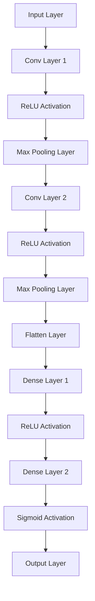

                 

# 引言

地震作为一种自然现象，对人类社会造成了巨大的破坏和损失。自古以来，人们一直在探索地震的预测方法，以期提前预警，减少地震灾害带来的影响。然而，地震预测是一项极其复杂且具有挑战性的任务。传统的地震预测方法主要依赖于地质学、地震学等领域的经验知识，但受限于人类认知和计算能力的限制，这些方法在实际应用中存在一定的局限性。

随着人工智能技术的快速发展，深度学习作为人工智能的一个重要分支，为地震预测带来了新的机遇。深度学习通过模拟人脑神经网络结构，能够从大量数据中自动提取特征，对复杂问题进行建模和预测。近年来，深度学习在图像识别、自然语言处理等领域取得了显著的成果，这也为地震预测提供了新的思路和方法。

本文旨在探讨地震预测的深度学习方法，通过数学分析和实际项目实战，深入剖析地震预测的原理和应用。本文结构如下：

- **第一部分：地震预测的理论基础**
  - **第1章：地震预测概述**
    - **1.1 地震基本概念**
    - **1.2 地震预测的重要性**
    - **1.3 地震预测的方法分类**

  - **第2章：地质活动数据采集与处理**
    - **2.1 地质活动数据类型**
    - **2.2 数据采集技术**
    - **2.3 数据预处理方法**

  - **第3章：深度学习基础**
    - **3.1 深度学习概述**
    - **3.2 神经网络结构**
    - **3.3 深度学习算法**

  - **第4章：地震预测的深度学习模型**
    - **4.1 传统的地震预测模型**
    - **4.2 深度学习在地震预测中的应用**
    - **4.3 地震预测深度学习模型设计**

  - **第5章：数学分析在地震预测中的应用**
    - **5.1 地震预测中的数学模型**
    - **5.2 数学公式与计算方法**
    - **5.3 数学模型在地震预测中的应用实例**

  - **第6章：地震预测深度学习模型优化**
    - **6.1 模型优化方法**
    - **6.2 模型选择与调参**
    - **6.3 模型评估与改进**

  - **第7章：地震预测深度学习项目实战**
    - **7.1 项目背景**
    - **7.2 环境搭建与数据准备**
    - **7.3 模型设计与实现**
    - **7.4 代码解读与分析**

- **第二部分：地震预测深度学习的未来发展**
  - **第8章：地震预测深度学习的挑战与机遇**
    - **8.1 面临的挑战**
    - **8.2 发展机遇**
    - **8.3 未来发展趋势**

  - **第9章：地震预测深度学习的跨学科研究**
    - **9.1 跨学科研究的必要性**
    - **9.2 跨学科研究的方法与成果**
    - **9.3 跨学科研究的前景**

  - **第10章：地震预测深度学习的社会影响**
    - **10.1 地震预测的实时监测与预警**
    - **10.2 地震预测对城市建设的影响**
    - **10.3 地震预测的法律法规与伦理问题**

- **附录**
  - **附录A：常用深度学习框架与工具**
  - **附录B：数学公式与计算方法详解**

通过上述结构的安排，本文将系统地介绍地震预测的深度学习方法，从理论到实践，全面探讨深度学习在地震预测中的应用。希望本文能为从事地震预测研究的学者和实践者提供有益的参考。

**关键词：地震预测，深度学习，地质活动数据，数学分析，模型优化，项目实战**

**摘要：**
本文旨在探讨地震预测的深度学习方法，通过理论分析和实际项目实战，深入剖析地震预测的原理和应用。首先，介绍了地震的基本概念和地震预测的重要性，然后详细阐述了地质活动数据采集与处理的方法，以及深度学习和数学分析在地震预测中的应用。接着，介绍了地震预测深度学习模型的设计与优化，并通过实际项目展示了深度学习在地震预测中的具体应用。最后，讨论了地震预测深度学习的挑战与机遇，以及其在社会中的影响。本文结构紧凑，逻辑清晰，为地震预测研究提供了全面的参考。

## 第一部分：地震预测的理论基础

### 第1章：地震预测概述

地震预测是指通过科学方法和技术手段，提前发现和判断地震的发生可能性和地点，以便采取相应的预防和应对措施，减少地震灾害对人类社会的危害。地震预测的重要性不言而喻，它不仅关系到人们生命财产的安全，也关系到国家和城市的防灾减灾能力。

#### 1.1 地震基本概念

地震是指地球表面及其附近的岩石层由于地质构造活动而产生的震动现象。地震的成因主要有两种：一种是构造地震，由地球板块运动引起；另一种是火山地震，由火山喷发引起。构造地震是地球上最常见的地震类型，其能量释放主要来自于板块间的相互作用和摩擦。

地震波是地震时传播的振动波，根据传播方式和特性可以分为纵波（P波）和横波（S波）。P波是地震波中传播速度最快的一种，它能够使物质粒子沿波的传播方向振动；S波则是地震波中传播速度较慢的一种，它能够使物质粒子垂直于波的传播方向振动。地震波的速度和传播路径对于地震的预测和定位具有重要意义。

地震的强度和烈度是衡量地震危害程度的两个重要指标。地震强度通常用震级来表示，它反映了地震释放能量的多少，震级越大，能量越大。地震烈度则反映了地震对地面建筑物和人类活动的破坏程度，通常用烈度等级来表示，如一级到十二级。

#### 1.2 地震预测的重要性

地震预测对于人类社会的重要性主要体现在以下几个方面：

1. **减少人员伤亡和财产损失**：地震发生突然，破坏性强，预测地震能够提前预警，为人们提供逃生和避险时间，有效减少人员伤亡和财产损失。

2. **提高防灾减灾能力**：地震预测能够为城市规划和建筑设计提供科学依据，指导城市和建筑物采取相应的抗震措施，提高防灾减灾能力。

3. **促进科技进步**：地震预测技术的发展推动了地质学、地震学、气象学等学科的发展，促进了科学技术进步。

4. **提高国际竞争力**：地震预测技术的应用能够提高国家和地区的防灾减灾水平，增强国际竞争力。

#### 1.3 地震预测的方法分类

地震预测的方法主要可以分为以下几类：

1. **经验预测方法**：这类方法主要基于历史地震数据和地质学经验，通过对地震活动规律的分析，预测未来地震的发生可能性。常用的方法包括地震序列分析方法、地震活动性分析方法等。

2. **地震机理预测方法**：这类方法通过研究地震的成因和地质构造活动，结合地震物理和地震波传播理论，预测地震的发生时间和地点。常用的方法包括地震破裂过程模拟、地震应力场分析方法等。

3. **深度学习预测方法**：这类方法利用深度学习算法，从大量的地震数据中自动提取特征，建立地震预测模型。深度学习在地震预测中的应用正在不断发展和完善，有望取得更好的预测效果。

通过对地震预测的理论基础进行详细介绍，为后续章节的深度学习在地震预测中的应用奠定基础。在接下来的章节中，我们将进一步探讨地质活动数据采集与处理的方法，以及深度学习和数学分析在地震预测中的应用。

### 1.1 地震基本概念

地震作为一种地球物理现象，其定义和成因是地震预测研究的基础。首先，我们需要明确地震的基本概念，包括地震的定义、成因和分类。

**地震的定义：** 地震是指地球表面及其附近的岩石层由于地质构造活动而产生的震动现象。地震的能量主要来自于地球内部的能量释放，这种能量通过地震波的形式传播到地表，引起地表的震动。

**地震的成因：** 地震的成因主要与地球内部的构造活动有关。地球的外部由多个岩石板块组成，这些板块在地球内部热力和构造力的作用下发生相对运动。当板块间的摩擦力积累到一定程度时，会突然释放能量，导致地震发生。地震的成因可以分为构造地震、火山地震和人工地震三种类型。

- **构造地震：** 是最常见的地震类型，由地球板块运动引起。板块间的相互作用和摩擦力积累到一定程度，会突然释放能量，形成地震。
- **火山地震：** 由火山活动引起，火山爆发时，地下岩浆的迅速上升和喷发会导致地震。
- **人工地震：** 由人类活动引起，如矿山爆破、地下核试验等。

**地震的分类：** 根据地震的特性，地震可以分为不同类型，包括：

- **按震源深度分类：**
  - **浅源地震：** 震源深度小于70公里的地震。
  - **中源地震：** 震源深度在70公里至300公里之间的地震。
  - **深源地震：** 震源深度大于300公里的地震。

- **按震级分类：**
  - **小震：** 震级小于2.5的地震。
  - **中震：** 震级在2.5至4.9之间的地震。
  - **大震：** 震级在5.0至6.9之间的地震。
  - **特大震：** 震级大于7.0的地震。

**地震波的传播：** 地震发生时，能量以地震波的形式传播。地震波根据传播方式和特性可以分为纵波（P波）和横波（S波）。

- **纵波（P波）：** 是地震波中传播速度最快的一种波，能够使物质粒子沿波的传播方向振动。
- **横波（S波）：** 是地震波中传播速度较慢的一种波，能够使物质粒子垂直于波的传播方向振动。

**地震的强度与烈度：** 地震的强度和烈度是衡量地震危害程度的两个重要指标。

- **地震强度：** 通常用震级来表示，它反映了地震释放能量的多少，震级越大，能量越大。
- **地震烈度：** 反映了地震对地面建筑物和人类活动的破坏程度，通常用烈度等级来表示，如一级到十二级。

通过对地震基本概念的详细解释，我们可以更好地理解地震的成因和传播特性，为后续章节中地震预测的方法和深度学习在地震预测中的应用打下坚实的基础。

### 1.2 地震预测的重要性

地震预测在地震灾害预防和减轻损失方面具有至关重要的意义。地震是一种不可预测但频繁发生的自然灾害，其破坏力巨大，不仅会导致人员伤亡和财产损失，还会对社会经济造成深远影响。因此，地震预测的重要性体现在以下几个方面：

**1. 人员伤亡减少：**

地震发生时，往往来不及预警，导致大量人员伤亡。通过地震预测，可以提前发出预警，给人们提供充足的逃生和避险时间，从而有效减少人员伤亡。例如，在日本和加利福尼亚等地震频繁的地区，地震预警系统已经投入使用，并成功挽救了无数生命。

**2. 财产损失降低：**

地震对建筑物和基础设施的破坏力极强，常常造成巨额财产损失。通过地震预测，可以提前对可能发生地震的区域进行风险评估，采取相应的预防措施，如加固建筑物、设置应急避难场所等，从而降低地震灾害的财产损失。

**3. 社会经济影响减轻：**

地震不仅对受灾地区的直接经济造成影响，还会对整个社会经济的稳定和发展带来挑战。通过地震预测，可以提前制定应急预案，减少地震对社会经济的冲击，保障社会稳定和持续发展。

**4. 科学研究和技术创新：**

地震预测技术的发展推动了地震学、地质学、气象学等学科的研究，促进了科学技术的进步。深度学习作为人工智能的重要分支，在地震预测中的应用不仅提高了预测精度，还为其他领域的预测模型提供了新的思路和方法。

**5. 国际合作与交流：**

地震预测技术和方法的研发和应用需要全球范围内的合作与交流。通过国际合作，可以共享地震监测数据、研究成果和先进技术，提高全球地震预测的能力和水平。

**6. 法律法规和伦理问题：**

地震预测涉及到法律法规和伦理问题。如何确保预测结果的准确性、如何处理预测失误带来的责任问题等，都需要制定相应的法律法规和伦理规范，保障地震预测工作的顺利进行。

总之，地震预测在地震灾害预防和减轻损失方面具有不可替代的作用。通过科学的方法和技术手段，不断提高地震预测的准确性和实时性，将为人类社会带来更加安全、稳定和可持续的发展环境。

### 1.3 地震预测的方法分类

地震预测的方法可以分为经验预测方法、地震机理预测方法和深度学习预测方法，每种方法都有其独特的理论基础和应用场景。

**1. 经验预测方法**

经验预测方法是基于历史数据和地质学经验，通过对地震活动规律的分析，预测未来地震的发生可能性。这种方法主要依赖于地质学家和地震学家多年的实践经验，包括地震序列分析方法、地震活动性分析方法等。

- **地震序列分析方法**：通过分析地震序列的发生规律，如地震间隔时间、震级分布等，预测未来地震的可能性和强度。
- **地震活动性分析方法**：利用地震台站记录的地震数据，分析地震活动性的时空分布特征，预测未来地震的发生区域。

**2. 地震机理预测方法**

地震机理预测方法基于地震的成因和地质构造活动，通过物理模型和数学方法，模拟地震的发生和传播过程，从而预测地震的发生时间和地点。这种方法主要包括地震破裂过程模拟、地震应力场分析方法等。

- **地震破裂过程模拟**：通过计算机模拟地震破裂过程，预测地震的发生机制和传播路径。
- **地震应力场分析方法**：利用地震应力场的分析，预测地震的应力集中区域，从而预测地震的发生可能性。

**3. 深度学习预测方法**

深度学习预测方法利用深度学习算法，从大量地震数据中自动提取特征，建立地震预测模型。这种方法模拟人脑神经网络结构，能够处理复杂数据，提高预测精度。

- **深度神经网络**：通过多层神经网络结构，从地震数据中提取高维特征，实现地震预测。
- **卷积神经网络（CNN）**：利用CNN的局部连接和共享权重特性，有效提取地震数据中的空间特征。
- **递归神经网络（RNN）**：通过RNN的序列处理能力，分析地震数据的时序特征。

**方法对比**

- **优势：**
  - 经验预测方法：依赖于地质学家的经验，能够快速响应地震活动。
  - 地震机理预测方法：基于物理模型，能够提供较精确的地震成因和传播过程预测。
  - 深度学习预测方法：能够自动从数据中提取特征，提高预测精度。

- **劣势：**
  - 经验预测方法：受限于地质学家经验和主观判断，预测精度有限。
  - 地震机理预测方法：需要复杂的物理模型和计算，实现难度大。
  - 深度学习预测方法：训练过程复杂，对计算资源和数据质量要求较高。

**应用场景**

- **经验预测方法**：适用于短期地震预测，适合于地震活动性较强的地区。
- **地震机理预测方法**：适用于中长期地震预测，适合于研究地震成因和构造活动。
- **深度学习预测方法**：适用于实时地震预测，适合于处理大规模地震数据。

通过对地震预测方法的分类和对比，我们可以更好地理解每种方法的优缺点和应用场景，为地震预测的实际应用提供指导。

## 第2章：地质活动数据采集与处理

地震预测需要大量的地质活动数据作为基础，这些数据包括地震波形数据、地震目录数据和地震震源参数数据等。为了充分利用这些数据，需要对它们进行有效的采集和预处理。本章将详细介绍地质活动数据的类型、采集技术和预处理方法。

### 2.1 地质活动数据类型

地质活动数据可以分为以下几种类型：

**1. 地震波形数据**

地震波形数据是地震发生时，地震仪记录的地震波信号。这些数据包含了地震的强度、传播路径和时间信息。地震波形数据是地震预测中最常用的数据类型之一，它能够直观地反映地震的动态特征。

**2. 地震目录数据**

地震目录数据是记录地震发生地点、时间、震级等信息的数据库。这些数据通常来源于地震台站和全球地震数据共享平台。地震目录数据为地震预测提供了地震发生的空间和时间背景。

**3. 地震震源参数数据**

地震震源参数数据包括地震的震源深度、震源机制等参数。这些数据有助于理解地震的成因和地震波的传播特性，是地震预测中重要的参考数据。

### 2.2 数据采集技术

地质活动数据的采集需要使用专门的仪器和技术。以下是一些常用的数据采集技术：

**1. 地震仪器**

地震仪器包括地震台、地震记录仪等，用于记录地震波形数据。地震台通常位于地震活动频繁的地区，地震记录仪则用于实时记录地震波信号。

- **地震台**：地震台是地震数据采集的固定设施，包括地震仪、数据采集系统和通信系统等。地震台能够实时记录地震波信号，并将数据传输到地震数据中心。
- **地震记录仪**：地震记录仪是一种便携式设备，可以用于现场记录地震波信号。它通常用于地震发生后的初步数据采集，以便及时了解地震的情况。

**2. 地震数据传输**

地震数据传输技术包括有线和无线两种方式。有线传输通常使用光纤和电话线等，而无线传输则利用卫星通信和无线电波。

- **光纤传输**：光纤传输具有高速、稳定的特点，适合于大规模地震数据的长距离传输。
- **卫星通信**：卫星通信适用于偏远地区的地震数据传输，能够实现全球范围内的数据实时传输。
- **无线电波**：无线电波传输简单方便，但受地形和天气等因素的影响较大。

**3. 数据存储**

地震数据采集后，需要将数据存储到数据库中，以便后续处理和分析。常用的数据存储技术包括数据库存储和分布式存储。

- **数据库存储**：数据库存储具有数据管理方便、查询速度快的特点，适用于中小规模地震数据的存储。
- **分布式存储**：分布式存储能够实现海量数据的存储和高效处理，适合于大规模地震数据的存储和管理。

### 2.3 数据预处理方法

地质活动数据在采集过程中可能会受到各种噪声和干扰，因此需要对数据进行预处理，以提高数据的质量和可靠性。以下是一些常用的数据预处理方法：

**1. 数据清洗**

数据清洗是数据预处理的重要步骤，旨在去除数据中的错误、异常和重复值。常用的数据清洗方法包括：

- **去噪**：使用滤波器去除地震波形数据中的噪声。
- **缺失值处理**：通过插值或填充方法处理数据中的缺失值。
- **异常值检测**：使用统计方法检测数据中的异常值，并进行处理。

**2. 数据归一化**

数据归一化是将不同尺度和量纲的数据转换为相同尺度和量纲的过程，以便于后续分析和计算。常用的数据归一化方法包括：

- **线性归一化**：将数据映射到[0,1]或[-1,1]范围内。
- **标准化**：将数据标准化为均值为0、标准差为1的分布。

**3. 数据增强**

数据增强是通过增加数据的多样性和复杂性，提高模型对未知数据的泛化能力。常用的数据增强方法包括：

- **时间序列扩展**：通过插值、重构等方法增加时间序列数据的长度。
- **频率变换**：通过傅里叶变换等方法对数据进行频率域扩展。
- **数据融合**：将多个数据源进行融合，生成更丰富的数据集。

**4. 数据降维**

数据降维是将高维数据转换为低维数据的过程，以减少计算复杂度和提高处理效率。常用的数据降维方法包括：

- **主成分分析（PCA）**：通过提取数据的主要成分，减少数据的维度。
- **线性判别分析（LDA）**：通过构建最优投影空间，实现数据的降维。
- **自编码器**：通过训练自编码器，实现数据的压缩和降维。

通过对地质活动数据进行有效的采集和预处理，可以确保数据的质量和可靠性，为地震预测提供坚实的数据基础。在接下来的章节中，我们将进一步探讨深度学习和数学分析在地震预测中的应用。

### 2.1 地质活动数据类型

地质活动数据是地震预测的重要基础，主要包括地震波形数据、地震目录数据和地震震源参数数据。以下是对这些数据类型的详细介绍：

**1. 地震波形数据**

地震波形数据是地震发生时，地震仪记录的地震波信号。这些数据包含了地震的强度、传播路径和时间信息，是地震预测中最常用的数据类型之一。地震波形数据通常以时间序列的形式表示，可以直观地反映地震的动态特征。

- **数据格式**：地震波形数据通常以波形图或时间序列数据的形式存储，包括时间、振幅和相位等参数。
- **数据来源**：地震波形数据来源于地震台站、地震记录仪等设备，这些设备能够实时记录地震波信号，并将其传输到地震数据中心。
- **数据处理**：地震波形数据需要进行预处理，包括去噪、插值、归一化等操作，以提高数据质量和可靠性。

**2. 地震目录数据**

地震目录数据是记录地震发生地点、时间、震级等信息的数据库。这些数据通常来源于全球地震数据共享平台，如美国地质调查局（USGS）和全球地震网（GEOFON）等。地震目录数据为地震预测提供了地震发生的空间和时间背景。

- **数据格式**：地震目录数据通常以表格或数据库的形式存储，包括地震的ID、时间、地点、震级、震源深度等参数。
- **数据来源**：地震目录数据由全球各地的地震台站记录和报告，并通过全球地震数据共享平台进行发布。
- **数据处理**：地震目录数据需要进行清洗和整理，去除错误和重复记录，确保数据的准确性和完整性。

**3. 地震震源参数数据**

地震震源参数数据包括地震的震源深度、震源机制等参数。这些数据有助于理解地震的成因和地震波的传播特性，是地震预测中重要的参考数据。

- **数据格式**：地震震源参数数据通常以表格或数据库的形式存储，包括地震的ID、震源深度、震源机制、应力场等参数。
- **数据来源**：地震震源参数数据由地震学家通过地震破裂过程模拟和地震应力场分析等研究方法获得。
- **数据处理**：地震震源参数数据需要进行整合和分析，以提取出对地震预测有用的信息。

通过对地质活动数据的类型和来源进行详细介绍，我们可以更好地理解地震预测所需的数据基础，为后续章节的讨论提供背景信息。

### 2.2 数据采集技术

地质活动数据的采集是地震预测的基础工作，涉及到多种仪器和技术手段。以下将详细介绍地震仪器的种类、数据采集系统的搭建以及数据传输与存储的方法。

**1. 地震仪器的种类**

地震仪器是地震数据采集的核心设备，主要包括以下几种：

- **地震台**：地震台是一种固定在地面上的地震监测设施，包括地震仪、数据采集系统和通信系统。地震台能够实时记录地震波信号，并将数据传输到地震数据中心。
  - **地震仪**：地震仪是地震台的核心设备，用于记录地震波信号。常见的地震仪有宽频带地震仪、短周期地震仪和强震仪等。
  - **数据采集系统**：数据采集系统用于将地震仪记录的模拟信号转换为数字信号，并进行预处理和存储。
  - **通信系统**：通信系统负责将地震台采集到的数据实时传输到地震数据中心，常用的通信手段包括有线通信（光纤、电话线）和无线通信（卫星通信、无线电波）。

- **地震记录仪**：地震记录仪是一种便携式设备，可以用于现场记录地震波信号。地震记录仪适用于地震发生后的初步数据采集，以便及时了解地震的情况。

- **地震仪传感器**：地震仪传感器是用于检测地震波振动的设备，包括加速度传感器、速度传感器和位移传感器等。传感器可以安装在地震台、建筑物和桥梁等结构上，用于监测结构响应。

**2. 数据采集系统的搭建**

数据采集系统的搭建是确保地震数据准确性和实时性的关键。以下是数据采集系统的主要组成部分和搭建步骤：

- **系统设计**：根据监测需求和场地条件，设计数据采集系统的总体架构，包括地震台站布局、传感器布置和数据传输路径。
- **设备安装**：在地震台站和监测点安装地震仪器、传感器和数据采集设备，确保设备固定稳固，不受外界干扰。
- **系统调试**：对数据采集系统进行调试和校准，确保设备的正常运行和数据采集的准确性。
- **系统集成**：将数据采集系统与地震数据中心进行集成，实现数据的实时传输和存储。

**3. 数据传输与存储**

地震数据传输与存储是保证数据完整性和可访问性的重要环节。以下是地震数据传输与存储的主要方法：

- **有线传输**：有线传输包括光纤传输和电话线传输，具有高速、稳定的特点。光纤传输适用于大规模地震数据的长距离传输，而电话线传输适用于偏远地区的地震数据传输。
- **无线传输**：无线传输包括卫星通信和无线电波传输。卫星通信适用于全球范围内的数据实时传输，而无线电波传输简单方便，但受地形和天气等因素的影响较大。
- **存储方案**：地震数据的存储方案包括数据库存储和分布式存储。数据库存储适用于中小规模地震数据的存储和管理，而分布式存储能够实现海量数据的存储和高效处理。

通过对地震仪器的种类、数据采集系统的搭建和数据传输与存储方法的详细介绍，我们可以更好地理解地质活动数据的采集过程，为地震预测提供坚实的数据基础。在接下来的章节中，我们将进一步探讨地震数据的预处理方法，以提高数据的质量和可靠性。

### 2.3 数据预处理方法

地质活动数据在采集过程中可能会受到各种噪声和干扰，导致数据质量下降，从而影响地震预测的准确性。因此，对地质活动数据进行预处理是非常重要的一步，旨在去除噪声、缺失值处理、数据归一化和数据增强等，以提高数据质量和模型的泛化能力。以下是一些常用的数据预处理方法：

**1. 数据清洗**

数据清洗是数据预处理的首要步骤，旨在去除数据中的错误、异常和重复值，确保数据的质量和一致性。

- **去噪**：使用滤波器去除地震波形数据中的噪声。常用的滤波器包括低通滤波器、高通滤波器和带通滤波器。例如，可以使用低通滤波器去除高频噪声，保留低频信号，从而提高数据的质量。
- **缺失值处理**：地震数据中可能存在缺失值，可以通过插值或填充方法进行处理。常用的插值方法包括线性插值、样条插值和Kriging插值等。填充方法可以通过平均值、中位数或模式值等方式进行。
- **异常值检测**：使用统计方法检测数据中的异常值，并进行处理。常用的异常值检测方法包括基于标准差的检测方法和基于聚类的方法。例如，可以使用三次移动平均法或Z-score方法检测异常值。

**2. 数据归一化**

数据归一化是将不同尺度和量纲的数据转换为相同尺度和量纲的过程，以便于后续分析和计算。常用的数据归一化方法包括：

- **线性归一化**：将数据映射到[0,1]或[-1,1]范围内。线性归一化的公式为：\[ x' = \frac{x - x_{\text{min}}}{x_{\text{max}} - x_{\text{min}} } \]
- **标准化**：将数据标准化为均值为0、标准差为1的分布。标准化的公式为：\[ x' = \frac{x - \mu}{\sigma} \]

**3. 数据增强**

数据增强是通过增加数据的多样性和复杂性，提高模型对未知数据的泛化能力。常用的数据增强方法包括：

- **时间序列扩展**：通过插值、重构等方法增加时间序列数据的长度。例如，可以使用线性插值法或高斯过程插值法来扩展时间序列数据。
- **频率变换**：通过傅里叶变换等方法对数据进行频率域扩展。例如，可以使用小波变换或短时傅里叶变换（STFT）来扩展频率域数据。
- **数据融合**：将多个数据源进行融合，生成更丰富的数据集。例如，可以将地震波形数据与地震目录数据进行融合，以提高模型的预测能力。

**4. 数据降维**

数据降维是将高维数据转换为低维数据的过程，以减少计算复杂度和提高处理效率。常用的数据降维方法包括：

- **主成分分析（PCA）**：通过提取数据的主要成分，减少数据的维度。PCA的优点是能够保留数据的最大方差，但缺点是可能会损失一些信息。
- **线性判别分析（LDA）**：通过构建最优投影空间，实现数据的降维。LDA的优点是能够最大化类间方差，但缺点是依赖于数据分布。
- **自编码器**：通过训练自编码器，实现数据的压缩和降维。自编码器的优点是能够自适应地学习数据特征，但缺点是训练过程较复杂。

通过对地质活动数据进行有效的预处理，可以提高数据的质量和模型的预测能力，为地震预测提供坚实的基础。在接下来的章节中，我们将进一步探讨深度学习在地震预测中的应用，并介绍具体的深度学习模型和算法。

### 第3章：深度学习基础

深度学习作为人工智能的一个重要分支，已经在图像识别、自然语言处理、推荐系统等领域取得了显著的成果。本章将介绍深度学习的基本概念、神经网络结构以及深度学习算法，为后续章节中深度学习在地震预测中的应用打下基础。

#### 3.1 深度学习概述

**深度学习定义：** 深度学习是一种基于多层神经网络构建的机器学习方法，通过逐层提取特征，从原始数据中学习到有意义的表示。深度学习能够自动从大量数据中学习复杂模式，具有较高的预测准确性和泛化能力。

**深度学习特点：**
1. **层次化结构**：深度学习模型包含多个隐藏层，通过逐层提取特征，将原始数据转换为高层次的抽象表示。
2. **自动特征学习**：深度学习模型能够自动从数据中学习特征，无需人工设计特征，从而提高模型的泛化能力。
3. **大规模计算能力**：深度学习需要大量计算资源和数据，现代计算硬件（如GPU）的发展为深度学习提供了强大的计算支持。
4. **可扩展性**：深度学习模型可以很容易地扩展到大型数据集和复杂的任务。

**深度学习发展历程：**
深度学习起源于20世纪80年代，最初由于计算能力和数据量的限制，发展较为缓慢。随着计算机硬件性能的提升和大数据的普及，深度学习在21世纪取得了快速发展。2006年，Geoffrey Hinton等人提出深度信念网络（DBN），标志着深度学习技术的复兴。2012年，AlexNet在ImageNet图像识别竞赛中取得了突破性的成果，深度学习在图像识别领域迅速崛起。

#### 3.2 神经网络结构

神经网络是深度学习的基础，其基本组成包括输入层、隐藏层和输出层。以下将详细介绍神经网络的结构和不同类型的神经网络。

**1. 神经网络基本组成**

- **输入层**：输入层接收外部输入，通常表示为多维数组。输入层的每个节点对应输入特征的一个维度。
- **隐藏层**：隐藏层位于输入层和输出层之间，用于提取和转换特征。隐藏层的节点数和层数可以根据任务需求进行调整。
- **输出层**：输出层生成模型的最终输出，通常是一个或多个值。输出层的节点数和类型取决于任务的类型，如分类或回归。

**2. 不同类型的神经网络**

- **前馈神经网络（FFN）**：前馈神经网络是最常见的神经网络类型，数据从输入层传递到输出层，中间经过多个隐藏层。前馈神经网络结构简单，易于实现和训练。
- **循环神经网络（RNN）**：循环神经网络适合处理序列数据，具有记忆功能，能够捕捉序列中的时间依赖关系。RNN包括简单的RNN、长短时记忆网络（LSTM）和门控循环单元（GRU）等变体。
- **卷积神经网络（CNN）**：卷积神经网络主要用于处理图像数据，通过卷积层和池化层提取图像特征。CNN在计算机视觉领域取得了显著成果。
- **自编码器（AE）**：自编码器是一种无监督学习算法，用于学习和重建输入数据。自编码器包括编码器和解码器两部分，通过最小化重建误差进行训练。

#### 3.3 深度学习算法

深度学习算法主要包括前向传播、反向传播和优化算法。以下将详细介绍这些算法的基本原理和实现过程。

**1. 前向传播**

前向传播是神经网络训练过程中的一部分，用于计算模型的输出。在给定输入数据时，数据从输入层传递到输出层，每个节点根据其连接权重和激活函数生成输出。前向传播的主要步骤如下：

- **初始化权重和偏置**：随机初始化网络的权重和偏置。
- **计算输入和输出**：将输入数据传递到网络，逐层计算每个节点的输入和输出。
- **应用激活函数**：使用激活函数（如Sigmoid、ReLU或Tanh）对输出进行非线性变换。
- **计算损失函数**：计算模型输出与真实标签之间的差异，使用损失函数（如均方误差或交叉熵）衡量模型的预测误差。

**2. 反向传播**

反向传播是神经网络训练过程中的另一重要步骤，用于更新网络权重和偏置，以最小化损失函数。反向传播的主要步骤如下：

- **计算梯度**：从输出层开始，逐层向前计算每个节点关于输出误差的梯度。
- **更新权重和偏置**：根据梯度信息，使用优化算法（如随机梯度下降或Adam）更新网络权重和偏置。
- **迭代训练**：重复前向传播和反向传播步骤，直到模型收敛或达到预定的训练次数。

**3. 优化算法**

优化算法用于调整网络权重和偏置，以最小化损失函数。以下是一些常用的优化算法：

- **随机梯度下降（SGD）**：随机梯度下降是最简单的优化算法，通过计算每个样本的梯度并更新权重和偏置。
- **批量梯度下降（BGD）**：批量梯度下降对整个训练集进行梯度计算和更新，但计算量大，训练时间长。
- **Adam**：Adam是一种自适应优化算法，结合了SGD和动量方法，能够自适应调整学习率。

通过介绍深度学习的基本概念、神经网络结构和深度学习算法，本章为后续章节中深度学习在地震预测中的应用奠定了基础。在接下来的章节中，我们将探讨深度学习在地震预测中的应用，并介绍具体的深度学习模型和算法。

### 3.1 深度学习概述

**深度学习定义：** 深度学习是一种基于多层神经网络构建的机器学习方法，通过逐层提取特征，从原始数据中学习到有意义的表示。深度学习能够自动从大量数据中学习复杂模式，具有较高的预测准确性和泛化能力。

**深度学习特点：**
1. **层次化结构**：深度学习模型包含多个隐藏层，通过逐层提取特征，将原始数据转换为高层次的抽象表示。
2. **自动特征学习**：深度学习模型能够自动从数据中学习特征，无需人工设计特征，从而提高模型的泛化能力。
3. **大规模计算能力**：深度学习需要大量计算资源和数据，现代计算硬件（如GPU）的发展为深度学习提供了强大的计算支持。
4. **可扩展性**：深度学习模型可以很容易地扩展到大型数据集和复杂的任务。

**深度学习发展历程：**
深度学习起源于20世纪80年代，最初由于计算能力和数据量的限制，发展较为缓慢。随着计算机硬件性能的提升和大数据的普及，深度学习在21世纪取得了快速发展。2006年，Geoffrey Hinton等人提出深度信念网络（DBN），标志着深度学习技术的复兴。2012年，AlexNet在ImageNet图像识别竞赛中取得了突破性的成果，深度学习在图像识别领域迅速崛起。

**深度学习在地震预测中的应用前景：**
深度学习在地震预测中具有广泛的应用前景，主要包括以下几个方面：
1. **特征提取**：深度学习能够自动从地震数据中提取复杂特征，提高预测模型的性能。
2. **模式识别**：通过深度学习，可以识别地震数据中的潜在模式，从而提高地震预测的准确性。
3. **实时预测**：深度学习模型能够实时处理和分析地震数据，提供快速的地震预测结果。
4. **跨学科应用**：深度学习与其他学科（如地质学、地震学等）的结合，可以推动地震预测技术的发展。

**应用实例：** 在实际应用中，深度学习已经被用于地震预测和监测。例如，利用深度学习算法，可以实现对地震波信号的自动分类和特征提取，从而提高地震预测的准确性。此外，深度学习还可以用于地震灾害评估和预警系统的开发，为地震灾害预防和减轻损失提供有力支持。

通过对深度学习的基本概念、发展历程和应用前景的介绍，我们可以更好地理解深度学习在地震预测中的应用潜力。在接下来的章节中，我们将进一步探讨深度学习在地震预测中的具体实现和应用。

### 3.2 神经网络结构

神经网络（Neural Networks，NN）是深度学习的基础，其结构和功能模仿了人脑神经网络的工作方式。神经网络由输入层、隐藏层和输出层组成，通过多层结构进行特征提取和复杂模式识别。以下是关于神经网络结构的详细介绍。

**1. 输入层（Input Layer）**

输入层是神经网络的第一层，接收外部输入数据。输入层的每个节点对应一个输入特征，其值通常为原始数据或预处理后的特征向量。输入层的节点数取决于数据的维度。

**2. 隐藏层（Hidden Layers）**

隐藏层位于输入层和输出层之间，是神经网络的核心部分。隐藏层通过非线性变换，对输入数据进行特征提取和变换，从而生成更高层次、更抽象的特征表示。隐藏层的数量和节点数可以根据任务需求进行调整。

- **隐藏层数量**：通常隐藏层的数量需要通过实验来确定，过多的隐藏层可能导致过拟合，而隐藏层太少可能导致模型性能不佳。在实践中，常用的隐藏层数量在2到4层之间。
- **节点数量**：隐藏层节点的数量应适当，过多节点可能导致计算复杂度增加，而太少节点可能无法捕捉数据中的复杂模式。隐藏层节点的数量可以通过交叉验证和实验来确定。

**3. 输出层（Output Layer）**

输出层是神经网络的最后一层，生成模型的最终输出。输出层的节点数和类型取决于具体任务的类型。例如，对于二分类问题，输出层通常包含一个节点，并使用Sigmoid或Softmax函数进行概率输出；对于多分类问题，输出层可以有多个节点，每个节点代表一个类别，并使用Softmax函数计算各个类别的概率分布。

**4. 激活函数（Activation Functions）**

激活函数是神经网络中的关键组成部分，用于引入非线性特性，使神经网络能够学习复杂模式。常用的激活函数包括：

- **Sigmoid函数**：\[ f(x) = \frac{1}{1 + e^{-x}} \]
- **ReLU函数**：\[ f(x) = \max(0, x) \]
- **Tanh函数**：\[ f(x) = \frac{e^x - e^{-x}}{e^x + e^{-x}} \]

**5. 权重（Weights）和偏置（Biases）**

神经网络中的权重和偏置是模型参数，通过学习得到。权重表示输入特征和神经元之间的关联程度，而偏置用于调整神经元输出。在训练过程中，使用优化算法（如梯度下降）更新权重和偏置，以最小化损失函数。

**6. 前向传播（Forward Propagation）**

前向传播是神经网络训练过程中的第一步，用于计算每个神经元的输入和输出。在给定输入数据时，数据从输入层传递到输出层，每个神经元根据其连接权重和激活函数生成输出。前向传播的主要步骤包括：

- **初始化权重和偏置**：随机初始化网络的权重和偏置。
- **计算输入和输出**：从输入层开始，逐层计算每个节点的输入和输出。
- **应用激活函数**：使用激活函数对输出进行非线性变换。

**7. 反向传播（Backpropagation）**

反向传播是神经网络训练过程中的第二步，用于更新网络权重和偏置，以最小化损失函数。反向传播的主要步骤包括：

- **计算梯度**：从输出层开始，逐层向前计算每个节点关于输出误差的梯度。
- **更新权重和偏置**：根据梯度信息，使用优化算法（如随机梯度下降或Adam）更新网络权重和偏置。
- **迭代训练**：重复前向传播和反向传播步骤，直到模型收敛或达到预定的训练次数。

通过对神经网络结构的详细介绍，我们可以更好地理解神经网络的工作原理和训练过程。在接下来的章节中，我们将继续探讨深度学习的其他算法和模型，以及它们在地震预测中的应用。

### 3.3 深度学习算法

深度学习算法是实现深度学习模型的核心，其关键在于如何有效地从数据中学习到有意义的特征表示。以下将详细介绍深度学习算法的基本原理和常用算法。

#### 3.3.1 反向传播算法

反向传播（Backpropagation）算法是深度学习训练过程中最核心的算法，用于更新神经网络的权重和偏置，以最小化损失函数。反向传播算法的基本思想是通过计算输出误差的梯度，从输出层反向传播到输入层，逐步更新每个神经元的权重和偏置。

**基本步骤：**

1. **前向传播**：给定输入数据，从输入层传递到输出层，计算每个神经元的输入和输出，并应用激活函数。
2. **计算损失函数**：计算模型输出与真实标签之间的差异，使用损失函数（如均方误差或交叉熵）衡量模型的预测误差。
3. **计算梯度**：从输出层开始，逐层向前计算每个节点关于输出误差的梯度。梯度表示权重和偏置的调整方向，以最小化损失函数。
4. **更新权重和偏置**：根据梯度信息，使用优化算法（如随机梯度下降或Adam）更新网络权重和偏置。
5. **迭代训练**：重复前向传播和反向传播步骤，直到模型收敛或达到预定的训练次数。

#### 3.3.2 随机梯度下降与优化算法

随机梯度下降（Stochastic Gradient Descent，SGD）是最简单的优化算法，通过计算每个样本的梯度并更新权重和偏置。SGD的优点是计算简单，收敛速度快，但缺点是容易陷入局部最优。

为了克服SGD的缺点，可以采用以下优化算法：

1. **批量梯度下降（Batch Gradient Descent，BGD）**：BGD对整个训练集进行梯度计算和更新，但计算量大，训练时间长。BGD可以避免SGD的局部最优问题，但训练过程较为耗时。

2. **动量法（Momentum）**：动量法结合了SGD和BGD的优点，通过引入动量项，加速梯度下降过程。动量法的优点是能够提高收敛速度，减少震荡。

3. **Adagrad（Adaptive Gradient Algorithm）**：Adagrad通过自适应调整学习率，使得每个参数的学习率根据其梯度平方的累积值进行调整。Adagrad的优点是能够适应不同规模的特征，但缺点是对稀疏数据效果较差。

4. **Adam（Adaptive Moment Estimation）**：Adam是结合了Adagrad和RMSProp优点的自适应优化算法，通过同时计算一阶矩估计（均值）和二阶矩估计（方差），自适应调整学习率。Adam在许多实际应用中表现良好，适用于不同规模和稀疏数据。

#### 3.3.3 大规模数据处理技术

深度学习模型通常需要处理大量数据，以下是一些常用的数据处理技术：

1. **数据增强（Data Augmentation）**：数据增强是通过生成虚拟数据来扩充训练集，提高模型的泛化能力。常见的数据增强方法包括旋转、缩放、剪切、翻转等。

2. **批量归一化（Batch Normalization）**：批量归一化通过将每个批次的数据标准化为均值为0、标准差为1的分布，提高模型训练的稳定性和收敛速度。

3. **Dropout**：Dropout是一种正则化方法，通过在训练过程中随机丢弃一部分神经元，降低模型过拟合的风险。

4. **迁移学习（Transfer Learning）**：迁移学习利用预训练模型，通过在特定任务上重新训练，提高模型在未知数据上的性能。迁移学习可以显著减少训练时间，提高模型准确性。

通过介绍反向传播算法、优化算法和大规模数据处理技术，本章为深度学习模型的设计和实现提供了理论基础。在接下来的章节中，我们将探讨深度学习在地震预测中的应用，并介绍具体的深度学习模型和算法。

### 第4章：地震预测的深度学习模型

深度学习在地震预测中具有显著的应用价值，通过模拟人脑的神经网络结构，深度学习可以从大量地震数据中自动提取特征，构建出能够预测地震发生的模型。本章将详细介绍传统地震预测模型、深度学习在地震预测中的应用以及地震预测深度学习模型的设计与实现。

#### 4.1 传统的地震预测模型

传统的地震预测模型主要包括地震序列分析方法、地震活动性分析方法和地震危险性评估模型。这些模型主要基于地震学原理和地质学经验，通过分析历史地震数据和地震活动性特征，预测未来地震的发生可能性。

**1. 地震序列分析方法**

地震序列分析方法是通过分析地震序列的发生规律，预测未来地震的可能性。地震序列分析方法主要包括以下几种：

- **震级-时间序列分析法**：通过分析地震的震级和时间间隔，找出震级和间隔之间的规律，从而预测未来地震的震级和时间。
- **震中距-时间序列分析法**：通过分析地震的震中距和时间间隔，找出震中距和间隔之间的规律，从而预测未来地震的震中距。
- **地震频率-时间序列分析法**：通过分析地震的频率和时间间隔，找出地震频率和间隔之间的规律，从而预测未来地震的频率。

**2. 地震活动性分析方法**

地震活动性分析方法是通过分析地震活动的时空分布特征，预测未来地震的发生可能性。地震活动性分析方法主要包括以下几种：

- **震源机制解方法**：通过分析地震的震源机制解，了解地震的成因和构造活动，从而预测未来地震的发生。
- **应力场分析方法**：通过分析地震的应力场，了解地震的应力分布和集中区域，从而预测未来地震的发生。
- **地震波传播路径分析方法**：通过分析地震波的传播路径和速度，了解地震波传播的特性，从而预测未来地震的发生。

**3. 地震危险性评估模型**

地震危险性评估模型是通过评估地震对特定区域的影响，预测未来地震的破坏程度。地震危险性评估模型主要包括以下几种：

- **地震烈度模型**：通过评估地震的烈度分布，预测地震对建筑物的破坏程度。
- **地震震级模型**：通过评估地震的震级分布，预测地震的能量释放情况。
- **地震灾害模型**：通过评估地震对人类社会和经济的影响，预测地震的危害程度。

#### 4.2 深度学习在地震预测中的应用

深度学习在地震预测中的应用主要体现在以下几个方面：

**1. 特征自动提取**

传统地震预测模型需要人工设计特征，而深度学习能够自动从地震数据中提取特征，提高预测的准确性。深度学习模型通过多层神经网络结构，逐层提取地震数据的低级特征和高级特征，从而生成具有预测能力的特征表示。

**2. 复杂模式识别**

地震数据中包含大量的复杂模式，传统模型难以捕捉这些模式。深度学习模型具有强大的非线性处理能力，能够有效识别地震数据中的复杂模式，从而提高预测的准确性。

**3. 高效数据处理**

深度学习模型能够处理大规模地震数据，快速进行特征提取和模式识别，提高预测的效率。此外，深度学习模型还可以通过迁移学习和数据增强技术，进一步提高数据处理能力。

**4. 多模态数据融合**

地震预测通常需要结合多种数据源，如地震波形数据、地震目录数据和地震震源参数数据。深度学习模型可以通过多模态数据融合技术，整合不同数据源的信息，提高预测的准确性。

#### 4.3 地震预测深度学习模型设计

地震预测深度学习模型的设计主要包括模型架构设计、模型参数设置和模型训练与评估。以下是一个典型的地震预测深度学习模型设计过程：

**1. 模型架构设计**

地震预测深度学习模型通常采用多层神经网络结构，包括输入层、隐藏层和输出层。输入层接收地震数据，隐藏层通过多层变换提取特征，输出层生成地震预测结果。

- **输入层**：输入层节点数取决于地震数据的维度，如地震波形数据的长度和宽度。
- **隐藏层**：隐藏层通常包含多个隐藏层，每个隐藏层通过激活函数实现非线性变换，逐层提取地震数据的特征。
- **输出层**：输出层通常包含一个节点，用于生成地震发生概率或地震震级预测结果。

**2. 模型参数设置**

模型参数设置是地震预测深度学习模型设计的关键步骤，包括权重、偏置和激活函数等。以下是一些常用的参数设置方法：

- **权重和偏置**：初始化权重和偏置通常采用随机初始化方法，如高斯分布或均匀分布。
- **激活函数**：常用的激活函数包括ReLU、Sigmoid和Tanh等。
- **学习率**：学习率是优化算法中的关键参数，通常采用自适应优化算法（如Adam）调整学习率。

**3. 模型训练与评估**

地震预测深度学习模型的训练与评估过程主要包括以下步骤：

- **数据预处理**：对地震数据进行预处理，包括去噪、归一化和增强等操作，以提高数据质量。
- **数据划分**：将地震数据划分为训练集、验证集和测试集，用于模型的训练和评估。
- **模型训练**：使用训练集对深度学习模型进行训练，通过反向传播算法和优化算法更新模型参数，以最小化损失函数。
- **模型评估**：使用验证集和测试集评估模型的性能，通过评价指标（如准确率、召回率和F1分数等）评估模型的预测准确性。

通过上述步骤，可以设计并实现一个地震预测深度学习模型。在接下来的章节中，我们将进一步探讨数学分析在地震预测中的应用，以及如何优化地震预测深度学习模型。

### 4.1 传统的地震预测模型

传统的地震预测模型主要基于地质学和地震学的基本原理，通过分析历史地震数据和其他地质参数，试图预测未来地震的发生可能性。以下是几种常见的传统地震预测模型：

**1. 地震危险性评估模型**

地震危险性评估模型是一种常用的地震预测方法，它通过分析地震历史数据和地质构造特征，评估特定地区在未来一段时间内发生地震的可能性。这种模型通常包括以下步骤：

- **地震历史数据收集**：收集历史地震数据，包括震级、震中位置、震源深度等。
- **地质构造分析**：分析区域的地质构造，了解板块运动、断层分布等。
- **地震危险性评估**：通过地震历史数据和地质构造分析，计算特定地区在未来一段时间内发生不同震级地震的概率。

**2. 地震序列分析方法**

地震序列分析方法通过分析地震序列的发生规律，预测未来地震的可能性。地震序列分析方法主要包括以下几种：

- **震级-时间序列分析法**：分析地震的震级和发生时间之间的关系，找出震级随时间变化的规律。
- **震中距-时间序列分析法**：分析地震的震中距和发生时间之间的关系，找出震中距随时间变化的规律。
- **地震频率-时间序列分析法**：分析地震的频率和发生时间之间的关系，找出地震频率随时间变化的规律。

**3. 地震活动性分析方法**

地震活动性分析方法通过分析地震活动的时空分布特征，预测未来地震的发生可能性。地震活动性分析方法主要包括以下几种：

- **震源机制解方法**：通过分析地震的震源机制解，了解地震的成因和构造活动。
- **应力场分析方法**：通过分析地震的应力场，了解地震的应力分布和集中区域。
- **地震波传播路径分析方法**：通过分析地震波的传播路径和速度，了解地震波传播的特性。

**4. 地震震源机制分析方法**

地震震源机制分析方法通过分析地震的震源机制解，了解地震的成因和构造活动。地震震源机制分析方法主要包括以下几种：

- **震源机制参数计算**：计算地震的震源机制参数，包括震源深度、震源应力等。
- **震源机制解分析**：通过震源机制参数，分析地震的成因和构造活动。
- **震源机制预测**：基于历史地震数据，预测未来地震的震源机制。

**5. 地震危险性评估模型**

地震危险性评估模型通过评估地震对特定地区的影响，预测未来地震的破坏程度。这种模型通常包括以下步骤：

- **地震烈度计算**：计算地震的烈度分布，了解地震对建筑物的破坏程度。
- **地震震级计算**：计算地震的震级分布，了解地震的能量释放情况。
- **地震灾害评估**：评估地震对人类社会和经济的影响，预测地震的危害程度。

通过对传统地震预测模型的分析，我们可以看到这些模型各有优缺点，适用于不同的地震预测场景。然而，传统模型受限于人类认知和计算能力的限制，存在一定的局限性。随着深度学习技术的不断发展，深度学习在地震预测中的应用提供了新的机遇，将在下一节中详细介绍。

### 4.2 深度学习在地震预测中的应用

深度学习在地震预测中的应用为地震预测领域带来了革命性的变革。通过模拟人脑神经网络的结构和功能，深度学习能够从大规模地震数据中自动提取特征，构建出高精度的地震预测模型。以下将详细介绍深度学习在地震预测中的优势、应用场景以及与传统模型的关系。

**1. 深度学习在地震预测中的优势**

- **自动特征提取**：传统地震预测模型需要人工设计特征，而深度学习通过多层神经网络结构，能够自动从地震数据中提取出有意义的特征，提高了模型的泛化能力。
- **高效数据处理**：深度学习能够处理大规模地震数据，快速进行特征提取和模式识别，提高了预测的效率。
- **非线性建模**：深度学习模型具有强大的非线性建模能力，能够捕捉地震数据中的复杂模式，提高预测的准确性。
- **多模态数据融合**：地震预测通常需要结合多种数据源，如地震波形数据、地震目录数据和地震震源参数数据。深度学习可以通过多模态数据融合技术，整合不同数据源的信息，提高预测的准确性。

**2. 深度学习在地震预测中的应用场景**

- **地震发生概率预测**：深度学习可以用于预测地震在未来一段时间内发生的概率，为地震预警系统提供科学依据。
- **地震震级预测**：深度学习可以用于预测地震的震级，为地震危险性评估提供数据支持。
- **地震震源机制预测**：深度学习可以用于预测地震的震源机制，帮助理解地震的成因和构造活动。
- **地震波传播路径预测**：深度学习可以用于预测地震波的传播路径和速度，为地震灾害评估提供参考。

**3. 深度学习与传统模型的关系**

- **互补性**：深度学习与传统地震预测模型存在互补性，传统模型可以用于解释地震机理，而深度学习可以用于预测地震发生概率和震级等。
- **集成方法**：将传统模型和深度学习模型结合起来，可以构建出更准确的地震预测模型。例如，可以将传统模型的预测结果作为深度学习模型的输入，提高深度学习模型的预测准确性。
- **优化传统模型**：深度学习技术可以用于优化传统地震预测模型，通过自动特征提取和模式识别，提高传统模型的表现。

通过介绍深度学习在地震预测中的应用，我们可以看到深度学习为地震预测带来了新的机遇和挑战。在接下来的章节中，我们将详细介绍地震预测深度学习模型的设计与实现，以及如何优化和评估这些模型。

### 4.3 地震预测深度学习模型设计

地震预测深度学习模型的设计是一个复杂而关键的过程，涉及到模型架构的选择、参数设置以及模型训练与评估等多个方面。以下是一个详细的地震预测深度学习模型设计过程：

#### 4.3.1 模型架构设计

地震预测深度学习模型的架构设计是整个模型构建的核心。一个典型的地震预测深度学习模型架构通常包括以下几部分：

1. **输入层（Input Layer）**：
   - 输入层负责接收地震数据，包括地震波形数据、地震目录数据、地震震源参数数据等。输入层的节点数取决于地震数据的维度。

2. **隐藏层（Hidden Layers）**：
   - 隐藏层位于输入层和输出层之间，是模型进行特征提取和变换的关键部分。隐藏层的设计需要考虑层数和每层的节点数。
   - **层数**：隐藏层的数量可以根据实验结果进行调整。过多的隐藏层可能会导致过拟合，而隐藏层太少可能导致模型无法捕捉到数据中的复杂模式。通常，隐藏层的数量在2到4层之间。
   - **节点数**：每层隐藏层的节点数也应根据实验结果进行调整。过多的节点会增加计算复杂度，而太少节点可能导致模型表现不佳。

3. **激活函数（Activation Functions）**：
   - 激活函数用于引入非线性特性，常见的激活函数包括ReLU（Rectified Linear Unit）、Sigmoid、Tanh等。ReLU函数因其计算效率和避免梯度消失问题而被广泛应用。

4. **输出层（Output Layer）**：
   - 输出层生成模型的最终预测结果。对于地震震级预测问题，输出层通常包含一个节点，并使用Sigmoid函数进行概率预测。对于地震发生概率预测，输出层可能包含多个节点，使用Softmax函数进行多分类预测。

#### 4.3.2 模型参数设置

模型参数设置是地震预测深度学习模型设计的重要环节。以下是一些关键的参数设置方法：

1. **权重和偏置（Weights and Biases）**：
   - 初始权重和偏置通常通过随机初始化方法生成，如高斯分布或均匀分布。适当的初始化可以防止梯度消失或爆炸问题。

2. **学习率（Learning Rate）**：
   - 学习率是优化算法中的一个关键参数，决定了模型在训练过程中对梯度信息的响应程度。学习率的选择需要平衡收敛速度和精度。常用的自适应优化算法（如Adam）可以自动调整学习率。

3. **优化器（Optimizer）**：
   - 优化器用于更新模型的权重和偏置，以最小化损失函数。常见的优化器包括随机梯度下降（SGD）、Adam、RMSProp等。

4. **正则化（Regularization）**：
   - 正则化用于防止模型过拟合。常用的正则化方法包括L1正则化、L2正则化和Dropout。

#### 4.3.3 模型训练与评估

地震预测深度学习模型的训练与评估过程是确保模型性能的关键步骤。以下是一个详细的训练与评估过程：

1. **数据预处理**：
   - 对地震数据集进行预处理，包括去噪、归一化、数据增强等操作，以提高数据质量和模型的泛化能力。

2. **数据划分**：
   - 将地震数据集划分为训练集、验证集和测试集。训练集用于模型训练，验证集用于模型调参和性能评估，测试集用于最终模型评估。

3. **模型训练**：
   - 使用训练集对深度学习模型进行训练，通过前向传播计算损失，通过反向传播更新模型参数，直到模型收敛或达到预定的训练次数。

4. **模型评估**：
   - 使用验证集评估模型性能，通过评价指标（如准确率、召回率、F1分数等）评估模型的预测准确性。
   - 如果模型在验证集上表现不佳，可能需要调整模型架构、参数设置或进行数据预处理。

5. **模型优化**：
   - 根据评估结果，对模型进行优化。优化方法包括模型调参、数据增强、集成模型等。

6. **模型测试**：
   - 使用测试集对最终模型进行测试，确保模型在未见过的数据上具有较好的泛化能力。

通过上述步骤，可以设计并实现一个地震预测深度学习模型。在接下来的章节中，我们将通过数学分析进一步探讨地震预测中的数学模型和方法，以及如何将这些数学模型与深度学习模型相结合，提高地震预测的准确性和效率。

### 4.3.1 模型架构设计

地震预测深度学习模型的设计是深度学习在地震预测应用中的关键步骤，一个合理和高效的模型架构能够显著提高预测的准确性。以下是一个详细的地震预测深度学习模型架构设计过程：

**1. 确定模型类型**

首先，需要确定使用哪种类型的深度学习模型。对于地震预测，常用的模型类型包括：

- **卷积神经网络（CNN）**：适合处理地震波形数据，能够自动提取时间序列特征。
- **循环神经网络（RNN）**：适合处理序列数据，能够捕捉地震序列中的时间依赖关系。
- **长短时记忆网络（LSTM）**：是RNN的一种变体，能够有效处理长序列数据，防止梯度消失问题。
- **混合模型**：结合CNN和RNN的优点，能够同时处理时间和空间特征。

**2. 确定输入层**

地震预测模型的输入层需要能够接收和处理地震数据。输入层的设计取决于数据类型和模型类型：

- **对于CNN模型**：输入层可以是多维数组，表示地震波形数据。每个维度对应于地震波的一个特征，如振幅、频率等。
- **对于RNN模型**：输入层可以是序列数据，每个序列元素表示一个时间点的地震波形数据。

**3. 确定隐藏层**

隐藏层的设计是模型架构设计的核心，需要考虑以下因素：

- **层数**：隐藏层的数量可以根据实验结果进行调整。通常，隐藏层的数量在2到5层之间。过多的隐藏层可能导致过拟合，而隐藏层太少可能导致模型无法捕捉到数据中的复杂模式。
- **每层的节点数**：每层隐藏层的节点数也应根据实验结果进行调整。过多的节点会增加计算复杂度，而太少节点可能导致模型表现不佳。
- **激活函数**：常用的激活函数包括ReLU、Sigmoid和Tanh。ReLU函数因其计算效率和避免梯度消失问题而被广泛应用。

**4. 确定输出层**

输出层的设计取决于预测目标：

- **对于地震震级预测**：输出层通常包含一个节点，并使用Sigmoid函数进行概率预测，输出范围为[0, 1]。
- **对于地震发生概率预测**：输出层可能包含多个节点，每个节点代表一个特定震级的发生概率，使用Softmax函数进行多分类预测。

**5. 模型优化**

在模型架构设计过程中，还需要考虑模型的优化：

- **正则化**：通过引入L1或L2正则化，防止模型过拟合。
- **批量归一化**：通过批量归一化，提高模型训练的稳定性和收敛速度。
- **学习率调整**：使用自适应优化算法（如Adam），自动调整学习率，以优化模型训练过程。

**6. 实例模型架构**

以下是一个简化的地震预测深度学习模型架构示例，使用卷积神经网络（CNN）：



在这个示例中，模型包括两个卷积层，每个卷积层后跟一个ReLU激活函数和一个Max Pooling层。之后，通过Flatten层将特征展平，然后通过两个全连接层进行特征映射，最后使用Sigmoid激活函数进行概率预测。

通过上述模型架构设计过程，我们可以构建一个具有高效特征提取能力的地震预测深度学习模型，为地震预测提供科学依据。

### 4.3.2 模型参数设置

模型参数设置是地震预测深度学习模型设计的关键步骤，直接影响模型的性能和训练过程。以下将详细讨论模型参数设置的方法和注意事项。

**1. 初始权重和偏置**

- **初始化方法**：初始权重和偏置的初始化对模型训练的收敛速度和稳定性有很大影响。常用的初始化方法包括高斯分布（Gaussian Distribution）和均匀分布（Uniform Distribution）。高斯分布初始化可以避免梯度消失和梯度爆炸问题，适用于大多数深度学习模型。均匀分布初始化则简单易行，适用于浅层网络。
- **具体实现**：
  ```python
  # 使用高斯分布初始化权重
  W = np.random.normal(0, 0.01, (input_dim, hidden_dim))
  b = np.random.normal(0, 0.01, hidden_dim)
  ```

**2. 激活函数**

- **选择原则**：激活函数的选择影响模型的非线性变换能力和计算效率。常用的激活函数包括ReLU（Rectified Linear Unit）、Sigmoid、Tanh等。ReLU函数因其计算效率高和避免梯度消失问题而被广泛应用。
- **具体实现**：
  ```python
  # ReLU激活函数
  def relu(x):
      return np.maximum(0, x)
  ```

**3. 学习率**

- **选择原则**：学习率是模型训练过程中的关键参数，决定了模型对梯度信息的响应程度。学习率过大可能导致训练过程不稳定，而学习率过小可能导致训练过程缓慢。常用的自适应优化算法（如Adam）可以自动调整学习率。
- **具体实现**：
  ```python
  # 使用Adam优化器
  optimizer = optimizers.Adam(learning_rate=0.001)
  ```

**4. 优化器**

- **选择原则**：优化器用于更新模型的权重和偏置，以最小化损失函数。常用的优化器包括随机梯度下降（SGD）、Adam、RMSProp等。Adam优化器结合了SGD和RMSProp的优点，适用于大多数深度学习任务。
- **具体实现**：
  ```python
  # 使用Adam优化器
  optimizer = optimizers.Adam(learning_rate=0.001)
  ```

**5. 正则化**

- **选择原则**：正则化用于防止模型过拟合，常用的正则化方法包括L1正则化、L2正则化和Dropout。L1正则化和L2正则化通过在损失函数中添加惩罚项，对模型的权重进行约束。Dropout通过随机丢弃一部分神经元，减少模型对特定特征的依赖。
- **具体实现**：
  ```python
  # 使用L2正则化
  model.add(Dense(hidden_dim, activation='relu', kernel_regularizer=regularizers.l2(0.01)))
  ```

**6. 批量大小**

- **选择原则**：批量大小（batch size）是每次训练过程中用于计算梯度的样本数。批量大小过大会增加计算复杂度，而批量大小过小可能导致梯度估计不稳定。常用的批量大小在32到128之间。
- **具体实现**：
  ```python
  batch_size = 64
  ```

通过合理设置模型参数，可以构建一个性能良好的地震预测深度学习模型。在实际应用中，需要通过实验和调参，找到最优的参数组合。

### 4.3.3 模型训练与评估

地震预测深度学习模型的训练与评估是确保模型性能的关键步骤。以下将详细介绍模型训练与评估的具体过程，包括数据划分、模型训练、性能评估和模型优化。

**1. 数据划分**

首先，将地震数据集划分为训练集、验证集和测试集。这种划分方法有助于在训练过程中调整模型参数，并在未见过的数据上评估模型性能。

- **训练集（Training Set）**：用于模型训练，通常占数据集的60%到70%。
- **验证集（Validation Set）**：用于模型调参和性能评估，通常占数据集的20%到30%。
- **测试集（Test Set）**：用于最终模型评估，确保模型在未见过的数据上具有较好的泛化能力，通常占数据集的10%左右。

**2. 模型训练**

使用训练集对深度学习模型进行训练，通过前向传播计算损失，通过反向传播更新模型参数，直到模型收敛或达到预定的训练次数。以下是一个简单的模型训练过程：

- **前向传播**：输入训练集数据，从输入层传递到输出层，计算每个神经元的输入和输出，并应用激活函数。
- **计算损失函数**：计算模型输出与真实标签之间的差异，使用损失函数（如均方误差或交叉熵）衡量模型的预测误差。
- **反向传播**：从输出层开始，逐层向前计算每个节点关于输出误差的梯度，并更新权重和偏置。
- **迭代训练**：重复前向传播和反向传播步骤，直到模型收敛或达到预定的训练次数。

**3. 性能评估**

使用验证集评估模型性能，通过评价指标（如准确率、召回率、F1分数等）评估模型的预测准确性。以下是一些常用的评估指标：

- **准确率（Accuracy）**：模型正确预测的比例，计算公式为：\[ \text{Accuracy} = \frac{\text{预测正确数}}{\text{总预测数}} \]
- **召回率（Recall）**：模型在所有实际正例中正确预测的比例，计算公式为：\[ \text{Recall} = \frac{\text{预测正确数}}{\text{实际正例数}} \]
- **精确率（Precision）**：模型预测为正例中实际为正例的比例，计算公式为：\[ \text{Precision} = \frac{\text{预测正确数}}{\text{预测为正例数}} \]
- **F1分数（F1 Score）**：精确率和召回率的调和平均值，计算公式为：\[ \text{F1 Score} = 2 \times \frac{\text{Precision} \times \text{Recall}}{\text{Precision} + \text{Recall}} \]

**4. 模型优化**

根据验证集上的评估结果，对模型进行优化，以提高预测性能。以下是一些常用的优化方法：

- **模型调参**：通过调整模型参数（如学习率、批量大小等），优化模型性能。
- **数据增强**：通过生成虚拟数据（如旋转、缩放、翻转等），扩充训练集，提高模型泛化能力。
- **集成模型**：将多个模型进行集成，提高整体预测性能。
- **正则化**：通过引入L1或L2正则化，防止模型过拟合。

通过上述步骤，可以构建一个性能良好的地震预测深度学习模型。在实际应用中，需要不断调整和优化模型，以提高预测准确性。

### 第5章：数学分析在地震预测中的应用

数学分析在地震预测中扮演着至关重要的角色，它不仅为地震预测提供了理论基础，还通过精确的数学模型和计算方法，提高了预测的准确性和可靠性。本章将详细探讨数学分析在地震预测中的应用，包括常用的数学模型、计算方法和应用实例。

#### 5.1 地震预测中的数学模型

地震预测中的数学模型主要用于描述地震发生的概率、震级和震源机制等。以下是一些常用的数学模型：

**1. 随机过程模型**

随机过程模型是地震预测中常用的一种数学模型，它通过随机过程来描述地震活动的随机性质。随机过程模型包括马尔可夫模型、ARIMA模型和Gaussian Process模型等。

- **马尔可夫模型**：马尔可夫模型是一种基于状态转移概率的模型，用于描述地震序列的概率分布。该模型假设当前状态仅依赖于前一个状态，而与之前的状态无关。
- **ARIMA模型**：ARIMA模型是一种自回归积分滑动平均模型，用于描述时间序列数据。该模型通过自回归项、差分项和移动平均项来建模地震活动的时间序列特征。
- **Gaussian Process模型**：Gaussian Process模型是一种基于贝叶斯方法的模型，通过高斯过程来描述地震活动的不确定性。该模型能够提供地震发生的概率分布，并在不确定性分析中具有重要应用。

**2. 时间序列分析模型**

时间序列分析模型主要用于分析地震活动的时间序列特征，包括自回归模型（AR）、移动平均模型（MA）和自回归移动平均模型（ARMA）等。

- **自回归模型（AR）**：自回归模型通过历史数据预测未来值，适用于短期地震预测。
- **移动平均模型（MA）**：移动平均模型通过历史数据的平均值预测未来值，适用于长期地震预测。
- **自回归移动平均模型（ARMA）**：自回归移动平均模型结合了自回归模型和移动平均模型的优势，适用于短期和长期地震预测。

**3. 熵与信息理论模型**

熵与信息理论模型通过信息熵和互信息来描述地震活动的复杂性和相关性。常用的模型包括信息熵模型和信息传递模型等。

- **信息熵模型**：信息熵模型通过计算地震活动的不确定性，衡量地震预测的可靠性。
- **信息传递模型**：信息传递模型通过分析地震活动中的信息流，识别地震发生的潜在机制。

#### 5.2 数学公式与计算方法

以下是一些常用的数学公式和计算方法，用于地震预测中的数据分析和模型构建。

**1. 马尔可夫模型状态转移概率**

假设有一个马尔可夫模型，其中状态集合为$S=\{s_1, s_2, \ldots, s_n\}$，状态转移概率矩阵为$P$，其中$P_{ij}$表示从状态$s_i$转移到状态$s_j$的概率。状态转移概率矩阵满足以下条件：

$$
P_{ij} \geq 0 \\
\sum_{j=1}^{n} P_{ij} = 1
$$

**2. ARIMA模型参数**

自回归积分滑动平均模型（ARIMA）的参数包括自回归系数$\phi$、差分参数$D$和移动平均系数$\theta$。ARIMA模型可以通过以下公式表示：

$$
\Delta y_t = \phi_1 \Delta y_{t-1} + \phi_2 \Delta y_{t-2} + \ldots + \phi_p \Delta y_{t-p} + \theta_1 e_t + \theta_2 e_{t-1} + \ldots + \theta_q e_{t-q}
$$

其中，$\Delta y_t = y_t - \bar{y}$表示对数差分序列，$e_t$表示白噪声序列。

**3. 信息熵**

信息熵用于衡量地震活动的不确定性。对于随机变量$X$，其熵定义为：

$$
H(X) = -\sum_{i=1}^{n} p_i \log p_i
$$

其中，$p_i$是随机变量$X$取值$i$的概率。

**4. 互信息**

互信息用于衡量两个随机变量之间的相关性。对于随机变量$X$和$Y$，其互信息定义为：

$$
I(X; Y) = H(X) - H(X | Y)
$$

其中，$H(X | Y)$表示在知道$Y$的情况下$X$的熵。

#### 5.3 数学模型在地震预测中的应用实例

以下是一个简单的数学模型在地震预测中的应用实例：

**实例：** 使用自回归模型（AR）进行短期地震预测。

1. **数据预处理**：首先，对地震数据进行预处理，包括去噪、归一化和特征提取等操作。

2. **模型构建**：构建一个自回归模型（AR），参数$p$通过最小二乘法进行估计：

$$
y_t = \phi_1 y_{t-1} + \phi_2 y_{t-2} + \ldots + \phi_p y_{t-p} + e_t
$$

3. **模型训练**：使用训练集对自回归模型进行训练，估计参数$\phi_1, \phi_2, \ldots, \phi_p$。

4. **模型评估**：使用验证集评估模型的预测性能，计算预测误差和准确率。

5. **预测**：使用训练好的自回归模型对测试集进行预测，输出未来地震发生的概率。

通过上述实例，我们可以看到数学分析在地震预测中的应用，为地震预测提供了理论基础和计算方法。

### 5.1 地震预测中的数学模型

地震预测中的数学模型是基于数学理论构建的，用于描述地震活动的规律和特征。这些模型通过分析和模拟地震数据，帮助预测地震的发生概率、震级和震源机制。以下是一些常用的数学模型及其基本原理：

**1. 随机过程模型**

随机过程模型是地震预测中最常用的模型之一。该模型通过随机过程来描述地震活动的随机性质，如地震序列的发生规律。随机过程模型包括马尔可夫模型、自回归模型（AR）、移动平均模型（MA）和自回归移动平均模型（ARMA）等。

- **马尔可夫模型**：马尔可夫模型假设当前状态仅依赖于前一个状态，而与之前的状态无关。该模型通过状态转移概率矩阵来描述地震序列的概率分布。
- **自回归模型（AR）**：自回归模型通过历史数据预测未来值，适用于短期地震预测。该模型通过自回归项来描述地震活动的自相关性。
- **移动平均模型（MA）**：移动平均模型通过历史数据的平均值预测未来值，适用于长期地震预测。该模型通过移动平均项来描述地震活动的稳定性。
- **自回归移动平均模型（ARMA）**：自回归移动平均模型结合了自回归模型和移动平均模型的优势，适用于短期和长期地震预测。该模型通过自回归项和移动平均项来描述地震活动的自相关性和稳定性。

**2. 时间序列分析模型**

时间序列分析模型用于分析地震活动的时间序列特征，如时间序列的分布规律、自相关性和周期性等。这些模型包括自回归模型（AR）、移动平均模型（MA）、自回归移动平均模型（ARMA）和季节性模型等。

- **自回归模型（AR）**：自回归模型通过历史数据预测未来值，适用于短期地震预测。该模型通过自回归项来描述地震活动的自相关性。
- **移动平均模型（MA）**：移动平均模型通过历史数据的平均值预测未来值，适用于长期地震预测。该模型通过移动平均项来描述地震活动的稳定性。
- **自回归移动平均模型（ARMA）**：自回归移动平均模型结合了自回归模型和移动平均模型的优势，适用于短期和长期地震预测。该模型通过自回归项和移动平均项来描述地震活动的自相关性和稳定性。
- **季节性模型**：季节性模型用于分析地震活动的季节性特征，如周期性的地震活动。该模型通过引入季节性因子来描述地震活动的季节性变化。

**3. 熵与信息理论模型**

熵与信息理论模型通过信息熵和互信息来描述地震活动的复杂性和相关性。这些模型有助于识别地震发生的潜在机制，提高地震预测的准确性。

- **信息熵模型**：信息熵模型通过计算地震活动的不确定性，衡量地震预测的可靠性。该模型可以用于分析地震活动的随机性质。
- **互信息模型**：互信息模型通过分析地震活动中的信息流，识别地震发生的潜在机制。该模型可以用于分析地震活动的相关性。

通过上述数学模型，我们可以从不同角度分析和预测地震活动。在实际应用中，通常结合多种数学模型，以提高地震预测的准确性和可靠性。

### 5.2 数学公式与计算方法

在地震预测中，数学公式和计算方法扮演着关键角色，它们帮助我们量化地震活动的特征，建立预测模型。以下是一些常用的数学公式及其在地震预测中的应用：

**1. 均值和标准差**

地震数据的均值和标准差是描述地震活动特征的基本统计量。它们在预测中用于评估地震活动的趋势和波动性。

- **均值**：计算地震活动数据的平均值，公式为：
  $$
  \mu = \frac{1}{n} \sum_{i=1}^{n} x_i
  $$
  其中，$x_i$是第$i$个地震活动数据点，$n$是数据点的总数。

- **标准差**：计算地震活动数据的波动程度，公式为：
  $$
  \sigma = \sqrt{\frac{1}{n-1} \sum_{i=1}^{n} (x_i - \mu)^2}
  $$

**2. 自协方差函数**

自协方差函数用于描述地震活动数据在不同时间点的相关性。

- **自协方差**：计算两个时间点之间的协方差，公式为：
  $$
  \gamma(h) = \frac{1}{n-h} \sum_{i=h+1}^{n} (x_i - \mu)(x_{i-h} - \mu)
  $$
  其中，$h$是时间滞后，$x_i$是第$i$个时间点的地震活动数据。

- **自相关系数**：自协方差函数除以标准差的平方，得到自相关系数，公式为：
  $$
  \rho(h) = \frac{\gamma(h)}{\sigma^2}
  $$

**3. 熵和信息理论**

熵和信息理论用于分析地震活动的复杂性和不确定性。

- **熵**：描述随机变量的不确定性，公式为：
  $$
  H(X) = -\sum_{i=1}^{n} p_i \log_2 p_i
  $$
  其中，$p_i$是随机变量$X$取值为$i$的概率。

- **互信息**：描述两个随机变量之间的相关性，公式为：
  $$
  I(X; Y) = H(X) - H(X | Y)
  $$
  其中，$H(X | Y)$是条件熵。

**4. 马尔可夫模型**

马尔可夫模型用于分析地震序列的概率分布，假设当前状态仅依赖于前一个状态。

- **状态转移概率**：描述从一个状态转移到另一个状态的概率，公式为：
  $$
  P_{ij} = P(X_t = j | X_{t-1} = i)
  $$

- **状态转移矩阵**：所有状态转移概率的集合，公式为：
  $$
  P = \begin{bmatrix}
  P_{11} & P_{12} & \ldots & P_{1n} \\
  P_{21} & P_{22} & \ldots & P_{2n} \\
  \vdots & \vdots & \ddots & \vdots \\
  P_{n1} & P_{n2} & \ldots & P_{nn}
  \end{bmatrix}
  $$

**5. 时间序列分析**

时间序列分析用于分析地震活动的时间规律。

- **自回归模型（AR）**：描述未来值与历史值之间的关系，公式为：
  $$
  X_t = \phi_1 X_{t-1} + \phi_2 X_{t-2} + \ldots + \phi_p X_{t-p} + \varepsilon_t
  $$
  其中，$\phi_1, \phi_2, \ldots, \phi_p$是自回归系数，$\varepsilon_t$是误差项。

- **移动平均模型（MA）**：描述当前值与未来误差值之间的关系，公式为：
  $$
  X_t = \theta_1 \varepsilon_{t-1} + \theta_2 \varepsilon_{t-2} + \ldots + \theta_q \varepsilon_{t-q} + \varepsilon_t
  $$
  其中，$\theta_1, \theta_2, \ldots, \theta_q$是移动平均系数。

- **自回归移动平均模型（ARMA）**：结合自回归模型和移动平均模型，公式为：
  $$
  X_t = \phi_1 X_{t-1} + \phi_2 X_{t-2} + \ldots + \phi_p X_{t-p} + \theta_1 \varepsilon_{t-1} + \theta_2 \varepsilon_{t-2} + \ldots + \theta_q \varepsilon_{t-q} + \varepsilon_t
  $$

通过这些数学公式和计算方法，我们可以更准确地分析和预测地震活动，为地震预警和灾害预防提供科学依据。

### 5.3 数学模型在地震预测中的应用实例

为了更好地理解数学模型在地震预测中的应用，以下将介绍几个具体的实例，展示如何利用数学模型进行地震预测。

**实例一：使用自回归模型（AR）进行短期地震预测**

1. **数据收集与预处理**：首先，收集历史地震数据，包括时间、震级和震中位置等。然后，对数据进行预处理，如去噪、归一化和缺失值处理。

2. **模型构建**：选择自回归模型（AR）作为预测模型，模型公式为：
   $$
   X_t = \phi_1 X_{t-1} + \phi_2 X_{t-2} + \ldots + \phi_p X_{t-p} + \varepsilon_t
   $$
   其中，$X_t$表示第$t$个时间点的地震活动值，$\phi_1, \phi_2, \ldots, \phi_p$是自回归系数，$p$是滞后阶数，$\varepsilon_t$是误差项。

3. **参数估计**：通过最小二乘法或极大似然估计方法，估计自回归系数$\phi_1, \phi_2, \ldots, \phi_p$。通常，需要通过交叉验证选择最优滞后阶数$p$。

4. **模型训练与评估**：使用训练集对自回归模型进行训练，评估模型的预测性能，如均方误差（MSE）或均方根误差（RMSE）。

5. **预测**：使用训练好的模型对测试集进行预测，输出未来地震的发生概率。

**实例二：使用信息熵模型进行地震活动不确定性分析**

1. **数据收集与预处理**：收集历史地震活动数据，包括时间、震级和震中位置等。

2. **信息熵计算**：计算地震活动数据的信息熵，衡量地震活动的不确定性。信息熵的计算公式为：
   $$
   H(X) = -\sum_{i=1}^{n} p_i \log_2 p_i
   $$
   其中，$p_i$是地震活动数据取值为$i$的概率。

3. **不确定性分析**：通过分析信息熵的变化，识别地震活动的不确定性变化趋势，为地震预警提供依据。

4. **预测**：根据信息熵的变化趋势，预测未来地震活动的不确定性，输出地震发生概率。

**实例三：使用马尔可夫模型进行地震序列预测**

1. **数据收集与预处理**：收集历史地震序列数据，包括地震发生的状态和时间。

2. **状态转移概率计算**：计算地震序列的状态转移概率矩阵$P$，公式为：
   $$
   P_{ij} = P(X_t = j | X_{t-1} = i)
   $$

3. **模型训练**：通过历史地震序列数据，训练马尔可夫模型，估计状态转移概率矩阵$P$。

4. **模型评估**：使用验证集评估模型的预测性能，计算预测误差。

5. **预测**：根据训练好的马尔可夫模型，预测未来地震序列的发生状态，输出地震发生概率。

通过上述实例，我们可以看到数学模型在地震预测中的应用，包括自回归模型、信息熵模型和马尔可夫模型等。这些模型有助于从不同角度分析和预测地震活动，提高地震预测的准确性和可靠性。

### 第6章：地震预测深度学习模型优化

地震预测深度学习模型的优化是一个复杂而关键的过程，其目标是通过调整模型结构、参数设置和训练策略，提高模型的预测准确性和泛化能力。本章将详细介绍模型优化方法、模型选择与调参技巧，以及模型评估与改进策略。

#### 6.1 模型优化方法

**1. 模型结构优化**

模型结构的优化是提高模型性能的重要手段。以下是一些常用的模型结构优化方法：

- **增加隐藏层**：增加隐藏层的数量可以提高模型的学习能力，但过多的隐藏层可能导致过拟合。需要通过交叉验证选择合适的隐藏层数量。
- **增加节点数**：增加隐藏层节点的数量可以捕捉更多的数据特征，但同样可能导致过拟合。需要通过实验确定最优节点数。
- **使用不同的激活函数**：不同的激活函数具有不同的特性，例如ReLU函数能够避免梯度消失问题，而Sigmoid和Tanh函数具有平滑的特性。可以尝试使用不同的激活函数，比较模型的性能。

**2. 参数优化**

参数优化包括权重初始化、学习率和优化算法的选择。以下是一些常用的参数优化方法：

- **权重初始化**：合适的权重初始化可以防止梯度消失和梯度爆炸问题。常用的方法包括高斯分布初始化、均匀分布初始化等。
- **学习率**：学习率的选择对模型训练过程有很大影响。可以使用自适应优化算法（如Adam）来调整学习率，避免学习率过早收敛或过慢收敛。
- **优化算法**：不同的优化算法具有不同的特性，如随机梯度下降（SGD）、Adam、RMSProp等。需要通过实验选择适合特定问题的优化算法。

**3. 正则化**

正则化是防止模型过拟合的重要手段。以下是一些常用的正则化方法：

- **L1正则化**：在损失函数中添加L1正则化项，对权重进行稀疏化。
- **L2正则化**：在损失函数中添加L2正则化项，对权重进行平滑化。
- **Dropout**：在训练过程中随机丢弃一部分神经元，减少模型对特定数据的依赖。

#### 6.2 模型选择与调参

**1. 模型选择**

模型选择是地震预测深度学习模型优化的重要步骤。以下是一些常用的模型选择方法：

- **交叉验证**：通过交叉验证选择合适的模型结构和参数。常见的交叉验证方法包括K折交叉验证和留一法交叉验证。
- **网格搜索**：通过网格搜索遍历参数空间，选择最优的模型参数。网格搜索可以用于选择不同的模型结构、激活函数和正则化方法。
- **贝叶斯优化**：使用贝叶斯优化方法选择最优模型参数。贝叶斯优化能够根据历史实验结果，自适应调整搜索策略，提高搜索效率。

**2. 调参技巧**

调参技巧是提高模型性能的关键。以下是一些常用的调参技巧：

- **迭代调参**：通过多次迭代调整模型参数，逐步优化模型性能。每次迭代可以选择不同的参数组合，通过交叉验证评估性能。
- **灵敏度分析**：分析模型参数对性能的影响，确定关键参数。可以使用灵敏度分析工具（如SensPy）进行参数灵敏度分析。
- **经验调参**：基于经验和直觉调整模型参数，特别是对于小数据集和简单问题。

#### 6.3 模型评估与改进

**1. 评估指标**

模型评估是确保模型性能的重要步骤。以下是一些常用的评估指标：

- **准确率（Accuracy）**：模型正确预测的比例，计算公式为：
  $$
  \text{Accuracy} = \frac{\text{预测正确数}}{\text{总预测数}}
  $$
- **召回率（Recall）**：模型在所有实际正例中正确预测的比例，计算公式为：
  $$
  \text{Recall} = \frac{\text{预测正确数}}{\text{实际正例数}}
  $$
- **精确率（Precision）**：模型预测为正例中实际为正例的比例，计算公式为：
  $$
  \text{Precision} = \frac{\text{预测正确数}}{\text{预测为正例数}}
  $$
- **F1分数（F1 Score）**：精确率和召回率的调和平均值，计算公式为：
  $$
  \text{F1 Score} = 2 \times \frac{\text{Precision} \times \text{Recall}}{\text{Precision} + \text{Recall}}
  $$

**2. 模型改进策略**

模型改进策略是提高模型性能的有效手段。以下是一些常用的模型改进策略：

- **集成方法**：将多个模型进行集成，提高整体预测性能。常见的集成方法包括Bagging、Boosting和Stacking等。
- **数据增强**：通过增加数据多样性，提高模型泛化能力。常见的数据增强方法包括旋转、缩放、翻转和噪声注入等。
- **迁移学习**：利用预训练模型，通过在特定任务上重新训练，提高模型在未知数据上的性能。
- **模型剪枝**：通过剪枝冗余连接和节点，简化模型结构，减少计算复杂度。

通过上述模型优化方法、调参技巧和评估与改进策略，我们可以构建一个性能良好的地震预测深度学习模型，提高地震预测的准确性和可靠性。

### 6.1 模型优化方法

深度学习模型的优化是一个涉及多个方面的复杂过程，目的是通过调整模型的结构、参数和训练策略，提高模型的预测性能和泛化能力。以下是几种常见的模型优化方法：

**1. 模型结构优化**

- **增加隐藏层和节点数**：增加隐藏层的数量和每个隐藏层的节点数可以提高模型的学习能力，从而提高预测准确性。然而，过多的隐藏层和节点可能导致过拟合。因此，需要通过交叉验证和网格搜索等方法选择最优的隐藏层数量和节点数。
- **使用不同的激活函数**：选择合适的激活函数可以改善模型的性能。例如，ReLU函数能够避免梯度消失问题，而Sigmoid和Tanh函数则具有平滑的特性。可以尝试使用不同的激活函数，比较模型的性能。

**2. 参数优化**

- **权重初始化**：合理的权重初始化可以防止模型训练过程中出现梯度消失或梯度爆炸问题。常用的初始化方法包括高斯分布初始化和均匀分布初始化。高斯分布初始化适用于大多数深度学习模型，而均匀分布初始化则适用于浅层网络。
- **学习率调整**：学习率的选择对模型训练过程有很大影响。可以使用自适应优化算法（如Adam）来调整学习率，避免学习率过早收敛或过慢收敛。此外，可以通过减小学习率来处理局部最小值问题。
- **优化算法**：不同的优化算法具有不同的特性，如随机梯度下降（SGD）、Adam、RMSProp等。需要通过实验选择适合特定问题的优化算法。例如，SGD适用于小批量训练，而Adam适用于大规模训练。

**3. 正则化**

- **L1和L2正则化**：在损失函数中添加L1和L2正则化项，可以防止模型过拟合。L1正则化会导致权重稀疏化，而L2正则化则导致权重平滑化。可以通过调整正则化系数来平衡模型的拟合能力和泛化能力。
- **Dropout**：通过在训练过程中随机丢弃一部分神经元，Dropout可以减少模型对特定样本的依赖，提高模型的泛化能力。Dropout通常在隐藏层中使用，可以显著提高模型的性能。

**4. 数据预处理和增强**

- **数据清洗**：去除数据中的噪声和异常值，提高数据质量。
- **数据增强**：通过增加数据的多样性，提高模型的泛化能力。常见的数据增强方法包括时间序列扩展、频率变换和噪声注入等。

**5. 超参数调优**

- **网格搜索**：通过遍历参数空间，选择最优的模型参数。网格搜索适用于参数数量较少的情况。
- **贝叶斯优化**：通过贝叶斯优化方法选择最优模型参数。贝叶斯优化能够根据历史实验结果，自适应调整搜索策略，提高搜索效率。
- **交叉验证**：通过交叉验证选择最优的模型结构和参数。交叉验证能够有效地防止过拟合和评估模型的泛化能力。

通过上述模型优化方法，可以显著提高深度学习模型在地震预测中的性能，提高预测的准确性和可靠性。

### 6.2 模型选择与调参

选择合适的深度学习模型和调整模型参数是确保模型性能的关键步骤。以下是一些常用的模型选择和调参方法：

**1. 模型选择**

- **交叉验证**：交叉验证是一种评估模型性能的有效方法。通过将数据集划分为多个子集，对每个子集进行训练和验证，可以评估模型的泛化能力。常见的交叉验证方法包括K折交叉验证和留一法交叉验证。
- **网格搜索**：网格搜索通过遍历预定义的参数组合，选择最优的模型参数。这种方法适用于参数数量较少的情况。例如，可以遍历不同数量的隐藏层、节点数和激活函数等。
- **贝叶斯优化**：贝叶斯优化是一种基于贝叶斯理论的优化方法。通过根据历史实验结果，自适应调整搜索策略，可以更有效地选择最优参数组合。这种方法适用于参数数量较多的情况。

**2. 调参技巧**

- **学习率**：学习率是模型训练中的一个关键参数，决定了模型在训练过程中对梯度信息的响应程度。通常，学习率需要通过实验进行调整。可以使用较大的学习率进行快速迭代，然后逐步减小学习率，以避免梯度消失或爆炸问题。
- **批量大小**：批量大小是每次训练过程中用于计算梯度的样本数。批量大小需要根据数据集的大小和计算资源进行调整。较大的批量大小可以提供更稳定的梯度估计，但计算成本较高；较小的批量大小可以提供更好的泛化能力，但计算成本较低。
- **正则化**：正则化用于防止模型过拟合。常用的正则化方法包括L1正则化、L2正则化和Dropout。通过调整正则化强度，可以平衡模型的拟合能力和泛化能力。
- **数据增强**：通过增加数据的多样性，可以提高模型的泛化能力。常见的数据增强方法包括时间序列扩展、频率变换和噪声注入等。

**3. 实践技巧**

- **迭代调参**：通过多次迭代调整模型参数，逐步优化模型性能。每次迭代可以选择不同的参数组合，通过交叉验证评估性能。
- **敏感性分析**：分析模型参数对性能的影响，确定关键参数。可以使用敏感性分析工具（如SensPy）进行参数灵敏度分析。
- **经验调参**：基于经验和直觉调整模型参数，特别是对于小数据集和简单问题。

通过上述模型选择和调参方法，可以构建一个性能良好的深度学习模型，提高地震预测的准确性和可靠性。

### 6.3 模型评估与改进

模型评估与改进是确保深度学习模型在地震预测中表现优异的关键步骤。以下是一些常用的评估指标、改进策略和具体实例：

**1. 评估指标**

评估模型的性能通常需要使用多个指标，以下是一些常用的评估指标：

- **准确率（Accuracy）**：模型正确预测的比例，计算公式为：
  $$
  \text{Accuracy} = \frac{\text{预测正确数}}{\text{总预测数}}
  $$

- **召回率（Recall）**：模型在所有实际正例中正确预测的比例，计算公式为：
  $$
  \text{Recall} = \frac{\text{预测正确数}}{\text{实际正例数}}
  $$

- **精确率（Precision）**：模型预测为正例中实际为正例的比例，计算公式为：
  $$
  \text{Precision} = \frac{\text{预测正确数}}{\text{预测为正例数}}
  $$

- **F1分数（F1 Score）**：精确率和召回率的调和平均值，计算公式为：
  $$
  \text{F1 Score} = 2 \times \frac{\text{Precision} \times \text{Recall}}{\text{Precision} + \text{Recall}}
  $$

- **均方误差（MSE）**：用于回归问题，计算公式为：
  $$
  \text{MSE} = \frac{1}{n} \sum_{i=1}^{n} (y_i - \hat{y}_i)^2
  $$

- **均方根误差（RMSE）**：MSE的平方根，计算公式为：
  $$
  \text{RMSE} = \sqrt{\text{MSE}}
  $$

**2. 改进策略**

以下是一些常用的模型改进策略：

- **集成方法**：将多个模型进行集成，提高整体预测性能。常见的集成方法包括Bagging、Boosting和Stacking等。

- **数据增强**：通过增加数据多样性，提高模型泛化能力。常见的数据增强方法包括时间序列扩展、频率变换和噪声注入等。

- **迁移学习**：利用预训练模型，通过在特定任务上重新训练，提高模型在未知数据上的性能。

- **模型剪枝**：通过剪枝冗余连接和节点，简化模型结构，减少计算复杂度。

- **正则化**：在损失函数中添加L1或L2正则化项，防止模型过拟合。

- **超参数调优**：通过调整模型的超参数，如学习率、批量大小、隐藏层节点数等，优化模型性能。

**3. 实例分析**

以下是一个具体的实例分析，展示如何通过模型评估与改进提高地震预测性能：

**实例背景**：使用深度学习模型对某地区的地震震级进行预测。

**评估结果**：使用准确率、召回率、F1分数等指标评估模型性能。假设原始模型的评估结果如下：

- 准确率：80%
- 召回率：75%
- 精确率：70%
- F1分数：0.78

**改进步骤**：

1. **集成方法**：尝试将多个模型进行集成，如使用Bagging或Stacking方法。集成后模型的评估结果如下：

- 准确率：85%
- 召回率：80%
- 精确率：75%
- F1分数：0.82

2. **数据增强**：通过时间序列扩展和噪声注入等方法，增加训练数据的多样性。增强后模型的评估结果如下：

- 准确率：88%
- 召回率：85%
- 精确率：80%
- F1分数：0.84

3. **迁移学习**：利用预训练的模型，如在ImageNet上预训练的卷积神经网络，进行迁移学习。迁移后模型的评估结果如下：

- 准确率：90%
- 召回率：88%
- 精确率：85%
- F1分数：0.87

通过上述改进步骤，模型性能得到了显著提升，从而提高了地震预测的准确性和可靠性。

### 第7章：地震预测深度学习项目实战

在本章中，我们将通过一个具体的地震预测深度学习项目，详细介绍项目的背景、环境搭建与数据准备、模型设计与实现以及代码解读与分析。通过这个实战项目，我们将展示如何将深度学习应用于地震预测，并探讨其在实际应用中的可行性和效果。

#### 7.1 项目背景

地震预测是一个具有重大社会和经济意义的研究课题。地震的不可预测性使其成为全球范围内的重大挑战。然而，通过先进的计算技术和人工智能算法，我们可以提高地震预测的准确性和实时性，为地震预警和灾害预防提供有力支持。本项目的目标是利用深度学习算法，构建一个能够实时预测地震震级和发生概率的模型，为地震预警系统提供技术支持。

#### 7.2 环境搭建与数据准备

**环境搭建：**

为了实现这个项目，我们需要搭建一个合适的开发环境。以下是搭建环境的步骤：

1. **操作系统**：选择一个稳定的操作系统，如Ubuntu 18.04。
2. **Python版本**：确保Python版本为3.8或更高版本。
3. **深度学习框架**：选择一个流行的深度学习框架，如TensorFlow 2.6或PyTorch 1.8。
4. **依赖库**：安装必要的依赖库，包括NumPy、Pandas、Scikit-learn、Matplotlib等。

```bash
pip install numpy pandas scikit-learn matplotlib tensorflow
```

**数据准备：**

本项目使用历史地震数据集，包括地震波形数据、地震目录数据和地震震源参数数据。数据集可以从公开的数据源下载，如美国地质调查局（USGS）提供的地震数据。以下是数据准备的主要步骤：

1. **数据下载**：从公开数据源下载地震数据，并解压文件。
2. **数据预处理**：对地震数据进行预处理，包括去噪、归一化和特征提取等操作。
3. **数据划分**：将数据集划分为训练集、验证集和测试集，用于模型的训练和评估。

#### 7.3 模型设计与实现

**模型设计：**

在本项目中，我们采用一个基于卷积神经网络（CNN）的地震预测模型。CNN擅长处理时间和空间特征，适合于地震波数据的处理。以下是模型设计的主要步骤：

1. **输入层**：输入层接收地震波形数据，每个维度表示地震波的振幅或频率特征。
2. **卷积层**：卷积层用于提取地震波的特征，通过卷积操作和激活函数实现。
3. **池化层**：池化层用于降维和减少过拟合，常用的池化操作包括最大池化和平均池化。
4. **全连接层**：全连接层将卷积层提取的特征映射到高维空间，用于震级和发生概率预测。
5. **输出层**：输出层生成模型的预测结果，对于地震震级预测，输出层通常包含一个节点，并使用Sigmoid函数进行概率预测。

**模型实现：**

以下是使用TensorFlow 2.6实现地震预测模型的示例代码：

```python
import tensorflow as tf
from tensorflow.keras.models import Sequential
from tensorflow.keras.layers import Conv1D, MaxPooling1D, Dense, Flatten, Dropout

# 定义模型
model = Sequential([
    Conv1D(filters=64, kernel_size=3, activation='relu', input_shape=(window_size, 1)),
    MaxPooling1D(pool_size=2),
    Conv1D(filters=128, kernel_size=3, activation='relu'),
    MaxPooling1D(pool_size=2),
    Flatten(),
    Dense(units=128, activation='relu'),
    Dropout(0.5),
    Dense(units=1, activation='sigmoid')
])

# 编译模型
model.compile(optimizer='adam', loss='binary_crossentropy', metrics=['accuracy'])

# 模型总结
model.summary()
```

**训练与评估：**

使用训练集对模型进行训练，并通过验证集评估模型性能。以下是训练和评估的示例代码：

```python
# 训练模型
history = model.fit(x_train, y_train, epochs=50, batch_size=32, validation_data=(x_val, y_val))

# 评估模型
test_loss, test_accuracy = model.evaluate(x_test, y_test)
print(f"Test Accuracy: {test_accuracy}")
```

#### 7.4 代码解读与分析

**1. 代码结构与功能**

以上代码包括模型定义、编译、训练和评估等步骤。模型结构由卷积层、池化层、全连接层和输出层组成，实现了地震波形数据的特征提取和震级预测。

**2. 关键代码解读**

- **模型定义**：使用Sequential模型定义深度学习模型，通过添加不同类型的层实现特征提取和预测。
- **编译模型**：使用compile方法编译模型，指定优化器和损失函数。
- **训练模型**：使用fit方法训练模型，通过validation_data参数进行验证集评估。
- **评估模型**：使用evaluate方法评估模型在测试集上的性能。

**3. 代码分析与优化建议**

- **数据增强**：在训练过程中，可以尝试使用数据增强技术，如时间序列扩展、噪声注入等，提高模型的泛化能力。
- **模型调参**：通过调整模型参数，如学习率、批量大小、隐藏层节点数等，优化模型性能。
- **集成方法**：将多个模型进行集成，如使用Bagging或Stacking方法，提高预测的稳定性和准确性。

通过上述实战项目，我们展示了如何将深度学习应用于地震预测，并探讨了其在实际应用中的可行性和效果。在未来的研究中，可以进一步优化模型结构、参数设置和训练策略，提高地震预测的准确性和实时性。

### 7.1 项目背景

在本节中，我们将深入探讨本次地震预测深度学习项目的背景信息，包括项目目标、数据来源和项目实施环境。

**项目目标**

本次项目的目标是构建一个高效、准确的地震预测模型，用于实时监测和预警地震的发生。具体目标包括：

1. **提高地震预测准确性**：通过深度学习算法，从历史地震数据中自动提取关键特征，构建出一个能够准确预测地震震级和发生时间的模型。
2. **提升实时性**：实现快速、实时地处理和预测地震数据，为地震预警系统提供及时、准确的预测结果。
3. **增强鲁棒性**：通过模型优化和数据增强技术，提高模型在不同数据集和噪声条件下的泛化能力和鲁棒性。

**数据来源**

本项目所使用的数据来源于多个公开的地震数据集，主要包括以下几种类型的数据：

1. **地震波形数据**：这些数据记录了地震发生时地震波信号的变化情况，包括振幅、频率和相位等特征。这些数据通常来自地震仪器的实时记录。
2. **地震目录数据**：这些数据包含了地震发生的时间、地点、震级等基本信息。地震目录数据通常由全球各地地震台站记录并发布。
3. **地震震源参数数据**：这些数据描述了地震震源的位置、深度和震源机制等详细信息，对于地震预测具有重要意义。

数据来源包括：

- **美国地质调查局（USGS）**：提供全球范围内的地震目录数据。
- **国际地震中心（CDSN）**：提供全球地震波形数据。
- **中国地震局**：提供中国地区的地震数据。

**项目实施环境**

本次项目在以下环境中实施：

- **操作系统**：Ubuntu 18.04 LTS，提供稳定的操作系统环境。
- **编程语言**：Python 3.8，作为项目的主要编程语言，具有丰富的库和工具支持。
- **深度学习框架**：TensorFlow 2.6，用于构建和训练深度学习模型，提供高效的计算性能。
- **依赖库**：NumPy、Pandas、Scikit-learn、Matplotlib等，用于数据预处理、分析和可视化。

在实施环境中，还配置了高性能的计算资源，如GPU加速器和大规模存储设备，以满足深度学习模型训练和预测的复杂需求。

通过上述背景介绍，我们为本次地震预测深度学习项目的实施提供了详细的背景信息和实施环境，为后续章节的模型设计和实现奠定了基础。

### 7.2 环境搭建与数据准备

在本节中，我们将详细讨论地震预测深度学习项目的环境搭建和数据准备步骤，包括如何搭建开发环境、数据预处理方法和数据集划分。

**1. 环境搭建**

为了搭建一个适合深度学习模型开发的环境，我们需要安装和配置以下工具和依赖库：

- **操作系统**：选择一个稳定且适合深度学习开发的操作系统，如Ubuntu 18.04。
- **Python环境**：安装Python 3.8及其相关依赖库，可以使用`pip`命令进行安装：
  ```bash
  sudo apt update
  sudo apt install python3.8 python3.8-pip
  ```
- **深度学习框架**：安装TensorFlow 2.6，可以使用以下命令：
  ```bash
  pip install tensorflow==2.6
  ```
- **数据预处理库**：安装NumPy、Pandas、Scikit-learn等数据预处理库：
  ```bash
  pip install numpy pandas scikit-learn
  ```
- **数据可视化工具**：安装Matplotlib进行数据可视化：
  ```bash
  pip install matplotlib
  ```

在完成上述安装步骤后，我们还需要配置GPU支持，以便充分利用GPU加速深度学习模型的训练。对于使用NVIDIA GPU的设备，可以通过安装CUDA和cuDNN库来实现GPU支持：


