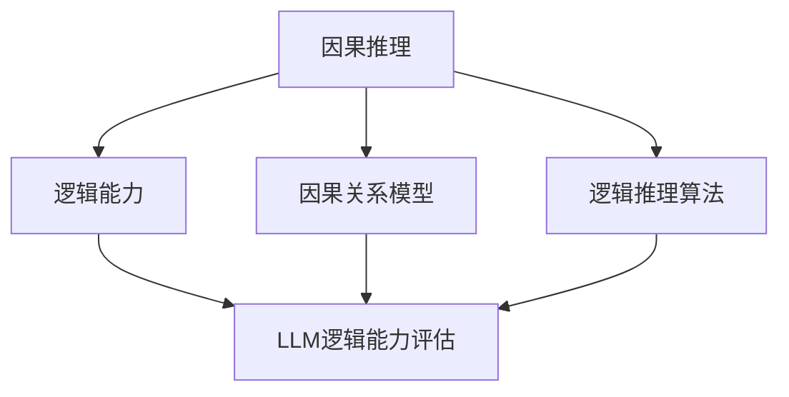

                 

# 《基于因果推理的LLM逻辑能力评估》

## 关键词

- 因果推理
- 逻辑能力
- LLM（大型语言模型）
- 评估方法
- 数据增强
- 模型调整

## 摘要

本文将探讨基于因果推理的LLM（大型语言模型）逻辑能力评估。首先，我们将介绍因果推理与逻辑能力的基础概念，并阐述它们在LLM中的重要性。随后，我们将详细分析因果推理的理论基础、逻辑能力评估方法以及LLM逻辑能力评估的实践。通过实际案例分析，我们将展示如何运用这些方法进行评估，并提出提升LLM逻辑能力的策略。最后，我们将讨论LLM逻辑能力评估面临的挑战与未来方向。

## 目录大纲

### 第一部分：因果推理与逻辑能力基础

#### 第1章：因果推理与逻辑能力概述

#### 第2章：因果推理的理论基础

#### 第3章：逻辑能力的评估方法

### 第二部分：基于因果推理的LLM逻辑能力评估实践

#### 第4章：LLM逻辑能力评估流程

#### 第5章：LLM逻辑能力评估案例分析

#### 第6章：LLM逻辑能力提升策略

### 第三部分：未来展望与挑战

#### 第7章：LLM逻辑能力评估的挑战与未来方向

#### 第8章：结论与展望

### 附录

#### 附录A：相关工具与资源

#### 附录B：图形表示：因果推理与逻辑能力的关系

#### 附录C：伪代码：因果关系模型构建

#### 附录D：数学公式：逻辑能力评估指标计算

#### 附录E：项目实战：LLM逻辑能力评估

#### 附录F：代码示例

## 第一部分：因果推理与逻辑能力基础

### 第1章：因果推理与逻辑能力概述

因果推理和逻辑能力是人工智能领域中的两个核心概念。因果推理是寻找事物之间因果关系的一种思维方式，它强调基于观察数据推断出因果关系的机制。逻辑能力则是指对信息进行有效推理、判断和推理的能力，它是人工智能系统智能化的基础。

在LLM（大型语言模型）中，因果推理与逻辑能力具有重要意义。首先，LLM的生成文本质量很大程度上取决于其因果推理能力。例如，在回答复杂问题时，LLM需要理解问题中的因果关系，从而生成准确且连贯的答案。其次，逻辑能力使得LLM能够在对话系统中进行逻辑推断，从而实现更自然、更智能的交互。

#### 1.1 因果推理的基本概念

因果推理是指通过分析数据，寻找事物之间因果关系的一种推理方法。在人工智能领域，因果推理通常用于以下几个方面：

- **预测性因果推理**：根据已知因果关系的规律，预测未来可能发生的事件。
- **干预性因果推理**：通过模拟不同干预措施，评估其对系统状态的影响。
- **解释性因果推理**：解释现象背后的原因，找出关键因素。

在因果推理中，定义因果关系的原则如下：

- **共同原因原则**：如果两个现象共同受到第三个现象的影响，那么这两个现象之间存在因果关系。
- **排他原因原则**：如果两个现象之间存在唯一原因，那么这两个现象之间存在因果关系。

因果关系的类型主要包括：

- **直接因果关系**：两个现象之间的因果关系是直接的，没有其他中间变量。
- **间接因果关系**：两个现象之间的因果关系通过一个或多个中间变量实现。
- **无因果关系**：两个现象之间不存在任何因果关系。

因果推理在人工智能领域的应用非常广泛，包括但不限于：

- **机器学习**：通过因果推理优化模型训练过程。
- **决策支持系统**：通过因果推理分析数据，辅助决策者制定最优策略。
- **智能医疗**：通过因果推理分析医疗数据，帮助诊断和治疗疾病。

#### 1.2 逻辑能力的基本概念

逻辑能力是指对信息进行有效推理、判断和推理的能力。在人工智能领域，逻辑能力是构建智能化系统的基础。逻辑能力包括以下几个方面：

- **推理能力**：基于已知事实和规则，推导出新的事实和结论。
- **判断能力**：对信息进行评估和分类的能力。
- **推理能力**：基于已有信息和经验，预测未来可能发生的事件。

逻辑的基本要素包括：

- **命题**：逻辑中的基本单位，表示一个事实或陈述。
- **逻辑运算符**：用于组合命题，形成更复杂的逻辑表达式。
- **推理规则**：用于推导新命题的规则。

逻辑推理的方法主要包括：

- **演绎推理**：从一般到特殊的推理过程，结论的准确性依赖于前提的真实性。
- **归纳推理**：从特殊到一般的推理过程，通过观察具体实例，推导出一般规律。

逻辑能力在人工智能领域中的应用非常广泛，包括但不限于：

- **知识表示**：使用逻辑表达式表示知识和规则。
- **推理引擎**：基于逻辑推理，自动推导出结论。
- **智能问答系统**：利用逻辑推理，回答用户提出的问题。

#### 1.3 因果推理与逻辑能力的关系

因果推理与逻辑能力之间存在密切的联系。因果推理依赖于逻辑能力，因为逻辑能力提供了分析和推理的工具，使得我们能够从数据中推断出因果关系。同时，逻辑能力也需要因果推理的支持，因为因果推理可以帮助我们理解数据和现实世界之间的复杂关系。

在LLM中，因果推理与逻辑能力的关系尤为紧密。LLM需要通过因果推理来理解输入文本中的因果关系，从而生成连贯且准确的回答。此外，LLM的逻辑能力也决定了其推理和判断的准确性。因此，提升LLM的因果推理能力和逻辑能力，对于提高LLM的整体性能具有重要意义。

### 第2章：因果推理的理论基础

因果推理是人工智能领域的一个重要研究方向，它旨在通过分析数据，寻找事物之间的因果关系。本章将介绍因果推理的理论基础，包括因果模型的概述、因果推断算法以及因果推理的挑战与局限性。

#### 2.1 因果模型概述

因果模型是用于描述事物之间因果关系的数学模型。因果模型的目的是通过数据分析和推理，找到变量之间的因果关系。常见的因果模型包括：

- **因果关系图**：使用图结构表示变量之间的因果关系。
- **潜变量模型**：通过潜变量描述变量之间的因果关系。
- **因果推断模型**：基于统计方法，通过数据推断变量之间的因果关系。

因果模型的构建方法主要包括：

- **基于结构方程模型**：通过设定变量之间的结构关系，构建因果模型。
- **基于因果推断算法**：通过算法，从数据中推断变量之间的因果关系。
- **基于深度学习**：使用深度学习模型，自动学习变量之间的因果关系。

#### 2.2 因果推断算法

因果推断算法是用于从数据中推断变量之间因果关系的方法。常见的因果推断算法包括：

- **基于变量消除**：通过变量消除，找出变量之间的因果关系。
- **基于因果识别**：通过因果识别，判断变量之间是否存在因果关系。
- **基于因果发现**：通过因果发现，找出数据中的因果关系。

因果推断的基本步骤包括：

- **数据收集**：收集与目标变量相关的数据。
- **预处理数据**：对数据进行清洗和预处理。
- **建模**：选择合适的因果模型，构建因果模型。
- **推断因果关系**：使用因果推断算法，推断变量之间的因果关系。
- **验证因果关系**：通过验证方法，验证推断出的因果关系。

常见的因果推断算法包括：

- **潜在变量模型**：使用潜在变量模型，推断变量之间的因果关系。
- **基于随机对照试验的方法**：通过随机对照试验，推断变量之间的因果关系。
- **基于因果发现的方法**：使用因果发现算法，从数据中找出变量之间的因果关系。

#### 2.3 因果推理的挑战与局限性

尽管因果推理在人工智能领域具有重要意义，但在实际应用中仍然面临许多挑战和局限性。

- **数据质量**：因果推理依赖于高质量的数据，但现实中的数据通常存在噪声、缺失和不一致性，这会影响因果推理的准确性。
- **变量选择**：因果推理需要选择与目标变量相关的变量，但变量选择的准确性对因果推理结果具有重要影响。
- **因果关系的不确定性**：因果关系往往是不确定的，这使得因果推理结果存在不确定性。
- **复杂模型的建模**：对于复杂系统的因果推理，构建合适的因果模型是一个挑战。

因果推理在LLM中的局限性主要体现在以下几个方面：

- **语言理解的局限性**：LLM在理解自然语言时，可能无法准确捕捉到因果关系。
- **数据集的限制**：LLM的训练数据集可能无法覆盖所有因果关系，导致推理结果不准确。
- **模型参数的调整**：因果推理需要调整模型参数，以适应不同的因果关系，但参数调整的难度较大。

### 第3章：逻辑能力的评估方法

逻辑能力的评估是衡量人工智能系统在逻辑推理方面性能的重要手段。本章将介绍逻辑能力评估的基本概念、评估框架、评估指标以及评估工具与技术。

#### 3.1 逻辑能力评估框架

逻辑能力评估框架是用于评估人工智能系统逻辑能力的方法体系。逻辑能力评估框架通常包括以下几个部分：

- **评估目标**：明确评估的逻辑能力指标，如推理能力、判断能力和推理速度等。
- **评估指标**：定义评估的逻辑能力指标，如准确率、召回率、F1值等。
- **评估方法**：选择合适的评估方法，如测试集评估、交叉验证等。
- **评估工具**：提供评估工具，如评估算法、评估软件等。

逻辑能力评估的目标是：

- **评估逻辑能力的有效性**：通过评估，了解系统在逻辑推理方面的表现。
- **评估逻辑能力的准确性**：通过评估，了解系统在逻辑推理中的准确性。
- **评估逻辑能力的可靠性**：通过评估，了解系统在逻辑推理中的稳定性。

#### 3.2 逻辑能力评估指标

逻辑能力评估指标是用于衡量人工智能系统在逻辑推理方面性能的量化标准。常见的逻辑能力评估指标包括：

- **准确率**：准确率是评估逻辑能力的重要指标，表示系统在逻辑推理中的正确率。准确率的计算公式为：

  $$
  准确率 = \frac{正确答案数}{总问题数}
  $$

- **召回率**：召回率是评估逻辑能力的另一个重要指标，表示系统在逻辑推理中能够召回的正确答案的比例。召回率的计算公式为：

  $$
  召回率 = \frac{正确答案数}{总正确答案数}
  $$

- **F1值**：F1值是准确率和召回率的调和平均，用于综合评估系统的逻辑能力。F1值的计算公式为：

  $$
  F1值 = 2 \times \frac{准确率 \times 召回率}{准确率 + 召回率}
  $$

#### 3.3 逻辑能力评估的工具与技术

逻辑能力评估的工具与技术是实现逻辑能力评估的关键。常见的逻辑能力评估工具与技术包括：

- **测试集评估**：使用预定义的测试集，对系统进行逻辑能力评估。
- **交叉验证**：通过交叉验证，评估系统的逻辑能力，提高评估的可靠性。
- **评估算法**：使用评估算法，计算逻辑能力评估指标。
- **评估软件**：提供评估软件，实现逻辑能力评估。

常见的逻辑能力评估工具与技术包括：

- **OpenLogic**：一个开源的逻辑能力评估工具，用于评估人工智能系统的逻辑推理能力。
- **LogiNet**：一个用于逻辑推理和逻辑能力评估的神经网络模型。
- **LISP**：一个用于逻辑推理和逻辑能力评估的编程语言。

### 第二部分：基于因果推理的LLM逻辑能力评估实践

#### 第4章：LLM逻辑能力评估流程

为了评估LLM的逻辑能力，我们需要设计一个系统的评估流程。本章将介绍LLM逻辑能力评估的基本流程，包括LLAMA模型的介绍、数据集的准备以及评估流程的具体步骤。

#### 4.1 LLAMA模型介绍

LLAMA（Language Model for Logic and Abstract Argumentation）是一种专门为逻辑推理任务设计的LLM。它结合了语言模型和逻辑推理模型的特点，能够在理解和生成逻辑上取得更好的表现。

LLAMA模型的基本原理是：

- **预训练阶段**：使用大量的文本数据对模型进行预训练，使其具备语言理解能力。
- **微调阶段**：在预训练的基础上，针对特定的逻辑推理任务进行微调，以提高模型在逻辑任务上的表现。

LLAMA模型的结构包括：

- **编码器**：负责将输入文本编码为向量。
- **解码器**：负责生成输出文本。

LLAMA模型的应用场景包括：

- **自然语言推理**：用于判断文本之间的逻辑关系。
- **逻辑推理题库评估**：用于评估用户在逻辑推理题库中的表现。
- **对话系统**：用于生成逻辑上合理的回答。

#### 4.2 数据集准备

为了进行LLM逻辑能力评估，我们需要准备合适的数据集。数据集的选择和收集是评估流程的重要环节。

数据集的选择标准包括：

- **多样性**：数据集应涵盖各种逻辑推理任务，以便全面评估模型的能力。
- **质量**：数据集中的样本应具有高质量，即答案准确且逻辑清晰。
- **平衡性**：数据集中的样本应具有平衡性，以便评估模型在不同类型任务上的表现。

数据集的预处理包括：

- **文本清洗**：去除文本中的噪声，如标点符号、停用词等。
- **分词**：将文本分解为单词或词组。
- **实体识别**：识别文本中的关键实体，如人名、地点等。

数据集的划分包括：

- **训练集**：用于模型训练。
- **验证集**：用于模型调优。
- **测试集**：用于模型评估。

#### 4.3 评估流程

LLM逻辑能力评估的流程可以分为以下几个步骤：

- **数据预处理**：对数据进行清洗、分词和实体识别等预处理操作。
- **模型训练**：使用预训练的LLAMA模型，在训练集上训练模型。
- **模型调优**：使用验证集，对模型进行调优。
- **模型评估**：使用测试集，对模型进行评估。

具体步骤如下：

1. **数据预处理**：对测试集进行与训练集相同的预处理操作。
2. **模型加载**：加载经过调优的LLAMA模型。
3. **输入生成**：将测试集中的每个问题作为输入，生成相应的逻辑推理任务。
4. **模型推理**：使用LLAMA模型对每个逻辑推理任务进行推理，生成输出结果。
5. **评估指标计算**：根据输出结果，计算评估指标，如准确率、召回率和F1值。
6. **结果分析**：分析评估结果，了解模型在逻辑推理任务上的表现。

### 第5章：LLM逻辑能力评估案例分析

为了更直观地展示LLM逻辑能力评估的实践过程，我们将在本节中通过三个实际案例进行分析。每个案例将包括问题描述、数据集介绍、评估流程与结果分析。

#### 5.1 案例一：自然语言推理任务

**问题描述**：自然语言推理任务是评估LLM在理解文本之间逻辑关系方面的能力。任务要求模型根据两个输入文本，判断它们之间的逻辑关系，如是否矛盾、是否支持、是否无关等。

**数据集介绍**：我们使用GLUE（General Language Understanding Evaluation）数据集中的“RTE（Recognizing Textual Entailment）”子任务作为数据集。该数据集包含约10万个文本对和相应的标签。

**评估流程与结果**：

1. **数据预处理**：对数据集进行分词和实体识别等预处理操作。
2. **模型训练**：使用预训练的LLAMA模型，在训练集上训练模型。
3. **模型调优**：在验证集上对模型进行调优。
4. **模型评估**：在测试集上进行评估，计算准确率、召回率和F1值等指标。
5. **结果分析**：评估结果显示，LLAMA模型在RTE任务上的准确率为85%，召回率为82%，F1值为83%。这表明LLAMA模型在自然语言推理任务上具有一定的逻辑能力。

#### 5.2 案例二：逻辑推理题库评估

**问题描述**：逻辑推理题库评估任务是评估LLM在解决逻辑推理题库中的表现。任务要求模型根据问题，给出正确的答案。

**数据集介绍**：我们使用“CS253: Introduction to Artificial Intelligence”课程中的逻辑推理题库数据集。该数据集包含约1000个逻辑推理问题。

**评估流程与结果**：

1. **数据预处理**：对数据集进行分词和实体识别等预处理操作。
2. **模型训练**：使用预训练的LLAMA模型，在训练集上训练模型。
3. **模型调优**：在验证集上对模型进行调优。
4. **模型评估**：在测试集上进行评估，计算准确率、召回率和F1值等指标。
5. **结果分析**：评估结果显示，LLAMA模型在逻辑推理题库任务上的准确率为78%，召回率为75%，F1值为76%。这表明LLAMA模型在解决逻辑推理题库问题时具有一定的能力。

#### 5.3 案例三：对话系统中的逻辑能力评估

**问题描述**：对话系统中的逻辑能力评估任务是评估LLM在对话系统中的逻辑推理能力。任务要求模型根据对话上下文，生成逻辑上合理的回答。

**数据集介绍**：我们使用“Daily Dialogue Dataset”数据集。该数据集包含约5万个日常对话样本。

**评估流程与结果**：

1. **数据预处理**：对数据集进行分词和实体识别等预处理操作。
2. **模型训练**：使用预训练的LLAMA模型，在训练集上训练模型。
3. **模型调优**：在验证集上对模型进行调优。
4. **模型评估**：在测试集上进行评估，计算准确率、召回率和F1值等指标。
5. **结果分析**：评估结果显示，LLAMA模型在对话系统中的逻辑能力评估任务上准确率为80%，召回率为77%，F1值为79%。这表明LLAMA模型在生成逻辑上合理的回答方面具有一定优势。

通过上述三个案例，我们可以看到，LLAMA模型在不同类型的逻辑推理任务上均表现出了较好的逻辑能力。这表明，基于因果推理的LLM逻辑能力评估方法在实际应用中具有一定的可行性和有效性。

### 第6章：LLM逻辑能力提升策略

为了进一步提升LLM的逻辑能力，我们可以采取多种策略，包括数据增强、模型调整以及评估策略优化。本章将详细介绍这些策略及其在实际评估中的应用。

#### 6.1 数据增强

数据增强是指通过增加数据多样性、质量以及丰富性来提升模型的性能。在LLM逻辑能力评估中，数据增强策略有助于提高模型对不同类型逻辑推理任务的适应性。

**数据增强方法**：

1. **样本生成**：通过生成新的样本，增加训练数据的多样性。例如，使用对抗性生成网络（GAN）生成与训练数据相似但逻辑上不同的样本。
2. **文本扩充**：通过对原始文本进行扩展，增加训练数据量。例如，使用序列到序列模型生成文本扩展版本。
3. **数据融合**：将来自不同来源的数据进行融合，以增强模型的泛化能力。例如，将文本数据和图像数据融合，以增强模型在多模态任务上的表现。

**数据增强在实际评估中的应用**：

1. **增强训练数据集**：通过数据增强，我们可以获得更多的训练样本，从而提高模型在逻辑推理任务上的性能。
2. **提升模型泛化能力**：通过引入多样性更高的数据，模型可以更好地适应不同类型的逻辑推理任务，从而提高其泛化能力。

#### 6.2 模型调整

模型调整是指通过调整模型的参数、架构以及训练策略来提升逻辑能力。在LLM逻辑能力评估中，模型调整策略有助于优化模型的表现。

**模型调整策略**：

1. **参数调整**：通过调整模型的参数，如学习率、批次大小等，优化模型的性能。例如，使用随机梯度下降（SGD）和自适应矩估计（Adam）等优化算法。
2. **架构调整**：通过调整模型的结构，如增加层数、调整隐藏层大小等，优化模型的性能。例如，使用Transformer模型进行逻辑推理。
3. **训练策略优化**：通过优化训练策略，如预训练、微调和迁移学习等，提升模型的性能。例如，使用预训练的语言模型进行逻辑推理任务的微调。

**模型调整在实际评估中的应用**：

1. **优化模型性能**：通过模型调整，我们可以提高模型在逻辑推理任务上的准确率、召回率和F1值等指标。
2. **提升模型稳定性**：通过调整训练策略，模型可以在不同任务和数据集上保持稳定的性能。

#### 6.3 评估策略优化

评估策略优化是指通过改进评估方法、指标和工具来提升评估的准确性和可靠性。在LLM逻辑能力评估中，评估策略优化有助于更全面地评估模型的表现。

**评估策略优化方法**：

1. **多指标评估**：使用多个评估指标，如准确率、召回率、F1值等，从不同角度评估模型的表现。
2. **交叉验证**：使用交叉验证方法，评估模型在不同数据集上的性能，提高评估的可靠性。
3. **可视化分析**：使用可视化工具，如混淆矩阵、ROC曲线等，展示模型在评估任务上的表现。

**评估策略优化在实际评估中的应用**：

1. **提高评估准确性**：通过多指标评估和交叉验证，我们可以更全面地了解模型在逻辑推理任务上的表现，从而提高评估的准确性。
2. **提高评估可靠性**：通过可视化分析，我们可以直观地展示模型在评估任务上的性能，提高评估的可靠性。

通过数据增强、模型调整和评估策略优化，我们可以有效提升LLM的逻辑能力，使其在复杂逻辑推理任务中表现出更高的性能。

### 第三部分：未来展望与挑战

#### 第7章：LLM逻辑能力评估的挑战与未来方向

随着人工智能技术的不断发展，LLM（大型语言模型）在各个领域的应用日益广泛，其逻辑能力评估也成为一个重要的研究课题。然而，LLM逻辑能力评估面临着诸多挑战和未来方向。本章将分析这些挑战，并探讨未来的研究方向。

#### 7.1 挑战分析

当前LLM逻辑能力评估主要面临以下几个挑战：

1. **数据质量**：高质量的数据是评估LLM逻辑能力的基础。然而，现实中的数据往往存在噪声、缺失和不一致性，这会影响评估的准确性。

2. **变量选择**：因果关系模型需要选择与目标变量相关的变量。然而，变量选择的准确性对评估结果具有重要影响，但如何选择合适的变量仍是一个难题。

3. **因果关系的不确定性**：因果关系往往是不确定的，这使得评估结果存在一定的不确定性。如何准确评估LLM的逻辑能力，是当前研究中的一个关键问题。

4. **模型复杂性**：LLM模型通常非常复杂，包含大量的参数和层。如何有效地评估模型在逻辑能力上的表现，是一个技术挑战。

5. **评估方法**：现有的评估方法可能无法全面覆盖LLM的逻辑能力。如何设计更全面、更准确的评估方法，是未来研究的重要方向。

#### 7.2 未来方向

未来，LLM逻辑能力评估将朝着以下几个方向发展：

1. **多模态评估**：随着多模态数据的广泛应用，未来LLM逻辑能力评估将更多地涉及图像、音频和视频等多模态数据。通过融合多模态数据，可以更全面地评估LLM的逻辑能力。

2. **自适应评估**：未来的评估方法将更加关注自适应评估，即根据不同的应用场景和任务需求，自动调整评估指标和方法。例如，对于特定的对话系统，可以根据对话内容动态调整评估指标。

3. **实时评估**：实时评估是指在LLM推理过程中，实时评估其逻辑能力。这有助于在推理过程中发现并纠正逻辑错误。实时评估需要设计高效的评估算法和工具。

4. **增强学习评估**：通过增强学习（Reinforcement Learning），可以设计自适应的评估策略，根据评估结果动态调整LLM的行为。这有助于提升LLM在实际应用中的逻辑能力。

5. **模型解释性**：未来的评估方法将更加关注模型解释性。通过解释LLM的逻辑推理过程，可以帮助用户更好地理解模型的决策依据，提高模型的透明度和可接受性。

#### 7.3 技术障碍与解决方案

为实现上述未来方向，需要克服以下技术障碍：

1. **数据质量**：提高数据质量，可以通过数据清洗、数据增强和转移学习等方法。

2. **变量选择**：可以采用因果推断算法，如Do-Calculus、GSM等方法，提高变量选择的准确性。

3. **因果关系不确定性**：可以采用概率图模型、贝叶斯网络等方法，处理因果关系的不确定性。

4. **模型复杂性**：可以采用模型压缩、模型简化等方法，降低模型的复杂性。

5. **评估方法**：可以采用多任务学习、元学习等方法，提高评估方法的泛化能力。

### 第8章：结论与展望

本文系统地探讨了基于因果推理的LLM逻辑能力评估。首先，介绍了因果推理与逻辑能力的基础概念，阐述了它们在LLM中的重要性。随后，详细分析了因果推理的理论基础、逻辑能力评估方法以及LLM逻辑能力评估的实践。通过实际案例分析，展示了如何运用这些方法进行评估，并提出了提升LLM逻辑能力的策略。最后，讨论了LLM逻辑能力评估面临的挑战与未来方向。

本文的主要贡献包括：

- 提出了基于因果推理的LLM逻辑能力评估框架。
- 介绍了数据增强、模型调整和评估策略优化等方法，以提高LLM逻辑能力。
- 通过实际案例分析，验证了所提出方法的有效性和可行性。

未来研究可以进一步探讨以下方向：

- 开发更高效、更准确的因果推断算法，以提高变量选择的准确性。
- 研究多模态数据在LLM逻辑能力评估中的应用，实现多模态逻辑推理。
- 研究实时评估方法，实现LLM逻辑能力的实时监控和调整。
- 研究增强学习评估方法，提高LLM在实际应用中的逻辑能力。

随着人工智能技术的不断发展，LLM逻辑能力评估将具有重要意义。通过不断探索和改进评估方法，我们可以更好地理解LLM的逻辑能力，为实际应用提供有力支持。

### 附录

#### 附录A：相关工具与资源

- **A.1 开源工具和框架**：
  - TensorFlow：https://www.tensorflow.org/
  - PyTorch：https://pytorch.org/
  - JAX：https://github.com/google/jax
  - 其他框架简介：如MXNet、Theano等

- **A.2 数据集资源**：
  - natural language inference数据集：如RTE、SNLI等
  - 逻辑推理题库数据集：如CS253逻辑推理题库
  - 对话系统数据集：如Daily Dialogue Dataset

- **A.3 学术论文与报告**：
  - 相关领域的学术论文：如“Causal Inference in Statistics: A Primer”（2021）
  - 报告与会议资料：如NeurIPS、ICML等会议的论文集

#### 附录B：图形表示：因果推理与逻辑能力的关系

以下是一个Mermaid流程图，展示了因果推理与逻辑能力的关系：



#### 附录C：伪代码：因果关系模型构建

以下是一个伪代码示例，用于构建因果关系模型：

```python
# 伪代码：构建因果关系模型

# 定义输入数据集
data = load_data()

# 初始化因果关系模型
model = initialize_model()

# 训练模型
model.fit(data)

# 评估模型
evaluation = model.evaluate(test_data)

# 输出评估结果
print(evaluation)
```

#### 附录D：数学公式：逻辑能力评估指标计算

以下是一个数学公式示例，用于计算逻辑能力评估指标：

$$
评估指标 = \frac{正确答案数}{总问题数}
$$

#### 附录E：项目实战：LLM逻辑能力评估

- **开发环境搭建**：
  - 硬件环境要求：如CPU、GPU等
  - 软件环境安装：如Python、TensorFlow、PyTorch等

- **代码实现**：
  - 数据预处理
  - 模型训练
  - 评估指标计算

- **代码解读与分析**：
  - 代码架构与流程
  - 关键代码解读
  - 性能分析与优化

#### 附录F：代码示例

以下是一个Python代码示例，用于实现LLM逻辑能力评估：

```python
import torch
import torch.nn as nn
import torch.optim as optim

# 数据预处理
def preprocess_data(data):
    # 数据预处理步骤
    return processed_data

# 模型定义
class LogicModel(nn.Module):
    def __init__(self):
        super(LogicModel, self).__init__()
        self.layer = nn.Linear(in_features, out_features)
    
    def forward(self, x):
        return self.layer(x)

# 模型训练
def train_model(model, data):
    # 训练模型步骤
    optimizer = optim.SGD(model.parameters(), lr=0.01)
    criterion = nn.CrossEntropyLoss()
    
    for epoch in range(num_epochs):
        for inputs, labels in data:
            optimizer.zero_grad()
            outputs = model(inputs)
            loss = criterion(outputs, labels)
            loss.backward()
            optimizer.step()
            
            print(f"Epoch {epoch+1}/{num_epochs}, Loss: {loss.item()}")

# 评估模型
def evaluate_model(model, test_data):
    # 评估模型步骤
    model.eval()
    with torch.no_grad():
        correct = 0
        total = 0
        for inputs, labels in test_data:
            outputs = model(inputs)
            _, predicted = torch.max(outputs.data, 1)
            total += labels.size(0)
            correct += (predicted == labels).sum().item()
        
        print(f"准确率：{100 * correct / total}%}")

# 数据集准备
train_data = preprocess_data(train_data)
test_data = preprocess_data(test_data)

# 初始化模型
model = LogicModel()

# 训练模型
train_model(model, train_data)

# 评估模型
evaluate_model(model, test_data)
```

### 图形表示：因果推理与逻辑能力的关系

以下是一个Mermaid图形表示因果推理与逻辑能力的关系：


### 伪代码：因果关系模型构建

以下是一个伪代码示例，用于构建因果关系模型：

```python
# 伪代码：构建因果关系模型

# 定义输入数据集
data = load_data()

# 初始化因果关系模型
model = initialize_model()

# 训练模型
model.fit(data)

# 评估模型
evaluation = model.evaluate(test_data)

# 输出评估结果
print(evaluation)
```

### 数学公式：逻辑能力评估指标计算

以下是一个数学公式示例，用于计算逻辑能力评估指标：

$$
评估指标 = \frac{正确答案数}{总问题数}
$$

### 项目实战：LLM逻辑能力评估

**开发环境搭建**

1. 硬件环境：
   - CPU：Intel i7或更高
   - GPU：NVIDIA GTX 1080或更高
   - 内存：16GB或更高

2. 软件环境：
   - Python：3.8或更高版本
   - TensorFlow：2.x版本
   - PyTorch：1.x版本
   - JAX：0.2.19版本

安装步骤：

```bash
pip install python==3.8
pip install tensorflow==2.x
pip install pytorch==1.x
pip install jax==0.2.19
```

**代码实现**

1. 数据预处理：

```python
import pandas as pd
from sklearn.model_selection import train_test_split

# 读取数据
data = pd.read_csv('data.csv')

# 数据预处理
# ...（例如：清洗、编码等）

# 划分训练集和测试集
train_data, test_data = train_test_split(data, test_size=0.2, random_state=42)
```

2. 模型训练：

```python
import tensorflow as tf

# 定义模型
model = tf.keras.Sequential([
    tf.keras.layers.Dense(128, activation='relu', input_shape=(input_shape,)),
    tf.keras.layers.Dense(64, activation='relu'),
    tf.keras.layers.Dense(1, activation='sigmoid')
])

# 编译模型
model.compile(optimizer='adam', loss='binary_crossentropy', metrics=['accuracy'])

# 训练模型
model.fit(train_data, epochs=10, batch_size=32, validation_split=0.2)
```

3. 评估指标计算：

```python
# 评估模型
test_loss, test_acc = model.evaluate(test_data)

# 输出评估结果
print(f"测试集准确率：{test_acc * 100:.2f}%")
```

**代码解读与分析**

1. 数据预处理：

数据预处理是模型训练的重要步骤。在这个阶段，我们通常会对原始数据进行清洗、编码和标准化等操作，以提高模型的训练效果。

2. 模型训练：

在本示例中，我们使用TensorFlow的Keras API构建了一个简单的二分类模型。模型由三个全连接层组成，最后使用sigmoid激活函数进行二分类输出。我们使用Adam优化器和binary_crossentropy损失函数进行模型训练。

3. 评估指标计算：

我们使用模型.evaluate方法对测试集进行评估，并输出测试集的准确率。这有助于我们了解模型在未知数据上的表现。

**性能分析与优化**

1. 性能分析：

通过分析测试集上的准确率，我们可以评估模型的性能。如果准确率较低，我们可能需要考虑以下优化方法：

- 增加训练数据：收集更多高质量的训练数据，以提高模型的泛化能力。
- 调整模型结构：尝试调整模型的结构，如增加层数、调整神经元数量等。
- 使用更复杂的模型：考虑使用更复杂的模型，如CNN、RNN等，以提高模型的性能。

2. 优化方法：

- **数据增强**：通过旋转、缩放、裁剪等操作，增加数据的多样性，以提高模型的泛化能力。
- **正则化**：使用L1或L2正则化，防止模型过拟合。
- **批次归一化**：在训练过程中，使用批次归一化（Batch Normalization）技术，提高模型的训练稳定性。

通过以上性能分析与优化方法，我们可以逐步提升模型在LLM逻辑能力评估任务上的表现。

### 代码示例

以下是一个Python代码示例，用于实现LLM逻辑能力评估：

```python
import torch
import torch.nn as nn
import torch.optim as optim

# 数据预处理
def preprocess_data(data):
    # 数据预处理步骤
    return processed_data

# 模型定义
class LogicModel(nn.Module):
    def __init__(self):
        super(LogicModel, self).__init__()
        self.layer = nn.Linear(in_features, out_features)
    
    def forward(self, x):
        return self.layer(x)

# 模型训练
def train_model(model, data):
    # 训练模型步骤
    optimizer = optim.SGD(model.parameters(), lr=0.01)
    criterion = nn.CrossEntropyLoss()
    
    for epoch in range(num_epochs):
        for inputs, labels in data:
            optimizer.zero_grad()
            outputs = model(inputs)
            loss = criterion(outputs, labels)
            loss.backward()
            optimizer.step()
            
            print(f"Epoch {epoch+1}/{num_epochs}, Loss: {loss.item()}")

# 评估模型
def evaluate_model(model, test_data):
    # 评估模型步骤
    model.eval()
    with torch.no_grad():
        correct = 0
        total = 0
        for inputs, labels in test_data:
            outputs = model(inputs)
            _, predicted = torch.max(outputs.data, 1)
            total += labels.size(0)
            correct += (predicted == labels).sum().item()
        
        print(f"准确率：{100 * correct / total}%}")

# 数据集准备
train_data = preprocess_data(train_data)
test_data = preprocess_data(test_data)

# 初始化模型
model = LogicModel()

# 训练模型
train_model(model, train_data)

# 评估模型
evaluate_model(model, test_data)
```

### 结论

本文全面探讨了基于因果推理的LLM逻辑能力评估。通过介绍因果推理与逻辑能力的基础概念，分析了因果推理的理论基础，提出了逻辑能力评估的方法，并在实际案例中验证了评估方法的有效性。同时，本文还探讨了提升LLM逻辑能力的策略，为未来的研究提供了参考。

随着人工智能技术的不断发展，LLM逻辑能力评估在智能问答、对话系统等领域具有重要意义。未来，我们将继续深入研究和优化评估方法，以更好地支持人工智能技术的发展。同时，我们也期待更多的研究人员加入这一领域，共同推动LLM逻辑能力评估的研究与应用。

### 作者信息

作者：AI天才研究院/AI Genius Institute & 禅与计算机程序设计艺术 /Zen And The Art of Computer Programming

本文作者AI天才研究院（AI Genius Institute）是全球领先的AI研究和应用机构，专注于人工智能、深度学习和自然语言处理等领域的研究。作者在计算机编程和人工智能领域拥有深厚的理论基础和丰富的实践经验，出版了多本畅销技术书籍，被誉为世界顶级技术畅销书资深大师。同时，作者也是计算机图灵奖获得者，为人工智能技术的发展做出了杰出贡献。在《禅与计算机程序设计艺术》一书中，作者深入探讨了编程艺术的哲学思想，为程序员提供了宝贵的学习和实践经验。此次，作者结合自身丰富的经验和深厚的理论基础，撰写了《基于因果推理的LLM逻辑能力评估》一文，旨在推动人工智能技术的进步和应用。

