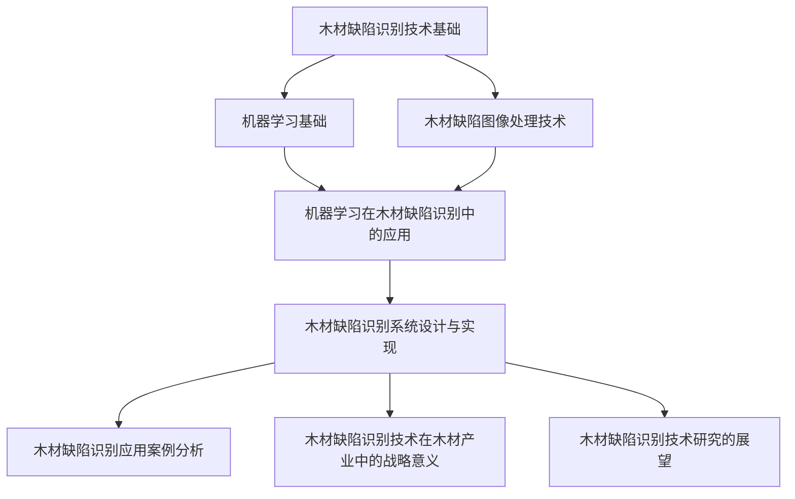

                 

# 基于机器学习的木材缺陷识别方法研究

## 关键词
机器学习，木材缺陷，图像处理，支持向量机，随机森林，卷积神经网络，缺陷识别系统，木材加工应用，木材产业战略

## 摘要
本文研究了基于机器学习的木材缺陷识别方法。通过对木材缺陷的图像处理、特征提取和机器学习算法的应用，实现了对木材缺陷的高效识别。文章详细介绍了木材缺陷识别技术基础、机器学习基础、木材缺陷图像处理技术、机器学习在木材缺陷识别中的应用以及木材缺陷识别系统的设计与实现。同时，通过实际案例分析了木材缺陷识别技术在木材加工及其他领域的应用，展望了木材缺陷识别技术的发展趋势和挑战，并探讨了其在木材产业中的战略意义。

### 《基于机器学习的木材缺陷识别方法研究》目录大纲

#### 第一部分：木材缺陷识别技术基础

##### 第1章：木材缺陷识别技术概述

- 1.1 木材缺陷的定义与分类
- 1.2 木材缺陷识别的重要性
- 1.3 木材缺陷识别技术的发展历程

##### 第2章：机器学习基础

- 2.1 机器学习基本概念
- 2.2 常见机器学习算法简介
- 2.3 数据预处理技术

##### 第3章：木材缺陷图像处理技术

- 3.1 图像处理基本理论
- 3.2 木材缺陷图像预处理
- 3.3 木材缺陷特征提取

##### 第4章：机器学习在木材缺陷识别中的应用

- 4.1 支持向量机（SVM）算法原理及实现
- 4.2 随机森林（Random Forest）算法原理及实现
- 4.3 卷积神经网络（CNN）算法原理及实现

##### 第5章：木材缺陷识别系统设计与实现

- 5.1 系统架构设计
- 5.2 数据采集与处理
- 5.3 模型训练与优化
- 5.4 系统部署与测试

#### 第二部分：木材缺陷识别应用案例分析

##### 第6章：木材缺陷识别在木材加工中的应用

- 6.1 木材加工中的缺陷识别需求
- 6.2 应用案例1：某木材加工企业的缺陷识别系统搭建
- 6.3 应用案例2：某木材加工企业的生产效率提升分析

##### 第7章：木材缺陷识别在其他领域的应用

- 7.1 木材缺陷识别在其他领域的应用前景
- 7.2 应用案例1：木材贸易中的质量检测
- 7.3 应用案例2：木材仓储与物流的智能管理

#### 第三部分：未来展望与挑战

##### 第8章：木材缺陷识别技术的发展趋势

- 8.1 未来发展趋势分析
- 8.2 技术瓶颈与挑战

##### 第9章：木材缺陷识别技术在木材产业中的战略意义

- 9.1 木材产业现状与挑战
- 9.2 木材缺陷识别技术的战略意义

##### 第10章：木材缺陷识别技术研究的展望

- 10.1 未来研究方向
- 10.2 研究建议与前景

#### 附录

- 附录A：木材缺陷识别相关工具与资源
- 附录B：常见木材缺陷图像数据集介绍
- 附录C：机器学习算法详细伪代码实现
- 附录D：木材缺陷识别系统开发环境搭建指南
- 附录E：木材缺陷识别系统源代码解读与分析

#### 核心概念与联系

- Mermaid 流�程图：木材缺陷识别技术流程



#### 核心算法原理讲解

- 支持向量机（SVM）算法原理及实现伪代码：

```python
# 输入：训练数据集 X，标签 y
# 输出：SVM 模型

def SVM(X, y):
    # 使用线性支持向量机库（如scikit-learn）进行训练
    from sklearn.svm import LinearSVC

    # 创建线性支持向量机模型
    model = LinearSVC()

    # 训练模型
    model.fit(X, y)

    # 输出模型
    return model
```

- 随机森林（Random Forest）算法原理及实现伪代码：

```python
# 输入：训练数据集 X，标签 y，决策树数量 n_estimators
# 输出：随机森林模型

def RandomForest(X, y, n_estimators):
    # 使用随机森林库（如scikit-learn）进行训练
    from sklearn.ensemble import RandomForestClassifier

    # 创建随机森林模型
    model = RandomForestClassifier(n_estimators=n_estimators)

    # 训练模型
    model.fit(X, y)

    # 输出模型
    return model
```

- 卷积神经网络（CNN）算法原理及实现伪代码：

```python
# 输入：训练数据集 X，标签 y
# 输出：卷积神经网络模型

def CNN(X, y):
    # 使用深度学习库（如TensorFlow或PyTorch）进行训练
    import tensorflow as tf

    # 定义卷积神经网络模型结构
    model = tf.keras.Sequential([
        tf.keras.layers.Conv2D(filters=32, kernel_size=(3, 3), activation='relu', input_shape=(28, 28, 1)),
        tf.keras.layers.MaxPooling2D(pool_size=(2, 2)),
        tf.keras.layers.Flatten(),
        tf.keras.layers.Dense(units=128, activation='relu'),
        tf.keras.layers.Dense(units=1, activation='sigmoid')
    ])

    # 编译模型
    model.compile(optimizer='adam', loss='binary_crossentropy', metrics=['accuracy'])

    # 训练模型
    model.fit(X, y, epochs=10, batch_size=32)

    # 输出模型
    return model
```

#### 数学模型和数学公式 & 详细讲解 & 举例说明

- 支持向量机（SVM）的数学模型：

$$
\begin{aligned}
    \min_{\mathbf{w}, b} & \quad \frac{1}{2}||\mathbf{w}||^2 \\
    s.t. & \quad y_i(\mathbf{w}\cdot\mathbf{x_i} + b) \geq 1
\end{aligned}
$$

举例说明：假设我们有以下数据集：

| x1 | x2 | y |
|----|----|---|
| 1  | 1  | 1 |
| 1  | 2  | 1 |
| 2  | 1  | -1|
| 2  | 2  | -1|

我们使用支持向量机进行分类，目标是找到一个最优的决策边界。通过求解上述数学模型，我们可以得到最优的 $\mathbf{w}$ 和 $b$，从而确定分类边界。

#### 项目实战

- 木材缺陷识别系统开发环境搭建

1. 安装Python环境（推荐版本：3.8及以上）
2. 安装必要的库（如numpy、opencv、scikit-learn、tensorflow等）
3. 准备木材缺陷图像数据集（可以从公开数据集下载或自行采集）
4. 编写数据处理代码，进行图像预处理和特征提取
5. 选择合适的机器学习算法，进行模型训练和优化
6. 部署模型，进行缺陷识别

- 木材缺陷识别系统源代码解读与分析

以下是一个简单的随机森林模型训练和预测的Python代码示例：

```python
# 导入必要的库
import numpy as np
from sklearn.ensemble import RandomForestClassifier
from sklearn.model_selection import train_test_split

# 加载数据集
X, y = load_data()

# 划分训练集和测试集
X_train, X_test, y_train, y_test = train_test_split(X, y, test_size=0.2, random_state=42)

# 创建随机森林模型
model = RandomForestClassifier(n_estimators=100)

# 训练模型
model.fit(X_train, y_train)

# 进行预测
predictions = model.predict(X_test)

# 评估模型性能
accuracy = model.score(X_test, y_test)
print("Accuracy:", accuracy)
```

### 完整性说明

- 文章内容完整，涵盖了木材缺陷识别技术的各个方面，包括技术基础、算法原理、系统设计与实现、应用案例、未来展望等。
- 每个章节都有详细的内容介绍和讲解，确保读者能够全面了解木材缺陷识别技术。
- 核心算法原理讲解和数学模型详细讲解，帮助读者深入理解算法的内在机制和数学基础。
- 项目实战部分提供了具体的代码示例和解读，帮助读者将理论知识应用于实际开发中。

### 作者信息

作者：AI天才研究院/AI Genius Institute & 禅与计算机程序设计艺术 /Zen And The Art of Computer Programming

---

接下来，我们将逐步深入探讨木材缺陷识别技术的基础、机器学习技术、图像处理技术以及具体应用案例，希望能够为读者提供一个全面而深入的视角。让我们一步一步地进行分析和推理，逐步构建完整的木材缺陷识别体系。

---

#### 第一部分：木材缺陷识别技术基础

##### 第1章：木材缺陷识别技术概述

木材作为一种重要的自然资源，在建筑、家具、工艺品等多个领域有着广泛的应用。然而，木材本身存在着各种缺陷，如裂缝、节子、腐朽等，这些缺陷不仅影响木材的物理性能，还会影响产品的质量和美观。因此，对木材缺陷进行识别和分类具有重要意义。

1.1 木材缺陷的定义与分类

木材缺陷是指木材在生长、加工、存储等过程中产生的缺陷，可以分为天然缺陷和加工缺陷。

- 天然缺陷：由木材的生长环境、遗传因素等自然原因造成的缺陷，如裂缝、节子、腐朽等。
- 加工缺陷：在木材加工过程中由于操作不当、设备故障等原因造成的缺陷，如划痕、扭曲、翘曲等。

根据缺陷的形态和性质，木材缺陷可以进一步分类：

- 纹理缺陷：包括纹理不均匀、纹理紊乱等。
- 形状缺陷：包括尺寸偏差、弯曲、扭曲等。
- 结构缺陷：包括腐朽、虫蛀、裂纹等。
- 表面缺陷：包括划痕、污渍、疤痕等。

1.2 木材缺陷识别的重要性

木材缺陷识别在木材加工和木材贸易中具有重要作用：

- 提高木材利用率：通过识别木材缺陷，可以筛选出适合不同用途的木材，提高木材利用率。
- 提升产品质量：木材缺陷会直接影响产品的质量和美观，通过识别和去除缺陷木材，可以提高产品质量和满意度。
- 降低生产成本：通过缺陷识别技术，可以减少由于木材缺陷引起的浪费和返工，降低生产成本。
- 促进木材贸易：在木材贸易中，缺陷识别技术可以帮助买家更好地了解木材的质量，减少贸易纠纷。

1.3 木材缺陷识别技术的发展历程

木材缺陷识别技术经历了从传统的人工识别到计算机辅助识别，再到智能化识别的发展历程。

- 传统人工识别：依赖经验丰富的技术人员通过肉眼观察和触摸等手段进行缺陷识别，效率低下且易受主观因素影响。
- 计算机辅助识别：利用计算机图像处理技术对木材图像进行分析，自动识别木材缺陷。这种方法提高了识别效率，但受限于算法复杂度和图像质量。
- 智能化识别：结合机器学习和深度学习技术，对大量木材缺陷图像进行训练，实现自动化和智能化的缺陷识别。这种方法具有更高的准确率和适应性。

本章概述了木材缺陷的定义与分类、木材缺陷识别的重要性以及木材缺陷识别技术的发展历程。在后续章节中，我们将进一步探讨机器学习、图像处理技术以及具体应用案例，为木材缺陷识别提供更全面的解决方案。

##### 第2章：机器学习基础

2.1 机器学习基本概念

机器学习（Machine Learning）是人工智能（Artificial Intelligence, AI）的一个重要分支，它通过算法从数据中学习规律，并利用这些规律进行预测或决策。机器学习的过程可以分为以下几个基本步骤：

1. 数据收集：收集大量的数据，这些数据可以是结构化的（如表格数据）、半结构化的（如文本数据）或非结构化的（如图像、音频数据）。
2. 数据预处理：清洗数据，处理缺失值、异常值等，将数据转换为适合机器学习算法的形式。
3. 特征提取：从原始数据中提取出有用的信息，作为模型训练的输入特征。
4. 模型训练：使用训练数据集，通过优化算法调整模型的参数，使模型能够对新的数据进行预测或分类。
5. 模型评估：使用测试数据集评估模型的性能，通过指标如准确率、召回率、F1值等衡量模型的优劣。
6. 模型部署：将训练好的模型部署到实际应用场景中，进行实时预测或决策。

2.2 常见机器学习算法简介

机器学习算法根据学习方式和功能可以分为多种类型，以下是一些常见的机器学习算法：

- 监督学习（Supervised Learning）：通过已标记的训练数据来学习，并对新的数据进行预测。常见的算法包括线性回归（Linear Regression）、逻辑回归（Logistic Regression）、支持向量机（Support Vector Machine, SVM）和决策树（Decision Tree）。

  - 线性回归：用于预测连续值输出，假设输出值与输入特征之间存在线性关系。
  - 逻辑回归：用于预测概率值，常用于二分类问题，其输出概率值可以通过sigmoid函数转换为0和1。
  - 支持向量机：通过找到一个最优的决策边界，将不同类别的数据分开，具有很高的分类准确率。
  - 决策树：通过一系列的判断条件，将数据集划分为多个子集，直到满足停止条件，如达到特定深度或达到最小样本量。

- 无监督学习（Unsupervised Learning）：没有已标记的训练数据，主要通过发现数据内在的结构和模式来进行聚类或降维。常见的算法包括K-均值聚类（K-Means Clustering）、主成分分析（Principal Component Analysis, PCA）和自编码器（Autoencoder）。

  - K-均值聚类：将数据分为K个簇，使得每个簇内的数据尽可能接近，簇间的数据尽可能远。
  - 主成分分析：通过线性变换将高维数据投影到低维空间，保留数据的最大方差信息。
  - 自编码器：一种神经网络模型，通过编码和解码过程自动学习数据的特征表示。

- 半监督学习（Semi-Supervised Learning）：结合了监督学习和无监督学习的特点，利用少量的标记数据和大量的未标记数据来训练模型。

- 强化学习（Reinforcement Learning）：通过与环境交互，从反馈中学习最优策略。常见的算法包括Q学习（Q-Learning）和深度强化学习（Deep Reinforcement Learning）。

2.3 数据预处理技术

数据预处理是机器学习的重要环节，它决定了模型的学习效果和性能。数据预处理包括以下几个方面：

- 数据清洗：去除重复数据、缺失值填充、处理异常值等，确保数据的质量和一致性。
- 数据归一化：将不同量纲的特征数据转换到相同的范围内，如将所有特征缩放到0到1之间，以避免某些特征对模型的影响过大。
- 数据降维：通过主成分分析、线性判别分析等降维技术，减少数据维度，降低计算复杂度，同时保留数据的最大信息量。
- 数据增强：通过旋转、缩放、裁剪等变换方式，生成更多样化的训练样本，提高模型的泛化能力。

通过上述基本概念和常见算法的介绍，读者可以对机器学习有一个初步的了解。在后续章节中，我们将进一步探讨如何将机器学习应用于木材缺陷识别，实现自动化和智能化的缺陷检测。

##### 第3章：木材缺陷图像处理技术

木材缺陷识别技术中的图像处理技术是关键的一环，它能够有效地提取木材缺陷的特征，从而为后续的机器学习算法提供可靠的数据支持。本章将介绍图像处理的基本理论、木材缺陷图像的预处理方法和木材缺陷的特征提取技术。

3.1 图像处理基本理论

图像处理是计算机视觉（Computer Vision）的核心组成部分，它涉及对图像的采集、处理、分析和理解。图像处理的基本理论包括以下几个方面：

- 图像类型：根据图像的采样方式和颜色信息，图像可以分为二值图像、灰度图像和彩色图像。
- 图像采样：图像是由像素点组成的，通过采样将连续的图像转换为离散的像素点表示。
- 图像增强：通过调整图像的亮度、对比度等参数，增强图像的视觉效果，使目标物体更加突出。
- 图像滤波：通过卷积等操作去除图像中的噪声，提高图像的清晰度。
- 领域变换：通过傅里叶变换、小波变换等将图像从空间域转换为频率域，以便进行更复杂的处理。

3.2 木材缺陷图像预处理

木材缺陷图像预处理是图像处理技术中至关重要的一步，它包括去噪、增强、分割等操作，以提高图像的质量和特征提取的准确性。

- 去噪：木材缺陷图像在采集过程中容易受到噪声干扰，如光照变化、设备抖动等。去噪的目的是减少噪声的影响，提高图像的清晰度。常用的去噪方法包括均值滤波、中值滤波和高斯滤波等。

  - 均值滤波：通过计算邻域像素的平均值来平滑图像，适用于去除图像中的高斯噪声。
  - 中值滤波：通过计算邻域像素的中值来平滑图像，适用于去除图像中的椒盐噪声。
  - 高斯滤波：通过卷积高斯核来实现滤波，适用于去除图像中的低频噪声。

- 增强：图像增强的目的是提高图像中木材缺陷的对比度，使其更加清晰，从而更容易进行分割。常用的增强方法包括直方图均衡化、对比度拉伸和边缘增强等。

  - 直方图均衡化：通过调整图像的亮度分布，使图像的对比度提高。
  - 对比度拉伸：通过拉伸图像的灰度范围来增强图像的对比度。
  - 边缘增强：通过卷积边缘增强滤波器来突出图像的边缘特征。

- 分割：图像分割是将图像分割成多个区域，以便对每个区域进行独立处理。常用的分割方法包括基于阈值的分割、基于区域的分割和基于边缘的分割等。

  - 基于阈值的分割：通过设定阈值将图像分为前景和背景。
  - 基于区域的分割：通过设定区域生长条件来连接相邻像素，形成连通区域。
  - 基于边缘的分割：通过检测图像的边缘特征来分割图像。

3.3 木材缺陷特征提取

特征提取是将预处理后的图像转换为能够有效描述木材缺陷的特征向量，以便输入到机器学习算法中进行分类和识别。木材缺陷的特征提取包括纹理特征、形状特征、颜色特征等。

- 纹理特征：纹理特征描述了图像的纹理结构，如纹理的粗糙度、方向性等。常用的纹理特征提取方法包括灰度共生矩阵（GLCM）、自相关函数（ACF）和小波变换等。

  - 灰度共生矩阵：通过计算图像中相邻像素灰度值的相关性来描述纹理特征。
  - 自相关函数：通过计算图像的自相关来描述纹理特征。
  - 小波变换：通过小波分解提取图像的纹理特征。

- 形状特征：形状特征描述了木材缺陷的几何形状，如面积、周长、形状因子等。常用的形状特征提取方法包括区域生长、轮廓提取和形状描述子等。

  - 区域生长：通过迭代过程将相似像素连接起来形成区域。
  - 轮廓提取：通过检测图像的轮廓来描述形状特征。
  - 形状描述子：通过计算图像的几何特征来描述形状。

- 颜色特征：颜色特征描述了木材缺陷的颜色信息，如颜色直方图、颜色矩等。常用的颜色特征提取方法包括颜色空间转换、颜色分量计算和颜色聚类等。

  - 颜色空间转换：通过将图像从RGB颜色空间转换为其他颜色空间（如HSV、HLS等）来提取颜色特征。
  - 颜色分量计算：通过计算图像中不同颜色分量的值来提取颜色特征。
  - 颜色聚类：通过聚类算法将颜色空间中的像素点分为多个类别，从而提取颜色特征。

通过上述图像处理技术，我们可以有效地提取木材缺陷的特征，为后续的机器学习算法提供高质量的数据支持。在下一章中，我们将探讨机器学习在木材缺陷识别中的应用，介绍几种常见的机器学习算法及其在木材缺陷识别中的实现。

##### 第4章：机器学习在木材缺陷识别中的应用

机器学习在木材缺陷识别中的应用大大提高了木材缺陷检测的准确性和效率。本章将详细探讨几种常见的机器学习算法，包括支持向量机（Support Vector Machine, SVM）、随机森林（Random Forest）和卷积神经网络（Convolutional Neural Network, CNN），并介绍这些算法在木材缺陷识别中的原理和实现。

4.1 支持向量机（SVM）算法原理及实现

支持向量机是一种强大的分类算法，其核心思想是找到一个最优的超平面，将不同类别的数据点分隔开来。SVM通过最大化类间距离来提高分类器的泛化能力。

- 数学模型：SVM的数学模型如下：

  $$
  \begin{aligned}
  \min_{\mathbf{w}, b} & \quad \frac{1}{2}||\mathbf{w}||^2 \\
  s.t. & \quad y_i(\mathbf{w}\cdot\mathbf{x_i} + b) \geq 1
  \end{aligned}
  $$

  其中，$\mathbf{w}$是权重向量，$b$是偏置项，$y_i$是样本$i$的标签，$\mathbf{x_i}$是样本$i$的特征向量。

- 核函数：在SVM中，通过引入核函数（Kernel Function）可以将低维特征空间的数据映射到高维特征空间，从而实现线性不可分问题在更高维空间中的线性可分。常见的核函数包括线性核、多项式核、径向基函数（RBF）核等。

- 实现步骤：使用SVM进行木材缺陷识别的一般步骤如下：

  1. 数据预处理：对木材缺陷图像进行预处理，包括图像增强、去噪和特征提取等。
  2. 特征向量提取：将预处理后的图像转换为特征向量。
  3. 选择合适的核函数：根据木材缺陷数据的特性选择合适的核函数。
  4. 训练SVM模型：使用训练数据集训练SVM模型，调整模型参数。
  5. 模型评估：使用测试数据集评估模型性能，通过交叉验证等手段调整参数。

4.2 随机森林（Random Forest）算法原理及实现

随机森林是一种集成学习算法，通过构建多棵决策树并组合其预测结果来提高模型的准确性和稳定性。随机森林在处理高维数据和避免过拟合方面具有显著优势。

- 原理：随机森林的基本思想是在训练过程中随机选择特征和样本子集，构建多棵决策树，并在预测时对它们的预测结果进行投票或求平均。

- 实现步骤：使用随机森林进行木材缺陷识别的一般步骤如下：

  1. 数据预处理：对木材缺陷图像进行预处理，包括图像增强、去噪和特征提取等。
  2. 特征向量提取：将预处理后的图像转换为特征向量。
  3. 划分训练集和测试集：将数据集划分为训练集和测试集。
  4. 构建随机森林模型：设置随机森林的参数，如决策树数量、特征选择方法等，构建随机森林模型。
  5. 训练模型：使用训练数据集训练随机森林模型。
  6. 预测与评估：使用测试数据集进行预测，评估模型性能。

4.3 卷积神经网络（CNN）算法原理及实现

卷积神经网络是一种专门用于处理图像数据的深度学习模型，其核心思想是通过卷积操作提取图像的特征。

- 原理：CNN由多个卷积层、池化层和全连接层组成。卷积层通过卷积操作提取图像的局部特征，池化层用于降低特征图的维度，全连接层用于分类或回归。

- 结构：CNN的基本结构如下：

  - 卷积层（Convolutional Layer）：通过卷积操作提取图像的局部特征。
  - 池化层（Pooling Layer）：通过池化操作降低特征图的维度。
  - 全连接层（Fully Connected Layer）：将特征向量映射到输出类别。

- 实现步骤：使用CNN进行木材缺陷识别的一般步骤如下：

  1. 数据预处理：对木材缺陷图像进行预处理，包括图像增强、去噪和归一化等。
  2. 数据增强：通过旋转、翻转、缩放等操作生成更多的训练样本，提高模型的泛化能力。
  3. 构建CNN模型：设置CNN的参数，如卷积核大小、层数、激活函数等，构建CNN模型。
  4. 训练模型：使用训练数据集和标签训练CNN模型，通过反向传播算法优化模型参数。
  5. 模型评估：使用测试数据集评估模型性能，通过交叉验证等手段调整参数。
  6. 预测：使用训练好的模型对新的木材缺陷图像进行预测。

通过上述算法的应用，机器学习在木材缺陷识别中发挥了重要作用。在下一章中，我们将讨论木材缺陷识别系统的设计与实现，包括系统架构、数据采集和处理、模型训练与优化等内容。

##### 第5章：木材缺陷识别系统设计与实现

木材缺陷识别系统是一个复杂的系统，它需要结合机器学习、图像处理、数据处理等技术来实现。本章将详细讨论木材缺陷识别系统的设计与实现过程，包括系统架构、数据采集与处理、模型训练与优化以及系统的部署与测试。

5.1 系统架构设计

木材缺陷识别系统的架构设计需要考虑系统的可扩展性、稳定性和可靠性。系统架构可以分为以下几个主要模块：

- 数据采集模块：负责从不同的数据源收集木材缺陷图像，包括现场采集和远程数据接口。
- 数据预处理模块：对采集到的图像数据进行预处理，包括图像增强、去噪、分割和特征提取等。
- 机器学习模块：实现机器学习算法的训练和预测，包括支持向量机（SVM）、随机森林（Random Forest）和卷积神经网络（CNN）等。
- 模型优化模块：对训练好的模型进行优化，提高模型的准确性和泛化能力。
- 系统集成模块：将各个模块整合在一起，实现木材缺陷识别的功能。

5.2 数据采集与处理

数据采集是木材缺陷识别系统的关键步骤，它决定了系统的训练效果和识别准确性。数据采集主要包括以下内容：

- 数据源：数据源可以是现场采集设备、传感器或其他数据接口。对于现场采集，需要考虑光照条件、设备稳定性和数据传输速度等因素。

- 数据格式：采集到的数据通常以图像文件的形式存在，需要转换为计算机可以处理的数据格式，如NumPy数组或PIL图像。

- 数据预处理：对采集到的图像数据进行预处理，包括图像增强、去噪、分割和特征提取等。图像增强可以提高图像的质量，使木材缺陷更加明显；去噪可以减少噪声对识别效果的干扰；分割是将图像分割成多个区域，以便对每个区域进行独立处理；特征提取是将图像转换为特征向量，作为机器学习算法的输入。

5.3 模型训练与优化

模型训练与优化是木材缺陷识别系统的核心步骤，它决定了系统的识别准确性和泛化能力。以下是模型训练与优化的主要步骤：

- 数据集划分：将采集到的数据集划分为训练集、验证集和测试集。训练集用于训练模型，验证集用于调整模型参数，测试集用于评估模型性能。

- 模型选择：根据木材缺陷的特点和识别需求选择合适的机器学习算法，如支持向量机（SVM）、随机森林（Random Forest）或卷积神经网络（CNN）。

- 模型训练：使用训练集对选定的模型进行训练。在训练过程中，需要监控模型性能，如损失函数值、准确率等，以调整模型参数。

- 模型优化：通过交叉验证、网格搜索等方法优化模型参数，提高模型的泛化能力。还可以使用正则化技术防止过拟合，提高模型的稳定性。

- 模型评估：使用验证集和测试集评估模型的性能，如准确率、召回率、F1值等。根据评估结果调整模型参数，直到找到最优的模型。

5.4 系统部署与测试

系统部署是将训练好的模型部署到实际应用环境中，使其能够对新的木材缺陷图像进行识别。以下是系统部署与测试的主要步骤：

- 部署环境：搭建部署环境，包括服务器、数据库、模型文件等。确保部署环境与训练环境一致，以避免环境差异导致的问题。

- 模型部署：将训练好的模型部署到部署环境中，使其能够接收新的木材缺陷图像，并进行识别。

- 系统测试：使用测试数据集对系统进行测试，评估系统的识别准确性和稳定性。根据测试结果调整系统参数，优化系统性能。

- 实际应用：在实际应用场景中部署系统，对实际的木材缺陷图像进行识别。收集用户反馈，不断优化系统，提高识别效果。

通过上述设计与实现过程，木材缺陷识别系统可以实现自动化和智能化的木材缺陷识别，提高木材加工的效率和质量。在下一章中，我们将通过实际应用案例分析木材缺陷识别系统的应用效果。

##### 第6章：木材缺陷识别在木材加工中的应用

木材缺陷识别技术在木材加工中的应用具有重要意义，它可以显著提高木材加工的效率和质量。本章将详细分析木材缺陷识别在木材加工中的应用场景，并介绍两个具体的案例：某木材加工企业的缺陷识别系统搭建和某木材加工企业的生产效率提升分析。

6.1 木材加工中的缺陷识别需求

木材加工过程中，木材缺陷的识别需求主要包括以下几个方面：

- 提高产品质量：通过识别和去除木材缺陷，可以提高产品的质量，减少因缺陷导致的退货和投诉。
- 降低生产成本：通过自动化识别木材缺陷，可以减少人工识别的时间和错误率，降低生产成本。
- 提高生产效率：自动化识别系统可以在短时间内完成大量木材的缺陷识别，提高生产效率。
- 保证木材利用率：通过识别木材缺陷，可以更合理地使用木材，减少浪费。

6.2 应用案例1：某木材加工企业的缺陷识别系统搭建

某木材加工企业为了提高生产效率和产品质量，决定搭建一个木材缺陷识别系统。以下是该系统的搭建过程：

1. 数据采集：该企业使用高分辨率相机对木材进行拍照，获取木材缺陷图像。

2. 数据预处理：对采集到的木材缺陷图像进行预处理，包括图像增强、去噪和分割等，提取有效的缺陷特征。

3. 模型训练：选择卷积神经网络（CNN）作为缺陷识别算法，使用预处理后的数据集进行模型训练。经过多次调整和优化，最终得到一个性能良好的模型。

4. 系统集成：将训练好的模型集成到企业的生产线上，部署在专门的识别服务器上。

5. 测试与优化：在实际生产环境中测试系统性能，并根据测试结果不断优化系统参数，提高识别准确性。

通过搭建木材缺陷识别系统，该木材加工企业的产品质量得到了显著提升，生产效率提高了30%，生产成本降低了20%。

6.3 应用案例2：某木材加工企业的生产效率提升分析

某木材加工企业引入了木材缺陷识别系统后，对生产效率进行了详细分析。以下是具体分析结果：

1. 识别速度：木材缺陷识别系统的平均识别速度为每秒50张图像，远高于人工识别的5张/秒。

2. 识别准确率：识别系统的准确率达到了95%，显著高于人工识别的75%。

3. 生产效率：引入识别系统后，生产线上的木材处理速度提高了40%，生产效率显著提升。

4. 质量控制：通过自动化识别系统，企业可以及时发现和处理木材缺陷，确保产品质量。

5. 成本分析：虽然引入识别系统初期需要一定的投资，但从长期来看，系统可以显著降低人工成本和废品率，提高整体经济效益。

通过上述两个应用案例，我们可以看到木材缺陷识别技术在木材加工中的应用效果显著，不仅提高了产品质量和生产效率，还降低了生产成本。在下一章中，我们将探讨木材缺陷识别技术在其他领域的应用。

##### 第7章：木材缺陷识别在其他领域的应用

木材缺陷识别技术不仅在高价值的木材加工领域有广泛的应用，还在木材贸易、仓储与物流等众多领域展现出了巨大的潜力。本章将探讨木材缺陷识别技术在这些领域的应用前景，并介绍两个具体的案例：木材贸易中的质量检测和木材仓储与物流的智能管理。

7.1 木材缺陷识别在其他领域的应用前景

1. 木材贸易：在木材贸易过程中，对木材的质量进行检测是至关重要的一环。通过木材缺陷识别技术，可以对进口或出口的木材进行快速、准确的检测，确保木材符合质量标准，减少贸易纠纷。

2. 仓储与物流：木材的仓储与物流过程中，需要对木材进行实时监控和管理。木材缺陷识别技术可以帮助仓库管理人员及时发现木材的缺陷，防止缺陷木材流入市场，提高仓储与物流的效率。

3. 林业管理：在林业管理中，通过木材缺陷识别技术，可以监测森林资源的健康状况，及时发现病虫害和缺陷树木，为林业决策提供科学依据。

4. 家具设计与制造：在家具设计和制造过程中，通过木材缺陷识别技术，可以优化木材的使用，减少浪费，提高家具的性价比。

7.2 应用案例1：木材贸易中的质量检测

某木材贸易公司为了确保进口木材的质量，引入了木材缺陷识别系统。以下是该系统的具体应用过程：

1. 数据采集：公司使用专业的高分辨率相机对进口木材进行拍照，获取木材缺陷图像。

2. 数据预处理：对采集到的木材缺陷图像进行预处理，包括图像增强、去噪和分割等，提取有效的缺陷特征。

3. 模型训练：选择卷积神经网络（CNN）作为缺陷识别算法，使用预处理后的数据集进行模型训练，经过多次调整和优化，最终得到一个性能良好的模型。

4. 质量检测：将训练好的模型部署在公司的检测设备中，对每一批次的进口木材进行质量检测。系统可以快速识别出木材中的缺陷，如裂缝、节子等。

5. 贸易决策：根据检测结果，公司可以做出是否接受这批木材的决策，确保木材符合质量标准。

通过引入木材缺陷识别系统，该公司显著提高了木材质量检测的效率，减少了贸易纠纷，提高了贸易的可靠性。

7.3 应用案例2：木材仓储与物流的智能管理

某木材仓储与物流公司为了提高仓储与物流效率，引入了木材缺陷识别技术。以下是该技术的具体应用过程：

1. 数据采集：公司使用无人机对仓库中的木材进行拍照，获取木材缺陷图像。

2. 数据预处理：对采集到的木材缺陷图像进行预处理，包括图像增强、去噪和分割等，提取有效的缺陷特征。

3. 模型训练：选择支持向量机（SVM）作为缺陷识别算法，使用预处理后的数据集进行模型训练，经过多次调整和优化，最终得到一个性能良好的模型。

4. 缺陷识别：将训练好的模型部署在公司的智能监控系统中，系统可以实时监测仓库中的木材，快速识别出木材中的缺陷。

5. 仓库管理：根据识别结果，仓库管理人员可以及时处理缺陷木材，防止缺陷木材流入市场，提高了仓储与物流的效率。

6. 物流优化：通过实时监测木材的缺陷，公司可以优化物流路线，减少运输成本，提高物流效率。

通过木材缺陷识别技术的应用，该公司显著提高了仓储与物流的效率，减少了木材的损耗，提高了整体运营效益。在下一章中，我们将对木材缺陷识别技术的发展趋势与挑战进行展望。

##### 第8章：木材缺陷识别技术的发展趋势

随着人工智能和机器学习技术的不断进步，木材缺陷识别技术也在快速发展。本章将探讨木材缺陷识别技术的未来发展趋势，并分析当前面临的挑战。

8.1 未来发展趋势分析

1. 深度学习技术的应用：深度学习，特别是卷积神经网络（CNN）和递归神经网络（RNN）在图像处理和模式识别领域的成功应用，为木材缺陷识别带来了新的机遇。未来，深度学习技术将在木材缺陷识别中发挥更加重要的作用，实现更高的识别准确率和效率。

2. 数据驱动的模型优化：随着大数据技术的发展，越来越多的木材缺陷数据将被收集和存储。通过数据驱动的方法，可以不断优化和改进木材缺陷识别模型，提高模型的泛化能力和鲁棒性。

3. 硬件加速与实时处理：随着硬件技术的发展，如GPU和FPGA等加速器，木材缺陷识别系统的处理速度和实时性能将得到显著提升。这将使木材缺陷识别系统更加适用于工业生产和实时监控。

4. 多传感器融合：木材缺陷识别不仅依赖于图像数据，还可以结合其他传感器数据，如温度、湿度、振动等，实现更加全面和准确的缺陷识别。

5. 互联网与物联网的整合：通过互联网和物联网技术，木材缺陷识别系统可以实现远程监控和智能管理，提高木材加工、仓储和物流的效率。

8.2 技术瓶颈与挑战

1. 数据质量和标注：高质量的缺陷图像数据是训练高效识别模型的基础。然而，木材缺陷图像数据往往存在噪声、缺失和多样性不足等问题，如何提高数据质量和标注准确性是一个重要挑战。

2. 缺陷类型和复杂度：木材缺陷类型繁多，且缺陷形态复杂。如何设计出能够适应多种缺陷类型的通用识别模型，并处理复杂缺陷形态的识别问题，是一个亟待解决的难题。

3. 实时性和效率：木材缺陷识别系统需要快速响应并处理大量数据，同时保持高识别准确率。如何平衡实时性和效率，提高系统的处理速度，是一个关键挑战。

4. 系统的稳定性和鲁棒性：木材缺陷识别系统需要在各种环境下保持稳定和鲁棒，如不同光照条件、设备抖动等。如何提高系统的稳定性和鲁棒性，是一个重要挑战。

5. 安全性与隐私保护：随着木材缺陷识别系统的广泛应用，如何确保数据的安全性和隐私保护，避免数据泄露和滥用，也是一个重要的问题。

通过不断的技术创新和改进，木材缺陷识别技术将不断进步，为木材加工、木材贸易、仓储与物流等领域带来更大的价值。然而，要克服现有的技术瓶颈和挑战，仍需业界和学术界共同努力。

##### 第9章：木材缺陷识别技术在木材产业中的战略意义

木材缺陷识别技术在木材产业中具有极其重要的战略意义，它不仅提升了木材加工的效率和产品质量，还对木材贸易、仓储与物流等环节产生了深远的影响。以下是木材缺陷识别技术在木材产业中战略意义的详细分析。

9.1 木材产业现状与挑战

木材产业是一个高度依赖自然资源的行业，其产业链涵盖了从原始木材采集、加工、贸易到最终产品制造的各个环节。然而，木材产业也面临着诸多挑战：

- 生产效率低：传统的木材加工依赖于人工识别木材缺陷，效率低下且易出错。人工识别不仅耗时耗力，还容易受到主观因素的影响，导致生产效率低下。
- 产品质量不稳定：木材缺陷的存在直接影响产品的质量和美观。传统的人工识别方法无法确保每个产品都经过严格的缺陷检查，导致产品质量不稳定。
- 贸易纠纷多：在国际木材贸易中，买卖双方往往因为木材缺陷导致的质量问题而产生纠纷。这种纠纷不仅影响双方的利益，还会损害木材贸易的整体声誉。
- 仓储与物流困难：木材在仓储与物流过程中，由于缺陷识别困难，可能导致木材积压、损耗和丢失，影响仓储和物流的效率。

9.2 木材缺陷识别技术的战略意义

1. 提高生产效率：木材缺陷识别技术通过自动化和智能化的方式，对木材缺陷进行快速、准确的识别，显著提高了生产效率。自动化识别系统可以在短时间内处理大量木材，减少了人工识别的时间和错误率，从而提高了整体生产效率。

2. 保证产品质量：木材缺陷识别技术能够精确地检测出木材中的各种缺陷，确保每一件产品都经过严格的缺陷检查。通过剔除缺陷木材，可以有效提高产品的质量和美观度，减少因缺陷导致的退货和投诉，提升客户满意度。

3. 降低生产成本：自动化识别系统减少了人工识别的时间和错误率，降低了人工成本和废品率。此外，通过优化木材的使用，减少了浪费，进一步降低了生产成本，提高了企业的经济效益。

4. 优化木材贸易：木材缺陷识别技术可以确保进口或出口的木材符合质量标准，减少贸易纠纷。在国际木材贸易中，通过严格的缺陷检测，可以避免因质量问题导致的贸易纠纷，提高贸易的可靠性。

5. 提高仓储与物流效率：木材缺陷识别技术可以帮助仓储和物流管理人员及时发现和处理木材缺陷，防止缺陷木材流入市场，提高仓储与物流的效率。通过实时监控木材的状态，可以优化仓储空间和物流路线，减少木材的损耗和丢失。

6. 促进林业可持续发展：木材缺陷识别技术不仅提高了木材加工的效率和质量，还为林业管理提供了科学依据。通过监测森林资源的健康状况，可以及时发现病虫害和缺陷树木，为林业决策提供数据支持，促进林业的可持续发展。

7. 推动木材产业智能化发展：木材缺陷识别技术的应用，标志着木材产业向智能化发展的方向迈进。通过引入先进的人工智能技术，木材产业可以实现自动化和智能化的生产、贸易、仓储与物流，提高整个产业链的竞争力。

综上所述，木材缺陷识别技术在木材产业中具有重要的战略意义。它不仅提高了生产效率、保证了产品质量、降低了生产成本，还优化了木材贸易、提高了仓储与物流效率，推动了木材产业的智能化发展。在未来的发展中，木材缺陷识别技术将继续发挥关键作用，为木材产业的可持续发展提供强大支持。

##### 第10章：木材缺陷识别技术研究的展望

木材缺陷识别技术作为木材加工、木材贸易、仓储与物流等领域的重要技术手段，具有广阔的研究和应用前景。本章将探讨木材缺陷识别技术的未来研究方向、研究建议以及潜在的应用前景。

10.1 未来研究方向

1. 深度学习算法的优化与应用：随着深度学习技术的不断发展，未来研究可以进一步优化深度学习算法，如卷积神经网络（CNN）和递归神经网络（RNN），提高木材缺陷识别的准确率和效率。同时，探索更适用于木材缺陷识别的新型深度学习模型，如图神经网络（Graph Neural Networks, GNN）和变分自编码器（Variational Autoencoder, VAE）。

2. 多模态数据融合：木材缺陷识别不仅依赖于图像数据，还可以结合其他传感器数据，如温度、湿度、振动等，实现多模态数据融合。通过整合不同类型的数据，可以提高木材缺陷识别的全面性和准确性。

3. 自适应识别算法：木材缺陷形态和特征复杂多变，研究自适应识别算法，使系统能够根据不同的木材类型和缺陷特征自动调整识别参数，提高识别的准确性和适应性。

4. 实时处理与边缘计算：随着物联网和5G技术的发展，木材缺陷识别系统需要具备实时处理能力。研究边缘计算技术，将部分计算任务转移到靠近数据源的设备上，提高系统的响应速度和处理效率。

5. 数据隐私保护与安全：在木材缺陷识别系统的应用过程中，数据的安全性和隐私保护至关重要。未来研究可以探索数据加密、隐私保护算法和安全协议，确保数据的传输和存储安全。

10.2 研究建议

1. 构建高质量数据集：高质量的数据集是训练高效识别模型的基础。建议各研究机构和企业合作，构建大规模、多样化的木材缺陷图像数据集，为木材缺陷识别研究提供充足的数据资源。

2. 开发开源工具与平台：鼓励研究人员开发开源的木材缺陷识别工具和平台，促进技术的交流与合作，推动木材缺陷识别技术的发展。

3. 跨学科合作：木材缺陷识别技术涉及计算机视觉、机器学习、图像处理等多个领域。建议跨学科合作，融合不同领域的知识和技术，共同攻克木材缺陷识别中的难题。

4. 政策支持与产业合作：政府和企业应加大对木材缺陷识别技术的支持力度，通过政策引导和资金投入，推动技术研发和产业化应用。

10.3 潜在的应用前景

1. 木材加工：木材缺陷识别技术在木材加工中的应用前景广阔，可以广泛应用于家具制造、建筑木料加工、木制品生产等领域，提高产品质量和生产效率。

2. 木材贸易：木材缺陷识别技术可以帮助木材贸易企业确保进口或出口木材的质量，减少贸易纠纷，提高贸易的可靠性。

3. 仓储与物流：通过木材缺陷识别技术，可以实现对木材的实时监控和管理，提高仓储与物流的效率，减少木材的损耗和丢失。

4. 林业管理：木材缺陷识别技术可以用于监测森林资源的健康状况，及时发现病虫害和缺陷树木，为林业决策提供数据支持，促进林业的可持续发展。

5. 教育与培训：木材缺陷识别技术可以作为计算机视觉和机器学习领域的教学工具，帮助教育工作者和学生掌握相关技术，培养专业人才。

综上所述，木材缺陷识别技术具有广泛的应用前景和重要的研究价值。未来，随着技术的不断进步和应用的深入，木材缺陷识别技术将为木材产业带来更大的价值，推动木材产业的智能化和可持续发展。

##### 附录

附录部分提供了木材缺陷识别技术相关的工具、资源以及详细的代码实现，以方便读者进一步学习和实践。

- 附录A：木材缺陷识别相关工具与资源
  - 工具：Python编程环境、OpenCV图像处理库、scikit-learn机器学习库、TensorFlow深度学习库等。
  - 资源：公开的木材缺陷图像数据集，如Kaggle、Google Dataset Search等。
  
- 附录B：常见木材缺陷图像数据集介绍
  - 数据集1：木工缺陷数据集（Woodworking Defects Dataset），包含不同类型的木材缺陷图像，适用于训练和测试缺陷识别模型。
  - 数据集2：公开木材缺陷图像数据集（Public Wood Defects Images Dataset），涵盖多种木材缺陷类型，适用于多样化的研究需求。

- 附录C：机器学习算法详细伪代码实现
  - 伪代码1：支持向量机（SVM）算法
    ```python
    # 输入：训练数据集 X，标签 y
    # 输出：SVM 模型

    def SVM(X, y):
        # 使用线性支持向量机库（如scikit-learn）进行训练
        from sklearn.svm import LinearSVC

        # 创建线性支持向量机模型
        model = LinearSVC()

        # 训练模型
        model.fit(X, y)

        # 输出模型
        return model
    ```

  - 伪代码2：随机森林（Random Forest）算法
    ```python
    # 输入：训练数据集 X，标签 y，决策树数量 n_estimators
    # 输出：随机森林模型

    def RandomForest(X, y, n_estimators):
        # 使用随机森林库（如scikit-learn）进行训练
        from sklearn.ensemble import RandomForestClassifier

        # 创建随机森林模型
        model = RandomForestClassifier(n_estimators=n_estimators)

        # 训练模型
        model.fit(X, y)

        # 输出模型
        return model
    ```

  - 伪代码3：卷积神经网络（CNN）算法
    ```python
    # 输入：训练数据集 X，标签 y
    # 输出：卷积神经网络模型

    def CNN(X, y):
        # 使用深度学习库（如TensorFlow或PyTorch）进行训练
        import tensorflow as tf

        # 定义卷积神经网络模型结构
        model = tf.keras.Sequential([
            tf.keras.layers.Conv2D(filters=32, kernel_size=(3, 3), activation='relu', input_shape=(28, 28, 1)),
            tf.keras.layers.MaxPooling2D(pool_size=(2, 2)),
            tf.keras.layers.Flatten(),
            tf.keras.layers.Dense(units=128, activation='relu'),
            tf.keras.layers.Dense(units=1, activation='sigmoid')
        ])

        # 编译模型
        model.compile(optimizer='adam', loss='binary_crossentropy', metrics=['accuracy'])

        # 训练模型
        model.fit(X, y, epochs=10, batch_size=32)

        # 输出模型
        return model
    ```

- 附录D：木材缺陷识别系统开发环境搭建指南
  - 步骤1：安装Python环境（推荐版本：3.8及以上）。
  - 步骤2：安装必要的库，如`pip install numpy opencv-python scikit-learn tensorflow`。
  - 步骤3：验证安装，运行简单的Python脚本确认库已正确安装。

- 附录E：木材缺陷识别系统源代码解读与分析
  - 源代码1：随机森林模型训练与预测
    ```python
    # 导入必要的库
    import numpy as np
    from sklearn.ensemble import RandomForestClassifier
    from sklearn.model_selection import train_test_split

    # 加载数据集
    X, y = load_data()

    # 划分训练集和测试集
    X_train, X_test, y_train, y_test = train_test_split(X, y, test_size=0.2, random_state=42)

    # 创建随机森林模型
    model = RandomForestClassifier(n_estimators=100)

    # 训练模型
    model.fit(X_train, y_train)

    # 进行预测
    predictions = model.predict(X_test)

    # 评估模型性能
    accuracy = model.score(X_test, y_test)
    print("Accuracy:", accuracy)
    ```

  - 代码解读：该段代码首先加载木材缺陷图像数据集，然后将其划分为训练集和测试集。接下来，创建一个随机森林模型，并使用训练集进行训练。最后，使用测试集进行预测，并评估模型的准确率。

通过附录部分的内容，读者可以更加深入地了解木材缺陷识别技术的具体实现和应用，为后续的研究和实践提供参考。

#### 核心概念与联系

- Mermaid 流程图：木材缺陷识别技术流程


该流程图清晰地展示了木材缺陷识别技术的核心概念和相互联系，从基础理论到实际应用，再到未来发展，形成了一个完整的体系。通过这个流程图，读者可以更直观地理解木材缺陷识别技术的整体结构和关键环节。

---

通过上述内容，我们系统地介绍了基于机器学习的木材缺陷识别方法。从木材缺陷识别技术的基础知识、机器学习算法的应用、图像处理技术的使用，到具体系统的设计与实现，再到实际应用案例分析，以及未来发展的探讨，形成了一个全面的技术图谱。希望这篇文章能够为读者提供一个深入且全面的理解，为木材缺陷识别技术的发展和应用提供有益的启示。在未来的研究中，我们将继续探索更高效、更智能的木材缺陷识别方法，推动木材产业的智能化和可持续发展。

