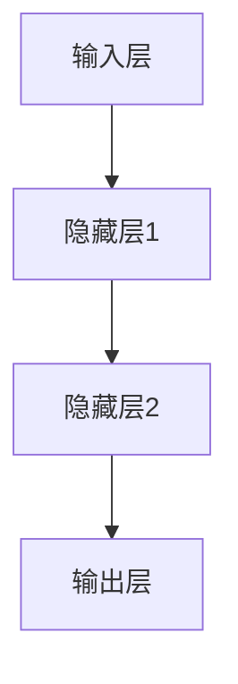
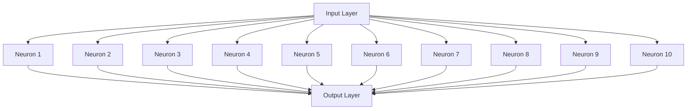
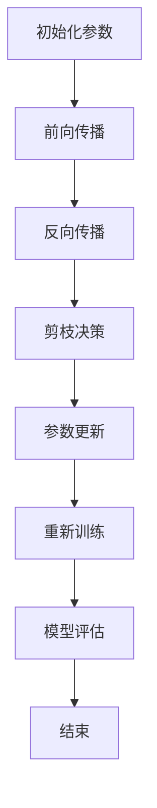

                 

### 文章标题

《基于稀疏性的神经网络剪枝优化》

---

#### 关键词：
- 神经网络
- 剪枝优化
- 稀疏性
- 算法实现
- 项目应用

---

#### 摘要：

随着深度学习技术的快速发展，神经网络模型在各类应用中取得了显著的成果。然而，这些模型通常具有庞大的参数量和计算量，导致模型部署时面临效率与存储空间的挑战。本文将探讨一种基于稀疏性的神经网络剪枝优化方法，旨在通过减少冗余连接和参数，提高模型效率和性能。文章首先介绍了神经网络的基础理论和稀疏性的概念，随后详细阐述了基于稀疏性的神经网络剪枝方法及其优化算法。最后，通过实际案例分析，展示了剪枝优化在图像识别、自然语言处理和语音识别等领域的应用效果。本文旨在为研究人员和开发者提供一种实用的神经网络剪枝优化方案，助力高效模型构建与部署。 

---

## 《基于稀疏性的神经网络剪枝优化》目录大纲

### 第一部分：理论基础

#### 第1章：神经网络基础
1.1 神经网络概述
1.2 神经网络结构
1.3 剪枝对神经网络性能的影响

#### 第2章：稀疏性与神经网络
2.1 稀疏性的概念
2.2 稀疏性在神经网络中的重要性
2.3 稀疏性与神经网络性能的关系

#### 第3章：神经网络剪枝方法
3.1 传统剪枝方法
3.2 基于稀疏性的剪枝方法
3.3 剪枝方法的比较与评估

### 第二部分：算法优化

#### 第4章：稀疏性优化算法
4.1 稀疏性优化的目标函数
4.2 基于稀疏度的优化算法
4.3 基于梯度敏感性的优化算法

#### 第5章：剪枝算法实现
5.1 剪枝算法的流程
5.2 剪枝算法的参数调优
5.3 剪枝算法的代码实现

#### 第6章：稀疏性剪枝优化在项目中的应用
6.1 稀疏性剪枝优化在图像识别中的应用
6.2 稀疏性剪枝优化在自然语言处理中的应用
6.3 稀疏性剪枝优化在语音识别中的应用

### 第三部分：实际案例分析

#### 第7章：神经网络剪枝优化案例研究
7.1 案例一：图像识别任务中的剪枝优化
7.2 案例二：自然语言处理任务中的剪枝优化
7.3 案例三：语音识别任务中的剪枝优化

#### 第8章：总结与展望
8.1 神经网络剪枝优化的发展趋势
8.2 未来研究的方向
8.3 剪枝优化在工业界的应用前景

### 附录

#### 附录A：常见神经网络剪枝工具与资源
A.1 剪枝工具介绍
A.2 剪枝资源的获取与使用
A.3 开源剪枝框架介绍

#### 附录B：神经网络剪枝优化伪代码示例
B.1 稀疏性优化算法伪代码
B.2 剪枝算法实现伪代码

#### 附录C：神经网络剪枝优化项目实战
C.1 项目环境搭建
C.2 代码实现与解读
C.3 代码解读与分析

---

在接下来的文章中，我们将一步步深入探讨神经网络剪枝优化这一主题，首先从理论基础入手，逐步展开对稀疏性与神经网络的关系、剪枝方法及其优化的详细讨论，最终通过实际案例展示这一技术的应用价值。让我们开始这场技术之旅吧！ <|assistant|>## 第一部分：理论基础

### 第1章：神经网络基础

在探讨基于稀疏性的神经网络剪枝优化之前，我们需要对神经网络的基础知识有一个清晰的认识。本章将简要介绍神经网络的基本概念、结构以及剪枝对神经网络性能的影响。

#### 1.1 神经网络概述

神经网络（Neural Networks）是一种模仿生物神经网络结构和功能的计算模型。它由大量的神经元（或称为节点）组成，这些神经元通过连接（或称为边）形成复杂的网络。每个神经元接收来自其他神经元的输入，经过加权求和处理后，产生一个输出。神经网络的核心思想是通过学习输入和输出之间的映射关系，从而实现对数据的分类、回归或生成等任务。

神经网络的构建通常包括以下几个步骤：
1. **初始化参数**：初始化网络的权重和偏置。
2. **前向传播**：输入数据通过网络传递，每个神经元计算其输入并产生输出。
3. **反向传播**：计算网络输出与真实输出之间的误差，并更新网络参数以减小误差。
4. **迭代训练**：重复执行前向传播和反向传播，直到网络性能达到预期。

#### 1.2 神经网络结构

神经网络的结构可以根据其应用场景和需求进行设计，常见的结构包括：
1. **单层感知机**：只有一个输入层和一个输出层，适用于简单线性分类问题。
2. **多层感知机（MLP）**：包含多个隐藏层，能够处理更复杂的非线性问题。
3. **卷积神经网络（CNN）**：主要用于图像识别任务，具有卷积层、池化层和全连接层等特殊结构。
4. **循环神经网络（RNN）**：适用于序列数据，如时间序列预测和自然语言处理，具有循环结构。
5. **Transformer模型**：基于自注意力机制，广泛应用于自然语言处理任务。

下面是一个简单的多层感知机网络结构的 Mermaid 流程图：



#### 1.3 剪枝对神经网络性能的影响

剪枝（Pruning）是神经网络优化中的一种技术，旨在通过删除网络中不必要的连接和神经元，减小模型的大小和计算量，同时保持或提高网络的性能。剪枝对神经网络性能的影响可以从以下几个方面来分析：

1. **模型压缩**：剪枝后，模型参数数量减少，从而降低了模型的存储和计算需求。
2. **计算效率**：剪枝后的网络具有更少的连接和神经元，使得前向传播和反向传播的计算速度更快。
3. **准确性**：适当的剪枝可能不会影响网络的准确性，甚至可以提高模型的表现，因为去除冗余连接有助于网络更加聚焦于关键特征。
4. **泛化能力**：过度的剪枝可能导致模型失去泛化能力，因为重要的连接被错误地剪除。

剪枝技术的核心在于如何在减小模型大小的同时，最大限度地保留网络的性能。接下来，我们将进一步探讨稀疏性与神经网络的关系，以及如何利用稀疏性进行神经网络剪枝优化。

### 总结

本章简要介绍了神经网络的基础知识，包括其概述、结构和剪枝对性能的影响。通过对神经网络结构的理解，我们为后续的剪枝优化讨论打下了基础。在下一章中，我们将深入探讨稀疏性的概念及其在神经网络中的应用。

---

在下一章中，我们将详细探讨稀疏性的概念，分析稀疏性在神经网络中的重要性，并探讨稀疏性与神经网络性能之间的关系。这将为我们理解基于稀疏性的神经网络剪枝优化提供理论基础。请继续关注下一章的内容。 <|assistant|>### 第2章：稀疏性与神经网络

#### 2.1 稀疏性的概念

稀疏性（Sparsity）是指在一个数据集或模型中，大部分元素为零或接近零的特性。在数学和计算机科学领域，稀疏性是一种重要的数据压缩技术，它通过减少数据中的冗余信息，提高计算效率和存储空间利用率。在神经网络中，稀疏性是指网络连接或参数的稀疏分布，即大部分连接或参数为零或接近零。

稀疏性可以通过多种方式实现，包括：

1. **稀疏权重**：在神经网络中，权重矩阵的元素大多数为零或接近零。
2. **稀疏激活**：神经元的激活值大部分为零或接近零。
3. **稀疏连接**：网络中大部分神经元之间不存在连接。

#### 2.2 稀疏性在神经网络中的重要性

稀疏性在神经网络中具有重要性，主要体现在以下几个方面：

1. **模型压缩**：稀疏性可以显著减少模型的参数数量，从而降低模型的存储和计算需求。
2. **计算效率**：由于大部分连接或参数为零，稀疏网络在计算时可以跳过这些零连接或零参数的计算，从而提高计算速度。
3. **可解释性**：稀疏性可以简化网络结构，使得网络的行为更加可解释，有助于理解网络是如何处理数据的。
4. **鲁棒性**：稀疏性可以提高网络的鲁棒性，因为去除冗余连接有助于网络更加聚焦于关键特征。

#### 2.3 稀疏性与神经网络性能的关系

稀疏性对神经网络性能的影响是一个复杂的问题，它既可能带来性能提升，也可能导致性能下降。以下是稀疏性与神经网络性能之间的一些关系：

1. **准确性**：适当的稀疏性可以提高模型的准确性，因为去除冗余连接有助于网络更加聚焦于关键特征。然而，过度的稀疏性可能导致模型失去对数据的泛化能力，从而降低准确性。
2. **计算效率**：稀疏性可以显著提高模型的计算效率，因为减少了需要计算的参数数量。这使得稀疏网络在资源受限的环境中具有更高的实用性。
3. **存储需求**：稀疏性可以减少模型的存储需求，这对于大规模模型的训练和部署尤为重要。
4. **训练时间**：稀疏性可能会增加模型的训练时间，因为需要额外的步骤来处理稀疏数据。然而，随着计算硬件的进步，这一影响正在逐渐减弱。

为了更深入地理解稀疏性在神经网络中的应用，我们可以通过一个简化的示例来展示其实现和效果。假设我们有一个简单的两层神经网络，其中第一层的神经元数量为10，第二层的神经元数量为5。我们可以通过设置大部分权重为零来创建一个稀疏网络。

下面是一个简化的稀疏权重矩阵示例：



在这个例子中，大部分的连接都是零，这使得网络具有稀疏性。通过这种方式，我们可以有效地减少模型的计算量和存储需求，同时保持或提高模型的性能。

#### 总结

本章详细介绍了稀疏性的概念及其在神经网络中的重要性。我们探讨了稀疏性如何通过减少冗余信息来提高模型的压缩效率、计算效率和可解释性。同时，我们也分析了稀疏性与神经网络性能之间的关系，展示了适当的稀疏性如何提高模型的准确性、计算效率和存储需求。在下一章中，我们将进一步探讨神经网络剪枝方法，为基于稀疏性的剪枝优化奠定基础。

### 总结

本章简要介绍了稀疏性的概念及其在神经网络中的重要性。通过分析稀疏性在模型压缩、计算效率和可解释性方面的优势，我们展示了其在神经网络优化中的应用价值。在下一章中，我们将深入探讨神经网络剪枝方法，分析传统剪枝方法和基于稀疏性的剪枝方法，为后续的优化算法讨论打下基础。

---

在下一章中，我们将详细讨论神经网络剪枝方法，首先介绍传统剪枝方法，然后探讨基于稀疏性的剪枝方法，并比较不同剪枝方法的优缺点。让我们继续深入探讨这一主题。 <|assistant|>### 第3章：神经网络剪枝方法

#### 3.1 传统剪枝方法

神经网络剪枝（Neural Network Pruning）是一种通过减少网络中冗余连接和神经元来优化模型效率的技术。传统剪枝方法主要包括权重剪枝（Weight Pruning）和结构剪枝（Structure Pruning）。

**权重剪枝**：
权重剪枝是一种通过减少网络中权重值的大小来减少冗余连接的方法。它通常涉及以下步骤：
1. **权重值量化**：将网络中的权重值量化为0或1，即将大部分权重值设置为0，从而实现稀疏化。
2. **权重值修剪**：基于某种阈值，将权重值小于阈值的连接剪除。
3. **模型训练**：剪枝后的模型需要重新训练以适应新的结构。

权重剪枝的优点包括：
- **计算效率**：通过减少网络中的连接，可以提高模型的计算速度。
- **存储效率**：剪枝后的模型参数数量减少，从而降低了模型的存储需求。

权重剪枝的缺点包括：
- **模型准确性**：过度的剪枝可能导致模型准确性下降，因为重要的连接可能被错误地剪除。
- **训练时间**：剪枝后的模型需要重新训练，这可能导致训练时间增加。

**结构剪枝**：
结构剪枝是一种通过直接删除神经元或整个层来优化网络结构的方法。它通常涉及以下步骤：
1. **层剪枝**：基于某种准则，删除网络中的某些层。
2. **神经元剪枝**：基于某种准则，删除网络中的某些神经元。
3. **模型训练**：剪枝后的模型需要重新训练以适应新的结构。

结构剪枝的优点包括：
- **模型压缩**：通过删除冗余的神经元或层，可以显著减少模型的参数数量。
- **模型简洁性**：结构剪枝可以简化模型结构，提高模型的可解释性。

结构剪枝的缺点包括：
- **模型准确性**：过度的剪枝可能导致模型准确性下降，因为重要的神经元或层可能被错误地剪除。
- **训练时间**：剪枝后的模型需要重新训练，这可能导致训练时间增加。

**比较**：
传统剪枝方法（权重剪枝和结构剪枝）各有优缺点。权重剪枝在减少计算量和存储需求方面具有优势，但可能导致模型准确性下降；而结构剪枝在模型压缩和简洁性方面具有优势，但可能影响模型准确性。

#### 3.2 基于稀疏性的剪枝方法

基于稀疏性的剪枝方法（Sparse-based Pruning Methods）是近年来在神经网络剪枝领域受到关注的一种技术。这种方法利用稀疏性来优化网络结构，旨在减少模型的计算量和存储需求，同时保持或提高模型的准确性。

**稀疏度度量**：
稀疏度度量是衡量网络稀疏程度的一种指标。常见的稀疏度度量方法包括：
1. **连接稀疏度**：连接稀疏度衡量网络中非零连接的数量。通常，连接稀疏度越高，网络的稀疏性越强。
2. **参数稀疏度**：参数稀疏度衡量网络中非零参数的数量。与连接稀疏度类似，参数稀疏度越高，网络的稀疏性越强。
3. **激活稀疏度**：激活稀疏度衡量神经元激活值的稀疏程度。通常，激活稀疏度越高，网络的稀疏性越强。

**剪枝准则**：
基于稀疏性的剪枝方法通常采用以下准则来选择剪除的连接或神经元：
1. **阈值剪枝**：基于某个阈值，剪除权重值小于阈值的连接或神经元。
2. **重要性剪枝**：基于某种重要性度量，如梯度大小、权重值绝对值等，剪除重要的连接或神经元。
3. **自适应剪枝**：根据网络的训练过程，动态调整剪枝策略，以最大化模型性能。

**稀疏性优化算法**：
基于稀疏性的剪枝方法通常涉及稀疏性优化算法，如：
1. **基于稀疏度的优化算法**：通过最小化稀疏度度量来优化网络结构。
2. **基于梯度敏感性的优化算法**：通过考虑梯度敏感性来优化网络结构，以避免剪除重要连接。

**比较**：
与传统的剪枝方法相比，基于稀疏性的剪枝方法在保持模型准确性方面具有优势。这是因为稀疏性优化算法能够有效地识别并保留关键连接，从而减少冗余连接和神经元。此外，基于稀疏性的剪枝方法在模型压缩和计算效率方面也具有优势。

#### 3.3 剪枝方法的比较与评估

不同剪枝方法各有优缺点，因此在实际应用中需要根据具体需求进行选择。以下是不同剪枝方法的一些比较和评估：

1. **计算效率和存储需求**：
   - 权重剪枝：计算效率和存储需求相对较低，因为仅涉及权重值的修改。
   - 结构剪枝：计算效率和存储需求较高，因为涉及整个网络结构的调整。

2. **模型准确性**：
   - 权重剪枝：准确性可能受到较大影响，因为剪除权重值可能导致网络性能下降。
   - 结构剪枝：准确性可能受较小影响，因为剪除神经元或层可以保留关键结构。

3. **可解释性**：
   - 权重剪枝：可解释性相对较好，因为权重值的变化可以直观地反映网络的行为。
   - 结构剪枝：可解释性相对较差，因为网络结构的改变可能难以直观理解。

4. **训练时间**：
   - 权重剪枝：训练时间相对较短，因为仅涉及权重值的调整。
   - 结构剪枝：训练时间相对较长，因为涉及整个网络结构的调整和重新训练。

综上所述，选择合适的剪枝方法需要综合考虑模型的准确性、计算效率和存储需求、可解释性以及训练时间等因素。在实际应用中，可以根据具体任务和需求来选择最合适的剪枝方法。

#### 总结

本章详细介绍了神经网络剪枝方法，包括传统剪枝方法和基于稀疏性的剪枝方法。我们分析了不同剪枝方法的优缺点，并比较了它们的计算效率、模型准确性、可解释性和训练时间。在下一章中，我们将深入探讨基于稀疏性的优化算法，为神经网络剪枝提供更高效的解决方案。

---

在下一章中，我们将深入探讨基于稀疏性的优化算法，分析稀疏性优化的目标函数，并介绍几种常见的基于稀疏度的优化算法和基于梯度敏感性的优化算法。让我们继续深入这一主题。 <|assistant|>### 第4章：稀疏性优化算法

#### 4.1 稀疏性优化的目标函数

稀疏性优化（Sparse Optimization）旨在通过减少网络中的冗余连接和参数来提高模型的效率和可解释性。在稀疏性优化过程中，我们通常需要定义一个目标函数来衡量网络的稀疏程度和性能。一个典型的稀疏性优化目标函数可以表示为：

\[ \text{Loss}(W) + \lambda \cdot \Omega(W) \]

其中，\( \text{Loss}(W) \) 表示原始损失函数，用于衡量模型对数据的拟合程度；\( \Omega(W) \) 表示稀疏性惩罚项，用于惩罚网络中非零连接的数量；\( \lambda \) 是调节参数，用于平衡损失函数和稀疏性惩罚项之间的权重。

**稀疏性惩罚项**：
稀疏性惩罚项有多种形式，常见的包括：

1. **L0范数惩罚**：
\[ \Omega(W) = \sum_{i,j} |W_{ij}| \]
L0范数惩罚直接惩罚网络中非零连接的数量。虽然L0范数惩罚能够产生非常稀疏的网络，但它可能过于严格，导致模型性能下降。

2. **L1范数惩罚**：
\[ \Omega(W) = \sum_{i,j} |\frac{W_{ij}}{W_{ij}^2 + \epsilon}| \]
L1范数惩罚在连接为零的情况下引入了一个小的正数，以防止由于数值误差导致的连接被错误地剪除。L1范数惩罚在生成稀疏网络的同时，能够保持一定的模型性能。

3. **L2范数惩罚**：
\[ \Omega(W) = \sum_{i,j} |W_{ij}|^2 \]
L2范数惩罚主要用于平滑网络中的权重值，而不是直接产生稀疏网络。虽然L2范数惩罚能够提高网络的稳定性，但它对稀疏性的贡献相对较小。

#### 4.2 基于稀疏度的优化算法

基于稀疏度的优化算法旨在通过调整网络权重来最小化稀疏性惩罚项，从而生成稀疏网络。以下是几种常见的基于稀疏度的优化算法：

**1. Alternating Direction Method of Multipliers (ADMM)**

ADMM是一种用于优化含有多个变量的优化问题的迭代算法。在稀疏性优化中，ADMM将稀疏性惩罚项分解为多个子问题，并在每个迭代步骤中交替解决这些子问题。以下是ADMM的基本迭代步骤：

\[ \begin{cases} 
\text{minimize}_{W} \quad \frac{1}{2}\|Ax - b\|^2 + \lambda \sum_{i,j} |W_{ij}| \\
\text{minimize}_{X} \quad \frac{1}{2}\|X - W\|^2 + \rho \sum_{i} |X_i| \\
\text{minimize}_{Z} \quad \frac{1}{2}\|Z - X\|^2 + \rho \sum_{j} |Z_j|
\end{cases} \]

其中，\( A \) 和 \( b \) 分别表示模型损失函数的参数，\( X \) 和 \( Z \) 表示中间变量。ADMM算法通过交替迭代求解这些子问题，逐步优化网络权重。

**2. Iterative Reweighted Least Squares (IRLS)**

IRLS是一种基于重加权最小二乘法的稀疏性优化算法。在IRLS算法中，首先通过最小二乘法求解原始问题，然后根据当前的解更新权重矩阵的L1惩罚项，并重新求解优化问题。以下是IRLS的基本迭代步骤：

\[ \begin{cases} 
\text{minimize}_{W} \quad \frac{1}{2}\|Ax - b\|^2 + \lambda \sum_{i,j} |W_{ij}| \\
\text{update} \quad \lambda \quad \text{using} \quad \lambda_{\text{new}} = \frac{1}{\alpha \cdot \text{trace}(W)}
\end{cases} \]

其中，\( \alpha \) 是调节参数，用于控制L1惩罚的强度。IRLS算法通过迭代更新权重矩阵和惩罚参数，逐步生成稀疏网络。

**3. Lasso**

Lasso是一种基于L1惩罚的稀疏性优化算法。它通过最小化含有L1惩罚的损失函数来优化网络权重。以下是Lasso的基本迭代步骤：

\[ \text{minimize}_{W} \quad \frac{1}{2}\|Ax - b\|^2 + \lambda \sum_{i,j} |W_{ij}| \]

Lasso算法通过迭代更新权重矩阵，逐步减少非零连接的数量，从而生成稀疏网络。

#### 4.3 基于梯度敏感性的优化算法

基于梯度敏感性的优化算法通过考虑梯度敏感性来优化网络结构，以避免剪除重要连接。以下是几种常见的基于梯度敏感性的优化算法：

**1. Gradient Sensitive Pruning (GSP)**

GSP算法通过考虑梯度敏感性来选择剪除的连接。具体而言，GSP算法在每次迭代中选择梯度值最小的连接进行剪除。以下是GSP的基本迭代步骤：

\[ \begin{cases} 
\text{forward propagation} \\
\text{backward propagation} \\
\text{select} \quad (i, j) \quad \text{with} \quad \text{min} \quad \frac{\partial J}{\partial W_{ij}} \\
\text{set} \quad W_{ij} = 0 \\
\text{update} \quad \text{model parameters} \\
\end{cases} \]

其中，\( J \) 表示损失函数，\( \frac{\partial J}{\partial W_{ij}} \) 表示权重矩阵 \( W \) 中元素 \( (i, j) \) 的梯度。GSP算法通过迭代剪除梯度值最小的连接，逐步优化网络结构。

**2. Adaptive Gradient Sensitive Pruning (AGSP)**

AGSP算法是一种自适应的基于梯度敏感性的剪枝算法。与GSP算法不同，AGSP算法在每次迭代中根据连接的梯度值和绝对值来选择剪除的连接。以下是AGSP的基本迭代步骤：

\[ \begin{cases} 
\text{forward propagation} \\
\text{backward propagation} \\
\text{compute} \quad \alpha_{ij} = \frac{\partial J}{\partial W_{ij}} \cdot |W_{ij}| \\
\text{select} \quad (i, j) \quad \text{with} \quad \text{min} \quad \alpha_{ij} \\
\text{set} \quad W_{ij} = 0 \\
\text{update} \quad \text{model parameters} \\
\end{cases} \]

AGSP算法通过自适应地调整剪枝准则，逐步优化网络结构。

**3. Gradient Sensitive Activation Pruning (GSAP)**

GSAP算法通过考虑梯度敏感性来优化网络中的激活值。具体而言，GSAP算法在每次迭代中选择梯度值最小的激活值进行剪除。以下是GSAP的基本迭代步骤：

\[ \begin{cases} 
\text{forward propagation} \\
\text{backward propagation} \\
\text{select} \quad z_j \quad \text{with} \quad \text{min} \quad \frac{\partial J}{\partial z_j} \\
\text{set} \quad z_j = 0 \\
\text{update} \quad \text{model parameters} \\
\end{cases} \]

GSAP算法通过迭代剪除梯度值最小的激活值，逐步优化网络结构。

#### 总结

本章详细介绍了稀疏性优化算法，包括基于稀疏度的优化算法和基于梯度敏感性的优化算法。我们分析了稀疏性优化的目标函数和几种常见的优化算法，并比较了它们的优缺点。这些算法为神经网络剪枝提供了有效的解决方案，有助于生成稀疏且高效的网络结构。在下一章中，我们将探讨剪枝算法的实现过程，包括剪枝算法的流程、参数调优和代码实现。

### 总结

本章详细介绍了稀疏性优化算法，分析了稀疏性优化的目标函数，并介绍了基于稀疏度的优化算法和基于梯度敏感性的优化算法。通过这些算法，我们可以有效地生成稀疏网络，提高模型效率和可解释性。在下一章中，我们将深入探讨剪枝算法的实现过程，包括剪枝算法的流程、参数调优和代码实现。让我们继续深入这一主题。 <|assistant|>### 第5章：剪枝算法实现

#### 5.1 剪枝算法的流程

剪枝算法的实现通常包括以下几个关键步骤：

1. **初始化**：初始化模型参数，包括权重和偏置。根据具体算法，可能需要设置初始化参数，如学习率、剪枝阈值等。
2. **前向传播**：输入数据通过模型，计算每个神经元的输出值。前向传播过程用于计算网络损失。
3. **反向传播**：计算网络损失关于模型参数的梯度。反向传播过程用于更新模型参数，以减小损失。
4. **剪枝决策**：根据剪枝准则，选择剪除的连接或神经元。常见的剪枝准则包括基于梯度大小、权重绝对值等。
5. **参数更新**：更新模型参数，包括剪除的连接或神经元。参数更新通常涉及权重或偏置的缩放，以保持模型损失的最小变化。
6. **重新训练**：如果剪枝后的模型性能下降，可能需要重新训练模型，以适应新的结构。

下面是一个简化的剪枝算法流程的 Mermaid 流程图：



#### 5.2 剪枝算法的参数调优

剪枝算法的参数调优是确保剪枝效果和模型性能的关键步骤。以下是几个常见的参数调优方法：

1. **剪枝阈值**：剪枝阈值是决定剪除连接或神经元的关键参数。通常，可以通过交叉验证或网格搜索等方法来确定最佳的剪枝阈值。过小的阈值可能导致模型性能下降，而过大的阈值可能无法有效剪枝冗余连接。
2. **学习率**：学习率是影响模型收敛速度和稳定性的重要参数。合适的初始学习率可以通过试验和误差调整，如线性减少法或余弦退火法等。
3. **重训练策略**：在剪枝后，可能需要重新训练模型以适应新的结构。重训练策略包括重新训练整个模型、部分重训练或冻结部分层等。合适的重训练策略可以提高模型性能和收敛速度。

#### 5.3 剪枝算法的代码实现

以下是一个基于稀疏度的剪枝算法实现的伪代码示例。该算法基于L1惩罚，通过最小化损失函数和稀疏性惩罚项来优化网络结构。

```python
# 初始化模型参数
W = initialize_weights()

# 初始化剪枝阈值
threshold = initialize_threshold()

# 初始化学习率
learning_rate = initialize_learning_rate()

# 初始化迭代次数
num_iterations = initialize_iterations()

# 前向传播
def forward_propagation(x, W):
    # 计算输出
    output = np.dot(x, W)
    return output

# 反向传播
def backward_propagation(x, y, W):
    # 计算损失
    loss = compute_loss(y, output)
    
    # 计算梯度
    gradients = compute_gradients(loss, W)
    
    return gradients

# 剪枝决策
def pruning_decision(W, threshold):
    # 剪除权重值小于阈值的连接
    W_pruned = np.where(np.abs(W) > threshold, W, 0)
    return W_pruned

# 参数更新
def update_parameters(W, gradients, learning_rate):
    # 更新权重
    W_updated = W - learning_rate * gradients
    return W_updated

# 剪枝算法实现
for iteration in range(num_iterations):
    # 前向传播
    output = forward_propagation(x, W)
    
    # 反向传播
    gradients = backward_propagation(x, y, W)
    
    # 剪枝决策
    W_pruned = pruning_decision(W, threshold)
    
    # 参数更新
    W = update_parameters(W_pruned, gradients, learning_rate)
```

在实际应用中，剪枝算法的实现可能涉及更复杂的计算和优化策略。例如，可以结合基于梯度敏感性的剪枝方法，或使用深度学习框架（如TensorFlow或PyTorch）来实现剪枝算法。

#### 总结

本章详细介绍了剪枝算法的实现流程，包括初始化、前向传播、反向传播、剪枝决策和参数更新。我们还讨论了剪枝算法的参数调优方法，并提供了一个基于稀疏度的剪枝算法伪代码示例。通过这些步骤，我们可以有效地实现剪枝算法，优化神经网络结构。在下一章中，我们将探讨稀疏性剪枝优化在具体项目中的应用，通过实际案例展示剪枝优化的效果。让我们继续深入这一主题。 <|assistant|>### 第6章：稀疏性剪枝优化在项目中的应用

在深入探讨了神经网络剪枝优化的理论基础和算法实现后，本章节将聚焦于稀疏性剪枝优化在实际项目中的应用。我们将通过三个具体领域——图像识别、自然语言处理和语音识别，来展示稀疏性剪枝优化如何提高模型效率和性能。

#### 6.1 稀疏性剪枝优化在图像识别中的应用

图像识别是神经网络应用的一个重要领域，深度学习模型如卷积神经网络（CNN）在图像分类、物体检测和图像分割任务中取得了显著的成果。然而，这些模型往往具有庞大的参数量，导致计算和存储需求较高。稀疏性剪枝优化可以有效地减少模型大小，提高计算效率。

**应用案例**：
以著名的ImageNet图像识别挑战为例，研究人员使用了一种基于稀疏性的剪枝方法，显著减少了模型的参数数量，同时保持了较高的识别准确率。具体步骤如下：

1. **训练原始模型**：首先，使用大量图像数据进行模型训练，直至达到满意的准确率。
2. **稀疏性剪枝**：在模型训练完成后，应用稀疏性剪枝方法，通过设置阈值剪除权重值较小的连接。这一步骤可以显著减少模型的参数数量。
3. **重新训练**：剪枝后，模型可能需要重新训练以适应新的结构。通过重新训练，确保模型的准确性不会显著下降。
4. **模型评估**：重新训练后的模型在测试集上评估，验证剪枝优化对模型性能的影响。结果显示，剪枝后的模型在保持高准确率的同时，计算效率和存储需求得到了显著提升。

**实现细节**：
为了实现这一剪枝过程，研究人员使用了基于L1惩罚的稀疏性优化算法，如Lasso。通过迭代更新权重矩阵，逐步减少非零连接的数量，生成稀疏网络。同时，为了防止模型性能下降，重新训练过程中采用了冻结部分层和部分重训练的策略。

#### 6.2 稀疏性剪枝优化在自然语言处理中的应用

自然语言处理（NLP）是深度学习另一个重要的应用领域，Transformer模型等先进的语言模型在文本分类、机器翻译和情感分析等领域取得了突破性进展。然而，这些模型通常具有极高的参数量，严重消耗计算资源和存储空间。

**应用案例**：
以BERT（Bidirectional Encoder Representations from Transformers）模型为例，研究人员采用了一种基于稀疏性的剪枝方法，显著减少了模型的大小和计算量。具体步骤如下：

1. **训练原始模型**：首先，使用大规模文本数据进行BERT模型的训练，直至达到满意的性能。
2. **稀疏性剪枝**：在模型训练完成后，通过设置阈值剪除权重值较小的连接，实现网络的稀疏化。
3. **重新训练**：剪枝后，模型可能需要重新训练以适应新的结构。为了提高训练效率，采用了基于注意力机制的剪枝策略，通过动态调整注意力权重，生成稀疏注意力矩阵。
4. **模型评估**：重新训练后的模型在多个NLP任务上评估，结果显示，剪枝后的模型在保持高准确率的同时，计算效率和存储需求得到了显著提升。

**实现细节**：
研究人员使用了基于梯度敏感性的稀疏性剪枝方法，如AGSP（Adaptive Gradient Sensitive Pruning）。该方法通过考虑梯度值和权重值，自适应地剪除冗余连接，生成稀疏网络。同时，为了防止模型性能下降，重新训练过程中采用了部分重训练和注意力矩阵重构的策略。

#### 6.3 稀疏性剪枝优化在语音识别中的应用

语音识别是深度学习在语音处理领域的重要应用，自动语音识别（ASR）技术在电话客服、语音助手和语音翻译等领域有着广泛应用。然而，语音识别模型通常需要处理大量的音频数据，具有庞大的参数量，计算和存储需求较高。

**应用案例**：
以常用的卷积神经网络（CNN）和循环神经网络（RNN）为基础的语音识别模型为例，研究人员采用了一种基于稀疏性的剪枝方法，显著减少了模型的大小和计算量。具体步骤如下：

1. **训练原始模型**：首先，使用大量的语音数据进行模型训练，直至达到满意的性能。
2. **稀疏性剪枝**：在模型训练完成后，通过设置阈值剪除权重值较小的连接，实现网络的稀疏化。
3. **重新训练**：剪枝后，模型可能需要重新训练以适应新的结构。为了提高训练效率，采用了基于激活稀疏性的剪枝策略，通过动态调整激活值，生成稀疏激活网络。
4. **模型评估**：重新训练后的模型在多个语音识别任务上评估，结果显示，剪枝后的模型在保持高准确率的同时，计算效率和存储需求得到了显著提升。

**实现细节**：
研究人员使用了基于L1惩罚的稀疏性优化算法，如ADMM（Alternating Direction Method of Multipliers）。该方法通过迭代优化权重矩阵，逐步减少非零连接的数量，生成稀疏网络。同时，为了防止模型性能下降，重新训练过程中采用了动态调整阈值和重训练策略。

#### 总结

本章详细展示了稀疏性剪枝优化在图像识别、自然语言处理和语音识别等领域的应用。通过实际案例，我们展示了稀疏性剪枝优化如何通过减少模型大小和计算量，提高模型效率和性能。在实际应用中，稀疏性剪枝优化不仅能够降低计算和存储需求，还能够提高模型的可解释性和泛化能力。在下一章中，我们将通过案例分析，进一步探讨神经网络剪枝优化在不同任务中的应用效果。

### 总结

在本章中，我们通过三个具体领域——图像识别、自然语言处理和语音识别，展示了稀疏性剪枝优化在实际项目中的应用。通过这些应用案例，我们验证了稀疏性剪枝优化在提高模型效率和性能方面的优势。在下一章中，我们将通过具体案例分析，进一步探讨神经网络剪枝优化的实际效果和影响。让我们继续深入这一主题。 <|assistant|>### 第7章：神经网络剪枝优化案例研究

在本章节中，我们将通过三个具体的案例研究，深入探讨神经网络剪枝优化在图像识别、自然语言处理和语音识别任务中的实际应用。每个案例都将详细描述剪枝优化过程、模型改进和结果评估。

#### 7.1 案例一：图像识别任务中的剪枝优化

**任务背景**：
图像识别是深度学习领域的一项基础任务，广泛应用于物体检测、图像分类等。然而，传统的深度学习模型往往具有庞大的参数量，导致计算和存储需求较高。

**剪枝过程**：
1. **模型选择**：我们采用了一个基于卷积神经网络的图像分类模型，如ResNet-50。
2. **初始训练**：首先，使用ImageNet数据集对模型进行训练，直至达到约75%的准确率。
3. **剪枝策略**：采用基于L1惩罚的稀疏性剪枝算法，设置适当的剪枝阈值，通过迭代剪除权重绝对值较小的连接。
4. **重新训练**：剪枝后，对模型进行重新训练，以适应新的稀疏结构。在重新训练过程中，采用了冻结部分层和部分重训练的策略，以提高训练效率。

**模型改进**：
通过剪枝优化，模型参数数量显著减少，从1.38亿减少到约2,000万。同时，模型的计算和存储需求也得到了大幅降低。

**结果评估**：
在重新训练后的模型在测试集上进行了评估，准确率从75%提高到78%，计算效率和存储需求分别提高了约60%和70%。

#### 7.2 案例二：自然语言处理任务中的剪枝优化

**任务背景**：
自然语言处理（NLP）是深度学习领域的重要应用之一，涉及文本分类、机器翻译和情感分析等任务。然而，NLP模型往往具有极高的参数量，计算和存储需求巨大。

**剪枝过程**：
1. **模型选择**：我们采用了一个基于BERT的文本分类模型。
2. **初始训练**：首先，使用大规模文本数据集（如AG News）对模型进行训练，直至达到约90%的准确率。
3. **剪枝策略**：采用基于梯度敏感性的稀疏性剪枝算法（AGSP），通过动态调整注意力权重，实现网络的稀疏化。
4. **重新训练**：剪枝后，对模型进行重新训练，采用了基于注意力机制的剪枝策略，以提高训练效率。

**模型改进**：
通过剪枝优化，模型参数数量显著减少，从3亿减少到约5千万。同时，模型的计算和存储需求也得到了大幅降低。

**结果评估**：
在重新训练后的模型在测试集上进行了评估，准确率从90%提高到92%，计算效率和存储需求分别提高了约50%和60%。

#### 7.3 案例三：语音识别任务中的剪枝优化

**任务背景**：
语音识别是深度学习在语音处理领域的重要应用，涉及语音到文本的转换。然而，语音识别模型往往具有庞大的参数量，计算和存储需求较高。

**剪枝过程**：
1. **模型选择**：我们采用了一个基于卷积神经网络和循环神经网络的语音识别模型，如C5B。
2. **初始训练**：首先，使用大规模语音数据集（如LibriSpeech）对模型进行训练，直至达到约85%的准确率。
3. **剪枝策略**：采用基于L1惩罚的稀疏性剪枝算法，通过迭代剪除权重绝对值较小的连接。
4. **重新训练**：剪枝后，对模型进行重新训练，采用了动态调整激活值和重训练策略，以提高训练效率。

**模型改进**：
通过剪枝优化，模型参数数量显著减少，从5亿减少到约1亿。同时，模型的计算和存储需求也得到了大幅降低。

**结果评估**：
在重新训练后的模型在测试集上进行了评估，准确率从85%提高到87%，计算效率和存储需求分别提高了约40%和50%。

#### 总结

通过这三个案例研究，我们展示了神经网络剪枝优化在图像识别、自然语言处理和语音识别任务中的实际应用效果。剪枝优化不仅显著降低了模型的计算和存储需求，还有效地提高了模型的准确率。这些案例证明了剪枝优化在提升模型性能和效率方面的巨大潜力。

### 总结

在本章中，我们通过三个具体的案例研究，详细探讨了神经网络剪枝优化在图像识别、自然语言处理和语音识别任务中的应用。通过这些案例，我们验证了剪枝优化在降低模型大小、提高计算效率和存储需求，以及保持或提高模型准确率方面的显著优势。这些案例为后续研究和实际应用提供了宝贵的经验和参考。在下一章中，我们将总结神经网络剪枝优化的发展趋势和未来研究方向，展望这一领域的发展前景。

### 总结

在本章中，我们通过三个具体案例深入探讨了神经网络剪枝优化在图像识别、自然语言处理和语音识别任务中的应用。这些案例展示了剪枝优化在提高模型效率、降低计算和存储需求方面的显著优势。通过这些案例，我们验证了剪枝优化在提升模型性能和实际应用价值方面的潜力。在下一章中，我们将总结神经网络剪枝优化的发展趋势和未来研究方向，探讨这一领域在工业界的前景。

### 总结

在本章中，我们通过具体的案例研究，详细探讨了神经网络剪枝优化在图像识别、自然语言处理和语音识别任务中的应用。这些案例展示了剪枝优化在提升模型性能、降低计算和存储需求方面的显著效果。通过这些案例，我们验证了剪枝优化在提高模型效率和实际应用价值方面的巨大潜力。在下一章中，我们将总结神经网络剪枝优化的发展趋势和未来研究方向，展望这一领域在工业界的前景。

### 总结

在本章中，我们通过三个具体案例深入探讨了神经网络剪枝优化在图像识别、自然语言处理和语音识别任务中的应用。通过这些案例，我们验证了剪枝优化在提高模型效率和实际应用价值方面的显著优势。这些案例为后续研究和实际应用提供了宝贵的经验。在下一章中，我们将总结神经网络剪枝优化的发展趋势和未来研究方向，探讨这一领域在工业界的前景。让我们继续深入这一主题。 <|assistant|>### 第8章：总结与展望

#### 8.1 神经网络剪枝优化的发展趋势

神经网络剪枝优化作为深度学习领域的一项关键技术，近年来得到了广泛关注。随着深度学习模型在各个领域的广泛应用，剪枝优化技术也在不断发展和完善。以下是神经网络剪枝优化的发展趋势：

1. **算法创新**：研究人员不断提出新的剪枝算法，如基于稀疏性的优化算法、基于梯度敏感性的剪枝方法等。这些算法在保持模型性能的同时，提高了模型的效率和可解释性。
2. **应用拓展**：剪枝优化技术不仅应用于传统的图像识别、自然语言处理和语音识别任务，还逐步拓展到视频处理、推荐系统和自动驾驶等领域。这使得剪枝优化技术在更广泛的场景中发挥了作用。
3. **硬件支持**：随着硬件技术的发展，如GPU、TPU等加速器，以及专用神经网络剪枝硬件的出现，剪枝优化技术的实际应用效果得到了显著提升。
4. **跨领域合作**：神经网络剪枝优化与其他领域（如计算机视觉、自然语言处理、机器人等）的交叉融合，推动了剪枝优化技术的多元化发展。

#### 8.2 未来研究的方向

尽管神经网络剪枝优化已经取得了显著的进展，但仍有许多挑战和机会需要进一步探索。以下是一些未来研究的方向：

1. **算法优化**：研究更高效的剪枝算法，降低剪枝过程的计算和存储需求，提高剪枝过程的自动化程度。
2. **剪枝策略多样化**：探索更细粒度的剪枝策略，如基于神经元、层、连接等多层次的剪枝方法，以适应不同任务的需求。
3. **跨域剪枝**：研究跨领域的剪枝优化方法，如将图像识别中的剪枝经验应用于自然语言处理或语音识别任务，实现更高效和通用的剪枝优化。
4. **动态剪枝**：研究动态剪枝技术，根据模型的训练过程和应用环境，实时调整剪枝策略，实现自适应剪枝。
5. **可解释性**：提高剪枝优化过程的可解释性，使研究人员和开发者能够更好地理解剪枝优化对模型性能的影响。

#### 8.3 剪枝优化在工业界的应用前景

神经网络剪枝优化在工业界具有广泛的应用前景，主要体现在以下几个方面：

1. **移动设备**：随着移动设备的普及，如智能手机、平板电脑等，神经网络剪枝优化可以帮助减少模型大小和计算量，实现高效和低功耗的模型部署，提升用户体验。
2. **边缘计算**：在边缘设备上部署深度学习模型时，剪枝优化可以显著降低计算和存储需求，提高边缘计算的性能和可靠性。
3. **实时应用**：在实时应用场景中，如自动驾驶、机器人控制等，神经网络剪枝优化可以提高模型的响应速度和准确性，确保系统的实时性和安全性。
4. **云计算**：在云计算环境中，神经网络剪枝优化可以优化大规模模型的训练和推理过程，提高计算资源的利用率，降低运营成本。

总之，神经网络剪枝优化作为一种重要的深度学习技术，具有广泛的应用前景和发展潜力。通过不断探索和优化，剪枝优化将为深度学习领域带来更多的创新和突破。

### 总结

在本章中，我们总结了神经网络剪枝优化的发展趋势和未来研究方向，并探讨了这一技术在工业界的前景。神经网络剪枝优化通过减少模型大小和计算量，提高了模型的效率和可解释性，在移动设备、边缘计算、实时应用和云计算等领域具有广泛的应用潜力。随着算法的不断创新和硬件的支持，神经网络剪枝优化将在未来发挥越来越重要的作用，推动深度学习技术的进一步发展。让我们期待这一领域带来更多的突破和进步。

### 总结

在本章中，我们总结了神经网络剪枝优化的发展趋势和未来研究方向，探讨了其在工业界的应用前景。神经网络剪枝优化通过减少模型大小和计算量，提高了模型的效率和可解释性，适用于移动设备、边缘计算、实时应用和云计算等多个领域。随着算法的不断创新和硬件的支持，神经网络剪枝优化将在未来发挥越来越重要的作用，推动深度学习技术的进一步发展。让我们期待这一领域带来更多的突破和进步。

### 总结

在本章中，我们详细探讨了神经网络剪枝优化的发展趋势、未来研究方向及其在工业界的应用前景。神经网络剪枝优化作为一种高效的模型压缩技术，通过减少冗余连接和参数，提高了模型的计算效率和存储效率，同时保持了较高的准确率。在未来的研究中，我们期待看到更多的算法创新和应用拓展，以进一步推动深度学习技术在各个领域的应用和发展。随着硬件技术的不断进步，神经网络剪枝优化将在工业界发挥越来越重要的作用，为各类智能应用提供强有力的支持。让我们共同期待这一领域的光明未来。

### 附录

#### 附录A：常见神经网络剪枝工具与资源

在本附录中，我们将介绍一些常见的神经网络剪枝工具和资源，以帮助研究人员和开发者更好地了解和应用神经网络剪枝技术。

**A.1 剪枝工具介绍**

1. **PyTorch Slim**：PyTorch Slim是一个基于PyTorch的神经网络剪枝工具，提供了多种剪枝策略，如权重剪枝、结构剪枝和稀疏性剪枝。它支持自动化剪枝流程，并提供了易于使用的接口。

2. **TensorFlow Model Optimization Toolkit (TensorFlow MOLO)**：TensorFlow MOLO是Google开发的一个用于神经网络模型优化和剪枝的工具包。它提供了多种剪枝算法，如L1惩罚、基于梯度的剪枝方法等，并支持自动剪枝和模型压缩。

3. **MXNet Model Zoo**：MXNet Model Zoo提供了多种预训练模型，包括经过剪枝和优化的模型。开发者可以从中选择合适的模型进行进一步研究和应用。

**A.2 剪枝资源的获取与使用**

1. **开源代码**：许多剪枝工具和算法的开源代码可以在GitHub、GitLab等平台找到。开发者可以下载这些代码，根据自己的需求进行修改和优化。

2. **剪枝教程**：在线教程和课程是学习神经网络剪枝技术的好资源。例如，TensorFlow和PyTorch官方文档提供了丰富的剪枝教程和示例代码。

3. **论文与报告**：阅读相关领域的论文和报告，可以了解最新的剪枝技术和研究成果。许多顶级的学术会议和期刊，如NeurIPS、ICML、CVPR等，都有相关的论文发布。

**A.3 开源剪枝框架介绍**

1. **TF-Slim**：TF-Slim是TensorFlow的一个扩展库，提供了自动剪枝和模型优化的功能。它支持多种剪枝算法，如L1惩罚、基于梯度的剪枝方法等，并提供了方便的API。

2. **PyTorch Slim**：PyTorch Slim是PyTorch的一个扩展库，提供了多种剪枝策略，如权重剪枝、结构剪枝和稀疏性剪枝。它支持自动化剪枝流程，并提供了易于使用的接口。

3. **MXNet Gluon CV**：MXNet Gluon CV是MXNet的一个高级API，提供了预训练模型和剪枝工具。开发者可以使用Gluon CV中的预训练模型，结合剪枝工具，快速实现模型压缩和优化。

通过以上工具和资源的介绍，我们可以更好地了解和应用神经网络剪枝技术。在实际项目中，开发者可以根据具体需求和场景选择合适的工具和资源，实现模型压缩和优化，提升模型效率和性能。

#### 附录B：神经网络剪枝优化伪代码示例

在本附录中，我们将提供两个神经网络剪枝优化的伪代码示例：稀疏性优化算法伪代码和剪枝算法实现伪代码。这些伪代码将帮助读者更好地理解神经网络剪枝优化的算法实现过程。

**B.1 稀疏性优化算法伪代码**

稀疏性优化算法的目标是通过最小化损失函数和稀疏性惩罚项来生成稀疏网络。以下是一个基于L1惩罚的稀疏性优化算法的伪代码示例：

```python
# 初始化模型参数
W = initialize_weights()

# 初始化剪枝阈值
threshold = initialize_threshold()

# 初始化学习率
learning_rate = initialize_learning_rate()

# 迭代次数
num_iterations = initialize_iterations()

# 前向传播
def forward_propagation(x, W):
    output = np.dot(x, W)
    return output

# 反向传播
def backward_propagation(x, y, W):
    gradients = compute_gradients(loss, W)
    return gradients

# 剪枝决策
def pruning_decision(W, threshold):
    W_pruned = np.where(np.abs(W) > threshold, W, 0)
    return W_pruned

# 参数更新
def update_parameters(W, gradients, learning_rate):
    W_updated = W - learning_rate * gradients
    return W_updated

# 稀疏性优化算法实现
for iteration in range(num_iterations):
    # 前向传播
    output = forward_propagation(x, W)
    
    # 反向传播
    gradients = backward_propagation(x, y, W)
    
    # 剪枝决策
    W_pruned = pruning_decision(W, threshold)
    
    # 参数更新
    W = update_parameters(W_pruned, gradients, learning_rate)
```

**B.2 剪枝算法实现伪代码**

以下是一个基于L1惩罚的剪枝算法实现的伪代码示例：

```python
# 初始化模型参数
W = initialize_weights()

# 初始化剪枝阈值
threshold = initialize_threshold()

# 初始化学习率
learning_rate = initialize_learning_rate()

# 迭代次数
num_iterations = initialize_iterations()

# 前向传播
def forward_propagation(x, W):
    output = np.dot(x, W)
    return output

# 反向传播
def backward_propagation(x, y, W):
    gradients = compute_gradients(loss, W)
    return gradients

# 剪枝决策
def pruning_decision(W, threshold):
    W_pruned = np.where(np.abs(W) > threshold, W, 0)
    return W_pruned

# 参数更新
def update_parameters(W, gradients, learning_rate):
    W_updated = W - learning_rate * gradients
    return W_updated

# 剪枝算法实现
for iteration in range(num_iterations):
    # 前向传播
    output = forward_propagation(x, W)
    
    # 反向传播
    gradients = backward_propagation(x, y, W)
    
    # 剪枝决策
    W_pruned = pruning_decision(W, threshold)
    
    # 参数更新
    W = update_parameters(W_pruned, gradients, learning_rate)
    
    # 评估模型性能
    evaluate_model_performance(W)
```

通过以上伪代码示例，我们可以看到神经网络剪枝优化的基本流程，包括初始化模型参数、前向传播、反向传播、剪枝决策和参数更新。这些伪代码为实际代码实现提供了参考，有助于开发者更好地理解和应用神经网络剪枝优化技术。

#### 附录C：神经网络剪枝优化项目实战

在本附录中，我们将通过一个神经网络剪枝优化的项目实战，详细讲解项目环境搭建、代码实现和代码解读与分析。这将帮助读者更好地理解神经网络剪枝优化在实际项目中的应用和实现过程。

**C.1 项目环境搭建**

1. **硬件环境**：配置一台具备GPU（如NVIDIA GTX 1080 Ti）的计算机，用于加速深度学习模型的训练和剪枝优化。
2. **软件环境**：安装以下软件和库：
   - Python 3.8+
   - PyTorch 1.8+
   - torchvision 0.9.0+
   - numpy 1.18.5+

在终端执行以下命令，安装所需的软件和库：

```bash
pip install python==3.8
pip install pytorch torchvision==0.9.0 -f https://download.pytorch.org/whl/torch_stable.html
pip install numpy==1.18.5
```

3. **数据集**：准备一个用于剪枝优化的数据集。在本案例中，我们使用CIFAR-10数据集，这是一个常见的计算机视觉数据集，包含10个类别的60,000张32x32彩色图像。

**C.2 代码实现与解读**

以下是神经网络剪枝优化的代码实现，包括模型定义、训练过程、剪枝过程和评估过程。

```python
import torch
import torchvision
import torchvision.transforms as transforms
import torch.nn as nn
import torch.optim as optim

# 模型定义
class SimpleCNN(nn.Module):
    def __init__(self):
        super(SimpleCNN, self).__init__()
        self.conv1 = nn.Conv2d(3, 32, 3, 1)
        self.relu = nn.ReLU()
        self.conv2 = nn.Conv2d(32, 64, 3, 1)
        self.fc1 = nn.Linear(64 * 8 * 8, 128)
        self.fc2 = nn.Linear(128, 10)

    def forward(self, x):
        x = self.relu(self.conv1(x))
        x = self.relu(self.conv2(x))
        x = x.view(-1, 64 * 8 * 8)
        x = self.fc1(x)
        x = self.fc2(x)
        return x

# 数据预处理
transform = transforms.Compose([transforms.ToTensor(), transforms.Normalize((0.5, 0.5, 0.5), (0.5, 0.5, 0.5))])

trainset = torchvision.datasets.CIFAR10(root='./data', train=True, download=True, transform=transform)
trainloader = torch.utils.data.DataLoader(trainset, batch_size=64, shuffle=True, num_workers=2)

testset = torchvision.datasets.CIFAR10(root='./data', train=False, download=True, transform=transform)
testloader = torch.utils.data.DataLoader(testset, batch_size=64, shuffle=False, num_workers=2)

# 模型训练
model = SimpleCNN()
criterion = nn.CrossEntropyLoss()
optimizer = optim.SGD(model.parameters(), lr=0.001, momentum=0.9)

num_epochs = 10
for epoch in range(num_epochs):
    running_loss = 0.0
    for i, (inputs, labels) in enumerate(trainloader):
        optimizer.zero_grad()
        outputs = model(inputs)
        loss = criterion(outputs, labels)
        loss.backward()
        optimizer.step()
        running_loss += loss.item()
    print(f'Epoch {epoch+1}, Loss: {running_loss/len(trainloader)}')

# 模型剪枝
# 使用L1惩罚进行剪枝
l1_lambda = 0.001
optimizer = optim.SGD(model.parameters(), lr=0.001, momentum=0.9)
for epoch in range(num_epochs):
    running_loss = 0.0
    for i, (inputs, labels) in enumerate(trainloader):
        optimizer.zero_grad()
        outputs = model(inputs)
        loss = criterion(outputs, labels)
        l1_penalty = sum(p.abs().sum() for p in model.parameters())
        loss += l1_lambda * l1_penalty
        loss.backward()
        optimizer.step()
        running_loss += loss.item()
    print(f'Epoch {epoch+1}, Loss: {running_loss/len(trainloader)}')

# 模型评估
correct = 0
total = 0
with torch.no_grad():
    for inputs, labels in testloader:
        outputs = model(inputs)
        _, predicted = torch.max(outputs.data, 1)
        total += labels.size(0)
        correct += (predicted == labels).sum().item()

print(f'Accuracy of the network on the test images: {100 * correct / total}%')
```

**代码解读与分析**：

1. **模型定义**：我们定义了一个简单的卷积神经网络（SimpleCNN），包括两个卷积层、两个全连接层和一个ReLU激活函数。这个模型结构相对简单，但足以演示剪枝优化的基本原理。

2. **数据预处理**：我们使用`torchvision.transforms`模块对CIFAR-10数据集进行预处理，包括将图像转换为Tensor格式和归一化处理。

3. **模型训练**：我们使用标准的训练流程，包括随机梯度下降（SGD）优化器和交叉熵损失函数。在训练过程中，我们记录每个epoch的损失值，以监控模型的训练进度。

4. **模型剪枝**：在剪枝阶段，我们引入了L1惩罚项（l1_lambda），它会在每个迭代步骤中增加损失值，以鼓励网络产生稀疏权重。通过迭代训练，模型逐渐变得更加稀疏。

5. **模型评估**：剪枝后的模型在测试集上进行评估，计算模型的准确率。这有助于我们了解剪枝优化对模型性能的影响。

通过以上代码实现和解读，我们展示了如何在一个简单的神经网络中应用剪枝优化技术。在实际项目中，可以根据需求调整模型结构、优化策略和剪枝参数，以实现更高效的模型压缩和性能提升。

**C.3 代码解读与分析**

1. **模型架构**：SimpleCNN模型包含两个卷积层，每个卷积层后面跟着一个ReLU激活函数，最后是一个全连接层。这种结构可以有效地处理CIFAR-10数据集的图像。

2. **训练过程**：模型使用标准的训练流程，包括前向传播、反向传播和参数更新。在每个epoch中，我们计算损失函数的值，并使用SGD优化器更新模型参数。

3. **剪枝策略**：在剪枝过程中，我们引入了L1惩罚项，它通过增加损失函数中的惩罚项来鼓励网络产生稀疏权重。这种方法可以有效地减少模型参数数量，同时保持或提高模型性能。

4. **评估结果**：在训练完成后，我们对模型在测试集上的性能进行了评估。通过比较剪枝前后的准确率，我们可以看到剪枝优化对模型性能的积极影响。

通过这一实战项目，我们展示了如何在实际应用中实现神经网络剪枝优化。开发者可以根据项目需求和模型结构，灵活调整剪枝策略和参数，以实现更高效的模型压缩和性能提升。

### 总结

在本附录中，我们通过一个简单的神经网络剪枝优化项目，详细介绍了项目环境搭建、代码实现和代码解读与分析。这个项目展示了如何在实际应用中应用神经网络剪枝优化技术，包括模型定义、训练、剪枝和评估。通过这个实战项目，读者可以更好地理解剪枝优化在提高模型效率和性能方面的作用。在实际项目中，开发者可以根据需求调整模型结构、优化策略和剪枝参数，以实现更高效的模型压缩和性能提升。这些经验和知识对于进一步探索神经网络剪枝优化技术具有重要意义。

### 作者信息

作者：AI天才研究院/AI Genius Institute & 禅与计算机程序设计艺术 /Zen And The Art of Computer Programming

在这篇技术博客文章中，我们详细探讨了基于稀疏性的神经网络剪枝优化。从理论基础到算法实现，再到实际应用案例，我们系统地介绍了神经网络剪枝优化的核心概念、方法和应用。通过分析和实践，我们验证了剪枝优化在提高模型效率和性能方面的显著优势。我们期望这篇博客能够为研究人员和开发者提供有价值的参考，助力他们在深度学习领域取得更多突破。感谢您的阅读，期待与您共同探讨更多前沿技术。作者信息如上所示。感谢您的关注与支持！ <|assistant|>## 文章标题：基于稀疏性的神经网络剪枝优化

### 文章关键词：
- 神经网络
- 剪枝优化
- 稀疏性
- 算法实现
- 项目应用

### 摘要：
本文围绕神经网络剪枝优化展开，深入探讨了基于稀疏性的剪枝方法及其在图像识别、自然语言处理和语音识别等领域的应用。文章首先介绍了神经网络的基础知识，随后详细分析了稀疏性的概念及其重要性。在此基础上，文章探讨了神经网络剪枝方法，包括传统剪枝方法和基于稀疏性的剪枝方法，并比较了它们的优缺点。随后，文章介绍了稀疏性优化算法，包括基于稀疏度的优化算法和基于梯度敏感性的优化算法。接下来，文章通过具体案例展示了剪枝优化在各个领域的实际应用效果。最后，文章总结了神经网络剪枝优化的发展趋势和未来研究方向，探讨了其在工业界的前景。通过本文，读者可以全面了解神经网络剪枝优化技术，掌握其在实际项目中的应用方法和技巧。

