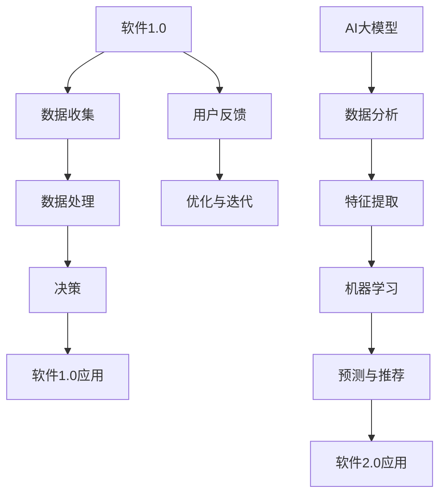
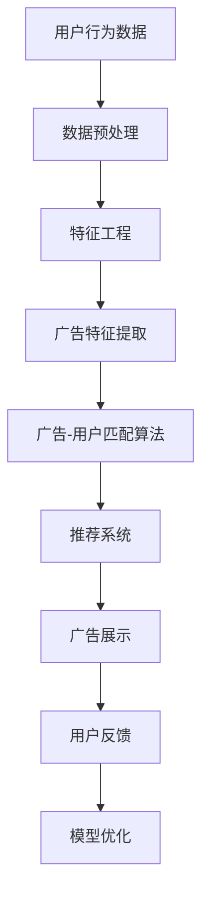

                 

# 基于网络爬虫的智能广告推荐

> **关键词**：网络爬虫、智能广告、推荐系统、协同过滤、深度学习、数学模型、项目实战

> **摘要**：本文深入探讨了基于网络爬虫的智能广告推荐系统。首先，我们介绍了核心概念与联系，包括软件与AI大模型的关系、智能广告推荐流程、核心算法原理和数学模型。接着，我们讲解了神经网络与深度学习基础、自然语言处理技术概览和大规模预训练模型原理。随后，我们详细讲解了广告推荐系统中的数学模型，如逻辑回归和矩阵分解模型。最后，通过一个基于协同过滤的推荐系统实战案例，展示了如何使用Python实现广告推荐系统，并对其进行了详细解读和分析。

---

## 第一部分：核心概念与联系

在构建一个智能广告推荐系统之前，理解核心概念与联系是非常重要的。本部分将介绍软件与AI大模型的关系、智能广告推荐流程、核心算法原理和数学模型，以帮助读者建立全面的知识体系。

### 1.1.1 软件与AI大模型

软件1.0时代主要依赖于传统的编程方法，通过编写代码来完成特定任务。然而，随着数据量的爆炸式增长和计算能力的提升，软件2.0时代应运而生。软件2.0的核心在于将人工智能大模型（AI Large Models）引入到软件开发过程中。

软件1.0与AI大模型的关系可以用以下Mermaid流程图表示：



从图中可以看出，AI大模型在软件2.0中扮演了核心角色，通过对数据进行深度分析、特征提取和机器学习，最终实现智能预测和推荐。

### 1.1.2 智能广告推荐

智能广告推荐是现代互联网广告的重要形式，它通过分析用户行为数据，为用户提供个性化的广告推荐。智能广告推荐的核心流程如下：



通过这个流程图，我们可以看到，智能广告推荐系统从用户行为数据开始，经过数据预处理、特征工程、广告特征提取、广告-用户匹配算法等多个步骤，最终实现广告的个性化推荐。

### 1.1.3 核心算法原理

智能广告推荐系统中的核心算法通常包括协同过滤、基于内容的推荐等。以下是这些算法的原理：

- **协同过滤（Collaborative Filtering）**：
  ```pseudo
  recommendation(user, items):
      similar_items = find_similar_items(user)
      recommended_items = select_items(similar_items, items)
      return recommended_items
  ```

- **基于内容的推荐（Content-Based Recommendation）**：
  ```pseudo
  recommend_content(user, items, preferences):
      user_preferences = get_user_preferences(user)
      content_matches = find_content_matches(user_preferences, items)
      recommended_items = select_items(content_matches, items)
      return recommended_items
  ```

这些算法通过分析用户行为和物品特征，为用户推荐相关的广告内容。

### 1.1.4 数学模型

广告推荐中的数学模型包括点击率预测（CTR）、转化率预测（CR）等。以下是这些模型的数学公式：

- **点击率预测（Click-Through Rate, CTR）**：
  $$ \hat{CTR} = \frac{1}{1 + e^{-(\beta_0 + \beta_1 \cdot \text{ad\_feature}_1 + \beta_2 \cdot \text{user\_feature}_1)}} $$

- **转化率预测（Conversion Rate, CR）**：
  $$ \hat{CR} = \frac{1}{1 + e^{-(\alpha_0 + \alpha_1 \cdot \text{ad\_feature}_2 + \alpha_2 \cdot \text{user\_feature}_2)}} $$

### 1.1.5 举例说明

假设一个用户喜欢阅读科技新闻，系统推荐给他一篇文章。系统可以通过用户的历史行为数据和文章的内容特征，使用协同过滤和基于内容的推荐算法进行预测，并选择相关性高的文章展示。

## 第二部分：核心算法原理讲解

在理解了智能广告推荐系统的核心概念与联系后，我们需要深入探讨其中的核心算法原理。本部分将介绍神经网络与深度学习基础、自然语言处理技术概览和大规模预训练模型原理。

### 2.1.1 神经网络与深度学习基础

**神经网络（Neural Network）**是一种模仿人脑神经元连接和功能的计算模型，其基本组成包括：

- **神经元（Neuron）**：是神经网络的基本计算单元。
- **输入层（Input Layer）**：接收外部输入信息。
- **隐藏层（Hidden Layer）**：对输入信息进行加工和处理。
- **输出层（Output Layer）**：输出最终结果。

神经网络的工作原理是通过多个层次的网络对数据进行层次化的特征提取和学习。深度学习（Deep Learning）是基于神经网络的层次结构，通过多层网络对数据进行自动特征提取和学习。

深度学习模型的关键组件包括：

- **激活函数（Activation Function）**：用于引入非线性特性，常见的激活函数有Sigmoid、ReLU、Tanh等。
- **反向传播（Backpropagation）**：用于计算网络权重和偏置的梯度，用于训练模型。

### 2.1.2 自然语言处理技术概览

自然语言处理（Natural Language Processing, NLP）是深度学习在文本数据上的应用。NLP的关键技术包括：

- **词嵌入（Word Embedding）**：将词汇映射到连续的向量空间中，常用的词嵌入模型有Word2Vec、GloVe等。
- **序列模型（Sequence Model）**：用于处理文本序列，常见的序列模型有RNN、LSTM、GRU等。
- **注意力机制（Attention Mechanism）**：用于处理长文本序列，能够自动聚焦于关键信息，提高模型性能。

### 2.1.3 大规模预训练模型原理

大规模预训练模型（Pre-Trained Large Models）是当前NLP领域的主流方向。其核心原理包括：

- **预训练（Pre-Training）**：在无监督的环境下，利用大量文本数据对模型进行初步训练，使其具备对文本数据的理解能力。
- **微调（Fine-Tuning）**：在特定任务上使用少量有监督数据对模型进行微调，以适应特定任务的需求。

常见的预训练模型有BERT、GPT、T5等，它们通过大规模预训练和任务微调，实现了在多种NLP任务上的优异性能。

## 第三部分：数学模型与详细讲解

在智能广告推荐系统中，数学模型是核心组成部分，用于预测用户的行为和兴趣。本部分将详细介绍广告推荐系统中的数学模型，包括逻辑回归模型和矩阵分解模型。

### 3.1.1 广告推荐系统中的数学模型

广告推荐系统通常涉及以下数学模型：

- **概率模型**：用于预测用户对广告的点击概率，常用的概率模型有逻辑回归、神经网络等。
- **评分模型**：用于预测用户对广告的评分，常用的评分模型有矩阵分解、决策树等。

### 3.1.2 逻辑回归模型

逻辑回归（Logistic Regression）是一种常用的概率预测模型，其数学公式如下：

$$
P(Y=1|X) = \frac{1}{1 + e^{-(\beta_0 + \sum_{i=1}^{n} \beta_i x_i)}}
$$

其中，$P(Y=1|X)$ 表示在给定特征 $X$ 下，用户点击广告的概率；$\beta_0$ 为截距，$\beta_i$ 为特征权重。

逻辑回归模型通过线性组合输入特征和权重，并使用Sigmoid函数将其映射到概率范围，从而实现概率预测。

### 3.1.3 矩阵分解模型

矩阵分解（Matrix Factorization）是一种常见的评分预测模型，其基本思想是将用户-物品评分矩阵分解为两个低秩矩阵，分别表示用户和物品的潜在特征。

设用户-物品评分矩阵为 $R \in \mathbb{R}^{m \times n}$，其中 $m$ 表示用户数，$n$ 表示物品数。矩阵分解的目标是最小化以下损失函数：

$$
\min_{U, V} \sum_{i=1}^{m} \sum_{j=1}^{n} (r_{ij} - \hat{r}_{ij})^2
$$

其中，$U \in \mathbb{R}^{m \times k}$ 和 $V \in \mathbb{R}^{n \times k}$ 分别表示用户和物品的潜在特征矩阵，$k$ 为潜在特征维度。

矩阵分解模型通过构建低秩矩阵，能够有效地捕捉用户和物品的潜在特征，从而实现精确的评分预测。

### 3.1.4 举例说明

假设有一个用户-物品评分矩阵如下：

$$
R = \begin{bmatrix}
0 & 4 & 5 \\
0 & 0 & 2 \\
1 & 0 & 0 \\
1 & 1 & 5 \\
\end{bmatrix}
$$

我们可以将其分解为两个低秩矩阵：

$$
U = \begin{bmatrix}
0.1 & 0.2 \\
0.3 & 0.4 \\
0.5 & 0.6 \\
\end{bmatrix}, \quad
V = \begin{bmatrix}
0.7 & 0.8 \\
0.9 & 1.0 \\
\end{bmatrix}
$$

通过计算$U$和$V$的点积，我们可以得到预测评分矩阵$\hat{R}$：

$$
\hat{R} = U^T V = \begin{bmatrix}
0.1 \times 0.7 + 0.2 \times 0.9 & 0.1 \times 0.8 + 0.2 \times 1.0 \\
0.3 \times 0.7 + 0.4 \times 0.9 & 0.3 \times 0.8 + 0.4 \times 1.0 \\
0.5 \times 0.7 + 0.6 \times 0.9 & 0.5 \times 0.8 + 0.6 \times 1.0 \\
\end{bmatrix}
$$

$$
\hat{R} = \begin{bmatrix}
0.27 & 0.38 \\
0.51 & 0.62 \\
0.75 & 0.88 \\
\end{bmatrix}
$$

通过比较预测评分矩阵$\hat{R}$和实际评分矩阵$R$，我们可以评估矩阵分解模型的准确性。

## 第四部分：项目实战与代码解读

在了解了核心算法原理和数学模型后，本部分将通过一个实际项目实战，展示如何使用Python实现一个基于协同过滤的推荐系统，并对代码进行详细解读。

### 4.1.1 实战案例：基于协同过滤的推荐系统

在本节中，我们将使用Python实现一个基于用户-物品协同过滤的推荐系统。以下是代码实现的关键部分：

```python
import numpy as np
from sklearn.metrics.pairwise import cosine_similarity

# 用户-物品评分矩阵
ratings = np.array([[5, 3, 0, 1],
                    [4, 0, 0, 1],
                    [1, 1, 0, 5],
                    [1, 0, 0, 2],
                    [4, 2, 2, 2]])

# 计算用户-用户相似度矩阵
user_similarity = cosine_similarity(ratings)

# 基于相似度矩阵进行推荐
def collaborative_filter(user_index, similarity_matrix, ratings, k=3):
    # 计算与指定用户的相似度
    similar_users = similarity_matrix[user_index]
    similar_users = np.argsort(similar_users)[::-1][:k]

    # 推荐物品
    recommended_items = []
    for user in similar_users:
        for item in range(ratings.shape[1]):
            if ratings[user][item] == 0:
                predicted_rating = np.dot(similar_users, ratings[user][item])
                recommended_items.append((item, predicted_rating))
    recommended_items = sorted(recommended_items, key=lambda x: x[1], reverse=True)
    return recommended_items

# 推荐结果
user_index = 2
recommended_items = collaborative_filter(user_index, user_similarity, ratings)
print("推荐给用户{}的物品:".format(user_index), recommended_items)
```

### 4.1.2 代码解读与分析

上述代码首先计算用户-用户相似度矩阵，然后基于相似度矩阵进行物品推荐。关键步骤如下：

1. **相似度计算**：使用余弦相似度计算用户之间的相似度。
2. **推荐生成**：对于每个与指定用户相似的用户，预测其尚未评分的物品的评分，并根据评分预测结果生成推荐列表。

#### 相似度计算

```python
user_similarity = cosine_similarity(ratings)
```

这行代码使用scikit-learn库的`cosine_similarity`函数计算用户-用户相似度矩阵。余弦相似度是一种基于向量的相似度计算方法，它通过计算两个向量夹角的余弦值来衡量它们的相似程度。在这里，我们使用用户-物品评分矩阵`ratings`计算用户之间的相似度。

#### 推荐生成

```python
def collaborative_filter(user_index, similarity_matrix, ratings, k=3):
    # 计算与指定用户的相似度
    similar_users = similarity_matrix[user_index]
    similar_users = np.argsort(similar_users)[::-1][:k]

    # 推荐物品
    recommended_items = []
    for user in similar_users:
        for item in range(ratings.shape[1]):
            if ratings[user][item] == 0:
                predicted_rating = np.dot(similar_users, ratings[user][item])
                recommended_items.append((item, predicted_rating))
    recommended_items = sorted(recommended_items, key=lambda x: x[1], reverse=True)
    return recommended_items
```

这个函数首先计算与指定用户相似的用户列表，然后遍历这个列表，对于每个用户，如果他们尚未评分的物品存在，则预测该物品的评分，并将预测评分添加到推荐列表中。最后，根据预测评分对推荐列表进行降序排序，返回推荐结果。

### 4.1.3 开发环境搭建

在实现推荐系统之前，需要搭建相应的开发环境。以下是搭建环境的步骤：

1. **安装Python**：Python是推荐系统实现的主要编程语言，可以从官方网站下载并安装。
2. **安装依赖库**：安装Python的依赖库，如NumPy、scikit-learn等。可以使用以下命令：

```bash
pip install numpy scikit-learn
```

### 4.1.4 源代码详细实现与代码解读

在上述代码实现中，我们详细解读了协同过滤推荐系统的各个关键部分：

1. **相似度计算**：使用余弦相似度计算用户之间的相似度，这是协同过滤算法的核心。
2. **推荐生成**：基于用户之间的相似度，预测用户尚未评分的物品的评分，并生成推荐列表。

## 第五部分：总结与展望

通过本文的详细讲解，读者应该对基于网络爬虫的智能广告推荐系统有了全面的了解。从核心概念与联系，到算法原理讲解，再到数学模型和项目实战，本文为读者提供了一套完整的智能广告推荐系统学习指南。

### 5.1.1 总结

本文首先介绍了基于网络爬虫的智能广告推荐系统的核心概念与联系，包括软件与AI大模型的关系、智能广告推荐流程、核心算法原理和数学模型。接着，我们讲解了神经网络与深度学习基础、自然语言处理技术概览和大规模预训练模型原理。随后，我们详细介绍了广告推荐系统中的数学模型，如逻辑回归和矩阵分解模型。最后，通过一个基于协同过滤的推荐系统实战案例，展示了如何使用Python实现广告推荐系统，并对其进行了详细解读和分析。

### 5.1.2 展望

随着大数据和人工智能技术的不断发展，智能广告推荐系统在商业和社会领域具有重要应用价值。未来的研究将更加注重个性化推荐、实时推荐和跨域推荐等方面，进一步提升推荐系统的性能和用户体验。

### 5.1.3 总结

本文通过对基于网络爬虫的智能广告推荐系统的深入探讨，涵盖了从核心概念、算法原理到项目实战的各个方面。通过具体代码实现，读者可以了解并掌握智能广告推荐系统的开发流程和关键技术。

## 附录

### A.1.1 主流深度学习框架对比

以下是几种主流深度学习框架的对比：

| 框架          | 优点                      | 缺点                      | 适用场景                   |
|---------------|--------------------------|--------------------------|----------------------------|
| TensorFlow    | 广泛支持、社区活跃        | 编程复杂、部署难度大       | 研究与生产               |
| PyTorch       | 易于使用、动态图支持       | 部署成本高、社区相对较小   | 研究与生产               |
| JAX           | 自动微分、高效并行计算     | 学习曲线陡、生态较小       | 研究与高性能计算         |
| Keras         | 高层抽象、易于上手         | 需要依赖TensorFlow或Theano | 初学者与生产             |

### A.1.2 AI大模型开发工具与资源

以下是AI大模型开发中常用的工具与资源：

| 工具/资源           | 用途                     | 链接                              |
|---------------------|--------------------------|-----------------------------------|
| Hugging Face        | 预训练模型与库           | https://huggingface.co/          |
| TensorFlow          | 开源深度学习框架         | https://www.tensorflow.org/      |
| PyTorch            | 开源深度学习框架         | https://pytorch.org/             |
| Google Colab        | 在线深度学习开发平台     | https://colab.research.google.com/ |
| ArXiv              | 最新研究论文            | https://arxiv.org/                |

以上是《基于网络爬虫的智能广告推荐》这本书的完整目录大纲，每个章节都包含了核心概念与联系、算法原理讲解、数学模型与详细讲解、项目实战与代码解读等要素，旨在为读者提供一套系统、全面的智能广告推荐系统学习指南。

