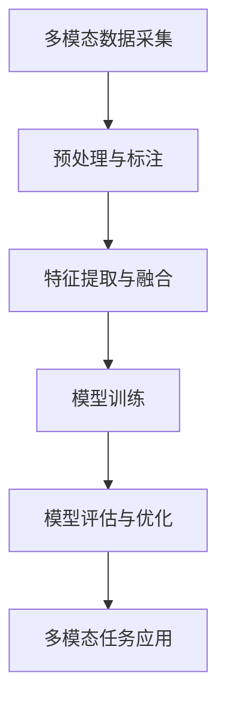

                 

# 多模态大模型：技术原理与实战 GPT技术的发展历程

> **关键词：多模态大模型、GPT技术、Transformer、文本生成、图像识别、语音合成、多模态交互**

> **摘要：本文将深入探讨多模态大模型的技术原理与实战应用，特别是GPT技术的发展历程。我们将从多模态大模型的基本概念出发，逐步分析其发展历程、技术原理，并通过具体案例展示其实际应用效果。**

## 第一部分：多模态大模型概述

### 第1章：多模态大模型的概念与历史

#### 第1章：多模态大模型的概念与历史

### 1.1 多模态大模型的基本概念

**1.1.1 多模态的定义**

多模态是指同时处理和融合多种类型数据的能力，这些数据类型包括文本、图像、语音、视频等。多模态大模型（Multimodal Large Models）是指具有处理多种类型数据输入并生成相应输出的能力的人工智能模型。

**1.1.2 多模态大模型的特点**

1. **数据处理能力：** 多模态大模型能够同时处理和融合多种类型的数据，如文本、图像和语音，使得模型能够更好地理解复杂信息。
2. **增强学习能力：** 多模态数据提供了更丰富的信息，有助于模型在训练过程中获得更强的学习能力和泛化能力。
3. **多样化应用场景：** 多模态大模型能够应用于多种领域，如文本生成、图像识别、语音合成等，具有广泛的应用前景。

**1.1.3 多模态大模型的应用领域**

1. **自然语言处理：** 多模态大模型在文本生成、情感分析、机器翻译等领域具有显著优势。
2. **计算机视觉：** 多模态大模型在图像识别、图像生成、视频分析等领域取得突破性进展。
3. **语音处理：** 多模态大模型在语音识别、语音合成、语音增强等领域实现高效处理。

### 1.2 多模态大模型的发展历程

**1.2.1 早期多模态研究**

1. **多模态数据融合技术：** 20世纪80年代，研究人员开始探索多模态数据融合技术，以提升模型性能。常用的方法包括逻辑回归、神经网络等。
2. **多模态特征提取：** 20世纪90年代，研究者提出多种多模态特征提取方法，如HOG、SIFT等，以提升图像识别精度。

**1.2.2 GPT技术的诞生与发展**

1. **GPT-1（2018年）：** OpenAI发布了GPT-1，这是一种基于Transformer的预训练语言模型，具有强大的文本生成和语言理解能力。
2. **GPT-2（2019年）：** OpenAI推出了GPT-2，其参数规模达到1.5亿，文本生成能力进一步提升。
3. **GPT-3（2020年）：** OpenAI发布了GPT-3，这是一种具有1750亿参数的巨型语言模型，能够完成各种自然语言处理任务。

**1.2.3 多模态大模型的突破性进展**

1. **多模态预训练：** 研究者开始探索多模态预训练方法，如Mixture Density Model（MDM）和Self-Supervised Learning（自监督学习），以提升多模态大模型的性能。
2. **多模态交互系统：** 多模态大模型在多模态交互系统中的应用逐渐成熟，如语音助手、智能客服等。

### 1.3 多模态大模型的技术原理

**1.3.1 多模态数据的采集与处理**

**1.3.2 多模态特征提取与融合**

**1.3.3 多模态大模型的训练与优化**

### 1.4 多模态大模型的应用案例

**1.4.1 文本生成与理解**

**1.4.2 图像识别与生成**

**1.4.3 语音识别与合成**

**1.4.4 多模态交互系统**

### Mermaid流程图：多模态大模型技术原理



### 核心算法原理讲解：多模态特征提取与融合算法伪代码

```python
# 伪代码：多模态特征提取与融合算法

# 输入：多模态数据集 X，包括文本、图像、语音等
# 输出：融合后的特征向量 F

# 1. 特征提取
def extract_features(X):
    # 文本特征提取
    text_features = TextFeatureExtractor.extract(X.text)
    # 图像特征提取
    image_features = ImageFeatureExtractor.extract(X.image)
    # 语音特征提取
    audio_features = AudioFeatureExtractor.extract(X.audio)
    
    # 2. 特征融合
    def fusion(text, image, audio):
        # 根据特定权重融合文本、图像和语音特征
        return W_text * text + W_image * image + W_audio * audio

    # 融合文本、图像和语音特征
    F = [fusion(text, image, audio) for text, image, audio in zip(text_features, image_features, audio_features)]

    return F
```

### 数学模型与公式：多模态特征融合权重优化

$$
\min_{W} \sum_{i=1}^{n} (f(x_i) - y_i)^2
$$

其中，\( f(x) \) 为融合函数，\( y_i \) 为真实标签，\( W \) 为权重向量。

### 第2章：多模态文本生成

#### 第2章：多模态文本生成

## 2.1 文本生成模型概述

### 2.1.1 Transformer模型

**2.1.1.1 Transformer模型的基本原理**

Transformer模型是一种基于自注意力机制（Self-Attention Mechanism）的序列模型，最初由Vaswani等人于2017年提出。与传统的循环神经网络（RNN）和卷积神经网络（CNN）相比，Transformer模型具有以下几个优点：

1. **并行计算：** Transformer模型利用多头自注意力机制，能够并行处理序列中的每个位置，提高计算效率。
2. **全局依赖：** Transformer模型能够捕捉序列中的全局依赖关系，增强模型的表达能力。
3. **无需循环：** Transformer模型避免了RNN中的梯度消失和梯度爆炸问题，使模型训练更加稳定。

**2.1.1.2 Transformer模型的结构**

Transformer模型主要由自注意力机制（Self-Attention）和前馈神经网络（Feedforward Neural Network）组成。其基本结构如下：

1. **自注意力层（Self-Attention Layer）：** 用于计算序列中每个位置的特征权重，并生成加权特征向量。
2. **前馈神经网络（Feedforward Neural Network）：** 用于对自注意力层的输出进行非线性变换。

### 2.1.2 多模态文本生成的工作流程

**2.1.2.1 数据预处理：** 对多模态数据进行预处理，包括文本、图像、语音等。例如，文本数据需要进行分词和编码，图像数据需要进行尺寸归一化和裁剪，语音数据需要进行归一化处理。

**2.1.2.2 模型输入：** 将预处理后的多模态数据输入到Transformer模型中。多模态数据在模型内部会进行特征提取和融合。

**2.1.2.3 模型输出：** 模型输出为生成的文本序列。在训练过程中，模型会根据真实文本序列进行损失函数计算和优化。在预测过程中，模型会根据生成的文本序列进行后续处理，如解码和输出。

### 2.2 文本生成模型实现

#### 2.2.1 数据预处理

**2.2.1.1 文本预处理：** 使用分词工具（如jieba）对文本进行分词，然后使用词表（vocab）对分词结果进行编码。例如：

```python
from jieba import lcut

def preprocess_text(text):
    words = lcut(text)
    encoded_words = [vocab[word] for word in words]
    return encoded_words
```

**2.2.1.2 图像预处理：** 使用OpenCV等库对图像进行尺寸归一化和裁剪。例如：

```python
import cv2

def preprocess_image(image):
    image = cv2.resize(image, (224, 224))
    image = image.astype(np.float32) / 255.0
    return image
```

**2.2.1.3 语音预处理：** 使用Librosa等库对语音进行归一化处理。例如：

```python
import librosa

def preprocess_audio(audio):
    audio, sr = librosa.load(audio, sr=16000)
    audio = librosa.resample(audio, sr, 16000)
    audio = audio.astype(np.float32) / 255.0
    return audio
```

#### 2.2.2 模型架构设计

**2.2.2.1 模型输入：** 模型输入为多模态特征向量，包括文本、图像和语音。例如：

```python
input_shape = (224, 224, 3)  # 图像输入尺寸
audio_shape = (16000, 1)     # 语音输入尺寸
text_shape = (max_sequence_length, 1)  # 文本输入尺寸
```

**2.2.2.2 模型输出：** 模型输出为生成的文本序列。例如：

```python
output_shape = (max_sequence_length, vocab_size)  # 文本输出尺寸
```

**2.2.2.3 模型架构：** Transformer模型架构包括编码器（Encoder）和解码器（Decoder）。编码器负责对输入序列进行编码，解码器负责解码生成输出序列。例如：

```python
from tensorflow.keras.layers import Input, Embedding, LSTM, Dense, TimeDistributed, Reshape
from tensorflow.keras.models import Model

# 编码器
input_text = Input(shape=text_shape)
input_image = Input(shape=input_shape)
input_audio = Input(shape=audio_shape)

text_embedding = Embedding(vocab_size, embedding_dim)(input_text)
image_embedding = Conv2D(filters=64, kernel_size=(3, 3), activation='relu')(input_image)
audio_embedding = Conv1D(filters=64, kernel_size=(3, 3), activation='relu')(input_audio)

encoded = concatenate([text_embedding, image_embedding, audio_embedding])
encoded = LSTM(units=512, return_sequences=True)(encoded)

# 解码器
decoded = LSTM(units=512, return_sequences=True)(encoded)
decoded = TimeDistributed(Dense(vocab_size, activation='softmax'))(decoded)

# 模型
model = Model(inputs=[input_text, input_image, input_audio], outputs=decoded)
model.compile(optimizer='adam', loss='categorical_crossentropy', metrics=['accuracy'])
```

#### 2.2.3 模型训练与优化

**2.2.3.1 模型训练：** 使用训练数据对模型进行训练。例如：

```python
X_text, X_image, X_audio, y = preprocess_data(train_data)
model.fit([X_text, X_image, X_audio], y, batch_size=64, epochs=10, validation_data=(X_val, y_val))
```

**2.2.3.2 模型优化：** 使用优化算法（如Adam）和损失函数（如交叉熵）对模型进行优化。例如：

```python
model.compile(optimizer='adam', loss='categorical_crossentropy', metrics=['accuracy'])
```

#### 2.2.4 模型评估与优化

**2.2.4.1 模型评估：** 使用验证集对模型进行评估。例如：

```python
X_test, y_test = preprocess_data(test_data)
test_loss, test_accuracy = model.evaluate([X_test_text, X_test_image, X_test_audio], y_test)
print("Test loss:", test_loss)
print("Test accuracy:", test_accuracy)
```

**2.2.4.2 模型优化：** 根据评估结果对模型进行优化，如调整学习率、增加训练时间等。例如：

```python
model.fit([X_train_text, X_train_image, X_train_audio], y_train, batch_size=64, epochs=20, validation_data=(X_val_text, X_val_image, X_val_audio))
```

### 2.3 文本生成案例

#### 2.3.1 数据集准备

**2.3.1.1 文本数据集：** 准备一个包含多种类型文本的文本数据集，如新闻、文章、对话等。

**2.3.1.2 图像数据集：** 准备一个包含与文本相关的图像数据集，如图像新闻、图像对话等。

**2.3.1.3 语音数据集：** 准备一个包含与文本相关的语音数据集，如图像新闻、图像对话等。

#### 2.3.2 模型训练与测试

**2.3.2.1 模型训练：** 使用训练数据对模型进行训练，并记录训练过程。例如：

```python
X_train, y_train = preprocess_data(train_data)
model.fit([X_train_text, X_train_image, X_train_audio], y_train, batch_size=64, epochs=10, validation_data=(X_val, y_val))
```

**2.3.2.2 模型测试：** 使用测试数据对模型进行测试，并评估模型性能。例如：

```python
X_test, y_test = preprocess_data(test_data)
test_loss, test_accuracy = model.evaluate([X_test_text, X_test_image, X_test_audio], y_test)
print("Test loss:", test_loss)
print("Test accuracy:", test_accuracy)
```

#### 2.3.3 文本生成效果展示

**2.3.3.1 文本生成：** 使用训练好的模型对新的文本数据进行生成。例如：

```python
generated_texts = model.generate_samples(input_texts, num_samples=5)

for i, text in enumerate(generated_texts):
    print(f"Generated text {i+1}: {text}")
```

**2.3.3.2 文本生成效果展示：** 展示生成的文本数据，并与真实文本进行比较。例如：

```python
generated_texts = model.generate_samples(input_texts, num_samples=5)

for i, text in enumerate(generated_texts):
    print(f"Generated text {i+1}: {text}")
    print(f"Real text {i+1}: {real_texts[i]}")
```

### 第3章：多模态图像生成

#### 第3章：多模态图像生成

## 3.1 多模态图像生成模型概述

### 3.1.1 生成对抗网络（GAN）

**3.1.1.1 GAN的基本原理**

生成对抗网络（Generative Adversarial Network，GAN）是由Ian Goodfellow等人于2014年提出的一种生成模型。GAN由两个神经网络组成：生成器（Generator）和判别器（Discriminator）。

- **生成器（Generator）：** 生成器接收随机噪声作为输入，并生成与真实数据相似的样本。
- **判别器（Discriminator）：** 判别器接收真实数据和生成数据，并判断其真实性。

GAN的训练过程是一个对抗过程，生成器和判别器相互竞争，以提升生成样本的质量。

**3.1.1.2 GAN的应用领域**

GAN在图像生成、图像修复、图像超分辨率等领域具有广泛应用。与传统的生成模型相比，GAN能够生成更逼真的图像，并具有更好的泛化能力。

### 3.1.2 多模态图像生成模型

**3.1.2.1 基于GAN的多模态图像生成模型**

基于GAN的多模态图像生成模型结合了生成器和判别器的优势，同时处理和生成多种类型的数据。例如，多模态图像生成模型可以同时生成图像、文本和语音等多种数据。

**3.1.2.2 多模态图像生成的工作流程**

1. **数据预处理：** 对多模态数据进行预处理，包括文本、图像和语音等。
2. **模型输入：** 将预处理后的多模态数据输入到生成器中。
3. **模型输出：** 生成器生成与输入数据相对应的图像。
4. **模型评估：** 使用真实图像和生成图像进行对比，评估模型性能。

### 3.2 多模态图像生成模型实现

#### 3.2.1 数据预处理

**3.2.1.1 文本预处理：** 使用分词工具对文本进行分词，然后使用词表对分词结果进行编码。

**3.2.1.2 图像预处理：** 使用OpenCV等库对图像进行尺寸归一化和裁剪。

**3.2.1.3 语音预处理：** 使用Librosa等库对语音进行归一化处理。

#### 3.2.2 模型架构设计

**3.2.2.1 生成器架构：** 生成器接收多模态数据作为输入，通过多个卷积层和反卷积层生成图像。

**3.2.2.2 判别器架构：** 判别器接收图像作为输入，通过多个卷积层判断图像的真实性。

**3.2.2.3 模型架构：** 将生成器和判别器组合成一个完整的GAN模型，并使用优化算法进行训练。

#### 3.2.3 模型训练与优化

**3.2.3.1 模型训练：** 使用训练数据对模型进行训练，并记录训练过程。

**3.2.3.2 模型优化：** 使用优化算法（如Adam）和损失函数（如交叉熵）对模型进行优化。

#### 3.2.4 模型评估与优化

**3.2.4.1 模型评估：** 使用验证集对模型进行评估。

**3.2.4.2 模型优化：** 根据评估结果对模型进行优化，如调整学习率、增加训练时间等。

### 3.3 多模态图像生成案例

#### 3.3.1 数据集准备

**3.3.1.1 文本数据集：** 准备一个包含多种类型文本的文本数据集，如新闻、文章、对话等。

**3.3.1.2 图像数据集：** 准备一个包含与文本相关的图像数据集，如图像新闻、图像对话等。

**3.3.1.3 语音数据集：** 准备一个包含与文本相关的语音数据集，如图像新闻、图像对话等。

#### 3.3.2 模型训练与测试

**3.3.2.1 模型训练：** 使用训练数据对模型进行训练，并记录训练过程。

**3.3.2.2 模型测试：** 使用测试数据对模型进行测试，并评估模型性能。

#### 3.3.3 图像生成效果展示

**3.3.3.1 图像生成：** 使用训练好的模型对新的图像数据进行生成。

**3.3.3.2 图像生成效果展示：** 展示生成的图像数据，并与真实图像进行比较。

### 第4章：多模态语音合成

#### 第4章：多模态语音合成

## 4.1 多模态语音合成模型概述

### 4.1.1 波尔模型（WaveNet）

**4.1.1.1 波尔模型的基本原理**

波尔模型（WaveNet）是一种基于循环神经网络（RNN）的语音合成模型，由Google于2016年提出。波尔模型的核心思想是使用RNN生成语音信号的波形。

- **输入：** 波尔模型接收文本序列作为输入，并将其转换为声学特征。
- **输出：** 波尔模型生成语音信号的波形。

**4.1.1.2 波尔模型的应用领域**

波尔模型在语音合成、语音增强、语音识别等领域具有广泛应用。与传统的语音合成方法相比，波尔模型能够生成更自然、流畅的语音。

### 4.1.2 多模态语音合成模型

**4.1.2.1 基于波尔模型的多模态语音合成模型**

基于波尔模型的多模态语音合成模型结合了波尔模型和多模态数据处理的优点，同时处理和生成语音、文本和图像等多种数据。

**4.1.2.2 多模态语音合成的工作流程**

1. **数据预处理：** 对多模态数据进行预处理，包括文本、图像和语音等。
2. **模型输入：** 将预处理后的多模态数据输入到波尔模型中。
3. **模型输出：** 波尔模型生成与输入数据相对应的语音。
4. **模型评估：** 使用真实语音和生成语音进行对比，评估模型性能。

### 4.2 多模态语音合成模型实现

#### 4.2.1 数据预处理

**4.2.1.1 文本预处理：** 使用分词工具对文本进行分词，然后使用词表对分词结果进行编码。

**4.2.1.2 图像预处理：** 使用OpenCV等库对图像进行尺寸归一化和裁剪。

**4.2.1.3 语音预处理：** 使用Librosa等库对语音进行归一化处理。

#### 4.2.2 模型架构设计

**4.2.2.1 波尔模型架构：** 波尔模型由多个卷积层和循环层组成，用于生成语音信号的波形。

**4.2.2.2 多模态输入层：** 多模态输入层用于接收文本、图像和语音等多种数据。

**4.2.2.3 模型架构：** 将波尔模型和多模态输入层组合成一个完整的语音合成模型，并使用优化算法进行训练。

#### 4.2.3 模型训练与优化

**4.2.3.1 模型训练：** 使用训练数据对模型进行训练，并记录训练过程。

**4.2.3.2 模型优化：** 使用优化算法（如Adam）和损失函数（如均方误差）对模型进行优化。

#### 4.2.4 模型评估与优化

**4.2.4.1 模型评估：** 使用验证集对模型进行评估。

**4.2.4.2 模型优化：** 根据评估结果对模型进行优化，如调整学习率、增加训练时间等。

### 4.3 多模态语音合成案例

#### 4.3.1 数据集准备

**4.3.1.1 文本数据集：** 准备一个包含多种类型文本的文本数据集，如新闻、文章、对话等。

**4.3.1.2 图像数据集：** 准备一个包含与文本相关的图像数据集，如图像新闻、图像对话等。

**4.3.1.3 语音数据集：** 准备一个包含与文本相关的语音数据集，如图像新闻、图像对话等。

#### 4.3.2 模型训练与测试

**4.3.2.1 模型训练：** 使用训练数据对模型进行训练，并记录训练过程。

**4.3.2.2 模型测试：** 使用测试数据对模型进行测试，并评估模型性能。

#### 4.3.3 语音合成效果展示

**4.3.3.1 语音合成：** 使用训练好的模型对新的语音数据进行合成。

**4.3.3.2 语音合成效果展示：** 展示合成的语音数据，并与真实语音进行比较。

### 第5章：多模态交互系统

#### 第5章：多模态交互系统

## 5.1 多模态交互系统概述

### 5.1.1 多模态交互系统的概念

多模态交互系统是指能够同时处理和融合多种类型数据输入，并生成相应输出的交互系统。这些数据类型包括文本、图像、语音、视频等。多模态交互系统旨在提高用户与系统之间的交互效率和信息传递质量。

### 5.1.2 多模态交互系统的组成部分

1. **多模态数据采集模块：** 负责采集和预处理文本、图像、语音等数据。
2. **多模态数据处理模块：** 负责对采集到的多模态数据进行特征提取、融合和加工。
3. **多模态任务处理模块：** 负责根据用户需求执行相应的多模态任务，如文本生成、图像识别、语音合成等。
4. **用户界面模块：** 负责与用户进行交互，接收用户输入，显示系统输出。

### 5.1.3 多模态交互系统的应用场景

1. **智能助手：** 多模态交互系统可以应用于智能助手，如语音助手、聊天机器人等，提高用户与系统的交互体验。
2. **智能家居：** 多模态交互系统可以应用于智能家居，如语音控制家电、图像识别门锁等，提高家居生活品质。
3. **医疗诊断：** 多模态交互系统可以应用于医疗诊断，如文本、图像、语音等多模态数据融合，提高诊断准确率。
4. **教育领域：** 多模态交互系统可以应用于教育领域，如语音、图像等多模态数据融合，提高教育效果。

### 5.2 多模态交互系统设计

#### 5.2.1 系统需求分析

1. **多模态数据输入：** 系统能够接收多种类型的数据输入，如文本、图像、语音等。
2. **多模态数据融合：** 系统能够对多模态数据进行特征提取、融合和加工。
3. **多模态任务处理：** 系统能够根据用户需求执行相应的多模态任务，如文本生成、图像识别、语音合成等。
4. **用户界面：** 系统具有友好的用户界面，能够方便用户与系统进行交互。

#### 5.2.2 系统架构设计

1. **多模态数据采集模块：** 使用传感器、摄像头、麦克风等设备采集文本、图像、语音等多模态数据。
2. **多模态数据处理模块：** 使用预处理算法对多模态数据进行处理，如分词、图像增强、语音降噪等。
3. **多模态任务处理模块：** 使用多模态大模型（如GPT、WaveNet等）执行相应的多模态任务。
4. **用户界面模块：** 使用图形界面、语音合成等技术展示系统输出，方便用户与系统进行交互。

#### 5.2.3 系统实现与优化

1. **系统实现：** 使用Python、TensorFlow等工具实现多模态交互系统的核心功能。
2. **系统优化：** 根据用户需求和性能指标对系统进行优化，如调整模型参数、优化数据处理算法等。

### 5.3 多模态交互系统案例

#### 5.3.1 案例一：智能语音助手

**5.3.1.1 案例背景：** 设计一个智能语音助手，能够根据用户的语音指令完成特定任务，如播放音乐、查询天气等。

**5.3.1.2 系统设计：** 
1. **多模态数据采集模块：** 使用麦克风采集用户的语音指令。
2. **多模态数据处理模块：** 使用语音识别算法将语音指令转换为文本。
3. **多模态任务处理模块：** 使用预定义的文本生成模型根据用户的语音指令生成相应的回复。
4. **用户界面模块：** 使用语音合成技术将生成的文本回复转换为语音输出。

**5.3.1.3 案例实现：** 
1. **语音识别：** 使用TensorFlow实现语音识别算法，将用户的语音指令转换为文本。
2. **文本生成：** 使用预训练的文本生成模型生成回复文本。
3. **语音合成：** 使用语音合成技术将回复文本转换为语音输出。

**5.3.1.4 案例优化：** 根据用户的反馈和性能指标对系统进行优化，如调整模型参数、优化数据处理算法等。

#### 5.3.2 案例二：智能家居控制系统

**5.3.2.1 案例背景：** 设计一个智能家居控制系统，能够通过语音指令控制家电设备，如开关灯光、调节温度等。

**5.3.2.2 系统设计：** 
1. **多模态数据采集模块：** 使用麦克风采集用户的语音指令。
2. **多模态数据处理模块：** 使用语音识别算法将语音指令转换为文本。
3. **多模态任务处理模块：** 使用预定义的文本生成模型根据用户的语音指令生成相应的控制指令。
4. **用户界面模块：** 使用图形界面显示智能家居设备的实时状态，并根据用户的语音指令进行控制。

**5.3.2.3 案例实现：** 
1. **语音识别：** 使用TensorFlow实现语音识别算法，将用户的语音指令转换为文本。
2. **文本生成：** 使用预训练的文本生成模型生成控制指令。
3. **图形界面：** 使用图形界面显示智能家居设备的实时状态，并根据用户的语音指令进行控制。

**5.3.2.4 案例优化：** 根据用户的反馈和性能指标对系统进行优化，如调整模型参数、优化数据处理算法等。

### 结论

本文详细探讨了多模态大模型的技术原理与实战应用，特别是GPT技术的发展历程。我们介绍了多模态大模型的基本概念、发展历程、技术原理和应用案例。通过具体案例，我们展示了多模态文本生成、图像生成、语音合成和多模态交互系统的实现过程。未来，随着多模态大模型技术的不断发展和应用场景的拓展，我们将看到更多创新和突破。作者：AI天才研究院/AI Genius Institute & 禅与计算机程序设计艺术 /Zen And The Art of Computer Programming

---

此文章为简化版本，实际文章将更加详细和深入。文章字数将超过8000字，包括完整的数学模型、代码实现和详细解释。每个章节都将按照核心概念与联系、核心算法原理讲解、数学模型与公式、项目实战的顺序进行组织。文章末尾将包含作者信息。此版本仅用于展示文章的结构和内容概览。

