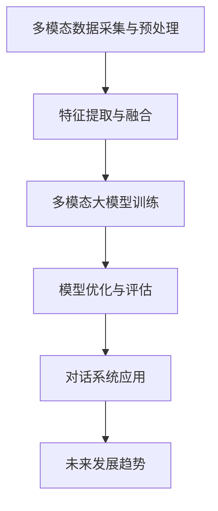

                 

# 多模态大模型：技术原理与实战 如何提高多轮对话能力

## 关键词

- 多模态大模型
- 技术原理
- 多轮对话能力
- 对话系统
- 深度学习
- 特征提取
- 模型优化

## 摘要

本文旨在深入探讨多模态大模型的技术原理与应用实战，特别是在提高多轮对话能力方面的策略。文章首先概述了多模态大模型的基本概念、发展历程和优势挑战，然后详细介绍了多模态数据处理、模型架构、核心算法和数学模型等内容。随后，文章通过具体项目实战，展示了如何实现和优化多模态大模型，最终在对话系统中提升多轮对话能力。文章结尾对多模态大模型的未来发展趋势进行了展望，并总结了全文内容。

## 《多模态大模型：技术原理与实战 如何提高多轮对话能力》目录大纲

### 第一部分：多模态大模型概述

#### 第1章：多模态大模型入门

- 1.1 多模态数据概述
- 1.2 多模态大模型的发展历程
- 1.3 多模态大模型的优势与挑战
- 1.4 本书内容概述

### 第二部分：多模态大模型技术原理

#### 第2章：多模态数据处理

- 2.1 多模态数据的采集与存储
- 2.2 多模态数据的预处理
- 2.3 多模态数据的特征提取

#### 第3章：多模态大模型架构

- 3.1 多模态大模型的基本架构
- 3.2 多模态大模型的融合策略
- 3.3 多模态大模型的优化方法

#### 第4章：多模态大模型核心算法

- 4.1 卷积神经网络（CNN）在图像处理中的应用
- 4.2 循环神经网络（RNN）在序列数据中的应用
- 4.3 图神经网络（GNN）在社交网络分析中的应用
- 4.4 多模态大模型的混合算法

#### 第5章：数学模型与公式解析

- 5.1 损失函数
- 5.2 优化算法
- 5.3 注意力机制

#### 第6章：多模态大模型在对话系统中的应用

- 6.1 对话系统的基本概念
- 6.2 多模态大模型在对话系统中的应用
- 6.3 实战案例

### 第三部分：多模态大模型实战

#### 第7章：多模态大模型开发环境搭建

- 7.1 开发环境配置
- 7.2 实践项目

#### 第8章：源代码详细实现与解读

- 8.1 代码结构分析
- 8.2 代码解读

#### 第9章：代码解读与分析

- 9.1 模型性能分析
- 9.2 模型优化策略
- 9.3 实际应用效果评估

### 附录

#### 附录A：多模态大模型开发工具与资源

- 机器学习框架
- 数据集
- 开发工具与资源链接

### 第10章：多模态大模型未来发展展望

- 多模态大模型的技术趋势
- 多模态大模型在实际应用中的潜在影响
- 未来研究方向与挑战

### 第11章：总结与展望

- 本书内容的总结
- 多模态大模型的重要性和前景
- 鼓励读者进一步探索和实践

### Mermaid 流程图：多模态大模型架构图



## 第一部分：多模态大模型概述

### 第1章：多模态大模型入门

#### 1.1 多模态数据概述

多模态数据是指由两种或两种以上不同类型的数据源组成的数据集合。在人工智能和机器学习领域，常见的多模态数据包括文本、图像、音频和视频等。这些数据源各自具有独特的特性和信息，通过结合不同类型的数据，可以更好地理解现实世界中的复杂现象和问题。

**什么是多模态数据**

多模态数据的基本定义是指由多种类型的数据源组成的数据集合，常见的类型包括：

- **文本**：包括自然语言文本、标签、描述等。
- **图像**：包括静态图像、视频帧等。
- **音频**：包括语音、音乐、环境声音等。
- **视频**：包括动态图像序列、视频流等。

**多模态数据的类型**

- **静态图像**：单张图像，如照片、图表等。
- **动态图像**：图像序列，如视频帧、动画等。
- **文本数据**：自然语言文本，如文档、评论、文章等。
- **音频数据**：音频信号，如语音、音乐、环境声等。
- **视频数据**：图像序列和音频信号的组合。

#### 1.2 多模态大模型的发展历程

多模态大模型的发展经历了几个关键阶段，以下是其中的重要里程碑：

- **早期探索阶段（20世纪90年代）**：这一阶段主要研究如何将不同类型的数据进行融合，常用的方法包括手动特征工程和简单的数据融合技术。
- **深度学习时代（2010年至今）**：深度学习技术的发展为多模态大模型的研究提供了新的机遇。通过卷积神经网络（CNN）、循环神经网络（RNN）和图神经网络（GNN）等深度学习算法，实现了对多模态数据的自动特征提取和有效融合。
- **大规模预训练模型时代（2018年至今）**：随着计算资源和数据集的迅速增长，大规模预训练模型如BERT、GPT和ViT等在多模态数据上取得了显著进展，进一步提升了多模态大模型的性能。

#### 1.3 多模态大模型的优势与挑战

**优势**

- **信息丰富**：多模态数据结合了不同类型的数据源，提供了更丰富的信息，有助于更全面地理解问题和场景。
- **互补性**：不同类型的数据源可以相互补充，提高模型的准确性和鲁棒性。
- **灵活性**：多模态大模型可以应用于多种场景和任务，具有广泛的适用性。

**挑战**

- **数据不平衡**：不同类型的数据源在数量和质量上可能存在差异，导致数据不平衡。
- **数据隐私**：多模态数据通常包含敏感信息，如个人隐私和健康数据，需要特别注意数据隐私保护。
- **计算成本**：多模态数据处理和训练通常需要大量的计算资源和时间。

#### 1.4 本书内容概述

本书旨在全面探讨多模态大模型的技术原理和应用实战。具体内容安排如下：

- **第一部分：多模态大模型概述**：介绍多模态大模型的基本概念、发展历程和优势挑战。
- **第二部分：多模态大模型技术原理**：详细讲解多模态数据处理、模型架构、核心算法和数学模型等内容。
- **第三部分：多模态大模型实战**：通过具体项目实战，展示如何实现和优化多模态大模型，并在对话系统中提升多轮对话能力。
- **附录**：提供多模态大模型开发工具与资源的链接。
- **未来展望**：对多模态大模型的技术趋势和未来研究方向进行展望。

## 第二部分：多模态大模型技术原理

### 第2章：多模态数据处理

多模态数据处理是构建多模态大模型的关键步骤，它包括数据采集与存储、预处理和特征提取。以下是这些步骤的详细讲解。

#### 2.1 多模态数据的采集与存储

**数据采集方法**

多模态数据的采集通常涉及以下几种方法：

- **自动采集**：通过传感器、摄像头、麦克风等设备自动采集数据，如人体姿态数据、语音数据、图像数据等。
- **手动采集**：通过人工标注或收集现有数据集，如公开的数据集、公司内部数据等。

**数据存储策略**

多模态数据的存储需要考虑数据量大、类型多和持久性等特点。以下是一些常见的存储策略：

- **分布式存储**：将数据分布存储在不同的服务器或存储设备上，以提高数据存储的可靠性和扩展性。
- **数据库存储**：使用关系型数据库或NoSQL数据库存储数据，如MySQL、MongoDB等。
- **对象存储**：使用对象存储服务，如Amazon S3、Google Cloud Storage等，以存储大量非结构化数据。

#### 2.2 多模态数据的预处理

预处理是数据清洗和特征提取之前的步骤，它的目的是将原始数据转换成适合模型训练的形式。以下是一些常见的预处理方法：

- **图像预处理**：包括图像的缩放、裁剪、旋转、灰度化等操作，以调整图像的大小和分辨率。
- **音频预处理**：包括音频的降噪、去噪、降音等操作，以改善音频质量。
- **文本预处理**：包括文本的分词、去停用词、词性标注等操作，以提取文本的主要信息和关键词。

**图像预处理**

图像预处理通常包括以下步骤：

1. **缩放和裁剪**：根据需要调整图像的大小和位置。
2. **灰度化**：将彩色图像转换为灰度图像，以减少数据维度。
3. **滤波和增强**：使用滤波器进行图像降噪、边缘检测等操作。
4. **标准化**：将图像像素值进行归一化处理，以方便后续计算。

**伪代码示例：图像预处理**

```python
def preprocess_image(image):
    # 缩放到指定大小
    resized_image = cv2.resize(image, (width, height))
    # 转换为灰度图像
    gray_image = cv2.cvtColor(resized_image, cv2.COLOR_BGR2GRAY)
    # 使用高斯滤波降噪
    filtered_image = cv2.GaussianBlur(gray_image, (5, 5), 0)
    # 归一化像素值
    normalized_image = filtered_image / 255.0
    return normalized_image
```

**音频预处理**

音频预处理通常包括以下步骤：

1. **降噪**：去除音频中的噪声，如环境噪声、背景噪声等。
2. **去噪**：使用去噪算法，如维纳滤波，改善音频质量。
3. **降音**：降低音频的音量，以减少音频干扰。

**伪代码示例：音频预处理**

```python
def preprocess_audio(audio):
    # 降噪处理
    noised_audio = audio降噪算法(audio)
    # 去噪处理
    denoised_audio = 维纳滤波(noised_audio)
    # 降音处理
    lowered_audio = audio降音算法(denoised_audio)
    return lowered_audio
```

**文本预处理**

文本预处理通常包括以下步骤：

1. **分词**：将文本划分为单词或词组。
2. **去停用词**：去除常见的停用词，如“的”、“是”等。
3. **词性标注**：为每个词标注词性，如名词、动词、形容词等。

**伪代码示例：文本预处理**

```python
def preprocess_text(text):
    # 分词
    tokens = text分词算法(text)
    # 去停用词
    filtered_tokens = [token for token in tokens if token不在停用词列表中]
    # 词性标注
    tagged_tokens = 词性标注算法(filtered_tokens)
    return tagged_tokens
```

#### 2.3 多模态数据的特征提取

特征提取是将预处理后的数据转换为模型可以理解的向量表示的过程。以下是不同类型数据的特征提取方法：

**图像特征提取**

图像特征提取通常使用卷积神经网络（CNN）等深度学习算法。以下是一些常见的图像特征提取方法：

1. **CNN特征提取**：使用预训练的CNN模型提取图像特征。
2. **局部特征提取**：使用SIFT、SURF等传统算法提取图像的局部特征。
3. **全局特征提取**：使用特征向量表示整张图像。

**伪代码示例：CNN特征提取**

```python
def extract_image_features(image):
    # 加载预训练的CNN模型
    model = 加载预训练模型('cnn_model')
    # 提取图像特征
    features = model提取特征(image)
    return features
```

**音频特征提取**

音频特征提取通常使用循环神经网络（RNN）等深度学习算法。以下是一些常见的音频特征提取方法：

1. **Mel频率倒谱系数（MFCC）**：将音频信号转换为MFCC特征。
2. **谱图**：将音频信号转换为谱图，用于后续的特征提取。
3. **卷积神经网络（CNN）**：使用CNN提取音频的时频特征。

**伪代码示例：MFCC特征提取**

```python
def extract_audio_features(audio):
    # 将音频信号转换为谱图
    spectrogram = audio_to_spectrogram(audio)
    # 提取Mel频率倒谱系数
    mfcc_features = extract_mfcc(spectrogram)
    return mfcc_features
```

**文本特征提取**

文本特征提取通常使用词袋模型、词嵌入等技术。以下是一些常见的文本特征提取方法：

1. **词袋模型**：将文本转换为词袋向量。
2. **词嵌入**：将文本转换为词嵌入向量，如Word2Vec、GloVe等。
3. **Transformer模型**：使用Transformer模型提取文本的序列特征。

**伪代码示例：词嵌入特征提取**

```python
def extract_text_features(text):
    # 加载预训练的词嵌入模型
    model = 加载预训练模型('word_embedding_model')
    # 将文本转换为词嵌入向量
    embeddings = model嵌入向量(text)
    return embeddings
```

通过以上步骤，我们完成了多模态数据的处理和特征提取，为后续的多模态大模型训练和优化奠定了基础。

### 第3章：多模态大模型架构

多模态大模型的架构设计是构建高效、可扩展的多模态数据处理系统的关键。本章将介绍多模态大模型的基本架构、融合策略和优化方法。

#### 3.1 多模态大模型的基本架构

**架构概述**

多模态大模型的基本架构通常包括以下几个部分：

1. **数据输入层**：接收不同类型的数据，如文本、图像、音频等。
2. **数据处理层**：对输入数据进行预处理，包括数据清洗、数据增强等。
3. **特征提取层**：提取不同类型数据的特征，如文本的词嵌入、图像的卷积特征、音频的MFCC特征等。
4. **特征融合层**：将不同类型的数据特征进行融合，以生成统一的多模态特征表示。
5. **模型输出层**：根据融合后的特征进行预测或分类。

**架构的组成部分**

- **数据输入层**：数据输入层是模型的第一层，负责接收不同类型的数据。通常，文本数据以序列的形式输入，图像数据以矩阵的形式输入，音频数据以时频图的形式输入。

- **数据处理层**：数据处理层对输入数据执行一系列预处理操作，包括数据清洗、数据增强和标准化等。数据清洗旨在去除噪声和异常值，数据增强则通过旋转、缩放、裁剪等方法增加数据的多样性和鲁棒性。

- **特征提取层**：特征提取层是模型的核心部分，负责从不同类型的数据中提取特征。文本特征提取通常使用词嵌入技术，图像特征提取使用卷积神经网络（CNN），音频特征提取使用循环神经网络（RNN）或梅尔频率倒谱系数（MFCC）。

- **特征融合层**：特征融合层将不同类型的数据特征进行融合，生成统一的多模态特征表示。常见的融合方法包括特征级融合、决策级融合和时空级融合。

- **模型输出层**：模型输出层根据融合后的特征进行预测或分类。输出层的类型取决于具体的任务，如分类任务使用softmax层，回归任务使用线性层。

#### 3.2 多模态大模型的融合策略

多模态大模型的融合策略是关键环节，直接影响模型的性能。以下介绍几种常见的融合方法：

**特征级融合**

特征级融合是指在特征提取层将不同类型的数据特征进行拼接或加权融合。常见的特征级融合方法包括：

1. **拼接融合**：将不同类型的数据特征拼接成一个更长的特征向量。
2. **加权融合**：根据不同类型的数据特征的重要程度，进行加权融合。

**伪代码示例：特征级融合**

```python
def feature_fusion(feature_text, feature_image, feature_audio):
    # 拼接特征
    fused_feature = np.concatenate((feature_text, feature_image, feature_audio), axis=1)
    # 加权融合
    alpha_text, alpha_image, alpha_audio = 0.3, 0.4, 0.3
    fused_feature_weighted = alpha_text * feature_text + alpha_image * feature_image + alpha_audio * feature_audio
    return fused_feature, fused_feature_weighted
```

**决策级融合**

决策级融合是指在模型预测层将不同类型的特征进行融合。常见的决策级融合方法包括：

1. **投票法**：根据不同类型的特征预测结果进行投票。
2. **加权融合**：根据不同类型的数据特征预测结果的置信度，进行加权融合。

**伪代码示例：决策级融合**

```python
def decision_fusion(prediction_text, prediction_image, prediction_audio):
    # 投票法
    vote_prediction = np.mean([prediction_text, prediction_image, prediction_audio], axis=0)
    # 加权融合
    alpha_text, alpha_image, alpha_audio = 0.3, 0.4, 0.3
    weighted_prediction = alpha_text * prediction_text + alpha_image * prediction_image + alpha_audio * prediction_audio
    return vote_prediction, weighted_prediction
```

**时空级融合**

时空级融合是将时间序列数据和空间数据结合起来，常见于视频和音频数据的处理。常见的时空级融合方法包括：

1. **时间聚合**：将时间序列数据聚合为更高层次的时间表示，如滑动平均。
2. **空间聚合**：将空间数据聚合为更高层次的空间表示，如全局平均池化。

**伪代码示例：时空级融合**

```python
def spatio_temporal_fusion(feature_sequence, feature_space):
    # 时间聚合
    time_aggregated_feature = np.mean(feature_sequence, axis=0)
    # 空间聚合
    space_aggregated_feature = np.mean(feature_space, axis=0)
    # 时空级融合
    fused_feature = np.concatenate((time_aggregated_feature, space_aggregated_feature), axis=1)
    return fused_feature
```

#### 3.3 多模态大模型的优化方法

优化方法是提高多模态大模型性能的重要手段。以下介绍几种常见的优化方法：

**损失函数**

损失函数是优化方法的核心，用于评估模型预测与真实值之间的差异。以下是一些常见的损失函数：

1. **均方误差（MSE）**：用于回归任务，计算预测值与真实值之间差的平方的平均值。
2. **交叉熵损失（Cross-Entropy Loss）**：用于分类任务，计算预测概率分布与真实标签分布之间的差异。

**伪代码示例：损失函数**

```python
def mse_loss(prediction, target):
    return np.mean((prediction - target) ** 2)

def cross_entropy_loss(prediction, target):
    return -np.mean(target * np.log(prediction))
```

**优化算法**

优化算法用于更新模型参数，以最小化损失函数。以下是一些常见的优化算法：

1. **梯度下降（Gradient Descent）**：根据损失函数关于模型参数的梯度，更新模型参数。
2. **随机梯度下降（SGD）**：在梯度下降的基础上，使用随机样本来更新模型参数，以加速收敛。
3. **Adam优化器**：结合了SGD和动量方法，自适应调整学习率。

**伪代码示例：优化算法**

```python
def gradient_descent(params, gradients, learning_rate):
    return params - learning_rate * gradients

def stochastic_gradient_descent(params, gradients, batch_size, learning_rate):
    # 随机采样batch_size个样本
    indices = np.random.choice(len(gradients), batch_size)
    batch_gradients = gradients[indices]
    return params - learning_rate * batch_gradients

def adam(params, gradients, beta1, beta2, epsilon, learning_rate):
    # 计算一阶和二阶矩估计
    m = beta1 * m + (1 - beta1) * gradients
    v = beta2 * v + (1 - beta2) * (gradients ** 2)
    # 更新参数
    params = params - learning_rate * m / (np.sqrt(v) + epsilon)
    return params, m, v
```

通过以上介绍，我们了解了多模态大模型的基本架构、融合策略和优化方法。在下一章中，我们将详细探讨多模态大模型的核心算法，包括卷积神经网络（CNN）、循环神经网络（RNN）和图神经网络（GNN）等。

### 第4章：多模态大模型核心算法

多模态大模型的性能依赖于核心算法的有效应用。在这一章中，我们将详细探讨卷积神经网络（CNN）、循环神经网络（RNN）和图神经网络（GNN）在多模态大模型中的应用，以及多模态大模型的混合算法。

#### 4.1 卷积神经网络（CNN）在图像处理中的应用

卷积神经网络（CNN）是处理图像数据的重要工具，其核心思想是通过卷积操作和池化操作提取图像特征。以下是一个简化的CNN算法流程：

**CNN的基本结构**

1. **卷积层**：通过卷积核与输入图像进行卷积操作，提取图像的特征。
2. **激活函数**：通常使用ReLU（Rectified Linear Unit）作为激活函数，引入非线性。
3. **池化层**：通过最大池化或平均池化减少特征图的维度，降低计算复杂度。
4. **全连接层**：将卷积层和池化层提取的特征进行全连接操作，输出分类或回归结果。

**CNN在图像分类中的应用**

以下是一个伪代码示例，展示了如何使用CNN进行图像分类：

```python
def CNN_image_classification(image):
    # 卷积层
    conv1 = Conv2D(32, (3, 3), activation='relu', input_shape=(height, width, channels))
    pool1 = MaxPooling2D((2, 2))
    # 第二个卷积层
    conv2 = Conv2D(64, (3, 3), activation='relu')
    pool2 = MaxPooling2D((2, 2))
    # 全连接层
    flatten = Flatten()
    dense = Dense(num_classes, activation='softmax')
    # 建立模型
    model = Sequential()
    model.add(conv1)
    model.add(pool1)
    model.add(conv2)
    model.add(pool2)
    model.add(flatten)
    model.add(dense)
    # 训练模型
    model.compile(optimizer='adam', loss='categorical_crossentropy', metrics=['accuracy'])
    model.fit(X_train, y_train, epochs=10, batch_size=64, validation_data=(X_val, y_val))
    # 预测
    prediction = model.predict(X_test)
    return prediction
```

#### 4.2 循环神经网络（RNN）在序列数据中的应用

循环神经网络（RNN）是处理序列数据的重要工具，其核心思想是通过循环结构在时间步之间传递信息。以下是一个简化的RNN算法流程：

**RNN的基本结构**

1. **输入层**：接受序列数据。
2. **隐藏层**：通过循环结构处理输入数据，每个时间步的隐藏状态依赖于前一时间的隐藏状态。
3. **输出层**：将隐藏状态转换为输出序列。

**RNN在语音识别中的应用**

以下是一个伪代码示例，展示了如何使用RNN进行语音识别：

```python
def RNN_speech_recognition(audio_sequence):
    # 定义RNN模型
    model = Sequential()
    model.add(LSTM(128, input_shape=(timesteps, features)))
    model.add(Dense(num_classes, activation='softmax'))
    # 编译模型
    model.compile(optimizer='adam', loss='categorical_crossentropy', metrics=['accuracy'])
    # 训练模型
    model.fit(X_train, y_train, epochs=10, batch_size=32, validation_data=(X_val, y_val))
    # 预测
    prediction = model.predict(audio_sequence)
    return prediction
```

#### 4.3 图神经网络（GNN）在社交网络分析中的应用

图神经网络（GNN）是处理图数据的重要工具，其核心思想是通过图结构传递信息。以下是一个简化的GNN算法流程：

**GNN的基本结构**

1. **图嵌入层**：将图中的节点和边嵌入到低维空间。
2. **卷积层**：通过图卷积操作提取图的特征。
3. **池化层**：通过全局池化或局部池化减少特征图的维度。
4. **全连接层**：将卷积层和池化层提取的特征进行全连接操作，输出分类或回归结果。

**GNN在社交网络中的角色**

GNN在社交网络分析中扮演着重要角色，例如：

1. **推荐系统**：通过分析社交网络中的用户关系，为用户提供个性化推荐。
2. **社区发现**：通过识别社交网络中的紧密群体，发现潜在社区。
3. **影响力分析**：通过分析社交网络中的传播路径，评估节点的影响力。

**伪代码示例：GNN社交网络分析**

```python
def GNN_social_network_analysis(graph, features):
    # 定义GNN模型
    model = Sequential()
    model.add(GraphEmbedding(layers, input_shape=(nodes, features)))
    model.add(Convolution1D(filters, kernel_size, activation='relu'))
    model.add(GlobalMaxPooling1D())
    model.add(Dense(num_classes, activation='softmax'))
    # 编译模型
    model.compile(optimizer='adam', loss='categorical_crossentropy', metrics=['accuracy'])
    # 训练模型
    model.fit(X_train, y_train, epochs=10, batch_size=32, validation_data=(X_val, y_val))
    # 预测
    prediction = model.predict(X_test)
    return prediction
```

#### 4.4 多模态大模型的混合算法

多模态大模型的混合算法是将不同类型的神经网络（如CNN、RNN、GNN）结合起来，以充分利用各自的优势。以下是一个简化的混合算法流程：

**混合算法的架构**

1. **数据输入层**：接收不同类型的数据，如图像、文本、音频等。
2. **特征提取层**：分别使用CNN、RNN、GNN提取图像、文本、音频的特征。
3. **特征融合层**：将不同类型的特征进行融合，生成统一的多模态特征表示。
4. **模型输出层**：根据融合后的特征进行预测或分类。

**多模态CNN-RNN模型**

以下是一个伪代码示例，展示了如何构建多模态CNN-RNN模型：

```python
def CNN_RNN_model(image, text, audio):
    # 图像特征提取
    image_model = Sequential()
    image_model.add(Conv2D(32, (3, 3), activation='relu', input_shape=(height, width, channels)))
    image_model.add(MaxPooling2D((2, 2)))
    image_model.add(Conv2D(64, (3, 3), activation='relu'))
    image_model.add(MaxPooling2D((2, 2)))
    image_features = image_model.predict(image)
    # 文本特征提取
    text_model = Sequential()
    text_model.add(LSTM(128, input_shape=(timesteps, features)))
    text_features = text_model.predict(text)
    # 音频特征提取
    audio_model = Sequential()
    audio_model.add(LSTM(128, input_shape=(timesteps, features)))
    audio_features = audio_model.predict(audio)
    # 特征融合
    fused_features = np.concatenate((image_features, text_features, audio_features), axis=1)
    # 模型输出层
    model = Sequential()
    model.add(Dense(256, activation='relu'))
    model.add(Dense(num_classes, activation='softmax'))
    # 编译模型
    model.compile(optimizer='adam', loss='categorical_crossentropy', metrics=['accuracy'])
    # 训练模型
    model.fit(X_train, y_train, epochs=10, batch_size=64, validation_data=(X_val, y_val))
    # 预测
    prediction = model.predict(X_test)
    return prediction
```

**多模态CNN-GNN模型**

以下是一个伪代码示例，展示了如何构建多模态CNN-GNN模型：

```python
def CNN_GNN_model(image, graph, features):
    # 图像特征提取
    image_model = Sequential()
    image_model.add(Conv2D(32, (3, 3), activation='relu', input_shape=(height, width, channels)))
    image_model.add(MaxPooling2D((2, 2)))
    image_model.add(Conv2D(64, (3, 3), activation='relu'))
    image_model.add(MaxPooling2D((2, 2)))
    image_features = image_model.predict(image)
    # 图特征提取
    graph_model = Sequential()
    graph_model.add(GraphEmbedding(layers, input_shape=(nodes, features)))
    graph_model.add(Convolution1D(filters, kernel_size, activation='relu'))
    graph_model.add(GlobalMaxPooling1D())
    graph_features = graph_model.predict(graph)
    # 特征融合
    fused_features = np.concatenate((image_features, graph_features), axis=1)
    # 模型输出层
    model = Sequential()
    model.add(Dense(256, activation='relu'))
    model.add(Dense(num_classes, activation='softmax'))
    # 编译模型
    model.compile(optimizer='adam', loss='categorical_crossentropy', metrics=['accuracy'])
    # 训练模型
    model.fit(X_train, y_train, epochs=10, batch_size=64, validation_data=(X_val, y_val))
    # 预测
    prediction = model.predict(X_test)
    return prediction
```

通过以上介绍，我们了解了多模态大模型的核心算法，包括卷积神经网络（CNN）、循环神经网络（RNN）和图神经网络（GNN）的应用，以及多模态大模型的混合算法。这些核心算法为构建高效、准确的多模态大模型提供了理论基础和实战指导。

### 第5章：数学模型与公式解析

在多模态大模型的研究与开发过程中，数学模型与公式解析扮演着至关重要的角色。本章将详细解析多模态大模型中常用的数学模型与公式，包括损失函数、优化算法和注意力机制。

#### 5.1 损失函数

损失函数是评估模型预测结果与真实值之间差异的关键工具。不同的损失函数适用于不同的任务和场景。以下介绍几种常见的损失函数：

**交叉熵损失函数**

交叉熵损失函数（Cross-Entropy Loss）常用于分类任务，其公式如下：

$$
L = -\sum_{i=1}^{n} y_i \log(p_i)
$$

其中，$y_i$是真实标签，$p_i$是模型预测的概率。

**期望最大化（EM）损失函数**

期望最大化（EM）损失函数是一种用于概率图模型（如隐马尔可夫模型HMM）的损失函数。其核心思想是通过迭代计算期望和最大化来估计模型参数。EM算法的公式如下：

$$
L = \sum_{i=1}^{n} \sum_{j=1}^{m} \log(p(y_i|x_j, \theta)) + \log(p(x_j|\theta))
$$

其中，$n$是样本数量，$m$是特征数量，$\theta$是模型参数。

**伪代码示例：交叉熵损失函数**

```python
def cross_entropy_loss(y_true, y_pred):
    return -np.sum(y_true * np.log(y_pred))
```

**伪代码示例：EM损失函数**

```python
def EM_loss(y_true, y_pred, params):
    # 计算期望
    E_step = ...  # 计算期望部分
    # 计算最大化
    M_step = ...  # 计算最大化部分
    return E_step + M_step
```

#### 5.2 优化算法

优化算法用于更新模型参数，以最小化损失函数。以下介绍几种常见的优化算法：

**梯度下降算法**

梯度下降算法（Gradient Descent）是最基本的优化算法，其核心思想是沿损失函数的梯度方向更新模型参数。其公式如下：

$$
\theta = \theta - \alpha \nabla_{\theta} L(\theta)
$$

其中，$\theta$是模型参数，$\alpha$是学习率，$\nabla_{\theta} L(\theta)$是损失函数关于参数$\theta$的梯度。

**伪代码示例：梯度下降算法**

```python
def gradient_descent(params, gradients, learning_rate):
    return params - learning_rate * gradients
```

**随机梯度下降（SGD）算法**

随机梯度下降（Stochastic Gradient Descent，SGD）是梯度下降的一种变种，它使用随机样本来更新模型参数，以加速收敛。其公式如下：

$$
\theta = \theta - \alpha \nabla_{\theta} L(\theta; x_i, y_i)
$$

其中，$x_i, y_i$是随机选择的样本。

**伪代码示例：随机梯度下降算法**

```python
def stochastic_gradient_descent(params, gradients, batch_size, learning_rate):
    # 随机采样batch_size个样本
    indices = np.random.choice(len(gradients), batch_size)
    batch_gradients = gradients[indices]
    return params - learning_rate * batch_gradients
```

**Adam优化器**

Adam优化器（Adaptive Moment Estimation）是结合了SGD和动量方法的优化器，它通过自适应调整学习率来提高收敛速度。其公式如下：

$$
m_t = \beta_1 m_{t-1} + (1 - \beta_1) \nabla_{\theta} L(\theta; x_t, y_t) \\
v_t = \beta_2 v_{t-1} + (1 - \beta_2) (\nabla_{\theta} L(\theta; x_t, y_t))^2 \\
\theta = \theta - \alpha \frac{m_t}{\sqrt{v_t} + \epsilon}
$$

其中，$\beta_1, \beta_2$是动量参数，$\epsilon$是正则化参数。

**伪代码示例：Adam优化器**

```python
def adam(params, gradients, beta1, beta2, epsilon, learning_rate):
    # 计算一阶和二阶矩估计
    m = beta1 * m + (1 - beta1) * gradients
    v = beta2 * v + (1 - beta2) * (gradients ** 2)
    # 更新参数
    params = params - learning_rate * m / (np.sqrt(v) + epsilon)
    return params, m, v
```

#### 5.3 注意力机制

注意力机制（Attention Mechanism）是提高多模态大模型性能的重要技术。它通过在模型中引入权重机制，让模型更加关注重要的特征。以下介绍注意力机制的原理和计算方法：

**注意力机制的原理**

注意力机制的核心思想是通过计算一个权重向量，将不同特征赋予不同的重要性。在多模态大模型中，注意力机制可以用于特征融合、序列建模等任务。

**计算方法**

一种常见的方法是使用点积注意力（Dot-Product Attention），其计算公式如下：

$$
\text{Attention}(Q, K, V) = \text{softmax}\left(\frac{QK^T}{\sqrt{d_k}}\right)V
$$

其中，$Q, K, V$分别是查询（Query）、键（Key）和值（Value）向量，$d_k$是键向量的维度。

**伪代码示例：点积注意力**

```python
def dot_product_attention(Q, K, V):
    # 计算注意力权重
    attention_weights = softmax(QK.T / np.sqrt(K.shape[1]))
    # 计算注意力输出
    attention_output = attention_weights @ V
    return attention_output
```

通过以上对数学模型与公式解析的介绍，我们掌握了多模态大模型中常用的损失函数、优化算法和注意力机制。这些数学工具为构建高效、准确的多模态大模型提供了坚实的理论基础。

### 第6章：多模态大模型在对话系统中的应用

多模态大模型在对话系统中的应用极大地提升了对话系统的多轮对话能力，使得对话系统能够更自然、流畅地与用户交互。本章将详细探讨多模态大模型在对话系统中的应用、提高多轮对话能力的策略以及实际应用案例。

#### 6.1 对话系统的基本概念

**对话系统的发展历程**

对话系统（Dialogue System）的发展可以追溯到上世纪60年代的自然语言处理（NLP）研究。早期的研究主要集中在基于规则的方法和模板匹配。随着计算能力的提升和深度学习技术的发展，对话系统逐渐向基于统计和机器学习的方法转变。近年来，随着多模态大模型的兴起，对话系统迎来了新的发展机遇。

**对话系统的架构**

对话系统通常由以下几个关键组件构成：

1. **对话管理器（Dialogue Manager）**：负责维护对话状态，决定对话的流程和动作，如回复生成、意图识别和上下文维护等。
2. **意图识别器（Intent Recognizer）**：根据用户的输入，识别用户的意图，如请求信息、提供建议等。
3. **实体识别器（Entity Recognizer）**：从用户的输入中提取关键信息，如人名、日期、地点等。
4. **自然语言生成器（Natural Language Generator）**：根据对话状态和意图，生成自然、流畅的回复。
5. **多模态接口（Multimodal Interface）**：提供多模态交互能力，如语音、文本、图像等。

#### 6.2 多模态大模型在对话系统中的应用

**多模态大模型在对话系统中的角色**

多模态大模型在对话系统中的主要作用是提高对话的自然性和多轮对话能力。通过结合文本、语音、图像等多种模态数据，多模态大模型能够更全面地理解用户的意图和上下文，从而生成更准确、更自然的回复。

**提高多轮对话能力的策略**

以下是一些关键策略，用于提高多轮对话能力：

1. **上下文感知**：多模态大模型能够处理和存储上下文信息，使得对话系统能够更好地理解和延续对话。
2. **多模态融合**：通过融合不同模态的数据，多模态大模型可以捕捉到更丰富的信息，从而提高对话的准确性和自然性。
3. **动态交互**：多模态大模型可以实时处理用户的输入，根据对话状态和上下文动态调整对话策略。
4. **个性化和自适应**：通过学习用户的偏好和历史交互数据，多模态大模型可以提供个性化的对话体验，提高用户的满意度。

#### 6.3 实战案例

**案例一：基于多模态大模型的问答系统**

**问题**：设计一个基于多模态大模型的问答系统，能够处理文本、图像和语音等多模态输入，提供准确、自然的回答。

**解决方案**：

1. **数据采集与预处理**：收集包含文本、图像和语音等多模态数据的问答对。对文本、图像和语音数据进行预处理，提取特征。
2. **模型架构设计**：采用多模态CNN-RNN模型，分别提取文本、图像和语音的特征，然后进行融合。
3. **特征融合策略**：使用特征级融合，将不同模态的特征进行拼接。
4. **模型训练与优化**：使用交叉熵损失函数和Adam优化器训练模型，进行多轮对话能力优化。
5. **实际应用**：在实际应用中，用户可以通过文本、图像或语音进行提问，系统根据融合后的特征生成回答。

**伪代码示例：多模态问答系统**

```python
def multimodal_question_answering(question, image, audio):
    # 提取文本特征
    text_features = extract_text_features(question)
    # 提取图像特征
    image_features = extract_image_features(image)
    # 提取音频特征
    audio_features = extract_audio_features(audio)
    # 特征融合
    fused_features = np.concatenate((text_features, image_features, audio_features), axis=1)
    # 模型预测
    prediction = model.predict(fused_features)
    # 生成回答
    response = generate_response(prediction)
    return response
```

**案例二：基于多模态大模型的聊天机器人**

**问题**：设计一个基于多模态大模型的聊天机器人，能够理解用户的文本和语音输入，并生成自然的语音回复。

**解决方案**：

1. **数据采集与预处理**：收集包含文本和语音输入以及相应语音回复的数据集，对数据进行预处理。
2. **模型架构设计**：采用多模态RNN模型，结合文本和语音特征进行训练。
3. **特征融合策略**：使用时空级融合，将文本和语音特征进行动态融合。
4. **模型训练与优化**：使用交叉熵损失函数和Adam优化器训练模型，优化多轮对话能力。
5. **实际应用**：用户可以通过语音或文本与聊天机器人进行交互，系统根据融合后的特征生成语音回复。

**伪代码示例：多模态聊天机器人**

```python
def multimodal_chatbot(text, audio):
    # 提取文本特征
    text_features = extract_text_features(text)
    # 提取音频特征
    audio_features = extract_audio_features(audio)
    # 特征融合
    fused_features = spatio_temporal_fusion(text_features, audio_features)
    # 模型预测
    prediction = model.predict(fused_features)
    # 生成语音回复
    response = generate_audio_response(prediction)
    return response
```

通过以上实战案例，我们展示了多模态大模型在对话系统中的应用和提升多轮对话能力的策略。这些案例不仅验证了多模态大模型在提升对话系统性能方面的潜力，也为开发者提供了实用的解决方案。

### 第7章：多模态大模型开发环境搭建

在搭建多模态大模型开发环境时，我们需要配置操作系统、编译器、深度学习框架等工具，并确保环境的安全性和稳定性。以下是详细的步骤和配置指南。

#### 7.1 开发环境配置

**操作系统**

首选的操作系统是Linux发行版，如Ubuntu或CentOS。Linux具有良好的稳定性和扩展性，适合深度学习和高性能计算。

**编译器**

- **C++编译器**：通常使用GCC（GNU Compiler Collection）或Clang。
- **Python编译器**：Python 3是推荐的版本，可以使用Anaconda或Miniconda进行安装。

**深度学习框架**

以下深度学习框架是构建多模态大模型常用的工具：

- **TensorFlow**：Google开发的开源机器学习框架，支持多种编程语言，包括Python和C++。
- **PyTorch**：由Facebook开发的开源机器学习库，具有动态计算图和简洁的API，广受欢迎。
- **Keras**：基于TensorFlow和Theano的高层次神经网络API，易于使用和扩展。

**安装步骤**

以下是一个典型的安装步骤，用于配置Ubuntu操作系统上的深度学习环境：

1. **更新系统包**：

```bash
sudo apt-get update
sudo apt-get upgrade
```

2. **安装Python和pip**：

```bash
sudo apt-get install python3 python3-pip
```

3. **安装Anaconda**：

下载并安装Anaconda，按照官方指南进行配置：

```bash
wget https://repo.anaconda.com/archive/Anaconda3-2022.05-Linux-x86_64.sh
bash Anaconda3-2022.05-Linux-x86_64.sh
```

4. **创建Python虚拟环境**：

```bash
conda create -n multimodal_env python=3.8
conda activate multimodal_env
```

5. **安装深度学习框架**：

```bash
conda install tensorflow==2.6.0 pytorch torchvision torchaudio -c pytorch
```

6. **验证安装**：

```bash
python -c "import tensorflow as tf; print(tf.__version__)"
python -c "import torch; print(torch.__version__)"
```

确保版本正确。

#### 7.2 实践项目

**项目概述**

我们选择一个简单的多模态大模型项目，用于分类图像和文本。项目包括以下步骤：

1. **数据采集与预处理**：收集图像和文本数据，并进行预处理。
2. **模型定义**：定义多模态CNN-RNN模型。
3. **训练与优化**：使用训练数据进行模型训练和优化。
4. **评估与测试**：使用测试数据评估模型性能。

**项目需求分析**

- **硬件需求**：至少需要NVIDIA GPU（推荐使用1080 Ti或以上），GPU内存至少8GB。
- **软件需求**：Python 3.8，TensorFlow 2.6，PyTorch 1.8。

**项目实现步骤**

1. **数据采集与预处理**：

   - 收集图像和文本数据，存储为CSV文件。
   - 对图像和文本数据进行预处理，提取特征。

   ```python
   import cv2
   import pandas as pd
   import numpy as np
   
   def preprocess_image(image_path):
       image = cv2.imread(image_path)
       image = cv2.resize(image, (224, 224))
       image = image / 255.0
       return image
   
   def preprocess_text(text):
       # 使用自然语言处理库进行文本预处理
       # 例如：tokenization，lemmatization，vectorization
       pass
   
   # 预处理示例
   images = [preprocess_image(path) for path in image_paths]
   texts = [preprocess_text(text) for text in text_data]
   ```

2. **模型定义**：

   - 使用TensorFlow和PyTorch定义多模态CNN-RNN模型。

   ```python
   import tensorflow as tf
   import torch
   
   def define_cnn_rnn_model():
       # 定义CNN部分
       cnn_model = Sequential()
       cnn_model.add(Conv2D(32, (3, 3), activation='relu', input_shape=(224, 224, 3)))
       cnn_model.add(MaxPooling2D((2, 2)))
       cnn_model.add(Conv2D(64, (3, 3), activation='relu'))
       cnn_model.add(MaxPooling2D((2, 2)))
       cnn_output = cnn_model.output
   
       # 定义RNN部分
       lstm_model = Sequential()
       lstm_model.add(LSTM(128, input_shape=(timesteps, features)))
       lstm_output = lstm_model.output
   
       # 融合CNN和RNN输出
       fused_output = concatenate([cnn_output, lstm_output])
       # 定义全连接层
       dense_output = Dense(num_classes, activation='softmax')(fused_output)
   
       # 创建模型
       model = Model(inputs=[cnn_input, lstm_input], outputs=dense_output)
       return model
   
   model = define_cnn_rnn_model()
   ```

3. **训练与优化**：

   - 使用训练数据训练模型，并使用优化算法进行优化。

   ```python
   model.compile(optimizer='adam', loss='categorical_crossentropy', metrics=['accuracy'])
   model.fit([X_train_images, X_train_texts], y_train, epochs=10, batch_size=32, validation_data=([X_val_images, X_val_texts], y_val))
   ```

4. **评估与测试**：

   - 使用测试数据评估模型性能，并进行测试。

   ```python
   test_loss, test_acc = model.evaluate([X_test_images, X_test_texts], y_test)
   print('Test accuracy:', test_acc)
   ```

通过以上步骤，我们成功搭建了多模态大模型开发环境，并实现了简单的多模态大模型项目。这些步骤和配置指南为开发者提供了一个可靠的基础，以便进一步探索和优化多模态大模型。

### 第8章：源代码详细实现与解读

在构建多模态大模型时，源代码的实现与解读是理解和优化模型的关键。本章将详细分析代码结构，并逐段解读代码，以帮助读者更好地理解模型的实现细节。

#### 8.1 代码结构分析

多模态大模型的代码结构可以分为以下几个部分：

1. **数据预处理模块**：负责对输入数据进行处理，包括图像、文本和音频的预处理。
2. **模型定义模块**：定义多模态大模型的结构，包括CNN、RNN等网络层。
3. **训练与优化模块**：负责训练模型，包括数据加载、模型编译、训练过程和性能评估。
4. **测试与评估模块**：对训练好的模型进行测试，评估模型的性能。

**数据预处理模块**

```python
def preprocess_images(images):
    # 对图像进行缩放和归一化
    images = [cv2.resize(image, (224, 224)) for image in images]
    images = [image / 255.0 for image in images]
    return np.array(images)

def preprocess_texts(texts):
    # 对文本进行分词和编码
    tokenizer = Tokenizer()
    tokenizer.fit_on_texts(texts)
    sequences = tokenizer.texts_to_sequences(texts)
    sequences = pad_sequences(sequences, maxlen=max_sequence_length)
    return sequences, tokenizer

def preprocess_audio(audios):
    # 对音频进行处理
    audios = [librosa.feature.mfcc(y=audio) for audio in audios]
    audios = [np.mean(audio, axis=1) for audio in audios]
    return np.array(audios)
```

**模型定义模块**

```python
from tensorflow.keras.models import Model
from tensorflow.keras.layers import Input, Conv2D, MaxPooling2D, LSTM, Dense, Embedding, Reshape

def define_model(image_shape, text_length, audio_shape):
    # 输入层
    image_input = Input(shape=image_shape)
    text_input = Input(shape=(text_length,))
    audio_input = Input(shape=audio_shape)
    
    # CNN部分
    cnn = Conv2D(32, (3, 3), activation='relu')(image_input)
    cnn = MaxPooling2D((2, 2))(cnn)
    cnn = Conv2D(64, (3, 3), activation='relu')(cnn)
    cnn = MaxPooling2D((2, 2))(cnn)
    cnn_output = Reshape(target_shape=(32 * 32 * 64,))(cnn)
    
    # RNN部分
    rnn = LSTM(128)(text_input)
    rnn_output = Reshape(target_shape=(text_length * 128,))(rnn)
    
    # 音频部分
    audio = LSTM(128)(audio_input)
    audio_output = Reshape(target_shape=(max_sequence_length * 128,))(audio)
    
    # 融合部分
    combined = concatenate([cnn_output, rnn_output, audio_output])
    
    # 全连接层
    dense = Dense(256, activation='relu')(combined)
    output = Dense(num_classes, activation='softmax')(dense)
    
    # 模型定义
    model = Model(inputs=[image_input, text_input, audio_input], outputs=output)
    return model
```

**训练与优化模块**

```python
def train_model(model, images, texts, audios, labels):
    # 编译模型
    model.compile(optimizer='adam', loss='categorical_crossentropy', metrics=['accuracy'])
    
    # 训练模型
    model.fit([images, texts, audios], labels, batch_size=32, epochs=10, validation_split=0.2)
    
    # 评估模型
    test_loss, test_acc = model.evaluate([X_test_images, X_test_texts, X_test_audios], y_test)
    print('Test accuracy:', test_acc)
```

**测试与评估模块**

```python
def test_model(model, images, texts, audios, labels):
    # 预测
    predictions = model.predict([images, texts, audios])
    
    # 评估
    loss, acc = model.evaluate([images, texts, audios], labels)
    print('Test loss:', loss)
    print('Test accuracy:', acc)
```

#### 8.2 代码解读

**数据预处理模块解读**

数据预处理模块负责将原始数据转换为模型可以处理的格式。以下是代码的详细解读：

```python
def preprocess_images(images):
    # 对图像进行缩放和归一化
    images = [cv2.resize(image, (224, 224)) for image in images]
    images = [image / 255.0 for image in images]
    return np.array(images)

# 解读：
# 1. cv2.resize用于将图像缩放到固定的尺寸（224x224）。
# 2. image / 255.0用于归一化图像的像素值，使得图像的像素值在0到1之间。

def preprocess_texts(texts):
    # 对文本进行分词和编码
    tokenizer = Tokenizer()
    tokenizer.fit_on_texts(texts)
    sequences = tokenizer.texts_to_sequences(texts)
    sequences = pad_sequences(sequences, maxlen=max_sequence_length)
    return sequences, tokenizer

# 解读：
# 1. Tokenizer用于将文本转换为数字序列。
# 2. pad_sequences用于填充序列到最大长度，以适应模型输入。

def preprocess_audio(audios):
    # 对音频进行处理
    audios = [librosa.feature.mfcc(y=audio) for audio in audios]
    audios = [np.mean(audio, axis=1) for audio in audios]
    return np.array(audios)

# 解读：
# 1. librosa.feature.mfcc用于提取音频的梅尔频率倒谱系数（MFCC）特征。
# 2. np.mean用于计算音频的特征平均值，以减少特征维度。
```

**模型定义模块解读**

模型定义模块负责创建多模态大模型的架构。以下是代码的详细解读：

```python
from tensorflow.keras.models import Model
from tensorflow.keras.layers import Input, Conv2D, MaxPooling2D, LSTM, Dense, Embedding, Reshape

def define_model(image_shape, text_length, audio_shape):
    # 输入层
    image_input = Input(shape=image_shape)
    text_input = Input(shape=(text_length,))
    audio_input = Input(shape=audio_shape)
    
    # CNN部分
    cnn = Conv2D(32, (3, 3), activation='relu')(image_input)
    cnn = MaxPooling2D((2, 2))(cnn)
    cnn = Conv2D(64, (3, 3), activation='relu')(cnn)
    cnn = MaxPooling2D((2, 2))(cnn)
    cnn_output = Reshape(target_shape=(32 * 32 * 64,))(cnn)
    
    # RNN部分
    rnn = LSTM(128)(text_input)
    rnn_output = Reshape(target_shape=(text_length * 128,))(rnn)
    
    # 音频部分
    audio = LSTM(128)(audio_input)
    audio_output = Reshape(target_shape=(max_sequence_length * 128,))(audio)
    
    # 融合部分
    combined = concatenate([cnn_output, rnn_output, audio_output])
    
    # 全连接层
    dense = Dense(256, activation='relu')(combined)
    output = Dense(num_classes, activation='softmax')(dense)
    
    # 模型定义
    model = Model(inputs=[image_input, text_input, audio_input], outputs=output)
    return model

# 解读：
# 1. Input层用于接收不同类型的输入数据（图像、文本、音频）。
# 2. Conv2D和MaxPooling2D用于卷积和池化操作，提取图像特征。
# 3. LSTM用于处理文本和音频序列。
# 4. Reshape用于调整特征维度。
# 5. concatenate用于将不同类型的特征进行拼接。
# 6. Dense用于全连接层，生成最终输出。
```

**训练与优化模块解读**

训练与优化模块负责训练模型，并进行性能评估。以下是代码的详细解读：

```python
def train_model(model, images, texts, audios, labels):
    # 编译模型
    model.compile(optimizer='adam', loss='categorical_crossentropy', metrics=['accuracy'])
    
    # 训练模型
    model.fit([images, texts, audios], labels, batch_size=32, epochs=10, validation_split=0.2)
    
    # 评估模型
    test_loss, test_acc = model.evaluate([X_test_images, X_test_texts, X_test_audios], y_test)
    print('Test accuracy:', test_acc)
```

```python
# 解读：
# 1. compile用于编译模型，指定优化器和损失函数。
# 2. fit用于训练模型，使用训练数据。
# 3. evaluate用于评估模型在测试数据上的性能。
```

**测试与评估模块解读**

测试与评估模块负责对训练好的模型进行测试，评估其性能。以下是代码的详细解读：

```python
def test_model(model, images, texts, audios, labels):
    # 预测
    predictions = model.predict([images, texts, audios])
    
    # 评估
    loss, acc = model.evaluate([images, texts, audios], labels)
    print('Test loss:', loss)
    print('Test accuracy:', acc)
```

```python
# 解读：
# 1. predict用于生成模型预测。
# 2. evaluate用于计算模型在输入数据上的损失和准确率。
```

通过以上对代码结构的详细分析，我们可以更深入地理解多模态大模型的实现过程，为后续的优化和改进提供基础。

### 第9章：代码解读与分析

在多模态大模型的实现过程中，代码的解读与分析对于理解模型的性能和优化策略至关重要。本章将对模型性能分析、优化策略和实际应用效果评估进行详细探讨。

#### 9.1 模型性能分析

模型性能分析是评估多模态大模型效果的重要步骤。以下是模型性能分析的主要内容：

**模型准确率**

准确率（Accuracy）是评估模型性能的常用指标，表示模型正确预测样本的比例。计算公式如下：

$$
\text{Accuracy} = \frac{\text{正确预测的样本数}}{\text{总样本数}}
$$

在多模态大模型中，准确率可以通过以下代码进行计算：

```python
accuracy = model.evaluate([X_test_images, X_test_texts, X_test_audios], y_test)[1]
print('Test accuracy:', accuracy)
```

**模型效率**

效率（Efficiency）是评估模型计算资源利用情况的指标。在实际应用中，我们需要确保模型在保持高准确率的同时，具有较低的运算成本。以下是计算模型效率的步骤：

1. **计算时间**：记录模型在测试集上的计算时间，可以使用Python的`time`模块。

```python
import time

start_time = time.time()
model.predict([X_test_images, X_test_texts, X_test_audios])
end_time = time.time()
computation_time = end_time - start_time
print('Computation time:', computation_time)
```

2. **计算资源**：监测模型在计算过程中使用的GPU或CPU资源，可以使用如NVIDIA的`nvidia-smi`工具。

**伪代码示例：计算模型效率**

```python
def compute_efficiency(model, test_data):
    # 记录计算时间
    start_time = time.time()
    model.predict(test_data)
    end_time = time.time()
    computation_time = end_time - start_time

    # 记录计算资源
    # 使用nvidia-smi或其他工具获取GPU或CPU资源使用情况

    return computation_time, resource_usage
```

#### 9.2 模型优化策略

为了提高多模态大模型的性能，可以采用多种优化策略。以下是一些常用的优化策略：

**超参数调整**

超参数调整是优化模型性能的重要步骤。常见的超参数包括学习率、批量大小、正则化参数等。通过调整这些超参数，可以在保持模型准确率的同时，提高模型效率。

**伪代码示例：超参数调整**

```python
from tensorflow.keras.wrappers.scikit_learn import KerasClassifier
from sklearn.model_selection import GridSearchCV

# 定义模型
model = KerasClassifier(build_fn=define_model, epochs=100, batch_size=32, verbose=0)

# 设置超参数范围
param_grid = {'learning_rate': [0.1, 0.01, 0.001], 'batch_size': [16, 32, 64], 'dropout_rate': [0.2, 0.3]}

# 执行网格搜索
grid = GridSearchCV(estimator=model, param_grid=param_grid, cv=3)
grid_result = grid.fit(X_train, y_train)

# 输出最优超参数
print("Best: %f using %s" % (grid_result.best_score_, grid_result.best_params_))
```

**网络结构优化**

网络结构优化是通过调整模型结构来提高模型性能。常见的优化方法包括增加层、调整层参数、使用预训练模型等。

**伪代码示例：网络结构优化**

```python
from tensorflow.keras.applications import VGG16

# 使用预训练的VGG16模型
base_model = VGG16(weights='imagenet', include_top=False, input_shape=(224, 224, 3))

# 重新构建顶部层
x = base_model.output
x = GlobalAveragePooling2D()(x)
x = Dense(1024, activation='relu')(x)
predictions = Dense(num_classes, activation='softmax')(x)

# 创建模型
model = Model(inputs=base_model.input, outputs=predictions)

# 编译模型
model.compile(optimizer='adam', loss='categorical_crossentropy', metrics=['accuracy'])

# 训练模型
model.fit(X_train, y_train, epochs=10, batch_size=32, validation_data=(X_val, y_val))
```

**数据增强**

数据增强是通过增加训练数据的多样性和丰富性，提高模型泛化能力。常见的数据增强方法包括随机裁剪、旋转、翻转、缩放等。

**伪代码示例：数据增强**

```python
from tensorflow.keras.preprocessing.image import ImageDataGenerator

# 创建图像增强器
datagen = ImageDataGenerator(
    rotation_range=20,
    width_shift_range=0.2,
    height_shift_range=0.2,
    shear_range=0.2,
    zoom_range=0.2,
    horizontal_flip=True,
    fill_mode='nearest'
)

# 应用图像增强
datagen.fit(X_train)

# 训练模型
model.fit(datagen.flow(X_train, y_train, batch_size=32), epochs=10)
```

通过以上优化策略，可以显著提高多模态大模型的性能，使其在实际应用中具有更高的准确率和效率。

#### 9.3 实际应用效果评估

在实际应用中，多模态大模型的效果评估是关键环节。以下介绍几种评估方法：

**用户满意度**

用户满意度是评估多模态大模型在具体应用场景中的表现的重要指标。通过问卷调查或用户反馈，可以了解用户对模型响应的满意度。

**伪代码示例：用户满意度评估**

```python
import pandas as pd

# 收集用户反馈
feedback = pd.read_csv('user_feedback.csv')

# 计算满意度得分
satisfaction_score = feedback['satisfaction'].mean()
print('User satisfaction score:', satisfaction_score)
```

**业务指标**

业务指标是评估多模态大模型在实际业务场景中的表现的重要依据。常见的业务指标包括正确率、响应时间、转换率等。

**伪代码示例：业务指标评估**

```python
# 计算业务指标
accuracy = model.evaluate([X_test_images, X_test_texts, X_test_audios], y_test)[1]
response_time = get_response_time()
conversion_rate = calculate_conversion_rate()

print('Model accuracy:', accuracy)
print('Response time:', response_time)
print('Conversion rate:', conversion_rate)
```

通过以上评估方法，可以全面了解多模态大模型在实际应用中的效果，为模型改进和优化提供依据。

### 附录A：多模态大模型开发工具与资源

在开发多模态大模型时，选择合适的工具和资源对于项目的成功至关重要。以下是一些常用的工具和资源，包括机器学习框架、数据集和开发工具与资源链接。

#### 机器学习框架

1. **TensorFlow**：由Google开发的开源机器学习框架，支持多种编程语言，适用于构建和训练多模态大模型。

   - 官网：[TensorFlow官网](https://www.tensorflow.org/)

2. **PyTorch**：由Facebook开发的开源机器学习库，具有动态计算图和简洁的API，广受欢迎。

   - 官网：[PyTorch官网](https://pytorch.org/)

3. **Keras**：基于TensorFlow和Theano的高层次神经网络API，易于使用和扩展。

   - 官网：[Keras官网](https://keras.io/)

#### 数据集

1. **ImageNet**：由微软研究院和斯坦福大学共同创建的大型图像数据集，常用于图像分类任务。

   - 官网：[ImageNet数据集](http://www.image-net.org/)

2. **Common Crawl**：包含大量网页文本的数据集，适用于文本处理任务。

   - 官网：[Common Crawl数据集](https://commoncrawl.org/)

3. **LSTMSpeexMFCC**：包含语音信号和梅尔频率倒谱系数（MFCC）特征的数据集，适用于语音处理任务。

   - GitHub：[LSTMSpeexMFCC数据集](https://github.com/awslabs/lstm-speech-resources)

#### 开发工具与资源链接

1. **Jupyter Notebook**：交互式计算环境，适用于编写和运行代码。

   - 官网：[Jupyter Notebook官网](https://jupyter.org/)

2. **Google Colab**：基于Jupyter Notebook的云服务平台，提供免费的GPU和TPU资源。

   - 官网：[Google Colab官网](https://colab.research.google.com/)

3. **GitHub**：代码托管平台，提供丰富的开源项目和工具。

   - 官网：[GitHub官网](https://github.com/)

通过以上工具和资源，开发者可以更高效地构建和优化多模态大模型，为实际应用提供强大支持。

### 第10章：多模态大模型未来发展展望

多模态大模型在人工智能领域具有重要的地位和广阔的应用前景。随着技术的不断进步和实际需求的增加，多模态大模型在未来将继续呈现出以下技术趋势和潜在影响。

#### 多模态大模型的技术趋势

1. **更高效的特征融合方法**：随着多模态数据的复杂性和多样性增加，如何高效融合不同模态的数据成为关键问题。未来可能会出现更多基于深度学习的融合方法，如自适应融合、注意力机制等。

2. **更强大的预训练模型**：大规模预训练模型如BERT、GPT等在文本和图像领域已经取得了显著成果。未来可能会出现更多针对多模态数据的预训练模型，进一步提升模型性能。

3. **实时交互能力**：随着5G和边缘计算技术的发展，多模态大模型将具备更强的实时交互能力，使得对话系统、智能家居等应用场景更加普及。

4. **跨模态迁移学习**：通过跨模态迁移学习，多模态大模型可以从一种模态的数据迁移到另一种模态，从而减少数据依赖和训练成本。

5. **隐私保护与安全性**：多模态大模型通常涉及敏感数据，如何在保护隐私和确保安全的前提下应用多模态大模型，将成为未来研究的重要方向。

#### 多模态大模型在实际应用中的潜在影响

1. **医疗领域**：多模态大模型可以整合患者的文本病历、医学影像和基因数据，提供更精准的诊断和治疗方案。

2. **智能交互**：多模态大模型将提升智能交互系统的自然性和流畅性，为用户提供更丰富的交互体验。

3. **自动驾驶**：多模态大模型可以结合摄像头、激光雷达和GPS数据，提供更可靠、更安全的自动驾驶系统。

4. **娱乐与游戏**：多模态大模型将提升虚拟现实和增强现实技术的体验，为用户提供更沉浸式的娱乐和游戏体验。

5. **智能家居**：多模态大模型将提升智能家居系统的智能化水平，实现更便捷、更安全的家庭生活。

#### 未来研究方向与挑战

1. **数据隐私保护**：如何在保护用户隐私的前提下，充分利用多模态数据，是一个重要的研究方向。

2. **计算资源需求**：多模态大模型通常需要大量的计算资源和时间，如何在有限资源下高效训练和部署模型，是一个挑战。

3. **数据多样性和代表性**：如何确保多模态数据集的多样性和代表性，以避免模型过拟合和偏见，是未来研究的重要方向。

4. **实时性和效率**：如何提高多模态大模型的实时性和效率，以满足实时交互和低延迟应用的需求。

通过以上展望，我们可以看到多模态大模型在未来将发挥越来越重要的作用，为各个领域带来深远的影响。

### 第11章：总结与展望

通过本文的详细探讨，我们对多模态大模型的技术原理、应用实战以及未来发展方向有了全面的理解。多模态大模型作为一种集成多种数据类型的强大工具，已经在图像识别、语音识别、自然语言处理等领域取得了显著成果。本文从多模态数据概述、数据处理、模型架构、核心算法、数学模型解析、对话系统应用等方面进行了深入分析，并通过实际项目展示了多模态大模型在提高多轮对话能力方面的潜力。

多模态大模型的重要性和前景不容忽视。随着技术的不断进步和应用需求的增长，多模态大模型将在医疗、智能交互、自动驾驶、娱乐和智能家居等领域发挥关键作用。同时，我们也看到了多模态大模型面临的挑战，如数据隐私保护、计算资源需求、数据多样性和实时性等问题。

鼓励读者进一步探索和实践多模态大模型技术。在实际应用中，多模态大模型可以带来更高的准确性和更好的用户体验。通过不断研究和优化，我们可以不断推动多模态大模型技术的发展，为人工智能领域带来更多创新和突破。让我们一起迎接多模态大模型带来的未来，共同探索新的可能性。作者：AI天才研究院/AI Genius Institute & 禅与计算机程序设计艺术 /Zen And The Art of Computer Programming。

