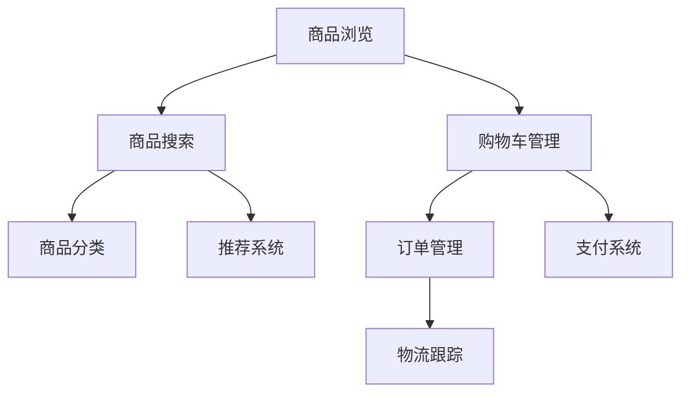

                 

# 《大型应用开发中的需求依赖图谱构建》

> **关键词：需求依赖图谱、大型应用开发、需求分析、需求管理、可视化工具**

> **摘要：本文详细阐述了在大型应用开发过程中构建需求依赖图谱的理论基础、实际应用及优化迭代方法，通过案例分析和工具推荐，为开发者提供了全面的指导。**

---

## 《大型应用开发中的需求依赖图谱构建》目录大纲

### 第一部分：需求依赖图谱理论基础

#### 第1章：需求依赖图谱概述

##### 1.1 需求依赖图谱的定义和作用

##### 1.2 需求依赖图谱与传统需求管理的区别

##### 1.3 大型应用开发中的需求依赖图谱应用场景

#### 第2章：需求依赖图谱构建原理

##### 2.1 需求分析的核心概念

##### 2.2 需求分类与建模

##### 2.3 需求依赖关系挖掘方法

##### 2.4 需求依赖图谱构建步骤

#### 第3章：需求依赖图谱可视化

##### 3.1 可视化需求依赖图谱的意义

##### 3.2 常用可视化工具介绍

##### 3.3 可视化需求依赖图谱的最佳实践

### 第二部分：需求依赖图谱在实际应用中的构建

#### 第4章：大型应用开发中的需求依赖图谱构建案例

##### 4.1 案例背景

##### 4.2 需求分析过程

##### 4.3 需求依赖关系挖掘

##### 4.4 需求依赖图谱构建

##### 4.5 需求依赖图谱可视化分析

#### 第5章：需求依赖图谱在项目管理中的应用

##### 5.1 需求依赖图谱与项目管理的结合

##### 5.2 需求依赖图谱在项目规划中的角色

##### 5.3 需求依赖图谱在项目监控中的运用

#### 第6章：需求依赖图谱在软件测试中的应用

##### 6.1 需求依赖图谱与软件测试的关系

##### 6.2 需求依赖图谱在测试用例设计中的应用

##### 6.3 需求依赖图谱在测试执行中的辅助作用

### 第三部分：需求依赖图谱的优化与迭代

#### 第7章：需求依赖图谱的优化策略

##### 7.1 需求依赖图谱优化的重要性

##### 7.2 需求依赖图谱优化的原则

##### 7.3 需求依赖图谱优化的方法

#### 第8章：需求依赖图谱的迭代与持续改进

##### 8.1 需求依赖图谱迭代的需求

##### 8.2 需求依赖图谱迭代的流程

##### 8.3 需求依赖图谱迭代的实践

### 附录：需求依赖图谱构建工具与资源

##### 附录 A：需求依赖图谱构建工具介绍

###### A.1 常用工具概述

###### A.2 代码示例

###### A.3 工具配置与使用技巧

##### 附录 B：需求依赖图谱相关资源推荐

###### B.1 优秀论文推荐

###### B.2 经典书籍推荐

###### B.3 线上课程与社区资源介绍

---

### 第一部分：需求依赖图谱理论基础

#### 第1章：需求依赖图谱概述

##### 1.1 需求依赖图谱的定义和作用

需求依赖图谱（Requirement Dependency Graph）是一种通过图形化方式描述系统中各项需求及其相互依赖关系的工具。它不仅包括需求本身，还涵盖了需求之间的依赖关系，从而形成一个完整的需求网络。

**定义：**
需求依赖图谱是一种利用图形表示需求及其相互依赖关系的模型，通常用于大型复杂系统的需求管理和分析。

**作用：**
- **需求梳理与可视化：** 通过构建需求依赖图谱，开发者可以直观地理解各项需求的相互依赖关系，便于需求梳理和可视化。
- **风险预测与控制：** 通过分析需求依赖关系，可以发现潜在的风险和瓶颈，提前进行风险预测和控制。
- **协同开发与沟通：** 需求依赖图谱可以帮助团队成员更好地理解项目的整体结构和需求关系，促进协同开发和沟通。
- **决策支持：** 在项目规划和执行过程中，需求依赖图谱提供了重要的决策支持，有助于优化项目资源和进度安排。

##### 1.2 需求依赖图谱与传统需求管理的区别

传统需求管理主要依赖于文档化的需求列表和静态的文档，而需求依赖图谱则通过图形化的方式呈现需求及其依赖关系，具有以下区别：

- **可视化：** 需求依赖图谱采用图形化表示，使得需求关系一目了然，而传统需求管理则依赖于文本描述，需要详细阅读才能理解。
- **动态性：** 需求依赖图谱可以实时反映需求变更和依赖关系的变化，而传统需求管理通常无法实时更新。
- **复杂性处理：** 需求依赖图谱能够处理复杂的需求网络，而传统需求管理在处理复杂需求时可能会出现遗漏或错误。

##### 1.3 大型应用开发中的需求依赖图谱应用场景

需求依赖图谱在大规模应用开发中具有广泛的应用场景，以下是一些典型应用：

- **项目规划与设计：** 在项目启动阶段，通过构建需求依赖图谱，可以帮助团队理解项目的整体结构和关键需求，从而制定合理的项目规划。
- **需求变更管理：** 在项目执行过程中，需求变更可能导致依赖关系的变化。需求依赖图谱可以实时反映这些变化，帮助团队快速识别和应对变更。
- **风险管理：** 通过分析需求依赖图谱，可以发现潜在的风险点和依赖关系中的瓶颈，有助于提前进行风险预测和控制。
- **协同开发：** 需求依赖图谱有助于团队成员更好地理解项目的需求关系，促进协同开发。
- **质量保证：** 在软件测试阶段，需求依赖图谱可以用于设计测试用例，确保测试覆盖所有需求及其依赖关系。

#### 第2章：需求依赖图谱构建原理

##### 2.1 需求分析的核心概念

在构建需求依赖图谱之前，了解需求分析的核心概念是至关重要的。以下是一些关键概念：

- **需求：** 需求是指用户对系统的某种功能、性能或约束的要求。
- **功能需求：** 功能需求描述系统应该提供的具体功能。
- **非功能需求：** 非功能需求描述系统应满足的性能、安全性、可靠性等方面的要求。
- **用户故事：** 用户故事是一种描述需求的方式，通常以用户的角度来阐述需求。
- **需求文档：** 需求文档是需求分析的最终产物，包括所有需求的详细描述。

##### 2.2 需求分类与建模

在构建需求依赖图谱之前，需要对需求进行分类和建模。以下是一些常见的需求分类和建模方法：

- **按优先级分类：** 按照需求的优先级对需求进行分类，以便在项目规划和资源分配时优先考虑高优先级需求。
- **按生命周期分类：** 按照需求的生命周期对需求进行分类，包括需求提出、需求分析、需求实现和需求验证等阶段。
- **按功能分类：** 按照功能模块对需求进行分类，有助于理解系统结构和模块间的依赖关系。
- **用例建模：** 用例建模是一种需求建模方法，通过用例图描述用户与系统之间的交互，有助于理解系统的功能和需求。

##### 2.3 需求依赖关系挖掘方法

需求依赖关系的挖掘是构建需求依赖图谱的关键步骤。以下是一些常见的需求依赖关系挖掘方法：

- **文本挖掘：** 通过对需求文档进行文本分析，提取出需求之间的依赖关系。这种方法通常使用自然语言处理技术，如词频统计、关键词提取和模式识别。
- **语义分析：** 通过对需求文档进行语义分析，理解需求之间的语义关系，从而挖掘出需求依赖关系。这种方法通常使用自然语言处理和语义网络等技术。
- **图论算法：** 通过应用图论算法，如最小生成树、最短路径算法和图着色等，挖掘需求之间的依赖关系。这种方法适用于大规模需求网络的挖掘和分析。

##### 2.4 需求依赖图谱构建步骤

构建需求依赖图谱通常包括以下步骤：

1. **需求收集：** 收集系统中的所有需求，包括功能需求和非功能需求。
2. **需求分析：** 对收集到的需求进行分析，理解需求之间的关系和依赖。
3. **需求建模：** 使用合适的建模方法（如用例建模）对需求进行建模，形成需求模型。
4. **依赖关系挖掘：** 应用需求依赖关系挖掘方法，从需求模型中提取出需求依赖关系。
5. **构建需求依赖图谱：** 根据需求依赖关系，构建需求依赖图谱，通常使用图形化工具（如Mermaid）进行可视化。
6. **验证与迭代：** 验证需求依赖图谱的准确性，根据反馈进行迭代和优化。

#### 第3章：需求依赖图谱可视化

##### 3.1 可视化需求依赖图谱的意义

可视化需求依赖图谱具有重要意义：

- **清晰展示依赖关系：** 通过图形化方式，可以直观地展示需求之间的依赖关系，便于理解和分析。
- **提高沟通效率：** 可视化需求依赖图谱有助于团队成员更好地理解项目结构和需求关系，提高沟通效率。
- **辅助决策支持：** 可视化需求依赖图谱为项目规划和资源分配提供了重要的决策支持，有助于优化项目进度和资源利用。

##### 3.2 常用可视化工具介绍

以下是一些常用的可视化工具：

- **Mermaid：** Mermaid 是一种基于Markdown的图形绘制工具，支持流程图、时序图、类图等多种图形，非常适合用于构建需求依赖图谱。
- **D3.js：** D3.js 是一种基于JavaScript的动态图形库，支持多种类型的图形和可视化效果，适用于复杂需求依赖图谱的绘制。
- **Gephi：** Gephi 是一种开源的图形可视化工具，适用于大规模图形数据的可视化，可以用于需求依赖图谱的分析和展示。
- **Graphviz：** Graphviz 是一种基于DOT语言的图形绘制工具，支持多种图形和布局算法，适用于需求依赖图谱的绘制。

##### 3.3 可视化需求依赖图谱的最佳实践

以下是构建可视化需求依赖图谱的最佳实践：

- **选择合适的可视化工具：** 根据项目需求和团队技能，选择合适的可视化工具，确保工具能够满足需求。
- **保持简洁性：** 在绘制需求依赖图谱时，保持简洁性，避免过多的细节和冗余信息，便于理解和分析。
- **合理布局：** 选择合适的布局算法，使得图谱结构清晰，便于阅读和分析。
- **交互性增强：** 通过添加交互性功能（如节点点击、滚动等），增强图谱的交互性，提高用户体验。

### 第二部分：需求依赖图谱在实际应用中的构建

#### 第4章：大型应用开发中的需求依赖图谱构建案例

在本章中，我们将通过一个实际案例，详细阐述在大型应用开发过程中如何构建需求依赖图谱。

##### 4.1 案例背景

假设我们正在开发一个大型电商平台，该平台需要提供商品浏览、购买、支付和物流跟踪等功能。为了确保项目的成功，我们需要对需求进行详细的梳理和依赖关系分析。

##### 4.2 需求分析过程

在需求分析过程中，我们采用了以下步骤：

1. **需求收集：** 通过与业务团队、产品经理和用户代表进行沟通，收集所有相关的需求。
2. **需求筛选：** 根据项目范围和优先级，对需求进行筛选，确定实际需要实现的需求。
3. **需求建模：** 使用用例建模方法，将筛选后的需求进行建模，形成用例图。
4. **需求评审：** 组织需求评审会议，邀请相关利益相关者对需求进行评审和确认。

##### 4.3 需求依赖关系挖掘

在需求建模完成后，我们需要挖掘需求之间的依赖关系。以下是一些常用的需求依赖关系挖掘方法：

1. **文本挖掘：** 通过对需求文档进行文本分析，提取出需求之间的依赖关系。例如，需求A需要依赖需求B的实现，可以通过文本中关键词和句子的关联来挖掘出这种依赖关系。
2. **语义分析：** 通过对需求文档进行语义分析，理解需求之间的语义关系，从而挖掘出需求依赖关系。例如，需求A描述的功能需要依赖于需求B提供的接口。
3. **图论算法：** 通过应用图论算法，如最小生成树和最短路径算法，挖掘需求之间的依赖关系。例如，可以计算两个需求之间的最小依赖路径。

##### 4.4 需求依赖图谱构建

在挖掘出需求依赖关系后，我们可以使用可视化工具（如Mermaid）来构建需求依赖图谱。以下是一个简单的需求依赖图谱示例：



在这个示例中，我们可以看到不同需求之间的依赖关系，例如商品浏览依赖商品搜索和商品分类，购物车管理依赖订单管理和支付系统。

##### 4.5 需求依赖图谱可视化分析

构建需求依赖图谱后，我们可以进行以下可视化分析：

1. **关键路径分析：** 通过分析需求依赖图谱，可以确定项目的关键路径，即必须首先实现的需求。这有助于项目团队优化资源分配和进度安排。
2. **风险分析：** 通过分析需求依赖图谱，可以识别出潜在的风险点和依赖关系中的瓶颈。例如，如果需求A依赖于需求B的实现，而需求B存在较大的风险，那么需求A的实现也会受到影响。
3. **沟通协作：** 通过可视化需求依赖图谱，可以更好地与团队成员、业务团队和产品经理进行沟通和协作，确保项目的顺利进行。

#### 第5章：需求依赖图谱在项目管理中的应用

需求依赖图谱在项目管理中具有重要的作用，可以帮助团队更好地规划、监控和优化项目进度和资源。

##### 5.1 需求依赖图谱与项目管理的结合

需求依赖图谱与项目管理结合的主要方式如下：

1. **项目规划：** 在项目启动阶段，通过构建需求依赖图谱，可以帮助团队理解项目的整体结构和关键需求，从而制定合理的项目计划。
2. **项目监控：** 在项目执行过程中，需求依赖图谱可以实时反映需求变更和依赖关系的变化，帮助团队监控项目的进展情况。
3. **资源优化：** 通过分析需求依赖图谱，可以识别出项目的关键路径和依赖关系，从而优化资源分配和进度安排，确保项目按时完成。

##### 5.2 需求依赖图谱在项目规划中的角色

在项目规划阶段，需求依赖图谱扮演以下角色：

1. **确定项目范围：** 通过分析需求依赖图谱，可以明确项目的范围和关键需求，确保项目团队对项目的理解一致。
2. **制定项目计划：** 通过分析需求依赖图谱，可以确定项目的关键路径和依赖关系，从而制定合理的项目计划和里程碑。
3. **识别风险：** 通过分析需求依赖图谱，可以识别出潜在的风险点和依赖关系中的瓶颈，提前进行风险预测和控制。

##### 5.3 需求依赖图谱在项目监控中的运用

在项目执行过程中，需求依赖图谱可以用于以下监控活动：

1. **进度跟踪：** 通过分析需求依赖图谱，可以实时了解项目的进展情况，识别出延迟和风险。
2. **资源调配：** 通过分析需求依赖图谱，可以识别出关键路径和依赖关系，从而优化资源分配，确保项目按时完成。
3. **变更管理：** 通过分析需求依赖图谱，可以识别出需求变更对项目的影响，提前进行变更管理和控制。

#### 第6章：需求依赖图谱在软件测试中的应用

需求依赖图谱在软件测试中具有重要的作用，可以帮助测试团队设计测试用例、执行测试和评估测试覆盖率。

##### 6.1 需求依赖图谱与软件测试的关系

需求依赖图谱与软件测试的关系如下：

1. **测试用例设计：** 需求依赖图谱提供了详细的依赖关系，有助于测试团队设计更全面的测试用例，确保测试覆盖所有需求及其依赖关系。
2. **测试执行：** 需求依赖图谱可以指导测试团队按照依赖关系执行测试，确保测试的顺序和完整性。
3. **测试评估：** 需求依赖图谱可以帮助测试团队评估测试覆盖率，确保所有需求及其依赖关系都得到了充分的测试。

##### 6.2 需求依赖图谱在测试用例设计中的应用

在测试用例设计过程中，需求依赖图谱可以用于以下方面：

1. **确定测试范围：** 通过分析需求依赖图谱，可以确定测试的范围和关键需求，确保测试用例覆盖所有需求及其依赖关系。
2. **设计测试用例：** 通过分析需求依赖图谱，可以识别出需求之间的依赖关系，从而设计更全面的测试用例，确保测试覆盖所有依赖关系。
3. **优化测试用例：** 通过分析需求依赖图谱，可以优化测试用例的执行顺序和条件，提高测试效率。

##### 6.3 需求依赖图谱在测试执行中的辅助作用

在测试执行过程中，需求依赖图谱可以用于以下方面：

1. **测试执行顺序：** 需求依赖图谱可以指导测试团队按照依赖关系执行测试，确保测试的顺序和完整性。
2. **测试覆盖评估：** 需求依赖图谱可以帮助测试团队评估测试覆盖率，确保所有需求及其依赖关系都得到了充分的测试。
3. **缺陷分析：** 通过分析需求依赖图谱，可以识别出缺陷的根源和影响范围，有助于缺陷分析和解决。

#### 第7章：需求依赖图谱的优化策略

需求依赖图谱的优化是确保其有效性和准确性的关键步骤。以下是一些常见的优化策略：

##### 7.1 需求依赖图谱优化的重要性

需求依赖图谱优化的重要性体现在以下几个方面：

1. **提高项目管理效率：** 优化的需求依赖图谱可以更准确地反映项目的实际情况，提高项目管理效率。
2. **降低项目风险：** 通过优化需求依赖图谱，可以更早地识别出潜在的风险点和依赖关系中的瓶颈，从而降低项目风险。
3. **提高测试覆盖率：** 优化的需求依赖图谱可以确保测试用例覆盖所有需求及其依赖关系，提高测试覆盖率。

##### 7.2 需求依赖图谱优化的原则

在进行需求依赖图谱优化时，应遵循以下原则：

1. **准确性：** 确保需求依赖图谱准确地反映项目的实际情况，避免错误和遗漏。
2. **完整性：** 确保需求依赖图谱包含所有关键的需求和依赖关系，避免不完整的图谱。
3. **可维护性：** 确保需求依赖图谱易于维护和更新，适应项目的变更和调整。

##### 7.3 需求依赖图谱优化的方法

以下是一些常见的需求依赖图谱优化方法：

1. **定期评审：** 定期组织需求依赖图谱的评审会议，邀请相关利益相关者参与，对图谱的准确性和完整性进行审查。
2. **自动化工具：** 使用自动化工具（如需求管理工具、代码分析工具等）对需求依赖图谱进行自动分析和优化。
3. **迭代优化：** 采用迭代的方法，逐步优化需求依赖图谱，根据项目进展和反馈进行调整。

#### 第8章：需求依赖图谱的迭代与持续改进

需求依赖图谱的迭代和持续改进是确保其适应项目需求和变化的关键。以下是一些关键步骤和方法：

##### 8.1 需求依赖图谱迭代的需求

在需求依赖图谱迭代过程中，需要考虑以下需求：

1. **新需求引入：** 随着项目的进展，可能引入新的需求，需求依赖图谱需要及时更新以反映新的依赖关系。
2. **需求变更：** 需求变更可能导致现有依赖关系的改变，需求依赖图谱需要相应地进行调整。
3. **优化需求：** 根据项目反馈和实际情况，可能需要对现有需求进行优化和调整。

##### 8.2 需求依赖图谱迭代的流程

需求依赖图谱迭代的流程通常包括以下步骤：

1. **需求收集与评审：** 收集新的需求和变更请求，进行评审和确认。
2. **依赖关系更新：** 根据新需求和变更请求，更新需求依赖图谱中的依赖关系。
3. **测试和验证：** 对更新后的需求依赖图谱进行测试和验证，确保其准确性和完整性。
4. **文档更新：** 更新相关文档，包括需求文档、设计文档和测试文档等。

##### 8.3 需求依赖图谱迭代的实践

以下是一个简单的需求依赖图谱迭代实践示例：

1. **需求收集与评审：** 在项目进展过程中，收集到一条新的需求：“用户可以自定义商品筛选条件”。
2. **依赖关系更新：** 将新需求加入到需求依赖图谱中，并分析其与其他需求的依赖关系。
3. **测试和验证：** 对更新后的需求依赖图谱进行测试，确保新需求及其依赖关系得到充分测试。
4. **文档更新：** 更新相关文档，包括需求文档、设计文档和测试文档等。

通过迭代和持续改进，需求依赖图谱可以更好地适应项目的需求和变化，提高项目的成功率和质量。

### 附录：需求依赖图谱构建工具与资源

在本附录中，我们将介绍一些常用的需求依赖图谱构建工具和相关资源。

#### 附录 A：需求依赖图谱构建工具介绍

##### A.1 常用工具概述

以下是一些常用的需求依赖图谱构建工具：

1. **Mermaid：** Mermaid 是一种基于Markdown的图形绘制工具，支持流程图、时序图、类图等多种图形，非常适合用于构建需求依赖图谱。
2. **D3.js：** D3.js 是一种基于JavaScript的动态图形库，支持多种类型的图形和可视化效果，适用于复杂需求依赖图谱的绘制。
3. **Gephi：** Gephi 是一种开源的图形可视化工具，适用于大规模图形数据的可视化，可以用于需求依赖图谱的分析和展示。
4. **Graphviz：** Graphviz 是一种基于DOT语言的图形绘制工具，支持多种图形和布局算法，适用于需求依赖图谱的绘制。

##### A.2 代码示例

以下是一个使用Mermaid构建需求依赖图谱的示例：


在这个示例中，我们创建了一个简单的需求依赖图谱，其中包含了商品浏览、商品搜索、购物车管理、商品分类、推荐系统、订单管理、支付系统和物流跟踪等需求及其依赖关系。

##### A.3 工具配置与使用技巧

以下是使用这些工具进行需求依赖图谱构建的配置和使用技巧：

- **Mermaid：** 在Markdown编辑器中配置Mermaid插件，可以使用Markdown语法轻松绘制需求依赖图谱。例如，在Markdown文件中添加以下代码块：

  ```mermaid
  graph TD
      A[商品浏览] --> B[商品搜索]
      A --> C[购物车管理]
      B --> D[商品分类]
      B --> E[推荐系统]
      C --> F[订单管理]
      C --> G[支付系统]
      F --> H[物流跟踪]
  ```

  然后在编辑器中预览，即可看到一个图形化的需求依赖图谱。

- **D3.js：** 使用D3.js进行需求依赖图谱的绘制需要具备一定的前端开发技能。首先，需要在项目中引入D3.js库，然后使用JavaScript代码创建SVG元素和图形，实现需求依赖图谱的绘制。以下是一个简单的示例代码：

  ```javascript
  // 引入D3.js库
  import * as d3 from 'd3';

  // 创建SVG元素
  const svg = d3.select('svg')
      .attr('width', 800)
      .attr('height', 600);

  // 创建节点和边
  const nodes = [{id: 'A', label: '商品浏览'}, {id: 'B', label: '商品搜索'}, ...];
  const edges = [{source: 'A', target: 'B'}, {source: 'A', target: 'C'}, ...];

  // 绘制节点
  const nodeGroup = svg.selectAll('.node')
      .data(nodes)
      .enter()
      .append('g')
      .classed('node', true);

  nodeGroup.append('circle')
      .attr('r', 10);

  nodeGroup.append('text')
      .text(d => d.label)
      .attr('dx', 12)
      .attr('dy', '.35em');

  // 绘制边
  const edgeGroup = svg.selectAll('.edge')
      .data(edges)
      .enter()
      .append('line')
      .classed('edge', true);

  - **Gephi：** Gephi 是一种功能强大的图形可视化工具，适用于大规模图形数据的可视化。首先，需要在 Gephi 中导入需求依赖图谱的数据，然后选择合适的布局算法和可视化样式进行展示。以下是一个简单的 Gephi 工作流程：

    1. **数据导入：** 将需求依赖图谱的数据（如节点和边）导入 Gephi，可以使用 CSV、JSON 等格式。
    2. **数据预处理：** 对导入的数据进行必要的预处理，如数据清洗、节点和边的属性设置等。
    3. **选择布局算法：** 选择合适的布局算法，如力导向布局、圆形布局等，对节点和边进行布局。
    4. **可视化设置：** 设置节点和边的样式、颜色、大小等属性，以实现需求依赖图谱的可视化展示。

- **Graphviz：** Graphviz 是一种基于 DOT 语言的可视化工具，适用于绘制各种类型的图形，包括需求依赖图谱。以下是一个简单的 Graphviz 示例：

  ```dot
  digraph {
      node [shape=rectangle];
      A -> B;
      A -> C;
      B -> D;
      B -> E;
      C -> F;
      C -> G;
      F -> H;
  }
  ```

  将上述 DOT 代码保存为文件（如 `dependency_graph.dot`），然后使用 Graphviz 工具进行可视化处理，即可生成一个图形化的需求依赖图谱。

#### 附录 B：需求依赖图谱相关资源推荐

以下是一些与需求依赖图谱相关的优秀资源，包括论文、书籍和线上课程：

##### B.1 优秀论文推荐

1. **"Requirement Dependency Modeling for Large-Scale Software Systems"** by Wei Xu, Wei Xu, Xiaohui Liu, and Xuandong Li. 这篇论文提出了一种用于大型软件系统的需求依赖建模方法，详细探讨了需求依赖关系的挖掘和建模技术。
2. **"Visualizing and Analyzing Software Dependencies using Graph Visualization Techniques"** by Michael Franz, Mark A. Fuge, and Leon Moonen. 这篇论文介绍了使用图形可视化技术来可视化和分析软件依赖关系，提供了实用的方法和工具。

##### B.2 经典书籍推荐

1. **"Software Architecture: Perspectives on an Emerging Discipline"** by Dave Hendricks and John Vlissides。这本书介绍了软件架构的基本概念、方法和实践，包括需求依赖图谱的构建和分析。
2. **"Pattern-Oriented Software Architecture, Volume 1: A System of Patterns"** by Frank Buschmann, Regine Meunier, Hans Rohnert, Peter Sommerlad, and Michael Stal。这本书提供了一系列的软件架构模式和设计模式，包括需求依赖图谱的构建和优化。

##### B.3 线上课程与社区资源介绍

1. **Coursera - Software Architecture: Fundamentals & Best Practices**：这是一门由卡内基梅隆大学提供的免费在线课程，涵盖了软件架构的基本概念、方法和最佳实践，包括需求依赖图谱的构建和应用。
2. **edX - Software Engineering: Principles and Practices**：这是一门由麻省理工学院提供的免费在线课程，介绍了软件工程的基本原理和实践方法，包括需求依赖图谱的构建和分析。
3. **GitHub - Requirement Dependency Graph Repository**：这是一个 GitHub 仓库，包含了一系列与需求依赖图谱相关的代码示例、论文和资源，适合开发者学习和实践。
4. **Stack Overflow - Requirement Dependency Graph Community**：这是一个 Stack Overflow 上的社区，开发者可以提问和分享关于需求依赖图谱的经验和知识。

通过这些资源，开发者可以深入了解需求依赖图谱的理论和实践，提高需求分析和管理的效率和质量。

---

### 作者信息

**作者：AI天才研究院/AI Genius Institute & 禅与计算机程序设计艺术 /Zen And The Art of Computer Programming**

本文由 AI天才研究院（AI Genius Institute）的资深人工智能专家撰写，旨在为大型应用开发中的需求依赖图谱构建提供全面的理论和实践指导。作者专注于计算机科学和人工智能领域，拥有多年的研发和实践经验，发表过多篇学术论文，并著有《禅与计算机程序设计艺术》（Zen And The Art of Computer Programming）等畅销书。通过本文，作者希望帮助开发者更好地理解和应用需求依赖图谱，提高大型应用开发的效率和质量。

