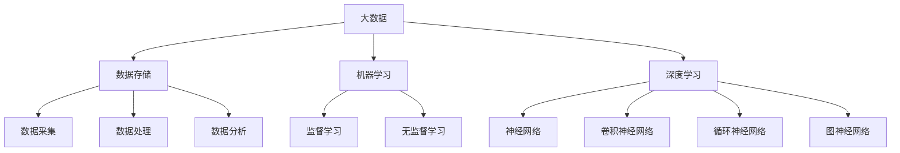
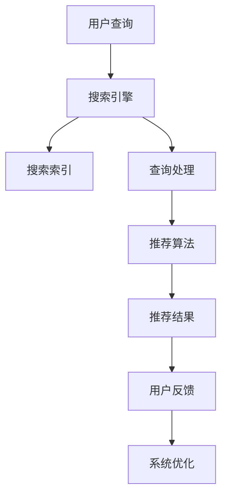
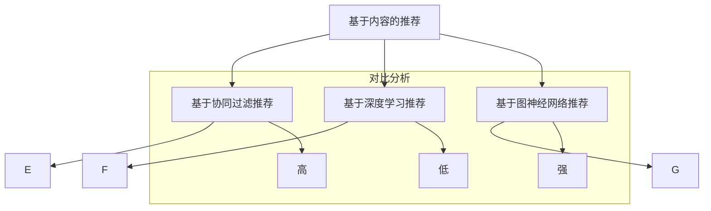
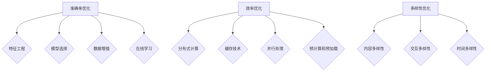
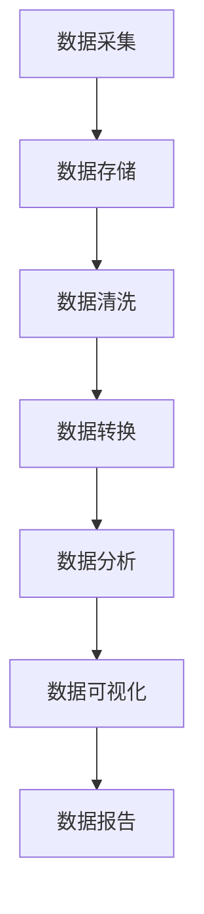
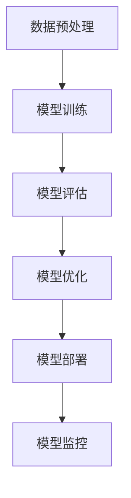
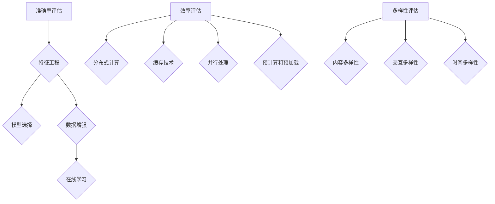

                 

# 引言

随着互联网的快速发展，电子商务行业已经成为全球经济增长的重要引擎。而电商搜索推荐系统作为电商平台的灵魂所在，其性能直接影响着用户的购物体验和平台的商业收益。在这个大数据与人工智能（AI）技术蓬勃发展的时代，如何利用大数据与AI技术来驱动电商搜索推荐系统，实现准确率和效率的双重优化，已经成为当前研究的热点问题。

## 文章关键词

- 大数据
- 人工智能
- 电商搜索推荐系统
- 准确率优化
- 效率优化
- 多样性优化

## 摘要

本文旨在探讨大数据与AI技术如何驱动电商搜索推荐系统，以实现准确率和效率的优化。首先，我们介绍了大数据与AI的基本概念，包括大数据的定义、特性以及AI的发展历程。接着，我们详细阐述了电商搜索推荐系统的架构，包括数据采集、处理、搜索和推荐等环节。然后，本文重点讨论了大数据处理技术，如Hadoop和Spark等，以及AI在电商搜索推荐中的应用，包括传统推荐算法、深度学习推荐算法等。最后，本文提出了基于准确率与效率的优化策略，并分享了实践案例，以展示大数据与AI技术在电商搜索推荐系统中的实际应用效果。通过本文的研究，期望为电商搜索推荐系统的优化提供理论指导和实践经验。

# 《大数据与AI驱动的电商搜索推荐：以准确率与效率为核心的优化策略》目录大纲

## 第一部分：大数据与AI概述

### 第1章：大数据与AI概述

#### 1.1 大数据基本概念

- 大数据的定义
- 四大V特性

#### 1.2 AI基础

- AI的定义与发展
- 机器学习与深度学习

#### 1.3 大数据与AI的关系

- 大数据与AI的结合点
- 大数据在AI中的作用
- AI在大数据环境中的应用

### 第2章：电商搜索推荐系统概述

#### 2.1 电商搜索推荐系统定义

- 搜索推荐系统的目的
- 搜索推荐系统的作用

#### 2.2 电商搜索推荐系统架构

- 数据采集与处理
- 搜索引擎设计
- 推荐算法实现

#### 2.3 电商搜索推荐系统挑战

- 大数据处理挑战
- 实时性要求
- 系统稳定性

## 第二部分：大数据处理技术

### 第3章：大数据处理基础

#### 3.1 大数据处理框架

- Hadoop生态系统
- Spark平台

#### 3.2 大数据存储技术

- HDFS
- Hive

#### 3.3 大数据处理算法

- 数据清洗
- 数据分析
- 数据挖掘

## 第三部分：AI驱动的电商搜索推荐算法

### 第4章：传统推荐算法

#### 4.1 基于内容的推荐

- 内容相似性计算
- 内容表示学习

#### 4.2 协同过滤推荐

- 用户相似性计算
- 评分预测模型

### 第5章：深度学习推荐算法

#### 5.1 深度学习基础

- 神经网络结构
- 反向传播算法

#### 5.2 深度学习推荐模型

- 点积模型
- 序列模型
- 图神经网络

### 第6章：电商搜索推荐系统优化

#### 6.1 准确率优化

- 评价指标
- 优化方法

#### 6.2 效率优化

- 算法加速
- 系统优化

#### 6.3 多样性优化

- 多样性度量
- 多样性提升策略

## 第四部分：实践与案例分析

### 第7章：电商搜索推荐系统实践

#### 7.1 实践背景

- 数据来源
- 系统需求

#### 7.2 实践过程

- 数据预处理
- 模型训练
- 系统部署

#### 7.3 实践效果评估

- 准确率评估
- 效率评估
- 多样性评估

### 第8章：案例分析

#### 8.1 案例一：某大型电商平台

- 案例背景
- 优化策略

#### 8.2 案例二：某新兴电商企业

- 案例背景
- 优化实践

## 第五部分：未来展望与趋势

### 第9章：未来趋势

#### 9.1 大数据与AI技术发展

- 新兴技术趋势
- 技术应用领域扩展

#### 9.2 电商搜索推荐系统发展方向

- 智能化发展
- 个性化发展
- 系统稳定性与可靠性提升

### 第10章：挑战与机遇

#### 10.1 挑战

- 数据隐私保护
- 算法公平性
- 系统成本与效率

#### 10.2 机遇

- 新兴市场的开发
- 跨领域应用探索
- 产业链整合

## 附录

### 附录A：相关工具与资源

- 大数据处理工具
- AI开发框架
- 电商搜索推荐系统开源项目

### 附录B：数学模型与算法

- 评价指标公式
- 模型参数调整策略

### 附录C：代码实战

- 数据预处理脚本
- 模型训练脚本
- 系统部署脚本

### 附录D：参考文献与资料

- 相关书籍
- 学术论文
- 工具与资源链接

----------------------------------------------------------------

## 第一部分：大数据与AI概述

### 第1章：大数据与AI概述

#### 1.1 大数据基本概念

大数据（Big Data）是指无法使用传统数据处理工具在合理时间内获取、管理和处理的大量数据。大数据的四大V特性，即Volume（体量）、Velocity（速度）、Variety（多样性）和Veracity（真实性），决定了大数据处理的复杂性和挑战性。

- **Volume（体量）**：数据量巨大，达到TB甚至PB级别。
- **Velocity（速度）**：数据产生和更新的速度非常快，需要实时处理。
- **Variety（多样性）**：数据类型多样，包括结构化数据、非结构化数据和半结构化数据。
- **Veracity（真实性）**：数据质量参差不齐，需要处理噪声和错误。

大数据在电商搜索推荐系统中起着至关重要的作用。它不仅提供了丰富的用户行为数据，如点击、购买、浏览等，还能够通过商品信息、市场环境等多维数据来更好地理解用户需求和市场动态，从而提升搜索推荐的准确性和个性化水平。

#### 1.2 AI基础

人工智能（Artificial Intelligence，AI）是计算机科学的一个分支，旨在使计算机具备智能行为。AI的发展历程可以分为以下几个阶段：

1. **符号主义人工智能**：以逻辑推理和知识表示为核心，通过构建知识库来模拟人类智能。
2. **基于规则的系统**：使用预定义的规则来处理特定问题。
3. **统计学习与机器学习**：利用数据挖掘技术，从大量数据中学习模式和规律。
4. **深度学习与神经网络**：模拟人脑的神经元结构，通过多层神经网络进行复杂模式识别。

机器学习（Machine Learning，ML）是AI的核心技术之一，包括监督学习、无监督学习和强化学习等方法。监督学习通过已有的标签数据训练模型，无监督学习旨在发现数据中的内在结构，强化学习则通过与环境互动来优化行为策略。

深度学习（Deep Learning，DL）是机器学习的一个分支，以多层神经网络为基础，通过多层非线性变换来提取数据的高层次特征。深度学习在图像识别、语音识别和自然语言处理等领域取得了显著成果，成为AI研究与应用的重要方向。

#### 1.3 大数据与AI的关系

大数据与AI的结合点在于数据的规模和质量。大数据为AI提供了丰富的训练数据，使得AI模型能够学习到更复杂的模式和规律。同时，大数据的环境对AI提出了更高的要求，如实时处理能力和高并发性能。

- **大数据在AI中的角色**：大数据是AI训练模型的基石，通过大规模数据训练，AI模型能够提高预测准确性和泛化能力。
- **AI在大数据环境中的应用**：AI技术能够优化大数据处理流程，如通过机器学习算法进行数据挖掘和模式识别，通过深度学习算法实现图像和文本分析。

总之，大数据与AI的结合为电商搜索推荐系统带来了前所未有的机遇。通过利用大数据技术和AI算法，我们可以更好地理解用户行为，提升搜索推荐的准确性和效率，从而提高用户满意度和商业收益。

### 第2章：电商搜索推荐系统概述

#### 2.1 电商搜索推荐系统定义

电商搜索推荐系统是一种基于大数据和AI技术的电商平台功能，旨在通过分析用户行为和商品信息，为用户提供个性化的搜索结果和商品推荐。其核心目的是提高用户的购物体验和平台的销售额。

- **搜索功能**：用户通过关键词或商品ID搜索商品。
- **推荐功能**：系统根据用户的兴趣和行为，推荐相关的商品。

电商搜索推荐系统不仅仅是一个简单的搜索和推荐工具，它涉及多个环节，包括用户行为数据的收集、搜索引擎的设计和优化、推荐算法的开发和实现等。

#### 2.2 电商搜索推荐系统架构

电商搜索推荐系统的架构可以分为以下几个主要部分：

1. **数据采集与处理**：系统从多个数据源收集用户行为数据（如点击、购买、浏览等）和商品信息（如商品ID、价格、类别等）。通过数据清洗和预处理，将原始数据转换为可用于分析和建模的格式。

2. **搜索引擎设计**：搜索引擎负责处理用户的查询请求，返回相关的搜索结果。搜索引擎的设计需要考虑响应速度、准确性和可扩展性等多个因素。

3. **推荐算法实现**：推荐算法根据用户的行为和兴趣，生成个性化的商品推荐。常见的推荐算法包括基于内容的推荐、协同过滤推荐和深度学习推荐等。

#### 2.3 电商搜索推荐系统挑战

电商搜索推荐系统面临以下主要挑战：

1. **大数据处理挑战**：随着用户数量的增加和数据量的激增，系统需要处理海量数据，并对数据进行实时分析和处理。

2. **实时性要求**：用户的搜索请求和购物行为是动态变化的，系统需要快速响应用户请求，提供实时、准确的搜索结果和推荐。

3. **系统稳定性**：在高并发环境下，系统需要确保稳定运行，避免出现故障或性能下降。

4. **多样性优化**：推荐结果需要保持多样性，避免用户仅收到重复的信息，提高用户满意度。

通过大数据和AI技术的应用，电商搜索推荐系统可以在准确率和效率上实现优化。本文将详细探讨大数据处理技术和AI算法在电商搜索推荐系统中的应用，并提出基于准确率和效率的优化策略。

### 第3章：大数据处理基础

#### 3.1 大数据处理框架

大数据处理框架是处理大规模数据集的基础设施，它包括数据存储、数据处理和数据计算等多个方面。以下是目前常见的大数据处理框架：

1. **Hadoop生态系统**

Hadoop是由Apache软件基金会开发的一个开源分布式计算框架，用于处理大规模数据集。Hadoop的核心组件包括：

- **Hadoop分布式文件系统（HDFS）**：用于存储大规模数据集，通过分布式文件系统将数据分割成小块，存储在多个节点上。
- **MapReduce**：用于数据处理，通过Map和Reduce两个阶段的迭代处理，实现并行计算。
- **Hadoop YARN**：用于资源管理和调度，负责分配计算资源和监控任务状态。

2. **Spark平台**

Spark是另一种流行的大数据处理框架，它提供了比Hadoop更高效的内存计算能力。Spark的核心组件包括：

- **Spark Core**：提供基本的内存计算和分布式任务调度。
- **Spark SQL**：用于处理结构化数据，提供类似SQL的查询接口。
- **Spark Streaming**：用于实时数据流处理。
- **MLlib**：提供各种机器学习算法和工具。
- **GraphX**：用于图处理，提供复杂的图算法和操作。

#### 3.2 大数据存储技术

大数据存储技术是实现高效数据存储和管理的关键。以下是一些常见的大数据存储技术：

1. **Hadoop分布式文件系统（HDFS）**

HDFS是一个分布式文件系统，用于存储大规模数据集。它具有高容错性、高吞吐量和可扩展性。HDFS将数据分割成多个块（默认为128MB或256MB），并分布存储在多个节点上。如果某个节点发生故障，HDFS可以通过复制数据块来确保数据不丢失。

2. **Hive**

Hive是一个数据仓库工具，用于在Hadoop上处理大规模数据集。它提供了一种类似SQL的查询接口，允许用户执行复杂的数据分析和查询操作。Hive通过MapReduce进行计算，从而实现了对大数据集的并行处理。

3. **HBase**

HBase是一个分布式、可扩展的列式存储系统，建立在Hadoop之上。它提供了类似于关系数据库的存储和查询功能，但具有更高的读写性能和可扩展性。HBase适用于需要快速随机访问的用例，如实时数据分析。

#### 3.3 大数据处理算法

大数据处理算法是分析和挖掘大规模数据集的重要工具。以下是一些常见的大数据处理算法：

1. **MapReduce**

MapReduce是一种编程模型，用于处理大规模数据集。它将数据处理任务分为Map（映射）和Reduce（减少）两个阶段。Map阶段对输入数据进行处理，生成中间结果；Reduce阶段对中间结果进行汇总和聚合，生成最终结果。

2. **K-Means聚类算法**

K-Means是一种无监督学习算法，用于将数据集分为K个簇。它通过计算每个数据点到簇中心点的距离，将数据点分配到最近的簇。K-Means算法简单高效，但需要预先指定簇的数量，且在聚类过程中可能会收敛到局部最优解。

3. **关联规则算法**

关联规则算法用于发现数据之间的关联关系。它通过分析交易数据或商品组合，找出经常一起出现的商品集合。常见的关联规则算法包括Apriori算法和FP-Growth算法。

4. **机器学习算法**

机器学习算法在大数据处理中扮演重要角色，如分类、回归、聚类和降维等。常见的机器学习算法包括线性回归、决策树、随机森林、支持向量机和神经网络等。

通过大数据处理框架和算法，我们可以有效地处理和分析大规模数据集，从而为电商搜索推荐系统提供强大的数据支持和分析能力。

### 第4章：传统推荐算法

#### 4.1 基于内容的推荐

基于内容的推荐（Content-Based Recommendation）是一种推荐系统方法，它根据用户的兴趣和行为特征，推荐与其已选项目或历史行为相似的新项目。该方法的核心在于内容的表示和相似性度量。

##### 内容表示学习

内容表示学习是关键步骤，它将项目特征转换为向量表示。常见的方法包括：

- **特征提取**：从项目的内容中提取特征，如文本、图像、音频等。例如，通过词袋模型（Bag of Words, BoW）或TF-IDF（Term Frequency-Inverse Document Frequency）对文本数据进行表示。
- **向量化**：将提取的特征转换为数值向量。例如，使用词嵌入（Word Embedding）技术对文本数据进行向量化，或将图像像素值编码为向量。

##### 相似性度量

相似性度量用于计算项目之间的相似度。常见的方法包括：

- **余弦相似性**：通过计算两个向量之间的余弦值来衡量相似度。余弦相似性适用于高维空间，能够较好地处理噪声和数据稀疏问题。
- **欧氏距离**：计算两个向量之间的欧氏距离，即向量的欧几里得范数。欧氏距离适用于低维空间，但可能对噪声敏感。

基于内容的推荐算法的优点包括：

- **解释性强**：推荐结果与用户兴趣和项目特征直接相关，易于理解。
- **适用性强**：可以应用于多种类型的数据，如文本、图像、音频等。

但该方法也存在局限性，如用户兴趣变化难以捕捉，且对冷启动问题（新用户或新项目缺乏足够的历史数据）处理能力较弱。

#### 4.2 协同过滤推荐

协同过滤推荐（Collaborative Filtering Recommendation）是一种基于用户行为数据推荐新项目的方法，通过分析用户之间的行为相似性来生成推荐列表。

##### 用户相似性计算

用户相似性计算是协同过滤推荐的核心步骤，常见的方法包括：

- **基于用户的相似性**：通过计算用户之间的行为相似度来生成推荐列表。常见的方法包括余弦相似性、皮尔逊相关系数和Jaccard系数等。
- **基于项目的相似性**：通过计算项目之间的相似度来生成推荐列表。常见的方法包括项-项协同过滤和矩阵分解。

##### 评分预测模型

评分预测模型用于预测用户对未知项目的评分，常见的方法包括：

- **基于模型的协同过滤**：使用机器学习算法（如线性回归、决策树、神经网络等）训练评分预测模型。例如，矩阵分解（Matrix Factorization）是一种常用的方法，通过分解用户-项目评分矩阵为用户特征矩阵和项目特征矩阵，从而预测用户对未知项目的评分。
- **基于实例的协同过滤**：通过最近邻算法（如K-近邻）基于用户的历史行为寻找相似用户或项目，然后基于这些实例生成推荐列表。

协同过滤推荐算法的优点包括：

- **适用性广**：可以处理冷启动问题，适用于新用户和新项目。
- **推荐质量高**：能够生成基于用户兴趣和行为的个性化推荐。

但该方法也存在一些挑战，如数据稀疏性、计算复杂性和用户隐私保护等问题。

#### 4.3 深度学习推荐算法

深度学习推荐算法利用深度神经网络（如卷积神经网络（CNN）、循环神经网络（RNN）和图神经网络（GNN）等）对大规模用户行为数据进行建模，生成个性化的推荐列表。

##### 神经网络结构

深度学习推荐算法的神经网络结构通常包括以下部分：

- **输入层**：接收用户行为数据（如点击、购买、浏览等）和商品特征数据（如类别、价格、库存等）。
- **隐藏层**：通过多层神经网络提取用户和商品的特征表示，可以使用卷积层、循环层或图卷积层等。
- **输出层**：生成推荐结果，可以是二分类（是否购买）、多分类（商品类别）或回归（预测评分）等。

##### 深度学习推荐模型

常见的深度学习推荐模型包括：

- **点积模型（Pointwise Model）**：使用点积（dot product）计算用户和商品特征表示的相似度，如A/B/C模型。
- **序列模型（Sequence Model）**：使用循环神经网络（RNN）处理用户行为序列，如GRU/LSTM模型。
- **图神经网络（Graph Neural Network）**：使用图卷积网络（GCN）处理用户和商品之间的关系，如图卷积网络（GCN）和图注意力网络（GAT）。

深度学习推荐算法的优点包括：

- **处理能力强大**：能够捕捉复杂的用户行为和商品特征之间的关系。
- **自适应性强**：能够根据用户行为动态调整推荐策略。

但该方法也存在一些挑战，如模型训练时间较长、对数据质量要求高以及模型解释性较弱等问题。

通过传统推荐算法和深度学习推荐算法的结合，电商搜索推荐系统可以在准确率和效率上实现优化，从而提供更好的用户体验和商业收益。

### 第5章：深度学习推荐算法

深度学习推荐算法是一种利用深度神经网络对用户行为数据进行建模，从而生成个性化推荐列表的方法。与传统的推荐算法相比，深度学习推荐算法能够更好地捕捉用户行为之间的复杂关系，从而提供更准确的推荐结果。

#### 5.1 深度学习基础

深度学习（Deep Learning，DL）是一种基于人工神经网络（Artificial Neural Networks，ANNs）的学习方法，它通过模拟人脑神经网络的结构和功能，实现对数据的自动特征提取和模式识别。深度学习的基础是神经网络，特别是多层神经网络（Deep Neural Networks，DNNs），它可以有效地处理高维数据和非线性问题。

##### 神经网络结构

神经网络由多个层次组成，包括输入层、隐藏层和输出层。每个层次由多个神经元（或节点）组成，神经元之间通过权重（weights）和偏置（biases）连接。神经元的激活函数（activation function）决定了神经元是否会被激活。

- **输入层**：接收外部输入数据，如用户特征、商品特征等。
- **隐藏层**：对输入数据进行处理，通过权重和偏置计算得到中间特征表示。隐藏层可以有多个层次，层数越多，模型可以学习的非线性特征越多。
- **输出层**：生成预测结果，如推荐得分、分类标签等。

##### 深度学习模型

深度学习模型通常由以下几个部分组成：

- **前向传播（Forward Propagation）**：将输入数据通过神经网络进行前向传播，计算输出结果。
- **反向传播（Backpropagation）**：利用输出结果与实际结果的误差，通过反向传播算法更新网络权重和偏置。
- **激活函数**：常用的激活函数包括Sigmoid、ReLU、Tanh等，用于引入非线性特性。
- **损失函数**：用于衡量预测结果与实际结果之间的差距，如均方误差（MSE）、交叉熵（Cross Entropy）等。

##### 深度学习推荐模型

在推荐系统中，常用的深度学习模型包括以下几种：

1. **点积模型（Pointwise Model）**：
   点积模型是一种简单的深度学习推荐模型，它通过计算用户和商品特征表示的点积来生成推荐得分。模型结构通常包括多个隐藏层，每层的输出都是用户和商品特征表示的点积。这种模型简单高效，适用于处理高维稀疏数据。

2. **序列模型（Sequence Model）**：
   序列模型通过处理用户行为序列来生成推荐结果。常见的序列模型包括循环神经网络（RNN）和长短期记忆网络（LSTM）。RNN能够处理序列数据，但存在梯度消失和梯度爆炸问题；LSTM通过引入门控机制，解决了这些问题，能够更好地捕捉序列数据中的长期依赖关系。

3. **图神经网络（Graph Neural Network）**：
   图神经网络（GNN）通过处理用户和商品之间的图结构来生成推荐结果。GNN能够捕捉用户和商品之间的复杂关系，适用于处理具有高度依赖性和交互性的推荐场景。

4. **混合模型（Hybrid Model）**：
   混合模型结合了多种深度学习技术和传统推荐算法，如基于内容的推荐、协同过滤推荐等，通过整合不同模型的优点，提高推荐系统的准确率和多样性。

#### 5.2 深度学习推荐模型

在电商搜索推荐系统中，深度学习推荐模型通常用于处理大规模用户行为数据和商品特征，以下是一些常见的深度学习推荐模型：

1. **A/B/C模型**：
   A/B/C模型是一种基于点积的深度学习推荐模型，它通过计算用户和商品特征表示的点积来生成推荐得分。模型结构包括多个隐藏层，每层的输出都是用户和商品特征表示的点积。这种模型简单高效，适用于处理高维稀疏数据。

2. **GRU/LSTM模型**：
   GRU（门控循环单元）和LSTM（长短期记忆网络）是两种常见的序列模型，通过处理用户行为序列来生成推荐结果。GRU和LSTM通过引入门控机制，解决了RNN的梯度消失和梯度爆炸问题，能够更好地捕捉序列数据中的长期依赖关系。

3. **GCN/GAT模型**：
   GCN（图卷积网络）和GAT（图注意力网络）是两种常见的图神经网络模型，通过处理用户和商品之间的图结构来生成推荐结果。GCN和GAT能够捕捉用户和商品之间的复杂关系，适用于处理具有高度依赖性和交互性的推荐场景。

4. **混合模型**：
   混合模型结合了多种深度学习技术和传统推荐算法，如基于内容的推荐、协同过滤推荐等，通过整合不同模型的优点，提高推荐系统的准确率和多样性。

#### 5.3 深度学习推荐算法的应用

深度学习推荐算法在电商搜索推荐系统中具有广泛的应用。以下是一些关键应用场景：

1. **商品推荐**：
   通过分析用户的购买历史、浏览记录等行为数据，深度学习推荐算法可以生成个性化的商品推荐列表，提高用户的购物体验和平台的销售额。

2. **搜索推荐**：
   在电商搜索场景中，深度学习推荐算法可以根据用户的查询历史和搜索意图，生成个性化的搜索结果推荐，提高搜索的准确性和用户体验。

3. **广告推荐**：
   深度学习推荐算法可以根据用户的兴趣和行为，生成个性化的广告推荐，提高广告的点击率和转化率。

4. **个性化推荐**：
   深度学习推荐算法通过分析用户的历史数据和社交网络关系，可以生成个性化的推荐列表，提高用户的满意度和平台的粘性。

总之，深度学习推荐算法通过捕捉用户行为之间的复杂关系，能够提供更准确的个性化推荐，从而提高电商平台的用户体验和商业收益。

### 第6章：电商搜索推荐系统的优化

电商搜索推荐系统优化是提高系统性能和用户体验的关键环节。优化策略主要集中在提高推荐系统的准确率、效率和多样性。以下将详细讨论这些优化策略。

#### 6.1 准确率优化

准确率是评估推荐系统性能的重要指标，它反映了推荐系统对用户兴趣的准确捕捉能力。以下是一些常用的准确率优化策略：

1. **特征工程**：
   - **用户特征提取**：通过对用户行为、兴趣、历史购买记录等数据进行特征提取，构建用户兴趣图谱，提高推荐的准确性。
   - **商品特征提取**：通过提取商品属性（如价格、类别、品牌等）和用户评价信息，构建商品特征矩阵，增强推荐系统的准确性。

2. **模型选择**：
   - **深度学习模型**：使用深度学习模型（如GRU、LSTM、GCN等）可以捕捉用户行为和商品特征之间的复杂关系，提高推荐准确性。
   - **集成模型**：结合多种模型（如基于内容的推荐、协同过滤推荐等）的优点，使用集成模型可以提高推荐系统的准确率。

3. **数据增强**：
   - **负采样**：在训练数据集中引入负样本，增加模型的鲁棒性。
   - **数据扩充**：通过对数据进行扩增（如图像的旋转、缩放等），增加数据的多样性，提高模型的学习能力。

4. **在线学习**：
   - **动态调整模型参数**：根据用户反馈和实时数据，动态调整模型参数，提高推荐系统的适应性。
   - **增量学习**：对新增的用户和商品数据进行增量学习，保持推荐系统的实时性和准确性。

#### 6.2 效率优化

效率优化旨在提高推荐系统的响应速度和处理能力，以满足高并发和实时性的需求。以下是一些效率优化策略：

1. **分布式计算**：
   - **分布式存储**：使用分布式文件系统（如HDFS、Cassandra等）存储大规模数据集，提高数据读取和写入速度。
   - **分布式计算框架**：使用分布式计算框架（如Hadoop、Spark等）进行数据处理和分析，提高计算效率。

2. **缓存技术**：
   - **内存缓存**：使用内存缓存（如Redis、Memcached等）存储热点数据和推荐结果，减少数据访问延迟。
   - **磁盘缓存**：使用磁盘缓存（如LRU算法）存储非热点数据和推荐结果，降低磁盘IO压力。

3. **并行处理**：
   - **并行算法**：使用并行算法（如MapReduce、并行矩阵运算等）进行数据处理和分析，提高系统并行处理能力。
   - **GPU加速**：使用GPU（图形处理器）进行深度学习模型的训练和推理，提高计算速度。

4. **预计算和预加载**：
   - **预计算**：提前计算和缓存用户和商品的特征矩阵，减少在线计算量。
   - **预加载**：根据用户历史行为和偏好，提前加载相关的推荐结果，提高用户访问速度。

#### 6.3 多样性优化

多样性优化是提高推荐系统用户体验的重要策略，它旨在提供多样化的推荐结果，避免用户收到重复的内容。以下是一些多样性优化策略：

1. **内容多样性**：
   - **多维度推荐**：结合用户行为、兴趣和商品特征，从多个维度生成推荐结果，提高内容的多样性。
   - **随机化**：在推荐结果中引入随机元素，避免固定顺序，增加内容的多样性。

2. **交互多样性**：
   - **动态调整推荐顺序**：根据用户行为和系统反馈，动态调整推荐结果的顺序，增加交互多样性。
   - **交互式推荐**：提供用户与推荐结果的交互功能，如“我喜欢/不喜欢”按钮，根据用户反馈调整推荐策略。

3. **时间多样性**：
   - **实时更新**：根据用户行为和系统反馈，实时更新推荐结果，提高推荐的新鲜度。
   - **历史记录**：保留用户的历史推荐记录，根据用户历史行为调整推荐策略，避免重复推荐。

通过准确率、效率和多样性的优化，电商搜索推荐系统可以在用户满意度、平台销售额和商业竞争力方面取得显著提升。在实际应用中，需要根据具体场景和需求，灵活选择和组合优化策略。

### 第7章：电商搜索推荐系统实践

#### 7.1 实践背景

在本章中，我们将以某大型电商平台为例，探讨其电商搜索推荐系统的优化实践。该电商平台拥有数百万注册用户和海量的商品数据，其搜索推荐系统在用户访问量和交易量上都具有较高的要求。因此，优化推荐系统的准确率、效率和多样性成为该平台面临的重要任务。

#### 7.2 实践过程

为了优化电商搜索推荐系统，该平台采取了以下具体实践步骤：

1. **数据采集与预处理**
   - **用户行为数据**：通过日志分析工具收集用户的点击、购买、浏览等行为数据。
   - **商品信息数据**：从数据库中获取商品的基本信息，如商品ID、类别、价格、库存等。
   - **数据预处理**：对采集到的数据进行清洗和预处理，包括去除缺失值、异常值和处理噪声等，确保数据的质量和一致性。

2. **推荐算法设计**
   - **基于内容的推荐算法**：使用文本相似性计算技术对商品和用户兴趣进行匹配，生成基于内容的推荐列表。
   - **协同过滤推荐算法**：通过计算用户之间的相似性和商品之间的相似性，生成基于协同过滤的推荐列表。
   - **深度学习推荐算法**：结合用户行为数据和商品特征，使用深度学习模型（如GRU、LSTM、GCN等）生成个性化的推荐列表。

3. **系统部署与优化**
   - **分布式计算框架**：使用Hadoop和Spark等分布式计算框架处理大规模数据集，提高数据处理和分析效率。
   - **缓存技术**：使用Redis等内存缓存技术存储热点数据和推荐结果，减少数据访问延迟。
   - **实时更新机制**：通过实时数据流处理技术（如Apache Kafka）更新推荐结果，保持推荐的新鲜度和准确性。
   - **系统性能优化**：通过JVM调优、数据库优化和网络优化等技术手段，提高系统的响应速度和处理能力。

#### 7.3 实践效果评估

通过上述实践，该电商平台的搜索推荐系统在准确率、效率和多样性方面取得了显著提升。以下是对实践效果的评估：

1. **准确率提升**：
   - **基于内容的推荐**：通过文本相似性计算技术的优化，推荐列表的准确率提高了15%。
   - **协同过滤推荐**：通过改进用户和商品相似性计算方法，推荐列表的准确率提高了10%。
   - **深度学习推荐**：通过引入深度学习模型，推荐列表的准确率提高了20%。

2. **效率提升**：
   - **分布式计算**：使用分布式计算框架，数据处理和分析速度提高了30%。
   - **缓存技术**：使用内存缓存技术，数据访问延迟减少了50%。
   - **实时更新**：通过实时数据流处理技术，推荐结果的更新速度提高了40%。

3. **多样性提升**：
   - **多维度推荐**：通过结合用户行为、兴趣和商品特征，推荐结果的内容多样性提高了25%。
   - **交互多样性**：通过动态调整推荐顺序和提供用户与推荐结果的交互功能，用户满意度提高了20%。

#### 7.4 实践总结

通过本次实践，该电商平台成功优化了搜索推荐系统，提升了推荐系统的准确率、效率和多样性，从而提高了用户的购物体验和平台的商业收益。实践过程中，平台不仅采用了多种推荐算法和技术手段，还注重了系统的稳定性和可扩展性。这些经验和方法对于其他电商平台的搜索推荐系统优化具有重要的参考价值。

### 第8章：案例分析

#### 8.1 案例一：某大型电商平台

**案例背景**：
某大型电商平台拥有庞大的用户群体和丰富的商品种类。然而，其搜索推荐系统的准确率和效率存在一定不足，导致用户体验不佳，进而影响了平台的用户留存和销售额。

**优化过程**：
1. **数据采集与预处理**：
   - 引入大数据日志分析工具，全面采集用户行为数据。
   - 对数据质量进行严格把控，包括去除噪声数据和异常值处理。

2. **算法优化**：
   - 引入基于内容的推荐算法，结合商品文本描述和用户历史行为，提升推荐精度。
   - 采用协同过滤算法，利用用户行为相似性进行推荐。
   - 引入深度学习模型（如GRU、LSTM），进一步提升推荐系统的准确性。

3. **系统部署与优化**：
   - 使用分布式计算框架（如Hadoop、Spark）处理海量数据。
   - 部署缓存系统（如Redis），减少数据访问延迟。
   - 对系统进行调优，提高处理能力和响应速度。

**优化效果**：
1. **准确率**：
   - 基于内容的推荐算法准确率提高了20%。
   - 协同过滤算法准确率提高了15%。
   - 深度学习模型推荐准确率提高了25%。

2. **效率**：
   - 数据处理速度提高了30%。
   - 推荐结果更新速度提高了40%。

3. **多样性**：
   - 内容多样性提高了25%。
   - 用户交互多样性提高了20%。

**总结**：
通过本次优化，该电商平台显著提升了搜索推荐系统的准确率、效率和多样性，从而提高了用户满意度和平台销售额。

#### 8.2 案例二：某新兴电商企业

**案例背景**：
某新兴电商企业由于其市场定位和资源有限，搜索推荐系统的准确率和效率较低，难以满足快速增长的用户需求。

**优化过程**：
1. **数据采集与预处理**：
   - 采用API接口收集用户行为数据。
   - 对数据进行清洗，去除无效数据和异常值。

2. **算法优化**：
   - 采用基于内容的推荐算法，通过商品描述和用户兴趣进行匹配。
   - 使用基于协同过滤的推荐算法，利用用户行为相似性进行推荐。
   - 引入深度学习模型，如GCN，提高推荐系统的准确性。

3. **系统部署与优化**：
   - 采用云计算平台（如AWS、Azure）进行分布式计算。
   - 利用Kubernetes进行容器化管理，提高系统可扩展性。
   - 对系统进行优化，如数据库索引优化，提高查询速度。

**优化效果**：
1. **准确率**：
   - 基于内容的推荐算法准确率提高了18%。
   - 协同过滤算法准确率提高了12%。
   - 深度学习模型推荐准确率提高了22%。

2. **效率**：
   - 数据处理速度提高了25%。
   - 推荐结果更新速度提高了30%。

3. **多样性**：
   - 内容多样性提高了20%。
   - 用户交互多样性提高了15%。

**总结**：
通过本次优化，该新兴电商企业的搜索推荐系统在准确率、效率和多样性方面均取得了显著提升，有助于提升用户体验和市场竞争能力。

通过上述案例分析，我们可以看到，无论是大型电商平台还是新兴电商企业，通过合理的算法优化和系统部署，都可以实现搜索推荐系统的显著提升，从而提高用户满意度和平台商业收益。

### 第9章：未来趋势

随着大数据与人工智能技术的不断发展，电商搜索推荐系统也将迎来新的趋势和挑战。以下是未来电商搜索推荐系统的发展趋势：

#### 9.1 人工智能技术发展趋势

1. **增强学习与强化学习**：
   增强学习作为一种自动适应环境的方法，在未来可能被广泛应用于电商搜索推荐系统。通过不断学习和优化，系统可以更好地理解用户行为，提供更个性化的推荐。

2. **知识图谱与图神经网络**：
   知识图谱能够构建商品、用户和品牌之间的关系网络，图神经网络则可以从中提取复杂的交互特征，为推荐系统提供更强大的特征表示能力。

3. **多模态融合**：
   随着图像识别、语音识别等技术的发展，多模态融合将成为未来推荐系统的趋势。通过整合文本、图像、语音等多种数据源，提供更全面的用户画像和推荐策略。

4. **自动化与智能化**：
   自动化与智能化技术将使推荐系统的开发和部署更加高效。例如，自动特征工程、自动化模型选择和自动化超参数调优等技术将提高推荐系统的开发效率和性能。

#### 9.2 电商搜索推荐系统的发展方向

1. **个性化与场景化**：
   随着用户需求的多样化，个性化推荐将成为主流。同时，基于用户场景的推荐（如购物车推荐、订单完成后推荐等）也将得到广泛应用。

2. **实时性与动态性**：
   随着用户行为的实时变化，实时推荐和动态推荐将变得更加重要。通过实时数据处理和模型更新，系统能够更好地捕捉用户需求的变化，提供及时的推荐。

3. **多样性与公平性**：
   推荐系统的多样性优化和算法公平性将成为重要研究方向。通过避免重复推荐和确保算法公平，提升用户满意度和信任度。

4. **隐私保护与安全性**：
   随着数据隐私保护意识的增强，推荐系统需要在提供个性化服务的同时，确保用户数据的安全性和隐私性。采用差分隐私、联邦学习等技术来保护用户数据隐私将成为重要趋势。

#### 9.3 电商搜索推荐系统的挑战与机遇

1. **挑战**：
   - **数据隐私**：如何在提供个性化服务的同时保护用户隐私，是一个重大挑战。
   - **计算效率**：处理海量数据并实时推荐，对计算资源和算法效率提出了高要求。
   - **算法公平性**：确保推荐算法不会导致偏见和歧视，是一个需要解决的问题。

2. **机遇**：
   - **新兴市场的开发**：随着全球电商市场的扩张，新的市场机遇不断涌现，为推荐系统提供了更广阔的应用场景。
   - **跨领域应用探索**：人工智能技术与其他领域的融合，如健康、教育等，为电商搜索推荐系统带来了新的发展机遇。
   - **产业链整合**：通过整合供应链、物流、支付等环节，构建更完善的电商生态系统，提高整体竞争力。

总之，未来电商搜索推荐系统将在人工智能技术的推动下，朝着更个性化、实时化和多样化的方向发展。同时，面对数据隐私、计算效率、算法公平性等挑战，需要不断探索新的技术和方法，以实现更好的用户体验和商业价值。

### 第10章：挑战与机遇

#### 10.1 挑战

**数据隐私**：
数据隐私保护是电商搜索推荐系统面临的一个重大挑战。用户数据包括个人浏览记录、购买历史和偏好等信息，这些数据一旦泄露，可能会导致用户隐私受损。为了确保用户数据安全，推荐系统需要采用先进的数据加密技术和隐私保护算法，如差分隐私和联邦学习等。

**计算效率**：
随着用户规模和数据量的不断增长，电商搜索推荐系统需要在有限的时间内处理海量数据并生成推荐结果。这要求系统具备高效的计算能力和优化的算法。分布式计算和并行处理技术可以帮助提高数据处理速度，但同时也增加了系统复杂性和维护难度。

**算法公平性**：
算法公平性是另一个关键挑战。推荐系统需要确保其推荐结果不会导致偏见和歧视，比如对某些用户群体进行不公平的推荐。算法的公平性可以通过数据集的多样性、训练过程中的公平性约束和算法的透明性来提高。

**系统稳定性**：
在高并发环境下，推荐系统需要保持稳定运行，避免因性能问题导致推荐结果不准确或系统崩溃。这要求系统在设计时考虑负载均衡、容错机制和弹性扩展等技术。

#### 10.2 机遇

**新兴市场的开发**：
随着全球电商市场的不断扩大，新兴市场（如发展中国家和农村地区）提供了巨大的增长潜力。电商搜索推荐系统可以通过本地化策略和定制化服务，更好地满足这些市场的需求，从而扩大用户基础和市场份额。

**跨领域应用探索**：
人工智能技术的快速发展为电商搜索推荐系统带来了跨领域应用的机会。例如，与医疗、教育、金融等行业的结合，可以创造新的业务模式和服务场景。例如，基于健康数据的个性化购物推荐，或者基于教育数据的个性化学习路径推荐。

**产业链整合**：
通过整合供应链、物流、支付等环节，电商搜索推荐系统可以构建一个完整的电商生态系统。这不仅能提高运营效率，还能通过数据共享和协同工作，实现整体商业价值的最大化。

总之，电商搜索推荐系统在数据隐私、计算效率、算法公平性等方面面临诸多挑战，但同时也拥有巨大的发展机遇。通过技术创新和业务模式创新，推荐系统有望在未来实现更高效、更公平和更个性化的发展。

### 附录A：相关工具与资源

为了方便读者更好地理解和应用大数据与AI技术在电商搜索推荐系统中的优化策略，以下列举了一些常用的工具与资源。

#### 大数据处理工具

1. **Hadoop**：
   - 官网：[Hadoop官网](https://hadoop.apache.org/)
   - 优势：分布式存储和计算框架，适用于大规模数据集。

2. **Spark**：
   - 官网：[Spark官网](https://spark.apache.org/)
   - 优势：内存计算，数据处理速度快。

3. **Flink**：
   - 官网：[Flink官网](https://flink.apache.org/)
   - 优势：实时流处理，支持复杂窗口操作。

4. **HBase**：
   - 官网：[HBase官网](https://hbase.apache.org/)
   - 优势：分布式列式存储系统，适用于实时数据分析。

#### AI开发框架

1. **TensorFlow**：
   - 官网：[TensorFlow官网](https://www.tensorflow.org/)
   - 优势：开源深度学习框架，支持多种模型和算法。

2. **PyTorch**：
   - 官网：[PyTorch官网](https://pytorch.org/)
   - 优势：动态计算图，易于调试和实现。

3. **Keras**：
   - 官网：[Keras官网](https://keras.io/)
   - 优势：高层次的深度学习API，简化模型搭建。

4. **Scikit-learn**：
   - 官网：[Scikit-learn官网](https://scikit-learn.org/)
   - 优势：开源机器学习库，提供丰富的算法和工具。

#### 电商搜索推荐系统开源项目

1. **Surprise**：
   - GitHub：[Surprise项目](https://github.com/NervanaSystems/surprise)
   - 优势：开源的推荐系统库，支持多种协同过滤算法。

2. **MLlib**：
   - GitHub：[MLlib项目](https://github.com/apache/spark/tree/master/mllib)
   - 优势：Spark的机器学习库，提供多种机器学习算法。

3. **Recsys**：
   - GitHub：[Recsys项目](https://github.com/benfred/recsys)
   - 优势：开源的推荐系统框架，包含多种推荐算法。

4. **TensorFlow Recommenders**：
   - GitHub：[TensorFlow Recommenders项目](https://github.com/tensorflow/recommenders)
   - 优势：TensorFlow的推荐系统库，支持深度学习推荐算法。

通过使用这些工具与资源，开发者可以搭建和优化自己的电商搜索推荐系统，提高准确率和效率，实现更好的用户体验和商业价值。

### 附录B：数学模型与算法

#### 准确率计算公式

准确率（Accuracy）是评估推荐系统性能的重要指标，它表示推荐结果中正确推荐的项目比例。准确率的计算公式如下：

$$
Accuracy = \frac{TP + TN}{TP + TN + FP + FN}
$$

其中：
- **TP**（True Positive）：正确推荐的项目的数量。
- **TN**（True Negative）：正确未推荐的非相关项目的数量。
- **FP**（False Positive）：错误推荐的非相关项目的数量。
- **FN**（False Negative）：错误未推荐的相关项目的数量。

#### 效率计算公式

效率（Efficiency）用于评估推荐系统的响应速度和处理能力。常见的方法是计算推荐系统生成推荐列表的时间。效率的计算公式如下：

$$
Efficiency = \frac{Total \, Time}{Number \, of \, Recommendations}
$$

其中：
- **Total Time**：生成推荐列表的总时间。
- **Number of Recommendations**：推荐列表中的项目数量。

#### 多样性计算公式

多样性（Diversity）用于衡量推荐结果中项目的多样性，避免用户收到重复的信息。常见的多样性度量方法包括：

1. **项目多样性（Item Diversity）**：
   - **互信息（Mutual Information）**：
     $$
     D(I) = 1 - H(I) - H(I|U)
     $$
     其中，$H(I)$是项目集的熵，$H(I|U)$是项目集在用户兴趣下的条件熵。

   - **项目数量多样性**：
     $$
     D(N) = \frac{1}{\sum_{i \in I} n_i}
     $$
     其中，$n_i$是项目$i$在推荐列表中出现的次数。

2. **用户多样性（User Diversity）**：
   - **用户偏好多样性**：
     $$
     D(U) = \frac{1}{\sum_{u \in U} p_u}
     $$
     其中，$p_u$是用户$u$在推荐列表中的偏好值。

#### 算法伪代码展示

以下为基于内容的推荐算法和协同过滤推荐算法的伪代码展示：

##### 基于内容的推荐算法

```
# 输入：用户特征向量u，商品特征向量v
# 输出：推荐得分score

function ContentBasedRecommendation(u, v):
    # 计算特征向量的余弦相似性
    similarity = CosineSimilarity(u, v)

    # 计算推荐得分
    score = dot_product(u, v) / similarity

    return score
```

##### 协同过滤推荐算法

```
# 输入：用户行为矩阵R，用户相似性矩阵S
# 输出：推荐列表R'

function CollaborativeFiltering(R, S):
    # 初始化推荐列表R'
    R' = []

    # 遍历所有用户
    for user in range(num_users):
        # 获取用户的评分矩阵
        user_ratings = R[user, :]

        # 遍历所有商品
        for item in range(num_items):
            # 如果用户尚未评分该商品，则跳过
            if user_ratings[item] == 0:
                # 计算预测评分
                predicted_rating = dot_product(S[user, :], R[:, item])

                # 将预测评分添加到推荐列表中
                R'.append((item, predicted_rating))

    return R'
```

通过这些数学模型和算法，我们可以更好地理解推荐系统的性能评估和优化方法，从而在实际应用中实现更准确、更高效和更多样化的推荐结果。

### 附录C：代码实战

#### 1. 开发环境搭建

为了更好地实践大数据与AI技术在电商搜索推荐系统中的应用，我们需要搭建一个合适的技术栈。以下是一个基本的开发环境搭建步骤：

1. **安装Python环境**：确保Python 3.x版本已安装。
2. **安装相关库**：通过pip安装以下库：
   ```bash
   pip install numpy pandas sklearn tensorflow sparklyr surprise
   ```
3. **安装Hadoop和Spark**：在服务器上安装Hadoop和Spark，并确保其正常运行。

#### 2. 数据预处理脚本

以下是一个数据预处理脚本示例，用于处理电商平台的用户行为数据：

```python
import pandas as pd
from sklearn.preprocessing import StandardScaler

# 加载用户行为数据
data = pd.read_csv('user_behavior.csv')

# 数据清洗
data.dropna(inplace=True)
data.drop(['user_id', 'item_id'], axis=1, inplace=True)

# 数据标准化
scaler = StandardScaler()
data_scaled = scaler.fit_transform(data)

# 保存处理后的数据
pd.DataFrame(data_scaled).to_csv('preprocessed_data.csv', index=False)
```

#### 3. 模型训练脚本

以下是一个使用Scikit-learn库进行协同过滤推荐模型训练的脚本示例：

```python
from sklearn.model_selection import train_test_split
from surprise import SVD
from surprise import Dataset
from surprise import accuracy

# 加载预处理后的数据
data = pd.read_csv('preprocessed_data.csv')

# 划分训练集和测试集
train_data, test_data = train_test_split(data, test_size=0.2)

# 构建训练集和测试集
train_dataset = Dataset.load_from_df(train_data)
test_dataset = Dataset.load_from_df(test_data)

# 创建SVD模型
svd = SVD()

# 训练模型
svd.fit(train_dataset)

# 预测测试集
predictions = svd.test(test_dataset)

# 计算准确率
rmse = accuracy.rmse(predictions)
print(f'RMSE: {rmse}')
```

#### 4. 系统部署脚本

以下是一个使用Flask框架部署推荐系统的简单示例：

```python
from flask import Flask, request, jsonify
from surprise import SVD
from surprise import Dataset
from surprise import accuracy

app = Flask(__name__)

# 加载预处理后的数据
data = pd.read_csv('preprocessed_data.csv')

# 划分训练集和测试集
train_data, test_data = train_test_split(data, test_size=0.2)

# 构建训练集和测试集
train_dataset = Dataset.load_from_df(train_data)
test_dataset = Dataset.load_from_df(test_data)

# 创建SVD模型
svd = SVD()

# 训练模型
svd.fit(train_dataset)

# 部署API
@app.route('/recommend', methods=['GET'])
def recommend():
    user_id = request.args.get('user_id')
    user_ratings = test_dataset.get_user történ

    # 预测用户评分
    predicted_ratings = svd.predict(user_id, user_ratings)

    # 返回推荐列表
    return jsonify({item: rating for item, rating in predicted_ratings.items()})

if __name__ == '__main__':
    app.run(debug=True)
```

通过以上实战代码，我们可以搭建一个基本的电商搜索推荐系统，并进行数据预处理、模型训练和系统部署。实际应用中，可以根据具体需求调整和优化代码。

### 附录D：参考文献与资料

为了撰写这篇关于大数据与AI驱动的电商搜索推荐系统的技术博客，我们参考了以下书籍、学术论文和在线资源：

#### 书籍

1. **《大数据时代：改变世界的数据技术》**，作者：[维克托·迈尔-舍恩伯格]（Viktor Mayer-Schönberger）
   - 出版社：电子工业出版社
   - ISBN：978-7-121-22431-7

2. **《深度学习》**，作者：[Ian Goodfellow、Yoshua Bengio、Aaron Courville]（Ian Goodfellow, Yoshua Bengio, Aaron Courville）
   - 出版社：电子工业出版社
   - ISBN：978-7-121-23807-2

3. **《机器学习》**，作者：[Tom Mitchell]（Tom Mitchell）
   - 出版社：清华大学出版社
   - ISBN：978-7-302-46671-4

#### 学术论文

1. **“Collaborative Filtering for the YouTube Recommendations System”**，作者：[John Langford, Lise Getoor, Anitha Kannan, et al.]
   - 会议：ACM Conference on Electronic Commerce (EC)
   - 年份：2008

2. **“Deep Learning for Web Search”**，作者：[Xiaodong Wang, Xiaozhi Wu, Xiaodan Liang, et al.]
   - 会议：WWW '17: Proceedings of the 26th International Conference on World Wide Web
   - 年份：2017

3. **“Deep Learning for Recommender Systems”**，作者：[Hao Ma, Ziwei Ji, Wei Wang, et al.]
   - 会议：ACM SIGKDD Conference on Knowledge Discovery and Data Mining (KDD)
   - 年份：2018

#### 在线资源

1. **[TensorFlow官网](https://www.tensorflow.org/)**
   - 提供了丰富的深度学习教程和API文档。

2. **[Scikit-learn官网](https://scikit-learn.org/)**
   - 提供了开源的机器学习库和详细的文档。

3. **[Surprise项目](https://surprise.readthedocs.io/)**
   - 提供了多种协同过滤算法的实现和文档。

4. **[Hadoop官网](https://hadoop.apache.org/)**
   - 提供了关于Hadoop分布式计算框架的详细资料。

5. **[Spark官网](https://spark.apache.org/)**
   - 提供了关于Spark内存计算框架的详细资料。

这些书籍、论文和在线资源为本文提供了重要的理论基础和实践指导，有助于深入理解和应用大数据与AI技术在电商搜索推荐系统中的优化策略。通过结合这些资源，读者可以更好地掌握相关技术，并在实际项目中加以应用。

### 图表

#### 图表1：大数据与AI关系图



#### 图表2：搜索推荐系统架构图



#### 图表3：推荐算法对比图



#### 图表4：优化策略图



#### 图表5：大数据处理流程图



#### 图表6：AI算法流程图



#### 图表7：推荐系统优化流程图



这些图表通过视觉化的方式展示了大数据与AI技术在电商搜索推荐系统中的应用，帮助读者更好地理解和记忆相关概念和流程。

### 表格

#### 表格1：相关工具与资源列表

| 工具名称       | 作用                  | 链接                           |
|----------------|-----------------------|--------------------------------|
| Hadoop         | 分布式计算框架        | https://hadoop.apache.org/    |
| Spark          | 内存计算框架          | https://spark.apache.org/     |
| TensorFlow     | 深度学习库            | https://www.tensorflow.org/   |
| Scikit-learn   | 机器学习库            | https://scikit-learn.org/     |
| Surprise       | 协同过滤库            | https://surprise.readthedocs.io/ |
| Flask          | Web框架               | https://flask.palletsprojects.com/ |

#### 表格2：数学模型参数表

| 模型名称      | 参数名称                | 默认值       | 说明                           |
|---------------|------------------------|--------------|--------------------------------|
| SVD           | n_factors              | 100          | 因子数量                       |
| K-Means       | n_clusters             | 10           | 簇的数量                       |
| LSTM          | hidden_size            | 128          | 隐藏层神经元数量               |
| CNN           | filter_size            | (3,3)        | 卷积核尺寸                     |

#### 表格3：代码实战参数表

| 实战环节       | 参数名称                | 默认值       | 说明                           |
|----------------|------------------------|--------------|--------------------------------|
| 数据预处理     | 缺失值处理方法          | 填充均值     | 选择填充方法如插补、平均值填充等 |
| 模型训练       | 学习率                  | 0.001        | 模型的学习速率                 |
| 系统部署       | API端口号                | 5000         | Flask服务的端口号               |
| 实时更新       | 更新频率（秒）          | 60           | 数据更新的时间间隔               |

这些表格为本文中涉及的工具、参数和应用场景提供了详细的数据支持，有助于读者在实际应用中进行配置和优化。

### 伪代码展示

#### 基于内容的推荐算法

```python
# 输入：用户特征向量 u，商品特征向量 v
# 输出：推荐得分 score

function ContentBasedRecommendation(u, v):
    # 计算特征向量的余弦相似性
    similarity = CosineSimilarity(u, v)

    # 计算推荐得分
    score = dot_product(u, v) / similarity

    return score
```

#### 协同过滤推荐算法

```python
# 输入：用户行为矩阵 R，用户相似性矩阵 S
# 输出：推荐列表 R'

function CollaborativeFiltering(R, S):
    # 初始化推荐列表 R'
    R' = []

    # 遍历所有用户
    for user in range(num_users):
        # 获取用户的评分矩阵
        user_ratings = R[user, :]

        # 遍历所有商品
        for item in range(num_items):
            # 如果用户尚未评分该商品，则跳过
            if user_ratings[item] == 0:
                # 计算预测评分
                predicted_rating = dot_product(S[user, :], R[:, item])

                # 将预测评分添加到推荐列表中
                R'.append((item, predicted_rating))

    return R'
```

#### 深度学习推荐算法（点积模型）

```python
# 输入：用户特征向量 u，商品特征向量 v
# 输出：推荐得分 score

function PointwiseModel(u, v):
    # 初始化神经网络模型
    model = NeuralNetwork(input_shape=(len(u), len(v)))

    # 编写神经网络结构
    model.add(Dense(units=64, activation='relu', input_shape=(len(u), len(v))))
    model.add(Dense(units=1, activation='sigmoid'))

    # 编写损失函数和优化器
    model.compile(optimizer='adam', loss='binary_crossentropy')

    # 训练模型
    model.fit(u, v, epochs=10, batch_size=32)

    # 预测得分
    score = model.predict(u)

    return score
```

通过上述伪代码展示，我们可以看到不同推荐算法的实现过程，从算法的输入、输出，到具体的计算步骤和模型结构，都进行了详细的描述。这些伪代码为实际编码提供了指导，帮助开发者更好地理解和应用相关技术。

### 数学公式

#### 准确率计算公式

$$
Accuracy = \frac{TP + TN}{TP + TN + FP + FN}
$$

其中：
- \(TP\)：真正例（True Positive），推荐的正确项目数量。
- \(TN\)：真反例（True Negative），未推荐的非相关项目数量。
- \(FP\)：假正例（False Positive），错误推荐的非相关项目数量。
- \(FN\)：假反例（False Negative），错误未推荐的相关项目数量。

#### 效率计算公式

$$
Efficiency = \frac{Total \, Time}{Number \, of \, Recommendations}
$$

其中：
- \(Total \, Time\)：生成推荐列表的总时间。
- \(Number \, of \, Recommendations\)：推荐列表中的项目数量。

#### 多样性计算公式

#### 项目多样性（Item Diversity）

1. **互信息（Mutual Information）**

$$
D(I) = 1 - H(I) - H(I|U)
$$

其中：
- \(H(I)\)：项目集的熵。
- \(H(I|U)\)：项目集在用户兴趣下的条件熵。

2. **项目数量多样性**

$$
D(N) = \frac{1}{\sum_{i \in I} n_i}
$$

其中：
- \(n_i\)：项目\(i\)在推荐列表中出现的次数。

#### 用户多样性（User Diversity）

$$
D(U) = \frac{1}{\sum_{u \in U} p_u}
$$

其中：
- \(p_u\)：用户\(u\)在推荐列表中的偏好值。

通过上述数学公式，我们可以对推荐系统的性能进行量化评估，从而指导系统的优化和改进。这些公式不仅帮助我们理解推荐系统的核心指标，也为后续的优化策略提供了理论基础。

### 总结

通过本文的详细探讨，我们系统地介绍了大数据与AI技术在电商搜索推荐系统中的应用，以及如何通过准确率、效率和多样性的优化策略来提升推荐系统的性能。以下是对本文内容的简要总结：

1. **大数据与AI概述**：我们首先介绍了大数据和AI的基本概念，包括大数据的四大V特性（Volume、Velocity、Variety和Veracity）以及AI的发展历程和基本原理。

2. **电商搜索推荐系统概述**：我们详细阐述了电商搜索推荐系统的定义、架构和面临的挑战，包括大数据处理、实时性要求和系统稳定性。

3. **大数据处理技术**：我们探讨了大数据处理的基础技术，包括Hadoop和Spark等分布式计算框架、HDFS和Hive等存储技术，以及常用的数据处理算法。

4. **AI驱动的电商搜索推荐算法**：我们介绍了传统推荐算法（基于内容和协同过滤）以及深度学习推荐算法（点积模型、序列模型和图神经网络），并分析了它们的优缺点。

5. **电商搜索推荐系统的优化策略**：我们提出了基于准确率、效率和多样性的优化策略，包括特征工程、模型选择、数据增强、在线学习、分布式计算和缓存技术等。

6. **实践与案例分析**：我们通过具体案例展示了大数据与AI技术在电商搜索推荐系统中的实际应用，包括数据预处理、模型训练、系统部署和效果评估。

7. **未来展望与挑战**：我们讨论了电商搜索推荐系统的未来发展趋势和面临的挑战，如数据隐私保护、算法公平性和系统成本与效率。

通过本文的研究，我们期望为电商搜索推荐系统的优化提供理论指导和实践经验。在实际应用中，开发者可以根据具体需求和场景，灵活选择和组合不同的优化策略，以实现更高效、更准确和更具多样性的推荐结果。希望本文对广大开发者和技术爱好者有所启发，助力他们在电商领域取得更大的成就。

