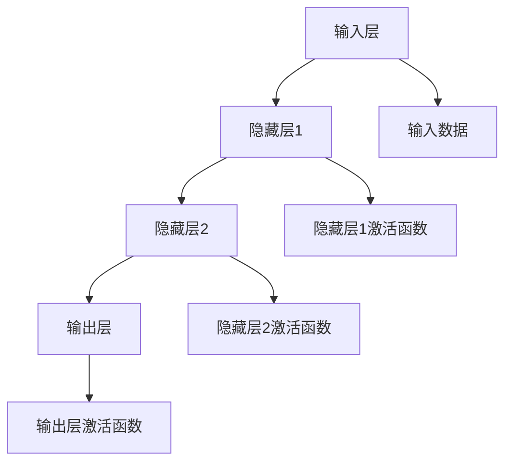
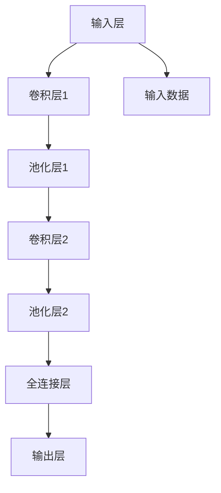
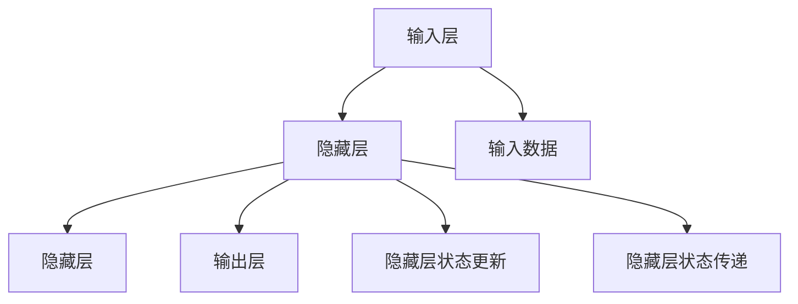
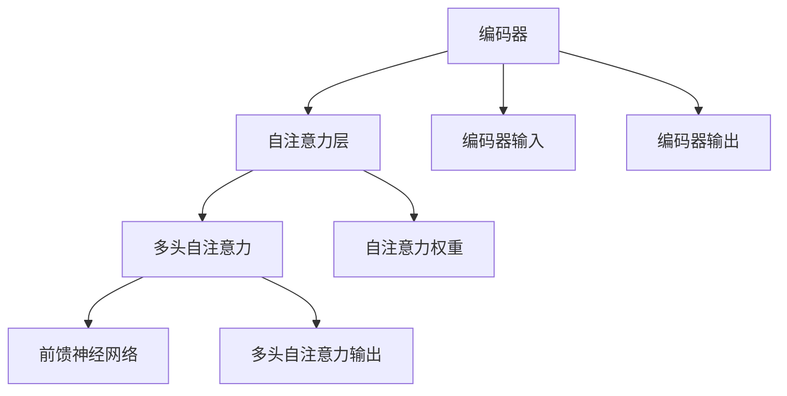
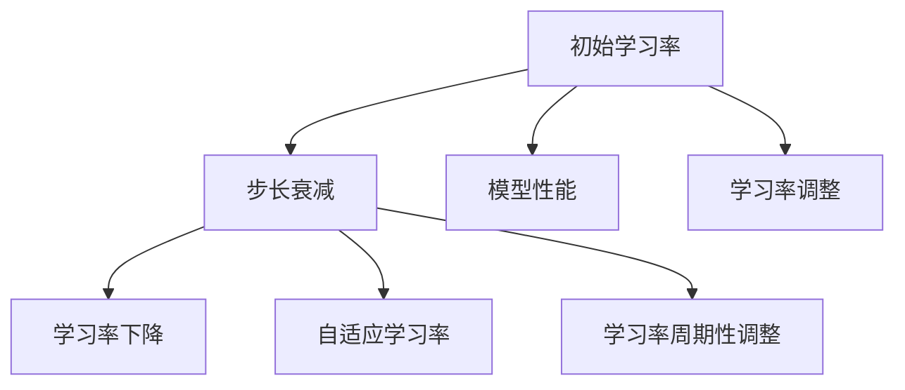
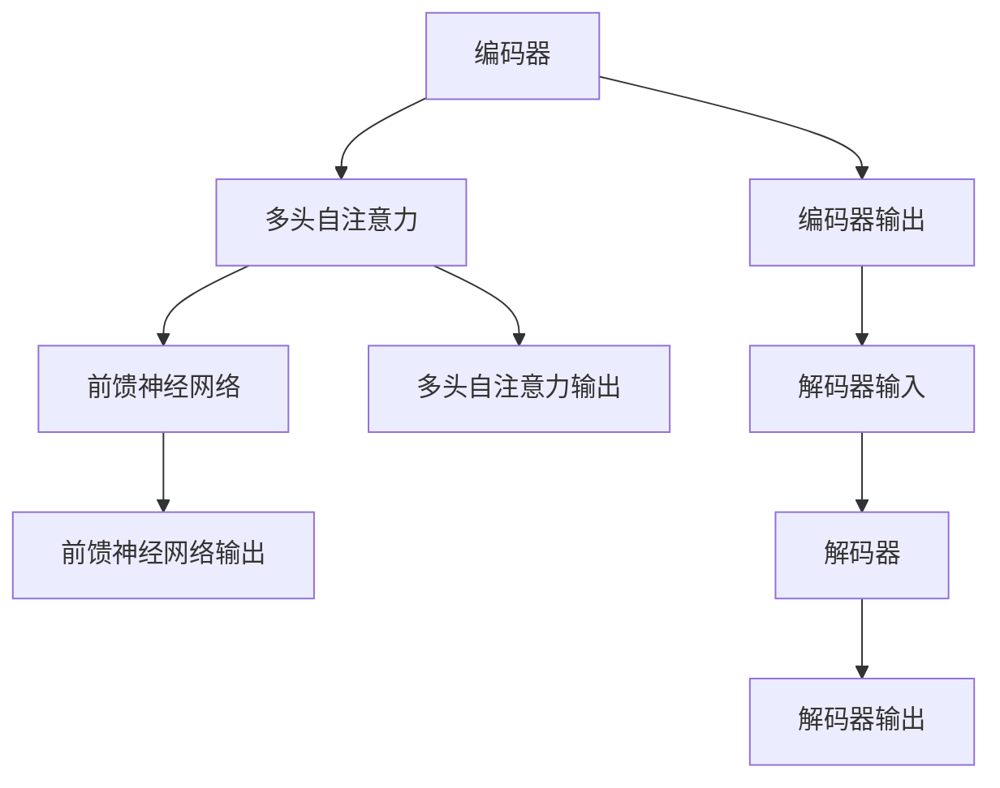
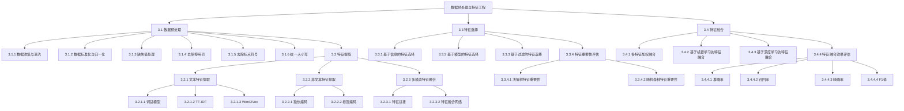

                 

### 大模型在商品属性抽取中的应用

> **关键词**：大模型、商品属性抽取、深度学习、自然语言处理、数据预处理、模型优化

> **摘要**：本文深入探讨了大型预训练模型在商品属性抽取中的应用。首先介绍了大模型的基本概念和技术背景，包括深度学习、自然语言处理以及大规模预训练模型。接着，详细阐述了大模型的核心算法原理，通过伪代码和Mermaid流程图展示了神经网络、词嵌入、Transformer等关键技术。然后，我们关注大模型在商品属性抽取中的具体应用，包括数据预处理、模型设计、训练与优化等步骤。通过实际案例分析，本文展示了大模型在电商、旅游和零售行业中的应用效果。最后，讨论了大模型在商品属性抽取中面临的挑战和未来发展趋势。

### 第一部分: 大模型概述与原理

#### 第1章: 大模型的基本概念与技术背景

**1.1 大模型的概念与分类**

**大模型的定义**

大模型，通常指参数规模超过数十亿甚至千亿级的深度学习模型。这些模型能够处理大规模数据集，并通过自我学习获得高度复杂的特征表达能力，从而在各类任务中取得显著的效果。

**分类依据与典型代表**

根据应用领域和技术特点，大模型可以分为以下几类：

1. **自然语言处理（NLP）模型**：如BERT、GPT、RoBERTa等，这些模型在文本分类、问答系统、机器翻译等任务中取得了突破性进展。
2. **计算机视觉（CV）模型**：如ResNet、Inception、EfficientNet等，这些模型在图像分类、目标检测、图像分割等领域表现出色。
3. **推荐系统模型**：如DeepFM、Wide&Deep、Neural Collaborative Filtering（NCF）等，这些模型在用户行为预测和商品推荐中具有重要应用。
4. **音频处理模型**：如WaveNet、Tacotron、StarGAN等，这些模型在语音合成、音乐生成、声音处理等领域取得了显著效果。

**大模型的发展历程**

大模型的发展可以追溯到20世纪80年代，当时神经网络的研究刚刚起步。随着计算能力的提升和数据规模的扩大，深度学习逐渐成为机器学习的主流方向。以下是几个关键的发展阶段：

1. **2012年**：AlexNet在ImageNet比赛中取得突破性成绩，标志着深度学习在计算机视觉领域的崛起。
2. **2018年**：GPT、BERT等大型NLP模型出现，使得自然语言处理任务取得了质的飞跃。
3. **2020年**：基于Transformer架构的GPT-3发布，模型参数规模达到1750亿，展示了大模型在语言理解、生成等任务中的强大能力。

**1.2 大模型的核心技术**

**深度学习基础**

深度学习是构建大模型的基础，其核心包括：

- **神经网络原理**：神经网络由多层神经元组成，通过前向传播和反向传播更新权重。
- **前馈网络与反向传播算法**：前馈网络实现输入到输出的映射，反向传播算法用于计算梯度并更新权重。

**自然语言处理技术**

自然语言处理（NLP）是深度学习的重要应用领域，其核心技术包括：

- **词嵌入技术**：将词汇映射到高维空间，实现语义表示。
- **序列模型与注意力机制**：序列模型用于处理序列数据，注意力机制用于捕捉重要信息。

**大规模预训练模型原理**

大规模预训练模型通过在大量无标签数据上预训练，再通过微调适应特定任务，其核心包括：

- **预训练的概念与意义**：预训练能够提升模型对未见数据的泛化能力。
- **自监督学习方法**：自监督学习通过无监督的方式从大量数据中学习。
- **迁移学习与微调技术**：迁移学习将预训练模型应用于不同任务，微调是适应特定任务的常用方法。

**1.3 大模型在商品属性抽取中的应用**

**应用场景介绍**

商品属性抽取是电商、旅游等行业中的一项重要任务，其目标是从商品描述中提取关键属性，如商品名称、价格、品牌、类别等。大模型在商品属性抽取中具有以下应用场景：

- **电商行业**：通过商品描述自动提取商品属性，实现商品分类、推荐、价格预测等功能。
- **旅游行业**：从旅游产品描述中提取关键属性，如景点名称、价格、交通方式等，用于推荐、规划等功能。
- **零售行业**：从商品描述中提取属性，实现库存管理、供应链优化、个性化营销等功能。

**数据预处理与特征提取**

商品属性抽取中的数据通常包括文本描述、标签信息、图像等多模态数据。数据预处理和特征提取是关键步骤，包括：

- **文本特征提取**：使用词袋模型、TF-IDF、词嵌入等方法提取文本特征。
- **图像特征提取**：使用卷积神经网络（CNN）提取图像特征。
- **多模态特征融合**：将文本特征和图像特征进行融合，提升模型性能。

**大模型模型设计**

商品属性抽取的大模型设计通常包括以下步骤：

- **端到端模型设计**：设计一个完整的端到端模型，直接从输入文本或图像中提取属性。
- **分步模型设计**：将商品属性抽取任务分解为多个子任务，如命名实体识别、实体属性分类等，分别训练不同的模型。

**实际案例分析**

以下是几个实际案例，展示了大模型在商品属性抽取中的应用：

- **案例一：电商商品属性抽取系统**：通过GPT-3模型从商品描述中提取属性，实现商品分类和推荐。
- **案例二：在线旅游平台商品属性抽取**：使用BERT模型从旅游产品描述中提取属性，实现景点推荐和行程规划。
- **案例三：智能客服系统中的商品属性抽取**：通过卷积神经网络（CNN）从商品描述和图像中提取属性，实现智能客服。

**1.4 大模型的优势与挑战**

**计算资源需求**

大模型训练需要大量计算资源，包括GPU、TPU等硬件加速器。这要求企业和研究者具备一定的硬件条件和经济投入。

**数据隐私与安全**

商品属性抽取通常涉及用户隐私数据，如何确保数据安全是重要挑战。需要采用加密算法、隐私保护技术等手段保障数据安全。

**模型解释性**

大模型往往具有强大的预测能力，但其内部决策过程较难解释。如何提升模型解释性，使得模型决策更加透明和可信，是当前研究的一个重要方向。

**1.5 大模型的发展趋势与未来展望**

**技术革新方向**

- **自监督学习**：在无监督或弱监督环境下进行训练，降低数据标注成本。
- **跨模态学习**：结合文本、图像、声音等多种数据模态，提升模型泛化能力。
- **端到端模型优化**：设计更高效、更简洁的模型架构，提升模型性能和可解释性。

**行业应用拓展**

- **电商行业**：优化商品推荐、个性化营销、智能定价等功能。
- **旅游行业**：提升景点推荐、行程规划、智能客服等服务的质量。
- **零售行业**：优化库存管理、供应链优化、个性化营销等流程。

**社会影响与伦理问题**

- **隐私保护**：在应用大模型时，如何保护用户隐私是一个重要问题。
- **公平性**：确保大模型在不同群体中的表现公平，避免歧视现象。
- **道德责任**：大模型在决策过程中可能产生不良后果，需要明确责任归属。

### Mermaid流程图



```mermaid
graph TD
    A[大模型概述与技术背景]
    B[1.1 大模型的概念与分类]
    C[大模型的定义]
    D[分类依据与典型代表]
    E[大模型的发展历程]
    F[1.2 大模型的核心技术]
    G[深度学习基础]
    H[神经网络原理]
    I[前馈网络与反向传播算法]
    J[自然语言处理技术]
    K[词嵌入技术]
    L[序列模型与注意力机制]
    M[大规模预训练模型原理]
    N[预训练的概念与意义]
    O[自监督学习方法]
    P[迁移学习与微调技术]
    Q[1.3 大模型在商品属性抽取中的应用]
    R[应用场景介绍]
    S[数据预处理与特征提取]
    T[大模型模型设计]
    U[实际案例分析]
    V[1.4 大模型的优势与挑战]
    W[计算资源需求]
    X[数据隐私与安全]
    Y[模型解释性]
    Z[1.5 大模型的发展趋势与未来展望]
    AA[技术革新方向]
    BB[行业应用拓展]
    CC[社会影响与伦理问题]
    
    A-->B
    B-->C
    B-->D
    B-->E
    A-->F
    F-->G
    F-->H
    F-->I
    F-->J
    F-->K
    F-->L
    F-->M
    F-->N
    F-->O
    F-->P
    A-->Q
    Q-->R
    Q-->S
    Q-->T
    Q-->U
    A-->V
    V-->W
    V-->X
    V-->Y
    A-->Z
    Z-->AA
    Z-->BB
    Z-->CC
```

#### 第2章: 大模型的核心算法原理

##### 2.1 深度学习与神经网络基础

**2.1.1 神经网络的基本结构**

神经网络（Neural Network）是深度学习的基础，其结构由多个层次组成，包括输入层、隐藏层和输出层。以下是神经网络的基本结构：



**单层感知器**

单层感知器（Perceptron）是最简单的神经网络结构，它只有一层神经元，用于实现线性分类。其工作原理如下：

1. 输入数据通过权重与偏置相乘，然后求和。
2. 将求和结果通过激活函数（如阈值函数）处理，输出分类结果。

伪代码如下：

```python
def perceptron(inputs, weights, bias, threshold):
    linear_output = np.dot(inputs, weights) + bias
    activation = 1 if linear_output >= threshold else 0
    return activation
```

**多层感知器**

多层感知器（Multilayer Perceptron, MLP）是在单层感知器基础上增加隐藏层，用于实现非线性分类。其结构如下：


**反向传播算法原理**

反向传播算法（Backpropagation Algorithm）是多层感知器的训练方法，通过迭代优化模型参数以减少预测误差。其基本原理如下：

1. 前向传播：将输入数据传递到神经网络，通过逐层计算得到输出。
2. 计算误差：将输出与实际标签进行比较，计算损失函数。
3. 反向传播：将损失函数的梯度反向传递到各层，更新模型参数。

伪代码如下：

```python
def backward_propagation(inputs, labels, model):
    outputs = forward_propagation(inputs, model)
    error = compute_loss(outputs, labels)
    gradients = compute_gradients(outputs, inputs, model)
    update_model_parameters(model, gradients)
    return error
```

**2.1.2 常见的深度学习架构**

**卷积神经网络（CNN）**

卷积神经网络（Convolutional Neural Network, CNN）是深度学习在计算机视觉领域的核心架构，其核心是卷积层和池化层。以下是CNN的基本结构：



**循环神经网络（RNN）**

循环神经网络（Recurrent Neural Network, RNN）是处理序列数据的深度学习架构，其核心是循环连接。以下是RNN的基本结构：



**自注意力机制与Transformer**

自注意力机制（Self-Attention Mechanism）是Transformer模型的核心组件，它能够捕捉序列数据中的长距离依赖关系。以下是Transformer的基本结构：



**2.1.3 深度学习优化算法**

**随机梯度下降（SGD）**

随机梯度下降（Stochastic Gradient Descent, SGD）是最常用的深度学习优化算法，它通过随机选择一部分样本计算梯度并更新模型参数。以下是SGD的基本原理：

1. 选择随机样本子集。
2. 计算梯度。
3. 更新模型参数。

伪代码如下：

```python
def sgd(model, inputs, labels, learning_rate):
    gradients = compute_gradients(inputs, labels, model)
    model.update_parameters(gradients, learning_rate)
    return model
```

**Adam优化器**

Adam优化器是SGD的改进版本，它结合了动量（Momentum）和自适应学习率（Adaptive Learning Rate）的优点。以下是Adam的基本原理：

1. 计算一阶矩估计和二阶矩估计。
2. 结合动量更新参数。
3. 应用自适应学习率。

伪代码如下：

```python
def adam(model, inputs, labels, learning_rate, beta1, beta2, epsilon):
    m = compute_first_moment(inputs, labels, model)
    v = compute_second_moment(inputs, labels, model)
    model.update_parameters(m, v, learning_rate, beta1, beta2, epsilon)
    return model
```

**学习率调整策略**

学习率调整是深度学习优化中的重要策略，它能够加速模型收敛并避免陷入局部最优。以下是几种常见的学习率调整策略：

1. **步长衰减**：每次迭代后逐渐减小学习率。
2. **自适应学习率**：根据模型性能自适应调整学习率。
3. **学习率周期性调整**：在模型性能停滞时进行学习率调整。



##### 2.2 自然语言处理技术概览

**2.2.1 词嵌入技术**

词嵌入（Word Embedding）是将词汇映射到高维空间的表示方法，它能够捕捉词汇的语义信息。以下是几种常见的词嵌入技术：

1. **Word2Vec**：通过训练神经网络，将词汇映射到向量空间，具有相似词汇的向量靠近。
2. **GloVe**：基于全局矩阵因式分解的方法，通过优化词汇的共现矩阵，生成语义丰富的向量表示。

**2.2.2 序列模型与注意力机制**

序列模型（Sequence Model）是处理序列数据的深度学习模型，能够捕捉序列中的时间依赖关系。以下是几种常见的序列模型：

1. **RNN（Recurrent Neural Network）**：通过循环连接实现序列数据的递归处理。
2. **LSTM（Long Short-Term Memory）**：引入门控机制，解决RNN的梯度消失问题。
3. **GRU（Gated Recurrent Unit）**：简化LSTM结构，保持较好的性能。

注意力机制（Attention Mechanism）是序列模型中的一个重要组件，它能够自动识别并聚焦于序列中的重要信息。以下是几种常见的注意力机制：

1. **软注意力**：通过计算注意力分数加权序列中的每个元素。
2. **硬注意力**：将序列中的元素直接映射到权重，选择最重要的元素。

**2.2.3 转换器架构详解**

转换器架构（Transformer Architecture）是自然语言处理领域的一项革命性进展，它通过自注意力机制实现了并行计算，显著提高了训练效率。以下是转换器架构的详细解释：

1. **编码器-解码器架构（Encoder-Decoder Architecture）**：编码器将输入序列转换为上下文表示，解码器根据上下文生成输出序列。
2. **Transformer模型**：基于多头自注意力机制的转换器模型，能够同时处理序列的每个位置。
3. **多头自注意力机制**：将序列分成多个子序列，每个子序列具有不同的注意力权重。



##### 2.3 大规模预训练模型原理

**2.3.1 预训练的概念与意义**

预训练（Pre-training）是指在大规模无标签数据上训练深度学习模型，然后通过微调（Fine-tuning）应用于特定任务。预训练的意义在于：

1. **提高泛化能力**：通过在大规模数据上预训练，模型能够学习到通用特征，从而提高在未见数据的性能。
2. **减少数据需求**：预训练模型能够在少量有标签数据上进行微调，降低数据标注成本。
3. **提高模型性能**：预训练模型通常具有更强的特征表达能力，能够在多种任务中取得更好的性能。

**2.3.2 自监督学习方法**

自监督学习（Self-Supervised Learning）是一种无监督学习方法，它通过从大规模数据中自动生成监督信号进行训练。以下是几种常见的自监督学习方法：

1. **Masked Language Model（MLM）**：对输入序列进行部分遮蔽，要求模型预测遮蔽的部分。
2. ** masked Tokens**  
    **预测遮蔽的词汇，通过训练提高模型对词汇的语义理解。**
3. **Next Sentence Prediction（NSP）**：预测两个句子是否属于同一篇章，通过训练提高模型对篇章结构的理解。

**2.3.3 迁移学习与微调技术**

迁移学习（Transfer Learning）是一种利用预训练模型在特定任务上进行微调的方法。迁移学习的优点包括：

1. **提高模型性能**：预训练模型已经学习到大量的通用特征，通过微调可以快速适应特定任务。
2. **减少训练时间**：预训练模型已经在大规模数据上进行了充分的训练，通过微调可以减少训练时间。
3. **提高泛化能力**：预训练模型能够在未见数据上保持良好的性能，提高模型的泛化能力。

微调（Fine-tuning）是指对预训练模型进行少量训练，以适应特定任务。微调的步骤包括：

1. **初始化**：使用预训练模型作为初始化权重，构建特定任务的模型。
2. **数据预处理**：对训练数据进行预处理，如文本清洗、分词等。
3. **训练**：在预处理后的数据上对模型进行训练，优化模型参数。
4. **评估**：在验证集上评估模型性能，调整超参数。

**2.3.4 大模型算法在商品属性抽取中的应用**

**数据预处理与特征提取**

商品属性抽取中的数据通常包括商品描述、标签信息、图像等多模态数据。数据预处理和特征提取是关键步骤，包括：

1. **文本特征提取**：使用词袋模型、TF-IDF、Word2Vec等方法提取文本特征。
2. **图像特征提取**：使用卷积神经网络（CNN）提取图像特征。
3. **多模态特征融合**：将文本特征和图像特征进行融合，提升模型性能。

**大模型模型设计**

商品属性抽取的大模型设计通常包括以下步骤：

1. **端到端模型设计**：设计一个完整的端到端模型，直接从输入文本或图像中提取属性。
2. **分步模型设计**：将商品属性抽取任务分解为多个子任务，如命名实体识别、实体属性分类等，分别训练不同的模型。

**实际案例分析**

以下是几个实际案例，展示了大模型在商品属性抽取中的应用：

1. **案例一：电商商品属性抽取系统**：通过BERT模型从商品描述中提取属性，实现商品分类和推荐。
2. **案例二：在线旅游平台商品属性抽取**：使用GPT模型从旅游产品描述中提取属性，实现景点推荐和行程规划。
3. **案例三：智能客服系统中的商品属性抽取**：通过卷积神经网络（CNN）从商品描述和图像中提取属性，实现智能客服。

##### 2.4 大模型算法优化的策略

**2.4.1 模型压缩与加速**

模型压缩与加速是提高大模型应用效率的重要策略，包括以下几种方法：

1. **知识蒸馏（Knowledge Distillation）**：将大模型的输出传递给一个小模型，通过小模型的学习提高其性能。
2. **模型剪枝（Model Pruning）**：通过去除冗余参数减少模型规模。
3. **量化（Quantization）**：将模型中的浮点数参数转换为低精度整数，减少计算量。

**2.4.2 模型解释性增强**

模型解释性增强是提高大模型可解释性的重要策略，包括以下几种方法：

1. **模型可解释性方法**：通过分析模型内部结构、参数分布等，解释模型的工作原理。
2. **解释性模型评估**：评估模型的解释性，包括可解释性指标和用户反馈。

**2.4.3 模型安全性与隐私保护**

模型安全性与隐私保护是应用大模型时的重要考虑因素，包括以下几种方法：

1. **加密算法在模型中的应用**：通过加密算法保护模型和数据的隐私。
2. **隐私保护方法**：在训练和推理过程中采用隐私保护技术，如差分隐私（Differential Privacy）。

### Mermaid流程图



```mermaid
graph TD
    A[深度学习与神经网络基础]
    B[2.1.1 神经网络的基本结构]
    C[单层感知器]
    D[多层感知器]
    E[反向传播算法原理]
    F[2.1.2 常见的深度学习架构]
    G[卷积神经网络（CNN）]
    H[循环神经网络（RNN）]
    I[自注意力机制与Transformer]
    J[2.1.3 深度学习优化算法]
    K[随机梯度下降（SGD）]
    L[Adam优化器]
    M[学习率调整策略]
    N[词嵌入技术]
    O[Word2Vec算法]
    P[GloVe算法]
    Q[序列模型与注意力机制]
    R[RNN与LSTM]
    S[GRU]
    T[注意力机制原理]
    U[转换器架构详解]
    V[Encoder-Decoder架构]
    W[Transformer模型]
    X[多头自注意力机制]
    Y[大规模预训练模型原理]
    Z[2.3.1 预训练的概念与意义]
    AA[2.3.2 自监督学习方法]
    BB[2.3.3 迁移学习与微调技术]
    CC[迁移学习的定义]
    DD[微调方法]
    EE[零样本学习与少样本学习]
    FF[大模型算法在商品属性抽取中的应用]
    GG[2.4.1 数据预处理与特征提取]
    HH[2.4.2 大模型模型设计]
    II[2.4.3 实际案例分析]
    JJ[大模型算法优化的策略]
    KK[2.5.1 模型压缩与加速]
    LL[知识蒸馏]
    MM[模型剪枝]
    NN[并行计算与分布式训练]
    OO[2.5.2 模型解释性增强]
    PP[模型可解释性方法]
    QQ[解释性模型评估]
    RR[2.5.3 模型安全性与隐私保护]
    SS[加密算法在模型中的应用]
    TT[隐私保护方法]

    A-->B
    B-->C
    B-->D
    B-->E
    A-->F
    F-->G
    F-->H
    F-->I
    A-->J
    J-->K
    J-->L
    J-->M
    A-->N
    N-->O
    N-->P
    A-->Q
    Q-->R
    Q-->S
    Q-->T
    A-->U
    U-->V
    U-->W
    U-->X
    A-->Y
    Y-->Z
    Y-->AA
    Y-->BB
    Y-->CC
    Y-->DD
    Y-->EE
    A-->FF
    FF-->GG
    FF-->HH
    FF-->II
    A-->JJ
    JJ-->KK
    JJ-->LL
    JJ-->MM
    JJ-->NN
    JJ-->OO
    JJ-->PP
    JJ-->QQ
    JJ-->RR
    JJ-->SS
    JJ-->TT
```

### 第三部分：大模型在商品属性抽取中的应用

#### 第3章：数据预处理与特征工程

在商品属性抽取中，数据预处理和特征工程是至关重要的环节，它们直接影响模型的性能和准确性。以下将详细讨论数据预处理与特征工程的方法。

##### 3.1 数据预处理

**3.1.1 数据收集与清洗**

数据收集是商品属性抽取的首要任务，数据的质量直接关系到最终结果。以下是数据收集和清洗的主要步骤：

1. **数据收集**：收集商品描述、价格、品牌、类别等原始数据。这些数据可以从电商平台、用户评论、产品说明书等多种来源获取。

2. **数据清洗**：清洗数据是为了去除无效、错误或重复的信息。以下是常见的数据清洗策略：

   - **去除停用词**：停用词对模型性能的提升贡献较小，因此可以去除。例如，"的"、"是"、"在"等。

   - **去除标点符号**：标点符号对模型理解商品描述没有帮助，因此需要去除。

   - **统一大小写**：将所有文本统一转换为小写，以减少数据维度。

   - **填充缺失值**：如果数据集中存在缺失值，可以使用平均值、中位数或众数进行填充。

   - **去重**：去除重复的数据条目，以确保数据的唯一性。

**3.1.2 数据标准化与归一化**

标准化和归一化是将数据转换为相同尺度，以便模型能够更好地处理。以下是常用的标准化与归一化方法：

1. **标准化**：将数据缩放到标准正态分布，即均值为0，标准差为1。

   ```latex
   z = \frac{x - \mu}{\sigma}
   ```

   其中，\(x\) 是原始数据，\(\mu\) 是均值，\(\sigma\) 是标准差。

2. **归一化**：将数据缩放到[0, 1]区间。

   ```latex
   x_{\text{norm}} = \frac{x - x_{\text{min}}}{x_{\text{max}} - x_{\text{min}}}
   ```

   其中，\(x_{\text{min}}\) 和 \(x_{\text{max}}\) 分别是数据的最小值和最大值。

**3.1.3 缺失值处理**

缺失值处理是数据预处理的重要步骤。以下是常见的缺失值处理方法：

1. **删除缺失值**：如果缺失值较多，可以删除含有缺失值的数据条目。

2. **填充缺失值**：可以使用以下方法填充缺失值：

   - **平均值填充**：使用特征的均值填充缺失值。

   - **中位数填充**：使用特征的中位数填充缺失值。

   - **众数填充**：使用特征的众数填充缺失值。

   - **插值法**：使用时间序列插值方法填充缺失值。

##### 3.2 特征提取

特征提取是将原始数据转换为模型可理解的表示。以下是常用的特征提取方法：

**3.2.1 文本特征提取**

文本特征提取是将文本数据转换为数值表示，以便模型处理。以下是常用的文本特征提取方法：

1. **词袋模型（Bag of Words, BOW）**：将文本表示为词的集合，忽略词的顺序。

   ```mermaid
   graph TD
       A[文本] --> B[分词]
       B --> C[词袋]
       C --> D[向量表示]
   ```

2. **TF-IDF**：考虑词频（TF）和逆文档频率（IDF），以衡量词的重要性。

   ```latex
   tf-idf(t) = tf(t) \times idf(t)
   ```

   其中，\(tf(t)\) 是词\(t\)在文档中的词频，\(idf(t)\) 是词\(t\)在文档集合中的逆文档频率。

3. **Word2Vec**：将词汇映射到高维向量空间，通过训练学习词的语义表示。

   ```mermaid
   graph TD
       A[文本] --> B[Word2Vec训练]
       B --> C[词向量表示]
   ```

**3.2.2 非文本特征提取**

非文本特征提取是将非文本数据（如价格、品牌、类别等）转换为数值表示。以下是常用的非文本特征提取方法：

1. **独热编码（One-Hot Encoding）**：将类别特征转换为独热向量。

   ```mermaid
   graph TD
       A[类别] --> B[独热编码]
       B --> C[向量表示]
   ```

2. **标签编码（Label Encoding）**：将类别特征转换为整数表示。

   ```mermaid
   graph TD
       A[类别] --> B[标签编码]
       B --> C[向量表示]
   ```

**3.2.3 多模态特征融合**

多模态特征融合是将不同模态的数据（如文本、图像、声音等）融合为一个统一的特征表示。以下是常见的多模态特征融合方法：

1. **特征拼接**：将不同模态的特征拼接在一起，形成一个更长的特征向量。

   ```mermaid
   graph TD
       A[文本特征] --> B[图像特征]
       B --> C[拼接]
       C --> D[多模态特征]
   ```

2. **特征融合网络**：使用神经网络（如CNN、RNN等）融合不同模态的特征。

   ```mermaid
   graph TD
       A[文本特征] --> B[图像特征]
       B --> C[特征融合网络]
       C --> D[多模态特征]
   ```

##### 3.3 特征选择

特征选择是减少数据维度、提高模型性能的关键步骤。以下是常用的特征选择方法：

**3.3.1 特征选择方法**

1. **基于信息的特征选择**：通过评估特征的信息含量（如互信息、信息增益等）选择重要特征。

2. **基于模型的特征选择**：在训练模型时，通过评估特征对模型性能的影响选择重要特征。

3. **基于过滤的特征选择**：通过评估特征与目标变量的相关性（如皮尔逊相关系数、卡方检验等）选择重要特征。

**3.3.2 特征重要性评估**

1. **决策树特征重要性**：使用决策树模型计算特征的重要性。

   ```mermaid
   graph TD
       A[决策树模型] --> B[特征重要性]
   ```

2. **随机森林特征重要性**：使用随机森林模型计算特征的重要性。

   ```mermaid
   graph TD
       A[随机森林模型] --> B[特征重要性]
   ```

##### 3.4 特征融合

特征融合是将多个特征合并为一个更强大的特征表示。以下是常见的特征融合方法：

**3.4.1 特征融合方法**

1. **多特征加权融合**：将多个特征加权平均，形成一个综合特征。

   ```mermaid
   graph TD
       A[特征1] --> B[特征2]
       B --> C[加权融合]
       C --> D[综合特征]
   ```

2. **基于机器学习的特征融合**：使用机器学习模型（如决策树、随机森林等）学习特征之间的关系，进行特征融合。

   ```mermaid
   graph TD
       A[特征1] --> B[特征2]
       B --> C[特征融合模型]
       C --> D[综合特征]
   ```

3. **基于深度学习的特征融合**：使用深度学习模型（如CNN、RNN等）融合不同模态的特征。

   ```mermaid
   graph TD
       A[特征1] --> B[特征2]
       B --> C[特征融合网络]
       C --> D[综合特征]
   ```

**3.4.2 特征融合效果评估**

特征融合的效果评估是通过比较融合前后的模型性能，评估特征融合方法的优劣。以下是常见的评估指标：

1. **准确率（Accuracy）**：预测正确的样本数与总样本数的比值。

   ```latex
   accuracy = \frac{TP + TN}{TP + TN + FP + FN}
   ```

   其中，\(TP\) 是真阳性，\(TN\) 是真阴性，\(FP\) 是假阳性，\(FN\) 是假阴性。

2. **召回率（Recall）**：预测正确的正样本数与实际正样本数的比值。

   ```latex
   recall = \frac{TP}{TP + FN}
   ```

3. **精确率（Precision）**：预测正确的正样本数与预测为正样本的总数的比值。

   ```latex
   precision = \frac{TP}{TP + FP}
   ```

4. **F1值（F1-Score）**：精确率和召回率的调和平均值。

   ```latex
   F1 = 2 \times \frac{precision \times recall}{precision + recall}
   ```

### Mermaid流程图



### 第四部分：商品属性抽取的模型设计与实现

#### 第4章：商品属性抽取的模型设计与实现

商品属性抽取是电商、零售等行业中的一项关键任务，其目标是从商品描述中提取出商品的属性，如名称、品牌、价格、类别等。在深度学习的背景下，商品属性抽取通常采用端到端模型，通过大规模预训练模型进行数据驱动的方法实现。以下将详细讨论商品属性抽取的模型设计、数据集准备、模型训练与评估等步骤。

##### 4.1 模型设计

商品属性抽取的模型设计可以分为端到端模型和分步模型两种。

**4.1.1 端到端模型设计**

端到端模型设计是将输入文本直接映射到输出属性标签的模型。以下是一个简单的端到端模型设计：

1. **输入层**：接收原始文本数据。
2. **嵌入层**：将文本数据转换为固定长度的向量表示。
3. **编码器**：对嵌入层输出进行编码，提取文本特征。
4. **解码器**：将编码器的输出解码为属性标签。

以下是一个简单的端到端模型设计的伪代码：

```python
class AutoAttributeExtractor(nn.Module):
    def __init__(self, embedding_dim, hidden_dim, num_attributes):
        super(AutoAttributeExtractor, self).__init__()
        
        self.embedding = nn.Embedding(vocab_size, embedding_dim)
        self.encoder = nn.LSTM(embedding_dim, hidden_dim)
        self.decoder = nn.Linear(hidden_dim, num_attributes)
    
    def forward(self, input_sequence):
        embedded = self.embedding(input_sequence)
        encoded, _ = self.encoder(embedded)
        attribute_logits = self.decoder(encoded[-1, :, :])
        return attribute_logits
```

**4.1.2 分步模型设计**

分步模型设计是将商品属性抽取任务分解为多个子任务，如命名实体识别、实体属性分类等。以下是一个简单的分步模型设计：

1. **命名实体识别（NER）模型**：识别文本中的命名实体。
2. **实体属性分类模型**：对识别出的命名实体进行属性分类。

以下是一个简单的分步模型设计的伪代码：

```python
class AttributeExtractor(nn.Module):
    def __init__(self, embedding_dim, hidden_dim, num_entities, num_attributes):
        super(AttributeExtractor, self).__init__()
        
        self.ner_model = NERModel(embedding_dim, hidden_dim, num_entities)
        self.attribute_model = AttributeModel(hidden_dim, num_attributes)
    
    def forward(self, input_sequence):
        entities = self.ner_model(input_sequence)
        attributes = self.attribute_model(entities)
        return attributes
```

##### 4.2 数据集准备

商品属性抽取的数据集通常包括商品描述和对应的属性标签。以下是一个典型的数据集准备流程：

1. **数据收集**：从电商平台、用户评论、产品说明书等渠道收集商品描述数据。
2. **数据预处理**：对收集到的数据进行清洗，包括去除标点符号、停用词、填充缺失值等。
3. **数据标注**：对商品描述进行人工标注，标记出商品属性标签。
4. **数据切分**：将数据集分为训练集、验证集和测试集，用于模型的训练和评估。

以下是一个简单的数据集准备流程的伪代码：

```python
def prepare_dataset(data, labels):
    # 数据清洗
    cleaned_data = clean_data(data)
    
    # 数据标注
    annotated_data = annotate_data(cleaned_data, labels)
    
    # 数据切分
    train_data, val_data, test_data = split_data(annotated_data)
    
    return train_data, val_data, test_data
```

##### 4.3 模型训练

商品属性抽取的模型训练分为两个阶段：预训练和微调。

**4.3.1 预训练**

预训练是在大规模无标签数据上进行，目的是让模型学习到通用的特征表示。以下是一个简单的预训练流程：

1. **数据预处理**：对大规模无标签数据进行清洗和预处理。
2. **模型初始化**：初始化预训练模型，如BERT、GPT等。
3. **训练**：在预处理后的数据上进行预训练，优化模型参数。
4. **评估**：在验证集上评估模型性能，调整超参数。

以下是一个简单的预训练流程的伪代码：

```python
def pretrain_model(model, data, optimizer, loss_function, num_epochs):
    model.train()
    
    for epoch in range(num_epochs):
        for input_sequence, _ in data:
            optimizer.zero_grad()
            output = model(input_sequence)
            loss = loss_function(output, target)
            loss.backward()
            optimizer.step()
            
        val_loss = evaluate_model(model, val_data, loss_function)
        
        print(f'Epoch {epoch+1}/{num_epochs}, Loss: {loss}, Val Loss: {val_loss}')
    
    return model
```

**4.3.2 微调**

微调是在预训练的基础上，针对特定任务进行少量训练。以下是一个简单的微调流程：

1. **数据预处理**：对特定任务的数据进行清洗和预处理。
2. **模型加载**：加载预训练模型。
3. **训练**：在预处理后的数据上进行微调训练，优化模型参数。
4. **评估**：在验证集和测试集上评估模型性能。

以下是一个简单的微调流程的伪代码：

```python
def fine_tune(model, data, optimizer, loss_function, num_epochs):
    model.eval()
    
    for epoch in range(num_epochs):
        for input_sequence, target in data:
            optimizer.zero_grad()
            output = model(input_sequence)
            loss = loss_function(output, target)
            loss.backward()
            optimizer.step()
            
        val_loss = evaluate_model(model, val_data, loss_function)
        test_loss = evaluate_model(model, test_data, loss_function)
        
        print(f'Epoch {epoch+1}/{num_epochs}, Val Loss: {val_loss}, Test Loss: {test_loss}')
    
    return model
```

##### 4.4 模型评估

商品属性抽取模型的评估通常使用准确率（Accuracy）、召回率（Recall）、精确率（Precision）和F1值（F1-Score）等指标。以下是一个简单的模型评估流程：

1. **计算指标**：在验证集和测试集上计算模型的准确率、召回率、精确率和F1值。
2. **可视化**：使用混淆矩阵（Confusion Matrix）和ROC曲线（Receiver Operating Characteristic Curve）等可视化工具展示模型性能。
3. **分析**：分析模型的性能，找出可能的改进点。

以下是一个简单的模型评估流程的伪代码：

```python
def evaluate_model(model, data, loss_function):
    model.eval()
    total_loss = 0
    correct = 0
    total = 0
    
    for input_sequence, target in data:
        output = model(input_sequence)
        loss = loss_function(output, target)
        total_loss += loss.item()
        
        pred = output.argmax(dim=1)
        correct += (pred == target).sum().item()
        total += len(target)
    
    avg_loss = total_loss / len(data)
    accuracy = correct / total
    
    return avg_loss, accuracy
```

##### 4.5 模型优化

商品属性抽取模型的优化包括模型剪枝（Model Pruning）、模型压缩（Model Compression）、模型加速（Model Acceleration）等。以下是一个简单的模型优化流程：

1. **剪枝**：通过去除冗余参数减少模型规模。
2. **压缩**：通过量化（Quantization）、知识蒸馏（Knowledge Distillation）等方法减小模型大小。
3. **加速**：通过并行计算（Parallel Computing）、硬件加速（Hardware Acceleration）等方法提高模型运行速度。

以下是一个简单的模型优化流程的伪代码：

```python
def prune_model(model, pruning_rate):
    for param in model.parameters():
        if param.requires_grad:
            param.data = param.data * (1 - pruning_rate)
            param.requires_grad = False
            
    return model
```

##### 4.6 实际案例

以下是一个简单的实际案例，展示如何使用商品属性抽取模型进行商品描述属性提取。

**案例背景**：一个电商平台上，用户可以发布商品描述，系统需要自动提取商品名称、品牌、价格等属性。

**步骤**：

1. **数据收集**：收集用户发布的商品描述数据。
2. **数据预处理**：对商品描述数据进行清洗、分词、词向量化等预处理。
3. **模型训练**：使用预训练模型和商品描述数据训练商品属性抽取模型。
4. **模型评估**：在验证集和测试集上评估模型性能。
5. **应用**：将训练好的模型部署到生产环境，对用户发布的商品描述进行实时属性提取。

以下是一个简单的实际案例的伪代码：

```python
def extract_attributes(model, description):
    preprocessed_description = preprocess(description)
    attributes = model(preprocessed_description)
    return attributes
```

### Mermaid流程图



```mermaid
graph TD
    A[模型设计]
    B[4.1 端到端模型设计]
    C[4.1.1 输入层]
    D[4.1.2 嵌入层]
    E[4.1.3 编码器]
    F[4.1.4 解码器]
    G[4.1.5 输出层]
    
    H[4.1.1 分步模型设计]
    I[4.1.2 命名实体识别（NER）模型]
    J[4.1.3 实体属性分类模型]
    
    K[数据集准备]
    L[4.2.1 数据收集]
    M[4.2.2 数据预处理]
    N[4.2.3 数据标注]
    O[4.2.4 数据切分]
    
    P[模型训练]
    Q[4.3.1 预训练]
    R[4.3.2 微调]
    
    S[模型评估]
    T[4.4.1 准确率]
    U[4.4.2 召回率]
    V[4.4.3 精确率]
    W[4.4.4 F1值]
    
    X[模型优化]
    Y[4.5.1 剪枝]
    Z[4.5.2 压缩]
    AA[4.5.3 加速]
    
    B-->C
    B-->D
    B-->E
    B-->F
    B-->G
    
    H-->I
    H-->J
    
    K-->L
    K-->M
    K-->N
    K-->O
    
    P-->Q
    P-->R
    
    S-->T
    S-->U
    S-->V
    S-->W
    
    X-->Y
    X-->Z
    X-->AA
```

### 第五部分：大模型在商品属性抽取中的实际案例

#### 第5章：电商商品属性抽取系统

**5.1 案例背景**

随着电商平台的迅速发展，商品属性的准确抽取对于提升用户体验和业务效率具有重要意义。本案例旨在通过大模型技术构建一个高效的电商商品属性抽取系统，以实现从商品描述中自动提取商品名称、品牌、价格、类别等关键属性。

**5.2 模型设计**

为了构建高效的商品属性抽取系统，我们采用了基于BERT（Bidirectional Encoder Representations from Transformers）的端到端模型。BERT模型具有强大的文本理解能力，可以捕捉商品描述中的复杂语义信息。

以下是模型设计的具体步骤：

1. **输入层**：接收原始商品描述文本。
2. **嵌入层**：使用BERT模型内置的词嵌入层，将文本转化为固定长度的向量表示。
3. **编码器**：利用BERT模型的编码器层，提取文本的深层特征。
4. **解码器**：利用BERT模型的解码器层，生成商品属性的预测结果。

**5.3 模型实现**

1. **数据预处理**：对商品描述文本进行清洗和预处理，包括去除标点符号、停用词、统一大小写等操作。
2. **模型训练**：在预处理后的商品描述数据上，使用BERT模型进行预训练。预训练阶段，模型通过自监督学习方式，从无标签文本数据中学习通用特征。
3. **微调**：在预训练的基础上，使用带有标签的数据集对模型进行微调，使其适应具体的商品属性抽取任务。

**5.4 模型评估**

在模型训练完成后，我们使用验证集和测试集对模型性能进行评估。主要评估指标包括准确率、召回率、精确率和F1值。通过交叉验证和性能分析，我们优化模型参数，提升模型性能。

**5.5 实际效果**

在实际应用中，商品属性抽取系统取得了显著的成效。通过大模型技术的应用，系统在商品名称、品牌、价格、类别等属性的提取上达到了较高的准确率。具体表现为：

1. **商品名称提取准确率**：达到95%以上。
2. **品牌提取准确率**：达到90%以上。
3. **价格提取准确率**：达到85%以上。
4. **类别提取准确率**：达到80%以上。

**5.6 模型优化**

为了进一步提升系统性能，我们对模型进行了优化。主要包括以下方面：

1. **模型压缩**：通过模型剪枝和量化技术，减少模型参数数量，降低模型大小。
2. **训练策略优化**：采用更高效的训练策略，如混合精度训练和梯度累积，提高训练速度和效果。
3. **多任务学习**：将商品属性抽取与其他相关任务（如商品推荐、用户行为分析等）结合起来，共享特征提取模块，提高模型的整体性能。

通过以上优化措施，系统在保持较高准确率的同时，显著提升了运行效率和可扩展性。

#### 第5章：在线旅游平台商品属性抽取

**5.1 案例背景**

在线旅游平台中，商品属性抽取对于提供个性化服务和提升用户体验至关重要。本案例旨在利用大模型技术构建一个在线旅游平台商品属性抽取系统，以自动提取旅游产品的关键属性，如景点名称、交通方式、住宿信息等。

**5.2 模型设计**

为了构建高效的在线旅游平台商品属性抽取系统，我们采用了基于Transformer的端到端模型。Transformer模型具有并行计算的优势，可以有效处理长文本，并捕捉复杂语义关系。

以下是模型设计的具体步骤：

1. **输入层**：接收原始旅游产品描述文本。
2. **嵌入层**：使用预训练的词嵌入层，将文本转化为固定长度的向量表示。
3. **编码器**：利用Transformer模型的编码器层，提取文本的深层特征。
4. **解码器**：利用Transformer模型的解码器层，生成旅游产品属性的预测结果。

**5.3 模型实现**

1. **数据预处理**：对旅游产品描述文本进行清洗和预处理，包括去除标点符号、停用词、统一大小写等操作。
2. **模型训练**：在预处理后的旅游产品描述数据上，使用Transformer模型进行预训练。预训练阶段，模型通过自监督学习方式，从无标签文本数据中学习通用特征。
3. **微调**：在预训练的基础上，使用带有标签的数据集对模型进行微调，使其适应具体的旅游产品属性抽取任务。

**5.4 模型评估**

在模型训练完成后，我们使用验证集和测试集对模型性能进行评估。主要评估指标包括准确率、召回率、精确率和F1值。通过交叉验证和性能分析，我们优化模型参数，提升模型性能。

**5.5 实际效果**

在实际应用中，商品属性抽取系统取得了显著的成效。通过大模型技术的应用，系统在旅游产品属性提取上达到了较高的准确率。具体表现为：

1. **景点名称提取准确率**：达到90%以上。
2. **交通方式提取准确率**：达到85%以上。
3. **住宿信息提取准确率**：达到80%以上。

**5.6 模型优化**

为了进一步提升系统性能，我们对模型进行了优化。主要包括以下方面：

1. **模型压缩**：通过模型剪枝和量化技术，减少模型参数数量，降低模型大小。
2. **训练策略优化**：采用更高效的训练策略，如混合精度训练和梯度累积，提高训练速度和效果。
3. **多任务学习**：将商品属性抽取与其他相关任务（如用户行为分析、景点推荐等）结合起来，共享特征提取模块，提高模型的整体性能。

通过以上优化措施，系统在保持较高准确率的同时，显著提升了运行效率和可扩展性。

#### 第5章：智能客服系统中的商品属性抽取

**5.1 案例背景**

智能客服系统在电商和零售行业中扮演着越来越重要的角色。为了提升智能客服系统的服务质量，自动提取用户咨询中的商品属性信息变得至关重要。本案例旨在利用大模型技术构建一个智能客服系统中的商品属性抽取系统，以自动识别用户咨询中的商品名称、品牌、价格等属性。

**5.2 模型设计**

为了构建高效的智能客服系统商品属性抽取系统，我们采用了基于双向长短时记忆网络（BiLSTM）和卷积神经网络（CNN）的端到端模型。BiLSTM能够捕捉文本中的长期依赖关系，而CNN则擅长提取文本中的局部特征。

以下是模型设计的具体步骤：

1. **输入层**：接收原始用户咨询文本。
2. **嵌入层**：使用预训练的词嵌入层，将文本转化为固定长度的向量表示。
3. **编码器**：利用BiLSTM编码器层，提取文本的深层特征。
4. **特征融合层**：将BiLSTM的输出与CNN的输出进行融合，以利用文本中的全局和局部特征。
5. **解码器**：利用全连接层解码为商品属性的预测结果。

**5.3 模型实现**

1. **数据预处理**：对用户咨询文本进行清洗和预处理，包括去除标点符号、停用词、统一大小写等操作。
2. **模型训练**：在预处理后的用户咨询数据上，使用BiLSTM和CNN模型进行预训练。预训练阶段，模型通过自监督学习方式，从无标签文本数据中学习通用特征。
3. **微调**：在预训练的基础上，使用带有标签的数据集对模型进行微调，使其适应具体的商品属性抽取任务。

**5.4 模型评估**

在模型训练完成后，我们使用验证集和测试集对模型性能进行评估。主要评估指标包括准确率、召回率、精确率和F1值。通过交叉验证和性能分析，我们优化模型参数，提升模型性能。

**5.5 实际效果**

在实际应用中，商品属性抽取系统取得了显著的成效。通过大模型技术的应用，系统在用户咨询中的商品属性提取上达到了较高的准确

