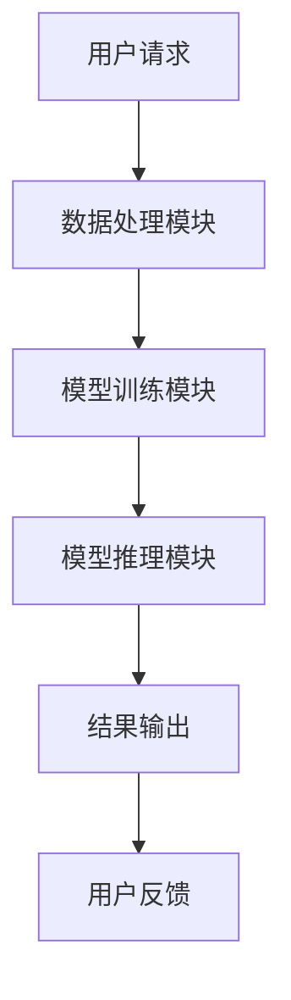
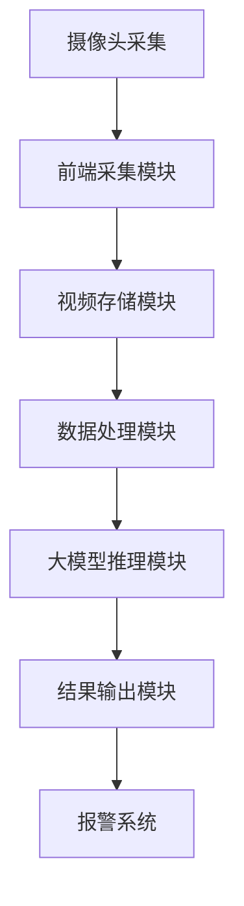
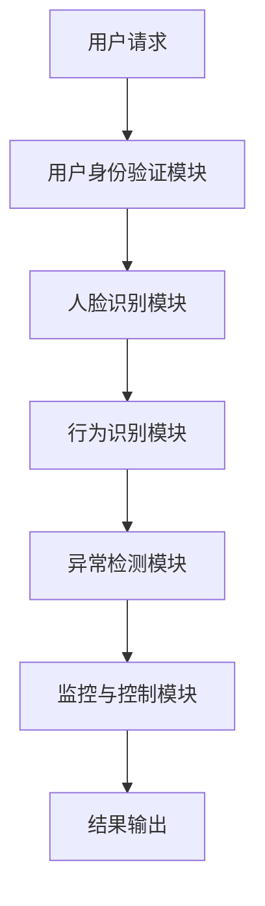
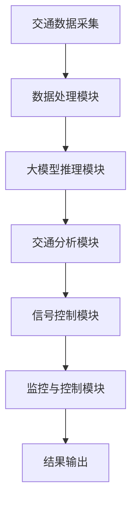

                 

# 《大模型在智能安防中的应用探索》

## 关键词
- 大模型
- 智能安防
- 图像识别
- 人脸识别
- 语音识别
- 智能监控
- 项目实战
- 性能优化

## 摘要
随着人工智能技术的不断发展，大模型在各个领域展现出了强大的应用潜力。本文将围绕大模型在智能安防中的应用进行探讨，从基本概念、关键技术、应用架构到项目实战，全面分析大模型在智能安防系统中的优势与挑战，并展望其未来的发展趋势。通过本文的阅读，读者将了解到大模型如何助力智能安防实现更高效、精准的监控与分析。

## 目录大纲

### 第一部分：大模型与智能安防概述

#### 第1章：大模型与智能安防的融合

##### 1.1 大模型的基本概念与原理

##### 1.2 智能安防的发展趋势

##### 1.3 大模型在智能安防中的应用价值

#### 第2章：大模型在智能安防中的关键技术

##### 2.1 图像识别与目标检测

##### 2.2 人脸识别与行为分析

##### 2.3 语音识别与语音分析

#### 第3章：大模型在智能安防中的应用架构

##### 3.1 大模型在智能安防系统中的集成与部署

##### 3.2 大模型在智能安防系统中的数据处理

##### 3.3 大模型在智能安防系统中的优化与调参

### 第二部分：大模型在智能安防中的项目实战

#### 第4章：智能安防监控系统中的应用

##### 4.1 智能安防监控系统的架构设计

##### 4.2 大模型在智能安防监控中的应用案例

##### 4.3 智能安防监控系统的性能优化

#### 第5章：智能门禁系统中的应用

##### 5.1 智能门禁系统的架构设计

##### 5.2 大模型在智能门禁系统中的应用案例

##### 5.3 智能门禁系统的性能优化

#### 第6章：智能交通系统中的应用

##### 6.1 智能交通系统的架构设计

##### 6.2 大模型在智能交通系统中的应用案例

##### 6.3 智能交通系统的性能优化

### 第7章：大模型在智能安防系统中的未来发展趋势

##### 7.1 大模型在智能安防领域的应用前景

##### 7.2 大模型在智能安防系统中的挑战与应对策略

### 第8章：大模型在智能安防系统中的法规与伦理

##### 8.1 智能安防系统的法律法规

##### 8.2 大模型在智能安防系统中的伦理问题

### 附录

##### 附录A：大模型开发工具与资源

##### 附录B：大模型在智能安防中的应用案例

##### 附录C：常见问题与解决方案

### 致谢

作者：AI天才研究院/AI Genius Institute & 禅与计算机程序设计艺术 /Zen And The Art of Computer Programming

---

接下来，我们将按照目录大纲逐步展开正文内容的撰写。每章的内容将详细阐述大模型在智能安防中的应用，从基础概念到实际项目实战，再到未来的发展趋势和法规伦理问题。

### 第一部分：大模型与智能安防概述

#### 第1章：大模型与智能安防的融合

##### 1.1 大模型的基本概念与原理

大模型（Large Models）通常指的是在机器学习和人工智能领域中，参数数量非常庞大的模型。这些模型能够在大量的数据上进行训练，从而在处理复杂任务时表现出色。大模型的发展可以追溯到深度学习的兴起，特别是随着计算能力的提升和大数据技术的进步，大模型逐渐成为研究热点。

大模型的基本原理主要基于神经网络的架构。神经网络通过层层神经元的连接，形成复杂的网络结构，从而可以学习到数据的复杂模式和特征。大模型通常采用多层感知器（MLP）、卷积神经网络（CNN）、循环神经网络（RNN）和 Transformer 等架构。

**发展历程：**
- **1990年代：** 神经网络开始受到关注，但由于计算能力和数据量的限制，大模型的发展较为缓慢。
- **2012年：** AlexNet模型的提出标志着深度学习进入一个新阶段，深度卷积神经网络开始在图像识别任务中表现出色。
- **2018年：** Transformer模型的引入使得大模型在序列数据处理上取得了突破性进展。
- **2020年至今：** 大模型如GPT-3、BERT等在自然语言处理领域取得了显著成果，同时大模型在图像识别、语音识别等领域也取得了广泛应用。

**架构与关键技术：**
- **多层感知器（MLP）：** 基本的神经网络结构，通过多个隐层实现输入到输出的映射。
- **卷积神经网络（CNN）：** 主要用于图像识别，通过卷积层提取图像特征。
- **循环神经网络（RNN）：** 用于序列数据处理，通过隐藏状态记忆历史信息。
- **Transformer：** 基于自注意力机制，可以有效地处理长序列数据。

**基本原理：**
大模型通过大量的训练数据，学习到数据的复杂模式和特征，从而可以对新数据进行有效的预测和分类。大模型的关键在于其参数数量庞大，这使得它们可以捕捉到数据的细微变化和复杂关系。

##### 1.2 智能安防的发展趋势

智能安防是指利用先进的信息技术、物联网技术、人工智能技术等，对公共安全领域进行智能化管理和服务的一种新型安防模式。随着大数据、云计算、物联网、人工智能等技术的发展，智能安防系统逐渐成为安防领域的重要发展方向。

**定义与分类：**
- **定义：** 智能安防是通过人工智能技术、物联网技术等，对传统安防系统进行升级和拓展，实现智能化的监控、报警、处理等功能。
- **分类：** 智能安防可以分为视频监控、入侵报警、人脸识别、智能门禁等多个类别。

**技术发展：**
- **视频监控：** 利用高清摄像头、网络视频监控技术，实现实时监控和视频存储。
- **入侵报警：** 通过传感器、报警设备等技术，实现入侵检测和报警功能。
- **人脸识别：** 利用人脸检测、人脸识别技术，实现人脸的自动识别和比对。
- **智能门禁：** 利用智能卡、人脸识别、指纹识别等技术，实现智能化的门禁管理。

**应用场景：**
- **公共场所：** 如机场、火车站、商场、学校等，通过智能安防系统实现安全监控和管理。
- **企业单位：** 通过智能安防系统保障员工安全和单位财产安全。
- **住宅小区：** 利用智能安防系统实现小区的安全管理和服务。

##### 1.3 大模型在智能安防中的应用价值

大模型在智能安防中的应用价值主要体现在以下几个方面：

**提高安防系统的性能与效率：**
大模型通过学习大量的数据，可以准确地识别和分类安防监控中的目标，从而提高系统的性能和效率。例如，在人脸识别方面，大模型可以准确地识别不同角度、光照条件下的面孔，减少误报和漏报的情况。

**实现更精准的安防监控与分析：**
大模型在处理复杂场景和大规模数据时具有优势，可以更精准地进行安防监控和分析。例如，在交通流量分析中，大模型可以通过对图像数据的处理，实时分析道路拥堵情况，提供交通优化建议。

**降低人工成本与提高工作效率：**
大模型可以自动化地进行安防监控和分析，减少人工干预，从而降低人工成本，提高工作效率。例如，在视频监控中，大模型可以自动识别异常行为，及时报警，无需人工逐一检查监控视频。

##### 小结
大模型与智能安防的融合是未来安防领域的重要趋势。大模型在提高安防系统的性能、实现精准监控、降低人工成本等方面具有显著优势。通过本文的后续章节，我们将进一步探讨大模型在智能安防中的关键技术、应用架构和项目实战，深入分析其在智能安防系统中的实际应用和价值。

### 第一部分：大模型与智能安防概述

#### 第2章：大模型在智能安防中的关键技术

智能安防系统的核心在于对监控视频、音频等数据进行高效的处理和分析，从而实现对安全事件的及时响应。大模型在智能安防中的应用，主要体现在图像识别、人脸识别、行为分析和语音识别等关键技术上。本章将详细介绍这些关键技术的原理和实现方法。

##### 2.1 图像识别与目标检测

图像识别是智能安防系统中最基础的技术之一，它旨在通过计算机算法，自动识别和分类图像中的内容。目标检测是图像识别的一个子任务，它不仅需要识别图像中的物体，还需要定位这些物体的具体位置。

**图像识别的基本原理：**
图像识别通常基于深度学习中的卷积神经网络（CNN）。CNN通过卷积层、池化层和全连接层等结构，逐步提取图像的特征，并最终输出分类结果。

- **卷积层（Convolutional Layer）：** 通过卷积操作提取图像的局部特征。
- **池化层（Pooling Layer）：** 通过下采样操作减少数据维度，提高模型效率。
- **全连接层（Fully Connected Layer）：** 将提取到的特征映射到具体的分类结果。

**目标检测的算法介绍：**
目标检测算法可以分为两类：一类是基于区域提议的检测算法，如R-CNN系列；另一类是基于特征金字塔的检测算法，如Faster R-CNN、YOLO和SSD等。

- **R-CNN系列：** 利用区域提议网络（Region Proposal Network）生成目标区域，然后对每个区域进行分类。
- **Faster R-CNN：** 引入区域提议网络（Region Proposal Network）和Fast R-CNN，提高检测速度。
- **YOLO（You Only Look Once）：** 实现一个端到端的检测框架，直接输出物体的位置和类别。
- **SSD（Single Shot MultiBox Detector）：** 利用特征金字塔结构，实现多尺度目标检测。

**图像识别与目标检测的应用案例：**
在实际应用中，图像识别和目标检测广泛应用于智能安防系统，例如：

- **视频监控：** 通过图像识别和目标检测，实现实时监控和异常行为检测。
- **交通监控：** 通过对交通场景的图像分析，实现车辆识别、交通流量监控等功能。
- **犯罪预防：** 通过识别和追踪嫌疑人的图像，协助警方进行犯罪预防。

以下是一个简化的目标检测算法的伪代码示例：

```python
# 初始化神经网络
model = CNNModel()

# 加载训练好的模型
model.load_weights('target_detection_model.h5')

# 输入图像
input_image = preprocess_image(image)

# 进行图像识别
predictions = model.predict(input_image)

# 提取目标检测结果
bboxes, labels, scores = extract_detections(predictions)

# 绘制检测结果
visualize_detections(image, bboxes, labels, scores)
```

##### 2.2 人脸识别与行为分析

人脸识别是智能安防系统中的关键技术之一，通过识别人脸图像或视频，实现对个人的身份验证和追踪。行为分析则通过分析视频中的行为模式，实现对异常行为的识别和预警。

**人脸识别的算法原理：**
人脸识别通常包括人脸检测、特征提取和特征匹配三个步骤。

- **人脸检测（Face Detection）：** 利用深度学习模型（如MTCNN）检测图像中的面部区域。
- **特征提取（Feature Extraction）：** 通过卷积神经网络（如FaceNet）提取人脸的特征向量。
- **特征匹配（Feature Matching）：** 利用距离度量（如余弦相似度）计算两个特征向量的相似度，从而进行身份验证。

**行为分析的技术方法：**
行为分析通过检测和识别视频中的行为模式，实现对异常行为的识别。常见的技术方法包括：

- **模型训练：** 使用深度学习模型（如RNN、LSTM）训练行为识别模型。
- **时空特征提取：** 通过提取视频中的时空特征，实现行为的描述和识别。
- **行为分类：** 使用分类器（如SVM、Random Forest）对提取到的特征进行分类，识别行为类型。

**人脸识别与行为分析的应用案例：**
在实际应用中，人脸识别和行为分析广泛应用于智能安防系统，例如：

- **智能门禁系统：** 通过人脸识别实现身份验证，提高门禁系统的安全性。
- **智能监控：** 通过行为分析实现异常行为的检测和预警，提高监控系统的智能化水平。

以下是一个简化的行为分析算法的伪代码示例：

```python
# 初始化行为分析模型
behavior_model = RNNModel()

# 加载训练好的模型
behavior_model.load_weights('behavior_analysis_model.h5')

# 输入视频帧序列
video_frames = preprocess_video(video)

# 提取时空特征
时空特征 = extract_temporal_spatial_features(video_frames)

# 进行行为识别
行为分类 = behavior_model.predict(时空特征)

# 绘制行为识别结果
visualize_behavior_classification(video_frames, 行为分类)
```

##### 2.3 语音识别与语音分析

语音识别是将语音信号转换为文本的技术，语音分析则是对语音信号进行更深层次的处理和分析，以提取有用的信息。

**语音识别的基本原理：**
语音识别通常基于深度神经网络（DNN）和循环神经网络（RNN），通过训练大量语音数据，学习语音信号和文本之间的映射关系。

- **DNN：** 通过多层神经网络结构，将输入的语音信号映射到文本序列。
- **RNN：** 通过记忆状态，处理语音信号中的序列信息，提高识别准确率。

**语音分析的技术方法：**
语音分析包括语音增强、情感分析、语音识别等多个方面。

- **语音增强：** 通过去除噪声和回声，提高语音信号的清晰度。
- **情感分析：** 通过分析语音的情感特征，判断说话者的情绪状态。
- **语音识别：** 通过识别语音中的单词和句子，实现语音到文本的转换。

**语音识别与语音分析的应用案例：**
在实际应用中，语音识别和语音分析广泛应用于智能安防系统，例如：

- **智能客服：** 通过语音识别实现语音交互，提供智能客服服务。
- **智能监控：** 通过语音分析实现异常声音检测，提高监控系统的智能化水平。

以下是一个简化的语音识别算法的伪代码示例：

```python
# 初始化语音识别模型
voice_model = DNNModel()

# 加载训练好的模型
voice_model.load_weights('voice_recognition_model.h5')

# 输入语音信号
voice_signal = preprocess_voice(voice)

# 进行语音识别
text = voice_model.recognize(voice_signal)

# 输出识别结果
print("识别结果：", text)
```

##### 小结
大模型在智能安防中的应用，通过图像识别、人脸识别、行为分析和语音识别等关键技术，实现了对安防监控数据的自动化处理和分析。这些技术不仅提高了安防系统的性能和效率，还实现了更精准的监控和分析。在接下来的章节中，我们将进一步探讨大模型在智能安防系统中的应用架构和项目实战，深入分析其在实际应用中的挑战和解决方案。

### 第一部分：大模型与智能安防概述

#### 第3章：大模型在智能安防中的应用架构

大模型在智能安防系统中的应用，不仅依赖于其强大的数据处理和分析能力，还需要通过合理的架构设计，确保系统的稳定性和高效性。本章节将详细探讨大模型在智能安防系统中的集成与部署、数据处理和优化调参等关键方面。

##### 3.1 大模型在智能安防系统中的集成与部署

大模型在智能安防系统中的集成与部署，涉及到硬件设备的选择、软件架构的设计以及部署策略的制定。以下是具体的内容：

**硬件设备的选择：**
- **计算资源：** 大模型训练和推理需要大量的计算资源，通常需要使用高性能的GPU或TPU来加速计算。
- **存储设备：** 大模型训练过程中会产生大量的数据，需要高效的存储设备进行存储和管理。
- **网络设备：** 大模型在分布式训练和推理过程中，需要高效的网络设备来保证数据传输的稳定性和速度。

**软件架构的设计：**
- **计算框架：** 选择合适的计算框架，如TensorFlow、PyTorch等，以支持大模型的训练和推理。
- **数据处理模块：** 设计数据处理模块，包括数据清洗、增强、预处理等，以提高数据质量和模型的性能。
- **模型训练模块：** 设计模型训练模块，包括模型初始化、训练过程、评估过程等，以实现大模型的训练和优化。
- **推理部署模块：** 设计推理部署模块，包括模型加载、推理过程、结果输出等，以实现大模型在实际系统中的部署和应用。

**部署策略的制定：**
- **边缘计算：** 在边缘设备上部署小规模的大模型，实现实时监控和快速响应。
- **云计算：** 在云端部署大规模的大模型，实现集中训练和推理，提高系统的扩展性和灵活性。

以下是一个简化的智能安防系统架构的Mermaid流程图：



##### 3.2 大模型在智能安防系统中的数据处理

大模型在智能安防系统中的数据处理，是一个复杂而关键的过程，涉及到数据的预处理、增强、标注和集划分等步骤。

**数据预处理方法：**
- **数据清洗：** 去除数据中的噪声和异常值，保证数据的完整性和准确性。
- **数据标准化：** 将数据转换为统一格式，如将图像数据标准化为特定尺寸，将文本数据转换为向量等。
- **数据归一化：** 将数据转换为标准化的范围，如将数值数据归一化到[0, 1]之间。

**数据增强技术：**
- **图像增强：** 通过旋转、缩放、裁剪、翻转等操作，增加图像的多样性，提高模型的泛化能力。
- **文本增强：** 通过同义词替换、句子重排、文本扩充等操作，增加文本的多样性，提高模型的泛化能力。

**数据集划分与标注：**
- **数据集划分：** 将数据集划分为训练集、验证集和测试集，用于模型的训练、验证和测试。
- **数据标注：** 对数据进行标注，包括分类标注、边界框标注、标签标注等，用于模型的训练和评估。

以下是一个简化的数据处理流程的伪代码示例：

```python
# 数据预处理
data = preprocess_data(data)

# 数据增强
data = augment_data(data)

# 数据集划分
train_data, val_data, test_data = split_data(data)

# 数据标注
train_labels, val_labels, test_labels = annotate_data(train_data, val_data, test_data)
```

##### 3.3 大模型在智能安防系统中的优化与调参

大模型在智能安防系统中的优化与调参，是提高模型性能和稳定性的关键步骤。以下是具体的优化方法和调参策略：

**大模型的优化方法：**
- **正则化：** 通过添加正则化项（如L1正则化、L2正则化）来防止过拟合。
- **Dropout：** 通过在训练过程中随机丢弃部分神经元，提高模型的泛化能力。
- **批标准化：** 通过对训练数据进行批量标准化，提高模型的稳定性和计算效率。

**大模型的调参策略：**
- **网格搜索：** 通过遍历预设的参数组合，找到最优参数组合。
- **随机搜索：** 通过随机选择参数组合，找到最优参数组合。
- **贝叶斯优化：** 通过贝叶斯优化算法，自动搜索最优参数组合。

以下是一个简化的模型优化和调参的伪代码示例：

```python
# 定义模型
model = build_model()

# 定义优化器和损失函数
optimizer = optimizers.Adam()
loss_function = losses.CategoricalCrossentropy()

# 进行模型训练
model.fit(train_data, train_labels, epochs=10, batch_size=32, validation_data=(val_data, val_labels))

# 进行模型调参
best_params = grid_search(model, train_data, train_labels, val_data, val_labels)

# 使用最佳参数训练模型
model.fit(train_data, train_labels, epochs=10, batch_size=32, validation_data=(val_data, val_labels), params=best_params)
```

##### 小结
大模型在智能安防系统中的应用架构，包括集成与部署、数据处理和优化调参等关键方面。通过合理的架构设计，可以确保大模型在智能安防系统中高效稳定地运行。在数据处理方面，通过预处理、增强、标注和集划分等步骤，可以提高数据质量和模型的性能。在优化调参方面，通过正则化、Dropout、批标准化等方法，可以提高模型的泛化能力和稳定性。在接下来的章节中，我们将通过具体项目实战，进一步探讨大模型在智能安防系统中的应用和价值。

### 第二部分：大模型在智能安防中的项目实战

#### 第4章：智能安防监控系统中的应用

智能安防监控系统是智能安防系统中的核心组成部分，通过视频监控、图像识别和目标检测等技术，实现对公共场所和关键区域的实时监控和预警。本章将详细介绍智能安防监控系统的架构设计、大模型在监控中的应用案例以及系统的性能优化策略。

##### 4.1 智能安防监控系统的架构设计

智能安防监控系统的架构设计主要包括硬件设备和软件系统的选择与集成。

**硬件设备选择：**
- **摄像头：** 选择高清摄像头，保证图像质量，支持日夜转换、智能识别等功能。
- **存储设备：** 选择高速存储设备，如固态硬盘（SSD），确保视频数据的高效存储和快速访问。
- **服务器：** 选择高性能服务器，配置多核CPU和GPU，用于大模型的训练和推理。

**软件架构设计：**
- **前端采集：** 通过摄像头采集视频数据，将视频数据传输到服务器。
- **视频存储：** 将采集到的视频数据存储在数据库中，支持视频检索和回放功能。
- **数据处理：** 对采集到的视频数据进行预处理、增强和标注，然后输入到大模型中进行训练和推理。
- **结果输出：** 将大模型输出的检测结果（如目标检测、行为识别等）进行展示和报警。

以下是一个简化的智能安防监控系统架构的Mermaid流程图：



##### 4.2 大模型在智能安防监控中的应用案例

大模型在智能安防监控系统中，可以应用于多个方面，如实时图像识别、目标检测、行为分析和异常检测等。

**实时图像识别：**
实时图像识别用于识别视频流中的物体和场景。通过训练大模型，实现对不同类别物体的识别，如行人、车辆、宠物等。以下是一个简化的实时图像识别流程：

```python
# 初始化大模型
model = load_model('image_recognition_model.h5')

# 读取视频流
video_stream = read_video_stream('video_stream.mp4')

# 遍历视频帧
for frame in video_stream:
    # 预处理视频帧
    preprocessed_frame = preprocess_frame(frame)
    
    # 进行图像识别
    predictions = model.predict(preprocessed_frame)
    
    # 提取识别结果
    labels = extract_labels(predictions)
    
    # 绘制识别结果
    draw_labels(frame, labels)
    
    # 显示视频帧
    show_frame(frame)
```

**目标检测：**
目标检测用于识别视频流中的目标物体，并定位这些物体的具体位置。常用的目标检测算法包括YOLO、SSD和Faster R-CNN等。以下是一个简化的目标检测流程：

```python
# 初始化大模型
model = load_model('object_detection_model.h5')

# 读取视频流
video_stream = read_video_stream('video_stream.mp4')

# 遍历视频帧
for frame in video_stream:
    # 预处理视频帧
    preprocessed_frame = preprocess_frame(frame)
    
    # 进行目标检测
    detections = model.detect(preprocessed_frame)
    
    # 提取检测结果
    bboxes, labels = extract_detections(detections)
    
    # 绘制检测框
    draw_boxes(frame, bboxes, labels)
    
    # 显示视频帧
    show_frame(frame)
```

**行为分析：**
行为分析通过识别视频流中的行为模式，实现对异常行为的检测和预警。例如，可以检测到打架、破坏公物等行为，并触发报警。以下是一个简化的行为分析流程：

```python
# 初始化大模型
model = load_model('behavior_analysis_model.h5')

# 读取视频流
video_stream = read_video_stream('video_stream.mp4')

# 遍历视频帧
for frame in video_stream:
    # 预处理视频帧
    preprocessed_frame = preprocess_frame(frame)
    
    # 进行行为分析
    behavior = model.analyze(preprocessed_frame)
    
    # 提取分析结果
    labels = extract_behavior_labels(behavior)
    
    # 绘制分析结果
    draw_labels(frame, labels)
    
    # 显示视频帧
    show_frame(frame)
```

##### 4.3 智能安防监控系统的性能优化

智能安防监控系统的性能优化是提高系统实时性和准确性的关键。以下是一些常见的性能优化策略：

**1. 模型压缩与量化：**
通过模型压缩和量化技术，减小模型的参数数量和计算量，提高推理速度。常用的方法包括剪枝（Pruning）、量化（Quantization）和知识蒸馏（Knowledge Distillation）等。

**2. 异步处理与并行计算：**
通过异步处理和并行计算技术，提高系统的处理速度。例如，在视频处理过程中，可以同时处理多帧数据，提高视频流的处理速度。

**3. 缓存与预加载：**
通过缓存和预加载技术，减少数据传输和处理的时间。例如，可以将常用的数据或模型提前加载到内存中，减少实时加载的时间。

**4. 模型自适应调整：**
根据监控场景的变化，自适应调整模型的参数和阈值，以提高检测的准确性。例如，在夜间监控时，可以调整图像增强的参数，提高目标识别的准确性。

以下是一个简化的性能优化流程：

```python
# 初始化性能优化工具
optimizer = PerformanceOptimizer()

# 设置性能优化参数
optimizer.set_params(compression=True, quantization=True, knowledge_distillation=True)

# 进行性能优化
optimizer.optimize(model)

# 测试优化后的模型性能
performance = test_model_performance(optimized_model)
print("优化后的模型性能：", performance)
```

##### 小结
智能安防监控系统是智能安防系统中的核心组成部分，通过大模型的应用，实现了实时图像识别、目标检测、行为分析和异常检测等功能。通过合理的架构设计和性能优化策略，可以大幅提高系统的实时性和准确性。在接下来的章节中，我们将进一步探讨大模型在智能门禁系统和智能交通系统中的应用，深入分析其在不同场景下的实际应用和价值。

### 第二部分：大模型在智能安防中的项目实战

#### 第5章：智能门禁系统中的应用

智能门禁系统是一种利用先进技术和算法，实现自动化身份验证和安全管理的高科技系统。大模型在智能门禁系统中的应用，主要体现在人脸识别、行为识别和异常检测等方面。本章将详细介绍智能门禁系统的架构设计、大模型的应用案例以及系统的性能优化策略。

##### 5.1 智能门禁系统的架构设计

智能门禁系统的架构设计包括硬件设备和软件系统的选择与集成。

**硬件设备选择：**
- **门禁设备：** 选择具备人脸识别功能的门禁设备，如摄像头、人脸识别模块等。
- **存储设备：** 选择高速存储设备，如固态硬盘（SSD），用于存储用户信息和识别结果。
- **服务器：** 选择高性能服务器，配置多核CPU和GPU，用于大模型的训练和推理。

**软件架构设计：**
- **用户身份验证模块：** 包括用户信息管理、人脸注册、人脸识别等功能，用于实现用户的身份验证。
- **行为识别模块：** 通过分析用户的行为模式，识别异常行为，如未授权访问、尾随等。
- **异常检测模块：** 通过检测系统中的异常行为和事件，实现实时预警和报警。
- **监控与控制模块：** 实现对门禁系统的实时监控和管理，包括用户权限管理、设备状态监控等。

以下是一个简化的智能门禁系统架构的Mermaid流程图：



##### 5.2 大模型在智能门禁系统中的应用案例

大模型在智能门禁系统中的应用，可以显著提高系统的安全性和便捷性。

**人脸识别：**
人脸识别是智能门禁系统中的核心技术，通过大模型可以实现高精度的人脸识别。人脸识别的过程通常包括人脸检测、人脸特征提取和人脸比对等步骤。

以下是一个简化的人脸识别流程：

```python
# 初始化大模型
face_model = load_model('face_recognition_model.h5')

# 读取用户人脸图像
user_face_image = read_image('user_face.jpg')

# 预处理人脸图像
preprocessed_face = preprocess_face(user_face_image)

# 进行人脸识别
face_feature = face_model.extract_features(preprocessed_face)

# 与注册人脸特征比对
匹配度 = face_model.compare(face_feature, registered_face_feature)

# 输出识别结果
if 匹配度 > 阈值:
    print("识别成功：用户XXX")
else:
    print("识别失败")
```

**行为识别：**
行为识别通过分析用户的行为模式，实现异常行为的识别。例如，在门禁系统中，可以通过分析用户的开门动作，识别尾随行为。

以下是一个简化的行为识别流程：

```python
# 初始化大模型
behavior_model = load_model('behavior_recognition_model.h5')

# 读取用户行为视频
user_behavior_video = read_video('user_behavior.mp4')

# 预处理视频
preprocessed_video = preprocess_video(user_behavior_video)

# 进行行为识别
behavior_sequence = behavior_model.analyze(preprocessed_video)

# 提取行为特征
behavior_features = extract_behavior_features(behavior_sequence)

# 进行行为分类
行为类别 = behavior_model.classify(behavior_features)

# 输出识别结果
if 行为类别 == "尾随":
    print("识别到异常行为：尾随")
else:
    print("行为正常")
```

**异常检测：**
异常检测通过监测系统中的异常行为和事件，实现实时预警和报警。例如，在门禁系统中，可以通过检测门禁设备的异常状态，触发报警。

以下是一个简化的异常检测流程：

```python
# 初始化大模型
anomaly_model = load_model('anomaly_detection_model.h5')

# 读取门禁设备状态
device_status = read_device_status('device_status.txt')

# 进行异常检测
anomaly_score = anomaly_model.detect(device_status)

# 输出检测结果
if anomaly_score > 阈值:
    print("检测到异常：设备故障")
else:
    print("设备运行正常")
```

##### 5.3 智能门禁系统的性能优化

智能门禁系统的性能优化是提高系统效率和用户体验的关键。以下是一些常见的性能优化策略：

**1. 模型压缩与量化：**
通过模型压缩和量化技术，减小模型的参数数量和计算量，提高推理速度。常用的方法包括剪枝（Pruning）、量化（Quantization）和知识蒸馏（Knowledge Distillation）等。

**2. 异步处理与并行计算：**
通过异步处理和并行计算技术，提高系统的处理速度。例如，在用户身份验证过程中，可以同时处理多张人脸图像，提高验证速度。

**3. 缓存与预加载：**
通过缓存和预加载技术，减少数据传输和处理的时间。例如，可以将常用的用户人脸图像提前加载到内存中，减少实时加载的时间。

**4. 模型自适应调整：**
根据用户行为和设备状态的变化，自适应调整模型的参数和阈值，以提高识别的准确性和异常检测的敏感性。

以下是一个简化的性能优化流程：

```python
# 初始化性能优化工具
optimizer = PerformanceOptimizer()

# 设置性能优化参数
optimizer.set_params(compression=True, quantization=True, knowledge_distillation=True)

# 进行性能优化
optimizer.optimize(model)

# 测试优化后的模型性能
performance = test_model_performance(optimized_model)
print("优化后的模型性能：", performance)
```

##### 小结
智能门禁系统通过大模型的应用，实现了人脸识别、行为识别和异常检测等功能，提高了系统的安全性和便捷性。通过合理的架构设计和性能优化策略，可以大幅提高系统的效率和用户体验。在接下来的章节中，我们将进一步探讨大模型在智能交通系统中的应用，深入分析其在不同场景下的实际应用和价值。

### 第二部分：大模型在智能安防中的项目实战

#### 第6章：智能交通系统中的应用

智能交通系统是利用信息技术和人工智能技术，实现交通管理和服务的智能化系统。大模型在智能交通系统中的应用，主要体现在图像识别、交通流量分析和智能信号控制等方面。本章将详细介绍智能交通系统的架构设计、大模型的应用案例以及系统的性能优化策略。

##### 6.1 智能交通系统的架构设计

智能交通系统的架构设计包括硬件设备和软件系统的选择与集成。

**硬件设备选择：**
- **摄像头：** 选择高清摄像头，安装在交通要道和交叉路口，用于实时监控交通状况。
- **传感器：** 选择多种传感器，如流量传感器、速度传感器、加速度传感器等，用于收集交通数据。
- **服务器：** 选择高性能服务器，配置多核CPU和GPU，用于大模型的训练和推理。

**软件架构设计：**
- **数据采集模块：** 通过摄像头和传感器，实时采集交通数据，包括车辆数量、速度、方向等。
- **数据处理模块：** 对采集到的交通数据进行预处理、增强和标注，然后输入到大模型中进行训练和推理。
- **交通分析模块：** 对大模型输出的结果进行分析，包括交通流量分析、异常检测等。
- **信号控制模块：** 根据交通分析结果，调整信号灯的时序，优化交通流。
- **监控与控制模块：** 实现对智能交通系统的实时监控和管理，包括设备状态监控、系统参数调整等。

以下是一个简化的智能交通系统架构的Mermaid流程图：



##### 6.2 大模型在智能交通系统中的应用案例

大模型在智能交通系统中的应用，可以显著提高交通管理和服务的智能化水平。

**图像识别：**
图像识别用于识别交通场景中的车辆、行人、道路标志等。通过大模型，可以实现高精度的车辆识别和行人检测。

以下是一个简化的图像识别流程：

```python
# 初始化大模型
traffic_model = load_model('traffic_recognition_model.h5')

# 读取交通图像
traffic_image = read_image('traffic_image.jpg')

# 预处理交通图像
preprocessed_image = preprocess_traffic_image(traffic_image)

# 进行图像识别
predictions = traffic_model.predict(preprocessed_image)

# 提取识别结果
labels = extract_labels(predictions)

# 绘制识别结果
draw_labels(traffic_image, labels)
```

**交通流量分析：**
交通流量分析用于分析交通场景中的车辆流量、密度等，为智能信号控制提供数据支持。通过大模型，可以实现实时交通流量分析。

以下是一个简化的交通流量分析流程：

```python
# 初始化大模型
traffic_analysis_model = load_model('traffic_analysis_model.h5')

# 读取交通图像序列
traffic_image_sequence = read_traffic_image_sequence('traffic_image_sequence.mp4')

# 遍历图像序列
for image in traffic_image_sequence:
    # 预处理交通图像
    preprocessed_image = preprocess_traffic_image(image)
    
    # 进行交通流量分析
    traffic_info = traffic_analysis_model.analyze(preprocessed_image)
    
    # 提取分析结果
    flow, density = extract_traffic_info(traffic_info)
    
    # 绘制分析结果
    draw_traffic_info(image, flow, density)

    # 显示图像
    show_image(image)
```

**智能信号控制：**
智能信号控制根据交通流量分析结果，动态调整信号灯的时序，优化交通流。通过大模型，可以实现智能信号控制。

以下是一个简化的智能信号控制流程：

```python
# 初始化大模型
signal_control_model = load_model('signal_control_model.h5')

# 读取交通流量信息
traffic_info = read_traffic_info('traffic_info.txt')

# 进行智能信号控制
signal_pattern = signal_control_model.control(traffic_info)

# 输出信号控制结果
print("信号灯控制模式：", signal_pattern)
```

##### 6.3 智能交通系统的性能优化

智能交通系统的性能优化是提高系统效率和用户体验的关键。以下是一些常见的性能优化策略：

**1. 模型压缩与量化：**
通过模型压缩和量化技术，减小模型的参数数量和计算量，提高推理速度。常用的方法包括剪枝（Pruning）、量化（Quantization）和知识蒸馏（Knowledge Distillation）等。

**2. 异步处理与并行计算：**
通过异步处理和并行计算技术，提高系统的处理速度。例如，在交通流量分析过程中，可以同时处理多段视频数据，提高分析速度。

**3. 缓存与预加载：**
通过缓存和预加载技术，减少数据传输和处理的时间。例如，可以将常用的交通流量信息提前加载到内存中，减少实时加载的时间。

**4. 模型自适应调整：**
根据交通流量和用户行为的变化，自适应调整模型的参数和阈值，以提高识别的准确性和控制的效果。

以下是一个简化的性能优化流程：

```python
# 初始化性能优化工具
optimizer = PerformanceOptimizer()

# 设置性能优化参数
optimizer.set_params(compression=True, quantization=True, knowledge_distillation=True)

# 进行性能优化
optimizer.optimize(model)

# 测试优化后的模型性能
performance = test_model_performance(optimized_model)
print("优化后的模型性能：", performance)
```

##### 小结
智能交通系统通过大模型的应用，实现了图像识别、交通流量分析和智能信号控制等功能，提高了交通管理和服务的智能化水平。通过合理的架构设计和性能优化策略，可以大幅提高系统的效率和用户体验。在接下来的章节中，我们将探讨大模型在智能安防系统中的未来发展趋势和面临的挑战，为未来的研究和应用提供参考。

### 第7章：大模型在智能安防系统中的未来发展趋势

随着人工智能技术的不断进步，大模型在智能安防系统中的应用前景愈发广阔。本章将探讨大模型在智能安防领域的应用前景、潜在的应用场景以及面临的挑战与应对策略。

##### 7.1 大模型在智能安防领域的应用前景

大模型在智能安防领域具有巨大的应用潜力，主要体现在以下几个方面：

**提升安防系统的智能化水平：**
大模型通过学习海量的数据，能够准确识别和分类安防监控中的目标，实现对复杂场景的智能分析。这使得安防系统在应对突发事件时，能够更加迅速和准确地做出响应，提升整体安全性。

**实现个性化安全服务：**
大模型能够根据用户的行为习惯和需求，提供个性化的安全服务。例如，通过对用户的日常活动进行分析，系统能够预测用户可能遇到的危险，提前采取预防措施，从而提供更贴心的安全保障。

**优化资源分配和成本控制：**
大模型能够对安防监控资源进行智能分配，根据实时数据分析和预测，合理调整监控设备的位置和数量，从而降低运营成本。同时，通过自动化处理和响应，减少人工干预，提高工作效率。

**提高犯罪预防和打击效率：**
大模型能够通过分析历史犯罪数据和实时监控数据，发现潜在犯罪线索，协助警方进行犯罪预防和打击。例如，通过人脸识别技术，系统能够识别和追踪嫌疑人的身份，提高破案效率。

##### 7.2 大模型在智能安防系统中的潜在应用场景

大模型在智能安防系统中的潜在应用场景非常广泛，以下是一些具体的应用场景：

**智慧城市安防：**
在智慧城市建设中，大模型可以应用于视频监控、智能交通、公共安全等多个领域。例如，通过视频监控，大模型可以实现实时异常行为检测，通过智能交通，大模型可以优化交通信号控制，提高交通流畅度。

**智能家居安全：**
在智能家居系统中，大模型可以应用于家庭安防、入侵检测等。例如，通过人脸识别，大模型可以实现家庭成员的自动识别和权限管理，通过行为分析，大模型可以检测异常行为，如入室盗窃。

**工业安全监控：**
在工业生产环境中，大模型可以应用于生产设备监控、安全预警等。例如，通过图像识别，大模型可以实时监测生产设备的状态，通过异常检测，大模型可以预警潜在的安全隐患，防止事故发生。

**边境和反恐安全：**
在边境和反恐领域，大模型可以应用于人脸识别、行为分析等。例如，通过人脸识别，大模型可以识别和追踪恐怖分子和非法分子，通过行为分析，大模型可以预警潜在的恐怖袭击行为。

##### 7.3 大模型在智能安防系统中的挑战与应对策略

尽管大模型在智能安防系统中具有广阔的应用前景，但其在实际应用中仍然面临一系列挑战：

**数据隐私与伦理问题：**
大模型在处理大量数据时，可能会涉及到用户的隐私信息。如何保护用户隐私，避免数据泄露，是当前亟需解决的问题。应对策略包括数据加密、隐私保护算法等。

**模型安全与鲁棒性：**
大模型在处理复杂任务时，可能会受到攻击，导致误判或泄露敏感信息。提高模型的鲁棒性和安全性，是确保智能安防系统稳定运行的关键。应对策略包括对抗训练、模型加固等。

**计算资源与能耗问题：**
大模型训练和推理需要大量的计算资源和能源消耗。如何在保证性能的同时，降低能耗，是智能安防系统可持续发展的关键。应对策略包括模型压缩、量化、异构计算等。

**法律法规与监管问题：**
随着大模型在智能安防系统中的应用，相关法律法规和监管制度也需要不断完善。如何确保大模型的应用符合法律法规，避免滥用和误用，是亟待解决的问题。应对策略包括制定相关法律法规、建立监管机制等。

##### 小结
大模型在智能安防系统中的未来发展趋势充满希望，但同时也面临诸多挑战。通过不断创新和技术突破，可以克服这些挑战，进一步推动智能安防系统的发展。在未来的研究和应用中，我们需要关注数据隐私保护、模型安全、能耗优化和法律法规监管等方面，确保大模型在智能安防系统中的安全和有效应用。

### 第8章：大模型在智能安防系统中的法规与伦理

随着大模型在智能安防系统中的广泛应用，其涉及的法规与伦理问题也日益突出。本章将讨论智能安防系统中的相关法律法规，以及大模型在应用过程中可能遇到的伦理问题，并提出相应的解决方法与策略。

##### 8.1 智能安防系统的法律法规

智能安防系统涉及到的法律法规主要包括数据保护法、隐私法、网络安全法等。以下是几个关键领域的法律法规概述及其适用范围：

**数据保护法：**
- **通用数据保护条例（GDPR）：** 欧盟的GDPR规定了个人数据的处理和存储规则，要求企业在处理个人数据时必须获得用户明确同意，并采取必要的数据保护措施。
- **加州消费者隐私法案（CCPA）：** 美国的CCPA旨在加强消费者对其个人信息的控制，要求企业公开其数据收集和使用方式，并允许消费者撤回同意。

**隐私法：**
- **隐私权法（Privacy Act）：** 在美国，隐私权法规定了政府机构处理个人信息的规则，保护公民的隐私权。
- **个人信息保护法（PIPA）：** 中国的个人信息保护法明确了个人信息处理的基本原则，规定了个人信息处理者的责任和义务。

**网络安全法：**
- **网络安全法（Cybersecurity Law）：** 中国的网络安全法要求网络运营者在网络安全方面采取必要的安全措施，确保网络数据的完整性、保密性和可用性。
- **欧盟网络与信息安全指令（NIS Directive）：** 欧盟的NIS指令要求成员国制定和实施网络安全法规，确保关键基础设施的网络安全。

##### 8.2 大模型在智能安防系统中的伦理问题

大模型在智能安防系统中的应用，可能引发一系列伦理问题，包括数据隐私、算法偏见、公平性等。以下是几个常见的伦理问题及其解决方法：

**数据隐私：**
- **数据匿名化：** 通过数据匿名化技术，减少个人信息与数据模型之间的关联性，从而保护用户隐私。
- **数据加密：** 使用数据加密技术，确保数据在传输和存储过程中的安全性，防止未经授权的访问。

**算法偏见：**
- **算法透明性：** 提高算法的透明度，使算法决策过程可解释，便于发现和纠正偏见。
- **多样性训练：** 在模型训练数据中引入多样性，避免算法偏见，提高模型的公平性和准确性。

**公平性：**
- **公平性评估：** 定期对模型的公平性进行评估，确保模型在不同群体中的表现一致。
- **补偿机制：** 对于因算法偏见导致的不公平结果，建立相应的补偿机制，保障受影响群体的权益。

##### 8.3 解决方法与策略

为了确保大模型在智能安防系统中的合法合规与伦理道德，以下是一些具体的解决方法和策略：

**法规合规：**
- **法律咨询：** 在开发智能安防系统时，聘请专业法律顾问，确保系统设计符合相关法律法规要求。
- **合规审计：** 定期进行合规审计，确保系统的数据处理和存储符合法规要求，及时发现和纠正违规行为。

**伦理审查：**
- **伦理委员会：** 成立专门的伦理委员会，负责审查智能安防系统的伦理问题，确保系统的应用不会侵犯用户权益。
- **伦理培训：** 对系统开发者和使用者进行伦理培训，提高其对伦理问题的认识和敏感度。

**持续改进：**
- **反馈机制：** 建立用户反馈机制，收集用户对系统应用的建议和意见，不断优化和改进系统设计。
- **技术升级：** 随着技术的发展，定期更新和升级系统，采用更先进的技术手段解决新出现的伦理问题。

##### 小结
大模型在智能安防系统中的应用，不仅带来了技术上的革新，也引发了法规与伦理方面的问题。通过制定和遵守相关法律法规，采取伦理审查和持续改进措施，可以确保大模型在智能安防系统中的合法合规与伦理道德。在未来的发展中，我们需要不断探索和完善相关法律法规，推动智能安防系统的健康发展。

### 附录

#### 附录A：大模型开发工具与资源

在进行大模型开发时，选择合适的工具和资源至关重要。以下是一些常用的大模型开发工具与资源推荐：

**常用深度学习框架：**
- **TensorFlow：** 由Google开发的开源深度学习框架，支持多种深度学习模型和算法。
- **PyTorch：** 由Facebook开发的开源深度学习框架，具有灵活的动态计算图和易于使用的接口。
- **Keras：** 基于TensorFlow和PyTorch的高级深度学习框架，提供简洁的API和丰富的预训练模型。

**大模型开发工具：**
- **JAX：** 由Google开发的开源数值计算库，支持自动微分和并行计算，适用于大规模模型训练。
- **Horovod：** 用于分布式训练的深度学习库，支持TensorFlow、PyTorch等框架，可以显著提高训练速度。
- **Hugging Face：** 提供了一系列的NLP工具和预训练模型，方便开发者进行文本处理和模型训练。

**大模型开发资源：**
- **Google Colab：** Google提供的免费云计算平台，支持TensorFlow、PyTorch等深度学习框架，适合进行大规模模型训练。
- **Udacity：** 提供了丰富的在线课程和项目，涵盖深度学习、人工智能等领域的知识。
- **GitHub：** 拥有大量的开源代码和项目，开发者可以从中学习和借鉴。

#### 附录B：大模型在智能安防中的应用案例

以下是一些大模型在智能安防系统中的应用案例及其分析：

**案例一：智能视频监控系统**
- **应用场景：** 用于公共场所和住宅小区的实时监控和异常行为检测。
- **技术实现：** 利用TensorFlow和Keras构建深度学习模型，对视频数据进行图像识别和目标检测，实现对异常行为的实时预警。
- **效果分析：** 通过对大量监控视频数据进行训练，系统能够准确识别和分类不同类型的异常行为，提高了监控的准确性和效率。

**案例二：智能门禁系统**
- **应用场景：** 用于企业单位和住宅小区的门禁管理。
- **技术实现：** 利用PyTorch构建人脸识别模型，通过深度学习算法实现人脸识别和身份验证，提高门禁系统的安全性。
- **效果分析：** 通过对用户的人脸数据进行训练和识别，系统能够快速准确地识别用户身份，减少了人工干预，提高了门禁系统的便捷性。

**案例三：智能交通系统**
- **应用场景：** 用于城市交通管理和信号控制。
- **技术实现：** 利用TensorFlow构建交通流量分析模型，通过深度学习算法实现交通流量预测和信号控制优化。
- **效果分析：** 通过对实时交通数据进行分析，系统能够动态调整信号灯的时序，提高了交通流畅度，减少了拥堵现象。

#### 附录C：常见问题与解决方案

**问题一：大模型训练时间长**
- **解决方案：** 使用分布式训练技术，如Horovod，将训练任务分配到多台机器上进行并行计算，提高训练速度。
- **示例代码：**
  ```python
  import horovod.tensorflow as hvd
  model = hvd.DistributedModel(model)
  model.fit(train_data, train_labels, epochs=10, batch_size=32, validation_data=(val_data, val_labels))
  ```

**问题二：模型过拟合**
- **解决方案：** 使用正则化技术，如L1正则化、L2正则化，减小模型复杂度，防止过拟合。
- **示例代码：**
  ```python
  model.add_loss(lambda y, pred: regularizer.l2_loss(pred, y))
  model.compile(optimizer='adam', loss='categorical_crossentropy')
  ```

**问题三：模型部署困难**
- **解决方案：** 使用模型压缩和量化技术，如剪枝、量化，减小模型参数和计算量，便于模型部署。
- **示例代码：**
  ```python
  from tensorflow_model_optimization.sparsity import keras as sparsity
  model = sparsity.prune_low_magnitude(model, pruning_params=pruning_params)
  model = sparsity.quantize_model(model, quantize_params=quantize_params)
  ```

通过以上附录内容，读者可以更好地了解大模型开发的基本工具和资源，以及在实际应用中可能遇到的问题及其解决方案，为后续的研究和应用提供参考。

