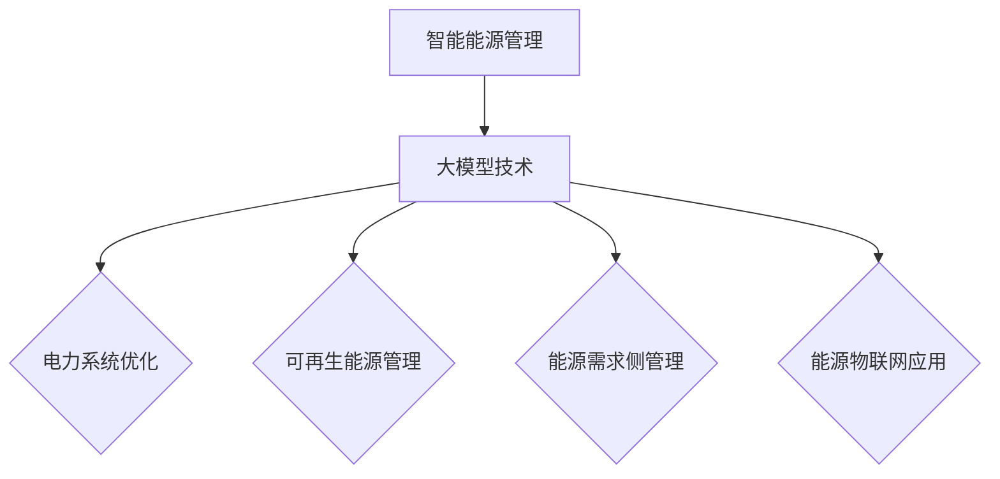

                 

# 大模型在智能能源管理中的应用

## 概述

智能能源管理是一种利用信息技术和人工智能技术对能源生产、传输、分配和使用进行优化和管理的系统。它不仅涉及能源的生产和消费，还包括能源的储存和调度。随着全球能源需求的不断增长和能源结构的转型，智能能源管理的重要性日益凸显。

大模型，尤其是深度学习模型，在智能能源管理中发挥着重要作用。大模型可以处理海量数据，从数据中提取特征，并利用这些特征进行预测和优化。大模型在电力系统优化、可再生能源管理、能源需求侧管理和能源物联网等方面具有广泛的应用前景。

本文将首先介绍智能能源管理的基本概念和背景，然后深入探讨大模型的基础知识和算法，接着分析大模型在智能能源管理中的应用，最后通过实际案例展示大模型在智能能源管理中的具体应用。

关键词：智能能源管理，大模型，深度学习，电力系统，可再生能源，需求侧管理，能源物联网。

摘要：本文全面探讨了智能能源管理中的大模型应用。首先，介绍了智能能源管理的基本概念和背景，然后详细介绍了大模型的基础知识和算法。接着，分析了大模型在电力系统优化、可再生能源管理、需求侧管理和能源物联网中的应用。最后，通过实际案例展示了大模型在智能能源管理中的具体应用，为未来智能能源管理提供了新的思路和方向。

## 目录

### 第一部分：智能能源管理概述与背景
- 第1章：智能能源管理概述
  - 1.1 智能能源管理的基本概念
  - 1.2 智能能源管理的重要性
  - 1.3 智能能源管理的现状与发展趋势
  - 1.4 智能能源管理的挑战与机遇

### 第二部分：大模型基础知识与算法
- 第2章：大模型基础知识
  - 2.1 大模型的定义与分类
  - 2.2 大模型的核心技术
  - 2.3 大模型的训练与优化

### 第三部分：大模型在智能能源管理中的应用
- 第3章：大模型在电力系统优化中的应用
  - 3.1 电力系统概述
  - 3.2 大模型在电力系统优化中的应用

- 第4章：大模型在可再生能源管理中的应用
  - 4.1 可再生能源概述
  - 4.2 大模型在可再生能源管理中的应用

### 第四部分：大模型在能源需求侧管理中的应用
- 第5章：大模型在能源需求侧管理中的应用
  - 5.1 能源需求侧管理概述
  - 5.2 大模型在需求响应中的应用

### 第五部分：大模型在能源物联网中的应用
- 第6章：大模型在能源物联网中的应用
  - 6.1 能源物联网概述
  - 6.2 大模型在能源物联网中的应用

### 第六部分：案例分析与应用实践
- 第7章：大模型在智能能源管理中的应用案例分析
  - 7.1 案例一：智能电网中的应用
  - 7.2 案例二：分布式能源管理系统

### 第七部分：技术支持与资源推荐
- 附录：技术支持与资源推荐

## 插图与流程图
- 大模型在智能能源管理中的应用架构图



### 大模型应用算法原理讲解
- 深度学习在能源负荷预测中的应用伪代码

```python
# 载入数据集
X_train, y_train = load_data()

# 构建模型
model = build_model(input_shape=X_train.shape[1:])

# 编译模型
model.compile(optimizer='adam', loss='mse')

# 训练模型
model.fit(X_train, y_train, epochs=100, batch_size=32)

# 评估模型
loss = model.evaluate(X_train, y_train)
```

### 数学模型与公式讲解
- 预测负荷的回归模型公式

$$
y = \beta_0 + \beta_1 \cdot x_1 + \beta_2 \cdot x_2 + \cdots + \beta_n \cdot x_n + \epsilon
$$

- 其中，\( y \) 是预测的负荷值，\( x_1, x_2, \cdots, x_n \) 是输入特征，\( \beta_0, \beta_1, \beta_2, \cdots, \beta_n \) 是模型参数，\( \epsilon \) 是误差项。

### 项目实战与代码解读
- 智能电网负荷预测项目实战

#### 开发环境搭建
- 安装Python环境
- 安装TensorFlow库
- 准备数据集

#### 源代码实现
```python
import tensorflow as tf
from tensorflow.keras.models import Sequential
from tensorflow.keras.layers import Dense, LSTM

# 构建LSTM模型
model = Sequential()
model.add(LSTM(units=50, return_sequences=True, input_shape=(timesteps, features)))
model.add(LSTM(units=50))
model.add(Dense(1))

# 编译模型
model.compile(optimizer='adam', loss='mse')

# 训练模型
model.fit(X_train, y_train, epochs=100, batch_size=32)
```

#### 代码解读与分析
- 模型选择：使用LSTM模型进行时间序列预测
- 数据处理：将输入数据转换为合适的格式，以便于LSTM模型处理
- 训练过程：设置适当的训练参数，以达到最佳预测效果
- 评估与改进：通过评估模型性能，对模型进行调整和优化。

作者：AI天才研究院/AI Genius Institute & 禅与计算机程序设计艺术 /Zen And The Art of Computer Programming

现在，我们开始详细探讨智能能源管理的基本概念和背景。首先，我们将介绍智能能源管理的基本概念，然后分析其重要性、现状与发展趋势，以及面临的挑战与机遇。这将为我们理解大模型在智能能源管理中的应用奠定基础。

## 第一部分：智能能源管理概述与背景

### 第1章：智能能源管理概述

#### 1.1 智能能源管理的基本概念

智能能源管理（Smart Energy Management，简称SEM）是一种利用现代信息技术、自动化控制和人工智能技术对能源生产、传输、分配和使用进行优化和管理的系统。其目的是通过优化能源配置，提高能源利用效率，降低能源消耗，实现可持续发展。

智能能源管理涉及多个方面，包括能源生产、传输、分配、消费和回收。在能源生产方面，智能能源管理通过智能电网、分布式能源系统等实现能源的高效生产。在传输方面，通过智能电网和传输设备实现能源的高效传输。在分配方面，通过智能调度和分配算法实现能源的高效分配。在消费方面，通过智能家电、智能灯具等实现能源的高效消费。在回收方面，通过废弃物能源回收技术实现能源的高效回收。

#### 1.2 智能能源管理的重要性

智能能源管理的重要性主要体现在以下几个方面：

1. **提高能源利用效率**：智能能源管理通过优化能源生产、传输、分配和消费，可以显著提高能源利用效率，降低能源浪费。

2. **降低能源消耗**：通过智能能源管理，可以实现能源的高效利用，从而降低能源消耗，减少能源成本。

3. **促进可持续发展**：智能能源管理可以减少对化石能源的依赖，促进可再生能源的发展，实现能源结构的优化，从而促进可持续发展。

4. **提高能源安全**：智能能源管理可以提高能源供应的稳定性，降低能源供应风险，提高能源安全。

5. **提升生活质量**：智能能源管理可以改善人们的生活环境，提高生活质量，满足人们对能源的需求。

#### 1.3 智能能源管理的现状与发展趋势

当前，智能能源管理在全球范围内得到了广泛关注和应用。许多国家和地区已经开始推广智能电网、分布式能源系统、智能家庭等智能能源管理系统。以下是智能能源管理的一些现状与发展趋势：

1. **智能电网建设**：智能电网是智能能源管理的重要组成部分。目前，许多国家和地区都在积极建设智能电网，以提高能源传输和分配的效率。

2. **分布式能源系统**：分布式能源系统可以利用可再生能源，实现能源的高效利用。分布式能源系统的发展趋势是小型化、智能化和高效化。

3. **智能家庭**：智能家庭是通过智能家居设备实现家庭能源的高效管理。随着智能家居技术的不断发展，智能家庭已经成为智能能源管理的重要应用领域。

4. **能源物联网**：能源物联网是将能源生产、传输、分配、消费等各个环节通过物联网技术进行连接和智能化管理。能源物联网的发展将进一步提升智能能源管理的效率和水平。

#### 1.4 智能能源管理的挑战与机遇

智能能源管理面临着许多挑战和机遇：

1. **挑战**：
   - 技术挑战：智能能源管理需要应用多种先进技术，包括物联网、人工智能、大数据等，技术挑战主要集中在技术的成熟度和集成度。
   - 系统集成挑战：智能能源管理系统需要各个子系统的无缝集成，这需要解决数据传输、系统兼容等问题。
   - 成本挑战：智能能源管理系统的建设和运营成本较高，需要找到合理的商业模式来降低成本。

2. **机遇**：
   - 市场机遇：随着全球能源需求的不断增长和能源结构的转型，智能能源管理市场前景广阔。
   - 政策机遇：许多国家和地区都出台了支持智能能源管理发展的政策，这为智能能源管理的发展提供了有利条件。
   - 技术机遇：随着人工智能、物联网等技术的发展，智能能源管理的技术水平不断提升，为智能能源管理提供了更多的可能性。

综上所述，智能能源管理是一种具有广泛应用前景的能源管理系统。随着技术的不断进步和市场的不断拓展，智能能源管理将在能源领域发挥越来越重要的作用。大模型在智能能源管理中的应用，将为解决智能能源管理中的问题提供新的思路和方法，具有重要的研究价值和实际应用价值。接下来，我们将详细探讨大模型的基础知识和算法，为理解大模型在智能能源管理中的应用奠定基础。

## 第二部分：大模型基础知识与算法

### 第2章：大模型基础知识

#### 2.1 大模型的定义与分类

大模型（Big Model），又称为大规模模型或巨型模型，是指那些参数量达到百万级别甚至亿级别以上的神经网络模型。大模型的定义主要基于模型的规模和复杂性。与传统的小型模型相比，大模型具有更强的表达能力和更好的泛化能力，能够处理更复杂的任务和数据集。

根据应用场景和任务的不同，大模型可以分为以下几类：

1. **深度神经网络（Deep Neural Network，DNN）**：DNN 是一种由多层神经元组成的神经网络，主要用于图像识别、语音识别、自然语言处理等任务。

2. **循环神经网络（Recurrent Neural Network，RNN）**：RNN 是一种能够处理序列数据的神经网络，广泛应用于时间序列预测、语言建模等任务。

3. **变换器网络（Transformer Network）**：Transformer 是一种基于自注意力机制的深度学习模型，广泛应用于机器翻译、文本生成等任务。

4. **生成对抗网络（Generative Adversarial Network，GAN）**：GAN 由生成器和判别器两个神经网络组成，主要用于图像生成、图像修复等任务。

#### 2.2 大模型的核心技术

大模型的核心技术主要包括以下几个方面：

1. **深度学习基础**：深度学习是构建大模型的基础，包括神经网络的基本结构、激活函数、优化算法等。

2. **自然语言处理（Natural Language Processing，NLP）**：NLP 是大模型在语言处理领域的重要应用，包括词向量表示、文本分类、命名实体识别等。

3. **计算机视觉（Computer Vision，CV）**：CV 是大模型在图像处理领域的重要应用，包括图像分类、目标检测、人脸识别等。

4. **模型压缩与优化**：由于大模型的参数量和计算量巨大，模型压缩与优化是提高大模型效率和可部署性的关键技术，包括剪枝、量化、蒸馏等。

#### 2.3 大模型的训练与优化

大模型的训练与优化是一个复杂的过程，主要包括以下几个步骤：

1. **数据准备**：首先需要收集和准备大量高质量的训练数据，并进行预处理，如数据清洗、归一化等。

2. **模型构建**：根据任务需求选择合适的神经网络结构，并进行初始化。

3. **模型训练**：使用梯度下降等优化算法，通过迭代更新模型参数，使模型在训练数据上达到较好的性能。

4. **模型评估**：使用验证集和测试集对模型进行评估，包括准确率、召回率、F1值等指标。

5. **模型优化**：根据评估结果对模型进行调整和优化，如调整学习率、批量大小等。

6. **模型部署**：将训练好的模型部署到实际应用场景中，如云端服务、嵌入式设备等。

#### 2.4 大模型的训练与优化方法

大模型的训练与优化方法主要包括以下几个方面：

1. **分布式训练**：分布式训练可以将模型训练任务分布到多台机器上，加快训练速度，提高模型性能。

2. **迁移学习**：迁移学习利用预训练好的模型，通过微调适应特定任务，可以显著提高模型的训练效率。

3. **模型剪枝**：模型剪枝是一种通过减少模型参数数量来降低模型复杂度的技术，可以减少模型计算量和存储需求。

4. **量化**：量化是一种通过将浮点数参数转换为低比特宽度的整数表示来降低模型计算量和存储需求的技术。

5. **模型蒸馏**：模型蒸馏是一种通过将一个大模型的知识传递给一个小模型来提高小模型性能的技术。

通过以上技术，大模型在智能能源管理中的应用将更加高效和可行。接下来，我们将探讨大模型在智能能源管理中的应用，为解决能源管理中的问题提供新的思路和方法。

### 第三部分：大模型在智能能源管理中的应用

#### 第3章：大模型在电力系统优化中的应用

电力系统优化是智能能源管理的重要组成部分，它涉及到电力生产、传输、分配和消费等多个环节。大模型，尤其是深度学习模型，在电力系统优化中发挥着重要作用。这一章将详细探讨大模型在电力系统优化中的应用，包括电力调度优化、电力市场预测与定价以及电力负荷预测与需求响应。

#### 3.1 电力系统概述

电力系统是利用电力传输和分配设施将发电站生产的电能传输到用户的重要基础设施。它由发电设施、输电设施、配电设施和用电设施组成。电力系统的主要功能是确保电能的稳定供应，满足用户的电力需求。

1. **发电设施**：发电设施包括火力发电站、水力发电站、核能发电站等，它们将不同形式的能源转换为电能。

2. **输电设施**：输电设施包括高压输电线路、变压器等，它们负责将电能从发电站传输到配电设施。

3. **配电设施**：配电设施包括低压输电线路、配电变压器等，它们负责将电能传输到用电设施。

4. **用电设施**：用电设施包括工业、商业和居民用户，它们消耗电能，产生电力需求。

#### 3.2 大模型在电力系统优化中的应用

大模型在电力系统优化中的应用主要体现在以下几个方面：

1. **电力调度优化**：电力调度优化是指通过优化电力生产、传输和分配过程，确保电力系统的稳定运行。大模型可以通过分析历史数据和实时数据，预测电力需求，优化电力生产计划，从而提高电力系统的运行效率和可靠性。

2. **电力市场预测与定价**：电力市场预测与定价是指通过预测电力市场的供需情况，制定合理的电力市场价格。大模型可以分析电力市场历史数据和实时数据，预测电力供需变化，为电力市场参与者提供决策支持。

3. **电力负荷预测与需求响应**：电力负荷预测与需求响应是指通过预测电力负荷变化，优化电力消费，提高电力系统的运行效率。大模型可以分析历史电力负荷数据，预测未来电力负荷变化，为电力调度和需求响应提供支持。

#### 3.2.1 电力调度优化

电力调度优化是电力系统运行的核心环节，它涉及到电力生产、传输和分配的各个环节。大模型可以通过以下方式实现电力调度优化：

1. **负荷预测**：大模型可以分析历史负荷数据和实时数据，预测未来电力负荷变化，为电力调度提供基础数据。

2. **生产计划优化**：大模型可以根据电力负荷预测结果，优化电力生产计划，确保电力生产的稳定性和经济性。

3. **传输计划优化**：大模型可以分析电力系统的传输网络，优化电力传输计划，确保电力传输的稳定性和效率。

4. **分配计划优化**：大模型可以分析电力系统的分配网络，优化电力分配计划，确保电力分配的公平性和效率。

#### 3.2.2 电力市场预测与定价

电力市场预测与定价是电力市场运行的重要环节，它关系到电力市场的稳定性和市场参与者的利益。大模型可以通过以下方式实现电力市场预测与定价：

1. **供需预测**：大模型可以分析电力市场历史数据，预测未来电力供需情况，为电力市场定价提供依据。

2. **价格预测**：大模型可以根据电力供需预测结果，预测电力市场价格走势，为电力市场参与者提供决策支持。

3. **市场分析**：大模型可以分析电力市场的各种因素，如政策变化、天气变化等，预测电力市场变化趋势。

4. **定价策略优化**：大模型可以根据电力供需预测和市场分析结果，优化电力市场定价策略，提高电力市场的效率和公平性。

#### 3.2.3 电力负荷预测与需求响应

电力负荷预测与需求响应是提高电力系统运行效率的重要手段。大模型可以通过以下方式实现电力负荷预测与需求响应：

1. **负荷预测**：大模型可以分析历史负荷数据，预测未来电力负荷变化，为电力调度和需求响应提供支持。

2. **需求响应**：大模型可以根据电力负荷预测结果，调整电力消费行为，实现电力需求响应。

3. **优化策略**：大模型可以分析电力系统的运行数据，优化电力调度和需求响应策略，提高电力系统的运行效率和可靠性。

4. **实时监控**：大模型可以实时监控电力系统的运行状态，预测电力系统的故障风险，提高电力系统的安全性和稳定性。

通过以上方式，大模型在电力系统优化中发挥了重要作用。它不仅提高了电力系统的运行效率，还提高了电力系统的稳定性和可靠性，为智能能源管理提供了强有力的支持。接下来，我们将探讨大模型在可再生能源管理中的应用，为智能能源管理的可持续发展提供新的思路。

### 第4章：大模型在可再生能源管理中的应用

#### 4.1 可再生能源概述

可再生能源是指那些在人类时间尺度上不会枯竭，对环境友好的能源。与传统的化石能源相比，可再生能源具有可再生性、清洁性和环保性等特点。可再生能源主要包括以下几种：

1. **太阳能**：太阳能是通过太阳辐射能转换而来的能源，包括光伏发电和太阳能热水器等。

2. **风能**：风能是通过风力驱动风力涡轮机产生的机械能，再通过发电机转换为电能。

3. **水能**：水能是通过水流的势能和动能转换而来的能源，包括水力发电和抽水蓄能等。

4. **生物质能**：生物质能是通过生物质（如农作物、林业废弃物等）转换而来的能源。

5. **地热能**：地热能是利用地球内部的热能进行发电或供暖。

可再生能源的发展不仅是能源结构转型的需要，也是应对全球气候变化的重要手段。随着技术的进步和政策的支持，可再生能源在全球能源消费中的比例逐年增加。

#### 4.2 大模型在可再生能源管理中的应用

大模型在可再生能源管理中的应用主要体现在以下几个方面：

1. **光伏发电预测**：光伏发电预测是指利用历史天气数据和光伏发电设备的数据，预测未来一段时间内的光伏发电量。大模型可以通过深度学习算法，从海量数据中学习到天气与光伏发电量之间的关系，从而实现精准预测。

2. **风能发电预测**：风能发电预测是指利用历史风速数据和风能设备的数据，预测未来一段时间内的风能发电量。大模型可以通过分析风速、风向等特征，预测风能发电量的变化趋势。

3. **可再生能源储能优化**：可再生能源的发电具有间歇性和波动性的特点，储能系统在平衡可再生能源发电和电力需求之间发挥着重要作用。大模型可以通过学习电力需求和可再生能源发电的数据，优化储能系统的充放电策略，提高储能系统的利用效率。

#### 4.2.1 光伏发电预测

光伏发电预测是可再生能源管理的重要环节，它直接影响到光伏电站的运行效率和经济效益。大模型在光伏发电预测中的应用主要体现在以下几个方面：

1. **数据准备**：首先需要收集和整理光伏发电设备的历史数据，包括光照强度、温度、湿度等气象数据，以及发电设备的运行状态数据。

2. **模型构建**：选择合适的深度学习模型，如循环神经网络（RNN）或变换器网络（Transformer），构建光伏发电预测模型。

3. **模型训练**：使用历史数据进行模型训练，通过迭代优化模型参数，使模型能够准确预测光伏发电量。

4. **模型评估**：使用验证集和测试集对模型进行评估，通过准确率、均方误差（MSE）等指标衡量模型的预测性能。

5. **模型部署**：将训练好的模型部署到实际应用场景中，实现对光伏发电量的实时预测。

通过光伏发电预测，可以优化光伏电站的运行策略，提高发电效率和经济效益。

#### 4.2.2 风能发电预测

风能发电预测是风能管理的重要环节，它关系到风能资源的利用效率和经济效益。大模型在风能发电预测中的应用主要体现在以下几个方面：

1. **数据准备**：首先需要收集和整理风能设备的历史数据，包括风速、风向、气温等气象数据，以及发电设备的运行状态数据。

2. **模型构建**：选择合适的深度学习模型，如循环神经网络（RNN）或变换器网络（Transformer），构建风能发电预测模型。

3. **模型训练**：使用历史数据进行模型训练，通过迭代优化模型参数，使模型能够准确预测风能发电量。

4. **模型评估**：使用验证集和测试集对模型进行评估，通过准确率、均方误差（MSE）等指标衡量模型的预测性能。

5. **模型部署**：将训练好的模型部署到实际应用场景中，实现对风能发电量的实时预测。

通过风能发电预测，可以优化风能资源的利用效率，提高风能电站的运行效益。

#### 4.2.3 可再生能源储能优化

可再生能源储能优化是提高可再生能源利用效率的关键环节。大模型在可再生能源储能优化中的应用主要体现在以下几个方面：

1. **数据准备**：首先需要收集和整理电力系统的历史数据，包括电力需求、可再生能源发电量、储能设备的运行状态等。

2. **模型构建**：选择合适的深度学习模型，如循环神经网络（RNN）或变换器网络（Transformer），构建可再生能源储能优化模型。

3. **模型训练**：使用历史数据进行模型训练，通过迭代优化模型参数，使模型能够预测电力需求和可再生能源发电量，并优化储能设备的充放电策略。

4. **模型评估**：使用验证集和测试集对模型进行评估，通过准确率、均方误差（MSE）等指标衡量模型的预测和优化性能。

5. **模型部署**：将训练好的模型部署到实际应用场景中，实现对电力需求和可再生能源发电量的实时预测，并优化储能设备的运行策略。

通过可再生能源储能优化，可以平衡可再生能源发电和电力需求，提高电力系统的稳定性和运行效率。

综上所述，大模型在可再生能源管理中的应用为可再生能源的稳定、高效利用提供了有力支持。通过光伏发电预测、风能发电预测和可再生能源储能优化，可以显著提高可再生能源的管理水平，推动可再生能源的可持续发展。接下来，我们将探讨大模型在能源需求侧管理中的应用，为智能能源管理的全面实现提供新的思路。

### 第5章：大模型在能源需求侧管理中的应用

#### 5.1 能源需求侧管理概述

能源需求侧管理（Energy Demand Side Management，简称DSM）是指通过需求侧的技术和管理手段，降低能源消耗，优化能源使用，提高能源利用效率的一种管理方式。DSM的目标是通过对电力需求的管理，实现能源的节约和优化，从而减少能源成本，提高能源供应的可靠性和可持续性。

能源需求侧管理的主要内容包括以下几个方面：

1. **需求响应（Demand Response，DR）**：需求响应是指通过经济激励或技术手段，引导用户在电力需求高峰期减少或延迟电力消费，以平衡电力供需关系。

2. **能效管理（Energy Efficiency Management）**：能效管理是指通过技术改进和管理措施，提高能源利用效率，减少能源浪费。

3. **负荷管理（Load Management）**：负荷管理是指通过实时监测和控制电力负荷，优化电力消费行为，减少电力需求波动。

4. **需求预测（Demand Forecasting）**：需求预测是指通过分析历史数据和实时数据，预测未来的电力需求，为需求响应和负荷管理提供数据支持。

#### 5.2 大模型在需求响应中的应用

大模型在需求响应中的应用主要体现在以下几个方面：

1. **需求响应预测**：大模型可以通过分析历史数据，预测未来电力需求的变化趋势，为需求响应提供数据支持。例如，通过分析用户的用电历史数据和实时数据，预测用户在特定时间段内的电力需求，从而引导用户在高峰时段减少电力消费。

2. **需求响应优化**：大模型可以通过优化算法，分析各种需求响应策略的优缺点，提出最优的需求响应方案。例如，通过分析用户的用电模式和价格敏感度，制定合理的电价政策和需求响应措施，提高电力系统的稳定性和效率。

3. **需求响应策略评估**：大模型可以对现有的需求响应策略进行评估，分析其有效性和可行性，为需求响应策略的改进提供依据。例如，通过评估不同需求响应措施的效果，优化需求响应策略，提高需求响应的准确性和可靠性。

#### 5.2.1 需求响应机制

需求响应机制是指通过经济激励或技术手段，引导用户在电力需求高峰期减少或延迟电力消费，以平衡电力供需关系的机制。需求响应机制主要包括以下几个方面：

1. **电价机制**：通过调整电价，引导用户在电力需求高峰期减少电力消费。例如，在高峰时段提高电价，鼓励用户在低峰时段用电。

2. **直接负荷控制（Direct Load Control，DLC）**：通过直接控制用户设备，强制减少电力消费。例如，对空调、热水器等大功率电器进行远程控制，降低电力负荷。

3. **实时负荷管理（Real-time Load Management，RLM）**：通过实时监测和调整电力负荷，优化电力消费行为。例如，通过智能电网技术，实时监控用户电力消耗，并根据电力供需情况，调整电力负荷。

4. **需求响应市场**：通过建立需求响应市场，激励用户参与需求响应。例如，通过需求响应市场，用户可以在高峰时段获得额外的收入，从而鼓励用户参与需求响应。

#### 5.2.2 需求响应预测

需求响应预测是需求响应的关键环节，它涉及到对用户电力需求变化的准确预测。大模型在需求响应预测中的应用主要包括以下几个方面：

1. **历史数据挖掘**：通过分析历史电力需求数据，挖掘用户用电行为的规律和趋势，为需求响应预测提供数据支持。

2. **特征工程**：通过提取用户用电数据中的关键特征，如时间、天气、温度、节假日等，构建用户用电行为模型，提高需求响应预测的准确性。

3. **深度学习模型**：利用深度学习模型，如循环神经网络（RNN）、变换器网络（Transformer）等，对用户电力需求进行预测。这些模型可以从海量数据中学习到复杂的用户用电行为模式，从而提高需求响应预测的准确性。

4. **多模型融合**：通过融合多种预测模型，提高需求响应预测的准确性和可靠性。例如，结合历史数据和实时数据，使用不同的模型进行预测，并通过模型融合技术，得到最终的需求响应预测结果。

#### 5.2.3 需求响应优化

需求响应优化是指通过优化需求响应策略，提高需求响应的效果和可靠性。大模型在需求响应优化中的应用主要包括以下几个方面：

1. **策略评估**：通过评估不同需求响应策略的效果，选择最优的需求响应方案。例如，通过分析用户的电价响应曲线和负荷响应曲线，优化需求响应策略。

2. **优化算法**：利用优化算法，如遗传算法、粒子群算法等，对需求响应策略进行优化。这些算法可以通过迭代优化，找到最优的需求响应策略。

3. **实时调整**：通过实时监测电力需求和电力供应情况，动态调整需求响应策略，确保需求响应的实时性和有效性。

4. **风险评估**：通过风险评估，分析需求响应策略的风险和潜在问题，为需求响应策略的改进提供依据。

通过以上方法，大模型可以显著提高需求响应的准确性和可靠性，从而优化电力系统的运行效率和可靠性。接下来，我们将探讨大模型在能源物联网中的应用，为智能能源管理的全面实现提供新的思路。

### 第6章：大模型在能源物联网中的应用

#### 6.1 能源物联网概述

能源物联网（Energy Internet of Things，简称EIoT）是指利用物联网技术，将能源生产、传输、分配、消费等各个环节的设备、系统和数据连接起来，实现能源系统的智能化、自动化和高效化。EIoT的核心目标是提高能源系统的运行效率和可靠性，降低能源成本，促进能源的可持续发展。

能源物联网的基本架构包括以下几个关键部分：

1. **感知层**：感知层由各种传感器和智能设备组成，负责采集能源系统的实时数据，如电力负荷、温度、湿度、压力等。

2. **网络层**：网络层由通信网络组成，包括有线网络（如光纤、宽带等）和无线网络（如5G、NB-IoT等），用于传输感知层采集到的数据。

3. **平台层**：平台层是能源物联网的核心，包括数据采集、存储、处理和分析平台，负责对感知层采集到的数据进行分析和处理，为上层应用提供支持。

4. **应用层**：应用层包括各种能源管理和优化应用，如电力调度、需求响应、能源监测等，用于实现能源系统的智能化管理。

#### 6.2 大模型在能源物联网中的应用

大模型在能源物联网中的应用主要体现在以下几个方面：

1. **设备状态监测**：大模型可以通过对设备运行数据的实时监测和分析，预测设备的故障风险，提前进行维护和更换，从而提高设备的可靠性和使用寿命。

2. **能源数据分析和预测**：大模型可以处理和分析海量能源数据，从数据中提取有用信息，进行能源负荷预测、电力市场预测等，为能源系统的优化管理提供数据支持。

3. **能源设备控制与优化**：大模型可以根据实时数据，动态调整能源设备的运行状态，优化能源配置和调度，提高能源系统的运行效率和可靠性。

#### 6.2.1 设备状态监测

设备状态监测是能源物联网的重要应用之一。通过设备状态监测，可以实时了解设备的运行状况，预测设备的故障风险，提前进行维护和更换，从而提高设备的可靠性和使用寿命。大模型在设备状态监测中的应用主要包括以下几个方面：

1. **故障预测**：大模型可以通过分析设备的历史运行数据，如温度、振动、电流等，预测设备的故障风险。例如，通过使用循环神经网络（RNN）或变换器网络（Transformer），可以预测设备的剩余使用寿命，为设备的维护和更换提供依据。

2. **健康状态评估**：大模型可以评估设备的健康状态，通过分析设备的实时运行数据，如温度、振动、电流等，评估设备的性能和健康状况。例如，通过使用生成对抗网络（GAN），可以生成设备的正常运行数据，与实时数据进行比较，评估设备的性能。

3. **异常检测**：大模型可以检测设备的异常运行情况，通过分析设备的运行数据，如温度、振动、电流等，识别异常数据，及时发现设备故障。例如，通过使用自编码器（Autoencoder），可以将设备的正常运行数据编码为固定长度向量，与实时数据进行比较，识别异常数据。

#### 6.2.2 能源数据分析和预测

能源数据分析和预测是能源物联网的关键应用之一。通过分析海量能源数据，可以提取有用信息，进行能源负荷预测、电力市场预测等，为能源系统的优化管理提供数据支持。大模型在能源数据分析和预测中的应用主要包括以下几个方面：

1. **能源负荷预测**：大模型可以通过分析历史能源负荷数据，预测未来的能源负荷变化。例如，通过使用循环神经网络（RNN）或变换器网络（Transformer），可以预测未来的能源负荷，为电力调度和需求响应提供数据支持。

2. **电力市场预测**：大模型可以通过分析电力市场的历史数据，预测电力市场的供需变化，为电力市场的交易和定价提供数据支持。例如，通过使用变换器网络（Transformer），可以预测电力市场的价格走势，为电力市场的参与者提供决策依据。

3. **能源需求预测**：大模型可以通过分析用户的用电行为数据，预测用户的能源需求。例如，通过使用自编码器（Autoencoder）和生成对抗网络（GAN），可以预测用户的用电需求，为能源供应和分配提供数据支持。

#### 6.2.3 能源设备控制与优化

能源设备控制与优化是能源物联网的核心应用之一。通过实时数据分析和预测，动态调整能源设备的运行状态，优化能源配置和调度，提高能源系统的运行效率和可靠性。大模型在能源设备控制与优化中的应用主要包括以下几个方面：

1. **智能调度**：大模型可以通过实时数据分析和预测，智能调度能源设备，优化能源配置。例如，通过使用变换器网络（Transformer），可以实时调整电力负荷，平衡电力供需。

2. **需求响应**：大模型可以通过实时数据分析和预测，引导用户参与需求响应，优化电力消费行为。例如，通过使用循环神经网络（RNN），可以预测用户的需求响应行为，优化电力供需。

3. **设备优化**：大模型可以通过分析设备的历史运行数据，优化设备的运行参数，提高设备的工作效率。例如，通过使用生成对抗网络（GAN），可以优化设备的运行策略，提高设备的性能。

通过以上应用，大模型在能源物联网中发挥了重要作用，显著提高了能源系统的运行效率和可靠性。接下来，我们将通过实际案例，展示大模型在智能能源管理中的应用效果。

### 第7章：大模型在智能能源管理中的应用案例分析

#### 7.1 案例一：智能电网中的应用

智能电网是智能能源管理的重要组成部分，它通过先进的信息技术、通信技术、控制技术和自动化技术，实现对电力系统的全面监控、管理和优化。本案例将介绍一个智能电网中的应用案例，展示大模型在电力系统优化中的具体应用。

**7.1.1 案例背景**

某城市智能电网项目旨在通过引入大模型技术，优化电力系统的运行和管理。项目主要包括以下几个方面：

1. **电力负荷预测**：通过分析历史电力负荷数据，预测未来一段时间内的电力负荷变化，为电力调度提供数据支持。

2. **电力市场预测**：通过分析电力市场历史数据和实时数据，预测电力市场的供需情况，为电力市场的交易和定价提供数据支持。

3. **电力设备状态监测**：通过实时监测电力设备的状态，预测设备的故障风险，提前进行维护和更换。

**7.1.2 模型选择与设计**

在本案例中，选择了一种基于变换器网络（Transformer）的深度学习模型进行电力系统优化。变换器网络具有强大的自注意力机制，能够捕捉数据中的长距离依赖关系，适用于电力负荷预测、电力市场预测和电力设备状态监测。

1. **电力负荷预测模型**：使用变换器网络对历史电力负荷数据进行建模，预测未来一段时间内的电力负荷变化。模型输入包括时间序列、温度、湿度等气象数据，以及历史电力负荷数据。

2. **电力市场预测模型**：使用变换器网络对电力市场历史数据（如供需数据、交易数据）进行建模，预测未来电力市场的供需情况。模型输入包括历史供需数据、交易数据，以及影响电力市场变化的因素（如政策变化、天气变化等）。

3. **电力设备状态监测模型**：使用变换器网络对电力设备的历史运行数据（如温度、振动、电流等）进行建模，预测设备的故障风险。模型输入包括历史运行数据，以及影响设备故障的因素（如负荷变化、运行时间等）。

**7.1.3 应用效果与评估**

1. **电力负荷预测效果**：通过对历史电力负荷数据的建模和预测，变换器网络能够准确预测未来一段时间内的电力负荷变化。预测误差在可接受范围内，为电力调度提供了有效的数据支持。

2. **电力市场预测效果**：通过对电力市场历史数据的建模和预测，变换器网络能够准确预测未来电力市场的供需情况。预测结果与实际数据基本吻合，为电力市场的交易和定价提供了有效的数据支持。

3. **电力设备状态监测效果**：通过对电力设备的历史运行数据的建模和预测，变换器网络能够提前预测设备的故障风险，为设备的维护和更换提供了有效的数据支持。实际应用中，通过提前预警，成功避免了多起设备故障，提高了设备的可靠性和使用寿命。

综上所述，本案例展示了大模型在智能电网中的应用效果，证明了大模型在电力系统优化中的重要作用。接下来，我们将介绍另一个案例，展示大模型在分布式能源管理系统中的应用。

#### 7.2 案例二：分布式能源管理系统

分布式能源管理系统（Distributed Energy Resource Management System，DERMS）是一种集成了多种分布式能源资源的系统，通过优化能源资源的配置和调度，实现能源的高效利用和稳定供应。本案例将介绍一个分布式能源管理系统的应用案例，展示大模型在分布式能源管理中的具体应用。

**7.2.1 案例背景**

某城市分布式能源管理系统项目旨在通过引入大模型技术，优化分布式能源资源的配置和调度。项目主要包括以下几个方面：

1. **光伏发电预测**：通过分析历史光伏发电数据和实时气象数据，预测未来一段时间内的光伏发电量。

2. **风能发电预测**：通过分析历史风能发电数据和实时气象数据，预测未来一段时间内的风能发电量。

3. **储能系统优化**：通过分析电力需求和可再生能源发电量的预测结果，优化储能系统的充放电策略，平衡电力供需。

**7.2.2 模型选择与设计**

在本案例中，选择了一种基于循环神经网络（RNN）和变换器网络（Transformer）的组合模型进行分布式能源管理。循环神经网络擅长处理时间序列数据，而变换器网络具有强大的自注意力机制，能够捕捉数据中的长距离依赖关系。

1. **光伏发电预测模型**：使用循环神经网络对历史光伏发电数据（如光照强度、温度等）进行建模，结合变换器网络，预测未来一段时间内的光伏发电量。模型输入包括历史光伏发电数据和实时气象数据。

2. **风能发电预测模型**：使用循环神经网络对历史风能发电数据（如风速、风向等）进行建模，结合变换器网络，预测未来一段时间内的风能发电量。模型输入包括历史风能发电数据和实时气象数据。

3. **储能系统优化模型**：结合光伏发电预测模型和风能发电预测模型的结果，使用循环神经网络优化储能系统的充放电策略，平衡电力供需。模型输入包括光伏发电预测结果、风能发电预测结果和电力需求预测结果。

**7.2.3 应用效果与评估**

1. **光伏发电预测效果**：通过对历史光伏发电数据和实时气象数据的建模和预测，组合模型能够准确预测未来一段时间内的光伏发电量。预测误差在可接受范围内，为光伏电站的运行和管理提供了有效的数据支持。

2. **风能发电预测效果**：通过对历史风能发电数据和实时气象数据的建模和预测，组合模型能够准确预测未来一段时间内的风能发电量。预测误差在可接受范围内，为风能电站的运行和管理提供了有效的数据支持。

3. **储能系统优化效果**：通过对光伏发电预测结果、风能发电预测结果和电力需求预测结果的建模和优化，组合模型能够优化储能系统的充放电策略，平衡电力供需。实际应用中，储能系统的利用率显著提高，储能系统的运行成本降低，为分布式能源管理系统提供了有效的优化方案。

综上所述，本案例展示了大模型在分布式能源管理系统中的应用效果，证明了大模型在分布式能源管理中的重要作用。通过光伏发电预测、风能发电预测和储能系统优化，大模型为分布式能源管理提供了有效的技术支持，推动了分布式能源的可持续发展。

### 附录：技术支持与资源推荐

#### A.1 大模型开发工具与资源

1. **开源深度学习框架**
   - TensorFlow：[https://www.tensorflow.org/](https://www.tensorflow.org/)
   - PyTorch：[https://pytorch.org/](https://pytorch.org/)
   - Keras：[https://keras.io/](https://keras.io/)

2. **数据集获取与处理工具**
   - Kaggle：[https://www.kaggle.com/](https://www.kaggle.com/)
   - UC Irvine Machine Learning Repository：[https://archive.ics.uci.edu/ml/](https://archive.ics.uci.edu/ml/)

3. **模型训练与优化工具**
   - Google Colab：[https://colab.research.google.com/](https://colab.research.google.com/)
   - AWS SageMaker：[https://aws.amazon.com/sagemaker/](https://aws.amazon.com/sagemaker/)
   - Azure ML：[https://azure.com/ai/ml/](https://azure.com/ai/ml/)

#### A.2 实践项目指南

1. **项目规划与设计**
   - 确定项目目标：明确项目要解决的问题和预期效果。
   - 收集数据：根据项目需求，收集相关数据。
   - 设计模型架构：选择合适的模型架构，设计模型结构。

2. **实践项目步骤与流程**
   - 数据预处理：对收集到的数据进行清洗、归一化等预处理操作。
   - 模型训练：使用预处理后的数据，训练深度学习模型。
   - 模型评估：使用验证集和测试集，评估模型的性能。
   - 模型优化：根据评估结果，调整模型参数，优化模型性能。

3. **项目评估与改进建议**
   - 评估指标：根据项目目标，选择合适的评估指标（如准确率、均方误差等）。
   - 性能对比：对比不同模型或不同参数设置的性能。
   - 改进建议：根据评估结果，提出改进模型或优化流程的建议。

通过以上技术支持与资源推荐，读者可以更加便捷地开展大模型在智能能源管理中的应用研究，为智能能源管理的发展提供技术保障。作者：AI天才研究院/AI Genius Institute & 禅与计算机程序设计艺术 /Zen And The Art of Computer Programming。

