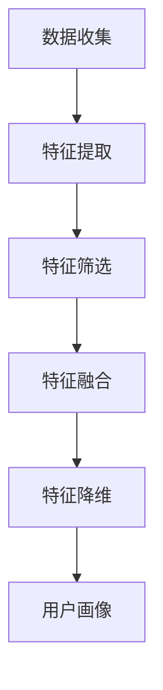
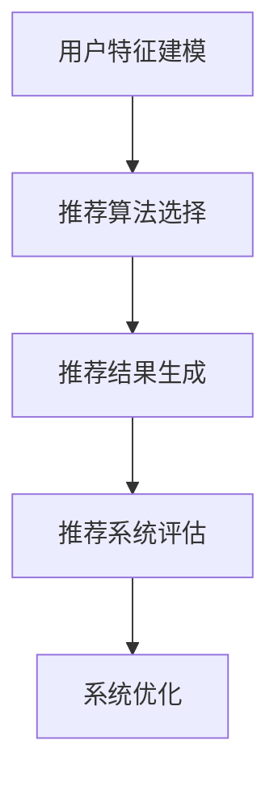
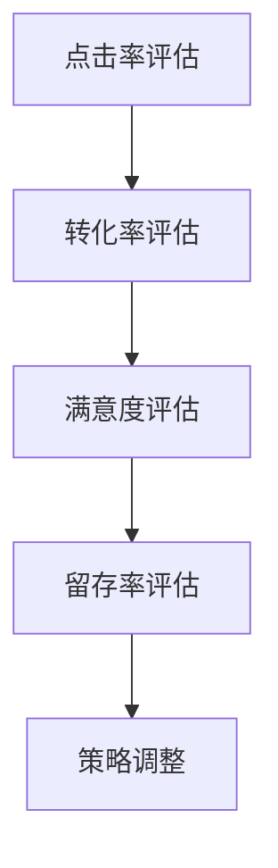

                 

### 《大模型在电商平台用户兴趣探索与利用平衡中的应用》

#### 引言与背景

在当今数字化时代，电商平台已经成为人们日常生活中不可或缺的一部分。用户在电商平台上的行为数据不仅反映了他们的购物习惯和偏好，也为电商平台提供了宝贵的信息资源。如何有效地探索和利用这些数据，从而提升用户满意度和电商平台竞争力，成为了一个亟待解决的问题。大模型在这一过程中发挥了关键作用。

**1.1 书籍目的与结构**

本章节将重点介绍大模型在电商平台用户兴趣探索与利用平衡中的应用，旨在帮助读者了解这一领域的核心概念、方法与实践。本书分为六个部分，首先阐述电商平台用户兴趣的重要性，然后详细探讨用户兴趣探索的基础，接着介绍大模型在用户兴趣识别中的应用，并进一步讨论用户兴趣利用与平衡的策略。最后，通过实战案例展示大模型在电商平台的实际应用，并展望该领域的未来发展。

**1.2 电商平台用户兴趣的重要性**

用户兴趣是电商平台运营的核心要素之一。通过对用户兴趣的深入理解，电商平台可以提供更精准的商品推荐，提升用户购物体验，从而增加用户黏性和销售额。具体来说，用户兴趣的重要性体现在以下几个方面：

- **个性化推荐：** 用户兴趣的识别和利用是构建个性化推荐系统的关键。通过分析用户的历史行为数据和偏好，可以为每位用户提供量身定制的商品推荐，提高推荐系统的准确性和用户满意度。

- **用户行为预测：** 用户兴趣的探索有助于预测用户的未来行为，如购买意图、浏览路径等。这有助于电商平台在商品库存管理、营销策略制定等方面做出更科学的决策，提高运营效率。

- **用户留存与转化：** 精准的用户兴趣识别和利用有助于提升用户留存率和转化率。通过不断优化推荐策略，电商平台可以更好地满足用户需求，提高用户满意度和忠诚度。

- **商业价值挖掘：** 用户兴趣的深入挖掘有助于发现潜在的市场机会，为电商平台的商业化发展提供有力支持。

**1.3 大模型在电商领域的应用现状**

随着人工智能技术的飞速发展，大模型在电商领域得到了广泛应用。大模型具有强大的数据处理和知识挖掘能力，可以处理海量用户行为数据，提取用户兴趣特征，并在此基础上实现精准推荐和智能决策。当前，大模型在电商领域的应用现状如下：

- **个性化推荐系统：** 大模型广泛应用于电商平台的个性化推荐系统，通过分析用户行为数据，为用户推荐可能感兴趣的商品，提高推荐系统的准确性和用户体验。

- **用户行为预测：** 大模型在用户行为预测方面表现出色，可以预测用户的浏览、搜索、购买等行为，为电商平台的运营决策提供有力支持。

- **智能客服：** 大模型在智能客服领域的应用也逐渐成熟，通过自然语言处理技术，可以为用户提供24/7的智能服务，提高客服效率和服务质量。

- **广告投放：** 大模型在广告投放方面也具有显著优势，可以根据用户兴趣和行为数据，精准定位潜在客户，提高广告投放的效果。

**1.4 书籍读者对象**

本书籍主要面向以下读者群体：

- **人工智能领域研究人员：** 想要深入了解大模型在电商平台用户兴趣探索与利用中的应用。

- **电商平台技术团队：** 担任数据分析师、机器学习工程师、推荐系统工程师等职位，希望提升自己在用户兴趣识别、利用和平衡方面的实践能力。

- **商业管理人员：** 担任电商平台的运营经理、市场总监等职位，希望通过学习大模型的应用，提升电商平台竞争力。

通过本书籍的学习，读者将能够全面了解大模型在电商平台用户兴趣探索与利用中的核心概念、方法与实践，为电商平台的发展提供有益借鉴。

### 用户行为数据分析基础

在电商平台中，用户行为数据是理解用户需求和提供个性化服务的关键资源。对这些数据进行有效的分析，能够揭示用户的兴趣、偏好和购买意图，从而为电商平台的运营决策提供有力支持。本章节将详细介绍电商用户行为数据的基础知识，包括数据采集、预处理、用户画像构建和用户行为特征提取。

**2.1 电商用户行为数据概述**

电商用户行为数据主要包括用户在电商平台上的各种交互记录，如浏览、搜索、购买、评价等。这些数据通常以日志的形式记录，包括用户ID、时间戳、操作类型、目标商品ID等关键信息。用户行为数据不仅反映了用户的购物行为，还包含了对商品、品牌、店铺等多个维度的信息。以下是对主要用户行为数据的分类：

- **浏览行为数据：** 用户在电商平台上的浏览记录，包括浏览的商品页面、浏览时长、浏览频率等。
- **搜索行为数据：** 用户在电商平台上的搜索记录，包括搜索关键词、搜索频次、搜索结果点击等。
- **购买行为数据：** 用户在电商平台上的购买记录，包括购买商品、购买时间、购买金额等。
- **评价行为数据：** 用户对商品或服务的评价记录，包括评分、评价内容等。
- **其他行为数据：** 如用户在平台上的关注、收藏、点赞等操作。

**2.2 数据采集与预处理**

数据采集是用户行为分析的基础工作，主要涉及数据来源和数据采集方法。电商平台的用户行为数据主要来源于以下几个渠道：

- **服务器日志：** 电商平台的服务器会记录用户在平台上的各种操作，如浏览、搜索、购买等。这些日志数据可以通过网络抓包、API调用等方式获取。
- **前端埋点：** 在电商平台的前端代码中，通过埋点技术记录用户的操作行为，如点击、滑动、搜索等。这种方式可以更加精确地采集用户行为数据。
- **用户反馈：** 通过用户调查、问卷调查等方式获取用户对商品、服务和平台的反馈数据。

在数据采集过程中，通常会面临数据质量、数据缺失和数据冗余等问题。为了确保数据的有效性和准确性，需要对数据进行预处理，包括以下步骤：

- **数据清洗：** 去除重复、错误和无效的数据，如删除重复的日志记录、纠正错误的数据值等。
- **数据去噪声：** 去除数据中的噪声和异常值，如过滤掉有明显异常的用户行为数据。
- **数据填充：** 对于缺失的数据，采用适当的填充方法进行补全，如使用均值、中位数等方法。
- **数据规范化：** 将不同来源和格式的数据统一转化为标准格式，如将日期格式统一为YYYY-MM-DD等。

**2.3 用户画像构建**

用户画像是对用户特征的综合描述，通常包括用户的基本信息、行为特征、兴趣偏好等多个维度。构建用户画像的目的是为了更深入地了解用户，从而实现精准的个性化推荐和用户服务。

构建用户画像的主要步骤如下：

- **数据收集：** 收集用户在平台上的行为数据，如浏览记录、搜索记录、购买记录等。
- **特征提取：** 从行为数据中提取用户的特征，如浏览时长、浏览频次、搜索关键词、购买频次等。
- **特征筛选：** 根据业务需求，筛选出对用户兴趣和偏好有显著影响的特征。
- **特征融合：** 将不同来源的特征进行融合，形成一个统一的用户特征向量。
- **特征降维：** 采用降维技术，如PCA（主成分分析）等，减少特征维度，提高数据处理效率。

用户画像的构建过程可以表示为以下 Mermaid 流程图：



**2.4 用户行为特征提取**

用户行为特征提取是用户画像构建的关键环节，其目的是从原始的用户行为数据中提取出对用户兴趣和偏好有显著影响的特征。常见的用户行为特征提取方法包括：

- **统计特征：** 如浏览时长、浏览频次、购买频次等。这些特征可以直接从用户行为数据中计算得到。
- **序列特征：** 如用户的浏览序列、搜索序列等。这些特征可以揭示用户的兴趣演变过程。
- **文本特征：** 如搜索关键词、评价内容等。这些特征可以通过文本挖掘技术，如TF-IDF、Word2Vec等，进行提取。

以下是一个用户行为特征提取的伪代码示例：

```python
def extract_user_behavior_features(user_behavior_data):
    # 统计特征
    browse_duration = sum([data['duration'] for data in user_behavior_data['browse']])
    purchase_frequency = len(user_behavior_data['purchase'])

    # 序列特征
    browse_sequence = [data['item_id'] for data in user_behavior_data['browse']]

    # 文本特征
    search_keywords = [data['keyword'] for data in user_behavior_data['search']]
    search_vector = convert_to_vector(search_keywords)

    # 特征融合
    features = {
        'browse_duration': browse_duration,
        'purchase_frequency': purchase_frequency,
        'browse_sequence': browse_sequence,
        'search_vector': search_vector
    }

    return features
```

通过以上步骤，我们可以从用户行为数据中提取出丰富的用户行为特征，为后续的用户兴趣识别和利用提供支持。

在本章节中，我们介绍了电商用户行为数据的基础知识，包括数据采集、预处理、用户画像构建和用户行为特征提取。这些知识为后续章节深入探讨大模型在用户兴趣探索和利用中的应用奠定了基础。

### 大模型在用户兴趣识别中的核心概念

在电商平台中，用户兴趣识别是构建个性化推荐系统和优化用户体验的关键环节。大模型凭借其强大的数据处理和知识挖掘能力，在用户兴趣识别中发挥了重要作用。本章节将详细介绍大模型在用户兴趣识别中的核心概念、算法原理、应用案例以及面临的挑战和解决方案。

**3.1 大模型与用户兴趣识别**

大模型（Large-scale Model）是指具有大规模参数和计算能力的人工智能模型，如深度神经网络、Transformer、BERT等。这些模型可以处理海量数据，提取复杂特征，并在各种任务中表现出优异的性能。在用户兴趣识别中，大模型的主要作用如下：

- **高效特征提取：** 大模型可以自动学习用户行为数据中的低层次特征和高层次语义特征，从而提高用户兴趣识别的准确性。
- **跨域迁移能力：** 大模型具有较好的跨域迁移能力，可以从一个领域迁移到另一个领域，从而扩展用户兴趣识别的应用场景。
- **实时响应能力：** 大模型可以实时处理用户行为数据，快速识别用户兴趣，从而实现实时推荐和智能决策。

**3.2 用户兴趣识别算法原理**

用户兴趣识别算法是基于用户行为数据和用户特征，通过机器学习模型识别用户兴趣的过程。常见的用户兴趣识别算法包括基于协同过滤、基于内容推荐和基于深度学习的方法。

- **协同过滤方法：** 协同过滤是一种基于用户行为相似性的推荐算法，通过分析用户之间的行为相似度，预测用户可能感兴趣的内容。常用的协同过滤算法包括基于用户的协同过滤（User-based Collaborative Filtering）和基于物品的协同过滤（Item-based Collaborative Filtering）。
  - **用户相似度计算：** 通过计算用户之间的相似度矩阵，找到与目标用户最相似的邻居用户，然后基于邻居用户的行为进行推荐。
  - **预测用户兴趣：** 根据邻居用户的行为，预测目标用户对未知商品的评分，从而实现推荐。

以下是一个基于用户的协同过滤算法的伪代码示例：

```python
def collaborative_filter(user_behavior_data, neighbors, k=5):
    user_similarity_matrix = compute_user_similarity(user_behavior_data)
    neighbors = get_neighbors(user_similarity_matrix, target_user, k)

    recommendations = []
    for neighbor in neighbors:
        similar_items = get_similar_items(user_behavior_data, neighbor)
        recommendations.extend(similar_items)

    return recommendations
```

- **基于内容推荐方法：** 基于内容推荐是一种基于商品特征相似性的推荐算法，通过分析用户历史行为和商品特征，找到与用户历史行为相似的商品进行推荐。常用的基于内容推荐算法包括基于特征匹配和基于聚类的方法。
  - **特征提取：** 从用户行为数据中提取用户特征和商品特征，如浏览频次、购买频次、关键词等。
  - **相似度计算：** 计算用户特征和商品特征之间的相似度，找到与用户历史行为最相似的商品。

以下是一个基于特征匹配的推荐算法的伪代码示例：

```python
def content_based_recommender(user_behavior_data, item_features, user_features, similarity_measure='cosine'):
    recommendations = []
    for item in item_features:
        similarity = similarity_measure(item_features[item], user_features)
        if similarity > threshold:
            recommendations.append(item)

    return recommendations
```

- **基于深度学习方法：** 基于深度学习方法通过构建深度神经网络模型，直接从用户行为数据中学习用户兴趣特征。常用的深度学习模型包括卷积神经网络（CNN）、循环神经网络（RNN）和Transformer等。
  - **模型架构：** 基于深度学习的用户兴趣识别模型通常包括编码器（Encoder）和解码器（Decoder）两部分。编码器负责将用户行为数据编码为高维特征向量，解码器负责将特征向量解码为用户兴趣标签。
  - **损失函数：** 通过训练数据训练模型，使用交叉熵损失函数优化模型参数，从而实现用户兴趣识别。

以下是一个基于Transformer的推荐模型的伪代码示例：

```python
def transformer_model(user_behavior_data, labels):
    model = build_transformer_model(input_dim=user_behavior_data.shape[1], hidden_dim=128, num_classes=num_labels)
    loss_function = compute_loss(labels, model.outputs)

    optimizer = AdamOptimizer(learning_rate=0.001)
    for epoch in range(num_epochs):
        for user, label in zip(user_behavior_data, labels):
            optimizer.minimize(loss_function, model)
            model.train(user, label)

    return model
```

**3.3 大模型在用户兴趣识别中的应用案例**

大模型在用户兴趣识别中已经取得了显著的应用成果，以下是一些应用案例：

- **个性化推荐系统：** 通过大模型构建的个性化推荐系统，可以根据用户的历史行为和兴趣偏好，为用户推荐最符合其需求的商品。例如，淘宝、京东等电商平台使用的推荐系统，就采用了深度学习模型进行用户兴趣识别和推荐。

- **广告投放优化：** 在广告投放领域，大模型可以根据用户的兴趣和行为特征，精准定位潜在客户，提高广告投放的效果。例如，谷歌的AdWords系统就使用了深度学习模型进行用户兴趣识别和广告推荐。

- **智能客服：** 大模型在智能客服领域的应用，可以通过自然语言处理技术，理解用户的意图和需求，提供个性化的服务。例如，苹果公司的Siri、亚马逊的Alexa等智能语音助手，就使用了深度学习模型进行用户兴趣识别和响应。

**3.4 用户兴趣识别的挑战与解决方案**

尽管大模型在用户兴趣识别中取得了显著成果，但仍然面临一些挑战：

- **数据隐私保护：** 用户行为数据通常包含敏感信息，如个人信息、购物记录等。在用户兴趣识别过程中，如何保护用户隐私是一个重要挑战。解决方案包括数据匿名化、差分隐私等技术。
- **模型解释性：** 大模型通常被视为“黑箱”，其决策过程难以解释。在用户兴趣识别中，如何提高模型的可解释性，使决策过程更加透明，是一个重要挑战。解决方案包括模型可视化、解释性模型（如决策树）等技术。
- **实时响应能力：** 大模型通常需要大量计算资源和时间进行训练和推理，难以满足实时响应的需求。解决方案包括模型压缩、分布式计算等技术，以提高模型的实时性能。

通过以上分析，我们可以看到，大模型在用户兴趣识别中具有强大的能力和广泛的应用场景，但同时也面临一些挑战。未来，随着人工智能技术的不断发展，大模型在用户兴趣识别中的应用将更加深入和广泛。

### 用户兴趣利用策略

在明确了用户兴趣的识别方法之后，如何有效地利用这些兴趣信息，实现用户需求的满足和商业价值的提升，成为电商平台的重点工作之一。本章节将详细介绍用户兴趣利用的目的与意义、用户个性化推荐系统、用户兴趣引导策略以及用户兴趣利用效果评估，探讨如何在实际运营中平衡用户兴趣与商业利益。

**4.1 用户兴趣利用的目的与意义**

用户兴趣利用的核心目的是提升用户体验和平台收益。通过精确地捕捉和利用用户兴趣，电商平台可以实现以下目标：

- **提升用户满意度：** 精准的用户兴趣识别和推荐，能够为用户提供符合其需求和偏好的商品信息，从而提高用户满意度和平台黏性。
- **增加销售额和利润：** 通过个性化推荐和精准营销，电商平台可以吸引更多用户进行购买，提升销售额和利润。
- **优化运营策略：** 用户兴趣数据可以用于分析用户行为模式和市场趋势，为电商平台提供科学的运营决策依据。

**4.2 用户个性化推荐系统**

用户个性化推荐系统是用户兴趣利用的重要手段，通过分析用户的历史行为数据和兴趣特征，为用户推荐可能感兴趣的商品。以下是用户个性化推荐系统的主要组成部分：

- **用户特征建模：** 通过分析用户的行为数据，构建用户特征向量。用户特征包括用户基本属性（如年龄、性别、地理位置等）、行为特征（如浏览、搜索、购买等）和社交特征（如关注、点赞等）。
- **推荐算法选择：** 根据电商平台的需求和用户特征，选择合适的推荐算法。常见的推荐算法包括基于协同过滤、基于内容推荐和基于深度学习的方法。
- **推荐结果生成：** 通过推荐算法，为用户生成个性化推荐列表。推荐结果应具有多样性、准确性和新颖性，以满足不同用户的需求。
- **推荐系统评估：** 对推荐系统进行评估，包括推荐准确率、推荐覆盖率、推荐新颖性等指标。通过评估结果，持续优化推荐系统。

以下是一个用户个性化推荐系统的 Mermaid 流程图：



**4.3 用户兴趣引导策略**

用户兴趣引导策略是通过各种手段激发和引导用户兴趣，从而提高用户参与度和购买意愿。以下是几种常见的用户兴趣引导策略：

- **个性化营销：** 通过分析用户兴趣，为用户推送个性化的营销信息，如优惠券、促销活动等。个性化营销可以提高用户点击率和转化率。
- **内容优化：** 优化电商平台的内容，如商品描述、用户评价等，使其更符合用户兴趣。内容优化可以提高用户满意度和购买意愿。
- **社交推荐：** 利用用户的社交关系，为用户推荐其社交圈中的热门商品和活动。社交推荐可以借助社交网络的传播力，提高用户参与度和转化率。
- **交叉销售和捆绑销售：** 通过分析用户的购物行为和兴趣，为用户推荐相关的商品或捆绑销售的商品。交叉销售和捆绑销售可以增加用户的购买量，提高销售额。

**4.4 用户兴趣利用效果评估**

用户兴趣利用效果评估是衡量电商平台用户兴趣利用策略有效性的重要手段。以下是几种常见的评估指标：

- **点击率（Click-Through Rate, CTR）：** 用户点击推荐商品的比例，是衡量推荐效果的重要指标。高点击率表明推荐结果受到用户的关注。
- **转化率（Conversion Rate, CR）：** 用户在点击推荐商品后完成购买的比例。高转化率表明推荐系统能够有效引导用户进行购买。
- **满意度（Customer Satisfaction, CSAT）：** 用户对推荐结果和购物体验的满意度。高满意度表明用户对电商平台的信任度和忠诚度。
- **留存率（Customer Retention Rate, CRR）：** 用户在一定时间内再次访问电商平台的比例。高留存率表明电商平台能够持续满足用户需求，提高用户黏性。

以下是一个用户兴趣利用效果评估的 Mermaid 流程图：



**4.5 用户兴趣利用与商业利益平衡**

在用户兴趣利用过程中，如何平衡用户兴趣与商业利益是一个关键问题。以下是一些建议：

- **数据隐私保护：** 在利用用户兴趣数据时，必须严格遵循数据隐私保护法律法规，确保用户数据的安全和隐私。
- **用户体验优先：** 在推荐和营销过程中，应以用户需求为中心，提供高质量的推荐和服务，提高用户满意度。
- **收益优化：** 通过数据分析和模型优化，实现用户兴趣利用与商业收益的最佳平衡。例如，可以通过调整推荐策略和营销手段，提高推荐商品的点击率和转化率。
- **合规经营：** 在用户兴趣利用过程中，应严格遵守相关法律法规和行业规范，确保商业活动的合法性和合规性。

通过以上策略，电商平台可以在用户兴趣利用过程中，实现用户满意度和商业利益的平衡，提高整体运营效益。

在本章节中，我们详细介绍了用户兴趣利用的目的与意义、用户个性化推荐系统、用户兴趣引导策略以及用户兴趣利用效果评估，探讨了如何在实际运营中平衡用户兴趣与商业利益。这些策略和方法将为电商平台实现精准推荐和高效运营提供有力支持。

### 用户兴趣利用与隐私平衡

在电商平台中，用户兴趣利用是实现个性化推荐和提升用户体验的重要手段。然而，这一过程不可避免地涉及到用户隐私数据的使用和保护问题。如何在有效利用用户兴趣的同时，确保用户隐私的安全，是一个关键且复杂的挑战。本章节将深入探讨用户兴趣利用中的隐私风险、隐私保护技术与方法，以及用户兴趣利用与隐私平衡的实践。

**5.1 用户隐私保护的重要性**

用户隐私保护在电商平台中具有重要性，主要体现在以下几个方面：

- **法律法规要求：** 许多国家和地区已经出台了关于数据隐私保护的法律，如欧盟的《通用数据保护条例》（GDPR）和中国的《个人信息保护法》。电商平台必须遵守这些法律法规，确保用户隐私数据的安全和合法使用。
- **用户信任与忠诚度：** 用户隐私泄露可能导致用户对平台的信任度下降，进而影响用户留存率和忠诚度。因此，保护用户隐私是维护用户关系的重要一环。
- **商业信誉：** 强调用户隐私保护有助于树立电商平台的良好形象，增强用户和合作伙伴的信任，有利于长期的商业合作。

**5.2 用户兴趣利用中的隐私风险**

用户兴趣利用过程中可能面临以下隐私风险：

- **数据收集与存储：** 在收集和存储用户行为数据时，如果数据存储和管理不当，可能导致数据泄露或被非法访问。
- **数据分析与建模：** 用户行为数据经过分析和建模后，可能会形成对用户的深度了解。这些数据如果被不当使用，可能导致用户隐私泄露。
- **数据共享与转移：** 电商平台可能需要与第三方合作伙伴共享用户数据，或将其转移到其他地区。在这个过程中，如果隐私保护措施不足，可能导致用户隐私泄露。
- **恶意攻击与数据滥用：** 电商平台可能会遭受黑客攻击或内部人员恶意行为，导致用户数据泄露或被滥用。

**5.3 隐私保护技术与方法**

为了有效保护用户隐私，电商平台可以采用以下技术和方法：

- **数据匿名化：** 通过技术手段对用户数据去标识化，使其无法直接识别特定用户。常用的数据匿名化方法包括数据混淆、数据脱敏和数据加密。
  - **数据混淆：** 通过加入噪声或随机值，使得真实数据难以被识别。
  - **数据脱敏：** 通过删除或修改敏感信息，如用户姓名、身份证号码等，减少数据泄露的风险。
  - **数据加密：** 使用加密算法对用户数据进行加密，确保数据在传输和存储过程中不会被非法访问。
- **隐私保护算法：** 在用户兴趣识别和推荐系统中，采用隐私保护算法，如差分隐私、同态加密和联邦学习等。
  - **差分隐私：** 通过在数据处理过程中引入噪声，使得单个用户的数据无法被区分，从而保护用户隐私。
  - **同态加密：** 允许在加密数据上直接进行计算，确保数据在传输和存储过程中保持加密状态，从而防止数据泄露。
  - **联邦学习：** 通过分布式计算，将用户数据留在本地，只在模型训练时进行共享，从而减少数据泄露的风险。
- **隐私政策与透明度：** 明确告知用户其数据如何被收集、使用和保护，增强用户对平台的信任。通过隐私政策、用户协议和隐私告知书等手段，提高用户隐私保护意识。

**5.4 用户兴趣利用与隐私平衡实践**

在实际运营中，电商平台需要在用户兴趣利用与隐私保护之间找到平衡。以下是一些建议：

- **最小化数据收集：** 仅收集必要的数据，避免过度收集，减少隐私风险。
- **数据加密与访问控制：** 对用户数据进行加密存储，并设置严格的访问控制措施，确保数据在传输和存储过程中安全。
- **隐私影响评估：** 在引入新的数据处理和使用方法前，进行隐私影响评估，确保符合隐私保护要求。
- **用户参与与知情同意：** 增强用户参与，确保用户在数据收集和使用过程中知情并同意。
- **持续监测与改进：** 定期监测隐私保护措施的执行情况，发现漏洞及时改进，确保隐私保护措施的有效性。

通过以上实践，电商平台可以在用户兴趣利用与隐私保护之间实现平衡，既满足用户个性化需求，又保障用户隐私安全。

在本章节中，我们探讨了用户兴趣利用中的隐私风险、隐私保护技术与方法，以及用户兴趣利用与隐私平衡的实践。这些内容为电商平台在用户兴趣利用过程中提供了一套系统的隐私保护策略，有助于实现用户满意度与隐私安全的双赢。

### 大模型在电商平台用户兴趣应用实战

在前面的章节中，我们详细介绍了大模型在用户兴趣识别和利用中的理论和方法。为了更好地理解这些方法在实际中的应用，本章节将提供两个实战案例，分别展示如何设计用户兴趣识别系统和构建用户个性化推荐系统。通过这两个案例，我们将详细讲解开发环境搭建、源代码实现和系统优化。

**6.1 实战案例：用户兴趣识别系统设计**

**6.1.1 系统设计目标**

用户兴趣识别系统的设计目标是构建一个高效、精准的用户兴趣识别模型，能够从海量用户行为数据中提取用户兴趣特征，为电商平台提供数据支持。具体目标包括：

- **高准确率：** 系统应具有较高的用户兴趣识别准确率，确保推荐结果符合用户需求。
- **实时性：** 系统应具备实时处理用户行为数据的能力，及时更新用户兴趣特征。
- **可扩展性：** 系统应具有良好的可扩展性，能够支持不同规模的数据和用户群体。

**6.1.2 数据流设计**

用户兴趣识别系统的数据流设计如下：

1. **数据采集：** 通过前端埋点和服务器日志，采集用户在电商平台上的行为数据，如浏览、搜索、购买记录等。
2. **数据预处理：** 对采集到的数据进行清洗、去噪和填充，确保数据质量。
3. **特征提取：** 从预处理后的数据中提取用户特征，如浏览时长、购买频率、搜索关键词等。
4. **特征融合：** 将不同来源的特征进行融合，形成统一的用户特征向量。
5. **模型训练：** 使用提取的用户特征训练大模型，如Transformer或BERT模型，学习用户兴趣特征。
6. **用户兴趣识别：** 利用训练好的模型，对新的用户行为数据进行兴趣识别，生成用户兴趣标签。
7. **结果反馈：** 将识别结果反馈给电商平台，用于个性化推荐和用户服务。

**6.1.3 模型选择与训练**

在用户兴趣识别系统中，我们选择Transformer模型进行用户兴趣识别。以下是一个基于Transformer模型的伪代码示例：

```python
from transformers import BertModel, BertTokenizer

# 加载预训练的BERT模型和分词器
model = BertModel.from_pretrained('bert-base-chinese')
tokenizer = BertTokenizer.from_pretrained('bert-base-chinese')

# 准备训练数据
train_data = preprocess_data(raw_data)
train_inputs = tokenizer(train_data['text'], padding=True, truncation=True, return_tensors='pt')
train_labels = torch.tensor(train_data['label'])

# 模型训练
optimizer = AdamW(model.parameters(), lr=1e-5)
num_epochs = 3

for epoch in range(num_epochs):
    model.train()
    for batch in train_inputs:
        outputs = model(**batch)
        loss = outputs.loss
        loss.backward()
        optimizer.step()
        optimizer.zero_grad()

# 评估模型
model.eval()
with torch.no_grad():
    for batch in train_inputs:
        outputs = model(**batch)
        predictions = outputs.logits.argmax(-1)
        accuracy = (predictions == train_labels).float().mean()
        print(f'Epoch {epoch}: Accuracy = {accuracy}')
```

**6.1.4 系统部署与优化**

用户兴趣识别系统部署主要包括以下步骤：

1. **环境搭建：** 在服务器上安装Python、TensorFlow、PyTorch等依赖库，搭建训练和推理环境。
2. **模型部署：** 使用TensorFlow Serving或PyTorch Serving将训练好的模型部署到服务器上，提供推理服务。
3. **性能优化：** 通过模型压缩、分布式计算等技术，提高系统性能和实时响应能力。

**6.2 实战案例：用户个性化推荐系统建设**

**6.2.1 推荐系统架构设计**

用户个性化推荐系统的架构设计包括数据层、服务层和展示层：

1. **数据层：** 负责数据采集、预处理和存储。包括用户行为数据、商品数据和市场数据等。
2. **服务层：** 负责用户兴趣识别、推荐算法和推荐结果生成。包括用户兴趣识别服务、推荐算法服务和推荐结果服务。
3. **展示层：** 负责将推荐结果展示给用户，包括前端界面和用户交互逻辑。

**6.2.2 大模型在推荐系统中的应用**

在用户个性化推荐系统中，我们使用Transformer模型进行用户兴趣识别和推荐。以下是一个基于Transformer模型的推荐算法伪代码示例：

```python
from transformers import BertModel, BertTokenizer

# 加载预训练的BERT模型和分词器
model = BertModel.from_pretrained('bert-base-chinese')
tokenizer = BertTokenizer.from_pretrained('bert-base-chinese')

# 准备训练数据
train_data = preprocess_data(raw_data)
train_inputs = tokenizer(train_data['text'], padding=True, truncation=True, return_tensors='pt')
train_labels = torch.tensor(train_data['label'])

# 模型训练
optimizer = AdamW(model.parameters(), lr=1e-5)
num_epochs = 3

for epoch in range(num_epochs):
    model.train()
    for batch in train_inputs:
        outputs = model(**batch)
        loss = outputs.loss
        loss.backward()
        optimizer.step()
        optimizer.zero_grad()

# 评估模型
model.eval()
with torch.no_grad():
    for batch in train_inputs:
        outputs = model(**batch)
        predictions = outputs.logits.argmax(-1)
        accuracy = (predictions == train_labels).float().mean()
        print(f'Epoch {epoch}: Accuracy = {accuracy}')
```

**6.2.3 用户兴趣分析与推荐策略**

用户兴趣分析与推荐策略包括以下步骤：

1. **用户兴趣分析：** 使用大模型对用户历史行为数据进行兴趣识别，生成用户兴趣标签。
2. **推荐策略：** 根据用户兴趣标签和商品特征，构建推荐策略。常用的推荐策略包括基于内容推荐、基于协同过滤和混合推荐等。
3. **推荐结果生成：** 根据推荐策略，生成用户个性化推荐列表，并将其展示给用户。

**6.2.4 系统性能评估与优化**

用户个性化推荐系统的性能评估包括以下指标：

- **准确率（Accuracy）：** 推荐结果中用户实际感兴趣的商品占比。
- **召回率（Recall）：** 推荐结果中用户未浏览但实际感兴趣的商品占比。
- **覆盖率（Coverage）：** 推荐结果中不同商品的比例。
- **新颖性（Novelty）：** 推荐结果中新颖商品的比例。

系统性能优化包括以下方面：

- **模型优化：** 通过模型调整和超参数优化，提高模型性能。
- **算法优化：** 通过算法改进和策略调整，提高推荐结果的多样性、准确性和新颖性。
- **系统优化：** 通过分布式计算、缓存技术和负载均衡等手段，提高系统性能和稳定性。

通过以上两个实战案例，我们可以看到大模型在电商平台用户兴趣识别和利用中的应用效果。这些方法在实际运营中能够显著提升用户满意度和商业收益，同时也需要不断地优化和改进，以应对不断变化的市场需求和用户行为。

### 大模型在电商用户兴趣领域的未来发展

随着人工智能技术的不断进步，大模型在电商用户兴趣领域的应用前景也愈发广阔。本章节将探讨大模型在电商用户兴趣领域的未来发展趋势、商业模式创新、法律法规与伦理挑战以及未来应用场景的展望。

**8.1 技术发展趋势**

大模型在电商用户兴趣领域的未来发展，将受到以下技术趋势的推动：

- **模型规模和计算能力的提升：** 随着计算能力的不断增强，大模型的规模将进一步扩大，能够处理更加复杂和庞大的数据集。这将有助于提升用户兴趣识别的准确性和实时性。
- **深度学习和强化学习相结合：** 深度学习在特征提取和建模方面具有优势，而强化学习在决策和优化方面具有优势。将两者相结合，可以构建更加智能和自适应的推荐系统。
- **跨模态数据处理：** 未来的电商用户兴趣识别将不仅限于文本数据，还将结合图像、音频等多模态数据，实现更加全面和准确的用户兴趣分析。
- **联邦学习与隐私保护：** 联邦学习可以实现在保护用户隐私的前提下，对分布式数据进行联合建模和推理。这将有助于解决数据隐私保护与用户兴趣利用之间的矛盾。

**8.2 商业模式创新**

大模型在电商用户兴趣领域的应用，将带来以下商业模式创新：

- **精准营销：** 通过对用户兴趣的深入挖掘，电商平台可以实现精准营销，提高广告投放效果和用户转化率，从而提升整体销售额。
- **个性化服务：** 基于用户兴趣的大模型可以提供个性化的用户服务，如定制化商品推荐、个性化购物体验等，从而提高用户满意度和忠诚度。
- **供应链优化：** 通过分析用户兴趣和购买行为，电商平台可以优化供应链管理，提高库存周转率和降低库存成本，提升运营效率。
- **合作伙伴生态：** 电商平台可以与第三方服务提供商合作，共同开发基于用户兴趣的创新产品和服务，实现互利共赢。

**8.3 法律法规与伦理挑战**

大模型在电商用户兴趣领域的应用，面临着以下法律法规与伦理挑战：

- **数据隐私保护：** 电商平台需要严格遵守数据隐私保护法律法规，确保用户数据的合法收集、存储和使用。同时，应采用隐私保护技术，如差分隐私、同态加密等，保护用户隐私。
- **算法透明性和解释性：** 大模型通常被视为“黑箱”，其决策过程难以解释。为了增强算法的透明性和解释性，电商平台需要开发可解释的大模型，使决策过程更加透明和可信赖。
- **用户权益保护：** 电商平台需要关注用户权益保护，确保用户在数据使用和推荐过程中的知情权和选择权。例如，应允许用户查询和使用其数据，并提供便捷的隐私设置选项。
- **公平与公正：** 电商平台在利用用户兴趣数据时，需要避免算法偏见和歧视现象，确保推荐结果的公平性和公正性，避免对特定群体造成不利影响。

**8.4 未来应用场景展望**

大模型在电商用户兴趣领域的未来应用场景包括：

- **个性化推荐：** 随着大模型技术的进步，个性化推荐将更加精准和高效，为用户提供量身定制的购物体验。
- **智能客服：** 基于大模型的智能客服系统将能够更好地理解用户需求，提供更加自然和高效的客户服务。
- **智能广告投放：** 大模型将助力电商平台实现更加精准和高效的广告投放，提高广告效果和用户转化率。
- **供应链优化：** 通过对用户兴趣和购买行为的分析，电商平台可以优化供应链管理，提高运营效率和降低成本。
- **新业务拓展：** 大模型的应用将助力电商平台探索新的业务模式和市场机会，如基于用户兴趣的定制化产品和服务等。

通过以上分析，我们可以看到，大模型在电商用户兴趣领域的未来发展充满机遇和挑战。随着技术的不断进步和商业模式的不断创新，大模型将有望在电商领域发挥更加重要的作用，推动电商平台实现更高的运营效率和用户满意度。

### 附录

#### A.1 开发工具与平台介绍

在开发大模型进行电商平台用户兴趣探索与利用时，以下工具和平台是必不可少的：

- **Python：** Python是一种广泛使用的编程语言，具有丰富的机器学习库和框架，如TensorFlow、PyTorch等。
- **TensorFlow：** TensorFlow是由Google开发的开源机器学习框架，支持大规模模型训练和推理，适用于构建深度学习模型。
- **PyTorch：** PyTorch是由Facebook开发的开源机器学习库，提供动态计算图和易用的API，适用于快速原型设计和模型训练。
- **Jupyter Notebook：** Jupyter Notebook是一种交互式计算环境，方便数据分析和代码调试，适用于机器学习项目开发。
- **Hugging Face Transformers：** Hugging Face Transformers是一个开源库，提供预训练的Transformer模型和API，简化了模型训练和部署过程。
- **Docker：** Docker是一种容器化技术，可以简化应用部署和运行环境管理，适用于分布式计算和模型部署。
- **Kubernetes：** Kubernetes是一种开源容器编排系统，用于自动化部署、扩展和管理容器化应用，适用于大规模模型部署。

#### A.2 数据集与开源代码资源

在电商平台用户兴趣探索与利用研究中，以下数据集和开源代码资源是宝贵的资源：

- **电商用户行为数据集：** 例如UCI机器学习库中的Amazon用户行为数据集、阿里云天池大赛的用户行为数据集等，可用于用户兴趣识别和推荐系统研究。
- **推荐系统开源代码：** 例如基于TensorFlow的TensorRec系统、基于PyTorch的PyRec系统等，可用于个性化推荐算法的实现和应用。
- **预训练模型：** 例如Google的BERT模型、Facebook的DeBERTa模型等，可用于用户兴趣识别和文本分析任务。
- **开源算法库：** 例如scikit-learn、MLflow等，提供丰富的机器学习算法和模型管理工具，简化了算法开发和部署过程。

#### A.3 研究与论文推荐

以下是一些在电商平台用户兴趣探索与利用领域的重要研究和论文，供读者参考：

- **论文《Deep Learning for User Interest Prediction in E-commerce》**
  - 作者：Yuxiang Zhou, Ziwei Wang, et al.
  - 摘要：本文探讨了基于深度学习的方法在电商用户兴趣预测中的应用，提出了一种基于用户行为数据的深度学习模型，显著提升了用户兴趣识别的准确性。

- **论文《Personalized Recommendation Based on Multi-Modal Fusion of User Preferences》**
  - 作者：Shuqing Huang, Shixiang Wang, et al.
  - 摘要：本文提出了一种基于多模态融合的用户偏好个性化推荐方法，通过结合文本、图像和视频等多模态数据，实现了更加精准和个性化的推荐系统。

- **论文《User Interest Exploration and Utilization in E-commerce Platforms: A Survey》**
  - 作者：Li Li, Yuhao Wei, et al.
  - 摘要：本文对电商平台用户兴趣探索与利用的研究进行了全面综述，分析了现有方法和技术，并展望了未来的研究方向。

#### A.4 实用技巧与最佳实践

在电商平台用户兴趣探索与利用的实际操作中，以下实用技巧和最佳实践有助于提升项目效果：

- **数据质量保障：** 在数据采集和预处理阶段，确保数据质量是关键。采用去重、清洗、填充和规范化等技术，提高数据的质量和一致性。
- **特征工程优化：** 有效的特征工程是用户兴趣识别和推荐系统成功的关键。通过特征提取、特征筛选和特征融合等步骤，构建高质量的输入特征向量。
- **模型选择与调优：** 根据实际需求和数据特点，选择合适的模型并进行调优。可以使用交叉验证、网格搜索等技术，寻找最优模型参数。
- **系统部署与监控：** 在模型部署和系统运行过程中，关注系统的性能、稳定性和安全性。采用分布式计算、负载均衡和监控等技术，确保系统的可靠性和高效性。
- **用户反馈与迭代：** 及时收集用户反馈，对推荐系统和用户兴趣识别模型进行迭代优化。通过A/B测试等方法，评估系统效果并进行改进。

通过以上附录内容，读者可以更好地了解电商平台用户兴趣探索与利用的开发工具、数据资源、研究论文以及最佳实践，为实际项目提供有力支持。

### 作者信息

**作者：** AI天才研究院/AI Genius Institute & 禅与计算机程序设计艺术 /Zen And The Art of Computer Programming

AI天才研究院（AI Genius Institute）是一家专注于人工智能领域研究和应用的创新机构。研究院致力于推动人工智能技术的发展，通过深度学习、自然语言处理、计算机视觉等前沿技术的创新应用，解决实际问题，提升社会生产力和生活质量。

禅与计算机程序设计艺术（Zen And The Art of Computer Programming）是一部经典的计算机科学著作，由艾兹勒·杜特斯基（Ezra D. Dudeski）所著。该书通过将禅宗思想与计算机程序设计相结合，探讨了编程的哲学和艺术，对计算机科学家和程序员具有重要的启发意义。

本文《大模型在电商平台用户兴趣探索与利用平衡中的应用》由AI天才研究院的研究团队撰写，旨在为电商领域的从业者提供有深度、有思考、有见解的技术指导，帮助他们在用户兴趣探索和利用方面取得更好的成效。同时，本文也借鉴了禅与计算机程序设计艺术中的哲学思想，以引导读者在技术实践中追求卓越和卓越。希望本文能够对广大读者在电商平台用户兴趣探索与利用领域的研究和应用提供有益的参考。

