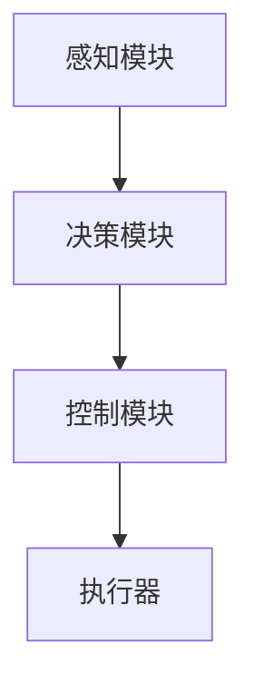

                 

### 大模型在自动驾驶中的应用概述

#### 第1章：大模型与自动驾驶概述

##### 1.1 大模型在自动驾驶中的重要性

大模型在自动驾驶中扮演着至关重要的角色。首先，大模型具备处理大规模数据的能力，这为自动驾驶系统提供了强大的数据处理和分析能力。自动驾驶系统需要实时处理来自传感器、GPS和其他来源的大量数据，这些数据包括图像、雷达信号、激光雷达扫描数据等。大模型能够快速、准确地处理这些数据，从而提高系统的反应速度和决策能力。

其次，大模型在自动驾驶中的核心地位体现在其能够模拟和预测人类驾驶员的行为。通过深度学习和强化学习等算法，大模型可以学习到复杂的人类驾驶行为，并将其应用到自动驾驶系统中。这使得自动驾驶系统能够在多种交通环境中做出智能、安全的决策。

##### 1.2 自动驾驶技术的发展

自动驾驶技术的发展经历了几个阶段，从最初的机械控制到现代的人工智能大模型。早期的自动驾驶系统主要依靠机械控制和预设的规则进行决策。然而，这种方法在面对复杂、动态的交通环境时表现不佳。随着计算机技术和人工智能的发展，现代的自动驾驶系统开始引入深度学习和强化学习等算法，使得系统能够自主学习、适应和应对各种交通场景。

自动驾驶技术的演进不仅提高了车辆的智能化水平，还提升了车辆的安全性和舒适性。随着大模型的应用，自动驾驶车辆能够在复杂的城市道路、高速公路和复杂交通环境中安全行驶，减少交通事故的发生。

#### 第2章：大模型技术基础

##### 2.1 自动驾驶大模型架构

自动驾驶大模型通常包括感知、决策、控制三个核心模块。感知模块负责收集并处理来自各种传感器的数据，如摄像头、雷达、激光雷达等。决策模块基于感知模块提供的信息，进行路径规划和行为决策，确定车辆的行驶方向和速度。控制模块则将决策模块的结果转化为具体的控制指令，如转向、加速、刹车等，以实现车辆的自主驾驶。

以下是一个简单的Mermaid流程图，展示了自动驾驶大模型的基本架构：



##### 2.2 大模型核心算法原理

自动驾驶大模型的核心算法包括卷积神经网络（CNN）、循环神经网络（RNN）和深度强化学习（DRL）。

- **卷积神经网络（CNN）**：CNN 是一种深度学习算法，专门用于图像识别和处理。在自动驾驶中，CNN 用于处理摄像头捕捉到的图像数据，识别道路标志、车辆、行人等关键信息。CNN 的优势在于其能够自动学习图像中的特征，提高感知的准确性。

- **循环神经网络（RNN）**：RNN 是一种用于处理序列数据的神经网络，其在自动驾驶中的应用主要体现在决策和控制任务中。RNN 能够处理连续的传感器数据，如速度、加速度等，从而实现对车辆行为的预测和规划。

- **深度强化学习（DRL）**：DRL 是一种通过试错和奖励机制进行学习的算法，其在自动驾驶中的应用主要包括路径规划和行为决策。DRL 通过不断尝试和反馈，优化决策过程，提高自动驾驶系统的智能水平。

##### 2.3 大模型数学模型与公式

在自动驾驶大模型中，数学模型和公式是理解和实现核心算法的基础。以下分别介绍感知、决策和控制模块的数学模型。

- **感知模块数学模型**：

  感知模块的主要任务是识别和理解传感器数据。假设我们使用 CNN 作为感知算法，其数学模型可以表示为：

  $$ 
  f(x) = \sigma(W \cdot x + b) 
  $$

  其中，$x$ 表示输入数据，$W$ 和 $b$ 分别表示权重和偏置，$\sigma$ 表示激活函数。

  在自动驾驶中，感知模块可以用于目标检测、场景分割等任务。以下是一个简单的目标检测模型示例：

  $$
  \hat{y} = \text{softmax}(\text{CNN}(x)) 
  $$

  其中，$\hat{y}$ 表示预测的目标类别，$\text{softmax}$ 函数用于将 CNN 的输出转换为概率分布。

- **决策模块数学模型**：

  决策模块的主要任务是生成合理的行驶路径和行为。假设我们使用 RNN 作为决策算法，其数学模型可以表示为：

  $$
  h_t = \text{RNN}(h_{t-1}, x_t) 
  $$

  其中，$h_t$ 表示第 $t$ 个时间步的隐藏状态，$x_t$ 表示第 $t$ 个时间步的输入数据。

  在自动驾驶中，决策模块可以用于路径规划和行为预测。以下是一个简单的路径规划模型示例：

  $$
  \hat{p}_t = \text{RNN}(p_{t-1}, x_t) 
  $$

  其中，$\hat{p}_t$ 表示第 $t$ 个时间步的预测路径，$p_{t-1}$ 表示第 $t-1$ 个时间步的预测路径。

- **控制模块数学模型**：

  控制模块的主要任务是生成控制指令，以实现自动驾驶车辆的自主驾驶。假设我们使用 DRL 作为控制算法，其数学模型可以表示为：

  $$
  \pi(\text{action} | \text{state}) = \text{softmax}(\text{DRL}(\text{state})) 
  $$

  其中，$\text{action}$ 表示控制指令，如加速、减速、转向等，$\text{state}$ 表示车辆的状态信息。

  在自动驾驶中，控制模块可以用于速度控制、转向控制等任务。以下是一个简单的速度控制模型示例：

  $$
  \hat{v}_t = \text{DRL}(v_{t-1}, x_t) 
  $$

  其中，$\hat{v}_t$ 表示第 $t$ 个时间步的预测速度，$v_{t-1}$ 表示第 $t-1$ 个时间步的预测速度。

通过上述数学模型和公式的讲解，我们能够更好地理解自动驾驶大模型的工作原理和实现方法。在接下来的章节中，我们将进一步探讨大模型在自动驾驶中的应用案例和实践。 

#### 第3章：大模型在自动驾驶感知中的应用

##### 3.1 感知任务与数据集

感知是自动驾驶系统的核心组成部分，其主要任务是从各种传感器获取环境信息，包括摄像头、雷达、激光雷达等。感知任务包括目标检测、场景分割、障碍物识别等。这些任务对于自动驾驶系统的安全性和稳定性至关重要。

自动驾驶感知任务常用的数据集包括：

- **Kitti 数据集**：Kitti 数据集是自动驾驶领域最著名的公开数据集之一，包含大量图像、激光雷达数据和标注信息，广泛应用于目标检测、追踪、场景分割等任务。

- **Waymo 数据集**：Waymo 数据集由谷歌旗下的自动驾驶公司 Waymo 提供，包含丰富的图像、激光雷达和 GPS 数据，以及详细的场景标注信息。

- **Nuscene 数据集**：Nuscene 数据集由腾讯 AI 实验室提供，包含纽约市和新加坡的自动驾驶测试数据，涵盖了多种交通环境和场景。

##### 3.2 感知模型实现与优化

感知模型的实现通常涉及以下几个步骤：

1. **数据预处理**：包括图像归一化、数据增强、异常值处理等，以提高模型的泛化能力和鲁棒性。

2. **特征提取**：使用卷积神经网络（CNN）提取图像特征。常见的 CNN 模型包括 VGG、ResNet、Inception 等。

3. **分类器设计**：在特征提取的基础上，设计分类器进行目标检测和场景分割。常用的分类器包括深度神经网络（DNN）、支持向量机（SVM）等。

以下是一个简单的感知模型实现示例，使用 Python 和 TensorFlow：

```python
import tensorflow as tf
from tensorflow.keras.models import Sequential
from tensorflow.keras.layers import Conv2D, MaxPooling2D, Flatten, Dense

# 构建卷积神经网络模型
model = Sequential()
model.add(Conv2D(32, (3, 3), activation='relu', input_shape=(224, 224, 3)))
model.add(MaxPooling2D((2, 2)))
model.add(Conv2D(64, (3, 3), activation='relu'))
model.add(MaxPooling2D((2, 2)))
model.add(Conv2D(128, (3, 3), activation='relu'))
model.add(MaxPooling2D((2, 2)))
model.add(Flatten())
model.add(Dense(1024, activation='relu'))
model.add(Dense(1, activation='sigmoid'))

# 编译模型
model.compile(optimizer='adam', loss='binary_crossentropy', metrics=['accuracy'])

# 训练模型
model.fit(x_train, y_train, epochs=10, batch_size=32, validation_data=(x_val, y_val))
```

在感知模型优化方面，常见的方法包括：

- **数据增强**：通过旋转、缩放、裁剪、颜色变换等方式增加训练数据的多样性，提高模型的泛化能力。

- **模型压缩**：通过剪枝、量化、知识蒸馏等技术减少模型参数数量，降低模型复杂性，提高推理速度。

- **迁移学习**：利用预训练模型进行微调，减少训练数据的需求，提高模型在特定任务上的性能。

通过上述方法和步骤，我们可以实现高性能的自动驾驶感知模型，为后续的决策和控制提供可靠的数据支持。在下一节中，我们将进一步探讨大模型在自动驾驶决策中的应用。

