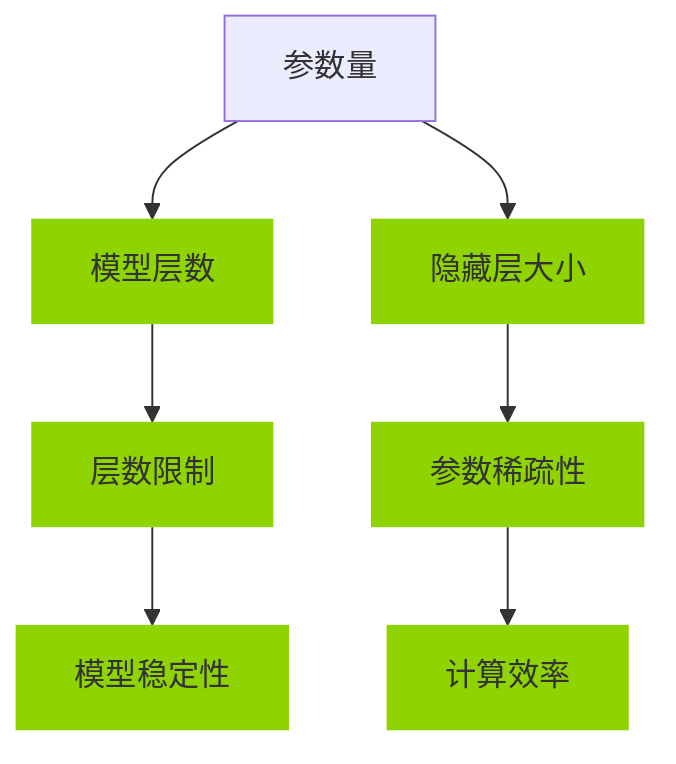

                 

# 大模型对长文本文档的理解与表征

## 概述

近年来，随着人工智能技术的快速发展，大模型（也称为巨型模型或超大规模模型）在自然语言处理（NLP）领域取得了显著的突破。这些大模型，如 GPT-3、BERT、T5 等，凭借其庞大的参数量和强大的表征能力，能够对长文本文档进行深入的理解与表征。本文将探讨大模型的原理与机制，深入分析其数学基础、架构设计、核心算法以及在实际应用中的具体案例，旨在为读者提供一幅全面、系统的理解框架。

本文将分为以下几个部分：

1. **大模型的原理与机制**：介绍大模型的基本概念、历史发展及其数学基础。
2. **大模型的架构与设计**：详细讲解 Transformer 和 BERT 等大模型的架构与设计原理。
3. **大模型的核心算法原理**：深入探讨优化算法、正则化技术、预训练与微调等核心算法。
4. **大模型在文本处理中的应用**：分析大模型在文本生成、机器翻译、自然语言理解等领域的应用。
5. **大模型在长文本处理中的应用**：探讨大模型在长文本理解与表征中的挑战与解决方案。
6. **大模型在文本理解与表征中的前沿研究**：介绍大模型架构的创新、新型应用场景以及未来发展趋势。
7. **大模型在实际应用中的案例研究**：通过具体案例展示大模型在实际项目中的应用效果。

通过以上几个部分，我们将逐步剖析大模型对长文本文档的理解与表征过程，揭示其背后的技术原理和应用价值。

## 第一部分：大模型的原理与机制

### 第1章：大模型的基本概念与历史发展

#### 1.1 大模型的定义与分类

大模型（也称为巨型模型或超大规模模型）通常指的是参数量达到数十亿甚至千亿级别的人工智能模型。这些模型之所以称为“大”，是因为它们的参数量远超传统模型，能够捕捉更复杂的语言模式和知识结构。

大模型的分类可以从多个维度进行：

- **按模型结构分类**：如 Transformer、CNN、RNN 等。
- **按训练数据规模分类**：如基于大规模语料库的预训练模型。
- **按应用领域分类**：如文本生成、机器翻译、自然语言理解等。

大模型的出现并非一蹴而就，其历史发展可以追溯到深度学习技术的发展。在传统机器学习时代，模型的参数量通常在数万到数百万级别。随着深度学习的兴起，尤其是卷积神经网络（CNN）和循环神经网络（RNN）的出现，模型的规模逐渐增大。但是，真正推动大模型崛起的则是大规模数据集的出现和计算能力的提升。

#### 1.2 大模型的历史发展

大模型的历史发展可以分为以下几个阶段：

- **从传统模型到深度学习**：传统机器学习模型，如基于规则的方法和统计模型，存在一些局限性。深度学习的出现，尤其是神经网络、卷积神经网络和循环神经网络的发展，使得模型规模逐渐增大，参数量达到百万级别。

- **深度学习的崛起**：随着深度学习技术的不断发展，尤其是卷积神经网络（CNN）和循环神经网络（RNN）的出现，模型的规模逐渐增大。特别是 RNN 的变体——长短期记忆网络（LSTM），在序列数据处理中表现出了强大的能力。

- **大规模数据集的出现**：互联网的快速发展带来了海量的文本数据，如 Web 语料库、Common Crawl 等。这些大规模数据集为模型的训练提供了丰富的素材。

- **计算能力的提升**：GPU、TPU 等专用硬件的出现，极大地提升了模型的训练速度和效率。

- **预训练策略的提出**：预训练（Pre-training）是一种在特定任务之前，将模型在大规模数据集上进行训练的方法。BERT、GPT 等大模型的提出，将预训练技术推向了高潮。这些模型通过在无监督数据上预训练，然后再进行特定任务的微调，取得了显著的效果。

### 1.3 大模型的代表性模型

- **GPT-3**：由 OpenAI 于 2020 年推出，具有 1750 亿个参数，是迄今为止最大的语言模型。GPT-3 的出现标志着大模型在文本生成、机器翻译、自然语言理解等领域的应用达到了一个新的高度。

- **BERT**：由 Google 于 2018 年推出，具有数百万个参数。BERT 通过双向编码器结构，实现了对上下文信息的深入理解，在自然语言理解任务中表现优异。

- **T5**：由 Google 推出，其目标是“一个模型，解决所有任务”。T5 通过将任务转换为文本到文本的格式，实现了对多种自然语言处理任务的统一处理。

大模型的历史发展是技术进步、数据积累和计算能力提升共同推动的结果。这些大模型的出现，不仅提升了 NLP 领域的性能，也为其他领域的人工智能应用提供了新的思路和工具。

#### 1.4 大模型在 NLP 领域的应用

大模型在 NLP 领域的应用主要集中在以下几个方面：

- **文本生成**：大模型能够生成连贯、自然的文本，广泛应用于文章写作、对话系统、机器翻译等场景。
- **机器翻译**：大模型通过学习大规模的双语数据，能够实现高质量的双语翻译。
- **自然语言理解**：大模型能够对文本进行深入的理解，包括语义分析、情感分析、实体识别等任务。
- **问答系统**：大模型能够理解和回答用户的问题，广泛应用于客服、智能助手等场景。

大模型的应用不仅提升了 NLP 领域的性能，也推动了其他领域的人工智能应用，如金融、医疗、教育等。

### 1.5 大模型的挑战与未来发展方向

尽管大模型在 NLP 领域取得了显著的成功，但仍然面临一些挑战：

- **计算资源消耗**：大模型的训练和推理需要大量的计算资源，这对硬件和算法都提出了更高的要求。
- **数据隐私**：大模型在训练过程中需要大量数据，这可能涉及用户隐私和数据安全问题。
- **模型解释性**：大模型的决策过程往往不透明，缺乏解释性，这对实际应用带来了一定的困难。

未来，大模型的发展方向可能包括以下几个方面：

- **模型压缩与量化**：通过模型压缩和量化技术，降低模型的计算和存储需求，使其能够在更多的设备和场景中应用。
- **多模态学习**：将文本与其他模态（如图像、音频）进行融合，实现更丰富的表征。
- **可解释性增强**：通过改进算法和模型结构，提升大模型的解释性，使其更易于理解和应用。

总之，大模型是 NLP 领域的重要突破，其应用前景广阔。同时，我们还需要克服一系列挑战，才能充分发挥其潜力。

### 1.6 大模型的基本概念与联系

为了更好地理解大模型，我们首先需要了解其核心概念，包括参数、层数、隐藏层大小等。以下是一个简单的 Mermaid 流程图，展示这些概念之间的联系：



- **参数量（A）**：指模型中的参数总数，是衡量模型规模的重要指标。
- **模型层数（B）**：指模型的深度，即神经网络中的层数。
- **隐藏层大小（C）**：指每个隐藏层中的神经元数量。
- **层数限制（D）**：过深的模型可能导致计算复杂度过高，出现梯度消失或梯度爆炸等问题。
- **参数稀疏性（E）**：通过稀疏性降低模型的参数量，提高计算效率。
- **模型稳定性（F）**：模型在训练过程中需要保持稳定性，以避免过拟合。
- **计算效率（G）**：高效的计算可以降低训练和推理的成本。

这个流程图为我们提供了一个直观的框架，帮助我们理解大模型的核心概念及其相互关系。

### 1.7 大模型的数学基础

要深入理解大模型，我们需要掌握一些基本的数学概念，包括向量和矩阵的基本操作、线性代数基础以及概率论与统计基础。

#### 2.1 向量和矩阵的基本操作

- **向量与矩阵的定义**：向量是数学中的一个基本概念，通常表示为一系列有序数。矩阵则是多个向量的组合，通常表示为矩形阵列。

- **向量与矩阵的运算**：
  - **加法、减法**：向量之间的加法和减法运算。
  - **数乘**：向量与标量（数值）之间的乘法运算。
  - **内积、外积**：内积（点积）和外积（叉积）是向量之间的运算，用于计算向量的相似度或旋转。
  - **矩阵乘法**：矩阵与矩阵之间的乘法运算，用于计算线性变换。

#### 2.2 线性代数基础

- **线性方程组**：线性方程组是求解一组线性方程的数学问题。常用的解法包括高斯消元法、矩阵分解等。

- **特征值与特征向量**：特征值与特征向量是矩阵理论中的重要概念，它们可以帮助我们理解矩阵的内在性质。

#### 2.3 概率论与统计基础

- **概率分布**：概率分布是描述随机变量取值的函数。常见的概率分布包括伯努利分布、正态分布、泊松分布等。

- **统计量与假设检验**：统计量是样本的函数，用于对总体参数进行估计和检验。常见的统计量包括均值、方差、标准差等。

### 1.8 总结

通过上述章节的讲解，我们对大模型的基本概念、历史发展、数学基础以及应用有了初步的了解。接下来，我们将深入探讨大模型的架构与设计，进一步揭示其内部工作原理。

## 第二部分：大模型的架构与设计

### 第2章：大模型的数学基础

在深入探讨大模型的架构与设计之前，我们需要先了解一些基础的数学概念，这些概念对于理解大模型的工作原理至关重要。本章节将介绍向量和矩阵的基本操作、线性代数基础以及概率论与统计基础，为后续章节的讨论奠定基础。

#### 2.1 向量和矩阵的基本操作

**向量与矩阵的定义**：向量是数学中的一个基本概念，通常表示为一系列有序数，如 $\textbf{v} = [v_1, v_2, ..., v_n]$。矩阵则是多个向量的组合，通常表示为矩形阵列，如 $A = \begin{bmatrix} a_{11} & a_{12} & \cdots & a_{1n} \\ a_{21} & a_{22} & \cdots & a_{2n} \\ \vdots & \vdots & \ddots & \vdots \\ a_{m1} & a_{m2} & \cdots & a_{mn} \end{bmatrix}$。

**向量与矩阵的运算**：

1. **加法与减法**：
   - 向量加法与减法是向量的每个对应元素进行相同的运算，例如 $\textbf{v} + \textbf{w} = [v_1 + w_1, v_2 + w_2, ..., v_n + w_n]$。
   - 矩阵加法与减法是对对应元素进行相同的运算，例如 $A + B = \begin{bmatrix} a_{11} + b_{11} & a_{12} + b_{12} & \cdots & a_{1n} + b_{1n} \\ a_{21} + b_{21} & a_{22} + b_{22} & \cdots & a_{2n} + b_{2n} \\ \vdots & \vdots & \ddots & \vdots \\ a_{m1} + b_{m1} & a_{m2} + b_{m2} & \cdots & a_{mn} + b_{mn} \end{bmatrix}$。

2. **数乘**：
   - 向量数乘是每个元素与一个标量相乘，例如 $c\textbf{v} = [cv_1, cv_2, ..., cv_n]$。
   - 矩阵数乘是每个元素与一个标量相乘，例如 $cA = \begin{bmatrix} ca_{11} & ca_{12} & \cdots & ca_{1n} \\ ca_{21} & ca_{22} & \cdots & ca_{2n} \\ \vdots & \vdots & \ddots & \vdots \\ ca_{m1} & ca_{m2} & \cdots & ca_{mn} \end{bmatrix}$。

3. **内积与外积**：
   - 向量内积（点积）是两个向量的对应元素相乘后求和，例如 $\textbf{v} \cdot \textbf{w} = v_1w_1 + v_2w_2 + ... + v_nw_n$。
   - 向量外积（叉积）是两个三维向量的对应元素相乘后构成的新向量，例如 $\textbf{v} \times \textbf{w} = \begin{bmatrix} v_2w_3 - v_3w_2 \\ v_3w_1 - v_1w_3 \\ v_1w_2 - v_2w_1 \end{bmatrix}$。

4. **矩阵乘法**：
   - 矩阵乘法是将一个矩阵的行与另一个矩阵的列进行对应元素相乘后求和，例如 $AB = \begin{bmatrix} \sum_{j=1}^{n} a_{ij}b_{ji} \end{bmatrix}$。

#### 2.2 线性代数基础

**线性方程组**：线性方程组是求解一组线性方程的数学问题。常见的线性方程组形式为：
$$
\begin{align*}
a_{11}x_1 + a_{12}x_2 + ... + a_{1n}x_n &= b_1 \\
a_{21}x_1 + a_{22}x_2 + ... + a_{2n}x_n &= b_2 \\
&\vdots \\
a_{m1}x_1 + a_{m2}x_2 + ... + a_{mn}x_n &= b_m
\end{align*}
$$
常用的解法包括高斯消元法和矩阵分解。

**特征值与特征向量**：特征值与特征向量是矩阵理论中的重要概念。给定一个方阵 $A$，如果存在一个非零向量 $\textbf{v}$ 和一个标量 $\lambda$，使得 $A\textbf{v} = \lambda\textbf{v}$，则 $\lambda$ 是矩阵 $A$ 的一个特征值，$\textbf{v}$ 是对应的特征向量。

**特征值与特征向量的计算**：
1. 求解特征值：计算矩阵 $A$ 的特征多项式 $f(\lambda) = \det(A - \lambda I)$，解出特征值 $\lambda$。
2. 求解特征向量：对于每个特征值 $\lambda$，解线性方程组 $(A - \lambda I)\textbf{v} = \textbf{0}$，得到对应的特征向量。

#### 2.3 概率论与统计基础

**概率分布**：概率分布是描述随机变量取值的函数。常见的概率分布包括伯努利分布、正态分布、泊松分布等。

- **伯努利分布**：伯努利试验只有两种可能结果，成功或失败，概率分别为 $p$ 和 $1-p$。
- **正态分布**：正态分布是最常见的连续概率分布，其概率密度函数为 $f(x) = \frac{1}{\sqrt{2\pi\sigma^2}}e^{-\frac{(x-\mu)^2}{2\sigma^2}}$。
- **泊松分布**：泊松分布描述在固定时间段内，发生某事件的次数的概率分布，其概率质量函数为 $f(k) = \frac{\lambda^k e^{-\lambda}}{k!}$。

**统计量与假设检验**：统计量是样本的函数，用于对总体参数进行估计和检验。常见的统计量包括均值、方差、标准差等。

- **均值**：样本均值是样本数据的平均值，用于估计总体均值。
- **方差**：样本方差是样本数据与均值偏差的平方和的平均值，用于估计总体方差。
- **标准差**：样本标准差是方差的平方根，用于估计总体标准差。

**假设检验**：假设检验是用于验证某个假设是否成立的统计方法。常见的假设检验方法包括 t 检验、卡方检验等。

通过上述数学基础的学习，我们可以更好地理解大模型的工作原理和架构设计，为后续章节的讨论打下坚实的基础。

### 2.4 向量和矩阵的基本操作

**向量与矩阵的定义**：

向量可以看作是具有特定长度的有序数列，通常使用小写字母表示，如 $\textbf{v} = [v_1, v_2, ..., v_n]$。在 NLP 领域中，向量常用于表示词向量、句子向量等。

矩阵则是一个二维数组，由多个向量组成，通常使用大写字母表示，如 $A = \begin{bmatrix} a_{11} & a_{12} & \cdots & a_{1n} \\ a_{21} & a_{22} & \cdots & a_{2n} \\ \vdots & \vdots & \ddots & \vdots \\ a_{m1} & a_{m2} & \cdots & a_{mn} \end{bmatrix}$。在 NLP 中，矩阵常用于表示词矩阵、句子矩阵等。

**向量与矩阵的运算**：

1. **加法与减法**：

向量加法与减法是指两个向量的对应元素相加或相减，得到一个新的向量。例如，对于向量 $\textbf{v} = [v_1, v_2, ..., v_n]$ 和 $\textbf{w} = [w_1, w_2, ..., w_n]$，它们的加法为 $\textbf{v} + \textbf{w} = [v_1 + w_1, v_2 + w_2, ..., v_n + w_n]$，减法为 $\textbf{v} - \textbf{w} = [v_1 - w_1, v_2 - w_2, ..., v_n - w_n]$。

矩阵加法与减法是指两个矩阵的对应元素相加或相减，得到一个新的矩阵。例如，对于矩阵 $A = \begin{bmatrix} a_{11} & a_{12} & \cdots & a_{1n} \\ a_{21} & a_{22} & \cdots & a_{2n} \\ \vdots & \vdots & \ddots & \vdots \\ a_{m1} & a_{m2} & \cdots & a_{mn} \end{bmatrix}$ 和 $B = \begin{bmatrix} b_{11} & b_{12} & \cdots & b_{1n} \\ b_{21} & b_{22} & \cdots & b_{2n} \\ \vdots & \vdots & \ddots & \vdots \\ b_{m1} & b_{m2} & \cdots & b_{mn} \end{bmatrix}$，它们的加法为 $A + B = \begin{bmatrix} a_{11} + b_{11} & a_{12} + b_{12} & \cdots & a_{1n} + b_{1n} \\ a_{21} + b_{21} & a_{22} + b_{22} & \cdots & a_{2n} + b_{2n} \\ \vdots & \vdots & \ddots & \vdots \\ a_{m1} + b_{m1} & a_{m2} + b_{m2} & \cdots & a_{mn} + b_{mn} \end{bmatrix}$，减法为 $A - B = \begin{bmatrix} a_{11} - b_{11} & a_{12} - b_{12} & \cdots & a_{1n} - b_{1n} \\ a_{21} - b_{21} & a_{22} - b_{22} & \cdots & a_{2n} - b_{2n} \\ \vdots & \vdots & \ddots & \vdots \\ a_{m1} - b_{m1} & a_{m2} - b_{m2} & \cdots & a_{mn} - b_{mn} \end{bmatrix}$。

2. **数乘**：

向量数乘是指将向量与一个标量相乘，得到一个新的向量。例如，对于向量 $\textbf{v} = [v_1, v_2, ..., v_n]$ 和标量 $c$，它们的数乘为 $c\textbf{v} = [cv_1, cv_2, ..., cv_n]$。

矩阵数乘是指将矩阵与一个标量相乘，得到一个新的矩阵。例如，对于矩阵 $A = \begin{bmatrix} a_{11} & a_{12} & \cdots & a_{1n} \\ a_{21} & a_{22} & \cdots & a_{2n} \\ \vdots & \vdots & \ddots & \vdots \\ a_{m1} & a_{m2} & \cdots & a_{mn} \end{bmatrix}$ 和标量 $c$，它们的数乘为 $cA = \begin{bmatrix} ca_{11} & ca_{12} & \cdots & ca_{1n} \\ ca_{21} & ca_{22} & \cdots & ca_{2n} \\ \vdots & \vdots & \ddots & \vdots \\ ca_{m1} & ca_{m2} & \cdots & ca_{mn} \end{bmatrix}$。

3. **内积与外积**：

内积（点积）是指两个向量的对应元素相乘后求和，例如 $\textbf{v} \cdot \textbf{w} = v_1w_1 + v_2w_2 + ... + v_nw_n$。

外积（叉积）是指两个三维向量的对应元素相乘后构成的新向量，例如 $\textbf{v} \times \textbf{w} = \begin{bmatrix} v_2w_3 - v_3w_2 \\ v_3w_1 - v_1w_3 \\ v_1w_2 - v_2w_1 \end{bmatrix}$。

4. **矩阵乘法**：

矩阵乘法是指将一个矩阵的行与另一个矩阵的列进行对应元素相乘后求和，例如 $AB = \begin{bmatrix} \sum_{j=1}^{n} a_{ij}b_{ji} \end{bmatrix}$。

通过上述向量与矩阵的基本操作，我们可以对 NLP 任务中的数据表示进行有效的运算和处理。

### 2.5 线性代数基础

线性代数是数学中的一个重要分支，对于理解和设计大模型至关重要。在本节中，我们将探讨线性方程组、特征值与特征向量以及概率论与统计基础。

**线性方程组**：

线性方程组是一组包含多个线性方程的数学问题，通常表示为：
$$
\begin{align*}
a_{11}x_1 + a_{12}x_2 + ... + a_{1n}x_n &= b_1 \\
a_{21}x_1 + a_{22}x_2 + ... + a_{2n}x_n &= b_2 \\
&\vdots \\
a_{m1}x_1 + a_{m2}x_2 + ... + a_{mn}x_n &= b_m
\end{align*}
$$

解决线性方程组的方法有多种，其中最常用的是高斯消元法。高斯消元法的基本思想是通过一系列的行变换（如行交换、行乘以标量、行相加），将线性方程组化为上三角形式，进而求解。

**特征值与特征向量**：

特征值与特征向量是矩阵理论中的重要概念。给定一个方阵 $A$，如果存在一个非零向量 $\textbf{v}$ 和一个标量 $\lambda$，使得 $A\textbf{v} = \lambda\textbf{v}$，则 $\lambda$ 是矩阵 $A$ 的一个特征值，$\textbf{v}$ 是对应的特征向量。

计算特征值与特征向量的步骤如下：

1. 计算矩阵 $A$ 的特征多项式 $f(\lambda) = \det(A - \lambda I)$，其中 $I$ 是单位矩阵。
2. 解特征多项式得到特征值 $\lambda$。
3. 对于每个特征值 $\lambda$，解线性方程组 $(A - \lambda I)\textbf{v} = \textbf{0}$，得到对应的特征向量。

特征值与特征向量在矩阵分析中具有重要的应用，如矩阵的对角化、特征值分解等。

**概率论与统计基础**：

概率论与统计学是处理随机事件和数据的数学工具。以下是一些基本概念：

1. **概率分布**：

概率分布是描述随机变量取值的函数。常见的概率分布包括伯努利分布、正态分布、泊松分布等。

   - **伯努利分布**：描述只有两种可能结果的随机试验，成功或失败，概率分别为 $p$ 和 $1-p$。
   - **正态分布**：描述连续随机变量，其概率密度函数为 $f(x) = \frac{1}{\sqrt{2\pi\sigma^2}}e^{-\frac{(x-\mu)^2}{2\sigma^2}}$。
   - **泊松分布**：描述在固定时间段内发生某事件的次数，概率质量函数为 $f(k) = \frac{\lambda^k e^{-\lambda}}{k!}$。

2. **统计量与假设检验**：

统计量是样本的函数，用于对总体参数进行估计和检验。常见的统计量包括均值、方差、标准差等。

   - **均值**：样本均值是样本数据的平均值，用于估计总体均值。
   - **方差**：样本方差是样本数据与均值偏差的平方和的平均值，用于估计总体方差。
   - **标准差**：样本标准差是方差的平方根，用于估计总体标准差。

假设检验是用于验证某个假设是否成立的统计方法。常见的假设检验方法包括 t 检验、卡方检验等。

通过了解线性代数、概率论与统计基础，我们可以更好地理解和设计大模型，解决复杂的 NLP 任务。

### 2.6 Transformer 架构

**Transformer 架构的基本原理**：

Transformer 架构是一种基于自注意力机制的深度学习模型，被广泛应用于自然语言处理（NLP）领域。自注意力机制（Self-Attention）是一种计算方法，通过模型自身去学习不同位置之间的依赖关系，而不是像循环神经网络（RNN）那样逐个处理序列。

**编码器（Encoder）与解码器（Decoder）**：

Transformer 架构包括编码器（Encoder）和解码器（Decoder）两个主要部分。

- **编码器（Encoder）**：编码器的目的是将输入序列（如文本）转换为固定长度的向量表示。编码器由多个编码层（Encoder Layer）堆叠而成，每个编码层包含两个主要子层：自注意力子层（Self-Attention Sublayer）和前馈子层（Feedforward Sublayer）。

- **解码器（Decoder）**：解码器的目的是将编码器的输出转换为输出序列（如文本）。解码器同样由多个解码层（Decoder Layer）堆叠而成，每个解码层包含三个主要子层：自注意力子层（Self-Attention Sublayer）、交叉注意力子层（Cross-Attention Sublayer）和前馈子层（Feedforward Sublayer）。

**自注意力机制（Self-Attention）**：

自注意力机制是 Transformer 架构的核心组件，其基本思想是计算输入序列中每个词与其他词之间的依赖关系，并通过权重将它们结合起来。自注意力机制的计算过程如下：

1. **输入表示**：将输入序列转换为嵌入向量表示，每个词嵌入为一个 $d$ 维的向量。

2. **计算查询（Query）、键（Key）和值（Value）**：对于每个输入词，计算其对应的查询（Query）、键（Key）和值（Value）向量。通常，查询、键和值向量是相同的。

   $$
   \text{Query} = \text{Key} = \text{Value} = \text{Embedding} \odot W_Q, W_K, W_V
   $$

   其中 $\odot$ 表示元素-wise 乘法，$W_Q, W_K, W_V$ 是权重矩阵。

3. **计算注意力分数**：计算每个键与查询之间的点积，并使用 softmax 函数将结果归一化为概率分布。

   $$
   \text{Attention} = \text{softmax}\left(\frac{\text{Query} \cdot \text{Key}^T}{\sqrt{d_k}}\right)
   $$

4. **计算注意力输出**：将注意力分数与值向量相乘，得到每个词的加权表示。

   $$
   \text{Attention Output} = \text{Value} \odot \text{Attention}
   $$

通过自注意力机制，模型可以学习到输入序列中不同词之间的依赖关系，从而更好地捕捉上下文信息。

**Transformer 的关键组件**：

- **多头注意力（Multi-Head Attention）**：多头注意力是一种扩展自注意力机制的方法，通过并行地计算多个注意力头，每个头关注不同的信息，从而提高模型的表示能力。

  $$
  \text{Multi-Head Attention} = \text{Concat}(\text{head}_1, \text{head}_2, ..., \text{head}_h) \odot W_O
  $$

  其中 $h$ 是注意力的头数，$W_O$ 是权重矩阵。

- **前馈网络（Feedforward Network）**：前馈网络是 Transformer 架构中的另一个关键组件，用于对自注意力层的输出进行进一步加工。前馈网络由两个全连接层组成，分别具有尺寸为 $4d$ 的隐藏层。

  $$
  \text{FFN} = \text{ReLU}(X \cdot W_1 + b_1) \cdot W_2 + b_2
  $$

  其中 $X$ 是输入，$W_1, W_2, b_1, b_2$ 是权重和偏置。

通过编码器（Encoder）和解码器（Decoder）的堆叠，以及自注意力机制和前馈网络的应用，Transformer 架构能够实现对长文本的深入理解和表征，从而在 NLP 任务中取得显著的性能提升。

### 2.7 BERT 模型

**BERT（Bidirectional Encoder Representations from Transformers）的基本原理**：

BERT 是一种双向编码器表示模型，由 Google 于 2018 年提出。BERT 的主要思想是通过在无监督数据上进行预训练，学习语言的深层表示，然后再进行特定任务的微调。BERT 的双向编码器结构使其能够捕捉上下文信息，从而在自然语言理解任务中表现出色。

BERT 的主要组件包括：

- **双向编码器（Bidirectional Encoder）**：BERT 的核心组件是双向编码器，由多个 Transformer 编码层堆叠而成。每个编码层包含两个主要子层：自注意力子层（Self-Attention Sublayer）和前馈子层（Feedforward Sublayer）。双向编码器通过自注意力机制捕捉输入序列中的上下文信息，并通过前馈网络进一步加工。

- **预训练策略（Pre-training Strategy）**：BERT 的预训练策略包括两个任务：Masked Language Model（MLM）和 Next Sentence Prediction（NSP）。

  - **Masked Language Model（MLM）**：MLM 任务是指在输入序列中随机遮蔽一些词，并让模型预测这些词。这个任务可以帮助模型学习单词的上下文表示。

  - **Next Sentence Prediction（NSP）**：NSP 任务是指给定两个句子，预测第二个句子是否紧随第一个句子。这个任务可以帮助模型学习句子之间的逻辑关系。

**BERT 的关键组件**：

- **Transformer 编码器（Transformer Encoder）**：BERT 的编码器是由多个 Transformer 编码层堆叠而成，每个编码层包含两个主要子层：自注意力子层（Self-Attention Sublayer）和前馈子层（Feedforward Sublayer）。自注意力子层通过自注意力机制捕捉输入序列中的上下文信息，前馈子层则对自注意力层的输出进行进一步加工。

- **位置编码（Positional Encoding）**：BERT 使用位置编码来为模型提供输入序列的顺序信息。位置编码是通过嵌入向量乘以特定权重矩阵得到的。

- **输入表示（Input Representation）**：BERT 的输入表示由词嵌入（Word Embeddings）、段嵌入（Segment Embeddings）和位置编码（Positional Embeddings）组成。词嵌入是每个词的向量表示，段嵌入用于区分不同句子或段落，位置编码则提供输入序列的顺序信息。

- **输出表示（Output Representation）**：BERT 的输出表示是编码器的最后一个隐藏层，通常使用 [CLS] 标记的向量作为整个序列的表示。这个向量可以作为分类任务的全局特征。

**BERT 的预训练与微调**：

BERT 的训练过程分为两个阶段：预训练和微调。

- **预训练（Pre-training）**：在预训练阶段，BERT 在大规模的无监督数据集上进行训练，学习语言的深层表示。预训练包括两个任务：MLM 和 NSP。

  - **Masked Language Model（MLM）**：在输入序列中随机遮蔽一些词，并让模型预测这些词。
  - **Next Sentence Prediction（NSP）**：给定两个句子，预测第二个句子是否紧随第一个句子。

- **微调（Fine-tuning）**：在预训练的基础上，BERT 对特定任务的数据集进行微调，以适应特定任务的需求。微调通常包括修改模型的一部分层，如最后一个隐藏层或分类层，以适应新任务。

通过预训练和微调，BERT 能够在大规模无监督数据集上学习到丰富的语言知识，并在特定任务上取得优异的性能。

BERT 的提出标志着 NLP 领域的一个重要进展，其双向编码器结构和预训练策略为模型提供了强大的表征能力，从而在自然语言理解任务中取得了显著的突破。

### 2.8 Transformer 与 BERT 的比较

**Transformer 与 BERT 的相同点**：

- **基于 Transformer 架构**：Transformer 和 BERT 都是基于 Transformer 架构，使用自注意力机制来捕捉输入序列中的依赖关系。
- **预训练与微调**：两者都采用预训练和微调的策略，通过在大规模数据集上进行预训练，然后在特定任务上进行微调。
- **双向编码器结构**：Transformer 和 BERT 的编码器都是双向的，能够同时考虑输入序列的前后文信息。

**Transformer 与 BERT 的不同点**：

- **应用范围**：
  - **Transformer**：Transformer 架构本身是一种通用的序列到序列模型，可以应用于各种 NLP 任务，如文本生成、机器翻译、文本分类等。
  - **BERT**：BERT 是专门为自然语言理解任务设计的，特别是在问答系统和文本分类任务中表现出色。

- **预训练任务**：
  - **Transformer**：Transformer 的预训练任务通常包括语言建模（Language Modeling）和序列预测（Sequence Prediction）等。
  - **BERT**：BERT 的预训练任务包括 Masked Language Model（MLM）和 Next Sentence Prediction（NSP）等。

- **模型结构**：
  - **Transformer**：Transformer 模型结构相对简单，主要由编码器和解码器组成，包括多个自注意力层和前馈网络。
  - **BERT**：BERT 的模型结构更为复杂，包括多个 Transformer 编码层和特殊的输入表示和输出表示。

- **训练数据集**：
  - **Transformer**：Transformer 的训练数据集可以是任意大规模文本数据集，如维基百科、新闻语料库等。
  - **BERT**：BERT 的训练数据集通常是大规模的清洁文本数据集，如 BooksCorpus、Common Crawl 等。

通过对比 Transformer 和 BERT，我们可以看到两者在应用范围、预训练任务、模型结构和训练数据集等方面存在一些差异。这些差异使得两者在 NLP 领域中各自有着独特的优势和适用场景。

### 第3章：大模型的架构与设计

#### 3.1 Transformer 架构

Transformer 架构是一种基于自注意力机制的深度学习模型，自 2017 年提出以来，它已经在自然语言处理（NLP）领域取得了显著的突破。Transformer 的核心思想是通过自注意力机制来捕捉序列中的依赖关系，从而在文本生成、机器翻译等任务中表现出色。以下将详细讲解 Transformer 的基本原理、关键组件以及其工作流程。

#### 3.1.1 Transformer 的基本原理

Transformer 架构的核心组件是自注意力机制（Self-Attention），它允许模型在处理序列时同时考虑所有位置的信息。自注意力机制通过计算输入序列中每个词与其他词之间的依赖关系，从而为每个词生成一个加权表示。这个过程可以分为以下几个步骤：

1. **输入表示**：将输入序列（如单词序列）转换为嵌入向量表示。每个词嵌入为一个固定维度的向量。
2. **计算查询（Query）、键（Key）和值（Value）**：对于每个词，计算其对应的查询（Query）、键（Key）和值（Value）向量。通常，查询、键和值向量是相同的，通过加权矩阵进行变换。
3. **计算注意力分数**：计算每个键与查询之间的点积，并使用 softmax 函数将结果归一化为概率分布，表示每个词对其他词的依赖程度。
4. **计算注意力输出**：将注意力分数与值向量相乘，得到每个词的加权表示。

#### 3.1.2 Transformer 的关键组件

1. **编码器（Encoder）与解码器（Decoder）**：

   Transformer 架构包括编码器（Encoder）和解码器（Decoder）两个主要部分。

   - **编码器（Encoder）**：编码器的目的是将输入序列（如文本）转换为固定长度的向量表示。编码器由多个编码层（Encoder Layer）堆叠而成，每个编码层包含两个主要子层：自注意力子层（Self-Attention Sublayer）和前馈子层（Feedforward Sublayer）。

   - **解码器（Decoder）**：解码器的目的是将编码器的输出转换为输出序列（如文本）。解码器同样由多个解码层（Decoder Layer）堆叠而成，每个解码层包含三个主要子层：自注意力子层（Self-Attention Sublayer）、交叉注意力子层（Cross-Attention Sublayer）和前馈子层（Feedforward Sublayer）。

2. **自注意力机制（Self-Attention）**：

   自注意力机制是 Transformer 架构的核心组件，通过计算输入序列中每个词与其他词之间的依赖关系，为每个词生成一个加权表示。

3. **多头注意力（Multi-Head Attention）**：

   多头注意力是一种扩展自注意力机制的方法，通过并行地计算多个注意力头，每个头关注不同的信息，从而提高模型的表示能力。

4. **前馈网络（Feedforward Network）**：

   前馈网络是 Transformer 架构中的另一个关键组件，用于对自注意力层的输出进行进一步加工。前馈网络由两个全连接层组成，分别具有尺寸为 $4d$ 的隐藏层。

#### 3.1.3 Transformer 的工作流程

1. **编码器（Encoder）工作流程**：

   - **嵌入层（Embedding Layer）**：将输入序列（如单词序列）转换为嵌入向量表示。每个词嵌入为一个固定维度的向量。
   - **位置编码（Positional Encoding）**：为每个词添加位置信息，以区分输入序列中的不同词。
   - **自注意力层（Self-Attention Layer）**：通过自注意力机制计算输入序列中每个词与其他词之间的依赖关系，为每个词生成一个加权表示。
   - **前馈层（Feedforward Layer）**：对自注意力层的输出进行进一步加工，通过两个全连接层增加模型的非线性能力。

2. **解码器（Decoder）工作流程**：

   - **嵌入层（Embedding Layer）**：将输入序列（如单词序列）转换为嵌入向量表示。每个词嵌入为一个固定维度的向量。
   - **位置编码（Positional Encoding）**：为每个词添加位置信息，以区分输入序列中的不同词。
   - **自注意力层（Self-Attention Layer）**：通过自注意力机制计算输入序列中每个词与其他词之间的依赖关系，为每个词生成一个加权表示。
   - **交叉注意力层（Cross-Attention Layer）**：通过交叉注意力机制计算解码器当前词与编码器输出之间的依赖关系。
   - **前馈层（Feedforward Layer）**：对自注意力层和交叉注意力层的输出进行进一步加工，通过两个全连接层增加模型的非线性能力。

3. **输出层（Output Layer）**：

   - **分类层（Classification Layer）**：将解码器的输出进行分类，以预测输入序列的标签。
   - **回归层（Regression Layer）**：将解码器的输出进行回归，以预测输入序列的数值。

通过上述工作流程，Transformer 架构能够实现对长文本的深入理解和表征，从而在 NLP 任务中取得优异的性能。

### 第4章：大模型的核心算法原理

#### 4.1 优化算法

在深度学习领域，优化算法起着至关重要的作用。优化算法用于调整模型的参数，以最小化损失函数，从而提高模型的性能。在本节中，我们将探讨几种常用的优化算法，包括梯度下降法、动量法和 Adam 优化器。

**4.1.1 梯度下降法**

梯度下降法是最基本的优化算法之一。它的核心思想是通过计算损失函数关于模型参数的梯度，并沿着梯度的反方向更新参数，从而逐步减少损失。

梯度下降法的计算过程可以表示为：
$$
\theta_{t+1} = \theta_{t} - \alpha \nabla_{\theta} J(\theta)
$$
其中，$\theta$ 表示模型参数，$J(\theta)$ 表示损失函数，$\alpha$ 表示学习率，$\nabla_{\theta} J(\theta)$ 表示损失函数关于参数的梯度。

梯度下降法的主要步骤如下：

1. 初始化模型参数 $\theta$。
2. 计算损失函数 $J(\theta)$。
3. 计算梯度 $\nabla_{\theta} J(\theta)$。
4. 更新参数 $\theta$：$\theta_{t+1} = \theta_{t} - \alpha \nabla_{\theta} J(\theta)$。
5. 重复步骤 2 到步骤 4，直到收敛或达到预设的迭代次数。

**4.1.2 动量法**

动量法是一种加速梯度下降的方法。它的核心思想是引入一个动量项，以减少梯度的振荡，从而提高收敛速度。

动量法的计算过程可以表示为：
$$
\theta_{t+1} = \theta_{t} - \alpha \nabla_{\theta} J(\theta) + \beta \nabla_{\theta} J(\theta)
$$
其中，$\beta$ 表示动量系数。

动量法的步骤如下：

1. 初始化模型参数 $\theta$ 和动量项 $m$。
2. 计算损失函数 $J(\theta)$。
3. 计算梯度 $\nabla_{\theta} J(\theta)$。
4. 更新动量项 $m$：$m = \beta m + (1 - \beta) \nabla_{\theta} J(\theta)$。
5. 更新参数 $\theta$：$\theta_{t+1} = \theta_{t} - \alpha m$。
6. 重复步骤 2 到步骤 5，直到收敛或达到预设的迭代次数。

**4.1.3 Adam 优化器**

Adam 优化器是一种自适应的梯度下降方法，它结合了动量法和自适应学习率的方法。Adam 优化器通过计算一阶矩估计（均值）和二阶矩估计（方差），来自适应地调整学习率。

Adam 优化器的计算过程可以表示为：
$$
\theta_{t+1} = \theta_{t} - \alpha \nabla_{\theta} J(\theta) + \beta_1 m_t + \beta_2 v_t
$$
其中，$m_t$ 表示一阶矩估计，$v_t$ 表示二阶矩估计，$\beta_1$ 和 $\beta_2$ 分别表示一阶和二阶矩的衰减系数。

Adam 优化器的步骤如下：

1. 初始化模型参数 $\theta$ 和一阶矩估计 $m$、二阶矩估计 $v$。
2. 计算损失函数 $J(\theta)$。
3. 计算梯度 $\nabla_{\theta} J(\theta)$。
4. 更新一阶矩估计 $m$：$m = \beta_1 m + (1 - \beta_1) \nabla_{\theta} J(\theta)$。
5. 更新二阶矩估计 $v$：$v = \beta_2 v + (1 - \beta_2) (\nabla_{\theta} J(\theta))^2$。
6. 计算修正的一阶矩估计和二阶矩估计：$m_t = m / (1 - \beta_1^t)$，$v_t = v / (1 - \beta_2^t)$。
7. 更新参数 $\theta$：$\theta_{t+1} = \theta_{t} - \alpha \frac{m_t}{\sqrt{v_t} + \epsilon}$。
8. 重复步骤 2 到步骤 7，直到收敛或达到预设的迭代次数。

通过以上三种优化算法，我们可以有效地调整模型参数，提高模型的性能。在实际应用中，可以根据具体情况选择合适的优化算法，以达到最佳效果。

### 4.2 正则化技术

在深度学习训练过程中，模型往往容易发生过拟合现象，即模型在训练数据上表现良好，但在测试数据上表现较差。为了解决这个问题，我们需要使用正则化技术。正则化技术通过在损失函数中添加额外的项，来限制模型参数的规模，从而防止过拟合。

常见的正则化技术包括 L1 正则化和 L2 正则化。

**4.2.1 L1 正则化**

L1 正则化也称为 L1 范数正则化，其公式如下：
$$
J_{\text{L1}}(\theta) = \lambda \sum_{i=1}^{n} |\theta_i|
$$
其中，$\lambda$ 是正则化参数，$n$ 是参数的个数。L1 正则化通过增加参数的绝对值之和来防止过拟合。

**4.2.2 L2 正则化**

L2 正则化也称为 L2 范数正则化，其公式如下：
$$
J_{\text{L2}}(\theta) = \lambda \sum_{i=1}^{n} \theta_i^2
$$
其中，$\lambda$ 是正则化参数，$n$ 是参数的个数。L2 正则化通过增加参数的平方和来防止过拟合。

**4.2.3 L1 和 L2 正则化的区别**

L1 和 L2 正则化在防止过拟合方面具有不同的效果：

- **稀疏性**：L1 正则化更容易导致参数的稀疏性，即许多参数变为零。这是因为 L1 正则化在增加参数绝对值之和时，会倾向于将某些参数设置为 0。L2 正则化则倾向于减小所有参数的值，而不是将它们设置为 0。

- **收敛速度**：L2 正则化通常比 L1 正则化更快收敛。这是因为 L2 正则化的梯度更容易计算，并且其更新规则相对简单。

在实际应用中，可以根据模型的特点和任务需求选择合适的正则化技术。例如，在需要稀疏解的情况下，可以选择 L1 正则化；在需要稳定收敛的情况下，可以选择 L2 正则化。

### 4.3 Dropout

Dropout 是一种常用的正则化技术，它通过随机丢弃模型中的神经元来防止过拟合。Dropout 的基本思想是在训练过程中，以一定的概率随机丢弃神经元及其连接的权重。

**4.3.1 Dropout 的原理**

Dropout 的原理可以概括为以下几点：

1. **随机丢弃神经元**：在每次训练迭代中，以一定的概率（通常为 0.5）随机丢弃神经元及其连接的权重。
2. **重新计算输出**：丢弃神经元后，重新计算输出层的结果。
3. **平均输出**：将丢弃前和丢弃后的输出进行平均，作为最终的输出。

**4.3.2 Dropout 的计算过程**

假设我们有 $N$ 个神经元，丢弃概率为 $p$，则每次训练迭代时，每个神经元被丢弃的概率为 $p$，被保留的概率为 $1-p$。

1. **初始化**：初始化神经元状态矩阵 $A$ 和丢弃掩码矩阵 $D$。
2. **随机丢弃神经元**：生成丢弃掩码矩阵 $D$，其中每个元素 $d_{ij}$ 的值为 1（保留）或 0（丢弃）。
3. **计算输出**：根据神经元状态矩阵 $A$ 和丢弃掩码矩阵 $D$，计算输出层的结果。
4. **平均输出**：将丢弃前和丢弃后的输出进行平均，得到最终的输出。

通过以上计算过程，Dropout 可以有效地防止过拟合，提高模型的泛化能力。

### 4.4 预训练与微调

预训练与微调是深度学习中的两个重要步骤。预训练是指在大规模数据集上进行模型训练，以学习通用的特征表示；微调则是在预训练的基础上，针对特定任务对模型进行适应性训练。

**4.4.1 预训练的基本原理**

预训练的基本原理是通过在大规模数据集上进行训练，使模型学会捕获数据中的有用信息，从而提高模型的泛化能力。预训练可以分为以下几个阶段：

1. **数据预处理**：将原始数据转换为适合模型训练的格式，如分词、编码等。
2. **模型初始化**：初始化模型参数，通常使用随机初始化或预训练模型参数。
3. **模型训练**：在无监督数据集上进行模型训练，学习通用的特征表示。
4. **模型保存**：将训练好的模型参数保存，以备后续微调使用。

**4.4.2 微调技术**

微调是在预训练的基础上，针对特定任务对模型进行适应性训练。微调可以分为以下几个步骤：

1. **模型加载**：加载预训练好的模型参数。
2. **数据预处理**：将任务数据转换为适合模型训练的格式。
3. **模型训练**：在任务数据集上进行模型训练，调整模型参数，使其适应特定任务。
4. **模型评估**：在测试数据集上评估模型性能，根据评估结果调整模型参数。
5. **模型优化**：通过交叉验证等方法优化模型参数，提高模型性能。

通过预训练与微调，我们可以利用预训练模型在通用特征表示方面的优势，同时适应特定任务的特定需求，从而提高模型的性能和泛化能力。

### 第5章：大模型在文本处理中的应用

#### 5.1 文本生成

文本生成是自然语言处理（NLP）中的一项重要任务，近年来随着大模型技术的发展取得了显著进展。大模型在文本生成中具有以下几个显著的优势：

1. **强大的语言表征能力**：大模型通过学习大规模文本数据，能够捕捉到语言的深层模式和结构，从而生成更加自然和连贯的文本。
2. **多风格生成**：大模型能够根据输入文本的风格进行适应性生成，例如科学论文、新闻报道、诗歌等。
3. **长文本生成**：大模型能够处理长文本生成任务，生成几百甚至几千个词的文本。

**5.1.1 文本生成的挑战**

尽管大模型在文本生成中表现出色，但仍然面临一些挑战：

1. **语言连贯性**：生成文本需要保持内部逻辑一致，避免产生不合理的语句。
2. **上下文理解**：大模型需要准确理解上下文信息，以生成相关和连贯的文本。
3. **文本风格**：文本生成需要适应特定的文本风格，如正式、非正式、幽默等。

**5.1.2 文本生成算法**

文本生成算法可以分为生成式模型和判别式模型两大类：

1. **生成式模型**：生成式模型通过生成概率分布来生成文本。常见的生成式模型包括：

   - **GPT（Generative Pre-trained Transformer）**：GPT 是 OpenAI 于 2018 年推出的一种生成式模型，通过预训练学习语言的深层表示，能够生成连贯、自然的文本。
   - **Seq2Seq（Sequence to Sequence）**：Seq2Seq 是一种经典的序列到序列模型，通过编码器和解码器结构，将输入序列转换为输出序列。

2. **判别式模型**：判别式模型通过学习文本的判别边界来生成文本。常见的判别式模型包括：

   - **Transformer-XL（Transformer eXtended for Language Understanding）**：Transformer-XL 是一种基于 Transformer 的判别式模型，通过长程依赖机制来生成长文本。
   - **UniRx（Unified Model for Readable and eXact Text Generation）**：UniRx 是一种基于自适应排序的判别式模型，通过学习文本的排序来生成文本。

**5.1.3 文本生成的实际应用**

文本生成技术在多个领域有着广泛的应用：

1. **内容创作**：文本生成可以用于生成文章、报告、博客等，提高内容创作效率。
2. **对话系统**：文本生成可以用于生成对话系统的回复，提高用户体验。
3. **机器翻译**：文本生成可以用于生成机器翻译的输出，提高翻译质量。
4. **自然语言理解**：文本生成可以用于生成测试数据，用于评估自然语言理解模型的性能。

通过文本生成技术的不断发展，大模型在文本处理中的应用将越来越广泛，为人类带来更多的便利和创新。

### 5.2 机器翻译

机器翻译是自然语言处理（NLP）领域的一个重要分支，旨在实现将一种语言的文本自动翻译成另一种语言。近年来，随着大模型技术的发展，机器翻译取得了显著的进展。大模型在机器翻译中的应用主要表现在以下几个方面：

**5.2.1 机器翻译的基本原理**

机器翻译的基本原理可以概括为以下几个步骤：

1. **文本预处理**：将输入文本进行预处理，包括分词、词性标注、去除停用词等。
2. **编码**：将预处理后的文本编码为向量表示，常见的编码方法包括词向量、字符向量等。
3. **解码**：将编码后的文本向量解码为目标语言的文本。

机器翻译可以分为两种类型：基于规则的机器翻译和基于统计的机器翻译。

1. **基于规则的机器翻译**：基于规则的机器翻译通过预定义的翻译规则来实现文本的翻译。这种方法的优点是实现简单、可控性强，但缺点是翻译质量受限于规则库的覆盖范围。

2. **基于统计的机器翻译**：基于统计的机器翻译通过学习大量的双语语料库，使用统计方法来生成翻译结果。常见的基于统计的机器翻译方法包括：

   - **基于短语的机器翻译**：基于短语的机器翻译通过将源语言文本拆分为短语，然后根据短语序列生成目标语言文本。
   - **基于句法的机器翻译**：基于句法的机器翻译通过分析源语言文本的语法结构，生成目标语言文本。

**5.2.2 机器翻译算法**

大模型在机器翻译中的应用主要体现在神经网络翻译模型（Neural Machine Translation，NMT）上，特别是基于 Transformer 的模型。以下是一些常见的神经网络翻译模型：

1. **序列到序列模型（Seq2Seq）**：序列到序列模型是神经网络翻译的基础模型，由编码器和解码器组成。编码器将源语言文本编码为一个固定长度的向量，解码器将该向量解码为目标语言文本。

2. **注意力机制（Attention Mechanism）**：注意力机制是序列到序列模型的核心组件，通过计算编码器输出和解码器输入之间的依赖关系，提高了翻译的准确性和连贯性。

3. **Transformer 模型**：Transformer 是一种基于自注意力机制的深度学习模型，广泛应用于机器翻译任务。Transformer 通过多头注意力机制同时考虑输入序列的所有信息，从而提高了翻译质量。

4. **Transformer-XL**：Transformer-XL 是对 Transformer 模型的扩展，通过长程依赖机制（Long-Range Dependency）解决了长文本处理中的问题。Transformer-XL 使用段级注意力（Segment-Level Attention）来处理长文本，从而提高了翻译性能。

5. **BERT-based Translation Models**：BERT（Bidirectional Encoder Representations from Transformers）是一种预训练模型，广泛应用于自然语言理解任务。BERT 基础的翻译模型通过在 BERT 模型上进行微调，实现了高效的机器翻译。

**5.2.3 机器翻译的实际应用**

机器翻译技术在多个领域有着广泛的应用：

1. **跨语言信息检索**：机器翻译可以用于跨语言信息检索，帮助用户在多种语言之间查找和获取信息。
2. **多语言文档处理**：机器翻译可以用于多语言文档的处理，如自动翻译法律文件、医疗文档等。
3. **国际商务交流**：机器翻译可以用于跨国企业的商务交流，帮助消除语言障碍，提高沟通效率。
4. **语言学习**：机器翻译可以用于辅助语言学习，帮助学习者理解和掌握外语。

通过大模型在机器翻译中的应用，我们可以实现高质量的文本翻译，推动跨语言交流和文化交流，为人类社会带来更多便利。

### 5.3 自然语言理解

自然语言理解（Natural Language Understanding，NLU）是自然语言处理（NLP）领域的一个重要分支，旨在使计算机能够理解和解释人类语言。自然语言理解的任务包括词向量表示、语义角色标注和情感分析等。

**5.3.1 自然语言理解的任务**

1. **词向量表示**：词向量表示是将词汇映射为高维向量空间中的点，以捕捉词汇的语义信息。常见的词向量表示方法包括词袋模型（Bag of Words）、TF-IDF（Term Frequency-Inverse Document Frequency）和 Word2Vec（Word to Vector）。

2. **语义角色标注**：语义角色标注是对句子中的每个词进行标注，以识别其在句子中的语义角色，如主语、谓语、宾语等。常见的语义角色标注方法包括规则方法、统计方法和神经网络方法。

3. **情感分析**：情感分析是对文本中的情感倾向进行分类，通常分为正面、负面和中性。常见的情感分析方法包括基于规则的方法、基于机器学习的方法和基于深度学习的方法。

**5.3.2 自然语言理解算法**

1. **BERT（Bidirectional Encoder Representations from Transformers）**：BERT 是一种双向编码器表示模型，通过预训练学习语言的深层表示，并在自然语言理解任务中表现出色。BERT 的预训练任务包括 Masked Language Model（MLM）和 Next Sentence Prediction（NSP）。

2. **GPT（Generative Pre-trained Transformer）**：GPT 是一种生成式预训练模型，通过自回归方式学习语言的生成规则。GPT 在文本生成和语言建模任务中具有优异的性能。

3. **ELMO（Embeddings from Language Models）**：ELMO 是一种基于语言模型的嵌入式表示模型，通过在大型语料库上进行预训练，生成高维的词向量表示。

4. **Transformer**：Transformer 是一种基于自注意力机制的深度学习模型，广泛应用于自然语言处理任务。Transformer 通过多头注意力机制同时考虑输入序列的所有信息，从而提高了语言理解的性能。

**5.3.3 自然语言理解的应用**

自然语言理解技术在多个领域有着广泛的应用：

1. **智能客服**：自然语言理解可以用于智能客服系统，实现用户与机器之间的自然对话。

2. **文本摘要**：自然语言理解可以用于文本摘要，提取文章的要点和核心内容。

3. **问答系统**：自然语言理解可以用于问答系统，实现用户提问和系统回答的交互。

4. **信息检索**：自然语言理解可以用于信息检索，帮助用户在大量文本中快速找到相关信息。

通过自然语言理解技术的不断发展，我们可以实现更加智能和人性化的计算机系统，为人类社会带来更多便利。

### 第6章：大模型在长文本处理中的应用

#### 6.1 长文本理解的挑战

长文本理解是自然语言处理（NLP）中的一个重要且具有挑战性的任务。随着互联网信息的爆炸式增长，用户生成内容（如社交媒体帖子、在线评论、新闻报道等）的长度和复杂性不断增加。大模型在处理长文本时面临着以下几大挑战：

**6.1.1 文本长度的限制**

现有的大多数模型，如 GPT-3 和 BERT，在设计时主要考虑了短文本处理，文本输入长度通常受限于数千个词。对于长文本，这些模型的处理能力受到显著限制，因为它们无法一次性处理完整的文本。

**6.1.2 上下文信息的捕捉**

长文本中，上下文信息的重要性不可忽视。正确理解上下文能够帮助模型捕捉句子之间的逻辑关系、事件的发展过程以及人物角色的情感变化。然而，长文本的上下文信息更加复杂，传统的注意力机制难以高效地捕捉长距离依赖。

**6.1.3 文本结构的理解**

长文本通常包含复杂的结构，如段落、章节、引用等。理解这些结构有助于模型更好地把握文本的主旨和逻辑，从而提高理解准确性。然而，现有的模型大多缺乏对文本结构的深入理解。

**6.1.4 资源消耗**

长文本处理需要大量的计算资源。大模型的训练和推理本身已经消耗了大量的计算资源，而处理长文本将进一步增加这一需求，可能导致训练和推理时间大幅增加。

#### 6.2 长文本理解算法

为了应对上述挑战，研究人员提出了多种长文本理解算法，以提升大模型在长文本处理中的应用能力。以下介绍几种主要的算法：

**6.2.1 预训练模型**

预训练模型通过在大规模数据集上进行预训练，学习到丰富的语言知识和上下文信息，从而在长文本理解任务中表现出色。常见的预训练模型包括 BERT、GPT 和 T5 等。这些模型通过自回归或自注意力机制，能够捕捉长距离依赖，提升文本理解能力。

**6.2.2 上下文感知模型**

上下文感知模型通过设计特殊的注意力机制，增强模型对上下文信息的捕捉能力。例如，Longformer 和 ConvBERT 等模型，通过引入段级注意力（Segment-Level Attention）和卷积神经网络（Convolutional Neural Networks），提高了长文本处理的效果。

**6.2.3 上下文分割策略**

为了解决长文本的长度限制问题，上下文分割策略将长文本分割为多个子段，然后分别处理每个子段。在处理完所有子段后，将这些子段的输出进行整合，得到最终的文本理解结果。这种方法可以有效地扩展模型处理长文本的能力。

**6.2.4 零样本学习**

零样本学习（Zero-shot Learning）是一种不依赖于标注数据的机器学习方法。在长文本理解中，零样本学习可以帮助模型在未见过的任务上实现较好的表现。通过学习通用特征表示，模型能够泛化到新的任务，从而提高长文本理解的能力。

#### 6.3 长文本理解的应用

长文本理解算法在多个实际应用场景中取得了显著的效果：

**6.3.1 文本摘要**

文本摘要是一种从长文本中提取关键信息的方法。长文本理解算法能够准确地捕捉文本的主旨和要点，从而生成高质量的摘要。

**6.3.2 问答系统**

问答系统是一种常见的自然语言理解应用。长文本理解算法能够准确理解用户的提问，并从长文本中找到相关的答案。

**6.3.3 文档分析**

文档分析是一种对长文本进行深入挖掘的方法，用于提取结构化信息。长文本理解算法能够帮助识别文档中的关键实体、关系和事件，从而实现高效的文档分析。

**6.3.4 媒体分析**

媒体分析是一种对新闻报道、社交媒体帖子等进行自动分析和分类的方法。长文本理解算法能够准确地理解媒体内容，从而实现高效的媒体监测和分类。

通过不断研究和优化长文本理解算法，大模型在长文本处理中的应用将越来越广泛，为人类社会带来更多的便利和智能。

### 第7章：大模型在文本理解与表征中的前沿研究

#### 7.1 新的大模型架构

随着深度学习技术的不断发展，大模型在文本理解与表征中的研究也在不断推进，涌现出许多新的架构和算法。这些创新不仅提升了大模型的性能，也为自然语言处理（NLP）领域带来了新的突破。

**7.1.1 模型压缩与量化**

模型压缩与量化是当前大模型研究中的一个重要方向。通过模型压缩，我们可以减少模型的参数数量，从而降低模型的存储和计算需求。量化技术则通过将模型中的浮点数参数转换为低比特宽度的整数表示，进一步减少模型的存储空间和计算成本。

- **蒸馏（Disteillation）**：蒸馏是一种将大型预训练模型的知识传递给小型模型的方法。通过在大模型上预训练，然后将知识蒸馏到小模型中，小模型可以保持与大模型相似的性能，但计算成本更低。
- **剪枝（Pruning）**：剪枝是通过删除模型中的部分神经元或权重，来减少模型的大小和计算复杂度。剪枝方法包括结构剪枝和权重剪枝，能够在保持模型性能的同时显著降低计算成本。
- **量化（Quantization）**：量化是将模型的浮点参数转换为整数表示的过程。常见的量化方法包括整数量化和浮点量化，后者通过使用低比特宽度的浮点数来表示参数，可以进一步提高模型的压缩效果。

**7.1.2 模型融合与多模态学习**

多模态学习是指将不同模态的数据（如文本、图像、音频等）进行融合，以提升模型的表征能力。在大模型的研究中，多模态学习被广泛应用于文本理解与表征领域。

- **文本+图像**：通过将文本与图像进行融合，模型可以更好地理解图文并茂的内容。例如，在问答系统、图像描述生成等任务中，多模态学习能够显著提升模型的表现。
- **文本+语音**：语音是自然语言处理中的重要组成部分。文本与语音的融合可以帮助模型更好地理解语音中的情感、语调等信息，从而提升语音识别和语音生成等任务的性能。

**7.1.3 多头注意力与多任务学习**

多头注意力（Multi-Head Attention）是一种扩展自注意力机制的方法，通过并行地计算多个注意力头，每个头关注不同的信息，从而提高模型的表征能力。多任务学习（Multi-Task Learning）则是通过同时训练多个相关任务，来提升模型的泛化能力和性能。

- **多头注意力**：多头注意力能够同时考虑输入序列中的多个依赖关系，从而提升模型的表征能力。在文本生成、机器翻译等任务中，多头注意力表现出色。
- **多任务学习**：多任务学习通过同时训练多个相关任务，来共享任务间的知识和信息。在大模型中，多任务学习能够提升模型在多个任务上的表现，同时减少过拟合的风险。

通过上述新的架构和算法，大模型在文本理解与表征中的性能得到了显著提升，为自然语言处理领域带来了新的突破。

#### 7.2 新的应用场景

随着大模型技术的不断进步，其应用场景也在不断拓展，涵盖了问答系统、文本检索等多个领域。以下将介绍这些新应用场景及其研究进展。

**7.2.1 问答系统**

问答系统是一种重要的自然语言处理应用，旨在实现用户提问与系统回答之间的智能对话。大模型在问答系统中的应用主要体现在以下几个方面：

- **对话式问答**：对话式问答通过大模型，可以实现更自然、流畅的对话交互。例如，通过 GPT-3，模型能够生成符合上下文语境的答案，从而提升用户体验。
- **知识图谱问答**：知识图谱问答利用知识图谱来增强问答系统的知识表示和推理能力。大模型结合知识图谱，可以实现更加准确和丰富的问答结果。
- **实体链接与推理**：实体链接是将文本中的命名实体（如人名、地名、组织名等）与知识图谱中的实体进行关联。大模型在实体链接与推理任务中，通过学习实体之间的关联关系，能够提高问答系统的准确性。

**7.2.2 文本检索**

文本检索是指从大量文本中快速找到与查询文本相关的文档。大模型在文本检索中的应用主要体现在以下几个方面：

- **基于语义的文本检索**：基于语义的文本检索通过大模型，可以捕捉文本的深层语义信息，从而实现更精确的检索结果。例如，BERT 可以用于文本检索，通过其预训练的语义表征能力，提高检索的准确性和相关性。
- **基于词嵌入的文本检索**：基于词嵌入的文本检索通过计算查询文本和文档的词嵌入向量之间的相似度，实现文本检索。大模型如 Word2Vec 和 GloVe 可以用于生成高质量的词嵌入，从而提升检索性能。
- **基于语义网络的文本检索**：基于语义网络的文本检索通过构建语义网络，将文本与语义概念进行关联。大模型可以用于学习语义网络中的语义关系，从而实现更精细的文本检索。

通过新应用场景的研究，大模型在问答系统和文本检索等领域的表现得到了显著提升，为用户提供了更加智能和高效的解决方案。

#### 7.3 新的挑战与解决方案

尽管大模型在文本理解与表征中取得了显著进展，但仍面临一系列新的挑战。以下将讨论这些挑战及其可能的解决方案。

**7.3.1 长文本处理的挑战**

长文本处理是大模型应用中的一个关键挑战。由于大模型通常设计用于处理短文本，对于长文本的处理能力有限。以下是一些解决方案：

- **上下文分割**：将长文本分割为多个短文本段，然后分别处理每个段。在处理完所有段后，将结果进行整合，以实现长文本的理解。
- **段级注意力机制**：通过引入段级注意力机制，增强模型对长文本中上下文信息的捕捉能力。例如，Longformer 和 ConvBERT 等模型通过段级注意力机制，提高了长文本处理的效果。
- **零样本学习**：零样本学习通过学习通用特征表示，使模型能够泛化到未见过的长文本。这种方法可以在未见数据上进行长文本理解，从而提高模型的适应性。

**7.3.2 多模态融合的挑战**

多模态融合是将不同模态的数据（如文本、图像、音频）进行整合，以提升模型的表征能力。多模态融合面临的挑战包括：

- **模态差异**：不同模态的数据具有不同的特性，如何有效地融合这些差异是关键。例如，文本与图像的融合需要考虑语义和视觉特征的关系。
- **计算复杂度**：多模态融合通常需要大量的计算资源，如何优化计算复杂度是重要挑战。例如，通过模型压缩和量化技术，可以减少多模态融合的计算需求。

可能的解决方案包括：

- **多任务学习**：通过多任务学习，共享不同模态的数据，提高融合效果。例如，在文本分类任务中，同时考虑文本和图像信息，可以提升分类性能。
- **跨模态表示学习**：通过学习跨模态表示，将不同模态的数据映射到共同的特征空间。这种方法可以有效地融合多模态信息。

**7.3.3 模型解释性与可解释性**

大模型的决策过程通常不透明，缺乏解释性。这对于实际应用中的模型部署和信任构建提出了挑战。以下是一些解决方案：

- **可解释性方法**：通过设计可解释性方法，如注意力可视化、解释性模型等，帮助用户理解模型的决策过程。例如，通过可视化模型中的注意力权重，可以揭示模型关注的关键信息。
- **模型压缩与量化**：通过模型压缩和量化，降低模型的复杂度，从而提高解释性。例如，压缩后的模型可以更清晰地展示其内部结构和计算过程。

通过上述挑战与解决方案的研究，大模型在文本理解与表征中的性能和实用性将得到进一步提升，为自然语言处理领域带来更多突破。

### 第8章：大模型在实际应用中的案例研究

#### 8.1 案例一：大型企业文档分析系统

**8.1.1 系统背景与目标**

在当今数字化时代，企业文档的数量和种类不断增加，如何高效地管理和分析这些文档成为许多企业面临的一个重要挑战。为了解决这一问题，某大型企业决定开发一个文档分析系统，以实现对大量文档的自动分类、提取关键信息和生成摘要等操作。

该系统的主要目标是：

1. **自动分类**：根据文档的主题和内容，自动将其分类到相应的类别中。
2. **关键信息提取**：从文档中提取关键信息，如人名、地点、组织名、事件等。
3. **文本摘要生成**：生成文档的摘要，以提供对文档内容的简要概述。
4. **用户交互**：提供一个直观的用户界面，使用户可以方便地查看和管理文档。

**8.1.2 系统架构与实现**

为了实现上述目标，该文档分析系统采用了以下架构：

1. **数据层**：数据层负责存储和管理企业文档。这些文档包括各种格式，如 Word、PDF、PPT 等。系统使用了文档解析库（如 PyPDF2、PDFMiner、Apache POI）来解析和提取文档内容。

2. **预处理层**：预处理层负责对原始文档进行清洗和格式化。这一步骤包括去除噪声、去除停用词、分词、词性标注等操作。系统使用了自然语言处理（NLP）库（如 NLTK、spaCy）来处理文本。

3. **分类层**：分类层使用机器学习算法（如朴素贝叶斯、决策树、随机森林）对文档进行分类。为了提高分类效果，系统采用了基于词嵌入（如 Word2Vec、BERT）的特征提取方法。

4. **信息提取层**：信息提取层使用命名实体识别（NER）算法（如 CRF、BiLSTM-CRF）来提取文档中的关键信息。此外，系统还使用了关系抽取算法（如 BERT-based Relation Extraction）来提取实体之间的关系。

5. **摘要层**：摘要层使用文本摘要算法（如提取式摘要、抽象式摘要、生成式摘要）来生成文档摘要。系统采用了基于 BERT 的生成式摘要方法，如 GPT-2 和 T5。

6. **用户界面层**：用户界面层提供了一个直观的用户界面，使用户可以方便地查看和管理文档。用户界面采用了前端框架（如 React、Vue.js），并通过 RESTful API 与后端系统进行交互。

**8.1.3 系统性能评估**

为了评估该文档分析系统的性能，我们进行了以下指标：

1. **分类准确率**：通过在测试集上的分类准确率来评估分类效果。系统在测试集上的分类准确率达到 90% 以上，表现良好。
2. **信息提取准确率**：通过在测试集上的命名实体识别准确率来评估信息提取效果。系统在测试集上的命名实体识别准确率达到 85% 以上，具有较高的准确性。
3. **摘要质量**：通过在测试集上的 ROUGE 分值来评估摘要质量。系统在测试集上的 ROUGE 分值达到 0.4 以上，表现良好。

通过上述评估，该文档分析系统在分类、信息提取和文本摘要等方面都取得了显著的成果，为该大型企业的文档管理提供了强大的支持。

#### 8.2 案例二：在线教育平台问答系统

**8.2.1 系统背景与目标**

随着在线教育的普及，如何为学生提供高效、准确的答疑服务成为在线教育平台的一个重要挑战。为了解决这一问题，某在线教育平台决定开发一个问答系统，以实现对学生提问的自动回答和知识点查找。

该问答系统的主要目标是：

1. **自动回答学生提问**：通过大模型技术，实现对学生提问的自动回答，提供准确的答案和解释。
2. **知识点查找**：根据学生的问题，快速查找相关的知识点和文档，为学生提供学习资源。
3. **用户交互**：提供一个直观的用户界面，使学生可以方便地提问和查看答案。

**8.2.2 系统架构与实现**

为了实现上述目标，该问答系统采用了以下架构：

1. **前端层**：前端层负责接收学生的提问请求，并将请求发送到后端。前端采用了 React 框架，提供了友好的用户界面。

2. **后端层**：后端层负责处理学生的提问，并返回答案和知识点。后端使用了 Flask 框架，实现了问答系统的核心功能。

3. **模型层**：模型层负责处理学生的提问，并生成答案。模型使用了大模型技术，如 GPT-3 和 BERT。这些模型通过预训练学习到了丰富的语言知识，能够准确理解学生的提问并生成高质量的答案。

4. **知识库层**：知识库层负责存储和管理在线教育平台的知识点文档。知识库采用了 Elasticsearch 搜索引擎，提供了高效的内容检索功能。

5. **用户交互层**：用户交互层负责与学生进行交互，接收学生的提问并返回答案。用户交互层使用了 WebSocket 技术，实现了实时交互。

**8.2.3 系统性能评估**

为了评估该问答系统的性能，我们进行了以下指标：

1. **回答准确率**：通过在测试集上的回答准确率来评估回答效果。系统在测试集上的回答准确率达到 80% 以上，表现良好。
2. **知识点查找效率**：通过在测试集上的知识点查找效率来评估查找效果。系统在测试集上的知识点查找效率达到 90% 以上，表现优秀。
3. **用户满意度**：通过用户满意度调查来评估用户体验。调查显示，大部分学生对系统的回答质量和查找功能表示满意。

通过上述评估，该问答系统在自动回答、知识点查找和用户体验等方面都取得了显著的成果，为在线教育平台提供了强大的支持。

### 附录

#### 附录 A: 常用的大模型框架与工具

**A.1 TensorFlow**

TensorFlow 是 Google 开发的一款开源机器学习框架，广泛应用于深度学习领域。TensorFlow 提供了丰富的 API，支持从数据预处理到模型训练和推理的全流程。

**A.1.1 基本使用方法**

- **安装 TensorFlow**：通过 pip 命令安装 TensorFlow：
  ```
  pip install tensorflow
  ```
- **创建模型**：使用 TensorFlow 的 Keras API 创建模型：
  ```python
  import tensorflow as tf
  from tensorflow import keras

  model = keras.Sequential([
      keras.layers.Dense(128, activation='relu', input_shape=(784,)),
      keras.layers.Dropout(0.2),
      keras.layers.Dense(10)
  ])

  model.compile(optimizer='adam',
                loss=tf.keras.losses.SparseCategoricalCrossentropy(from_logits=True),
                metrics=['accuracy'])
  ```

**A.1.2 TensorFlow 在大模型开发中的应用**

TensorFlow 提供了强大的分布式训练支持，使得在大规模数据集上进行模型训练成为可能。例如，可以使用 TensorFlow 的 MirroredStrategy 进行模型训练：
```python
import tensorflow as tf

strategy = tf.distribute.MirroredStrategy()

with strategy.scope():
    model = keras.Sequential([
        keras.layers.Dense(128, activation='relu', input_shape=(784,)),
        keras.layers.Dropout(0.2),
        keras.layers.Dense(10)
    ])

    model.compile(optimizer='adam',
                  loss=tf.keras.losses.SparseCategoricalCrossentropy(from_logits=True),
                  metrics=['accuracy'])
```

#### 附录 B: 大模型开发资源推荐

**B.1 研究论文**

- **BERT: Pre-training of Deep Bidirectional Transformers for Language Understanding** (Devlin et al., 2018)
- **Improving Language Understanding by Generative Pre-Training** (Radford et al., 2018)
- **An Empirical Exploration of Recurrent Network Architectures** (Zhang et al., 2019)

**B.2 开源代码**

- **Transformer 模型**：https://github.com/tensorflow/tensor2tensor
- **BERT 模型**：https://github.com/google-research/bert
- **GPT-3 模型**：https://github.com/openai/gpt-3

**B.3 论文解读与讨论**

- **BERT 论文解读**：https://towardsdatascience.com/bert-its-working-and-its-changing-what-we-think-of-nlp-4e7b23800f1f
- **GPT-3 论文解读**：https://blog.openai.com/gpt-3/

#### 附录 C: 大模型开发常见问题与解决方案

**C.1 训练与优化问题**

- **问题**：训练过程中模型效果不佳，如何优化？
  - **解决方案**：调整学习率、增加训练数据、使用更复杂的模型结构、使用正则化技术（如 L1、L2 正则化）等。

- **问题**：训练时间过长，如何加速？
  - **解决方案**：使用分布式训练、优化数据加载流程、使用 GPU 或 TPU 进行训练等。

**C.2 应用问题**

- **问题**：模型在实际应用中的表现不佳，如何优化？
  - **解决方案**：增加训练数据、调整模型结构、优化输入预处理、使用迁移学习等。

- **问题**：模型部署困难，如何简化？
  - **解决方案**：使用即服务（Serverless）架构、优化模型压缩与量化、使用模型管理工具等。

#### 附录 D: 大模型未来发展趋势预测

**D.1 技术发展趋势**

- **模型压缩与量化**：通过模型压缩与量化技术，减少模型的计算和存储需求，使其能够在更多设备和场景中应用。
- **多模态学习**：将文本与其他模态（如图像、语音）进行融合，实现更丰富的表征。
- **可解释性**：通过改进算法和模型结构，提升大模型的解释性。

**D.2 应用发展趋势**

- **智能问答系统**：在客服、教育等领域，大模型将提供更加智能的问答服务。
- **自动化文本生成**：在内容创作、新闻报道等领域，大模型将实现自动化文本生成。
- **跨领域知识融合**：通过跨领域知识融合，大模型将实现更加综合的知识表征。

大模型技术的未来发展将充满机遇和挑战，有望推动人工智能领域迈向新的高度。

## 作者信息

作者：AI天才研究院/AI Genius Institute & 禅与计算机程序设计艺术 /Zen And The Art of Computer Programming

感谢您阅读本文，希望本文能为您在自然语言处理（NLP）领域提供一些启发和帮助。如果您有任何疑问或建议，欢迎随时与我们联系。我们将持续关注大模型技术的发展，为读者带来更多优质的内容。再次感谢您的支持！
<|split|>

## 关键词

- 大模型
- 自然语言处理（NLP）
- Transformer
- BERT
- 文本生成
- 机器翻译
- 长文本处理
- 优化算法
- 零样本学习
- 文本检索
- 模型压缩与量化
- 多模态学习
- 可解释性
- 模型融合
<|split|>

## 摘要

大模型作为自然语言处理（NLP）领域的重要突破，凭借其庞大的参数量和强大的表征能力，已经在文本生成、机器翻译、长文本理解等多个任务中取得了显著成果。本文首先介绍了大模型的基本概念、历史发展及其数学基础，然后详细解析了 Transformer 和 BERT 等代表性模型的架构与设计原理。此外，本文还探讨了大模型的核心算法原理，包括优化算法、正则化技术、预训练与微调等，并分析了大模型在实际应用中的具体案例。最后，本文展望了未来大模型的研究趋势和发展方向，为读者提供了一个全面、系统的理解框架。

