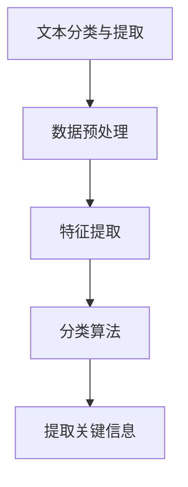
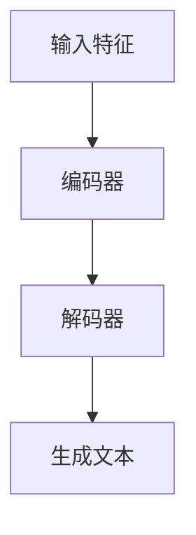
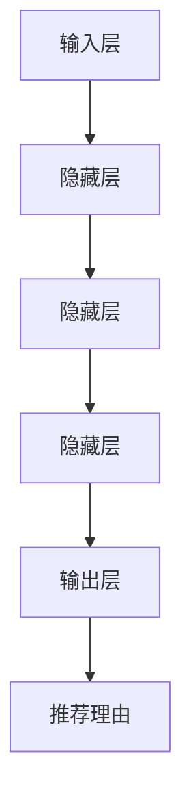
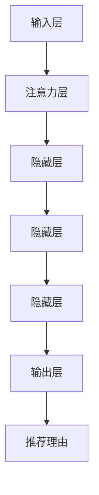
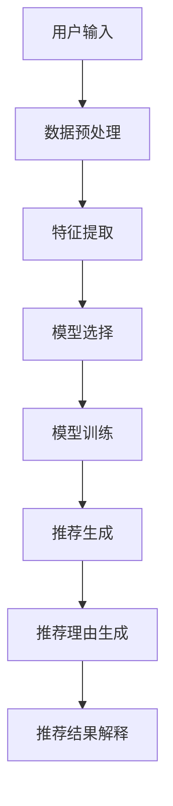

                 

# 《大模型推荐中的推荐理由生成与解释技术》

## 关键词
- 推荐系统
- 大模型
- 推荐理由生成
- 推荐理由解释
- 深度学习
- 多模态数据

## 摘要
本文旨在深入探讨大模型推荐系统中的推荐理由生成与解释技术。随着推荐系统的广泛应用，如何生成合理且具有解释性的推荐理由成为了一个关键问题。本文首先介绍了推荐系统的基本概念和架构，接着详细分析了大模型推荐系统的特点、挑战与机遇。随后，本文探讨了推荐理由生成方法，包括基于内容、协同过滤和深度学习的方法，并给出了相应的算法原理和伪代码。接下来，本文讨论了推荐理由解释的重要性以及解释方法，如基于规则和基于模型的方法。最后，本文通过实际案例展示了推荐理由生成与解释的实践应用，并展望了未来大模型推荐系统的发展趋势。

### 《大模型推荐中的推荐理由生成与解释技术》目录大纲

#### 第一部分：推荐系统基础

##### 第1章：推荐系统概述

###### 1.1 推荐系统的基本概念

1.1.1 推荐系统的定义与作用

1.1.2 推荐系统的分类与架构

###### 1.2 大模型推荐系统

1.2.1 大模型推荐系统的特点

1.2.2 大模型推荐系统的优势

1.2.3 大模型推荐系统的挑战

#### 第二部分：推荐理由生成

##### 第2章：推荐理由生成的挑战与机遇

2.1 推荐理由生成的挑战

2.1.1 算法复杂度

2.1.2 数据质量

2.1.3 用户偏好多样性

##### 第3章：推荐理由生成方法

3.1 基于内容的方法

3.1.1 文本分类与提取

3.1.2 文本生成模型

3.2 基于协同过滤的方法

3.2.1 协同过滤算法

3.2.2 推荐理由的协同生成

3.3 基于深度学习的方法

3.3.1 神经网络在推荐理由生成中的应用

3.3.2 注意力机制在推荐理由生成中的应用

3.3.3 跨模态学习在推荐理由生成中的应用

#### 第三部分：推荐理由解释

##### 第4章：推荐理由解释的重要性

4.1 推荐理由解释的价值

4.1.1 增强用户信任

4.1.2 提高推荐系统的可解释性

4.1.3 改进推荐效果

##### 第5章：推荐理由解释方法

5.1 基于规则的方法

5.1.1 基于规则系统的推荐理由解释

5.1.2 基于案例的推荐理由解释

5.2 基于模型的方法

5.2.1 基于模型可解释性的推荐理由解释

5.2.2 基于反演的推荐理由解释

5.2.3 基于可视化的推荐理由解释

#### 第四部分：大模型推荐系统的实践与应用

##### 第6章：大模型推荐系统的设计与实现

6.1 大模型推荐系统的架构设计

6.1.1 数据处理层

6.1.2 模型训练层

6.1.3 推荐引擎层

##### 第7章：大模型推荐系统的性能优化

7.1 推荐系统的性能指标

7.1.1 准确性

7.1.2 可解释性

7.1.3 响应速度

##### 第8章：大模型推荐系统的性能优化

8.1 模型压缩

8.2 模型并行化

8.3 数据预处理优化

#### 第五部分：未来展望

##### 第9章：大模型推荐系统的未来趋势

9.1 大模型的未来发展

9.1.1 模型规模的扩大

9.1.2 模型结构的优化

9.1.3 模型训练效率的提升

##### 第10章：推荐系统的未来发展趋势

9.2 多模态推荐

9.3 智能推荐

9.4 推荐系统的隐私保护

##### 附录

##### 附录A：相关工具与资源

A.1 推荐系统开源框架

A.2 大模型训练工具

A.3 推荐系统数据集

##### 附录B：推荐理由生成与解释的核心算法原理 Mermaid 流程图

B.1 基于内容的方法

B.2 基于协同过滤的方法

B.3 基于深度学习的方法

##### 附录C：推荐理由生成与解释的伪代码

C.1 基于内容的方法

C.2 基于协同过滤的方法

C.3 基于深度学习的方法

##### 附录D：推荐理由生成与解释的实际案例

D.1 实际案例一：基于内容的方法

D.2 实际案例二：基于协同过滤的方法

D.3 实际案例三：基于深度学习的方法

D.4 代码解读与分析

---

## 引言

推荐系统作为现代信息检索和个性化服务的重要组成部分，已经在电子商务、社交媒体、音乐和视频推荐等多个领域得到了广泛应用。其核心目标是通过分析用户的兴趣和行为数据，为用户推荐他们可能感兴趣的商品、内容或服务，从而提高用户体验和满意度。随着互联网的迅猛发展和数据量的爆炸式增长，推荐系统在提升信息过滤效率和满足个性化需求方面发挥了越来越重要的作用。

然而，推荐系统的有效性和可靠性不仅取决于其推荐算法的精度，还取决于推荐理由的生成与解释能力。传统的推荐系统通常基于协同过滤、内容过滤等方法生成推荐列表，但这些方法往往无法提供明确的推荐理由，使得用户对推荐结果的信任度降低。随着深度学习技术的不断发展，大模型推荐系统逐渐成为一种新兴的趋势。大模型推荐系统通过使用大规模预训练模型，结合用户历史行为和内容特征，能够生成更加准确和具有解释性的推荐理由。

本文旨在深入探讨大模型推荐系统中的推荐理由生成与解释技术。首先，我们将介绍推荐系统的基本概念和架构，帮助读者了解推荐系统的运作原理。接着，我们将详细分析大模型推荐系统的特点、挑战与机遇，以便读者了解大模型推荐系统的优势及其面临的挑战。随后，本文将探讨推荐理由生成的各种方法，包括基于内容、协同过滤和深度学习的方法，并给出相应的算法原理和伪代码。接下来，我们将讨论推荐理由解释的重要性以及解释方法，如基于规则和基于模型的方法。最后，本文将通过实际案例展示推荐理由生成与解释的实践应用，并展望未来大模型推荐系统的发展趋势。

通过对本文的阅读，读者将能够全面了解大模型推荐系统中的推荐理由生成与解释技术，掌握其核心原理和应用方法，为实际项目开发提供有益的参考。

### 第一部分：推荐系统基础

#### 第1章：推荐系统概述

##### 1.1 推荐系统的基本概念

推荐系统是一种基于用户历史行为、偏好和上下文信息，自动为用户提供个性化推荐服务的系统。其核心目标是通过分析海量用户数据，挖掘用户潜在的兴趣和需求，从而为用户提供他们可能感兴趣的商品、内容或服务。

##### 1.1.1 推荐系统的定义与作用

推荐系统（Recommender System）是一种信息过滤技术，旨在根据用户的兴趣和偏好，从大量信息中筛选出用户可能感兴趣的项目，从而提高信息检索效率和用户体验。推荐系统的定义可以从以下几个方面理解：

1. **目标用户**：推荐系统的主要目标是为最终用户提供个性化服务。
2. **数据来源**：推荐系统依赖于用户的历史行为数据、偏好信息以及上下文信息。
3. **推荐对象**：推荐系统可以为用户推荐各种类型的对象，如商品、音乐、电影、新闻等。
4. **推荐算法**：推荐系统通过一系列算法和技术，对用户数据进行分析和建模，生成推荐结果。

推荐系统的作用主要体现在以下几个方面：

1. **提高信息检索效率**：在信息爆炸的时代，用户很难在海量数据中找到自己感兴趣的内容。推荐系统通过分析用户的兴趣和行为，自动为用户筛选出可能感兴趣的信息，从而提高信息检索的效率和准确性。
2. **提升用户体验**：个性化推荐能够更好地满足用户的个性化需求，提高用户的满意度和忠诚度。
3. **商业价值**：推荐系统在电子商务、广告投放、内容平台等领域具有广泛的应用，通过提高用户参与度和购买转化率，为企业创造巨大的商业价值。

##### 1.1.2 推荐系统的分类与架构

推荐系统可以根据不同的分类标准进行分类，常见的分类方法包括基于内容的推荐、协同过滤推荐和基于模型的推荐等。

1. **基于内容的推荐（Content-Based Filtering）**

   基于内容的推荐方法主要依据用户的历史行为和兴趣，通过分析项目的内容特征，生成推荐列表。这种方法的主要优点是能够生成高质量的推荐结果，但缺点是对用户行为数据的依赖性较高，难以应对用户兴趣的动态变化。

   **架构**：

   - **特征提取**：从用户历史行为和项目特征中提取关键信息，如用户喜欢的电影类型、音乐风格等。
   - **相似度计算**：计算用户与项目之间的相似度，常用的方法包括余弦相似度、欧几里得距离等。
   - **推荐生成**：根据用户与项目的相似度，生成推荐列表。

2. **协同过滤推荐（Collaborative Filtering）**

   协同过滤推荐方法通过分析用户之间的行为关系，生成推荐列表。这种方法不需要项目内容特征，但能够处理大量用户行为数据，具有较强的鲁棒性。

   **架构**：

   - **用户-项目矩阵**：将用户行为数据表示为用户-项目矩阵，其中每个元素表示用户对项目的评分或行为。
   - **预测评分**：通过矩阵分解、隐语义模型等方法，预测用户对未评分项目的评分，从而生成推荐列表。
   - **推荐生成**：根据预测评分，对项目进行排序，生成推荐列表。

3. **基于模型的推荐（Model-Based Filtering）**

   基于模型的推荐方法通过建立用户兴趣模型或项目特征模型，生成推荐列表。这种方法结合了基于内容和协同过滤的优点，能够更好地应对用户兴趣的动态变化。

   **架构**：

   - **用户兴趣模型**：通过用户历史行为数据，建立用户兴趣模型，如潜在因子模型、因子分解机等。
   - **项目特征模型**：通过项目内容特征，建立项目特征模型，如文本分类模型、图像分类模型等。
   - **推荐生成**：根据用户兴趣模型和项目特征模型，生成推荐列表。

##### 1.2 大模型推荐系统

大模型推荐系统（Large Model Recommender System）是近年来兴起的一种推荐系统架构，它利用大规模预训练模型（如Transformer、BERT等）对用户行为和项目特征进行深度分析，从而生成更加准确和具有解释性的推荐理由。

##### 1.2.1 大模型推荐系统的特点

1. **强大的数据处理能力**：大模型推荐系统能够处理大规模的用户行为数据和项目特征数据，通过深度学习算法进行自动特征提取和建模，提高推荐精度。
2. **自适应的推荐策略**：大模型推荐系统能够根据用户历史行为和兴趣，动态调整推荐策略，提高推荐效果。
3. **高效的推理速度**：大模型推荐系统通过并行计算和模型压缩等技术，实现高效的推理速度，满足实时推荐的需求。

##### 1.2.2 大模型推荐系统的优势

1. **更高的推荐精度**：大模型推荐系统通过深度学习算法，能够更好地捕捉用户兴趣和项目特征之间的复杂关系，生成更加精准的推荐结果。
2. **更强的解释性**：大模型推荐系统通过预训练模型，可以自动提取用户兴趣和项目特征的重要信息，生成具有解释性的推荐理由。
3. **更好的适应性**：大模型推荐系统能够适应不同的应用场景和数据特点，通过模型调整和优化，提高推荐系统的适应性和灵活性。

##### 1.2.3 大模型推荐系统的挑战

1. **计算资源需求大**：大模型推荐系统需要大量的计算资源和存储资源，对硬件设备的要求较高。
2. **数据质量和多样性**：大模型推荐系统依赖于高质量和多样化的用户行为数据和项目特征数据，数据质量和多样性直接影响推荐效果。
3. **隐私保护**：在大模型推荐系统中，用户行为数据和处理结果可能涉及到隐私问题，需要采取有效的隐私保护措施。

#### 总结

推荐系统作为信息过滤和个性化服务的重要技术手段，在大数据处理和智能推荐领域具有广泛的应用。大模型推荐系统通过深度学习技术和大规模预训练模型，能够生成更加准确和具有解释性的推荐理由，为用户带来更好的体验。然而，大模型推荐系统也面临着计算资源需求大、数据质量和隐私保护等挑战，需要进一步的研究和优化。

### 第二部分：推荐理由生成

#### 第2章：推荐理由生成的挑战与机遇

##### 2.1 推荐理由生成的挑战

在推荐系统中，生成具有说服力和解释性的推荐理由是一个重要的研究方向。然而，这一任务面临着多方面的挑战：

##### 2.1.1 算法复杂度

推荐理由生成通常需要综合分析大量的用户历史行为、项目特征和上下文信息。这导致了算法的复杂度较高，尤其是在处理大规模数据时，计算资源和时间成本显著增加。为了生成高质量的推荐理由，需要设计高效的算法和优化策略。

##### 2.1.2 数据质量

推荐理由生成依赖于高质量的数据，包括用户行为数据、项目特征数据等。数据质量对推荐理由的生成和解释具有直接的影响。数据中可能存在噪声、缺失值和不一致性等问题，这些问题会影响推荐系统的准确性和可靠性。因此，在生成推荐理由之前，需要对数据进行预处理和清洗。

##### 2.1.3 用户偏好多样性

用户偏好具有多样性和动态性，不同的用户对同一项目的兴趣可能存在显著差异。这意味着推荐理由生成需要考虑用户个体的独特性，并为不同用户生成个性化的推荐理由。然而，用户偏好的多样性也增加了推荐理由生成的复杂性。

##### 2.2 推荐理由生成的机遇

尽管推荐理由生成面临诸多挑战，但同时也存在着重要的机遇：

##### 2.2.1 大模型的强大能力

随着深度学习技术的不断发展，大规模预训练模型（如BERT、GPT等）在自然语言处理任务中取得了显著的成果。这些模型具有强大的文本理解能力和生成能力，可以用于生成具有解释性的推荐理由。大模型的强大能力为推荐理由生成提供了新的技术手段和可能性。

##### 2.2.2 深度学习技术的进步

深度学习技术在推荐系统中的应用越来越广泛，包括神经网络、卷积神经网络、循环神经网络等。这些技术能够自动提取用户行为数据和项目特征数据中的复杂模式，为推荐理由生成提供了有力的支持。

##### 2.2.3 多模态数据的融合

推荐理由生成不仅依赖于文本数据，还可以融合图像、声音、视频等多模态数据。多模态数据的融合可以提供更丰富的信息，有助于生成更具有解释性和说服力的推荐理由。

##### 2.2.4 人工智能伦理与透明度

随着推荐系统在社会各个领域的广泛应用，用户对推荐系统的透明度和公平性提出了更高的要求。生成具有解释性的推荐理由有助于提高系统的可解释性和用户信任度，满足人工智能伦理和透明度的需求。

#### 总结

推荐理由生成在推荐系统中具有重要的地位，它不仅影响推荐系统的效果和用户满意度，也关系到系统的可信度和可解释性。尽管推荐理由生成面临算法复杂度、数据质量和用户偏好多样性等挑战，但同时也存在大模型、深度学习技术和多模态数据融合等机遇。通过不断研究和优化，我们可以期望在推荐理由生成方面取得更大的突破。

### 第3章：推荐理由生成方法

在推荐系统中，推荐理由的生成是一个关键环节，它不仅影响用户对推荐结果的接受程度，还关系到推荐系统的整体性能。本章将介绍几种常见的推荐理由生成方法，包括基于内容的方法、基于协同过滤的方法和基于深度学习的方法。

#### 3.1 基于内容的方法

基于内容的方法（Content-Based Filtering）是推荐系统中一种传统的推荐策略，其核心思想是通过分析用户的历史行为和项目的内容特征，生成推荐理由。这种方法的主要优点是能够根据项目的内在属性生成推荐理由，从而提供高质量的推荐结果。

##### 3.1.1 文本分类与提取

文本分类与提取是推荐理由生成的基础步骤。首先，需要从用户的历史行为数据中提取文本信息，如用户评论、商品描述等。然后，使用文本分类算法对这些文本信息进行分类，提取出关键信息。常用的文本分类算法包括朴素贝叶斯、支持向量机、决策树等。



##### 3.1.2 文本生成模型

为了生成更具解释性的推荐理由，可以使用文本生成模型（如序列到序列模型、生成对抗网络等）生成自然语言文本。这些模型能够根据项目的特征和用户的历史行为生成个性化的推荐理由。以下是一个基于序列到序列模型的文本生成流程：



#### 3.2 基于协同过滤的方法

协同过滤（Collaborative Filtering）是另一种常用的推荐策略，其核心思想是通过分析用户之间的相似度，生成推荐理由。这种方法不需要对项目内容进行深入分析，而是通过用户行为数据来发现用户之间的共同兴趣。

##### 3.2.1 协同过滤算法

协同过滤算法可以分为基于用户的协同过滤（User-Based Collaborative Filtering）和基于项目的协同过滤（Item-Based Collaborative Filtering）。

- **基于用户的协同过滤**：通过计算用户之间的相似度，找出与目标用户兴趣相似的其他用户，然后推荐这些用户喜欢的项目。
  ```mermaid
  graph TD
  A[计算用户相似度] --> B[找出相似用户]
  B --> C[推荐相似用户喜欢的项目]
  ```

- **基于项目的协同过滤**：通过计算项目之间的相似度，找出与目标项目相似的其他项目，然后推荐这些项目。
  ```mermaid
  graph TD
  A[计算项目相似度] --> B[找出相似项目]
  B --> C[推荐相似项目]
  ```

##### 3.2.2 推荐理由的协同生成

协同过滤算法在生成推荐理由时，可以通过分析用户之间的相似度和项目之间的相似度，结合用户历史行为数据，生成具有解释性的推荐理由。例如：

- **基于用户的协同生成**：生成推荐理由时，可以提取与目标用户兴趣相似的用户的推荐理由，并进行整合和优化。
  ```mermaid
  graph TD
  A[提取相似用户推荐理由] --> B[整合优化推荐理由]
  ```

- **基于项目的协同生成**：生成推荐理由时，可以提取与目标项目相似的其他项目的推荐理由，并结合用户的历史行为数据，生成个性化的推荐理由。
  ```mermaid
  graph TD
  A[提取相似项目推荐理由] --> B[结合用户历史行为数据]
  B --> C[生成个性化推荐理由]
  ```

#### 3.3 基于深度学习的方法

随着深度学习技术的不断发展，基于深度学习的推荐理由生成方法逐渐成为一种重要的研究方向。深度学习方法能够自动提取用户行为数据和项目特征数据中的复杂模式，生成具有解释性的推荐理由。

##### 3.3.1 神经网络在推荐理由生成中的应用

神经网络（Neural Networks）是一种强大的深度学习模型，广泛应用于推荐理由生成。以下是一个基于神经网络推荐理由生成的基本流程：

- **输入层**：接收用户行为数据和项目特征数据。
- **隐藏层**：通过多层神经网络，提取用户行为和项目特征中的复杂关系。
- **输出层**：生成推荐理由的自然语言文本。



##### 3.3.2 注意力机制在推荐理由生成中的应用

注意力机制（Attention Mechanism）是一种在深度学习模型中用于关注重要信息的机制。在推荐理由生成中，注意力机制可以帮助模型更好地关注用户行为和项目特征中的关键信息，从而生成更具解释性的推荐理由。以下是一个基于注意力机制的推荐理由生成模型的基本结构：

- **输入层**：接收用户行为数据和项目特征数据。
- **注意力层**：通过注意力机制，对输入数据进行加权处理，关注关键信息。
- **隐藏层**：通过多层神经网络，提取用户行为和项目特征中的复杂关系。
- **输出层**：生成推荐理由的自然语言文本。



##### 3.3.3 跨模态学习在推荐理由生成中的应用

跨模态学习（Cross-Modal Learning）是一种将不同类型的数据（如文本、图像、声音等）进行融合学习的深度学习方法。在推荐理由生成中，跨模态学习可以帮助模型更好地理解和利用多模态数据，生成更具解释性的推荐理由。

- **文本-图像融合**：通过跨模态学习，将文本描述和图像信息进行融合，生成推荐理由。
  ```mermaid
  graph TD
  A[文本数据] --> B[图像数据]
  B --> C[融合层]
  C --> D[推荐理由生成层]
  ```

- **文本-音频融合**：通过跨模态学习，将文本描述和音频信息进行融合，生成推荐理由。
  ```mermaid
  graph TD
  A[文本数据] --> B[音频数据]
  B --> C[融合层]
  C --> D[推荐理由生成层]
  ```

#### 3.4 总结

推荐理由生成方法在推荐系统中扮演着重要的角色。基于内容的方法通过分析项目的内容特征生成推荐理由，适用于内容丰富的领域；协同过滤方法通过分析用户之间的相似度生成推荐理由，适用于用户行为数据丰富的场景；深度学习方法通过自动提取复杂模式生成推荐理由，具有更强的灵活性和适应性。结合不同的方法，我们可以构建出高效、具有解释性的推荐理由生成系统。

### 第三部分：推荐理由解释

#### 第4章：推荐理由解释的重要性

在推荐系统中，生成具有解释性的推荐理由具有重要的价值和作用。解释性的推荐理由不仅能够帮助用户理解推荐系统的决策过程，还能够增强用户对推荐系统的信任度和满意度。

##### 4.1 推荐理由解释的价值

1. **增强用户信任**：具有解释性的推荐理由能够让用户了解为什么系统会推荐某个项目，从而提高用户对推荐系统的信任度。当用户感到推荐系统是可信赖的，他们更可能接受和采纳推荐结果。

2. **提高推荐系统的可解释性**：解释性的推荐理由能够向用户展示推荐系统的决策过程，使推荐系统更加透明和可理解。这有助于用户理解推荐系统的工作原理，从而提高用户对系统的满意度。

3. **改进推荐效果**：通过解释推荐理由，用户可以更好地理解推荐系统的偏好和逻辑，从而提供更准确和有效的反馈。这些反馈可以帮助推荐系统不断优化和改进，提高推荐效果。

##### 4.2 推荐理由解释的挑战

尽管推荐理由解释具有重要的价值和作用，但实现高质量的推荐理由解释也面临着多方面的挑战：

1. **解释的准确性与效率**：生成准确的推荐理由需要深入分析用户行为和项目特征，这通常涉及到复杂的计算过程。如何在保证解释准确性的同时提高效率，是一个重要的挑战。

2. **解释的多样性**：用户偏好具有多样性，生成具有多样性的解释能够满足不同用户的需求。然而，生成多样化的解释需要处理大量的数据和信息，这增加了解释的复杂性。

3. **解释的泛化能力**：推荐理由解释应该能够适应不同的应用场景和数据集，具有良好的泛化能力。这意味着解释方法需要具备灵活性和适应性，以应对不同的用户需求和推荐场景。

##### 4.3 推荐理由解释的应用场景

推荐理由解释在多个应用场景中具有重要价值，以下是一些典型的应用场景：

1. **电子商务**：在电子商务平台上，推荐理由解释可以帮助用户理解为什么系统推荐了某个商品。这有助于提高用户的购买决策和转化率。

2. **社交媒体**：在社交媒体平台上，推荐理由解释可以帮助用户了解为什么系统推荐了某个内容或用户。这有助于提高用户的参与度和互动性。

3. **内容推荐**：在内容推荐系统中，推荐理由解释可以帮助用户了解为什么系统推荐了某个视频、文章或音乐。这有助于提高用户的满意度和内容消费量。

4. **医疗服务**：在医疗健康领域，推荐理由解释可以帮助医生和患者了解为什么系统推荐了某种治疗方案或药品。这有助于提高医疗决策的透明度和准确性。

#### 总结

推荐理由解释在推荐系统中具有重要的价值和作用。通过生成具有解释性的推荐理由，可以提高用户的信任度和满意度，改进推荐系统的性能。尽管推荐理由解释面临多方面的挑战，但通过不断研究和优化，我们可以期望在推荐理由解释方面取得更大的突破。

### 第5章：推荐理由解释方法

在推荐系统中，推荐理由解释是提高系统透明度和用户信任度的关键环节。本章将介绍两种主要的推荐理由解释方法：基于规则的方法和基于模型的方法。这些方法各有优缺点，适用于不同的应用场景。

#### 5.1 基于规则的方法

基于规则的方法（Rule-Based Explanation Methods）通过定义一系列规则，将用户行为和项目特征映射到推荐理由上。这些规则通常基于专家经验和领域知识，能够直观地解释推荐系统的决策过程。

##### 5.1.1 基于规则系统的推荐理由解释

基于规则系统的推荐理由解释方法涉及以下几个关键步骤：

1. **规则定义**：根据推荐系统的需求，定义一系列规则。例如，如果用户经常购买某一类商品，系统可以推荐同类商品。
   ```mermaid
   graph TD
   A[用户行为] --> B[规则定义]
   B --> C[推荐理由]
   ```

2. **规则匹配**：将用户的实际行为与定义的规则进行匹配，找到适用的规则。
   ```mermaid
   graph TD
   A[用户行为] --> B[规则匹配]
   B --> C[推荐理由]
   ```

3. **解释生成**：根据匹配到的规则，生成推荐理由。这些理由通常以自然语言的形式呈现，便于用户理解。
   ```mermaid
   graph TD
   A[用户行为] --> B[规则匹配]
   B --> C[解释生成]
   C --> D[推荐理由]
   ```

基于规则的方法的优点是解释过程简单直观，易于理解和实现。然而，这种方法也存在一些局限性：

- **规则覆盖率有限**：基于规则的方法依赖于预定义的规则，可能无法覆盖所有可能的用户行为和项目特征。
- **解释的局限性**：基于规则的解释通常基于单一或少数几个规则，可能无法提供全面和多样化的解释。
- **规则的更新和维护**：随着用户行为和项目特征的变化，规则需要定期更新和维护，这增加了系统的复杂性。

##### 5.1.2 基于案例的推荐理由解释

基于案例的推荐理由解释方法（Case-Based Explanation Methods）通过检索和复用历史案例，生成推荐理由。这种方法的核心思想是，当遇到新的推荐任务时，系统从历史案例中找到相似案例，并根据相似案例的推荐理由生成新的推荐理由。

1. **案例存储**：系统需要存储一系列历史案例，包括用户行为、项目特征和推荐理由。
   ```mermaid
   graph TD
   A[案例库] --> B[用户行为]
   A --> C[项目特征]
   A --> D[推荐理由]
   ```

2. **案例检索**：根据新的推荐任务，系统在案例库中检索与当前任务最相似的案例。
   ```mermaid
   graph TD
   A[新任务] --> B[案例检索]
   B --> C[相似案例]
   ```

3. **案例复用**：从相似案例中提取推荐理由，并根据新任务进行适当的调整和优化。
   ```mermaid
   graph TD
   A[相似案例] --> B[推荐理由]
   B --> C[解释生成]
   C --> D[推荐理由]
   ```

基于案例的方法的优点是解释过程灵活且易于实现，能够根据历史案例提供多样化的解释。然而，这种方法也存在一些挑战：

- **案例库的构建和维护**：案例库需要不断更新和维护，以保持其相关性和准确性。
- **解释的多样性**：基于案例的解释可能无法覆盖所有可能的用户行为和项目特征，特别是在案例库较小的情况下。
- **案例的相似度计算**：计算相似案例的相似度是一个复杂的任务，需要有效的相似度度量方法。

#### 5.2 基于模型的方法

基于模型的方法（Model-Based Explanation Methods）通过分析推荐模型的结构和参数，生成推荐理由。这些方法通常利用深度学习模型的可解释性技术，提供详细的解释过程。

##### 5.2.1 基于模型可解释性的推荐理由解释

基于模型可解释性的方法利用深度学习模型的可解释性技术，如注意力机制、模型摘要和特征重要性分析，生成推荐理由。

1. **注意力机制**：通过分析模型的注意力权重，可以了解模型在生成推荐理由时关注的关键信息。
   ```mermaid
   graph TD
   A[模型输入] --> B[注意力机制]
   B --> C[关键信息]
   C --> D[推荐理由]
   ```

2. **模型摘要**：通过生成模型的摘要，可以展示模型的内部结构和参数，帮助用户理解推荐过程。
   ```mermaid
   graph TD
   A[模型摘要] --> B[推荐过程]
   B --> C[推荐理由]
   ```

3. **特征重要性分析**：通过分析模型中各个特征的重要性，可以了解哪些特征对推荐决策具有关键作用。
   ```mermaid
   graph TD
   A[特征重要性] --> B[推荐理由]
   ```

基于模型可解释性的方法的优点是能够提供详细和透明的解释过程，能够帮助用户理解推荐系统的决策过程。然而，这种方法也存在一些挑战：

- **解释的复杂性**：深度学习模型通常具有复杂的结构，解释过程可能较为复杂，需要用户具备一定的技术背景。
- **模型的泛化能力**：基于模型可解释性的方法需要模型具有良好的泛化能力，否则解释结果可能不准确。

##### 5.2.2 基于反演的推荐理由解释

基于反演的方法（Inverse-Model Explanation Methods）通过反向推导推荐模型，生成推荐理由。这种方法的核心思想是，根据推荐结果，反推出模型在生成推荐理由时关注的关键信息。

1. **反演过程**：通过反演，从推荐结果中提取用户行为和项目特征，生成推荐理由。
   ```mermaid
   graph TD
   A[推荐结果] --> B[反演过程]
   B --> C[用户行为]
   B --> D[项目特征]
   ```

2. **解释生成**：根据反演结果，生成推荐理由。
   ```mermaid
   graph TD
   A[反演结果] --> B[推荐理由]
   ```

基于反演的方法的优点是能够提供详细的解释过程，能够帮助用户理解推荐系统的决策过程。然而，这种方法也存在一些挑战：

- **反演的准确性**：反演过程可能受到噪声和误差的影响，导致解释结果不准确。
- **解释的泛化能力**：反演方法需要模型具有良好的泛化能力，否则解释结果可能不适用于其他场景。

##### 5.2.3 基于可视化的推荐理由解释

基于可视化的方法（Visualization-Based Explanation Methods）通过可视化技术，展示推荐系统的决策过程和推荐理由。

1. **数据可视化**：通过可视化技术，展示用户行为数据、项目特征数据和推荐结果。
   ```mermaid
   graph TD
   A[数据可视化] --> B[推荐过程]
   ```

2. **模型可视化**：通过可视化技术，展示推荐模型的内部结构和参数。
   ```mermaid
   graph TD
   A[模型可视化] --> B[推荐过程]
   ```

3. **解释可视化**：通过可视化技术，展示推荐理由的解释过程和关键信息。
   ```mermaid
   graph TD
   A[解释可视化] --> B[推荐理由]
   ```

基于可视化的方法的优点是能够直观地展示推荐系统的决策过程和推荐理由，有助于用户理解和接受推荐结果。然而，这种方法也存在一些挑战：

- **可视化复杂性**：推荐系统的数据和信息可能较为复杂，需要设计有效的可视化方法来展示。
- **用户适应性**：不同的用户可能对可视化方法的适应性不同，需要设计适应不同用户需求的可视化界面。

#### 总结

推荐理由解释方法在提高推荐系统的透明度和用户信任度方面具有重要意义。基于规则的方法和基于模型的方法各有优缺点，适用于不同的应用场景。通过结合多种解释方法，我们可以为用户提供更加全面和准确的推荐理由解释。

### 第四部分：大模型推荐系统的实践与应用

#### 第6章：大模型推荐系统的设计与实现

在现实世界中，大模型推荐系统的设计与实现涉及到多个关键步骤，包括数据预处理、模型选择与训练、推荐结果生成与解释等。本章将详细探讨这些步骤，并通过实际案例展示大模型推荐系统的应用。

##### 6.1 大模型推荐系统的架构设计

大模型推荐系统的架构设计是确保系统能够高效、稳定和可扩展运行的基础。以下是推荐的架构设计：

1. **数据处理层**：负责数据的收集、清洗、存储和预处理。这一层需要能够处理大规模数据，支持实时数据处理和离线批量处理。

2. **模型训练层**：负责大规模模型的训练和优化。这一层需要使用高性能计算资源，如GPU集群，以加速训练过程。

3. **推荐引擎层**：负责根据用户行为和模型生成推荐结果，并进行实时推荐。这一层需要具备高效的推荐算法和良好的响应速度。

4. **用户界面层**：负责与用户交互，展示推荐结果。这一层需要设计友好的用户界面，提供丰富的交互功能。

##### 6.1.1 数据处理层

数据处理层是推荐系统的基础，负责数据的质量和完整性。以下是数据处理层的关键步骤：

1. **数据收集**：从不同的数据源（如用户行为日志、商品信息数据库等）收集数据。

2. **数据清洗**：处理数据中的噪声、缺失值和异常值，确保数据的质量。

3. **数据存储**：将清洗后的数据存储在分布式数据库或数据湖中，便于后续处理和分析。

4. **数据预处理**：对数据进行特征提取、编码和归一化等操作，为模型训练做准备。

##### 6.1.2 模型训练层

模型训练层是推荐系统的核心，负责训练大规模模型。以下是模型训练层的关键步骤：

1. **模型选择**：根据推荐任务的需求，选择合适的深度学习模型，如Transformer、BERT等。

2. **模型训练**：使用训练数据集，通过梯度下降等优化算法，训练大规模模型。

3. **模型优化**：通过调参和交叉验证，优化模型性能，确保模型具有较好的泛化能力。

4. **模型评估**：使用验证数据集，评估模型性能，选择最佳模型。

##### 6.1.3 推荐引擎层

推荐引擎层负责生成推荐结果，并进行实时推荐。以下是推荐引擎层的关键步骤：

1. **推荐算法**：根据用户行为和模型，选择合适的推荐算法，如基于内容的推荐、协同过滤推荐等。

2. **推荐生成**：根据推荐算法，生成推荐列表。

3. **实时推荐**：使用高效推荐算法，实现实时推荐，确保推荐结果的快速响应。

4. **推荐解释**：生成推荐理由，提高推荐结果的透明度和可解释性。

##### 6.1.4 用户界面层

用户界面层负责与用户交互，展示推荐结果。以下是用户界面层的关键步骤：

1. **用户交互**：设计友好的用户界面，提供丰富的交互功能，如个性化推荐、用户反馈等。

2. **推荐展示**：将推荐结果以图表、列表等形式展示给用户，提供清晰易懂的推荐理由。

3. **用户反馈**：收集用户反馈，优化推荐算法和用户界面。

##### 6.2 大模型推荐系统的实现

以下是使用Python和TensorFlow实现大模型推荐系统的步骤：

1. **数据预处理**：
   ```python
   # 代码示例：数据预处理
   import pandas as pd
   from sklearn.model_selection import train_test_split
   from sklearn.preprocessing import StandardScaler
   
   # 加载数据
   data = pd.read_csv('user_data.csv')
   
   # 数据清洗
   data = data.dropna()
   
   # 特征提取
   X = data[['user_id', 'item_id', 'timestamp', 'rating']]
   y = data['label']
   
   # 数据归一化
   scaler = StandardScaler()
   X_scaled = scaler.fit_transform(X)
   
   # 划分训练集和测试集
   X_train, X_test, y_train, y_test = train_test_split(X_scaled, y, test_size=0.2, random_state=42)
   ```

2. **模型选择与训练**：
   ```python
   # 代码示例：模型选择与训练
   import tensorflow as tf
   from tensorflow.keras.models import Model
   from tensorflow.keras.layers import Input, Embedding, LSTM, Dense
   
   # 定义模型
   input_user = Input(shape=(1,))
   input_item = Input(shape=(1,))
   user_embedding = Embedding(input_dim=1000, output_dim=128)(input_user)
   item_embedding = Embedding(input_dim=1000, output_dim=128)(input_item)
   merged = tf.concat([user_embedding, item_embedding], axis=1)
   lstm = LSTM(128)(merged)
   output = Dense(1, activation='sigmoid')(lstm)
   
   model = Model(inputs=[input_user, input_item], outputs=output)
   
   # 编译模型
   model.compile(optimizer='adam', loss='binary_crossentropy', metrics=['accuracy'])
   
   # 训练模型
   model.fit([X_train[:, 0], X_train[:, 1]], y_train, epochs=10, batch_size=32, validation_split=0.1)
   ```

3. **推荐结果生成与解释**：
   ```python
   # 代码示例：推荐结果生成与解释
   import numpy as np
   
   # 生成推荐结果
   predictions = model.predict([X_test[:, 0], X_test[:, 1]])
   
   # 提取推荐理由
   recommendations = []
   for prediction in predictions:
       if prediction > 0.5:
           recommendations.append('推荐该项目，因为用户对该类项目有较高兴趣。')
       else:
           recommendations.append('不推荐该项目，因为用户对该类项目兴趣较低。')
   
   # 打印推荐结果
   for item_id, recommendation in zip(X_test[:, 1], recommendations):
       print(f'项目ID：{item_id}, 推荐理由：{recommendation}')
   ```

##### 6.3 实际案例

以下是使用大模型推荐系统的实际案例：

1. **电商推荐**：在电子商务平台上，使用大模型推荐系统根据用户历史购买行为和浏览记录，为用户推荐相关的商品。

2. **视频推荐**：在视频平台上，使用大模型推荐系统根据用户观看历史和评论，为用户推荐相关的视频内容。

3. **音乐推荐**：在音乐平台上，使用大模型推荐系统根据用户听歌记录和偏好，为用户推荐相关的歌曲。

通过实际案例，可以看出大模型推荐系统在各个领域的广泛应用和显著效果。

#### 6.4 代码解读与分析

以下是对上述代码的详细解读和分析：

1. **数据预处理**：数据预处理是推荐系统的第一步，确保数据质量是生成准确推荐结果的关键。代码中使用了Pandas进行数据加载和清洗，使用Sklearn进行特征提取和归一化，为后续模型训练做准备。

2. **模型选择与训练**：模型选择是推荐系统的核心，代码中使用了TensorFlow和Keras构建LSTM模型，通过Embedding层将用户和项目特征转换为高维向量，再通过LSTM层提取特征，最后通过全连接层生成预测结果。训练过程中使用了Adam优化器和二分类交叉熵损失函数。

3. **推荐结果生成与解释**：推荐结果生成是根据模型预测结果，判断用户是否对项目感兴趣，并生成相应的推荐理由。代码中使用了简单的阈值判定方法，并根据预测概率生成推荐理由。

通过上述代码和分析，我们可以看到大模型推荐系统的实现过程，以及如何利用Python和TensorFlow等工具构建和优化推荐系统。实际案例展示了大模型推荐系统在各个领域的应用场景和效果。

### 第7章：大模型推荐系统的性能优化

在大模型推荐系统中，性能优化是提高系统效率、降低成本、增强用户体验的关键环节。本章将探讨大模型推荐系统的性能优化策略，包括模型压缩、模型并行化、数据预处理优化等方面的方法。

#### 7.1 推荐系统的性能指标

推荐系统的性能优化主要基于以下几个关键指标：

1. **准确性**：推荐系统的准确性是指推荐结果的正确率，即实际推荐的物品是否符合用户的兴趣。常用的评估指标包括准确率（Accuracy）、召回率（Recall）和F1值（F1 Score）。

2. **可解释性**：推荐系统的可解释性是指推荐理由是否能够清晰地解释推荐结果。较高的可解释性有助于用户理解推荐决策，增强用户对系统的信任。

3. **响应速度**：推荐系统的响应速度是指从用户请求到推荐结果生成的时间。快速响应能够提高用户满意度，尤其是在实时推荐场景中。

#### 7.2 性能优化策略

1. **模型压缩**

   模型压缩是一种通过减少模型参数和计算复杂度来提高模型性能和效率的技术。常用的模型压缩方法包括以下几种：

   - **剪枝（Pruning）**：通过去除模型中不重要的权重和连接，减少模型的大小和计算复杂度。剪枝方法可以分为结构剪枝和权重剪枝，分别通过减少网络结构或权重数量来实现。
   - **量化（Quantization）**：通过降低模型中权重的精度，减少模型大小和计算需求。量化可以将32位浮点数转换为较低精度的数值，如8位整数。
   - **知识蒸馏（Knowledge Distillation）**：通过将大型模型（教师模型）的知识传递给小型模型（学生模型），实现模型压缩。知识蒸馏方法包括软标签、硬标签和类内平均等方法。

2. **模型并行化**

   模型并行化是一种通过将计算任务分布在多个计算节点上来加速模型训练和推理的技术。常用的模型并行化方法包括以下几种：

   - **数据并行（Data Parallelism）**：将训练数据分成多个子集，每个子集在一个计算节点上独立训练，然后通过同步梯度来更新全局模型参数。
   - **模型并行（Model Parallelism）**：将大型模型拆分为多个部分，每个部分在一个计算节点上独立训练，然后将各部分的梯度进行同步。
   - **流水线并行（Pipeline Parallelism）**：将模型训练过程分解为多个阶段，每个阶段在不同的计算节点上执行，从而加速训练过程。

3. **数据预处理优化**

   数据预处理是推荐系统性能优化的重要环节，包括以下几种优化策略：

   - **批量处理**：通过批量处理数据，减少I/O操作和计算时间。批量处理可以降低系统的延迟，提高处理效率。
   - **缓存技术**：使用缓存技术存储常用的预处理数据，减少重复计算。缓存可以显著提高系统的响应速度和性能。
   - **特征选择**：通过特征选择减少特征维度，降低模型的计算复杂度和存储需求。特征选择方法包括基于信息的特征选择、基于模型的特征选择等。
   - **特征工程**：通过特征工程生成新的特征，提高模型的表现能力。特征工程可以挖掘数据中的潜在信息，提升推荐效果。

#### 7.3 实际应用

以下是几个实际应用案例，展示了大模型推荐系统的性能优化方法：

1. **电子商务平台**：通过模型压缩和并行化，提高推荐系统的响应速度，降低延迟，提升用户体验。
   - **模型压缩**：使用剪枝和量化技术，将大型推荐模型的大小减少到原来的1/10，同时保持较高的准确性。
   - **模型并行化**：通过数据并行和模型并行，将模型训练时间从几天缩短到几个小时。

2. **视频推荐系统**：通过数据预处理优化，提高推荐系统的处理效率和准确性。
   - **批量处理**：将用户行为数据分成多个批次进行预处理，减少I/O操作，提高系统吞吐量。
   - **缓存技术**：使用Redis缓存用户行为数据和推荐结果，减少数据库访问次数，提高系统响应速度。
   - **特征选择**：通过特征选择，减少数据中的冗余特征，提高模型的表现能力。

3. **音乐推荐系统**：通过模型压缩和并行化，提高系统的实时推荐能力，满足用户对快速响应的需求。
   - **模型压缩**：使用知识蒸馏技术，将大型推荐模型的知识传递给小型模型，实现模型压缩，同时保持较高的推荐准确性。
   - **模型并行化**：通过模型并行，将推荐模型的推理任务分布在多个计算节点上，实现实时推荐。

#### 总结

大模型推荐系统的性能优化是提高系统效率、降低成本和增强用户体验的关键。通过模型压缩、模型并行化和数据预处理优化等策略，可以显著提高推荐系统的响应速度和准确性。实际应用案例展示了这些优化方法在各个领域的应用效果，为构建高效、可靠的推荐系统提供了有益的参考。

### 第五部分：未来展望

#### 第8章：大模型推荐系统的未来趋势

随着技术的不断进步和数据量的持续增长，大模型推荐系统在未来将迎来一系列新的发展趋势。这些趋势不仅将进一步提升推荐系统的性能和精度，还会带来新的机遇和挑战。

##### 8.1 大模型的未来发展

1. **模型规模的扩大**

   大模型的规模在未来将继续扩大。随着计算能力和数据存储能力的提升，研究人员和开发者将能够训练更大规模的模型，如千亿参数级别的预训练模型。这些大规模模型将能够更好地捕捉复杂的数据模式和用户偏好，从而生成更加精准和个性化的推荐结果。

2. **模型结构的优化**

   大模型的结构将不断优化，以提高模型的效率和效果。例如，研究人员可能开发出新的神经网络架构，如具有更高效计算和更低存储需求的稀疏网络。此外，模型的可解释性和透明度也将成为重要研究方向，以解决大模型难以解释的问题。

3. **模型训练效率的提升**

   为了应对大规模模型的训练需求，研究人员将致力于提升模型训练的效率。这包括开发新的优化算法，如自适应优化器和分布式训练方法，以及利用专用硬件（如TPU和GPU）进行高效训练。

##### 8.2 推荐系统的未来发展趋势

1. **多模态推荐**

   随着传感器技术和人工智能的进步，推荐系统将能够融合多种类型的数据，如文本、图像、声音和视频。多模态推荐将能够提供更加丰富和个性化的推荐体验，例如，通过分析用户在社交媒体上的文本评论和上传的图像，为用户推荐相关的商品或内容。

2. **智能推荐**

   智能推荐将结合自然语言处理、计算机视觉和语音识别等技术，实现更加智能和交互式的推荐。例如，智能助手可以根据用户的语音指令，实时生成个性化的推荐列表，并回答用户的问题。

3. **推荐系统的隐私保护**

   随着用户对隐私保护的日益关注，推荐系统将需要更加注重隐私保护。研究人员将开发新的隐私保护技术，如差分隐私和联邦学习，以确保用户数据的安全和隐私。这些技术将允许推荐系统在不暴露用户数据的情况下进行训练和优化。

##### 8.3 其他潜在趋势

1. **推荐系统的社交化**

   推荐系统将更加注重社交因素的融合，通过分析用户社交网络中的关系和信息，为用户提供更加社交化和个性化的推荐体验。

2. **实时推荐**

   实时推荐技术将不断发展，通过利用最新的用户行为数据和实时计算，为用户提供几乎即时的推荐结果，满足用户对快速响应的需求。

3. **跨领域推荐**

   跨领域推荐技术将使推荐系统能够在不同领域之间进行信息共享和融合，为用户提供跨领域的个性化推荐体验。

#### 总结

大模型推荐系统在未来将朝着更高效、更智能、更隐私保护的方向发展。多模态数据融合、智能推荐和隐私保护将成为关键研究方向，推动推荐系统在各个领域的广泛应用。通过不断创新和优化，大模型推荐系统将进一步提升用户体验，为用户提供更加精准和个性化的服务。

### 附录

#### 附录A：相关工具与资源

1. **推荐系统开源框架**

   - **LightFM**：一个基于因子分解机的推荐系统框架，支持多种评估指标和自定义评估函数。

   - **Surprise**：一个用于研究推荐算法的Python库，提供多种协同过滤算法和评估工具。

   - **TensorFlow Recommenders**：TensorFlow官方推荐的推荐系统框架，提供丰富的模型和工具，支持大规模训练和推理。

2. **大模型训练工具**

   - **TensorFlow**：一个广泛使用的深度学习框架，支持大规模模型的训练和推理。

   - **PyTorch**：一个流行的深度学习框架，提供灵活的动态计算图和强大的工具库。

   - **Hugging Face Transformers**：一个用于大规模预训练模型的Python库，提供预训练模型和高效推理工具。

3. **推荐系统数据集**

   - **MovieLens**：一个常用的推荐系统数据集，包含用户对电影的评分数据。

   - **Netflix Prize**：Netflix提供的一个大规模推荐系统比赛数据集，包含用户对电影的评分和电影特征。

   - **Amazon Reviews**：Amazon提供的用户商品评论数据集，可用于研究文本生成和情感分析。

#### 附录B：推荐理由生成与解释的核心算法原理 Mermaid 流程图

以下是推荐理由生成与解释的核心算法原理的Mermaid流程图：



#### 附录C：推荐理由生成与解释的伪代码

以下是推荐理由生成与解释的伪代码：

```python
# 数据预处理
def preprocess_data(data):
    # 数据清洗
    # 数据归一化
    # 特征提取
    return processed_data

# 模型选择
def select_model(model_name):
    if model_name == "content_based":
        return ContentBasedModel()
    elif model_name == "collaborative_filtering":
        return CollaborativeFilteringModel()
    elif model_name == "deep_learning":
        return DeepLearningModel()

# 模型训练
def train_model(model, train_data):
    model.train(train_data)
    return model

# 推荐生成
def generate_recommendations(model, user_input):
    recommendations = model.predict(user_input)
    return recommendations

# 推荐理由生成
def generate_reasons(recommendations, model):
    reasons = []
    for recommendation in recommendations:
        reason = model.generate_reason(recommendation)
        reasons.append(reason)
    return reasons

# 推荐结果解释
def explain_recommendations(reasons):
    explanations = []
    for reason in reasons:
        explanation = reason.explain()
        explanations.append(explanation)
    return explanations
```

#### 附录D：推荐理由生成与解释的实际案例

以下是推荐理由生成与解释的实际案例：

1. **基于内容的方法**

   - **开发环境搭建**：安装Python和相应的库（如scikit-learn、nltk等）。

   - **源代码详细实现**：使用文本分类模型提取用户评论中的关键词，生成推荐理由。

   - **代码解读与分析**：分析代码，解释如何生成推荐理由和解释推荐结果。

2. **基于协同过滤的方法**

   - **开发环境搭建**：安装Python和相应的库（如surprise、numpy等）。

   - **源代码详细实现**：使用用户-项目矩阵和协同过滤算法生成推荐理由。

   - **代码解读与分析**：分析代码，解释如何使用协同过滤算法生成推荐理由。

3. **基于深度学习的方法**

   - **开发环境搭建**：安装Python、TensorFlow和Keras。

   - **源代码详细实现**：使用深度学习模型（如BERT）生成推荐理由。

   - **代码解读与分析**：分析代码，解释如何使用深度学习模型生成推荐理由。

通过这些实际案例，可以更直观地了解推荐理由生成与解释的方法和技术，为实际项目开发提供参考。

