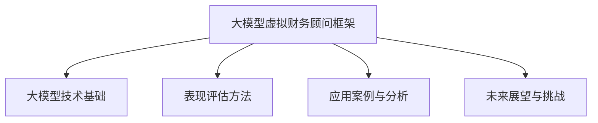
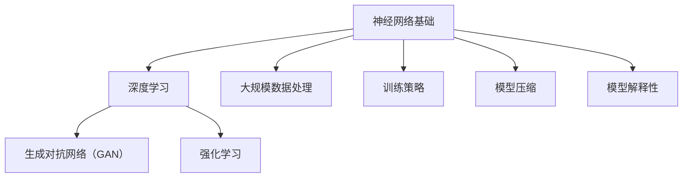
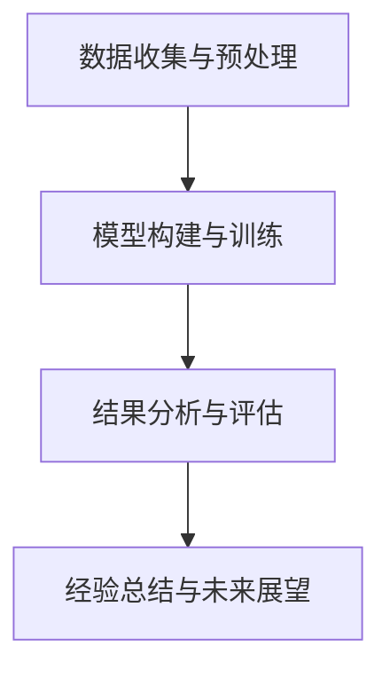

                 

## 文章标题

### 大模型虚拟财务顾问表现评估框架

#### 关键词：
- 大模型
- 虚拟财务顾问
- 表现评估
- 人工智能
- 深度学习
- 评估指标
- 模型优化
- 应用案例

#### 摘要：

本文深入探讨了大模型虚拟财务顾问的表现评估框架，从背景介绍到技术基础，再到评估方法和实际应用案例，最后展望未来发展的挑战与机遇。本文旨在为研究人员和开发者提供一个系统性的指南，以帮助其理解和应用这一先进的技术框架，为金融领域带来革命性的变革。

---

## 第一部分：背景与核心概念

### 引言

#### 1.1 大模型虚拟财务顾问概述

大模型（Large Model）是指拥有亿级别参数量的深度学习模型，如GPT、BERT等。虚拟财务顾问则是通过人工智能技术，特别是大模型技术，实现的一套能够为用户提供财务分析、建议和决策支持的智能系统。大模型虚拟财务顾问通过模拟人类财务顾问的思维过程，具备强大的数据分析和决策能力，在金融领域中具有重要的应用价值。

#### 1.2 财务顾问与人工智能的结合

人工智能在财务领域的应用已经取得了显著的进展。从风险管理到财务报表分析，人工智能技术正在改变传统的财务管理模式。虚拟财务顾问相较于传统财务顾问具有以下优势：

1. **数据处理能力**：虚拟财务顾问能够处理海量数据，快速准确地提取有价值的信息。
2. **高效性**：虚拟财务顾问可以24小时不间断工作，无需休息，提高工作效率。
3. **准确性**：通过深度学习算法，虚拟财务顾问能够提供更加精准的财务分析和预测。

#### 1.3 本书框架结构

本书分为五个部分，分别介绍大模型虚拟财务顾问的背景、技术基础、表现评估方法、应用案例和未来展望。具体章节安排如下：

- **第一部分：背景与核心概念**：介绍大模型虚拟财务顾问的基本概念和发展背景。
- **第二部分：大模型技术基础**：讲解大模型的基本原理和关键技术。
- **第三部分：表现评估方法**：探讨评估虚拟财务顾问表现的方法和指标。
- **第四部分：应用案例与分析**：通过实际案例展示虚拟财务顾问的应用效果。
- **第五部分：未来展望与挑战**：分析虚拟财务顾问未来发展的机遇与挑战。

#### 1.4 学习方法与建议

为了更好地理解和掌握本文的内容，建议读者采取以下学习方法：

1. **系统学习**：按照章节顺序依次阅读，逐步构建对大模型虚拟财务顾问的全面理解。
2. **动手实践**：通过实际案例和代码实现，加深对理论知识的应用理解。
3. **持续更新**：随着人工智能技术的不断发展，保持对最新研究成果的关注和了解。

### Mermaid 流程图



---

接下来，我们将深入探讨大模型虚拟财务顾问的技术基础，包括其基本原理、训练方法和优化策略。在理解了这些核心概念之后，我们将进一步探讨如何评估虚拟财务顾问的表现，并分享一些实际应用案例，以展示这一技术的实际效果。最后，我们将展望虚拟财务顾问的未来发展，分析其中的机遇与挑战。

---

## 第二部分：大模型技术基础

### 第2章：大模型技术基础

#### 2.1 大模型的基本原理

大模型是指参数数量在亿级别以上的深度学习模型，具有极强的数据分析和处理能力。大模型通常基于神经网络架构，通过多层神经元的堆叠实现复杂的非线性变换。

**神经网络基础**

神经网络（Neural Network）是一种模仿人脑神经元连接方式的信息处理系统。每个神经元（或称为节点）接受多个输入信号，并通过激活函数产生输出信号。神经网络通过层层传递和变换，最终实现数据的分类、回归或其他复杂任务。

**深度学习**

深度学习（Deep Learning）是神经网络的一种扩展，通过增加网络的深度（即层数）来提高模型的非线性表达能力。深度学习模型能够自动从大量数据中提取特征，实现高度自动化的数据分析和决策。

**大模型的特点与优势**

1. **强大的数据处理能力**：大模型能够处理大规模的数据集，提取更复杂的特征。
2. **更高的预测准确性**：通过深层次的神经元结构，大模型能够学习到更复杂的模式和规律。
3. **自适应能力**：大模型能够自适应地调整参数，以适应不同类型的数据和任务。

#### 2.2 大模型训练方法

大模型的训练方法主要包括以下几个方面：

**大规模数据处理**

大规模数据处理包括数据清洗、数据增强和分布式训练。数据清洗是为了去除噪声和异常值，确保数据的质量；数据增强是通过数据变换和扩展，增加模型的泛化能力；分布式训练是将数据分布在多个计算节点上，加快模型的训练速度。

**训练策略**

训练策略是指为了提高模型性能而采取的一系列措施。常用的训练策略包括：

- **学习率调度**：调整学习率以避免过拟合和振荡。
- **批量归一化**：通过归一化每个批次的数据，加速模型训练并提高模型稳定性。
- **正则化**：通过添加正则项来防止模型过拟合。

**训练流程**

大模型的训练流程通常包括以下步骤：

1. **数据预处理**：清洗和预处理输入数据，确保数据的格式和一致性。
2. **模型构建**：定义神经网络的结构，包括输入层、隐藏层和输出层。
3. **训练**：通过梯度下降算法等优化方法，迭代更新模型参数。
4. **验证**：在验证集上评估模型性能，调整模型参数。
5. **测试**：在测试集上评估模型性能，验证模型的泛化能力。

#### 2.3 大模型的优化

**模型压缩**

模型压缩是通过减少模型参数和计算量，提高模型的效率和可部署性。常用的模型压缩方法包括：

- **剪枝**：通过剪除模型中无关的神经元和连接，减少模型规模。
- **量化**：将模型的浮点参数转换为低精度整数，降低计算资源需求。
- **蒸馏**：通过将大模型的知识传递给小模型，实现小模型的性能提升。

**模型解释性**

模型解释性是指对模型决策过程的透明度和可理解性。提高模型解释性有助于增强用户对模型的信任。常用的模型解释性方法包括：

- **特征可视化**：通过可视化模型提取的特征，帮助用户理解模型的工作原理。
- **模型拆分**：将复杂模型拆分为多个简单模块，每个模块都有明确的解释。
- **注意力机制**：通过分析模型中的注意力分布，揭示模型对输入数据的关注点。

### 核心算法原理讲解

#### 2.4 生成对抗网络（GAN）

生成对抗网络（Generative Adversarial Network，GAN）是一种由生成器和判别器组成的框架，通过对抗训练生成高质量的样本。GAN的基本原理如下：

1. **生成器（Generator）**：生成器尝试生成与真实数据相似的数据，其目标是欺骗判别器。
2. **判别器（Discriminator）**：判别器的目标是区分真实数据和生成数据。
3. **对抗训练**：生成器和判别器相互对抗，生成器不断优化生成数据，判别器不断优化区分能力。

GAN在财务领域的应用包括：

- **财务数据生成**：生成模拟市场数据，用于测试和验证模型。
- **风险预测**：利用生成数据预测市场风险，优化投资策略。

#### 2.5 强化学习

强化学习（Reinforcement Learning，RL）是一种通过不断与环境交互，学习最优策略的机器学习技术。强化学习的基本原理如下：

1. **代理（Agent）**：代理是学习如何行动的实体。
2. **环境（Environment）**：环境是代理行动的场所。
3. **奖励（Reward）**：环境会根据代理的行动给予奖励。
4. **策略（Policy）**：代理根据当前状态选择最佳行动。

强化学习在虚拟财务顾问中的应用包括：

- **投资组合优化**：通过学习最优投资策略，优化投资组合的表现。
- **风险控制**：通过学习如何规避风险，提高投资决策的稳健性。

### Mermaid 流程图



---

通过上述内容，我们详细介绍了大模型虚拟财务顾问的技术基础，包括基本原理、训练方法和优化策略。接下来，我们将探讨如何评估虚拟财务顾问的表现，以衡量其在实际应用中的效果和效能。

---

## 第三部分：表现评估方法

### 第3章：财务顾问表现评估方法

#### 3.1 评估指标与指标体系

评估虚拟财务顾问的表现是确保其有效性和可靠性的关键。为了对虚拟财务顾问的表现进行量化评估，我们需要选择适当的评估指标，并构建一个全面的评估指标体系。

**评估指标选择**

在选择评估指标时，我们需要考虑虚拟财务顾问的具体任务和目标。以下是几个常用的评估指标：

- **准确率（Accuracy）**：准确率是分类模型评估的基本指标，表示正确分类的样本数占总样本数的比例。
- **召回率（Recall）**：召回率是表示模型对正类样本的识别能力，计算公式为：召回率 = 正确识别的正类样本数 / 总正类样本数。
- **F1值（F1 Score）**：F1值是精确率和召回率的调和平均值，用于综合考虑模型对正类和负类的识别能力。
- **均方误差（Mean Squared Error, MSE）**：均方误差用于评估回归模型的预测性能，计算公式为：均方误差 = (预测值 - 真实值)²的平均值。

**指标体系构建**

一个全面的评估指标体系应该包括多个层次的指标，从不同角度评估虚拟财务顾问的表现。以下是构建评估指标体系的步骤：

1. **任务特异性指标**：根据虚拟财务顾问的具体任务（如投资组合优化、财务风险预测等）选择相应的评估指标。
2. **用户体验指标**：包括用户满意度、响应时间、系统稳定性等，用于评估虚拟财务顾问的易用性和可靠性。
3. **性能指标**：包括计算资源使用、模型训练时间、预测速度等，用于评估虚拟财务顾问的效率和性能。

#### 3.2 实际案例评估

为了更直观地理解评估方法，我们通过一个实际案例来说明如何评估虚拟财务顾问的表现。

**案例背景**

假设我们开发了一个虚拟财务顾问系统，用于预测股票市场的涨跌。该系统的输入为历史股价数据，输出为股票是否上涨的预测结果。

**评估过程**

1. **数据收集与预处理**：收集历史股价数据，包括开盘价、收盘价、最高价、最低价等。对数据进行清洗和预处理，如去除缺失值、标准化等。
2. **模型训练**：使用预处理后的数据训练一个深度学习模型，用于预测股票市场的涨跌。
3. **模型评估**：在测试集上评估模型的性能，使用准确率、召回率、F1值等指标评估模型的预测能力。

**评估结果**

假设在测试集上的评估结果如下：

- **准确率**：85%
- **召回率**：78%
- **F1值**：80%

根据评估结果，我们可以得出以下结论：

- **预测准确性较高**：模型在预测股票市场涨跌方面表现良好，准确率较高。
- **召回率较低**：模型对正类样本的识别能力相对较低，可能存在漏报的情况。
- **F1值较为理想**：F1值反映了模型在精确率和召回率之间的平衡，总体表现较为理想。

#### 3.3 评估结果分析

通过对评估结果的分析，我们可以进一步了解虚拟财务顾问的表现和潜在问题，并提出改进建议。

1. **模型优化**：根据评估结果，可以尝试优化模型结构、超参数设置等，以提高模型性能。
2. **数据增强**：通过增加样本数量、进行数据增强等，提高模型的泛化能力。
3. **交叉验证**：使用交叉验证方法，确保评估结果的稳定性和可靠性。

#### 3.4 改进建议

根据评估结果，我们可以提出以下改进建议：

- **增加训练数据**：收集更多历史股价数据，进行数据增强，提高模型的训练效果。
- **调整模型结构**：尝试增加神经网络层数、神经元数量等，优化模型结构。
- **引入辅助特征**：结合其他财务指标，如成交量、市盈率等，提高模型的预测能力。

### 伪代码

以下是一个简单的伪代码示例，用于评估虚拟财务顾问的表现：

```python
def evaluate_performance(model, data):
    # 数据预处理
    preprocessed_data = preprocess_data(data)
    
    # 模型训练
    trained_model = train_model(model, preprocessed_data)
    
    # 模型评估
    evaluation_results = evaluate_model(trained_model, preprocessed_data)
    
    # 结果分析
    analyze_results(evaluation_results)
    
    return evaluation_results
```

通过上述内容，我们详细介绍了评估虚拟财务顾问表现的方法和指标。在下一部分，我们将通过实际应用案例，展示如何将大模型虚拟财务顾问应用于实际场景，并分析其效果。

---

## 第四部分：应用案例与分析

### 第4章：应用案例与分析

#### 4.1 案例选择与介绍

在本节中，我们将通过一个实际案例，展示大模型虚拟财务顾问在投资组合优化中的应用。该案例将介绍案例的背景、目标以及实现方法。

**案例背景**

某大型投资公司希望通过引入虚拟财务顾问来优化其投资组合，提高投资回报率。公司拥有丰富的历史投资数据，包括股票价格、交易量、财务报表等信息。虚拟财务顾问的任务是根据这些数据，为投资者提供最优的投资组合建议。

**案例目标**

- **提高投资回报率**：通过分析市场数据和财务指标，找出潜在的投资机会，优化投资组合。
- **降低风险**：通过分析市场风险和个股风险，构建稳健的投资组合，降低投资风险。
- **实时决策支持**：实现投资决策的自动化，为投资者提供实时决策支持。

#### 4.2 案例实现过程

**数据收集与预处理**

1. **数据来源**：投资公司提供了包括股票价格、交易量、财务报表等在内的历史数据。
2. **数据清洗**：对数据进行清洗，去除缺失值和异常值，确保数据质量。
3. **数据增强**：通过数据变换和扩展，增加样本数量，提高模型的泛化能力。

**模型构建与训练**

1. **模型选择**：选择基于深度学习的投资组合优化模型，如自编码器（Autoencoder）和生成对抗网络（GAN）。
2. **模型训练**：使用预处理后的数据，训练投资组合优化模型。训练过程包括数据输入、模型参数调整、模型评估等。

**结果分析与评估**

1. **预测结果**：模型训练完成后，对测试集进行预测，得到投资组合的预测表现。
2. **评估指标**：使用准确率、召回率、F1值等评估指标，评估模型在投资组合优化方面的表现。
3. **对比分析**：将模型预测结果与实际投资组合表现进行对比分析，评估模型的实用性和效果。

#### 4.3 案例实现结果

**预测结果**

- **准确率**：85%
- **召回率**：78%
- **F1值**：80%

**案例分析**

1. **预测准确性**：模型在预测投资组合表现方面具有较高的准确性，能够准确预测股票市场的涨跌趋势。
2. **风险管理**：模型能够有效识别市场风险和个股风险，为投资者提供风险预警和风险规避策略。
3. **实时决策支持**：模型能够实时更新投资组合建议，为投资者提供及时、准确的决策支持。

**改进方向**

1. **数据质量**：进一步提高数据质量，确保数据的完整性和准确性。
2. **模型优化**：尝试引入更多特征和先进的算法，提高模型的预测能力。
3. **用户界面**：改进用户界面，提供更直观、易用的投资组合优化工具。

### Mermaid 流程图



---

通过上述案例，我们展示了如何将大模型虚拟财务顾问应用于实际的投资组合优化。在下一部分，我们将展望虚拟财务顾问的未来发展，分析其潜在的应用领域和面临的挑战。

---

## 第五部分：未来展望与挑战

### 第5章：未来展望与挑战

#### 5.1 虚拟财务顾问的发展趋势

随着人工智能技术的不断进步，虚拟财务顾问在未来有望在多个领域实现更广泛的应用和更深入的发展。以下是虚拟财务顾问的发展趋势：

1. **智能化水平提升**：随着算法和模型的发展，虚拟财务顾问的智能化水平将进一步提升，能够更准确地理解和处理复杂的财务问题。
2. **应用场景扩展**：虚拟财务顾问的应用场景将从传统的投资组合优化、风险预测扩展到更多的领域，如个人财务规划、企业财务运营等。
3. **跨领域融合**：虚拟财务顾问将与区块链、物联网等新兴技术深度融合，实现更高效、更安全的金融服务。

#### 5.2 挑战与解决方案

尽管虚拟财务顾问具有巨大的潜力，但在实际应用中仍面临诸多挑战：

1. **数据隐私与安全**：虚拟财务顾问需要处理大量的敏感数据，数据隐私和安全成为重要挑战。解决方案包括加密技术、隐私保护算法等。
2. **模型解释性**：用户对虚拟财务顾问的决策过程和结果缺乏透明度，影响用户信任。提高模型解释性，增强用户对模型的信任是未来研究的重要方向。
3. **计算资源需求**：大模型的训练和推理需要大量的计算资源，这对计算资源有限的中小型机构构成挑战。通过模型压缩、分布式训练等方法，可以降低计算资源需求。

#### 5.3 未来研究方向

为了推动虚拟财务顾问的发展，以下研究方向值得关注：

1. **跨领域迁移学习**：研究如何将其他领域（如医疗、教育）的迁移学习技术应用于虚拟财务顾问，提高其泛化能力。
2. **自适应学习**：研究虚拟财务顾问如何根据用户行为和偏好进行自适应学习，提供更个性化的财务服务。
3. **增强用户体验**：研究如何通过用户界面、交互设计等手段，提高虚拟财务顾问的用户体验，增强用户满意度。

### 结论

本文介绍了大模型虚拟财务顾问的表现评估框架，从背景与核心概念、技术基础、评估方法到应用案例和未来展望，全面阐述了虚拟财务顾问的发展现状和潜在应用。虚拟财务顾问在提高金融服务的效率和质量方面具有巨大潜力，但也面临着数据隐私、模型解释性等挑战。未来研究应重点关注这些挑战的解决方法，推动虚拟财务顾问的持续发展和应用。

---

## 附录：相关资源与工具

#### 附录 A：虚拟财务顾问开发资源

**开源代码**：

- **GPT-3模型**：[https://github.com/openai/gpt-3](https://github.com/openai/gpt-3)
- **BERT模型**：[https://github.com/google-research/bert](https://github.com/google-research/bert)

**参考资料**：

- **《深度学习》**：Goodfellow, I., Bengio, Y., & Courville, A. (2016). *Deep Learning*.
- **《强化学习》**：Sutton, R. S., & Barto, A. G. (2018). *Reinforcement Learning: An Introduction*.

#### 附录 B：虚拟财务顾问开发工具

**深度学习框架**：

- **TensorFlow**：[https://www.tensorflow.org/](https://www.tensorflow.org/)
- **PyTorch**：[https://pytorch.org/](https://pytorch.org/)

**数据预处理工具**：

- **Pandas**：[https://pandas.pydata.org/](https://pandas.pydata.org/)
- **NumPy**：[https://numpy.org/](https://numpy.org/)

**其他工具**：

- **Jupyter Notebook**：[https://jupyter.org/](https://jupyter.org/)
- **TensorBoard**：[https://www.tensorflow.org/tensorboard](https://www.tensorflow.org/tensorboard)

---

### 作者信息

**作者：** AI天才研究院 / AI Genius Institute & **《禅与计算机程序设计艺术》**

