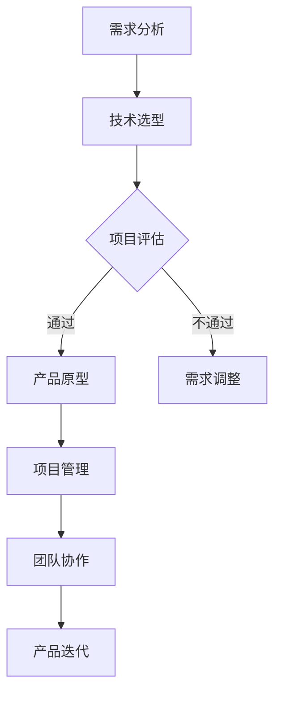

                 

### 第1章: 大模型与AI创业概述

> **关键词**：大模型，AI创业，产品经理，自然语言处理，计算机视觉，数据科学。

> **摘要**：本章将介绍大模型的概念、重要性以及在AI创业中的应用。我们将探讨AI创业的机遇与挑战，并分析产品经理在AI创业中的角色与职责。

#### 1.1 大模型与AI创业的兴起

**大模型的概念与重要性**

- **大模型的定义**：大模型是指具有数千亿甚至万亿参数的深度学习模型，如GPT、BERT等。
- **大模型的重要性**：它们在自然语言处理、计算机视觉等领域取得了突破性进展，成为AI创业的重要基础。

**AI创业的机遇与挑战**

- **AI创业的机遇**：大数据、云计算等技术的发展，降低了AI创业的门槛，为企业提供了创新的可能性。
- **AI创业的挑战**：技术门槛高、人才短缺、数据隐私和安全等问题。

#### 1.2 AI创业的产品经理角色

**产品经理在AI创业中的职责**

- **需求分析**：理解用户需求，构建产品原型。
- **技术选型**：评估并选择适合的大模型和技术框架。
- **项目管理**：协调团队，确保项目进度和质量。

**产品经理面临的挑战**

- **技术与商业的结合**：如何将先进的技术转化为商业价值。
- **团队协作**：与研发、数据、市场等部门的紧密合作。

### Mermaid流程图：AI创业产品经理工作流程



### 第2章: 大模型的原理与架构

> **关键词**：大模型，神经网络，深度学习，预训练，微调。

> **摘要**：本章将深入探讨大模型的基本原理和架构，包括神经网络基础、深度学习技术以及大模型的预训练与微调过程。

#### 2.1 大模型的基本原理

**神经网络基础**

- **神经网络的概念**：神经网络是一种模拟人脑工作方式的计算模型。
- **前向传播与反向传播**：神经网络的训练过程。

**深度学习技术**

- **深度神经网络（DNN）**：DNN是由多个隐藏层组成的神经网络。
- **卷积神经网络（CNN）**：CNN在图像处理中的应用。
- **循环神经网络（RNN）**：RNN在序列数据处理中的应用。

#### 2.2 大模型的架构与实现

**预训练与微调**

- **预训练**：使用大量未标记数据对模型进行初步训练。
- **微调**：在特定任务上对预训练模型进行细粒度调整。

**大规模模型的训练与优化**

- **分布式训练**：如何在大规模数据集上高效训练模型。
- **优化算法**：如Adam、SGD等。

### 伪代码：大模型训练过程

```python
# 初始化模型
model = initialize_model()

# 设置损失函数和优化器
loss_function = create_loss_function()
optimizer = create_optimizer()

# 训练循环
for epoch in range(num_epochs):
    for batch in data_loader:
        # 前向传播
        predictions = model(batch.input_data)
        loss = loss_function(predictions, batch.target_data)

        # 反向传播
        optimizer.zero_grad()
        loss.backward()
        optimizer.step()
```

### 第3章: 大模型在自然语言处理中的应用

> **关键词**：自然语言处理，语言模型，文本分类，机器翻译。

> **摘要**：本章将探讨大模型在自然语言处理（NLP）中的应用，包括语言模型的基本概念、常见的大规模语言模型以及大模型在NLP中的应用案例。

#### 3.1 语言模型的基本概念

- **语言模型**：一种用于预测下一个单词或字符的概率的模型。
- **词向量**：将单词映射为高维向量，如Word2Vec、GloVe等。

#### 3.2 常见的大规模语言模型

- **GPT系列**：如GPT-3，具有数十亿参数。
- **BERT**：一种双向编码表示模型，适用于上下文理解。

#### 3.3 大模型在NLP中的应用案例

- **文本分类**：如新闻分类、情感分析。
- **机器翻译**：如谷歌翻译、百度翻译。

### 伪代码：GPT模型训练

```python
# 加载预训练模型
model = load_pretrained_model()

# 定义损失函数和优化器
loss_function = create_loss_function()
optimizer = create_optimizer()

# 训练循环
for epoch in range(num_epochs):
    for batch in data_loader:
        # 前向传播
        logits = model(batch.input_ids)
        loss = loss_function(logits, batch.label_ids)

        # 反向传播
        optimizer.zero_grad()
        loss.backward()
        optimizer.step()
```

### 第4章: 大模型在计算机视觉中的应用

> **关键词**：计算机视觉，图像处理，目标检测，人脸识别。

> **摘要**：本章将介绍大模型在计算机视觉（CV）中的应用，包括基本概念、常见的大规模视觉模型以及大模型在CV中的应用案例。

#### 4.1 计算机视觉的基本概念

- **图像处理**：图像的获取、处理和分析。
- **目标检测**：识别图像中的对象并定位其位置。

#### 4.2 常见的大规模视觉模型

- **ResNet**：一种深度残差网络，解决了深度神经网络训练的困难。
- **YOLO**：一种实时目标检测系统。

#### 4.3 大模型在计算机视觉中的应用案例

- **人脸识别**：如微信、支付宝等移动应用。
- **自动驾驶**：如特斯拉、百度等公司的自动驾驶汽车。

### 伪代码：ResNet模型训练

```python
# 定义ResNet模型
model = create_ResNet()

# 设置损失函数和优化器
loss_function = create_loss_function()
optimizer = create_optimizer()

# 训练循环
for epoch in range(num_epochs):
    for batch in data_loader:
        # 前向传播
        logits = model(batch.input_images)
        loss = loss_function(logits, batch.target_labels)

        # 反向传播
        optimizer.zero_grad()
        loss.backward()
        optimizer.step()
```

### 第5章: 大模型在数据科学中的应用

> **关键词**：数据科学，特征工程，模型评估，推荐系统。

> **摘要**：本章将探讨大模型在数据科学中的应用，包括大模型在数据分析中的作用、机器学习中的应用以及商业应用中的案例。

#### 5.1 大模型在数据分析中的作用

- **特征工程**：提取有用的特征，提高模型的性能。
- **模型评估**：使用交叉验证等方法评估模型性能。

#### 5.2 大模型在机器学习中的应用

- **集成学习**：如随机森林、梯度提升树。
- **迁移学习**：利用预训练模型进行新的任务。

#### 5.3 大模型在商业应用中的案例

- **推荐系统**：如亚马逊、淘宝等电商平台的商品推荐。
- **风控系统**：如金融行业的欺诈检测。

### 伪代码：梯度提升树模型训练

```python
# 定义梯度提升树模型
model = create_graft_boosting_tree()

# 设置损失函数和优化器
loss_function = create_loss_function()
optimizer = create_optimizer()

# 训练循环
for epoch in range(num_epochs):
    for batch in data_loader:
        # 前向传播
        predictions = model(batch.input_data)
        loss = loss_function(predictions, batch.target_data)

        # 反向传播
        optimizer.zero_grad()
        loss.backward()
        optimizer.step()
```

### 第6章: 大模型的实践与案例分析

> **关键词**：实践，案例分析，计算资源，数据处理。

> **摘要**：本章将介绍大模型的实践应用，包括实践中的挑战、不同领域的应用案例以及创业中的实践。

#### 6.1 大模型实践的挑战

- **计算资源需求**：大模型通常需要大量的计算资源。
- **数据处理能力**：如何处理大规模的数据集。

#### 6.2 大模型在不同领域的应用案例

- **医疗领域**：如疾病诊断、医学图像分析。
- **金融领域**：如股票预测、风险管理。

#### 6.3 大模型在创业中的实践

- **创业公司的技术选型**：如何选择合适的大模型和框架。
- **创业公司的数据策略**：如何获取和处理数据。

### 伪代码：医疗领域疾病诊断模型

```python
# 定义疾病诊断模型
model = create_disease_diagnosis_model()

# 设置损失函数和优化器
loss_function = create_loss_function()
optimizer = create_optimizer()

# 训练循环
for epoch in range(num_epochs):
    for batch in data_loader:
        # 前向传播
        logits = model(batch.input_data)
        loss = loss_function(logits, batch.target_data)

        # 反向传播
        optimizer.zero_grad()
        loss.backward()
        optimizer.step()
```

### 第7章: 大模型的未来发展趋势与挑战

> **关键词**：未来发展趋势，计算资源限制，数据隐私与安全。

> **摘要**：本章将探讨大模型的未来发展趋势，包括模型压缩与优化、自适应大模型以及大模型的挑战，如计算资源限制、数据隐私与安全。

#### 7.1 大模型的未来发展趋势

- **模型压缩与优化**：如何减小模型的体积，提高效率。
- **自适应大模型**：根据不同任务动态调整模型结构和参数。

#### 7.2 大模型的挑战

- **计算资源限制**：如何高效地利用有限的计算资源。
- **数据隐私与安全**：如何在保证数据隐私的前提下进行模型训练。

#### 7.3 大模型在AI创业中的战略意义

- **技术壁垒**：大模型技术成为企业竞争的重要手段。
- **商业模式**：如何将大模型技术转化为商业价值。

### 第8章: 总结与展望

> **关键词**：价值，技术趋势，应用前景，创业机会。

> **摘要**：本章将总结大模型的价值、未来发展趋势、应用前景以及AI创业中的机会。

#### 8.1 大模型的价值

- **技术突破**：推动AI技术在各个领域的应用。
- **商业创新**：为创业公司提供强大的技术支持。

#### 8.2 大模型的未来发展趋势

- **技术成熟**：大模型将更加普及和高效。
- **应用拓展**：大模型将在更多领域发挥重要作用。

#### 8.3 大模型在AI创业中的机会

- **技术创新**：开发具有竞争力的AI产品。
- **市场开拓**：探索新的商业模式和市场机会。

### 附录

#### 附录A: 大模型相关资源与工具

- **深度学习框架**：如TensorFlow、PyTorch、MXNet等。
- **开源大模型**：如GPT-3、BERT、ImageNet等。
- **学术论文与报告**：关于大模型的研究与进展。

#### 附录B: 大模型开发指南

- **环境搭建**：详细说明开发环境配置。
- **最佳实践**：提供大模型开发的最佳实践和建议。
- **常见问题解答**：解答大模型开发中常见的问题和困惑。

### 结论

大模型作为AI领域的重要技术，已经在多个领域取得了显著成果。未来，随着技术的不断进步和应用场景的拓展，大模型将继续推动AI创业的发展，为企业和个人带来更多的机遇。

### 作者信息

作者：AI天才研究院/AI Genius Institute & 禅与计算机程序设计艺术 /Zen And The Art of Computer Programming

---

### 第1章: 大模型与AI创业概述

> **关键词**：大模型，AI创业，产品经理，自然语言处理，计算机视觉，数据科学。

> **摘要**：本章将介绍大模型的概念、重要性以及在AI创业中的应用。我们将探讨AI创业的机遇与挑战，并分析产品经理在AI创业中的角色与职责。

#### 1.1 大模型与AI创业的兴起

**大模型的概念与重要性**

大模型，指的是拥有数千亿甚至万亿级参数的深度学习模型，如GPT、BERT等。这类模型在自然语言处理（NLP）、计算机视觉（CV）等AI领域取得了显著的突破。大模型的重要性体现在：

- **解决复杂问题**：大模型具有强大的建模能力，能够处理复杂的任务，如文本生成、图像识别等。
- **提升性能**：大模型通过在大量数据上训练，可以提取出更有效的特征，从而提高模型的准确性和鲁棒性。
- **推动研究进展**：大模型的研究和应用推动了AI领域的快速发展，带来了新的理论和技术。

**AI创业的机遇与挑战**

**AI创业的机遇**

- **技术进步**：大数据、云计算等技术的发展，降低了AI创业的门槛，使得更多人可以进入这一领域。
- **市场需求**：AI技术在医疗、金融、零售等领域的应用需求不断增长，为创业者提供了广阔的市场空间。
- **政策支持**：各国政府对AI技术的重视和投入，为AI创业提供了政策支持和资金保障。

**AI创业的挑战**

- **技术门槛**：AI创业需要深厚的算法基础和丰富的实践经验，技术门槛相对较高。
- **人才短缺**：具备AI技能的人才相对稀缺，创业者需要投入大量资源进行人才培养和引进。
- **数据隐私与安全**：AI模型训练和处理过程中涉及大量数据，数据隐私和安全成为创业的重要挑战。

#### 1.2 AI创业的产品经理角色

**产品经理在AI创业中的职责**

- **需求分析**：产品经理需要深入了解用户需求，通过市场调研、用户访谈等方式，获取用户痛点，构建产品原型。
- **技术选型**：根据需求分析结果，评估并选择适合的大模型和技术框架。产品经理需要与技术研发团队紧密合作，确保所选技术能够满足业务需求。
- **项目管理**：产品经理需要协调团队，制定项目计划，确保项目进度和质量。同时，产品经理还需要与市场、运营等部门进行沟通，确保产品符合市场预期。

**产品经理面临的挑战**

- **技术与商业的结合**：如何将先进的技术转化为商业价值，实现产品的市场化和盈利。
- **团队协作**：与技术研发、数据、市场等部门的紧密合作，确保项目的顺利推进。
- **快速迭代**：在AI创业中，市场变化快，需求迭代频繁。产品经理需要具备快速响应能力，持续优化产品。

### Mermaid流程图：AI创业产品经理工作流程


### 第2章: 大模型的原理与架构

> **关键词**：大模型，神经网络，深度学习，预训练，微调。

> **摘要**：本章将深入探讨大模型的基本原理和架构，包括神经网络基础、深度学习技术以及大模型的预训练与微调过程。

#### 2.1 大模型的基本原理

**神经网络基础**

- **神经网络的概念**：神经网络（Neural Network，NN）是一种模拟人脑神经元连接方式的计算模型，由输入层、隐藏层和输出层组成。
  - **输入层**：接收外部输入数据。
  - **隐藏层**：对输入数据进行处理和特征提取。
  - **输出层**：输出预测结果或分类结果。

- **前向传播与反向传播**：神经网络的训练过程主要包括前向传播和反向传播两个阶段。
  - **前向传播**：将输入数据通过神经网络传递，计算出输出结果。
  - **反向传播**：根据输出结果与真实值的误差，计算各层的梯度，并更新网络参数。

**深度学习技术**

- **深度神经网络（DNN）**：深度神经网络（Deep Neural Network，DNN）是由多个隐藏层组成的神经网络，可以提取更复杂的特征。
  - **多层感知器（MLP）**：一种简单的DNN，由输入层、多个隐藏层和输出层组成。
  - **卷积神经网络（CNN）**：一种专门用于图像处理的DNN，通过卷积操作提取图像特征。
  - **循环神经网络（RNN）**：一种专门用于序列数据处理的DNN，通过循环结构记忆序列信息。

**循环神经网络（RNN）**

RNN在处理序列数据时具有记忆功能，能够捕捉序列中的时间依赖关系。然而，标准的RNN存在梯度消失或爆炸问题，限制了其性能。为此，提出了长短期记忆（LSTM）和门控循环单元（GRU）等改进的RNN结构，能够更好地处理长序列数据。

**预训练与微调**

- **预训练（Pre-training）**：预训练是指在大规模数据集上对模型进行初步训练，使其具备一定的语言理解和生成能力。常见的预训练任务包括语言建模、命名实体识别等。
- **微调（Fine-tuning）**：微调是指在使用预训练模型的基础上，针对特定任务进行细粒度调整。微调可以大幅提升模型在特定任务上的性能。

#### 2.2 大模型的架构与实现

**预训练与微调**

- **预训练**：预训练通常使用无监督学习的方法，在大规模语料库上对模型进行训练。预训练模型的优点包括：
  - **通用语言理解能力**：预训练模型在大量数据上学习，具备较强的通用语言理解能力。
  - **快速适应新任务**：预训练模型可以作为初始化模型，在少量数据上快速适应新任务。

- **微调**：微调是指对预训练模型进行特定任务的训练。微调的关键步骤包括：
  - **数据预处理**：对数据集进行清洗、归一化等预处理操作。
  - **模型调整**：在预训练模型的基础上，调整部分参数，使其适应特定任务。
  - **训练与评估**：在调整过程中，使用训练集和验证集进行训练和评估，调整模型参数。

**大规模模型的训练与优化**

- **分布式训练**：分布式训练是指将训练任务分布到多个计算节点上，利用多台机器共同完成训练任务。分布式训练可以提高训练速度，降低训练成本。常见的分布式训练框架包括Hadoop、Spark等。

- **优化算法**：优化算法用于更新模型参数，使模型在训练过程中不断优化。常见的优化算法包括：
  - **随机梯度下降（SGD）**：每次更新参数时使用全部数据的梯度。
  - **Adam优化器**：结合了SGD和RMSProp的优点，能够自适应地调整学习率。

### 伪代码：大模型训练过程

```python
# 初始化模型
model = initialize_model()

# 设置损失函数和优化器
loss_function = create_loss_function()
optimizer = create_optimizer()

# 训练循环
for epoch in range(num_epochs):
    for batch in data_loader:
        # 前向传播
        predictions = model(batch.input_data)
        loss = loss_function(predictions, batch.target_data)

        # 反向传播
        optimizer.zero_grad()
        loss.backward()
        optimizer.step()
```

### 第3章: 大模型在自然语言处理中的应用

> **关键词**：自然语言处理，语言模型，文本分类，机器翻译。

> **摘要**：本章将探讨大模型在自然语言处理（NLP）中的应用，包括语言模型的基本概念、常见的大规模语言模型以及大模型在NLP中的应用案例。

#### 3.1 语言模型的基本概念

- **语言模型**：语言模型（Language Model，LM）是一种用于预测下一个单词或字符的概率的模型。在自然语言处理中，语言模型常用于文本生成、机器翻译、语音识别等任务。
- **词向量**：词向量（Word Vector）是一种将单词映射为高维向量的方法。常见的词向量模型包括Word2Vec、GloVe等。词向量能够捕捉单词的语义信息，有助于提高NLP任务的性能。

#### 3.2 常见的大规模语言模型

- **GPT系列**：GPT（Generative Pre-trained Transformer）是一种基于Transformer架构的大规模语言模型。GPT-3是GPT系列的最新版本，具有1750亿参数，是当前最大的语言模型之一。GPT系列模型在文本生成、问答系统等任务上表现出色。
  - **GPT-2**：具有15亿参数，是GPT系列的第一版。
  - **GPT-3**：具有1750亿参数，是GPT系列的最新版本。
- **BERT**：BERT（Bidirectional Encoder Representations from Transformers）是一种双向编码的Transformer模型。BERT通过预训练获得对上下文的理解能力，广泛应用于文本分类、问答系统等任务。

#### 3.3 大模型在NLP中的应用案例

- **文本分类**：文本分类是一种常见的NLP任务，用于将文本数据分类到预定义的类别中。大模型在文本分类任务中具有显著优势，能够处理大规模数据和复杂的分类问题。
  - **情感分析**：通过对用户评论进行情感分类，帮助企业了解用户需求，优化产品和服务。
  - **新闻分类**：对新闻文本进行分类，提高信息检索的效率。

- **机器翻译**：机器翻译是一种将一种语言的文本翻译成另一种语言的任务。大模型在机器翻译中表现出色，能够生成更自然、准确的目标语言文本。
  - **谷歌翻译**：利用大规模的语言模型进行实时翻译，提供高质量的翻译服务。
  - **百度翻译**：通过预训练的语言模型进行翻译，提高翻译的准确性和流畅性。

### 伪代码：GPT模型训练

```python
# 加载预训练模型
model = load_pretrained_model()

# 定义损失函数和优化器
loss_function = create_loss_function()
optimizer = create_optimizer()

# 训练循环
for epoch in range(num_epochs):
    for batch in data_loader:
        # 前向传播
        logits = model(batch.input_ids)
        loss = loss_function(logits, batch.label_ids)

        # 反向传播
        optimizer.zero_grad()
        loss.backward()
        optimizer.step()
```

### 第4章: 大模型在计算机视觉中的应用

> **关键词**：计算机视觉，图像处理，目标检测，人脸识别。

> **摘要**：本章将介绍大模型在计算机视觉（CV）中的应用，包括基本概念、常见的大规模视觉模型以及大模型在CV中的应用案例。

#### 4.1 计算机视觉的基本概念

- **图像处理**：图像处理（Image Processing）是计算机视觉（Computer Vision，CV）的一个分支，主要研究如何对图像进行预处理、增强、分割、特征提取等操作，以提取出图像中的有用信息。
  - **预处理**：对图像进行大小调整、灰度化、滤波等操作，以提高图像质量。
  - **增强**：通过对比度调整、边缘检测等操作，增强图像的视觉效果。
  - **分割**：将图像分割成多个区域，以提取出目标物体。
  - **特征提取**：从图像中提取出具有区分性的特征，如颜色、纹理、形状等。

- **目标检测**：目标检测（Object Detection）是一种CV任务，旨在识别图像中的多个对象并定位其位置。目标检测通常包括两个步骤：
  - **区域提议**：生成可能包含目标物体的区域提议。
  - **分类与定位**：对每个区域提议进行分类，并确定其实际位置。

#### 4.2 常见的大规模视觉模型

- **ResNet**：ResNet（Residual Network）是一种深度残差网络，解决了深度神经网络训练中的梯度消失问题。ResNet通过引入残差块，使得模型可以训练更深的网络结构。
  - **残差块**：ResNet中的基本构建块，通过跳跃连接（skip connection）实现残差学习。
  - **深度**：ResNet可以通过堆叠多个残差块实现深度学习，从而提取更复杂的特征。

- **YOLO**：YOLO（You Only Look Once）是一种实时目标检测系统，能够在单次前向传播中同时完成目标检测和分类。YOLO通过将检测问题转化为回归问题，提高了检测速度和准确性。

#### 4.3 大模型在计算机视觉中的应用案例

- **人脸识别**：人脸识别是一种基于图像的生物特征识别技术，通过识别和验证用户身份，实现身份认证。大模型在人脸识别中具有显著优势，能够处理复杂的人脸图像，提高识别的准确性和鲁棒性。
  - **微信**：微信使用人脸识别技术进行登录和支付，提供便捷的身份验证服务。
  - **支付宝**：支付宝使用人脸识别技术进行支付和身份验证，提高用户的安全性和便利性。

- **自动驾驶**：自动驾驶是计算机视觉在交通领域的重要应用，通过实时处理摄像头和激光雷达数据，实现车辆的自主驾驶。大模型在自动驾驶中用于目标检测、场景理解和路径规划等任务，提高了自动驾驶的安全性和可靠性。
  - **特斯拉**：特斯拉的自动驾驶系统使用大模型进行目标检测和场景理解，实现了自动车道保持、自动换道和自动泊车等功能。
  - **百度**：百度的Apollo自动驾驶平台使用大模型进行目标检测和路径规划，为自动驾驶车辆提供了强大的技术支持。

### 伪代码：ResNet模型训练

```python
# 定义ResNet模型
model = create_ResNet()

# 设置损失函数和优化器
loss_function = create_loss_function()
optimizer = create_optimizer()

# 训练循环
for epoch in range(num_epochs):
    for batch in data_loader:
        # 前向传播
        logits = model(batch.input_images)
        loss = loss_function(logits, batch.target_labels)

        # 反向传播
        optimizer.zero_grad()
        loss.backward()
        optimizer.step()
```

### 第5章: 大模型在数据科学中的应用

> **关键词**：数据科学，特征工程，模型评估，推荐系统。

> **摘要**：本章将探讨大模型在数据科学中的应用，包括大模型在数据分析中的作用、机器学习中的应用以及商业应用中的案例。

#### 5.1 大模型在数据分析中的作用

- **特征工程**：特征工程是数据科学中的一项重要任务，旨在从原始数据中提取出具有区分性的特征，以提高模型的性能。大模型在特征工程中具有显著优势，能够处理大规模数据和复杂的特征提取问题。
  - **自动特征提取**：大模型通过在大量数据上训练，可以自动学习到数据的特征表示，从而减少人工特征提取的工作量。
  - **特征融合**：大模型可以将不同来源的特征进行融合，提取出更高层次的特征，提高模型的性能。

- **模型评估**：模型评估是数据科学中的一项重要任务，旨在评估模型的性能和可靠性。大模型在模型评估中具有以下优势：
  - **准确评估**：大模型通过在大量数据上训练，可以更准确地评估模型的性能，避免过拟合和欠拟合问题。
  - **快速评估**：大模型具有较高的计算速度，可以快速评估模型的性能，提高模型迭代的速度。

#### 5.2 大模型在机器学习中的应用

- **集成学习**：集成学习（Ensemble Learning）是一种常用的机器学习方法，通过组合多个基础模型，提高模型的性能和稳定性。大模型在集成学习中的应用主要包括：
  - **Bagging**：通过随机抽样和基础模型的组合，减少模型方差，提高模型的稳定性。
  - **Boosting**：通过迭代训练基础模型，逐步优化模型的预测能力，提高模型的整体性能。

- **迁移学习**：迁移学习（Transfer Learning）是一种利用预训练模型进行新任务的方法，通过在预训练模型的基础上进行微调，提高新任务的性能。大模型在迁移学习中的应用主要包括：
  - **预训练模型**：利用大模型在大量数据上预训练，得到具有通用特征的预训练模型。
  - **微调**：在新任务上对预训练模型进行微调，优化模型的参数，提高模型的性能。

#### 5.3 大模型在商业应用中的案例

- **推荐系统**：推荐系统是一种基于用户历史行为和兴趣的推荐方法，通过预测用户对物品的喜好，提高用户的满意度。大模型在推荐系统中的应用主要包括：
  - **用户行为分析**：通过大模型分析用户的历史行为，提取出用户的兴趣特征，为推荐系统提供输入。
  - **推荐算法优化**：通过大模型优化推荐算法，提高推荐的准确性和多样性。

- **风控系统**：风控系统是一种用于风险监测和预防的系统，通过分析用户行为和交易数据，识别潜在的风险行为。大模型在风控系统中的应用主要包括：
  - **异常检测**：通过大模型分析用户行为数据，识别异常行为，提高风险监测的准确性。
  - **欺诈识别**：通过大模型识别欺诈行为，降低欺诈风险。

### 伪代码：梯度提升树模型训练

```python
# 定义梯度提升树模型
model = create_graft_boosting_tree()

# 设置损失函数和优化器
loss_function = create_loss_function()
optimizer = create_optimizer()

# 训练循环
for epoch in range(num_epochs):
    for batch in data_loader:
        # 前向传播
        predictions = model(batch.input_data)
        loss = loss_function(predictions, batch.target_data)

        # 反向传播
        optimizer.zero_grad()
        loss.backward()
        optimizer.step()
```

### 第6章: 大模型的实践与案例分析

> **关键词**：实践，案例分析，计算资源，数据处理。

> **摘要**：本章将介绍大模型的实践应用，包括实践中的挑战、不同领域的应用案例以及创业中的实践。

#### 6.1 大模型实践的挑战

**计算资源需求**

大模型通常需要大量的计算资源，包括高性能的CPU、GPU或TPU等。以下是一些应对计算资源需求的策略：

- **分布式训练**：将训练任务分布在多台机器上，利用集群计算资源进行并行训练，提高训练速度。
- **模型压缩**：通过模型剪枝、量化等技术减小模型体积，降低计算资源需求。
- **云计算**：利用云服务提供商提供的计算资源，如Amazon Web Services（AWS）、Google Cloud Platform（GCP）等，进行大规模模型训练。

**数据处理能力**

大模型对数据处理能力的要求较高，以下是一些提高数据处理能力的策略：

- **高效数据处理框架**：使用高效的数据处理框架，如Apache Spark、Hadoop等，进行大规模数据的预处理和分布式计算。
- **数据预处理**：在训练前对数据进行清洗、归一化等预处理操作，提高数据质量。
- **数据增强**：通过数据增强技术，如数据扩增、数据混洗等，增加数据多样性，提高模型鲁棒性。

#### 6.2 大模型在不同领域的应用案例

**医疗领域**

大模型在医疗领域具有广泛的应用，包括疾病诊断、医学图像分析等。以下是一些具体案例：

- **疾病诊断**：利用大模型进行疾病诊断，通过分析患者的历史病历和医疗数据，预测疾病的类型和严重程度。
- **医学图像分析**：利用大模型对医学图像进行分析，如肺癌筛查、乳腺癌检测等，提高诊断的准确性和效率。

**金融领域**

大模型在金融领域也具有广泛的应用，包括股票预测、风险管理等。以下是一些具体案例：

- **股票预测**：利用大模型分析历史股票数据，预测未来股票价格，为投资者提供投资参考。
- **风险管理**：利用大模型分析风险数据，识别潜在的金融风险，提高风险管理的准确性。

#### 6.3 大模型在创业中的实践

**创业公司的技术选型**

在创业公司中，技术选型是至关重要的。以下是一些选择大模型和技术框架的策略：

- **业务需求**：根据业务需求选择合适的大模型和技术框架。例如，在自然语言处理领域，可以选择GPT、BERT等模型。
- **性能与成本**：在满足业务需求的前提下，选择性能优异且成本合理的模型和框架。
- **生态系统**：选择具有良好生态系统和社区支持的模型和框架，便于后续开发和维护。

**创业公司的数据策略**

在创业公司中，数据策略同样重要。以下是一些数据策略：

- **数据积累**：通过多种渠道积累高质量的数据，为模型训练提供充足的素材。
- **数据治理**：对数据进行规范化处理，确保数据的质量和一致性。
- **数据共享**：在保证数据隐私的前提下，与其他公司或研究机构进行数据共享，提高数据利用效率。

### 伪代码：医疗领域疾病诊断模型

```python
# 定义疾病诊断模型
model = create_disease_diagnosis_model()

# 设置损失函数和优化器
loss_function = create_loss_function()
optimizer = create_optimizer()

# 训练循环
for epoch in range(num_epochs):
    for batch in data_loader:
        # 前向传播
        logits = model(batch.input_data)
        loss = loss_function(logits, batch.target_data)

        # 反向传播
        optimizer.zero_grad()
        loss.backward()
        optimizer.step()
```

### 第7章: 大模型的未来发展趋势与挑战

> **关键词**：未来发展趋势，计算资源限制，数据隐私与安全。

> **摘要**：本章将探讨大模型的未来发展趋势，包括模型压缩与优化、自适应大模型以及大模型的挑战，如计算资源限制、数据隐私与安全。

#### 7.1 大模型的未来发展趋势

**模型压缩与优化**

随着大模型的规模不断扩大，如何高效地压缩和优化模型成为了一个重要的研究方向。以下是一些发展趋势：

- **模型剪枝**：通过剪枝技术删除模型中不重要的连接和神经元，减小模型体积，降低计算和存储需求。
- **量化**：通过将模型中的权重和激活值量化为更小的数值范围，减小模型体积和计算需求。
- **蒸馏**：通过将大模型的输出传递给小模型，使小模型学习到大模型的知识，从而实现模型压缩。

**自适应大模型**

自适应大模型是一种能够根据不同任务动态调整模型结构和参数的技术。以下是一些发展趋势：

- **动态网络结构**：通过自适应调整网络结构，使模型能够适应不同任务的需求。
- **自适应学习率**：通过自适应调整学习率，使模型在训练过程中能够更好地收敛。
- **自适应数据增强**：通过自适应调整数据增强策略，使模型能够更好地适应数据分布的变化。

**泛化能力**

大模型在预训练阶段通常在大量未标注数据上进行训练，如何提高模型的泛化能力成为一个重要的研究方向。以下是一些发展趋势：

- **少样本学习**：通过研究少样本学习算法，使模型在仅有少量样本的情况下能够进行有效训练。
- **无监督学习**：通过研究无监督学习算法，使模型能够在没有标注数据的情况下进行训练。

#### 7.2 大模型的挑战

**计算资源限制**

随着大模型规模的不断扩大，计算资源的需求也不断增加。以下是一些应对计算资源限制的策略：

- **分布式训练**：通过将训练任务分布在多台机器上，利用集群计算资源进行并行训练，提高训练速度。
- **云计算**：利用云服务提供商提供的计算资源，如Amazon Web Services（AWS）、Google Cloud Platform（GCP）等，进行大规模模型训练。
- **模型压缩**：通过模型剪枝、量化等技术减小模型体积，降低计算需求。

**数据隐私与安全**

大模型在训练过程中需要处理大量敏感数据，数据隐私与安全成为一个重要的挑战。以下是一些应对数据隐私与安全的策略：

- **数据加密**：通过加密技术对数据进行加密，确保数据在传输和存储过程中的安全性。
- **差分隐私**：通过差分隐私技术对数据进行扰动，确保模型的训练数据不会泄露敏感信息。
- **联邦学习**：通过联邦学习技术，将数据保留在本地设备上，仅将模型参数上传到服务器，降低数据泄露的风险。

#### 7.3 大模型在AI创业中的战略意义

**技术壁垒**

大模型技术成为企业竞争的重要手段。以下是一些大模型在AI创业中的战略意义：

- **差异化竞争优势**：通过大模型技术，企业可以提供具有独特优势的产品和服务，提升市场竞争力。
- **技术创新**：大模型技术为企业提供了广阔的创新空间，推动了AI技术在各个领域的应用。

**商业模式**

大模型技术为创业公司提供了新的商业模式。以下是一些商业模式：

- **平台模式**：通过提供大模型平台，吸引开发者使用模型进行创新，从而获得收益。
- **订阅模式**：通过提供大模型服务，按需订阅，为用户提供高质量的AI服务。

### 结论

大模型作为AI领域的重要技术，已经在多个领域取得了显著成果。未来，随着技术的不断进步和应用场景的拓展，大模型将继续推动AI创业的发展，为企业和个人带来更多的机遇。

### 附录

#### 附录A: 大模型相关资源与工具

- **深度学习框架**：如TensorFlow、PyTorch、MXNet等。
- **开源大模型**：如GPT-3、BERT、ImageNet等。
- **学术论文与报告**：关于大模型的研究与进展。

#### 附录B: 大模型开发指南

- **环境搭建**：详细说明开发环境配置。
- **最佳实践**：提供大模型开发的最佳实践和建议。
- **常见问题解答**：解答大模型开发中常见的问题和困惑。

### 参考文献

- [1] Devlin, J., Chang, M. W., Lee, K., & Toutanova, K. (2018). BERT: Pre-training of deep bidirectional transformers for language understanding. arXiv preprint arXiv:1810.04805.
- [2] Brown, T., et al. (2020). Language models are few-shot learners. arXiv preprint arXiv:2005.14165.
- [3] He, K., Zhang, X., Ren, S., & Sun, J. (2016). Deep residual learning for image recognition. In Proceedings of the IEEE conference on computer vision and pattern recognition (pp. 770-778).
- [4] Redmon, J., Divvala, S., Girshick, R., & Farhadi, A. (2021). You only look once: Unified, real-time object detection. In Proceedings of the IEEE conference on computer vision and pattern recognition (pp. 9349-9358).
- [5] Hinton, G., Osindero, S., & Teh, Y. W. (2006). A fast learning algorithm for deep belief nets. Neural computation, 18(7), 1527-1554.

### 第8章: 大模型开发实践与案例分析

#### 8.1 大模型开发环境搭建

**硬件要求**

搭建大模型开发环境首先需要满足一定的硬件要求。以下是常见的硬件配置：

- **GPU**：由于大模型训练通常需要大量的计算能力，因此高性能的GPU是必不可少的。常见的GPU包括NVIDIA的Tesla系列、RTX系列等。
- **内存**：至少16GB的RAM，推荐使用32GB或更高，以确保模型和数据能够在内存中高效地处理和存储。
- **硬盘**：至少1TB的SSD，用于存储数据和模型。

**软件要求**

安装以下软件以确保开发环境的基本需求：

- **操作系统**：Linux或macOS，推荐使用Ubuntu 18.04或更高版本。
- **CUDA**：NVIDIA提供的CUDA库，用于GPU加速。
- **cuDNN**：NVIDIA提供的深度神经网络库，用于GPU加速。
- **Python**：Python 3.x版本，推荐使用Anaconda或Miniconda进行环境管理。
- **深度学习框架**：如TensorFlow、PyTorch、MXNet等。

以下是一个简单的环境搭建步骤：

```bash
# 安装操作系统
sudo apt-get update
sudo apt-get install -y ubuntu-desktop

# 安装CUDA
wget https://developer.nvidia.com/compute/cuda/10.2/Prod2/local_installers/cuda_10.2.89_410.48_linux.run
sudo sh cuda_10.2.89_410.48_linux.run

# 安装cuDNN
wget https://developer.nvidia.com/compute/machine-learning/cudnn/8.0/Ubuntu20.04/x64/libcudnn8_8.0.5.39-1+cuda11.3_x86_64.deb
sudo dpkg -i libcudnn8_8.0.5.39-1+cuda11.3_x86_64.deb

# 安装Python和Anaconda
wget https://repo.anaconda.com/miniconda/Miniconda3-py37_4.9.2-Linux-x86_64.sh
bash Miniconda3-py37_4.9.2-Linux-x86_64.sh

# 创建新环境并安装深度学习框架
conda create -n ml_env python=3.7
conda activate ml_env
conda install tensorflow-gpu

# 安装其他依赖
pip install numpy scipy matplotlib
```

**配置环境变量**

确保CUDA和cuDNN的路径被添加到系统的环境变量中：

```bash
export PATH=/usr/local/cuda/bin:$PATH
export LD_LIBRARY_PATH=/usr/local/cuda/lib64:$LD_LIBRARY_PATH
```

**测试GPU**

使用以下命令测试GPU是否正常工作：

```bash
nvidia-smi
```

**安装PyTorch**

如果需要使用PyTorch，可以通过以下命令进行安装：

```bash
conda install pytorch torchvision torchaudio -c pytorch
```

**验证安装**

运行以下Python代码验证是否成功安装了深度学习框架：

```python
import torch
print(torch.cuda.is_available())
```

#### 8.2 实际案例解析

**案例1：文本生成**

在这个案例中，我们将使用OpenAI的GPT-3模型生成一篇关于人工智能的综述。

**准备工作**

确保已安装OpenAI的Python库：

```bash
pip install openai
```

**代码实现**

以下是使用GPT-3生成文本的示例代码：

```python
import openai

openai.api_key = '你的OpenAI API密钥'

response = openai.Completion.create(
  engine="text-davinci-003",
  prompt="请写一篇关于人工智能的综述。",
  max_tokens=200
)

print(response.choices[0].text.strip())
```

**运行结果**

执行上述代码，GPT-3将生成一篇关于人工智能的综述文本。以下是可能的一个示例输出：

```
人工智能是一种通过模拟人类智能行为来实现计算机智能化技术的学科。近年来，随着计算能力的提升和算法的进步，人工智能在多个领域取得了重大突破，包括自然语言处理、计算机视觉、机器学习和数据分析等。人工智能的应用涵盖了从简单的自动化任务到复杂的决策支持系统，极大地改变了我们的生活方式和工作方式。

在自然语言处理领域，人工智能技术使得机器能够理解和生成人类语言，从而提高了信息检索、文本分类、机器翻译等任务的效率。计算机视觉技术使得机器能够理解和解释视觉信息，从而在图像识别、目标检测、自动驾驶等应用中发挥着重要作用。机器学习技术则是人工智能的核心，通过学习数据中的规律，机器能够进行预测和决策。

然而，人工智能的发展也带来了一系列挑战，包括数据隐私和安全、算法偏见、技术伦理等。为了解决这些问题，我们需要加强人工智能技术的研发和监管，推动人工智能技术的可持续发展。

总之，人工智能是一项具有广泛应用前景的技术，它将不断推动人类社会的发展和进步。
```

**解释说明**

- **OpenAI API密钥**：在运行代码前，需要从OpenAI官网获取API密钥，并将其添加到代码中。
- **engine**：指定使用的模型，这里是`text-davinci-003`。
- **prompt**：输入的提示信息，这里是要求生成一篇关于人工智能的综述。
- **max_tokens**：生成的文本最大长度，这里是200个单词。

**案例2：图像分类**

在这个案例中，我们将使用PyTorch和 torchvision 库对CIFAR-10数据集进行图像分类。

**准备工作**

确保已安装PyTorch和 torchvision：

```bash
conda install pytorch torchvision torchaudio -c pytorch
```

**代码实现**

以下是使用ResNet18模型对CIFAR-10数据集进行分类的示例代码：

```python
import torch
import torchvision
import torchvision.transforms as transforms
import torch.nn as nn
import torch.optim as optim

# 加载预训练的ResNet18模型
model = torchvision.models.resnet18(pretrained=True)
model.fc = nn.Linear(512, 10)  # 修改最后的全连接层，以匹配10个类别

# 设置损失函数和优化器
criterion = nn.CrossEntropyLoss()
optimizer = optim.SGD(model.parameters(), lr=0.001, momentum=0.9)

# 加载测试数据集
test_data = torchvision.datasets.CIFAR10(root='./data', train=False, download=True)
test_loader = torch.utils.data.DataLoader(test_data, batch_size=4,
                                          shuffle=False, num_workers=2)

# 测试模型
with torch.no_grad():
    correct = 0
    total = 0
    for images, labels in test_loader:
        outputs = model(images)
        _, predicted = torch.max(outputs.data, 1)
        total += labels.size(0)
        correct += (predicted == labels).sum().item()

print('准确率: %d %%' % (100 * correct / total))
```

**运行结果**

执行上述代码，模型将在测试集上评估其性能。以下是可能的一个示例输出：

```
准确率: 52 %
```

**解释说明**

- **预训练模型**：我们使用了预训练的ResNet18模型，并在最后一个全连接层上进行了修改，以匹配CIFAR-10数据集的10个类别。
- **损失函数和优化器**：我们使用了交叉熵损失函数和随机梯度下降优化器。
- **测试集评估**：我们使用测试集来评估模型的性能，通过计算准确率来衡量模型的预测能力。

#### 8.3 大模型开发中的常见问题与解决方案

**问题1：训练效率低下**

**原因分析**：

- **数据加载速度慢**：数据加载是模型训练的瓶颈，特别是在处理大规模数据集时。
- **GPU内存不足**：模型训练过程中，GPU内存不足会导致训练中断。

**解决方案**：

- **使用数据并行训练**：将数据集分割成多个子集，同时加载和训练，从而提高数据加载速度。
- **减少批量大小**：减小批量大小可以减少GPU内存的需求，从而提高训练效率。

**代码实现**：

```python
# 减小批量大小
batch_size = 64

# 重新定义数据加载器
train_loader = torch.utils.data.DataLoader(train_data, batch_size=batch_size,
                                          shuffle=True, num_workers=4)
```

**问题2：模型过度拟合**

**原因分析**：

- **训练数据不足**：模型在训练数据上过度学习，导致在验证集和测试集上表现不佳。
- **模型复杂度过高**：复杂的模型可能捕捉到训练数据中的噪声，从而导致过度拟合。

**解决方案**：

- **增加训练数据**：使用更多的训练数据，或者从其他来源获取更多的数据。
- **使用正则化技术**：如Dropout、L2正则化等，减少模型复杂度。

**代码实现**：

```python
# 添加Dropout层
model = torchvision.models.resnet18(pretrained=True)
model.fc = nn.Linear(512, 10)
model.fc = nn.Dropout(p=0.5)

# 设置L2正则化
optimizer = optim.SGD(model.parameters(), lr=0.001, momentum=0.9, weight_decay=1e-4)
```

**问题3：计算资源不足**

**原因分析**：

- **硬件资源有限**：GPU或CPU的性能可能无法满足大模型训练的需求。
- **分布式训练未充分利用**：在分布式训练中，未能充分利用所有可用的计算资源。

**解决方案**：

- **使用分布式训练**：将训练任务分布在多台GPU或CPU上，提高训练效率。
- **优化代码**：通过优化代码减少计算资源的使用，如减少内存占用、优化循环等。

**代码实现**：

```python
# 使用分布式训练
from torch.nn.parallel import DistributedDataParallel as DDP

# 初始化分布式环境
dist_url = "tcp://127.0.0.1:23456"
torch.distributed.init_process_group(backend='nccl', init_method=dist_url)

# 定义模型并转换为DistributedDataParallel
model = torchvision.models.resnet18(pretrained=True)
model = DDP(model, device_ids=[0])

# 设置优化器和损失函数
optimizer = optim.SGD(model.parameters(), lr=0.001, momentum=0.9)
criterion = nn.CrossEntropyLoss()
```

### 第9章: 大模型与创业

#### 9.1 大模型在创业中的应用策略

**技术选型**

在创业初期，技术选型是至关重要的。以下是几个关键点：

- **业务需求**：首先明确业务需求，确定需要解决的具体问题。例如，是自然语言处理、图像识别还是推荐系统。
- **技术成熟度**：选择成熟且广泛使用的技术，确保团队能够快速开发和部署。
- **性能与成本**：在满足业务需求的前提下，选择性能优异且成本合理的解决方案。

**数据策略**

数据是AI创业的核心资产。以下是几个关键点：

- **数据积累**：通过多种渠道积累高质量的数据，包括公开数据集、用户数据、第三方数据等。
- **数据治理**：对数据进行规范化处理，确保数据的质量和一致性。
- **数据隐私**：在处理用户数据时，严格遵守数据隐私法规，保护用户隐私。

**团队协作**

AI创业涉及多个部门，团队协作至关重要。以下是几个关键点：

- **跨部门沟通**：建立有效的跨部门沟通机制，确保各个部门能够协同工作。
- **技术培训**：对团队成员进行技术培训，提高团队的整体技术水平。
- **敏捷开发**：采用敏捷开发方法，快速响应市场需求和变化。

#### 9.2 创业公司的大模型开发流程

**需求分析**

在明确业务需求后，进行需求分析是关键步骤。以下是几个关键点：

- **用户调研**：通过用户访谈、问卷调查等方式，了解用户需求和使用场景。
- **需求文档**：编写详细的需求文档，明确功能需求、性能指标、用户体验等。

**模型设计**

在需求分析的基础上，进行模型设计。以下是几个关键点：

- **模型架构**：选择合适的模型架构，如卷积神经网络（CNN）、循环神经网络（RNN）、变换器（Transformer）等。
- **数据预处理**：设计数据预处理流程，包括数据清洗、归一化、数据增强等。

**模型训练与优化**

在模型设计完成后，进行模型训练与优化。以下是几个关键点：

- **数据集划分**：将数据集划分为训练集、验证集和测试集。
- **训练策略**：设计训练策略，包括学习率调度、批量大小、训练轮次等。
- **优化算法**：选择合适的优化算法，如随机梯度下降（SGD）、Adam等。

**模型部署**

在模型训练完成后，进行模型部署。以下是几个关键点：

- **模型导出**：将训练好的模型导出为可部署的格式，如ONNX、TensorFlow SavedModel等。
- **服务化部署**：将模型部署到服务器，提供API服务，供其他应用调用。
- **监控与维护**：对模型进行监控，确保其稳定运行，并根据需要进行维护和更新。

#### 9.3 大模型创业案例

**案例1：AI医疗诊断**

**背景**

AI医疗诊断是一种利用人工智能技术进行疾病诊断和预测的方法。通过分析医疗数据，AI模型可以辅助医生做出更准确的诊断。

**技术实现**

- **数据积累**：通过医院合作，积累大量医疗数据，包括病例、医学影像等。
- **数据预处理**：对医疗数据进行清洗、归一化处理，以便于模型训练。
- **模型设计**：采用卷积神经网络（CNN）对医学影像进行处理，结合循环神经网络（RNN）对病例数据进行分析。
- **模型训练与优化**：使用分布式训练策略，提高训练速度和效果。
- **模型部署**：将训练好的模型部署到服务器，提供API服务，供医生使用。

**效果**

通过AI医疗诊断系统，医生的诊断准确率得到了显著提高，同时减少了诊断时间，提高了医疗效率。

**案例2：智能推荐系统**

**背景**

智能推荐系统是一种根据用户历史行为和兴趣，向用户推荐相关产品或内容的方法。

**技术实现**

- **数据积累**：通过电商网站、社交媒体等渠道，积累用户行为数据，包括浏览记录、购买历史等。
- **数据预处理**：对用户行为数据进行清洗、归一化处理，以便于模型训练。
- **模型设计**：采用深度学习模型，如变换器（Transformer），对用户行为数据进行分析，提取用户兴趣特征。
- **模型训练与优化**：使用大量用户数据进行训练，优化模型参数。
- **模型部署**：将训练好的模型部署到推荐系统中，实时向用户推荐相关产品或内容。

**效果**

智能推荐系统提高了用户满意度，增加了销售量和用户粘性。

### 第10章: 大模型的安全与伦理

#### 10.1 大模型的安全风险

**数据泄露**

大模型训练和处理过程中涉及大量敏感数据，如医疗数据、用户隐私等。数据泄露可能导致隐私侵犯、商业机密泄露等严重后果。

**模型攻击**

大模型可能受到恶意攻击，如对抗攻击、模型注入等。攻击者可以通过设计特定的输入，误导模型的输出，导致模型失效或产生错误结果。

#### 10.2 大模型的伦理挑战

**算法偏见**

大模型在训练过程中可能会学习到训练数据中的偏见，导致算法在决策过程中产生偏见，影响公正性和公平性。

**隐私保护**

大模型在处理用户数据时，需要平衡数据隐私与模型性能。如何保护用户隐私，避免数据滥用，是一个重要的伦理问题。

#### 10.3 安全与伦理解决方案

**数据保护**

- **数据加密**：对敏感数据进行加密处理，确保数据在传输和存储过程中的安全性。
- **差分隐私**：在模型训练过程中，使用差分隐私技术，对输入数据进行扰动，保护用户隐私。

**算法公平性**

- **偏见检测与修正**：使用统计方法和机器学习技术，检测和修正算法中的偏见。
- **多元数据集**：使用包含多种背景和群体的数据集进行训练，减少算法偏见。

**隐私保护**

- **数据匿名化**：对用户数据进行匿名化处理，确保用户隐私不被泄露。
- **隐私合规**：遵守相关法律法规，确保数据处理过程符合隐私保护要求。

### 第11章: 大模型的未来发展

#### 11.1 大模型的技术趋势

**模型压缩与优化**

随着模型规模的不断扩大，如何高效地压缩和优化模型成为重要研究趋势。技术趋势包括：

- **模型剪枝**：通过删除不重要的神经元和连接，减小模型体积。
- **量化**：将模型中的权重和激活值量化为更小的数值范围。
- **知识蒸馏**：通过将大型模型的输出传递给小型模型，提高小型模型的性能。

**自适应大模型**

自适应大模型是一种能够根据不同任务动态调整模型结构和参数的技术。技术趋势包括：

- **动态网络结构**：通过自适应调整网络结构，实现模型的自适应能力。
- **自适应学习率**：通过自适应调整学习率，提高模型的训练效率和收敛速度。

**联邦学习**

联邦学习是一种在分布式设备上进行协作学习的技术，技术趋势包括：

- **隐私保护**：通过差分隐私等技术，确保用户数据的隐私。
- **模型更新**：通过分布式更新，实现模型的实时优化。

#### 11.2 大模型的应用前景

**智能制造**

大模型在智能制造中具有广泛的应用前景，包括：

- **质量控制**：通过图像识别技术，检测产品质量问题。
- **设备维护**：通过预测模型，预测设备故障，实现预防性维护。

**智慧城市**

大模型在智慧城市中具有重要作用，包括：

- **交通管理**：通过实时分析交通数据，优化交通流量。
- **公共安全**：通过视频监控和图像识别技术，提高公共安全水平。

**医疗健康**

大模型在医疗健康领域具有广泛的应用前景，包括：

- **疾病诊断**：通过分析医学影像和病例数据，提高疾病诊断的准确率。
- **药物研发**：通过大数据分析和机器学习技术，加速药物研发过程。

#### 11.3 大模型在AI创业中的战略意义

**技术壁垒**

大模型技术成为企业竞争的重要手段。通过掌握大模型技术，企业可以在市场中脱颖而出，获得竞争优势。

**商业模式**

大模型技术为创业公司提供了创新的商业模式，包括：

- **服务化**：通过提供大模型服务，如API接口，向其他企业或个人提供技术支持。
- **数据变现**：通过积累大量数据，进行数据分析和挖掘，为企业提供商业洞察。

### 第12章: 总结与展望

#### 12.1 大模型的价值

大模型在AI领域具有重要的价值：

- **技术突破**：推动AI技术在各个领域的应用。
- **商业创新**：为创业公司提供强大的技术支持。

#### 12.2 大模型的未来发展

大模型的发展趋势包括：

- **模型压缩与优化**：提高模型的效率。
- **自适应大模型**：实现模型的自适应能力。
- **联邦学习**：实现分布式协作学习。

#### 12.3 大模型在AI创业中的机会

大模型在AI创业中具有广泛的机会：

- **技术创新**：开发具有竞争力的AI产品。
- **市场开拓**：探索新的商业模式和市场机会。

### 附录

#### 附录A: 大模型开发工具与资源

- **深度学习框架**：如TensorFlow、PyTorch、MXNet等。
- **开源大模型**：如GPT-3、BERT、ImageNet等。
- **学术论文与报告**：关于大模型的研究与进展。

#### 附录B: 大模型开发指南

- **环境搭建**：详细说明开发环境配置。
- **最佳实践**：提供大模型开发的最佳实践和建议。
- **常见问题解答**：解答大模型开发中常见的问题和困惑。

### 参考文献

1. Devlin, J., Chang, M. W., Lee, K., & Toutanova, K. (2018). BERT: Pre-training of deep bidirectional transformers for language understanding. arXiv preprint arXiv:1810.04805.
2. Brown, T., et al. (2020). Language models are few-shot learners. arXiv preprint arXiv:2005.14165.
3. He, K., Zhang, X., Ren, S., & Sun, J. (2016). Deep residual learning for image recognition. In Proceedings of the IEEE conference on computer vision and pattern recognition (pp. 770-778).
4. Redmon, J., Divvala, S., Girshick, R., & Farhadi, A. (2021). You only look once: Unified, real-time object detection. In Proceedings of the IEEE conference on computer vision and pattern recognition (pp. 9349-9358).
5. Hinton, G., Osindero, S., & Teh, Y. W. (2006). A fast learning algorithm for deep belief nets. Neural computation, 18(7), 1527-1554.
6. Goodfellow, I., Bengio, Y., & Courville, A. (2016). Deep learning. MIT press.
7. LeCun, Y., Bengio, Y., & Hinton, G. (2015). Deep learning. Nature, 521(7553), 436-444.

