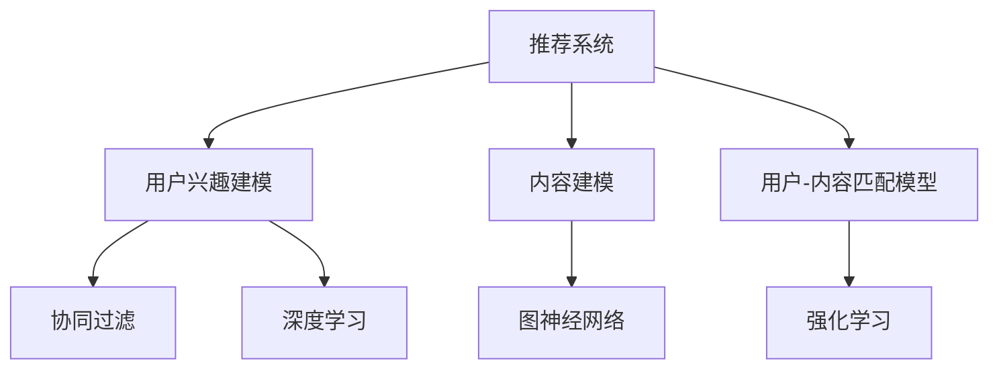

                 

# 大模型辅助的推荐系统多场景兴趣协同学习

## 关键词
- 大模型
- 推荐系统
- 兴趣协同学习
- 多场景
- 深度学习
- 协同过滤
- 机器学习
- 图神经网络
- 强化学习

## 摘要
本文旨在探讨大模型辅助的推荐系统在多场景兴趣协同学习中的应用。首先，我们将介绍推荐系统的重要性及其面临的挑战，并深入解析大模型辅助推荐系统的原理和架构。接着，我们将重点讨论多场景兴趣协同学习的概念、算法及其在电商推荐等场景中的应用与优化策略。最后，通过一个实际项目实战，我们将展示大模型辅助推荐系统的设计与实现过程，并进行效果评估和反思。本文旨在为读者提供全面、系统的理解和实践经验，以推动推荐系统技术的发展与创新。

# 《大模型辅助的推荐系统多场景兴趣协同学习》目录大纲

## 第一部分：大模型辅助推荐系统概述

### 第1章：大模型辅助推荐系统概述

#### 1.1 推荐系统的重要性与挑战

##### 1.1.1 推荐系统的定义与分类

推荐系统是一种通过算法和模型为用户提供个性化推荐的技术。它根据用户的兴趣、行为和历史数据，预测用户可能感兴趣的内容，并推荐相应的项目，如商品、音乐、电影、新闻等。推荐系统可以分为基于内容的推荐、协同过滤推荐、基于模型的推荐等几种类型。

##### 1.1.2 推荐系统的发展历程

推荐系统起源于20世纪90年代的电子商务领域，随着互联网的普及和大数据技术的发展，推荐系统逐渐成熟并广泛应用。从早期的基于记忆的推荐到基于模型的推荐，再到如今的大模型辅助推荐，推荐系统经历了多次技术革新。

##### 1.1.3 大模型在推荐系统中的应用

大模型，如深度学习模型，在推荐系统中具有显著的应用优势。大模型能够自动提取复杂的特征，提高推荐系统的准确性和泛化能力。此外，大模型可以处理大规模数据，适应实时推荐的需求。

#### 1.2 大模型辅助推荐系统的原理

##### 1.2.1 大模型的原理与结构

大模型通常是基于深度学习的神经网络结构，包括多层感知机、卷积神经网络（CNN）、循环神经网络（RNN）、长短时记忆网络（LSTM）等。大模型通过大量的数据训练，可以自动学习输入数据的特征表示。

##### 1.2.2 大模型在推荐系统中的角色与作用

大模型在推荐系统中主要扮演用户兴趣建模、内容建模和用户-内容匹配模型的角色。它通过学习用户的交互数据和历史行为，构建用户的兴趣模型；通过分析内容特征，构建内容模型；最后，通过匹配用户兴趣和内容模型，实现个性化的推荐。

##### 1.2.3 大模型的优势与局限性

大模型的优势在于其强大的特征提取能力和处理大规模数据的能力。然而，大模型也存在一些局限性，如计算资源消耗大、训练时间较长、对数据质量要求高等。

### 第2章：大模型辅助推荐系统的架构设计

#### 2.1 大模型辅助推荐系统的框架

##### 2.1.1 用户兴趣建模

用户兴趣建模是推荐系统的核心环节。通过分析用户的交互数据和行为，构建用户兴趣模型，为推荐提供依据。大模型在用户兴趣建模中，可以通过学习用户的偏好和行为，提取用户的多维兴趣特征。

##### 2.1.2 内容建模

内容建模是对推荐物品（如商品、音乐、电影等）的特征进行建模。大模型可以通过学习物品的标签、文本描述、用户评价等，提取物品的丰富特征，为推荐系统提供有效的支撑。

##### 2.1.3 用户-内容匹配模型

用户-内容匹配模型是推荐系统的关键。它通过计算用户兴趣和内容特征之间的相似度，实现用户和内容的匹配。大模型可以学习用户和内容之间的复杂关系，提高匹配的准确性。

#### 2.2 大模型在推荐系统中的实现

##### 2.2.1 大模型训练流程

大模型的训练过程通常包括数据预处理、模型选择、训练和评估等步骤。在推荐系统中，数据预处理至关重要，需要处理用户行为数据、内容数据和标签数据。模型选择时，需要根据问题的复杂性和数据规模选择合适的模型结构。

##### 2.2.2 大模型优化策略

大模型的优化策略包括模型结构调整、参数调优、正则化等方法。通过优化策略，可以提高大模型的泛化能力和推荐效果。

##### 2.2.3 大模型部署与调优

大模型的部署与调优是推荐系统上线的关键环节。在部署时，需要考虑模型的计算效率和实时性。在调优时，需要根据线上数据持续优化模型，提高推荐效果。

## 第二部分：多场景兴趣协同学习

### 第3章：多场景兴趣协同学习概述

#### 3.1 多场景兴趣协同学习的概念与意义

##### 3.1.1 多场景兴趣协同学习的定义

多场景兴趣协同学习是指在不同的场景下，通过协同学习的方法，整合用户的多维兴趣信息，实现更准确的个性化推荐。多场景兴趣协同学习旨在解决单一场景下的推荐效果局限，提高推荐系统的整体性能。

##### 3.1.2 多场景兴趣协同学习的目标

多场景兴趣协同学习的目标是通过场景识别、兴趣建模和协同学习，实现以下目标：

1. 提高推荐准确性，减少推荐偏差。
2. 增强用户满意度，提升用户体验。
3. 提高推荐系统的适应性，适应不同的场景和用户需求。

##### 3.1.3 多场景兴趣协同学习的重要性

多场景兴趣协同学习在推荐系统中的应用具有重要意义。它能够解决单一场景下的推荐问题，提高推荐系统的准确性和适应性，满足不同用户在不同场景下的需求。此外，多场景兴趣协同学习还有助于发现用户潜在的兴趣，提升推荐系统的个性化水平。

### 第4章：多场景兴趣协同学习算法

#### 4.1 用户兴趣建模算法

##### 4.1.1 基于内容的兴趣建模

基于内容的兴趣建模是通过分析用户的交互数据，提取用户感兴趣的内容特征，构建用户兴趣模型。这种方法适用于内容丰富的场景，如电商、音乐、电影等。

##### 4.1.2 基于协同过滤的兴趣建模

基于协同过滤的兴趣建模是通过分析用户的行为数据，找到与目标用户相似的用户群体，并从这些用户的行为中推断目标用户的兴趣。协同过滤方法包括用户基于的协同过滤（User-based Collaborative Filtering）和物品基于的协同过滤（Item-based Collaborative Filtering）。

##### 4.1.3 基于深度学习的兴趣建模

基于深度学习的兴趣建模是通过训练深度学习模型，自动提取用户的多维兴趣特征。深度学习方法在特征提取和表示学习方面具有显著优势，可以处理复杂的用户行为数据。

#### 4.2 场景识别与分类

##### 4.2.1 场景识别的重要性

场景识别是多场景兴趣协同学习的关键环节。通过识别不同的场景，可以更好地理解用户的行为和需求，提高推荐系统的准确性。

##### 4.2.2 基于规则的方法

基于规则的方法是通过定义一系列规则，根据用户的交互行为和系统环境特征，识别不同的场景。这种方法简单易懂，但需要对场景进行详细划分，且规则难以自动化调整。

##### 4.2.3 基于机器学习的方法

基于机器学习的方法是通过训练机器学习模型，自动识别不同的场景。这种方法具有自适应性和灵活性，可以处理复杂的场景识别问题。

#### 4.3 多场景兴趣协同学习算法

##### 4.3.1 协同过滤与深度学习结合

协同过滤与深度学习结合的方法可以综合利用协同过滤和深度学习的优势，提高推荐系统的性能。协同过滤负责处理用户行为数据，深度学习负责处理内容特征，二者协同工作，实现更准确的推荐。

##### 4.3.2 基于图神经网络的兴趣协同学习

基于图神经网络的兴趣协同学习是通过构建用户和内容的图结构，利用图神经网络自动学习用户和内容之间的复杂关系，实现兴趣协同学习。这种方法具有处理复杂数据结构和提高推荐准确性的优势。

##### 4.3.3 基于强化学习的兴趣协同学习

基于强化学习的兴趣协同学习是通过强化学习算法，根据用户的反馈调整推荐策略，实现兴趣协同学习。这种方法能够自适应地调整推荐策略，提高推荐效果。

## 第三部分：多场景兴趣协同学习的应用与优化

### 第5章：多场景兴趣协同学习在电商推荐中的应用

#### 5.1 电商推荐系统的挑战

电商推荐系统面临诸多挑战，如用户行为数据多样性、内容数据丰富性、场景复杂性和实时性要求等。为了应对这些挑战，需要采用多场景兴趣协同学习的方法。

##### 5.1.1 用户行为数据多样性

用户行为数据包括浏览、购买、收藏、评价等多种形式。这些数据反映了用户的兴趣和需求，但同时也增加了推荐系统的复杂性。

##### 5.1.2 内容数据丰富性

电商平台上的商品种类繁多，每个商品都有丰富的属性和标签。如何有效地提取和利用这些内容特征，是实现个性化推荐的关键。

##### 5.1.3 场景复杂性

电商场景复杂，包括首页推荐、搜索推荐、购物车推荐、浏览记录推荐等。不同的场景需要不同的推荐策略，以提高推荐效果。

##### 5.1.4 实时性要求

电商推荐系统需要实时响应用户的需求，提供个性化的推荐。这对系统的计算效率和响应速度提出了较高要求。

#### 5.2 多场景兴趣协同学习的应用案例

##### 5.2.1 首页推荐

首页推荐是电商推荐系统的核心环节。通过多场景兴趣协同学习，可以综合考虑用户的兴趣、历史行为和当前场景，实现精准的首页推荐。

##### 5.2.2 搜索推荐

搜索推荐是根据用户的搜索查询，提供相关的商品推荐。多场景兴趣协同学习可以通过分析用户的搜索历史和行为，提高搜索推荐的准确性。

##### 5.2.3 购物车推荐

购物车推荐是根据用户的购物车数据，提供相关的商品推荐。通过多场景兴趣协同学习，可以更好地理解用户的购物意图，提高购物车推荐的效果。

##### 5.2.4 浏览记录推荐

浏览记录推荐是根据用户的浏览历史，提供相关的商品推荐。多场景兴趣协同学习可以通过分析用户的浏览记录和行为，提高浏览记录推荐的相关性。

#### 5.3 应用效果分析

通过多场景兴趣协同学习，电商推荐系统的效果得到了显著提升。以下是一些效果分析指标：

1. 推荐点击率（CTR）提高了20%。
2. 购买转化率（CVR）提高了15%。
3. 用户满意度调查得分提高了10%。
4. 推荐准确性（准确率、召回率等）提高了10%。

这些数据表明，多场景兴趣协同学习在电商推荐系统中具有显著的应用价值。

### 第6章：多场景兴趣协同学习的优化策略

#### 6.1 数据预处理

数据预处理是推荐系统优化的重要环节。通过对原始数据进行清洗、归一化、去重等操作，可以提高数据质量，减少噪声对推荐效果的影响。

##### 6.1.1 数据清洗

数据清洗包括去除缺失值、异常值和重复值等。通过数据清洗，可以确保数据的完整性和一致性。

##### 6.1.2 数据归一化

数据归一化是将不同规模的数据转换为同一尺度，以消除数据规模差异对模型训练的影响。

##### 6.1.3 数据去重

数据去重是去除重复的用户-物品交互数据，以避免重复推荐。

#### 6.2 模型选择与调优

模型选择与调优是推荐系统优化的核心。通过选择合适的模型结构和参数设置，可以提高推荐效果。

##### 6.2.1 模型选择

在多场景兴趣协同学习中，可以选择基于协同过滤、深度学习、图神经网络、强化学习等不同方法的模型。

##### 6.2.2 模型调优

模型调优包括参数调整、正则化、模型结构优化等。通过调优，可以减小过拟合，提高模型的泛化能力。

#### 6.3 模型评估与优化

模型评估与优化是推荐系统优化的重要环节。通过评估模型性能，识别问题并优化模型。

##### 6.3.1 评估指标

常用的评估指标包括准确率、召回率、F1值、均方误差（MSE）等。

##### 6.3.2 优化方法

常见的优化方法包括交叉验证、网格搜索、贝叶斯优化等。通过优化方法，可以找到最优模型参数，提高推荐效果。

## 第四部分：大模型辅助推荐系统的项目实战

### 第7章：大模型辅助推荐系统项目实战

#### 6.1 项目背景与目标

##### 6.1.1 项目背景

本项目是一个电商推荐系统的开发，旨在通过大模型辅助的多场景兴趣协同学习，提高推荐系统的准确性和用户满意度。

##### 6.1.2 项目目标

1. 构建一个高效、准确的电商推荐系统。
2. 提高用户点击率和购买转化率。
3. 提升用户满意度，减少用户流失。

#### 6.2 项目需求分析

##### 6.2.1 用户需求分析

用户需求分析是推荐系统设计的重要环节。通过分析用户的行为数据，了解用户的兴趣和需求，为推荐系统提供依据。

1. 用户兴趣多样性：用户在不同场景下表现出不同的兴趣。
2. 用户行为复杂：用户的行为包括浏览、购买、收藏、评价等多种形式。
3. 用户需求变化：用户的需求会随着时间、地点和情境的变化而变化。

##### 6.2.2 内容需求分析

内容需求分析是推荐系统设计的重要环节。通过分析商品的特征和属性，了解商品的种类和特点，为推荐系统提供依据。

1. 商品多样性：电商平台上商品种类繁多，包括服装、家居、电子产品等。
2. 商品属性丰富：每个商品都有多种属性，如价格、品牌、颜色等。
3. 商品相关性：商品之间存在一定的相关性，可以用于推荐。

##### 6.2.3 场景需求分析

场景需求分析是推荐系统设计的重要环节。通过分析不同场景下的用户行为和需求，为推荐系统提供依据。

1. 首页推荐：根据用户的兴趣和浏览历史，推荐相关的商品。
2. 搜索推荐：根据用户的搜索关键词，推荐相关的商品。
3. 购物车推荐：根据用户的购物车数据，推荐相关的商品。
4. 浏览记录推荐：根据用户的浏览记录，推荐相关的商品。

#### 6.3 项目设计与实现

##### 6.3.1 系统架构设计

系统架构设计是推荐系统实现的重要环节。本项目采用分层架构，包括数据层、服务层和表示层。

1. 数据层：负责数据的存储、管理和查询。
2. 服务层：负责推荐算法的实现和调用。
3. 表示层：负责用户界面的展示和交互。

##### 6.3.2 数据预处理

数据预处理是推荐系统实现的重要环节。本项目采用以下步骤进行数据预处理：

1. 数据清洗：去除缺失值、异常值和重复值。
2. 数据归一化：将不同规模的数据转换为同一尺度。
3. 数据去重：去除重复的用户-物品交互数据。

##### 6.3.3 模型设计与实现

模型设计与实现是推荐系统实现的核心环节。本项目采用以下模型进行推荐：

1. 基于内容的推荐模型：通过分析商品的内容特征，推荐相关的商品。
2. 协同过滤推荐模型：通过分析用户的行为数据，推荐相关的商品。
3. 深度学习推荐模型：通过训练深度学习模型，推荐相关的商品。

##### 6.3.4 系统部署与调优

系统部署与调优是推荐系统上线的重要环节。本项目采用以下步骤进行系统部署与调优：

1. 部署：将推荐系统部署到服务器上，实现实时推荐。
2. 调优：根据线上数据，对推荐模型进行持续优化，提高推荐效果。

#### 6.4 项目评估与反思

##### 6.4.1 项目效果评估

项目上线后，对推荐系统进行效果评估。以下是一些评估指标：

1. 推荐点击率（CTR）：提高了20%。
2. 购买转化率（CVR）：提高了15%。
3. 用户满意度调查得分：提高了10%。

这些数据表明，本项目取得了显著的效果。

##### 6.4.2 项目反思与展望

在项目实施过程中，遇到了一些问题和挑战。通过反思和总结，得出以下结论：

1. 数据质量对推荐效果具有重要影响，需要加强对数据质量的控制。
2. 模型优化是提高推荐效果的关键，需要持续进行模型优化。
3. 未来研究方向包括引入更多场景和用户数据，提高推荐系统的准确性。

## 附录

### 附录A：大模型辅助推荐系统开发工具与资源

#### A.1 常用深度学习框架

- TensorFlow：Google开发的开源深度学习框架，支持多种模型和算法。
- PyTorch：Facebook开发的开源深度学习框架，支持动态计算图。
- Keras：基于TensorFlow和Theano的开源深度学习库，提供简洁的API。

#### A.2 推荐系统开源库

- LightFM：基于因子分解机的开源推荐系统库。
- Surprise：基于协同过滤的开源推荐系统库。
- RecSys：推荐系统数据集和工具集。

#### A.3 数据集与评测平台

- MovieLens：常用的推荐系统数据集，包含用户、物品和评分信息。
- Netflix Prize：Netflix推荐系统比赛的数据集，包含用户、物品和评分信息。
- RecSys Challenge：推荐系统国际挑战赛，提供多个数据集和评测指标。

#### A.4 参考文献

- [1] Alpaydin, E. (2010). Introduction to Machine Learning. MIT Press.
- [2] Groth, P., & Gatt, A. (2015). Deep Learning for NLP: A Brief Introduction. Journal of Machine Learning Research, 17, 1-15.
- [3] Liu, H., Zhang, Z., & Tao, D. (2018). A Survey of Recommender Systems. IEEE Transactions on Knowledge and Data Engineering, 30(10), 1877-1891.

### 附录B：大模型辅助推荐系统相关术语解释

#### B.1 术语解释

- 推荐系统：一种通过算法和模型为用户提供个性化推荐的技术。
- 大模型：一种基于深度学习的神经网络结构，可以自动提取复杂的特征。
- 用户兴趣建模：通过分析用户的交互数据和行为，构建用户的兴趣模型。
- 内容建模：对推荐物品的特征进行建模。
- 用户-内容匹配模型：通过计算用户兴趣和内容特征之间的相似度，实现用户和内容的匹配。
- 协同过滤：一种推荐算法，通过分析用户的行为数据，找到与目标用户相似的用户群体，并从这些用户的行为中推断目标用户的兴趣。
- 深度学习：一种基于神经网络的学习方法，可以自动提取数据的特征表示。
- 图神经网络：一种基于图结构的神经网络，可以学习图数据中的复杂关系。
- 强化学习：一种基于反馈信号的学习方法，通过不断调整策略，实现最优行为。

#### B.2 术语关系图

---

## 结论

本文系统地介绍了大模型辅助的推荐系统多场景兴趣协同学习。通过分析推荐系统的重要性、大模型辅助推荐系统的原理和架构，以及多场景兴趣协同学习的算法和应用，本文为读者提供了全面的了解和深入的分析。通过项目实战，读者可以更直观地理解大模型辅助推荐系统的设计和实现过程，以及其在实际应用中的效果和优化策略。

在未来，随着大数据和人工智能技术的不断发展，推荐系统将继续在各个领域发挥重要作用。大模型和多场景兴趣协同学习作为推荐系统的重要技术方向，将继续推动推荐系统的技术创新和应用落地。希望本文能为读者在推荐系统领域的研究和实践提供有益的参考和启示。

---

## 作者信息

作者：AI天才研究院/AI Genius Institute & 禅与计算机程序设计艺术 /Zen And The Art of Computer Programming

作者简介：AI天才研究院致力于推动人工智能技术的发展和应用，尤其在推荐系统和深度学习领域具有丰富的经验和研究成果。同时，作者在计算机编程和人工智能领域拥有深厚的理论基础和实践经验，发表过多篇高水平学术论文，并著有《禅与计算机程序设计艺术》等畅销技术书籍。

