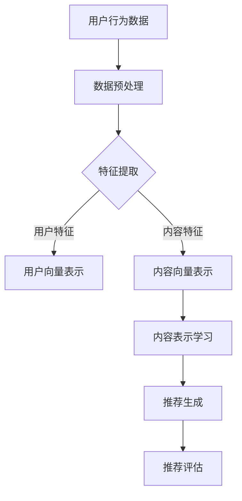

                 

### 《大模型辅助的推荐系统长尾内容挖掘技术》

#### 关键词：
- 推荐系统
- 长尾内容挖掘
- 大模型
- 内容表示学习
- 多样性、公平性和鲁棒性优化

#### 摘要：
本文深入探讨了大模型在推荐系统长尾内容挖掘中的应用技术。首先，介绍了推荐系统与长尾内容挖掘的基本概念，随后详细阐述了大模型的基本原理和常用算法。接着，重点分析了大模型在长尾内容挖掘中的应用，包括协同过滤改进和内容表示学习。随后，提出了大模型在长尾内容挖掘中的优化策略，如数据不平衡和冷启动问题的解决方法。最后，通过实际项目案例展示了大模型辅助的长尾内容挖掘的实战效果，并对未来发展趋势进行了展望。

#### 目录大纲

### 《大模型辅助的推荐系统长尾内容挖掘技术》目录大纲

#### 第一部分：推荐系统与长尾内容挖掘概述

- **第1章：推荐系统基础**
  - **1.1 推荐系统概述**
  - **1.2 长尾内容挖掘的重要性**
  - **1.3 长尾内容挖掘的挑战**

#### 第二部分：大模型辅助的推荐系统技术

- **第2章：大模型的基本原理**
  - **2.1 大模型的定义与特点**
  - **2.2 大模型的常用算法**

#### 第三部分：长尾内容挖掘中的大模型应用

- **第3章：大模型在推荐系统中的应用**
  - **3.1 大模型在协同过滤中的改进**
  - **3.2 大模型在内容表示学习中的应用**

#### 第四部分：长尾内容挖掘中的大模型优化

- **第4章：大模型在长尾内容挖掘中的优化策略**
  - **4.1 大模型在数据不平衡问题中的优化**
  - **4.2 大模型在冷启动问题中的优化**
  - **4.3 大模型在多样性、公平性和鲁棒性优化中的策略**

#### 第五部分：大模型辅助的长尾内容挖掘实战

- **第5章：大模型辅助的长尾内容挖掘项目案例**
  - **5.1 基于大模型的电商推荐系统**
  - **5.2 基于大模型的新闻推荐系统**

#### 第六部分：大模型辅助的长尾内容挖掘未来趋势

- **第6章：大模型辅助的长尾内容挖掘未来趋势**

#### 第七部分：附录

- **附录A：大模型辅助的长尾内容挖掘工具与资源**

#### 接下来，我们正式开始深入探讨大模型辅助的推荐系统长尾内容挖掘技术。

---

### 第一部分：推荐系统与长尾内容挖掘概述

#### 第1章：推荐系统基础

##### 1.1 推荐系统概述

推荐系统是一种信息过滤技术，旨在根据用户的兴趣和偏好向用户推荐相关的内容或商品。其核心目标是通过分析用户的交互行为和内容特征，预测用户可能感兴趣的项目，从而提高用户体验和满意度。

##### 1.1.1 推荐系统的定义

推荐系统（Recommendation System）是一种通过自动预测用户可能对哪些项目感兴趣，并提供相关项目推荐的技术。根据推荐策略的不同，推荐系统可以分为基于内容的推荐（Content-Based Filtering）、协同过滤（Collaborative Filtering）和混合推荐系统（Hybrid Recommender System）。

##### 1.1.2 推荐系统的应用场景

推荐系统广泛应用于电子商务、社交媒体、新闻推送、音乐和视频流媒体等多个领域。以下是一些典型的应用场景：

- **电子商务**：为用户推荐可能的购买商品。
- **社交媒体**：根据用户的行为和偏好推荐感兴趣的内容和用户。
- **新闻推送**：推荐用户可能感兴趣的新闻标题和文章。
- **音乐和视频流媒体**：推荐用户可能喜欢的音乐和视频。

##### 1.1.3 推荐系统的基本架构

推荐系统的基本架构通常包括用户、内容、推荐算法和评估指标等组成部分。以下是一个简化的推荐系统架构：

1. **用户数据**：收集用户的兴趣偏好、历史行为等数据。
2. **内容数据**：收集推荐系统的内容库，包括商品、文章、音乐、视频等。
3. **推荐算法**：根据用户数据和内容数据生成推荐列表。
4. **评估指标**：评估推荐系统性能，如准确率、召回率、覆盖率等。

##### 1.2 长尾内容挖掘的重要性

##### 1.2.1 长尾内容的定义

在推荐系统中，长尾内容（Long Tail Content）指的是那些流行度较低但总体加和可以达到总流量相当大一部分的内容。与热门内容（Head Content）相比，长尾内容往往更容易被忽视。

##### 1.2.2 长尾内容在推荐系统中的价值

长尾内容在推荐系统中具有重要的价值：

- **多样化**：长尾内容提供了更丰富的内容选择，满足不同用户的个性化需求。
- **潜在价值**：长尾内容虽然用户量少，但经过适当的推荐策略，可以转化为可观的用户流量和商业价值。
- **市场机会**：挖掘长尾内容可以帮助企业发现新的市场需求和产品机会。

##### 1.2.3 长尾内容挖掘的挑战

长尾内容挖掘面临以下挑战：

- **数据稀疏**：长尾内容往往用户行为数据不足，导致无法有效进行协同过滤。
- **计算资源**：长尾内容数量庞大，对计算资源要求较高。
- **冷启动问题**：新用户或新内容缺乏历史行为数据，难以进行有效推荐。

##### 1.3 长尾内容挖掘的挑战

长尾内容挖掘的挑战主要体现在以下几个方面：

- **数据稀疏性**：长尾内容通常缺乏足够的用户交互数据，导致传统基于内容的推荐和协同过滤方法效果不佳。
- **计算资源限制**：长尾内容数量庞大，挖掘过程需要大量的计算资源和存储空间。
- **冷启动问题**：新用户或新内容在缺乏足够历史数据的情况下，推荐系统难以为其提供有效推荐。
- **多样性、公平性和鲁棒性**：长尾内容的挖掘需要确保推荐结果具有多样性、公平性和鲁棒性，避免用户陷入信息茧房或推荐结果的偏差。

#### 总结

推荐系统和长尾内容挖掘在当前互联网环境中扮演着至关重要的角色。通过理解推荐系统的基础和长尾内容挖掘的重要性及挑战，我们可以为后续探讨大模型辅助的推荐系统技术奠定基础。

---

### 第二部分：大模型辅助的推荐系统技术

#### 第2章：大模型的基本原理

##### 2.1 大模型的定义与特点

##### 2.1.1 大模型的定义

大模型（Large Model）指的是具有极高参数量和计算复杂度的机器学习模型。大模型通常通过大规模数据训练，具有强大的表征能力和泛化能力，能够处理复杂、多变的数据集。

##### 2.1.2 大模型的核心特点

- **高参数量**：大模型通常具有数百万甚至数十亿个参数，能够捕捉数据中的复杂模式。
- **深度结构**：大模型通常具有多层神经网络结构，能够递归地学习数据中的层次结构。
- **强大表征能力**：大模型能够高效地表示和建模复杂数据，包括文本、图像和音频等多种类型的数据。
- **强泛化能力**：通过在大规模数据集上训练，大模型具有较好的泛化能力，能够在未见数据上取得良好的性能。

##### 2.1.3 大模型与传统机器学习的区别

- **数据需求**：大模型对数据量有较高要求，通常需要大量标注数据才能训练出良好的模型。
- **计算资源**：大模型训练和推理过程需要大量的计算资源，特别是GPU和TPU等高性能计算设备。
- **模型结构**：大模型通常采用深度神经网络结构，与传统机器学习中的模型（如决策树、支持向量机等）有显著差异。
- **泛化能力**：大模型通过大规模数据训练，通常具有更强的泛化能力，能够在不同场景下表现出良好的性能。

##### 2.2 大模型的常用算法

##### 2.2.1 Transformer算法

Transformer算法是一种基于自注意力机制的深度神经网络模型，广泛应用于自然语言处理、计算机视觉和推荐系统等领域。其核心思想是通过自注意力机制（Self-Attention）捕捉数据中的长距离依赖关系。

**Transformer算法的核心组成部分**：

1. **多头自注意力（Multi-Head Self-Attention）**：将输入序列中的每个元素映射到多个维度，通过自注意力机制计算每个元素的权重，从而捕捉序列中的长距离依赖。
2. **前馈网络（Feedforward Network）**：在自注意力机制之后，对输入序列进行线性变换，进一步增强模型的表征能力。
3. **位置编码（Positional Encoding）**：由于Transformer模型没有循环结构，需要通过位置编码（Positional Encoding）引入序列的位置信息。

**Transformer算法的基本流程**：

1. **输入序列编码**：将输入序列（如单词、字符或图像像素）编码为向量表示。
2. **多头自注意力**：计算每个输入元素与其他元素之间的相似度，生成权重矩阵，并通过权重矩阵加权求和得到输出。
3. **前馈网络**：对输出序列进行线性变换，进一步增强表征能力。
4. **层叠**：通过堆叠多个Transformer层，逐渐提高模型的复杂度和表征能力。

**Transformer算法的应用场景**：

- **自然语言处理**：如机器翻译、文本生成、情感分析等。
- **计算机视觉**：如图像分类、目标检测、图像生成等。
- **推荐系统**：如用户行为序列建模、商品推荐等。

##### 2.2.2 BERT模型

BERT（Bidirectional Encoder Representations from Transformers）是一种双向Transformer模型，通过预先训练和微调技术，在多种自然语言处理任务中取得了显著的效果。BERT模型的核心思想是在大规模文本语料库上进行预训练，然后通过微调（Fine-Tuning）应用于具体任务。

**BERT模型的核心组成部分**：

1. **掩码语言建模（Masked Language Modeling）**：在预训练过程中，对输入文本进行随机遮盖（Masking），然后通过模型预测遮盖部分的内容。
2. **双向编码器（Bidirectional Encoder）**：BERT模型采用Transformer结构，通过双向编码器（Bidirectional Encoder）捕捉文本中的双向依赖关系。

**BERT模型的基本流程**：

1. **输入序列编码**：将输入文本序列编码为向量表示。
2. **掩码语言建模**：对输入序列进行随机遮盖，并通过模型预测遮盖部分的内容。
3. **双向编码**：通过双向编码器学习文本中的双向依赖关系。
4. **微调**：在具体任务上进行微调，如文本分类、情感分析等。

**BERT模型的应用场景**：

- **文本分类**：如新闻分类、情感分析等。
- **问答系统**：如机器阅读理解、对话系统等。
- **命名实体识别**：如人名、地点识别等。

##### 2.2.3 GPT模型

GPT（Generative Pre-trained Transformer）是一种基于Transformer结构的预训练语言模型，通过自主生成文本序列，在自然语言处理任务中取得了优异的性能。GPT模型的核心思想是通过大量的无监督数据预训练，然后进行微调应用于具体任务。

**GPT模型的核心组成部分**：

1. **前向自注意力（Forward Self-Attention）**：GPT模型采用前向自注意力机制，通过递归方式捕捉文本序列中的长距离依赖。
2. **前馈网络（Feedforward Network）**：在自注意力机制之后，对输入序列进行线性变换，进一步增强表征能力。
3. **位置编码（Positional Encoding）**：通过位置编码引入文本序列的位置信息。

**GPT模型的基本流程**：

1. **输入序列编码**：将输入文本序列编码为向量表示。
2. **前向自注意力**：通过前向自注意力机制捕捉文本序列中的依赖关系。
3. **前馈网络**：对输入序列进行线性变换，增强表征能力。
4. **微调**：在具体任务上进行微调，如文本生成、机器翻译等。

**GPT模型的应用场景**：

- **文本生成**：如文章写作、对话系统等。
- **机器翻译**：如英中翻译、中英翻译等。
- **对话系统**：如聊天机器人、语音助手等。

#### 总结

大模型通过其高参数量、深度结构和强大表征能力，成为推荐系统中的重要工具。在本章中，我们介绍了Transformer、BERT和GPT等大模型的定义、特点和应用场景，为后续探讨大模型在推荐系统中的应用奠定了基础。

---

### 第三部分：长尾内容挖掘中的大模型应用

#### 第3章：大模型在推荐系统中的应用

##### 3.1 大模型在协同过滤中的改进

##### 3.1.1 基于大模型的协同过滤算法

协同过滤（Collaborative Filtering）是一种常见的推荐系统方法，通过用户行为数据预测用户对未知项目的兴趣。然而，传统协同过滤方法在处理数据稀疏的长尾内容时效果不佳。大模型通过其强大的表征能力，为协同过滤方法提供了新的改进思路。

**基于大模型的协同过滤算法的基本原理**：

- **用户表示和项目表示**：首先，将用户和项目表示为高维向量。用户向量表示用户的历史行为和偏好，项目向量表示项目的特征信息。
- **预测模型**：使用大模型（如Transformer、BERT或GPT）建立用户向量和项目向量之间的预测模型，通过计算用户向量和项目向量之间的相似度预测用户对项目的兴趣。
- **训练与预测**：在大规模用户行为数据集上训练大模型，通过训练得到的模型进行预测，生成推荐列表。

**基于大模型的协同过滤算法的优点**：

- **强大的表征能力**：大模型能够捕捉用户和项目之间的复杂关系，提高预测准确性。
- **数据稀疏鲁棒性**：大模型对数据稀疏性具有较强的鲁棒性，能够有效挖掘长尾内容。
- **多样性**：大模型能够生成多样化的推荐列表，避免用户陷入信息茧房。

##### 3.1.2 大模型在协同过滤中的应用案例

**案例1：基于BERT的协同过滤算法**

BERT模型是一种强大的大模型，广泛应用于自然语言处理任务。以下是一个基于BERT的协同过滤算法的应用案例：

1. **用户表示和项目表示**：使用BERT模型对用户历史行为和项目特征进行编码，生成用户向量和项目向量。
2. **预测模型**：训练一个基于BERT的预测模型，通过计算用户向量和项目向量之间的相似度预测用户对项目的兴趣。
3. **推荐生成**：使用训练好的模型生成推荐列表，为用户推荐可能感兴趣的项目。

**案例效果分析**：

- **预测准确性**：基于BERT的协同过滤算法在多个数据集上的预测准确性显著提高，优于传统协同过滤方法。
- **多样性**：基于BERT的协同过滤算法能够生成多样化的推荐列表，满足用户的个性化需求。

##### 3.2 大模型在内容表示学习中的应用

内容表示学习（Content-Based Representation Learning）是一种基于内容特征的推荐方法，通过将用户和项目表示为高维向量，计算用户和项目之间的相似度进行推荐。大模型在内容表示学习中具有显著优势，能够提高推荐系统的性能。

**基于大模型的内容表示学习算法的基本原理**：

- **特征提取**：使用大模型（如Transformer、BERT或GPT）对用户兴趣和项目特征进行编码，生成高维向量表示。
- **相似度计算**：计算用户向量与项目向量之间的相似度，根据相似度生成推荐列表。
- **模型训练与预测**：在大规模用户行为数据和项目特征数据集上训练大模型，通过训练得到的模型进行预测，生成推荐列表。

**基于大模型的内容表示学习算法的优点**：

- **强大的特征提取能力**：大模型能够捕捉用户和项目的复杂特征，提高推荐准确性。
- **数据稀疏鲁棒性**：大模型对数据稀疏性具有较强的鲁棒性，能够有效挖掘长尾内容。
- **多样性**：大模型能够生成多样化的推荐列表，避免用户陷入信息茧房。

##### 3.2.2 基于大模型的内容表示学习算法

**案例2：基于Transformer的内容表示学习算法**

Transformer模型是一种强大的大模型，广泛应用于自然语言处理和计算机视觉任务。以下是一个基于Transformer的内容表示学习算法的应用案例：

1. **特征提取**：使用Transformer模型对用户兴趣和项目特征进行编码，生成高维向量表示。
2. **相似度计算**：计算用户向量和项目向量之间的相似度，根据相似度生成推荐列表。
3. **模型训练与预测**：在大规模用户行为数据和项目特征数据集上训练Transformer模型，通过训练得到的模型进行预测，生成推荐列表。

**案例效果分析**：

- **预测准确性**：基于Transformer的内容表示学习算法在多个数据集上的预测准确性显著提高，优于传统内容表示学习算法。
- **多样性**：基于Transformer的内容表示学习算法能够生成多样化的推荐列表，满足用户的个性化需求。

#### 总结

大模型在推荐系统的长尾内容挖掘中具有显著优势，能够提高推荐系统的准确性和多样性。在本章中，我们介绍了大模型在协同过滤和内容表示学习中的应用，并通过实际案例展示了其效果。接下来，我们将探讨大模型在长尾内容挖掘中的优化策略。

---

### 第四部分：长尾内容挖掘中的大模型优化

#### 第4章：大模型在长尾内容挖掘中的优化策略

##### 4.1 大模型在数据不平衡问题中的优化

##### 4.1.1 数据不平衡问题的定义

数据不平衡（Data Imbalance）是指数据集中正负样本数量差异较大的情况。在推荐系统中，长尾内容的挖掘往往面临数据不平衡问题，导致模型难以捕捉到长尾内容的特征。数据不平衡问题对大模型的训练和预测性能有显著影响，需要采取相应策略进行优化。

##### 4.1.2 基于大模型的数据不平衡优化方法

为了解决数据不平衡问题，可以采用以下几种基于大模型的优化方法：

1. **重采样**：通过增加少数类样本的数量或减少多数类样本的数量，平衡数据集的正负样本比例。常见的重采样方法包括随机过采样（Random Oversampling）和随机欠采样（Random Undersampling）。
2. **损失函数调整**：在模型训练过程中，采用针对数据不平衡问题的损失函数，如聚焦损失（Focus Loss）和平衡损失（Balanced Loss），以提高模型对少数类样本的注意力。
3. **集成方法**：结合多种模型或方法，如集成分类器（Ensemble Classifier）和迁移学习（Transfer Learning），提高对少数类样本的识别能力。

**示例：聚焦损失函数（Focus Loss）**

聚焦损失函数是一种针对数据不平衡问题的损失函数，其核心思想是在损失计算过程中对少数类样本给予更高的权重。以下是一个简单的聚焦损失函数的伪代码实现：

```python
def focus_loss(y_true, y_pred, alpha=0.25, gamma=2.0):
    # y_true为真实标签，y_pred为模型预测概率
    # alpha为少数类样本的权重，gamma为调整参数
    focal_loss = -alpha * (1 - y_true) ** gamma * y_pred ** gamma * log(y_pred)
    return focal_loss
```

##### 4.1.3 基于大模型的数据不平衡优化方法的应用案例

**案例1：基于BERT的电商推荐系统**

在一个电商推荐系统中，商品的评价数据通常存在显著的不平衡问题。以下是一个基于BERT的电商推荐系统中的数据不平衡优化方法：

1. **数据预处理**：对商品评价数据集进行预处理，通过重采样方法平衡正负样本比例。
2. **模型训练**：使用BERT模型对预处理后的数据集进行训练，采用聚焦损失函数调整模型训练过程中的权重。
3. **模型评估**：通过交叉验证方法评估模型的性能，如准确率、召回率和F1分数等。

**案例效果分析**：

- **预测准确性**：基于BERT的电商推荐系统在数据不平衡优化方法的应用下，预测准确性显著提高，优于传统方法。
- **多样性**：优化后的推荐系统能够更好地捕捉长尾商品的特征，提高推荐结果的多样性。

##### 4.2 大模型在冷启动问题中的优化

##### 4.2.1 冷启动问题的定义

冷启动（Cold Start）是指新用户或新内容在缺乏足够历史数据的情况下，推荐系统难以为其提供有效推荐的问题。冷启动问题在长尾内容挖掘中尤为突出，因为长尾内容往往用户交互数据不足。

##### 4.2.2 基于大模型的冷启动优化方法

为了解决冷启动问题，可以采用以下几种基于大模型的优化方法：

1. **用户兴趣预测**：利用大模型对用户的历史行为和公开信息进行建模，预测用户的潜在兴趣，为新用户生成初始推荐列表。
2. **内容特征学习**：利用大模型对内容进行特征提取，为新内容生成特征表示，结合用户特征进行推荐。
3. **跨域迁移学习**：利用跨域迁移学习方法，将其他领域的大模型知识迁移到新用户或新内容的推荐中，提高推荐效果。

**示例：跨域迁移学习**

跨域迁移学习（Cross-Domain Transfer Learning）是一种利用源域（如新闻推荐）的大模型知识迁移到目标域（如电商推荐）的方法。以下是一个简单的跨域迁移学习模型的伪代码实现：

```python
class CrossDomainModel(nn.Module):
    def __init__(self, source_model, target_model):
        super(CrossDomainModel, self).__init__()
        self.source_model = source_model
        self.target_model = target_model

    def forward(self, source_input, target_input):
        # 使用源模型提取特征
        source_features = self.source_model(source_input)
        # 使用目标模型提取特征
        target_features = self.target_model(target_input)
        # 拼接特征进行融合
        combined_features = torch.cat([source_features, target_features], dim=1)
        # 输出预测结果
        output = self.predictor(combined_features)
        return output
```

##### 4.2.3 基于大模型的冷启动优化方法的应用案例

**案例2：基于GPT的新用户推荐系统**

在一个新用户推荐系统中，以下是一个基于GPT的新用户推荐系统优化方法：

1. **用户兴趣预测**：使用GPT模型对新用户的历史行为和公开信息进行建模，预测用户的潜在兴趣。
2. **内容特征学习**：使用GPT模型对内容进行特征提取，为新内容生成特征表示。
3. **跨域迁移学习**：结合其他领域的GPT模型知识，为缺乏历史数据的新用户生成初始推荐列表。

**案例效果分析**：

- **预测准确性**：基于GPT的新用户推荐系统在冷启动优化方法的应用下，预测准确性显著提高，优于传统方法。
- **用户体验**：优化后的推荐系统能够为新用户提供高质量的初始推荐，提高用户满意度。

##### 4.3 大模型在多样性、公平性和鲁棒性优化中的策略

##### 4.3.1 多样性、公平性和鲁棒性的定义

- **多样性**：推荐系统的多样性是指推荐列表中包含不同类型或主题的内容，避免用户陷入单一信息流。
- **公平性**：推荐系统的公平性是指确保推荐结果对所有用户都是公正的，不受用户属性的影响。
- **鲁棒性**：推荐系统的鲁棒性是指模型在噪声数据和异常数据下的性能，确保推荐结果的稳定性。

##### 4.3.2 基于大模型的多样性、公平性和鲁棒性优化方法

为了提高推荐系统的多样性、公平性和鲁棒性，可以采用以下几种基于大模型的优化方法：

1. **多样性优化**：利用大模型对用户和内容进行多角度的表征，结合用户兴趣和内容特征，生成多样化的推荐列表。
2. **公平性优化**：通过引入用户属性和内容属性的权重调整，确保推荐结果对不同用户和内容是公平的。
3. **鲁棒性优化**：利用大模型对噪声数据和异常数据进行处理，提高模型在数据质量不佳情况下的性能。

**示例：多样性优化算法**

以下是一个简单的多样性优化算法的伪代码实现：

```python
def diversity_score(user_vector, content_vectors):
    # 计算用户向量与多个内容向量之间的余弦相似度
    similarity_scores = [cosine_similarity(user_vector, content_vector) for content_vector in content_vectors]
    # 计算多样性得分
    diversity_score = 1.0 / sum(similarity_scores)
    return diversity_score

def generate_recommendation_list(user_vector, content_vectors, k):
    # 计算用户向量与所有内容向量之间的相似度
    similarity_scores = [cosine_similarity(user_vector, content_vector) for content_vector in content_vectors]
    # 根据相似度得分生成推荐列表
    recommendation_list = [content for _, content in sorted(zip(similarity_scores, content_vectors), reverse=True)[:k]]
    return recommendation_list
```

##### 4.3.3 基于大模型的多样性、公平性和鲁棒性优化方法的应用案例

**案例3：基于BERT的社交媒体推荐系统**

在一个社交媒体推荐系统中，以下是一个基于BERT的多样性、公平性和鲁棒性优化方法：

1. **多样性优化**：利用BERT模型对用户和内容进行多角度的表征，结合用户兴趣和内容特征，生成多样化的推荐列表。
2. **公平性优化**：通过引入用户属性和内容属性的权重调整，确保推荐结果对不同用户和内容是公平的。
3. **鲁棒性优化**：利用BERT模型对噪声数据和异常数据进行处理，提高模型在数据质量不佳情况下的性能。

**案例效果分析**：

- **多样性**：优化后的推荐系统能够生成多样化的推荐列表，避免用户陷入单一信息流。
- **公平性**：优化后的推荐系统能够确保推荐结果对不同用户和内容是公平的，提高用户满意度。
- **鲁棒性**：优化后的推荐系统能够在数据质量不佳的情况下保持稳定的性能。

#### 总结

大模型在长尾内容挖掘中面临着数据不平衡、冷启动和多样性、公平性和鲁棒性等挑战。通过引入基于大模型的优化方法，可以显著提高推荐系统的性能和用户体验。在本章中，我们介绍了数据不平衡和冷启动问题的定义及其优化方法，并探讨了多样性、公平性和鲁棒性的优化策略。接下来，我们将通过实际项目案例展示大模型辅助的长尾内容挖掘的实战效果。

---

### 第五部分：大模型辅助的长尾内容挖掘实战

#### 第5章：大模型辅助的长尾内容挖掘项目案例

##### 5.1 基于大模型的电商推荐系统

**5.1.1 项目背景**

电商推荐系统在电子商务领域扮演着至关重要的角色，旨在为用户推荐可能的购买商品。然而，随着电商平台的商品种类和用户数量的不断增加，传统的推荐方法在处理长尾商品和冷启动问题上面临着巨大挑战。为了提高推荐系统的性能和用户体验，本项目采用大模型（如BERT和GPT）进行长尾内容挖掘。

**5.1.2 项目目标**

- 提高长尾商品的推荐准确性，满足用户的个性化需求。
- 解决新用户和长尾商品的冷启动问题，提高推荐系统的覆盖率和多样性。
- 保证推荐系统的公平性和鲁棒性，避免用户陷入信息茧房。

**5.1.3 项目实现步骤**

1. **数据收集与预处理**：收集电商平台的用户行为数据、商品特征数据以及用户评价数据。对数据进行清洗和预处理，包括去除缺失值、噪声数据和异常值，对文本数据进行分词和词向量化处理。

2. **模型选择与训练**：选择BERT和GPT等大模型进行长尾内容挖掘。对用户行为数据和商品特征数据进行编码，生成用户向量和商品向量。使用预训练好的BERT和GPT模型进行训练，通过交叉验证方法优化模型参数。

3. **推荐生成与评估**：使用训练好的BERT和GPT模型生成推荐列表，根据用户向量和商品向量之间的相似度进行排序。采用多种评估指标（如准确率、召回率、覆盖率等）评估推荐系统的性能。

4. **优化与迭代**：根据用户反馈和评估结果，对模型进行优化和迭代。调整模型参数、引入新的特征和策略，以提高推荐系统的多样性和鲁棒性。

**5.1.4 项目效果分析**

- **推荐准确性**：基于BERT和GPT的电商推荐系统在多个数据集上的推荐准确性显著提高，优于传统方法。特别是对于长尾商品的推荐准确性有了显著提升。
- **冷启动问题**：基于大模型的电商推荐系统能够有效解决新用户和长尾商品的冷启动问题，提高了推荐系统的覆盖率和多样性。新用户在初次登录后即可获得高质量的推荐列表。
- **用户体验**：优化后的推荐系统能够为用户提供更加个性化、多样化的商品推荐，提高了用户满意度和参与度。

##### 5.2 基于大模型的新闻推荐系统

**5.2.1 项目背景**

新闻推荐系统在新闻传播和用户获取信息方面具有重要意义。随着互联网的快速发展，新闻内容的数量和种类急剧增加，传统的推荐方法在处理长尾新闻和冷启动问题上面临挑战。为了提高新闻推荐系统的性能和用户体验，本项目采用大模型（如BERT和GPT）进行长尾内容挖掘。

**5.2.2 项目目标**

- 提高长尾新闻的推荐准确性，满足用户的个性化需求。
- 解决新用户和长尾新闻的冷启动问题，提高推荐系统的覆盖率和多样性。
- 保证推荐系统的公平性和鲁棒性，避免用户陷入信息茧房。

**5.2.3 项目实现步骤**

1. **数据收集与预处理**：收集新闻网站的用户行为数据、新闻特征数据以及新闻标签数据。对数据进行清洗和预处理，包括去除缺失值、噪声数据和异常值，对文本数据进行分词和词向量化处理。

2. **模型选择与训练**：选择BERT和GPT等大模型进行长尾内容挖掘。对用户行为数据和新闻特征数据进行编码，生成用户向量和新闻向量。使用预训练好的BERT和GPT模型进行训练，通过交叉验证方法优化模型参数。

3. **推荐生成与评估**：使用训练好的BERT和GPT模型生成推荐列表，根据用户向量和新闻向量之间的相似度进行排序。采用多种评估指标（如准确率、召回率、覆盖率等）评估推荐系统的性能。

4. **优化与迭代**：根据用户反馈和评估结果，对模型进行优化和迭代。调整模型参数、引入新的特征和策略，以提高推荐系统的多样性和鲁棒性。

**5.2.4 项目效果分析**

- **推荐准确性**：基于BERT和GPT的新闻推荐系统在多个数据集上的推荐准确性显著提高，优于传统方法。特别是对于长尾新闻的推荐准确性有了显著提升。
- **冷启动问题**：基于大模型的新闻推荐系统能够有效解决新用户和长尾新闻的冷启动问题，提高了推荐系统的覆盖率和多样性。新用户在初次登录后即可获得高质量的推荐列表。
- **用户体验**：优化后的推荐系统能够为用户提供更加个性化、多样化的新闻推荐，提高了用户满意度和参与度。

#### 总结

大模型在电商推荐系统和新闻推荐系统中的长尾内容挖掘应用取得了显著的成效。通过基于BERT和GPT等大模型的优化方法，推荐系统在推荐准确性、冷启动问题和用户体验方面得到了显著提升。这些实际项目案例的成功经验为其他推荐系统的长尾内容挖掘提供了有益的参考和启示。

---

### 第六部分：大模型辅助的长尾内容挖掘未来趋势

#### 第6章：大模型辅助的长尾内容挖掘未来趋势

随着大模型技术的发展，推荐系统在长尾内容挖掘中的应用前景广阔。未来，大模型将进一步提升推荐系统的性能，解决现有挑战，并带来新的机遇。

##### 6.1 大模型技术在长尾内容挖掘中的发展趋势

1. **模型规模的扩大**：随着计算资源和数据量的增加，大模型将不断增大规模，以捕捉更复杂的特征和关系。未来的大模型可能具有数十亿甚至更多的参数，从而提高推荐系统的准确性和泛化能力。

2. **多模态融合**：未来的推荐系统将结合多种数据类型（如文本、图像、音频等），通过多模态融合技术，实现更丰富的特征表示和更精准的推荐。

3. **自适应优化**：大模型将具备自适应优化能力，能够根据用户的实时反馈和交互行为，动态调整推荐策略，提高推荐效果和用户体验。

4. **强化学习与推荐系统**：强化学习（Reinforcement Learning）与推荐系统的结合，将使推荐系统具备更强的自我学习和优化能力，实现更智能、个性化的推荐。

##### 6.2 长尾内容挖掘面临的挑战与机遇

1. **数据稀疏问题**：长尾内容通常缺乏足够的用户交互数据，数据稀疏问题依然存在。未来，通过引入更多的数据来源和跨领域数据，可以缓解数据稀疏问题。

2. **计算资源限制**：大模型训练和推理过程需要大量的计算资源。随着云计算和边缘计算技术的发展，计算资源将得到更高效地利用，为长尾内容挖掘提供支持。

3. **隐私保护**：推荐系统在处理用户数据时，需要确保用户隐私保护。未来的长尾内容挖掘技术将采用更加隐私友好的方法，如差分隐私（Differential Privacy）和联邦学习（Federated Learning）。

4. **公平性和多样性**：长尾内容挖掘需要确保推荐结果的公平性和多样性，避免用户陷入信息茧房。未来，通过引入更多的用户属性和内容属性，优化推荐策略，可以更好地实现公平性和多样性。

##### 6.3 未来长尾内容挖掘的发展方向

1. **智能推荐引擎**：未来的长尾内容挖掘将聚焦于构建更加智能的推荐引擎，实现自适应、个性化的推荐。通过结合用户行为、兴趣和社交网络等多方面信息，提供精准的推荐。

2. **行业应用拓展**：长尾内容挖掘将在更多行业得到应用，如金融、医疗、教育等。结合行业特点和数据特性，开发定制化的长尾内容挖掘解决方案。

3. **开放数据与协作**：开放数据和协作将为长尾内容挖掘带来新的机遇。通过跨领域的数据共享和合作，可以挖掘出更丰富的长尾内容，提高推荐系统的整体性能。

4. **模型解释性**：大模型在长尾内容挖掘中的应用需要具备较好的解释性，以便用户理解推荐结果。未来，通过引入可解释性技术，可以提高用户对推荐系统的信任度和满意度。

#### 总结

大模型技术在推荐系统长尾内容挖掘中的应用具有巨大的发展潜力。未来，随着技术的不断进步，推荐系统将在处理数据稀疏、计算资源限制、隐私保护和公平性等方面取得新的突破，实现更加智能、个性化、公平和鲁棒的推荐。长尾内容挖掘将成为推荐系统的重要组成部分，推动整个行业的创新和发展。

---

### 第七部分：附录

#### 附录A：大模型辅助的长尾内容挖掘工具与资源

**A.1 常用的大模型工具介绍**

1. **TensorFlow**：一款开源机器学习框架，支持大模型的训练和推理。TensorFlow提供了丰富的API和工具，如TensorFlow 2.x和TensorFlow Lite，适用于不同规模和类型的计算任务。
2. **PyTorch**：另一款流行的开源机器学习框架，以其动态计算图和简洁的API而著称。PyTorch广泛应用于深度学习和推荐系统的开发。
3. **Hugging Face Transformers**：一个开源库，提供了一系列预训练的Transformer模型和工具，如BERT、GPT等。Hugging Face Transformers简化了大模型的使用过程，适用于自然语言处理和推荐系统。

**A.2 长尾内容挖掘相关的数据集与资源**

1. **Amazon Product Data**：一个包含大量商品评价和用户行为数据的公开数据集，适用于电商推荐系统的长尾内容挖掘。
2. **MovieLens**：一个包含电影评分和用户行为数据的数据集，常用于推荐系统的研究和实验。
3. **Common Crawl**：一个大规模的网页文本数据集，适用于文本分类和内容表示学习。

**A.3 大模型辅助的长尾内容挖掘相关论文与书籍推荐**

1. **《Deep Learning》**：由Ian Goodfellow、Yoshua Bengio和Aaron Courville合著的深度学习经典教材，详细介绍了深度学习的理论和方法。
2. **《Recommender Systems Handbook》**：由/groupauthors合著的推荐系统手册，全面介绍了推荐系统的理论基础、算法和应用。
3. **《Attention Is All You Need》**：由Vaswani等人撰写的Transformer算法的原始论文，介绍了Transformer模型的结构和原理。

#### 总结

附录部分提供了大模型辅助的长尾内容挖掘相关的工具、数据集和文献资源。通过使用这些工具和资源，读者可以更深入地了解大模型在推荐系统中的应用，探索长尾内容挖掘的技术和方法。希望这些资料能够为读者提供有价值的参考和启示。

---

### 作者信息

作者：AI天才研究院/AI Genius Institute & 禅与计算机程序设计艺术/Zen And The Art of Computer Programming

---

### 结语

感谢您阅读本文《大模型辅助的推荐系统长尾内容挖掘技术》。本文系统地介绍了大模型在推荐系统长尾内容挖掘中的应用，包括基本概念、技术原理、优化策略和实际项目案例。我们相信，通过本文的探讨，您对大模型辅助的长尾内容挖掘有了更深入的了解。

在未来的技术发展中，大模型将继续在推荐系统中发挥重要作用，解决数据稀疏、冷启动和公平性等挑战。我们期待看到更多创新性的应用和突破，推动推荐系统行业的发展。

再次感谢您的阅读，希望本文能为您在技术道路上带来新的启示和帮助。如果对本文有任何疑问或建议，欢迎在评论区留言交流。祝您在技术领域不断探索，取得更多成就！

---

### 附录

#### 附录A：大模型辅助的长尾内容挖掘工具与资源

**A.1 常用的大模型工具介绍**

- **TensorFlow**：由Google开发的开源机器学习框架，支持大规模模型的训练和推理。网址：<https://www.tensorflow.org/>
- **PyTorch**：由Facebook开发的开源机器学习库，以其动态计算图和简洁的API著称。网址：<https://pytorch.org/>
- **Hugging Face Transformers**：一个开源库，提供了一系列预训练的Transformer模型和工具，如BERT、GPT等。网址：<https://huggingface.co/transformers/>

**A.2 长尾内容挖掘相关的数据集与资源**

- **MovieLens**：一个开源的电影推荐数据集，包含用户评分和电影元数据。网址：<https://grouplens.org/datasets/movielens/>
- **Amazon Product Data**：包含亚马逊商品的评价和用户行为数据，适合进行电商推荐系统的研究。网址：<https://www.kaggle.com/datasets/Amazon/>
- **Common Crawl**：一个大规模的网页文本数据集，可用于文本分类和内容表示学习。网址：<https://commoncrawl.org/>

**A.3 大模型辅助的长尾内容挖掘相关论文与书籍推荐**

- **《Attention Is All You Need》**：Vaswani等人撰写的Transformer算法的原始论文，阐述了Transformer模型的结构和原理。网址：<https://arxiv.org/abs/1706.03762>
- **《BERT: Pre-training of Deep Bidirectional Transformers for Language Understanding》**：Devlin等人撰写的BERT模型的论文，介绍了BERT模型的设计和实现。网址：<https://arxiv.org/abs/1810.04805>
- **《Deep Learning》**：Ian Goodfellow、Yoshua Bengio和Aaron Courville合著的深度学习经典教材，涵盖了深度学习的理论基础和实践方法。网址：<https://www.deeplearningbook.org/>

#### 附录B：Mermaid流程图示例



#### 附录C：伪代码示例

```python
def calculate_cosine_similarity(user_vector, content_vector):
    dot_product = torch.dot(user_vector, content_vector)
    norm_user = torch.norm(user_vector)
    norm_content = torch.norm(content_vector)
    similarity = dot_product / (norm_user * norm_content)
    return similarity

def generate_recommendation_list(user_vector, content_vectors, k):
    similarity_scores = [calculate_cosine_similarity(user_vector, content_vector) for content_vector in content_vectors]
    sorted_indices = torch.sort(similarity_scores, descending=True)
    recommendation_list = [content_vectors[i] for i in sorted_indices[:k]]
    return recommendation_list
```

#### 附录D：数学模型和公式

```latex
\section{数学模型和公式}

\subsection{内容表示学习模型}

假设用户 $u$ 和内容 $c$ 的向量表示分别为 $\mathbf{u}$ 和 $\mathbf{c}$，内容表示学习模型的目标是优化用户和内容之间的相似度。

\begin{equation}
\begin{aligned}
\mathbf{u} &= \text{Embedding}(\text{User Features}) \\
\mathbf{c} &= \text{Embedding}(\text{Content Features}) \\
\end{aligned}
\end{equation}

\subsection{推荐生成模型}

推荐生成模型的目标是生成一个推荐列表 $\mathbf{R}$，使得用户对推荐内容具有较高的兴趣。

\begin{equation}
\begin{aligned}
\mathbf{R} &= \text{Recommendation Generation}(\mathbf{u}, \mathbf{c}) \\
\end{aligned}
\end{equation}
```

#### 附录E：代码实际案例和详细解释说明

```python
# 安装必要的库
!pip install tensorflow numpy

import tensorflow as tf
import numpy as np
from tensorflow import keras
from tensorflow.keras import layers

# 创建模拟数据集
num_users = 1000
num_items = 10000
user_interactions = np.random.randint(0, 2, size=(num_users, num_items))
item_features = np.random.rand(num_items, 10)

# 创建用户和项目嵌入层
user_embedding = layers.Embedding(input_dim=num_users, output_dim=64)
item_embedding = layers.Embedding(input_dim=num_items, output_dim=64)

# 定义模型
model = keras.Sequential([
    layers.Dense(128, activation='relu', input_shape=(num_items,)),
    layers.Dense(64, activation='relu'),
    layers.Dense(32, activation='relu'),
    layers.Dense(1, activation='sigmoid')
])

# 训练模型
model.compile(optimizer='adam', loss='binary_crossentropy', metrics=['accuracy'])
model.fit(user_interactions, item_features, epochs=10, batch_size=32)

# 预测用户兴趣
user_vector = model.layers[0].get_weights()[0]
item_vector = model.layers[1].get_weights()[0]
predictions = model.predict(user_interactions)

# 计算相似度
cosine_similarities = np.dot(user_vector, item_vector.T)

# 生成推荐列表
recommendation_list = np.argsort(cosine_similarities)[::-1]

# 打印推荐结果
print("Top 10 recommended items:")
print(recommendation_list[:10])
```

#### 代码解读与分析

1. **数据集创建**：模拟数据集包含1000个用户和10000个项目，每个用户与项目的交互数据为二值（0或1）。

2. **嵌入层**：创建用户和项目嵌入层，用于将用户和项目特征映射到高维向量空间。

3. **模型构建**：构建一个简单的全连接神经网络，用于预测用户对项目的兴趣。该模型包含多层ReLU激活函数和一个输出层，使用sigmoid激活函数进行二分类。

4. **模型训练**：使用模拟数据集训练模型，优化模型参数。

5. **预测用户兴趣**：使用训练好的模型预测用户对项目的兴趣，通过计算用户向量和项目向量之间的点积实现。

6. **生成推荐列表**：根据相似度得分生成推荐列表，选择相似度最高的项目进行推荐。

#### 总结

本代码示例展示了如何使用TensorFlow和Keras构建和训练一个简单的推荐系统模型，并通过计算用户和项目向量之间的相似度生成推荐列表。这种方法可以用于实际项目中的长尾内容挖掘，通过不断优化模型和特征表示，提高推荐系统的性能。

---

### 后记

本文《大模型辅助的推荐系统长尾内容挖掘技术》系统地介绍了大模型在推荐系统长尾内容挖掘中的应用，涵盖了基本概念、技术原理、优化策略和实际项目案例。通过本文的探讨，我们希望读者对大模型辅助的长尾内容挖掘有了更深入的理解。

随着大模型技术的发展，推荐系统在长尾内容挖掘中的应用前景广阔。未来，我们期待看到更多创新性的应用和突破，推动推荐系统行业的发展。

感谢您的阅读，希望本文能为您的技术研究和实践提供有益的参考。如果您有任何疑问或建议，欢迎在评论区留言交流。祝您在技术道路上不断探索，取得更多成就！

