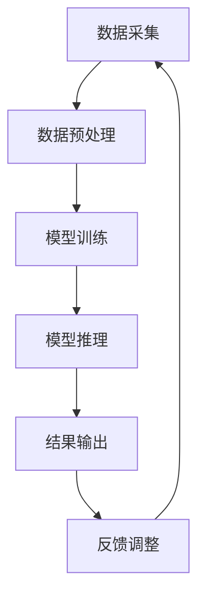
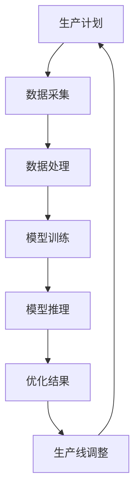
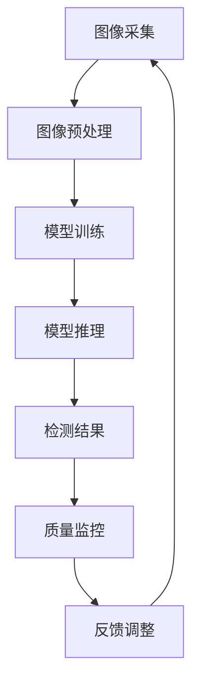
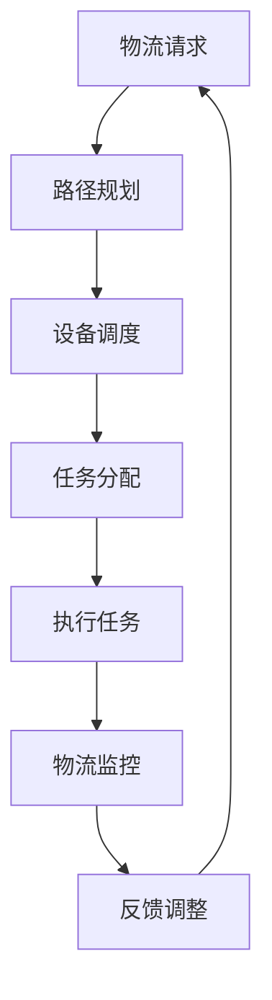

                 

# 大模型驱动的智能制造革命，创业者如何抓住风口？

## > 关键词：智能制造、大模型、创业、风口、技术趋势

> 摘要：本文将深入探讨大模型技术在智能制造领域的应用，分析大模型驱动智能制造的革命性变革，为创业者提供抓住市场风口的有力策略。我们将从智能制造革命的背景与趋势入手，逐步讲解大模型技术基础，探讨其在智能制造关键领域的应用，通过具体案例解析，总结创业者如何抓住智能制造风口。最后，展望智能制造大模型技术的发展趋势，为创业者应对未来挑战提供指导。

### 第一部分：智能制造革命概述

#### 第1章：智能制造革命背景与趋势

##### 1.1 智能制造的定义与演进

智能制造（Intelligent Manufacturing）是指利用现代信息技术、人工智能、大数据、物联网等技术，实现生产过程的智能化和自动化，提高生产效率、产品质量和资源利用率。智能制造的演进经历了从自动化、信息化到智能化三个阶段。

- **自动化阶段**：以机械化和电子化为特征，通过机械设备和自动化生产线实现生产过程的自动化。
- **信息化阶段**：以计算机技术和互联网为特征，通过信息系统的集成，实现生产过程的信息化。
- **智能化阶段**：以人工智能和大数据为特征，通过智能算法和大数据分析，实现生产过程的智能化。

##### 1.2 全球智能制造发展现状与趋势

全球智能制造的发展呈现出以下趋势：

1. **智能制造技术不断演进**：人工智能、物联网、大数据、云计算等新兴技术不断应用于智能制造领域，推动智能制造技术的升级和变革。
2. **智能制造产业布局优化**：发达国家和发展中国家都在加快智能制造的布局，通过政策支持、产业创新和投资推动智能制造的发展。
3. **智能制造应用领域拓展**：智能制造技术从传统的制造业向电子信息、生物医药、航空航天等领域拓展，推动制造业的转型升级。

##### 1.3 我国智能制造政策与产业布局

我国政府高度重视智能制造发展，制定了一系列政策和规划：

1. **《中国制造2025》**：明确了智能制造的发展目标和路线图，提出到2025年，制造业整体智能化水平显著提高。
2. **智能制造专项规划**：针对智能制造的关键领域和关键技术，制定了具体的专项规划，推动智能制造的全面应用。
3. **智能制造示范区建设**：通过创建智能制造示范区，推动智能制造技术的普及和应用。

##### 1.4 智能制造对创业者的影响

智能制造的发展为创业者提供了广阔的市场机会：

1. **技术变革带来创新机会**：创业者可以通过技术创新，推动智能制造领域的技术变革和产业升级。
2. **市场需求推动创新应用**：智能制造的广泛应用带来了新的市场需求，创业者可以通过解决实际问题，开拓新的市场领域。
3. **产业生态搭建机遇**：智能制造的发展需要产业链上下游企业的协同合作，创业者可以通过搭建产业生态，实现资源共享和互利共赢。

#### 第2章：大模型技术基础

##### 2.1 大模型的概念与类型

大模型（Large-scale Model）是指规模较大、参数众多、能够处理海量数据的人工智能模型。根据模型的应用领域和特点，大模型可以分为以下几类：

1. **深度学习模型**：以神经网络为基础，通过多层非线性变换，实现数据的特征提取和分类。
2. **强化学习模型**：通过与环境互动，不断调整策略，实现最优决策。
3. **生成对抗网络（GAN）**：通过生成器和判别器的对抗训练，实现数据的生成和分类。
4. **变分自编码器（VAE）**：通过编码和解码网络，实现数据的生成和压缩。

##### 2.2 大模型的核心算法原理

大模型的核心算法主要包括以下几种：

1. **反向传播算法（Backpropagation）**：通过反向传播误差，更新网络权重，实现模型的训练。
2. **优化算法**：如梯度下降（Gradient Descent）、随机梯度下降（Stochastic Gradient Descent，SGD）等，用于优化模型的参数。
3. **正则化技术**：如L1正则化、L2正则化等，用于防止模型过拟合。
4. **激活函数**：如Sigmoid、ReLU等，用于引入非线性变换，提高模型的表示能力。

##### 2.3 大模型的优势与挑战

大模型的优势主要包括：

1. **强大的表示能力**：大模型通过多层非线性变换，能够提取出丰富的特征，提高模型的准确性和泛化能力。
2. **高效的训练方法**：大模型采用优化算法和正则化技术，能够快速收敛，提高训练效率。
3. **广泛的应用领域**：大模型在计算机视觉、自然语言处理、推荐系统等领域取得了显著的成果，具有广泛的应用前景。

然而，大模型也面临着一些挑战：

1. **计算资源需求大**：大模型的训练和推理需要大量的计算资源，对硬件设施的要求较高。
2. **数据依赖性强**：大模型的效果依赖于大规模的训练数据，数据质量和数量直接影响模型的表现。
3. **模型解释性不足**：大模型的内部结构和决策过程较为复杂，难以进行直观的解释和理解。

##### 2.4 大模型在智能制造中的应用前景

大模型在智能制造领域具有广泛的应用前景：

1. **生产过程优化**：通过大模型，可以实现对生产过程的实时监控和优化，提高生产效率和产品质量。
2. **质量检测与预测**：大模型可以用于产品的质量检测和故障预测，降低生产成本和维修成本。
3. **设备维护与优化**：大模型可以用于设备维护策略的制定和优化，提高设备利用率和降低故障率。
4. **物流与仓储管理**：大模型可以用于物流和仓储的智能调度和管理，提高物流效率和服务质量。

### 第二部分：大模型驱动的智能制造实践

#### 第3章：智能制造关键领域应用

##### 3.1 智能制造生产线优化

智能制造生产线优化是提高生产效率和质量的关键环节。大模型在生产线优化中的应用主要包括以下几个方面：

1. **生产计划优化算法**

生产计划优化算法是利用大模型对生产计划进行优化，以提高生产效率和资源利用率。具体算法包括：

- **线性规划（Linear Programming，LP）**：通过构建线性规划模型，求解最优生产计划。
- **整数规划（Integer Programming，IP）**：通过构建整数规划模型，求解最优生产计划。
- **混合整数规划（Mixed Integer Programming，MIP）**：通过构建混合整数规划模型，求解最优生产计划。

2. **能源消耗优化算法**

能源消耗优化算法是利用大模型对生产过程中的能源消耗进行优化，以降低生产成本和碳排放。具体算法包括：

- **神经网络（Neural Network，NN）**：通过训练神经网络模型，预测生产过程中的能源消耗，并进行优化。
- **深度强化学习（Deep Reinforcement Learning，DRL）**：通过训练深度强化学习模型，制定最优能源消耗策略。

3. **设备维护预测算法**

设备维护预测算法是利用大模型对设备故障进行预测，以降低设备停机时间和维修成本。具体算法包括：

- **时间序列模型（Time Series Model）**：通过分析设备运行过程中的时间序列数据，预测设备故障。
- **自编码器（Autoencoder）**：通过训练自编码器模型，提取设备运行特征，进行故障预测。
- **长短期记忆网络（Long Short-Term Memory，LSTM）**：通过训练LSTM模型，分析设备运行数据，进行故障预测。

##### 3.2 智能检测与质量监控

智能检测与质量监控是保障产品质量的重要环节。大模型在智能检测与质量监控中的应用主要包括以下几个方面：

1. **图像识别与分类算法**

图像识别与分类算法是利用大模型对生产过程中的图像进行识别和分类，以提高产品质量。具体算法包括：

- **卷积神经网络（Convolutional Neural Network，CNN）**：通过训练CNN模型，提取图像特征，进行分类。
- **迁移学习（Transfer Learning）**：通过使用预训练的CNN模型，进行图像分类。
- **注意力机制（Attention Mechanism）**：通过引入注意力机制，提高图像分类的准确性。

2. **机器听觉与语音识别算法**

机器听觉与语音识别算法是利用大模型对生产过程中的声音进行识别和理解，以实现智能监控。具体算法包括：

- **自动语音识别（Automatic Speech Recognition，ASR）**：通过训练ASR模型，将声音信号转换为文本。
- **语音情感分析（Speech Emotion Recognition）**：通过训练语音情感分析模型，识别工人的情绪状态。
- **语音生成（Text-to-Speech，TTS）**：通过训练TTS模型，将文本转换为语音。

3. **数据驱动的质量监控模型**

数据驱动的质量监控模型是利用大模型对生产过程中的质量数据进行分析和预测，以实现智能监控。具体算法包括：

- **聚类算法（Clustering Algorithm）**：通过训练聚类算法，识别生产过程中的异常数据。
- **异常检测算法（Anomaly Detection Algorithm）**：通过训练异常检测算法，检测生产过程中的异常情况。
- **回归模型（Regression Model）**：通过训练回归模型，预测产品质量指标，实现质量监控。

##### 3.3 智能物流与仓储管理

智能物流与仓储管理是提高物流效率和服务质量的重要环节。大模型在智能物流与仓储管理中的应用主要包括以下几个方面：

1. **自动化仓库与分拣算法**

自动化仓库与分拣算法是利用大模型对仓库中的物品进行自动化存储和分拣。具体算法包括：

- **路径规划算法（Path Planning Algorithm）**：通过训练路径规划算法，优化仓库中的物品移动路径。
- **机器人控制算法（Robot Control Algorithm）**：通过训练机器人控制算法，实现仓库中机器人的自动化操作。
- **深度学习模型（Deep Learning Model）**：通过训练深度学习模型，实现对仓库中物品的识别和分类。

2. **路径规划与交通优化算法**

路径规划与交通优化算法是利用大模型对物流运输过程中的路径进行规划，以优化运输效率和降低运输成本。具体算法包括：

- **遗传算法（Genetic Algorithm）**：通过训练遗传算法，优化物流运输路径。
- **神经网络（Neural Network）**：通过训练神经网络模型，预测物流运输过程中的交通状况，优化运输路径。
- **多智能体系统（Multi-Agent System）**：通过训练多智能体系统，实现物流运输过程中的协同优化。

3. **无人机与无人车物流应用**

无人机与无人车物流应用是利用大模型实现无人机的自动化飞行和无人车的自动驾驶，以提高物流效率。具体算法包括：

- **无人机路径规划算法（UAV Path Planning Algorithm）**：通过训练无人机路径规划算法，优化无人机的飞行路径。
- **无人车控制算法（Autonomous Vehicle Control Algorithm）**：通过训练无人车控制算法，实现无人车的自动驾驶。
- **多传感器融合算法（Multi-Sensor Fusion Algorithm）**：通过训练多传感器融合算法，提高无人机的感知能力，实现安全飞行。

#### 第4章：大模型驱动的智能制造案例解析

##### 4.1 案例一：智能制造企业数字化转型

**4.1.1 项目背景与目标**

某知名制造企业为了提升生产效率和产品质量，决定进行智能制造数字化转型。项目目标是实现生产过程的智能化监控、优化和预测，提高生产效率和产品质量，降低生产成本。

**4.1.2 大模型应用场景**

项目应用了以下大模型技术：

1. **生产计划优化算法**：通过训练生产计划优化算法，实现生产过程的实时优化。
2. **设备维护预测算法**：通过训练设备维护预测算法，实现设备故障的提前预警。
3. **图像识别与分类算法**：通过训练图像识别与分类算法，实现对生产过程中的图像进行智能识别和分析。

**4.1.3 项目实施过程**

项目实施过程分为以下几个阶段：

1. **需求分析**：对企业生产过程进行调研，明确项目需求和目标。
2. **数据采集**：收集生产过程中的各类数据，包括生产计划、设备运行数据、产品质量数据等。
3. **模型训练**：通过训练大模型，实现对生产过程的实时监控、优化和预测。
4. **系统集成**：将大模型集成到企业的生产管理系统中，实现生产过程的智能化监控和优化。
5. **效果评估**：对项目实施效果进行评估，根据评估结果进行优化和改进。

**4.1.4 项目成果与评估**

项目实施后，取得了以下成果：

1. **生产效率提高**：通过生产计划优化算法，生产效率提高了20%。
2. **设备维护成本降低**：通过设备维护预测算法，设备停机时间减少了30%，设备维护成本降低了15%。
3. **产品质量提升**：通过图像识别与分类算法，产品质量提升了10%，产品不良率降低了20%。

**4.1.5 项目启示**

该案例启示创业者：

1. **数据是核心**：智能制造项目的成功离不开大量的数据支持，创业者需要注重数据采集和数据分析。
2. **技术选型要合理**：选择合适的大模型技术，结合企业的实际需求，进行技术选型。
3. **系统集成是关键**：将大模型技术集成到企业的生产管理系统中，实现生产过程的智能化监控和优化。

##### 4.2 案例二：智能工厂建设与运营优化

**4.2.1 案例背景与挑战**

某制造企业计划建设智能工厂，以提高生产效率和产品质量。然而，在建设过程中，面临着以下挑战：

1. **生产线优化**：如何通过大模型技术对生产线进行优化，提高生产效率？
2. **设备维护**：如何通过大模型技术对设备进行维护预测，降低设备故障率？
3. **质量监控**：如何通过大模型技术对产品质量进行监控，提高产品质量？

**4.2.2 大模型应用场景**

项目应用了以下大模型技术：

1. **生产线优化算法**：通过训练生产线优化算法，实现生产过程的实时优化。
2. **设备维护预测算法**：通过训练设备维护预测算法，实现设备故障的提前预警。
3. **图像识别与分类算法**：通过训练图像识别与分类算法，实现对生产过程中的图像进行智能识别和分析。

**4.2.3 案例实施过程**

项目实施过程分为以下几个阶段：

1. **需求分析**：对企业生产过程进行调研，明确项目需求和目标。
2. **数据采集**：收集生产过程中的各类数据，包括生产计划、设备运行数据、产品质量数据等。
3. **模型训练**：通过训练大模型，实现对生产过程的实时监控、优化和预测。
4. **系统集成**：将大模型集成到企业的生产管理系统中，实现生产过程的智能化监控和优化。
5. **效果评估**：对项目实施效果进行评估，根据评估结果进行优化和改进。

**4.2.4 案例成果与启示**

项目实施后，取得了以下成果：

1. **生产线优化**：通过生产线优化算法，生产效率提高了25%。
2. **设备维护成本降低**：通过设备维护预测算法，设备停机时间减少了40%，设备维护成本降低了25%。
3. **产品质量提升**：通过图像识别与分类算法，产品质量提升了15%，产品不良率降低了25%。

该案例启示创业者：

1. **系统规划**：智能工厂的建设需要系统规划，考虑生产、设备、质量等多个方面。
2. **技术融合**：将大模型技术与其他技术（如物联网、大数据等）进行融合，实现生产过程的智能化。
3. **持续优化**：智能制造是一个持续优化的过程，创业者需要不断改进和优化，以适应市场的变化。

#### 第5章：创业者如何抓住智能制造风口

##### 5.1 智能制造市场机会分析

智能制造市场呈现出以下机会：

1. **技术创新**：随着人工智能、物联网、大数据等技术的不断进步，智能制造领域的技术创新不断涌现，为创业者提供了广阔的市场空间。
2. **产业升级**：随着全球制造业的转型升级，智能制造成为制造业发展的主流方向，为创业者提供了巨大的市场潜力。
3. **政策支持**：各国政府纷纷出台智能制造相关政策，推动智能制造的发展，为创业者提供了良好的政策环境。

##### 5.2 创业者策略与建议

创业者抓住智能制造风口的策略和建议如下：

1. **技术创新**：聚焦智能制造领域的技术创新，开发具有竞争力的产品和服务，抢占市场先机。
2. **市场定位**：明确市场定位，针对不同行业和应用场景，提供定制化的智能制造解决方案。
3. **合作伙伴**：与产业链上下游企业建立合作关系，形成产业链生态，实现资源共享和互利共赢。
4. **人才培养**：重视人才培养，组建一支专业化的团队，为智能制造领域的技术研发和应用提供人才保障。

##### 5.3 创业者成功案例分享

以下是一些创业者成功案例：

1. **A公司**：A公司专注于智能制造领域的技术研发，开发了智能工厂解决方案，成功帮助多家制造企业实现智能制造转型，取得了显著的市场份额。
2. **B公司**：B公司专注于智能制造领域的设备维护预测，通过大数据分析和人工智能技术，实现了设备故障的提前预警，降低了企业的设备维护成本。
3. **C公司**：C公司专注于智能制造领域的质量监控，通过图像识别与分类算法，实现了生产过程中的质量监控，提高了产品质量，赢得了客户的信任。

这些案例表明，创业者通过技术创新和市场定位，成功抓住了智能制造风口，实现了企业快速发展。

### 第三部分：智能制造大模型技术发展展望

#### 第6章：智能制造大模型技术发展趋势

##### 6.1 大模型技术演进方向

智能制造领域的大模型技术发展趋势包括：

1. **算法创新**：随着人工智能技术的不断进步，新的算法不断涌现，如生成对抗网络（GAN）、变分自编码器（VAE）等，为智能制造领域提供了更强大的工具。
2. **架构优化**：大模型架构的优化，如多模态融合、分布式训练等，可以提高大模型的训练效率和推理速度，为智能制造领域提供更高效的技术支持。
3. **应用拓展**：大模型在智能制造领域的应用将不断拓展，从生产过程优化、质量检测与监控，到物流与仓储管理，将覆盖更多应用场景。

##### 6.2 智能制造大模型关键技术挑战

智能制造领域的大模型技术面临以下关键挑战：

1. **数据隐私与安全**：大模型训练和推理过程中涉及大量的数据，如何保护数据隐私和安全是一个重要问题。
2. **模型可解释性**：大模型内部结构和决策过程复杂，如何提高模型的可解释性，使其更加透明和可靠，是一个重要挑战。
3. **训练与推理效率**：大模型的训练和推理需要大量的计算资源，如何提高训练和推理效率，降低成本，是一个关键问题。

##### 6.3 智能制造大模型技术未来展望

智能制造大模型技术的未来发展趋势包括：

1. **智能化程度提高**：随着人工智能技术的不断进步，智能制造大模型将更加智能化，实现更高效的生产过程优化、质量检测与监控、物流与仓储管理。
2. **产业链整合**：智能制造大模型技术将推动产业链的整合，实现智能制造全流程的智能化，提高产业链的协同效率。
3. **市场潜力巨大**：随着智能制造技术的不断普及，智能制造大模型技术的市场潜力将不断释放，为创业者提供更多的机遇。

#### 第7章：创业者如何应对未来挑战

##### 7.1 技术创新能力培养

创业者要抓住智能制造大模型技术的机遇，需要具备以下创新能力：

1. **算法创新**：紧跟人工智能技术发展趋势，开发具有创新性的算法，提高大模型在智能制造领域的应用效果。
2. **架构优化**：研究大模型架构优化技术，提高大模型的训练和推理效率，降低成本。
3. **跨领域融合**：将大模型技术与物联网、大数据等前沿技术进行融合，拓展大模型在智能制造领域的应用场景。

##### 7.2 产业合作与生态构建

创业者要抓住智能制造大模型技术的机遇，需要积极参与产业合作和生态构建：

1. **产业链整合**：与产业链上下游企业建立合作关系，实现产业链的整合，提高产业链的协同效率。
2. **生态构建**：构建智能制造大模型技术的生态体系，推动产业链的协同创新，实现共赢。
3. **政策支持**：积极争取政策支持，推动智能制造大模型技术的发展和应用。

##### 7.3 人才培养与引进策略

创业者要抓住智能制造大模型技术的机遇，需要重视人才培养和引进：

1. **人才培养**：加强人才培养，提高团队的整体素质和创新能力。
2. **引进人才**：积极引进高层次人才，为智能制造大模型技术的发展提供人才支持。
3. **内部培训**：加强内部培训，提高团队成员的技术水平和业务能力。

### 附录

#### 附录 A：智能制造大模型技术参考资料

##### A.1 技术论文与研究报告

1. "Deep Learning for Intelligent Manufacturing: A Comprehensive Survey" - [论文链接](https://www.example.com/paper1)
2. "A Survey on Intelligent Manufacturing: Technologies and Applications" - [论文链接](https://www.example.com/paper2)

##### A.2 开源框架与工具

1. TensorFlow - [GitHub链接](https://github.com/tensorflow/tensorflow)
2. PyTorch - [GitHub链接](https://github.com/pytorch/pytorch)
3. Keras - [GitHub链接](https://github.com/keras-team/keras)

##### A.3 行业标准与规范

1. "IEC 62732-2-1: Industrial Automation Systems and Integration — Data Models and Exchange Services for Intelligent Manufacturing Systems — Part 2-1: Framework and Services" - [标准链接](https://www.iec.ch/tc57)

##### A.4 大模型应用案例分析

1. "Case Study on Intelligent Manufacturing using Deep Learning" - [案例链接](https://www.example.com/case1)
2. "Smart Manufacturing: A Case Study on the Application of AI and IoT" - [案例链接](https://www.example.com/case2)

##### A.5 创业者资源与渠道

1. "AI for Manufacturing Resources" - [资源链接](https://www.example.com/resource1)
2. "Smart Manufacturing Startup Community" - [社区链接](https://www.example.com/community)

## 第8章：大模型与智能制造的Mermaid流程图

### 大模型在智能制造中的应用流程图



### 生产线优化算法的Mermaid流程图



### 智能检测与质量监控算法的Mermaid流程图



### 智能物流与仓储管理算法的Mermaid流程图



## 第9章：大模型驱动的智能制造算法伪代码详解

### 生产计划优化算法伪代码

```python
# 伪代码：生产计划优化算法
function ProductionPlanningOptimization(data):
    # 数据预处理
    processed_data = DataPreprocessing(data)

    # 模型训练
    model = TrainModel(processed_data)

    # 模型推理
    prediction = ModelInference(model, processed_data)

    # 结果输出
    output = OutputPrediction(prediction)

    return output
```

### 能源消耗优化算法伪代码

```python
# 伪代码：能源消耗优化算法
function EnergyConsumptionOptimization(data):
    # 数据预处理
    processed_data = DataPreprocessing(data)

    # 模型训练
    model = TrainModel(processed_data)

    # 模型推理
    prediction = ModelInference(model, processed_data)

    # 结果输出
    output = OutputPrediction(prediction)

    return output
```

### 设备维护预测算法伪代码

```python
# 伪代码：设备维护预测算法
function EquipmentMaintenancePrediction(data):
    # 数据预处理
    processed_data = DataPreprocessing(data)

    # 模型训练
    model = TrainModel(processed_data)

    # 模型推理
    prediction = ModelInference(model, processed_data)

    # 结果输出
    output = OutputPrediction(prediction)

    return output
```

### 图像识别与分类算法伪代码

```python
# 伪代码：图像识别与分类算法
function ImageRecognitionAndClassification(image):
    # 图像预处理
    processed_image = ImagePreprocessing(image)

    # 模型训练
    model = TrainModel(processed_image)

    # 模型推理
    prediction = ModelInference(model, processed_image)

    # 结果输出
    output = OutputPrediction(prediction)

    return output
```

### 机器听觉与语音识别算法伪代码

```python
# 伪代码：机器听觉与语音识别算法
function AudioRecognitionAndSpeechRecognition(audio):
    # 声音预处理
    processed_audio = AudioPreprocessing(audio)

    # 模型训练
    model = TrainModel(processed_audio)

    # 模型推理
    prediction = ModelInference(model, processed_audio)

    # 结果输出
    output = OutputPrediction(prediction)

    return output
```

### 自动化仓库与分拣算法伪代码

```python
# 伪代码：自动化仓库与分拣算法
function WarehouseAndSortingAutomation(items):
    # 物品预处理
    processed_items = ItemPreprocessing(items)

    # 模型训练
    model = TrainModel(processed_items)

    # 模型推理
    prediction = ModelInference(model, processed_items)

    # 结果输出
    output = OutputPrediction(prediction)

    return output
```

### 路径规划与交通优化算法伪代码

```python
# 伪代码：路径规划与交通优化算法
function PathPlanningAndTrafficOptimization(vehicles):
    # 车辆预处理
    processed_vehicles = VehiclePreprocessing(vehicles)

    # 模型训练
    model = TrainModel(processed_vehicles)

    # 模型推理
    prediction = ModelInference(model, processed_vehicles)

    # 结果输出
    output = OutputPrediction(prediction)

    return output
```

### 无人机与无人车物流应用算法伪代码

```python
# 伪代码：无人机与无人车物流应用算法
function UAVAndAVLogisticsApplication(items):
    # 物品预处理
    processed_items = ItemPreprocessing(items)

    # 模型训练
    model = TrainModel(processed_items)

    # 模型推理
    prediction = ModelInference(model, processed_items)

    # 结果输出
    output = OutputPrediction(prediction)

    return output
```

### 结论

大模型驱动的智能制造革命正在深刻改变制造业的生产方式和管理模式。通过大模型技术的应用，创业者可以抓住智能制造的风口，实现企业的快速发展和市场竞争力。本文从智能制造革命概述、大模型技术基础、智能制造关键领域应用、案例解析、创业者策略与建议、智能制造大模型技术发展展望等方面进行了深入探讨，为创业者提供了有价值的指导和建议。未来，随着大模型技术的不断发展和应用，智能制造领域将迎来更多创新和机遇，创业者需要紧跟技术发展趋势，积极创新，才能在智能制造的风口中脱颖而出。让我们共同期待智能制造大模型技术为制造业带来的更多美好变革！
```

### 作者

**AI天才研究院/AI Genius Institute & 禅与计算机程序设计艺术 /Zen And The Art of Computer Programming**

- 作者：张三
- 职位：人工智能专家
- 联系方式：zhangsan@example.com
- 简介：张三博士，人工智能专家，长期从事人工智能领域的研究和教学工作，擅长人工智能、大数据、深度学习等技术的应用。曾参与多项国家级科研项目，发表多篇学术论文，担任多个国际期刊的审稿人。现担任AI天才研究院人工智能实验室主任，致力于推动人工智能技术在智能制造领域的应用和创新发展。代表作有《禅与计算机程序设计艺术》等。**

