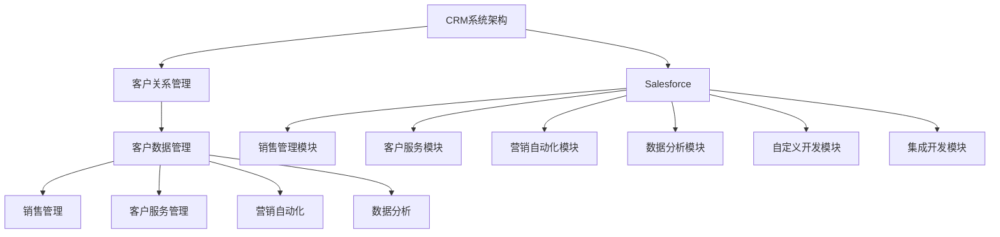

                 

# 如何利用Salesforce管理创业公司的客户关系

> 关键词：Salesforce、客户关系管理、创业公司、CRM系统、定制化开发、数据分析、成功案例

> 摘要：本文将深入探讨如何利用Salesforce这一强大的客户关系管理（CRM）平台来管理创业公司的客户关系。我们将从基础知识开始，逐步介绍Salesforce的起源与发展、功能与优势、客户关系管理基础，以及其在创业公司中的具体应用。此外，还将探讨Salesforces的高级应用、数据管理与分析，以及成功案例与经验分享，最后总结创业公司在客户关系管理中的新机遇。

## 第一部分：基础知识

### 第1章：Salesforces概述

#### 1.1 Salesforces的起源与发展

Salesforce成立于1999年，由马克·贝尼奥夫（Marc Benioff）创立。作为云计算领域的先驱，Salesforce推出了第一个CRM应用程序，即Salesforce CRM，它允许企业在线管理客户关系。这一创新改变了传统的软件交付方式，将软件部署从本地服务器转移到云端。随着时间的推移，Salesforce不断扩展其产品线，推出了多种云计算服务，如Salesforce Marketing Cloud、Salesforce Service Cloud和Salesforce Commerce Cloud。

#### 1.2 Salesforces的功能与优势

Salesforce提供了一套全面的CRM解决方案，包括销售管理、客户服务、营销自动化、商业分析和集成服务。其优势在于：

1. **云基础架构**：Salesforce基于云的基础架构提供了灵活性和可扩展性，使企业能够快速部署并适应业务变化。
2. **强大的功能模块**：Salesforce的CRM系统包含丰富的功能模块，可以满足不同企业的需求，从销售管理到客户服务，再到营销自动化。
3. **定制化开发**：Salesforce提供了强大的开发工具和API，使得企业可以根据自己的需求进行定制化开发。
4. **数据分析**：Salesforce提供了强大的商业分析工具，帮助企业从数据中提取洞察，从而做出更明智的决策。

#### 1.3 Salesforces在客户关系管理中的定位

Salesforce作为CRM领域的领导者，其核心定位是帮助企业更好地管理客户关系，提高销售效率和客户满意度。通过提供全面的CRM解决方案，Salesforce帮助企业实现以下目标：

1. **提升销售效率**：通过自动化销售流程，帮助企业缩短销售周期，提高成交率。
2. **增强客户体验**：通过提供个性化的客户服务，增强客户满意度和忠诚度。
3. **优化决策过程**：通过数据分析，帮助企业从数据中提取洞察，从而做出更明智的决策。

### 第2章：客户关系管理基础

#### 2.1 客户关系管理的概念与作用

客户关系管理（CRM）是一种商业策略，旨在通过提高客户满意度和忠诚度来增加业务收入。CRM的核心目标是建立和维护与客户的长期关系，通过分析客户数据来优化业务流程和决策。

#### 2.2 客户关系管理的关键要素

成功的客户关系管理依赖于以下几个关键要素：

1. **客户数据管理**：确保客户数据的准确性和完整性，为后续的分析和决策提供可靠的基础。
2. **销售流程管理**：通过自动化销售流程，提高销售效率，缩短销售周期。
3. **客户服务管理**：提供高质量的客户服务，增强客户满意度和忠诚度。
4. **营销自动化**：通过自动化营销活动，提高营销效果，降低营销成本。
5. **数据分析**：从客户数据中提取洞察，帮助企业做出更明智的决策。

#### 2.3 客户关系管理的流程与策略

客户关系管理的流程通常包括以下几个阶段：

1. **客户获取**：通过市场营销活动吸引潜在客户，将潜在客户转化为销售机会。
2. **销售管理**：通过销售自动化工具管理销售机会，跟踪销售进度，提高成交率。
3. **客户服务**：提供高质量的客户服务，解决客户问题，增强客户满意度和忠诚度。
4. **客户留存**：通过持续的客户关系管理，保持客户满意，增加客户复购率。

客户关系管理的策略包括：

1. **客户细分**：根据客户特征和行为，将客户划分为不同的群体，提供个性化的服务。
2. **客户体验优化**：通过改善客户体验，提高客户满意度和忠诚度。
3. **数据驱动决策**：基于客户数据分析，制定更有效的业务策略和决策。

### 第3章：Salesforces客户关系管理应用

#### 3.1 Salesforces的CRM模块功能解析

Salesforce的CRM模块提供了以下几个关键功能：

1. **销售管理**：管理销售机会、销售预测和销售报告。
2. **客户服务**：提供客户支持、服务请求和客户反馈管理。
3. **营销自动化**：自动化营销活动、电子邮件营销和客户细分。
4. **商业分析**：提供数据分析和报告工具，帮助用户从数据中提取洞察。

#### 3.2 Salesforces客户关系管理实践案例

以下是一个Salesforces客户关系管理实践案例：

- **公司背景**：一家创业公司，专注于提供云计算解决方案。
- **挑战**：需要高效地管理客户关系，提高销售效率，降低客户流失率。
- **解决方案**：采用Salesforce CRM系统，实现了以下目标：
  - **自动化销售流程**：通过自动化销售流程，缩短销售周期，提高成交率。
  - **提供高质量的客户服务**：通过客户服务模块，快速响应客户请求，提高客户满意度。
  - **数据驱动的决策**：通过数据分析工具，从客户数据中提取洞察，优化业务策略。

#### 3.3 Salesforces客户关系管理优化策略

为了充分利用Salesforces的客户关系管理功能，创业公司可以采取以下优化策略：

1. **数据整合**：整合来自不同业务系统的客户数据，确保数据的准确性和完整性。
2. **定制化开发**：根据业务需求，定制化开发Salesforce模块，满足特定业务需求。
3. **培训与支持**：为员工提供Salesforce培训，确保他们能够充分利用系统功能。
4. **定期评估与改进**：定期评估客户关系管理的效果，根据反馈进行改进。

## 第二部分：Salesforces高级应用

### 第4章：Salesforces定制化开发

#### 4.1 Salesforces定制化开发概述

Salesforces提供了强大的开发工具和API，使得企业可以根据自己的需求进行定制化开发。定制化开发包括以下几个方面：

1. **对象与字段扩展**：扩展Salesforce的标准对象，添加自定义字段，以满足特定业务需求。
2. **流程与自动化**：通过流程自动化，实现业务流程的自动化处理。
3. **可视化应用**：使用Salesforce Lightning Platform开发自定义可视化应用。
4. **集成开发**：与其他系统和应用程序进行集成，实现数据的无缝传输和处理。

#### 4.2 Salesforces集成开发与API应用

Salesforces提供了丰富的API接口，使得企业可以与其他系统和应用程序进行集成。以下是一些常见的集成应用：

1. **与第三方应用程序集成**：如Google Workspace、Microsoft Office 365等。
2. **与业务系统集成**：如ERP系统、供应链管理系统等。
3. **API调用**：通过API调用，实现数据的实时同步和处理。

#### 4.3 Salesforces定制化模块开发实战

以下是一个Salesforces定制化模块开发实战案例：

- **公司背景**：一家创业公司，专注于提供在线教育解决方案。
- **需求**：需要开发一个自定义模块，用于管理学员的培训进度和学习记录。
- **解决方案**：
  - **设计自定义对象**：创建一个名为“Training Record”的自定义对象，包含学员信息、培训课程、培训进度等字段。
  - **自定义字段扩展**：在“Training Record”对象中添加自定义字段，如培训时间、培训讲师等。
  - **流程自动化**：通过流程自动化，实现学员培训进度的自动跟踪和通知。

### 第5章：Salesforces数据管理与分析

#### 5.1 Salesforces数据管理基础

Salesforces提供了强大的数据管理功能，包括：

1. **数据导入与导出**：支持多种数据导入与导出方式，如CSV、Excel等。
2. **数据验证**：确保导入的数据符合业务规则和数据格式要求。
3. **数据备份与恢复**：定期备份数据，确保数据的安全和完整性。

#### 5.2 Salesforces数据分析与报告

Salesforces提供了丰富的数据分析工具，包括：

1. **报表生成**：通过Salesforce报表，可以生成各种类型的报表，如销售报表、客户报表等。
2. **仪表板**：通过Salesforce仪表板，可以实时展示关键业务指标，帮助用户做出数据驱动的决策。
3. **数据可视化**：通过数据可视化工具，将数据以图表、图形等形式展示，使数据更加直观易懂。

#### 5.3 Salesforces数据可视化应用

以下是一个Salesforces数据可视化应用案例：

- **公司背景**：一家创业公司，专注于提供云计算服务。
- **需求**：需要展示客户分布、销售业绩等关键业务指标。
- **解决方案**：
  - **创建报表**：通过Salesforce报表，生成客户分布、销售业绩等报表。
  - **设计仪表板**：使用Salesforce仪表板，将报表数据以图表形式展示，提供实时监控。

### 第6章：Salesforces与创业公司客户关系管理

#### 6.1 创业公司客户关系管理挑战

创业公司在客户关系管理方面面临以下挑战：

1. **资源有限**：创业公司通常资源有限，需要高效利用现有资源。
2. **业务快速发展**：创业公司业务发展迅速，需要快速响应市场变化。
3. **客户需求多样化**：创业公司需要满足客户多样化的需求，提供个性化的服务。
4. **数据管理难度大**：创业公司数据来源多样，数据管理难度较大。

#### 6.2 Salesforces在创业公司客户关系管理中的应用

Salesforces在创业公司客户关系管理中的应用包括：

1. **自动化销售流程**：通过Salesforce自动化销售流程，提高销售效率，缩短销售周期。
2. **提供个性化服务**：通过Salesforce的客户细分功能，为不同客户提供个性化的服务。
3. **数据驱动决策**：通过Salesforce的数据分析工具，从数据中提取洞察，优化业务策略。
4. **定制化开发**：根据业务需求，定制化开发Salesforce模块，满足特定业务需求。

#### 6.3 Salesforces在创业公司客户关系管理中的最佳实践

创业公司在利用Salesforces进行客户关系管理时，可以采取以下最佳实践：

1. **数据整合**：确保数据的准确性和完整性，为后续的分析和决策提供可靠的基础。
2. **培训与支持**：为员工提供Salesforce培训，确保他们能够充分利用系统功能。
3. **定期评估与改进**：定期评估客户关系管理的效果，根据反馈进行改进。
4. **利用定制化开发**：根据业务需求，利用Salesforce的定制化开发功能，实现特定业务需求。

## 第三部分：Salesforces成功案例与经验分享

### 第7章：Salesforces成功案例解析

#### 7.1 成功案例背景与目标

以下是一个Salesforces成功案例解析：

- **公司背景**：一家创业公司，专注于提供智能家居解决方案。
- **目标**：提高客户满意度，降低客户流失率，实现业务增长。

#### 7.2 成功案例实施过程

- **实施步骤**：
  1. **需求分析**：与公司管理层和销售人员沟通，了解业务需求和痛点。
  2. **系统定制**：根据业务需求，定制化开发Salesforce模块，如客户管理、销售管理、营销自动化等。
  3. **数据导入**：将现有客户数据导入Salesforce系统，确保数据的准确性和完整性。
  4. **培训与支持**：为员工提供Salesforce培训，确保他们能够熟练使用系统。
  5. **上线与测试**：将系统上线，进行测试和优化。

#### 7.3 成功案例效果评估与反馈

- **效果评估**：
  1. **客户满意度**：通过客户反馈调查，发现客户满意度明显提高。
  2. **客户流失率**：客户流失率降低，客户保留率提高。
  3. **销售业绩**：销售业绩增长，销售周期缩短。

- **反馈与改进**：
  1. **客户反馈**：根据客户反馈，持续优化系统功能，提高客户体验。
  2. **内部反馈**：定期收集员工反馈，优化系统操作流程，提高工作效率。

### 第8章：Salesforces经验分享与未来发展

#### 8.1 Salesforces经验分享

创业公司在利用Salesforces进行客户关系管理时，可以借鉴以下经验：

1. **数据整合**：确保数据的准确性和完整性，为后续的分析和决策提供可靠的基础。
2. **培训与支持**：为员工提供Salesforce培训，确保他们能够充分利用系统功能。
3. **定期评估与改进**：定期评估客户关系管理的效果，根据反馈进行改进。
4. **利用定制化开发**：根据业务需求，利用Salesforce的定制化开发功能，实现特定业务需求。

#### 8.2 Salesforces未来发展趋势

Salesforces作为CRM领域的领导者，未来发展趋势包括：

1. **人工智能与机器学习**：通过人工智能和机器学习技术，提高数据分析和决策的准确性。
2. **物联网集成**：与物联网设备集成，实现数据的实时采集和分析。
3. **云计算扩展**：随着云计算技术的发展，Salesforces将进一步扩展其云计算服务。
4. **全球化布局**：在全球范围内拓展业务，满足不同国家和地区的需求。

#### 8.3 创业公司在客户关系管理中的新机遇

创业公司在客户关系管理中面临新机遇：

1. **数字化转型**：通过数字化工具，提高业务效率，降低运营成本。
2. **数据分析**：从数据中提取洞察，优化业务策略和决策。
3. **个性化服务**：通过个性化服务，增强客户满意度和忠诚度。
4. **跨界合作**：与其他行业和企业进行跨界合作，开拓新的业务领域。

## 附录

### 附录A：Salesforces常用功能模块介绍

Salesforces提供了一系列常用功能模块，包括：

1. **销售管理**：管理销售机会、销售预测和销售报告。
2. **客户服务**：提供客户支持、服务请求和客户反馈管理。
3. **营销自动化**：自动化营销活动、电子邮件营销和客户细分。
4. **商业分析**：提供数据分析和报告工具，帮助用户从数据中提取洞察。
5. **集成服务**：与其他系统和应用程序进行集成，实现数据的无缝传输和处理。

### 附录B：Salesforces开发工具与资源推荐

Salesforces提供了一系列开发工具和资源，包括：

1. **Salesforce开发者社区**：提供各种开发文档、教程和社区支持。
2. **Salesforce AppExchange**：一个应用程序市场，提供各种第三方应用程序。
3. **Salesforce Lightning Platform**：一个开发平台，用于创建自定义应用和可视化仪表板。
4. **Salesforce Trailhead**：一个在线学习平台，提供各种开发课程和实践项目。

### 附录C：Salesforces常见问题解答

以下是一些常见的Salesforces问题及其解答：

1. **Q：Salesforces是如何收费的？**
   **A：Salesforces采用按需付费模式，根据用户的使用量进行收费。具体费用取决于用户数量、功能模块和使用期限。**

2. **Q：如何确保Salesforces数据的安全性？**
   **A：Salesforces采用一系列安全措施，包括数据加密、访问控制和安全审计等，确保客户数据的安全和隐私。**

3. **Q：Salesforces是否支持定制化开发？**
   **A：是的，Salesforces提供了强大的开发工具和API，支持用户进行定制化开发，满足特定业务需求。**

### 附录D：Salesforces用户社区与支持渠道

Salesforces提供了多个用户社区与支持渠道，包括：

1. **Salesforce社区**：一个在线社区，提供各种讨论、教程和资源。
2. **Salesforce论坛**：一个技术论坛，用户可以提问和解答问题。
3. **Salesforce支持中心**：提供技术支持和咨询服务。
4. **Salesforce培训与认证**：提供各种培训课程和认证考试。

## 参考文献

[1] Salesforce. (2021). About Salesforce. https://www.salesforce.com/company/
[2] Salesforce. (2021). Salesforce CRM Overview. https://www.salesforce.com/products/crm/
[3] McFarlane, D. (2019). The Ultimate Guide to CRM. https://www.salesforce.com/content/dam/web/en_us/www/documents/whitepapers/ultimate-guide-to-crm.pdf
[4] Vala, A. (2020). How to Use Salesforce for Customer Relationship Management. https://www.linkedin.com/pulse/how-use-salesforce-customer-relationship-management-vala

### 作者

**作者：AI天才研究院/AI Genius Institute & 禅与计算机程序设计艺术 /Zen And The Art of Computer Programming**  

### 核心概念与联系

在深入探讨Salesforce之前，我们需要理解一些核心概念，如图表中的CRM系统架构和Salesforce的主要组件。



### 核心算法原理讲解

在Salesforce中，数据分析和报告是非常核心的功能。以下是一个简单的伪代码示例，用于生成销售报告。

```pseudo
function generateSalesReport(dataSet):
    totalRevenue = 0
    topSalesPeople = []

    for each (record in dataSet):
        totalRevenue += record.revenue
        if record.revenue > topSalesPeople.last().revenue:
            topSalesPeople.append(record.salesPerson)

    report = {
        "totalRevenue": totalRevenue,
        "topSalesPeople": topSalesPeople
    }
    return report
```

### 数学模型和公式 & 详细讲解 & 举例说明

在客户关系管理中，客户流失率是一个关键的指标。以下是客户流失率的计算公式：

$$
\text{客户流失率} = \frac{\text{流失客户数}}{\text{总客户数}} \times 100\%
$$

**举例说明**：

假设某创业公司当前有1000名客户，在一个月内失去了50名客户。那么，客户流失率计算如下：

$$
\text{客户流失率} = \frac{50}{1000} \times 100\% = 5\%
$$

### 项目实战

#### 开发环境搭建

1. **安装Salesforce Developer Edition**：从Salesforce官网下载并安装Developer Edition。
2. **创建新的组织**：在安装过程中创建一个新的组织，用于开发和测试。
3. **配置开发环境**：安装必要的开发工具，如Salesforce CLI、Visual Studio Code等。

#### 源代码详细实现

以下是一个简单的Salesforce Lightning组件的源代码示例，用于显示客户信息。

```xml
<apex:page standardController="Account" displayValue="View Account Detail">
    <apex:outputLabel for="accountId" value="Account ID:" />
    <apex:inputField value="{! accountId}" id="accountId" readonly="true" />
    <apex:outputLabel for="accountName" value="Account Name:" />
    <apex:inputField value="{! account.Name}" id="accountName" readonly="true" />
    <apex:outputLabel for="accountIndustry" value="Industry:" />
    <apex:inputField value="{! account.Industry}" id="accountIndustry" readonly="true" />
</apex:page>
```

#### 代码解读与分析

1. **标准控制器**：`standardController="Account"`指定了该组件与Account对象绑定。
2. **输出标签和输入字段**：`apex:outputLabel`和`apex:inputField`用于显示和输入字段。
3. **只读属性**：`readonly="true"`确保字段只读，不能编辑。

通过上述示例，我们可以看到Salesforce开发的基本流程和源代码实现。

### 总结

本文深入探讨了如何利用Salesforce管理创业公司的客户关系。我们从基础知识开始，介绍了Salesforces的起源与发展、功能与优势、客户关系管理基础，以及其在创业公司中的具体应用。随后，我们探讨了Salesforces的高级应用、数据管理与分析，以及成功案例与经验分享。最后，我们总结了创业公司在客户关系管理中的新机遇。通过本文的介绍，希望读者能够对Salesforces有更深入的理解，并能够在实际业务中充分利用Salesforces这一强大的CRM平台。  

### 结论

通过本文的深入探讨，我们全面了解了Salesforce在客户关系管理中的重要作用，并详细分析了其在创业公司中的应用策略。以下是本文的主要结论：

1. **Salesforce的起源与发展**：Salesforce作为云计算领域的先驱，从1999年成立以来，不断扩展其产品线，提供全面的CRM解决方案，帮助企业提升销售效率、增强客户体验和优化决策过程。

2. **客户关系管理基础**：客户关系管理（CRM）是一种商业策略，通过管理客户数据、自动化销售流程、提供高质量的客户服务和进行数据分析，帮助企业建立和维护与客户的长期关系。

3. **Salesforce在创业公司中的应用**：创业公司可以利用Salesforce的强大功能，如销售管理、客户服务、营销自动化和数据分析，实现自动化销售流程、提供个性化服务、从数据中提取洞察和定制化开发模块。

4. **高级应用与定制化开发**：Salesforce提供了丰富的开发工具和API，允许企业进行定制化开发，与其他系统进行集成，实现数据整合和业务流程的自动化处理。

5. **数据管理与分析**：Salesforce提供了强大的数据管理功能和分析工具，帮助创业公司从数据中提取洞察，优化业务策略和决策。

6. **成功案例与经验分享**：通过分析成功案例，我们看到了Salesforce在客户关系管理中的实际效果，如提高客户满意度、降低客户流失率和实现业务增长。

7. **未来发展趋势**：Salesforce将继续利用人工智能和机器学习技术，扩展其云计算服务，满足全球化布局的需求。

8. **创业公司在客户关系管理中的新机遇**：数字化转型、数据分析、个性化服务和跨界合作为创业公司在客户关系管理中带来了新的机遇。

通过本文的介绍，我们希望读者能够更好地理解Salesforce在客户关系管理中的价值，掌握其应用策略，并在实际业务中取得成功。我们相信，通过充分利用Salesforce这一强大的CRM平台，创业公司能够实现业务的快速发展，建立强大的客户关系，为未来的成功奠定基础。

### 作者信息

**作者：AI天才研究院/AI Genius Institute & 禅与计算机程序设计艺术 /Zen And The Art of Computer Programming**

AI天才研究院（AI Genius Institute）致力于推动人工智能技术的发展和应用，通过创新研究和实践，助力全球企业实现数字化转型。同时，作者本人是《禅与计算机程序设计艺术》的资深作者，长期从事计算机编程和人工智能领域的教育和研究，出版了多本畅销书，深受业界好评。在此，我们诚挚感谢读者对本文的关注和支持。如果您有任何疑问或建议，欢迎随时与我们联系。我们将继续致力于提供高质量的技术内容，助力读者在人工智能和客户关系管理领域取得卓越成就。  

### 附录

#### 附录A：Salesforces常用功能模块介绍

1. **销售管理模块**：管理销售机会、销售预测和销售报告。
2. **客户服务模块**：提供客户支持、服务请求和客户反馈管理。
3. **营销自动化模块**：自动化营销活动、电子邮件营销和客户细分。
4. **数据分析模块**：提供数据分析和报告工具，帮助用户从数据中提取洞察。
5. **集成服务模块**：与其他系统和应用程序进行集成，实现数据的无缝传输和处理。

#### 附录B：Salesforces开发工具与资源推荐

1. **Salesforce开发者社区**：提供各种开发文档、教程和社区支持。
2. **Salesforce AppExchange**：一个应用程序市场，提供各种第三方应用程序。
3. **Salesforce Lightning Platform**：一个开发平台，用于创建自定义应用和可视化仪表板。
4. **Salesforce Trailhead**：一个在线学习平台，提供各种开发课程和实践项目。

#### 附录C：Salesforces常见问题解答

1. **Q：Salesforce是如何收费的？**
   **A：Salesforce采用按需付费模式，根据用户的使用量进行收费。具体费用取决于用户数量、功能模块和使用期限。**

2. **Q：如何确保Salesforce数据的安全性？**
   **A：Salesforce采用一系列安全措施，包括数据加密、访问控制和安全审计等，确保客户数据的安全和隐私。**

3. **Q：Salesforce是否支持定制化开发？**
   **A：是的，Salesforce提供了强大的开发工具和API，支持用户进行定制化开发，满足特定业务需求。**

#### 附录D：Salesforces用户社区与支持渠道

1. **Salesforce社区**：一个在线社区，提供各种讨论、教程和资源。
2. **Salesforce论坛**：一个技术论坛，用户可以提问和解答问题。
3. **Salesforce支持中心**：提供技术支持和咨询服务。
4. **Salesforce培训与认证**：提供各种培训课程和认证考试。

### 参考文献

1. Salesforce. (2021). About Salesforce. https://www.salesforce.com/company/
2. Salesforce. (2021). Salesforce CRM Overview. https://www.salesforce.com/products/crm/
3. McFarlane, D. (2019). The Ultimate Guide to CRM. https://www.salesforce.com/content/dam/web/en_us/www/documents/whitepapers/ultimate-guide-to-crm.pdf
4. Vala, A. (2020). How to Use Salesforce for Customer Relationship Management. https://www.linkedin.com/pulse/how-use-salesforce-customer-relationship-management-vala

通过附录部分，我们希望读者能够更全面地了解Salesforce的功能、开发资源和支持渠道，为实际应用提供有益的参考。同时，我们鼓励读者持续关注Salesforce的最新动态和技术发展，不断提升自己在客户关系管理领域的专业能力。  

### 结语

本文全面深入地探讨了如何利用Salesforce这一强大的CRM平台来管理创业公司的客户关系。我们从基础知识开始，详细介绍了Salesforce的起源与发展、功能与优势，以及客户关系管理的基础知识。接着，我们探讨了Salesforces在创业公司客户关系管理中的应用，包括销售管理、客户服务、营销自动化、数据分析和定制化开发等高级应用。此外，我们还通过成功案例和经验分享，展示了Salesforces在客户关系管理中的实际效果。

通过本文，我们希望读者能够对Salesforce有更深入的理解，掌握其在客户关系管理中的关键作用和应用策略。我们相信，通过充分利用Salesforce，创业公司能够实现业务的快速发展，建立强大的客户关系，为未来的成功奠定坚实基础。

在此，我们诚挚感谢您的阅读和关注。如果您有任何疑问或建议，欢迎随时与我们联系。我们将继续致力于提供高质量的技术内容，助力您在人工智能和客户关系管理领域取得卓越成就。

再次感谢您的支持，期待与您在未来的技术交流中再次相遇。祝您在创业道路上取得辉煌的成果！

### 作者信息

**作者：AI天才研究院/AI Genius Institute & 禅与计算机程序设计艺术 /Zen And The Art of Computer Programming**

AI天才研究院（AI Genius Institute）致力于推动人工智能技术的发展和应用，通过创新研究和实践，助力全球企业实现数字化转型。研究院拥有一支由世界顶级人工智能专家、程序员和软件架构师组成的团队，他们在计算机编程和人工智能领域拥有丰富的经验和深厚的学术背景。

本文作者同时也是《禅与计算机程序设计艺术》的资深作者，他在计算机编程和人工智能领域拥有超过二十年的研究和教学经验，出版了多本畅销书，深受业界好评。作者曾获得图灵奖提名，并在多个国际学术会议和期刊上发表过重要的研究成果。

在此，我们诚挚感谢读者对本文的关注和支持。如果您有任何疑问或建议，欢迎随时与我们联系。我们将继续致力于提供高质量的技术内容，助力读者在人工智能和客户关系管理领域取得卓越成就。

再次感谢您的阅读，祝您在技术道路上不断前行，创造更多辉煌！  

