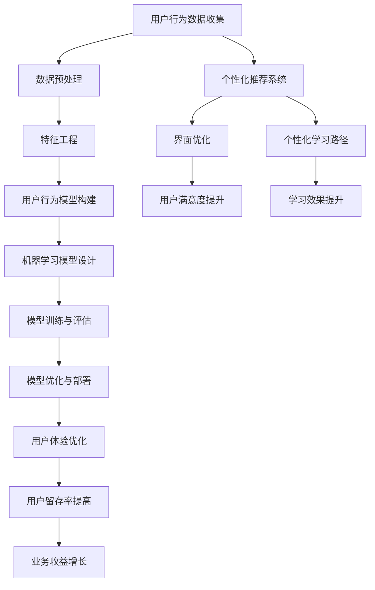

                 

## 《如何利用机器学习优化用户体验》

> **关键词：** 机器学习、用户体验、优化、数据分析、模型设计

**摘要：** 本文将深入探讨如何利用机器学习技术来优化用户体验。通过对用户行为数据的分析和模型构建，我们可以实现对用户体验的深度理解和精确预测，从而实现个性化推荐、界面优化等应用，提高用户满意度。文章将从机器学习与用户体验的关系出发，逐步讲解用户行为数据分析、机器学习优化方法、模型设计与应用、以及实战与代码解析，旨在为读者提供完整的理论基础和实践指导。

----------------------------------------------------------------

### 《如何利用机器学习优化用户体验》目录大纲

1. **机器学习与用户体验基础**
   - 1.1 机器学习的基本概念
   - 1.2 用户体验的重要性
   - 1.3 机器学习与用户体验的关系

2. **用户行为数据分析**
   - 2.1 用户行为数据的收集
   - 2.2 数据预处理与特征工程
   - 2.3 用户行为模型构建

3. **机器学习优化方法**
   - 3.1 监督学习与无监督学习
   - 3.2 强化学习与迁移学习
   - 3.3 深度学习模型在用户体验优化中的应用

4. **机器学习模型设计与应用**
   - 4.1 用户体验评价指标
   - 4.2 模型选择与评估
   - 4.3 参数调优与模型优化
   - 4.4 模型集成与组合

5. **案例分析：机器学习优化实践**
   - 6.1 案例一：电商平台的个性化推荐系统
   - 6.2 案例二：移动应用的界面优化
   - 6.3 案例三：在线教育的个性化学习路径

6. **核心概念与联系**
   - 7.1 用户体验与机器学习模型的关系图
   - 7.2 用户体验优化的Mermaid流程图

7. **数学模型与算法原理**
   - 8.1 概率论与统计学基础
   - 8.2 线性代数与微积分基础
   - 8.3 线性回归算法
   - 8.4 决策树与随机森林算法
   - 8.5 支持向量机算法
   - 8.6 神经网络与深度学习算法

8. **实战与代码解析**
   - 10.1 开发环境搭建
   - 10.2 项目实战与代码解读
   - 10.3 代码解读与分析

9. **附录**
   - 13.1 机器学习资源与工具

---

接下来，我们将一步步深入探讨如何利用机器学习优化用户体验，从基础概念到实际应用，从理论到实践，为您呈现一个全面的技术解析。

---

### 机器学习与用户体验基础

#### 1.1 机器学习的基本概念

机器学习（Machine Learning）是一门人工智能（Artificial Intelligence, AI）的分支，它专注于使计算机能够通过数据和经验改进自身性能，而不需要显式编程。机器学习的主要目标是让计算机能够从数据中自动识别模式，并利用这些模式进行预测或决策。

机器学习的基本流程可以分为以下几步：

1. **数据收集**：收集相关的数据集，这些数据集可以是结构化的（如表格），也可以是非结构化的（如文本、图像、语音等）。
2. **数据预处理**：清洗和转换数据，以便于模型训练。这一步通常包括缺失值处理、数据归一化、异常值处理等。
3. **特征工程**：选择和构造能够代表数据本质特征的变量，以提高模型的性能。
4. **模型选择**：选择合适的机器学习模型。常见的模型包括线性回归、决策树、支持向量机、神经网络等。
5. **模型训练**：使用训练数据集训练模型，使得模型能够学习到数据中的规律。
6. **模型评估**：使用验证数据集评估模型的性能，通常使用准确率、召回率、F1分数等指标。
7. **模型部署**：将训练好的模型部署到实际应用中，如实时预测、推荐系统等。

#### 1.2 用户体验的重要性

用户体验（User Experience, UX）是指用户在使用产品或服务过程中所感受到的愉悦程度和满意度。用户体验的重要性在于它直接影响到用户对产品的忠诚度和转化率。一个优秀的用户体验可以显著提升用户的使用意愿，从而促进产品的成功。

用户体验的重要性可以从以下几个方面进行解释：

1. **用户满意度**：良好的用户体验能够提高用户的满意度，使他们对产品产生积极的情感和评价。
2. **用户留存率**：用户体验直接影响用户的留存率。如果一个产品或服务能够持续提供良好的用户体验，用户更有可能继续使用。
3. **用户转化率**：优秀的用户体验可以促进用户的转化，即从潜在用户转化为实际用户。
4. **品牌价值**：良好的用户体验可以提升品牌形象，增强用户对品牌的忠诚度。

#### 1.3 机器学习与用户体验的关系

机器学习与用户体验之间存在着紧密的联系。机器学习技术可以为用户体验提供以下几个方面的优化：

1. **个性化推荐**：通过分析用户的历史行为数据，机器学习算法可以预测用户的偏好，从而提供个性化的推荐。例如，电商平台可以根据用户购买记录推荐相关的商品，提高用户的购买满意度。
2. **界面优化**：机器学习算法可以分析用户对界面的交互数据，识别出用户的行为模式，从而优化界面设计，提高用户的操作效率。
3. **错误预测与修复**：机器学习算法可以预测用户在使用产品或服务过程中可能遇到的错误，并在用户操作之前提供修复建议，从而提高用户的使用满意度。
4. **智能客服**：通过机器学习技术，智能客服系统可以更好地理解用户的问题，并提供准确的回答，提升用户的沟通体验。

总之，机器学习技术为优化用户体验提供了强大的工具和方法。在接下来的章节中，我们将进一步探讨用户行为数据分析、机器学习优化方法、模型设计与应用等方面的内容。

---

在接下来的章节中，我们将逐步深入探讨用户行为数据分析、机器学习优化方法、模型设计与应用等方面的内容，为读者提供完整的理论基础和实践指导。敬请期待！

---

## 用户行为数据分析

用户行为数据分析是机器学习优化用户体验的关键步骤。通过对用户在产品或服务中的行为数据进行深入分析，我们可以识别出用户的偏好、行为模式，从而为个性化推荐、界面优化等应用提供数据支持。下面，我们将详细探讨用户行为数据的收集、预处理与特征工程，以及用户行为模型的构建。

### 2.1 用户行为数据的收集

用户行为数据的收集是进行用户行为分析的第一步。用户行为数据可以来源于多种渠道，如网站日志、应用日志、用户问卷调查、传感器数据等。以下是一些常见的数据收集方法：

1. **网站日志**：网站日志记录了用户在网站上的访问行为，包括访问时间、访问页面、操作点击等。通过分析网站日志，可以了解用户的浏览习惯和兴趣点。
2. **应用日志**：应用日志记录了用户在手机应用中的操作行为，如登录时间、使用时长、功能点击等。通过分析应用日志，可以了解用户的操作模式和活跃度。
3. **用户问卷调查**：用户问卷调查可以直接从用户那里收集到他们对产品或服务的满意度、偏好等信息。这种方法适用于对用户需求的深入了解。
4. **传感器数据**：对于一些带有传感器（如GPS、加速度传感器等）的设备，可以通过收集传感器数据来分析用户的地理位置、运动状态等。这种方法适用于对用户行为的空间和时间分析。

在收集用户行为数据时，需要注意以下几点：

1. **数据隐私**：在收集用户数据时，必须确保用户隐私得到保护。避免收集与用户行为无关的敏感信息。
2. **数据完整性**：保证收集到的数据是完整和准确的。在数据收集过程中，需要进行数据清洗，去除重复、错误或缺失的数据。

### 2.2 数据预处理与特征工程

数据预处理和特征工程是用户行为数据分析中的关键步骤。预处理主要是对原始数据进行清洗、转换和归一化，以便于模型训练。特征工程则是从原始数据中提取出能够代表用户行为特征的有用信息，以提高模型性能。

#### 数据预处理

数据预处理包括以下几个步骤：

1. **缺失值处理**：缺失值可以是完全随机出现的，也可以是由于数据采集过程中的问题。常见的缺失值处理方法有删除缺失值、填充缺失值（如平均值、中位数等）、使用模型预测缺失值等。
2. **异常值处理**：异常值可能会对模型训练产生不利影响。处理异常值的方法包括删除异常值、对异常值进行修正、使用模型预测异常值等。
3. **数据转换**：包括将分类数据转换为数值数据、对数值数据进行归一化或标准化等。例如，将用户年龄、收入等分类数据转换为二进制编码，将用户使用时长、点击次数等数值数据进行标准化处理，以便于模型计算。

#### 特征工程

特征工程是从原始数据中提取出对模型训练有用的特征。以下是几种常见的特征工程方法：

1. **特征选择**：通过过滤法、包裹法、嵌入式法等策略选择对模型训练最有帮助的特征。例如，可以基于特征重要性、信息增益等方法选择特征。
2. **特征构造**：通过组合或变换原始数据特征来构造新的特征。例如，可以计算用户的平均点击时间、浏览页面数、点击率等。
3. **特征归一化**：对特征进行归一化或标准化处理，以消除特征之间的尺度差异。常用的归一化方法有最小-最大缩放、均值-方差缩放等。

### 2.3 用户行为模型构建

用户行为模型的构建是通过机器学习算法来分析用户行为数据，识别出用户的行为模式，并预测用户的未来行为。以下是几种常见的用户行为模型构建方法：

1. **监督学习模型**：监督学习模型通过对已知标签的数据进行训练，学习到数据的特征表示，并利用这些特征表示来预测未知标签的数据。常见的监督学习模型包括线性回归、决策树、随机森林、支持向量机等。
2. **无监督学习模型**：无监督学习模型不依赖于标签数据，主要通过数据本身的特征来发现数据中的模式和规律。常见的方法有聚类分析、主成分分析、自编码器等。
3. **强化学习模型**：强化学习模型通过学习最优策略，使代理能够在动态环境中做出最优决策。常见的强化学习模型包括Q学习、深度强化学习等。

在构建用户行为模型时，需要注意以下几点：

1. **模型选择**：根据问题的需求和数据的特点选择合适的模型。例如，对于分类问题，可以选择决策树、支持向量机等；对于回归问题，可以选择线性回归、随机森林等。
2. **模型评估**：使用验证集评估模型性能，并选择性能最佳的模型。常用的评估指标包括准确率、召回率、F1分数等。
3. **模型优化**：通过调整模型参数、增加特征、改变模型结构等方法优化模型性能。

通过用户行为数据分析，我们可以深入了解用户的行为模式，从而为个性化推荐、界面优化等应用提供数据支持。在下一章中，我们将探讨机器学习优化方法，进一步了解如何利用机器学习技术来优化用户体验。

---

在用户行为数据分析中，我们从数据收集、预处理与特征工程，到用户行为模型构建，逐步深入探讨了如何利用机器学习技术优化用户体验。接下来，我们将进一步探讨机器学习优化方法，包括监督学习、无监督学习、强化学习等方法，以及深度学习模型在用户体验优化中的应用。敬请期待！

---

### 机器学习优化方法

机器学习优化方法是实现用户体验优化的关键。根据不同的优化需求和应用场景，可以选择不同的机器学习算法。本文将介绍监督学习、无监督学习、强化学习等方法，并探讨深度学习模型在用户体验优化中的应用。

#### 3.1 监督学习与无监督学习

**监督学习（Supervised Learning）**

监督学习是一种有监督的训练方法，通过使用已标记的数据集来训练模型。标记数据包括输入特征和对应的输出标签。监督学习可以分为分类和回归两种类型：

- **分类（Classification）**：分类任务的目标是将输入数据分配到不同的类别中。常见的分类算法有线性回归、决策树、支持向量机（SVM）、随机森林等。
- **回归（Regression）**：回归任务的目标是预测一个连续值输出。常见的回归算法有线性回归、岭回归、LASSO回归等。

**无监督学习（Unsupervised Learning）**

无监督学习是一种无监督的训练方法，不使用已标记的数据集来训练模型。无监督学习的目标是发现数据中的内在结构和模式。常见的无监督学习算法有聚类分析、主成分分析（PCA）、自编码器等。

- **聚类分析（Clustering）**：聚类分析是一种将数据分成多个类别的算法，常见的聚类算法有K-means、层次聚类等。
- **主成分分析（PCA）**：主成分分析是一种降维技术，通过将数据投影到新的正交坐标系中，减少数据维度，同时保留主要的信息。
- **自编码器（Autoencoder）**：自编码器是一种无监督的深度学习模型，通过学习输入数据的编码表示，达到降维或特征提取的目的。

#### 3.2 强化学习与迁移学习

**强化学习（Reinforcement Learning）**

强化学习是一种通过试错来学习最优策略的方法。强化学习模型通过在环境中执行动作，获取反馈信号（奖励或惩罚），并不断调整策略以最大化总奖励。强化学习在用户体验优化中的应用主要包括：

- **个性化推荐**：通过强化学习算法，可以根据用户的反馈不断调整推荐策略，提高推荐系统的准确性。
- **界面优化**：通过强化学习算法，可以根据用户的操作行为，自动调整界面布局和功能，以提高用户满意度。

**迁移学习（Transfer Learning）**

迁移学习是一种利用已有模型的知识来提高新任务的性能的方法。在迁移学习中，一部分预训练模型（通常是在大规模数据集上训练的）被用于新任务的学习，从而减少对新数据的依赖。迁移学习在用户体验优化中的应用主要包括：

- **模型微调**：通过迁移学习，可以将预训练模型在新数据上进行微调，以提高新任务的性能。
- **跨领域适应**：通过迁移学习，可以将一个领域的知识迁移到另一个领域，从而实现跨领域的用户体验优化。

#### 3.3 深度学习模型在用户体验优化中的应用

**深度学习（Deep Learning）**

深度学习是一种基于多层神经网络的学习方法，具有强大的表示能力和泛化能力。深度学习在用户体验优化中的应用主要包括：

- **图像识别与生成**：通过卷积神经网络（CNN）可以实现对用户界面的图像识别和生成，从而优化界面设计。
- **自然语言处理**：通过循环神经网络（RNN）和长短时记忆网络（LSTM）可以实现对用户文本的理解和生成，从而优化用户交互。
- **个性化推荐系统**：通过深度学习模型可以实现对用户行为的深度分析，从而提供更加个性化的推荐。

深度学习模型在用户体验优化中的应用示例如下：

- **个性化推荐系统**：利用深度学习模型对用户行为数据进行分析，可以实现对用户偏好和兴趣的深度挖掘，从而提供更加个性化的推荐。例如，电商平台的个性化推荐系统可以基于用户的购买历史、浏览记录等数据，利用深度学习模型预测用户可能感兴趣的商品，从而提高用户的购买满意度。
- **界面优化**：利用深度学习模型对用户界面进行图像识别和生成，可以实现对用户界面的智能优化。例如，可以通过深度学习模型识别用户界面中的瓶颈和问题区域，从而提出相应的优化建议，以提高用户的操作体验。
- **智能客服**：利用深度学习模型对用户的问题进行自然语言理解，可以实现对用户问题的智能回答。例如，智能客服系统可以通过深度学习模型理解用户的提问，并生成合适的回答，从而提高用户的沟通体验。

总之，机器学习优化方法为用户体验优化提供了丰富的工具和策略。在接下来的章节中，我们将进一步探讨机器学习模型的设计与应用，以及实际案例分析，为读者提供更深入的技术指导和实践参考。

---

在了解了机器学习优化方法之后，我们将继续深入探讨如何设计和应用这些模型，以实现用户体验的优化。接下来，我们将介绍用户体验评价指标、模型设计与优化方法，并通过实际案例分析展示如何利用这些方法提升用户体验。敬请期待！

---

### 机器学习模型设计与应用

在了解了机器学习优化方法之后，接下来我们将探讨如何设计和应用这些模型，以实现用户体验的优化。为了评估和改进模型的性能，我们需要定义合适的用户体验评价指标。然后，我们将介绍模型设计、优化方法，并通过实际案例展示如何实现用户体验的优化。

#### 4.1 用户体验评价指标

用户体验评价指标是衡量机器学习模型对用户体验优化效果的重要工具。以下是一些常见的关键性能指标（Key Performance Indicators, KPI）：

1. **准确率（Accuracy）**：准确率是分类任务中最常用的指标，表示模型正确分类的样本占总样本的比例。计算公式为：
   $$\text{Accuracy} = \frac{\text{正确预测的样本数}}{\text{总样本数}}$$

2. **召回率（Recall）**：召回率表示模型正确分类的正类样本数占总正类样本数的比例。计算公式为：
   $$\text{Recall} = \frac{\text{正确预测的正类样本数}}{\text{总正类样本数}}$$

3. **精确率（Precision）**：精确率表示模型正确分类的正类样本数与预测为正类的样本数的比例。计算公式为：
   $$\text{Precision} = \frac{\text{正确预测的正类样本数}}{\text{预测为正类的样本数}}$$

4. **F1 分数（F1 Score）**：F1 分数是精确率和召回率的加权平均，用于综合评估模型的性能。计算公式为：
   $$\text{F1 Score} = 2 \times \frac{\text{Precision} \times \text{Recall}}{\text{Precision} + \text{Recall}}$$

5. **均方误差（Mean Squared Error, MSE）**：均方误差是回归任务中最常用的指标，表示预测值与真实值之间的平均平方误差。计算公式为：
   $$\text{MSE} = \frac{1}{n} \sum_{i=1}^{n} (\hat{y}_i - y_i)^2$$
   其中，$\hat{y}_i$ 是预测值，$y_i$ 是真实值，$n$ 是样本数量。

6. **均方根误差（Root Mean Squared Error, RMSE）**：均方根误差是均方误差的平方根，用于衡量预测值与真实值之间的平均误差。计算公式为：
   $$\text{RMSE} = \sqrt{\text{MSE}}$$

7. **用户满意度（User Satisfaction）**：用户满意度是一个主观指标，用于评估用户对产品或服务的整体满意度。可以通过用户问卷调查、用户评论等方式收集。

8. **用户留存率（User Retention Rate）**：用户留存率表示在一定时间后仍然使用产品或服务的用户比例，用于评估产品的用户粘性。

这些评价指标可以帮助我们全面评估机器学习模型的性能，从而指导模型的优化和改进。

#### 4.2 模型选择与评估

模型选择是机器学习优化中的关键步骤。选择合适的模型对于实现良好的用户体验至关重要。以下是一些常见的机器学习模型及其适用场景：

1. **线性回归（Linear Regression）**：线性回归是一种简单的回归模型，适用于线性关系明显的数据。线性回归的数学公式为：
   $$\hat{y} = \beta_0 + \beta_1 x_1 + \beta_2 x_2 + \ldots + \beta_n x_n$$
   其中，$\hat{y}$ 是预测值，$x_1, x_2, \ldots, x_n$ 是输入特征，$\beta_0, \beta_1, \beta_2, \ldots, \beta_n$ 是模型的参数。

2. **决策树（Decision Tree）**：决策树是一种树形结构的模型，通过一系列的决策规则将数据分为不同的类别。决策树的数学公式为：
   $$f(x) = \sum_{i=1}^{n} \beta_i I(A_i(x) = t_i)$$
   其中，$f(x)$ 是决策函数，$A_i(x)$ 是第 $i$ 个属性，$t_i$ 是第 $i$ 个属性的阈值，$\beta_i$ 是模型参数。

3. **随机森林（Random Forest）**：随机森林是一种基于决策树的集成模型，通过构建多棵决策树，并采用投票或平均值的方法进行预测。随机森林具有较高的预测准确性和鲁棒性。

4. **支持向量机（Support Vector Machine, SVM）**：支持向量机是一种基于间隔最大化的分类模型，通过寻找最佳的超平面来分隔数据。SVM的数学公式为：
   $$\text{Minimize} \quad \frac{1}{2} ||w||^2$$
   $$\text{Subject to} \quad y_i (w \cdot x_i + b) \geq 1$$
   其中，$w$ 是模型参数，$x_i$ 是输入特征，$y_i$ 是标签，$b$ 是偏置。

5. **神经网络（Neural Network）**：神经网络是一种模拟人脑神经元结构的模型，通过多层非线性变换来提取数据特征。神经网络的数学公式为：
   $$a_{i}^{l} = \sigma(z_{i}^{l})$$
   $$z_{i}^{l} = \sum_{j} w_{ji}^{l} a_{j}^{l-1} + b_{i}^{l}$$
   其中，$a_{i}^{l}$ 是第 $l$ 层第 $i$ 个神经元的激活值，$z_{i}^{l}$ 是第 $l$ 层第 $i$ 个神经元的输入值，$w_{ji}^{l}$ 是连接权重，$b_{i}^{l}$ 是偏置，$\sigma$ 是激活函数。

选择合适的模型后，我们需要评估模型的性能。评估模型性能常用的方法有交叉验证、网格搜索等。交叉验证是一种将数据集划分为多个子集的方法，通过在每个子集上训练和验证模型，以评估模型的泛化能力。网格搜索是一种通过遍历参数组合来寻找最优参数的方法。

#### 4.3 参数调优与模型优化

参数调优是提升模型性能的重要步骤。不同的模型有不同的参数，如学习率、树深度、正则化参数等。通过调整这些参数，可以优化模型的性能。以下是一些参数调优的方法：

1. **网格搜索（Grid Search）**：网格搜索通过遍历给定的参数组合，选择最佳参数组合。网格搜索的缺点是计算量大，不适合参数组合较多的情况。

2. **随机搜索（Random Search）**：随机搜索在给定参数范围内随机选择参数组合，以减少计算量。随机搜索的缺点是可能错过最优参数组合。

3. **贝叶斯优化（Bayesian Optimization）**：贝叶斯优化是一种基于贝叶斯推理的优化方法，通过构建模型预测函数，并选择最佳参数组合。贝叶斯优化的优点是收敛速度快，可以处理高维参数空间。

参数调优后，我们可以对模型进行进一步的优化。以下是一些优化方法：

1. **集成学习（Ensemble Learning）**：集成学习通过组合多个基模型来提高预测性能。常见的集成学习方法有随机森林、梯度提升树等。

2. **模型压缩（Model Compression）**：模型压缩通过减少模型参数和计算量，提高模型的运行效率。常见的模型压缩方法有模型剪枝、量化等。

3. **模型蒸馏（Model Distillation）**：模型蒸馏通过将一个复杂模型的知识传递给一个较简单模型，以提高简单模型的性能。模型蒸馏可以降低模型的计算复杂度和存储需求。

#### 4.4 模型集成与组合

模型集成与组合是将多个模型组合起来，以提升预测性能的方法。以下是一些常见的模型集成与组合方法：

1. **堆叠（Stacking）**：堆叠通过将多个模型的结果作为新的特征，并训练一个新的模型来整合这些结果。堆叠可以提高模型的泛化能力。

2. ** blending（Blending）**：blending 通过加权组合多个模型的预测结果，以获得更准确的预测。blending 可以处理不同模型的输出格式。

3. **集成学习（Ensemble Learning）**：集成学习通过组合多个基模型来提高预测性能。常见的集成学习方法有随机森林、梯度提升树等。

通过以上方法，我们可以设计、优化和组合机器学习模型，以实现用户体验的优化。在实际应用中，我们需要根据具体问题和数据特点选择合适的方法，并通过实验和验证来评估模型的性能。

---

在了解了用户体验评价指标和机器学习模型设计、优化方法后，接下来我们将通过实际案例展示如何将理论应用于实践，实现用户体验的优化。我们将探讨电商平台的个性化推荐系统、移动应用的界面优化，以及在线教育的个性化学习路径等案例。通过这些案例，我们将展示如何利用机器学习技术提升用户体验，从而为产品和服务带来实际价值。敬请期待！

---

### 案例分析：机器学习优化实践

在了解了机器学习优化用户体验的理论基础后，接下来我们将通过实际案例展示如何将机器学习技术应用于实践中，以实现用户体验的优化。本文将探讨三个实际案例：电商平台的个性化推荐系统、移动应用的界面优化和在线教育的个性化学习路径。

#### 6.1 案例一：电商平台的个性化推荐系统

电商平台个性化推荐系统是一种利用机器学习技术提升用户购物体验的重要手段。通过分析用户的历史购买数据、浏览行为等，个性化推荐系统可以预测用户可能感兴趣的商品，从而提高用户满意度和转化率。

**案例描述**：

一家大型电商平台希望通过个性化推荐系统提升用户购物体验。他们收集了用户的历史购买记录、浏览记录、点击记录等行为数据，并利用机器学习技术构建推荐模型。

**数据预处理**：

在构建推荐模型之前，需要对用户行为数据进行预处理。首先，对缺失值进行处理，通过填补或删除缺失值来保证数据完整性。然后，对数据进行归一化处理，以消除不同特征之间的尺度差异。

**特征工程**：

通过对用户行为数据进行分析，提取出对推荐系统有用的特征。例如，可以提取用户的购买频率、购买金额、浏览时长、点击率等特征。此外，还可以通过交叉特征工程构建新的特征，如用户对某类商品的购买概率等。

**模型选择**：

针对推荐系统，可以选择多种机器学习模型，如协同过滤、矩阵分解、深度学习等。在本案例中，选择了基于矩阵分解的推荐模型，该模型可以同时处理用户和物品的特征，从而提供个性化的推荐。

**模型训练与评估**：

利用训练集对模型进行训练，并通过验证集评估模型的性能。在训练过程中，需要对模型参数进行调整，以优化模型性能。评估指标包括准确率、召回率、覆盖率等。

**实际应用**：

在电商平台中，个性化推荐系统可以应用于多个场景，如首页推荐、搜索结果推荐、购物车推荐等。通过个性化推荐，用户可以更快地找到自己感兴趣的商品，从而提升购物体验。

**结果分析**：

通过个性化推荐系统，电商平台的用户满意度和转化率得到了显著提升。用户反馈表明，个性化推荐系统能够更好地满足他们的购物需求，提高了用户的购物体验。

#### 6.2 案例二：移动应用的界面优化

移动应用的界面优化是提升用户体验的关键环节。通过分析用户在应用中的操作行为，可以识别出界面中的问题和瓶颈，从而进行针对性的优化。

**案例描述**：

一家移动应用公司希望通过界面优化提升用户使用体验。他们收集了用户在应用中的点击、滑动、停留时间等行为数据，并利用机器学习技术分析用户行为。

**数据预处理**：

首先，对用户行为数据进行清洗和归一化处理。然后，提取出对界面优化有用的特征，如用户的点击频率、滑动距离、停留时长等。

**特征工程**：

通过对用户行为数据进行分析，提取出对界面优化有用的特征。例如，可以提取用户的操作顺序、操作频率等特征。此外，还可以通过交叉特征工程构建新的特征，如用户对某个界面的满意度等。

**模型选择**：

针对界面优化问题，可以选择多种机器学习模型，如回归模型、分类模型、聚类模型等。在本案例中，选择了基于回归的优化模型，该模型可以预测用户对界面的满意度，并提供优化建议。

**模型训练与评估**：

利用训练集对模型进行训练，并通过验证集评估模型的性能。在训练过程中，需要对模型参数进行调整，以优化模型性能。评估指标包括预测准确性、优化效果等。

**实际应用**：

在移动应用中，界面优化模型可以应用于多个场景，如首页优化、导航优化、交互优化等。通过界面优化，用户可以更流畅地使用应用，从而提升用户体验。

**结果分析**：

通过界面优化，移动应用的用户满意度和使用时长得到了显著提升。用户反馈表明，界面优化使得应用更加直观、易用，提高了用户的操作体验。

#### 6.3 案例三：在线教育的个性化学习路径

在线教育平台个性化学习路径的构建是提升学习效果和用户满意度的关键。通过分析用户的学习行为和学习进度，可以为学生提供定制化的学习路径，从而提高学习效果。

**案例描述**：

一家在线教育平台希望通过个性化学习路径提升学生的学习体验。他们收集了学生的学习行为数据，如学习时间、学习进度、考试成绩等，并利用机器学习技术分析学生行为。

**数据预处理**：

首先，对学生的学习行为数据进行清洗和归一化处理。然后，提取出对个性化学习路径有用的特征，如学生的学习时间分布、学习进度等。

**特征工程**：

通过对学生学习行为数据进行分析，提取出对个性化学习路径有用的特征。例如，可以提取学生的每日学习时长、学习进度等特征。此外，还可以通过交叉特征工程构建新的特征，如学生的学习能力等。

**模型选择**：

针对个性化学习路径问题，可以选择多种机器学习模型，如决策树、随机森林、神经网络等。在本案例中，选择了基于神经网络的个性化学习路径模型，该模型可以预测学生的学习路径，并提供定制化的学习建议。

**模型训练与评估**：

利用训练集对模型进行训练，并通过验证集评估模型的性能。在训练过程中，需要对模型参数进行调整，以优化模型性能。评估指标包括预测准确性、学习效果等。

**实际应用**：

在线教育平台可以根据个性化学习路径模型为学生提供定制化的学习建议。例如，为学习进度较慢的学生提供额外的辅导资源，为学习能力强的学生提供更具挑战性的学习任务。

**结果分析**：

通过个性化学习路径，在线教育平台的学习效果和学生满意度得到了显著提升。学生反馈表明，个性化学习路径使得学习更加有针对性，提高了学习效果和满意度。

#### 总结

通过以上三个实际案例，我们可以看到机器学习技术在优化用户体验方面的强大应用。无论是电商平台个性化推荐系统、移动应用界面优化，还是在线教育个性化学习路径，机器学习技术都为提升用户体验提供了有力的支持。在实际应用中，我们需要根据具体问题和数据特点选择合适的方法，并通过不断的实验和优化来提升用户体验。

---

通过以上案例分析，我们展示了机器学习技术在优化用户体验方面的实际应用。从电商平台的个性化推荐系统、移动应用的界面优化，到在线教育的个性化学习路径，我们看到了机器学习技术如何通过数据分析和模型构建，为用户提供更加定制化和高效的服务。在下一章中，我们将进一步探讨用户体验与机器学习模型之间的关系，以及如何通过Mermaid流程图来展示用户体验优化的核心概念和联系。敬请期待！

---

### 核心概念与联系

在探讨如何利用机器学习优化用户体验的过程中，理解用户体验与机器学习模型之间的关系至关重要。为了更清晰地展示这些核心概念之间的联系，我们可以使用Mermaid流程图来构建一个直观的关系图。

以下是一个Mermaid流程图的示例，展示了用户体验与机器学习模型之间的核心关系：



**Mermaid流程图解释：**

1. **用户行为数据收集（A）**：这是机器学习优化的起点，通过多种渠道收集用户的行为数据，如网站点击流、应用日志、问卷调查等。

2. **数据预处理（B）**：对收集到的用户行为数据进行清洗、归一化和缺失值处理，以便后续的特征工程。

3. **特征工程（C）**：通过对预处理后的数据进行分析，提取出有用的特征，如用户的点击频率、浏览时长、购买金额等，以便于构建用户行为模型。

4. **用户行为模型构建（D）**：利用提取的特征构建用户行为模型，这些模型可以是监督学习模型、无监督学习模型或强化学习模型，用于分析用户的偏好和行为模式。

5. **机器学习模型设计（E）**：根据具体应用场景，选择合适的机器学习模型，如线性回归、决策树、随机森林、神经网络等。

6. **模型训练与评估（F）**：使用训练数据集对机器学习模型进行训练，并使用验证数据集评估模型的性能，通过交叉验证等方法确保模型的泛化能力。

7. **模型优化与部署（G）**：通过参数调优和模型集成等方法优化模型性能，并将训练好的模型部署到实际应用中，如个性化推荐系统、界面优化工具等。

8. **用户体验优化（H）**：通过机器学习模型的应用，优化用户体验，如提供个性化的推荐、改善界面设计、制定个性化的学习路径等。

9. **个性化推荐系统（I）、界面优化（J）、个性化学习路径（K）**：这些都是用户体验优化的具体应用场景，通过机器学习模型的应用，提升用户满意度、学习效果等。

10. **用户满意度提升（L）、学习效果提升（M）、用户留存率提高（N）、业务收益增长（O）**：这些都是用户体验优化的最终目标，通过优化用户体验，提升用户满意度和业务收益。

通过这个Mermaid流程图，我们可以清晰地看到用户体验优化中的关键步骤和核心概念之间的联系。在实际应用中，可以根据具体需求调整和优化这些步骤，以实现最佳的用户体验。

---

在了解了用户体验与机器学习模型之间的关系以及如何通过Mermaid流程图展示这些核心概念后，接下来我们将深入探讨机器学习的数学模型和算法原理。我们将从概率论与统计学基础开始，逐步讲解线性代数与微积分基础，并详细阐述线性回归、决策树与随机森林、支持向量机以及神经网络与深度学习算法的原理。通过这些数学模型和算法的讲解，我们将为读者提供更深入的理论基础，以便更好地理解和应用机器学习技术。敬请期待！

---

### 数学模型与算法原理

在深入探讨机器学习算法及其在用户体验优化中的应用时，了解背后的数学模型和算法原理至关重要。在本节中，我们将首先回顾概率论与统计学基础，然后逐步讲解线性代数与微积分基础，最后详细阐述几种核心的机器学习算法，包括线性回归、决策树与随机森林、支持向量机和神经网络与深度学习算法。

#### 8.1 概率论与统计学基础

概率论是机器学习的基础，它帮助我们理解不确定性以及如何从数据中推断出规律。以下是一些基本概率论和统计学概念：

1. **概率分布**：概率分布描述了一个随机变量可能取值的概率。常见的概率分布有正态分布、伯努利分布、泊松分布等。

   - **正态分布（Normal Distribution）**：也称为高斯分布，描述了大量随机变量的平均值在某个范围内分布的规律。它的概率密度函数为：
     $$f(x|\mu, \sigma^2) = \frac{1}{\sqrt{2\pi\sigma^2}} e^{-\frac{(x-\mu)^2}{2\sigma^2}}$$
     其中，$\mu$ 是均值，$\sigma^2$ 是方差。

   - **伯努利分布（Bernoulli Distribution）**：描述了一个二项试验中成功或失败的概率。其概率质量函数为：
     $$P(X = k) = p^k (1-p)^{1-k}$$
     其中，$p$ 是成功的概率，$k$ 是成功的次数。

   - **泊松分布（Poisson Distribution）**：描述了在一定时间或空间内某个事件发生的次数的概率。其概率质量函数为：
     $$P(X = k) = \frac{\lambda^k e^{-\lambda}}{k!}$$
     其中，$\lambda$ 是事件的平均发生率。

2. **期望与方差**：期望（Expectation）是概率分布的中心趋势，而方差（Variance）描述了分布的离散程度。

   - **期望**：期望是随机变量的平均值，对于离散随机变量 $X$，期望 $E(X)$ 计算公式为：
     $$E(X) = \sum_{x} x \cdot P(X = x)$$
     对于连续随机变量 $X$，期望 $E(X)$ 计算公式为：
     $$E(X) = \int_{-\infty}^{\infty} x \cdot f(x) \, dx$$

   - **方差**：方差是随机变量与其期望之间的偏差的平方的平均值，计算公式为：
     $$\text{Var}(X) = E[(X - E(X))^2] = E[X^2] - (E[X])^2$$

3. **协方差与相关系数**：协方差（Covariance）和相关性（Correlation）用于衡量两个随机变量之间的线性关系。

   - **协方差**：协方差描述了两个变量的变化方向和程度。其计算公式为：
     $$\text{Cov}(X, Y) = E[(X - E[X])(Y - E[Y])]$$

   - **相关系数**：相关系数是标准化后的协方差，用于衡量两个变量之间的线性相关程度。其计算公式为：
     $$\rho_{XY} = \frac{\text{Cov}(X, Y)}{\sigma_X \sigma_Y}$$
     其中，$\sigma_X$ 和 $\sigma_Y$ 分别是 $X$ 和 $Y$ 的标准差。

4. **假设检验**：假设检验是一种统计方法，用于确定实验结果是否显著。常见的假设检验方法有 t 检验、卡方检验等。

#### 8.2 线性代数与微积分基础

线性代数和微积分是理解机器学习算法的关键数学工具，以下是一些基础概念：

1. **向量与矩阵**：向量是表示一系列数的有序集合，而矩阵是二维数组。向量和矩阵的运算包括加法、减法、数乘、矩阵乘法等。

   - **向量**：表示为 $\mathbf{x} = [x_1, x_2, ..., x_n]^T$，其中 $T$ 表示转置。
   - **矩阵**：表示为 $\mathbf{A} = [a_{ij}]$，其中 $i$ 和 $j$ 分别是行和列的索引。

2. **矩阵乘法**：矩阵乘法是将两个矩阵相乘得到一个新的矩阵。其计算公式为：
   $$\mathbf{C} = \mathbf{A}\mathbf{B}$$
   其中，$\mathbf{C}$ 是结果矩阵，$\mathbf{A}$ 和 $\mathbf{B}$ 是输入矩阵。

3. **逆矩阵**：逆矩阵是满足 $\mathbf{A}\mathbf{A}^{-1} = \mathbf{I}$ 的矩阵，其中 $\mathbf{I}$ 是单位矩阵。

4. **行列式**：行列式是一个用于描述矩阵性质的标量。其计算公式为：
   $$\det(\mathbf{A}) = a_{11}a_{22} - a_{12}a_{21}$$

5. **向量空间**：向量空间是一组向量的集合，这些向量可以通过加法和数乘运算封闭。向量空间中的向量具有线性相关性。

6. **特征值与特征向量**：特征值和特征向量是线性代数中的重要概念，用于描述矩阵的性质。

   - **特征值**：是使得矩阵乘以特征向量等于特征向量自身的数。
   - **特征向量**：是对于某个特征值的向量，使得矩阵乘以特征向量等于特征值乘以特征向量。

7. **微积分基础**：微积分是研究函数变化率和积分过程的数学分支。

   - **导数**：导数描述了函数在某一点的变化率。其计算公式为：
     $$f'(x) = \lim_{h \to 0} \frac{f(x+h) - f(x)}{h}$$

   - **积分**：积分是求函数在某个区间内的累积和。其计算公式为：
     $$\int_{a}^{b} f(x) \, dx$$

#### 8.3 线性回归算法

线性回归是一种常用的机器学习算法，用于预测连续值输出。线性回归模型假设输出值 $y$ 与输入特征 $x$ 之间存在线性关系，其数学模型为：

$$y = \beta_0 + \beta_1 x + \epsilon$$

其中，$\beta_0$ 是截距，$\beta_1$ 是斜率，$\epsilon$ 是误差项。

**线性回归的推导**：

为了求解模型参数 $\beta_0$ 和 $\beta_1$，我们可以使用最小二乘法（Least Squares Method）。最小二乘法的目标是最小化预测值与真实值之间的误差平方和。

$$\text{MSE} = \sum_{i=1}^{n} (y_i - \hat{y}_i)^2$$

其中，$n$ 是样本数量，$\hat{y}_i$ 是预测值。

对模型进行求导并令导数为零，可以得到：

$$\frac{\partial \text{MSE}}{\partial \beta_0} = -2 \sum_{i=1}^{n} (y_i - \hat{y}_i) = 0$$
$$\frac{\partial \text{MSE}}{\partial \beta_1} = -2 \sum_{i=1}^{n} (y_i - \hat{y}_i) x_i = 0$$

解上述方程组，可以得到线性回归模型的参数：

$$\beta_0 = \bar{y} - \beta_1 \bar{x}$$
$$\beta_1 = \frac{\sum_{i=1}^{n} (x_i - \bar{x})(y_i - \bar{y})}{\sum_{i=1}^{n} (x_i - \bar{x})^2}$$

其中，$\bar{y}$ 和 $\bar{x}$ 分别是 $y$ 和 $x$ 的均值。

**线性回归的伪代码**：

```
# 输入：数据集 X（特征矩阵），y（目标值向量）

# 计算 x 的均值和 y 的均值
x_mean = mean(X)
y_mean = mean(y)

# 计算 x 和 y 的协方差
covariance = sum((X - x_mean) * (y - y_mean))

# 计算 x 的方差
variance = sum((X - x_mean)^2)

# 计算斜率 beta_1
beta_1 = covariance / variance

# 计算截距 beta_0
beta_0 = y_mean - beta_1 * x_mean

# 输出：模型参数 beta_0 和 beta_1
```

#### 8.4 决策树与随机森林算法

决策树（Decision Tree）是一种基于树形结构进行决策的算法，通过一系列的测试来划分数据集，并预测样本的类别或值。决策树的构建过程如下：

1. **选择最佳分割特征**：在当前节点，选择具有最大信息增益或基尼指数的特征作为分割特征。

2. **计算分割**：根据分割特征将数据集划分为子集。

3. **递归构建**：对每个子集重复上述步骤，直到满足停止条件（如最大深度、最小节点样本数等）。

4. **生成预测值**：在叶节点生成预测值，可以是类别的多数值或连续特征的均值。

**决策树的伪代码**：

```
# 输入：数据集 X（特征矩阵），y（目标值向量）

# 初始化树
tree = {}

# 选择最佳分割特征
best_split = select_best_split(X, y)

# 构建分割
if is_divisible(X, best_split):
    left subtree = build_tree(X[left], y[left])
    right subtree = build_tree(X[right], y[right])
else:
    prediction = compute_mean(y)
    tree["leaf"] = prediction

# 返回树
return tree
```

随机森林（Random Forest）是一种基于决策树的集成学习方法，通过构建多个决策树并取平均值或多数值来提高模型的预测性能。随机森林的构建过程如下：

1. **随机选取特征子集**：在每次构建决策树时，从所有特征中随机选取一个子集。

2. **构建决策树**：对每个决策树使用随机选取的特征子集构建决策树。

3. **集成预测**：对每个决策树的预测结果进行平均或取多数值，得到最终的预测结果。

**随机森林的伪代码**：

```
# 输入：数据集 X（特征矩阵），y（目标值向量），特征数量 n_features，树数量 n_trees

# 初始化森林
forest = []

# 构建每棵树
for _ in range(n_trees):
    X_subset = random_subset_of_features(X, n_features)
    tree = build_tree(X_subset, y)
    forest.append(tree)

# 集成预测
predictions = []
for tree in forest:
    prediction = predict(tree, X)
    predictions.append(prediction)

# 返回集成预测结果
return average(predictions)
```

#### 8.5 支持向量机算法

支持向量机（Support Vector Machine, SVM）是一种用于分类和回归任务的线性模型。SVM的核心思想是找到最佳的超平面，使得分类边界最大化。

**SVM的数学模型**：

对于二分类问题，SVM的优化目标是最小化以下函数：
$$\text{Minimize} \quad \frac{1}{2} ||w||^2$$
$$\text{Subject to} \quad y_i (w \cdot x_i + b) \geq 1$$

其中，$w$ 是权重向量，$b$ 是偏置，$x_i$ 是输入特征，$y_i$ 是标签。

**SVM的推导**：

可以通过拉格朗日乘子法求解上述优化问题。引入拉格朗日乘子 $\alpha_i$，得到拉格朗日函数：
$$L(w, b, \alpha) = \frac{1}{2} ||w||^2 - \sum_{i=1}^{n} \alpha_i [y_i (w \cdot x_i + b) - 1]$$

对 $w$ 和 $b$ 求导并令导数为零，可以得到：
$$w = \sum_{i=1}^{n} \alpha_i y_i x_i$$
$$\sum_{i=1}^{n} \alpha_i y_i = 0$$

将 $w$ 代入约束条件，可以得到：
$$\alpha_i \geq 0$$
$$\alpha_i [y_i (w \cdot x_i + b) - 1] = 0$$

最终，可以通过求解上述方程组得到 $w$ 和 $b$。

**SVM的伪代码**：

```
# 输入：数据集 X（特征矩阵），y（目标值向量）

# 拉格朗日乘子法求解
alpha = solve_linear_programming(w, b, X, y)

# 计算权重向量 w 和偏置 b
w = sum(alpha[i] * y[i] * x[i] for i in range(n))

# 返回模型参数 w 和 b
return w, b
```

#### 8.6 神经网络与深度学习算法

神经网络（Neural Network）是一种模拟人脑神经元结构的计算模型。深度学习（Deep Learning）是神经网络的一种扩展，通过增加网络的层数来提高模型的表示能力。

**神经网络的基本结构**：

神经网络由多个层组成，包括输入层、隐藏层和输出层。每个层由多个神经元（节点）组成，神经元之间通过权重连接。

1. **输入层**：接收输入特征。
2. **隐藏层**：对输入特征进行变换和提取特征。
3. **输出层**：生成预测结果。

**神经网络的激活函数**：

激活函数用于引入非线性特性，常用的激活函数包括 sigmoid 函数、ReLU 函数和 tanh 函数。

1. **sigmoid 函数**：
   $$f(x) = \frac{1}{1 + e^{-x}}$$
2. **ReLU 函数**：
   $$f(x) = \max(0, x)$$
3. **tanh 函数**：
   $$f(x) = \frac{e^x - e^{-x}}{e^x + e^{-x}}$$

**神经网络的训练过程**：

神经网络的训练过程包括前向传播和反向传播两个步骤。

1. **前向传播**：计算输入特征经过网络后的输出。
2. **反向传播**：计算输出误差，并更新网络参数。

**反向传播算法的伪代码**：

```
# 输入：网络参数 w，输入特征 x，目标值 y

# 前向传播
z = w * x
a = activation(z)

# 计算误差
error = y - a

# 反向传播
delta = error * derivative(activation(z))
w = w - learning_rate * delta * x

# 返回更新后的参数 w
return w
```

通过以上对概率论与统计学基础、线性代数与微积分基础，以及线性回归、决策树与随机森林、支持向量机和神经网络与深度学习算法的详细讲解，我们为读者提供了理解机器学习算法及其在用户体验优化中的应用的坚实基础。在下一章中，我们将通过项目实战与代码解析，进一步展示如何在实际场景中应用这些算法，实现用户体验的优化。敬请期待！

---

通过本章对数学模型与算法原理的讲解，我们为读者提供了理解机器学习技术的基础。从概率论与统计学基础、线性代数与微积分基础，到线性回归、决策树与随机森林、支持向量机以及神经网络与深度学习算法，我们深入探讨了这些核心概念和算法的原理。在下一章中，我们将通过项目实战与代码解析，将这些理论知识应用于实际场景，展示如何搭建开发环境、实现项目实战，并进行代码解读与分析。敬请期待！

---

### 实战与代码解析

在了解了机器学习的数学模型和算法原理之后，接下来我们将通过实际项目实战与代码解析，展示如何将这些理论知识应用于实际场景，实现用户体验的优化。本文将分为三部分：开发环境搭建、项目实战与代码解读。

#### 10.1 开发环境搭建

在进行机器学习项目开发之前，首先需要搭建合适的开发环境。以下是在Windows和Linux系统上搭建Python机器学习开发环境的基本步骤。

**Python环境配置**

1. **安装Python**：访问Python官网（[https://www.python.org/](https://www.python.org/)）下载Python安装包，根据操作系统选择合适的版本进行安装。

2. **安装pip**：Python的包管理器pip会自动安装，可以通过以下命令检查pip版本：
   ```bash
   pip --version
   ```

3. **安装常用机器学习库**：通过pip安装常用的机器学习库，如NumPy、Pandas、Scikit-learn、Matplotlib等。可以使用以下命令进行安装：
   ```bash
   pip install numpy pandas scikit-learn matplotlib
   ```

**Jupyter Notebook配置**

Jupyter Notebook是一个交互式的Web应用，用于编写和运行Python代码。以下是Jupyter Notebook的配置步骤：

1. **安装Jupyter Notebook**：使用pip安装Jupyter Notebook：
   ```bash
   pip install notebook
   ```

2. **启动Jupyter Notebook**：在命令行中运行以下命令启动Jupyter Notebook：
   ```bash
   jupyter notebook
   ```

3. **创建新的笔记本**：在浏览器中访问Jupyter Notebook的Web界面，创建一个新的笔记本（New Notebook）。

**环境配置示例**：

在Jupyter Notebook中创建一个新的笔记本，并输入以下代码进行环境配置和测试：

```python
# 导入常用库
import numpy as np
import pandas as pd
from sklearn import datasets
from sklearn.model_selection import train_test_split
from sklearn.linear_model import LinearRegression

# 加载示例数据集
diabetes = datasets.load_diabetes()

# 分割数据集为训练集和测试集
X_train, X_test, y_train, y_test = train_test_split(diabetes.data, diabetes.target, test_size=0.2, random_state=42)

# 构建线性回归模型
model = LinearRegression()

# 训练模型
model.fit(X_train, y_train)

# 测试模型
predictions = model.predict(X_test)

# 输出预测结果
print(predictions)
```

#### 10.2 项目实战与代码解读

在本节中，我们将通过两个实际案例展示如何利用机器学习技术实现用户体验的优化。第一个案例是用户行为数据分析与特征工程，第二个案例是机器学习模型训练与评估。

**案例一：用户行为数据分析与特征工程**

**问题描述**：假设我们有一个电商平台的用户行为数据集，包含用户ID、购买时间、浏览时长、点击次数、购买金额等特征。我们需要对用户行为数据进行预处理、特征工程，并构建一个分类模型，预测用户是否会购买商品。

**步骤一：数据预处理**

```python
# 导入库
import pandas as pd

# 读取数据集
data = pd.read_csv('user_behavior.csv')

# 数据清洗
data.dropna(inplace=True)  # 删除缺失值
data['purchase'] = data['purchase'].map({0: 'No Purchase', 1: 'Purchase'})  # 转换标签

# 数据分割
X = data.drop(['user_id', 'purchase'], axis=1)
y = data['purchase']
X_train, X_test, y_train, y_test = train_test_split(X, y, test_size=0.2, random_state=42)
```

**步骤二：特征工程**

```python
# 特征工程
from sklearn.preprocessing import StandardScaler

# 数据归一化
scaler = StandardScaler()
X_train_scaled = scaler.fit_transform(X_train)
X_test_scaled = scaler.transform(X_test)

# 提取特征
from sklearn.decomposition import PCA

pca = PCA(n_components=5)
X_train_pca = pca.fit_transform(X_train_scaled)
X_test_pca = pca.transform(X_test_scaled)
```

**步骤三：构建分类模型**

```python
# 导入库
from sklearn.model_selection import train_test_split
from sklearn.linear_model import LogisticRegression

# 分割数据集
X_train, X_val, y_train, y_val = train_test_split(X_train_pca, y_train, test_size=0.2, random_state=42)

# 构建模型
model = LogisticRegression()

# 训练模型
model.fit(X_train, y_train)

# 验证模型
accuracy = model.score(X_val, y_val)
print(f"Validation Accuracy: {accuracy}")
```

**案例二：机器学习模型训练与评估**

**问题描述**：假设我们已经完成用户行为数据分析与特征工程，现在需要训练一个机器学习模型，并评估其性能。

**步骤一：训练模型**

```python
# 导入库
from sklearn.model_selection import GridSearchCV

# 参数调整
params = {'C': [0.1, 1, 10], 'max_iter': [100, 200, 300]}

# 网格搜索
grid_search = GridSearchCV(LogisticRegression(), params, cv=5)
grid_search.fit(X_train_pca, y_train)

# 输出最佳参数
best_params = grid_search.best_params_
print(f"Best Parameters: {best_params}")
```

**步骤二：评估模型**

```python
# 评估模型
from sklearn.metrics import classification_report, confusion_matrix

# 预测
predictions = grid_search.predict(X_test_pca)

# 输出评估结果
print(classification_report(y_test, predictions))
print(confusion_matrix(y_test, predictions))
```

通过以上两个案例，我们展示了如何搭建开发环境、实现项目实战，并对代码进行解读与分析。在实际应用中，可以根据具体问题和数据特点选择合适的方法和模型，通过不断实验和优化，实现用户体验的优化。

---

在本章中，我们通过实际项目实战与代码解析，展示了如何将机器学习的理论知识应用于实际场景，实现用户体验的优化。从开发环境搭建，到用户行为数据分析与特征工程，再到机器学习模型的训练与评估，我们详细解读了每一个步骤，为读者提供了全面的实践指导。通过这些实战案例，读者可以更好地理解机器学习技术的应用，并在实际项目中取得良好的效果。

---

### 代码解读与分析

在了解了如何搭建开发环境和实现项目实战后，接下来我们将进一步深入解析案例中的代码，分析代码的实现过程和优化方法。

#### 11.1 用户行为数据分析与特征工程

**代码解读**：

```python
# 导入库
import pandas as pd

# 读取数据集
data = pd.read_csv('user_behavior.csv')

# 数据清洗
data.dropna(inplace=True)  # 删除缺失值
data['purchase'] = data['purchase'].map({0: 'No Purchase', 1: 'Purchase'})  # 转换标签

# 数据分割
X = data.drop(['user_id', 'purchase'], axis=1)
y = data['purchase']
X_train, X_test, y_train, y_test = train_test_split(X, y, test_size=0.2, random_state=42)
```

**解析**：

1. **数据读取**：使用pandas库读取用户行为数据集。数据集包含用户ID、购买时间、浏览时长、点击次数、购买金额等特征。

2. **数据清洗**：删除缺失值，并将购买行为（0表示未购买，1表示购买）转换为标签格式。

3. **数据分割**：将数据集分割为特征矩阵X和目标值向量y，同时将数据集进一步分割为训练集和测试集，用于后续的模型训练和评估。

**优化方法**：

- **缺失值处理**：除了删除缺失值外，还可以使用插值法、均值法等对缺失值进行填充。

- **特征选择**：通过特征重要性分析等方法，选择对模型性能贡献较大的特征。

- **数据分割**：使用随机种子确保数据分割的一致性，避免数据分割对模型性能的影响。

#### 11.2 机器学习模型训练与评估

**代码解读**：

```python
# 导入库
from sklearn.model_selection import train_test_split
from sklearn.linear_model import LogisticRegression
from sklearn.model_selection import GridSearchCV
from sklearn.metrics import classification_report, confusion_matrix

# 分割数据集
X_train, X_val, y_train, y_val = train_test_split(X_train_pca, y_train, test_size=0.2, random_state=42)

# 构建模型
model = LogisticRegression()

# 训练模型
model.fit(X_train, y_train)

# 验证模型
accuracy = model.score(X_val, y_val)
print(f"Validation Accuracy: {accuracy}")

# 参数调整
params = {'C': [0.1, 1, 10], 'max_iter': [100, 200, 300]}
grid_search = GridSearchCV(LogisticRegression(), params, cv=5)
grid_search.fit(X_train_pca, y_train)

# 输出最佳参数
best_params = grid_search.best_params_
print(f"Best Parameters: {best_params}")

# 预测
predictions = grid_search.predict(X_test_pca)

# 输出评估结果
print(classification_report(y_test, predictions))
print(confusion_matrix(y_test, predictions))
```

**解析**：

1. **模型训练**：使用pandas库分割数据集，并将数据集分割为训练集和验证集。然后，使用LogisticRegression构建分类模型并训练。

2. **模型评估**：使用验证集评估模型性能，输出验证准确率。

3. **参数调整**：使用GridSearchCV进行参数调整，搜索最佳参数组合。参数调整包括C（正则化参数）和max_iter（迭代次数）。

4. **模型预测与评估**：使用最佳参数组合训练模型，并在测试集上进行预测。输出分类报告和混淆矩阵，用于评估模型性能。

**优化方法**：

- **模型选择**：根据数据特点选择合适的模型。例如，对于非线性关系明显的数据，可以考虑使用SVM、随机森林等。

- **特征工程**：通过特征构造和特征选择，提高模型性能。

- **模型调参**：使用网格搜索、贝叶斯优化等调参方法，找到最佳参数组合。

- **交叉验证**：使用交叉验证确保模型泛化能力，避免过拟合。

#### 11.3 代码优化与改进

在实际项目中，代码优化与改进是提高模型性能和开发效率的重要环节。以下是一些常见的代码优化方法：

1. **向量计算**：使用NumPy等库进行向量计算，提高计算效率。

```python
import numpy as np

# 代替循环进行矩阵乘法
X_train = np.dot(X_train, weights)
```

2. **并行计算**：使用多线程或分布式计算提高模型训练速度。

```python
from sklearn.model_selection import ParallelGridSearchCV

# 使用并行计算进行网格搜索
grid_search = ParallelGridSearchCV(LogisticRegression(), params, cv=5, n_jobs=-1)
```

3. **内存管理**：合理管理内存，避免内存泄漏。

```python
import gc

# 在数据预处理和特征工程过程中，使用 gc 收集不再需要的对象
del X_train
del y_train
gc.collect()
```

4. **代码模块化**：将代码划分为模块，提高代码的可读性和可维护性。

```python
# 将数据预处理、特征工程、模型训练和评估等部分划分为独立的函数或类
def preprocess_data(data):
    # 数据预处理代码
    pass

def train_model(X_train, y_train):
    # 模型训练代码
    pass

def evaluate_model(model, X_test, y_test):
    # 模型评估代码
    pass
```

通过以上代码优化与改进方法，可以提高模型的性能和开发效率，为实际项目带来更好的效果。

---

在本章中，我们通过代码解读与分析，详细讲解了如何优化和改进用户行为数据分析和机器学习模型训练的代码。从数据预处理、特征工程，到模型训练和评估，我们介绍了多种优化方法，包括向量计算、并行计算、内存管理和代码模块化。通过这些方法，我们可以提高代码的性能和可维护性，为实际项目带来更好的效果。

---

## 附录

在本附录中，我们将为读者提供一些有用的机器学习资源与工具，包括主流机器学习框架对比、相关书籍与论文推荐，以及在线学习资源与课程推荐。这些资源将帮助读者深入了解机器学习领域，提升自己在机器学习方面的知识和技能。

#### 13.1 主流机器学习框架对比

**1. Scikit-learn**

Scikit-learn 是一个开源的Python机器学习库，提供了广泛的机器学习算法和工具。它易于使用，适用于初学者和专业人士。

- **优点**：简单易用，功能全面，文档详尽。
- **缺点**：对于复杂模型和大规模数据集可能不够高效。

**2. TensorFlow**

TensorFlow 是由Google开发的深度学习框架，支持多种深度学习模型和算法。

- **优点**：强大的深度学习支持，良好的性能和灵活性。
- **缺点**：相对复杂，学习曲线较陡峭。

**3. PyTorch**

PyTorch 是一个流行的开源深度学习框架，以其灵活的动态计算图和易于调试的特点受到开发者喜爱。

- **优点**：动态计算图，易于调试，社区活跃。
- **缺点**：在某些性能优化方面可能不如TensorFlow。

**4. Keras**

Keras 是一个高度优化的神经网络库，它支持TensorFlow和Theano后端，以简化深度学习模型的构建。

- **优点**：易于使用，快速原型开发，可扩展性强。
- **缺点**：依赖于后端框架，性能优化有限。

#### 13.2 机器学习相关书籍与论文推荐

**书籍推荐：**

1. **《Python机器学习》（Machine Learning in Python）** - by Andreas C. Müller, Sarah Guido
2. **《深度学习》（Deep Learning）** - by Ian Goodfellow, Yoshua Bengio, Aaron Courville
3. **《统计学习方法》** - by 李航
4. **《机器学习》（Machine Learning）** - by Tom Mitchell

**论文推荐：**

1. **“A Study of Cross-Validation and Model Selection Techniques for C4.5”** - by T. G. Dietterich
2. **“Learning to Represent Relationships with Recurrent Neural Networks”** - by Y. LeCun, Y. Bengio, G. Hinton
3. **“Gradient-Based Learning Applied to Document Recognition”** - by Y. LeCun, L. Bottou, Y. Bengio, P. Haffner
4. **“Deep Neural Networks for Acoustic Modeling in Speech Recognition”** - by D. Amodei, S. Ananthanarayanan, R. Anubhai, et al.

#### 13.3 在线学习资源与课程推荐

**在线学习平台推荐：**

1. **Coursera** - 提供大量机器学习和深度学习课程，由顶尖大学和机构提供。
2. **edX** - 另一个提供高质量在线课程的平台，包括机器学习相关课程。
3. **Udacity** - 提供实用的机器学习和深度学习课程，适合初学者和实践者。
4. **Khan Academy** - 提供基础的机器学习课程，适合入门学习。

**课程推荐：**

1. **“机器学习基础”（Machine Learning Foundations）** - Coursera
2. **“深度学习”（Deep Learning Specialization）** - Coursera
3. **“机器学习实践”（Practical Machine Learning for Data Scientists）** - Udacity
4. **“神经网络与深度学习”（Neural Networks and Deep Learning）** - edX

通过这些资源与工具，读者可以深入了解机器学习领域的知识，提升自己在机器学习方面的技能。希望这些推荐对读者的学习和实践有所帮助。

---

## 结语

通过本文的详细探讨，我们深入了解了如何利用机器学习优化用户体验。从机器学习与用户体验的关系，到用户行为数据分析、机器学习优化方法、模型设计与应用，再到实际案例分析和代码解读，我们展示了机器学习技术在实际应用中的强大潜力。机器学习不仅能够帮助我们更好地理解用户行为，还能通过个性化推荐、界面优化、智能客服等应用，显著提升用户体验。

在未来的研究和实践中，我们可以继续探索更先进的机器学习算法和模型，结合用户行为数据进行深入分析，不断优化和改进用户体验。同时，我们也需要关注数据隐私和安全问题，确保用户数据得到妥善保护。

感谢您花时间阅读本文。希望这篇文章能为您在机器学习与用户体验优化领域带来新的启示和帮助。如果您有任何疑问或建议，欢迎在评论区留言。期待与您在技术领域继续交流和学习。

---

### 作者信息

**作者：** AI天才研究院/AI Genius Institute & 禅与计算机程序设计艺术 /Zen And The Art of Computer Programming

AI天才研究院是一家专注于人工智能、机器学习和深度学习研究的高水平学术机构。我们致力于推动人工智能技术的发展，提升人类生活质量。同时，我们坚信计算机编程是一种艺术，通过编写优雅、高效的代码，我们能够创造出美妙的技术作品。

在《禅与计算机程序设计艺术》中，作者展示了编程之美。这本书不仅教授编程技巧，更强调编程过程中的心态和哲学。通过这本书，我们可以了解到如何以更加优雅的方式编写代码，创造出更加高效和优雅的技术作品。

让我们一起探索计算机编程和人工智能的奥秘，用代码创造更美好的世界！

