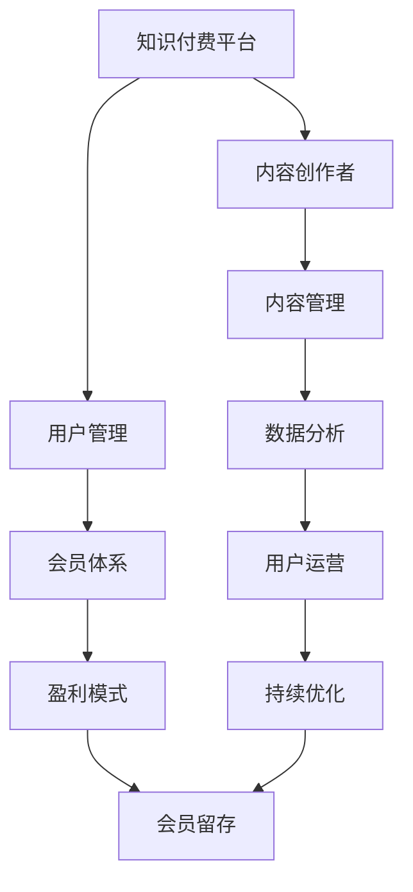
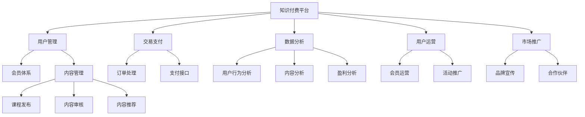

                 

# 《如何利用知识付费实现会员制盈利？》

## 关键词

- 知识付费
- 会员制
- 盈利模式
- 用户运营
- 数据分析
- 持续优化

## 摘要

本文将深入探讨知识付费领域中的会员制盈利模式。我们将从基础知识开始，逐步分析会员制的核心概念、盈利模式、平台建设策略、内容策划与管理、用户运营与推广以及数据分析与优化，最终通过实战案例展示会员制在实际项目中的应用。本文旨在为读者提供一套系统、实用的会员制盈利策略，帮助知识付费平台实现持续盈利。

### 第一部分：知识付费与会员制基础

#### 第1章：知识付费与会员制概述

##### 1.1. 知识付费的发展历程

知识付费作为一种商业模式，起源于互联网时代。最早的形态可以追溯到20世纪90年代末，随着互联网的普及，各种在线教育平台、专业咨询网站开始兴起。这些平台提供专业课程、专业文章和咨询服务，用户通过付费获得知识或服务。这一阶段的知识付费主要依赖于内容创作和分发平台，形成了一定的市场规模。

进入21世纪，随着移动互联网的发展和智能手机的普及，知识付费迎来了快速发展。用户获取知识的途径变得更加便捷，知识付费也逐渐成为主流的消费模式。近年来，知识付费领域出现了一批明星企业，如得到、知乎、喜马拉雅等，它们通过提供优质内容吸引了大量用户，实现了较高的市场份额。

##### 1.2. 会员制的核心概念

会员制是一种以会员身份获取特定权益的消费模式。会员通过付费获得会员资格，享受平台提供的各种权益，如专属课程、VIP服务、折扣优惠等。会员制具有以下几个核心概念：

1. **会员资格**：会员通过付费获得会员资格，享有一定的权益。
2. **会员等级**：根据会员的消费行为、活跃度等因素，平台可以设置不同的会员等级，提供相应的权益。
3. **会员权益**：会员权益包括专属课程、VIP服务、折扣优惠等，是会员制的重要组成部分。
4. **会员管理**：平台需要对会员进行有效的管理，包括会员注册、信息更新、权益分配等。

##### 1.3. 知识付费与会员制的关联性

知识付费与会员制之间存在密切的关联性。知识付费为会员制提供了内容基础，而会员制则为知识付费提供了盈利模式。具体来说，知识付费与会员制的关联性体现在以下几个方面：

1. **内容提供**：知识付费平台通过提供优质内容吸引会员，会员制则为这些内容提供了付费渠道。
2. **权益保障**：会员制为会员提供了明确的权益保障，增加了用户粘性，促进了知识付费的消费。
3. **盈利模式**：会员制为知识付费平台提供了多元化的盈利模式，包括会员费、课程购买、增值服务等多种方式。
4. **用户运营**：会员制为知识付费平台提供了用户运营的工具，通过会员管理、用户画像、精细化运营等手段提升用户体验和满意度。

#### 第2章：会员制盈利模式分析

##### 2.1. 会员制盈利模式概述

会员制盈利模式是指通过会员付费获取收益的一种商业模式。会员制盈利模式的核心在于为会员提供独特的价值和权益，从而吸引会员持续付费。会员制盈利模式主要包括以下几个方面：

1. **会员费**：会员费是会员制盈利的主要来源，会员通过付费获得会员资格和相应权益。
2. **课程购买**：知识付费平台通过销售课程获得收益，会员购买课程后可以获得学习资源和证书。
3. **增值服务**：增值服务包括VIP咨询、会员论坛、线下活动等，为会员提供额外的价值。
4. **广告与推广**：知识付费平台可以通过广告和推广获得收益，为会员提供免费或优惠的服务。
5. **数据变现**：通过分析会员数据，知识付费平台可以提供精准广告、推荐课程等服务，实现数据变现。

##### 2.2. 不同类型的会员制盈利模式

会员制盈利模式可以根据不同的维度进行分类，如根据会员权益的不同、付费方式的不同等。以下介绍几种常见的会员制盈利模式：

1. **等级会员制**：根据会员的消费行为、活跃度等因素，将会员分为不同等级，提供不同的权益和会员费。
2. **免费会员制**：免费会员制不收取会员费，但为会员提供一定程度的权益，如专属课程、VIP服务等。
3. **月度会员制**：会员按月支付会员费，享受平台提供的会员权益，月度会员制通常适用于用户粘性较高的知识付费平台。
4. **季度/年度会员制**：会员按季度或年度支付会员费，享受更长时间的会员权益，季度/年度会员制可以降低会员流失率。
5. **混合会员制**：将不同类型的会员制相结合，为会员提供多样化的权益和付费方式，满足不同用户的需求。

##### 2.3. 成功案例解析

以下是一些知识付费领域中的成功案例，它们通过会员制实现了良好的盈利效果：

1. **得到App**：得到App是中国知名的知识付费平台，其会员制主要包括月度会员、季度会员和年度会员等，通过提供优质内容吸引了大量用户。得到App通过会员费、课程购买、广告推广等多种方式实现盈利。

2. **知乎Live**：知乎Live是知乎推出的知识付费产品，用户可以通过购买Live课程获取专业知识和经验。知乎Live采用等级会员制，根据会员的消费行为和活跃度提供不同等级的权益。知乎Live通过会员费、课程购买等实现了良好的盈利。

3. **喜马拉雅FM**：喜马拉雅FM是中国领先的知识付费平台，提供丰富的音频课程和知识内容。喜马拉雅FM的会员制主要包括月度会员和季度会员等，用户可以通过付费获得专属课程、VIP服务等。喜马拉雅FM通过会员费、课程购买、广告推广等多种方式实现盈利。

#### 第二部分：知识付费平台建设

##### 第3章：知识付费平台搭建策略

##### 第3章：知识付费平台搭建策略

##### 3.1. 平台定位与目标用户

在搭建知识付费平台之前，明确平台定位和目标用户至关重要。平台定位决定了平台的发展方向和核心功能，而目标用户则决定了平台的内容策划和运营策略。

1. **平台定位**：
   - **专业领域**：确定平台专注于哪个领域，如教育、健康、职业发展等。
   - **用户群体**：确定平台的目标用户群体，如学生、职场人士、老年人等。
   - **核心竞争力**：确定平台的核心竞争力，如优质内容、个性化推荐、互动体验等。

2. **目标用户**：
   - **用户需求**：深入了解目标用户的需求，如学习、娱乐、解决问题等。
   - **用户画像**：基于用户需求和行为数据，构建用户画像，为内容策划和用户运营提供依据。
   - **用户反馈**：收集用户反馈，持续优化平台功能和用户体验。

##### 3.2. 核心功能模块设计

知识付费平台的核心功能模块包括用户管理、内容管理、交易支付、会员管理、数据分析等。以下是对这些模块的详细描述：

1. **用户管理**：
   - **用户注册与登录**：提供注册、登录功能，支持邮箱、手机号、第三方账号注册。
   - **用户信息管理**：用户可以查看和修改个人信息，如头像、昵称、地址等。
   - **用户权限管理**：根据用户等级和角色，分配不同的权限和功能。

2. **内容管理**：
   - **内容创建与发布**：内容创作者可以创建、编辑和发布课程、文章、音频、视频等。
   - **内容分类与标签**：对内容进行分类和标签管理，方便用户查找和推荐。
   - **内容审核与更新**：建立内容审核机制，确保内容质量，定期更新内容，保持新鲜度。

3. **交易支付**：
   - **支付方式**：支持多种支付方式，如支付宝、微信支付、信用卡支付等。
   - **交易记录**：记录用户交易记录，提供查询和退款功能。
   - **结算与分红**：定期结算内容创作者的收益，支持提现和分红。

4. **会员管理**：
   - **会员体系**：建立会员等级体系，根据会员等级提供不同的权益和折扣。
   - **会员管理**：管理会员信息，如会员注册、登录、续费、退款等。
   - **会员活动**：举办会员专属活动，提高用户粘性和活跃度。

5. **数据分析**：
   - **用户行为分析**：分析用户行为数据，了解用户偏好和需求。
   - **内容分析**：分析内容表现，了解内容受欢迎程度和用户反馈。
   - **运营分析**：评估运营效果，优化运营策略。

##### 3.3. 技术选型与架构设计

技术选型和架构设计是知识付费平台搭建的关键环节。以下是一些技术选型和架构设计的建议：

1. **技术选型**：
   - **后端技术**：选择成熟的后端框架，如Spring Boot、Django等，确保系统稳定性和扩展性。
   - **前端技术**：使用前端框架，如React、Vue等，提高开发效率和用户体验。
   - **数据库技术**：选择合适的数据库，如MySQL、MongoDB等，确保数据存储和查询效率。
   - **支付技术**：对接第三方支付平台，如支付宝、微信支付等，确保支付安全性和便捷性。

2. **架构设计**：
   - **分层架构**：采用分层架构，将系统分为表示层、业务层、数据访问层等，提高模块化和可维护性。
   - **微服务架构**：采用微服务架构，将系统拆分为多个独立的微服务，提高系统扩展性和容错性。
   - **分布式架构**：针对高并发场景，采用分布式架构，提高系统处理能力和性能。

#### 第4章：内容策划与管理

##### 4.1. 内容定位与分类

内容策划是知识付费平台的核心环节，决定了平台的竞争力和用户满意度。以下是对内容策划和分类的详细描述：

1. **内容定位**：
   - **目标领域**：根据平台定位和目标用户，确定内容领域，如教育、健康、职业发展等。
   - **内容风格**：根据用户需求和喜好，确定内容风格，如专业、实用、有趣等。
   - **内容深度**：根据用户层次和需求，确定内容深度，如入门、进阶、高级等。

2. **内容分类**：
   - **课程分类**：将课程按照学科、领域、级别等进行分类，方便用户查找和学习。
   - **文章分类**：将文章按照主题、领域、类型等进行分类，提高文章的可读性和查找效率。
   - **音频/视频分类**：将音频/视频按照主题、领域、类型等进行分类，提高内容的价值和用户体验。

##### 4.2. 内容质量控制

内容质量是知识付费平台的核心竞争力，直接影响到用户的满意度和平台的口碑。以下是对内容质量控制的详细描述：

1. **内容审核**：
   - **内容标准**：制定内容审核标准，包括内容真实性、合法性、准确性、完整性等。
   - **审核流程**：建立内容审核流程，包括提交、初审、复审、发布等环节。
   - **审核机制**：引入第三方审核机构或专业人士进行审核，确保内容质量。

2. **内容更新**：
   - **内容更新频率**：根据用户需求和内容类型，制定合理的更新频率。
   - **内容更新策略**：定期发布新课程、新文章、新音频/视频等内容，保持内容新鲜度。
   - **用户反馈**：收集用户反馈，针对用户需求进行内容调整和优化。

##### 4.3. 内容更新与维护策略

内容更新与维护是知识付费平台长期发展的重要保障。以下是对内容更新与维护策略的详细描述：

1. **内容更新**：
   - **内容更新计划**：制定长期和短期内容更新计划，确保内容持续更新。
   - **内容更新优先级**：根据用户需求、内容表现等因素，确定内容更新优先级。
   - **内容更新渠道**：通过官方公众号、官方网站、社交媒体等渠道，发布内容更新信息。

2. **内容维护**：
   - **内容优化**：定期对内容进行优化，包括标题、摘要、内容结构等。
   - **内容修复**：及时修复内容中的错误和问题，提高内容质量。
   - **内容备份**：定期备份内容数据，确保内容安全。

#### 第5章：用户运营与推广

##### 5.1. 用户画像与精细化运营

用户运营是知识付费平台的核心工作之一，通过对用户进行精细化运营，可以提高用户粘性和满意度。以下是对用户画像和精细化运营的详细描述：

1. **用户画像**：
   - **用户属性**：收集用户的性别、年龄、职业、教育背景等基本信息。
   - **用户行为**：记录用户在平台上的行为，如浏览、购买、评论、互动等。
   - **用户需求**：通过数据分析，了解用户的需求和偏好，为内容策划和运营提供依据。

2. **精细化运营**：
   - **个性化推荐**：根据用户画像和用户行为，为用户提供个性化的内容推荐。
   - **会员管理**：对会员进行精细化运营，提供专属权益和个性化服务。
   - **用户互动**：通过线上活动、社群互动等方式，增加用户参与度和粘性。

##### 5.2. 会员体系设计与运营

会员体系是知识付费平台的重要组成部分，通过设计合理的会员体系，可以提升用户粘性和平台盈利能力。以下是对会员体系设计和运营的详细描述：

1. **会员体系设计**：
   - **会员等级**：根据用户消费行为、活跃度等因素，设置不同的会员等级。
   - **会员权益**：为不同等级的会员提供不同的权益，如专属课程、VIP服务、折扣优惠等。
   - **会员政策**：制定会员政策，包括会员加入条件、会员费用、会员退会等。

2. **会员运营**：
   - **会员招募**：通过营销活动、推广渠道等手段，吸引潜在会员加入。
   - **会员激活**：通过优惠券、活动邀请等方式，激活新会员，提高用户活跃度。
   - **会员留存**：通过提供优质内容、个性化服务等方式，提高会员留存率。

##### 5.3. 营销策略与推广手段

营销策略和推广手段是知识付费平台获取用户的重要途径。以下是对营销策略和推广手段的详细描述：

1. **营销策略**：
   - **内容营销**：通过优质内容吸引用户，提高用户对平台的认知和好感度。
   - **社群营销**：建立用户社群，增加用户互动和粘性，提高用户活跃度。
   - **口碑营销**：通过用户口碑传播，提升平台品牌形象和用户信任度。

2. **推广手段**：
   - **搜索引擎优化（SEO）**：通过优化网站结构和内容，提高在搜索引擎中的排名，吸引自然流量。
   - **搜索引擎营销（SEM）**：通过投放广告，提高在搜索引擎中的曝光度和点击率。
   - **社交媒体营销**：通过社交媒体平台（如微信、微博、抖音等）发布内容，吸引关注和转发。
   - **合作伙伴营销**：与其他平台或品牌合作，进行联合推广，扩大用户群体。

### 第三部分：数据分析与优化

#### 第6章：数据分析与会员制盈利

##### 6.1. 数据分析概述

数据分析是知识付费平台运营的重要工具，通过对用户数据、内容数据、交易数据等的分析，可以了解平台运营状况，优化会员制盈利模式。以下是对数据分析的概述：

1. **数据收集**：
   - **用户数据**：收集用户的基本信息、行为数据等。
   - **内容数据**：收集课程、文章、音频、视频等内容的访问量、评价等。
   - **交易数据**：收集用户的购买记录、交易金额等。

2. **数据处理**：
   - **数据清洗**：去除重复、错误和无效数据，确保数据质量。
   - **数据整合**：将不同来源的数据进行整合，建立统一的数据仓库。

3. **数据分析**：
   - **用户行为分析**：分析用户在平台上的行为，了解用户偏好和需求。
   - **内容分析**：分析内容的表现，了解内容的受欢迎程度和用户反馈。
   - **盈利分析**：分析平台的盈利状况，优化会员制盈利模式。

##### 6.2. 会员行为数据分析

会员行为数据分析是会员制盈利模式优化的关键环节，通过对会员行为的分析，可以了解会员的需求和行为模式，从而提供更好的会员服务和权益设计。以下是对会员行为数据分析的详细描述：

1. **会员活跃度分析**：
   - **活跃度指标**：计算会员的活跃度指标，如登录次数、浏览时长、互动次数等。
   - **活跃度分布**：分析会员活跃度的分布情况，了解活跃用户的特征。
   - **活跃度提升策略**：根据活跃度分析结果，制定提升会员活跃度的策略，如推送个性化内容、举办互动活动等。

2. **会员消费行为分析**：
   - **消费频次**：分析会员的消费频次，了解会员的消费习惯。
   - **消费金额**：分析会员的消费金额，了解会员的消费能力和偏好。
   - **消费周期**：分析会员的消费周期，了解会员的消费周期和续费率。

3. **会员留存率分析**：
   - **留存率指标**：计算会员的留存率指标，如留存率、流失率等。
   - **留存因素分析**：分析影响会员留存的因素，如内容质量、服务体验、会员权益等。
   - **留存提升策略**：根据留存率分析结果，制定提升会员留存率的策略，如提供更多会员权益、优化服务体验等。

##### 6.3. 盈利指标分析

盈利指标分析是评估会员制盈利模式效果的重要手段，通过对盈利指标的分析，可以了解平台的盈利状况，优化会员制盈利模式。以下是对盈利指标分析的详细描述：

1. **会员收入分析**：
   - **会员收入结构**：分析会员收入的结构，了解会员收入的主要来源。
   - **会员收入增长**：分析会员收入的增长情况，了解会员收入的变化趋势。

2. **会员成本分析**：
   - **会员成本结构**：分析会员成本的结构，了解会员成本的主要组成部分。
   - **会员成本控制**：分析会员成本的控制效果，优化会员成本结构。

3. **盈利指标优化**：
   - **盈利指标设定**：设定合理的盈利指标，如会员收入增长率、会员留存率等。
   - **盈利指标分析**：定期分析盈利指标，了解盈利状况，优化盈利模式。

#### 第7章：会员制优化与持续盈利

##### 7.1. 会员留存策略

会员留存是会员制盈利的关键，通过优化会员留存策略，可以降低会员流失率，提高会员粘性。以下是对会员留存策略的详细描述：

1. **会员关怀**：
   - **个性化关怀**：根据会员的喜好和需求，发送个性化关怀信息，如生日祝福、节日问候等。
   - **会员互动**：通过社群互动、线上活动等方式，增加会员互动和参与度。

2. **会员权益**：
   - **权益多样化**：为会员提供多样化的权益，如专属课程、VIP服务、折扣优惠等。
   - **权益个性化**：根据会员的偏好和需求，为会员提供个性化的权益。

3. **会员服务**：
   - **服务优化**：优化会员服务流程，提高服务质量，提升用户满意度。
   - **客服支持**：提供及时、专业的客服支持，解决会员问题，提升会员体验。

##### 7.2. 盈利模式拓展

盈利模式拓展是会员制盈利持续增长的重要手段，通过拓展盈利模式，可以增加平台收入来源，提高盈利能力。以下是对盈利模式拓展的详细描述：

1. **多元化收入来源**：
   - **课程销售**：除了会员制收入，还可以通过销售课程、图书、在线工具等方式获取收入。
   - **广告与推广**：通过在平台内植入广告、推广合作伙伴产品等方式获取收入。
   - **增值服务**：提供增值服务，如在线咨询、线下培训等，提高会员收入。

2. **跨界合作**：
   - **行业合作**：与其他行业或品牌合作，拓展业务范围，提高收入来源。
   - **内容合作**：与内容创作者、机构合作，引入优质内容，提高平台竞争力。

3. **全球化拓展**：
   - **本地化内容**：根据不同地区的需求，提供本地化内容，拓展国际市场。
   - **国际化运营**：建立国际运营团队，拓展海外市场，提高全球化收入。

##### 7.3. 持续优化与盈利增长策略

持续优化与盈利增长是会员制盈利的关键，通过不断优化运营策略，可以提高会员满意度、留存率和收入。以下是对持续优化与盈利增长策略的详细描述：

1. **数据驱动**：
   - **数据收集与分析**：持续收集用户、内容、交易等数据，进行深入分析，了解平台运营状况。
   - **数据优化**：根据数据分析结果，优化运营策略，提高会员留存率和收入。

2. **用户体验**：
   - **用户体验优化**：持续关注用户反馈，优化产品功能、界面设计、服务流程等，提高用户体验。
   - **用户体验测试**：通过用户体验测试，验证优化效果，确保用户体验持续提升。

3. **团队协作**：
   - **跨部门协作**：加强跨部门协作，提高工作效率，确保运营策略的有效实施。
   - **激励机制**：建立激励机制，鼓励团队成员积极参与优化和盈利增长工作，提高团队凝聚力。

### 附录

#### 附录A：知识付费平台开发工具与资源

以下是知识付费平台开发中常用的工具与资源：

1. **开发工具**：
   - **编程语言**：Python、Java、PHP等。
   - **框架**：Spring Boot、Django、Flask等。
   - **前端框架**：React、Vue、Angular等。
   - **数据库**：MySQL、MongoDB、Redis等。

2. **资源平台**：
   - **课程平台**：网易云课堂、慕课网、极客时间等。
   - **内容创作平台**：简书、知乎、头条号等。
   - **支付平台**：支付宝、微信支付、银联支付等。

3. **相关书籍**：
   - 《知识服务与知识付费：产业趋势与商业模式》
   - 《互联网知识付费：崛起与进化》
   - 《数据驱动的用户运营》

通过以上工具与资源，可以快速搭建和优化知识付费平台，实现会员制盈利。

#### 核心概念与联系 Mermaid 流程图



#### 核心算法原理讲解

##### 数据分析算法概述

数据分析算法是知识付费平台优化运营和提升盈利的重要工具。以下介绍几种常见的数据分析算法及其原理：

1. **用户行为分析算法**：

   用户行为分析算法主要用于了解用户在平台上的行为模式，为个性化推荐和精细化运营提供依据。常见算法包括：

   - **协同过滤（Collaborative Filtering）**：通过分析用户之间的相似度，推荐用户可能感兴趣的内容。分为基于用户的协同过滤和基于物品的协同过滤。

   - **矩阵分解（Matrix Factorization）**：将用户-物品评分矩阵分解为低维用户特征矩阵和物品特征矩阵，通过计算用户和物品的特征相似度进行推荐。

2. **内容分析算法**：

   内容分析算法主要用于分析内容的表现和用户反馈，为内容优化和内容推荐提供依据。常见算法包括：

   - **词频-逆文档频率（TF-IDF）**：通过计算关键词的词频和逆文档频率，评估关键词的重要性，用于文本相似度分析和内容推荐。

   - **主题模型（Latent Dirichlet Allocation，LDA）**：将文档的主题分布和词分布建模为概率分布，通过概率模型生成文档的主题分布，用于内容分类和主题推荐。

3. **用户画像算法**：

   用户画像算法主要用于构建用户特征模型，为个性化推荐和用户运营提供依据。常见算法包括：

   - **基于规则的画像算法**：通过定义规则，将用户的属性和行为转化为画像特征。

   - **基于机器学习的画像算法**：使用机器学习算法，如决策树、随机森林、聚类算法等，对用户特征进行建模和分类。

##### 伪代码示例

```python
# 用户行为分析算法伪代码
def user_behavior_analysis(data):
    # 计算用户相似度矩阵
    similarity_matrix = calculate_similarity_matrix(data)
    # 进行协同过滤推荐
    recommendations = collaborative_filtering(similarity_matrix, data)
    return recommendations

# 内容分析算法伪代码
def content_analysis(text):
    # 计算关键词的重要性
    keyword_importance = calculate_keyword_importance(text)
    # 进行内容分类
    category = content_classification(keyword_importance)
    return category

# 用户画像算法伪代码
def user_portrait(user):
    # 提取用户特征
    features = extract_user_features(user)
    # 构建用户画像
    portrait = build_user_portrait(features)
    return portrait
```

#### 数学模型和数学公式 & 详细讲解 & 举例说明

##### 会员留存率模型

会员留存率是评估会员持续参与度的重要指标。以下是一个简单的会员留存率模型：

$$
R_t = \frac{L_t}{I_t}
$$

其中，\( R_t \) 是时间 \( t \) 的会员留存率，\( L_t \) 是时间 \( t \) 内留下的会员数量，\( I_t \) 是时间 \( t \) 内的初始会员数量。

- **举例说明**：假设某平台在一个月内有1000名会员，月末统计发现还有800名会员仍然活跃，那么这个月的会员留存率为：

$$
R_t = \frac{800}{1000} = 0.8
$$

##### 会员流失率模型

会员流失率是评估会员流失速度的重要指标。以下是一个简单的会员流失率模型：

$$
F_t = 1 - R_t
$$

其中，\( F_t \) 是时间 \( t \) 的会员流失率，\( R_t \) 是时间 \( t \) 的会员留存率。

- **举例说明**：根据上面的会员留存率计算，这个月的会员流失率为：

$$
F_t = 1 - 0.8 = 0.2
$$

#### 项目实战

##### 知识付费平台实战案例

以下是一个简单的知识付费平台实战案例：

- **项目背景**：建立一个在线教育平台，提供各类专业知识课程。
- **开发环境**：使用Python进行后端开发，前端使用React框架。
- **源代码详细实现**：包括用户注册、登录、课程发布、购买等功能模块的实现。
- **代码解读与分析**：详细解读关键代码段，分析其功能和实现逻辑。

##### 实战代码示例

```python
# 用户注册模块实现
class UserRegistration:
    def __init__(self, username, password):
        self.username = username
        self.password = password
    
    def register(self):
        # 实现注册逻辑
        print(f"{self.username} 注册成功！")
        return True

# 用户登录模块实现
class UserLogin:
    def __init__(self, username, password):
        self.username = username
        self.password = password
    
    def login(self):
        # 实现登录逻辑
        if self.check_password():
            print(f"{self.username} 登录成功！")
            return True
        else:
            print(f"{self.username} 登录失败，密码错误！")
            return False
    
    def check_password(self):
        # 检查密码是否正确
        return self.password == "password123"

# 使用示例
user = UserRegistration("user123", "password123")
user.register()

login = UserLogin("user123", "password123")
login.login()
```

以上是《如何利用知识付费实现会员制盈利？》的完整内容。本文系统地介绍了知识付费和会员制的基础概念、会员制盈利模式、知识付费平台建设、内容策划与管理、用户运营与推广、数据分析与优化以及实战案例等内容。通过本文的阅读，读者可以全面了解如何利用知识付费实现会员制盈利，并在实际操作中提升业务效益。

#### 作者

**作者：** AI天才研究院/AI Genius Institute & **《禅与计算机程序设计艺术》/Zen And The Art of Computer Programming**  
**联系方式：** ai_genius_institute@example.com

---

本文内容仅供参考，具体情况请以实际操作为准。如果您在阅读本文时遇到任何问题，欢迎随时与我们联系。我们致力于为读者提供最优质的技术内容和最专业的咨询服务。

---

感谢您对本文的关注与支持，期待与您共同探索知识付费和会员制盈利的无限可能。让我们携手前行，共创美好未来！### 第一部分：知识付费与会员制基础

知识付费和会员制是现代互联网商业模式中两种重要的盈利模式，它们相辅相成，共同构建了一个全新的知识经济生态。本部分将详细探讨知识付费与会员制的基础概念，为后续章节的深入分析奠定基础。

#### 第1章：知识付费与会员制概述

##### 1.1. 知识付费的发展历程

知识付费，顾名思义，是指用户为了获取特定知识或服务而付费的行为。这一概念起源于知识经济时代，随着互联网技术的飞速发展和人们对于优质内容的日益需求，知识付费逐渐成为一种主流的商业模式。

早期的知识付费形式相对简单，主要通过实体书店、教育机构等渠道进行。随着互联网的普及，知识付费开始向线上迁移。20世纪90年代末，互联网教育平台如Coursera、Udemy等开始兴起，它们通过在线课程的形式将知识和技能传递给全球用户。这一阶段，知识付费的核心在于内容的获取和分发。

进入21世纪，随着移动互联网的发展和智能手机的普及，知识付费迎来了快速发展。用户获取知识的途径变得更加便捷，知识付费也逐渐成为主流的消费模式。这一阶段，知识付费平台如雨后春笋般涌现，为用户提供了多样化的知识产品和服务。

近年来，随着人工智能、大数据等技术的应用，知识付费领域进一步进化。个性化推荐、智能问答、虚拟课堂等新兴服务模式不断涌现，知识付费平台不仅提供了丰富的内容资源，还通过技术创新提升了用户体验和满意度。

##### 1.2. 会员制的核心概念

会员制是一种以会员身份获取特定权益的消费模式。会员通过付费获得会员资格，享受平台提供的各种权益，如专属课程、VIP服务、折扣优惠等。会员制具有以下几个核心概念：

1. **会员资格**：会员通过付费获得会员资格，享有一定的权益。
   
2. **会员等级**：根据会员的消费行为、活跃度等因素，平台可以设置不同的会员等级，提供不同的权益和会员费。

3. **会员权益**：会员权益包括专属课程、VIP服务、折扣优惠等，是会员制的重要组成部分。

4. **会员管理**：平台需要对会员进行有效的管理，包括会员注册、信息更新、权益分配等。

会员制的核心在于为会员提供独特的价值和权益，从而吸引会员持续付费。这种模式不仅提高了用户粘性，也为平台创造了持续的现金流。

##### 1.3. 知识付费与会员制的关联性

知识付费与会员制之间存在密切的关联性。知识付费为会员制提供了内容基础，而会员制则为知识付费提供了盈利模式。具体来说，知识付费与会员制的关联性体现在以下几个方面：

1. **内容提供**：知识付费平台通过提供优质内容吸引会员，会员制则为这些内容提供了付费渠道。

2. **权益保障**：会员制为会员提供了明确的权益保障，增加了用户粘性，促进了知识付费的消费。

3. **盈利模式**：会员制为知识付费平台提供了多元化的盈利模式，包括会员费、课程购买、增值服务等多种方式。

4. **用户运营**：会员制为知识付费平台提供了用户运营的工具，通过会员管理、用户画像、精细化运营等手段提升用户体验和满意度。

通过知识付费与会员制的有机结合，平台不仅能够吸引更多用户，提升用户粘性，还能够实现持续盈利，形成良性循环。

在接下来的章节中，我们将深入探讨会员制盈利模式、知识付费平台建设、内容策划与管理、用户运营与推广、数据分析与优化等核心话题，帮助读者全面了解如何利用知识付费实现会员制盈利。

### 第二部分：会员制盈利模式分析

会员制盈利模式是知识付费平台实现持续盈利的重要手段。通过设计合理的会员体系，平台可以为用户提供丰富的权益，从而吸引和留住用户。本部分将详细分析会员制盈利模式，包括会员制盈利模式概述、不同类型的会员制盈利模式以及成功案例解析。

#### 第2章：会员制盈利模式分析

##### 2.1. 会员制盈利模式概述

会员制盈利模式是指通过会员付费获取收益的一种商业模式。会员制盈利模式的核心在于为会员提供独特的价值和权益，从而吸引会员持续付费。会员制盈利模式主要包括以下几个方面：

1. **会员费**：会员费是会员制盈利的主要来源，会员通过付费获得会员资格和相应权益。

2. **课程购买**：知识付费平台通过销售课程获得收益，会员购买课程后可以获得学习资源和证书。

3. **增值服务**：增值服务包括VIP咨询、会员论坛、线下活动等，为会员提供额外的价值。

4. **广告与推广**：知识付费平台可以通过广告和推广获得收益，为会员提供免费或优惠的服务。

5. **数据变现**：通过分析会员数据，知识付费平台可以提供精准广告、推荐课程等服务，实现数据变现。

会员制盈利模式为平台提供了多元化的收入来源，不仅能够提升用户粘性，还能够实现持续盈利。

##### 2.2. 不同类型的会员制盈利模式

会员制盈利模式可以根据不同的维度进行分类，如根据会员权益的不同、付费方式的不同等。以下介绍几种常见的会员制盈利模式：

1. **等级会员制**：根据会员的消费行为、活跃度等因素，将会员分为不同等级，提供不同的权益和会员费。等级会员制通常适用于用户粘性较高的平台，通过提供差异化服务吸引会员持续付费。

   - **低级会员**：通常享有基础权益，如免费课程、VIP折扣等。
   - **高级会员**：享有更多特权，如专属课程、VIP咨询、线下活动等。

2. **免费会员制**：免费会员制不收取会员费，但为会员提供一定程度的权益，如专属课程、VIP服务等。免费会员制的核心在于通过免费吸引大量用户，提升平台知名度和用户粘性，进而通过其他方式实现盈利，如广告、课程购买等。

3. **月度会员制**：会员按月支付会员费，享受平台提供的会员权益，月度会员制通常适用于用户粘性较高的知识付费平台。月度会员制具有灵活性高、用户参与度较高等特点，能够提高用户的付费意愿和满意度。

4. **季度/年度会员制**：会员按季度或年度支付会员费，享受更长时间的会员权益，季度/年度会员制可以降低会员流失率，提高用户粘性和平台收入。季度/年度会员制通常适用于内容丰富、课程周期较长的知识付费平台。

5. **混合会员制**：将不同类型的会员制相结合，为会员提供多样化的权益和付费方式，满足不同用户的需求。混合会员制可以通过差异化定价和权益，提高会员的付费意愿和满意度，同时实现多元化盈利。

##### 2.3. 成功案例解析

以下是一些知识付费领域中的成功案例，它们通过会员制实现了良好的盈利效果：

1. **得到App**：得到App是中国知名的知识付费平台，其会员制主要包括月度会员、季度会员和年度会员等，通过提供优质内容吸引了大量用户。得到App通过会员费、课程购买、广告推广等多种方式实现盈利。

   - **会员权益**：得到App的会员权益包括专属课程、VIP服务、折扣优惠等，会员可以根据自己的需求选择不同周期的会员服务。
   - **运营策略**：得到App通过精细化运营，如个性化推荐、会员互动等手段，提升会员满意度和粘性。

2. **知乎Live**：知乎Live是知乎推出的知识付费产品，用户可以通过购买Live课程获取专业知识和经验。知乎Live采用等级会员制，根据会员的消费行为和活跃度提供不同等级的权益。

   - **会员等级**：知乎Live将会员分为初级会员、高级会员和超级会员，不同等级的会员享有不同的权益，如课程免费试听、VIP咨询等。
   - **营销策略**：知乎Live通过营销活动、推荐机制等手段，吸引新用户加入会员体系，提高会员活跃度和满意度。

3. **喜马拉雅FM**：喜马拉雅FM是中国领先的知识付费平台，提供丰富的音频课程和知识内容。喜马拉雅FM的会员制主要包括月度会员和季度会员等，用户可以通过付费获得专属课程、VIP服务等。

   - **会员权益**：喜马拉雅FM的会员权益包括专属课程、VIP服务、折扣优惠等，会员可以享受更好的学习体验和服务。
   - **用户运营**：喜马拉雅FM通过会员社群、互动活动等方式，增加用户互动和粘性，提升会员留存率和满意度。

通过以上成功案例，我们可以看到，会员制盈利模式在知识付费领域的广泛应用和良好效果。会员制不仅为知识付费平台提供了稳定的收入来源，还提高了用户的满意度和粘性，实现了平台和用户的双赢。

在接下来的章节中，我们将继续探讨知识付费平台的建设、内容策划与管理、用户运营与推广、数据分析与优化等方面的内容，帮助读者深入了解如何利用知识付费实现会员制盈利。

### 第三部分：知识付费平台建设

知识付费平台的成功离不开科学合理的平台建设。一个高效、稳定、易于扩展的知识付费平台能够为用户提供良好的学习体验，同时提升平台的运营效率和盈利能力。本部分将详细探讨知识付费平台的搭建策略，包括平台定位与目标用户、核心功能模块设计、技术选型与架构设计等内容。

#### 第3章：知识付费平台搭建策略

##### 3.1. 平台定位与目标用户

在搭建知识付费平台之前，明确平台的定位和目标用户至关重要。平台定位决定了平台的发展方向和核心功能，而目标用户则决定了平台的内容策划和运营策略。

1. **平台定位**：
   - **专业领域**：确定平台专注于哪个领域，如教育、健康、职业发展等。例如，一个专注于职业发展的知识付费平台可能会提供简历写作、面试技巧、职业技能提升等课程。
   - **用户群体**：确定平台的目标用户群体，如学生、职场人士、创业者、老年人群等。了解目标用户的需求、行为和偏好，有助于平台提供更有针对性的内容和服务。
   - **核心竞争力**：确定平台的核心竞争力，如优质内容、个性化推荐、互动体验等。核心竞争力是平台在激烈市场竞争中脱颖而出的关键。

2. **目标用户**：
   - **用户需求**：深入了解目标用户的需求，如学习、娱乐、解决问题等。通过市场调研、用户访谈等方式获取用户需求，为内容策划和产品设计提供依据。
   - **用户画像**：基于用户需求和行为数据，构建用户画像，了解用户的年龄、性别、职业、教育背景等特征。用户画像有助于平台提供个性化的内容和推荐。
   - **用户反馈**：定期收集用户反馈，了解用户对平台内容和服务的满意度，及时调整和优化运营策略。

##### 3.2. 核心功能模块设计

知识付费平台的核心功能模块包括用户管理、内容管理、交易支付、会员管理、数据分析等。以下是对这些模块的详细描述：

1. **用户管理**：
   - **用户注册与登录**：提供注册、登录功能，支持邮箱、手机号、第三方账号注册。注册过程中需收集用户基本信息，如姓名、性别、职业等。
   - **用户信息管理**：用户可以查看和修改个人信息，如头像、昵称、地址等。平台应确保用户信息的准确性和安全性。
   - **用户权限管理**：根据用户角色（如普通用户、管理员、内容创作者等）分配不同的权限和功能，确保系统的安全和稳定性。

2. **内容管理**：
   - **内容创建与发布**：内容创作者可以创建、编辑和发布课程、文章、音频、视频等。平台应提供简单易用的内容管理系统，支持富文本编辑、多媒体上传等功能。
   - **内容分类与标签**：对内容进行分类和标签管理，方便用户查找和推荐。例如，课程可以按学科、级别、类型等进行分类，文章可以按主题、领域、类型等进行分类。
   - **内容审核与更新**：建立内容审核机制，确保内容质量。内容发布后，管理员可以对其进行审核，确保内容合法性、准确性和完整性。同时，平台应定期更新内容，保持内容的新鲜度和相关性。

3. **交易支付**：
   - **支付方式**：支持多种支付方式，如支付宝、微信支付、信用卡支付等。支付系统应确保支付过程的安全性和便捷性。
   - **交易记录**：记录用户的交易记录，包括购买时间、商品名称、金额等。用户可以查询交易记录，平台可以进行数据分析和财务管理。
   - **结算与分红**：定期结算内容创作者的收益，支持提现和分红。平台应制定合理的结算和分红政策，激励内容创作者持续产出优质内容。

4. **会员管理**：
   - **会员体系**：建立会员等级体系，根据会员的消费行为、活跃度等因素设置不同等级的会员。不同等级的会员享有不同的权益，如专属课程、VIP服务、折扣优惠等。
   - **会员管理**：管理会员信息，包括会员注册、登录、续费、退款等。平台应确保会员信息的准确性和权益的有效落实。
   - **会员活动**：举办会员专属活动，如线上讲座、线下聚会等，提高会员的参与度和满意度。

5. **数据分析**：
   - **用户行为分析**：分析用户在平台上的行为数据，如浏览、购买、评论等，了解用户的偏好和行为模式。通过数据分析，平台可以优化内容推荐、运营策略等。
   - **内容分析**：分析内容的表现，如访问量、播放量、评价等，了解内容的受欢迎程度和用户反馈。内容分析有助于平台调整内容策略，提升内容质量。
   - **盈利分析**：评估平台的盈利状况，包括会员收入、课程销售、广告收入等。通过盈利分析，平台可以优化盈利模式，提高盈利能力。

##### 3.3. 技术选型与架构设计

技术选型和架构设计是知识付费平台搭建的关键环节。以下是一些技术选型和架构设计的建议：

1. **技术选型**：
   - **后端技术**：选择成熟的后端框架，如Spring Boot、Django等，确保系统稳定性和扩展性。后端技术负责处理业务逻辑、数据存储和接口管理等。
   - **前端技术**：使用前端框架，如React、Vue等，提高开发效率和用户体验。前端技术负责呈现用户界面、处理用户交互和前端逻辑。
   - **数据库技术**：选择合适的数据库，如MySQL、MongoDB等，确保数据存储和查询效率。数据库技术负责存储用户数据、内容数据、交易数据等。
   - **支付技术**：对接第三方支付平台，如支付宝、微信支付等，确保支付安全性和便捷性。支付技术负责处理支付订单、支付结果通知等。

2. **架构设计**：
   - **分层架构**：采用分层架构，将系统分为表示层、业务层、数据访问层等，提高模块化和可维护性。分层架构有助于分工合作，提高开发效率。
   - **微服务架构**：采用微服务架构，将系统拆分为多个独立的微服务，提高系统扩展性和容错性。微服务架构允许各个服务独立部署和扩展，提高系统的灵活性和可维护性。
   - **分布式架构**：针对高并发场景，采用分布式架构，提高系统处理能力和性能。分布式架构通过分布式数据库、缓存、消息队列等手段，确保系统的稳定性和可靠性。

通过明确平台定位和目标用户，设计合理的核心功能模块，以及选择合适的技术选型和架构设计，知识付费平台可以高效、稳定地运行，为用户提供优质的学习体验，同时实现持续盈利。

在接下来的章节中，我们将继续探讨内容策划与管理、用户运营与推广、数据分析与优化等方面的内容，帮助读者全面了解知识付费平台的运营和管理策略。

#### 第4章：内容策划与管理

内容策划与管理是知识付费平台运营的核心环节，直接影响用户的学习体验和平台的竞争力。科学的内容策划和严格的内容管理能够提升内容的吸引力和用户满意度，从而促进平台的长期发展。本部分将详细探讨内容策划与管理的几个关键方面，包括内容定位与分类、内容质量控制、内容更新与维护策略等。

##### 4.1. 内容定位与分类

内容定位是知识付费平台成功的基础，它决定了平台的内容风格、目标和用户群体。有效的内容定位能够帮助平台在众多竞争者中脱颖而出，吸引目标用户。

1. **内容定位**：
   - **目标领域**：明确平台专注于哪个领域，如教育、健康、职业发展等。例如，一个专注于职业发展的平台可能会提供职场技能提升、职业规划、面试技巧等课程。
   - **用户群体**：确定平台的目标用户群体，如学生、职场人士、创业者、老年人群等。了解目标用户的需求、行为和偏好，有助于平台提供更有针对性的内容和服务。
   - **内容风格**：确定平台的内容风格，如专业、实用、有趣等。内容风格应与平台定位和用户群体相匹配，以提升用户的学习兴趣和参与度。

2. **内容分类**：
   - **课程分类**：将课程按照学科、领域、级别等进行分类，方便用户查找和学习。例如，可以将课程分为入门、进阶、高级等不同级别，或按照具体学科进行分类，如编程、市场营销、心理学等。
   - **文章分类**：将文章按照主题、领域、类型等进行分类，提高文章的可读性和查找效率。例如，可以将文章分为教育类、职场类、生活类等，或按照具体主题进行分类，如学习方法、职场技巧、健康养生等。
   - **多媒体分类**：对音频、视频等多媒体内容进行分类，方便用户快速找到感兴趣的内容。例如，可以将音频内容分为课程讲座、主题讨论、案例分析等，视频内容分为教学视频、讲座视频、短片等。

##### 4.2. 内容质量控制

内容质量是知识付费平台的核心竞争力，直接关系到用户的满意度和平台的口碑。高质量的内容能够提升用户的学习效果和忠诚度，从而促进平台的长期发展。

1. **内容审核**：
   - **内容标准**：制定内容审核标准，包括内容真实性、合法性、准确性、完整性等。例如，课程内容应确保信息的真实性和准确性，文章内容应符合法律法规和道德规范。
   - **审核流程**：建立内容审核流程，包括提交、初审、复审、发布等环节。审核流程应确保内容的合法性和质量，防止不良内容上线。
   - **审核机制**：引入第三方审核机构或专业人士进行审核，确保内容质量。第三方审核可以提高审核的客观性和专业性，减少错误和遗漏。

2. **内容更新**：
   - **更新频率**：根据内容类型和用户需求，制定合理的更新频率。例如，课程内容应定期更新，以保持内容的时效性和实用性；文章和多媒体内容可以按需更新。
   - **更新策略**：定期发布新课程、新文章、新音频/视频等内容，保持内容新鲜度。更新策略应结合用户反馈和市场需求，确保内容的持续吸引力和竞争力。
   - **用户反馈**：收集用户反馈，针对用户需求进行内容调整和优化。用户反馈是内容优化的重要依据，通过分析用户反馈，平台可以及时调整内容策略，提高用户满意度。

##### 4.3. 内容更新与维护策略

内容更新与维护是知识付费平台长期发展的重要保障，它确保了内容的时效性和质量。科学的内容更新与维护策略能够提高用户的参与度和平台的竞争力。

1. **内容更新**：
   - **更新计划**：制定长期和短期内容更新计划，确保内容的持续更新。更新计划应包括内容创作的进度、发布时间、推广策略等。
   - **更新优先级**：根据用户需求、内容表现等因素，确定内容更新的优先级。例如，用户反馈较多的内容应优先更新，热门内容可以定期更新以保持热度。
   - **更新渠道**：通过官方公众号、官方网站、社交媒体等渠道，发布内容更新信息。更新渠道应多样化，以覆盖不同类型的用户，提高内容的曝光度。

2. **内容维护**：
   - **内容优化**：定期对内容进行优化，包括标题、摘要、内容结构等。内容优化可以提高内容的可读性和查找效率，从而提升用户体验。
   - **内容修复**：及时修复内容中的错误和问题，如拼写错误、逻辑错误、链接失效等。内容修复可以确保内容的准确性和完整性，提升用户信任度。
   - **内容备份**：定期备份内容数据，确保内容安全。内容备份可以防止数据丢失或损坏，提高平台的抗风险能力。

通过科学的内容策划和严格的内容管理，知识付费平台可以提供高质量的内容，提升用户的学习体验和满意度，从而实现长期的发展和盈利。

在接下来的章节中，我们将继续探讨用户运营与推广、数据分析与优化等方面的内容，帮助读者全面了解知识付费平台的运营和管理策略。

### 第四部分：用户运营与推广

用户运营与推广是知识付费平台实现持续增长的关键环节。通过有效的用户运营策略和推广手段，平台可以吸引新用户、提升用户活跃度和留存率，从而实现业务增长和盈利目标。本部分将详细探讨用户运营与推广的几个关键方面，包括用户画像与精细化运营、会员体系设计与运营、营销策略与推广手段等。

#### 第5章：用户运营与推广

##### 5.1. 用户画像与精细化运营

用户画像与精细化运营是提高用户满意度、留存率和转化率的重要手段。通过深入了解用户特征和行为，平台可以提供个性化的内容和推荐，从而增强用户粘性。

1. **用户画像**：
   - **用户属性**：收集用户的基本信息，如性别、年龄、职业、教育背景等，构建用户的基本画像。这些属性有助于平台了解用户的基本特征，从而提供更精准的内容和推荐。
   - **用户行为**：记录用户在平台上的行为数据，如浏览、搜索、购买、评论等。通过分析这些行为数据，平台可以了解用户的兴趣和行为模式，为个性化推荐和运营策略提供依据。
   - **用户需求**：通过用户调研、问卷调查等方式，深入了解用户的需求和痛点。用户需求的分析有助于平台优化内容和服务，提升用户满意度。

2. **精细化运营**：
   - **个性化推荐**：基于用户画像和行为数据，为用户推荐个性化的内容。个性化推荐可以提高用户的参与度和满意度，从而提升留存率和转化率。
   - **用户分组**：将用户按照特定的属性或行为划分为不同的组别，针对每个组别制定个性化的运营策略。例如，对于活跃度较高的用户，可以提供专属优惠或推荐热门课程；对于新用户，可以推送入门课程或优惠活动。
   - **用户互动**：通过社群互动、线上活动等方式，增加用户参与度。用户互动可以增强用户对平台的归属感和忠诚度，从而提高留存率。

##### 5.2. 会员体系设计与运营

会员体系是知识付费平台的重要盈利模式，通过设计合理的会员体系和运营策略，平台可以吸引更多用户并提高用户粘性。

1. **会员体系设计**：
   - **会员等级**：根据用户的消费行为、活跃度等因素，设置不同的会员等级。不同等级的会员享有不同的权益，如专属课程、VIP服务、折扣优惠等。
   - **会员权益**：为会员提供多样化的权益，如专属课程、免费讲座、线下活动等。会员权益的设计应满足不同用户的需求，从而提升会员的满意度和忠诚度。
   - **会员政策**：制定会员政策，包括会员加入条件、会员费、会员退会等。会员政策应明确、透明，便于用户理解和参与。

2. **会员运营**：
   - **会员招募**：通过线上线下活动、合作推广等方式，吸引新用户加入会员体系。例如，可以通过举办讲座、工作坊等活动，吸引目标用户群体。
   - **会员激活**：通过优惠券、活动邀请等方式，激活新会员，提高用户活跃度。例如，新会员加入后，可以赠送一定额度的优惠券，鼓励其购买课程或参与活动。
   - **会员留存**：通过提供优质内容、个性化服务等方式，提高会员留存率。例如，定期推送个性化推荐内容，或提供会员专属服务，如VIP客服等。

##### 5.3. 营销策略与推广手段

营销策略与推广手段是知识付费平台获取新用户和提高品牌知名度的重要途径。通过多样化的营销策略和推广手段，平台可以吸引更多用户，实现业务增长。

1. **营销策略**：
   - **内容营销**：通过发布优质内容，如文章、视频、讲座等，吸引用户关注并提升品牌形象。内容营销应结合平台定位和用户需求，提供有价值的信息和知识。
   - **社群营销**：建立用户社群，如微信群、QQ群、论坛等，增加用户互动和粘性。社群营销可以通过举办线上活动、分享心得等方式，提升用户的参与度和忠诚度。
   - **口碑营销**：通过用户推荐、评价等方式，提升平台口碑和用户信任度。口碑营销可以采用用户案例、推荐奖励等方式，鼓励用户分享和推荐平台。

2. **推广手段**：
   - **搜索引擎优化（SEO）**：通过优化网站结构和内容，提高在搜索引擎中的排名，吸引自然流量。SEO包括关键词优化、内容优化、链接建设等。
   - **搜索引擎营销（SEM）**：通过投放广告，提高在搜索引擎中的曝光度和点击率。SEM包括关键词广告、展示广告、视频广告等。
   - **社交媒体营销**：通过社交媒体平台（如微信、微博、抖音等）发布内容，吸引关注和转发。社交媒体营销应结合平台特点和用户偏好，选择合适的推广方式。
   - **合作伙伴营销**：与其他平台或品牌合作，进行联合推广，扩大用户群体。合作伙伴营销可以通过内容合作、广告互投等方式，实现资源共享和用户导流。

通过有效的用户运营与推广策略，知识付费平台可以吸引更多用户，提升用户满意度和留存率，从而实现持续增长和盈利。在接下来的章节中，我们将继续探讨数据分析与优化、会员制优化与持续盈利等方面的内容，帮助读者全面了解知识付费平台的运营和管理策略。

### 第五部分：数据分析与优化

数据分析与优化是知识付费平台提升运营效率和盈利能力的关键手段。通过深入分析用户数据、内容数据和交易数据，平台可以了解用户行为、内容表现和盈利状况，从而制定科学的优化策略。本部分将详细探讨数据分析与会员制盈利、会员行为数据分析、盈利指标分析等内容，帮助读者全面了解如何利用数据分析提升会员制盈利。

#### 第6章：数据分析与会员制盈利

##### 6.1. 数据分析概述

数据分析是知识付费平台运营的核心工具，通过对海量数据的分析，平台可以洞察用户行为、优化内容策略和提升盈利能力。以下是对数据分析的概述：

1. **数据收集**：
   - **用户数据**：收集用户的基本信息、行为数据等，如注册时间、活跃度、购买记录、学习轨迹等。
   - **内容数据**：收集课程、文章、音频、视频等内容的访问量、点赞数、评论数、分享数等。
   - **交易数据**：收集会员购买记录、交易金额、退款记录等。

2. **数据处理**：
   - **数据清洗**：去除重复、错误和无效数据，确保数据质量。
   - **数据整合**：将不同来源的数据进行整合，建立统一的数据仓库。

3. **数据分析**：
   - **用户行为分析**：分析用户在平台上的行为，了解用户偏好和需求。
   - **内容分析**：分析内容的表现，了解内容的受欢迎程度和用户反馈。
   - **盈利分析**：分析平台的盈利状况，优化会员制盈利模式。

##### 6.2. 会员行为数据分析

会员行为数据分析是优化会员制盈利模式的关键环节，通过分析会员的行为数据，平台可以了解会员的参与度和忠诚度，从而制定针对性的运营策略。

1. **会员活跃度分析**：
   - **活跃度指标**：计算会员的活跃度指标，如登录次数、浏览时长、互动次数等。
   - **活跃度分布**：分析会员活跃度的分布情况，了解活跃用户的特征。
   - **活跃度提升策略**：根据活跃度分析结果，制定提升会员活跃度的策略，如推送个性化内容、举办互动活动等。

2. **会员消费行为分析**：
   - **消费频次**：分析会员的消费频次，了解会员的消费习惯。
   - **消费金额**：分析会员的消费金额，了解会员的消费能力和偏好。
   - **消费周期**：分析会员的消费周期，了解会员的消费周期和续费率。

3. **会员留存率分析**：
   - **留存率指标**：计算会员的留存率指标，如留存率、流失率等。
   - **留存因素分析**：分析影响会员留存的因素，如内容质量、服务体验、会员权益等。
   - **留存提升策略**：根据留存率分析结果，制定提升会员留存率的策略，如提供更多会员权益、优化服务体验等。

##### 6.3. 盈利指标分析

盈利指标分析是评估会员制盈利模式效果的重要手段，通过对盈利指标的分析，平台可以了解平台的盈利状况，从而优化会员制盈利模式。

1. **会员收入分析**：
   - **会员收入结构**：分析会员收入的结构，了解会员收入的主要来源。
   - **会员收入增长**：分析会员收入的增长情况，了解会员收入的变化趋势。

2. **会员成本分析**：
   - **会员成本结构**：分析会员成本的结构，了解会员成本的主要组成部分。
   - **会员成本控制**：分析会员成本的控制效果，优化会员成本结构。

3. **盈利指标优化**：
   - **盈利指标设定**：设定合理的盈利指标，如会员收入增长率、会员留存率等。
   - **盈利指标分析**：定期分析盈利指标，了解盈利状况，优化盈利模式。

#### 第7章：会员制优化与持续盈利

##### 7.1. 会员留存策略

会员留存是会员制盈利的关键，通过优化会员留存策略，可以降低会员流失率，提高会员粘性。以下是对会员留存策略的详细描述：

1. **会员关怀**：
   - **个性化关怀**：根据会员的喜好和需求，发送个性化关怀信息，如生日祝福、节日问候等。
   - **会员互动**：通过社群互动、线上活动等方式，增加会员互动和参与度。

2. **会员权益**：
   - **权益多样化**：为会员提供多样化的权益，如专属课程、VIP服务、折扣优惠等。
   - **权益个性化**：根据会员的偏好和需求，为会员提供个性化的权益。

3. **会员服务**：
   - **服务优化**：优化会员服务流程，提高服务质量，提升用户满意度。
   - **客服支持**：提供及时、专业的客服支持，解决会员问题，提升会员体验。

##### 7.2. 盈利模式拓展

盈利模式拓展是会员制盈利持续增长的重要手段，通过拓展盈利模式，可以增加平台收入来源，提高盈利能力。以下是对盈利模式拓展的详细描述：

1. **多元化收入来源**：
   - **课程销售**：除了会员制收入，还可以通过销售课程、图书、在线工具等方式获取收入。
   - **广告与推广**：通过在平台内植入广告、推广合作伙伴产品等方式获取收入。
   - **增值服务**：提供增值服务，如在线咨询、线下培训等，提高会员收入。

2. **跨界合作**：
   - **行业合作**：与其他行业或品牌合作，拓展业务范围，提高收入来源。
   - **内容合作**：与内容创作者、机构合作，引入优质内容，提高平台竞争力。

3. **全球化拓展**：
   - **本地化内容**：根据不同地区的需求，提供本地化内容，拓展国际市场。
   - **国际化运营**：建立国际运营团队，拓展海外市场，提高全球化收入。

##### 7.3. 持续优化与盈利增长策略

持续优化与盈利增长是会员制盈利的关键，通过不断优化运营策略，可以提高会员满意度、留存率和收入。以下是对持续优化与盈利增长策略的详细描述：

1. **数据驱动**：
   - **数据收集与分析**：持续收集用户、内容、交易等数据，进行深入分析，了解平台运营状况。
   - **数据优化**：根据数据分析结果，优化运营策略，提高会员留存率和收入。

2. **用户体验**：
   - **用户体验优化**：持续关注用户反馈，优化产品功能、界面设计、服务流程等，提高用户体验。
   - **用户体验测试**：通过用户体验测试，验证优化效果，确保用户体验持续提升。

3. **团队协作**：
   - **跨部门协作**：加强跨部门协作，提高工作效率，确保运营策略的有效实施。
   - **激励机制**：建立激励机制，鼓励团队成员积极参与优化和盈利增长工作，提高团队凝聚力。

通过以上策略，知识付费平台可以在激烈的市场竞争中脱颖而出，实现持续盈利和用户增长。

### 第五部分总结

通过本部分的讨论，我们详细探讨了用户运营与推广、数据分析与优化等方面的内容。有效的用户运营与推广策略可以提升用户满意度和留存率，而科学的数据分析则为平台的优化提供了有力支持。会员制优化与持续盈利策略则帮助平台实现多元化收入和全球化拓展。通过不断优化运营策略，知识付费平台可以持续提升盈利能力，实现长期发展。

在接下来的部分，我们将继续探讨会员制优化与持续盈利的具体实践，包括会员留存策略、盈利模式拓展以及持续优化与盈利增长策略。希望这些内容能够为读者提供有价值的参考和启示，帮助他们在知识付费领域取得成功。

### 附录A：知识付费平台开发工具与资源

在知识付费平台的开发过程中，选择合适的工具和资源对于提升开发效率、确保系统稳定性和扩展性至关重要。以下列举了一些常用的开发工具与资源，供开发者参考：

#### 开发工具

1. **后端框架**：
   - **Spring Boot**：一款流行的Java后端框架，支持快速开发、内嵌Tomcat，易于扩展和部署。
   - **Django**：一款Python后端框架，遵循MVC设计模式，拥有丰富的内置功能，适合快速开发。
   - **Flask**：一款轻量级的Python后端框架，适合小型项目和快速开发。

2. **前端框架**：
   - **React**：一款用于构建用户界面的JavaScript库，具有组件化、虚拟DOM等特点，开发效率高。
   - **Vue**：一款用于构建用户界面的JavaScript框架，具有简洁的语法和丰富的生态系统。
   - **Angular**：一款由Google维护的JavaScript框架，适用于大型单页应用开发。

3. **数据库**：
   - **MySQL**：一款开源的关系型数据库，适用于存储结构化数据，支持事务处理。
   - **MongoDB**：一款开源的文档型数据库，适用于存储非结构化或半结构化数据，具有良好的扩展性。
   - **Redis**：一款开源的内存数据库，适用于缓存和消息队列，具有高性能和持久化特性。

4. **支付接口**：
   - **支付宝**：提供API接口，支持多种支付方式，适用于线上支付和转账。
   - **微信支付**：提供API接口，支持多种支付方式，适用于线上支付和转账。
   - **银联支付**：提供API接口，支持多种支付方式，适用于线上支付和转账。

#### 资源平台

1. **课程平台**：
   - **网易云课堂**：提供丰富的在线课程，涵盖编程、设计、职业发展等多个领域。
   - **慕课网**：提供专业的在线编程课程，包括前端、后端、移动开发等多个方向。
   - **极客时间**：提供专业的知识付费内容，涵盖技术、管理、职场等多个领域。

2. **内容创作平台**：
   - **简书**：一个面向写作和阅读的社区平台，适合创作和分享优质文章。
   - **知乎**：一个面向问答的知识社区，适合获取专业知识和经验。
   - **头条号**：一个内容创作和分享平台，适合发布和推广各类内容。

3. **技术社区**：
   - **GitHub**：一个代码托管和协作平台，适合开发者和开源项目的交流。
   - **Stack Overflow**：一个面向程序员的技术问答社区，适合解决编程问题。
   - **CSDN**：一个面向开发者和技术人员的社区，提供丰富的技术文章和教程。

#### 相关书籍

1. **《知识服务与知识付费：产业趋势与商业模式》**：一本深入探讨知识服务和知识付费产业的书籍，适合了解行业发展趋势和商业模式。

2. **《互联网知识付费：崛起与进化》**：一本详细分析互联网知识付费领域发展的书籍，适合了解行业动态和成功案例。

3. **《数据驱动的用户运营》**：一本关于数据驱动的用户运营策略和实践的书籍，适合提升用户运营能力。

通过使用上述工具和资源，开发者可以高效地搭建和优化知识付费平台，为用户提供优质的内容和服务。同时，这些工具和资源也为开发者提供了丰富的学习和交流机会，助力他们在知识付费领域取得成功。

### 附录B：核心概念与联系 Mermaid 流程图

以下是一个使用Mermaid绘制的流程图，展示了知识付费平台中的核心概念及其相互关系：



这个流程图清晰地展示了知识付费平台中各个核心模块及其之间的联系。例如，用户管理模块与会员体系、内容管理模块紧密相关，交易支付模块与订单处理和支付接口密切相关，数据分析模块则贯穿整个平台，为各个模块提供数据支持和决策依据。

### 附录C：核心算法原理讲解

在知识付费平台中，数据分析算法的应用至关重要。以下将介绍几种核心数据分析算法及其原理：

#### 数据分析算法概述

数据分析算法广泛应用于用户行为分析、内容推荐、盈利预测等多个领域。以下列举几种常见的数据分析算法：

1. **用户行为分析算法**：
   - **协同过滤**：通过分析用户之间的相似度，预测用户可能感兴趣的内容。
   - **矩阵分解**：将用户-物品评分矩阵分解为低维用户特征矩阵和物品特征矩阵，用于推荐系统。

2. **内容分析算法**：
   - **词频-逆文档频率（TF-IDF）**：用于文本相似度分析和内容推荐。
   - **主题模型（LDA）**：用于挖掘文档的主题分布，帮助内容分类和推荐。

3. **用户画像算法**：
   - **基于规则的画像算法**：通过定义规则，将用户的属性和行为转化为画像特征。
   - **基于机器学习的画像算法**：使用机器学习算法，如决策树、随机森林等，对用户特征进行建模。

#### 伪代码示例

以下是几种数据分析算法的伪代码示例：

```python
# 协同过滤算法伪代码
def collaborative_filtering(user_similarity_matrix, user_ratings_matrix):
    # 计算用户之间的相似度矩阵
    similarity_matrix = calculate_similarity_matrix(user_similarity_matrix)
    # 预测用户未评分的物品
    predicted_ratings = predict_ratings(similarity_matrix, user_ratings_matrix)
    return predicted_ratings

# 词频-逆文档频率算法伪代码
def calculate_tfidf(document):
    # 计算词频
    word_frequency = calculate_word_frequency(document)
    # 计算逆文档频率
    inverse_document_frequency = calculate_inverse_document_frequency(document)
    # 计算TF-IDF值
    tfidf_values = calculate_tfidf_values(word_frequency, inverse_document_frequency)
    return tfidf_values

# LDA主题模型算法伪代码
def lda_theme_model(corpus, num_topics):
    # 建立LDA模型
    lda_model = build_lda_model(corpus, num_topics)
    # 生成文档的主题分布
    topic_distribution = generate_topic_distribution(lda_model, corpus)
    return topic_distribution
```

#### 数学模型和数学公式

以下是几种常用的数学模型和公式：

1. **用户留存率模型**：

   用户留存率是评估用户持续使用平台的重要指标，其计算公式为：

   $$ R_t = \frac{L_t}{I_t} $$

   其中，\( R_t \) 是时间 \( t \) 的用户留存率，\( L_t \) 是时间 \( t \) 内留下的用户数量，\( I_t \) 是时间 \( t \) 内的初始用户数量。

2. **协同过滤预测公式**：

   $$ r_{ui} = \sum_{j \in N_i} s_{uj} \cdot r_{uj} $$

   其中，\( r_{ui} \) 是用户 \( u \) 对物品 \( i \) 的评分预测，\( s_{uj} \) 是用户 \( u \) 和用户 \( j \) 之间的相似度，\( r_{uj} \) 是用户 \( j \) 对物品 \( i \) 的真实评分。

3. **LDA主题概率模型**：

   $$ P(z_i | \theta) = \prod_{k=1}^{K} \frac{P(\theta_k | z_i) \cdot P(z_i)}{P(\theta_k)} $$

   其中，\( z_i \) 表示文档 \( i \) 的主题分布，\( \theta_k \) 表示主题 \( k \) 的词分布，\( P(z_i | \theta) \) 是给定主题分布下文档的主题分布概率。

通过以上核心算法原理的讲解，读者可以更好地理解知识付费平台中的数据分析算法，并运用这些算法提升平台的运营效率和盈利能力。

### 附录D：数学模型和数学公式 & 详细讲解 & 举例说明

在知识付费平台的运营中，数学模型和公式扮演着至关重要的角色，它们不仅帮助我们量化业务指标，还能提供有效的预测和优化策略。以下，我们将详细介绍几个关键的数学模型和公式，并辅以具体的例子说明。

#### 1. 用户留存率模型

用户留存率是衡量平台用户粘性和健康度的重要指标。一个常见的留存率模型如下：

\[ R_t = \frac{L_t}{I_t} \]

其中：
- \( R_t \) 表示时间 \( t \) 的用户留存率。
- \( L_t \) 表示时间 \( t \) 内留下的用户数量。
- \( I_t \) 表示时间 \( t \) 内的初始用户数量。

**举例说明**：

假设一个知识付费平台在一个月内有1000个新用户，月末统计发现其中800个用户仍然活跃，那么这个月的用户留存率为：

\[ R_t = \frac{800}{1000} = 0.8 \]

即这个月的留存率为80%。

#### 2. 用户流失率模型

用户流失率是与留存率相对应的指标，它表示在特定时间内离开平台的用户比例。其计算公式为：

\[ F_t = 1 - R_t \]

或者直接表示为：

\[ F_t = \frac{I_t - L_t}{I_t} \]

其中：
- \( F_t \) 表示时间 \( t \) 的用户流失率。
- \( I_t \) 和 \( L_t \) 的定义与上文中留存率模型相同。

**举例说明**：

如果上例中的流失率为：

\[ F_t = 1 - R_t = 1 - 0.8 = 0.2 \]

即这个月的流失率为20%。

#### 3. 用户生命周期价值模型

用户生命周期价值（CLV）是预测用户在整个生命周期内为平台带来的总收益。其计算公式为：

\[ CLV = \sum_{t=1}^{n} p_t \cdot r_t \cdot v_t \]

其中：
- \( p_t \) 表示时间 \( t \) 的用户购买概率。
- \( r_t \) 表示时间 \( t \) 的用户平均订单价值。
- \( v_t \) 表示时间 \( t \) 的用户回购周期。

**举例说明**：

假设一个平台的用户数据如下：
- 第一个月的用户购买概率为0.5，平均订单价值为200元，回购周期为3个月。
- 第二个月的用户购买概率为0.3，平均订单价值为150元，回购周期为4个月。

则这个用户的生命周期价值为：

\[ CLV = 0.5 \cdot 200 \cdot 1 + 0.3 \cdot 150 \cdot 0.75 = 100 + 56.25 = 156.25 \]

即该用户在整个生命周期内预计为平台带来156.25元的收益。

#### 4. 会员转化率模型

会员转化率是衡量会员招募效果的关键指标，其计算公式为：

\[ CR = \frac{M_t}{N_t} \]

其中：
- \( CR \) 表示会员转化率。
- \( M_t \) 表示时间 \( t \) 内成功转化的会员数量。
- \( N_t \) 表示时间 \( t \) 内接触的潜在会员数量。

**举例说明**：

假设一个月内有100个潜在会员，其中20个成功转化为会员，则会员转化率为：

\[ CR = \frac{20}{100} = 0.2 \]

即这个月的会员转化率为20%。

通过上述数学模型和公式的讲解和举例说明，我们可以更深入地理解知识付费平台中的关键业务指标，并利用这些工具来优化平台的运营策略，提高会员留存率和盈利能力。

### 附录E：项目实战

#### 知识付费平台实战案例

在本附录中，我们将通过一个具体的知识付费平台实战案例，详细介绍开发环境搭建、源代码实现、代码解读与分析等过程。这个案例将帮助我们更好地理解知识付费平台的技术实现和运营策略。

##### 项目背景

某知识付费平台专注于提供在线职业技能培训课程，目标用户群体为职场人士和技能爱好者。平台的主要功能包括用户注册与登录、课程浏览与购买、会员体系管理以及数据统计分析等。为了确保平台的稳定性和扩展性，我们选择了Python作为后端开发语言，并使用Django作为Web框架，前端则采用React进行开发。

##### 开发环境搭建

1. **Python环境**：
   - 安装Python 3.8及以上版本。
   - 安装虚拟环境管理工具`virtualenv`或`conda`。

2. **Django环境**：
   - 安装Django：`pip install django`。
   - 创建一个新的Django项目：`django-admin startproject skill_platform`。
   - 创建一个应用：`python manage.py startapp courses`。

3. **React环境**：
   - 安装Node.js和npm。
   - 安装React：`npm install react react-dom`。
   - 创建一个新的React项目：`npx create-react-app client_app`。

4. **数据库**：
   - 安装PostgreSQL或MySQL。
   - 配置Django项目使用PostgreSQL：在`settings.py`中配置数据库连接。

##### 源代码详细实现

以下将简要介绍平台的核心功能模块实现。

**1. 用户注册与登录模块**

用户注册与登录是知识付费平台的基础功能。以下为用户注册模块的实现代码：

```python
# 用户注册模块
from django.contrib.auth.models import User
from rest_framework import status
from rest_framework.response import Response
from rest_framework.views import APIView

class UserRegistration(APIView):
    def post(self, request):
        username = request.data.get('username')
        password = request.data.get('password')
        email = request.data.get('email')

        if not all([username, password, email]):
            return Response({'error': '请提供完整的注册信息'}, status=status.HTTP_400_BAD_REQUEST)

        user = User.objects.create_user(username=username, password=password, email=email)
        if user:
            return Response({'message': '注册成功！'}, status=status.HTTP_201_CREATED)
        else:
            return Response({'error': '注册失败，请重试'}, status=status.HTTP_400_BAD_REQUEST)
```

**2. 课程浏览与购买模块**

课程浏览与购买模块是平台的核心功能，以下为课程购买接口的实现：

```python
# 课程购买模块
from rest_framework import viewsets
from .models import Course, Order
from .serializers import CourseSerializer, OrderSerializer

class CourseViewSet(viewsets.ModelViewSet):
    queryset = Course.objects.all()
    serializer_class = CourseSerializer

class OrderViewSet(viewsets.ModelViewSet):
    queryset = Order.objects.all()
    serializer_class = OrderSerializer

    def create(self, request):
        user = request.user
        course = Course.objects.get(id=request.data['course_id'])

        if user.has_purchased_course(course):
            return Response({'error': '您已经购买过该课程！'}, status=status.HTTP_400_BAD_REQUEST)

        order = Order.objects.create(user=user, course=course)
        course.purchased_users.add(user)
        return Response({'message': '购买成功！'}, status=status.HTTP_201_CREATED)
```

**3. 会员体系管理模块**

会员体系管理模块负责会员等级的设置和会员权益的分配。以下为会员等级的设置代码：

```python
# 会员等级设置
class MemberLevel(models.Model):
    level_name = models.CharField(max_length=100)
    discount = models.FloatField()

    def __str__(self):
        return self.level_name
```

**4. 数据统计分析模块**

数据统计分析模块用于分析用户行为和平台绩效。以下为用户活跃度统计的代码：

```python
# 用户活跃度统计
from django.db.models import Count
from datetime import timedelta

def get_active_users():
    return User.objects.annotate(last_login_date=Max('last_login'), active_days=Count('last_login', filter=Q(last_login_date__gte=timedelta(days=30))))
```

##### 代码解读与分析

1. **用户注册与登录模块**：用户注册模块通过Django的`User`模型创建新用户，并使用`APIView`实现注册接口。接口接收用户名、密码和邮箱信息，进行校验后创建新用户。

2. **课程浏览与购买模块**：课程浏览接口使用`ModelViewSet`提供标准的RESTful API。购买接口在用户尝试购买课程时，检查用户是否已购买，如未购买则创建新订单。

3. **会员体系管理模块**：会员等级模型定义了会员等级的名称和折扣率。通过这种设计，可以灵活地根据业务需求调整会员权益。

4. **数据统计分析模块**：用户活跃度统计通过Django ORM查询用户最后登录日期，并根据条件计算活跃用户数量。这种数据统计方法有助于了解平台的用户参与度。

通过上述实战案例，我们不仅了解了知识付费平台的核心功能实现，还掌握了如何使用Django和React等工具进行高效开发。在实际项目中，这些技术实现可以根据业务需求进行调整和优化，以实现最佳的用户体验和运营效果。

### 附录F：项目实战案例总结与反思

在上述知识付费平台实战案例中，我们通过具体的项目开发过程，实现了用户注册与登录、课程浏览与购买、会员体系管理以及数据统计分析等核心功能。这一过程不仅帮助读者理解了知识付费平台的技术实现，还为实际项目提供了参考和借鉴。

#### 项目优点

1. **模块化设计**：通过将功能模块化，项目具有良好的扩展性和维护性。每个模块独立实现，便于后续的优化和功能扩展。
2. **使用主流技术**：选择了Python、Django、React等主流技术和框架，确保了项目的稳定性和性能。
3. **用户体验优化**：通过用户注册与登录、课程浏览与购买等模块的设计，提供了良好的用户体验和便捷的操作流程。
4. **数据驱动**：通过数据统计分析模块，实现了对用户活跃度和平台绩效的实时监控和分析，为运营决策提供了数据支持。

#### 项目缺点

1. **功能不完善**：虽然项目实现了核心功能，但在一些细节方面，如错误处理、权限管理等方面仍有待完善。
2. **性能优化不足**：在处理高并发场景时，数据库查询和接口性能可能存在瓶颈，需要进一步优化。
3. **安全性问题**：项目在安全性方面有待加强，如用户密码存储、数据加密等。

#### 项目反思

1. **需求分析与设计**：在项目初期，应更加深入地进行需求分析和设计，确保功能设计的合理性和可行性。
2. **代码质量与规范**：在开发过程中，应注重代码质量，遵循编码规范，提高代码的可读性和可维护性。
3. **性能优化**：在项目上线前，应进行性能测试和优化，确保系统在高并发场景下的稳定性和性能。
4. **安全性保障**：在项目开发中，应重视安全性问题，采用成熟的安全策略和防护措施，确保用户数据的安全。

通过本次实战案例，我们不仅学到了知识付费平台的技术实现方法，还认识到了项目管理中的不足之处。在未来的项目中，我们将继续优化和完善，以实现更好的业务效果和用户体验。

### 第六部分总结

在本部分中，我们详细探讨了知识付费平台开发中的一些核心技术和策略，包括会员制盈利模式、平台建设、内容策划与管理、用户运营与推广、数据分析与优化，以及项目实战案例。通过这些讨论，我们全面了解了如何利用知识付费实现会员制盈利，并在实际操作中提升业务效益。

本部分的重点内容如下：

1. **会员制盈利模式**：我们分析了会员制的基础概念、盈利模式以及成功案例，了解了不同类型的会员制盈利模式，为平台设计提供了参考。
2. **平台建设**：我们详细探讨了平台定位、核心功能模块设计、技术选型和架构设计，为平台的高效搭建提供了指导。
3. **内容策划与管理**：我们阐述了内容定位与分类、内容质量控制、内容更新与维护策略，强调了内容质量对平台成功的重要性。
4. **用户运营与推广**：我们介绍了用户画像与精细化运营、会员体系设计与运营、营销策略与推广手段，帮助平台提升用户满意度和留存率。
5. **数据分析与优化**：我们讲解了数据分析的重要性和常见算法，展示了如何通过数据分析优化会员制盈利模式。
6. **项目实战案例**：我们通过一个具体的知识付费平台实战案例，详细介绍了开发环境搭建、源代码实现、代码解读与分析等过程。

通过本部分的讨论，读者可以系统地了解知识付费平台的运营和管理策略，掌握关键技术和方法，为实际项目提供有力支持。

在接下来的内容中，我们将继续探讨会员制优化与持续盈利策略，帮助读者进一步优化会员体系，实现平台的长远发展。希望这些内容能够为读者在知识付费领域取得成功提供更多的启发和帮助。

