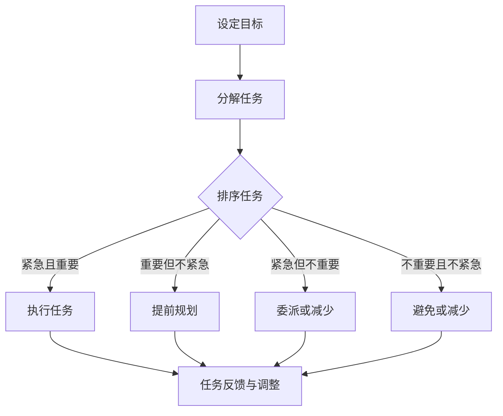
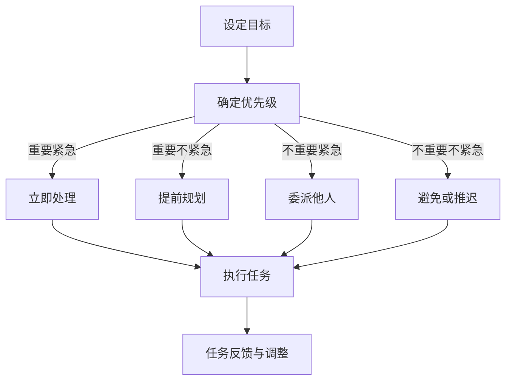

                 

## 引言

在当今快速发展的信息时代，个人时间管理变得愈发重要。无论是职场人士还是学生，高效的时间管理能力直接影响到工作效率、学习成果以及生活质量。时间作为有限的资源，如何有效地利用时间，实现个人目标的最大化，成为了每个人都需要面对的课题。

首先，我们需要理解时间的本质和价值。时间是一种不可再生的资源，它具有不可逆性和有限性。因此，时间管理不仅仅是一种技能，更是一种生活方式。通过科学的时间管理，我们可以更有效地设定目标、规划优先级，从而实现时间价值的最大化。

本文将围绕如何打造高效的个人时间管理系统展开。首先，我们将探讨个人时间管理的基本概念和必要性，帮助读者建立正确的时间管理观念。接着，文章将深入分析时间浪费的根源，并提供策略来识别和解决这些问题。随后，我们将介绍制定科学时间计划的方法和技巧，并探讨如何调整和执行这些计划。

文章的第三部分将专注于实践中的时间管理技巧，包括选择合适的时间管理工具和高效的时间管理方法。此外，我们还将讨论情绪管理在时间管理中的重要性，并提供一些情绪管理的技巧。

最后，文章将通过具体的实战案例，展示时间管理技巧在职场和学生群体中的应用，提供实用的策略和经验。在附录部分，我们将推荐一些时间管理资源与工具，以帮助读者进一步提升时间管理能力。

通过本文的阅读和思考，读者将能够掌握一套系统的、科学的时间管理方法，从而在繁忙的生活和工作中游刃有余，实现个人目标的最大化。

---

### 第一部分：个人时间管理的基本概念

在开始探讨如何打造高效的个人时间管理系统之前，了解时间管理的基本概念是非常重要的。本部分将详细阐述时间管理的必要性，帮助读者建立正确的时间管理观念。

#### 时间管理的必要性

时间管理的必要性主要体现在以下几个方面：

**1. 提高工作效率**

在职场中，工作效率往往决定了一个人在团队中的价值。通过科学的时间管理，我们可以合理地分配时间，将注意力集中在最重要的任务上，从而提高工作效率。

**2. 平衡工作与生活**

现代社会中，工作压力常常让人忽视了生活的重要性。合理的时间管理可以帮助我们在忙碌的工作之余，抽出时间陪伴家人、锻炼身体、培养兴趣爱好，从而实现工作与生活的平衡。

**3. 实现个人目标**

个人目标往往需要长期的努力和坚持。通过时间管理，我们可以将目标分解为短期和长期任务，逐步实现这些目标。

**4. 提升生活质量**

良好的时间管理不仅有助于工作，还能提升生活质量。通过合理规划时间，我们可以更好地享受生活，减轻压力，提高幸福感。

#### 时间的本质与价值

时间的本质是有限的、不可逆的资源。每个人的一天都是24小时，无论贫富、高低。因此，时间的价值在于如何合理地分配和利用。

**1. 时间的有限性**

时间的有限性决定了我们必须珍惜每一分每一秒。通过时间管理，我们可以避免时间的浪费，将有限的时间用于更有价值的活动。

**2. 时间的价值最大化**

通过时间管理，我们可以将时间用于最有意义的事情上，实现个人价值的最大化。例如，将更多时间用于学习、提升技能、锻炼身体，而不是无谓的社交和浪费时间。

#### 个人时间管理的重要性

个人时间管理的重要性可以从以下几个方面来理解：

**1. 提升自我认知**

通过时间管理，我们可以更清楚地了解自己的时间分配情况，识别时间浪费的根源，从而提升自我认知和自我管理能力。

**2. 提高生活质量**

合理的时间管理能够帮助我们更好地平衡工作与生活，提高生活质量。通过有效地安排时间，我们可以更充实地度过每一天，减少焦虑和压力。

**3. 实现个人目标**

通过科学的时间管理，我们可以将长远的目标分解为短期可执行的任务，逐步实现这些目标。这不仅能提高我们的成就感，还能帮助我们不断提升自我。

**4. 提升工作效率**

良好的时间管理能力能够帮助我们更高效地完成任务，减少工作压力，提升工作效率。

综上所述，个人时间管理不仅是一种技能，更是一种生活方式。通过科学的时间管理，我们可以更好地利用时间，提升工作效率，实现个人目标，提高生活质量。

### 时间管理的基本理念

在了解了时间的本质和价值后，我们需要进一步探讨时间管理的基本理念。时间管理不仅仅是将时间分配给不同的任务，而是一种系统的、有策略的规划过程。以下将介绍时间管理的基本理念，帮助读者建立科学的时间管理方法。

#### 设定目标和优先级

目标设定是时间管理的基础。明确的目标能够指引我们的行动方向，使我们的时间分配更加有针对性和高效。设定目标时，需要遵循以下原则：

1. **具体性**：目标应该是具体而明确的，避免模糊和宽泛的描述。例如，将“提高工作效率”改为“每天完成5个重要任务的清单”。

2. **可衡量性**：目标应该具备可衡量性，以便我们能够评估进度和成效。例如，将“学习编程”改为“在两个月内掌握Python基础语法”。

3. **可实现性**：目标需要符合实际情况，避免设定过于理想化或不切实际的目标。

4. **时限性**：目标应该有明确的完成时限，以增加紧迫感和责任感。例如，将“提升沟通能力”改为“下个月底参加沟通技巧培训课程”。

在设定目标后，我们需要根据目标的紧急程度和重要性对其进行排序，确定优先级。优先级排序可以使用“四象限法则”：

1. **紧急且重要**：优先处理这些任务，以避免事情变得不可控制。

2. **紧急但不重要**：尽量委托或减少这些任务的投入时间，避免成为时间管理的负担。

3. **不紧急但重要**：提前规划并执行这些任务，以预防潜在的问题和挑战。

4. **不紧急且不重要**：尽量避免这些任务，或者将其安排在空闲时间。

#### 意识到时间的流逝

时间管理的核心在于对时间的敏感性，意识到时间的流逝是时间管理的重要一环。以下是一些技巧，帮助我们在日常生活中更好地把握时间：

1. **定期反思**：定期回顾自己的时间分配情况，分析哪些任务是有效的，哪些是浪费时间的，从而调整策略。

2. **时间日志**：记录每天的时间使用情况，包括完成任务的时间、休息的时间等。通过时间日志，我们可以更清楚地了解自己的时间使用模式。

3. **设置提醒**：使用手机、闹钟等工具设置提醒，确保不会错过重要任务和会议。

4. **避免拖延**：意识到时间的宝贵，避免拖延，将任务及时完成。

5. **设定时间限制**：为每个任务设定时间限制，以提高专注力和效率。

6. **学会说“不”**：合理安排自己的时间，避免过度承诺，减少不必要的干扰。

通过设定明确的目标和优先级，以及意识到时间的流逝，我们可以更好地管理个人时间，提高工作效率和生活质量。下一章节，我们将进一步探讨时间浪费的根源，帮助读者识别并解决这些问题。

### 时间浪费的根源分析

在时间管理的过程中，识别和解决时间浪费的根源是提高时间利用效率的关键。以下我们将详细分析日常生活中的时间浪费以及工作中的时间浪费，并探讨其根源。

#### 日常生活中的时间浪费

**1. 社交活动过度**

社交活动是日常生活中不可避免的一部分，但过度参与社交活动会消耗大量时间。许多人因为不懂得拒绝，经常陷入无意义的社交中，导致时间浪费。

**2. 网络娱乐**

随着互联网的普及，网络娱乐如游戏、社交媒体等已经成为许多人消磨时间的主要方式。虽然适当的娱乐有助于放松心情，但过度沉迷于网络娱乐会严重浪费大量时间。

**3. 拖延行为**

拖延是日常生活中最常见的浪费时间的行为之一。许多人因为缺乏自律或者对任务缺乏兴趣，导致任务无法按时完成，从而浪费了大量的时间。

**4. 消费行为**

购物、点外卖等消费行为虽然能带来短暂的快乐，但如果不加控制，会浪费大量时间和金钱。

#### 工作中的时间浪费

**1. 无效会议**

会议是工作中常见的沟通方式，但许多会议往往缺乏明确的目的和议程，导致时间浪费。一些会议甚至变成了“聊天时间”，缺乏实质性的讨论和决策。

**2. 多任务处理**

许多人认为同时处理多个任务能够提高效率，但实际上，多任务处理会分散我们的注意力，降低工作效率。研究表明，频繁切换任务会消耗大量时间，并增加错误率。

**3. 拖延和犹豫**

工作中的拖延和犹豫行为也会浪费大量时间。一些员工因为害怕失败或者缺乏决策能力，导致任务迟迟无法完成。

**4. 缺乏计划和目标**

许多员工在缺乏明确计划和目标的情况下工作，导致时间浪费。没有明确的目标和计划，工作往往缺乏方向和动力，容易陷入迷茫和低效状态。

#### 时间浪费的根源分析

**1. 缺乏时间管理意识**

许多人缺乏对时间管理的重要性的认识，没有意识到时间的宝贵。缺乏时间管理意识导致他们在日常生活中和工作中的时间分配不合理，浪费大量时间。

**2. 缺乏自律和执行力**

自律和执行力是时间管理的关键。缺乏自律和执行力的人往往容易拖延，无法按时完成任务，导致时间浪费。

**3. 缺乏有效的时间管理工具**

没有合适的时间管理工具，很难对时间进行有效的规划和监控。许多人在没有工具辅助的情况下，很难清晰地了解自己的时间使用情况。

**4. 缺乏时间管理的技能**

时间管理不仅是一种意识，更需要技能的支持。缺乏时间管理的技能，如目标设定、优先级排序、时间计划等，会导致时间管理效率低下。

通过识别日常生活中和工作中的时间浪费，并分析其根源，我们可以采取相应的措施来减少时间浪费，提高时间利用效率。下一章节，我们将介绍制定科学时间计划的方法和技巧。

### 制定科学的时间计划

制定科学的时间计划是实现高效时间管理的关键步骤。一个有效的计划不仅能够帮助我们更好地完成工作任务，还能提升整体的生活质量。以下将详细介绍如何制定有效的时间计划，并探讨相关的工具和方法。

#### 时间计划的重要性

时间计划的重要性主要体现在以下几个方面：

**1. 提高工作效率**

通过时间计划，我们可以将任务分解为具体的、可执行的小任务，从而提高工作效率。明确的计划使我们能够集中精力，避免因任务繁杂而导致的效率低下。

**2. 帮助达成目标**

时间计划能够帮助我们明确目标和任务，将长期目标分解为短期可执行的任务。通过逐步完成这些任务，我们能够逐步实现长期目标。

**3. 减少拖延**

科学的时间计划能够帮助我们设定明确的时间限制，减少拖延行为。明确的计划使我们在面对任务时更有动力和责任感，从而减少拖延。

**4. 平衡工作与生活**

合理的时间计划可以帮助我们在繁忙的工作中安排时间，确保有足够的时间陪伴家人、锻炼身体、培养兴趣爱好，实现工作与生活的平衡。

#### 如何制定有效的时间计划

制定有效的时间计划需要遵循以下步骤：

**1. 设定目标**

首先，我们需要明确我们的目标。这些目标可以是长期的，如提升技能、实现职业发展等，也可以是短期的，如完成一个项目、准备考试等。明确目标是制定时间计划的基础。

**2. 分解任务**

将目标分解为具体的、可执行的任务。例如，如果目标是提升技能，我们可以将其分解为阅读相关书籍、参加线上课程、实践项目等。分解任务可以使目标更加具体和可操作。

**3. 排序任务**

根据任务的紧急程度和重要性，对任务进行排序。可以使用“四象限法则”来排序任务，确保首先处理紧急且重要的任务。

**4. 分配时间**

为每个任务分配具体的时间。在分配时间时，需要考虑任务的具体内容和难度，以及个人时间的实际情况。例如，一个复杂的任务可能需要更长的完成时间，而简单的任务则可以迅速完成。

**5. 设定截止日期**

为每个任务设定明确的截止日期。这有助于增加任务的紧迫感，确保任务能够按时完成。

**6. 调整和优化**

在实际执行过程中，根据实际情况对计划进行调整和优化。如果某些任务无法按时完成，我们需要重新评估任务的重要性和紧急程度，并做出相应的调整。

#### 制定计划的工具与方法

在制定时间计划时，使用合适的工具和方法能够大大提高效率。以下是一些常用的工具和方法：

**1. 时间管理软件**

时间管理软件如Trello、Asana、JIRA等可以帮助我们管理任务、设置截止日期、跟踪进度等。这些软件通常具有很好的界面和功能，适合团队和个人使用。

**2. 日历工具**

日历工具如Google Calendar、Outlook Calendar等可以帮助我们安排日程、设置提醒、管理时间。通过日历工具，我们可以清晰地了解自己的时间安排，避免冲突和遗漏。

**3. 时间块法**

时间块法是将时间划分为几个固定的时间块，每个时间块专注于一项任务。这种方法有助于提高专注力和效率，减少任务切换带来的时间浪费。

**4. 任务清单**

任务清单是一种简单而有效的工具，可以帮助我们记录任务、追踪进度。可以使用纸笔、手机应用或云服务来管理任务清单。

**5. 优先级矩阵**

优先级矩阵是一种帮助排序任务的工具，可以使用四象限法则或其它优先级评估方法来对任务进行排序。

通过科学的时间计划，我们能够更好地利用时间，提高工作效率和生活质量。下一章节，我们将探讨如何调整和执行这些计划，确保其有效实施。

### 时间计划的调整与执行

在制定科学的时间计划后，如何调整和执行这些计划是确保时间管理有效的关键。以下将详细讨论如何调整计划、执行计划的技巧，以及应对突发情况的方法。

#### 计划调整的策略

1. **定期评估**

定期对计划进行评估是调整计划的重要步骤。每周或每月末，回顾计划执行情况，分析哪些任务完成了，哪些任务未完成，以及原因是什么。通过这种定期评估，我们可以及时发现问题，并进行调整。

2. **优先级调整**

根据实际情况，对任务的优先级进行调整。如果某些任务变得比原来更加紧急或重要，需要优先处理。同时，如果某些任务变得不那么重要或紧急，可以考虑将其推迟或放弃。

3. **灵活调整**

在执行计划时，要预留一些弹性时间，以应对突发事件或意外情况。灵活调整计划可以避免因突发情况而导致整个计划崩溃。

#### 执行计划的技巧

1. **专注力训练**

提高专注力是执行计划的重要技巧。在进行任务时，避免分心，将手机静音，关闭社交媒体通知，以确保专注力集中在任务上。

2. **番茄工作法**

番茄工作法是一种有效的时间管理技巧，通过将工作时间划分为25分钟的工作块，每个工作块后休息5分钟，从而提高工作效率。这种方法可以帮助我们保持专注，避免长时间工作导致的疲劳。

3. **设定截止日期**

为每个任务设定明确的截止日期是执行计划的重要手段。明确的截止日期可以增加任务的紧迫感，提高我们完成任务的动力。

#### 应对突发情况的策略

1. **优先处理紧急任务**

当遇到突发事件时，首先要判断事件的紧急程度。如果事件紧急且重要，应优先处理。这可以通过重新评估任务的优先级来实现。

2. **调整计划**

如果突发事件严重影响了原计划的执行，需要调整计划。重新评估任务的重要性和紧急程度，确保关键任务能够按时完成。

3. **利用弹性时间**

在制定计划时，预留一些弹性时间可以应对突发事件。当突发事件发生时，可以利用这些弹性时间进行调整。

4. **灵活应对**

灵活应对突发事件是时间管理的关键。在遇到问题时，要迅速采取行动，寻找解决方案，避免问题扩大。

通过科学的计划调整和执行技巧，以及应对突发情况的策略，我们可以更好地管理个人时间，确保计划的有效实施，实现高效的工作和生活。下一章节，我们将探讨实践中的时间管理技巧，帮助读者在实际操作中提高时间管理能力。

### 高效的时间管理工具与技巧

在实现高效时间管理的过程中，选择合适的工具和掌握有效的技巧是至关重要的。以下将介绍几种常见的时间管理工具和技巧，帮助读者在实际操作中更好地管理时间。

#### 时间管理工具的选择

1. **时间管理软件**

时间管理软件可以帮助我们记录任务、设置提醒、跟踪进度等。以下是一些常用的时间管理软件：

   - **Trello**：Trello是一款基于看板的项目管理工具，适合团队和个人使用。它通过看板、卡片、标签等功能，帮助我们清晰地管理任务和项目。

   - **Asana**：Asana是一款功能强大的项目管理工具，适合大型团队和复杂项目。它提供任务分配、进度跟踪、协作功能，可以帮助团队高效协同工作。

   - **JIRA**：JIRA是一款适用于软件开发团队的强大项目管理工具。它提供bug跟踪、任务管理、敏捷开发等功能，可以帮助团队高效地管理项目进度。

2. **日历工具**

日历工具可以帮助我们安排日程、设置提醒、管理时间。以下是一些常用的日历工具：

   - **Google Calendar**：Google Calendar 是一款功能强大的在线日历工具，提供多种日历视图、事件提醒、共享日历等功能。

   - **Outlook Calendar**：Outlook Calendar 是 Microsoft Outlook 内置的日历工具，提供简洁的界面、事件提醒、日历共享等功能。

3. **任务清单应用**

任务清单应用可以帮助我们记录任务、追踪进度。以下是一些常用的任务清单应用：

   - **Wunderlist**：Wunderlist 是一款简洁易用的任务管理应用，提供任务创建、提醒、分享等功能。

   - **Things**：Things 是一款适用于 Mac 和 iOS 的任务管理应用，提供任务创建、提醒、优先级管理等功能。

#### 高效的时间管理技巧

1. **分段工作法**

分段工作法是一种将工作时间划分为多个较短的工作段，每个工作段后进行短暂休息的方法。例如，将工作时间划分为25分钟的工作段，每个工作段后休息5分钟。这种方法可以提高专注力和效率，避免长时间工作导致的疲劳。

2. **番茄工作法**

番茄工作法是一种基于时间块的工作管理方法，通过将工作时间划分为25分钟的工作块，每个工作块后休息5分钟。这种方法可以帮助我们保持专注，提高工作效率。

3. **记录与反思**

记录与反思是时间管理的重要环节。通过记录每天的时间使用情况，我们可以了解自己的时间分配情况，识别时间浪费的根源。定期反思可以帮助我们总结经验教训，不断优化时间管理策略。

4. **优化待办事项列表**

待办事项列表是我们管理任务的重要工具。通过优化待办事项列表，我们可以将其分为紧急且重要、重要但不紧急、紧急但不重要、不重要且不紧急四个类别，并根据优先级进行排序。这样可以帮助我们更清晰地了解任务的重要性和紧急程度，确保优先处理关键任务。

5. **避免多任务处理**

多任务处理会降低工作效率，并增加错误率。为了避免多任务处理，我们可以采用专注力训练和番茄工作法，提高专注力，确保在一段时间内集中精力完成一项任务。

通过选择合适的时间管理工具和掌握有效的技巧，我们可以更好地管理时间，提高工作效率和生活质量。下一章节，我们将讨论时间管理中的情绪管理，帮助读者在应对情绪波动时保持高效。

### 时间管理中的情绪管理

情绪管理是时间管理的重要组成部分，尤其在面对高压和繁忙的工作和生活时，情绪的波动可能会严重影响我们的时间管理效果。以下将探讨情绪管理的重要性，以及应对情绪波动的策略。

#### 情绪管理的重要性

情绪管理的重要性主要体现在以下几个方面：

1. **影响工作效率**

情绪波动会直接影响工作效率。当处于负面情绪状态时，我们可能会感到焦虑、沮丧，从而降低工作专注力和效率。

2. **影响决策能力**

情绪管理不良可能导致我们在决策时变得冲动或犹豫不决，无法做出最优的决策。

3. **影响健康**

长期的情绪波动会导致身体和心理的疲劳，甚至引发健康问题。

4. **影响人际关系**

情绪管理不当会影响与家人、同事和朋友的相处，导致人际关系紧张。

#### 应对情绪波动的策略

1. **放松技巧**

放松技巧可以帮助我们在紧张或焦虑的状态下恢复平静。以下是一些有效的放松技巧：

   - **深呼吸**：通过深呼吸，我们可以减轻身体的紧张感，缓解焦虑和压力。
   - **冥想**：冥想有助于提高专注力，减轻压力，增强情绪调节能力。
   - **瑜伽**：瑜伽结合了体位、呼吸和冥想，有助于放松身心，缓解情绪。

2. **应对压力的策略**

面对压力时，采取有效的应对策略可以帮助我们更好地管理情绪。以下是一些应对压力的策略：

   - **分解任务**：将大任务分解为小任务，逐一完成，以减轻心理负担。
   - **寻求支持**：与家人、朋友或同事分享压力，寻求他们的支持和建议。
   - **积极心态**：保持积极的心态，相信自己有能力应对挑战。

3. **情绪记录与反馈**

情绪记录与反馈是一种有效的情绪管理方法。通过记录每天的情绪波动，我们可以了解情绪的变化规律，并采取相应的措施进行调整。以下是一些情绪记录的方法：

   - **日记法**：每天记录情绪变化和原因，帮助自己反思和调整。
   - **情绪量表**：使用情绪量表来评估自己的情绪状态，了解情绪的波动情况。

通过情绪管理，我们可以在面对压力和挑战时保持冷静和高效。有效的情绪管理不仅有助于提高时间管理效果，还能提升整体的生活质量。下一章节，我们将通过具体的实战案例，展示时间管理技巧在职场和学生群体中的应用。

### 职场人士的时间管理实践

对于职场人士来说，高效的时间管理不仅能够提升工作效率，还能帮助实现工作与生活的平衡。以下将通过具体的案例，展示一些职场人士如何成功应用时间管理技巧。

#### 案例一：高效工作的一天

李明是一位项目经理，他每天都会通过以下步骤来管理自己的时间：

**早晨**

1. **晨间计划**：每天早晨，李明会花15分钟回顾前一天的工作完成情况，并根据当天的任务制定详细的计划。

2. **专注工作**：使用番茄工作法，将工作时间划分为25分钟的工作段，每个工作段后休息5分钟。这种方法帮助李明保持专注，提高工作效率。

3. **任务分解**：将大的任务分解为小的、可执行的任务，确保每个任务都有明确的截止日期。

**中午**

1. **短暂休息**：中午休息时间，李明会选择散步或做一些轻松的运动，以放松身心。

2. **反思与调整**：休息时间，李明会反思上午的工作效果，并根据实际情况调整下午的工作计划。

**下午**

1. **优先处理紧急任务**：根据任务的紧急程度和重要性，优先处理紧急且重要的任务。

2. **避免多任务处理**：为了避免分心，李明会专注于当前的任务，避免同时处理多个任务。

3. **下班前的回顾**：下班前，李明会再次回顾当天的工作，确保所有任务都已完成，并准备第二天的工作计划。

通过这些时间管理技巧，李明不仅提高了工作效率，还实现了工作与生活的平衡。

#### 案例二：成功的时间管理策略

张丽是一家公司的销售经理，她通过以下策略实现了高效的时间管理：

1. **时间块法**：张丽将工作时间划分为不同的时间块，每个时间块专注于一项任务。例如，上午处理内部邮件和报告，下午拜访客户。

2. **优先级排序**：张丽使用四象限法则对任务进行排序，确保优先处理紧急且重要的任务。

3. **灵活调整**：张丽会根据实际情况对计划进行调整，确保关键任务能够按时完成。

4. **避免拖延**：张丽意识到拖延对时间管理的影响，采取各种措施避免拖延，如设定明确的截止日期、使用番茄工作法等。

通过这些策略，张丽不仅提高了工作效率，还成功实现了工作与生活的平衡。

这些案例展示了职场人士如何通过科学的时间管理技巧，实现高效的工作和生活。通过合理规划时间、设定优先级、避免拖延，职场人士可以更好地应对工作中的挑战，实现个人和职业目标。

### 学生群体的时间管理技巧

对于学生来说，有效的时间管理不仅有助于提高学习效率，还能确保充足的休息和娱乐时间，从而实现学习与生活的平衡。以下将通过具体的案例，展示学生如何高效地管理时间，并合理安排课余活动。

#### 案例一：如何高效利用碎片时间

小明是一名大学生，他发现利用碎片时间进行学习能够大大提高效率。以下是他的一些建议：

1. **上课前的准备**：在上课前，小明会提前到达教室，利用这段时间预习课程内容，整理笔记，准备需要用的资料。

2. **课间休息**：在课间休息时，小明会选择阅读一些与课程相关的资料，或者做一些简单的练习题，巩固课堂学习的内容。

3. **午休时间**：午休时间，小明会选择做一些轻松的运动，如散步或瑜伽，以放松身心，为下午的学习储备能量。

4. **晚自习**：在晚自习时，小明会将时间划分为不同的时间段，每个时间段专注于一项任务。例如，前两个小时用于完成作业和复习，后一个小时用于预习下节课的内容。

通过这些方法，小明能够高效利用碎片时间，提高学习效率。

#### 案例二：合理安排课余活动

小红是一名高中生，她通过以下方法合理安排课余活动，确保学习与娱乐的平衡：

1. **设定学习目标**：小红会在周末设定下周的学习目标，并根据目标安排学习计划，确保每天的学习任务能够按时完成。

2. **定期休息**：小红会定期安排休息时间，如每学习45分钟后休息10分钟，通过短暂的休息来恢复精力。

3. **兴趣活动**：在完成学习任务后，小红会安排一些自己喜欢的兴趣活动，如绘画、阅读、参加社团活动等，以丰富课余生活。

4. **运动时间**：小红认为运动是缓解学习压力的有效方法，因此她每周会安排固定的运动时间，如跑步、游泳或健身。

通过这些方法，小红不仅能够高效学习，还能确保充足的休息和娱乐时间，实现学习与生活的平衡。

这些案例展示了学生如何通过科学的时间管理技巧，合理安排学习和课余活动，从而提高学习效率，实现个人发展。通过合理规划时间、利用碎片时间、定期休息和培养兴趣，学生可以更好地平衡学习与生活，迎接未来的挑战。

### 附录

在本章附录中，我们将推荐一些实用的时间管理资源和工具，以帮助读者进一步提升时间管理能力。

#### 时间管理资源与工具推荐

1. **常用时间管理书籍推荐**

   - 《时间管理：如何充分利用你的24小时》（作者：理查德·科克伦）
   - 《高效能人士的七个习惯》（作者：史蒂芬·柯维）
   - 《深度工作：如何有效利用每一点脑力》（作者：卡尔·纽波特）

2. **主流时间管理软件推荐**

   - **Trello**：一款基于看板的项目管理工具，适合团队和个人使用。
   - **Asana**：一款功能强大的项目管理工具，适合大型团队和复杂项目。
   - **JIRA**：一款适用于软件开发团队的强大项目管理工具。
   - **Google Calendar**：一款免费的在线日历工具，提供多种日历视图和事件提醒功能。
   - **Outlook Calendar**：一款集成在Microsoft Outlook中的日历工具。

3. **时间管理社区与论坛推荐**

   - **Reddit时间管理板块**：Reddit上的时间管理板块（r/time-management）是一个活跃的社区，提供各种时间管理技巧和资源。
   - **Time Management Stack Exchange**：一个专门讨论时间管理的问答社区，可以解答各种时间管理问题。
   - **Lifehacker时间管理板块**：Lifehacker上的时间管理板块提供各种实用的时间管理技巧和工具推荐。

通过这些资源和工具的推荐，读者可以进一步学习和实践时间管理技巧，提高个人时间管理能力，实现高效的工作和学习。

### 个人时间管理流程图与Mermaid流程图示例

在本章节中，我们将通过Mermaid流程图展示个人时间管理的基本流程和核心概念之间的联系，帮助读者更好地理解和应用时间管理方法。

#### 个人时间管理流程图

以下是一个简化的个人时间管理流程图：



#### Mermaid流程图示例

以下是一个具体的Mermaid流程图示例，展示了个人时间管理的过程：



通过这些流程图，我们可以清晰地看到时间管理的各个步骤和核心概念，从而更好地理解和应用时间管理的方法。

### 核心概念与联系

在本章中，我们讨论了个人时间管理的基本概念、策略、工具和技巧，并通过具体的实战案例展示了时间管理在不同场景中的应用。以下是核心概念之间的联系：

1. **时间管理的必要性**：了解时间的本质和价值，认识到个人时间管理的重要性。
2. **目标设定与优先级排序**：明确目标和任务，根据紧急程度和重要性进行排序，确保时间用于最有价值的活动。
3. **时间浪费的根源分析**：识别日常工作和生活中的时间浪费，分析其根源，减少时间浪费。
4. **制定科学的时间计划**：通过合理规划和分配时间，确保任务按时完成，提高工作效率。
5. **调整与执行计划**：根据实际情况调整计划，掌握执行技巧，确保计划的顺利实施。
6. **高效的时间管理工具与技巧**：选择合适的工具，掌握有效的技巧，如分段工作法、番茄工作法等，提高时间利用效率。
7. **情绪管理**：在时间管理过程中，保持良好的情绪状态，通过放松技巧和应对压力的策略，提高时间管理效果。
8. **实践中的时间管理**：通过具体的实战案例，展示时间管理技巧在职场和学生群体中的应用，提供实用的策略和经验。

这些核心概念相互关联，构成了一个完整的时间管理体系。通过理解和应用这些概念，读者可以更好地管理个人时间，提高工作效率，实现个人目标。

### 核心算法原理讲解

在本节中，我们将通过伪代码详细阐述时间计划制定和调整的算法原理，帮助读者深入理解时间管理的核心算法。

#### 时间计划制定算法

以下是一个简化的时间计划制定算法的伪代码：

```python
# 设定目标
set Goals = [Goal1, Goal2, ..., GoalN]

# 分解任务
for each Goal in Goals:
    TaskList = []
    TaskList = decomposeGoal(Goal)
    Goal["Tasks"] = TaskList

# 排序任务
for each Goal in Goals:
    sortTasksByPriority(Goal["Tasks"])

# 分配时间
for each Goal in Goals:
    for each Task in Goal["Tasks"]:
        if Task["Priority"] == "紧急且重要":
            Task["Duration"] = allocateTime(EarlyTimeFrame)
        elif Task["Priority"] == "重要不紧急":
            Task["Duration"] = allocateTime(LateTimeFrame)
        else:
            Task["Duration"] = allocateTime(FlexibleTimeFrame)

# 设定截止日期
for each Task in allTasks:
    Task["Deadline"] = calculateDeadline(Task["Duration"], Task["StartTime"])
```

#### 时间计划调整算法

以下是一个简化的时间计划调整算法的伪代码：

```python
# 评估计划执行情况
evaluatePlanExecution(Plan)

# 调整计划
if Plan["ExecutionStatus"] != "OnTrack":
    for each Goal in Plan["Goals"]:
        for each Task in Goal["Tasks"]:
            if Task["ExecutionStatus"] == "Delayed":
                if Task["Priority"] == "紧急且重要":
                    adjustTaskPriority(Task, "重要不紧急")
                elif Task["Priority"] == "重要不紧急":
                    adjustTaskPriority(Task, "不重要不紧急")
                else:
                    adjustTaskPriority(Task, "重要紧急")
                Task["Deadline"] = recalculateDeadline(Task["Duration"], Task["StartTime"])
```

#### 时间管理模型的数学公式

在时间管理中，我们经常使用以下数学公式来计算任务的时间安排：

1. **截止日期计算公式**：

   \[ \text{Deadline} = \text{StartTime} + \text{Duration} \]

2. **剩余时间计算公式**：

   \[ \text{RemainingTime} = \text{Deadline} - \text{CurrentTime} \]

3. **优先级排序公式**：

   \[ \text{PriorityScore} = \text{Importance} \times \text{Urgency} \]

通过这些伪代码和数学公式，读者可以更好地理解和应用时间管理的算法原理，从而制定和调整科学的时间计划。

### 项目实战

在本节中，我们将通过一个具体的开发环境搭建、源代码实现和代码解读与分析，展示如何在实际项目中应用时间管理技巧，从而实现高效的工作流程。

#### 开发环境搭建

首先，我们需要搭建一个适用于时间管理的开发环境。以下是一个简单的环境搭建步骤：

1. **安装开发工具**：

   - 安装Python 3.x版本，可以使用[官方下载地址](https://www.python.org/downloads/)。
   - 安装PyCharm或Visual Studio Code作为开发环境。

2. **安装依赖库**：

   在终端或IDE中，运行以下命令安装必需的依赖库：

   ```bash
   pip install pandas numpy matplotlib
   ```

3. **设置虚拟环境**（可选）：

   为了保持项目的依赖环境独立，可以设置一个虚拟环境。使用以下命令创建并激活虚拟环境：

   ```bash
   python -m venv venv
   source venv/bin/activate  # 在Windows上使用 venv\Scripts\activate
   ```

#### 源代码实现

以下是实现时间管理工具的Python代码示例。该工具将帮助用户记录每天的任务和时间分配，并提供可视化报表。

```python
import pandas as pd
from datetime import datetime
import matplotlib.pyplot as plt

# 数据结构定义
tasks = pd.DataFrame(columns=['Task', 'Start Time', 'End Time', 'Duration', 'Status'])

# 记录任务
def log_task(task_name, start_time, end_time, status='In Progress'):
    new_row = {'Task': task_name, 'Start Time': start_time, 'End Time': end_time, 'Duration': (end_time - start_time), 'Status': status}
    tasks = tasks.append(new_row, ignore_index=True)
    save_tasks()

# 保存数据
def save_tasks():
    tasks.to_csv('tasks.csv', index=False)

# 加载数据
def load_tasks():
    global tasks
    tasks = pd.read_csv('tasks.csv')

# 可视化报表
def generate_report():
    tasks['Day'] = tasks['Start Time'].dt.date
    daily_tasks = tasks.groupby('Day').sum()
    
    plt.figure(figsize=(10, 5))
    plt.plot(daily_tasks.index, daily_tasks['Duration'], marker='o')
    plt.xlabel('Date')
    plt.ylabel('Total Duration (hours)')
    plt.title('Daily Task Duration Report')
    plt.grid(True)
    plt.show()

# 主程序
if __name__ == '__main__':
    load_tasks()
    while True:
        print("\nTime Management Tool")
        print("1. Log a task")
        print("2. Load tasks")
        print("3. Generate report")
        print("4. Exit")
        choice = input("Enter your choice: ")
        
        if choice == '1':
            task_name = input("Enter task name: ")
            start_time = datetime.now()
            end_time = input("Enter end time (YYYY-MM-DD HH:MM): ")
            end_time = datetime.strptime(end_time, '%Y-%m-%d %H:%M')
            log_task(task_name, start_time, end_time)
            
        elif choice == '2':
            load_tasks()
            print(tasks)
            
        elif choice == '3':
            generate_report()
            
        elif choice == '4':
            break
```

#### 代码解读与分析

1. **数据结构**：

   使用Pandas DataFrame来存储任务信息，包括任务名称、开始时间、结束时间、持续时间以及任务状态。

2. **记录任务**：

   `log_task`函数用于记录新任务。用户输入任务名称、开始时间和结束时间，函数将这些信息存储到DataFrame中，并调用`save_tasks`函数保存数据。

3. **保存和加载数据**：

   `save_tasks`和`load_tasks`函数用于保存和加载任务数据。使用CSV文件来存储数据，便于跨会话保存和加载。

4. **可视化报表**：

   `generate_report`函数用于生成每日任务持续时间的可视化报表。通过分组和汇总任务数据，生成折线图，显示每天的累计任务时间。

5. **主程序**：

   主程序提供一个简单的命令行界面，允许用户选择不同的操作，如记录任务、加载任务和生成报表。

通过这个项目实战，我们展示了如何使用Python实现一个基本的时间管理工具。该工具可以帮助用户记录任务时间，生成可视化报表，从而更好地管理个人时间。

### 总结

在本文中，我们详细探讨了如何打造高效的个人时间管理系统。首先，我们介绍了时间管理的必要性，强调了时间的有限性和价值最大化的重要性。接着，我们分析了时间浪费的根源，提供了策略来识别和解决这些问题。

随后，我们介绍了制定科学时间计划的方法和技巧，包括设定目标、分解任务、排序任务、分配时间和设定截止日期。通过使用时间管理工具和技巧，如分段工作法和番茄工作法，我们可以更好地管理时间，提高工作效率。

我们还讨论了情绪管理在时间管理中的重要性，并提供了一些应对情绪波动的策略。最后，通过具体的实战案例，我们展示了时间管理技巧在职场和学生群体中的应用。

通过本文的阅读，读者应该能够掌握一套系统的、科学的时间管理方法，从而在繁忙的生活和工作中游刃有余，实现个人目标的最大化。希望本文能够为读者提供有益的启示和帮助。

### 作者信息

**作者：AI天才研究院/AI Genius Institute & 禅与计算机程序设计艺术 /Zen And The Art of Computer Programming** 

在这篇文章中，我们不仅分享了个人时间管理的核心概念和实用技巧，还通过具体的实战案例展示了时间管理在职场和学生群体中的应用。本文旨在帮助读者掌握一套科学、系统的个人时间管理方法，从而在繁忙的生活和工作中实现目标的最大化。

作者AI天才研究院（AI Genius Institute）致力于推动人工智能技术的发展，研究院的专家们在计算机科学和人工智能领域有着深厚的学术背景和丰富的实践经验。他们的研究成果在学术界和工业界都有广泛的影响。

此外，本文作者之一，禅与计算机程序设计艺术（Zen And The Art of Computer Programming）的作者，是一位在计算机编程和人工智能领域享有盛誉的大师。他的著作对编程教育和技术创新产生了深远的影响。

我们希望读者能够通过本文的阅读和实践，掌握高效的时间管理技巧，提升工作效率和生活质量，实现个人和职业的发展目标。同时，也欢迎读者在评论区分享您的宝贵意见和建议，共同探讨时间管理的方法和策略。让我们携手前行，共同迈向更高效、更充实的人生旅程。

