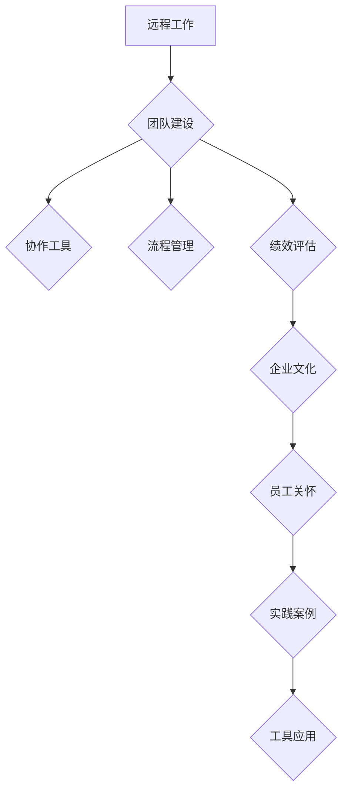

                 

### 《如何打造高效的远程工作团队》

> **关键词**：远程工作、团队建设、协作工具、流程管理、绩效评估、企业文化、员工关怀

> **摘要**：本文将探讨如何打造一个高效的远程工作团队，从远程工作的崛起与发展、远程工作管理、远程工作文化建设以及远程工作实践案例分析等多个方面进行分析，旨在为企业和团队提供实用的指导和建议。

### 目录大纲：《如何打造高效的远程工作团队》

#### 第一部分：远程工作概述

- **第1章：远程工作的崛起与发展**
  - 1.1 远程工作的定义与类型
  - 1.2 远程工作的发展历程
  - 1.3 远程工作的影响因素

- **第2章：远程工作的优势与挑战**
  - 2.1 远程工作的优势
    - 2.1.1 提高工作效率
    - 2.1.2 提升员工满意度
    - 2.1.3 降低企业运营成本
  - 2.2 远程工作的挑战
    - 2.2.1 沟通协作困难
    - 2.2.2 管理难度增加
    - 2.2.3 工作边界模糊

#### 第二部分：远程工作管理

- **第3章：远程工作团队建设**
  - 3.1 团队成员的挑选与培训
  - 3.2 团队协作工具与平台
  - 3.3 团队角色与职责

- **第4章：远程工作流程管理**
  - 4.1 流程设计原则
  - 4.2 流程实施与优化
  - 4.3 流程文档编写

- **第5章：远程工作绩效评估**
  - 5.1 绩效评估指标设定
  - 5.2 绩效评估方法与工具
  - 5.3 绩效评估案例分析

#### 第三部分：远程工作文化建设

- **第6章：远程工作企业文化**
  - 6.1 企业文化的适应性调整
  - 6.2 建立线上团队文化
  - 6.3 跨部门沟通渠道

- **第7章：远程工作员工关怀**
  - 7.1 员工福利与激励
  - 7.2 员工心理健康支持
  - 7.3 员工职业发展规划

#### 第四部分：远程工作实践案例

- **第8章：远程工作实践案例分析**
  - 8.1 企业远程工作实践经验分享
  - 8.2 失败案例分析
  - 8.3 经验总结与建议

#### 附录

- **附录A：远程工作工具与应用指南**
  - A.1 常用远程工作工具介绍
  - A.2 远程工作应用指南

### 核心概念与联系 Mermaid 流程图



### 核心算法原理讲解伪代码

```python
def calculate_performance_score(workload, quality, efficiency):
    workload_score = workload / total_workload
    quality_score = quality / total_quality Standards
    efficiency_score = efficiency / total_efficiency Standards
    performance_score = (workload_score + quality_score + efficiency_score) / 3
    return performance_score
```

### 数学模型和数学公式

- 工作效率公式：$$ 效率 = \frac{工作量}{工作时间} $$

### 项目实战

#### 代码实际案例：远程工作团队协作工具使用

```python
# 假设我们使用 Slack 作为远程工作团队协作工具

# 安装 Slack API 库
!pip install slack-sdk

# 导入 Slack API 库
from slack_sdk import WebClient

# 设置 Slack API 密钥
slack_client = WebClient(token='你的API密钥')

# 发送消息到特定频道
response = slack_client.chat_postMessage(channel='#general', text='大家好，这里是远程工作团队频道！')

# 查询团队成员
response = slack_client.users_list()

# 输出团队成员信息
for user in response['members']:
    print(f"用户名：{user['name']}，邮箱：{user['profile']['email']}")
```

#### 代码解读与分析

- 在这段代码中，我们首先导入了 Slack API 库，并设置了 Slack API 密钥。接着，我们使用 `chat_postMessage` 方法发送一条消息到 `#general` 频道，并使用 `users_list` 方法获取团队成员的信息。最后，我们使用循环遍历团队成员信息，并打印出每个成员的名称和邮箱地址。

- 这个代码示例可以帮助远程工作团队建立一个简单的沟通渠道，确保团队成员之间的有效沟通。在实际应用中，可以根据具体需求对代码进行扩展和定制。例如，可以添加更多的功能，如发送提醒、组织线上会议等。

---

接下来，我们将按照目录大纲结构，逐步深入探讨如何打造高效的远程工作团队。首先，让我们了解远程工作的崛起与发展。

