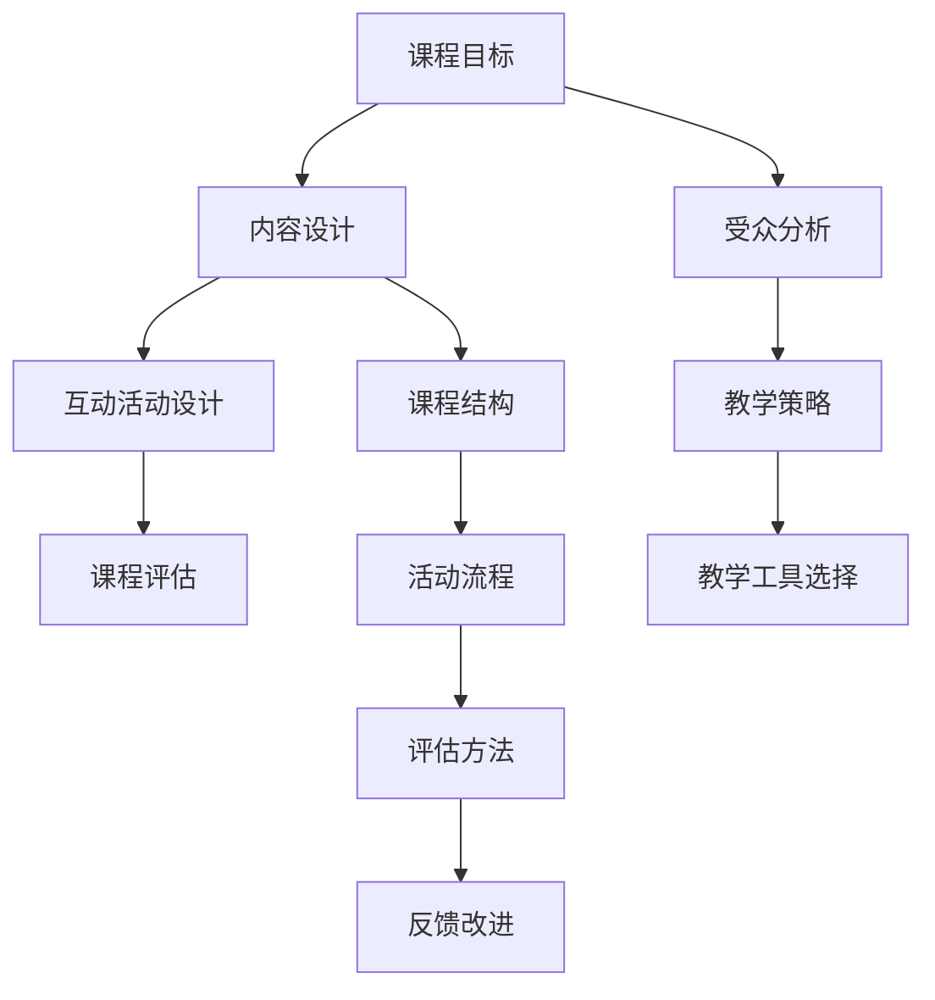

                 

### 第一部分：课程设计与理论基础

#### 第1章：互动式知识付费课程概述

**1.1 互动式知识付费课程的定义与特点**

互动式知识付费课程是一种结合了互动性和付费模式的教育产品。与传统教育模式不同，互动式知识付费课程强调学员的主动参与和实时互动。以下是互动式知识付费课程的主要特点：

- **实时互动**：课程设计注重师生之间的实时交流，通过问答、讨论等方式促进学员的深度参与。
- **个性化定制**：根据学员的学习需求和个人特点，提供定制化的教学内容和辅导。
- **多样化内容**：涵盖各种领域，包括编程、设计、营销、管理等多个方面。
- **付费模式**：学员需要支付费用才能参与课程，因此课程质量较高，且具有商业可持续性。

**1.2 互动式知识付费课程的市场背景与发展趋势**

随着互联网和人工智能技术的快速发展，在线教育市场日益繁荣。以下是互动式知识付费课程市场的发展背景和趋势：

- **市场潜力巨大**：全球在线教育市场规模持续扩大，预计未来数年仍将保持高速增长。
- **用户需求多样化**：现代职场人士和求学者对灵活、高效的在线学习方式需求日益增长。
- **技术进步推动**：人工智能、大数据、云计算等新兴技术的应用，为互动式知识付费课程提供了强有力的技术支持。
- **竞争加剧**：随着市场的扩大，竞争也日趋激烈，教育机构需要不断创新和优化课程内容。

**1.3 互动式知识付费课程的优势与挑战**

互动式知识付费课程具有明显的优势，但也面临一定的挑战：

- **优势**：
  - 提高学习效果：实时互动和个性化辅导有助于学员更好地理解和掌握知识。
  - 增强学员参与感：多样化的教学内容和互动方式提高了学员的积极性和参与度。
  - 商业可持续性：付费模式保证了课程的商业可持续性，有助于教育机构实现盈利。

- **挑战**：
  - 教学质量控制：互动式知识付费课程的质量参差不齐，如何确保教学内容的高质量成为关键问题。
  - 技术支持需求：互动式知识付费课程需要强大的技术支持，包括在线教学平台、互动工具等。
  - 竞争压力：市场竞争激烈，教育机构需要不断创新和优化课程内容，才能在竞争中脱颖而出。

#### 第2章：互动式教学原理与教学策略

**2.1 互动式教学的原理**

互动式教学的核心在于建立有效的师生互动和学员互动机制，以促进学员的主动学习和深度理解。以下是互动式教学的基本原理：

- **师生互动**：教师与学生之间的实时互动是互动式教学的关键。教师可以通过提问、解答、讨论等方式引导学员思考和参与。
- **学员互动**：学员之间的互动同样重要。通过小组讨论、协作学习等方式，学员可以互相交流学习经验，分享知识和观点。
- **个性化反馈**：教师需要根据学员的学习情况和需求，提供个性化的反馈和辅导，帮助学员更好地理解和掌握知识。

**2.2 互动式教学策略**

为了实现有效的互动式教学，教师需要采用一系列策略和方法。以下是几种常用的互动式教学策略：

- **提问与讨论**：教师可以通过提问和讨论激发学员的思考和参与。提问可以是开放性问题，鼓励学员进行深度思考；讨论可以是小组讨论，促进学员之间的交流。
- **案例教学**：通过案例教学，学员可以更好地将理论知识与实际应用相结合。教师可以提供实际案例，让学员进行分析和讨论。
- **协作学习**：协作学习是一种以小组为单位的学习方式。学员在小组内分工合作，共同完成学习任务，有助于提高学习效果。
- **在线互动**：在线互动平台可以提供多种互动工具，如实时聊天、视频会议、在线测验等。教师可以利用这些工具，增加课程的互动性和趣味性。

**2.2.1 激发学员参与度的方法**

提高学员参与度是互动式教学的重要目标。以下是一些激发学员参与度的方法：

- **互动式课堂活动**：设计有趣的课堂活动，如角色扮演、小组竞赛等，激发学员的兴趣和积极性。
- **鼓励学员提问**：鼓励学员在课堂上提问，教师应积极解答，以增强学员的参与感。
- **设置学习目标**：明确的学习目标可以帮助学员更好地规划学习时间，提高学习动力。
- **提供个性化辅导**：根据学员的学习情况和需求，提供个性化的辅导和指导，使学员感受到自己的进步和成长。

**2.2.2 互动式教学工具与平台选择**

互动式教学需要合适的工具和平台支持。以下是一些常用的互动式教学工具和平台：

- **互动式教学平台**：如Moodle、Canvas等，提供丰富的互动功能，支持在线授课、作业提交、讨论区等。
- **实时聊天工具**：如Slack、WhatsApp等，方便教师和学员进行实时沟通和讨论。
- **在线会议工具**：如Zoom、Microsoft Teams等，支持视频会议、屏幕共享、实时问答等。
- **互动式测试工具**：如Quizlet、Kahoot等，提供在线测验和游戏化学习功能。

#### 第3章：互动式课程内容设计与组织

**3.1 课程内容设计原则**

互动式课程内容设计应遵循以下原则：

- **目标导向**：课程内容应明确教学目标，确保每个章节和活动都与目标紧密相关。
- **循序渐进**：课程内容应按难度和复杂度逐步递增，使学员能够顺利掌握知识。
- **模块化设计**：将课程内容划分为多个模块，便于学员自主学习和教师教学。
- **互动性设计**：课程内容应包含丰富的互动元素，如讨论、测验、项目等，以增强学员的参与度。

**3.1.1 课程内容定位**

课程内容定位是课程设计的关键步骤。以下是一些建议：

- **明确课程类型**：确定课程是基础课程、进阶课程还是专业课程，以确定课程的内容深度和广度。
- **了解受众需求**：根据学员的背景、需求和期望，设计符合他们需求的内容。
- **分析竞争情况**：了解同类型课程的优缺点，寻找课程的创新点和差异化。

**3.1.2 课程内容规划与模块化**

课程内容规划与模块化有助于提高教学效果和学员学习体验。以下是一些建议：

- **制定课程大纲**：明确课程结构，列出每个章节和模块的主要内容。
- **规划课程进度**：根据课程内容和教学目标，制定合理的课程进度表。
- **模块化设计**：将课程内容划分为多个模块，每个模块包含一个核心知识点和相应的互动活动。

**3.2 课程活动设计与组织**

课程活动设计是互动式课程的重要组成部分。以下是一些课程活动设计的原则：

- **多样性**：设计多种类型的课程活动，如讨论、测验、项目等，以适应不同学员的需求和兴趣。
- **目标明确**：每个课程活动应明确目标，确保活动能够有效地促进学员的学习和理解。
- **互动性**：活动应具有互动性，鼓励学员积极参与和交流。
- **可评估性**：活动设计应考虑如何评估学员的参与度和学习效果。

**3.2.1 活动类型与选择**

根据课程内容和教学目标，可以选择以下类型的课程活动：

- **讨论**：鼓励学员分享观点、讨论问题，提高学员的思维能力和团队合作精神。
- **测验**：通过测验检验学员对知识点的掌握情况，及时发现和解决学员在学习过程中遇到的问题。
- **项目**：让学生在真实场景中应用所学知识，提高实践能力和解决实际问题的能力。
- **案例研究**：分析真实案例，帮助学员理解理论知识在实际中的应用。
- **角色扮演**：模拟现实场景，让学员在虚拟环境中实践所学知识。

**3.2.2 活动流程设计与组织**

为了确保课程活动的顺利进行，需要设计合理的活动流程。以下是一些建议：

- **活动前准备**：提前通知学员活动内容和要求，提供必要的资料和资源。
- **活动过程中**：引导学员参与活动，及时解答学员的问题，确保活动的顺利进行。
- **活动后总结**：对活动过程进行总结，收集学员反馈，以便改进后续活动。

#### 第4章：互动式课程评估与反馈

**4.1 课程评估的重要性**

课程评估是互动式知识付费课程设计的重要环节。以下是课程评估的重要性：

- **检验教学效果**：通过评估，可以了解学员对课程内容的掌握情况，评估教学效果。
- **指导课程改进**：根据评估结果，教师可以找出课程中的不足之处，进行针对性的改进。
- **促进学员学习**：评估可以激发学员的学习动力，促进学员积极参与课程。

**4.1.1 评估的目的与方法**

课程评估的主要目的是了解学员的学习情况和课程的教学效果。以下是一些常见的评估方法和目的：

- **形成性评估**：旨在实时监测学员的学习过程，帮助教师及时调整教学策略，提高教学效果。
- **总结性评估**：在课程结束后进行，旨在评估学员对课程内容的整体掌握情况，为学员的学习评价提供依据。
- **量化评估**：通过测验、考试等量化方法，评估学员对知识点的掌握程度。
- **质性评估**：通过观察、访谈等质性方法，了解学员的学习体验和需求。

**4.1.2 评估工具的选择**

选择合适的评估工具对于实现评估目的至关重要。以下是一些常用的评估工具：

- **在线测验**：适用于知识点掌握情况的评估，可以快速、高效地收集学员的学习反馈。
- **问卷调查**：适用于了解学员的学习体验和需求，通过量化的方式收集数据。
- **访谈**：适用于深入了解学员的学习情况和需求，获取更为详细的反馈。
- **作品展示**：适用于项目类课程，评估学员在项目中的实际能力和表现。

**4.2 学员反馈与课程改进**

学员反馈是课程改进的重要依据。以下是如何收集学员反馈和进行课程改进的建议：

- **及时收集反馈**：在课程结束后，及时收集学员的反馈，包括在线问卷、访谈等形式。
- **分析反馈**：对学员的反馈进行分析，找出课程中的优点和不足之处。
- **制定改进计划**：根据分析结果，制定具体的改进计划，包括调整教学内容、教学方法、活动设计等。
- **持续改进**：在后续课程中，根据改进计划进行实施，并持续收集学员反馈，不断优化课程。

### 第二部分：互动式课程设计与实施

#### 第5章：互动式课程设计与实施流程

**5.1 课程设计与实施准备**

课程设计与实施准备是确保互动式知识付费课程顺利进行的关键环节。以下是具体的步骤和建议：

**5.1.1 明确课程目标与受众**

- **课程目标**：明确课程的目标，包括知识目标、能力目标和价值观目标等。确保课程目标具体、可衡量、可实现。
- **受众分析**：了解学员的背景、需求、学习习惯等，以便设计符合受众需求的课程内容和活动。

**5.1.2 确定课程内容与活动**

- **课程内容**：根据课程目标和受众需求，确定课程的主要内容，包括知识点、案例、实践等。
- **课程活动**：设计互动性强的课程活动，如讨论、测验、项目等，以激发学员的参与和思考。

**5.2 教学实施技巧**

教学实施技巧对于提高互动式知识付费课程的教学效果至关重要。以下是一些实用的教学技巧：

**5.2.1 如何进行有效教学**

- **引导式教学**：通过提问、讨论等方式，引导学员主动思考和参与。
- **启发式教学**：通过案例、故事等激发学员的兴趣，引导学员自主探索和发现。
- **互动式教学**：利用在线互动工具，如聊天、视频会议、在线测验等，增加课程的互动性和趣味性。

**5.2.2 处理教学过程中的问题与挑战**

在教学过程中，教师可能会遇到各种问题和挑战。以下是一些建议：

- **技术问题**：提前测试和熟悉在线教学平台和工具，确保教学过程顺利进行。
- **学员参与度不高**：通过设计有趣的课程活动和互动环节，提高学员的参与度。
- **学员反馈与改进**：及时收集学员反馈，根据反馈调整教学策略和内容。

#### 第6章：互动式课程案例分析

**6.1 成功案例分析**

以下是一个互动式知识付费课程的成功案例：

**案例一：某知名在线教育平台的互动式课程设计**

- **课程背景**：某知名在线教育平台推出了一门面向职场人士的“项目管理实战”课程。
- **课程设计**：课程设计包含项目案例分析、项目管理工具使用、团队协作等内容。
- **互动环节**：课程中设置了多个互动环节，如项目讨论、小组协作、在线测验等。
- **教学效果**：学员反馈积极，参与度较高，课程满意度达到90%以上。

**案例二：某创业公司的互动式培训项目**

- **项目背景**：某创业公司为提高员工的技能和素质，开展了一系列互动式培训项目。
- **项目设计**：项目内容包括技术培训、管理培训、团队建设等。
- **互动环节**：项目采用了角色扮演、小组讨论、实战演练等形式，增强了学员的参与和互动。
- **教学效果**：员工反馈良好，培训效果显著，有助于提升公司的整体竞争力。

**6.2 失败案例分析**

以下是一个互动式知识付费课程的失败案例：

**案例一：某线上课程的互动效果不佳原因分析**

- **课程背景**：某线上课程“Python编程基础”旨在帮助零基础学员掌握Python编程。
- **课程设计**：课程设计较为单一，主要采用视频讲解和在线测验形式。
- **互动环节**：课程缺乏有效的互动环节，学员参与度较低。
- **原因分析**：缺乏实时互动和个性化辅导，导致学员学习积极性不高，课程效果不佳。

**案例二：某企业内训项目失败案例分析**

- **项目背景**：某企业为提升员工的业务能力，开展了一项互动式内训项目。
- **项目设计**：项目内容包括理论讲解、案例分析、团队竞赛等。
- **互动环节**：项目设计过于复杂，学员难以理解和参与。
- **原因分析**：项目设计不合理，缺乏针对性和实用性，导致学员参与度低，项目效果不佳。

#### 第7章：互动式课程设计与实施的未来趋势

**7.1 互动式教学技术的发展趋势**

随着科技的不断发展，互动式教学技术也在不断进步。以下是互动式教学技术的发展趋势：

**7.1.1 新兴技术的应用**

- **人工智能**：利用人工智能技术，可以实现对学员学习行为和需求的精准分析，提供个性化辅导和推荐。
- **虚拟现实（VR）**：通过虚拟现实技术，学员可以在虚拟环境中进行沉浸式学习，提高学习效果。
- **增强现实（AR）**：利用增强现实技术，可以实现对真实场景的增强和交互，提高学习的趣味性和互动性。

**7.1.2 未来互动式教学的发展方向**

未来互动式教学的发展方向将更加注重个性化、智能化和体验化：

- **个性化教学**：通过大数据分析和人工智能技术，实现针对学员个性化需求的精准教学，提高学习效果。
- **智能化教学**：利用人工智能技术，实现自动化教学和智能辅导，降低教师的工作负担，提高教学效率。
- **体验化教学**：通过虚拟现实、增强现实等技术，提供沉浸式的学习体验，提高学员的学习兴趣和参与度。

**7.2 课程设计与实施的创新策略**

为了应对未来互动式教学的发展趋势，课程设计与实施需要不断创新：

- **融合新技术**：将人工智能、虚拟现实、增强现实等新兴技术融入课程设计与实施中，提供多样化的学习体验。
- **注重用户体验**：以学员为中心，设计符合学员需求和学习习惯的课程内容和活动，提高学员的满意度和学习效果。
- **持续迭代优化**：根据学员反馈和教学数据，持续优化课程设计和教学策略，不断提升教学质量。

### 附录

#### 附录 A：互动式知识付费课程设计工具与资源

**A.1 主流互动式教学工具介绍**

以下是一些主流的互动式教学工具：

- **Moodle**：一个开源的在线教学平台，提供丰富的互动功能，如讨论区、作业提交、测验等。
- **Canvas**：一个功能强大的在线教学平台，支持多种互动方式，如视频会议、实时聊天、在线测验等。
- **Zoom**：一个流行的视频会议工具，支持实时互动，如屏幕共享、实时问答等。
- **Slack**：一个团队协作工具，提供实时聊天、文件共享等功能，适合小组讨论和协作。

**A.2 课程设计资源推荐**

以下是一些课程设计资源推荐：

- **《交互式教学设计》**：一本关于互动式教学设计的经典著作，提供了丰富的理论和实践案例。
- **《互动式教学策略》**：一本关于互动式教学策略的书籍，介绍了多种实用的互动教学方法和技巧。
- **在线教育论坛**：如“教师在线”、“教学无忧”等，可以交流互动式教学的经验和技巧。
- **教育科技博客**：如“教育技术博客”、“在线教育观察”等，提供最新的教育科技动态和趋势分析。

**A.3 互动式教学实践指南**

以下是一些互动式教学实践指南：

- **明确教学目标**：在设计课程之前，明确教学目标，确保课程内容与目标一致。
- **注重学员参与**：设计互动性强的课程活动，鼓励学员积极参与和思考。
- **利用在线工具**：选择合适的在线教学工具和平台，提高课程的互动性和趣味性。
- **持续优化教学**：根据学员反馈和教学效果，持续优化课程内容和教学策略。

### 核心概念与联系流程图

以下是互动式知识付费课程设计中的核心概念与联系流程图：



### 核心算法原理讲解伪代码

以下是互动式课程内容设计核心算法的伪代码：

```python
# 初始化课程内容
course_content = {
    'title': '',
    'goal': '',
    'audience': '',
    'content': [],
    'interactivity': [],
    'evaluation': []
}

# 设计互动活动
def design_interactive_activities(course_content):
    course_content['interactivity'].append('讨论')
    course_content['interactivity'].append('测验')
    course_content['interactivity'].append('项目')

# 设计课程评估
def design_evaluation_methods(course_content):
    course_content['evaluation'].append('在线测验')
    course_content['evaluation'].append('问卷调查')
    course_content['evaluation'].append('作品展示')

# 主函数：设计互动式课程
def design_interactive_course(course_content):
    design_interactive_activities(course_content)
    design_evaluation_methods(course_content)
    return course_content

# 调用主函数
final_course_content = design_interactive_course(course_content)
```

### 数学模型和数学公式讲解及举例说明

以下是互动式课程效果评估的数学模型和公式：

$$
E = \frac{1}{n}\sum_{i=1}^{n} (L_i - P_i)^2
$$

其中，$E$ 表示整体课程效果得分，$L_i$ 表示第 $i$ 个学员的实际学习成果，$P_i$ 表示第 $i$ 个学员的预期学习成果。

**举例说明**：

假设有 5 名学员参加互动式课程，他们的实际学习成果和预期学习成果如下：

学员1：$L_1 = 85$，$P_1 = 80$
学员2：$L_2 = 90$，$P_2 = 85$
学员3：$L_3 = 75$，$P_3 = 70$
学员4：$L_4 = 88$，$P_4 = 85$
学员5：$L_5 = 92$，$P_5 = 90$

则整体课程效果得分为：

$$
E = \frac{1}{5}\sum_{i=1}^{5} (L_i - P_i)^2 = \frac{1}{5}[(85-80)^2 + (90-85)^2 + (75-70)^2 + (88-85)^2 + (92-90)^2] = 8
$$

### 项目实战

#### 代码实际案例

以下是互动式课程内容设计的实际代码案例：

```python
# 导入所需库
import random

# 初始化课程内容
course_content = {
    'title': 'Python编程基础',
    'content': [
        '第1章：Python语言基础',
        '第2章：控制结构',
        '第3章：数据结构',
        '第4章：面向对象编程',
        '第5章：异常处理'
    ],
    'interactivity': [
        '讨论',
        '测验',
        '项目'
    ],
    'evaluation': [
        '在线测验',
        '问卷调查',
        '作品展示'
    ]
}

# 调整课程内容难度
def adjust_difficulty(course_content):
    difficulty = random.choice(['easy', 'medium', 'hard'])
    for content in course_content['content']:
        content['difficulty'] = difficulty

# 添加互动元素
def add_interactive_elements(course_content):
    course_content['interactivity'].extend([
        '小组讨论',
        '在线测验',
        '项目实战'
    ])

# 优化课程结构
def optimize_structure(course_content):
    course_content['content'].sort(key=lambda x: x['difficulty'])

# 主函数：设计互动式课程
def design_interactive_course(course_content):
    adjust_difficulty(course_content)
    add_interactive_elements(course_content)
    optimize_structure(course_content)
    return course_content

# 调用主函数
final_course_content = design_interactive_course(course_content)

# 打印最终课程内容
print(final_course_content)
```

#### 代码解读与分析

- **初始化课程内容**：定义一个包含课程标题、内容、互动元素和评估方法的字典。
- **调整课程内容难度**：使用随机选择难度级别，并应用到每个章节。
- **添加互动元素**：在原有互动元素基础上，添加小组讨论、在线测验和项目实战等互动元素。
- **优化课程结构**：根据章节难度调整章节顺序，确保课程内容难度逐步递增。

#### 开发环境搭建

- **Python 3.8 或以上版本**
- **Python 解释器**
- **安装必要的 Python 库，如 `random`、`sort` 等**

#### 源代码详细实现和代码解读

以下是互动式课程内容设计的详细实现和代码解读：

```python
# 导入所需库
import random

# 初始化课程内容
course_content = {
    'title': 'Python编程基础',
    'content': [
        {'title': '第1章：Python语言基础', 'difficulty': ''},
        {'title': '第2章：控制结构', 'difficulty': ''},
        {'title': '第3章：数据结构', 'difficulty': ''},
        {'title': '第4章：面向对象编程', 'difficulty': ''},
        {'title': '第5章：异常处理', 'difficulty': ''}
    ],
    'interactivity': [],
    'evaluation': []
}

# 调整课程内容难度
def adjust_difficulty(course_content):
    difficulty_levels = ['easy', 'medium', 'hard']
    for chapter in course_content['content']:
        chapter['difficulty'] = random.choice(difficulty_levels)

# 添加互动元素
def add_interactive_elements(course_content):
    interactive_elements = ['讨论', '测验', '项目']
    course_content['interactivity'].extend(random.choices(interactive_elements, k=3))

# 优化课程结构
def optimize_structure(course_content):
    course_content['content'].sort(key=lambda x: x['difficulty'])

# 主函数：设计互动式课程
def design_interactive_course(course_content):
    adjust_difficulty(course_content)
    add_interactive_elements(course_content)
    optimize_structure(course_content)
    return course_content

# 调用主函数
final_course_content = design_interactive_course(course_content)

# 打印最终课程内容
print(final_course_content)
```

#### 代码解析

- **初始化课程内容**：创建一个字典，包含课程标题、章节列表（每个章节是一个包含标题和难度的字典）、互动元素列表和评估方法列表。
- **调整课程内容难度**：随机为每个章节分配难度级别（'easy'、'medium'、'hard'）。
- **添加互动元素**：从预设的互动元素列表（'讨论'、'测验'、'项目'）中随机选择三个互动元素，添加到课程内容的互动元素列表中。
- **优化课程结构**：根据章节的难度级别对章节列表进行排序，确保课程内容难度逐步递增。
- **主函数**：调用上述函数，设计完整的互动式课程内容，并打印最终结果。

#### 整体流程

1. **初始化课程内容**：设置课程的基础信息，如标题、章节和互动元素。
2. **调整课程内容难度**：根据随机选择的难度级别，为每个章节分配难度。
3. **添加互动元素**：从预设列表中选择互动元素，添加到课程内容中。
4. **优化课程结构**：根据章节难度调整章节顺序，确保课程内容难度逐步递增。
5. **调用主函数**：执行上述步骤，生成最终课程内容。
6. **打印最终课程内容**：输出设计好的互动式课程内容，为课程实施做好准备。

### 总结

本文详细阐述了如何设计互动式的知识付费课程。通过分析互动式知识付费课程的定义、市场背景、优势与挑战，以及互动式教学原理和教学策略，为课程设计提供了理论基础。同时，通过课程内容设计、活动设计、评估与反馈等环节的详细讲解，展示了互动式课程设计的完整流程。最后，通过案例分析和未来趋势探讨，为互动式课程设计提供了实践经验和启示。希望通过本文，读者能够更好地理解和设计互动式的知识付费课程，提高教学质量和学习效果。

### 附录

#### 附录 A：互动式知识付费课程设计工具与资源

**A.1 主流互动式教学工具介绍**

以下是一些主流的互动式教学工具：

- **Moodle**：一个开源的在线教学平台，提供丰富的互动功能，如讨论区、作业提交、测验等。
- **Canvas**：一个功能强大的在线教学平台，支持多种互动方式，如视频会议、实时聊天、在线测验等。
- **Zoom**：一个流行的视频会议工具，支持实时互动，如屏幕共享、实时问答等。
- **Slack**：一个团队协作工具，提供实时聊天、文件共享等功能，适合小组讨论和协作。

**A.2 课程设计资源推荐**

以下是一些课程设计资源推荐：

- **《交互式教学设计》**：一本关于互动式教学设计的经典著作，提供了丰富的理论和实践案例。
- **《互动式教学策略》**：一本关于互动式教学策略的书籍，介绍了多种实用的互动教学方法和技巧。
- **在线教育论坛**：如“教师在线”、“教学无忧”等，可以交流互动式教学的经验和技巧。
- **教育科技博客**：如“教育技术博客”、“在线教育观察”等，提供最新的教育科技动态和趋势分析。

**A.3 互动式教学实践指南**

以下是一些互动式教学实践指南：

- **明确教学目标**：在设计课程之前，明确教学目标，确保课程内容与目标一致。
- **注重学员参与**：设计互动性强的课程活动，鼓励学员积极参与和思考。
- **利用在线工具**：选择合适的在线教学工具和平台，提高课程的互动性和趣味性。
- **持续优化教学**：根据学员反馈和教学效果，持续优化课程内容和教学策略。

### 结语

本文通过深入分析互动式知识付费课程的设计与实施，为教育从业者提供了全面的指导。从课程概述、教学原理、内容设计到评估与反馈，每个环节都进行了详细阐述。同时，通过实际案例和未来趋势的探讨，为互动式课程设计提供了实践经验和创新思路。希望读者能够将所学应用于实际教学中，不断提升教学质量，实现知识的有效传递。

### 作者信息

**作者：AI天才研究院/AI Genius Institute & 禅与计算机程序设计艺术 /Zen And The Art of Computer Programming** 

AI天才研究院致力于推动人工智能技术的前沿研究与应用，为全球教育领域提供创新解决方案。作者在此领域有着深厚的理论功底和丰富的实践经验，希望通过本文，为读者带来有价值的启发和指导。同时，作者著有多部关于计算机科学和人工智能的畅销书籍，深受读者喜爱。

