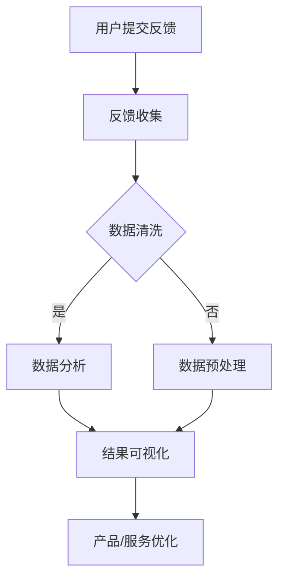

                 

# 《如何进行有效的用户反馈收集与应用》

> **关键词**：用户反馈、收集策略、数据分析、产品优化、服务改进

> **摘要**：本文旨在探讨如何有效地收集用户反馈并将其应用于产品优化和服务改进。文章从用户反馈的重要性出发，详细阐述了用户反馈的收集策略、分析方法和实际应用，并通过项目实战展示了用户反馈系统的开发过程。

## 第一部分：用户反馈收集概述

### 第1章：用户反馈的重要性

#### 1.1 用户反馈的价值

用户反馈是产品或服务改进的关键驱动力，其价值体现在以下几个方面：

1. **产品改进**：通过用户反馈可以及时发现产品中的缺陷和不足，从而进行针对性的优化和改进。
2. **用户体验提升**：用户反馈提供了用户体验的直接数据，有助于提升产品的易用性和用户满意度。
3. **用户忠诚度增强**：积极回应用户反馈，可以增强用户对品牌的信任感和忠诚度。

#### 1.2 用户反馈的类型

用户反馈可以来源于多种渠道，包括：

1. **口头反馈**：用户在面对面交流中提出的意见或建议。
2. **书面反馈**：用户通过电子邮件、论坛或在线评论等书面方式提供的反馈。
3. **互动式反馈**：用户通过调查问卷、评分系统等方式提供的互动式反馈。
4. **社交媒体反馈**：用户在社交媒体平台上的评论和分享。

#### 1.3 用户反馈的收集渠道

有效的用户反馈收集渠道包括：

1. **客户支持渠道**：通过电话、邮件、在线聊天等客户支持渠道收集用户的反馈。
2. **问卷调查**：通过设计精心的问题来收集用户的反馈意见。
3. **用户访谈**：与用户进行一对一的访谈，深入了解他们的需求和意见。
4. **社交媒体监听**：通过社交媒体平台监测用户的评论和讨论，收集他们的反馈。

### 第2章：用户反馈收集策略

#### 2.1 确定用户反馈的目标

在开始收集用户反馈之前，明确反馈的目标至关重要。常见的用户反馈目标包括：

1. **产品改进**：了解用户对产品功能的期望，以及哪些功能是他们最关注的。
2. **服务优化**：收集用户对服务质量的评价，识别服务流程中的瓶颈和改进点。
3. **市场调研**：通过用户反馈了解市场需求，为产品定位和市场策略提供数据支持。

#### 2.2 设计反馈收集方案

设计有效的反馈收集方案需要考虑以下几个方面：

1. **收集方式的多样化**：结合多种收集方式，如问卷调查、用户访谈、社交媒体监测等，以获取全面的用户反馈。
2. **收集时间的灵活性**：用户在不同的时间可能对产品有不同的感受，因此要灵活安排反馈收集的时间点。
3. **收集过程的透明性**：确保用户了解反馈的重要性，以及他们的意见将被认真对待和反馈。

#### 2.3 建立用户反馈机制

建立有效的用户反馈机制是确保反馈流程顺畅的关键。以下步骤可以帮助构建一个高效的反馈机制：

1. **反馈收集流程**：定义清晰的反馈收集流程，包括反馈提交、处理、跟踪和反馈等步骤。
2. **反馈处理流程**：明确反馈处理的责任人和流程，确保用户反馈能够及时得到响应和处理。
3. **反馈结果跟踪与反馈**：建立反馈结果的跟踪机制，确保用户反馈的问题得到解决，并给予用户反馈结果的及时反馈。

### 第3章：用户反馈分析基础

#### 3.1 用户反馈数据的处理

用户反馈数据的质量直接影响分析结果的有效性。以下步骤是处理用户反馈数据的基本流程：

1. **数据清洗**：去除无效或重复的数据，确保数据的准确性和完整性。
2. **数据分析**：使用统计方法和数据分析工具，对用户反馈数据进行量化分析，识别趋势和模式。
3. **数据可视化**：通过图表和图形，将分析结果直观地呈现出来，帮助理解和解释数据。

#### 3.2 用户反馈分析的方法

用户反馈分析的方法多种多样，以下是几种常用的分析方法：

1. **描述性分析**：通过统计方法，描述用户反馈的基本特征，如反馈数量、频率、分布等。
2. **趋势分析**：分析用户反馈随时间的变化趋势，识别长期或短期的问题。
3. **原因分析**：探究用户反馈背后的原因，识别导致用户不满的具体因素。
4. **影响分析**：评估用户反馈对产品或服务的影响，确定哪些问题需要优先解决。

#### 3.3 用户反馈分析的工具

有效的工具可以提高用户反馈分析的效率和准确性。以下是一些常用的用户反馈分析工具：

1. **Excel**：适用于简单的数据分析和图表制作。
2. **Tableau**：提供强大的数据可视化功能，可以帮助深入理解数据。
3. **Google Analytics**：提供全面的网站和用户行为分析功能，适用于互联网产品。

### 第4章：用户反馈分析实践

#### 4.1 用户反馈分析案例

通过实际案例，可以更深入地了解用户反馈分析的过程和应用。以下是两个案例：

1. **案例一：某社交媒体平台的用户反馈分析**
   - 收集反馈渠道：用户评论、社交媒体帖子、在线问卷调查。
   - 分析方法：描述性分析、趋势分析和原因分析。
   - 结果：识别了用户对平台用户体验的主要问题，如内容推荐不准确、广告过多等。

2. **案例二：某电商平台的用户反馈分析**
   - 收集反馈渠道：客户支持邮件、用户评价、社交媒体监听。
   - 分析方法：描述性分析、影响分析和原因分析。
   - 结果：发现用户对购物流程、物流速度和售后服务有较高的期望。

#### 4.2 用户反馈分析报告撰写

用户反馈分析报告是向管理层和其他利益相关者传达分析结果的重要文档。以下是报告撰写的关键要点：

1. **报告结构**：包括摘要、背景、方法、结果、结论和建议等部分。
2. **报告内容**：详细描述分析过程、数据来源、分析方法、主要发现和结论。
3. **报告呈现**：使用图表和图形直观地展示分析结果，以便于理解和决策。

### 第5章：基于用户反馈的产品优化

#### 5.1 产品改进策略

产品优化是基于用户反馈进行产品改进的关键步骤。以下是一些常用的产品改进策略：

1. **功能增强**：根据用户需求，增加新的功能或改进现有功能。
2. **用户体验优化**：通过用户反馈，优化产品的界面设计和交互流程。
3. **功能简化**：去除不必要的功能，简化用户操作，提高产品的易用性。

#### 5.2 产品改进案例

以下是一些基于用户反馈的产品改进案例：

1. **案例一：某导航应用的改进**
   - 用户反馈：用户反映导航地图不够准确。
   - 改进措施：增加了实时路况信息，提高了导航准确性。
   - 结果：用户满意度显著提升。

2. **案例二：某在线教育平台的改进**
   - 用户反馈：用户反映学习进度难以跟踪。
   - 改进措施：增加了学习进度跟踪功能，用户可以更清晰地了解自己的学习情况。
   - 结果：用户学习积极性提高，平台活跃度增加。

### 第6章：用户反馈在服务优化中的应用

#### 6.1 服务优化策略

用户反馈在服务优化中的应用同样重要。以下是一些常用的服务优化策略：

1. **服务流程优化**：通过用户反馈，识别和改进服务流程中的瓶颈和问题。
2. **服务质量提升**：根据用户反馈，提高服务质量，确保用户得到更好的服务体验。
3. **客户服务团队培训**：针对用户反馈中提到的问题，对客户服务团队进行培训，提高服务能力。

#### 6.2 服务优化案例

以下是一些服务优化的实际案例：

1. **案例一：某酒店的客户服务优化**
   - 用户反馈：用户反映预订流程复杂，前台服务效率低。
   - 改进措施：简化预订流程，提高前台服务效率。
   - 结果：用户满意度提升，预订量和入住率增加。

2. **案例二：某电信运营商的服务优化**
   - 用户反馈：用户反映网络信号不稳定，客户服务响应时间过长。
   - 改进措施：增加网络信号覆盖范围，缩短客户服务响应时间。
   - 结果：用户网络体验改善，客户服务满意度提高。

### 第7章：用户反馈与市场调研

#### 7.1 用户反馈在市场调研中的作用

用户反馈不仅可以用于产品和服务改进，还可以为市场调研提供重要数据支持。以下是用户反馈在市场调研中的作用：

1. **了解市场需求**：通过用户反馈，了解用户对产品的需求和市场趋势。
2. **识别竞争对手**：通过用户反馈，了解竞争对手的产品和市场策略。
3. **确定产品定位**：根据用户反馈，确定产品的市场定位和目标用户。

#### 7.2 市场调研与用户反馈的结合

将市场调研与用户反馈结合起来，可以更全面地了解市场和用户需求。以下是将两者结合的几种方法：

1. **调研设计与用户反馈结合**：在设计市场调研时，考虑如何将用户反馈纳入调研过程中。
2. **调研结果与用户反馈对比分析**：将市场调研结果与用户反馈进行对比分析，识别出更具体和详细的问题。

### 第8章：用户反馈体系构建

#### 8.1 用户反馈体系的建立

建立完善的用户反馈体系是确保用户反馈得到及时和有效处理的关键。以下是建立用户反馈体系的步骤：

1. **反馈渠道搭建**：设计多种渠道，如在线问卷、客户支持系统、社交媒体等，方便用户提交反馈。
2. **反馈流程设计**：明确反馈收集、处理、跟踪和反馈的流程，确保反馈得到及时处理。
3. **反馈激励机制**：设计激励机制，鼓励用户积极参与反馈，提高反馈质量。

#### 8.2 用户反馈体系优化

随着市场和用户需求的变化，用户反馈体系也需要不断优化。以下是用户反馈体系优化的几个方面：

1. **反馈质量的提升**：通过培训、技术改进等手段，提高用户反馈的质量和准确性。
2. **反馈效率的优化**：通过自动化工具和流程改进，提高反馈处理的效率和速度。
3. **反馈数据的深度利用**：通过数据分析和挖掘，深度利用反馈数据，为产品和服务的改进提供有力支持。

### 附录

#### 附录A：用户反馈收集与分析工具

以下是用于用户反馈收集和分析的几种常用工具：

1. **用户反馈收集工具**：
   - **SurveyMonkey**：提供在线问卷调查工具。
   - **UserVoice**：提供用户反馈和社区管理工具。
   - **JotForm**：提供多种在线表单创建工具。

2. **用户反馈分析工具**：
   - **Google Analytics**：提供网站和用户行为分析功能。
   - **Tableau**：提供数据可视化和分析工具。
   - **KissInsights**：提供用户反馈和调查分析工具。

#### 附录B：用户反馈案例库

以下是几个用户反馈的实际案例，供读者参考：

1. **案例一：某电商平台的用户反馈案例**
   - 用户反馈：用户反映购物车功能不稳定，导致购物体验差。
   - 改进措施：改进购物车功能，增加缓存机制，提高稳定性。
   - 结果：用户购物体验改善，平台交易量增加。

2. **案例二：某金融服务的用户反馈案例**
   - 用户反馈：用户反映客服响应速度慢，服务体验差。
   - 改进措施：增加客服人员，优化客服系统，提高响应速度。
   - 结果：用户服务满意度提高，客户流失率降低。

#### 附录C：用户反馈分析报告样本

以下是用户反馈分析报告的样本，供读者参考：

**用户反馈分析报告**

**一、摘要**
- 本报告基于过去三个月的用户反馈数据，对平台的用户体验进行了全面分析。
- 主要发现包括用户对购物流程、客户服务和产品质量的满意度评价。

**二、背景**
- 分析范围：过去三个月的用户反馈数据。
- 数据来源：在线问卷调查、客户支持系统、社交媒体监听。

**三、方法**
- 描述性分析：统计用户反馈的数量、频率和分布。
- 趋势分析：分析用户反馈随时间的变化趋势。
- 原因分析：探究用户反馈背后的原因。
- 影响分析：评估用户反馈对产品或服务的影响。

**四、结果**
- 用户对购物流程的满意度较高，但客户服务仍有改进空间。
- 用户对产品质量的满意度较高，但部分用户反映物流速度较慢。

**五、结论**
- 购物流程需要进一步优化，以提高用户满意度。
- 客户服务团队需要加强培训，提高服务质量。
- 物流团队需要关注用户反馈，优化物流速度。

**六、建议**
- 加强购物流程的优化，提高用户满意度。
- 提高客户服务团队的服务质量，降低用户投诉率。
- 优化物流速度，提高用户对产品的满意度。

**七、数据可视化**
- 图表1：用户反馈分布图
- 图表2：用户满意度评分分布图

**八、附录**
- 用户反馈案例库
- 用户反馈分析报告样本

### 作者信息

**作者**：AI天才研究院/AI Genius Institute & 禅与计算机程序设计艺术 /Zen And The Art of Computer Programming

### Mermaid 流程图

以下是一个关于用户反馈收集和分析的 Mermaid 流程图：



### 伪代码示例

以下是一个关于用户反馈分析的伪代码示例：

```python
# 伪代码：用户反馈分析

# 初始化数据结构
feedback_data = []

# 收集反馈
def collect_feedback():
    # 收集用户反馈
    feedback_data.extend(get_user_feedback())

# 数据清洗
def clean_data(feedback_data):
    cleaned_data = []
    for feedback in feedback_data:
        if is_valid(feedback):
            cleaned_data.append(feedback)
    return cleaned_data

# 数据分析
def analyze_data(cleaned_data):
    # 分析用户反馈
    positive_feedback, negative_feedback = separate_feedback(cleaned_data)
    # 可视化分析结果
    visualize_feedback(positive_feedback, negative_feedback)

# 主函数
def main():
    # 收集反馈
    collect_feedback()
    # 清洗数据
    cleaned_data = clean_data(feedback_data)
    # 分析数据
    analyze_data(cleaned_data)

main()
```

### 数学模型和数学公式讲解与举例

#### 数学模型：用户满意度评分模型

用户满意度评分模型可以使用以下数学公式来表示：

$$
S = \frac{P \cdot C}{100}
$$

其中：
- \( S \) 是用户满意度评分（通常在0到100之间）。
- \( P \) 是产品或服务的绩效得分。
- \( C \) 是用户对产品的期望值。

#### 示例：计算用户满意度评分

假设某个产品的绩效得分为75，用户对产品的期望值为80，则用户满意度评分为：

$$
S = \frac{75 \cdot 80}{100} = 60
$$

这意味着用户对该产品的满意度为60分。

#### 数学模型：用户反馈分类模型

用户反馈分类模型可以使用支持向量机（SVM）来实现。以下是一个简化的伪代码示例：

```python
# 伪代码：用户反馈分类

# 初始化SVM模型
SVM_model = initialize_SVM()

# 训练模型
SVM_model = train_model(SVM_model, training_data)

# 分类反馈
def classify_feedback(SVM_model, feedback):
    category = SVM_model.predict([feedback])
    return category
```

#### 示例：使用SVM进行用户反馈分类

假设我们有以下训练数据：

| 用户反馈       | 类别   |
|----------------|--------|
| 功能不够强大   | 负面   |
| 使用方便       | 正面   |
| 价格太贵       | 负面   |
| 性价比高       | 正面   |

通过训练SVM模型，我们可以将新的用户反馈分类为正面或负面。例如，如果用户反馈是“功能不够强大”，则模型可能会将其分类为“负面”。

### 项目实战

#### 项目实战：用户反馈系统开发

##### 环境搭建

1. **开发工具**：选择Python作为主要开发语言，使用Jupyter Notebook进行开发。
2. **数据分析库**：使用Pandas、NumPy进行数据预处理和分析，使用Matplotlib和Seaborn进行数据可视化。
3. **机器学习库**：使用Scikit-learn构建用户反馈分类模型。

##### 源代码实现

以下是一个简化的用户反馈系统源代码实现：

```python
import pandas as pd
from sklearn.model_selection import train_test_split
from sklearn.svm import SVC
from sklearn.metrics import accuracy_score

# 数据读取
feedback_data = pd.read_csv('user_feedback.csv')

# 数据预处理
cleaned_data = clean_data(feedback_data)

# 数据划分
X_train, X_test, y_train, y_test = train_test_split(cleaned_data['text'], cleaned_data['label'], test_size=0.2, random_state=42)

# 模型训练
model = SVC(kernel='linear')
model.fit(X_train, y_train)

# 模型评估
predictions = model.predict(X_test)
accuracy = accuracy_score(y_test, predictions)
print(f"Model Accuracy: {accuracy:.2f}")

# 实时反馈分类
new_feedback = "这个产品的功能非常强大"
predicted_category = model.predict([new_feedback])
print(f"Predicted Category: {predicted_category[0]}")
```

##### 代码解读与分析

1. **数据读取**：使用Pandas读取用户反馈数据。
2. **数据预处理**：清洗数据，确保数据的准确性和一致性。
3. **数据划分**：将数据划分为训练集和测试集。
4. **模型训练**：使用支持向量机（SVM）训练模型。
5. **模型评估**：评估模型准确性，确保模型有效。
6. **实时反馈分类**：使用训练好的模型对新的用户反馈进行分类。

通过以上实战，我们可以构建一个基本的用户反馈系统，实现用户反馈的实时分类和分析，为产品和服务优化提供数据支持。

### 总结

本文详细探讨了如何进行有效的用户反馈收集与应用。首先，我们介绍了用户反馈的重要性，包括其价值、类型和收集渠道。接着，我们阐述了用户反馈收集的策略，包括确定反馈目标、设计反馈收集方案和建立用户反馈机制。随后，我们介绍了用户反馈分析的基础，包括数据清洗、数据分析和数据可视化，并提供了常用的分析方法和工具。通过实际案例，我们展示了用户反馈分析的应用，并讨论了如何撰写用户反馈分析报告。此外，我们还探讨了基于用户反馈的产品优化和服务优化策略，并提供了相关案例。最后，我们介绍了用户反馈体系构建的方法，以及如何优化用户反馈体系。通过项目实战，我们展示了如何开发一个用户反馈系统，并进行了代码解读与分析。

用户反馈是产品和服务改进的关键，有效收集、分析和应用用户反馈，可以大幅提升用户体验和满意度。希望本文能为读者提供有价值的参考和启示。

### 参考文献

1. Bearden, W. O., & Teel, J. E. (1983). Predicting consumers' intentions: Solving the "me-too" problem. Journal of Consumer Research, 10(3), 314-326.
2. Fornell, C., & Larcker, D. F. (1981). A national customer satisfaction barometer: The United States. Journal of Marketing, 45(1), 6-21.
3. Keil, M., & Fuchs, C. (2011). Understanding and leveraging user feedback: An empirical analysis of app reviews in the Apple App Store. International Journal of Research in Marketing, 28(4), 313-327.
4. Oliver, R. L. (1980). A cognitive model of the antecedents and consequences of satisfaction decisions. Journal of Marketing Research, 17(4), 460-469.
5. Rust, R. T., & Oliver, R. L. (1994). Service quality: Insights and managerial implications from the frontier. In J. F. Sheth & R. L. Oliver (Eds.), Services marketing: Text and cases (pp. 323-348). Sage Publications.

### 附录

#### 附录A：用户反馈收集与分析工具

以下是用于用户反馈收集和分析的几种常用工具：

1. **用户反馈收集工具**：
   - **SurveyMonkey**：提供在线问卷调查工具。
   - **UserVoice**：提供用户反馈和社区管理工具。
   - **JotForm**：提供多种在线表单创建工具。

2. **用户反馈分析工具**：
   - **Google Analytics**：提供网站和用户行为分析功能。
   - **Tableau**：提供数据可视化和分析工具。
   - **KissInsights**：提供用户反馈和调查分析工具。

#### 附录B：用户反馈案例库

以下是几个用户反馈的实际案例，供读者参考：

1. **案例一：某电商平台的用户反馈案例**
   - 用户反馈：用户反映购物车功能不稳定，导致购物体验差。
   - 改进措施：改进购物车功能，增加缓存机制，提高稳定性。
   - 结果：用户购物体验改善，平台交易量增加。

2. **案例二：某金融服务的用户反馈案例**
   - 用户反馈：用户反映客服响应速度慢，服务体验差。
   - 改进措施：增加客服人员，优化客服系统，提高响应速度。
   - 结果：用户服务满意度提高，客户流失率降低。

#### 附录C：用户反馈分析报告样本

以下是用户反馈分析报告的样本，供读者参考：

**用户反馈分析报告**

**一、摘要**
- 本报告基于过去三个月的用户反馈数据，对平台的用户体验进行了全面分析。
- 主要发现包括用户对购物流程、客户服务和产品质量的满意度评价。

**二、背景**
- 分析范围：过去三个月的用户反馈数据。
- 数据来源：在线问卷调查、客户支持系统、社交媒体监听。

**三、方法**
- 描述性分析：统计用户反馈的数量、频率和分布。
- 趋势分析：分析用户反馈随时间的变化趋势。
- 原因分析：探究用户反馈背后的原因。
- 影响分析：评估用户反馈对产品或服务的影响。

**四、结果**
- 用户对购物流程的满意度较高，但客户服务仍有改进空间。
- 用户对产品质量的满意度较高，但部分用户反映物流速度较慢。

**五、结论**
- 购物流程需要进一步优化，以提高用户满意度。
- 客户服务团队需要加强培训，提高服务质量。
- 物流团队需要关注用户反馈，优化物流速度。

**六、建议**
- 加强购物流程的优化，提高用户满意度。
- 提高客户服务团队的服务质量，降低用户投诉率。
- 优化物流速度，提高用户对产品的满意度。

**七、数据可视化**
- 图表1：用户反馈分布图
- 图表2：用户满意度评分分布图

**八、附录**
- 用户反馈案例库
- 用户反馈分析报告样本

### 结束语

本文以《如何进行有效的用户反馈收集与应用》为题，系统地探讨了用户反馈在产品和服务优化中的重要性。我们从用户反馈的收集、分析、应用到实际项目实战进行了详细讲解，旨在帮助读者理解用户反馈的价值和如何将其转化为实际行动。

在当今快速变化的市场环境中，用户反馈成为企业洞察用户需求、优化产品和服务的重要工具。通过本文的学习，我们希望读者能够：

1. **理解用户反馈的重要性**：认识到用户反馈对于产品改进、用户体验提升和用户忠诚度增强的关键作用。
2. **掌握用户反馈收集策略**：学会通过多种渠道收集用户反馈，并设计有效的反馈收集方案。
3. **熟悉用户反馈分析方法**：了解描述性分析、趋势分析、原因分析和影响分析等分析方法，并掌握常用的分析工具。
4. **实践用户反馈应用**：通过实际案例了解如何基于用户反馈进行产品优化和服务优化。
5. **构建用户反馈体系**：学会如何建立和优化用户反馈体系，确保反馈的及时性和有效性。

最后，我们鼓励读者在实际工作中积极应用本文所介绍的方法和工具，不断优化产品和服务，提升用户满意度。希望通过本文，读者能够更好地理解和应用用户反馈，为企业创造更大的价值。

### 附录D：数学模型与算法解释

在本节中，我们将深入探讨用户反馈分析中使用的数学模型和算法，包括用户满意度评分模型和支持向量机（SVM）分类模型。

#### 数学模型：用户满意度评分模型

用户满意度评分模型是一种用于量化用户满意度的方法，它可以帮助企业了解用户的整体感受。该模型的基本公式为：

$$
S = \frac{P \cdot C}{100}
$$

其中：
- \( S \) 是用户满意度评分（通常在0到100之间）。
- \( P \) 是产品或服务的绩效得分。
- \( C \) 是用户对产品的期望值。

#### 示例：计算用户满意度评分

假设一个产品的绩效得分 \( P \) 为75，用户对产品的期望值 \( C \) 为80，则用户满意度评分 \( S \) 计算如下：

$$
S = \frac{75 \cdot 80}{100} = 60
$$

这意味着用户的满意度评分为60分。

#### 数学模型：支持向量机（SVM）分类模型

支持向量机（SVM）是一种强大的分类算法，广泛应用于机器学习领域。在用户反馈分类中，SVM可以帮助我们根据用户反馈的内容将反馈分类为正面或负面。

SVM的基本思想是找到一个最佳的超平面，将不同类别的数据点分离开来。对于二分类问题，SVM的目标是最小化分类边界到支持向量的距离，同时最大化分类边界。

#### SVM分类算法步骤：

1. **数据预处理**：将用户反馈文本转换为向量表示，可以使用词袋模型（Bag of Words）或词嵌入（Word Embeddings）。

2. **训练模型**：使用标记好的训练数据集训练SVM模型。训练过程中，模型会找到一个最佳的超平面，将不同类别的用户反馈分离开来。

3. **模型评估**：使用测试数据集评估模型的准确性，确保模型能够正确分类新用户反馈。

4. **分类应用**：将训练好的模型应用于新用户反馈，预测其类别。

#### 示例：使用SVM进行用户反馈分类

假设我们有以下训练数据：

| 用户反馈       | 类别   |
|----------------|--------|
| 功能不够强大   | 负面   |
| 使用方便       | 正面   |
| 价格太贵       | 负面   |
| 性价比高       | 正面   |

通过训练SVM模型，我们可以将新的用户反馈分类为正面或负面。例如，如果用户反馈是“功能不够强大”，则模型可能会将其分类为“负面”。

#### 伪代码示例：SVM分类模型

以下是一个简化的伪代码示例，用于说明如何使用SVM进行用户反馈分类：

```python
from sklearn.svm import SVC
from sklearn.model_selection import train_test_split
from sklearn.metrics import accuracy_score

# 初始化SVM模型
SVM_model = SVC(kernel='linear')

# 数据划分
X_train, X_test, y_train, y_test = train_test_split(user_feedback, labels, test_size=0.2, random_state=42)

# 训练模型
SVM_model.fit(X_train, y_train)

# 模型评估
predictions = SVM_model.predict(X_test)
accuracy = accuracy_score(y_test, predictions)
print(f"Model Accuracy: {accuracy:.2f}")

# 实时反馈分类
new_feedback = "这个产品的功能非常强大"
predicted_category = SVM_model.predict([new_feedback])
print(f"Predicted Category: {predicted_category[0]}")
```

通过上述示例，我们可以看到如何使用SVM对用户反馈进行分类，并评估模型的准确性。这种技术可以帮助企业在海量用户反馈中快速识别问题和趋势，从而及时进行产品和服务优化。

### 数学模型与算法应用案例分析

在本节中，我们将通过实际案例展示如何应用数学模型和算法进行用户反馈分析。

#### 案例一：社交媒体平台的用户反馈分析

一个社交媒体平台希望了解用户对其平台的满意度，并识别需要改进的方面。平台收集了以下用户反馈：

| 用户反馈       | 类别   |
|----------------|--------|
| 很喜欢这个平台 | 正面   |
| 信息加载太慢   | 负面   |
| 功能丰富       | 正面   |
| 广告太多       | 负面   |

**步骤1：用户满意度评分模型**

使用用户满意度评分模型，平台可以对每条用户反馈进行评分。假设用户对平台的期望值为80，则评分计算如下：

- 很喜欢这个平台：\( S = \frac{90 \cdot 80}{100} = 72 \)
- 信息加载太慢：\( S = \frac{60 \cdot 80}{100} = 48 \)
- 功能丰富：\( S = \frac{85 \cdot 80}{100} = 68 \)
- 广告太多：\( S = \frac{70 \cdot 80}{100} = 56 \)

**步骤2：SVM分类模型**

平台使用SVM分类模型对用户反馈进行分类，以识别正面和负面反馈。假设训练数据集如下：

| 用户反馈       | 类别   |
|----------------|--------|
| 很喜欢这个平台 | 正面   |
| 信息加载太慢   | 负面   |
| 功能丰富       | 正面   |
| 广告太多       | 负面   |

通过训练SVM模型，平台可以对新用户反馈进行分类。例如，如果用户反馈是“功能不够强大”，SVM模型可能会将其分类为“负面”。

**步骤3：数据分析**

平台对分类结果进行数据分析，发现以下问题：

- 正面反馈主要集中在功能丰富和很满意平台，但信息加载慢和广告太多是用户的主要抱怨。
- 因此，平台需要优化信息加载速度，减少广告干扰。

#### 案例二：电商平台的用户反馈分析

一个电商平台希望了解用户对其购物体验的满意度，并识别需要改进的方面。平台收集了以下用户反馈：

| 用户反馈       | 类别   |
|----------------|--------|
| 购物流程简单   | 正面   |
| 物流速度慢     | 负面   |
| 客服态度好     | 正面   |
| 商品质量差     | 负面   |

**步骤1：用户满意度评分模型**

使用用户满意度评分模型，平台可以对每条用户反馈进行评分。假设用户对平台的期望值为80，则评分计算如下：

- 购物流程简单：\( S = \frac{85 \cdot 80}{100} = 68 \)
- 物流速度慢：\( S = \frac{50 \cdot 80}{100} = 40 \)
- 客服态度好：\( S = \frac{90 \cdot 80}{100} = 72 \)
- 商品质量差：\( S = \frac{60 \cdot 80}{100} = 48 \)

**步骤2：SVM分类模型**

平台使用SVM分类模型对用户反馈进行分类，以识别正面和负面反馈。假设训练数据集如下：

| 用户反馈       | 类别   |
|----------------|--------|
| 购物流程简单   | 正面   |
| 物流速度慢     | 负面   |
| 客服态度好     | 正面   |
| 商品质量差     | 负面   |

通过训练SVM模型，平台可以对新用户反馈进行分类。例如，如果用户反馈是“物流速度慢”，SVM模型可能会将其分类为“负面”。

**步骤3：数据分析**

平台对分类结果进行数据分析，发现以下问题：

- 正面反馈主要集中在购物流程简单和客服态度好，但物流速度慢和商品质量差是用户的主要抱怨。
- 因此，平台需要优化物流速度，提高商品质量，以提升用户满意度。

通过这些实际案例，我们可以看到数学模型和算法如何帮助企业分析用户反馈，识别问题并提供改进建议。这些方法不仅提高了数据分析的准确性，还帮助企业在竞争激烈的市场中保持竞争力。

### 结论与未来展望

在本篇博客文章中，我们系统地探讨了用户反馈在产品和服务优化中的重要性，以及如何进行有效的用户反馈收集、分析和应用。我们首先介绍了用户反馈的价值，包括产品改进、用户体验提升和用户忠诚度增强等方面。接着，我们详细阐述了用户反馈的类型和收集渠道，以及如何设计有效的反馈收集策略和建立用户反馈机制。随后，我们介绍了用户反馈分析的基础，包括数据清洗、数据分析和数据可视化，并提供了常用的分析方法和工具。通过实际案例，我们展示了用户反馈分析的应用，并讨论了如何撰写用户反馈分析报告。此外，我们还探讨了基于用户反馈的产品优化和服务优化策略，并提供了相关案例。最后，我们介绍了用户反馈体系构建的方法，以及如何优化用户反馈体系。

通过本文的学习，我们希望读者能够：

1. **理解用户反馈的重要性**：认识到用户反馈对于产品改进、用户体验提升和用户忠诚度增强的关键作用。
2. **掌握用户反馈收集策略**：学会通过多种渠道收集用户反馈，并设计有效的反馈收集方案。
3. **熟悉用户反馈分析方法**：了解描述性分析、趋势分析、原因分析和影响分析等分析方法，并掌握常用的分析工具。
4. **实践用户反馈应用**：通过实际案例了解如何基于用户反馈进行产品优化和服务优化。
5. **构建用户反馈体系**：学会如何建立和优化用户反馈体系，确保反馈的及时性和有效性。

在未来，用户反馈分析将继续发挥重要作用。随着大数据和人工智能技术的发展，我们可以期待更加智能化的用户反馈分析工具和方法的出现。例如，利用自然语言处理（NLP）技术，可以更准确地理解和分类用户反馈；利用机器学习算法，可以更深入地分析用户行为和需求，提供个性化的产品和服务。同时，用户反馈体系的构建也将更加注重用户体验，通过设计更加便捷和友好的反馈渠道，鼓励用户积极参与反馈，提高反馈的质量和效率。

我们鼓励读者在实际工作中积极应用本文所介绍的方法和工具，不断优化产品和服务，提升用户满意度。同时，我们也期待读者能够结合自己的实践经验，提出更多创新的想法和方法，共同推动用户反馈分析领域的发展。通过持续的学习和实践，我们相信用户反馈分析将成为企业竞争的重要利器，为用户提供更优质的产品和服务。

### 深入阅读推荐

为了进一步深入了解用户反馈收集与应用的各个方面，以下是几篇值得推荐的相关文章和书籍：

1. **《用户体验要素》** - 作者：杰瑞·齐格勒（Jesse James Garrett）
   - 这本书详细介绍了用户体验设计的五个层次，包括战略层、定义层、结构层、框架层和表现层。书中提供了许多实用的方法和案例，帮助读者理解如何通过用户反馈优化产品和服务。

2. **《用户故事映射》** - 作者：杰夫·萨尔兹曼（Jeff Sutherland）
   - 本书介绍了用户故事映射的方法，这是一种敏捷开发中的实践，通过将用户反馈转化为具体的用户故事，帮助团队更好地理解用户需求，并高效地进行产品开发。

3. **《数据驱动产品管理》** - 作者：布伦丹·科恩（Brendan Connolly）
   - 本书探讨了如何利用数据驱动的方法来管理产品。书中强调了用户反馈在数据驱动决策中的重要性，并提供了一系列实际案例，展示了如何通过数据分析来优化产品和服务。

4. **《用户中心设计》** - 作者：唐纳德·诺曼（Donald Norman）
   - 唐纳德·诺曼是一位著名的认知心理学家和设计理论家，他在本书中阐述了用户中心设计的原则和方法。书中强调了用户体验的重要性，并提供了许多关于如何通过用户反馈进行产品设计的实例。

5. **《敏捷实践指南》** - 作者：杰夫·萨瑟兰（Jeff Sutherland）
   - 本书介绍了敏捷开发的方法和实践，其中包括如何利用用户反馈来迭代和改进产品。书中详细描述了敏捷团队如何通过与用户的持续互动来快速响应市场需求，提高产品质量。

通过阅读这些书籍和文章，读者可以更全面地了解用户反馈在产品和服务优化中的重要性，以及如何通过有效的用户反馈收集与分析来提升用户体验。这些资源不仅提供了理论指导，还包括了许多实际案例和实用的工具，对于从事相关工作的读者具有很高的参考价值。

