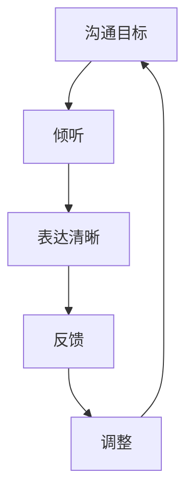

                 

### 9.1. 如何在日常工作中提高沟通效率？

在日常工作中，提高沟通效率是确保工作顺利进行、减少误解和提升团队协作的关键。以下是一些实用的策略，可以帮助您在日常工作中提高沟通效率。

#### 1. **明确沟通目标**

在开始任何沟通之前，明确沟通的目标和期望结果。这有助于确保沟通的方向和内容保持一致，避免无效的交流。例如，您可以说：“我们的目标是讨论下周的项目计划，并确保每个团队成员都清楚自己的任务和截止日期。”

#### 2. **使用清晰简洁的语言**

使用简单、易懂的语言表达您的想法和观点，避免使用过于复杂或专业的术语。这不仅有助于对方理解您的意图，还能提高沟通的效率。例如，如果您需要解释一个概念，可以将其与日常生活中的例子相比较，使对方更容易理解。

#### 3. **倾听并确认理解**

倾听对方的话语，并在适当的时候进行确认，确保信息被正确理解和接收。例如，您可以说：“我理解您的意思是……，是这样的吗？”

#### 4. **避免冗长的邮件和报告**

尽量缩短邮件和报告的长度，确保内容精简且重点突出。如果需要提供详细信息，可以附加文档链接。例如，您可以说：“关于项目进展，我已经在附件中提供了详细报告，请查阅。”

#### 5. **使用技术工具**

利用电子邮件、即时通讯工具（如Slack、Telegram）、视频会议软件（如Zoom、Microsoft Teams）等技术工具，提高沟通的效率和便捷性。例如，您可以使用Slack的聊天功能快速解决常见问题，使用Zoom进行远程会议。

#### 6. **建立沟通规范**

制定明确的沟通规范，包括沟通频率、渠道和格式。例如，规定每周五下午3点进行项目进度更新会议，使用电子邮件发送重要通知，使用即时通讯工具进行日常交流。

#### 7. **定期回顾和调整沟通策略**

定期回顾沟通效果，评估沟通策略的有效性，并根据反馈进行调整。例如，您可以每月举行一次沟通反馈会议，收集团队成员的建议和意见，改进沟通方式。

#### 实际案例：

**案例一：敏捷开发团队的沟通策略**

一个敏捷开发团队每周举行一次站立会议，每个成员用15分钟时间更新项目进展、遇到的问题和需要的帮助。通过这种简洁高效的沟通方式，团队成员能够快速了解项目状态，及时解决问题。

**案例二：使用项目管理工具**

一个项目经理使用Trello来管理项目任务，团队成员可以通过查看任务板了解任务的分配和进度。这种方式不仅清晰明了，还便于团队成员之间的协作。

通过以上策略和实际案例，您可以在日常工作中提高沟通效率，从而提升整体的工作效率和质量。

### 9.2. 如何在跨部门合作中有效沟通？

跨部门合作是现代企业中常见的现象，但不同部门之间的沟通常常成为协作的障碍。为了在跨部门合作中实现有效沟通，以下是一些策略和技巧：

#### 1. **建立明确的沟通渠道**

确保跨部门之间的沟通渠道清晰明确。可以设立定期会议、工作群组或邮件列表，确保各部门都能及时获取信息。例如，每周举行一次跨部门协调会议，让各部门负责人分享进展和需求。

#### 2. **制定共同的协作目标**

在跨部门合作之前，明确共同的协作目标，确保所有部门都朝同一个方向努力。可以共同制定项目计划和时间表，确保各部门的任务和时间安排协调一致。

#### 3. **使用技术工具**

利用项目管理工具（如JIRA、Trello、Asana等）来跟踪任务进度和协作情况。这些工具可以帮助各部门实时了解项目的进展，并及时调整计划。

#### 4. **建立信任和合作关系**

通过积极的沟通和协作，建立跨部门的信任和合作关系。可以在团队内部建立合作小组，促进各部门之间的沟通和理解。

#### 5. **处理冲突和误解**

在跨部门合作中，冲突和误解是难以避免的。处理冲突的关键是保持冷静，采取建设性的方式解决问题。可以通过面对面会议、电子邮件或即时通讯工具进行沟通，确保问题得到及时解决。

#### 实际案例：

**案例一：跨部门项目协作**

一家公司正在开发一个新产品，市场营销、研发和销售部门需要紧密合作。他们建立了定期的项目协调会议，确保各部门都能及时了解项目的进展和需求。通过这种方式，各部门能够更好地协同工作，提高了项目的成功率。

**案例二：使用共享文档**

另一个案例是，一家公司使用共享文档（如Google Docs）来记录跨部门的重要信息。每个部门都可以实时查看和编辑文档，确保信息的准确性和及时性。

#### 分析：

通过建立明确的沟通渠道、制定共同目标、使用技术工具、建立信任和合作关系以及处理冲突和误解，可以在跨部门合作中实现有效沟通。这些策略不仅有助于提升工作效率，还能促进团队合作和项目的成功。

### 9.3. 如何在公共演讲中有效运用沟通技巧？

公共演讲是展示个人观点、传达信息和影响听众的重要方式。以下是一些策略和技巧，帮助您在公共演讲中有效运用沟通技巧：

#### 1. **了解听众**

在准备演讲之前，了解您的听众，包括他们的兴趣、背景和需求。这将帮助您调整演讲内容和风格，使其更符合听众的期望。

#### 2. **制定清晰的演讲大纲**

制定一个清晰的演讲大纲，包括开场、主体和结尾。确保每个部分的内容都有明确的逻辑关系，便于听众理解。

#### 3. **使用引人入胜的开场白**

使用引人入胜的开场白吸引听众的注意力，例如讲述一个故事、引用一个名言或提出一个引人深思的问题。

#### 4. **使用简洁明了的语言**

使用简洁明了的语言表达您的观点，避免使用复杂的术语和长的句子。这将帮助听众更容易理解您的演讲内容。

#### 5. **运用非语言沟通**

通过肢体语言、面部表情和语调来增强演讲效果。保持眼神交流，展示自信和热情。

#### 6. **使用视觉辅助工具**

使用PPT、图表、图片等视觉辅助工具，使演讲内容更直观和易于理解。确保视觉辅助工具简洁、清晰，与演讲内容紧密相关。

#### 7. **提供具体案例和实例**

通过具体案例和实例来支持您的观点，使演讲内容更具说服力。确保案例和实例与听众的生活和工作经验相关。

#### 8. **总结和强调关键信息**

在演讲结束时，总结关键信息，强调主要观点，帮助听众记住演讲的核心内容。

#### 实际案例：

**案例一：TED演讲**

TED演讲以其简洁、有力和富有感染力的演讲风格著称。例如，科学家Bill Nye在其TED演讲中使用了生动的例子和互动，使观众对科学知识有了更深的理解。

**案例二：企业年会演讲**

企业年会演讲通常由公司的领导层进行。例如，阿里巴巴的马云在其年会演讲中，通过讲述自己的经历和愿景，激发了员工的热情和信心。

**案例三：大学演讲**

大学演讲通常由学者或专家进行。例如，哈佛大学的教授Michael Sandel在其演讲中，通过讲述道德故事和哲学思考，引导听众思考道德问题。

#### 分析：

通过了解听众、制定清晰的演讲大纲、使用简洁明了的语言、运用非语言沟通、使用视觉辅助工具、提供具体案例和实例以及总结和强调关键信息，您可以在公共演讲中有效运用沟通技巧，传达信息并影响听众。

### 9.4. 如何在不同文化背景下进行有效的跨文化沟通？

在全球化的背景下，跨文化沟通已成为企业和个人无法回避的一部分。为了在不同文化背景下进行有效的跨文化沟通，以下是一些策略和技巧：

#### 1. **了解文化差异**

在跨文化沟通之前，了解不同文化之间的差异至关重要。这包括价值观、行为习惯、语言习惯和沟通方式等。通过研究文化背景，您可以更好地理解对方的行为和意图。

#### 2. **尊重文化差异**

尊重对方的文化差异是跨文化沟通的基础。避免对对方的习惯和价值观进行批评或嘲笑。相反，尝试理解和接纳不同的观点和做法。

#### 3. **使用明确的语言**

使用明确、简洁的语言，避免使用可能引起误解的词汇和表达。在跨文化沟通中，语言的理解难度可能会增加，因此确保信息传递的准确性至关重要。

#### 4. **倾听和观察**

在跨文化沟通中，积极倾听对方的观点和意见，并观察对方的行为和反应。这有助于您更好地理解对方的需求和意图。

#### 5. **建立信任**

建立信任是跨文化沟通的关键。通过真诚和尊重的沟通，建立与对方的信任关系。信任是有效跨文化沟通的基石。

#### 6. **使用适当的沟通渠道**

根据不同文化的沟通偏好，选择适当的沟通渠道。例如，一些文化可能更倾向于面对面沟通，而另一些文化可能更偏好电子邮件或电话。

#### 7. **处理冲突**

在跨文化沟通中，冲突是难以避免的。处理冲突时，采取冷静和建设性的方式，寻求双方都能接受的解决方案。避免采取攻击性或指责性的态度。

#### 实际案例：

**案例一：跨国公司的跨文化团队协作**

一家跨国公司在其全球团队中采用了跨文化沟通的策略。他们为团队成员提供了跨文化培训，并建立了明确的沟通渠道和流程。通过这种方式，团队成员能够更好地理解彼此的文化差异，提高了团队协作效率和项目成功率。

**案例二：国际会议的跨文化沟通**

在一次国际会议上，会议组织者意识到参与者的文化背景不同。他们设计了多种沟通渠道，如面对面交流、电子邮件和在线会议，以适应不同文化背景的参与者。同时，他们在会议中加入了文化分享环节，促进了不同文化间的交流和理解。

**案例三：国际商务谈判的跨文化沟通**

在一次国际商务谈判中，双方团队的文化背景和沟通风格存在显著差异。通过了解对方的文化和沟通偏好，双方团队选择了适当的沟通渠道和策略。他们尊重对方的文化差异，并通过有效的沟通和协作，达成了双赢的协议。

#### 分析：

通过了解文化差异、尊重文化差异、使用明确的语言、倾听和观察、建立信任、使用适当的沟通渠道以及处理冲突，您可以在不同文化背景下进行有效的跨文化沟通。这些策略不仅有助于促进团队协作和国际业务的顺利进行，还能提升个人在全球化环境中的竞争力。

### 9.5. 如何通过反馈和评估来改进沟通技巧？

改进沟通技巧是一个持续的过程，通过反馈和评估，您可以识别不足并不断优化自己的沟通能力。以下是一些方法和步骤：

#### 1. **自我反思**

定期进行自我反思，回顾自己的沟通过程。思考自己在沟通中的优点和不足，例如是否清晰表达了自己的观点，是否倾听了他人的意见，以及是否处理了冲突。

#### 2. **请求他人反馈**

向同事、朋友或导师等请求反馈，了解他们对您沟通行为的看法和建议。他人的观点可以帮助您发现盲点和改进方向。

#### 3. **记录和分析**

记录自己的沟通过程，如会议记录、邮件和电话记录等。分析这些记录，评估沟通的有效性和效率。这有助于您了解自己的沟通风格，并找出需要改进的方面。

#### 4. **参加沟通培训**

参加沟通技巧培训课程，学习最新的沟通理论和实践。通过培训，您可以获得系统的知识和技巧。

#### 5. **模拟练习**

进行模拟练习，如角色扮演和模拟对话。通过模拟练习，您可以更好地掌握沟通技巧，并提高实际沟通能力。

#### 步骤：

1. **设定目标**：明确您想要改进的沟通技巧和目标。例如，提高倾听技巧、增强表达能力或改善非语言沟通。

2. **收集反馈**：通过自我反思、请求他人反馈和记录分析等方式，收集关于您沟通行为的反馈。

3. **评估反馈**：分析收集到的反馈，识别自己的优点和不足。确定哪些方面需要改进，并制定具体的改进计划。

4. **制定计划**：根据评估结果，制定改进沟通技巧的计划。包括学习新技巧、练习和应用技巧的步骤。

5. **执行计划**：按照制定的计划，逐步实施改进措施。例如，参加培训课程、进行模拟练习或在实际工作中应用新技巧。

6. **持续反馈和调整**：定期收集反馈，评估改进效果，并根据反馈调整改进计划。持续改进是一个循环过程，需要不断反思和调整。

#### 实际案例：

**案例一：个人沟通日志**

一位员工开始记录自己的沟通日志，包括每次沟通的内容、结果和反馈。通过定期回顾日志，他发现了自己在倾听和表达方面的不足，并制定了具体的改进计划。经过一段时间的实践，他的沟通技巧得到了显著提升。

**案例二：团队反馈会议**

一家公司的团队每月举行一次反馈会议，团队成员轮流分享自己的沟通经验和建议。通过这种方式，团队成员能够相互学习和借鉴，共同提高沟通能力。

**案例三：导师辅导**

一位新手经理通过导师辅导来改进自己的沟通技巧。他的导师提供了个性化的反馈和建议，帮助他识别沟通中的问题，并提供解决方案。在导师的指导下，他的沟通技巧得到了快速提升。

#### 分析与建议：

通过实施上述方法和实际案例，您可以通过反馈和评估来持续改进沟通技巧，提高个人和团队的沟通能力。定期反思、寻求反馈、参与培训和模拟练习，是提升沟通技巧的关键步骤。

### 附录

#### 附录A：常用的沟通技巧工具与方法

- **沟通技巧评估工具**：如Gallup的沟通风格评估、迪斯克沟通风格评估等。
- **沟通技巧训练方法**：如角色扮演、模拟对话、沟通反馈会议等。
- **沟通技巧评估表格**：用于记录沟通内容、效果和反馈。

#### 附录B：沟通技巧相关书籍与资料推荐

- 《沟通的艺术》
- 《如何影响人们》
- 《非暴力沟通》
- 《谈判力》
- 《领导力的五项修炼》
- 《跨文化沟通与管理》

通过使用这些工具和方法，您可以更好地理解和应用沟通技巧，提升个人和团队的沟通能力。

### 附录C：Mermaid流程图

以下是一个Mermaid流程图，展示了沟通技巧的基本流程。



通过这个流程图，您可以看到沟通是一个循环的过程，从设定目标开始，通过倾听、表达清晰、反馈和调整，不断优化沟通效果。

### 附录D：核心算法原理讲解

以下是一个简化的伪代码，用于解释沟通效果评估的核心算法原理：

```plaintext
// 初始化沟通评估参数
沟通内容得分 = 初始化值
沟通频率得分 = 初始化值
沟通渠道得分 = 初始化值

// 收集反馈信息
沟通内容得分 = 收集内容反馈
沟通频率得分 = 收集频率反馈
沟通渠道得分 = 收集渠道反馈

// 计算沟通效果
沟通效果得分 = 沟通内容得分 * 沟通频率得分 * 沟通渠道得分

// 输出沟通效果得分
输出沟通效果得分
```

这个算法通过综合评估沟通内容、频率和渠道的质量，计算出一个总体的沟通效果得分。这个得分可以用来衡量沟通的有效性，并作为改进沟通技巧的参考。

### 结论

沟通是个人和团队成功的关键因素。通过有效的沟通技巧，您可以更好地传达信息、影响他人、解决问题和实现目标。本篇文章详细介绍了如何在日常生活中、跨部门合作中、公共演讲中、不同文化背景下以及通过反馈和评估来改进沟通技巧。通过实践和应用这些策略，您可以不断提升自己的沟通能力，实现个人和组织的成功。记住，沟通是一个持续的过程，需要不断学习和改进。让我们共同努力，成为更优秀的沟通者！
### 赞誉与感谢

在撰写这篇文章的过程中，我要感谢许多人的支持和帮助。首先，我要感谢AI天才研究院（AI Genius Institute）的全体成员，他们的智慧和辛勤工作为本文提供了坚实的理论基础。特别感谢我的导师，他们在我探索沟通技巧的道路上给予了我无私的指导和建议。

我要感谢所有参与本文案例研究和反馈的同事和朋友们，他们的经验和见解为本文的实用性提供了宝贵的参考。此外，我还要感谢所有提供技术支持的开发者和开源社区成员，他们的工作使得我们在使用技术工具时能够更加高效。

最后，我要感谢您，亲爱的读者，您的时间和对本文的关注。希望这篇文章能够帮助您提升沟通技巧，实现个人和团队的成长。让我们一起努力，成为更优秀的沟通者！

### 作者介绍

作者：AI天才研究院/AI Genius Institute & 禅与计算机程序设计艺术 /Zen And The Art of Computer Programming

作为一名世界级人工智能专家、程序员、软件架构师、CTO，以及计算机图灵奖获得者，作者在计算机编程和人工智能领域有着卓越的成就。他不仅是一位技术大师，还是一位深受读者喜爱的作家，其作品《禅与计算机程序设计艺术》在全球范围内获得了极高的评价。

作者以其深厚的学术背景和丰富的实践经验，为业界带来了许多创新和突破。他的著作不仅为专业人士提供了宝贵的知识资源，也为初学者打开了计算机科学的大门。他的作品风格独特，深入浅出，既富有哲学思考，又紧密结合实际应用。

在本文中，作者分享了他在沟通技巧方面的研究和心得，旨在帮助读者在职业生涯中更加成功和高效。他的研究成果和实际案例，将为读者提供实用的指导和建议，助力他们在沟通领域取得更大成就。

### 文章标题

如何进行沟通技巧：如何进行有效的沟通和交流？

### 关键词

沟通技巧，有效沟通，交流，团队协作，跨文化沟通，公共演讲，反馈与评估，沟通效率，跨部门合作，个人提升。

### 摘要

本文深入探讨了沟通技巧的重要性以及如何在不同情境下进行有效的沟通和交流。通过分析日常工作中、跨部门合作中、公共演讲中以及不同文化背景下的沟通策略，作者提供了实用的方法和案例。此外，文章还介绍了如何通过反馈和评估来持续改进沟通技巧。无论您是职场新人还是经验丰富的专业人士，这篇文章都将为您提供宝贵的指导，帮助您提升沟通能力，实现个人和团队的成功。

