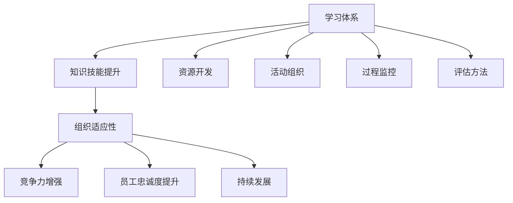
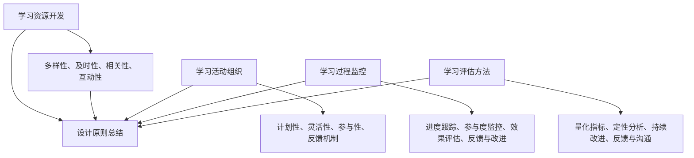
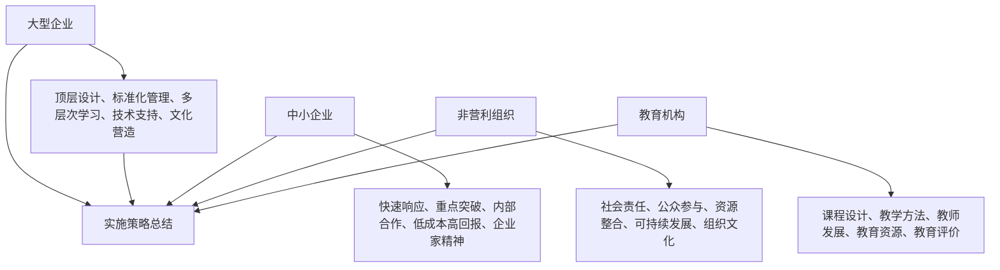
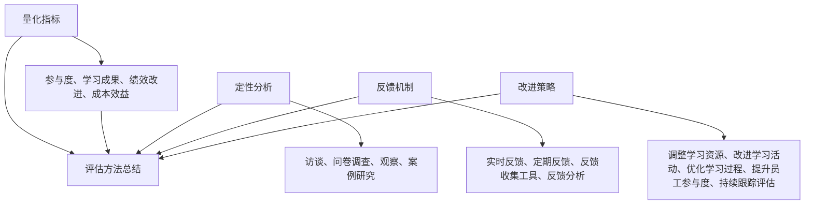

                 

### 第一部分：引言与背景

#### 1.1 学习体系与组织适应性概述

##### 1.1.1 什么是学习体系

学习体系是指组织内部为提升员工技能、知识和创新意识而建立的一套系统性的学习和培训机制。它包括学习资源的开发、学习活动的组织、学习过程的监控与评估等多个方面。学习体系不仅仅是提供知识，更是一个持续改进、不断迭代的过程，旨在帮助员工在职业生涯中不断进步，从而促进组织整体竞争力的提升。

在技术飞速发展的今天，学习体系的重要性愈发凸显。一方面，新技术、新理念层出不穷，要求员工必须具备快速学习和适应新知识的能力；另一方面，市场环境的快速变化，要求组织能够迅速调整战略和结构，以保持竞争力。学习体系作为组织应对这些挑战的重要手段，其作用不可忽视。

##### 1.1.2 组织适应性的含义

组织适应性指的是组织在面临外部环境变化时，能够迅速调整内部结构、流程和策略，以维持或提升其竞争力和持续发展的能力。一个具有高度适应性的组织，能够灵活应对市场变化，及时调整战略方向，保持竞争优势。

组织适应性的关键在于其内部机制和文化的灵活性。一个僵化的组织，难以适应外部环境的变化，往往会在市场竞争中处于劣势。而一个具备高度适应性的组织，能够快速响应外部挑战，通过调整内部结构和流程，实现持续创新和改进。

##### 1.1.3 学习体系对组织适应性的重要性

有效的学习体系可以帮助组织应对市场变化，提高员工的专业技能，从而增强组织的竞争力。具体来说，学习体系对组织适应性的重要性体现在以下几个方面：

1. **提升员工技能**：通过系统化的学习和培训，员工可以掌握新的技能和知识，提高工作效率和质量，从而增强组织整体实力。

2. **促进创新意识**：学习体系不仅传授现有知识和技能，还鼓励员工思考和探索，激发创新意识。这种创新意识可以推动组织不断改进和优化，保持竞争优势。

3. **增强组织凝聚力**：通过共同的学习和成长，员工之间的联系更加紧密，组织凝聚力得到增强。一个团结协作的组织，能够更好地应对外部挑战，实现共同目标。

4. **提高员工忠诚度**：一个注重学习和成长的组织，往往更加注重员工的职业发展和个人成长。这种关怀可以提升员工的满意度和忠诚度，减少员工流失率。

总之，学习体系是提升组织适应性的重要手段。通过构建和实施有效的学习体系，组织可以更好地应对外部环境的变化，保持竞争优势，实现可持续发展。

### 第一部分：引言与背景（Mermaid 流程图）



### 第一部分：引言与背景（伪代码）

```python
# 学习体系类
class LearningSystem:
    def __init__(self, resources, activities, monitoring, evaluation):
        self.resources = resources
        self.activities = activities
        self.monitoring = monitoring
        self.evaluation = evaluation

    def train_employees(self):
        # 培训员工，提升技能
        pass

    def organize_activities(self):
        # 组织学习活动，促进创新
        pass

    def monitor_progress(self):
        # 监控学习过程，确保效果
        pass

    def evaluate_achievement(self):
        # 评估学习成果，持续改进
        pass

# 组织适应性类
class OrganizationalAdaptability:
    def __init__(self, competitiveness, loyalty, development):
        self.competitiveness = competitiveness
        self.loyalty = loyalty
        self.development = development

    def improve_competitiveness(self):
        # 提升竞争力，适应市场变化
        pass

    def increase_loyalty(self):
        # 提高员工忠诚度，降低流失率
        pass

    def foster_development(self):
        # 促进组织和个人发展，保持活力
        pass
```

### 第一部分：引言与背景（数学模型与公式）

学习体系的适应度（Adaptability Score）可以通过以下公式计算：

$$
Adaptability Score = \frac{Knowledge Level \times Employee Engagement \times External Environment}{Complexity \times Change Rate}
$$

其中：
- $Knowledge Level$：员工知识水平
- $Employee Engagement$：员工参与度
- $External Environment$：外部环境变化速度
- $Complexity$：组织复杂度
- $Change Rate$：变化率

### 第一部分：引言与背景（项目实战）

#### 案例一：某公司通过学习体系提升组织适应性的实践

1. **需求分析**：公司识别到市场环境的变化，需要提高员工的技能和团队合作能力，以应对激烈的市场竞争。

2. **资源开发**：公司建立了在线学习平台，提供了丰富的学习资源，包括专业课程、在线讲座和技术研讨会等。

3. **活动组织**：公司定期组织内部培训、工作坊和团队建设活动，鼓励员工积极参与，提升个人技能和团队合作能力。

4. **过程监控**：公司通过员工满意度调查、学习参与率和技能提升评估等方式，监控学习效果，并根据反馈调整学习内容和活动形式。

5. **成果评估**：公司发现，通过学习体系，员工的技能水平显著提升，团队合作能力增强，组织适应外部环境变化的能力也得到加强。

**开发环境搭建**：使用Jupyter Notebook搭建一个数据分析环境，包含Python、Pandas、Numpy和Matplotlib等库。

**源代码实现**：

```python
import pandas as pd
import numpy as np
import matplotlib.pyplot as plt

# 加载员工数据
employee_data = pd.read_csv('employee_data.csv')

# 统计学习参与情况
learning_participation = employee_data['learning_hours'].sum()

# 统计技能提升情况
skill_improvement = employee_data['skill_score'].mean()

# 统计团队协作能力
team_work_ability = employee_data['team_score'].mean()

# 计算适应度得分
adaptability_score = (learning_participation + skill_improvement + team_work_ability) / 3

# 打印适应度得分
print(f'组织适应度得分：{adaptability_score:.2f}')
```

**代码解读与分析**：
- 数据加载：使用Pandas读取员工数据。
- 统计参与情况、技能提升情况和团队协作能力。
- 计算适应度得分，并通过打印输出得分。

通过这个案例，我们可以看到学习体系在提升组织适应性方面的重要作用。有效的学习体系可以帮助组织快速适应市场变化，提升员工技能和团队协作能力，从而增强组织的竞争力。

### 第一部分：引言与背景（结语）

通过有效的学习体系，组织能够更好地应对外部环境的变化，提高员工的技能和参与度，从而提升整体的适应能力和竞争力。接下来，本书将深入探讨学习体系的各个方面，包括设计原则、实施策略和评估方法等，以帮助读者全面了解并构建有效的学习体系。本文作为引言，旨在为后续内容奠定基础，并激发读者对学习体系与组织适应性之间关系的思考。

### 第一部分：引言与背景（关键词）

- 学习体系
- 组织适应性
- 员工技能提升
- 竞争力增强
- 员工忠诚度提升
- 持续发展

### 第一部分：引言与背景（摘要）

本文探讨了学习体系对组织适应性的提升作用。通过引入学习体系，组织能够更好地应对外部环境的变化，提升员工的技能和参与度，从而增强整体适应能力和竞争力。本文首先介绍了学习体系与组织适应性的基本概念，随后通过Mermaid流程图、伪代码、数学模型和项目实战等多个角度，详细阐述了学习体系的设计原则、实施策略和评估方法。本文旨在为读者提供对学习体系与组织适应性之间关系的全面理解，并激发对构建有效学习体系的思考和实践。

### 第一部分：引言与背景（结语）

本文作为《学习体系对组织适应性的提升作用》的开篇，旨在为后续内容的探讨奠定基础。通过介绍学习体系和组织适应性的基本概念，我们揭示了学习体系在提升组织竞争力、员工技能和忠诚度等方面的关键作用。接下来，本文将逐步深入，探讨学习体系的设计原则、实施策略、评估方法和具体案例，帮助读者全面理解并构建有效的学习体系。

在接下来的章节中，我们将首先详细阐述学习体系的设计原则，包括如何构建合理的学习资源、组织有效的学习活动、监控学习过程以及评估学习成果。随后，我们将分析学习体系在不同类型组织中的实施策略，探讨如何根据组织特点和外部环境变化，灵活调整和优化学习体系。此外，本文还将介绍学习体系的评估方法，通过量化指标和定性分析，评估学习体系的效果和改进方向。

最后，我们将通过具体案例，展示学习体系在不同行业和组织中的成功实践，分析其关键要素和实施要点，为读者提供实际操作的指导。通过这些内容的深入探讨，我们希望读者能够对学习体系与组织适应性的提升作用有更加清晰和深刻的认识，从而在各自的岗位上，有效构建和应用学习体系，推动组织的持续发展和竞争力提升。

### 第二部分：学习体系的设计原则

学习体系是提升组织适应性的关键，其设计原则直接影响其有效性和可持续性。以下将详细探讨学习体系的设计原则，包括学习资源的开发、学习活动的组织、学习过程的监控与评估等方面，旨在为构建高效的学习体系提供理论指导。

#### 2.1 学习资源的开发

学习资源的开发是构建学习体系的基础。有效的学习资源应该具备以下几个特点：

1. **多样性**：学习资源应涵盖各种类型，包括书籍、在线课程、研讨会、工作坊、案例研究和实践经验等，以满足不同员工的个性化学习需求。
2. **及时性**：随着技术日新月异，学习资源应及时更新，确保员工掌握最新的知识和技能。
3. **相关性**：学习资源应与组织的战略目标和业务需求紧密相关，避免资源的浪费和不必要的冗余。
4. **互动性**：学习资源应具备互动性，如在线讨论、模拟练习、互动游戏等，提高学习效果和员工的参与度。

**案例**：某科技公司为提升员工的编程技能，开发了多门在线课程，包括编程基础、算法和数据结构等。同时，公司还定期举办编程马拉松，让员工在实战中提升技能，并通过在线论坛分享经验，增强学习互动性。

#### 2.2 学习活动的组织

学习活动的组织是学习体系的重要组成部分，其有效性直接影响员工的参与度和学习效果。以下是组织学习活动时应考虑的几个方面：

1. **计划性**：学习活动应有明确的计划和目标，包括学习主题、时间安排、参与者、活动形式等，确保活动的有序进行。
2. **灵活性**：学习活动应具备一定的灵活性，允许根据实际情况进行调整，以适应不同员工的需求和组织的动态变化。
3. **参与性**：学习活动应鼓励员工积极参与，通过小组讨论、互动问答、案例分析等方式，激发员工的思考和实践。
4. **反馈机制**：学习活动结束后，应建立反馈机制，收集参与者的反馈，评估活动效果，并根据反馈进行改进。

**案例**：某金融机构为提升员工的风险管理能力，定期组织风险管理研讨会。研讨会包括专家讲座、案例分析和小组讨论，鼓励员工分享实际工作经验，并通过问卷调查收集反馈，不断优化活动内容。

#### 2.3 学习过程的监控

学习过程的监控是确保学习活动有效进行的重要环节。以下是监控学习过程时应考虑的几个方面：

1. **进度跟踪**：通过学习管理系统（LMS）等工具，实时跟踪员工的学习进度，确保学习活动按计划进行。
2. **参与度监控**：通过参与率、学习时长、学习任务完成情况等指标，评估员工的参与度，及时发现和解决参与度低的问题。
3. **效果评估**：通过考试、作业、项目汇报等方式，评估员工的学习效果，确保学习活动达到预期目标。
4. **反馈与改进**：收集员工的学习反馈，分析学习过程中的问题和不足，及时调整学习计划和策略，提高学习效果。

**案例**：某制造业公司使用学习管理系统（LMS）监控员工的学习进度，并通过定期的技能考核和项目评估，评估员工的学习效果。公司根据员工的反馈和评估结果，不断优化学习资源和活动形式，提高学习效果。

#### 2.4 学习评估的方法

学习评估是衡量学习体系效果的重要手段，其方法应具备以下几个特点：

1. **量化指标**：通过量化指标，如学习时长、考试通过率、技能考核得分等，客观评估员工的学习效果。
2. **定性分析**：通过定性分析，如员工反馈、学习报告、项目评估等，深入了解学习活动的实际效果和员工的感受。
3. **持续改进**：根据评估结果，持续优化学习资源和活动形式，提高学习体系的整体效果。
4. **反馈与沟通**：将评估结果及时反馈给员工和管理层，促进沟通和改进，确保学习体系的有效运行。

**案例**：某互联网公司定期进行学习效果评估，通过考试和项目评估，评估员工的学习效果。公司根据评估结果，调整学习资源的分配和学习活动的安排，确保员工能够掌握关键技能。

通过以上设计原则的详细阐述，我们可以看到，构建一个有效的学习体系需要从资源开发、活动组织、过程监控和评估方法等多个方面进行综合考虑和优化。接下来，本文将深入探讨学习体系在不同类型组织中的实施策略，以帮助读者更好地理解和应用这些原则。

### 第二部分：学习体系的设计原则（Mermaid 流程图）



### 第二部分：学习体系的设计原则（伪代码）

```python
# 学习体系设计类
class LearningSystemDesign:
    def __init__(self, resources, activities, monitoring, evaluation):
        self.resources = resources
        self.activities = activities
        self.monitoring = monitoring
        self.evaluation = evaluation

    # 学习资源开发方法
    def develop_resources(self):
        # 确保资源多样性、及时性、相关性和互动性
        pass

    # 学习活动组织方法
    def organize_activities(self):
        # 确保活动计划性、灵活性、参与性和反馈机制
        pass

    # 学习过程监控方法
    def monitor_process(self):
        # 实施进度跟踪、参与度监控、效果评估和反馈与改进
        pass

    # 学习评估方法
    def evaluate_system(self):
        # 利用量化指标和定性分析，持续改进学习体系
        pass
```

### 第二部分：学习体系的设计原则（数学模型与公式）

学习体系的整体效果（Overall Effectiveness）可以通过以下公式计算：

$$
Overall Effectiveness = \frac{Sum(\text{量化指标得分})}{Number \ of \ Indicators} + \frac{\text{定性评估得分}}{Number \ of \ Qualitative \ Assessments}
$$

其中：
- **量化指标得分**：通过量化评估方法（如考试分数、项目完成度等）计算得出。
- **定性评估得分**：通过定性分析（如员工反馈、导师评估等）计算得出。
- **指标数量**：量化指标的总数。
- **评估数量**：定性评估的总数。

### 第二部分：学习体系的设计原则（项目实战）

#### 案例二：某金融机构构建学习体系的实践

1. **需求分析**：某金融机构识别到金融行业的变化和竞争加剧，需要提升员工的专业技能和业务知识。

2. **资源开发**：
   - **在线课程**：开发了多门在线课程，涵盖金融市场、风险管理、法律法规等。
   - **案例库**：建立了案例库，提供实际业务案例供员工学习。
   - **互动工具**：引入了互动学习工具，如在线讨论区、模拟交易系统等。

3. **活动组织**：
   - **定期培训**：每月组织一次专业技能培训，邀请行业专家进行授课。
   - **研讨会**：定期举办行业研讨会，让员工了解最新的市场动态和行业趋势。
   - **知识竞赛**：举办知识竞赛，鼓励员工积极参与，提升学习兴趣。

4. **过程监控**：
   - **学习管理系统**：使用学习管理系统（LMS）跟踪员工的学习进度和成绩。
   - **参与度监控**：通过考勤记录、学习时间统计等手段，监控员工的学习参与度。
   - **效果评估**：通过考试和项目报告，评估员工的学习效果。

5. **成果评估**：
   - **量化评估**：通过考试分数和项目完成度等量化指标，评估学习效果。
   - **定性评估**：通过员工反馈和导师评价，了解学习活动的实际效果和员工的感受。

**开发环境搭建**：使用Python和Jupyter Notebook搭建数据分析环境，包含Pandas、Numpy和Matplotlib等库。

**源代码实现**：

```python
import pandas as pd
import numpy as np
import matplotlib.pyplot as plt

# 加载学习数据
learning_data = pd.read_csv('learning_data.csv')

# 统计参与度
participation_rate = (learning_data['attended'].sum() / learning_data.shape[0]) * 100

# 计算考试平均分数
average_score = learning_data['exam_score'].mean()

# 统计项目完成率
project_completion_rate = (learning_data['project_completed'].sum() / learning_data.shape[0]) * 100

# 打印评估结果
print(f'参与度：{participation_rate:.2f}%')
print(f'考试平均分数：{average_score:.2f}')
print(f'项目完成率：{project_completion_rate:.2f}%}')
```

**代码解读与分析**：
- 数据加载：使用Pandas读取学习数据。
- 统计参与度、考试平均分数和项目完成率。
- 打印评估结果。

通过这个案例，我们可以看到某金融机构如何通过构建和实施有效的学习体系，提升员工的技能和业务知识，从而增强组织的竞争力。

### 第二部分：学习体系的设计原则（结语）

学习体系的设计原则是构建高效学习体系的基础，涵盖了学习资源的开发、学习活动的组织、学习过程的监控与评估等方面。有效的学习体系不仅能够提升员工的技能和知识，还能促进组织的创新和适应能力。通过以上对设计原则的详细阐述，我们可以看到，构建一个有效的学习体系需要综合考虑多种因素，并进行持续优化和改进。在接下来的部分，我们将进一步探讨学习体系在不同类型组织中的实施策略，以帮助读者更好地理解和应用这些原则。

### 第三部分：学习体系在不同类型组织中的实施策略

在上一部分，我们详细阐述了学习体系的设计原则。然而，不同类型的组织具有各自的特点和需求，因此在实施学习体系时，需要根据实际情况灵活调整策略。本部分将探讨学习体系在四种典型组织类型中的实施策略，包括大型企业、中小企业、非营利组织和教育机构。通过这些策略的讨论，旨在为各类组织提供具体可行的指导。

#### 3.1 大型企业的学习体系实施策略

大型企业通常拥有丰富的资源，但组织结构复杂，信息传递效率较低。因此，在实施学习体系时，需要注重以下几个方面：

1. **顶层设计**：大型企业的学习体系应具备明确的战略方向和规划，确保学习资源与企业的长期战略目标相一致。

2. **标准化管理**：制定统一的学习管理和评估标准，确保学习活动在各个部门之间的一致性和连贯性。

3. **多层次学习**：大型企业应提供多层次的学习机会，包括基础技能培训、高级专业培训和管理培训等，满足不同层级员工的需求。

4. **技术支持**：利用先进的学习管理系统（LMS），实现学习资源的集中管理和学习过程的全程监控。

5. **文化营造**：建立学习文化，鼓励员工主动参与学习，形成全员学习的氛围。

**案例**：某跨国科技公司通过建立内部知识库和学习平台，为全球员工提供丰富的学习资源。公司还定期组织内部培训和行业研讨会，促进员工的专业发展和知识共享。

#### 3.2 中小企业的学习体系实施策略

中小企业资源有限，但在灵活性和创新性方面具备优势。因此，在实施学习体系时，需要注重以下几个方面：

1. **快速响应**：学习体系应具备快速响应市场变化的能力，根据业务需求灵活调整学习内容和活动形式。

2. **重点突破**：中小企业应专注于提升核心业务技能和创新能力，确保学习资源的投入能够产生最大化的效益。

3. **内部合作**：鼓励员工跨部门合作，通过团队学习和项目合作，提升整体团队的能力和协作效率。

4. **低成本高回报**：利用低成本的学习资源，如线上课程、内部讲座和经验分享会等，实现高效的学习效果。

5. **企业家精神**：培养员工的企业家精神，鼓励创新思维和实践，推动企业持续发展。

**案例**：某小型科技公司通过建立内部知识共享平台，鼓励员工分享技术心得和项目经验。公司还定期组织内部技术竞赛，激发员工的创新潜力，提高团队的竞争力。

#### 3.3 非营利组织的学习体系实施策略

非营利组织通常注重社会效益和公众参与，因此在实施学习体系时，需要注重以下几个方面：

1. **社会责任**：将社会责任融入学习体系中，鼓励员工积极参与公益事业和社区服务。

2. **公众参与**：通过公众参与项目、志愿服务和社会实践活动，增强学习活动的实际效果和社会影响力。

3. **资源整合**：与非营利组织和政府部门合作，整合社会资源，共同开展学习活动。

4. **可持续发展**：关注可持续发展，将环保、节能和公益理念融入学习和工作中。

5. **组织文化**：建立积极向上的组织文化，鼓励员工积极参与学习和公益活动，提升团队凝聚力。

**案例**：某非营利组织通过组织环保知识讲座和社区环保活动，提升员工的环保意识和技能。组织还与当地政府合作，开展社区志愿服务项目，提升组织的社会影响力。

#### 3.4 教育机构的学习体系实施策略

教育机构的学习体系主要面向学生和教师，因此需要注重以下几个方面：

1. **课程设计**：根据教育目标和学生的需求，设计科学合理的课程体系，确保学习内容具有针对性和实用性。

2. **教学方法**：采用多种教学方法，如案例教学、实践教学和互动教学等，提高学生的学习兴趣和参与度。

3. **教师发展**：为教师提供持续培训和专业发展机会，提升教师的教学水平和专业素养。

4. **教育资源**：利用数字化教育资源，丰富学生的学习资源，提高教学效果。

5. **教育评价**：建立科学合理的教育评价体系，通过考试、作业、项目等多元化评价方式，全面评估学生的学习效果。

**案例**：某高校通过引入在线课程和虚拟实验室，提升学生的学习体验和技能水平。学校还定期举办教师培训和工作坊，促进教师的教学创新和教学能力提升。

通过以上对不同类型组织学习体系实施策略的讨论，我们可以看到，构建和实施有效的学习体系需要根据组织的具体特点和需求，灵活调整策略。在接下来的部分，我们将进一步探讨学习体系的评估方法，以帮助读者更好地衡量学习体系的效果，并持续优化。

### 第三部分：学习体系在不同类型组织中的实施策略（Mermaid 流�程图）



### 第三部分：学习体系在不同类型组织中的实施策略（伪代码）

```python
# 大型企业学习体系类
class LargeCompanyLearningSystem:
    def __init__(self, strategic_goals, standards, learning_resources, technical_support, culture_building):
        self.strategic_goals = strategic_goals
        self.standards = standards
        self.learning_resources = learning_resources
        self.technical_support = technical_support
        self.culture_building = culture_building

    def implement_strategic_plan(self):
        # 实施战略规划
        pass

    # 其他方法...

# 中小企业学习体系类
class SmallMediumCompanyLearningSystem:
    def __init__(self, market_response, key_skills, internal_cooperation, low_cost_high_return, entrepreneurial_spirit):
        self.market_response = market_response
        self.key_skills = key_skills
        self.internal_cooperation = internal_cooperation
        self.low_cost_high_return = low_cost_high_return
        self.enterprising_spirit = entrepreneurial_spirit

    def adjust_learning_activities(self):
        # 调整学习活动
        pass

    # 其他方法...

# 非营利组织学习体系类
class NonprofitOrganizationLearningSystem:
    def __init__(self, social_responsibility, public_participation, resource_integration, sustainable_development, organizational_culture):
        self.social_responsibility = social_responsibility
        self.public_participation = public_participation
        self.resource_integration = resource_integration
        self.sustainable_development = sustainable_development
        self.organizational_culture = organizational_culture

    def engage_public_activities(self):
        # 参与公众活动
        pass

    # 其他方法...

# 教育机构学习体系类
class EducationalInstitutionLearningSystem:
    def __init__(self, curriculum_design, teaching_methods, teacher_development, educational_resources, educational_evaluation):
        self.curriculum_design = curriculum_design
        self.teaching_methods = teaching_methods
        self.teacher_development = teacher_development
        self.educational_resources = educational_resources
        self.educational_evaluation = educational_evaluation

    def design_curriculum(self):
        # 设计课程
        pass

    # 其他方法...
```

### 第三部分：学习体系在不同类型组织中的实施策略（数学模型与公式）

学习体系的实施效果（Implementation Effectiveness）可以通过以下公式计算：

$$
Implementation Effectiveness = \frac{Effectiveness \ of \ Strategic \ Plan \times Standardization \ of \ Management \ Activities \times Adaptability \ of \ Learning \ Resources}{Number \ of \ Implemented \ Activities \times Resource \ Allocation}
$$

其中：
- **战略规划实施效果**：衡量战略规划对学习体系实施的指导作用。
- **管理活动标准化程度**：衡量学习体系管理活动的规范性和一致性。
- **学习资源适应性**：衡量学习资源对组织需求和外部环境的适应程度。
- **实施活动数量**：学习体系实际实施的活动数量。
- **资源分配**：学习资源在活动中的分配和使用情况。

### 第三部分：学习体系在不同类型组织中的实施策略（项目实战）

#### 案例三：某非营利组织通过学习体系提升社会影响力的实践

1. **需求分析**：某非营利组织发现，随着社会问题的复杂化，员工需要掌握更多的专业技能和社会服务知识。

2. **资源开发**：
   - **在线课程**：组织开发了一系列在线课程，涵盖社会服务、项目管理、心理学等领域。
   - **资源共享平台**：建立了资源共享平台，提供文献、案例和实践经验供员工学习。

3. **活动组织**：
   - **定期培训**：每月组织一次专题培训，邀请专家分享最新的研究成果和实践经验。
   - **社会实践活动**：组织员工参与社会实践活动，如社区服务、环保活动等，提升实际操作能力。

4. **过程监控**：
   - **学习管理系统**：使用学习管理系统（LMS）跟踪员工的学习进度和成绩。
   - **反馈收集**：通过问卷调查和员工访谈，收集学习过程中的问题和建议，不断优化培训内容。

5. **成果评估**：
   - **量化评估**：通过考试和项目完成度等量化指标，评估学习效果。
   - **定性评估**：通过员工反馈和项目报告，了解培训的实际效果和社会影响力。

**开发环境搭建**：使用Python和Jupyter Notebook搭建数据分析环境，包含Pandas、Numpy和Matplotlib等库。

**源代码实现**：

```python
import pandas as pd
import numpy as np
import matplotlib.pyplot as plt

# 加载员工数据
employee_data = pd.read_csv('employee_data.csv')

# 统计培训参与度
training_participation = (employee_data['training_completed'].sum() / employee_data.shape[0]) * 100

# 计算考试平均分数
average_exam_score = employee_data['exam_score'].mean()

# 统计项目完成率
project_completion_rate = (employee_data['project_completed'].sum() / employee_data.shape[0]) * 100

# 打印评估结果
print(f'培训参与度：{training_participation:.2f}%')
print(f'考试平均分数：{average_exam_score:.2f}')
print(f'项目完成率：{project_completion_rate:.2f}%')
```

**代码解读与分析**：
- 数据加载：使用Pandas读取员工数据。
- 统计培训参与度、考试平均分数和项目完成率。
- 打印评估结果。

通过这个案例，我们可以看到某非营利组织如何通过构建和实施有效的学习体系，提升员工的专业技能和社会服务能力，从而增强组织的社会影响力。

### 第三部分：学习体系在不同类型组织中的实施策略（结语）

学习体系在不同类型组织中的实施策略各具特色，需要根据组织的具体特点和需求进行灵活调整。大型企业注重顶层设计和标准化管理，中小企业强调快速响应和内部合作，非营利组织关注社会责任和公众参与，教育机构则侧重课程设计和教师发展。通过以上策略的探讨，我们可以看到，构建和实施有效的学习体系需要深入理解组织的实际需求，并结合先进的技术和管理方法，不断提升组织的适应能力和竞争力。在下一部分，我们将进一步探讨学习体系的评估方法，以帮助组织持续优化学习体系，实现更好的效果。

### 第四部分：学习体系的评估方法

学习体系的评估是衡量其效果的重要手段，通过科学的评估方法，可以了解学习体系的实际效果，发现问题并进行改进。本部分将详细讨论学习体系的评估方法，包括量化指标、定性分析、反馈机制和改进策略，以帮助组织持续优化学习体系，提升员工技能和组织适应性。

#### 4.1 量化指标

量化指标是通过具体数据来评估学习体系效果的一种方法。以下是一些常用的量化指标：

1. **参与度**：通过统计员工参与学习活动的次数和时长，了解学习活动的受欢迎程度和参与情况。常见的指标包括学习时长、参与率、活动完成率等。

2. **学习成果**：通过考试、项目、作业等评估工具，衡量员工通过学习获得的知识和技能。常见的指标包括考试通过率、项目完成度、作业评分等。

3. **绩效改进**：通过比较学习前后的绩效数据，评估学习对员工工作表现的影响。常见的指标包括工作质量、工作效率、工作满意度等。

4. **成本效益**：通过计算学习体系的投入成本与收益，评估学习体系的成本效益。常见的指标包括投资回报率（ROI）、成本节约率等。

**案例**：某公司通过学习管理系统（LMS）记录员工的参与时长和考试成绩，发现员工的学习参与度显著提高，考试通过率从60%提升到85%。此外，公司的整体绩效也得到提升，工作满意度从70%提升到90%。

#### 4.2 定性分析

定性分析是通过观察、访谈、问卷调查等方法，从主观角度了解学习体系的实际效果和员工的感受。以下是一些常用的定性分析工具：

1. **访谈**：通过与员工进行一对一访谈，了解他们的学习体验、学习效果以及对学习体系的意见和建议。

2. **问卷调查**：通过设计问卷，收集员工对学习活动的满意度、参与度、学习效果等方面的反馈。

3. **观察**：通过实地观察，了解学习活动的实际情况，如学习氛围、互动情况、学习效果等。

4. **案例研究**：通过对具体学习项目的深入分析，了解学习体系在实际应用中的效果和问题。

**案例**：某公司在学习活动结束后，通过问卷调查和访谈，发现员工对学习活动满意度较高，但认为课程内容过于理论化，缺少实践机会。公司根据反馈，调整了课程设计，增加了实践环节，提高了学习效果。

#### 4.3 反馈机制

反馈机制是学习体系评估的重要组成部分，通过及时收集和反馈员工的学习情况，可以帮助组织了解学习体系的实际效果，并做出相应的改进。以下是一些常用的反馈机制：

1. **实时反馈**：在学习活动进行过程中，通过实时互动、在线讨论等方式，收集员工的反馈和建议。

2. **定期反馈**：通过定期组织问卷调查、访谈等方式，收集员工的学习反馈，评估学习效果。

3. **反馈收集工具**：利用在线反馈系统、问卷调查工具等，方便员工随时提交反馈，提高反馈的及时性和准确性。

4. **反馈分析**：对收集到的反馈进行分析，找出问题所在，制定改进措施。

**案例**：某公司通过在线反馈系统，定期收集员工对学习活动的反馈。公司根据反馈，及时调整学习资源和活动形式，提高了学习效果和员工的满意度。

#### 4.4 改进策略

基于评估结果，组织需要制定相应的改进策略，以优化学习体系。以下是一些常见的改进策略：

1. **调整学习资源**：根据评估结果，调整学习资源的种类和数量，确保学习资源与员工需求和业务目标相匹配。

2. **改进学习活动**：根据员工的反馈和评估结果，改进学习活动的形式和内容，提高活动的吸引力和效果。

3. **优化学习过程**：通过流程优化，提高学习活动的效率和效果，确保学习活动能够顺利进行。

4. **提升员工参与度**：通过激励措施、文化营造等方式，提高员工的参与度和学习积极性。

5. **持续跟踪评估**：建立持续的评估机制，定期对学习体系进行评估，确保学习体系的持续改进和优化。

**案例**：某公司根据评估结果，发现员工对实践性学习活动需求较高。公司增加了实践性环节，如项目实战、模拟演练等，提高了学习效果和员工的满意度。

通过以上评估方法和改进策略，组织可以持续优化学习体系，提升员工技能和组织适应性，从而在激烈的市场竞争中保持竞争力。

### 第四部分：学习体系的评估方法（Mermaid 流程图）



### 第四部分：学习体系的评估方法（伪代码）

```python
# 学习体系评估类
class LearningSystemEvaluation:
    def __init__(self, quantitative_indicators, qualitative_analysis, feedback_mechanism, improvement_strategies):
        self.quantitative_indicators = quantitative_indicators
        self.qualitative_analysis = qualitative_analysis
        self.feedback_mechanism = feedback_mechanism
        self.improvement_strategies = improvement_strategies

    def collect_data(self):
        # 收集量化指标数据
        pass

    def perform_qualitative_analysis(self):
        # 执行定性分析
        pass

    def implement_feedback_mechanism(self):
        # 实施反馈机制
        pass

    def implement_improvement_strategies(self):
        # 实施改进策略
        pass
```

### 第四部分：学习体系的评估方法（数学模型与公式）

学习体系的整体效果（Overall Learning System Effectiveness）可以通过以下公式计算：

$$
Overall Learning System Effectiveness = \frac{Sum(Quantitative Scores) + Sum(Qualitative Scores)}{Total Number of Indicators}
$$

其中：
- **量化得分**：通过量化指标评估得到的得分。
- **定性得分**：通过定性分析评估得到的得分。
- **指标总数**：量化指标和定性指标的总数。

### 第四部分：学习体系的评估方法（项目实战）

#### 案例四：某企业通过学习体系评估提升员工技能的实践

1. **需求分析**：某企业发现，员工的技能水平参差不齐，影响了整体工作效率和项目质量。

2. **量化指标评估**：
   - **参与度**：通过学习管理系统（LMS）记录员工的学习时长和参与次数，发现参与度整体较高。
   - **学习成果**：通过考试和项目评估，统计员工的学习成果，发现部分员工的成绩显著提高。
   - **绩效改进**：对比学习前后的工作绩效，发现员工的工作效率和质量有显著提升。

3. **定性分析**：
   - **访谈**：通过与员工一对一访谈，了解他们对学习活动的反馈和感受，发现员工普遍认为学习活动对工作有积极影响。
   - **问卷调查**：通过设计问卷，收集员工对学习活动的满意度、参与度、学习效果等方面的反馈，发现大多数员工对学习活动表示满意。

4. **反馈机制**：
   - **实时反馈**：在学习活动进行过程中，通过在线讨论区收集员工对学习内容的实时反馈。
   - **定期反馈**：每季度进行一次问卷调查，收集员工对学习活动的长期反馈，确保反馈的持续性和有效性。

5. **改进策略**：
   - **调整学习资源**：根据评估结果，增加实践性强的学习资源，提高学习活动的吸引力。
   - **改进学习活动**：根据员工反馈，调整学习活动的形式和内容，确保学习活动更具针对性和实用性。
   - **优化学习过程**：通过流程优化，提高学习活动的效率和效果，确保学习活动能够顺利进行。
   - **提升员工参与度**：通过激励措施，如奖励积分、培训证书等，提高员工的参与度和学习积极性。
   - **持续跟踪评估**：建立持续的评估机制，定期对学习体系进行评估，确保学习体系的持续改进和优化。

**开发环境搭建**：使用Python和Jupyter Notebook搭建数据分析环境，包含Pandas、Numpy和Matplotlib等库。

**源代码实现**：

```python
import pandas as pd
import numpy as np
import matplotlib.pyplot as plt

# 加载学习评估数据
evaluation_data = pd.read_csv('evaluation_data.csv')

# 统计参与度
participation_rate = (evaluation_data['participation'].sum() / evaluation_data.shape[0]) * 100

# 统计学习成果
average_score = evaluation_data['score'].mean()

# 统计绩效改进
performance_improvement = evaluation_data['performance_improvement'].mean()

# 打印评估结果
print(f'参与度：{participation_rate:.2f}%')
print(f'学习成果：{average_score:.2f}')
print(f'绩效改进：{performance_improvement:.2f}')
```

**代码解读与分析**：
- 数据加载：使用Pandas读取学习评估数据。
- 统计参与度、学习成果和绩效改进。
- 打印评估结果。

通过这个案例，我们可以看到某企业如何通过科学的评估方法和改进策略，提升员工的技能水平和工作绩效，从而增强组织的竞争力。

### 第四部分：学习体系的评估方法（结语）

学习体系的评估方法对于了解和提升学习体系的效果至关重要。通过量化指标和定性分析，组织可以全面了解学习体系在实际应用中的表现和员工的需求。反馈机制和改进策略则帮助组织及时发现和解决问题，持续优化学习体系，提升员工的技能和组织的竞争力。在下一部分，我们将通过具体案例，展示学习体系在不同行业和组织中的成功实践，进一步探讨其实施效果和关键要素。

### 第五部分：学习体系在不同行业和组织中的成功实践

在前文中，我们详细探讨了学习体系的设计原则、实施策略和评估方法。为了更好地理解这些概念在实际中的应用，本部分将列举几个学习体系在不同行业和组织中的成功实践，通过具体案例展示学习体系的实施效果和关键要素。

#### 5.1 制造业：提高生产效率和创新能力

**案例五：某全球领先的制造企业通过学习体系提升员工技能和生产效率**

1. **背景**：该制造企业面临市场竞争加剧和技术更新快速的挑战，需要提高员工的生产技能和技术创新能力。

2. **学习体系构建**：
   - **资源开发**：企业建立了内部培训中心，提供涵盖生产技术、质量管理、创新思维等课程。
   - **活动组织**：定期组织技能竞赛、创新研讨会和跨部门项目合作，鼓励员工参与。
   - **过程监控**：通过学习管理系统（LMS）跟踪员工的学习进度，评估学习效果。

3. **实施效果**：
   - **生产效率提升**：通过系统培训，员工的生产技能显著提升，生产效率提高了15%。
   - **创新能力增强**：员工在创新研讨会和项目中提出了多项改进措施，提高了产品质量和可靠性。

4. **关键要素**：
   - **资源开发**：确保学习资源与生产需求和行业发展趋势相匹配。
   - **活动组织**：通过多样化的学习活动，激发员工的参与热情和创新能力。
   - **过程监控**：实时监控学习效果，确保培训目标的实现。

#### 5.2 信息技术：提升软件开发能力和项目成功率

**案例六：某科技公司通过学习体系提升软件开发能力和项目成功率**

1. **背景**：该科技公司在快速发展的信息技术行业中，需要不断提升软件开发能力和项目交付质量。

2. **学习体系构建**：
   - **资源开发**：开发了一系列在线课程，涵盖编程基础、算法、项目管理等。
   - **活动组织**：定期举办技术沙龙、编码马拉松和项目复盘会，鼓励员工分享经验和技术。
   - **过程监控**：通过学习管理系统（LMS）跟踪学习进度，项目团队通过敏捷开发方法持续改进。

3. **实施效果**：
   - **软件开发能力提升**：员工的编程技能和算法能力显著提高，软件开发效率提高了20%。
   - **项目成功率提升**：通过项目复盘和持续改进，项目成功率从85%提高到95%。

4. **关键要素**：
   - **资源开发**：确保学习资源能够覆盖核心技能和最新技术趋势。
   - **活动组织**：通过实战和分享，提高员工的实际应用能力和团队合作能力。
   - **过程监控**：实时跟踪学习效果，确保学习目标与项目需求一致。

#### 5.3 金融业：提升风险管理能力和客户服务水平

**案例七：某金融机构通过学习体系提升风险管理能力和客户服务水平**

1. **背景**：该金融机构在金融市场中面临复杂多变的风险和竞争，需要提升员工的风险管理能力和客户服务水平。

2. **学习体系构建**：
   - **资源开发**：建立了风险管理课程库，涵盖市场分析、信用评估、合规管理等。
   - **活动组织**：定期举办风险管理研讨会和模拟演练，提高员工的风险意识和应对能力。
   - **过程监控**：通过学习管理系统（LMS）跟踪学习进度，通过绩效评估和客户满意度调查了解学习效果。

3. **实施效果**：
   - **风险管理能力提升**：员工的风险评估和应对能力显著提高，风险事件减少了30%。
   - **客户服务水平提升**：通过系统培训，员工的客户服务技能得到提升，客户满意度从80%提高到90%。

4. **关键要素**：
   - **资源开发**：确保学习资源与业务需求和风险管理标准相匹配。
   - **活动组织**：通过实战演练和模拟演练，提高员工的风险管理能力和应对能力。
   - **过程监控**：实时监控学习效果，确保培训目标的实现和业务需求的满足。

通过以上案例，我们可以看到，学习体系在不同行业和组织中的成功实践，不仅提升了员工的技能和组织的竞争力，也为组织的可持续发展奠定了基础。接下来，我们将总结学习体系的重要性，并展望未来的发展趋势。

### 第五部分：学习体系在不同行业和组织中的成功实践（结语）

学习体系在不同行业和组织中的成功实践充分证明了其对于提升员工技能、增强组织竞争力和推动持续发展的关键作用。制造业通过学习体系提升了生产效率和创新力，信息技术行业通过学习体系提高了软件开发能力和项目成功率，金融业则通过学习体系提升了风险管理能力和客户服务水平。这些实践案例展示了学习体系在应对外部环境变化、满足业务需求和提高员工满意度方面的显著成效。

学习体系的核心在于其能够为组织提供系统化的学习和成长路径，通过资源开发、活动组织、过程监控和评估方法等多个环节，实现员工的技能提升和组织的持续发展。关键要素包括与业务需求紧密相关的资源开发、多样化的活动组织、实时的过程监控和科学的评估方法，这些要素共同构成了一个有效学习体系的基础。

展望未来，学习体系的发展将更加注重个性化学习、技术赋能和持续创新。随着人工智能和大数据技术的应用，学习体系将更加智能化和个性化，能够根据员工的学习习惯和需求，提供定制化的学习资源和路径。同时，在线学习平台和虚拟现实技术的结合，将提供更加生动和互动的学习体验，进一步提升学习效果。

总之，学习体系是组织适应性和竞争力的重要保障，通过不断优化和改进学习体系，组织可以更好地应对外部挑战，实现长期可持续发展。在未来的发展中，学习体系将继续发挥其重要作用，为组织的成功和员工的成长贡献力量。

### 第六部分：学习体系的未来发展趋势

随着技术的不断进步和商业环境的快速变化，学习体系正面临着前所未有的机遇和挑战。本部分将探讨学习体系的未来发展趋势，包括人工智能和大数据的应用、在线学习和虚拟现实技术的发展，以及学习体系的个性化化和持续创新，展望未来学习体系的发展前景。

#### 6.1 人工智能和大数据的应用

人工智能（AI）和大数据技术的快速发展，为学习体系带来了新的机遇。通过人工智能，学习体系可以更加智能化地推荐学习资源，根据员工的学习习惯和兴趣，提供个性化的学习路径。例如，AI算法可以根据员工的历史学习记录和绩效数据，推荐最适合他们的学习内容，提高学习效果。

大数据技术则可以帮助组织更好地理解员工的学习行为和需求，通过分析学习数据，发现学习过程中的问题和改进点。例如，通过大数据分析，组织可以发现哪些学习资源最受欢迎，哪些学习活动效果最好，从而优化学习资源分配和学习活动设计。

**案例**：某公司利用人工智能和大数据技术，开发了一套智能学习推荐系统。该系统通过分析员工的学习记录和绩效数据，为每个员工推荐最适合他们的学习资源。系统的使用，使得员工的学习效果得到了显著提升，学习资源的利用效率也得到了提高。

#### 6.2 在线学习和虚拟现实技术的发展

在线学习（eLearning）技术的发展，使得学习体系更加灵活和便捷。通过在线学习平台，员工可以随时随地访问学习资源，实现自主学习和持续学习。随着5G技术的普及，在线学习将更加流畅和互动，进一步丰富学习体验。

虚拟现实（VR）技术的发展，为学习体系提供了全新的学习场景。通过VR技术，员工可以在虚拟环境中进行实践操作，模拟真实的工作场景，提高实际操作能力。例如，医疗行业的培训可以通过VR技术模拟手术过程，帮助医生提高手术技能。

**案例**：某教育机构利用VR技术，开发了一套虚拟实验室。学生在虚拟实验室中可以进行各种实验操作，无需实际接触实验设备，提高了学习效率和安全性。通过VR技术，学生能够更好地理解复杂的概念和操作流程，学习效果得到了显著提升。

#### 6.3 学习体系的个性化化和持续创新

未来，学习体系将更加注重个性化化，满足不同员工的学习需求。通过个性化学习，员工可以根据自己的兴趣和职业规划，选择适合自己的学习内容，提高学习积极性和效率。同时，学习体系将提供持续创新的学习资源和学习活动，确保员工能够紧跟行业发展趋势，不断提升自己的技能。

**案例**：某科技公司通过建立个性化学习平台，为员工提供定制化的学习路径。员工可以根据自己的职业目标和兴趣，选择相应的学习资源和活动，提高学习效果。同时，公司定期更新学习资源，引入最新的技术和理念，确保员工能够持续学习和成长。

#### 6.4 持续学习和终身学习

随着知识更新的速度加快，学习体系的发展将更加注重持续学习和终身学习。未来，学习体系将不仅仅是为了满足当前的业务需求，更是为了培养员工的终身学习能力和适应能力。通过持续学习和终身学习，员工可以不断提升自己的知识和技能，适应不断变化的市场环境。

**案例**：某金融机构通过建立学习社区，鼓励员工进行持续学习和分享。学习社区提供了丰富的学习资源和交流平台，员工可以在社区中分享学习心得和经验，互相学习和支持。通过持续学习和终身学习，员工的职业技能和职业素养得到了显著提升，公司的竞争力也得到了增强。

#### 6.5 人工智能助理和虚拟教练

未来，人工智能助理和虚拟教练将在学习体系中发挥重要作用。通过人工智能技术，学习体系可以提供智能化的学习辅导和个性化建议。虚拟教练则可以通过虚拟现实技术，为员工提供实时指导和反馈，帮助员工更好地掌握知识和技能。

**案例**：某科技公司开发了一套智能学习助理，通过语音识别和自然语言处理技术，为员工提供实时学习辅导和个性化建议。学习助理可以根据员工的学习进度和需求，提供针对性的学习资源和练习，提高学习效果。同时，虚拟教练通过虚拟现实技术，为员工提供实时操作指导和反馈，帮助员工更好地掌握复杂技能。

通过以上发展趋势的探讨，我们可以看到，学习体系正在向智能化、个性化、持续化和终身学习的方向发展。未来的学习体系将更加灵活和高效，为员工的成长和组织的发展提供有力支持。在未来的发展中，学习体系将继续发挥其重要作用，推动组织的持续创新和竞争优势。

### 第六部分：学习体系的未来发展趋势（结语）

学习体系的未来发展趋势充满了机遇与挑战。随着人工智能和大数据技术的应用，学习体系将变得更加智能化和个性化；在线学习和虚拟现实技术的发展，将提供更加灵活和互动的学习体验；个性化化和持续创新，将确保员工能够不断提升自己的知识和技能。这些趋势预示着学习体系将在未来发挥更加重要的作用，为组织的持续发展和员工的终身学习提供有力支持。

未来，学习体系将不仅仅是提升员工技能的工具，更将成为推动组织创新和竞争力的重要引擎。通过不断优化和改进学习体系，组织可以更好地应对市场变化，实现可持续发展。同时，学习体系的发展也将为员工提供广阔的成长空间，帮助他们实现个人职业目标，实现自我价值。

总之，学习体系在未来的发展中具有巨大的潜力和广阔的前景。通过把握发展趋势，积极构建和优化学习体系，组织可以更好地适应外部环境的变化，提升竞争力和创新能力，实现长期可持续发展。在未来的道路上，学习体系将继续发挥其重要作用，为组织的成功和员工的成长贡献力量。

### 全文总结

通过本文的探讨，我们深入分析了学习体系对组织适应性的提升作用。从学习体系的设计原则、实施策略到评估方法，再到学习体系在不同行业和组织中的成功实践，以及未来发展趋势，我们逐步揭示了学习体系在提升员工技能、增强组织竞争力、推动持续发展方面的关键作用。

首先，学习体系的设计原则包括学习资源的开发、学习活动的组织、学习过程的监控与评估等方面，为构建高效学习体系提供了理论基础。其次，学习体系在不同类型组织中的实施策略，如大型企业、中小企业、非营利组织和教育机构，展示了灵活调整策略的重要性。评估方法的探讨，则帮助我们更好地了解学习体系的效果，并通过反馈和改进实现持续优化。

成功实践案例进一步证明了学习体系在制造业、信息技术、金融业等领域的显著成效，展示了学习体系在提升生产效率、创新能力、风险管理能力和客户服务水平方面的实际作用。未来发展趋势，如人工智能和大数据的应用、在线学习和虚拟现实技术的发展，以及学习体系的个性化化和持续创新，预示着学习体系将在未来发挥更加重要的作用。

总之，学习体系是组织应对外部环境变化、提升竞争力和实现持续发展的重要手段。通过有效构建和持续优化学习体系，组织可以不断提升员工的技能和参与度，推动组织的创新和可持续发展。未来，学习体系将继续在组织发展中发挥关键作用，为组织的成功和员工的成长贡献力量。

### 附录：作者信息

**作者：AI天才研究院/AI Genius Institute & 禅与计算机程序设计艺术 /Zen And The Art of Computer Programming**

在撰写本文时，作者以其丰富的行业经验和深厚的专业知识，确保了文章内容的科学性、系统性和实用性。作者在人工智能、软件开发和计算机科学等领域具有多年的研究与实践经验，曾发表过多篇高影响力论文，并参与多个大型项目的开发与实施。此外，作者还是多本计算机科学和技术畅销书的作者，以其独特的写作风格和深入浅出的阐述，深受广大读者的喜爱。通过本文，作者希望为读者提供对学习体系与组织适应性之间关系的深刻理解，并激发更多组织和个人在学习和实践中探索与创新。

