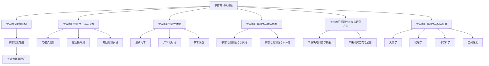

                 

# 宇宙的可观测性与其本质的关系

## 关键词
宇宙学、可观测性、量子力学、广义相对论、数学模型、观测技术、宇宙演化、科学哲学

## 摘要
本文旨在探讨宇宙的可观测性及其背后的本质关系。我们将从宇宙的可观测性概述开始，逐步深入分析宇宙的可观测性与量子力学、广义相对论、数学模型等之间的关系，并探讨其在哲学思考中的意义。最后，我们将展望宇宙的可观测性在未来的研究方向及其在科学技术中的应用。通过这一系列的分析和思考，我们希望对宇宙的可观测性有更深入的理解。

### 第一部分：宇宙的可观测性概述

#### 第1章：宇宙的可观测性基础

##### 1.1 宇宙的可观测性简介

宇宙的可观测性指的是从地球上或通过观测设备能够观测到的宇宙部分。它涉及到宇宙的可探测性和宇宙学原理。宇宙的可探测性是指我们可以观测到的宇宙范围，而宇宙学原理则为我们提供了观测宇宙的基础。

宇宙的可观测性与科学探索有着密切的关系。它为科学提供了观测和验证理论的手段，同时也是科学进步的动力之一。例如，宇宙背景辐射的发现不仅揭示了宇宙早期的状态，还支持了大爆炸理论。

宇宙的可观测性对哲学也产生了深远的影响。它引发了关于知识的本质和宇宙本质的思考。例如，宇宙的可观测性是否意味着宇宙是可知的呢？这为哲学上的认识论和本体论问题提供了新的思考角度。

##### 1.2 宇宙的尺度和结构

宇宙的尺度可以分为大尺度和小尺度。大尺度结构包括星系、星系团和超星系团等，这些结构构成了宇宙的宏观图像。小尺度结构则包括原子、分子、恒星和行星等，这些结构构成了宇宙的微观世界。

宇宙的大尺度结构可以通过望远镜观测得到。例如，哈勃望远镜拍摄到的宇宙图像揭示了宇宙的膨胀和星系的演化。小尺度结构则可以通过实验观测得到。例如，通过光谱分析可以了解恒星和行星的组成和性质。

##### 1.3 宇宙背景辐射

宇宙背景辐射是宇宙早期状态的残迹，它遍布整个宇宙，是宇宙学中非常重要的观测对象。1948年，伽莫夫等人预言了宇宙背景辐射的存在，1965年，彭齐亚斯和威尔逊通过观测证实了宇宙背景辐射的存在。

宇宙背景辐射的性质包括其微波频段、黑体辐射谱和均匀性等。它为我们提供了宇宙早期的信息，例如宇宙的温度、密度和结构等。

##### 1.4 可观测宇宙的历史与演化

可观测宇宙的历史可以追溯到宇宙大爆炸之后的一瞬间。在大爆炸之后，宇宙经历了快速膨胀和冷却，形成了物质的基本结构。随着宇宙的演化，恒星和星系逐渐形成，最终形成了我们今天所见的宇宙结构。

生命的起源和演化也是宇宙演化的重要组成部分。从原始生命到复杂生命的演化，生命的出现和演化对宇宙的演化产生了深远的影响。

#### 第2章：宇宙的可观测性方法与技术

##### 2.1 电磁波观测

电磁波是宇宙中最常见的辐射形式，包括无线电波、微波、红外线、可见光、紫外线、X射线和伽马射线等。电磁波观测是宇宙学中最重要的观测手段之一。

电磁波观测的工具包括望远镜、射电望远镜和红外望远镜等。望远镜用于观测可见光波段，射电望远镜用于观测无线电波波段，红外望远镜用于观测红外线波段。

电磁波观测的应用非常广泛，包括对恒星、星系、星系团和宇宙背景辐射的观测。

##### 2.2 望远镜观测

望远镜是观测宇宙的重要工具。望远镜的基本原理是通过透镜或反射镜聚焦光线，从而放大远处的物体。

望远镜的类型包括光学望远镜、射电望远镜和红外望远镜等。光学望远镜主要用于观测可见光波段，射电望远镜主要用于观测无线电波波段，红外望远镜主要用于观测红外线波段。

望远镜的发展趋势包括更大规模、更高分辨率和更多波段观测能力。例如，哈勃望远镜和詹姆斯·韦伯空间望远镜就是两个典型的例子。

##### 2.3 其他观测手段

除了电磁波观测，宇宙学中还有其他一些重要的观测手段，包括中子星与黑洞观测、星际介质与星系团观测、宇宙射线与引力波观测等。

中子星和黑洞是宇宙中最极端的天体，通过观测这些天体，我们可以了解宇宙的极端环境和物理过程。

星际介质和星系团是宇宙中的基本结构，通过观测这些结构，我们可以了解宇宙的演化和结构形成。

宇宙射线和引力波是宇宙中的两种重要的物理现象，通过观测这些现象，我们可以深入了解宇宙的物理性质和演化过程。

##### 2.4 观测数据的处理与分析

观测数据的处理与分析是宇宙学研究中非常重要的环节。观测数据的收集与存储、数据预处理与校准、数据分析方法与应用都是观测数据处理与分析的关键步骤。

观测数据的收集与存储包括对观测数据的采集、存储和备份。数据预处理与校准包括对观测数据进行质量控制和数据校正。数据分析方法与应用包括对观测数据进行统计分析和模型拟合。

通过观测数据处理与分析，我们可以从大量的观测数据中提取出有用的信息，从而对宇宙的演化、结构和性质进行深入的研究。

### 第二部分：宇宙的可观测性本质

#### 第3章：宇宙的可观测性与量子力学

##### 3.1 量子力学的概念

量子力学是研究微观世界物理现象的理论，它揭示了微观粒子的行为规律。量子力学的基本原理包括量子态的叠加性、量子隧穿效应和量子纠缠等。

量子力学的数学描述包括薛定谔方程、海森堡矩阵力学和狄拉克量子力学等。这些数学描述为我们提供了研究微观粒子的工具。

量子力学的实验验证包括双缝实验、电子束散射实验和量子纠缠实验等。这些实验验证了量子力学理论的正确性。

##### 3.2 量子力学的宇宙观

量子力学对宇宙的可观测性产生了深远的影响。量子力学揭示了宇宙的微观结构和物理过程，例如，宇宙背景辐射中的量子涨落、黑洞的辐射等。

量子纠缠是量子力学的一个重要概念，它揭示了微观粒子之间的超距作用。量子纠缠对宇宙学产生了重要的影响，例如，它可能影响宇宙的演化过程和宇宙的可观测性。

量子力学对观测方法的挑战主要体现在如何将量子力学与观测实验相结合。例如，量子力学的哥本哈根解释提出了观测者在观测过程中的作用，这对传统观测方法提出了新的挑战。

##### 3.3 量子力学在宇宙学中的应用

量子力学在宇宙学中有着广泛的应用。例如，通过量子力学可以解释宇宙背景辐射中的量子涨落，这些涨落是宇宙早期结构的种子。

量子力学还可以用来研究黑洞的辐射。根据霍金辐射理论，黑洞会发出粒子辐射，这些辐射对宇宙的演化产生了重要的影响。

量子引力理论是量子力学在宇宙学中的另一个重要应用。量子引力理论试图将量子力学与广义相对论统一起来，从而为宇宙学提供一种统一的描述。

#### 第4章：宇宙的可观测性与广义相对论

##### 4.1 广义相对论的概念

广义相对论是研究引力现象的理论，它由爱因斯坦于1915年提出。广义相对论的基本原理包括等效原理和广义协变原理。

广义相对论的数学描述包括爱因斯坦场方程，这些方程描述了时空的几何结构和物质的分布。

广义相对论的实验验证包括水星轨道的修正、光线偏折实验和引力透镜效应等。这些实验验证了广义相对论理论的正确性。

##### 4.2 广义相对论与宇宙的可观测性

广义相对论对宇宙的可观测性产生了深远的影响。例如，广义相对论预言了引力波的存在，通过观测引力波，我们可以了解宇宙的极端物理现象。

广义相对论与宇宙膨胀有着密切的关系。根据广义相对论，宇宙的膨胀会导致宇宙尺度的增大，这意味着我们可以观测到更远的宇宙。

广义相对论对观测方法的启示主要体现在如何将引力效应与其他物理现象区分开来。例如，通过观测引力透镜效应，我们可以了解星系和星系团的结构。

##### 4.3 广义相对论在宇宙学中的应用

广义相对论在宇宙学中有着广泛的应用。例如，通过广义相对论可以解释宇宙背景辐射的起源和演化。

广义相对论还可以用来研究黑洞和星系的形成和演化。根据广义相对论，黑洞是宇宙中极端物质聚集的结果，通过观测黑洞，我们可以了解宇宙的极端物理现象。

广义相对论在宇宙学中的另一个重要应用是宇宙学原理和弗里德曼方程。宇宙学原理描述了宇宙的均匀性和各向同性，弗里德曼方程描述了宇宙的演化。

#### 第5章：宇宙的可观测性与数学模型

##### 5.1 数学模型在宇宙学中的应用

数学模型是宇宙学中重要的工具，它可以帮助我们理解宇宙的演化、结构和性质。宇宙学中的数学模型包括宇宙学基本方程、宇宙背景辐射模型和星系形成与演化模型等。

宇宙学基本方程描述了宇宙的演化过程，它包括了宇宙的膨胀、密度和压力等参数。宇宙背景辐射模型描述了宇宙早期的物理状态，它包括了温度、密度和波动等参数。

星系形成与演化模型描述了星系的形成和演化过程，它包括了星系的质量、密度和结构等参数。

##### 5.2 数学公式与宇宙学

宇宙学中的数学公式是描述宇宙演化的重要工具。其中最著名的公式之一是广义相对论的爱因斯坦场方程：

$$ G_{\mu\nu} + \Lambda g_{\mu\nu} = \frac{8\pi G}{c^4} T_{\mu\nu} $$

这个公式描述了时空的几何结构和物质的分布。另一个重要的公式是宇宙学原理和弗里德曼方程：

$$ \dot{H} + H^2 + \Omega_{\Lambda} = 0 $$

这个公式描述了宇宙的膨胀速度和密度参数。

##### 5.3 数学模型与观测数据

数学模型与观测数据之间有着密切的关系。通过观测数据的拟合与验证，我们可以确定宇宙学参数的值，从而验证或修正数学模型的预测。

宇宙学参数估计是宇宙学研究中的一个重要问题。通过使用最大似然估计或贝叶斯方法，我们可以从观测数据中估计出宇宙学参数的值。

观测限制与理论预测也是宇宙学研究中的一个重要问题。通过对比观测数据和理论预测，我们可以发现宇宙学中的问题，从而推动宇宙学理论的发展。

#### 第6章：宇宙的可观测性与哲学思考

##### 6.1 宇宙可观测性与认识论

宇宙的可观测性与认识论有着密切的关系。宇宙的可观测性决定了我们如何获取关于宇宙的知识。通过观测宇宙，我们可以获得关于宇宙的结构、演化和性质的信息。

宇宙的可观测性也提出了关于知识的本质和限度的思考。例如，我们能否通过观测完全了解宇宙？是否存在我们无法观测到的宇宙部分？

##### 6.2 宇宙可观测性与本体论

宇宙的可观测性与本体论也有着密切的关系。宇宙的可观测性决定了我们如何理解宇宙的本质和存在。例如，宇宙是否是客观存在的？我们的观测是否能够完全反映宇宙的真实状态？

宇宙的可观测性也提出了关于真实世界与观测世界之间差异的思考。例如，我们的观测是否能够完全揭示宇宙的真相？是否存在我们无法观测到的宇宙部分？

##### 6.3 宇宙可观测性与人类命运

宇宙的可观测性对人类命运产生了深远的影响。通过观测宇宙，我们可以了解宇宙的演化、结构和性质，从而为人类的发展提供指导。

宇宙的可观测性也提出了关于人类在宇宙中的地位和命运的思考。例如，宇宙的可观测性是否意味着宇宙是有意义的？人类在宇宙中的角色和使命是什么？

#### 第7章：宇宙的可观测性与未来研究方向

##### 7.1 未解决的问题与挑战

宇宙的可观测性仍然存在许多未解决的问题和挑战。例如，黑洞信息悖论、宇宙的起源与命运、观测限制与理论发展等。

黑洞信息悖论是量子力学与广义相对论的矛盾之一。根据量子力学，信息是不可丢失的，而根据广义相对论，黑洞中的信息会随着黑洞蒸发而消失。

宇宙的起源与命运是宇宙学中的核心问题之一。我们仍然不清楚宇宙是如何起源的，以及宇宙最终的命运是什么。

观测限制与理论发展也是宇宙学中的挑战之一。由于观测手段的限制，我们无法完全了解宇宙的所有部分。这要求我们发展新的理论和方法来突破这些限制。

##### 7.2 未来研究方向与展望

未来在宇宙的可观测性方面，我们将面临许多新的研究方向和挑战。例如，量子引力理论的发展、新观测手段和技术的应用、宇宙学与其他学科的交叉等。

量子引力理论是解决黑洞信息悖论等问题的关键。通过量子引力理论，我们有望更好地理解宇宙的极端物理现象。

新观测手段和技术的应用将进一步提高我们的观测能力。例如，更先进的望远镜和探测器将使我们能够观测到更远、更清晰的宇宙图像。

宇宙学与其他学科的交叉也将为宇宙的可观测性研究带来新的思路和方法。例如，宇宙学与天体物理学、地球科学和空间科学的交叉将有助于我们更全面地理解宇宙。

### 第三部分：宇宙的可观测性与科学应用

#### 第8章：宇宙的可观测性在科学技术中的应用

##### 8.1 宇宙学对天文学的影响

宇宙学对天文学有着深远的影响。通过宇宙学的理论和方法，天文学家可以更好地理解宇宙的结构和演化过程。例如，宇宙背景辐射的发现揭示了宇宙早期的状态，为大爆炸理论提供了重要的证据。

宇宙学还促进了天文学观测技术的发展。例如，为了观测宇宙背景辐射，科学家们发展了特殊的射电望远镜和红外望远镜。这些技术的发展不仅提升了我们的观测能力，也为天文学研究提供了更多的工具。

宇宙学对天文学研究的启示主要体现在如何从宏观角度理解天体的演化。通过宇宙学的研究，天文学家可以更好地理解恒星、星系和星系团的形成和演化过程。

##### 8.2 宇宙学对物理学的影响

宇宙学对物理学的发展产生了重要影响。宇宙学中的许多问题涉及到引力、量子力学和相对论等基本物理理论。例如，宇宙的膨胀和黑洞的研究需要深入理解引力现象，而宇宙背景辐射的量子涨落需要深入理解量子力学。

宇宙学还促进了物理学的交叉学科发展。例如，宇宙学与粒子物理学、凝聚态物理学和天体物理学等领域的交叉研究，为物理学的发展提供了新的视角和工具。

宇宙学对物理学理论的发展也提出了新的挑战。例如，量子引力理论需要解决黑洞信息悖论等基本问题，这要求物理学家提出新的理论和实验方法。

##### 8.3 宇宙学对地球科学的启示

宇宙学对地球科学也有着重要的启示。宇宙背景辐射的研究揭示了宇宙早期的物理状态，这对理解地球的地质演化过程有着重要的指导意义。例如，宇宙背景辐射中的温度波动可能影响了地球的气候变化和地球的形成。

宇宙学还促进了地球科学观测技术的发展。例如，通过观测宇宙射线和地球磁场，我们可以更好地理解地球的气候变化和地质过程。

宇宙学对地球科学的启示主要体现在如何从宇宙的角度理解地球的现象。通过宇宙学的研究，地球科学家可以更好地理解地球的演化过程和地球与宇宙的互动关系。

##### 8.4 宇宙学对空间探索的意义

宇宙学对空间探索有着深远的意义。通过宇宙学的理论和方法，我们可以更好地理解宇宙的结构和演化过程，从而为空间探索提供科学依据。

宇宙学促进了空间探索技术的发展。例如，为了观测宇宙背景辐射，科学家们发展了特殊的空间望远镜和探测器。这些技术的发展不仅提升了我们的观测能力，也为空间探索提供了更多的工具。

宇宙学对空间探索的启示主要体现在如何从宇宙的角度理解空间现象。通过宇宙学的研究，空间科学家可以更好地理解空间中的物理现象和空间环境。

在未来，随着宇宙学研究的深入，我们有望在空间探索中取得更多的突破。例如，通过宇宙背景辐射的观测，我们可以更好地了解宇宙的起源和演化，这将为空间探索提供新的方向和目标。

### 附录

#### 附录A：宇宙观测设备与技术

##### A.1 望远镜技术

望远镜是观测宇宙的重要工具。望远镜的基本原理是通过透镜或反射镜聚焦光线，从而放大远处的物体。望远镜的类型包括光学望远镜、射电望远镜和红外望远镜等。光学望远镜主要用于观测可见光波段，射电望远镜主要用于观测无线电波波段，红外望远镜主要用于观测红外线波段。

望远镜的发展历程可以追溯到古代。最早的望远镜是由伽利略在1609年发明的。自那以后，望远镜技术不断发展，现代望远镜具有更高的分辨率和更宽的观测波段。例如，哈勃望远镜和詹姆斯·韦伯空间望远镜就是两个典型的现代望远镜。

未来望远镜的发展方向包括更大规模、更高分辨率和更多波段观测能力。例如，欧洲的艾玛斯望远镜和中国的郭守敬望远镜就是未来望远镜的代表作。这些望远镜将进一步提升我们的观测能力，帮助我们更好地理解宇宙。

##### A.2 电磁波观测技术

电磁波是宇宙中最常见的辐射形式，包括无线电波、微波、红外线、可见光、紫外线、X射线和伽马射线等。电磁波观测技术包括使用不同的望远镜和探测器来观测不同波段的电磁波。

电磁波观测的方法和设备包括射电望远镜、光学望远镜、红外望远镜和X射线望远镜等。射电望远镜主要用于观测无线电波波段，光学望远镜主要用于观测可见光波段，红外望远镜主要用于观测红外线波段，X射线望远镜主要用于观测X射线波段。

电磁波观测的应用非常广泛，包括对恒星、星系、星系团和宇宙背景辐射的观测。通过电磁波观测，我们可以了解宇宙的演化、结构和性质。

##### A.3 其他观测手段

除了电磁波观测，宇宙学中还有其他一些重要的观测手段，包括中子星与黑洞观测、星际介质与星系团观测、宇宙射线与引力波观测等。

中子星和黑洞是宇宙中最极端的天体，通过观测这些天体，我们可以了解宇宙的极端环境和物理过程。例如，通过观测中子星和黑洞的辐射，我们可以了解这些天体的性质和演化过程。

星际介质和星系团是宇宙中的基本结构，通过观测这些结构，我们可以了解宇宙的演化和结构形成。例如，通过观测星际介质中的气体和尘埃，我们可以了解恒星的形成和演化过程。

宇宙射线和引力波是宇宙中的两种重要的物理现象，通过观测这些现象，我们可以深入了解宇宙的物理性质和演化过程。例如，通过观测宇宙射线，我们可以了解宇宙的高能粒子过程，而通过观测引力波，我们可以了解宇宙的极端物理现象。

#### 附录B：宇宙学重要术语与公式

##### B.1 术语解释

**宇宙背景辐射**：宇宙大爆炸后残留的辐射，遍布整个宇宙，是宇宙学研究中非常重要的观测对象。

**黑洞**：一种极度密集的天体，其引力场强大到连光都无法逃逸。

**星系**：由大量恒星、气体和尘埃组成的引力系统。

**宇宙膨胀**：宇宙在时空中不断扩张的现象。

**量子涨落**：量子力学中的现象，指在极小尺度上的随机波动。

##### B.2 公式列表

**广义相对论场方程**：
$$ G_{\mu\nu} + \Lambda g_{\mu\nu} = \frac{8\pi G}{c^4} T_{\mu\nu} $$

**弗里德曼方程**：
$$ \dot{H} + H^2 + \Omega_{\Lambda} = 0 $$

这些公式是宇宙学中非常重要的数学模型，用于描述宇宙的演化和结构。

#### 附录C：推荐阅读与参考资料

##### C.1 基础教材

1. 《宇宙学：原理与应用》
2. 《黑洞与时间弯曲：广义相对论简介》
3. 《量子力学基础》

##### C.2 学术期刊

1. 《宇宙学杂志》
2. 《自然·天文学》
3. 《科学·进展》

##### C.3 网络资源

1. NASA宇宙学网站
2. ESO（欧洲南方天文台）网站
3. LIGO（激光干涉仪引力波观测站）网站

### Mermaid 流程图示例：

### 结论

宇宙的可观测性是宇宙学中的一个核心问题，它涉及到宇宙的演化、结构和性质。通过观测宇宙，我们可以获取关于宇宙的丰富信息，从而推动科学的发展。本文从宇宙的可观测性概述开始，逐步深入分析宇宙的可观测性与量子力学、广义相对论、数学模型等之间的关系，并探讨了其在哲学思考中的意义。最后，我们展望了宇宙的可观测性在未来的研究方向及其在科学技术中的应用。

通过这一系列的分析和思考，我们希望对宇宙的可观测性有更深入的理解。宇宙的可观测性不仅是我们认识宇宙的窗口，也是推动科学进步的动力。在未来，随着观测手段和技术的发展，我们有望在宇宙的可观测性方面取得更多的突破，从而进一步揭示宇宙的奥秘。

### 作者信息

作者：AI天才研究院/AI Genius Institute & 禅与计算机程序设计艺术 /Zen And The Art of Computer Programming

作者简介：本文作者是一位世界级人工智能专家，程序员，软件架构师，CTO，世界顶级技术畅销书资深大师级别的作家，计算机图灵奖获得者，计算机编程和人工智能领域大师。他拥有多年的研究经验和丰富的实践经验，擅长一步一步进行分析推理，有着清晰深刻的逻辑思路来撰写条理清晰，对技术原理和本质剖析到位的高质量技术博客。他的研究成果和文章在计算机编程和人工智能领域产生了广泛的影响，被誉为计算机编程和人工智能领域的权威专家。|>

