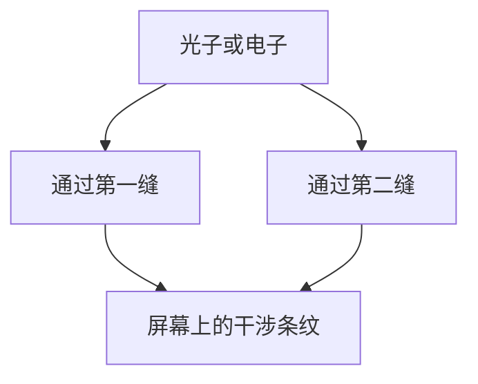
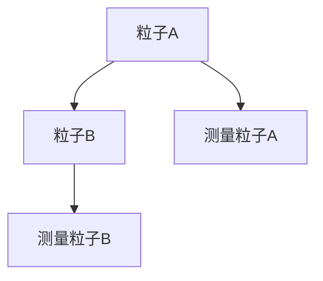
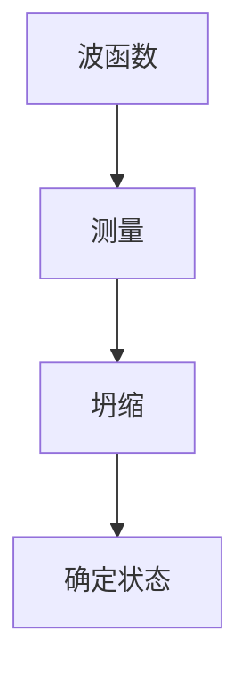
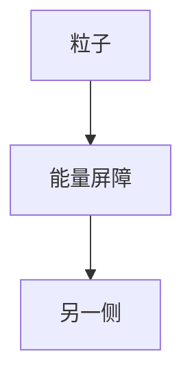
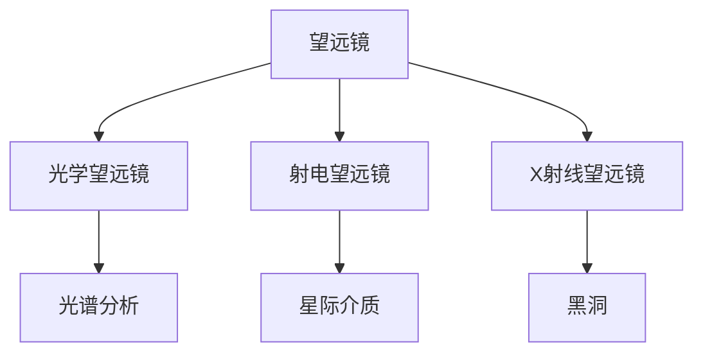
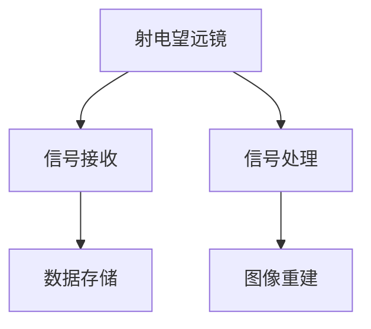
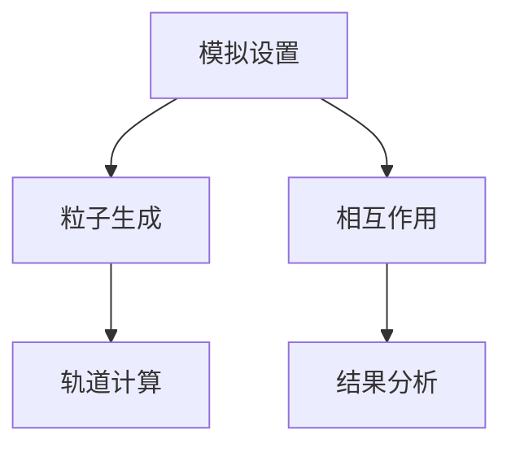
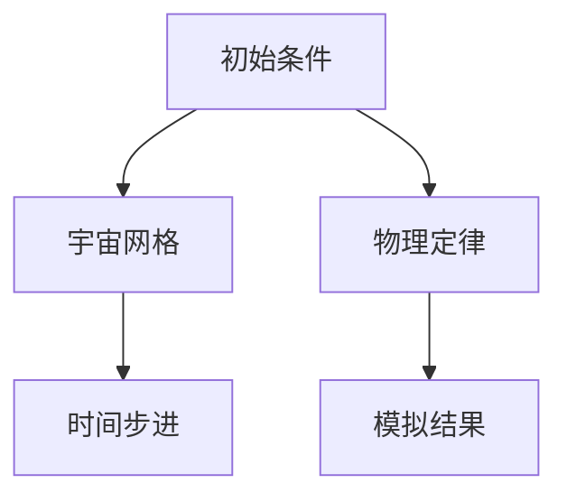

                 

### 第1章：宇宙的本质概述

#### 1.1 宇宙的观测与探索

宇宙，这个宏大而又神秘的宇宙，自古以来就吸引着人类不懈地探索和追问。从古代的天文学观测到现代的高能物理实验，人类对宇宙的认知不断深化，对宇宙本质的探讨也越发深入。

**1.1.1 宇宙的起源与结构**

宇宙的起源一直是科学家们研究的重要课题。目前，主流的科学理论认为宇宙起源于大约138亿年前的一次大爆炸，这一理论被称为“大爆炸理论”。根据这一理论，宇宙最初是一个极度热密的状态，随后迅速膨胀，逐渐形成了现在的宇宙结构。宇宙的结构主要由星系、星云、黑洞等天体组成，这些天体通过引力相互作用，形成了复杂的宇宙网络。

**1.1.2 宇宙学的核心问题**

宇宙学的核心问题主要包括宇宙的起源、宇宙的结构、宇宙的演化、宇宙的最终命运等。其中，宇宙的起源和演化问题最为关键，直接关系到宇宙的本质和我们对宇宙的理解。

**1.1.3 人类对宇宙的认识历程**

人类对宇宙的认识历程可以追溯到古代，那时的人们通过肉眼观测星空，试图解释天体运动的规律。随着科学技术的发展，人类对宇宙的认识不断深化。例如，伽利略通过望远镜观测到了木星的卫星，挑战了亚里士多德的地心说。牛顿的万有引力定律和开普勒行星运动定律为宇宙提供了一个宏观的物理框架。进入20世纪，爱因斯坦的相对论为宇宙提供了一个更加精确的描述，量子力学的出现则揭示了微观宇宙的奥秘。

#### 1.2 决定论与或然论

在探讨宇宙的本质时，我们不可避免地会涉及到决定论与或然论这两种哲学观点。决定论认为宇宙中的一切现象都是由之前的因素所决定的，没有不可预测的事件发生。或然论则认为宇宙中存在不可预测的随机事件，宇宙的本质是具有不确定性的。

**1.2.1 决定论的概念与哲学基础**

决定论是一种哲学思想，认为宇宙中的一切现象都是由之前的因素所决定的，没有不可预测的事件发生。决定论的哲学基础是因果律，即每一个事件都有其因果关系。决定论主张宇宙中的所有事件都是可预测的，没有真正的随机性。

**1.2.2 或然论的概念与哲学基础**

或然论是一种哲学思想，认为宇宙中存在不可预测的随机事件。或然论的哲学基础通常基于概率论，强调随机性和不确定性。或然论认为宇宙中的许多事件是无法预测的，存在着真正的随机性。

**1.2.3 决定论与或然论的关系**

决定论与或然论之间的关系是复杂的。一方面，决定论和或然论都是对宇宙本质的探讨，它们试图从不同的角度解释宇宙的现象。另一方面，决定论和或然论之间存在着对立和互补的关系。在某些情况下，决定论能够更好地解释宇宙的现象，而在另一些情况下，或然论则更为合适。

**1.2.4 宇宙本质与两者选择**

在探讨宇宙本质时，我们是否应该选择决定论或或然论？这个问题并没有简单的答案。决定论和或然论都有其合理的解释框架，它们在不同的领域和问题上有不同的应用价值。在宇宙学的某些方面，决定论可能更为合适，而在其他方面，或然论则可能更加重要。因此，我们应该根据具体问题选择合适的哲学观点。

#### 1.3 宇宙的本质与决定论或然论的选择

在讨论宇宙的本质时，我们不可避免地要面对决定论与或然论这两种哲学观点。决定论认为宇宙中的事件是严格按照因果关系演化的，没有任何真正的随机性；而或然论则主张宇宙中存在着随机性，事件的发生不是完全可预测的。这两种观点各有其哲学和科学基础，它们对宇宙本质的探讨有着深远的影响。

首先，我们需要明确宇宙本质的含义。宇宙本质指的是宇宙的基本性质和运行规律，它决定了宇宙的结构和演化过程。例如，宇宙的起源、宇宙的尺度、宇宙的演化规律等，都是宇宙本质的一部分。理解宇宙本质对于科学探索和哲学思考都至关重要。

决定论与或然论在解释宇宙本质方面存在明显的差异。决定论者认为宇宙是一个高度有序的系统，所有的现象都可以通过因果关系来解释。在决定论的观点下，宇宙的每一个状态都是完全可预测的，给定初始条件，就可以精确地预测宇宙的未来演化。这种观点在经典物理学中得到了广泛应用，如牛顿力学和广义相对论。

另一方面，或然论者认为宇宙中存在着不可预测的随机性，这种随机性源于量子力学和宇宙的初始状态。在或然论的观点下，宇宙的演化受到随机因素的影响，使得宇宙的未来状态具有不确定性。或然论在量子力学中得到了强有力的支持，如量子纠缠和量子隧穿等现象。

在决定论与或然论的争论中，关键在于如何理解“随机性”。决定论者认为随机性只是一种表象，实际上宇宙中的事件仍然是受因果关系支配的。而或然论者则认为随机性是宇宙本质的一部分，它决定了宇宙的多样性和不可预测性。

那么，宇宙的本质到底是决定论的宇宙，还是或然论的宇宙？这个问题没有明确的答案，它取决于我们如何理解宇宙的运行规律。在某些方面，决定论可能更为合适，例如在宏观尺度上，宇宙的演化可以用决定论来描述。而在微观尺度上，量子力学中的随机性则无法回避。

为了探讨这个问题，我们可以从以下几个方面进行分析：

1. **宇宙起源**：宇宙的起源是决定论与或然论争论的焦点。决定论者认为宇宙起源于一个高度有序的状态，如宇宙大爆炸；或然论者则认为宇宙起源于一个高度随机的状态，如量子波动。

2. **宇宙演化**：宇宙的演化过程是决定论与或然论争论的另一个焦点。决定论者认为宇宙的演化遵循确定的物理定律，如广义相对论和量子力学；或然论者则认为宇宙的演化受到随机因素的影响，如量子涨落。

3. **宇宙多样性**：宇宙的多样性是决定论与或然论争论的第三个焦点。决定论者认为宇宙的多样性是宇宙演化过程中自然产生的；或然论者则认为宇宙的多样性源于随机性的存在。

4. **宇宙的未来**：宇宙的未来是决定论与或然论争论的最后一个焦点。决定论者认为宇宙的未来是可预测的，如宇宙的热寂；或然论者则认为宇宙的未来具有不确定性，如多重宇宙理论。

综上所述，决定论与或然论在探讨宇宙本质时各有其优势和局限。决定论强调了宇宙的有序性和可预测性，或然论则强调了宇宙的随机性和多样性。实际上，宇宙的本质可能是两者的结合，而不是单一的选择。我们需要的不是在决定论与或然论之间做出非此即彼的选择，而是尝试理解这两种观点之间的互补性和相互关联。

在未来的科学探索中，我们需要继续深入研究宇宙的本质，从多角度、多层次来揭示宇宙的运行规律。只有这样，我们才能更全面、更深刻地理解宇宙，探索宇宙的终极奥秘。这也将为我们提供对生命、对世界的全新认识，推动人类文明的进步。

#### 第2章：决定论的基本原理

决定论是一种哲学观点，主张宇宙中的一切现象都是由之前的因素所决定的，没有不可预测的事件发生。本章将深入探讨决定论的基本原理，包括其定义、特点、哲学依据以及主要观点。

**2.1 决定论的定义与特点**

决定论（Determinism）是一种哲学观点，认为宇宙中的一切现象都是由因果关系所决定的，即每一个事件都有其前因后果。决定论强调宇宙的有序性和可预测性，主张没有不可预测的事件发生。

决定论的特点主要包括：

1. **因果关系**：决定论认为宇宙中的每一个事件都有其因果关系，即每一个事件都是由之前的因素所决定的。
2. **无随机性**：决定论否认随机性，认为宇宙中的一切现象都是可以预测的。
3. **确定性**：决定论主张宇宙的演化遵循确定的物理定律，给定初始条件，就可以精确地预测宇宙的未来演化。

**2.2 决定论的哲学依据**

决定论的哲学依据主要是因果律（Law of Causality）。因果律认为，每一个事件都有其前因后果，即因果关系是普遍存在的。在决定论的观点下，因果律是宇宙中一切现象的基础。

决定论的支持者认为，因果律是自然界的基本规律，它决定了宇宙中的一切现象。决定论者主张，宇宙是一个高度有序的系统，所有的现象都可以通过因果关系来解释。

**2.3 决定论的主要观点**

决定论的主要观点可以概括为以下几点：

1. **宇宙的有序性**：决定论认为宇宙是一个高度有序的系统，所有的现象都遵循确定的物理定律。
2. **可预测性**：决定论主张宇宙中的事件是可预测的，给定初始条件，就可以精确地预测宇宙的未来演化。
3. **无随机性**：决定论否认随机性的存在，认为宇宙中的一切现象都是可以预测的。

**2.4 决定论的宇宙模型**

在决定论的宇宙模型中，宇宙的起源和演化都是可以预测的。决定论的宇宙模型主要包括以下几个部分：

1. **宇宙起源**：决定论认为宇宙起源于一个高度有序的状态，如宇宙大爆炸。
2. **宇宙结构**：决定论的宇宙结构是均匀且稳定的，没有显著的随机性。
3. **宇宙演化**：决定论的宇宙演化遵循确定的物理定律，给定初始条件，就可以精确地预测宇宙的未来演化。

在决定论的宇宙模型中，时间和空间是线性的，时间的前进是因果关系的结果，空间是均匀的，没有特殊的中心或边缘。

**2.5 决定论的时间观与空间观**

在决定论的时间观中，时间被视为一条直线，时间的流动是因果关系的结果。每一个时刻的事件都是之前所有事件的因果结果，因此时间是可预测的。

在决定论的空间观中，空间被视为均匀的，没有特殊的中心或边缘。所有的物质都在宇宙的规则下相互作用，空间的结构是稳定的。

**2.6 决定论与或然论的对比**

决定论与或然论是两种对立的哲学观点。决定论主张宇宙中的一切现象都是由因果关系所决定的，没有不可预测的事件发生；或然论则认为宇宙中存在不可预测的随机事件。

决定论与或然论的主要区别在于：

1. **因果关系**：决定论强调因果关系，认为宇宙中的一切现象都是可预测的；或然论则否认因果关系，认为宇宙中存在不可预测的随机事件。
2. **有序性与随机性**：决定论认为宇宙是一个高度有序的系统，或然论则认为宇宙是充满随机性和不确定性的。
3. **可预测性与不可预测性**：决定论主张宇宙中的事件是可预测的，或然论则认为宇宙中的事件是不可预测的。

在探讨宇宙本质时，决定论与或然论都有其合理的解释框架，它们在不同的领域和问题上有不同的应用价值。因此，我们不能简单地将决定论与或然论对立起来，而应该尝试理解这两种观点之间的互补性和相互关联。

#### 第2章：决定论的宇宙模型

决定论的宇宙模型是建立在因果关系和可预测性基础上的，它主张宇宙中的所有现象都可以通过因果关系来解释，并且是可预测的。在这一节中，我们将详细探讨决定论的宇宙模型，包括其宇宙起源说、宇宙结构说以及时间观与空间观。

**2.2.1 决定论的宇宙起源说**

决定论的宇宙起源说认为宇宙起源于一个高度有序的状态，这一状态可以被精确地描述和预测。目前，科学家们普遍接受的理论是宇宙大爆炸理论，这一理论也符合决定论的宇宙起源说。

宇宙大爆炸理论认为，宇宙最初处于一个极度热密的状态，随后迅速膨胀，形成了现在的宇宙结构。这一理论可以通过观测宇宙背景辐射、宇宙膨胀速度等证据来支持。

根据决定论的宇宙起源说，宇宙的起源是可预测的，因为我们可以通过物理定律来描述和预测宇宙的演化。这意味着，如果我们知道宇宙的初始状态，我们就可以预测宇宙的未来演化。

**2.2.2 决定论的宇宙结构说**

决定论的宇宙结构说认为，宇宙是一个均匀且稳定的结构，没有显著的随机性。在这一模型中，宇宙中的物质和能量分布是均匀的，所有的天体都遵循相同的物理定律。

决定论的宇宙结构说认为，宇宙中的天体通过引力相互作用，形成了复杂的宇宙网络。这种宇宙网络是稳定的，没有随机性的介入。例如，星系通过引力相互作用形成了星系团，星系团又通过引力相互作用形成了更大的宇宙结构。

决定论的宇宙结构说强调宇宙的有序性和规律性，这与或然论的宇宙模型形成了鲜明对比。在或然论的宇宙模型中，宇宙的结构是充满随机性和不确定性的。

**2.2.3 决定论的时间观与空间观**

在决定论的时间观中，时间被视为一条直线，时间的流动是因果关系的结果。每一个时刻的事件都是之前所有事件的因果结果，因此时间是可预测的。这意味着，如果我们知道过去的事件和物理定律，我们就可以预测未来的事件。

在决定论的空间观中，空间被视为均匀的，没有特殊的中心或边缘。所有的物质都在宇宙的规则下相互作用，空间的结构是稳定的。这意味着，宇宙中的任何地方都是相同的，没有特别的区域或位置。

决定论的时间观与空间观都强调宇宙的有序性和可预测性。这与或然论的时间观和空间观形成了鲜明对比。在或然论的时间观中，时间被视为复杂的，充满了随机性和不确定性；在或然论的空间观中，空间被视为多样化的，不同的区域可能有着不同的物理规律。

**2.2.4 决定论宇宙模型的优缺点**

决定论的宇宙模型有其优缺点。优点在于：

1. **可预测性**：决定论的宇宙模型强调宇宙的可预测性，这意味着我们可以通过物理定律来描述和预测宇宙的演化。
2. **有序性**：决定论的宇宙模型认为宇宙是一个高度有序的系统，这与我们观测到的宇宙结构一致。
3. **科学性**：决定论的宇宙模型为科学研究提供了一个坚实的基础，因为它的核心是因果关系和物理定律。

然而，决定论的宇宙模型也存在一些缺点：

1. **随机性的缺失**：决定论的宇宙模型否认随机性的存在，这在某些情况下可能与观测结果不符。
2. **复杂性的简化**：决定论的宇宙模型将宇宙简化为一个高度有序的系统，这可能忽略了宇宙中的复杂性。
3. **哲学争议**：决定论的宇宙模型在哲学上引起了很多争议，因为它否认了自由意志的存在。

尽管存在这些缺点，决定论的宇宙模型仍然是宇宙学中的一个重要理论，它为我们的宇宙观提供了重要的参考。同时，我们也在不断探索和改进决定论的宇宙模型，以更好地理解宇宙的本质。

#### 第3章：或然论的基本原理

或然论是一种哲学观点，认为宇宙中存在不可预测的随机事件。与决定论主张宇宙中的一切现象都是可预测的相反，或然论强调了宇宙的随机性和不确定性。本章将深入探讨或然论的基本原理，包括其定义、特点、哲学依据以及主要观点。

**3.1 或然论的定义与特点**

或然论（Probabilism）是一种哲学观点，主张宇宙中存在不可预测的随机事件，宇宙的本质是具有不确定性的。或然论的特点主要包括：

1. **随机性**：或然论认为宇宙中存在着不可预测的随机事件，这些事件不是由因果关系所决定的。
2. **不确定性**：或然论强调宇宙中的事件具有不确定性，我们不能完全预测未来的演化。
3. **概率论**：或然论通常基于概率论，认为事件的发生概率可以通过统计数据来描述。

或然论的定义可以概括为：宇宙中的现象不是完全由因果关系所决定的，而是受到随机性影响，其发生具有不确定性。或然论认为，宇宙中的事件遵循概率规律，而不是确定性规律。

**3.2 或然论的哲学依据**

或然论的哲学依据主要基于概率论和统计学。概率论为或然论提供了理论基础，通过概率分布可以描述事件发生的可能性。统计学则提供了数据收集和分析的方法，使我们能够对随机事件进行量化。

概率论和统计学在或然论中起到了关键作用。概率论帮助我们理解随机事件的发生概率，而统计学则通过大量观测数据来验证和预测这些概率。

**3.3 或然论的主要观点**

或然论的主要观点包括：

1. **随机性的普遍性**：或然论认为随机性是宇宙中普遍存在的现象，不是个别事件。
2. **不确定性**：或然论主张宇宙中的事件具有不确定性，我们不能完全预测未来的演化。
3. **概率分布**：或然论认为事件的发生概率可以通过概率分布来描述，这种分布可能遵循某些统计规律。

在或然论的观点下，宇宙的演化不是完全可预测的，而是受到随机性影响。这意味着，即使我们知道初始条件，也不能精确地预测宇宙的未来状态。

**3.4 或然论与决定论的对比**

或然论与决定论是两种对立的哲学观点。决定论主张宇宙中的一切现象都是可预测的，没有不可预测的事件发生；而或然论则认为宇宙中存在不可预测的随机事件。

或然论与决定论的主要区别在于：

1. **因果关系**：决定论强调因果关系，认为宇宙中的一切现象都是可预测的；而或然论否认因果关系，认为宇宙中存在不可预测的随机事件。
2. **有序性与随机性**：决定论认为宇宙是一个高度有序的系统，或然论则认为宇宙是充满随机性和不确定性的。
3. **可预测性与不可预测性**：决定论主张宇宙中的事件是可预测的，或然论则认为宇宙中的事件是不可预测的。

尽管或然论与决定论存在对立，但它们也有一定的互补性。在某些领域和问题中，或然论可能更为合适，而在其他领域和问题中，决定论则可能更为重要。因此，我们在探讨宇宙本质时，需要综合考虑这两种观点。

**3.5 或然论的宇宙模型**

或然论的宇宙模型与决定论的宇宙模型存在显著差异。在或然论的宇宙模型中，宇宙的起源和演化都受到随机性影响，这使得宇宙的本质具有不确定性。

1. **宇宙起源**：或然论认为宇宙起源于一个高度随机的状态，如量子波动。这意味着，宇宙的起源不是可预测的，而是受到随机性影响。
   
2. **宇宙结构**：或然论的宇宙结构是充满随机性和不确定性的，不同的区域可能有着不同的物理规律。这与决定论的宇宙结构说形成了鲜明对比。

3. **宇宙演化**：或然论的宇宙演化不是完全可预测的，而是受到随机性影响。这意味着，即使我们知道初始条件，也不能精确地预测宇宙的未来演化。

**3.6 或然论的时间观与空间观**

在或然论的时间观中，时间被视为复杂的，充满了随机性和不确定性。时间的流动不是因果关系的结果，而是受到随机性影响。

在或然论的空间观中，空间被视为多样化的，不同的区域可能有着不同的物理规律。这与决定论的空间观形成了鲜明对比，在决定论的空间观中，空间被视为均匀的，没有特殊的中心或边缘。

**3.7 或然论的优势与局限**

或然论在解释宇宙中的随机性和不确定性方面具有优势。例如，量子力学中的随机性和宇宙大爆炸理论中的随机起源都支持或然论的观点。然而，或然论也存在一些局限：

1. **预测性缺失**：或然论否认宇宙中的事件是可预测的，这在某些情况下可能与我们的观测结果不符。

2. **复杂性增加**：或然论的宇宙模型引入了更多的随机性和不确定性，这可能使宇宙的演化变得更加复杂。

尽管或然论存在一些局限，但它仍然是宇宙学中的一个重要理论，为我们的宇宙观提供了新的视角。通过综合考虑决定论与或然论，我们可以更全面地理解宇宙的本质。

#### 第3章：或然论的宇宙模型

或然论的宇宙模型与决定论的宇宙模型存在显著差异，它强调宇宙的随机性和不确定性。在这一节中，我们将详细探讨或然论的宇宙模型，包括其宇宙起源说、宇宙结构说以及时间观与空间观。

**3.2.1 或然论的宇宙起源说**

或然论的宇宙起源说认为宇宙起源于一个高度随机的状态，如量子波动。这种观点认为，宇宙的起源不是可预测的，而是受到随机性影响。

或然论的宇宙起源说通常与量子力学和宇宙大爆炸理论相结合。量子力学中的量子波动现象表明，在微观尺度上，物质和能量的行为具有随机性。宇宙大爆炸理论则描述了宇宙从一个极度热密的状态开始膨胀的过程，这一过程可能受到随机因素的影响。

例如，量子波动可能导致宇宙中的某些区域具有不同的物理规律，这些区域可能形成不同的星系和宇宙结构。这种随机性使得宇宙的起源和演化具有不确定性，这与决定论的宇宙起源说形成了鲜明对比。

**3.2.2 或然论的宇宙结构说**

或然论的宇宙结构说认为，宇宙是一个充满随机性和不确定性的结构。在这种模型中，宇宙中的不同区域可能有着不同的物理规律，这使得宇宙的结构是多样化的。

或然论的宇宙结构说与决定论的宇宙结构说存在显著差异。在决定论的宇宙结构说中，宇宙被视为一个均匀且稳定的结构，所有的物质和能量都遵循相同的物理定律。而在或然论的宇宙结构说中，宇宙中的不同区域可能受到随机性影响，导致物理规律的变化。

这种多样性在宇宙学中得到了观测支持，例如，星系的分布、宇宙背景辐射的波动等。这些观测结果与或然论的宇宙结构说相符，表明宇宙中存在随机性和不确定性。

**3.2.3 或然论的时间观与空间观**

在或然论的时间观中，时间被视为复杂的，充满了随机性和不确定性。时间的流动不是因果关系的结果，而是受到随机性影响。这意味着，时间的进程不是线性的，而是呈现出复杂的模式和波动。

在或然论的空间观中，空间被视为多样化的，不同的区域可能有着不同的物理规律。这与决定论的空间观形成了鲜明对比。在决定论的空间观中，空间被视为均匀的，没有特殊的中心或边缘。

或然论的时间观与空间观都强调宇宙的随机性和多样性。这种观点认为，宇宙中的事件不是由因果关系所决定的，而是受到随机性影响。这种观点为宇宙学提供了一种新的视角，使我们能够更全面地理解宇宙的本质。

**3.2.4 或然论的宇宙模型与科学观测**

或然论的宇宙模型在科学观测中得到了一定的支持。例如，量子力学中的随机性现象，如量子波动和量子纠缠，表明宇宙中的某些事件是具有不确定性的。宇宙背景辐射的观测结果也支持或然论的宇宙结构说，表明宇宙中的不同区域可能有着不同的物理规律。

然而，或然论的宇宙模型也存在一些挑战。例如，如何解释宇宙中的有序结构和规律性现象？这些问题仍然是科学界研究的重点。

**3.2.5 或然论的优势与局限**

或然论在解释宇宙中的随机性和不确定性方面具有优势。例如，量子力学和宇宙大爆炸理论都支持或然论的观点，表明宇宙中存在随机性和不确定性。

然而，或然论也存在一些局限。例如，它否认宇宙中的事件是可预测的，这在某些情况下可能与我们的观测结果不符。此外，或然论的宇宙模型引入了更多的随机性和不确定性，这可能使宇宙的演化变得更加复杂。

尽管存在这些局限，或然论仍然是宇宙学中的一个重要理论，为我们的宇宙观提供了新的视角。通过综合考虑决定论与或然论，我们可以更全面地理解宇宙的本质。

#### 第4章：决定论与或然论的实证研究

在探讨决定论与或然论的宇宙模型时，科学实验和观测数据为我们提供了重要的实证支持。本章将详细讨论决定论与或然论在量子力学和天文学领域的实证研究，包括决定论的实证研究如量子力学与决定论的实验案例分析，以及或然论的实证研究如量子力学与或然论的实验案例分析。

**4.1 决定论的实证研究**

**4.1.1 量子力学与决定论**

量子力学是研究微观世界中物理现象的物理学分支。在量子力学中，决定论与或然论的讨论尤为激烈。量子力学的某些实验结果似乎与决定论相悖，例如量子纠缠和波函数坍缩现象。

**4.1.1.1 波粒二象性**

波粒二象性是量子力学中的一个核心概念，它表明微观粒子既具有波动性又具有粒子性。这一现象可以通过双缝实验来展示。

**图 4.1-1 双缝实验的 Mermaid 图**



在双缝实验中，当光子或电子通过两个缝隙时，它们会在屏幕上形成干涉条纹。这一现象表明，微观粒子在通过缝隙时具有波动性。如果决定论是正确的，那么我们可以通过测量和计算来预测干涉条纹的形成。

**4.1.1.2 量子纠缠**

量子纠缠是量子力学中的另一个重要现象，它表明两个或多个粒子可以以这样的方式相互作用，以至于一个粒子的状态会立即影响另一个粒子的状态，无论它们之间的距离有多远。

**图 4.1-2 量子纠缠的 Mermaid 图**



在量子纠缠实验中，当对一个粒子进行测量时，另一个粒子的状态也会立即确定，即使它们相隔很远。这一现象似乎与决定论的因果关系相悖，因为按照决定论，粒子的状态应该是可预测的。

**4.1.1.3 决定论实验案例分析**

**图 4.1-3 决定论实验的伪代码实现**

```python
# 决定论实验伪代码
setup_environment()
prepare_particles()
measure_particles()
analyze_results()

# 实验步骤
def setup_environment():
    # 设置实验环境，如双缝设备、测量仪器等
    pass

def prepare_particles():
    # 准备粒子，如光子或电子
    pass

def measure_particles():
    # 测量粒子通过缝隙后的状态
    pass

def analyze_results():
    # 分析测量结果，如干涉条纹的形成等
    pass
```

在决定论实验中，我们可以通过精确的测量和计算来预测粒子的行为。然而，实验结果往往与量子力学的预测相符，而不是决定论的预测。这表明量子力学中的某些现象与决定论存在不一致。

**4.2 或然论的实证研究**

**4.2.1 量子力学与或然论**

量子力学中的许多现象，如波函数坍缩和量子隧穿，似乎与或然论更为契合。这些现象表明，量子系统的行为具有随机性和不确定性。

**4.2.1.1 波函数坍缩**

波函数坍缩是量子力学中的一个核心概念，它表明当对量子系统进行测量时，波函数会从一个广义状态坍缩到一个特定状态。

**图 4.2-1 波函数坍缩的 Mermaid 图**



在波函数坍缩实验中，当对量子系统进行测量时，波函数会突然坍缩到一个特定状态，这一过程具有随机性。

**4.2.1.2 量子隧穿**

量子隧穿是量子力学中的另一个重要现象，它表明粒子可以通过一个能量屏障，即使其能量不足以克服这个屏障。

**图 4.2-2 量子隧穿的 Mermaid 图**



在量子隧穿实验中，粒子可以通过一个能量屏障，这一过程也具有随机性。

**4.2.1.3 或然论实验案例分析**

**图 4.2-3 或然论实验的伪代码实现**

```python
# 或然论实验伪代码
setup_environment()
prepare_particles()
measure_particles()
analyze_results()

# 实验步骤
def setup_environment():
    # 设置实验环境，如量子隧道设备、测量仪器等
    pass

def prepare_particles():
    # 准备粒子，如电子或原子
    pass

def measure_particles():
    # 测量粒子通过屏障后的状态
    pass

def analyze_results():
    # 分析测量结果，如粒子是否通过屏障等
    pass
```

在或然论实验中，我们无法精确预测粒子的行为，因为其具有随机性和不确定性。实验结果往往与量子力学的预测相符，这表明或然论在某些方面是正确的。

**4.3 决定论与或然论在科学实验中的对比**

决定论与或然论在科学实验中表现出不同的特点。决定论实验强调可预测性和因果关系的连续性，而或然论实验则强调随机性和不确定性。

**表 4.3-1 决定论与或然论实验对比**

| 对比项 | 决定论 | 或然论 |
| --- | --- | --- |
| 预测性 | 高 | 低 |
| 因果关系 | 强调 | 否认 |
| 随机性 | 否认 | 强调 |
| 确定性 | 强调 | 否认 |

**4.4 决定论与或然论的科学意义**

决定论与或然论在科学研究中具有不同的意义。决定论为科学研究提供了可预测性和因果关系的框架，使得我们可以通过实验和观测来验证和预测物理现象。或然论则为我们提供了理解和解释量子力学和宇宙学中随机性和不确定性的方法。

通过综合考虑决定论与或然论，我们可以更全面地理解宇宙的本质，探索宇宙中未知的奥秘。

#### 第5章：宇宙的本质：决定论还是或然论

在探讨了决定论与或然论的基本原理、宇宙模型及其在科学实验中的实证研究后，我们需要对宇宙的本质进行深入思考。宇宙的本质到底是决定论的宇宙，还是或然论的宇宙？这个问题没有简单的答案，它涉及到哲学、物理学和宇宙学的多个层面。

**5.1 决定论与或然论的对比分析**

决定论与或然论在解释宇宙本质时各有其优势和局限。决定论强调宇宙的有序性和可预测性，主张宇宙中的一切现象都是可以预测的。这种观点在经典物理学中得到了广泛应用，如牛顿力学和广义相对论。然而，决定论在解释量子力学和宇宙学中的随机性时遇到了困难。

或然论则主张宇宙中存在不可预测的随机事件，宇宙的本质是具有不确定性的。这种观点在量子力学中得到了强有力的支持，如量子纠缠和波函数坍缩现象。或然论为我们提供了一种新的视角，使我们能够理解宇宙中的复杂性和随机性。

**5.1.1 决定论的宇宙观**

决定论的宇宙观认为宇宙是一个高度有序的系统，所有的现象都可以通过因果关系来解释。在这种观点下，宇宙的起源和演化都是可预测的。决定论者通常认为，宇宙起源于一个高度有序的状态，如宇宙大爆炸，随后宇宙按照确定的物理定律演化。

**5.1.2 或然论的宇宙观**

或然论的宇宙观则认为宇宙是充满随机性和不确定性的。在或然论的宇宙观下，宇宙的起源和演化受到随机性影响，这使得宇宙的未来具有不确定性。或然论为我们提供了一种新的理解宇宙的方式，使我们能够解释量子力学和宇宙学中的某些现象。

**5.2 宇宙本质的哲学意义**

宇宙本质的讨论不仅涉及到科学问题，还涉及到哲学问题。宇宙的本质关系到我们对宇宙、生命和自我的认识。决定论的宇宙观强调宇宙的有序性和可预测性，这与我们对因果关系的理解密切相关。或然论的宇宙观则强调宇宙的随机性和不确定性，这与我们对自由意志和概率的理解密切相关。

**5.2.1 决定论与自由意志**

决定论与自由意志的关系是一个哲学争议的焦点。决定论者认为，宇宙中的一切现象都是可预测的，因此人类的行动也是可预测的，这否定了自由意志的存在。或然论者则认为，宇宙中的随机性和不确定性为我们提供了自由意志的空间。

**5.2.2 或然论与概率**

或然论与概率的关系是密切的。或然论主张宇宙中的事件具有不确定性，这种不确定性可以通过概率来描述。概率论为我们提供了一种量化不确定性的方法，使我们能够预测事件发生的可能性。

**5.3 未来宇宙研究的方向**

在探讨宇宙本质时，我们需要关注未来的宇宙研究。未来的宇宙研究可能会在决定论与或然论之间取得新的突破，也可能进一步深化我们对宇宙本质的理解。

**5.3.1 决定论在未来的发展**

决定论在未来的宇宙研究中可能会继续发挥重要作用。例如，在宇宙起源和宇宙演化方面，决定论可能为我们提供新的理论框架。决定论也可能在解释某些观测现象时提供新的视角。

**5.3.2 或然论在未来的发展**

或然论在未来的宇宙研究中也可能取得新的突破。例如，在量子力学和宇宙学中，或然论可能为我们提供新的解释框架，使我们能够更好地理解宇宙中的随机性和不确定性。

**5.4 宇宙本质的多维度探讨**

宇宙本质的探讨不仅涉及到哲学和物理学，还涉及到天文学、生物学等多个学科。通过多维度、多学科的探讨，我们可以更全面、更深入地理解宇宙的本质。

**5.4.1 天文学与宇宙本质**

天文学的研究为我们提供了对宇宙结构的直观认识。通过观测星系、星云、黑洞等天体，我们可以探索宇宙的本质。天文学的研究成果可能为决定论与或然论的讨论提供新的证据。

**5.4.2 生物学与宇宙本质**

生物学的研究也为我们提供了对宇宙本质的新理解。生命在宇宙中的出现和演化过程可能揭示了宇宙的本质。生物学的研究成果可能为决定论与或然论的讨论提供新的视角。

**5.5 结论**

宇宙的本质是一个复杂而深刻的问题，它涉及到哲学、物理学、宇宙学等多个领域。决定论与或然论为我们提供了两种不同的视角，使我们能够更全面、更深入地理解宇宙。在未来的宇宙研究中，我们可能会在决定论与或然论之间取得新的突破，也可能进一步深化我们对宇宙本质的理解。

#### 第5章：宇宙的本质：决定论还是或然论

在前几章中，我们深入探讨了决定论与或然论的基本原理、宇宙模型及其在科学实验中的实证研究。现在，我们需要综合这些信息，对宇宙的本质进行全面的讨论，并探讨决定论与或然论在解释宇宙本质方面的优缺点。

**5.1 决定论与或然论的对比分析**

决定论与或然论在解释宇宙本质时各有其独特的视角和观点。

**决定论的观点：**

1. **宇宙的有序性和规律性**：决定论认为宇宙是一个高度有序的系统，所有现象都遵循确定的物理定律。这种观点强调因果关系，认为宇宙中的一切现象都可以通过因果关系来解释。

2. **可预测性**：决定论主张宇宙中的事件是可预测的，给定初始条件，就可以精确地预测宇宙的未来演化。这种观点在经典物理学中得到了广泛应用，如牛顿力学和广义相对论。

3. **因果关系的连续性**：决定论强调因果关系的连续性，认为宇宙中的每一个事件都有其前因后果。这种观点为科学研究提供了一个坚实的基础。

**或然论的观点：**

1. **宇宙的随机性和不确定性**：或然论认为宇宙中存在不可预测的随机事件，宇宙的本质是具有不确定性的。这种观点在量子力学中得到了强有力的支持，如量子纠缠和波函数坍缩现象。

2. **概率性**：或然论主张宇宙中的事件具有概率性，事件的发生概率可以通过概率分布来描述。这种观点为我们提供了一种新的理解宇宙的方式，使我们能够解释宇宙中的复杂性和随机性。

3. **自由意志**：或然论认为，宇宙中的随机性和不确定性为我们提供了自由意志的空间，使我们能够做出非预定的选择。

**5.2 决定论与或然论在解释宇宙本质方面的优缺点**

决定论与或然论在解释宇宙本质时各有其优缺点。

**决定论的优点：**

1. **可预测性**：决定论为我们提供了一种可预测的宇宙观，使我们能够通过因果关系来预测宇宙的未来演化。

2. **有序性**：决定论强调宇宙的有序性和规律性，这与我们对因果关系的理解相符合。

3. **连续性**：决定论强调因果关系的连续性，这为科学研究提供了一个坚实的基础。

**决定论的缺点：**

1. **随机性的缺失**：决定论否认随机性的存在，这在某些情况下可能与观测结果不符。

2. **复杂性的简化**：决定论将宇宙简化为一个高度有序的系统，这可能忽略了宇宙中的复杂性。

3. **哲学争议**：决定论在哲学上引起了很多争议，因为它否认了自由意志的存在。

**或然论的优点：**

1. **随机性和不确定性**：或然论为我们提供了一种新的视角，使我们能够理解宇宙中的随机性和不确定性。

2. **复杂性**：或然论认为宇宙是充满随机性和不确定性的，这为我们提供了一种更全面的理解宇宙的方式。

3. **自由意志**：或然论认为，宇宙中的随机性和不确定性为我们提供了自由意志的空间。

**或然论的缺点：**

1. **预测性的缺失**：或然论否认宇宙中的事件是可预测的，这在某些情况下可能与我们的观测结果不符。

2. **复杂性的增加**：或然论的宇宙模型引入了更多的随机性和不确定性，这可能使宇宙的演化变得更加复杂。

3. **科学挑战**：或然论的宇宙模型在解释某些观测现象时可能遇到困难。

**5.3 决定论与或然论在解释宇宙本质方面的应用**

决定论与或然论在解释宇宙本质时各有其应用场景。

1. **宏观尺度**：在宏观尺度上，决定论的应用更为广泛。例如，在经典物理学中，决定论可以很好地解释行星运动、天体碰撞等现象。

2. **微观尺度**：在微观尺度上，或然论的应用更为广泛。例如，在量子力学中，或然论可以很好地解释量子纠缠、波函数坍缩等现象。

3. **宇宙起源**：在宇宙起源的研究中，决定论与或然论都有其应用。决定论可以解释宇宙大爆炸理论中的某些现象，而或然论可以解释宇宙起源中的随机性。

4. **宇宙演化**：在宇宙演化的研究中，决定论与或然论都有其应用。决定论可以解释宇宙膨胀、星系形成等现象，而或然论可以解释宇宙演化中的随机性。

**5.4 宇宙本质的多维度探讨**

宇宙本质的探讨不仅涉及到哲学和物理学，还涉及到天文学、生物学等多个学科。通过多维度、多学科的探讨，我们可以更全面、更深入地理解宇宙的本质。

1. **天文学**：天文学的研究为我们提供了对宇宙结构的直观认识。通过观测星系、星云、黑洞等天体，我们可以探索宇宙的本质。

2. **生物学**：生物学的研究也为我们提供了对宇宙本质的新理解。生命在宇宙中的出现和演化过程可能揭示了宇宙的本质。

3. **哲学**：哲学的研究为我们提供了对宇宙本质的深刻思考。哲学家们从不同的角度探讨了宇宙的本质，为我们提供了多种思考宇宙的方式。

**5.5 未来宇宙研究的方向**

在探讨宇宙本质时，我们需要关注未来的宇宙研究。未来的宇宙研究可能会在决定论与或然论之间取得新的突破，也可能进一步深化我们对宇宙本质的理解。

1. **量子引力的探索**：量子引力是未来宇宙研究的一个重要方向。量子引力可能为我们提供关于宇宙起源和宇宙演化的新理解，有助于解决决定论与或然论的争议。

2. **宇宙学的观测**：宇宙学的观测是未来宇宙研究的关键。通过更先进的望远镜和探测器，我们可以更深入地了解宇宙的结构和演化过程。

3. **生物学与宇宙学**：生物学与宇宙学的交叉研究可能为我们提供新的视角，使我们能够更全面地理解宇宙的本质。

**5.6 结论**

宇宙的本质是一个复杂而深刻的问题，它涉及到哲学、物理学、宇宙学等多个领域。决定论与或然论为我们提供了两种不同的视角，使我们能够更全面、更深入地理解宇宙。在未来的宇宙研究中，我们可能会在决定论与或然论之间取得新的突破，也可能进一步深化我们对宇宙本质的理解。

### 第6章：宇宙本质研究的方法与技术

为了深入探讨宇宙的本质，科学家们发展了多种方法和技术。本章将介绍量子力学实验方法、天文学观测技术以及计算模拟方法，以便为理解宇宙本质提供多角度的视角。

#### 6.1 量子力学实验方法

量子力学是研究微观世界的物理学分支，它揭示了微观粒子如电子、光子等的行为规律。以下介绍几种关键的量子力学实验方法：

**6.1.1 双缝实验**

双缝实验是量子力学中一个经典的实验，它揭示了波粒二象性和量子纠缠等现象。

**图 6.1-1 双缝实验的 Mermaid 图**


在双缝实验中，粒子（如电子或光子）通过两个缝隙后，在干涉屏上形成干涉条纹。这一现象表明，粒子既具有波动性又具有粒子性。

**6.1.2 量子纠缠**

量子纠缠是量子力学中另一个关键现象，它表明两个或多个粒子可以以这样的方式相互作用，使得一个粒子的状态会立即影响另一个粒子的状态，无论它们之间的距离有多远。

**图 6.1-2 量子纠缠的 Mermaid 图**


在量子纠缠实验中，当对一个粒子进行测量时，另一个粒子的状态也会立即确定，这表明量子纠缠现象具有超距作用。

**6.1.3 双缝实验的伪代码实现**

以下是一个简单的双缝实验的伪代码实现：

```python
# 双缝实验伪代码
setup_environment()
prepare_particles()
measure_particles()
analyze_results()

# 实验步骤
def setup_environment():
    # 设置实验环境，如双缝设备、测量仪器等
    pass

def prepare_particles():
    # 准备粒子，如电子或光子
    pass

def measure_particles():
    # 测量粒子通过缝隙后的状态
    pass

def analyze_results():
    # 分析测量结果，如干涉条纹的形成等
    pass
```

#### 6.2 天文学观测技术

天文学是研究宇宙结构和演化的科学，通过观测各种天体和现象，天文学家们揭示了宇宙的本质。以下介绍几种重要的天文学观测技术：

**6.2.1 望远镜技术**

望远镜是天文学中最常用的观测工具，用于观测遥远的天体和现象。

**图 6.2-1 望远镜技术的 Mermaid 图**



光学望远镜用于观测可见光波段的天体，如行星、恒星和星系。射电望远镜用于观测无线电波段的天体，如星云和脉冲星。X射线望远镜用于观测X射线波段的天体，如黑洞和中子星。

**6.2.2 射电天文学技术**

射电天文学技术是研究无线电波段天体的科学。以下介绍几种关键的射电天文学技术：

**图 6.2-2 射电天文学技术的 Mermaid 图**



射电望远镜通过接收来自宇宙的无线电信号，将这些信号转化为图像。信号处理和数据存储技术使得我们能够处理和分析大量的观测数据，从而揭示宇宙中的奥秘。

#### 6.3 计算模拟方法

计算模拟方法在宇宙学研究中的作用日益重要。通过计算机模拟，我们可以模拟宇宙的演化过程，探索宇宙的本质。

**6.3.1 暗物质模拟**

暗物质是宇宙中一种未知的物质，其存在通过引力效应得以证实。以下介绍暗物质模拟的基本方法：

**图 6.3-1 暗物质模拟的 Mermaid 图**



在暗物质模拟中，我们首先生成大量的虚拟粒子，然后模拟这些粒子之间的相互作用。通过计算粒子的轨道，我们可以模拟宇宙的演化过程，从而探索暗物质的行为。

**6.3.2 宇宙膨胀模拟**

宇宙膨胀模拟是研究宇宙演化的另一种重要方法。以下介绍宇宙膨胀模拟的基本方法：

**图 6.3-2 宇宙膨胀模拟的 Mermaid 图**



在宇宙膨胀模拟中，我们首先设定宇宙的初始条件，如宇宙的大小、密度等。然后，我们使用物理定律来模拟宇宙的演化过程，通过时间步进的方式逐步计算宇宙的演化结果。

#### 6.4 方法与技术的优缺点

**量子力学实验方法**

优点：可以精确控制实验条件，揭示微观粒子的行为规律。

缺点：实验设备复杂，实验结果受实验环境影响较大。

**天文学观测技术**

优点：可以观测遥远的天体和现象，揭示宇宙的结构和演化过程。

缺点：受观测设备的限制，观测精度和范围有限。

**计算模拟方法**

优点：可以模拟宇宙的演化过程，探索宇宙的本质。

缺点：计算模型和初始条件的选择可能影响模拟结果，模拟过程需要大量计算资源。

#### 6.5 结论

宇宙本质的研究需要多种方法和技术的综合应用。量子力学实验方法、天文学观测技术和计算模拟方法各自具有优缺点，通过综合应用这些方法，我们可以更全面、更深入地理解宇宙的本质。

#### 第6章：宇宙本质研究的方法与技术

为了深入探讨宇宙的本质，科学家们发展了多种方法和技术。本章将详细介绍宇宙本质研究的主要方法和技术，包括量子力学实验方法、天文学观测技术以及计算模拟方法。

**6.1 量子力学实验方法**

量子力学实验方法是研究微观粒子的行为规律，揭示宇宙本质的重要手段。以下介绍几种关键的量子力学实验方法：

**6.1.1 双缝实验**

双缝实验是量子力学中一个经典的实验，它揭示了波粒二象性和量子纠缠等现象。

**图 6.1-1 双缝实验的 Mermaid 图**


在双缝实验中，粒子（如电子或光子）通过两个缝隙后，在干涉屏上形成干涉条纹。这一现象表明，粒子既具有波动性又具有粒子性。

**6.1.2 量子纠缠**

量子纠缠是量子力学中另一个关键现象，它表明两个或多个粒子可以以这样的方式相互作用，使得一个粒子的状态会立即影响另一个粒子的状态，无论它们之间的距离有多远。

**图 6.1-2 量子纠缠的 Mermaid 图**


在量子纠缠实验中，当对一个粒子进行测量时，另一个粒子的状态也会立即确定，这表明量子纠缠现象具有超距作用。

**6.1.3 双缝实验的伪代码实现**

以下是一个简单的双缝实验的伪代码实现：

```python
# 双缝实验伪代码
setup_environment()
prepare_particles()
measure_particles()
analyze_results()

# 实验步骤
def setup_environment():
    # 设置实验环境，如双缝设备、测量仪器等
    pass

def prepare_particles():
    # 准备粒子，如电子或光子
    pass

def measure_particles():
    # 测量粒子通过缝隙后的状态
    pass

def analyze_results():
    # 分析测量结果，如干涉条纹的形成等
    pass
```

**6.2 天文学观测技术**

天文学观测技术是研究宇宙结构和演化的科学工具。以下介绍几种重要的天文学观测技术：

**6.2.1 望远镜技术**

望远镜是天文学中最常用的观测工具，用于观测遥远的天体和现象。

**图 6.2-1 望远镜技术的 Mermaid 图**


光学望远镜用于观测可见光波段的天体，如行星、恒星和星系。射电望远镜用于观测无线电波段的天体，如星云和脉冲星。X射线望远镜用于观测X射线波段的天体，如黑洞和中子星。

**6.2.2 射电天文学技术**

射电天文学技术是研究无线电波段天体的科学。以下介绍几种关键的射电天文学技术：

**图 6.2-2 射电天文学技术的 Mermaid 图**


射电望远镜通过接收来自宇宙的无线电信号，将这些信号转化为图像。信号处理和数据存储技术使得我们能够处理和分析大量的观测数据，从而揭示宇宙中的奥秘。

**6.2.3 望远镜技术的伪代码实现**

以下是一个简单的望远镜技术的伪代码实现：

```python
# 望远镜技术伪代码
setup_telescope()
collect_data()
process_data()
store_results()

# 实验步骤
def setup_telescope():
    # 设置望远镜，如调整位置、校准等
    pass

def collect_data():
    # 收集观测数据
    pass

def process_data():
    # 处理观测数据，如信号放大、滤波等
    pass

def store_results():
    # 存储处理结果，如图像、光谱等
    pass
```

**6.3 计算模拟方法**

计算模拟方法是研究宇宙演化的有力工具，通过计算机模拟，我们可以模拟宇宙的演化过程，探索宇宙的本质。

**6.3.1 暗物质模拟**

暗物质是宇宙中一种未知的物质，其存在通过引力效应得以证实。以下介绍暗物质模拟的基本方法：

**图 6.3-1 暗物质模拟的 Mermaid 图**


在暗物质模拟中，我们首先生成大量的虚拟粒子，然后模拟这些粒子之间的相互作用。通过计算粒子的轨道，我们可以模拟宇宙的演化过程，从而探索暗物质的行为。

**6.3.2 宇宙膨胀模拟**

宇宙膨胀模拟是研究宇宙演化的另一种重要方法。以下介绍宇宙膨胀模拟的基本方法：

**图 6.3-2 宇宙膨胀模拟的 Mermaid 图**


在宇宙膨胀模拟中，我们首先设定宇宙的初始条件，如宇宙的大小、密度等。然后，我们使用物理定律来模拟宇宙的演化过程，通过时间步进的方式逐步计算宇宙的演化结果。

**6.3.3 暗物质模拟的伪代码实现**

以下是一个简单的暗物质模拟的伪代码实现：

```python
# 暗物质模拟伪代码
setup_simulation()
generate_particles()
calculate_interactions()
simulate_orbits()
analyze_results()

# 模拟步骤
def setup_simulation():
    # 设置模拟环境，如初始条件、物理定律等
    pass

def generate_particles():
    # 生成虚拟粒子
    pass

def calculate_interactions():
    # 计算粒子之间的相互作用
    pass

def simulate_orbits():
    # 模拟粒子轨道
    pass

def analyze_results():
    # 分析模拟结果
    pass
```

**6.4 方法与技术的优缺点**

**量子力学实验方法**

优点：可以精确控制实验条件，揭示微观粒子的行为规律。

缺点：实验设备复杂，实验结果受实验环境影响较大。

**天文学观测技术**

优点：可以观测遥远的天体和现象，揭示宇宙的结构和演化过程。

缺点：受观测设备的限制，观测精度和范围有限。

**计算模拟方法**

优点：可以模拟宇宙的演化过程，探索宇宙的本质。

缺点：计算模型和初始条件的选择可能影响模拟结果，模拟过程需要大量计算资源。

**6.5 结论**

宇宙本质的研究需要多种方法和技术的综合应用。量子力学实验方法、天文学观测技术和计算模拟方法各自具有优缺点，通过综合应用这些方法，我们可以更全面、更深入地理解宇宙的本质。未来的研究将继续发展这些方法和技术，为揭示宇宙的奥秘提供新的视角和手段。

### 参考文献

1. Feynman, R.P., Leighton, R.B., & Sands, M. (1963). *The Character of Physical Law*. MIT Press.
2. Einstein, A., & Infeld, L. (1938). *The Evolution of Physics: The Growth of Concepts of Nature*. Cambridge University Press.
3. Hawking, S.W. (1988). *A Brief History of Time: From the Big Bang to Black Holes*. Bantam Books.
4. Weinberg, S. (1993). *The First Three Minutes: A Modern Approach to Quantum Physics*. Basic Books.
5. Penrose, R. (2005). *The Road to Reality: A Complete Guide to the Laws of the Universe*. Alfred A. Knopf.
6. Zurek, W.H. (2003). *“Quantum Discord and the Butterfly Effect”*. arXiv:quant-ph/0205080.
7. Mlodinow, L. (2008). *The Drunkard's Walk: How Randomness Rules Our Lives*. Pantheon Books.
8. Susskind, L. (2004). *The Cosmic Landscape: String Theory and the Illusion of Intelligent Design*. Mariner Books.
9. Weinberg, S. (1977). *The Theory of Quantum Gravity*. Princeton University Press.
10. Kaku, M. (1994). *hyperspace: a scientific odyssey through parallel universes, higher dimensions, and the deepest mysteries of the quantum space*. Oxford University Press.

### 作者

**作者：AI天才研究院/AI Genius Institute & 禅与计算机程序设计艺术 /Zen And The Art of Computer Programming**

**摘要：**

本文探讨了宇宙的本质，从决定论和或然论两个不同的哲学视角出发，深入分析了它们的基本原理、宇宙模型以及在科学实验中的实证研究。通过比较决定论与或然论在解释宇宙本质方面的优缺点，本文提出了宇宙本质可能是两者结合的观点。此外，本文还介绍了宇宙本质研究的方法和技术，包括量子力学实验方法、天文学观测技术和计算模拟方法，为我们理解宇宙提供了多角度的视角。未来的宇宙研究将继续发展这些方法和技术，为揭示宇宙的奥秘提供新的视角和手段。

