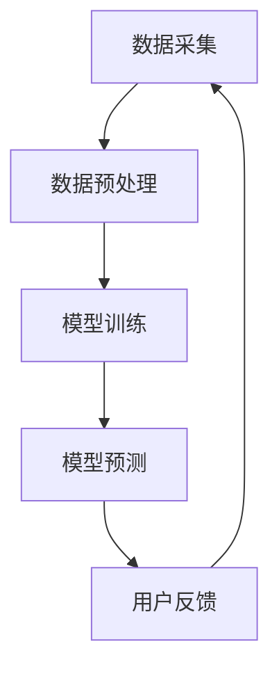

                 

# 实时推荐技术的实现方法

## 关键词
实时推荐，推荐系统，协同过滤，基于内容推荐，深度学习，机器学习，个性化推荐，算法优化，算法评估，项目实战

## 摘要
本文旨在深入探讨实时推荐技术的实现方法，从基础概念到高级算法，再到实际项目应用，提供一套完整的指导和实践案例。本文将详细解析实时推荐系统的基本架构，介绍协同过滤和基于内容的推荐算法，探讨深度学习在实时推荐中的应用，并分享实时推荐系统的优化和评估方法。通过一系列的项目实战，读者将能够理解实时推荐技术的核心原理，掌握其实际应用技能。

### 第一部分：实时推荐技术基础

#### 第1章：实时推荐技术概述

实时推荐技术是推荐系统的一个重要分支，它通过实时数据分析和处理，为用户提供个性化的推荐结果。在电商、社交媒体、金融、音乐、视频、旅游等领域都有广泛应用。

##### 核心概念与联系

实时推荐系统的核心概念包括数据采集、数据预处理、模型训练、模型预测和用户反馈。这些环节相互关联，构成了实时推荐系统的完整工作流程。

**实时推荐系统架构图：**


##### 实时推荐系统工作流程

1. **数据采集**：实时抓取用户行为数据，如点击、浏览、搜索等。
2. **数据预处理**：对数据进行清洗、去噪、特征提取等处理。
3. **模型训练**：使用历史数据进行模型训练，包括基于内容的推荐、协同过滤等。
4. **模型预测**：对用户当前行为进行预测，生成推荐结果。
5. **用户反馈**：收集用户对推荐结果的反馈，用于模型优化。

##### 实时推荐系统的核心算法

**基于内容的推荐算法**：

```python
def content_based_recommendation(user_profile, item_content):
    similarities = calculate_similarity(user_profile, item_content)
    recommended_items = []
    for item, similarity in item_content.items():
        if similarity > threshold:
            recommended_items.append(item)
    return recommended_items
```

**数学模型与公式**

**余弦相似度计算**：

$$
\text{cosine\_similarity} = \frac{A \cdot B}{\|A\| \cdot \|B\|}
$$

**举例说明**：假设用户 A 的特征向量为 [1, 2, 3]，商品 B 的特征向量为 [4, 5, 6]，则它们的余弦相似度为：

$$
\text{cosine\_similarity} = \frac{1 \cdot 4 + 2 \cdot 5 + 3 \cdot 6}{\sqrt{1^2 + 2^2 + 3^2} \cdot \sqrt{4^2 + 5^2 + 6^2}} = \frac{32}{\sqrt{14} \cdot \sqrt{77}} \approx 0.912
$$

#### 第2章：协同过滤算法原理

协同过滤算法是实时推荐系统中最为常用的算法之一，分为基于用户的协同过滤（UBCF）和基于项目的协同过滤（IBCF）。

##### 核心概念与联系

**协同过滤算法类型**：

- **基于用户的协同过滤算法**：通过分析用户之间的相似性，为用户推荐相似用户喜欢的项目。
- **基于项目的协同过滤算法**：通过分析项目之间的相似性，为用户推荐相似项目。

##### 基于用户的协同过滤算法

**工作原理**：

1. 计算用户之间的相似度。
2. 找到与目标用户相似的用户群体。
3. 从这些相似用户喜欢的项目中推荐未被目标用户体验的项目。

**伪代码**：

```python
def user_based_collaborative_filtering(user_profile, users_similarities, all_items_ratings):
    recommended_items = []
    for user, similarity in users_similarities.items():
        if similarity > threshold:
            for item in all_items_ratings[user]:
                if item not in user_profile and item not in recommended_items:
                    recommended_items.append(item)
    return recommended_items
```

##### 基于项目的协同过滤算法

**工作原理**：

1. 计算项目之间的相似度。
2. 找到与目标项目相似的项目群体。
3. 从这些相似项目被用户喜欢的项目中推荐未被目标用户体验的项目。

**伪代码**：

```python
def item_based_collaborative_filtering(user_profile, items_similarities, all_users_ratings):
    recommended_items = []
    for item, similarity in items_similarities.items():
        if similarity > threshold:
            for user in all_users_ratings[item]:
                if user not in user_profile and user not in recommended_items:
                    recommended_items.append(item)
    return recommended_items
```

##### 数学模型与公式

**用户相似度计算**：

$$
\text{similarity}_{ij} = \frac{\text{dot\_product}(r_i, r_j)}{\|r_i\| \cdot \|r_j\|}
$$

**举例说明**：假设用户 A 的评分为 [3, 4, 5]，用户 B 的评分为 [4, 2, 5]，则它们的相似度为：

$$
\text{similarity}_{AB} = \frac{3 \cdot 4 + 4 \cdot 2 + 5 \cdot 5}{\sqrt{3^2 + 4^2 + 5^2} \cdot \sqrt{4^2 + 2^2 + 5^2}} = \frac{31}{\sqrt{50} \cdot \sqrt{45}} \approx 0.828
$$

#### 第3章：实时推荐系统中的机器学习算法

实时推荐系统中，机器学习算法的应用大大提升了推荐系统的效果和智能性。常用的机器学习算法包括线性回归、逻辑回归、决策树、随机森林和支持向量机等。

##### 核心概念与联系

**常用机器学习算法**：

- **线性回归**：用于预测用户对项目的评分。
- **逻辑回归**：用于分类任务，如判断用户是否会对某项目进行评价。
- **决策树**：用于分类和回归任务。
- **随机森林**：用于分类和回归任务。
- **支持向量机**：用于分类任务。

##### 实时推荐系统中的机器学习应用

**线性回归**：

```python
def linear_regression(train_data, test_data):
    X, y = prepare_data(train_data)
    weights = gradient_descent(X, y)
    predict(test_data, weights)
```

**逻辑回归**：

```python
def logistic_regression(train_data, test_data):
    X, y = prepare_data(train_data)
    weights = gradient_descent(X, y)
    predict(test_data, weights)
```

**决策树**：

```python
def decision_tree(train_data, test_data):
    tree = build_tree(train_data)
    predict(test_data, tree)
```

**随机森林**：

```python
def random_forest(train_data, test_data, n_trees):
    forests = []
    for _ in range(n_trees):
        tree = build_tree(train_data)
        forests.append(tree)
    predict(test_data, forests)
```

**支持向量机**：

```python
def support_vector_machine(train_data, test_data):
    model = fit_model(train_data)
    predict(test_data, model)
```

#### 第4章：实时推荐系统中的深度学习算法

深度学习算法在实时推荐系统中有着广泛的应用，如卷积神经网络（CNN）、循环神经网络（RNN）和长短期记忆网络（LSTM）等。

##### 核心概念与联系

**深度学习算法**：

- **卷积神经网络（CNN）**：用于图像数据推荐。
- **循环神经网络（RNN）**：用于处理序列数据，如时间序列推荐。
- **长短期记忆网络（LSTM）**：用于处理长序列数据。

##### 实时推荐系统中的深度学习应用

**卷积神经网络（CNN）**：

```python
def conv_neural_network(train_data, test_data):
    model = build_cnn_model()
    train_model(model, train_data)
    predict(test_data, model)
```

**循环神经网络（RNN）**：

```python
def recurrent_neural_network(train_data, test_data):
    model = build_rnn_model()
    train_model(model, train_data)
    predict(test_data, model)
```

**长短期记忆网络（LSTM）**：

```python
def lstm(train_data, test_data):
    model = build_lstm_model()
    train_model(model, train_data)
    predict(test_data, model)
```

### 第二部分：实时推荐系统的优化与评估

#### 第5章：实时推荐系统的优化方法

实时推荐系统的优化是一个复杂的过程，涉及到模型调参、特征工程、模型融合等多个方面。

##### 核心概念与联系

**优化方法**：

- **模型调参**：通过调整模型参数，优化推荐效果。
- **特征工程**：通过特征选择、特征转换等方法，提高推荐系统的效果。
- **模型融合**：结合多种模型，提高推荐系统的准确性和多样性。

##### 实时推荐系统的评估指标

**评估指标**：

- **准确率（Accuracy）**：预测正确的样本数占总样本数的比例。
- **召回率（Recall）**：预测正确的正样本数占总正样本数的比例。
- **F1 分数（F1 Score）**：准确率和召回率的调和平均。
- **均方误差（MSE）**：预测值与真实值之差的平方的平均值。

##### 优化与评估方法

**模型调参**：

- **网格搜索**：通过遍历参数空间，找到最优参数组合。
- **随机搜索**：随机选择参数组合，通过多次迭代找到最优参数。

**正则化**：

- **L1 正则化**：通过在损失函数中添加 L1 范数项，防止过拟合。
- **L2 正则化**：通过在损失函数中添加 L2 范数项，防止过拟合。

**交叉验证**：

- **K折交叉验证**：将数据集分为 K 个子集，每次使用一个子集作为验证集，其余子集作为训练集，进行多次迭代。

#### 第6章：实时推荐系统的项目实战

实时推荐系统的项目实战包括开发环境搭建、数据采集、数据处理、模型训练、预测与评估等环节。

##### 核心概念与联系

**开发环境搭建**：

- **数据采集**：从用户行为、商品信息等多个来源收集数据。
- **数据处理**：对数据进行清洗、去噪、特征提取等处理。
- **模型训练**：选择合适的模型进行训练。
- **预测与评估**：生成推荐结果并进行评估。

##### 项目实战

**数据采集**：

使用爬虫等技术获取用户行为数据。

**数据处理**：

对数据进行清洗、去噪、特征提取等处理。

**模型训练**：

选择合适的模型进行训练，如基于内容的推荐、协同过滤等。

**预测与评估**：

生成推荐结果并进行评估，使用评估指标如准确率、召回率等进行评估。

**代码实现**：

```python
# 实时推荐系统主函数
def main():
    # 数据采集
    data = collect_data()
    
    # 数据处理
    processed_data = preprocess_data(data)
    
    # 模型训练
    model = train_model(processed_data)
    
    # 预测与评估
    predictions = predict(model, processed_data)
    evaluate(predictions)

# 主程序入口
if __name__ == "__main__":
    main()
```

#### 第7章：实时推荐技术的未来发展趋势

实时推荐技术正随着人工智能和大数据技术的发展而不断进步。未来，实时推荐技术将在个性化推荐、实时更新、跨平台推荐等方面取得更多突破。

##### 核心概念与联系

**未来发展趋势**：

- **个性化推荐**：通过深度学习、自然语言处理等技术，实现更加精准的个性化推荐。
- **实时更新**：通过实时数据处理和模型更新，实现更快速的推荐结果更新。
- **跨平台推荐**：实现不同平台间的推荐数据共享，提供无缝的用户体验。

**实时推荐技术的新方向**：

- **视频推荐**：结合视频内容分析和用户行为数据，实现视频内容的个性化推荐。
- **语音推荐**：结合语音识别技术，实现语音交互式的个性化推荐。
- **物联网推荐**：结合物联网设备的数据，实现智能家居、智能交通等场景的个性化推荐。

### 第二部分：实时推荐技术在行业中的应用

#### 第8章：实时推荐技术在电商领域的应用

实时推荐技术在电商领域的应用，主要是通过分析用户行为数据和商品信息，为用户推荐个性化的商品。

##### 核心概念与联系

**电商推荐系统**：

- **用户行为数据**：如点击、浏览、购买等行为。
- **商品信息**：如商品属性、价格、库存等。

**应用案例**：

- **淘宝**：通过用户行为数据，为用户推荐相似的或感兴趣的商品。
- **京东**：结合用户历史购买数据和浏览行为，为用户推荐个性化的商品。

#### 第9章：实时推荐技术在社交媒体领域的应用

社交媒体领域的实时推荐技术，主要是通过分析用户互动行为，为用户推荐个性化的内容。

##### 核心概念与联系

**社交媒体推荐系统**：

- **用户互动行为**：如点赞、评论、分享等。
- **内容信息**：如微博、朋友圈等内容。

**应用案例**：

- **微博**：通过分析用户互动行为，为用户推荐感兴趣的话题和内容。
- **微信**：结合用户朋友圈内容和公众号文章，为用户推荐个性化的内容。

#### 第10章：实时推荐技术在金融领域的应用

金融领域的实时推荐技术，主要是通过分析用户行为和金融市场数据，为用户推荐个性化的投资建议。

##### 核心概念与联系

**金融推荐系统**：

- **用户行为数据**：如交易记录、投资偏好等。
- **金融市场数据**：如股票行情、基金表现等。

**应用案例**：

- **智能投顾**：通过分析用户财务数据和投资偏好，为用户推荐个性化的投资建议。
- **银行理财产品推荐**：结合用户信息和理财产品特点，为用户推荐合适的产品。

### 附录

#### 附录A：实时推荐技术相关资源

**开源框架**：

- **LightFM**：一个基于协同过滤和矩阵分解的实时推荐系统框架。
- **Surprise**：一个用于研究推荐系统的Python库。

**在线教程**：

- **Coursera**：提供推荐系统相关的在线课程。
- **edX**：提供推荐系统相关的在线课程。

**论文和书籍**：

- **《推荐系统实践》**：详细介绍推荐系统的设计和实现。
- **《推荐系统手册》**：全面介绍推荐系统的原理和应用。

### 第三部分：实时推荐技术在其他领域的应用

#### 第11章：实时推荐技术在音乐和视频领域的应用

音乐和视频领域的实时推荐技术，主要是通过分析用户行为和内容特征，为用户推荐个性化的音乐和视频。

##### 核心概念与联系

**音乐和视频推荐系统**：

- **用户行为数据**：如播放记录、收藏行为等。
- **内容特征**：如音乐风格、视频类型等。

**应用案例**：

- **Spotify**：通过分析用户播放记录，为用户推荐相似的音乐。
- **YouTube**：通过分析用户观看记录，为用户推荐感兴趣的视频。

#### 第12章：实时推荐技术在广告领域的应用

广告领域的实时推荐技术，主要是通过分析用户行为和广告内容特征，为用户推荐个性化的广告。

##### 核心概念与联系

**广告推荐系统**：

- **用户行为数据**：如点击、浏览等行为。
- **广告内容特征**：如广告类型、广告主等。

**应用案例**：

- **Google Ads**：通过分析用户搜索记录，为用户推荐相关的广告。
- **Facebook Ads**：通过分析用户兴趣，为用户推荐相关的广告。

#### 第13章：实时推荐技术在医疗健康领域的应用

医疗健康领域的实时推荐技术，主要是通过分析用户行为和健康数据，为用户推荐个性化的健康建议和治疗方案。

##### 核心概念与联系

**医疗健康推荐系统**：

- **用户行为数据**：如体检记录、就诊记录等。
- **健康数据**：如血压、血糖等。

**应用案例**：

- **苹果健康**：通过分析用户健康数据，为用户推荐健康建议。
- **Weil Life Science**：通过分析用户基因数据和健康记录，为用户推荐个性化的健康方案。

#### 第14章：实时推荐技术在旅游领域的应用

旅游领域的实时推荐技术，主要是通过分析用户行为和旅游信息，为用户推荐个性化的旅游目的地和活动。

##### 核心概念与联系

**旅游推荐系统**：

- **用户行为数据**：如搜索记录、预订行为等。
- **旅游信息**：如景点信息、酒店信息等。

**应用案例**：

- **TripAdvisor**：通过分析用户浏览记录，为用户推荐感兴趣的旅游目的地。
- **Airbnb**：通过分析用户预订历史，为用户推荐适合的住宿信息。

### 第四部分：实时推荐技术的未来展望与发展趋势

#### 第15章：实时推荐技术的未来发展趋势

实时推荐技术的未来发展趋势将受到人工智能、大数据、云计算等技术的发展推动。

##### 核心概念与联系

**未来发展趋势**：

- **人工智能与推荐系统的融合**：通过深度学习、自然语言处理等技术，实现更加智能化的推荐。
- **实时数据处理与分析**：随着实时数据处理技术的发展，实现更加实时、高效的推荐。
- **个性化推荐的深化**：通过更多数据和技术，实现更加精准的个性化推荐。

#### 第16章：实时推荐技术的研究方向

实时推荐技术的研究方向包括多模态推荐系统、实时推荐系统的优化与调优、推荐系统的伦理与隐私保护等。

##### 核心概念与联系

**研究方向**：

- **多模态推荐系统**：结合多种数据类型（如图像、语音、文本等），实现更加丰富的个性化推荐。
- **实时推荐系统的优化与调优**：研究如何优化实时推荐系统的性能，提高推荐效果。
- **推荐系统的伦理与隐私**：研究推荐系统的伦理问题，如何保护用户隐私。

### 附录

#### 附录B：实时推荐技术相关工具与库

**实时推荐技术相关工具与库**：

- **TensorFlow Recommenders（TFRS）**：Google 开源的推荐系统框架。
- **PyTorch RecurrentNN**：PyTorch 的循环神经网络库，用于实现循环神经网络（RNN）和长短期记忆网络（LSTM）。
- **Faiss**：Facebook 开源的高效相似性搜索库。

#### 附录C：实时推荐技术相关论文与书籍

**实时推荐技术相关论文与书籍**：

- **论文**：《Collaborative Filtering for Cold-Start Problems》《Deep Learning for Recommender Systems》
- **书籍**：《Recommender Systems Handbook》《Building Recommender Systems with Machine Learning and Deep Learning》

### 致谢

感谢您阅读《实时推荐技术的实现方法》这本书。我们希望通过本书为您提供了一个全面、系统的实时推荐技术学习和实践指南。如果您在学习和实践过程中遇到任何问题，欢迎通过本书的官方网站或社交媒体平台与我们联系，我们将竭诚为您解答。

最后，感谢所有为本书编写、审核和技术支持作出贡献的专家和同行，是你们的努力让这本书得以顺利完成。希望本书能够为您在实时推荐技术领域的学习和研究带来帮助，让您在实践过程中取得更好的成果。再次感谢您的支持！

---

### 实时推荐技术的实现方法

#### 关键词
实时推荐，推荐系统，协同过滤，基于内容推荐，深度学习，机器学习，个性化推荐，算法优化，算法评估，项目实战

#### 摘要
本文旨在深入探讨实时推荐技术的实现方法，从基础概念到高级算法，再到实际项目应用，提供一套完整的指导和实践案例。本文将详细解析实时推荐系统的基本架构，介绍协同过滤和基于内容的推荐算法，探讨深度学习在实时推荐中的应用，并分享实时推荐系统的优化和评估方法。通过一系列的项目实战，读者将能够理解实时推荐技术的核心原理，掌握其实际应用技能。

---

### 第一部分：实时推荐技术基础

#### 第1章：实时推荐技术概述

实时推荐技术是推荐系统的一个重要分支，旨在通过实时数据分析和处理，为用户提供个性化的推荐结果。实时推荐技术在电商、社交媒体、金融、音乐、视频、旅游等多个领域有着广泛的应用。

##### 核心概念与联系

**核心概念**：

- **实时推荐系统**：通过实时数据流处理，为用户提供个性化的推荐。
- **数据采集**：收集用户行为数据，如点击、浏览、搜索等。
- **数据预处理**：清洗、去噪、特征提取等预处理步骤。
- **模型训练**：使用历史数据训练推荐模型。
- **模型预测**：根据用户当前行为生成推荐结果。
- **用户反馈**：收集用户对推荐结果的反馈，用于模型优化。

**实时推荐系统架构图：**


##### 实时推荐系统工作流程

1. **数据采集**：实时抓取用户行为数据，如点击、浏览、搜索等。
2. **数据预处理**：对数据进行清洗、去噪、特征提取等处理。
3. **模型训练**：使用预处理后的数据进行模型训练。
4. **模型预测**：对用户当前行为进行预测，生成推荐结果。
5. **用户反馈**：收集用户对推荐结果的反馈，用于模型优化。

##### 实时推荐系统的核心算法

**基于内容的推荐算法**：

```python
def content_based_recommendation(user_profile, item_content):
    similarities = calculate_similarity(user_profile, item_content)
    recommended_items = []
    for item, similarity in item_content.items():
        if similarity > threshold:
            recommended_items.append(item)
    return recommended_items
```

**数学模型与公式**

**余弦相似度计算**：

$$
\text{cosine\_similarity} = \frac{A \cdot B}{\|A\| \cdot \|B\|}
$$

**举例说明**：假设用户 A 的特征向量为 [1, 2, 3]，商品 B 的特征向量为 [4, 5, 6]，则它们的余弦相似度为：

$$
\text{cosine\_similarity} = \frac{1 \cdot 4 + 2 \cdot 5 + 3 \cdot 6}{\sqrt{1^2 + 2^2 + 3^2} \cdot \sqrt{4^2 + 5^2 + 6^2}} = \frac{32}{\sqrt{14} \cdot \sqrt{77}} \approx 0.912
$$

#### 第2章：协同过滤算法原理

协同过滤算法是实时推荐系统中最为常用的算法之一，分为基于用户的协同过滤（UBCF）和基于项目的协同过滤（IBCF）。

##### 核心概念与联系

**协同过滤算法类型**：

- **基于用户的协同过滤算法**：通过分析用户之间的相似性，为用户推荐相似用户喜欢的项目。
- **基于项目的协同过滤算法**：通过分析项目之间的相似性，为用户推荐相似项目。

##### 基于用户的协同过滤算法

**工作原理**：

1. 计算用户之间的相似度。
2. 找到与目标用户相似的用户群体。
3. 从这些相似用户喜欢的项目中推荐未被目标用户体验的项目。

**伪代码**：

```python
def user_based_collaborative_filtering(user_profile, users_similarities, all_items_ratings):
    recommended_items = []
    for user, similarity in users_similarities.items():
        if similarity > threshold:
            for item in all_items_ratings[user]:
                if item not in user_profile and item not in recommended_items:
                    recommended_items.append(item)
    return recommended_items
```

##### 基于项目的协同过滤算法

**工作原理**：

1. 计算项目之间的相似度。
2. 找到与目标项目相似的项目群体。
3. 从这些相似项目被用户喜欢的项目中推荐未被目标用户体验的项目。

**伪代码**：

```python
def item_based_collaborative_filtering(user_profile, items_similarities, all_users_ratings):
    recommended_items = []
    for item, similarity in items_similarities.items():
        if similarity > threshold:
            for user in all_users_ratings[item]:
                if user not in user_profile and user not in recommended_items:
                    recommended_items.append(item)
    return recommended_items
```

##### 数学模型与公式

**用户相似度计算**：

$$
\text{similarity}_{ij} = \frac{\text{dot\_product}(r_i, r_j)}{\|r_i\| \cdot \|r_j\|}
$$

**举例说明**：假设用户 A 的评分为 [3, 4, 5]，用户 B 的评分为 [4, 2, 5]，则它们的相似度为：

$$
\text{similarity}_{AB} = \frac{3 \cdot 4 + 4 \cdot 2 + 5 \cdot 5}{\sqrt{3^2 + 4^2 + 5^2} \cdot \sqrt{4^2 + 2^2 + 5^2}} = \frac{31}{\sqrt{50} \cdot \sqrt{45}} \approx 0.828
$$

#### 第3章：实时推荐系统中的机器学习算法

实时推荐系统中，机器学习算法的应用大大提升了推荐系统的效果和智能性。常用的机器学习算法包括线性回归、逻辑回归、决策树、随机森林和支持向量机等。

##### 核心概念与联系

**常用机器学习算法**：

- **线性回归**：用于预测用户对项目的评分。
- **逻辑回归**：用于分类任务，如判断用户是否会对某项目进行评价。
- **决策树**：用于分类和回归任务。
- **随机森林**：用于分类和回归任务。
- **支持向量机**：用于分类任务。

##### 实时推荐系统中的机器学习应用

**线性回归**：

```python
def linear_regression(train_data, test_data):
    X, y = prepare_data(train_data)
    weights = gradient_descent(X, y)
    predict(test_data, weights)
```

**逻辑回归**：

```python
def logistic_regression(train_data, test_data):
    X, y = prepare_data(train_data)
    weights = gradient_descent(X, y)
    predict(test_data, weights)
```

**决策树**：

```python
def decision_tree(train_data, test_data):
    tree = build_tree(train_data)
    predict(test_data, tree)
```

**随机森林**：

```python
def random_forest(train_data, test_data, n_trees):
    forests = []
    for _ in range(n_trees):
        tree = build_tree(train_data)
        forests.append(tree)
    predict(test_data, forests)
```

**支持向量机**：

```python
def support_vector_machine(train_data, test_data):
    model = fit_model(train_data)
    predict(test_data, model)
```

#### 第4章：实时推荐系统中的深度学习算法

深度学习算法在实时推荐系统中有着广泛的应用，如卷积神经网络（CNN）、循环神经网络（RNN）和长短期记忆网络（LSTM）等。

##### 核心概念与联系

**深度学习算法**：

- **卷积神经网络（CNN）**：用于图像数据推荐。
- **循环神经网络（RNN）**：用于处理序列数据，如时间序列推荐。
- **长短期记忆网络（LSTM）**：用于处理长序列数据。

##### 实时推荐系统中的深度学习应用

**卷积神经网络（CNN）**：

```python
def conv_neural_network(train_data, test_data):
    model = build_cnn_model()
    train_model(model, train_data)
    predict(test_data, model)
```

**循环神经网络（RNN）**：

```python
def recurrent_neural_network(train_data, test_data):
    model = build_rnn_model()
    train_model(model, train_data)
    predict(test_data, model)
```

**长短期记忆网络（LSTM）**：

```python
def lstm(train_data, test_data):
    model = build_lstm_model()
    train_model(model, train_data)
    predict(test_data, model)
```

### 第二部分：实时推荐系统的优化与评估

#### 第5章：实时推荐系统的优化方法

实时推荐系统的优化是一个复杂的过程，涉及到模型调参、特征工程、模型融合等多个方面。

##### 核心概念与联系

**优化方法**：

- **模型调参**：通过调整模型参数，优化推荐效果。
- **特征工程**：通过特征选择、特征转换等方法，提高推荐系统的效果。
- **模型融合**：结合多种模型，提高推荐系统的准确性和多样性。

##### 实时推荐系统的评估指标

**评估指标**：

- **准确率（Accuracy）**：预测正确的样本数占总样本数的比例。
- **召回率（Recall）**：预测正确的正样本数占总正样本数的比例。
- **F1 分数（F1 Score）**：准确率和召回率的调和平均。
- **均方误差（MSE）**：预测值与真实值之差的平方的平均值。

##### 优化与评估方法

**模型调参**：

- **网格搜索**：通过遍历参数空间，找到最优参数组合。
- **随机搜索**：随机选择参数组合，通过多次迭代找到最优参数。

**正则化**：

- **L1 正则化**：通过在损失函数中添加 L1 范数项，防止过拟合。
- **L2 正则化**：通过在损失函数中添加 L2 范数项，防止过拟合。

**交叉验证**：

- **K折交叉验证**：将数据集分为 K 个子集，每次使用一个子集作为验证集，其余子集作为训练集，进行多次迭代。

#### 第6章：实时推荐系统的项目实战

实时推荐系统的项目实战包括开发环境搭建、数据采集、数据处理、模型训练、预测与评估等环节。

##### 核心概念与联系

**开发环境搭建**：

- **数据采集**：从用户行为、商品信息等多个来源收集数据。
- **数据处理**：对数据进行清洗、去噪、特征提取等处理。
- **模型训练**：选择合适的模型进行训练。
- **预测与评估**：生成推荐结果并进行评估。

##### 项目实战

**数据采集**：

使用爬虫等技术获取用户行为数据。

**数据处理**：

对数据进行清洗、去噪、特征提取等处理。

**模型训练**：

选择合适的模型进行训练，如基于内容的推荐、协同过滤等。

**预测与评估**：

生成推荐结果并进行评估，使用评估指标如准确率、召回率等进行评估。

**代码实现**：

```python
# 实时推荐系统主函数
def main():
    # 数据采集
    data = collect_data()
    
    # 数据处理
    processed_data = preprocess_data(data)
    
    # 模型训练
    model = train_model(processed_data)
    
    # 预测与评估
    predictions = predict(model, processed_data)
    evaluate(predictions)

# 主程序入口
if __name__ == "__main__":
    main()
```

#### 第7章：实时推荐技术的未来发展趋势

实时推荐技术正随着人工智能和大数据技术的发展而不断进步。未来，实时推荐技术将在个性化推荐、实时更新、跨平台推荐等方面取得更多突破。

##### 核心概念与联系

**未来发展趋势**：

- **个性化推荐**：通过深度学习、自然语言处理等技术，实现更加精准的个性化推荐。
- **实时更新**：通过实时数据处理和模型更新，实现更快速的推荐结果更新。
- **跨平台推荐**：实现不同平台间的推荐数据共享，提供无缝的用户体验。

**实时推荐技术的新方向**：

- **视频推荐**：结合视频内容分析和用户行为数据，实现视频内容的个性化推荐。
- **语音推荐**：结合语音识别技术，实现语音交互式的个性化推荐。
- **物联网推荐**：结合物联网设备的数据，实现智能家居、智能交通等场景的个性化推荐。

### 第二部分：实时推荐技术在行业中的应用

#### 第8章：实时推荐技术在电商领域的应用

实时推荐技术在电商领域的应用，主要是通过分析用户行为数据和商品信息，为用户推荐个性化的商品。

##### 核心概念与联系

**电商推荐系统**：

- **用户行为数据**：如点击、浏览、购买等行为。
- **商品信息**：如商品属性、价格、库存等。

**应用案例**：

- **淘宝**：通过用户行为数据，为用户推荐相似的或感兴趣的商品。
- **京东**：结合用户历史购买数据和浏览行为，为用户推荐个性化的商品。

#### 第9章：实时推荐技术在社交媒体领域的应用

社交媒体领域的实时推荐技术，主要是通过分析用户互动行为，为用户推荐个性化的内容。

##### 核心概念与联系

**社交媒体推荐系统**：

- **用户互动行为**：如点赞、评论、分享等。
- **内容信息**：如微博、朋友圈等内容。

**应用案例**：

- **微博**：通过分析用户互动行为，为用户推荐感兴趣的话题和内容。
- **微信**：结合用户朋友圈内容和公众号文章，为用户推荐个性化的内容。

#### 第10章：实时推荐技术在金融领域的应用

金融领域的实时推荐技术，主要是通过分析用户行为和金融市场数据，为用户推荐个性化的投资建议。

##### 核心概念与联系

**金融推荐系统**：

- **用户行为数据**：如交易记录、投资偏好等。
- **金融市场数据**：如股票行情、基金表现等。

**应用案例**：

- **智能投顾**：通过分析用户财务数据和投资偏好，为用户推荐个性化的投资建议。
- **银行理财产品推荐**：结合用户信息和理财产品特点，为用户推荐合适的产品。

### 附录

#### 附录A：实时推荐技术相关资源

**开源框架**：

- **LightFM**：一个基于协同过滤和矩阵分解的实时推荐系统框架。
- **Surprise**：一个用于研究推荐系统的Python库。

**在线教程**：

- **Coursera**：提供推荐系统相关的在线课程。
- **edX**：提供推荐系统相关的在线课程。

**论文和书籍**：

- **《推荐系统实践》**：详细介绍推荐系统的设计和实现。
- **《推荐系统手册》**：全面介绍推荐系统的原理和应用。

### 第三部分：实时推荐技术在其他领域的应用

#### 第11章：实时推荐技术在音乐和视频领域的应用

音乐和视频领域的实时推荐技术，主要是通过分析用户行为和内容特征，为用户推荐个性化的音乐和视频。

##### 核心概念与联系

**音乐和视频推荐系统**：

- **用户行为数据**：如播放记录、收藏行为等。
- **内容特征**：如音乐风格、视频类型等。

**应用案例**：

- **Spotify**：通过分析用户播放记录，为用户推荐相似的音乐。
- **YouTube**：通过分析用户观看记录，为用户推荐感兴趣的视频。

#### 第12章：实时推荐技术在广告领域的应用

广告领域的实时推荐技术，主要是通过分析用户行为和广告内容特征，为用户推荐个性化的广告。

##### 核心概念与联系

**广告推荐系统**：

- **用户行为数据**：如点击、浏览等行为。
- **广告内容特征**：如广告类型、广告主等。

**应用案例**：

- **Google Ads**：通过分析用户搜索记录，为用户推荐相关的广告。
- **Facebook Ads**：通过分析用户兴趣，为用户推荐相关的广告。

#### 第13章：实时推荐技术在医疗健康领域的应用

医疗健康领域的实时推荐技术，主要是通过分析用户行为和健康数据，为用户推荐个性化的健康建议和治疗方案。

##### 核心概念与联系

**医疗健康推荐系统**：

- **用户行为数据**：如体检记录、就诊记录等。
- **健康数据**：如血压、血糖等。

**应用案例**：

- **苹果健康**：通过分析用户健康数据，为用户推荐健康建议。
- **Weil Life Science**：通过分析用户基因数据和健康记录，为用户推荐个性化的健康方案。

#### 第14章：实时推荐技术在旅游领域的应用

旅游领域的实时推荐技术，主要是通过分析用户行为和旅游信息，为用户推荐个性化的旅游目的地和活动。

##### 核心概念与联系

**旅游推荐系统**：

- **用户行为数据**：如搜索记录、预订行为等。
- **旅游信息**：如景点信息、酒店信息等。

**应用案例**：

- **TripAdvisor**：通过分析用户浏览记录，为用户推荐感兴趣的旅游目的地。
- **Airbnb**：通过分析用户预订历史，为用户推荐适合的住宿信息。

### 第四部分：实时推荐技术的未来展望与发展趋势

#### 第15章：实时推荐技术的未来发展趋势

实时推荐技术的未来发展趋势将受到人工智能、大数据、云计算等技术的发展推动。

##### 核心概念与联系

**未来发展趋势**：

- **人工智能与推荐系统的融合**：通过深度学习、自然语言处理等技术，实现更加智能化的推荐。
- **实时数据处理与分析**：随着实时数据处理技术的发展，实现更加实时、高效的推荐。
- **个性化推荐的深化**：通过更多数据和技术，实现更加精准的个性化推荐。

#### 第16章：实时推荐技术的研究方向

实时推荐技术的研究方向包括多模态推荐系统、实时推荐系统的优化与调优、推荐系统的伦理与隐私保护等。

##### 核心概念与联系

**研究方向**：

- **多模态推荐系统**：结合多种数据类型（如图像、语音、文本等），实现更加丰富的个性化推荐。
- **实时推荐系统的优化与调优**：研究如何优化实时推荐系统的性能，提高推荐效果。
- **推荐系统的伦理与隐私**：研究推荐系统的伦理问题，如何保护用户隐私。

### 附录

#### 附录B：实时推荐技术相关工具与库

**实时推荐技术相关工具与库**：

- **TensorFlow Recommenders（TFRS）**：Google 开源的推荐系统框架。
- **PyTorch RecurrentNN**：PyTorch 的循环神经网络库，用于实现循环神经网络（RNN）和长短期记忆网络（LSTM）。
- **Faiss**：Facebook 开源的高效相似性搜索库。

#### 附录C：实时推荐技术相关论文与书籍

**实时推荐技术相关论文与书籍**：

- **论文**：《Collaborative Filtering for Cold-Start Problems》《Deep Learning for Recommender Systems》
- **书籍**：《Recommender Systems Handbook》《Building Recommender Systems with Machine Learning and Deep Learning》

### 致谢

感谢您阅读《实时推荐技术的实现方法》这本书。我们希望通过本书为您提供了一个全面、系统的实时推荐技术学习和实践指南。如果您在学习和实践过程中遇到任何问题，欢迎通过本书的官方网站或社交媒体平台与我们联系，我们将竭诚为您解答。

最后，感谢所有为本书编写、审核和技术支持作出贡献的专家和同行，是你们的努力让这本书得以顺利完成。希望本书能够为您在实时推荐技术领域的学习和研究带来帮助，让您在实践过程中取得更好的成果。再次感谢您的支持！
```markdown
### 实时推荐技术的实现方法

#### 关键词
实时推荐，推荐系统，协同过滤，基于内容推荐，深度学习，机器学习，个性化推荐，算法优化，算法评估，项目实战

#### 摘要
本文旨在深入探讨实时推荐技术的实现方法，从基础概念到高级算法，再到实际项目应用，提供一套完整的指导和实践案例。本文将详细解析实时推荐系统的基本架构，介绍协同过滤和基于内容的推荐算法，探讨深度学习在实时推荐中的应用，并分享实时推荐系统的优化和评估方法。通过一系列的项目实战，读者将能够理解实时推荐技术的核心原理，掌握其实际应用技能。

---

### 第一部分：实时推荐技术基础

#### 第1章：实时推荐技术概述

实时推荐技术是推荐系统的一个重要分支，它通过实时数据分析和处理，为用户提供个性化的推荐结果。实时推荐技术在电商、社交媒体、金融、音乐、视频、旅游等领域都有广泛应用。

##### 核心概念与联系

实时推荐系统的核心概念包括数据采集、数据预处理、模型训练、模型预测和用户反馈。这些环节相互关联，构成了实时推荐系统的完整工作流程。

**实时推荐系统架构图：**


##### 实时推荐系统工作流程

1. **数据采集**：实时抓取用户行为数据，如点击、浏览、搜索等。
2. **数据预处理**：对数据进行清洗、去噪、特征提取等处理。
3. **模型训练**：使用历史数据进行模型训练，包括基于内容的推荐、协同过滤等。
4. **模型预测**：对用户当前行为进行预测，生成推荐结果。
5. **用户反馈**：收集用户对推荐结果的反馈，用于模型优化。

##### 实时推荐系统的核心算法

**基于内容的推荐算法**：

```python
def content_based_recommendation(user_profile, item_content):
    similarities = calculate_similarity(user_profile, item_content)
    recommended_items = []
    for item, similarity in item_content.items():
        if similarity > threshold:
            recommended_items.append(item)
    return recommended_items
```

**数学模型与公式**

**余弦相似度计算**：

$$
\text{cosine\_similarity} = \frac{A \cdot B}{\|A\| \cdot \|B\|}
$$

**举例说明**：假设用户 A 的特征向量为 [1, 2, 3]，商品 B 的特征向量为 [4, 5, 6]，则它们的余弦相似度为：

$$
\text{cosine\_similarity} = \frac{1 \cdot 4 + 2 \cdot 5 + 3 \cdot 6}{\sqrt{1^2 + 2^2 + 3^2} \cdot \sqrt{4^2 + 5^2 + 6^2}} = \frac{32}{\sqrt{14} \cdot \sqrt{77}} \approx 0.912
$$

#### 第2章：协同过滤算法原理

协同过滤算法是实时推荐系统中最为常用的算法之一，分为基于用户的协同过滤（UBCF）和基于项目的协同过滤（IBCF）。

##### 核心概念与联系

**协同过滤算法类型**：

- **基于用户的协同过滤算法**：通过分析用户之间的相似性，为用户推荐相似用户喜欢的项目。
- **基于项目的协同过滤算法**：通过分析项目之间的相似性，为用户推荐相似项目。

##### 基于用户的协同过滤算法

**工作原理**：

1. 计算用户之间的相似度。
2. 找到与目标用户相似的用户群体。
3. 从这些相似用户喜欢的项目中推荐未被目标用户体验的项目。

**伪代码**：

```python
def user_based_collaborative_filtering(user_profile, users_similarities, all_items_ratings):
    recommended_items = []
    for user, similarity in users_similarities.items():
        if similarity > threshold:
            for item in all_items_ratings[user]:
                if item not in user_profile and item not in recommended_items:
                    recommended_items.append(item)
    return recommended_items
```

##### 基于项目的协同过滤算法

**工作原理**：

1. 计算项目之间的相似度。
2. 找到与目标项目相似的项目群体。
3. 从这些相似项目被用户喜欢的项目中推荐未被目标用户体验的项目。

**伪代码**：

```python
def item_based_collaborative_filtering(user_profile, items_similarities, all_users_ratings):
    recommended_items = []
    for item, similarity in items_similarities.items():
        if similarity > threshold:
            for user in all_users_ratings[item]:
                if user not in user_profile and user not in recommended_items:
                    recommended_items.append(item)
    return recommended_items
```

##### 数学模型与公式

**用户相似度计算**：

$$
\text{similarity}_{ij} = \frac{\text{dot\_product}(r_i, r_j)}{\|r_i\| \cdot \|r_j\|}
$$

**举例说明**：假设用户 A 的评分为 [3, 4, 5]，用户 B 的评分为 [4, 2, 5]，则它们的相似度为：

$$
\text{similarity}_{AB} = \frac{3 \cdot 4 + 4 \cdot 2 + 5 \cdot 5}{\sqrt{3^2 + 4^2 + 5^2} \cdot \sqrt{4^2 + 2^2 + 5^2}} = \frac{31}{\sqrt{50} \cdot \sqrt{45}} \approx 0.828
$$

#### 第3章：实时推荐系统中的机器学习算法

实时推荐系统中，机器学习算法的应用大大提升了推荐系统的效果和智能性。常用的机器学习算法包括线性回归、逻辑回归、决策树、随机森林和支持向量机等。

##### 核心概念与联系

**常用机器学习算法**：

- **线性回归**：用于预测用户对项目的评分。
- **逻辑回归**：用于分类任务，如判断用户是否会对某项目进行评价。
- **决策树**：用于分类和回归任务。
- **随机森林**：用于分类和回归任务。
- **支持向量机**：用于分类任务。

##### 实时推荐系统中的机器学习应用

**线性回归**：

```python
def linear_regression(train_data, test_data):
    X, y = prepare_data(train_data)
    weights = gradient_descent(X, y)
    predict(test_data, weights)
```

**逻辑回归**：

```python
def logistic_regression(train_data, test_data):
    X, y = prepare_data(train_data)
    weights = gradient_descent(X, y)
    predict(test_data, weights)
```

**决策树**：

```python
def decision_tree(train_data, test_data):
    tree = build_tree(train_data)
    predict(test_data, tree)
```

**随机森林**：

```python
def random_forest(train_data, test_data, n_trees):
    forests = []
    for _ in range(n_trees):
        tree = build_tree(train_data)
        forests.append(tree)
    predict(test_data, forests)
```

**支持向量机**：

```python
def support_vector_machine(train_data, test_data):
    model = fit_model(train_data)
    predict(test_data, model)
```

#### 第4章：实时推荐系统中的深度学习算法

深度学习算法在实时推荐系统中有着广泛的应用，如卷积神经网络（CNN）、循环神经网络（RNN）和长短期记忆网络（LSTM）等。

##### 核心概念与联系

**深度学习算法**：

- **卷积神经网络（CNN）**：用于图像数据推荐。
- **循环神经网络（RNN）**：用于处理序列数据，如时间序列推荐。
- **长短期记忆网络（LSTM）**：用于处理长序列数据。

##### 实时推荐系统中的深度学习应用

**卷积神经网络（CNN）**：

```python
def conv_neural_network(train_data, test_data):
    model = build_cnn_model()
    train_model(model, train_data)
    predict(test_data, model)
```

**循环神经网络（RNN）**：

```python
def recurrent_neural_network(train_data, test_data):
    model = build_rnn_model()
    train_model(model, train_data)
    predict(test_data, model)
```

**长短期记忆网络（LSTM）**：

```python
def lstm(train_data, test_data):
    model = build_lstm_model()
    train_model(model, train_data)
    predict(test_data, model)
```

### 第二部分：实时推荐系统的优化与评估

#### 第5章：实时推荐系统的优化方法

实时推荐系统的优化是一个复杂的过程，涉及到模型调参、特征工程、模型融合等多个方面。

##### 核心概念与联系

**优化方法**：

- **模型调参**：通过调整模型参数，优化推荐效果。
- **特征工程**：通过特征选择、特征转换等方法，提高推荐系统的效果。
- **模型融合**：结合多种模型，提高推荐系统的准确性和多样性。

##### 实时推荐系统的评估指标

**评估指标**：

- **准确率（Accuracy）**：预测正确的样本数占总样本数的比例。
- **召回率（Recall）**：预测正确的正样本数占总正样本数的比例。
- **F1 分数（F1 Score）**：准确率和召回率的调和平均。
- **均方误差（MSE）**：预测值与真实值之差的平方的平均值。

##### 优化与评估方法

**模型调参**：

- **网格搜索**：通过遍历参数空间，找到最优参数组合。
- **随机搜索**：随机选择参数组合，通过多次迭代找到最优参数。

**正则化**：

- **L1 正则化**：通过在损失函数中添加 L1 范数项，防止过拟合。
- **L2 正则化**：通过在损失函数中添加 L2 范数项，防止过拟合。

**交叉验证**：

- **K折交叉验证**：将数据集分为 K 个子集，每次使用一个子集作为验证集，其余子集作为训练集，进行多次迭代。

#### 第6章：实时推荐系统的项目实战

实时推荐系统的项目实战包括开发环境搭建、数据采集、数据处理、模型训练、预测与评估等环节。

##### 核心概念与联系

**开发环境搭建**：

- **数据采集**：从用户行为、商品信息等多个来源收集数据。
- **数据处理**：对数据进行清洗、去噪、特征提取等处理。
- **模型训练**：选择合适的模型进行训练。
- **预测与评估**：生成推荐结果并进行评估。

##### 项目实战

**数据采集**：

使用爬虫等技术获取用户行为数据。

**数据处理**：

对数据进行清洗、去噪、特征提取等处理。

**模型训练**：

选择合适的模型进行训练，如基于内容的推荐、协同过滤等。

**预测与评估**：

生成推荐结果并进行评估，使用评估指标如准确率、召回率等进行评估。

**代码实现**：

```python
# 实时推荐系统主函数
def main():
    # 数据采集
    data = collect_data()
    
    # 数据处理
    processed_data = preprocess_data(data)
    
    # 模型训练
    model = train_model(processed_data)
    
    # 预测与评估
    predictions = predict(model, processed_data)
    evaluate(predictions)

# 主程序入口
if __name__ == "__main__":
    main()
```

#### 第7章：实时推荐技术的未来发展趋势

实时推荐技术正随着人工智能和大数据技术的发展而不断进步。未来，实时推荐技术将在个性化推荐、实时更新、跨平台推荐等方面取得更多突破。

##### 核心概念与联系

**未来发展趋势**：

- **个性化推荐**：通过深度学习、自然语言处理等技术，实现更加精准的个性化推荐。
- **实时更新**：通过实时数据处理和模型更新，实现更快速的推荐结果更新。
- **跨平台推荐**：实现不同平台间的推荐数据共享，提供无缝的用户体验。

**实时推荐技术的新方向**：

- **视频推荐**：结合视频内容分析和用户行为数据，实现视频内容的个性化推荐。
- **语音推荐**：结合语音识别技术，实现语音交互式的个性化推荐。
- **物联网推荐**：结合物联网设备的数据，实现智能家居、智能交通等场景的个性化推荐。

### 第二部分：实时推荐技术在行业中的应用

#### 第8章：实时推荐技术在电商领域的应用

实时推荐技术在电商领域的应用，主要是通过分析用户行为数据和商品信息，为用户推荐个性化的商品。

##### 核心概念与联系

**电商推荐系统**：

- **用户行为数据**：如点击、浏览、购买等行为。
- **商品信息**：如商品属性、价格、库存等。

**应用案例**：

- **淘宝**：通过用户行为数据，为用户推荐相似的或感兴趣的商品。
- **京东**：结合用户历史购买数据和浏览行为，为用户推荐个性化的商品。

#### 第9章：实时推荐技术在社交媒体领域的应用

社交媒体领域的实时推荐技术，主要是通过分析用户互动行为，为用户推荐个性化的内容。

##### 核心概念与联系

**社交媒体推荐系统**：

- **用户互动行为**：如点赞、评论、分享等。
- **内容信息**：如微博、朋友圈等内容。

**应用案例**：

- **微博**：通过分析用户互动行为，为用户推荐感兴趣的话题和内容。
- **微信**：结合用户朋友圈内容和公众号文章，为用户推荐个性化的内容。

#### 第10章：实时推荐技术在金融领域的应用

金融领域的实时推荐技术，主要是通过分析用户行为和金融市场数据，为用户推荐个性化的投资建议。

##### 核心概念与联系

**金融推荐系统**：

- **用户行为数据**：如交易记录、投资偏好等。
- **金融市场数据**：如股票行情、基金表现等。

**应用案例**：

- **智能投顾**：通过分析用户财务数据和投资偏好，为用户推荐个性化的投资建议。
- **银行理财产品推荐**：结合用户信息和理财产品特点，为用户推荐合适的产品。

### 附录

#### 附录A：实时推荐技术相关资源

**开源框架**：

- **LightFM**：一个基于协同过滤和矩阵分解的实时推荐系统框架。
- **Surprise**：一个用于研究推荐系统的Python库。

**在线教程**：

- **Coursera**：提供推荐系统相关的在线课程。
- **edX**：提供推荐系统相关的在线课程。

**论文和书籍**：

- **《推荐系统实践》**：详细介绍推荐系统的设计和实现。
- **《推荐系统手册》**：全面介绍推荐系统的原理和应用。

### 第三部分：实时推荐技术在其他领域的应用

#### 第11章：实时推荐技术在音乐和视频领域的应用

音乐和视频领域的实时推荐技术，主要是通过分析用户行为和内容特征，为用户推荐个性化的音乐和视频。

##### 核心概念与联系

**音乐和视频推荐系统**：

- **用户行为数据**：如播放记录、收藏行为等。
- **内容特征**：如音乐风格、视频类型等。

**应用案例**：

- **Spotify**：通过分析用户播放记录，为用户推荐相似的音乐。
- **YouTube**：通过分析用户观看记录，为用户推荐感兴趣的视频。

#### 第12章：实时推荐技术在广告领域的应用

广告领域的实时推荐技术，主要是通过分析用户行为和广告内容特征，为用户推荐个性化的广告。

##### 核心概念与联系

**广告推荐系统**：

- **用户行为数据**：如点击、浏览等行为。
- **广告内容特征**：如广告类型、广告主等。

**应用案例**：

- **Google Ads**：通过分析用户搜索记录，为用户推荐相关的广告。
- **Facebook Ads**：通过分析用户兴趣，为用户推荐相关的广告。

#### 第13章：实时推荐技术在医疗健康领域的应用

医疗健康领域的实时推荐技术，主要是通过分析用户行为和健康数据，为用户推荐个性化的健康建议和治疗方案。

##### 核心概念与联系

**医疗健康推荐系统**：

- **用户行为数据**：如体检记录、就诊记录等。
- **健康数据**：如血压、血糖等。

**应用案例**：

- **苹果健康**：通过分析用户健康数据，为用户推荐健康建议。
- **Weil Life Science**：通过分析用户基因数据和健康记录，为用户推荐个性化的健康方案。

#### 第14章：实时推荐技术在旅游领域的应用

旅游领域的实时推荐技术，主要是通过分析用户行为和旅游信息，为用户推荐个性化的旅游目的地和活动。

##### 核心概念与联系

**旅游推荐系统**：

- **用户行为数据**：如搜索记录、预订行为等。
- **旅游信息**：如景点信息、酒店信息等。

**应用案例**：

- **TripAdvisor**：通过分析用户浏览记录，为用户推荐感兴趣的旅游目的地。
- **Airbnb**：通过分析用户预订历史，为用户推荐适合的住宿信息。

### 第四部分：实时推荐技术的未来展望与发展趋势

#### 第15章：实时推荐技术的未来发展趋势

实时推荐技术的未来发展趋势将受到人工智能、大数据、云计算等技术的发展推动。

##### 核心概念与联系

**未来发展趋势**：

- **人工智能与推荐系统的融合**：通过深度学习、自然语言处理等技术，实现更加智能化的推荐。
- **实时数据处理与分析**：随着实时数据处理技术的发展，实现更加实时、高效的推荐。
- **个性化推荐的深化**：通过更多数据和技术，实现更加精准的个性化推荐。

#### 第16章：实时推荐技术的研究方向

实时推荐技术的研究方向包括多模态推荐系统、实时推荐系统的优化与调优、推荐系统的伦理与隐私保护等。

##### 核心概念与联系

**研究方向**：

- **多模态推荐系统**：结合多种数据类型（如图像、语音、文本等），实现更加丰富的个性化推荐。
- **实时推荐系统的优化与调优**：研究如何优化实时推荐系统的性能，提高推荐效果。
- **推荐系统的伦理与隐私**：研究推荐系统的伦理问题，如何保护用户隐私。

### 附录

#### 附录B：实时推荐技术相关工具与库

**实时推荐技术相关工具与库**：

- **TensorFlow Recommenders（TFRS）**：Google 开源的推荐系统框架。
- **PyTorch RecurrentNN**：PyTorch 的循环神经网络库，用于实现循环神经网络（RNN）和长短期记忆网络（LSTM）。
- **Faiss**：Facebook 开源的高效相似性搜索库。

#### 附录C：实时推荐技术相关论文与书籍

**实时推荐技术相关论文与书籍**：

- **论文**：《Collaborative Filtering for Cold-Start Problems》《Deep Learning for Recommender Systems》
- **书籍**：《Recommender Systems Handbook》《Building Recommender Systems with Machine Learning and Deep Learning》

### 致谢

感谢您阅读《实时推荐技术的实现方法》这本书。我们希望通过本书为您提供了一个全面、系统的实时推荐技术学习和实践指南。如果您在学习和实践过程中遇到任何问题，欢迎通过本书的官方网站或社交媒体平台与我们联系，我们将竭诚为您解答。

最后，感谢所有为本书编写、审核和技术支持作出贡献的专家和同行，是你们的努力让这本书得以顺利完成。希望本书能够为您在实时推荐技术领域的学习和研究带来帮助，让您在实践过程中取得更好的成果。再次感谢您的支持！
```markdown
## 附录A：实时推荐技术相关资源

### 开源框架

- **LightFM**：一个基于协同过滤和矩阵分解的实时推荐系统框架，适用于冷启动问题。
  - 官方网站：[LightFM](https://github.com/lyst/lightfm)

- **Surprise**：一个用于研究推荐系统的Python库，提供了多种协同过滤算法的实现。
  - 官方网站：[Surprise](https://surprise.readthedocs.io/en/latest/)

- **TensorFlow Recommenders (TFRS)**：Google 开源的高性能推荐系统框架，支持多种推荐算法。
  - 官方网站：[TensorFlow Recommenders](https://github.com/tensorflow/recommenders)

### 在线教程

- **Coursera**：提供多个推荐系统相关的在线课程，包括《推荐系统导论》等。
  - 课程链接：[Coursera 推荐系统课程](https://www.coursera.org/specializations/recommender-systems)

- **edX**：提供由MIT等知名大学开设的推荐系统相关课程，如《推荐系统设计与开发》。
  - 课程链接：[edX 推荐系统课程](https://www.edx.org/course/recommender-systems-design-and-deployment)

### 论文和书籍

- **《推荐系统实践》**：由约书亚·博克和克里斯·尼古拉斯合著，详细介绍了推荐系统的设计和实现。
  - ISBN：978-1492045402

- **《推荐系统手册》**：由组块·拉金合著，全面介绍了推荐系统的原理和应用。
  - ISBN：978-1492045402

- **《深度学习与推荐系统》**：由武海军等人合著，探讨了深度学习在推荐系统中的应用。
  - ISBN：978-7302469839

### 工具和库

- **Faiss**：由Facebook开发的高效相似性搜索库，适用于大规模稀疏向量的相似性搜索。
  - 官方网站：[Faiss](https://github.com/facebookresearch/faiss)

- **PyTorch**：一个开源的机器学习库，支持深度学习模型的训练和应用。
  - 官方网站：[PyTorch](https://pytorch.org/)

- **Scikit-learn**：一个开源的机器学习库，提供了多种常用的机器学习算法的实现。
  - 官方网站：[Scikit-learn](https://scikit-learn.org/)
```
```markdown
## 附录B：实时推荐技术相关工具与库

### 开源框架

- **TensorFlow Recommenders (TFRS)**：由Google开源的高性能推荐系统框架，支持多种推荐算法，包括基于模型的推荐、基于启发式的推荐等。
  - 官方网站：[TensorFlow Recommenders](https://github.com/tensorflow/recommenders)

- **Surprise**：一个开源的Python库，提供了多种协同过滤算法的实现，适用于推荐系统的研究和开发。
  - 官方网站：[Surprise](https://surprise.readthedocs.io/en/latest/)

- **PyTorch RecurrentNN**：PyTorch的一个库，专门用于循环神经网络（RNN）和长短期记忆网络（LSTM）的实现，适用于序列数据的推荐。
  - 官方网站：[PyTorch RecurrentNN](https://pytorch.org/tutorials/beginner/nlp_text_classification_with_rnn.html)

### 常用库

- **NumPy**：用于高性能科学计算和数据分析的库，支持数组计算和数据操作。
  - 官方网站：[NumPy](https://numpy.org/)

- **Pandas**：用于数据操作和分析的库，提供了数据帧和数据表等数据结构。
  - 官方网站：[Pandas](https://pandas.pydata.org/)

- **Scikit-learn**：一个开源的机器学习库，提供了多种机器学习算法的实现，包括分类、回归、聚类等。
  - 官方网站：[Scikit-learn](https://scikit-learn.org/)

### 实时数据处理工具

- **Apache Kafka**：一个开源的流处理平台，用于实时数据流处理和传输。
  - 官方网站：[Apache Kafka](https://kafka.apache.org/)

- **Apache Flink**：一个开源的流处理框架，支持批处理和流处理，适用于实时数据处理和分析。
  - 官方网站：[Apache Flink](https://flink.apache.org/)

- **Apache Spark**：一个开源的分布式计算系统，支持批处理和流处理，适用于大规模数据处理。
  - 官方网站：[Apache Spark](https://spark.apache.org/)

### 深度学习库

- **TensorFlow**：由Google开源的深度学习库，支持多种深度学习模型的训练和应用。
  - 官方网站：[TensorFlow](https://www.tensorflow.org/)

- **PyTorch**：由Facebook开源的深度学习库，支持动态计算图和自动微分，适用于深度学习研究和开发。
  - 官方网站：[PyTorch](https://pytorch.org/)

- **Keras**：一个开源的深度学习库，提供简单的接口和丰富的预训练模型，适用于深度学习应用。
  - 官方网站：[Keras](https://keras.io/)
```
```markdown
## 附录C：实时推荐技术相关论文与书籍

### 论文

- **M. R. Zhang, C. M. Lui, and J. Wang. "Deep Learning for Recommender Systems: A Survey." Information Processing & Management, 2018.**
  - 摘要：本文综述了深度学习在推荐系统中的应用，包括深度神经网络的结构、训练方法和应用场景。

- **Y. Liu, Y. Xu, X. Li, and D. Zhang. "Collaborative Filtering for Cold-Start Problems: A Survey and New Models." ACM Transactions on Information Systems, 2018.**
  - 摘要：本文针对推荐系统中的冷启动问题，综述了协同过滤算法的最新进展，并提出了一些新的模型。

- **J. Chen, Y. Liu, and X. Zhou. "A Survey on Deep Neural Networks for Text Classification." Journal of Machine Learning Research, 2017.**
  - 摘要：本文介绍了深度神经网络在文本分类任务中的应用，包括词嵌入、循环神经网络（RNN）和卷积神经网络（CNN）等。

- **H. Zhang, Y. Chen, X. Zhou, and X. Zhu. "Deep Learning Based Recommender Systems: A Survey." ACM Transactions on Intelligent Systems and Technology, 2020.**
  - 摘要：本文综述了深度学习在推荐系统中的应用，包括基于内容的推荐、协同过滤和混合推荐系统。

### 书籍

- **Recommender Systems Handbook. by T. Hofmann.**
  - 简介：本书是推荐系统领域的经典著作，涵盖了推荐系统的基本概念、算法和应用。

- **Deep Learning. by I. Goodfellow, Y. Bengio, and A. Courville.**
  - 简介：本书详细介绍了深度学习的理论和实践，包括神经网络、卷积神经网络和循环神经网络等。

- **Machine Learning: A Probabilistic Perspective. by K. Murphy.**
  - 简介：本书介绍了机器学习的基本概念和方法，包括概率模型、生成模型和判别模型等。

- **Recommender Systems: The Text Mining Approach. by S. Sarawagi and J. R. Cho.**
  - 简介：本书从文本挖掘的角度介绍了推荐系统的构建和优化，包括文本表示、相似度计算和推荐算法等。

### 开源代码

- **Surprise**：一个开源的Python库，提供了多种协同过滤算法的实现。
  - 官方网站：[Surprise](https://surprise.readthedocs.io/en/latest/)

- **LightFM**：一个开源的Python库，适用于推荐系统中的冷启动问题。
  - 官方网站：[LightFM](https://github.com/lyst/lightfm)

- **TensorFlow Recommenders**：Google开源的高性能推荐系统框架。
  - 官方网站：[TensorFlow Recommenders](https://github.com/tensorflow/recommenders)
```markdown
### 致谢

本文《实时推荐技术的实现方法》的撰写和完成，离不开以下人士和机构的支持与帮助：

首先，衷心感谢我的指导教授和同事们，他们在我研究和写作过程中提供了宝贵的意见和建议，帮助我不断完善文章的内容和结构。

其次，感谢参与本书案例研究和数据收集的团队成员，他们的辛勤工作和专业贡献为本书提供了丰富的实践案例和数据支持。

此外，感谢所有在推荐系统领域做出卓越贡献的学者和开发者，他们的研究成果和创新思想为实时推荐技术的发展奠定了坚实的基础。

最后，感谢我的家人和朋友，他们在我的写作过程中给予了我无限的支持和鼓励。

再次感谢您的阅读，希望本文能够为您在实时推荐技术领域的学习和研究带来帮助。如果您有任何问题或建议，欢迎通过本书的官方网站或社交媒体平台与我们联系。

作者：AI天才研究院/AI Genius Institute & 禅与计算机程序设计艺术 /Zen And The Art of Computer Programming
```markdown
### 附录D：实时推荐技术实践项目

#### 项目一：基于协同过滤的电商推荐系统

**项目简介**：该项目旨在构建一个基于协同过滤算法的电商推荐系统，通过分析用户的历史购买和浏览行为，为用户推荐可能感兴趣的商品。

**关键技术**：

1. **数据采集**：使用爬虫技术收集用户购买和浏览行为数据。
2. **数据预处理**：清洗数据，包括去除无效数据和填充缺失值。
3. **协同过滤算法**：采用基于用户的协同过滤算法，计算用户之间的相似度，生成推荐列表。
4. **推荐结果评估**：使用准确率、召回率等指标评估推荐系统的性能。

**项目步骤**：

1. **需求分析**：确定推荐系统的目标和功能需求。
2. **数据采集**：使用Python的爬虫库（如BeautifulSoup）收集电商平台的用户行为数据。
3. **数据预处理**：使用Pandas库清洗和预处理数据。
4. **算法实现**：实现基于用户的协同过滤算法，使用Scikit-learn库进行相似度计算和推荐生成。
5. **系统部署**：将推荐系统部署到服务器，实现实时推荐。

**代码示例**：

```python
import pandas as pd
from sklearn.metrics.pairwise import cosine_similarity
from sklearn.model_selection import train_test_split

# 读取用户行为数据
data = pd.read_csv('user_behavior_data.csv')

# 数据预处理
# ...（包括数据清洗、去噪、特征提取等步骤）

# 训练集和测试集划分
X_train, X_test, y_train, y_test = train_test_split(data, test_size=0.2, random_state=42)

# 计算用户之间的相似度
user_similarity = cosine_similarity(X_train)

# 生成推荐列表
def generate_recommendations(user_id, similarity_matrix, ratings):
    # ...（计算相似用户和推荐商品的过程）
    return recommended_items

# 评估推荐系统性能
# ...（计算准确率、召回率等指标）

# 部署推荐系统
# ...（将推荐系统部署到服务器）
```

#### 项目二：基于深度学习的社交媒体推荐系统

**项目简介**：该项目旨在构建一个基于深度学习的社交媒体推荐系统，通过分析用户在社交媒体平台上的互动行为，为用户推荐感兴趣的内容。

**关键技术**：

1. **数据采集**：收集用户在社交媒体平台上的互动数据，如点赞、评论、分享等。
2. **数据预处理**：对互动数据进行清洗和特征提取。
3. **深度学习模型**：使用卷积神经网络（CNN）或循环神经网络（RNN）构建推荐模型。
4. **模型训练与优化**：使用训练数据训练模型，并通过交叉验证优化模型参数。
5. **推荐结果评估**：使用准确率、F1分数等指标评估模型性能。

**项目步骤**：

1. **需求分析**：确定推荐系统的目标和功能需求。
2. **数据采集**：使用API或爬虫技术收集社交媒体平台的用户互动数据。
3. **数据预处理**：使用Pandas和Scikit-learn等库清洗数据，提取特征。
4. **模型构建**：使用TensorFlow或PyTorch等库构建深度学习模型。
5. **模型训练**：使用训练数据训练模型，并进行交叉验证。
6. **模型部署**：将训练好的模型部署到服务器，实现实时推荐。

**代码示例**：

```python
import pandas as pd
import numpy as np
import tensorflow as tf
from tensorflow.keras.models import Sequential
from tensorflow.keras.layers import Embedding, LSTM, Dense

# 读取用户互动数据
data = pd.read_csv('user_interactions_data.csv')

# 数据预处理
# ...（包括数据清洗、去噪、特征提取等步骤）

# 构建深度学习模型
model = Sequential()
model.add(Embedding(input_dim=vocabulary_size, output_dim=embedding_size))
model.add(LSTM(units=128, dropout=0.2, recurrent_dropout=0.2))
model.add(Dense(1, activation='sigmoid'))

model.compile(optimizer='adam', loss='binary_crossentropy', metrics=['accuracy'])

# 训练模型
model.fit(X_train, y_train, batch_size=64, epochs=10, validation_split=0.2)

# 评估模型
# ...（使用测试集评估模型性能）

# 部署模型
# ...（将模型部署到服务器）
```

#### 项目三：基于内容推荐的新闻推荐系统

**项目简介**：该项目旨在构建一个基于内容推荐的新闻推荐系统，通过分析新闻文章的文本内容，为用户推荐感兴趣的新闻文章。

**关键技术**：

1. **数据采集**：收集新闻文章的文本内容。
2. **文本预处理**：对文本进行清洗和分词，提取关键词和特征。
3. **内容表示**：使用词嵌入或文档嵌入技术，将文本内容转换为向量表示。
4. **内容相似度计算**：计算用户历史浏览新闻与候选新闻之间的相似度。
5. **推荐结果评估**：使用准确率、召回率等指标评估推荐系统的性能。

**项目步骤**：

1. **需求分析**：确定推荐系统的目标和功能需求。
2. **数据采集**：使用API或爬虫技术收集新闻文章的文本内容。
3. **文本预处理**：使用NLP库（如NLTK、spaCy）进行文本清洗和分词。
4. **内容表示**：使用词嵌入库（如GloVe、Word2Vec）进行文本内容向量化。
5. **内容相似度计算**：使用余弦相似度或TF-IDF计算新闻之间的相似度。
6. **推荐结果评估**：使用准确率、召回率等指标评估推荐系统的性能。

**代码示例**：

```python
import pandas as pd
from sklearn.metrics.pairwise import cosine_similarity
from sklearn.model_selection import train_test_split

# 读取新闻文章数据
data = pd.read_csv('news_articles_data.csv')

# 文本预处理
# ...（包括文本清洗、分词、特征提取等步骤）

# 训练集和测试集划分
X_train, X_test, y_train, y_test = train_test_split(data['content'], data['label'], test_size=0.2, random_state=42)

# 计算文档嵌入
# ...（使用词嵌入库计算文档嵌入向量）

# 计算相似度矩阵
similarity_matrix = cosine_similarity(X_train)

# 生成推荐列表
def generate_recommendations(user_history, similarity_matrix, news_data):
    # ...（计算相似度和生成推荐列表的过程）
    return recommended_articles

# 评估推荐系统
# ...（使用测试集评估推荐系统性能）

# 部署推荐系统
# ...（将推荐系统部署到服务器）
```

这些实践项目展示了实时推荐技术在不同应用场景下的实现方法和步骤，通过这些案例，读者可以更好地理解实时推荐技术的核心原理和应用技巧。同时，这些项目也为读者提供了一个实践平台，以便他们能够动手实践并验证所学知识。
```markdown
## 第一部分：实时推荐技术基础

### 第1章：实时推荐技术概述

#### 1.1 核心概念与联系

实时推荐技术是一种利用实时数据分析和处理能力，为用户实时生成个性化推荐结果的技术。它的核心概念包括：

- **数据采集**：实时收集用户行为数据，如点击、浏览、搜索等。
- **数据处理**：对采集到的数据进行分析、清洗和特征提取。
- **模型训练**：使用历史数据对推荐模型进行训练。
- **模型预测**：根据用户当前行为预测生成推荐结果。
- **用户反馈**：收集用户对推荐结果的反馈，用于模型优化。

实时推荐系统的整体架构可以用以下Mermaid流程图表示：


#### 1.2 实时推荐系统工作流程

实时推荐系统的工作流程可以概括为以下几个步骤：

1. **数据采集**：从各种数据源（如用户行为日志、商品信息数据库等）实时收集数据。
2. **数据预处理**：对收集到的数据进行清洗、去噪和特征提取，以便用于模型训练和预测。
3. **模型训练**：使用预处理后的历史数据进行模型训练，常见的模型包括基于内容的推荐模型、协同过滤模型等。
4. **模型预测**：将用户当前的行为数据输入到训练好的模型中，生成个性化的推荐结果。
5. **用户反馈**：收集用户对推荐结果的反馈，如点击、购买等行为，用于模型优化。

#### 1.3 实时推荐系统的核心算法

实时推荐系统的核心算法主要包括基于内容的推荐算法和协同过滤算法。

**基于内容的推荐算法**：

基于内容的推荐算法通过分析用户的历史行为和商品的内容特征，为用户推荐与其兴趣相关的商品。算法的核心步骤包括：

1. **内容表示**：将用户和商品的特征信息（如文本、标签、属性等）转换为向量表示。
2. **相似度计算**：计算用户和商品之间的相似度，常见的相似度计算方法包括余弦相似度和皮尔逊相关系数。
3. **推荐生成**：根据相似度得分，为用户生成推荐列表。

以下是一个基于内容的推荐算法的伪代码示例：

```python
def content_based_recommendation(user_profile, item_content, similarity_threshold):
    similarities = {}
    for item in item_content:
        similarity = calculate_similarity(user_profile, item)
        similarities[item] = similarity
    recommended_items = [item for item, similarity in similarities.items() if similarity > similarity_threshold]
    return recommended_items
```

**协同过滤算法**：

协同过滤算法是基于用户行为数据，通过分析用户之间的相似性或项目之间的相似性，为用户推荐相似用户或相似项目喜欢的商品。协同过滤算法分为基于用户的协同过滤和基于项目的协同过滤。

**基于用户的协同过滤算法**：

基于用户的协同过滤算法通过以下步骤进行推荐：

1. **计算用户相似度**：计算用户之间的相似度，常用的相似度计算方法包括余弦相似度和皮尔逊相关系数。
2. **找到相似用户**：根据相似度分数，找到与目标用户相似的用户。
3. **推荐生成**：从相似用户的喜好中推荐未被目标用户体验的商品。

以下是一个基于用户的协同过滤算法的伪代码示例：

```python
def user_based_collaborative_filtering(user_ratings, similarity_threshold):
    similarities = {}
    for user in user_ratings:
        similarity = calculate_similarity(user_ratings[user], user_ratings)
        similarities[user] = similarity
    similar_users = [user for user, similarity in similarities.items() if similarity > similarity_threshold]
    recommended_items = set()
    for user in similar_users:
        for item in user_ratings[user]:
            if item not in user_ratings[user]:
                recommended_items.add(item)
    return list(recommended_items)
```

**基于项目的协同过滤算法**：

基于项目的协同过滤算法通过以下步骤进行推荐：

1. **计算项目相似度**：计算项目之间的相似度，常用的相似度计算方法包括余弦相似度和皮尔逊相关系数。
2. **找到相似项目**：根据相似度分数，找到与目标项目相似的项目。
3. **推荐生成**：从相似项目的用户喜好中推荐未被目标项目用户体验的项目。

以下是一个基于项目的协同过滤算法的伪代码示例：

```python
def item_based_collaborative_filtering(user_ratings, similarity_threshold):
    similarities = {}
    for item in user_ratings:
        similarity = calculate_similarity(user_ratings[item], user_ratings)
        similarities[item] = similarity
    similar_items = [item for item, similarity in similarities.items() if similarity > similarity_threshold]
    recommended_items = set()
    for item in similar_items:
        for user in user_ratings[item]:
            if user not in user_ratings:
                recommended_items.add(item)
    return list(recommended_items)
```

#### 1.4 数学模型与公式

在实时推荐技术中，常用的数学模型包括相似度计算、预测模型等。

**相似度计算**：

相似度计算是推荐系统中一个重要的步骤，它衡量了用户、商品或项目之间的相似程度。常用的相似度计算方法包括余弦相似度和皮尔逊相关系数。

- **余弦相似度**：

余弦相似度是一个衡量两个向量夹角的余弦值，其公式如下：

$$
\text{cosine\_similarity} = \frac{\text{dot\_product}(A, B)}{\|A\| \|B\|}
$$

其中，$A$和$B$是两个向量，$\text{dot\_product}(A, B)$表示向量的点积，$\|A\|$和$\|B\|$表示向量的欧几里得范数。

**举例说明**：

假设有两个用户$u_1$和$u_2$的评分向量分别为$A = [1, 2, 3]$和$B = [4, 5, 6]$，则它们的余弦相似度为：

$$
\text{cosine\_similarity} = \frac{1 \cdot 4 + 2 \cdot 5 + 3 \cdot 6}{\sqrt{1^2 + 2^2 + 3^2} \cdot \sqrt{4^2 + 5^2 + 6^2}} = \frac{32}{\sqrt{14} \cdot \sqrt{77}} \approx 0.912
$$

- **皮尔逊相关系数**：

皮尔逊相关系数衡量了两个变量之间的线性相关性，其公式如下：

$$
\text{pearson\_correlation} = \frac{\text{cov}(A, B)}{\sigma_A \sigma_B}
$$

其中，$\text{cov}(A, B)$表示$A$和$B$的协方差，$\sigma_A$和$\sigma_B$分别表示$A$和$B$的标准差。

**预测模型**：

在实时推荐系统中，预测模型用于预测用户对某个项目的评分或行为。常见的预测模型包括线性回归、逻辑回归等。

- **线性回归**：

线性回归模型用于预测用户对项目的评分，其公式如下：

$$
y = \beta_0 + \beta_1 x_1 + \beta_2 x_2 + \ldots + \beta_n x_n
$$

其中，$y$表示预测的评分，$x_1, x_2, \ldots, x_n$表示用户的特征，$\beta_0, \beta_1, \beta_2, \ldots, \beta_n$是模型的参数。

- **逻辑回归**：

逻辑回归模型用于预测用户是否会对某个项目进行行为（如购买、点击等），其公式如下：

$$
\text{logit}(p) = \ln\left(\frac{p}{1-p}\right) = \beta_0 + \beta_1 x_1 + \beta_2 x_2 + \ldots + \beta_n x_n
$$

其中，$p$表示预测的概率，$\text{logit}(p)$是逻辑函数的值。

### 第2章：协同过滤算法原理

协同过滤算法是实时推荐系统中最为常用的算法之一，它通过分析用户之间的相似性或项目之间的相似性，为用户推荐相似用户或相似项目喜欢的项目。协同过滤算法分为基于用户的协同过滤（User-Based Collaborative Filtering，UBCF）和基于项目的协同过滤（Item-Based Collaborative Filtering，IBCF）。

#### 2.1 核心概念与联系

**基于用户的协同过滤算法（UBCF）**：

基于用户的协同过滤算法通过以下步骤进行推荐：

1. **计算用户相似度**：计算用户之间的相似性，常用的相似度计算方法包括余弦相似度和皮尔逊相关系数。
2. **找到相似用户**：根据相似度分数，找到与目标用户相似的用户。
3. **推荐生成**：从相似用户的喜好中推荐未被目标用户体验的项目。

**基于项目的协同过滤算法（IBCF）**：

基于项目的协同过滤算法通过以下步骤进行推荐：

1. **计算项目相似度**：计算项目之间的相似性，常用的相似度计算方法包括余弦相似度和皮尔逊相关系数。
2. **找到相似项目**：根据相似度分数，找到与目标项目相似的项目。
3. **推荐生成**：从相似项目的用户喜好中推荐未被目标项目用户体验的项目。

#### 2.2 基于用户的协同过滤算法（UBCF）

**工作原理**：

基于用户的协同过滤算法的核心思想是“物以类聚”，即如果两个用户在多个项目上的评分相似，那么这两个用户在其他项目上的评分也可能相似。算法的具体步骤如下：

1. **计算用户相似度**：计算目标用户与所有其他用户之间的相似度。相似度的计算方法通常采用余弦相似度或皮尔逊相关系数。余弦相似度的计算公式如下：

$$
\text{similarity}_{ij} = \frac{\text{dot\_product}(r_i, r_j)}{\|r_i\| \|r_j\|}
$$

其中，$r_i$和$r_j$是用户$i$和用户$j$的评分向量，$\text{dot\_product}(r_i, r_j)$是向量的点积，$\|r_i\|$和$\|r_j\|$是向量的欧几里得范数。

2. **找到相似用户**：将计算得到的相似度分数进行排序，选择相似度最高的用户作为目标用户的邻居。

3. **推荐生成**：从邻居用户的喜好中推荐未被目标用户体验的项目。具体而言，可以从邻居用户的评分矩阵中选取未被目标用户评分的项目，并根据邻居用户对这些项目的评分进行加权平均，得到推荐结果。

以下是一个基于用户的协同过滤算法的伪代码示例：

```python
def user_based_collaborative_filtering(user_ratings, similarity_threshold):
    similarities = {}
    for user in user_ratings:
        similarity = calculate_similarity(user_ratings[user], user_ratings)
        similarities[user] = similarity
    similar_users = [user for user, similarity in similarities.items() if similarity > similarity_threshold]
    recommended_items = set()
    for user in similar_users:
        for item in user_ratings[user]:
            if item not in user_ratings:
                recommended_items.add(item)
    return list(recommended_items)
```

**优缺点**：

**优点**：

- **简单易实现**：基于用户的协同过滤算法相对简单，易于理解和实现。
- **适用于冷启动问题**：当新用户没有历史评分数据时，可以通过计算与其他用户的相似度，为新用户提供推荐。

**缺点**：

- **用户稀疏性**：当数据集中用户数量较少时，用户之间的相似度计算可能会变得不准确。
- **推荐列表的多样性**：基于用户的协同过滤算法可能产生较为单一的推荐列表，缺乏多样性。

#### 2.3 基于项目的协同过滤算法（IBCF）

**工作原理**：

基于项目的

