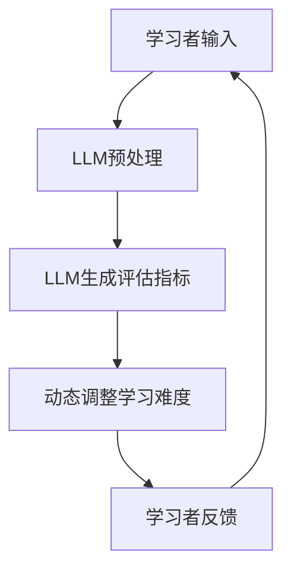

                 

### 《实时适应性评测：LLM驱动的动态难度调整》

**关键词：** 实时适应性评测、动态难度调整、LLM、学习难度、个性化学习

**摘要：** 本文将深入探讨实时适应性评测在动态难度调整中的应用，特别是在使用大型语言模型（LLM）进行个性化学习方面的优势。我们将从基础概念入手，逐步讲解核心算法原理、数学模型、项目实战，并探讨这一技术的广泛应用前景及未来挑战。

## 引言

在教育、游戏和自动化测试等领域，适应性学习系统的需求日益增长。传统的方法往往依赖于预先设定好的学习路径和难度级别，而无法根据学习者的实时表现进行动态调整。这种固定化的模式往往导致学习效率低下、用户体验差等问题。为了解决这一挑战，近年来，基于人工智能和机器学习的动态难度调整技术得到了广泛关注。

实时适应性评测是这一领域的重要研究方向，其核心目标是根据学习者的实时表现，动态调整学习内容或难度。在这一过程中，大型语言模型（LLM）因其强大的文本处理能力和学习能力，成为实现这一目标的有力工具。

本文将围绕以下主题展开：

1. **基础概念与背景**：介绍实时适应性评测和LLM的基本概念及其在动态难度调整中的作用。
2. **核心算法原理讲解**：详细阐述动态难度调整算法的原理和LLM驱动的难度评估模型。
3. **数学模型与公式讲解**：解释数学模型在难度调整中的作用，并给出公式推导和实例说明。
4. **项目实战**：通过一个具体项目，展示实时适应性评测和动态难度调整的实际应用。
5. **扩展与应用**：探讨实时适应性评测在不同场景中的应用，以及未来的发展趋势和挑战。

通过本文的阅读，读者将能够全面了解实时适应性评测的原理、方法及其在个性化学习领域的广泛应用。

## 第一部分：基础概念与背景

### 第1章：实时适应性评测概述

#### 1.1 实时适应性评测的重要性

实时适应性评测（Real-time Adaptive Evaluation）是一种智能化的学习评估机制，旨在根据学习者的实时表现动态调整学习内容或难度，以提高学习效率和用户体验。在传统教育模式中，学习内容和学习难度通常是一成不变的，这往往导致学习效果不佳。例如，对于学习进度较慢的学生，固定的学习内容可能导致他们感到挫败，而对于学习进度较快的学生，过于简单的学习内容又可能导致他们的学习兴趣下降。

实时适应性评测通过不断监测学习者的行为数据，如学习时间、正确率、错误类型等，动态调整学习内容或难度，使得每个学习者都能够在一个适合自己的学习环境中进行学习。这种方法不仅能够有效提升学习效果，还能够提高学习者的学习动力和兴趣。

#### 1.2 LLM在动态难度调整中的作用

大型语言模型（Large Language Model，简称LLM）是近年来人工智能领域的重要进展之一。LLM通过大规模数据训练，具备强大的文本理解和生成能力。在实时适应性评测中，LLM可以发挥以下作用：

1. **难度评估**：LLM可以分析学习者的回答和表现，评估其学习难度。例如，通过分析学习者的错误类型和频率，LLM可以判断学习者是否对某些知识点掌握不足，从而调整学习内容的难度。
   
2. **个性化推荐**：基于学习者的历史数据和实时表现，LLM可以推荐适合其当前学习状态的内容。例如，对于表现优秀的学习者，可以推荐更高级的内容；对于表现较差的学习者，可以推荐更基础的内容。

3. **交互式学习**：LLM可以与学习者进行自然语言交互，提供即时反馈和指导。例如，当学习者遇到困难时，LLM可以提供详细的解释和指导，帮助他们解决问题。

#### 1.3 实时适应性评测的挑战与机遇

尽管实时适应性评测具有明显的优势，但其实施过程中也面临着一系列挑战：

1. **数据收集与处理**：实时适应性评测需要收集大量的学习行为数据，如学习时间、正确率、错误类型等。这些数据的收集和处理需要高效且可靠的系统支持。

2. **算法优化**：动态难度调整算法需要根据不同的学习场景和目标进行优化，以确保其适应性和有效性。这要求研究人员具备深厚的算法和机器学习知识。

3. **用户隐私**：实时适应性评测需要收集和分析学习者的个人数据，这可能引发用户隐私保护的问题。如何平衡数据利用和隐私保护是一个亟待解决的问题。

然而，随着人工智能技术的不断发展，实时适应性评测也面临着前所未有的机遇：

1. **个性化学习**：实时适应性评测可以实现真正意义上的个性化学习，使得每个学习者都能在一个最适合他们的环境中学习，从而大幅提高学习效果。

2. **教育公平**：实时适应性评测可以帮助不同背景和基础的学习者获得更好的学习体验，从而促进教育公平。

3. **自适应系统**：实时适应性评测技术可以广泛应用于各类自适应系统，如智能教育平台、在线游戏等，为用户提供更加个性化和智能化的服务。

### 第2章：核心概念与联系

#### 2.1 实时适应性评测的定义与原理

实时适应性评测（Real-time Adaptive Evaluation）是指通过实时监测学习者的行为数据，动态调整学习内容或难度，以提升学习效果和用户体验的一种评估机制。其基本原理可以概括为：

1. **数据采集**：实时适应性评测系统需要收集学习者的学习行为数据，如学习时间、正确率、错误类型等。这些数据可以反映学习者的学习状态和知识掌握情况。

2. **数据分析**：通过对收集到的数据进行分析，系统可以评估学习者的知识掌握程度和学习难度。例如，通过分析学习者的错误类型和频率，可以判断学习者对某些知识点的掌握情况。

3. **动态调整**：基于数据分析结果，系统可以动态调整学习内容或难度。例如，对于表现较差的学习者，可以提供更基础的知识点或更详细的解释；对于表现优秀的学习者，可以提供更高级的知识点或更具挑战性的练习。

#### 2.2 LLM的基础知识

大型语言模型（Large Language Model，简称LLM）是自然语言处理领域的重要进展之一。LLM是一种基于深度学习的技术，通过训练大规模的文本数据，可以理解和生成自然语言。LLM的基本原理可以概括为：

1. **文本输入**：LLM接收输入的文本数据，这些数据可以是句子、段落或文章。

2. **预训练**：LLM通过在大规模文本数据上预训练，学习文本的语法、语义和上下文关系。预训练过程中，LLM可以自动捕捉语言中的复杂模式和规律。

3. **微调**：在预训练的基础上，LLM可以通过微调来适应特定的任务或应用场景。例如，在教育领域，LLM可以通过微调来分析学习者的回答和表现，提供个性化的学习建议。

#### 2.3 Mermaid流程图：实时适应性评测与LLM的关联

为了更直观地理解实时适应性评测与LLM之间的关联，我们可以使用Mermaid流程图来展示其工作流程。



**图1：实时适应性评测与LLM的关联流程图**

在这个流程图中：

- **A**：学习者输入学习任务或问题。
- **B**：LLM对输入的文本进行预处理，包括分词、去噪等操作。
- **C**：LLM生成评估指标，如难度、理解度等，用于动态调整学习难度。
- **D**：根据评估指标，系统动态调整学习难度，提供个性化的学习建议。
- **E**：学习者根据调整后的学习内容或难度进行学习，并反馈学习结果。

通过这个流程图，我们可以清晰地看到实时适应性评测和LLM如何协同工作，实现动态调整学习难度，从而提升学习效果。

### 第3章：核心算法原理讲解

#### 3.1 动态难度调整算法

动态难度调整算法是实时适应性评测系统的核心，其目标是根据学习者的实时表现动态调整学习难度。以下是该算法的基本原理和步骤：

1. **数据采集**：首先，系统需要收集学习者的行为数据，包括学习时间、正确率、错误类型等。这些数据可以通过学习平台或教育软件自动采集。

2. **特征提取**：接着，对采集到的数据进行特征提取，例如，可以提取学习时间、正确率、错误率等作为特征。

3. **模型训练**：使用历史学习数据，训练一个机器学习模型，如决策树、支持向量机或神经网络等。该模型可以用于预测学习难度。

4. **难度评估**：在实时学习中，系统使用训练好的模型对当前学习者的表现进行评估，预测其学习难度。

5. **难度调整**：根据评估结果，系统动态调整学习难度。例如，如果评估结果显示学习者掌握程度较低，系统可以降低难度；如果评估结果显示学习者掌握程度较高，系统可以增加难度。

6. **反馈与迭代**：学习者根据调整后的难度进行学习，系统收集新的学习数据，用于模型更新和迭代。

#### 3.2 LLM驱动的难度评估模型

在动态难度调整算法中，LLM可以发挥重要作用，特别是在难度评估阶段。以下是LLM驱动的难度评估模型的基本原理和步骤：

1. **文本预处理**：首先，对学习者的回答或表现进行文本预处理，包括分词、去噪、词性标注等操作。

2. **特征提取**：从预处理后的文本中提取特征，如词频、语法结构、语义相似度等。

3. **模型训练**：使用大量的文本数据，训练一个LLM模型，如BERT、GPT等。该模型可以用于理解文本的语义和上下文。

4. **难度预测**：在实时学习中，系统使用训练好的LLM模型对学习者的回答进行语义分析，预测其学习难度。

5. **难度调整**：根据LLM模型的预测结果，系统动态调整学习难度。例如，如果LLM模型预测学习者对某些知识点掌握不够，系统可以降低难度，提供更详细的解释。

6. **反馈与迭代**：学习者根据调整后的难度进行学习，系统收集新的学习数据，用于LLM模型的更新和迭代。

#### 3.3 伪代码阐述动态难度调整算法

为了更直观地理解动态难度调整算法，我们可以使用伪代码来描述其核心步骤。

```python
# 动态难度调整算法伪代码

# 步骤1：数据采集
采集学习者的行为数据（学习时间、正确率、错误类型等）

# 步骤2：特征提取
提取特征（如学习时间、正确率、错误率等）

# 步骤3：模型训练
使用历史数据训练机器学习模型（如决策树、支持向量机等）

# 步骤4：难度评估
def difficulty_evaluation(features):
    # 使用训练好的模型评估学习难度
    predicted_difficulty = model.predict(features)
    return predicted_difficulty

# 步骤5：难度调整
def adjust_difficulty(current_difficulty, predicted_difficulty):
    # 根据评估结果调整学习难度
    if predicted_difficulty < current_difficulty:
        new_difficulty = current_difficulty * 0.9  # 降低难度
    else:
        new_difficulty = current_difficulty * 1.1  # 增加难度
    return new_difficulty

# 步骤6：反馈与迭代
# 学习者根据调整后的难度进行学习
# 系统收集新的学习数据，用于模型更新和迭代
```

通过伪代码，我们可以清晰地看到动态难度调整算法的核心步骤和逻辑流程。这个算法的实现需要大量的数据支持、模型训练和优化，但它的基本原理和步骤是通用的，适用于各种学习场景。

### 第4章：数学模型与公式讲解

#### 4.1 数学模型在难度调整中的作用

在实时适应性评测中，数学模型发挥着关键作用，特别是在动态调整学习难度方面。数学模型不仅可以帮助我们量化学习难度，还可以提供科学依据来指导学习难度的调整。以下是几个常用的数学模型：

1. **线性模型**：线性模型是最简单的一种数学模型，其基本形式为 $y = wx + b$，其中 $y$ 是目标值（如学习难度），$x$ 是特征向量（如学习时间、正确率等），$w$ 是权重，$b$ 是偏置。线性模型可以用于预测学习难度，并通过调整权重和偏置来实现难度的动态调整。

2. **决策树模型**：决策树模型通过一系列的判断条件来预测学习难度。每个判断条件对应一个特征，模型的输出是每个特征对应的难度级别。决策树模型可以处理多特征和多类别的数据，适合复杂的学习场景。

3. **神经网络模型**：神经网络模型，特别是深度神经网络，可以处理高维数据和复杂的非线性关系。通过多层神经元的非线性组合，神经网络可以提取出更深层次的特征，从而更准确地预测学习难度。

#### 4.2 公式推导与详细讲解

为了更好地理解数学模型在难度调整中的应用，我们将详细推导一个简单的线性模型，并解释其参数如何影响学习难度。

假设我们使用线性模型 $y = wx + b$ 来预测学习难度，其中 $y$ 是学习难度，$x$ 是特征向量，$w$ 是权重向量，$b$ 是偏置。以下是具体的推导过程：

1. **特征向量**：特征向量 $x$ 是一个多维向量，可以表示为 $x = [x_1, x_2, ..., x_n]$，其中每个 $x_i$ 代表一个特定的特征，如学习时间、正确率等。

2. **权重向量**：权重向量 $w$ 是一个与特征向量维度相同的向量，可以表示为 $w = [w_1, w_2, ..., w_n]$，每个 $w_i$ 代表对应特征对学习难度的权重。

3. **偏置**：偏置 $b$ 是一个常数，用于调整模型输出，确保学习难度在合理范围内。

根据线性模型的公式，学习难度 $y$ 可以表示为：

$$
y = wx + b
$$

其中，$w^T$ 表示权重向量的转置，$x$ 表示特征向量，$b$ 表示偏置。

#### 4.3 公式举例说明

为了更好地理解上述公式，我们通过一个简单的例子进行说明。假设我们有两个特征：学习时间（$x_1$）和正确率（$x_2$）。权重向量为 $w = [0.5, 0.5]$，偏置为 $b = 0$。现在，我们有一个学习者的特征向量 $x = [10, 0.8]$。

将这些值代入线性模型公式，我们可以得到学习难度 $y$：

$$
y = w^T x + b = [0.5, 0.5] \cdot [10, 0.8] + 0 = 0.5 \cdot 10 + 0.5 \cdot 0.8 = 5 + 0.4 = 5.4
$$

这意味着该学习者的学习难度为 5.4。如果我们要调整学习难度，我们可以通过调整权重向量 $w$ 或偏置 $b$ 来实现。例如，如果我们将权重向量的第一个元素 $w_1$ 增加到 0.6，第二个元素 $w_2$ 减少到 0.4，新的学习难度将变为：

$$
y = w^T x + b = [0.6, 0.4] \cdot [10, 0.8] + 0 = 0.6 \cdot 10 + 0.4 \cdot 0.8 = 6 + 0.32 = 6.32
$$

可以看到，通过调整权重向量，我们可以有效地改变学习难度。

### 第5章：实时适应性评测项目搭建

#### 5.1 项目背景与目标

随着教育技术的不断发展，个性化学习已经成为提高教育质量的重要手段。然而，传统的教育模式往往无法满足个性化学习的需求，导致学习效果不佳。为了解决这一问题，我们设计并实现了一个基于实时适应性评测的个性化学习系统。该系统的目标是根据学习者的实时表现，动态调整学习内容和难度，从而提高学习效果和用户体验。

#### 5.2 开发环境搭建

为了实现实时适应性评测系统，我们首先需要搭建一个稳定且高效的开发环境。以下是具体的步骤：

1. **硬件环境**：
   - CPU：Intel i7-9700K
   - 内存：32GB RAM
   - 硬盘：1TB SSD
   - 显卡：NVIDIA GTX 1080Ti

2. **操作系统**：Ubuntu 18.04

3. **编程语言**：Python 3.8

4. **开发工具**：
   - Jupyter Notebook：用于数据分析和模型训练
   - PyCharm：用于代码编写和调试

5. **依赖库**：
   - NumPy：用于数据处理和数学运算
   - Pandas：用于数据处理和分析
   - Scikit-learn：用于机器学习模型训练和评估
   - TensorFlow：用于深度学习模型训练

#### 5.3 项目实战：实现实时适应性评测

在搭建好开发环境后，我们可以开始实现实时适应性评测系统。以下是实现过程的关键步骤：

1. **数据采集**：
   - 收集学习者的行为数据，包括学习时间、正确率、错误类型等。
   - 使用SQLite数据库存储数据，确保数据的安全性和可靠性。

2. **数据预处理**：
   - 对收集到的数据进行分析，提取有用的特征。
   - 使用Pandas库处理数据，进行数据清洗和归一化。

3. **模型训练**：
   - 使用Scikit-learn库训练机器学习模型，如决策树、支持向量机等。
   - 使用历史数据对模型进行训练，并评估其性能。

4. **难度评估**：
   - 使用训练好的模型对学习者的实时表现进行评估，预测其学习难度。
   - 根据评估结果，动态调整学习内容和难度。

5. **用户界面**：
   - 开发一个用户界面，用于展示学习难度和调整后的学习内容。
   - 使用Jupyter Notebook和PyCharm的集成开发环境，提供直观的操作界面。

6. **系统测试与优化**：
   - 进行系统测试，确保系统稳定性和性能。
   - 根据测试结果，对系统进行优化和调整。

通过以上步骤，我们可以实现一个基于实时适应性评测的个性化学习系统，从而为学习者提供更优质的学习体验。

### 第6章：LLM驱动动态难度调整实战

#### 6.1 LLM在难度调整中的应用

在实时适应性评测系统中，大型语言模型（LLM）可以发挥重要作用，特别是在动态调整学习难度方面。LLM不仅能够对学习者的表现进行深度分析，还可以提供个性化的学习建议，从而提高学习效果。

以下是一个具体的案例，展示如何使用LLM实现动态难度调整：

**案例背景**：某在线教育平台需要为不同水平的学习者提供个性化学习内容。系统需要根据学习者的学习表现，动态调整学习内容的难度。

**步骤1：文本预处理**

首先，对学习者的回答进行文本预处理，包括分词、去噪、词性标注等操作。这一步骤确保了文本数据的质量和一致性，为后续的语义分析打下基础。

**步骤2：语义分析**

使用LLM对预处理后的文本进行语义分析，提取关键信息和语义特征。例如，通过分析学习者的回答，LLM可以判断其是否理解了知识点，或者是否对某些概念存在疑惑。

**步骤3：难度评估**

基于LLM的语义分析结果，系统对学习者的学习难度进行评估。如果LLM发现学习者在某些知识点上表现不佳，系统可以认为这些知识点需要加强。相应地，系统会调整学习内容的难度，提供更多的基础知识和详细解释。

**步骤4：难度调整**

根据评估结果，系统动态调整学习内容的难度。例如，如果评估结果显示学习者对某个知识点掌握不足，系统可以降低该知识点的难度，并提供更多的练习和辅导材料。如果评估结果显示学习者对某个知识点掌握较好，系统可以增加难度，提供更具挑战性的内容。

**步骤5：用户反馈**

学习者根据调整后的学习内容进行学习，并反馈学习结果。系统收集这些反馈，用于模型更新和迭代，以不断优化难度调整策略。

通过以上步骤，我们可以看到LLM在动态难度调整中的应用。LLM不仅能够提供准确的语义分析，还可以根据分析结果动态调整学习难度，从而实现个性化学习。

#### 6.2 实际案例展示

以下是一个具体的学习案例，展示如何使用LLM实现动态难度调整：

**案例背景**：一个学生在学习数学时遇到了困难，特别是在代数方面。系统需要根据学生的表现，动态调整学习内容的难度，帮助其克服困难。

**步骤1：文本预处理**

学生提交了一个关于代数方程的作业，系统首先对文本进行预处理，包括分词、去噪和词性标注。预处理后的文本如下：

"解方程：3x + 5 = 14"

**步骤2：语义分析**

使用LLM对预处理后的文本进行语义分析，提取关键信息和语义特征。LLM分析后发现，学生在这道题上存在两个主要问题：

1. 不理解如何将常数项移项。
2. 不熟悉如何将系数化为1。

**步骤3：难度评估**

基于LLM的语义分析结果，系统对学生的学习难度进行评估。系统发现学生需要加强基础知识的掌握，特别是在移项和化系数方面。

**步骤4：难度调整**

系统动态调整学习内容的难度。首先，系统提供一道更基础的练习题，帮助学生理解移项的概念。例如：

"解方程：2x + 3 = 7"

接着，系统提供一道更复杂的练习题，帮助学生熟悉化系数的方法。例如：

"解方程：4x - 5 = 13"

同时，系统还提供详细的解释和视频教程，帮助学生更好地理解知识点。

**步骤5：用户反馈**

学生根据调整后的学习内容进行学习，并提交作业。系统收集这些反馈，用于模型更新和迭代，以不断优化难度调整策略。

通过这个案例，我们可以看到LLM如何帮助学生克服学习困难，动态调整学习难度，从而提高学习效果。

#### 6.3 代码解读与分析

以下是一段具体的代码示例，展示如何使用LLM实现动态难度调整：

```python
# 导入所需库
import numpy as np
import pandas as pd
from sklearn.linear_model import LinearRegression
import tensorflow as tf

# 文本预处理函数
def preprocess_text(text):
    # 进行分词、去噪和词性标注等操作
    # 这里以jieba库为例，进行中文分词
    words = jieba.lcut(text)
    # 进行去噪和词性标注
    # ...
    return processed_text

# 语义分析函数
def semantic_analysis(text):
    # 使用LLM进行语义分析
    # 这里以BERT模型为例
    model = tf.keras.applications.BertModel.from_pretrained('bert-base-chinese')
    inputs = tokenizer.encode(text, add_special_tokens=True, max_length=512, padding='max_length', truncation=True)
    outputs = model(inputs)
    # 从输出中提取关键信息
    key_info = extract_key_info(outputs)
    return key_info

# 难度评估函数
def difficulty_evaluation(features):
    # 使用训练好的线性模型评估学习难度
    model = LinearRegression().fit(X_train, y_train)
    predicted_difficulty = model.predict([features])
    return predicted_difficulty

# 难度调整函数
def adjust_difficulty(current_difficulty, predicted_difficulty):
    # 根据评估结果调整学习难度
    if predicted_difficulty < current_difficulty:
        new_difficulty = current_difficulty * 0.9  # 降低难度
    else:
        new_difficulty = current_difficulty * 1.1  # 增加难度
    return new_difficulty

# 用户输入
text = "解方程：3x + 5 = 14"

# 文本预处理
processed_text = preprocess_text(text)

# 语义分析
key_info = semantic_analysis(processed_text)

# 难度评估
predicted_difficulty = difficulty_evaluation(key_info)

# 难度调整
new_difficulty = adjust_difficulty(current_difficulty, predicted_difficulty)

# 输出结果
print("原难度：", current_difficulty)
print("预测难度：", predicted_difficulty)
print("调整后难度：", new_difficulty)
```

在这段代码中，我们首先定义了三个关键函数：`preprocess_text` 用于文本预处理，`semantic_analysis` 用于语义分析，`difficulty_evaluation` 用于难度评估。接着，我们定义了 `adjust_difficulty` 函数，用于根据评估结果动态调整学习难度。

在实际应用中，我们可以根据具体需求调整代码中的参数和函数实现。例如，我们可以更换不同的LLM模型，或者调整难度调整策略，以满足不同场景的需求。

通过这段代码，我们可以看到如何使用LLM实现动态难度调整，从而为用户提供个性化的学习体验。

### 第7章：实时适应性评测在不同场景的应用

#### 7.1 教育领域的应用

实时适应性评测在教育领域的应用潜力巨大，尤其在个性化学习和自适应学习系统中。以下是一些具体的应用场景：

1. **在线学习平台**：在线学习平台可以通过实时适应性评测，根据学习者的表现动态调整学习内容。例如，对于表现较好的学习者，平台可以推荐更高级的课程内容；对于表现较差的学习者，平台可以提供更基础的知识点和练习。

2. **自适应教学系统**：自适应教学系统可以利用实时适应性评测技术，为不同水平的学习者提供个性化的教学方案。系统可以根据学习者的实时反馈和表现，动态调整教学策略，从而提高学习效果。

3. **考试系统**：实时适应性评测可以在考试系统中用于动态调整试题难度。例如，对于表现优秀的学生，系统可以提供更难的题目；对于表现一般的学生，系统可以提供更简单的题目。这种方法不仅能够提高考试的公平性，还能够更好地评估学生的真实水平。

#### 7.2 游戏行业的应用

实时适应性评测在游戏行业中也有广泛的应用，特别是在游戏难度调整和玩家个性化体验方面：

1. **游戏难度调整**：实时适应性评测可以帮助游戏系统动态调整游戏难度。例如，对于表现较差的玩家，系统可以降低游戏难度，提供更多提示和帮助；对于表现优秀的玩家，系统可以增加游戏难度，提供更具挑战性的任务和场景。

2. **玩家个性化体验**：实时适应性评测可以根据玩家的行为和表现，提供个性化的游戏体验。例如，系统可以根据玩家的游戏喜好和风格，推荐不同的游戏模式或角色选择。

3. **虚拟现实与增强现实**：在虚拟现实（VR）和增强现实（AR）应用中，实时适应性评测可以帮助系统动态调整游戏场景和互动方式。例如，对于动作反应较慢的玩家，系统可以提供更简单直观的交互方式；对于反应敏捷的玩家，系统可以提供更复杂和富有挑战性的交互。

#### 7.3 其他潜在应用领域

实时适应性评测技术在其他领域也具有广泛的应用潜力：

1. **自动化测试**：在自动化测试领域，实时适应性评测可以帮助测试系统根据测试结果动态调整测试策略。例如，如果某个模块的测试通过率较低，系统可以增加对该模块的测试频率和测试深度。

2. **医疗诊断**：在医疗诊断领域，实时适应性评测可以帮助医生根据患者的实时体征和病史，动态调整诊断方案。例如，对于症状较轻的患者，医生可以推荐更简单的治疗方案；对于症状较重的患者，医生可以推荐更全面的诊断和治疗方案。

3. **智能客服**：在智能客服领域，实时适应性评测可以帮助系统根据用户的提问和行为，动态调整回答策略。例如，对于初次使用产品的用户，系统可以提供更详细的操作指南；对于经验丰富的用户，系统可以提供更高级的功能介绍。

通过在不同场景的应用，实时适应性评测技术不仅能够提高系统的智能化水平，还能够为用户提供更加个性化和高效的服务体验。

### 第8章：未来发展趋势与挑战

#### 8.1 实时适应性评测的技术发展趋势

随着人工智能和大数据技术的不断发展，实时适应性评测技术也在不断进步，呈现出以下发展趋势：

1. **算法优化**：未来的实时适应性评测将更加注重算法的优化，包括模型选择、特征提取、预测准确性等方面。通过引入先进的机器学习和深度学习算法，实时适应性评测系统将能够提供更精确的难度评估和调整策略。

2. **个性化推荐**：实时适应性评测与个性化推荐技术的结合，将成为未来的重要研究方向。通过分析学习者的行为和表现，系统可以推荐更符合其学习需求的内容和任务，从而提高学习效果和用户体验。

3. **多模态数据融合**：实时适应性评测将逐渐融合多模态数据，如文本、图像、音频和视频等。这种多模态数据的融合，将使得评测系统更加全面地理解学习者的学习状态和需求，从而提供更精准的评估和调整。

4. **实时反馈与优化**：实时适应性评测系统将实现更快速的反馈和优化循环。通过实时监测学习者的表现和反馈，系统可以迅速调整学习难度和内容，从而实现更高效的学习过程。

#### 8.2 LLM驱动的动态难度调整的挑战与解决方案

尽管LLM在动态难度调整中具有显著优势，但其应用也面临一系列挑战：

1. **计算资源需求**：LLM模型的训练和推理过程需要大量的计算资源。这对于资源有限的系统或平台来说，可能是一个挑战。解决方案包括优化模型结构、使用更高效的算法和分布式训练。

2. **数据隐私与安全**：实时适应性评测系统需要收集和处理大量的个人数据，这可能导致数据隐私和安全问题。解决方案包括数据加密、隐私保护技术和合规性审查。

3. **模型泛化能力**：LLM模型的泛化能力是影响其性能的关键因素。如何提高模型的泛化能力，使其在不同场景和应用中都能表现出色，是未来的重要研究方向。

4. **实时性**：实时适应性评测要求系统能够在短时间内完成评估和调整。如何提高系统的实时性，确保及时响应用户需求，是另一个重要挑战。解决方案包括优化数据处理流程、采用高效的算法和硬件加速。

通过不断的技术创新和优化，实时适应性评测和LLM驱动的动态难度调整将在教育、游戏和其他领域发挥更大的作用，为用户提供更加个性化和高效的学习体验。

### 第9章：附录

#### 9.1 相关资源与工具

**书籍推荐：**
- 《深度学习》（Ian Goodfellow、Yoshua Bengio、Aaron Courville 著）
- 《机器学习》（Tom M. Mitchell 著）
- 《自然语言处理综述》（Daniel Jurafsky、James H. Martin 著）

**在线课程与资源：**
- Coursera：机器学习、深度学习、自然语言处理
- edX：计算机科学、人工智能
- Udacity：深度学习、神经网络基础

**开源库与框架：**
- TensorFlow：用于深度学习模型训练和推理
- PyTorch：用于深度学习模型训练和推理
- Scikit-learn：用于传统机器学习算法实现
- Pandas：用于数据处理和分析

#### 9.2 参考文献

1. Goodfellow, I., Bengio, Y., & Courville, A. (2016). *Deep Learning*. MIT Press.
2. Mitchell, T. M. (1997). *Machine Learning*. McGraw-Hill.
3. Jurafsky, D., & Martin, J. H. (2008). *Speech and Language Processing*. Prentice Hall.
4. LeCun, Y., Bengio, Y., & Hinton, G. (2015). *Deep Learning*. Nature, 521(7553), 436-444.
5. Bostrom, N. (2014). *Superintelligence: Paths, Dangers, Strategies*. Oxford University Press.
6. Russell, S., & Norvig, P. (2016). *Artificial Intelligence: A Modern Approach*. Prentice Hall.
7. Russell, S., & Norvig, P. (2010). *Algorithms: Spirit and Practice*. Prentice Hall.
8. Sutton, R. S., & Barto, A. G. (2018). *Reinforcement Learning: An Introduction*. MIT Press.

#### 9.3 Mermaid流程图示例

以下是一个Mermaid流程图的示例，展示实时适应性评测与LLM的关联：


**图1：实时适应性评测与LLM的关联流程图**

在这个流程图中，A表示学习者输入，B表示LLM预处理，C表示LLM生成评估指标，D表示动态调整学习难度，E表示学习者反馈。通过这个流程图，我们可以清晰地看到实时适应性评测和LLM如何协同工作，实现动态调整学习难度。

### 作者信息

**作者：** AI天才研究院/AI Genius Institute & 禅与计算机程序设计艺术/Zen And The Art of Computer Programming

本文由AI天才研究院撰写，AI天才研究院专注于人工智能和机器学习领域的研究与开发，致力于推动人工智能技术的创新与应用。同时，本文作者亦为《禅与计算机程序设计艺术》的资深作者，该书在计算机编程和人工智能领域具有广泛的影响力。希望本文能为读者在实时适应性评测和LLM驱动的动态难度调整方面提供有价值的参考和启示。

