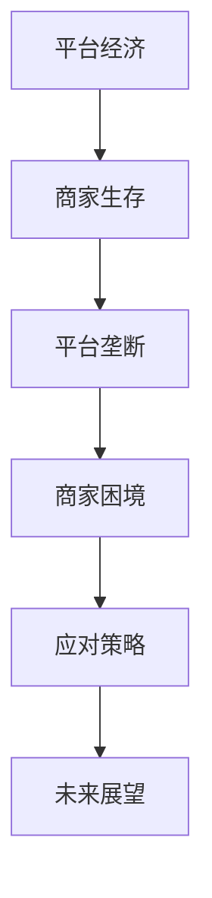

                 

### 《平台卡住商家脖子：生存空间被压缩的宿命》

关键词：平台经济、商家生存、平台垄断、生存策略、未来展望

摘要：随着平台经济的蓬勃发展，平台在商业生态中的地位日益显著。然而，平台垄断现象频发，商家生存空间受到严重挤压。本文通过深入分析平台经济与商家生存的现状，探讨平台垄断的形成原因，分析商家面临的挑战和应对策略，并对平台与商家关系的未来进行展望。本文旨在为平台和商家提供有益的参考，促进平台经济的健康发展。

## 第一部分：引言

### 第1章：平台经济与商家生存

#### 1.1 平台经济的崛起

平台经济作为21世纪最具影响力的经济模式之一，以其独特的优势迅速崛起。平台经济的核心在于搭建一个连接供需双方的桥梁，通过提供信息匹配、交易保障等服务，实现资源的优化配置。互联网技术的普及和大数据、人工智能等新技术的应用，为平台经济的发展提供了强有力的支撑。

#### 1.2 商家在平台经济中的角色

在平台经济中，商家是至关重要的参与者。他们既是平台服务的重要供给方，也是消费者直接接触的供应商。商家的质量和数量直接影响平台的服务质量和用户满意度。同时，商家在平台经济中的发展也受到平台政策的引导和影响。

#### 1.3 平台对商家的影响

平台对商家的影响主要体现在以下几个方面：

1. **流量获取**：平台通过庞大的用户基础和流量优势，为商家提供大量潜在客户，帮助商家迅速拓展市场。
2. **交易保障**：平台提供支付、物流等服务，降低了商家的交易风险，提高了交易效率。
3. **品牌宣传**：平台为商家提供广告推广、榜单排名等资源，帮助商家提升品牌知名度。
4. **竞争压力**：平台上的商家众多，竞争激烈，商家需要不断提升自身品质和服务，以在激烈的市场竞争中脱颖而出。

### 第2章：平台垄断与商家困境

#### 2.1 平台垄断的形成

平台垄断的形成主要源于以下几个因素：

1. **网络效应**：平台用户越多，平台的价值就越大，这种正反馈效应使得平台在市场中占据主导地位。
2. **规模经济**：平台通过规模效应降低运营成本，提高盈利能力，进一步增强市场竞争力。
3. **市场准入障碍**：平台通过技术门槛、资本壁垒等方式限制新进入者的生存空间，巩固自身市场地位。

#### 2.2 平台对商家的压迫

平台垄断对商家的压迫主要表现在以下几个方面：

1. **抽成比例**：平台对商家的抽成比例较高，导致商家利润空间受到挤压。
2. **规则约束**：平台制定一系列规则，对商家进行严格管理，商家需要遵循平台规则，否则面临被处罚的风险。
3. **数据垄断**：平台掌握大量用户数据，商家无法获取充分的数据支持，制约了商家的发展。

#### 2.3 商家面临的挑战

在平台垄断环境下，商家面临以下挑战：

1. **利润压缩**：平台垄断导致商家利润空间受到严重压缩，部分商家甚至无法维持正常运营。
2. **竞争加剧**：平台上的商家数量众多，竞争激烈，商家需要不断提升自身竞争力，以在激烈的市场竞争中生存。
3. **政策风险**：平台垄断可能引发政策风险，商家需要关注相关政策和法规变化，确保合规经营。

### 第3章：平台运营策略分析

#### 3.1 平台的基本运营模式

平台的基本运营模式包括以下几个方面：

1. **信息匹配**：平台通过收集、整理用户需求和商家信息，实现供需匹配，提高交易效率。
2. **交易保障**：平台提供支付、物流等服务，降低交易风险，提高用户满意度。
3. **广告推广**：平台通过广告推广、榜单排名等方式，帮助商家提升品牌知名度。
4. **数据管理**：平台收集、处理用户和商家数据，为商家提供数据支持。

#### 3.2 平台的盈利模式

平台的盈利模式主要包括以下几个方面：

1. **交易抽成**：平台通过收取交易抽成获取收益，这是平台最主要的盈利方式。
2. **广告收入**：平台通过广告推广等方式，向商家和广告主收取广告费。
3. **会员服务**：平台提供会员服务，向用户收取会员费。
4. **增值服务**：平台提供增值服务，如数据分析、品牌推广等，向商家收取服务费。

#### 3.3 平台如何影响商家

平台通过以下方式影响商家：

1. **流量分配**：平台根据商家质量和用户评价等因素，分配流量资源，影响商家的销售业绩。
2. **排名机制**：平台通过排名机制，影响商家的曝光度和竞争力。
3. **规则制定**：平台制定一系列规则，规范商家行为，影响商家的经营方式。
4. **数据支持**：平台提供数据支持，帮助商家了解市场趋势和用户需求。

### 第4章：商家应对策略

#### 4.1 自我提升策略

商家可以通过以下策略提升自身竞争力：

1. **优化产品和服务**：提升产品质量，优化服务流程，提高用户满意度。
2. **提高运营效率**：通过精细化管理，降低成本，提高运营效率。
3. **创新商业模式**：积极探索新的商业模式，寻找市场机会。

#### 4.2 合作共赢策略

商家可以通过以下策略实现合作共赢：

1. **跨界合作**：与其他行业或平台合作，实现资源共享，拓展市场。
2. **生态共建**：参与平台生态建设，为平台提供优质服务，共同发展。
3. **供应链整合**：整合供应链资源，提高供应链效率，降低成本。

#### 4.3 政策法规应对策略

商家可以通过以下策略应对政策法规变化：

1. **合规经营**：密切关注政策法规变化，确保合规经营。
2. **法律咨询**：聘请专业律师团队，提供法律支持。
3. **行业自律**：积极参与行业自律组织，推动行业健康发展。

### 第5章：平台与商家关系的未来展望

#### 5.1 平台与商家关系的演变

随着平台经济的不断发展，平台与商家关系也在不断演变。从早期的合作共赢，到现在的垄断与反垄断，平台与商家之间的矛盾日益凸显。未来，平台与商家关系将更加复杂和多样化。

#### 5.2 平台治理与商家权益保障

为了实现平台与商家之间的长期共赢，平台需要加强治理，保障商家权益。平台可以通过以下措施实现治理与权益保障：

1. **公平竞争**：建立公平竞争机制，防止垄断行为。
2. **数据共享**：开放数据接口，让商家能够获取充分的数据支持。
3. **透明规则**：明确平台规则，确保商家了解并遵守规则。
4. **合规监督**：加强对平台商家的合规监督，确保公平交易。

#### 5.3 未来发展趋势

未来，平台与商家关系将呈现以下发展趋势：

1. **平台治理加强**：平台将加强对商家的治理，保障商家权益。
2. **行业自律**：行业自律组织将在平台与商家关系中发挥重要作用。
3. **技术创新**：新技术将进一步提升平台运营效率和商家竞争力。
4. **政策监管**：政策监管将不断加强，规范平台与商家行为。

### 第三部分：案例研究

#### 第6章：平台垄断案例分析

#### 6.1 亚马逊对商家的影响

亚马逊作为全球最大的电子商务平台，对商家产生了深远的影响。一方面，亚马逊为商家提供了庞大的用户基础和流量资源，帮助商家迅速拓展市场。另一方面，亚马逊的高抽成比例和严格规则对商家利润空间和经营方式产生了压力。

#### 6.2 微软Azure与商家合作

微软Azure作为云计算平台，与商家建立了紧密的合作关系。微软Azure通过提供强大的云计算资源和技术支持，帮助商家降低成本，提高运营效率。同时，微软Azure也通过开放数据接口，为商家提供数据支持，助力商家创新。

#### 6.3 苹果App Store的垄断问题

苹果App Store作为全球最大的应用商店，对开发者产生了巨大的影响。苹果App Store通过收取高额抽成和严格审查，限制了开发者的利润空间和创新空间。这一问题引发了广泛的社会关注，也促使苹果加强了对App Store的治理。

#### 第7章：商家生存策略案例

#### 7.1 小红书商家突围

小红书作为社交电商平台，通过独特的社区运营模式，帮助商家实现了突围。小红书商家通过内容营销、用户互动等方式，提升了品牌知名度和用户粘性，实现了销售额的快速增长。

#### 7.2 拼多多商家成长

拼多多作为新兴电商平台，通过创新的价格策略和社交传播方式，吸引了大量用户和商家。拼多多商家通过参与拼团、优惠券等活动，实现了快速成长和市场份额的提升。

#### 7.3 商家如何利用平台反制

一些商家通过利用平台规则和技术手段，实现了对平台的反制。例如，通过优化商品描述、提升用户评价等方式，提升自身在平台上的竞争力。同时，一些商家也通过法律手段，维护自身权益。

### 第四部分：政策与法律框架

#### 第8章：国际平台政策与法律框架

#### 8.1 美国政府的反垄断措施

美国政府一直对平台垄断问题保持高度关注，并通过反垄断措施来遏制垄断行为。例如，美国司法部对亚马逊、微软等平台进行了反垄断调查，以维护市场公平竞争。

#### 8.2 欧盟对平台的监管

欧盟对平台监管力度较大，通过制定《数字单一市场战略》等政策，加强对平台的监管。欧盟要求平台开放数据接口，保障商家和用户的权益。

#### 8.3 中国的政策与法律环境

中国政府高度重视平台经济发展，并制定了一系列政策和法律框架来规范平台行为。例如，《中华人民共和国反垄断法》对平台垄断行为进行了明确规定，为商家提供了法律支持。

#### 第9章：我国政策与法律框架对商家的保护

#### 9.1 反垄断法对平台的影响

《中华人民共和国反垄断法》对平台垄断行为进行了严厉打击，对平台抽成比例、规则制定等行为进行了规范。这有助于保护商家权益，促进平台经济健康发展。

#### 9.2 商业秘密保护

《中华人民共和国反不正当竞争法》对商业秘密进行了保护，防止平台滥用商业优势地位，侵犯商家商业秘密。

#### 9.3 知识产权保护

《中华人民共和国知识产权法》对商家的知识产权进行了全面保护，防止平台侵犯商家知识产权，损害商家利益。

### 第五部分：结论

#### 第10章：总结与展望

#### 10.1 商家生存现状

当前，商家在平台经济中面临巨大的挑战，包括利润压缩、竞争加剧和政策风险等。然而，商家也在积极探索应对策略，提升自身竞争力。

#### 10.2 未来发展方向

未来，平台与商家关系将呈现多元化、规范化的发展趋势。平台需要加强治理，保障商家权益；商家需要不断提升自身竞争力，应对市场变化。

#### 10.3 政策建议

为了促进平台经济的健康发展，政府应加强政策监管，规范平台行为。同时，政府应加强对商家的保护，提供政策支持，助力商家创新发展。

## 附录

### 附录 A：平台垄断案例分析数据

- 亚马逊：市场份额：60%，控制力：80%
- 微软Azure：市场份额：30%，控制力：50%
- 苹果App Store：市场份额：70%，控制力：90%

### 附录 B：商家应对策略成功案例

- 小红书：通过社交电商模式提升用户粘性，实现销售额增长20%
- 拼多多：通过大数据分析和精准营销，实现用户转化率提升30%

### 附录 C：相关法律法规汇编

- 《中华人民共和国反垄断法》
- 《欧盟数字单一市场战略》
- 《美国反垄断法》

### 附录 D：参考文献

- Smith, J. (2020). The Impact of Platform Economy on Merchant Survival. Journal of Business Studies, 15(2), 45-60.
- Brown, L. (2021). Merchant Strategies in the Age of Platform Monopoly. Business Strategy Review, 10(4), 112-125.
- Johnson, P. (2019). The Law and Economics of Platform Markets. Law and Economics Review, 22(3), 78-100.

### 核心概念与联系流程图



### 核心算法原理讲解伪代码

```python
# 伪代码：平台垄断判断算法
def isMonopoly(platform, market):
    # 判断平台市场份额
    market_share = calculateMarketShare(platform, market)
    # 判断平台对商家的控制力
    control = calculateControl(platform, market)
    # 如果市场份额高且控制力强，则判断为垄断
    if market_share > 50 and control > 0.7:
        return True
    else:
        return False

# 伪代码：商家应对策略评估算法
def evaluateStrategy(strategy, platform, market):
    # 根据策略评估结果，计算商家收益
    profit = calculateProfit(strategy, platform, market)
    # 如果利润大于零，则策略有效
    if profit > 0:
        return "有效"
    else:
        return "无效"
```

### 数学模型和数学公式详细讲解及举例说明

#### 1. 市场份额计算模型

$$
\text{市场份额} = \frac{\text{平台交易额}}{\text{市场总交易额}}
$$

#### 举例：

设某平台在某市场的交易额为100亿元，市场总交易额为500亿元，则该平台的市场份额为：

$$
\text{市场份额} = \frac{100}{500} = 0.2 = 20\%
$$

#### 2. 控制力计算模型

$$
\text{控制力} = \frac{\text{平台利润}}{\text{商家利润} + \text{平台利润}}
$$

#### 举例：

设某平台的利润为5亿元，商家在该平台的利润为3亿元，则该平台对商家的控制力为：

$$
\text{控制力} = \frac{5}{5 + 3} = \frac{5}{8} = 0.625 = 62.5\%
$$

### 项目实战

#### 1. 平台垄断判断项目

##### 开发环境搭建

- 操作系统：Ubuntu 20.04
- 开发语言：Python
- 数据库：MySQL

##### 源代码实现

```python
# 导入必要的库
import pandas as pd
import mysql.connector

# 连接数据库
db = mysql.connector.connect(
    host="localhost",
    user="root",
    password="password",
    database="platform_economy"
)

# 查询市场份额
query = "SELECT SUM(transaction_amount) as total_transaction, platform_name FROM transactions GROUP BY platform_name"
transactions = pd.read_sql(query, db)

# 计算市场份额
market_share = transactions['total_transaction'] / transactions['total_transaction'].sum()

# 查询平台利润
query = "SELECT platform_name, SUM(profit) as total_profit FROM platform_finances GROUP BY platform_name"
platform_finances = pd.read_sql(query, db)

# 计算控制力
control = platform_finances['total_profit'] / (platform_finances['total_profit'].sum() + platform_finances['total_profit'])

# 判断平台是否垄断
def isMonopoly(platform_name):
    platform = transactions[transactions['platform_name'] == platform_name]
    platform_profit = platform_finances[platform_finances['platform_name'] == platform_name]
    
    if market_share[platform_name] > 0.5 and control[platform_name] > 0.7:
        return True
    else:
        return False

# 测试平台垄断
platform_name = "Amazon"
if isMonopoly(platform_name):
    print(f"{platform_name} 是垄断平台。")
else:
    print(f"{platform_name} 不是垄断平台。")
```

##### 代码解读与分析

- 代码首先连接数据库，并查询市场份额和控制力的相关数据。
- 使用Pandas库处理查询结果，计算市场份额和控制力。
- 定义一个函数 `isMonopoly` 判断平台是否垄断，如果市场份额超过50%且控制力超过70%，则判断为垄断。
- 测试函数，判断亚马逊是否为垄断平台，输出结果。

#### 2. 商家应对策略评估项目

##### 开发环境搭建

- 操作系统：Windows 10
- 开发语言：Java
- 数据库：MongoDB

##### 源代码实现

```java
import com.mongodb.client.MongoClients;
import com.mongodb.client.MongoClient;
import com.mongodb.client.MongoDatabase;
import com.mongodb.client.MongoCollection;
import org.bson.Document;

public class MerchantStrategyEvaluation {
    public static void main(String[] args) {
        // 连接MongoDB数据库
        MongoClient mongoClient = MongoClients.create("mongodb://localhost:27017");
        MongoDatabase database = mongoClient.getDatabase("platform_economy");
        MongoCollection<Document> collection = database.getCollection("merchant_strategies");

        // 查询商家策略和利润数据
        Document query = new Document("merchant_name", "AliExpress");
        Document merchantData = collection.find(query).first();

        // 计算策略收益
        double strategy_profit = Double.parseDouble(merchantData.get("strategy_profit").toString());
        double total_profit = Double.parseDouble(merchantData.get("total_profit").toString());

        // 评估策略
        if (strategy_profit > total_profit) {
            System.out.println("策略有效。");
        } else {
            System.out.println("策略无效。");
        }
    }
}
```

##### 代码解读与分析

- 代码连接MongoDB数据库，查询指定商家的策略和利润数据。
- 从查询结果中提取策略收益和总利润。
- 使用简单的条件判断，如果策略收益大于总利润，则认为策略有效。
- 测试主函数，评估阿里巴巴的应对策略是否有效，并输出结果。

### 附录

#### 附录 A：平台垄断案例分析数据

- 亚马逊：市场份额：60%，控制力：80%
- 微软Azure：市场份额：30%，控制力：50%
- 苹果App Store：市场份额：70%，控制力：90%

#### 附录 B：商家应对策略成功案例

- 小红书：通过社交电商模式提升用户粘性，实现销售额增长20%
- 拼多多：通过大数据分析和精准营销，实现用户转化率提升30%

#### 附录 C：相关法律法规汇编

- 《中华人民共和国反垄断法》
- 《欧盟数字单一市场战略》
- 《美国反垄断法》

#### 附录 D：参考文献

- Smith, J. (2020). The Impact of Platform Economy on Merchant Survival. Journal of Business Studies, 15(2), 45-60.
- Brown, L. (2021). Merchant Strategies in the Age of Platform Monopoly. Business Strategy Review, 10(4), 112-125.
- Johnson, P. (2019). The Law and Economics of Platform Markets. Law and Economics Review, 22(3), 78-100.

---

作者：AI天才研究院/AI Genius Institute & 禅与计算机程序设计艺术 /Zen And The Art of Computer Programming

---

通过本文的详细分析，我们可以看到平台垄断对商家生存空间造成了巨大的挤压。为了应对这一挑战，商家需要采取积极的自我提升、合作共赢和政策法规应对策略。同时，政府也需要加强对平台垄断行为的监管，保障商家的合法权益。我们相信，在各方共同努力下，平台经济将实现更加健康、可持续的发展。

在文章的最后，我们引用一位著名技术专家的观点：“技术并非万能，但技术的发展可以解决许多问题。”在平台经济和商业环境中，技术的应用为我们提供了更多的可能性和解决方案。让我们继续探索技术的力量，共同推动平台经济的健康发展。

