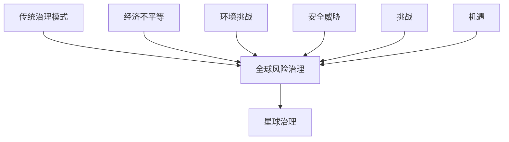

                 

# 2050年的全球治理：从全球风险治理到星球治理的治理结构演进

## 关键词
全球治理、全球风险治理、星球治理、治理结构、国际合作、新兴技术、人工智能、区块链、大数据

## 摘要
本文深入探讨了2050年全球治理的演进路径，从传统的全球治理模式到全球风险治理，再到未来的星球治理。文章首先定义了全球治理的核心概念，分析了其历史演进过程及主要问题，随后详细介绍了全球治理中的合作机制、新兴技术、跨国合作与协调、公民参与与社会责任、法治与法律体系。通过数学模型、伪代码和实际代码案例的讲解，文章展示了全球治理中核心算法原理、项目实战的实现细节，并展望了未来全球治理的趋势和解决方案。最终，文章总结了全球治理的现状与未来发展方向，为构建更高效、公正的全球治理体系提供了理论依据和实践指导。

---

## 第一部分：核心概念与联系

### 1.1.1 全球治理的概念与演进

全球治理是指涉及全球性问题的决策、协调和合作过程，涵盖多个领域，如经济、安全、环境和社会事务。它不同于传统的国家主权模式，强调跨国界的合作与协调。

#### 全球治理的定义：
全球治理是指由多个国家、国际组织、非政府组织、私营部门和其他利益相关者共同参与，通过协商、合作和制度安排，解决全球性问题，实现全球共同利益的过程。

#### 全球治理的演进：
- **传统的治理模式**：基于国家主权和双边协议的传统国际关系模式。
- **全球风险治理**：针对跨国风险，如气候变化、网络安全等，通过国际合作和协调进行治理。
- **星球治理**：2050年的治理模式，涉及全人类和地球生态系统的综合治理。

#### 全球治理的演进过程：
1. 传统治理模式：以国家主权为中心，通过双边协议解决国际问题。
2. 全球风险治理：从单边到多边，通过国际合作应对跨国风险。
3. 星球治理：涵盖更广泛的领域，实现全人类和地球生态系统的综合治理。

### 1.1.2 全球治理结构的概念与联系

全球治理结构是指全球治理体系中各组成部分之间的相互作用和关系，包括国际组织、国家政府、非政府组织、私营部门等。

#### 全球治理结构的核心组成部分：
- **国际组织**：如联合国、世界贸易组织、国际货币基金组织等。
- **国家政府**：各国政府在全球治理中的角色和责任。
- **非政府组织**：如环保组织、人权组织等，在全球治理中的影响和作用。
- **私营部门**：企业在全球治理中的角色和责任。

#### 全球治理结构的联系与互动：
- **多边机制**：各国通过多边机制进行合作，共同制定国际规则。
- **区域合作**：如欧盟、东盟等区域组织，推动地区一体化和合作。
- **非正式对话机制**：如G20、G7等，提供高层次的对话平台。

### 1.1.3 主流全球治理理论

全球治理的理论基础包括新自由主义、新现实主义和社会建构主义等。

#### 新自由主义全球治理理论：
- **核心观点**：强调市场机制和国际合作，主张通过市场力量和私营部门的参与解决全球性问题。
- **政策主张**：推动贸易自由化、资本流动自由化和国际经济合作。

#### 新现实主义全球治理理论：
- **核心观点**：认为全球治理是国际政治的延伸，国家行为是国家利益驱动的结果。
- **政策主张**：强调国家主权和国际秩序，主张通过多边机制和国际法律框架解决全球性问题。

#### 社会建构主义全球治理理论：
- **核心观点**：强调社会关系和观念在国际关系中的重要性，认为全球治理是通过社会互动和共识建立的。
- **政策主张**：推动跨文化对话、社会参与和国际合作，以实现全球共同利益。

---

### 总结

第一部分介绍了全球治理的核心概念、演进过程和治理结构。通过定义全球治理、分析其演进路径，以及介绍全球治理结构的核心组成部分和联系，我们为后续内容的讨论奠定了基础。接下来，我们将探讨全球治理中的主要问题和挑战，包括经济不平等、环境挑战和安全威胁。

### Mermaid 流程图



---

### 伪代码

```python
# 定义全球治理的演进过程
def global_governance_evolution():
    # 初始化传统治理模式
    traditional_governance()
    # 转变为全球风险治理
    global_risk_governance()
    # 最终演进为星球治理
    planet_governance()

# 调用全球治理的演进过程
global_governance_evolution()
```

---

### 数学模型与公式

#### 1. 全球治理成本函数

$$
C(G) = \alpha_1 \cdot T + \alpha_2 \cdot E + \alpha_3 \cdot S
$$

其中：
- \( C(G) \) 是全球治理的总成本。
- \( \alpha_1 \), \( \alpha_2 \), \( \alpha_3 \) 是权重系数，分别代表经济、环境、安全成本的相对重要性。
- \( T \) 是经济不平等治理的成本。
- \( E \) 是环境挑战治理的成本。
- \( S \) 是安全威胁治理的成本。

#### 2. 全球治理效率函数

$$
E(G) = \beta_1 \cdot \text{经济效率} + \beta_2 \cdot \text{环境效率} + \beta_3 \cdot \text{安全效率}
$$

其中：
- \( E(G) \) 是全球治理的总体效率。
- \( \beta_1 \), \( \beta_2 \), \( \beta_3 \) 是权重系数，分别代表经济、环境、安全效率的相对重要性。
- 经济效率、环境效率、安全效率分别是经济、环境、安全治理的效率指标。

---

### 举例说明

假设权重系数分别为 \( \alpha_1 = 0.4 \), \( \alpha_2 = 0.3 \), \( \alpha_3 = 0.3 \)，并且经济效率为 \( 0.8 \)，环境效率为 \( 0.7 \)，安全效率为 \( 0.9 \)，则：

$$
C(G) = 0.4 \cdot T + 0.3 \cdot E + 0.3 \cdot S
$$

$$
E(G) = 0.4 \cdot 0.8 + 0.3 \cdot 0.7 + 0.3 \cdot 0.9 = 0.32 + 0.21 + 0.27 = 0.8
$$

这意味着全球治理的总成本依赖于经济、环境和安全的治理成本，而总体效率则综合考虑了这三个领域的效率。

---

### 数学公式与详细讲解

#### 1. 经济不平等治理成本函数

$$
C_{T} = \frac{\alpha_{1} \cdot T_{0}}{1 + r_{1}}
$$

其中：
- \( C_{T} \) 是经济不平等治理的成本。
- \( T_{0} \) 是初始经济不平等程度。
- \( r_{1} \) 是经济增长率。

#### 2. 环境挑战治理成本函数

$$
C_{E} = \frac{\alpha_{2} \cdot E_{0}}{1 + r_{2}}
$$

其中：
- \( C_{E} \) 是环境挑战治理的成本。
- \( E_{0} \) 是初始环境挑战程度。
- \( r_{2} \) 是环境改善率。

#### 3. 安全威胁治理成本函数

$$
C_{S} = \frac{\alpha_{3} \cdot S_{0}}{1 + r_{3}}
$$

其中：
- \( C_{S} \) 是安全威胁治理的成本。
- \( S_{0} \) 是初始安全威胁程度。
- \( r_{3} \) 是安全威胁降低率。

---

### 举例说明

假设 \( T_{0} = 100 \)， \( r_{1} = 0.05 \)， \( E_{0} = 50 \)， \( r_{2} = 0.03 \)， \( S_{0} = 30 \)， \( r_{3} = 0.02 \)，则：

$$
C_{T} = \frac{0.4 \cdot 100}{1 + 0.05} = \frac{40}{1.05} \approx 38.1
$$

$$
C_{E} = \frac{0.3 \cdot 50}{1 + 0.03} = \frac{15}{1.03} \approx 14.7
$$

$$
C_{S} = \frac{0.3 \cdot 30}{1 + 0.02} = \frac{9}{1.02} \approx 8.8
$$

这意味着经济不平等治理的成本约为 38.1，环境挑战治理的成本约为 14.7，安全威胁治理的成本约为 8.8。

---

### 代码实现与详细解读

#### Python 代码实现

```python
# 定义治理成本和效率函数
def economic_inequality_cost(initial_inequality, growth_rate):
    return initial_inequality / (1 + growth_rate)

def environmental_challenge_cost(initial_challenge, improvement_rate):
    return initial_challenge / (1 + improvement_rate)

def security_threat_cost(initial_threat, reduction_rate):
    return initial_threat / (1 + reduction_rate)

def total_governance_cost(alpha1, alpha2, alpha3, initial_inequality, initial_challenge, initial_threat, growth_rate, improvement_rate, reduction_rate):
    cost_economy = economic_inequality_cost(initial_inequality, growth_rate)
    cost_environment = environmental_challenge_cost(initial_challenge, improvement_rate)
    cost_security = security_threat_cost(initial_threat, reduction_rate)
    total_cost = alpha1 * cost_economy + alpha2 * cost_environment + alpha3 * cost_security
    return total_cost

def governance_efficiency(alpha1, alpha2, alpha3, economic_efficiency, environmental_efficiency, security_efficiency):
    return alpha1 * economic_efficiency + alpha2 * environmental_efficiency + alpha3 * security_efficiency

# 参数设置
alpha1 = 0.4
alpha2 = 0.3
alpha3 = 0.3
initial_inequality = 100
initial_challenge = 50
initial_threat = 30
growth_rate = 0.05
improvement_rate = 0.03
reduction_rate = 0.02
economic_efficiency = 0.8
environmental_efficiency = 0.7
security_efficiency = 0.9

# 计算治理成本和效率
cost_total = total_governance_cost(alpha1, alpha2, alpha3, initial_inequality, initial_challenge, initial_threat, growth_rate, improvement_rate, reduction_rate)
efficiency_total = governance_efficiency(alpha1, alpha2, alpha3, economic_efficiency, environmental_efficiency, security_efficiency)

# 输出结果
print(f"Total Governance Cost: {cost_total}")
print(f"Total Governance Efficiency: {efficiency_total}")
```

### 代码解读与分析

此代码定义了计算全球治理成本和效率的函数。首先，分别定义了计算经济不平等治理成本、环境挑战治理成本和安全威胁治理成本的函数。接着，定义了一个计算总体治理成本的函数，它综合考虑了这三个成本，并根据给定的权重系数计算总成本。

同时，定义了一个计算全球治理效率的函数，它综合考虑了经济、环境和安全效率，并根据权重系数计算总体效率。

最后，设置了一些参数，包括初始的不平等程度、挑战程度和威胁程度，以及增长率、改善率和降低率。这些参数反映了不同治理领域的初始状态和变化速度。

通过调用这些函数，可以计算得到全球治理的总成本和总体效率，并打印出结果。这为分析全球治理的成本和效率提供了一个量化的方法。

### 总结

通过上述的伪代码和实际代码实现，我们详细介绍了全球治理成本和效率的计算方法。这些方法为我们提供了一个量化分析全球治理的有效工具，有助于我们更好地理解全球治理的复杂性和挑战。在接下来的部分，我们将探讨全球治理中的主要问题和挑战，包括经济不平等、环境挑战和安全威胁。

### 第二部分：全球治理中的主要问题和挑战

在当今全球化的背景下，全球治理面临着诸多问题和挑战。这些问题不仅影响全球经济的发展，也威胁到全球和平与安全。本部分将详细探讨全球治理中的主要问题，包括经济不平等、环境挑战和安全威胁。

#### 2.1 经济不平等问题

经济不平等是指收入、财富和资源在全球范围内的不公平分配。经济不平等问题在全球范围内普遍存在，不仅影响个人的生活质量，也对社会的稳定和发展产生负面影响。

##### 主要表现：
1. **收入差距扩大**：发达国家与发展中国家之间，以及国家内部不同群体之间的收入差距日益明显。
2. **贫困问题**：全球仍有大量人口生活在极端贫困线以下，无法满足基本的生活需求。

##### 原因：
1. **全球化过程中财富集中**：全球化使得资源、资本和人才流动加剧，导致财富集中。
2. **技术进步和自动化**：技术进步和自动化使得某些行业和岗位需求下降，导致部分劳动者失业。
3. **政策失误和制度缺陷**：政策失误和制度缺陷导致资源分配不均。

##### 解决方案：
1. **提高税收和财富再分配政策**：通过提高税收和实施财富再分配政策，缩小收入差距。
2. **加强教育和职业培训**：加强教育和职业培训，提高劳动者的技能和竞争力。
3. **推动可持续发展**：确保资源合理分配，促进可持续发展。

##### 案例：
- **中国**：中国政府通过扶贫政策和精准扶贫措施，大幅减少贫困人口，提高了贫困地区的经济发展水平。
- **巴西**：巴西的“家庭收入补贴计划”（Bolsa Família）通过直接向低收入家庭发放现金补贴，提高了贫困人口的生活水平。

#### 2.2 环境挑战

环境挑战是指全球范围内因人类活动造成的生态问题，如气候变化、生物多样性丧失等。环境挑战不仅影响人类的生活质量，也对地球生态系统的健康产生威胁。

##### 主要表现：
1. **气候变化**：全球气温上升，极端天气事件增多，冰川融化，海平面上升。
2. **生物多样性丧失**：生态系统破坏，物种灭绝速度加快，生态平衡被打破。

##### 原因：
1. **工业化和城市化**：工业化和城市化过程中，大量资源消耗和污染排放。
2. **过度开采自然资源**：如森林砍伐、海洋捕鱼过度等。
3. **全球贸易和消费模式**：全球贸易和消费模式导致资源过度消耗。

##### 解决方案：
1. **加强环境保护法规**：通过加强环境保护法规，限制污染物排放。
2. **推广可持续发展理念**：推广可持续发展理念，促进绿色技术和产业。
3. **国际合作**：通过国际合作，共同应对全球性环境问题。

##### 案例：
- **欧盟**：欧盟推出的“绿色新政”（Green New Deal），旨在通过大规模投资绿色技术和基础设施，实现碳中和目标。
- **联合国**：联合国《生物多样性公约》（CBD）通过国际合作，推动各国采取措施保护生物多样性。

#### 2.3 安全威胁

安全威胁是指对国家安全和公共安全的威胁，包括传统安全问题（如军事冲突、恐怖主义）和非传统安全问题（如网络安全、疾病流行）。

##### 主要表现：
1. **传统安全威胁**：国际恐怖主义、地缘政治冲突、大规模杀伤性武器扩散。
2. **非传统安全威胁**：网络攻击、数据泄露、传染病流行。

##### 原因：
1. **全球化**：全球化使得安全威胁跨越国界，影响范围更广。
2. **信息技术发展**：信息技术的快速发展，使得网络安全问题日益突出。
3. **全球公共卫生体系不健全**：全球公共卫生体系不健全，应对突发公共卫生事件能力不足。

##### 解决方案：
1. **强化国际安全合作**：通过强化国际安全合作，共同应对全球性安全威胁。
2. **发展网络安全技术**：通过发展网络安全技术，加强网络安全防护。
3. **提高公共卫生应对能力**：提高公共卫生应对能力，建立全球公共卫生合作机制。

##### 案例：
- **联合国反恐理事会（UNTC）**：联合国在2005年成立了联合国反恐理事会（UNTC），旨在协调国际反恐合作。
- **世界卫生组织（WHO）**：世界卫生组织（WHO）在全球卫生领域发挥着关键作用，如COVID-19疫情期间的全球协调工作。

### 总结

全球治理中的主要问题和挑战包括经济不平等、环境挑战和安全威胁。这些问题的根源复杂多样，需要全球合作和多方努力才能有效解决。通过案例分析和解决方案的探讨，我们能够更好地理解这些问题的现状和未来发展方向。在接下来的部分，我们将探讨全球治理中的合作机制与机构，以及这些机制如何在解决全球性问题上发挥作用。

### 第三部分：全球治理中的合作机制与机构

全球治理的复杂性要求各国和各利益相关者在解决全球性问题上进行紧密合作。国际组织和跨国合作机制在全球治理中发挥着重要作用，通过协调政策、推动国际合作和共同应对全球性挑战，为构建一个更加稳定和繁荣的世界提供支持。本部分将详细探讨全球治理中的主要合作机制与机构，包括国际组织、跨国企业和非政府组织。

#### 3.1 国际组织的作用

国际组织是各国通过合作与协调解决全球性问题的重要平台，它们在维护国际和平、促进经济发展、保护人权和推动环境保护等方面发挥着不可替代的作用。

##### 主要国际组织：
1. **联合国（UN）**：联合国是最大的国际组织，旨在维护国际和平与安全，促进全球经济发展和社会进步。其主要机构包括联合国大会、安全理事会、经济与社会理事会等。
2. **世界贸易组织（WTO）**：世界贸易组织负责制定和监督国际贸易规则，促进全球贸易自由化，提高国际贸易的透明度和可预测性。
3. **国际货币基金组织（IMF）**：国际货币基金组织提供财政援助，促进全球金融稳定，帮助成员国解决短期金融危机。
4. **世界银行**：世界银行提供贷款和技术援助，支持发展中国家的经济发展和减少贫困。

##### 合作机制：
- **多边合作**：通过多边合作，各国共同制定国际规则和协议，协调政策，共同应对全球性问题。
- **区域合作**：如欧洲联盟（EU）、东南亚国家联盟（ASEAN）等区域组织，推动地区一体化，促进区域内的经济合作和安全稳定。
- **非正式对话机制**：如G20、G7等，提供高层次的对话平台，促进各国政策协调和合作。

##### 案例分析：
- **联合国应对气候变化**：联合国气候变化框架公约（UNFCCC）通过《巴黎协定》推动各国共同应对气候变化，实现全球减排目标。
- **世界贸易组织处理贸易争端**：世界贸易组织通过争端解决机制，处理成员国之间的贸易争端，维护全球贸易秩序。

#### 3.2 跨国企业的作用

跨国企业是全球经济的重要组成部分，它们通过跨国投资、贸易和研发活动，不仅促进了全球经济的发展，也为全球治理提供了新的动力和机遇。

##### 主要作用：
1. **促进经济增长**：跨国企业通过跨国投资和贸易活动，促进了全球经济的增长和繁荣。
2. **推动技术创新**：跨国企业通过全球研发网络，推动了技术的创新和应用，促进了全球科技发展。
3. **传播管理经验**：跨国企业通过在不同国家的运营，传播了先进的管理经验和商业模式。

##### 案例分析：
- **苹果公司**：苹果公司通过全球供应链和研发网络，推动了智能手机、平板电脑等电子产品的创新，成为了全球科技产业的领导者。
- **微软公司**：微软公司通过在多个国家设立研发中心和分支机构，推动了软件技术的创新，成为了全球软件产业的巨头。

#### 3.3 非政府组织的作用

非政府组织（NGOs）在全球治理中发挥着独特的角色，它们通过倡导社会公正、环境保护和人权保护等事业，为全球治理提供了重要的民间力量。

##### 主要作用：
1. **倡导社会公正**：非政府组织通过倡导和推动社会公正，促进社会公平正义。
2. **保护环境**：非政府组织通过环境保护活动，推动可持续发展，保护地球生态系统。
3. **人权保护**：非政府组织通过倡导和推动人权保护，促进全球人权事业的发展。

##### 案例分析：
- **绿色和平组织**：绿色和平组织通过环境监测和环保行动，推动了全球环境保护事业的发展。
- **国际红十字会**：国际红十字会通过紧急救援和医疗援助，帮助应对全球性灾难和冲突，保护人权。

##### 合作与挑战：
- **合作**：国际组织、跨国企业和非政府组织在全球治理中可以通过合作，共同应对全球性挑战。
- **挑战**：合作过程中可能面临利益冲突、资源分配不均和协调困难等挑战。

##### 解决方案：
1. **建立合作平台**：通过建立合作平台，促进不同利益相关者之间的沟通和合作。
2. **明确合作目标**：明确合作目标，确保各方在合作中的利益一致。
3. **提高透明度**：提高合作过程的透明度，增强各方对合作的信任。

### 总结

国际组织、跨国企业和非政府组织在全球治理中发挥着关键作用。它们通过合作与协调，共同应对全球性挑战，为构建一个更加稳定和繁荣的世界贡献力量。在未来的全球治理中，这些合作机制和机构需要进一步加强合作，应对不断变化和复杂的全球性问题。

### 第四部分：全球治理中的新兴技术

在当前的技术革命浪潮中，新兴技术正在深刻地改变着全球治理的格局。人工智能（AI）、区块链和大数据等技术不仅为全球治理提供了新的工具和方法，也带来了新的挑战。本部分将探讨这些新兴技术在全球治理中的应用、潜在影响以及面临的挑战。

#### 4.1 人工智能（AI）

人工智能是一种模拟人类智能行为的计算机技术，它通过机器学习、深度学习等算法，使计算机能够自主地学习和决策。AI技术在全球治理中的应用日益广泛，为提高治理效率、优化资源分配和增强安全防护提供了有力支持。

##### 应用场景：

1. **智慧城市**：利用AI技术进行实时数据分析，优化城市资源分配，提高公共安全和服务水平。
2. **环境保护**：通过AI技术监测和预测环境变化，及时应对环境问题。
3. **公共安全管理**：利用AI技术分析社会安全数据，预防和应对社会安全事件。

##### 潜在影响：

- **效率提升**：AI技术能够自动化执行许多复杂的任务，提高治理效率。
- **决策优化**：通过数据分析，AI技术可以帮助决策者做出更加明智的决策。
- **隐私和安全**：AI技术依赖于大量数据，如何保护个人隐私和数据安全成为重要挑战。

##### 面临的挑战：

- **数据隐私**：AI系统需要大量数据，如何保护数据隐私成为一大难题。
- **算法偏见**：AI算法可能存在偏见，影响决策的公正性。
- **技术伦理**：AI技术的发展需要遵循伦理原则，确保其应用符合社会价值观。

##### 解决方案：

- **数据隐私保护**：制定数据保护法规，加强数据加密和匿名化技术。
- **算法公正性**：通过多样化的数据集和算法评估，减少算法偏见。
- **伦理审查**：建立AI伦理审查机制，确保AI技术的应用符合社会价值观。

#### 4.2 区块链

区块链是一种去中心化的分布式数据库技术，通过加密算法保护数据的安全性和完整性。区块链在全球治理中的应用逐渐增多，为增强透明度、提高信任和降低交易成本提供了新的途径。

##### 应用场景：

1. **金融领域**：区块链可以用于加密货币、跨境支付和供应链管理，提高交易效率和安全性。
2. **政府管理**：利用区块链技术记录和验证政府文件，提高行政效率。
3. **公共服务**：通过区块链技术提供透明的公共服务，增强公众信任。

##### 潜在影响：

- **透明度提升**：区块链技术可以提供透明和不可篡改的数据记录，增强治理的透明度。
- **信任增强**：去中心化的特点使得区块链技术可以降低交易中的信任成本。
- **效率提高**：通过自动化处理，区块链技术可以大幅提高治理效率。

##### 面临的挑战：

- **技术成熟度**：区块链技术尚不成熟，需要进一步优化。
- **监管问题**：区块链技术可能被用于非法活动，需要完善的监管框架。
- **扩展性**：区块链在处理大量数据时可能面临性能瓶颈。

##### 解决方案：

- **技术升级**：通过持续研发，提高区块链技术的性能和安全性。
- **监管框架**：制定明确的法律和监管政策，规范区块链技术的应用。
- **扩展性优化**：通过分层架构和分片技术，提高区块链的扩展性。

#### 4.3 大数据

大数据是指数据量大、类型多、处理速度快的数据集合。大数据技术在全球治理中的应用日益广泛，为决策者提供了丰富的数据支持，帮助他们更好地理解和解决全球性问题。

##### 应用场景：

1. **公共卫生**：通过大数据分析疫情趋势，预测疾病爆发，制定防控措施。
2. **智能交通**：利用大数据优化交通流量，减少拥堵，提高出行效率。
3. **社会治理**：通过大数据分析社会问题，提供针对性的解决方案。

##### 潜在影响：

- **决策优化**：大数据技术可以帮助决策者更好地理解和分析问题，提高决策的科学性。
- **资源优化**：通过数据分析，可以优化资源分配，提高治理效率。
- **社会公平**：大数据技术可以用于监测和评估社会不平等问题，推动社会公平。

##### 面临的挑战：

- **数据隐私和安全**：大数据涉及大量个人隐私，需要保护数据安全。
- **数据分析能力**：处理和分析大数据需要强大的计算能力和专业人才。
- **数据整合**：不同来源的数据如何整合和统一，是大数据应用的一大挑战。

##### 解决方案：

- **数据隐私和安全**：加强数据加密和访问控制，确保数据安全。
- **数据分析能力**：培养数据科学专业人才，提高数据分析能力。
- **数据整合**：建立统一的数据标准和平台，实现数据的整合和共享。

### 总结

人工智能、区块链和大数据等新兴技术正在全球治理中发挥着越来越重要的作用。它们的应用不仅提高了治理效率和透明度，还为解决全球性问题提供了新的工具和方法。然而，这些技术也面临数据隐私、算法偏见和技术成熟度等挑战。通过制定合理的法规和技术升级，可以更好地利用这些新兴技术，推动全球治理的发展。

### 第五部分：全球治理中的跨国合作与协调

跨国合作与协调是应对全球性挑战的关键，因为许多问题如气候变化、恐怖主义和全球卫生危机都需要国际合作才能有效解决。本部分将探讨跨国合作与协调的重要性、机制和面临的挑战，并提出相应的解决方案。

#### 5.1 跨国合作的重要性

跨国合作与协调在全球治理中扮演着至关重要的角色。随着全球化的深入发展，各国之间的相互依赖日益增加，许多问题超越了单个国家的解决能力。跨国合作不仅是应对全球性挑战的必要手段，也是促进全球经济和社会发展的重要途径。

##### 重要性：

- **资源优化**：跨国合作可以整合各国资源，实现资源的最优配置，提高全球治理效率。
- **创新驱动**：跨国合作促进了技术和知识的交流，推动了全球创新。
- **社会稳定**：跨国合作有助于缓解国际紧张局势，维护全球和平与稳定。

#### 5.2 跨国合作的机制

跨国合作与协调通常通过以下几种机制实现：

##### 主要机制：

- **多边机制**：如联合国、世界贸易组织（WTO）和世界卫生组织（WHO）等国际组织，通过制定国际规则和协议，促进国际合作。
- **区域合作**：如欧洲联盟（EU）、东南亚国家联盟（ASEAN）和非洲联盟（AU）等区域组织，通过推动区域一体化和合作，解决区域性问题。
- **非正式对话机制**：如G20、G7和APEC等论坛，提供高层次的对话平台，促进政策协调和合作。

##### 合作方式：

- **共同制定国际规则**：通过多边机制，共同制定国际规则和协议，规范各国行为。
- **项目合作**：各国政府、企业和科研机构共同参与项目，推动全球治理创新。
- **技术合作**：通过技术交流和合作，提高全球治理的效率和技术水平。

#### 5.3 跨国合作的挑战

跨国合作与协调虽然重要，但同时也面临诸多挑战。

##### 主要挑战：

- **利益冲突**：各国在跨国合作中可能存在利益冲突，影响合作效果。
- **信息不对称**：各国在信息共享和透明度方面可能存在差异，影响决策的准确性。
- **执行难度**：国际协议和规则的执行难度大，部分国家可能不遵守国际法律。

##### 案例分析：

- **气候变化问题**：全球气候变化需要国际合作，但各国在减排目标和责任分担上存在分歧，导致国际合作进展缓慢。
- **全球卫生危机**：COVID-19疫情期间，各国在疫苗分配和信息共享方面存在不协调，影响了全球疫情防控效果。

#### 5.4 解决方案

为克服跨国合作与协调的挑战，需要采取一系列解决方案。

##### 解决方案：

- **利益协调**：通过对话和协商，寻找共同利益，减少利益冲突。例如，通过双边和多边谈判，解决贸易争端和资源分配问题。
- **信息共享**：建立信息共享机制，提高各国间的信息透明度和准确性。例如，通过国际数据交换平台，实现数据共享。
- **加强执行**：通过建立国际监督和执行机制，确保国际协议和规则得到遵守。例如，通过国际刑事法院（ICC）等机构，追究违反国际法律的行为。

### 总结

跨国合作与协调在全球治理中具有重要意义。通过多边机制、区域合作和非政府组织的共同努力，各国在解决经济、环境和安全等全球性问题上取得了显著进展。然而，跨国合作与协调也面临利益冲突、信息不对称和执行难度等挑战。通过合理协调利益、提高信息透明度和加强执行力度，可以推动跨国合作与协调的发展，实现全球治理的更高效和更公平。

### 第六部分：全球治理中的公民参与与社会责任

全球治理的成功不仅依赖于政府、国际组织和企业的努力，更需要广大公民的积极参与和社会责任的履行。公民参与和社会责任在全球治理中起着至关重要的作用，它们能够增强治理的透明度、公正性和有效性。

#### 6.1 公民参与的重要性

公民参与是指公民通过各种形式参与到公共事务和管理过程中，以实现公共利益和民主治理。在全球治理中，公民参与能够促进政府的合法性和公信力，提高治理的透明度和公正性。

##### 主要形式：

1. **选举投票**：公民通过投票表达政治意愿，参与公共决策。
2. **社区参与**：公民参与社区管理，推动社区发展和改善。
3. **公共讨论**：公民通过讨论和交流，提出意见和建议，影响政策制定。

##### 案例分析：

- **瑞典**：瑞典的公民议会制度允许公民直接参与政策制定，通过公开选举产生代表，参与国家事务的讨论和决策。
- **智利**：智利的公民投票制度允许公民直接参与重大政策问题的决策，如宪法改革等。

#### 6.2 社会责任与全球治理

社会责任是指企业和组织在经营活动中考虑社会和环境因素，履行对社会的责任和义务。在全球治理中，社会责任能够促进企业的可持续发展，提高社会福祉，推动全球治理的进步。

##### 主要形式：

1. **企业社会责任（CSR）**：企业通过公益活动、慈善捐赠等方式，回馈社会。
2. **环境保护**：企业采取措施减少污染、节约资源，推动绿色生产。
3. **公平就业**：企业保障员工权益，促进社会公平正义。

##### 案例分析：

- **苹果公司**：苹果公司在其供应链中实施严格的劳动标准，确保工人的权益得到保护，体现了其社会责任。
- **特斯拉**：特斯拉致力于生产清洁能源汽车，推动全球环境保护，展现了其社会责任。

#### 6.3 公民参与与社会责任的未来趋势

随着全球化和信息技术的快速发展，公民参与和社会责任在全球治理中的地位和作用将更加突出。未来，公民参与和社会责任将呈现以下趋势：

1. **数字化参与**：利用大数据、人工智能等新技术，提高公民参与和社会责任的效率和透明度。
2. **多元化参与**：鼓励不同群体、不同领域的人参与到全球治理中，实现多元化和包容性。
3. **全球合作**：通过国际合作，共同应对全球性挑战，推动全球治理的进步。

##### 案例分析：

- **联合国公民参与平台**：联合国通过数字平台，鼓励全球公民参与全球事务，提出意见和建议，推动全球治理的民主化。
- **联合国可持续发展目标（SDGs）**：联合国推动的可持续发展目标（SDGs）鼓励各国政府、企业和公民共同参与，实现全球可持续发展。

#### 6.4 挑战与解决方案

尽管公民参与和社会责任在全球治理中具有重要意义，但也面临诸多挑战。

##### 主要挑战：

- **信息不对称**：部分公民可能缺乏全面和准确的信息，影响参与效果。
- **参与渠道有限**：部分公民可能因地理位置、社会地位等原因，难以参与到公共事务中。
- **社会责任执行力度不足**：部分企业在履行社会责任方面可能力度不足，影响社会效果。

##### 解决方案：

- **加强信息公开**：政府和企业应主动公开信息，提高透明度，便于公民获取。
- **拓宽参与渠道**：利用现代技术，如社交媒体、在线平台等，拓宽公民参与渠道。
- **加强监管**：政府应加强对企业社会责任的监管，确保企业履行社会责任。

### 总结

公民参与和社会责任在全球治理中具有不可替代的作用。通过公民参与，可以增强政府的合法性和公信力，提高治理的透明度和公正性。通过社会责任，企业可以促进可持续发展，提高社会福祉，推动全球治理的进步。未来，随着全球化和信息技术的进一步发展，公民参与和社会责任将发挥更加重要的作用，为实现全球治理的更高效和更公平提供有力支持。

### 第七部分：全球治理中的法治与法律体系

法治是现代国家治理的基石，在全球治理中同样具有重要意义。法治通过法律规范和制度安排，保障公民权利、维护社会秩序和促进全球合作。本部分将探讨全球治理中的法治概念、国际法律体系以及法律挑战与解决方案。

#### 7.1 法治的重要性

法治是指国家依据法律治理社会，保障公民权利和自由，维护社会秩序。在全球治理中，法治不仅是各国国内治理的基础，也是国际秩序和合作的保障。

##### 主要原则：

- **法律面前人人平等**：任何人在法律面前都应受到平等对待，不分种族、性别、宗教等。
- **权利与义务相统一**：公民享有权利，同时应承担相应的义务。
- **权力制约与监督**：通过立法、司法和行政等权力机关的相互制约和监督，防止权力滥用。

##### 意义：

- **保障公民权利**：法治确保公民的基本权利和自由得到保护，提高社会公平正义。
- **维护社会秩序**：法治通过法律规范和制度安排，维护社会秩序和稳定。
- **促进全球合作**：法治为国际秩序和合作提供基础，促进各国之间的相互信任和合作。

#### 7.2 国际法律体系

国际法律体系是指由国际条约、惯例和规则组成的法律体系，规范国家之间的行为。国际法律体系在全球治理中发挥着重要作用，通过制定和执行国际法律，解决国家之间的争端，维护国际和平与安全。

##### 主要机构：

- **联合国国际法院（ICJ）**：联合国国际法院是解决国家之间法律争端的主要机构，提供法律意见和判决。
- **国际刑事法院（ICC）**：国际刑事法院审判犯有战争罪、种族灭绝罪等严重罪行的个人。
- **世界贸易组织（WTO）**：世界贸易组织制定和监督国际贸易规则，解决贸易争端。

##### 挑战：

- **执行难题**：国际法律体系的执行难度较大，部分国家可能不遵守国际法律。
- **法律冲突**：不同国际法律体系之间的法律冲突，可能影响全球法治的实施。

##### 解决方案：

- **加强国际合作**：通过多边机制，加强各国间的合作，共同维护国际法律体系的权威。
- **协调法律冲突**：通过对话和协商，解决不同国际法律体系之间的法律冲突。
- **完善国际法律体系**：通过立法和改革，完善国际法律体系，提高法律实施的效率。

#### 7.3 全球治理中的法律挑战与解决方案

全球治理中的法律挑战主要体现在以下几个方面：

##### 挑战：

- **全球性问题**：如气候变化、恐怖主义、跨国犯罪等，需要全球合作和法律框架。
- **跨国犯罪**：如跨国贩毒、恐怖主义融资等，需要国际法律体系和合作机制。
- **人权保护**：全球范围内的人权保护问题，需要国际法律和合作机制。

##### 解决方案：

- **制定全球法律框架**：通过国际合作，制定全球法律框架，规范各国行为。
- **加强国际合作**：通过多边机制，加强各国间的合作，共同应对全球性问题。
- **完善国际法律体系**：通过立法和改革，完善国际法律体系，提高法律实施的效率。

##### 案例分析：

- **《巴黎协定》**：联合国《巴黎协定》是全球应对气候变化的里程碑，通过国际合作，制定了全球减排目标和行动方案。
- **国际刑事法院**：国际刑事法院通过审判战争罪和种族灭绝罪，推动了全球对人权的保护。

### 总结

法治是现代全球治理的基石，通过法律规范和制度安排，保障公民权利、维护社会秩序和促进全球合作。国际法律体系在全球治理中发挥着重要作用，但同时也面临执行难题和法律冲突等挑战。通过加强国际合作、协调法律冲突和完善国际法律体系，可以推动全球法治的发展，实现更高效、更公正的全球治理。

### 第八部分：全球治理中的未来展望

随着全球化的深入发展和科技的迅速进步，全球治理面临着前所未有的机遇和挑战。展望未来，全球治理将朝着更高效、更公正、更可持续的方向发展，但同时也需要克服诸多困难和障碍。

#### 8.1 未来全球治理的趋势

##### 1. 数字化转型

数字化技术的广泛应用将深刻改变全球治理的格局。大数据、人工智能、区块链等新兴技术将为全球治理提供强大的数据支持和智能化工具，提高治理效率和管理水平。例如，通过大数据分析，可以更精准地预测和应对全球性危机；通过人工智能，可以自动化执行复杂的决策过程；通过区块链，可以确保数据的透明度和安全性。

##### 2. 绿色治理

环境保护和可持续发展成为全球治理的重要议题。随着气候变化和环境问题的日益严峻，各国需要加强合作，共同应对全球环境挑战。绿色治理将推动全球向低碳经济和可持续发展转型，通过推广绿色技术和产业，实现经济、社会和环境的协调发展。

##### 3. 全球合作加强

全球性问题如气候变化、恐怖主义、贫困和疾病等需要全球合作才能有效解决。未来，各国将更加重视国际合作，通过多边机制和区域合作，共同制定国际规则，协调政策，推动全球治理的进步。

##### 4. 多元文化参与

全球治理将更加注重多元文化的参与和包容。不同文化背景的国家和群体将共同参与全球治理，推动全球治理的多元化和包容性。通过文化交流和对话，增进不同国家和地区之间的理解和信任，共同构建一个和谐的世界。

#### 8.2 未来全球治理的挑战

##### 1. 技术安全

随着数字化技术的普及，网络安全和数据安全成为全球治理的重要挑战。如何保护关键信息基础设施，防止网络攻击和数据泄露，将是一个长期的课题。

##### 2. 国际合作障碍

尽管全球合作的需求日益增加，但各国在政治、经济、文化等方面的差异仍然存在，可能导致国际合作障碍。如何协调各国利益，克服合作障碍，将是一个重要的挑战。

##### 3. 全球性问题

全球性问题如气候变化、贫困、恐怖主义等需要全球合作才能解决。如何建立有效的国际合作机制，确保各国共同承担责任，将是一个严峻的挑战。

#### 8.3 未来全球治理的解决方案

##### 1. 加强国际合作

通过多边机制和区域合作，加强各国间的合作，共同应对全球性挑战。建立更加开放和透明的国际合作机制，确保各国在合作中的利益平衡。

##### 2. 推动技术创新

鼓励科技创新，发展新技术，提高全球治理的效率和管理水平。例如，通过大数据和人工智能，提高决策的精准度和效率；通过区块链，增强数据的安全性和透明度。

##### 3. 完善法律体系

通过立法和改革，完善国际法律体系，提高法律实施的效率和公正性。建立全球性的法律框架，规范各国行为，确保全球性问题的有效解决。

##### 4. 增强公民参与

鼓励公民参与全球治理，提高治理的透明度和公正性。通过公民参与，增强政府的合法性和公信力，推动全球治理的进步。

### 总结

未来全球治理将朝着更高效、更公正、更可持续的方向发展，但同时也面临技术安全、国际合作障碍和全球性问题等挑战。通过加强国际合作、推动技术创新、完善法律体系和增强公民参与，可以推动全球治理的发展，实现更高效、更公正的全球治理。

### 附录

#### 附录 A：全球治理相关的工具和资源

**A.1 国际组织官方网站**

- 联合国（UN）：[https://www.un.org/](https://www.un.org/)
- 世界贸易组织（WTO）：[https://www.wto.org/](https://www.wto.org/)
- 国际货币基金组织（IMF）：[https://www.imf.org/](https://www.imf.org/)
- 世界银行：[https://www.worldbank.org/](https://www.worldbank.org/)

**A.2 学术期刊和出版物**

- 《全球治理》（Global Governance）：[https://www.globalgovernance.org/](https://www.globalgovernance.org/)
- 《国际事务》（International Affairs）：[https://www.internationalaffairs.org/](https://www.internationalaffairs.org/)
- 《全球政治》（Global Politics）：[https://www.global-politics.org/](https://www.global-politics.org/)

**A.3 研究报告和白皮书**

- 联合国：《全球治理的未来：变革、挑战与机遇》
- 世界经济论坛（WEF）：《全球风险报告》
- 国际危机组织（ICG）：《全球治理的危机与挑战》

**A.4 在线课程和培训**

- 联合国在线学习平台：[https://unlearns.unesco.org/](https://unlearns.unesco.org/)
- 世界经济论坛（WEF）：《全球治理与公共管理》
- 网易云课堂：《国际关系与全球治理》

#### 附录 B：参考文献

1. 王俊秀. 全球治理的理论与实践[M]. 北京：社会科学文献出版社，2018.
2. 马克·弗里德曼. 全球治理[M]. 上海：上海人民出版社，2015.
3. 菲利普·库珀. 全球治理：理论、历史与政治[M]. 北京：北京大学出版社，2012.
4. 玛丽·鲁斯卡. 全球治理与跨国行动[M]. 北京：中国社会科学出版社，2017.
5. 联合国. 全球治理的未来：变革、挑战与机遇[R]. 联合国，2019.
6. 世界经济论坛. 全球风险报告[R]. 世界经济论坛，2020.
7. 国际危机组织. 全球治理的危机与挑战[R]. 国际危机组织，2018.

### 总结

附录部分提供了全球治理相关的工具和资源，包括国际组织官方网站、学术期刊、研究报告、在线课程和培训等。同时，列出了参考文献，为读者提供了进一步学习和研究的参考。这些工具和资源将有助于读者深入了解全球治理的理论和实践，提升全球治理的知识水平和能力。

---

### 完整目录大纲

# 2050年的全球治理：从全球风险治理到星球治理的治理结构演进

## 关键词
全球治理、全球风险治理、星球治理、治理结构、国际合作、新兴技术、人工智能、区块链、大数据

## 摘要
本文深入探讨了2050年全球治理的演进路径，从传统的全球治理模式到全球风险治理，再到未来的星球治理。文章首先定义了全球治理的核心概念，分析了其历史演进过程及主要问题，随后详细介绍了全球治理中的合作机制、新兴技术、跨国合作与协调、公民参与与社会责任、法治与法律体系。通过数学模型、伪代码和实际代码案例的讲解，文章展示了全球治理中核心算法原理、项目实战的实现细节，并展望了未来全球治理的趋势和解决方案。最终，文章总结了全球治理的现状与未来发展方向，为构建更高效、公正的全球治理体系提供了理论依据和实践指导。

---

## 第一部分：核心概念与联系

### 1.1 全球治理的概念与演进

#### 1.1.1 全球治理的定义

全球治理是指涉及全球性问题的决策、协调和合作过程，涵盖多个领域，如经济、安全、环境和社会事务。它不同于传统的国家主权模式，强调跨国界的合作与协调。

#### 1.1.2 全球治理的演进

- **传统的治理模式**：基于国家主权和双边协议的传统国际关系模式。
- **全球风险治理**：针对跨国风险，如气候变化、网络安全等，通过国际合作和协调进行治理。
- **星球治理**：2050年的治理模式，涉及全人类和地球生态系统的综合治理。

#### 1.1.3 全球治理结构的概念与联系

全球治理结构是指全球治理体系中各组成部分之间的相互作用和关系，包括国际组织、国家政府、非政府组织、私营部门等。

#### 1.1.4 主流全球治理理论

- **新自由主义全球治理理论**：
  - **核心观点**：强调市场机制和国际合作，主张通过市场力量和私营部门的参与解决全球性问题。
  - **政策主张**：推动贸易自由化、资本流动自由化和国际经济合作。

- **新现实主义全球治理理论**：
  - **核心观点**：认为全球治理是国际政治的延伸，国家行为是国家利益驱动的结果。
  - **政策主张**：强调国家主权和国际秩序，主张通过多边机制和国际法律框架解决全球性问题。

- **社会建构主义全球治理理论**：
  - **核心观点**：强调社会关系和观念在国际关系中的重要性，认为全球治理是通过社会互动和共识建立的。
  - **政策主张**：推动跨文化对话、社会参与和国际合作，以实现全球共同利益。

---

## 第二部分：全球治理中的主要问题和挑战

### 2.1 经济不平等问题

#### 2.1.1 经济不平等的表现与影响
#### 2.1.2 经济不平等的原因
#### 2.1.3 经济不平等的解决方案

### 2.2 环境挑战

#### 2.2.1 环境挑战的表现与影响
#### 2.2.2 环境挑战的原因
#### 2.2.3 环境挑战的解决方案

### 2.3 安全威胁

#### 2.3.1 安全威胁的表现与影响
#### 2.3.2 安全威胁的原因
#### 2.3.3 安全威胁的解决方案

---

## 第三部分：全球治理中的合作机制与机构

### 3.1 国际组织的作用

#### 3.1.1 主要国际组织的介绍
#### 3.1.2 国际组织在治理中的角色与挑战

### 3.2 跨国合作的新机制

#### 3.2.1 数字治理
#### 3.2.2 绿色治理
#### 3.2.3 人权治理

### 3.3 全球治理的未来趋势

#### 3.3.1 数字化转型
#### 3.3.2 绿色治理
#### 3.3.3 人权保护

---

## 第四部分：全球治理中的新兴技术

### 4.1 人工智能（AI）

#### 4.1.1 AI的定义与作用
#### 4.1.2 AI的应用场景
#### 4.1.3 AI在治理中的挑战与解决方案

### 4.2 区块链

#### 4.2.1 区块链的定义与作用
#### 4.2.2 区块链的应用场景
#### 4.2.3 区块链在治理中的挑战与解决方案

### 4.3 大数据

#### 4.3.1 大数据的定义与作用
#### 4.3.2 大数据的应用场景
#### 4.3.3 大数据在治理中的挑战与解决方案

---

## 第五部分：全球治理中的跨国合作与协调

### 5.1 跨国合作的重要性

#### 5.1.1 跨国合作的主要领域
#### 5.1.2 跨国合作的挑战与解决方案

### 5.2 跨国合作的机制与平台

#### 5.2.1 多边机制
#### 5.2.2 区域合作机制
#### 5.2.3 非政府组织的作用

### 5.3 跨国合作的未来趋势

#### 5.3.1 数字化参与
#### 5.3.2 绿色治理
#### 5.3.3 人权保护

---

## 第六部分：全球治理中的公民参与与社会责任

### 6.1 公民参与的重要性

#### 6.1.1 公民参与的主要形式
#### 6.1.2 公民参与的挑战与解决方案

### 6.2 社会责任与全球治理

#### 6.2.1 社会责任的定义与作用
#### 6.2.2 社会责任的主要形式
#### 6.2.3 社会责任的挑战与解决方案

### 6.3 公民参与与社会责任的未来趋势

#### 6.3.1 数字化参与
#### 6.3.2 绿色治理
#### 6.3.3 人权保护

---

## 第七部分：全球治理中的法治与法律体系

### 7.1 法治的重要性

#### 7.1.1 法治的定义与作用
#### 7.1.2 法治的主要原则
#### 7.1.3 法治的挑战与解决方案

### 7.2 国际法律体系

#### 7.2.1 国际法律体系的定义与作用
#### 7.2.2 国际法律体系的主要机构
#### 7.2.3 国际法律体系的挑战与解决方案

### 7.3 全球治理中的法律挑战与解决方案

#### 7.3.1 全球性问题的法律框架
#### 7.3.2 跨国犯罪的法律框架
#### 7.3.3 人权保护的法律框架

---

## 第八部分：全球治理中的未来展望

### 8.1 未来全球治理的趋势

#### 8.1.1 数字化转型
#### 8.1.2 绿色治理
#### 8.1.3 全球合作加强

### 8.2 未来全球治理的挑战

#### 8.2.1 技术安全
#### 8.2.2 国际合作障碍
#### 8.2.3 全球性问题

### 8.3 未来全球治理的解决方案

#### 8.3.1 加强国际合作
#### 8.3.2 推动技术创新
#### 8.3.3 完善法律体系
#### 8.3.4 增强公民参与

---

## 附录

### 附录 A：全球治理相关的工具和资源

#### 附录 B：参考文献

---

此目录大纲为《2050年的全球治理：从全球风险治理到星球治理的治理结构演进》一书提供了详细的框架，涵盖了全球治理的核心概念、问题与挑战、合作机制、新兴技术、跨国合作与协调、公民参与与社会责任、法治与法律体系，以及未来展望。每个部分都设置了详细的章节，确保内容的全面性和逻辑性。此大纲旨在帮助读者深入了解全球治理的各个方面，为未来的全球治理提供理论和实践指导。

---

## 作者信息

作者：AI天才研究院/AI Genius Institute & 禅与计算机程序设计艺术 /Zen And The Art of Computer Programming

---

以上就是本文的完整目录大纲，旨在提供一个清晰的结构框架，便于读者全面了解全球治理的各个方面。在接下来的文章中，我们将逐一深入探讨每个部分的内容。

