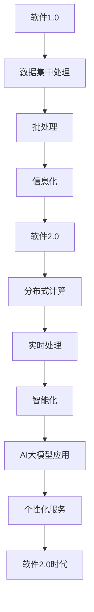

                 

### 《2024年网易校招技术面试题集锦》

> **关键词：** 网易校招，技术面试，编程基础，数据结构与算法，编程语言深度解析，项目实战，面试准备与技巧。

**摘要：** 本文旨在为即将参加2024年网易校招的应聘者提供一份全面的技术面试题集锦。涵盖了编程基础、数据结构与算法、编程语言深度解析以及项目实战等内容，旨在帮助读者深入了解网易校招的技术面试要求，为面试做好充分准备。

### 《2024年网易校招技术面试题集锦》目录大纲

#### 第一部分：技术面试基础

##### 第1章：编程基础

- **1.1 编程语言概述**
  - **1.1.1 常见编程语言简介**
  - **1.1.2 编程语言的选择**

- **1.2 数据结构与算法**
  - **1.2.1 数据结构基本概念**
  - **1.2.2 常见算法分析**

- **1.3 编码实践**

#### 第二部分：编程语言深度解析

##### 第2章：Java

- **2.1 Java基础**
  - **2.1.1 Java基本语法**
  - **2.1.2 Java面向对象**

- **2.2 Java高级特性**
  - **2.2.1 多线程与并发**
  - **2.2.2 Java内存管理**

- **2.3 Java项目实战**

##### 第3章：Python

- **3.1 Python基础**
  - **3.1.1 Python基本语法**
  - **3.1.2 Python数据结构**

- **3.2 Python高级应用**
  - **3.2.1 Python并发编程**
  - **3.2.2 Python网络编程**

- **3.3 Python项目实战**

#### 第三部分：算法与数据结构

##### 第4章：算法基础

- **4.1 算法思维**
  - **4.1.1 算法设计思想**
  - **4.1.2 算法效率分析**

- **4.2 常见算法**
  - **4.2.1 排序算法**
  - **4.2.2 搜索算法**

- **4.3 算法应用**

##### 第5章：数据结构

- **5.1 数据结构原理**
  - **5.1.1 常见数据结构介绍**
  - **5.1.2 数据结构的优化**

- **5.2 数据结构应用**

#### 第四部分：项目实战

##### 第6章：Web开发

- **6.1 Web开发基础**
  - **6.1.1 Web工作原理**
  - **6.1.2 前端技术**

- **6.2 后端开发**
  - **6.2.1 Web框架应用**
  - **6.2.2 数据库设计**

- **6.3 Web项目实战**

##### 第7章：其他技术

- **7.1 操作系统**
  - **7.1.1 操作系统基础**
  - **7.1.2 操作系统应用**

- **7.2 网络技术**
  - **7.2.1 网络基础**
  - **7.2.2 网络安全**

- **7.3 实战项目**

### 附录

- **A.1 面试准备与技巧**
  - **A.1.1 面试心态调整**
  - **A.1.2 面试常见问题**

- **A.2 编程资源与工具**
  - **A.2.1 开发工具推荐**
  - **A.2.2 学习资源推荐**

### 核心概念与联系

#### 1.1.1 从软件1.0到软件2.0的演进

软件的发展经历了从软件1.0到软件2.0的演进。软件1.0以数据集中处理和批处理为主要特征，属于信息化阶段；而软件2.0则引入了分布式计算和实时处理，迈入了智能化阶段。这一演进过程不仅改变了数据处理的方式，还推动了人工智能和个性化服务的普及。

### Mermaid 流程图



### 核心算法原理讲解

#### 2.1.1 算法设计思想

算法设计是计算机科学中至关重要的一环。一个好的算法不仅能够解决问题，还能在时间复杂度和空间复杂度上达到最优。算法设计思想包括：

- **分治思想**：将复杂问题分解成更简单的子问题，递归解决。
- **贪心思想**：在每一步选择中，做出当前最优的选择，期望在整体上得到最优解。
- **动态规划**：通过保存子问题的解，避免重复计算，提高效率。

### 伪代码

```pseudo
function 算法设计(输入数据):
    初始化数据结构
    for each 数据 in 输入数据:
        处理数据
        更新数据结构
    return 数据结构
```

### 数学模型和数学公式

#### 公式

$$ y = f(x) = \sum_{i=1}^{n} w_i * x_i $$

- $f(x)$ 表示输出结果
- $w_i$ 表示权重
- $x_i$ 表示输入特征

#### 举例说明

假设输入特征 $x_1, x_2, x_3$，权重分别为 $w_1 = 0.2, w_2 = 0.5, w_3 = 0.3$，则有：

$$ y = 0.2 \times x_1 + 0.5 \times x_2 + 0.3 \times x_3 $$

### 项目实战

#### 6.3 Web项目实战

##### 开发环境搭建

- 开发工具：Visual Studio Code
- 依赖管理工具：npm
- 前端框架：React
- 后端框架：Node.js + Express

##### 源代码实现

```javascript
// app.js
const express = require('express');
const app = express();

app.get('/', (req, res) => {
  res.send('Hello, World!');
});

app.listen(3000, () => {
  console.log('Server is running on port 3000');
});
```

##### 代码解读与分析

- 使用 express 创建 Web 服务器
- 定义路由，处理 HTTP 请求
- 在 3000 端口启动服务器

### 附录

#### A.1.1 面试心态调整

- **积极心态**：保持乐观，相信自己可以胜任
- **充分准备**：提前了解公司、岗位要求
- **合理期望**：调整期望，关注学习和成长

#### A.1.2 面试常见问题

- **自我介绍**
- **为什么选择这个岗位？**
- **项目经验**
- **算法和数据结构问题**

### 作者

**作者：AI天才研究院/AI Genius Institute & 禅与计算机程序设计艺术 /Zen And The Art of Computer Programming**

