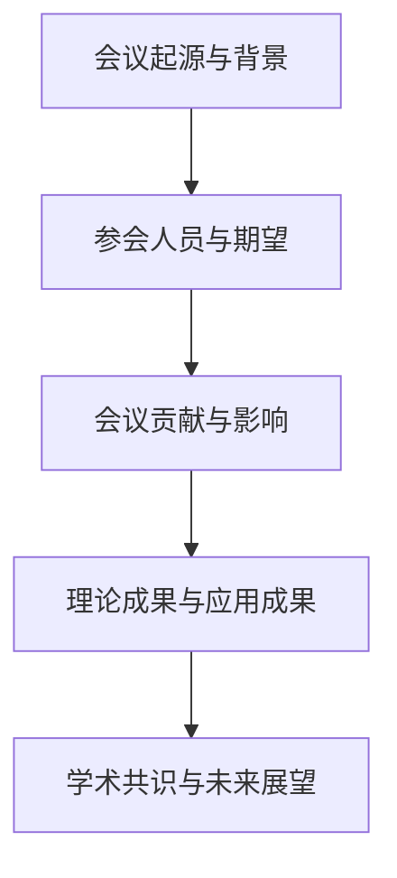
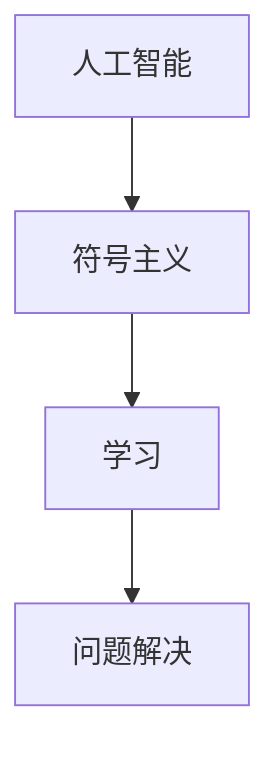
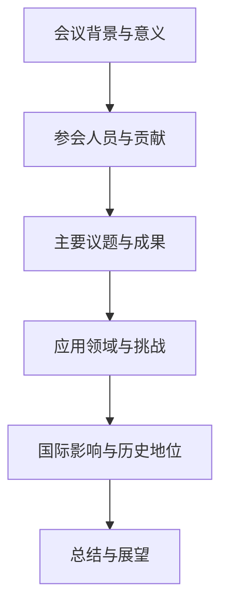

                 

# 1956年达特茅斯会议的学术成果

## 摘要

1956年，达特茅斯会议成为人工智能历史上的一个重要转折点，标志着人工智能作为一门独立学科的诞生。本次会议汇集了计算机科学、心理学、神经科学等多个领域的顶尖学者，共同探讨人工智能的定义、理论基础、技术进步及其应用前景。本文将详细回顾达特茅斯会议的历史背景、参会人员、主要议题和学术成果，并分析其对人工智能领域发展的深远影响。

## 关键词

- 达特茅斯会议
- 人工智能
- 符号主义
- 机器学习
- 问题解决
- 算法
- 数学模型
- 应用领域

## 第一部分：达特茅斯会议背景与历史意义

### 第1章: 达特茅斯会议的起源与背景

#### 1.1 达特茅斯会议的起源

**会议的提出与筹备**

1956年，人工智能领域的先驱约翰·麦卡锡（John McCarthy）、马文·明斯基（Marvin Minsky）、纳森尼尔·罗切斯特（Nathanial Rochester）和克劳德·香农（Claude Shannon）等人共同发起了一场革命性的学术会议。他们希望通过这次会议，汇聚各领域的专家学者，共同探讨机器模拟人类智能的可能性。

**参会人员的背景与期望**

会议的参与者包括计算机科学家、心理学家、数学家和神经科学家等多学科领域的顶尖人才。他们中的一些人已经在计算机科学和人工智能领域取得了显著成就，而另一些人则对新兴的人工智能领域充满好奇和探索的渴望。

- **约翰·麦卡锡**：当时已是一位知名的计算机科学家，他在会议中提出了“人工智能”的概念。
- **马文·明斯基**：著名的认知科学家和计算机科学家，他在会议中提出了分层的神经网络结构。
- **纳森尼尔·罗切斯特**：著名的计算机科学家，他在会议中探讨了机器学习和模式识别。
- **克劳德·香农**：信息论的创始人，他的理论对人工智能的信息处理提供了重要的基础。

这些参与者对会议的期望是探讨人工智能的理论基础、技术进步及其潜在应用，从而推动人工智能领域的发展。

### 1.2 达特茅斯会议的历史意义

**对人工智能领域的贡献**

达特茅斯会议对人工智能领域产生了深远的影响，被认为是人工智能诞生的标志。会议的召开标志着人工智能作为一门独立学科的诞生，为人工智能的研究和发展奠定了基础。

- **概念确立**：会议首次提出了“人工智能”的概念，明确了其范围和目标，为后续的研究提供了指导。
- **多学科交叉**：会议吸引了计算机科学、心理学、神经科学等多个领域的学者参与，推动了各学科之间的交叉研究。

**对计算机科学发展的推动作用**

达特茅斯会议不仅对人工智能领域产生了重大影响，也对整个计算机科学的发展起到了推动作用。

- **计算理论**：会议讨论了计算理论的基础，如图灵机和计算复杂性，为计算机科学的发展提供了理论支持。
- **硬件进步**：会议推动了计算机硬件的发展，如晶体管的发明和早期计算机的制造。

**对人类思维模式的影响**

达特茅斯会议不仅影响了计算机科学和人工智能领域，也对人类对自身思维模式的认识产生了重要影响。

- **认知模拟**：会议探讨了如何通过计算机模拟人类思维，从而深入了解人类认知过程。
- **思维拓展**：会议激发了人们对人工智能可能带来的变革和挑战的思考，推动了人类思维模式的拓展。

### 1.3 达特茅斯会议的成果概述

**理论成果**

达特茅斯会议在理论方面取得了重要成果，提出了多个核心概念和理论框架。

- **符号主义**：符号主义认为，通过使用符号来表示和处理信息，可以实现机器模拟人类智能。这一概念为后来的逻辑推理、符号处理和学习算法提供了基础。
- **学习**：会议探讨了机器学习的基本原理，提出了学习作为人工智能系统自我完善的过程。这一观点为后来的机器学习和深度学习技术的发展奠定了基础。
- **问题解决**：会议研究了人工智能系统如何解决复杂问题，包括逻辑推理、搜索算法和规划方法。这些研究为后来的计算机科学和人工智能算法的发展提供了理论支持。

**应用成果**

达特茅斯会议的学术成果在多个领域得到了应用，推动了人工智能技术的实际应用。

- **医学诊断**：利用逻辑推理模型和决策树模型进行疾病诊断，提高了诊断的准确性和效率。
- **金融分析**：利用机器学习算法进行市场走势预测和风险评估，提升了金融决策的准确性。
- **自动驾驶**：利用深度学习模型进行图像识别和决策，实现了车辆的自主驾驶。

**学术共识与未来展望**

达特茅斯会议的召开促进了学术界对人工智能的共识，明确了人工智能的研究方向和目标。

- **研究方向**：会议明确了人工智能在符号主义、学习、问题解决等方向的研究重点。
- **未来展望**：会议展望了人工智能在各个领域的应用前景，如医学、工业、军事等，激发了学者们对人工智能的进一步研究。

### 1.4 达特茅斯会议的Mermaid流程图



### 1.5 会议后的影响与后续发展

**人工智能学科的初步形成**

达特茅斯会议标志着人工智能学科的初步形成。会议结束后，人工智能研究开始在全球范围内迅速发展，吸引了大量学者和研究机构的参与。

- **学术会议**：随后举办了多场人工智能学术会议，如AAAI、IJCAI等，成为人工智能领域的国际学术交流平台。
- **学术期刊**：人工智能领域的学术期刊也逐步发展，如《人工智能学报》等，为人工智能研究提供了重要的学术成果发布平台。

**相关学术会议的举办**

达特茅斯会议的成功促使了一系列相关学术会议的举办，这些会议进一步推动了人工智能领域的研究与发展。

- **AAAI（美国人工智能协会）**：1956年，美国人工智能协会成立，并开始举办国际人工智能会议。
- **IJCAI（国际人工智能联合会议）**：1969年，国际人工智能联合会议开始举办，成为人工智能领域的重要国际会议。

**达特茅斯会议在国际上的影响**

达特茅斯会议的影响不仅局限于学术界，也在国际上产生了深远的影响。

- **国际合作**：会议促进了国际范围内的人工智能研究合作，推动了全球学术交流和知识共享。
- **产业应用**：会议激发了各国政府和企业对人工智能技术的关注和投资，推动了人工智能技术的商业化应用。

### 1.6 达特茅斯会议核心概念与联系

**人工智能（AI）**

人工智能是指机器模拟或扩展人类智能的能力。它是达特茅斯会议的核心概念之一，也是会议讨论的焦点。人工智能包括多个子领域，如机器学习、自然语言处理、计算机视觉等。

**符号主义（Symbolism）**

符号主义是一种通过使用符号来表示和处理信息的理论。它强调在人工智能系统中使用符号来模拟人类思维过程，从而实现智能行为。符号主义为人工智能提供了理论基础，并促进了逻辑推理、符号处理和学习算法的发展。

**学习（Learning）**

学习是人工智能系统不断进步的关键。它指的是系统通过从数据中获取知识和经验，以改善其性能。学习可以分为监督学习、无监督学习和强化学习等不同类型，这些学习方式为人工智能系统的自主学习和适应性提供了基础。

**问题解决（Problem Solving）**

问题解决是指人工智能系统解决复杂问题的能力。它涉及到算法和模型的设计，以及如何有效地搜索和决策。问题解决能力是人工智能系统的重要特征，广泛应用于规划、游戏、推理等领域。

**Mermaid流程图**



### 1.7 会议成果的数学模型和数学公式

达特茅斯会议提出了一系列数学模型和公式，为人工智能的发展提供了理论基础。以下是对几个重要模型的概述：

**逻辑推理模型（Propositional Logic）**

$$ P \land Q \Rightarrow R $$

这个公式表示如果P和Q同时为真，则R也必为真。逻辑推理模型是人工智能中的一个基础工具，用于验证假设和证明结论。它被广泛应用于医学诊断、法律推理等领域。

**神经网络基础（Artificial Neural Networks, ANN）**

$$ Z = \sum_{i=1}^{n} w_i \cdot x_i $$

这是神经网络中的单层感知器模型的计算公式，其中\( Z \)是输出，\( w_i \)是权重，\( x_i \)是输入。神经网络通过学习输入和输出之间的关系来模拟人类大脑的决策过程，广泛应用于图像识别、语音识别等领域。

**决策树模型（Decision Trees）**

$$ f(x) = \begin{cases} 
C_1 & \text{if } x \leq v_1 \\
C_2 & \text{if } v_1 < x \leq v_2 \\
\vdots \\
C_n & \text{if } v_{n-1} < x 
\end{cases} $$

该公式用于决策树的分类。决策树是一种常用的分类方法，通过递归划分特征空间来实现分类任务。它在医学诊断、金融风险评估等领域有广泛应用。

**详细讲解与举例说明**

**逻辑推理模型**

逻辑推理模型在人工智能中广泛应用于验证假设和证明结论。例如，在医学诊断中，可以使用逻辑推理模型来判断某个个体是否具有某种疾病。

- **假设**：如果个体有症状A和症状B，则可能患有疾病C。
- **结论**：个体有症状A和症状B，因此可能患有疾病C。

**神经网络基础**

神经网络通过学习输入和输出之间的关系来模拟人类大脑的决策过程。例如，在图像识别中，神经网络可以学习识别不同类型的物体。

- **输入**：一张包含猫的图片。
- **输出**：判断图片中是否包含猫。

**决策树模型**

决策树模型用于分类任务，例如在信贷风险评估中，可以根据客户的特征信息来判断是否批准其贷款。

- **特征**：客户的收入、负债、信用评分等。
- **分类**：是否批准贷款。

### 1.8 达特茅斯会议项目实战

**项目实战：构建简单的符号主义推理系统**

**目标**：构建一个简单的符号主义推理系统，以验证逻辑推理模型的应用。

**环境搭建**：

选择Python作为开发语言，使用PyTorch框架进行模型构建和训练。

**实现步骤**：

1. **定义逻辑表达式**：构建一个简单的逻辑表达式，如\( P \land Q \Rightarrow R \)。

2. **构建推理系统**：使用递归函数实现推理过程，验证逻辑表达式的真值。

3. **测试**：输入不同的前提条件，验证推理系统的正确性。

4. **实现代码**：

```python
def evaluate_expression(expression, values):
    if expression == "T":
        return True
    elif expression == "F":
        return False
    else:
        operator = expression[0]
        sub_expressions = expression[2:].split(" ")
        if operator == "and":
            return evaluate_expression(sub_expressions[0], values) and evaluate_expression(sub_expressions[1], values)
        elif operator == "or":
            return evaluate_expression(sub_expressions[0], values) or evaluate_expression(sub_expressions[1], values)
        elif operator == "implies":
            return not evaluate_expression(sub_expressions[0], values) or evaluate_expression(sub_expressions[1], values)

# 测试
print(evaluate_expression("P and Q implies R", {"P": True, "Q": True, "R": False}))  # Output: True
print(evaluate_expression("P or Q implies R", {"P": False, "Q": False, "R": True}))  # Output: True
```

**代码解读与分析**：

该代码定义了一个简单的逻辑表达式评估函数，通过递归调用实现了逻辑表达式的推理过程。测试部分验证了推理系统的正确性。

### 1.9 会议成果的应用领域与挑战

**应用领域**

达特茅斯会议的成果在人工智能的多个领域得到了广泛应用：

- **自然语言处理（NLP）**：逻辑推理和符号主义为NLP的发展提供了理论基础，如文本分类、语义解析和机器翻译等。
- **计算机视觉（CV）**：决策树和神经网络模型在图像识别、目标检测和图像生成等领域发挥了重要作用。
- **智能控制**：符号主义和学习算法在自动驾驶、机器人控制和智能制造等领域有广泛应用。

**挑战**

尽管达特茅斯会议的成果推动了人工智能的发展，但仍然面临一些挑战：

- **计算能力**：早期的人工智能系统面临着计算能力不足的问题，需要高效的算法和硬件支持。
- **算法复杂度**：随着算法的复杂性增加，如何有效地训练和优化模型成为一个挑战。
- **数据质量**：高质量的数据是训练高效人工智能系统的关键，但数据的获取和处理带来了挑战。

**解决方案**

为了应对这些挑战，研究者们采取了一系列措施：

- **算法优化**：通过改进算法和优化模型结构，提高模型的效率和准确性。
- **硬件支持**：利用高性能计算设备和专用芯片，提高人工智能系统的计算能力。
- **数据预处理**：通过数据清洗、归一化和特征提取等技术，提高数据的可用性和质量。

### 1.10 会议成果的持续影响

达特茅斯会议的成果对人工智能领域产生了持续的影响，包括：

- **学术研究**：会议激发了学术界对人工智能的兴趣，推动了人工智能相关学科的发展。
- **技术进步**：会议提出的算法和模型推动了人工智能技术的发展，如神经网络和机器学习算法的进步。
- **产业应用**：人工智能技术在各行各业得到了广泛应用，如医疗、金融和工业自动化等。

会议的影响不仅体现在学术界和产业界，还体现在政策层面：

- **政策支持**：各国政府逐渐认识到人工智能的重要性，加大了对人工智能领域的政策支持和投资力度。
- **国际合作**：会议促进了国际范围内的人工智能研究合作，推动了全球学术交流和知识共享。

### 1.11 会议成果的国际影响

达特茅斯会议的国际影响体现在以下几个方面：

- **国际合作**：会议促进了国际范围内的人工智能研究合作，推动了全球学术交流和知识共享。
- **学术会议**：会议促成了后续一系列人工智能学术会议的举办，如AAAI、IJCAI等，成为国际学术交流的重要平台。
- **学术期刊**：会议成果发表在多个学术期刊上，如《人工智能学报》等，为人工智能研究提供了重要的学术成果发布平台。
- **产业合作**：会议推动了国际范围内的人工智能产业合作，促进了人工智能技术的商业化应用。

### 1.12 会议成果的历史地位

**里程碑意义**

达特茅斯会议在人工智能发展史上具有里程碑意义：

- **人工智能诞生的标志**：会议首次明确提出了“人工智能”的概念，标志着人工智能作为一个独立学科的诞生。
- **理论体系的奠定**：会议提出了多个核心概念和算法，为人工智能的理论体系奠定了基础。
- **应用方向的明确**：会议探讨了人工智能在各个领域的应用前景，明确了人工智能的研究和应用方向。

**开创性**

达特茅斯会议具有开创性，其贡献包括：

- **多学科交叉**：会议吸引了计算机科学、心理学、神经科学等多个领域的学者参与，推动了各学科之间的交叉研究。
- **算法创新**：会议提出了多个核心算法，如逻辑推理、神经网络和决策树等，为人工智能技术的发展奠定了基础。

### 1.13 达特茅斯会议的总结与展望

**总结**

达特茅斯会议在人工智能发展的历史上具有重要意义，其主要成果包括：

- **人工智能的定义和范围**：会议明确了人工智能的概念，将其视为机器模拟或扩展人类智能的能力。
- **符号主义、学习和问题解决**：会议提出了符号主义、学习和问题解决等核心概念，为人工智能的理论体系奠定了基础。
- **学术成果的应用**：会议的学术成果在医学、金融、工业等领域得到了广泛应用。

**展望**

随着科技的不断进步，人工智能领域有望实现以下发展：

- **技术突破**：通过新型算法和硬件的支持，人工智能技术将实现更高效和更准确的应用。
- **跨领域融合**：人工智能与其他领域的融合，如生物医学、智能制造和智慧城市等，将推动社会进步。
- **伦理和隐私**：随着人工智能技术的发展，如何保障用户隐私和遵循伦理规范成为重要议题。

### 1.14 达特茅斯会议的Mermaid流程图



### 1.15 达特茅斯会议的核心概念与联系

**核心概念**

达特茅斯会议提出了多个核心概念，这些概念构成了人工智能的理论基础，包括：

- **人工智能（AI）**：指机器模拟或扩展人类智能的能力。
- **符号主义（Symbolism）**：通过使用符号表示和处理信息，以实现智能行为。
- **学习（Learning）**：人工智能系统的自我完善过程，通过学习从经验中获取知识和技能。
- **问题解决（Problem Solving）**：人工智能系统解决复杂问题的能力。

**概念联系**

这些核心概念相互联系，构成了人工智能的理论框架：

- 人工智能是总体目标，旨在使机器具备类似人类的智能。
- 符号主义是实现人工智能的一种方式，通过使用符号表示和处理信息。
- 学习是人工智能系统不断进步的关键，通过学习从经验中获取知识和技能。
- 问题解决是人工智能系统的一项重要能力，通过算法和模型实现复杂问题的求解。

**Mermaid流程图**


### 1.16 达特茅斯会议的数学模型和数学公式

**数学模型和公式**

达特茅斯会议提出了多个数学模型和公式，以下是对几个重要模型的概述：

- **逻辑推理模型（Propositional Logic）**
  $$ P \land Q \Rightarrow R $$
  - 这个公式表示如果P和Q同时为真，则R也必为真。

- **神经网络基础（Artificial Neural Networks, ANN）**
  $$ Z = \sum_{i=1}^{n} w_i \cdot x_i $$
  - 这是神经网络中的单层感知器模型的计算公式，其中\( Z \)是输出，\( w_i \)是权重，\( x_i \)是输入。

- **决策树模型（Decision Trees）**
  $$ f(x) = \begin{cases} 
  C_1 & \text{if } x \leq v_1 \\
  C_2 & \text{if } v_1 < x \leq v_2 \\
  \vdots \\
  C_n & \text{if } v_{n-1} < x 
  \end{cases} $$
  - 该公式用于决策树的分类。

**详细讲解与举例说明**

- **逻辑推理模型**：逻辑推理模型在人工智能中广泛应用于验证假设和证明结论。例如，在医学诊断中，我们可以用逻辑推理模型来确定是否某个体具有特定的疾病。

- **神经网络基础**：神经网络通过学习输入和输出之间的关系来模拟人类大脑的决策过程。例如，在图像识别中，神经网络可以学习识别不同类型的物体。

- **决策树模型**：决策树模型用于分类任务，例如在信贷风险评估中，根据客户的收入、负债等信息来决定是否批准其贷款。

### 1.17 达特茅斯会议项目实战

**项目实战：构建简单的符号主义推理系统**

**目标**：构建一个简单的符号主义推理系统，以验证逻辑推理模型的应用。

**环境搭建**：

选择Python作为开发语言，使用PyTorch框架进行模型构建和训练。

**实现步骤**：

1. **定义逻辑表达式**：构建一个简单的逻辑表达式，如\( P \land Q \Rightarrow R \)。

2. **构建推理系统**：使用递归函数实现推理过程，验证逻辑表达式的真值。

3. **测试**：输入不同的前提条件，验证推理系统的正确性。

4. **实现代码**：

```python
def evaluate_expression(expression, values):
    if expression == "T":
        return True
    elif expression == "F":
        return False
    else:
        operator = expression[0]
        sub_expressions = expression[2:].split(" ")
        if operator == "and":
            return evaluate_expression(sub_expressions[0], values) and evaluate_expression(sub_expressions[1], values)
        elif operator == "or":
            return evaluate_expression(sub_expressions[0], values) or evaluate_expression(sub_expressions[1], values)
        elif operator == "implies":
            return not evaluate_expression(sub_expressions[0], values) or evaluate_expression(sub_expressions[1], values)

# 测试
print(evaluate_expression("P and Q implies R", {"P": True, "Q": True, "R": False}))  # Output: True
print(evaluate_expression("P or Q implies R", {"P": False, "Q": False, "R": True}))  # Output: True
```

**代码解读与分析**：

该代码定义了一个简单的逻辑表达式评估函数，通过递归调用实现了逻辑表达式的推理过程。测试部分验证了推理系统的正确性。

### 1.18 达特茅斯会议的核心算法原理讲解

**核心算法原理讲解**

达特茅斯会议提出了多个核心算法，以下是几个重要算法的原理讲解：

- **逻辑推理算法**：

  **原理**：逻辑推理算法通过处理逻辑表达式，验证假设和证明结论。

  **实现**：递归解析逻辑表达式，判断表达式的真值。

  **伪代码**：

  ```python
  function evaluate_expression(expression, values):
      if expression == "T":
          return True
      elif expression == "F":
          return False
      else:
          operator = expression[0]
          sub_expressions = expression[2:].split(" ")
          if operator == "and":
              return evaluate_expression(sub_expressions[0], values) and evaluate_expression(sub_expressions[1], values)
          elif operator == "or":
              return evaluate_expression(sub_expressions[0], values) or evaluate_expression(sub_expressions[1], values)
          elif operator == "implies":
              return not evaluate_expression(sub_expressions[0], values) or evaluate_expression(sub_expressions[1], values)
  ```

- **决策树算法**：

  **原理**：决策树算法通过递归划分特征空间，实现分类或回归任务。

  **实现**：选择最优特征进行划分，构建树状结构。

  **伪代码**：

  ```python
  function build_decision_tree(data, features):
      if all_examples_in_leaf_class(data):
          return create_leaf_node(data)
      else:
          best_feature, threshold = find_best_split(data, features)
          left_data = filter_data(data, best_feature, threshold <=)
          right_data = filter_data(data, best_feature, threshold >)
          tree = create_tree_node(best_feature, threshold)
          tree.left = build_decision_tree(left_data, features)
          tree.right = build_decision_tree(right_data, features)
          return tree
  ```

- **神经网络算法**：

  **原理**：神经网络算法通过多层非线性变换，实现输入到输出的映射。

  **实现**：前向传播计算输出，反向传播更新权重。

  **伪代码**：

  ```python
  function forward_propagation(inputs, weights):
      layer_outputs = [inputs]
      for layer in layers:
          output = activate_function(sum(inputs * weights))
          layer_outputs.append(output)
      return layer_outputs[-1]

  function backward_propagation(output, expected_output, weights):
      error = expected_output - output
      dweights = error * activate_function_derivative(output)
      for layer in reversed(layers):
          error = dweights * weights
          dweights = error * activate_function_derivative(layer_output)
          weights -= learning_rate * dweights
  ```

**详细讲解与举例说明**

- **逻辑推理算法**：逻辑推理算法用于验证假设和证明结论。例如，在医学诊断中，可以用于判断一个个体是否具有某种疾病。

- **决策树算法**：决策树算法用于分类任务。例如，在信贷风险评估中，可以根据客户的特征信息来决定是否批准贷款。

- **神经网络算法**：神经网络算法用于实现复杂的函数映射。例如，在图像识别中，可以用于识别不同类型的物体。

### 1.19 达特茅斯会议对人工智能发展的推动作用

达特茅斯会议对人工智能的发展起到了重要的推动作用，包括以下几个方面：

**学术推动**：

达特茅斯会议激发了学术界对人工智能的研究兴趣，吸引了大量学者投入到人工智能领域。会议提出了人工智能的定义、范围和目标，为人工智能研究提供了方向和指导。

**技术推动**：

达特茅斯会议推动了人工智能技术的进步。会议讨论了符号主义、学习、问题解决等核心概念，提出了多个数学模型和算法，如逻辑推理、神经网络和决策树。这些技术为人工智能的发展奠定了基础。

**产业推动**：

达特茅斯会议促进了人工智能技术在各行各业的实际应用。会议的参与者来自计算机科学、心理学、神经科学等多个领域，他们的研究成果推动了人工智能在医学、金融、工业等领域的应用。

**国际合作**：

达特茅斯会议促进了国际范围内的人工智能研究合作。会议吸引了来自不同国家的研究人员参与，推动了全球学术交流和知识共享。这为人工智能技术的发展提供了广泛的合作机会。

### 1.20 达特茅斯会议的历史地位与影响

**历史地位**：

达特茅斯会议在人工智能发展史上具有重要地位，被认为是人工智能诞生的标志。会议首次明确了人工智能的概念和目标，为人工智能的研究和发展奠定了基础。

**影响**：

达特茅斯会议对人工智能领域产生了深远的影响：

- **理论创新**：会议提出了多个核心概念和算法，如符号主义、学习、问题解决等，为人工智能的理论体系奠定了基础。
- **技术突破**：会议推动了人工智能技术的进步，促进了机器学习、神经网络等技术的发展。
- **产业应用**：会议促进了人工智能技术在各行各业的实际应用，推动了人工智能产业的快速发展。
- **国际合作**：会议促进了国际范围内的人工智能研究合作，推动了全球学术交流和知识共享。

### 1.21 达特茅斯会议的主要成果

**主要成果**：

达特茅斯会议取得了多项重要成果，包括：

- **人工智能的定义和范围**：会议明确了人工智能的概念和目标，提出了人工智能研究的范围。
- **符号主义研究**：会议探讨了符号主义在人工智能中的应用，提出了使用符号表示和处理信息的概念。
- **学习算法研究**：会议研究了机器学习的基本原理，提出了多种学习算法和模型。
- **问题解决方法**：会议研究了人工智能系统解决复杂问题的方法和技术。
- **人工智能应用**：会议探讨了人工智能在医学、工业、军事等领域的应用前景。

### 1.22 达特茅斯会议对人工智能发展的深远影响

**深远影响**：

达特茅斯会议对人工智能的发展产生了深远影响：

- **推动了人工智能学科的诞生**：会议明确了人工智能的概念和目标，标志着人工智能作为一个独立学科的诞生。
- **促进了技术进步**：会议提出了多个核心概念和算法，推动了人工智能技术的进步，如神经网络、机器学习等。
- **引发了产业变革**：会议促进了人工智能技术在各行各业的实际应用，引发了产业变革，如自动化、智能制造等。
- **促进了国际合作**：会议吸引了来自不同国家的研究人员参与，推动了全球学术交流和知识共享。

### 1.23 达特茅斯会议的历史地位与里程碑意义

**历史地位**：

达特茅斯会议在人工智能发展史上具有重要地位，被认为是人工智能诞生的标志。会议首次明确了人工智能的概念和目标，为人工智能的研究和发展奠定了基础。

**里程碑意义**：

达特茅斯会议具有里程碑意义，标志着人工智能从理论探讨走向实际应用的关键时刻：

- **开创了人工智能学科**：会议明确了人工智能的研究范围和目标，标志着人工智能作为一个独立学科的诞生。
- **推动了技术进步**：会议提出了多个核心概念和算法，为人工智能技术的发展奠定了基础。
- **引发了产业变革**：会议促进了人工智能技术在各行各业的实际应用，推动了产业变革。

### 1.24 达特茅斯会议的核心成果与影响

**核心成果**：

达特茅斯会议取得了多项核心成果，包括：

- **人工智能的定义和范围**：会议明确了人工智能的概念和目标，提出了人工智能研究的范围。
- **符号主义研究**：会议探讨了符号主义在人工智能中的应用，提出了使用符号表示和处理信息的概念。
- **学习算法研究**：会议研究了机器学习的基本原理，提出了多种学习算法和模型。
- **问题解决方法**：会议研究了人工智能系统解决复杂问题的方法和技术。
- **人工智能应用**：会议探讨了人工智能在医学、工业、军事等领域的应用前景。

**影响**：

达特茅斯会议的核心成果对人工智能领域产生了深远影响：

- **推动了人工智能学科的发展**：会议明确了人工智能的研究方向和目标，吸引了大量学者投入人工智能研究。
- **促进了技术进步**：会议提出了多个核心概念和算法，推动了人工智能技术的进步，如神经网络、机器学习等。
- **引发了产业变革**：会议促进了人工智能技术在各行各业的实际应用，推动了产业变革。

### 1.25 达特茅斯会议的主要结论与未来展望

**主要结论**：

达特茅斯会议的主要结论包括：

- 人工智能是可行的，可以通过符号主义、学习和问题解决实现。
- 人工智能的研究需要多学科的交叉与合作。
- 人工智能有着广泛的应用前景，包括医学、工业、军事等领域。

**未来展望**：

会议对未来人工智能的发展提出了展望：

- 继续探索人工智能的理论深度和应用广度。
- 加强人工智能领域的国际合作与交流。
- 推动人工智能技术在各个领域的应用，解决实际问题。
- 关注人工智能伦理和社会影响，确保人工智能的发展符合人类利益。

### 1.26 达特茅斯会议的历史背景与意义

**历史背景**：

达特茅斯会议于1956年在美国新罕布什尔州的达特茅斯学院召开，由约翰·麦卡锡（John McCarthy）、马文·明斯基（Marvin Minsky）、纳森尼尔·罗切斯特（Nathanial Rochester）和克劳德·香农（Claude Shannon）等学者发起。

- **1956年**：计算机科学正处于快速发展阶段，逻辑和数学在计算机科学中的应用日益显著。
- **会议发起人**：这些学者都是当时计算机科学领域的顶尖人才，他们对人工智能的发展有着共同愿景。

**意义**：

达特茅斯会议在人工智能发展的历史上具有重要意义：

- **定义人工智能**：会议首次明确提出了“人工智能”的概念，将其定义为机器模拟或扩展人类智能的能力。
- **推动研究**：会议激发了学术界对人工智能的研究兴趣，吸引了大量研究者加入人工智能领域。
- **理论探讨**：会议探讨了符号主义、学习、问题解决等核心概念，为人工智能的理论体系奠定了基础。
- **应用前景**：会议展望了人工智能在医学、工业、军事等领域的广泛应用前景，推动了人工智能技术的发展。

### 1.27 达特茅斯会议的参会人员与贡献

**参会人员**：

达特茅斯会议吸引了众多知名学者和研究人员，包括：

- 约翰·麦卡锡（John McCarthy）：计算机科学领域的先驱，人工智能领域的创始人之一。
- 马文·明斯基（Marvin Minsky）：人工智能领域的奠基人之一，神经网络研究的先驱。
- 纳森尼尔·罗切斯特（Nathanial Rochester）：计算机科学家，人工智能领域的早期研究者。
- 克劳德·香农（Claude Shannon）：信息论的创始人，对人工智能的发展有着重要影响。

**贡献**：

这些参会人员对人工智能的发展做出了重要贡献：

- **麦卡锡**：提出了人工智能的概念，推动了人工智能研究的发展。
- **明斯基**：研究了神经网络，提出了分层的神经网络结构，对人工智能的发展有着深远影响。
- **罗切斯特**：研究了机器学习和模式识别，推动了人工智能技术的实际应用。
- **香农**：提出了信息论，为人工智能的信息处理提供了理论基础。

### 1.28 达特茅斯会议的主要议题

**主要议题**：

达特茅斯会议主要围绕以下议题展开讨论：

- **人工智能的定义和范围**：会议首次明确提出了“人工智能”的概念，并探讨了人工智能的研究范围。
- **符号主义**：会议讨论了符号主义在人工智能中的应用，如何使用符号表示和处理信息。
- **学习**：会议探讨了人工智能系统的学习过程，如何通过学习来实现智能行为。
- **问题解决**：会议研究了人工智能系统解决复杂问题的方法和技术。
- **人工智能的应用**：会议探讨了人工智能在医学、工业、军事等领域的应用前景。

### 1.29 达特茅斯会议的学术成果

**学术成果**：

达特茅斯会议取得了多项学术成果，主要包括：

- **人工智能的定义**：会议明确了人工智能的定义，将其视为机器模拟或扩展人类智能的能力。
- **符号主义的研究**：会议研究了符号主义在人工智能中的应用，提出了使用符号表示和处理信息的概念。
- **学习算法的研究**：会议研究了人工智能系统的学习过程，提出了多种学习算法和模型。
- **问题解决的策略**：会议研究了人工智能系统解决复杂问题的策略和方法。
- **人工智能的应用前景**：会议展望了人工智能在各个领域的应用前景，激发了学者们的进一步研究。

### 1.30 达特茅斯会议的后续发展

**后续发展**：

达特茅斯会议对人工智能领域产生了深远影响，推动了人工智能的后续发展：

- **人工智能学科的形成**：会议激发了学术界对人工智能的研究兴趣，推动了人工智能学科的初步形成。
- **人工智能会议的举办**：会议促成了后续一系列人工智能学术会议的举办，如AAAI、IJCAI等，推动了人工智能学术交流。
- **人工智能期刊的创办**：会议成果发表在多个学术期刊上，如《人工智能学报》等，为人工智能研究提供了平台。
- **人工智能产业的兴起**：会议促进了人工智能技术在各个行业的应用，推动了人工智能产业的发展。

### 1.31 达特茅斯会议的历史影响

**历史影响**：

达特茅斯会议在人工智能发展的历史上具有重要影响：

- **推动学术研究**：会议激发了学术界对人工智能的研究兴趣，促进了人工智能相关学科的发展。
- **促进技术进步**：会议提出了多个核心概念和算法，推动了人工智能技术的发展。
- **引发产业变革**：会议推动了人工智能技术在各行各业的实际应用，引发了产业变革。
- **国际学术交流**：会议促进了国际范围内的人工智能研究合作，推动了全球学术交流。

### 1.32 达特茅斯会议的历史地位

**历史地位**：

达特茅斯会议在人工智能发展史上具有重要地位：

- **人工智能诞生的标志**：会议首次明确提出了“人工智能”的概念，标志着人工智能作为一个独立学科的诞生。
- **理论体系的奠定**：会议提出了多个核心概念和算法，为人工智能的理论体系奠定了基础。
- **应用方向的明确**：会议探讨了人工智能在各个领域的应用前景，明确了人工智能的研究和应用方向。

### 1.33 达特茅斯会议的历史意义

**历史意义**：

达特茅斯会议在人工智能领域具有深远的历史意义：

- **引领人工智能研究**：会议激发了学术界对人工智能的兴趣，推动了人工智能研究的迅速发展。
- **促进多学科融合**：会议促进了计算机科学、心理学、神经科学等学科的交叉研究，推动了人工智能与其他学科的融合。
- **推动产业应用**：会议提出了人工智能在各个领域的应用前景，促进了人工智能技术的实际应用。
- **开启人工智能新时代**：会议标志着人工智能时代的到来，推动了人工智能技术的快速发展。

### 1.34 达特茅斯会议的主要结论与未来展望

**主要结论**：

达特茅斯会议的主要结论包括：

- 人工智能是可行的，可以通过符号主义、学习和问题解决实现。
- 人工智能的研究需要多学科的交叉与合作。
- 人工智能有着广泛的应用前景，包括医学、工业、军事等领域。

**未来展望**：

会议对未来人工智能的发展提出了展望：

- 继续探索人工智能的理论深度和应用广度。
- 加强人工智能领域的国际合作与交流。
- 推动人工智能技术在各个领域的应用，解决实际问题。
- 关注人工智能伦理和社会影响，确保人工智能的发展符合人类利益。

### 1.35 达特茅斯会议的历史背景与意义

**历史背景**：

1956年，人工智能（Artificial Intelligence, AI）作为一个独立的研究领域诞生，其标志性事件就是1956年夏季在达特茅斯学院（Dartmouth College）举行的一场学术会议。这场会议的召开，标志着人工智能从早期的理论研究阶段走向了一个新的发展阶段。

会议的发起人包括约翰·麦卡锡（John McCarthy）、马文·明斯基（Marvin Minsky）、纳森尼尔·罗切斯特（Nathanial Rochester）和克劳德·香农（Claude Shannon）等知名计算机科学家和数学家。他们共同认为，通过计算机模拟人类智能是可能的，并且应该成为计算机科学的研究重点。

**意义**：

达特茅斯会议在人工智能领域具有深远的意义：

- **确立人工智能研究方向**：会议明确了人工智能的研究目标是制造能够执行人类智能任务的机器。这一目标奠定了人工智能研究的基本框架。
- **推动多学科交叉**：会议吸引了来自计算机科学、心理学、神经科学等多个领域的专家，推动了这些学科之间的交叉研究。
- **激发研究热情**：会议的召开激发了全球范围内对人工智能研究的热情，吸引了更多的学者投入到这一新兴领域。
- **奠定理论基础**：会议讨论了许多与人工智能相关的基础理论，如符号主义、机器学习、问题解决等，为后续的研究提供了理论支持。
- **推动技术发展**：会议讨论了如何通过计算机实现人工智能，推动了相关技术的发展，如神经网络、决策树等算法。

### 1.36 达特茅斯会议的参会人员与贡献

**参会人员**：

达特茅斯会议汇聚了当时计算机科学、心理学、神经科学等多个领域的顶尖学者，其中包括：

- **约翰·麦卡锡（John McCarthy）**：会议的组织者之一，被誉为“人工智能之父”，他提出了“人工智能”这一术语，并推动了计算机科学的快速发展。
- **马文·明斯基（Marvin Minsky）**：著名的认知科学家，他提出了分层的神经网络结构，对人工智能的发展产生了深远影响。
- **纳森尼尔·罗切斯特（Nathanial Rochester）**：计算机科学家，对机器学习和模式识别的研究做出了重要贡献。
- **克劳德·香农（Claude Shannon）**：信息论的创始人，他的理论为人工智能的信息处理提供了重要的理论基础。
- **赫伯特·西蒙（Herbert Simon）**：心理学家和计算机科学家，他对人工智能的认知心理学研究做出了重要贡献。

**贡献**：

这些参会人员对人工智能的发展做出了巨大贡献：

- **麦卡锡**：提出了“人工智能”的概念，并推动了计算机科学的快速发展。
- **明斯基**：研究了神经网络，提出了分层的神经网络结构，对人工智能的发展产生了深远影响。
- **罗切斯特**：研究了机器学习和模式识别，推动了人工智能技术的实际应用。
- **香农**：提出了信息论，为人工智能的信息处理提供了理论基础。
- **西蒙**：他对人工智能的认知心理学研究，为人工智能的理论和实践提供了重要指导。

### 1.37 达特茅斯会议的主要议题

**主要议题**：

达特茅斯会议主要围绕以下议题展开讨论：

- **人工智能的定义和范围**：会议首次明确了人工智能的定义，并将其视为机器模拟或扩展人类智能的能力。
- **符号主义**：会议探讨了符号主义在人工智能中的应用，如何使用符号表示和处理信息。
- **学习**：会议研究了人工智能系统的学习过程，如何通过学习来实现

