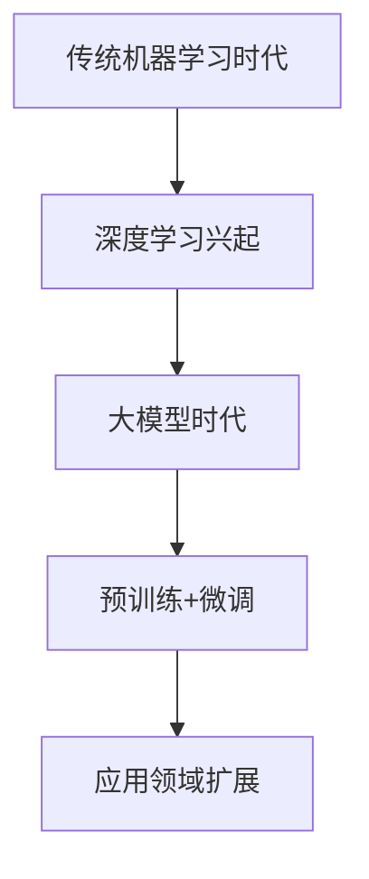

                 

# 《探讨AI大模型在智能电网优化中的作用》

> 关键词：人工智能，大模型，智能电网，优化，电力预测，负荷管理，故障检测

> 摘要：本文深入探讨了人工智能（AI）大模型在智能电网优化中的应用。通过分析AI大模型的基本概念和发展历程，结合智能电网的架构与挑战，本文重点讨论了AI大模型在电力预测、负荷管理和故障检测等方面的应用。此外，文章还分析了AI大模型优化智能电网的关键技术，并举例说明了实际应用案例。最后，本文展望了AI大模型在智能电网优化中的挑战与未来发展趋势。

## 《探讨AI大模型在智能电网优化中的作用》目录大纲

### 第一部分：AI大模型基础

### 第1章：AI大模型概述

### 第2章：智能电网基础

### 第3章：AI大模型在智能电网中的应用

### 第二部分：AI大模型在智能电网优化中的应用

### 第4章：AI大模型优化智能电网的关键技术

### 第5章：AI大模型在智能电网优化中的实际应用案例

### 第6章：AI大模型在智能电网优化中的挑战与未来发展趋势

### 第三部分：附录

### 附录A：AI大模型在智能电网优化中的应用工具与资源

### 附录B：主要参考文献

## 第一部分：AI大模型基础

### 第1章：AI大模型概述

### 第2章：智能电网基础

### 第3章：AI大模型在智能电网中的应用

## 第二部分：AI大模型在智能电网优化中的应用

### 第4章：AI大模型优化智能电网的关键技术

### 第5章：AI大模型在智能电网优化中的实际应用案例

### 第6章：AI大模型在智能电网优化中的挑战与未来发展趋势

## 第三部分：附录

### 附录A：AI大模型在智能电网优化中的应用工具与资源

### 附录B：主要参考文献

接下来，我们将逐一展开上述章节的内容，详细探讨AI大模型在智能电网优化中的应用。让我们开始第一步分析推理。

### 第1章：AI大模型概述

#### 1.1 AI大模型的概念与特点

AI大模型（Large-scale AI Model）是指具有大量参数、高度复杂的神经网络模型。它们通过学习和处理大规模数据集，能够实现从语音识别、图像处理到自然语言处理等广泛领域的智能任务。与传统的机器学习方法相比，AI大模型具有以下几个显著特点：

1. **参数规模大**：AI大模型通常包含数十亿甚至数万亿个参数，这使得模型具有更强的表示能力和泛化能力。
   
2. **深度结构**：大模型通常具有多层神经网络结构，能够通过逐层抽象的方式提取数据中的复杂特征。

3. **高效计算**：得益于GPU、TPU等高性能计算硬件的发展，大模型能够在较短时间内完成训练和推理任务。

4. **自动特征提取**：AI大模型可以自动学习数据的特征表示，无需人工设计特征工程。

#### 1.2 AI大模型的发展历程

AI大模型的发展历程可以分为以下几个阶段：

1. **传统机器学习时代**：20世纪90年代，机器学习方法如支持向量机、决策树等开始广泛应用。

2. **深度学习兴起**：2006年，深度学习（Deep Learning）的概念被提出，随后卷积神经网络（CNN）和循环神经网络（RNN）相继问世，标志着深度学习时代的到来。

3. **大模型时代**：随着计算能力的提升和海量数据集的积累，AI大模型逐渐成为主流。2012年，AlexNet在ImageNet竞赛中取得突破性成绩，标志着AI大模型的崛起。

4. **预训练+微调**：近年来，预训练（Pre-training）+微调（Fine-tuning）的方法成为AI大模型的主流训练策略，使得大模型能够更好地适应各种应用场景。

#### 1.3 AI大模型的应用领域

AI大模型在多个领域取得了显著成果，以下为几个典型应用领域：

1. **计算机视觉**：如图像分类、目标检测、图像分割等。
   
2. **自然语言处理**：如文本分类、机器翻译、语音识别等。
   
3. **推荐系统**：如商品推荐、社交网络推荐等。

4. **智能语音助手**：如苹果的Siri、谷歌的Google Assistant等。

5. **智能电网**：如电力需求预测、负荷管理、故障检测等。

#### Mermaid流程图：AI大模型的发展历程



#### 核心概念与联系

在智能电网优化中，AI大模型通过以下几个方面与智能电网紧密联系：

1. **数据处理能力**：AI大模型能够高效处理和分析大量电力系统数据，为电网优化提供可靠的数据支持。
   
2. **自适应能力**：AI大模型能够自动学习电力系统的动态变化，实现实时优化。

3. **多任务处理**：AI大模型可以同时处理多个任务，如电力需求预测、负荷管理和故障检测，实现电网的综合优化。

#### 伪代码：AI大模型核心原理

```python
# 假设输入数据为X，模型参数为θ
# 前向传播
z = X * θ
a = sigmoid(z)

# 计算损失函数
loss = -1/m * sum(y * log(a) + (1 - y) * log(1 - a))

# 反向传播
dz = a - y
dθ = 1/m * X.T * dz
da = sigmoid_derivative(a)

# 更新参数
θ = θ - α * dθ
```

#### 数学模型和公式

AI大模型通常采用多层感知机（MLP）或卷积神经网络（CNN）等结构，其基本原理如下：

$$
z = \sigma(\theta^T X)
$$

其中，$\sigma$ 为激活函数，通常采用Sigmoid函数或ReLU函数。

#### 举例说明

以电力需求预测为例，假设输入数据为一天内的逐时电力需求，输出为下一时刻的电力需求。通过训练AI大模型，可以预测未来的电力需求，从而为电网调度提供参考。

#### 下一步分析推理

在下一章节中，我们将探讨智能电网的基础知识，包括智能电网的概述、架构与技术，以及当前面临的挑战。这将为我们理解AI大模型在智能电网中的应用提供必要背景。接下来，让我们继续深入分析智能电网的基础知识。

