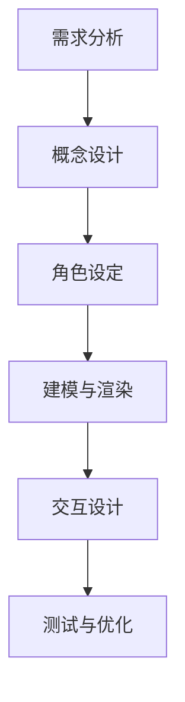
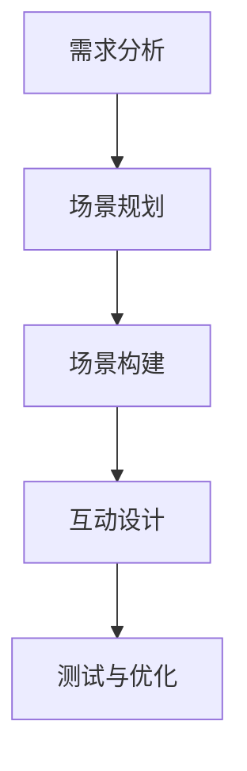
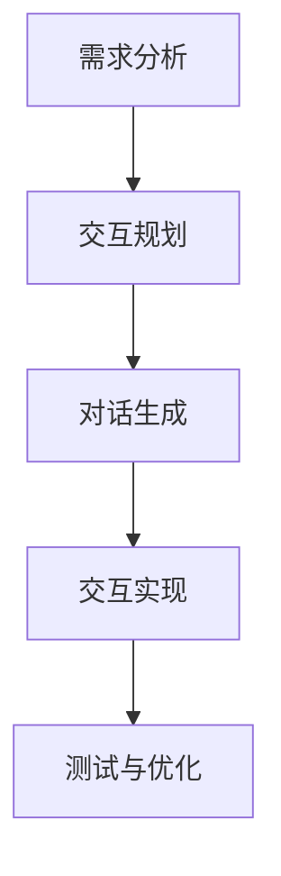
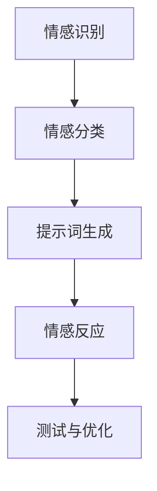

                 

## 文章标题

### 提示词工程在虚拟形象设计中的应用

在当今数字时代，虚拟形象的设计与应用已经成为技术领域的重要研究方向。这些虚拟形象不仅出现在电影、游戏和虚拟现实中，还广泛应用于社交媒体、电子商务和客户服务等多个领域。而提示词工程作为一种先进的人工智能技术，正逐渐成为虚拟形象设计的核心驱动力。本文将深入探讨提示词工程在虚拟形象设计中的应用，旨在为读者提供全面的了解和深入的思考。

**关键词：** 虚拟形象设计、提示词工程、人工智能、虚拟现实、客户服务、社交媒体、电子商务。

**摘要：** 本文首先介绍了虚拟形象设计与提示词工程的基本概念，阐述了两者之间的内在联系。接着，详细分析了提示词工程的基本原理及其在虚拟形象设计中的应用。随后，本文探讨了虚拟形象设计的基本理论，包括设计原则、类型和情感设计等方面。在应用实践部分，本文通过具体案例，展示了提示词工程在虚拟角色形象设计、虚拟场景设计和虚拟交互设计中的应用。最后，本文探讨了虚拟形象设计的高级应用，如情感识别与反应以及虚拟形象的智能化演进。通过本文的探讨，旨在为虚拟形象设计的未来发展提供新的思路和方向。

### 背景与引言

虚拟形象设计是指通过数字技术，如三维建模、图形渲染和动画技术，创建具有视觉和交互特点的虚拟角色、场景和物体。这些虚拟形象在虚拟现实（VR）、增强现实（AR）和混合现实（MR）等领域有着广泛的应用。随着计算机图形学和人工智能技术的不断发展，虚拟形象的设计与实现变得越来越复杂和多样化。

虚拟形象的应用场景丰富多样，包括但不限于以下几个方面：

1. **娱乐领域**：虚拟形象是电影、动画和游戏的重要组成部分，通过逼真的视觉效果和交互体验，为观众带来沉浸式的娱乐体验。

2. **教育领域**：虚拟形象可以用于模拟实验、教学演示和互动课程，提高学生的学习兴趣和理解能力。

3. **医疗领域**：虚拟形象可以用于医疗培训、手术模拟和患者心理治疗，提供个性化的医疗服务和康复方案。

4. **商业领域**：虚拟形象可以用于品牌推广、产品展示和客户服务，提升企业的市场竞争力。

5. **社交领域**：虚拟形象成为社交媒体和虚拟社交平台的新宠，用户可以通过虚拟形象进行交流、互动和展示个性和风格。

随着虚拟形象应用的不断拓展，如何设计出更具吸引力和互动性的虚拟形象成为了一个重要的研究课题。而提示词工程作为一种先进的人工智能技术，为虚拟形象设计提供了新的思路和方法。

提示词工程是一种基于自然语言处理（NLP）和机器学习（ML）的技术，通过分析大量的文本数据，提取出关键信息，生成高质量的文本。在虚拟形象设计中，提示词工程可以用于以下几个方面：

1. **角色设定**：通过提示词工程，设计师可以自动生成角色的性格、爱好、职业等设定，提高角色设计的多样性和个性化。

2. **对话生成**：提示词工程可以用于生成虚拟形象的自然语言对话，实现更自然的交互体验。

3. **场景构建**：通过提示词工程，设计师可以自动生成虚拟场景的描述和文本，丰富场景的内容和氛围。

4. **情感表达**：提示词工程可以用于分析用户的情感状态，并根据情感特征生成相应的文本和表情，提高虚拟形象的互动性和情感表达。

总之，虚拟形象设计与提示词工程的结合，为设计师提供了更强大的工具和更广阔的创作空间，使得虚拟形象的设计与实现更加高效和富有创意。本文将详细探讨提示词工程在虚拟形象设计中的应用，旨在为读者提供深入的见解和实用的指导。

### 虚拟形象设计与提示词工程的关系

虚拟形象设计与提示词工程之间的关系可以看作是相互促进、相辅相成的关系。虚拟形象设计为提示词工程提供了具体的应用场景和需求，而提示词工程则为虚拟形象设计提供了高效的技术手段和创意支持。

首先，虚拟形象设计的需求推动了提示词工程的发展。在虚拟形象设计过程中，设计师需要为角色设定详细的背景故事、性格特点、情感状态等。传统的手动设计方法效率低下，难以满足日益复杂的虚拟形象需求。而提示词工程通过自动化生成和优化文本，可以大幅提高设计效率，满足设计师的多样化需求。例如，在角色设定阶段，提示词工程可以生成不同类型的角色背景故事，设计师可以根据需求进行选择和调整，从而实现个性化的角色设计。

其次，提示词工程为虚拟形象设计提供了丰富的创意资源。虚拟形象设计需要不断创新和突破，而提示词工程通过分析大量的文本数据，可以提取出各种有趣和独特的主题、概念和故事情节。这些创意资源可以为设计师提供灵感，帮助他们创造出更具吸引力和互动性的虚拟形象。例如，在场景构建阶段，提示词工程可以自动生成虚拟场景的描述文本，设计师可以根据这些文本进行场景设计和渲染，从而实现更加丰富和逼真的虚拟场景。

此外，提示词工程还可以提高虚拟形象的互动性和情感表达。通过自然语言处理和情感分析技术，提示词工程可以生成符合用户情感状态的自然语言对话和表情。例如，在虚拟交互设计阶段，提示词工程可以根据用户的反馈和行为，自动生成相应的对话和反应，提高虚拟形象的互动性和用户体验。同时，提示词工程还可以分析用户的情感状态，根据情感特征生成相应的情感表达，使虚拟形象更具人性化。

总之，虚拟形象设计与提示词工程之间的紧密关系，不仅提高了设计效率和创意水平，还为虚拟形象的互动性和情感表达提供了强大的技术支持。随着人工智能技术的不断进步，提示词工程在虚拟形象设计中的应用前景将更加广阔，为虚拟形象的多样化发展和创新提供源源不断的动力。

### 提示词工程的基本概念

提示词工程（Prompt Engineering）是一种利用人工智能技术，特别是自然语言处理（NLP）和机器学习（ML）的方法，来生成和优化文本的技术。其核心思想是通过分析和理解大量的文本数据，提取出关键信息，并利用这些信息生成高质量、有针对性的文本。提示词工程在多个领域都有广泛的应用，如信息检索、文本生成、问答系统、对话系统等。

#### 提示词的定义

提示词（Prompt）是提示词工程中的关键概念，指的是用于引导模型生成文本的输入信息。提示词可以是单个单词、短语、句子或段落，其主要作用是提供上下文信息和生成目标，帮助模型理解所需的输出内容。一个高质量的提示词应具备以下特点：

1. **明确性**：提示词应清晰明确地传达所需的生成目标和上下文信息，避免模糊或歧义。
2. **多样性**：通过提供多样化的提示词，可以生成更加丰富和有创意的文本。
3. **相关性**：提示词应与生成目标紧密相关，确保生成的文本符合预期。

#### 提示词的来源

提示词的来源可以是多种多样的，主要包括以下几种：

1. **手动编写**：通过专业知识和经验，手动编写高质量的提示词。这种方法需要丰富的语言表达能力和逻辑思维能力，适用于特定领域的文本生成任务。
2. **自动化提取**：利用自然语言处理技术，从大量文本数据中自动提取提示词。这种方法通过分析和理解文本内容，可以生成具有针对性的提示词，适用于大规模的文本生成任务。
3. **用户反馈**：通过用户反馈和互动，不断优化和调整提示词。这种方法可以根据用户的需求和偏好，实现个性化的文本生成。

#### 提示词的分类

根据应用场景和生成目标，提示词可以分为以下几类：

1. **问题提示词**：用于生成问题的文本，如问答系统和考试生成。
2. **答案提示词**：用于生成答案的文本，如自动问答系统和考试答案生成。
3. **文本续写提示词**：用于生成文本续写的文本，如故事续写、诗歌创作等。
4. **摘要提示词**：用于生成摘要的文本，如文本摘要系统和新闻标题生成。
5. **对话提示词**：用于生成对话的文本，如聊天机器人和客户服务系统。

#### 提示词工程的基本原理

提示词工程的基本原理主要包括以下几个方面：

1. **文本预处理**：对输入文本进行预处理，包括分词、去停用词、词性标注等，以便更好地理解文本内容。
2. **特征提取**：从预处理后的文本中提取关键特征，如词频、词向量、句子结构等，用于训练模型。
3. **模型训练**：利用提取的特征，训练基于NLP和ML的模型，如序列生成模型、转换模型、生成对抗网络（GAN）等。
4. **文本生成**：通过训练好的模型，输入提示词生成文本，如回答问题、续写故事、生成摘要等。

#### 提示词工程的核心技术

提示词工程涉及多种核心技术，主要包括：

1. **自然语言处理（NLP）**：NLP技术用于对文本进行预处理、分析和理解，提取关键信息，为文本生成提供基础。
2. **机器学习（ML）**：ML技术用于训练和优化模型，实现高质量的文本生成。
3. **深度学习（DL）**：DL技术，特别是神经网络模型，如循环神经网络（RNN）、长短期记忆网络（LSTM）、变换器（Transformer）等，在文本生成任务中具有强大的表现。
4. **生成对抗网络（GAN）**：GAN技术通过生成器和判别器的对抗训练，生成高质量、多样化的文本。

通过以上基本概念和原理的介绍，我们可以看到，提示词工程是一种强大而灵活的技术，在虚拟形象设计等领域有着广泛的应用前景。接下来，我们将进一步探讨虚拟形象设计的基本理论，了解其在虚拟形象设计中的具体应用。

### 虚拟形象设计的基本理论

虚拟形象设计作为数字艺术与科技相结合的产物，其理论基础涵盖了多个方面，包括设计原则、类型和情感设计等。这些理论为设计师提供了创造具有吸引力和互动性的虚拟形象的方法和思路。

#### 设计原则

1. **一致性**：虚拟形象设计的一致性是指角色的外观、动作和对话应保持统一，避免出现矛盾和不协调的情况。例如，如果一个角色的性格设定为开朗活泼，那么其言行举止和表情也应符合这一设定。

2. **真实性**：虚拟形象的逼真程度是其吸引力的重要因素。通过精细的三维建模和高质量的图形渲染，设计师可以使虚拟形象看起来更加真实，增强用户的沉浸感。

3. **多样性**：虚拟形象应具备多样性，以满足不同用户的需求和偏好。设计师可以通过设计多种类型的角色，包括不同的性别、种族、职业和性格，来丰富虚拟形象的种类。

4. **易用性**：虚拟形象应易于用户使用和理解。设计师需要考虑到用户的使用习惯和认知能力，设计出简洁直观的交互界面和操作流程。

5. **情感性**：虚拟形象的设计应注重情感表达，通过细腻的表情、动作和对话，使角色更加生动和有吸引力。

#### 虚拟形象的类型

1. **角色**：角色是虚拟形象设计中最常见的一种类型。根据虚拟形象在故事中的角色和功能，角色可以分为主角、配角和NPC（非玩家角色）等。每种角色都有其独特的性格、背景和故事线。

2. **场景**：虚拟场景是虚拟形象设计的另一重要组成部分。通过创建多样化的场景，设计师可以增强虚拟世界的真实感和沉浸感。场景类型包括城市、自然、室内、户外等。

3. **物体**：虚拟物体是虚拟形象设计中不可或缺的一部分，如家具、道具、装饰等。这些物体不仅丰富了虚拟场景的内容，还增强了虚拟世界的互动性和实用性。

4. **界面**：虚拟界面是用户与虚拟形象交互的媒介。设计一个直观、易用的界面，可以提高用户的操作体验和满意度。

#### 情感设计

情感设计是虚拟形象设计中的一个关键方面。通过情感设计，设计师可以使虚拟形象更加生动和有吸引力。情感设计主要包括以下几个方面：

1. **表情设计**：表情是情感表达的重要手段。设计师可以通过细腻的表情设计，如微笑、皱眉、眨眼等，来表现角色的情感状态。

2. **动作设计**：动作设计同样重要，可以通过角色的动作和姿态来传达情感。例如，高兴时挥手、生气时握拳等。

3. **对话设计**：对话是角色之间互动的重要方式。通过设计富有情感和个性化的对话，可以增强角色的情感表达和用户代入感。

4. **背景音乐和音效**：背景音乐和音效可以增强虚拟形象的沉浸感和情感体验。例如，在紧张的场景中使用快节奏的音乐，在放松的场景中使用柔和的音乐。

#### 设计流程

虚拟形象设计通常包括以下步骤：

1. **需求分析**：明确虚拟形象的设计目标和需求，包括角色、场景、物体等。

2. **概念设计**：根据需求分析，设计师开始进行概念设计，包括角色设定、场景布局和整体风格等。

3. **建模与渲染**：在概念设计的基础上，设计师使用三维建模软件进行建模，并通过图形渲染技术实现虚拟形象和场景的逼真效果。

4. **交互设计**：设计虚拟形象与用户之间的交互方式，包括对话系统、动作控制等。

5. **测试与优化**：在虚拟形象设计完成后，进行测试和优化，确保虚拟形象的功能和交互符合预期，并根据用户反馈进行改进。

通过以上基本理论，设计师可以更好地理解和应用虚拟形象设计，创造出具有吸引力和互动性的虚拟形象，满足用户的需求和期望。

### 提示词工程在虚拟角色形象设计中的应用

在虚拟角色形象设计中，提示词工程的应用极大地提升了设计的效率和创意性。通过精准的提示词，设计师能够快速生成角色设定、对话脚本、情感表达等方面的内容，从而加快设计过程并丰富虚拟角色的个性与互动。

#### 提示词在角色设定中的应用

角色设定是虚拟角色形象设计的基础，包括角色的背景故事、性格特点、职业等。通过提示词工程，设计师可以自动化生成多种角色设定选项，从而加快设计流程。以下是一个具体的案例：

**提示词生成示例：** “设计一个18岁的年轻女孩，性格开朗，热爱音乐和艺术，职业是摄影师，喜欢在城市的街头拍摄生活照片。”

通过这个提示词，提示词工程可以生成以下角色设定：

- 背景故事：18岁的她，从小就对摄影充满热情，经常在城市的街头寻找美好的瞬间，记录生活的点滴。
- 性格特点：开朗、热情、乐观，喜欢与人交流，富有创造力。
- 职业：职业摄影师，擅长使用各种摄影器材，能够捕捉到生活中最动人的瞬间。
- 兴趣爱好：热爱音乐，喜欢在音乐中寻找灵感，经常在音乐会和音乐节上拍摄现场照片。

#### 提示词在对话生成中的应用

对话是虚拟角色互动的重要方式，通过提示词工程，可以生成多样化的对话内容，使虚拟角色之间的互动更加自然和丰富。以下是一个具体的案例：

**提示词生成示例：** “在一个咖啡馆里，一个摄影师角色遇到了一个正在撰写小说的作家角色。”

通过这个提示词，提示词工程可以生成以下对话：

- 摄影师：“嘿，你在写什么小说呢？看起来很有趣的样子。”
- 作家：“是的，我正在写一本关于城市生活的小说。你在拍什么呢？”
- 摄影师：“我在拍这座城市的生活，每个人都有自己的故事，我希望通过照片记录下来。”
- 作家：“你的照片真的很有情感，我有时候也会被你拍摄的场景所感动。”

这些对话内容不仅丰富了角色之间的互动，还展现了角色的个性和兴趣，增强了用户的代入感。

#### 提示词在情感设计中的应用

虚拟角色的情感设计是提升角色真实性和互动性的关键。通过提示词工程，可以生成符合角色情感状态的自然语言文本，使角色在对话和场景中展现出丰富的情感。以下是一个具体的案例：

**提示词生成示例：** “在一个雨天的街道上，一个刚刚失恋的女孩遇到了一个热情的陌生人。”

通过这个提示词，提示词工程可以生成以下情感表达：

- 女孩：“今天下雨，感觉心里特别烦躁。”
- 陌生人：“是不是刚失恋了？别难过，每个人都会经历这样的时刻。”
- 女孩：“是啊，可是感觉一切都变得那么无聊和没有意义。”
- 陌生人：“生活总会有转机的，你只需要给自己一点时间。”

这些情感表达使虚拟角色更加真实和有吸引力，增强了用户的情感共鸣。

#### 提示词工程的实现方法

提示词工程的实现通常包括以下步骤：

1. **数据收集与预处理**：收集大量的角色设定、对话文本和情感表达数据，并对这些数据进行预处理，如分词、去停用词、词性标注等。

2. **特征提取**：从预处理后的数据中提取关键特征，如角色属性、情感状态、对话内容等。

3. **模型训练**：利用提取的特征，训练基于自然语言处理（NLP）和机器学习（ML）的模型，如序列生成模型、转换模型、生成对抗网络（GAN）等。

4. **文本生成**：通过训练好的模型，输入提示词生成角色设定、对话脚本和情感表达等文本内容。

5. **优化与调整**：根据生成的文本内容，进行优化和调整，以提高文本的质量和多样性。

通过以上方法，提示词工程可以有效地应用于虚拟角色形象设计，提高设计的效率和质量。

### 提示词工程在虚拟场景设计中的应用

虚拟场景设计是虚拟形象设计的重要组成部分，其目的是创造一个逼真的虚拟环境，让用户能够沉浸其中。提示词工程在这一过程中发挥着关键作用，通过生成详细的场景描述和设定，为设计师提供了丰富的创意资源和设计方向。

#### 提示词生成场景描述

提示词工程可以通过分析大量的文本数据，生成高质量的虚拟场景描述。以下是一个具体的案例：

**提示词生成示例：** “设计一个夜晚的都市街头场景，时间大约是晚上八点，天气有点冷，偶尔有雨滴落下。”

通过这个提示词，提示词工程可以生成以下场景描述：

- **时间与天气**：夜晚八点的都市街头，寒意渐浓，偶尔有几滴雨滴飘落，给整个场景增添了一丝冷清与神秘感。
- **建筑与环境**：街头两旁是高耸的摩天大楼，玻璃幕墙反射着微弱的灯光，街头巷尾则是一些小店铺和咖啡厅，人流熙熙攘攘。
- **光线与氛围**：夜晚的街头灯光昏暗，街灯和霓虹灯交错映照，营造出一种既繁忙又神秘的氛围。
- **人物活动**：一些行人匆匆而过，有的在街头摊位前驻足，有的在咖啡厅里小憩，而街头艺术家则在演奏乐器，吸引着路人的注意。

这样的场景描述不仅为设计师提供了直观的视觉和情感参考，还可以用于指导场景建模和渲染，确保生成的虚拟场景符合预期。

#### 提示词设定场景元素

在虚拟场景设计中，提示词还可以用于设定具体的场景元素，如建筑物、植被、交通工具等。以下是一个具体的案例：

**提示词生成示例：** “设计一个海边度假村的场景，包括沙滩、海浪、椰树和度假小屋。”

通过这个提示词，提示词工程可以生成以下元素设定：

- **沙滩与海浪**：金色的沙滩绵延不绝，海浪轻轻拍打着岸边，沙滩上散布着贝壳和海草，给人一种宁静与放松的感觉。
- **椰树**：高大的椰树点缀在沙滩上，树叶摇曳，为场景增添了一丝热带风情。
- **度假小屋**：海边度假小屋精致而舒适，彩色的屋顶和窗户在阳光下闪闪发光，给人一种温馨的感觉。

这些元素设定不仅丰富了场景的内容，还可以为后续的建模和渲染提供详细的指导。

#### 提示词增强场景互动性

提示词工程还可以用于增强虚拟场景的互动性，通过生成符合场景设定的互动提示词，使虚拟形象能够在场景中自然地移动和互动。以下是一个具体的案例：

**提示词生成示例：** “设计一个森林探险场景，有一个勇敢的探险家在寻找宝藏。”

通过这个提示词，提示词工程可以生成以下互动提示词：

- **探险家**：“我必须找到这个宝藏，它就在这片森林的深处。”
- **场景互动**：“你走进森林，脚下是柔软的落叶，四周是茂密的树木，你能听到远处鸟儿的鸣叫。”
- **任务提示**：“你发现一张古老的地图，它指向森林中的一个隐秘洞穴，宝藏可能就在那里。”

这些互动提示词不仅增强了虚拟场景的沉浸感，还可以为用户提供丰富的互动体验。

#### 提示词工程的实现方法

提示词工程在虚拟场景设计中的应用主要包括以下步骤：

1. **数据收集与预处理**：收集大量的场景描述、元素设定和互动提示词数据，对数据进行分析和预处理，如分词、去停用词、词性标注等。

2. **特征提取**：从预处理后的数据中提取关键特征，如场景元素、时间、天气、人物行为等。

3. **模型训练**：利用提取的特征，训练基于自然语言处理（NLP）和机器学习的模型，如序列生成模型、转换模型、生成对抗网络（GAN）等。

4. **文本生成**：通过训练好的模型，输入提示词生成场景描述、元素设定和互动提示词等文本内容。

5. **优化与调整**：根据生成的文本内容，进行优化和调整，以提高文本的质量和多样性。

通过以上方法，提示词工程可以有效地应用于虚拟场景设计，为设计师提供丰富的创意资源和设计方向。

### 提示词工程在虚拟交互设计中的应用

虚拟交互设计是虚拟形象设计中的重要环节，其目标是通过交互界面和互动机制，实现用户与虚拟形象的顺畅互动。提示词工程在这一过程中发挥着关键作用，通过生成自然语言对话和交互提示词，提升虚拟交互的丰富性和智能化。

#### 提示词生成自然语言对话

自然语言对话是虚拟交互设计的基础。通过提示词工程，可以生成多样化的对话内容，使虚拟形象能够以自然的方式与用户进行交流。以下是一个具体的案例：

**提示词生成示例：** “用户进入一个虚拟商店，想要购买一件衣服。”

通过这个提示词，提示词工程可以生成以下自然语言对话：

- **用户**：“你好，我想买一件衣服。”
- **虚拟形象（店员）**：“您好，请问您需要什么样的衣服？风格、颜色或者尺寸有没有特定的要求？”
- **用户**：“我想要一件白色的T恤，宽松一点的款式。”
- **虚拟形象（店员）**：“好的，我为您找到了这件白色的宽松T恤，您想试试吗？”
- **用户**：“好的，给我试一下。”
- **虚拟形象（店员）**：“请跟我来，试衣间在这里。”

这个对话流程不仅自然流畅，还涵盖了用户需求识别、产品推荐和试衣引导等关键环节，为用户提供了一个愉快的购物体验。

#### 提示词生成交互提示词

交互提示词是虚拟交互设计中的另一个重要组成部分，用于指导用户如何与虚拟形象进行互动。通过提示词工程，可以生成符合场景和角色的交互提示词，以下是一个具体的案例：

**提示词生成示例：** “用户与一个虚拟导游在景区互动。”

通过这个提示词，提示词工程可以生成以下交互提示词：

- **虚拟导游**：“欢迎来到这座历史悠久的城堡，请问您有什么想要了解的？”
- **用户**：“我想知道这座城堡的历史。”
- **虚拟导游**：“这座城堡建于几个世纪前，是当时国王的居所，见证了无数历史事件。如果您有兴趣，我可以为您详细讲解。”
- **用户**：“那请您介绍一下吧。”
- **虚拟导游**：“好的，让我们一步一步走进城堡的历史，首先我们来看这座大门，它见证了当时的战争与和平。”

这些交互提示词不仅为用户提供了明确的互动指导，还增加了虚拟交互的历史感和文化底蕴。

#### 提示词提升交互体验

提示词工程不仅能够生成对话和交互提示词，还可以通过分析用户的行为和反馈，不断优化交互体验。以下是一个具体的案例：

**提示词生成示例：** “用户在虚拟博物馆中参观。”

通过这个提示词，提示词工程可以生成以下交互提示词，并根据用户的行为进行调整：

- **虚拟导游**：“您好，欢迎来到我们的虚拟博物馆，现在您正在参观古代文物展区。请问您有什么特别感兴趣的文物吗？”
- **用户**：“我想要了解这些陶器的用途。”
- **虚拟导游**：“这些陶器是古代人们的生活用品，比如这个罐子是用来装水的，那个盘子是用来吃饭的。如果您想要更详细的信息，请随时提问。”
- **用户**：“这个罐子是什么材质的？”
- **虚拟导游**：“这个罐子是用粘土烧制的，材质是陶瓷。您可以通过点击它来查看更详细的资料。”

通过这样的互动，虚拟导游能够根据用户的需求提供详细的解答，提高了交互的深度和用户的参与感。

#### 提示词工程的实现方法

提示词工程在虚拟交互设计中的应用主要包括以下步骤：

1. **数据收集与预处理**：收集大量的交互对话和提示词数据，对数据进行分析和预处理，如分词、去停用词、词性标注等。

2. **特征提取**：从预处理后的数据中提取关键特征，如对话主题、用户行为、角色行为等。

3. **模型训练**：利用提取的特征，训练基于自然语言处理（NLP）和机器学习的模型，如序列生成模型、转换模型、生成对抗网络（GAN）等。

4. **文本生成**：通过训练好的模型，输入提示词生成自然语言对话和交互提示词等文本内容。

5. **优化与调整**：根据生成的文本内容，进行优化和调整，以提高文本的质量和多样性。

通过以上方法，提示词工程可以有效地应用于虚拟交互设计，为用户和虚拟形象之间的互动提供丰富的内容和支持。

### 虚拟形象的情感识别与反应

在虚拟形象设计中，情感识别与反应技术是提升虚拟形象人性化的重要手段。通过情感识别，虚拟形象能够理解用户的情感状态，并根据这些情感生成相应的反应，从而实现更自然的交互体验。以下是情感识别技术的原理、提示词工程的应用，以及一个具体的案例解析。

#### 情感识别技术的原理

情感识别技术基于自然语言处理（NLP）和情感分析（Sentiment Analysis）方法，其核心是通过分析用户的文本输入或语音输入，识别其中所表达的情感状态。以下是一些关键原理：

1. **文本情感分析**：通过对用户输入的文本进行情感分类，判断文本表达的情感是积极、消极还是中性。常见的情感分类方法包括基于规则的方法、机器学习方法（如支持向量机SVM、深度学习方法如卷积神经网络CNN等）。

2. **语音情感分析**：通过分析用户的语音特征（如音调、音速、音量、语调等），识别语音中的情感状态。语音情感分析通常结合声学模型和语言模型，通过多模态数据处理技术，提高情感识别的准确率。

3. **情感词典**：情感词典是情感识别的基础资源，包含大量的情感词汇和其对应的情感极性（积极或消极）。这些词典可以通过手动构建或从大规模语料库中自动提取。

#### 提示词工程在情感识别中的应用

提示词工程在情感识别中的应用，主要是通过生成高质量的提示词，引导情感识别模型进行更准确的情感分析。以下是一个具体的案例：

**案例：** “用户在与虚拟形象聊天时表达了对产品的负面评价。”

**提示词生成示例：** “用户输入了‘这个产品很差，完全不符合我的期望’。”

通过这个提示词，提示词工程可以生成以下情感分析结果：

- **情感状态**：消极
- **情感强度**：较强
- **情感原因**：产品不符合期望

#### 情感反应的生成

一旦情感识别技术确定了用户的情感状态，虚拟形象需要根据情感状态生成相应的反应。以下是一个具体的案例：

**案例：** “虚拟形象识别到用户表达了消极情感。”

**情感反应生成示例：** “虚拟形象（店员）表现出关切和道歉：‘非常抱歉让您感到失望，我们愿意为您提供解决方案。请问有什么具体问题我可以帮助您解决吗？’”

通过这样的情感反应，虚拟形象能够表达出对用户情感的认同，并提供帮助，从而提升用户的满意度和信任感。

#### 情感识别与反应的流程

情感识别与反应的流程通常包括以下步骤：

1. **情感识别**：通过文本或语音分析技术，识别用户的情感状态。
2. **情感分类**：将识别到的情感状态进行分类，确定情感类型和强度。
3. **提示词生成**：根据情感分类结果，生成相应的提示词，用于指导情感反应的生成。
4. **情感反应生成**：利用生成的提示词，生成虚拟形象的情感反应文本或动作。
5. **反馈调整**：根据用户对情感反应的反馈，不断优化和调整情感识别与反应模型。

#### 案例解析

**案例背景**：一个用户在使用虚拟客服系统时，对某个产品提出了负面评价。

**情感识别**：虚拟客服系统通过自然语言处理技术，识别用户输入的文本，分析出情感状态为消极，情感强度为较强。

**情感分类**：通过情感词典和机器学习模型，确定用户情感表达的原因是产品不符合期望。

**提示词生成**：根据情感分类结果，生成提示词：“用户表达了对产品的负面评价，原因是产品不符合期望。”

**情感反应生成**：虚拟客服系统生成情感反应文本：“非常抱歉让您感到失望，我们愿意为您提供解决方案。请问有什么具体问题我可以帮助您解决吗？”

**反馈调整**：虚拟客服系统记录用户对情感反应的反馈，并根据反馈结果，调整情感识别与反应的模型，以提高未来交互的准确性和有效性。

通过上述案例，我们可以看到，情感识别与反应技术在虚拟形象设计中的应用，不仅提升了虚拟形象的交互能力，还增强了用户体验，使得虚拟形象更加人性化。

### 虚拟形象的智能化演进

随着人工智能技术的不断进步，虚拟形象正从传统的静态展示工具逐渐演变为具有高度自主性和智能化能力的互动实体。这一演进不仅提升了虚拟形象的互动性和实用性，还为虚拟形象的设计和应用带来了新的可能性。

#### 智能化虚拟形象的定义

智能化虚拟形象是指通过整合人工智能技术，如自然语言处理（NLP）、机器学习（ML）和深度学习（DL）等，使其具备理解用户需求、自主学习和自适应交互能力。智能化虚拟形象能够根据用户的输入和行为，动态调整自身的表现和响应，从而提供更加个性化和高效的互动体验。

#### 智能化虚拟形象的发展趋势

1. **自主学习和进化**：通过机器学习和深度学习技术，虚拟形象能够从大量的用户交互数据中学习，不断优化自身的表现和响应。例如，虚拟客服系统可以通过不断学习用户的提问和回答，提高问题的解决能力和准确性。

2. **多模态交互**：智能化虚拟形象支持多种交互模式，如文本、语音、图像和手势等。通过多模态交互，虚拟形象能够更好地理解用户的意图和情感，提供更自然的交互体验。

3. **个性化服务**：基于用户的偏好和行为数据，智能化虚拟形象能够为用户提供个性化的服务和建议。例如，在电子商务领域，虚拟客服可以基于用户的购物历史和偏好，推荐相关商品。

4. **情感识别与反应**：通过情感识别技术，智能化虚拟形象能够识别用户的情感状态，并生成相应的情感反应，提升用户满意度。

5. **自主决策**：智能化虚拟形象可以通过复杂的决策算法，实现自主决策和行动。例如，在智能家庭场景中，虚拟管家可以根据用户的生活习惯和需求，自主调节家居环境。

#### 提示词工程在智能化虚拟形象设计中的应用

提示词工程在智能化虚拟形象设计中扮演着重要角色，通过生成高质量的提示词，指导虚拟形象的学习、决策和交互。以下是具体的应用：

1. **学习与进化**：提示词工程可以生成训练数据，用于训练虚拟形象的机器学习模型。例如，通过生成包含多种问题和回答的提示词，虚拟客服系统可以学习如何回答用户的问题。

2. **决策支持**：提示词工程可以生成决策提示词，帮助虚拟形象在复杂情境下做出合理决策。例如，在智能家居系统中，虚拟管家可以通过提示词生成系统，根据用户的反馈和环境数据，自主调节空调温度、照明等。

3. **情感识别与反应**：提示词工程可以生成情感分析提示词，用于指导虚拟形象识别用户的情感状态，并生成相应的情感反应。例如，在虚拟客服系统中，提示词工程可以生成用户情感分析的提示词，帮助系统识别用户的情感并生成相应的回应。

4. **多模态交互**：提示词工程可以生成多模态交互的提示词，指导虚拟形象在文本、语音、图像和手势等不同交互模式下进行互动。例如，在虚拟游戏教练中，提示词工程可以生成包含语音指导和图像提示的提示词，帮助用户更好地进行游戏。

#### 智能化虚拟形象的案例解析

**案例：智能家庭虚拟管家**

在一个智能家庭中，虚拟管家作为智能家居系统的核心组件，通过智能化技术为家庭用户提供个性化的服务。以下是一个具体的案例解析：

**提示词生成示例：** 
- **环境监测**：“今天的气温是25摄氏度，空气质量指数是45，非常适合户外活动。”
- **生活提醒**：“您早上七点有会议，现在需要起床准备。”
- **情感识别**：“您最近似乎心情不太好，我为您安排了一次瑜伽课程，希望能帮助您放松心情。”
- **个性化服务**：“根据您的购物记录，我为您推荐了最新上市的智能家居产品，您需要了解一下吗？”

**案例解析：**

1. **学习与进化**：虚拟管家通过提示词工程生成的环境监测、生活提醒等数据，不断优化自身的学习模型，提高对用户需求的理解和响应能力。

2. **决策支持**：虚拟管家可以根据提示词生成系统，根据用户的反馈和环境数据，自主调节空调、照明等家居设备，提供舒适的居住环境。

3. **情感识别与反应**：通过情感识别提示词，虚拟管家能够识别用户的情感状态，并提供相应的情感反应，如推荐放松课程，提升用户的生活质量。

4. **多模态交互**：虚拟管家通过文本、语音和图像等多种模态，与用户进行交互，提供丰富的互动体验。

通过这个案例，我们可以看到，智能化虚拟形象通过提示词工程的助力，实现了从简单的交互工具到具备自主学习和决策能力的智能系统的转变，为用户提供了更加个性化和智能化的服务。

### 虚拟形象设计的未来展望

随着人工智能和虚拟现实技术的不断发展，虚拟形象设计正在迎来一个全新的时代。未来，虚拟形象设计将朝着更加智能化、个性化和多样化的方向发展，为人类带来前所未有的互动体验。以下是对虚拟形象设计未来发展的几个展望：

#### 提示词工程的进一步优化与普及

随着自然语言处理和机器学习技术的不断进步，提示词工程将变得更加智能和高效。未来的提示词工程将能够更准确地理解用户需求，生成更加个性化和多样化的文本内容。例如，通过深度学习和生成对抗网络（GAN）技术，提示词工程可以生成更加逼真的虚拟角色对话和场景描述，提升虚拟形象的设计质量和互动性。

此外，提示词工程的普及也将更加广泛。未来，虚拟形象设计师和开发者可以通过便捷的提示词生成工具，快速创建高质量的文本内容，减少设计时间和人力成本。同时，随着提示词工程的集成和优化，虚拟形象的应用场景将更加丰富，包括游戏、教育、医疗、娱乐等多个领域。

#### 虚拟形象的个性化定制

未来的虚拟形象设计将更加注重个性化定制，满足用户多样化的需求。通过大数据和人工智能技术，虚拟形象设计平台可以收集和分析用户的行为数据、偏好和情感状态，为用户提供高度个性化的虚拟形象。例如，用户可以根据自己的喜好定制角色的外观、性格、技能和故事线，从而创造出独特的虚拟形象。

此外，虚拟形象设计平台还可以根据用户的需求和反馈，自动调整虚拟形象的表现和互动方式，实现更加个性化和高效的交互体验。例如，在虚拟购物体验中，虚拟客服可以根据用户的购物记录和偏好，提供个性化的产品推荐和咨询服务，提高用户的购物满意度。

#### 虚拟形象的智能化互动

随着人工智能技术的不断发展，虚拟形象将具备更加智能的交互能力。未来的虚拟形象将通过自然语言处理、语音识别、情感识别等技术，实现更加自然和流畅的互动体验。例如，虚拟客服可以与用户进行多轮对话，理解用户的意图和需求，并提供个性化的解决方案。

此外，虚拟形象还可以通过机器学习和深度学习技术，不断学习和优化自身的行为和交互方式，实现更加智能化的互动。例如，虚拟教练可以根据用户的训练数据和反馈，自动调整训练计划，提供个性化的健身指导，提高用户的训练效果。

#### 虚拟形象的社会化应用

未来，虚拟形象将在社交、娱乐和教育等社会化应用中发挥更大的作用。通过虚拟形象，用户可以在虚拟世界中建立社交关系，进行互动和交流，体验更加丰富的社交体验。例如，虚拟形象可以在虚拟社交平台中扮演朋友、同事或陌生人，为用户提供多样化的社交场景。

此外，虚拟形象在教育领域也有广泛的应用前景。通过虚拟形象，学生可以与虚拟教师互动，进行在线学习、实验和演示，提高学习兴趣和理解能力。同时，虚拟形象还可以在虚拟博物馆、历史遗址等教育场所中，为用户提供生动的讲解和互动体验，增强教育效果。

#### 虚拟形象的伦理和社会影响

随着虚拟形象技术的不断发展，其伦理和社会影响也日益受到关注。未来，虚拟形象的设计和应用将更加注重伦理和社会责任。例如，在设计虚拟形象时，应充分考虑其人格特征和行为准则，避免出现歧视、偏见和不当行为。

此外，虚拟形象的隐私保护和数据安全也是未来需要重点关注的问题。在虚拟形象的设计和应用过程中，应采取有效的数据加密和安全措施，确保用户的隐私和安全。

总之，虚拟形象设计的未来发展将充满机遇和挑战。通过不断优化提示词工程、实现个性化定制、智能化互动和社会化应用，虚拟形象将为人类带来更加丰富和多样化的互动体验，同时，我们也需要关注其伦理和社会影响，确保虚拟形象技术健康、可持续地发展。

### 附录A：提示词工程工具与资源

在虚拟形象设计中，提示词工程是不可或缺的一部分。以下是一些常用的提示词工程工具和资源，这些工具可以帮助设计师和开发者更高效地生成和优化文本内容。

#### 提示词工程工具

1. **TextBlob**：TextBlob是一个简单但强大的自然语言处理库，可用于进行文本预处理、情感分析和文本生成。TextBlob提供了丰富的API，方便开发者进行文本分析。

2. **NLTK**：NLTK（自然语言工具包）是一个广泛使用的自然语言处理库，提供了大量的文本处理和词性标注工具。NLTK适用于各种文本分析任务，包括词频统计、词向量生成等。

3. **spaCy**：spaCy是一个快速且易于使用的自然语言处理库，提供了先进的词性标注、句法解析和命名实体识别功能。spaCy适用于构建复杂的自然语言处理应用。

4. **GPT-2和GPT-3**：GPT-2和GPT-3是OpenAI开发的强大语言模型，可以生成高质量的文本内容。通过训练这些模型，开发者可以生成各种类型的文本，如对话、故事和摘要。

#### 虚拟形象设计相关资源

1. **Blender**：Blender是一个开源的三维建模和渲染软件，广泛用于虚拟形象设计和动画制作。Blender提供了丰富的工具和插件，支持从建模、纹理到动画的完整工作流程。

2. **Unity**：Unity是一个流行的游戏和虚拟现实开发平台，提供了强大的图形引擎和交互功能。通过Unity，开发者可以轻松创建具有复杂交互和逼真视觉效果的虚拟形象。

3. **Unreal Engine**：Unreal Engine是Epic Games开发的强大游戏和虚拟现实开发引擎，以其高质量的图形渲染和丰富的交互功能而著称。Unreal Engine适用于创建高逼真的虚拟形象和场景。

4. **OpenCV**：OpenCV是一个开源的计算机视觉库，提供了丰富的图像处理和计算机视觉工具。通过OpenCV，开发者可以实现虚拟形象的情感识别和实时交互。

通过以上工具和资源，设计师和开发者可以更有效地进行虚拟形象设计，利用提示词工程生成高质量的文本内容，提升虚拟形象的互动性和用户体验。

### 附录B：提示词工程与虚拟形象设计的流程图

为了更好地理解提示词工程在虚拟形象设计中的应用，以下是几个关键流程的详细流程图。

#### 虚拟角色形象设计的流程图

**流程解释：**
1. **需求分析**：明确虚拟角色的设计目标和需求。
2. **概念设计**：根据需求，设计角色的外观、性格和故事线。
3. **角色设定**：使用提示词工程生成详细的背景故事、性格特点和职业设定。
4. **建模与渲染**：使用三维建模软件进行角色的建模，通过图形渲染技术实现逼真的视觉效果。
5. **交互设计**：设计角色与用户之间的交互方式，包括对话系统和动作控制。
6. **测试与优化**：测试角色的功能和行为，根据反馈进行优化和改进。

#### 虚拟场景设计的流程图

**流程解释：**
1. **需求分析**：确定虚拟场景的设计目标和需求。
2. **场景规划**：规划场景的结构和内容，包括环境、建筑和植被等。
3. **场景构建**：使用提示词工程生成详细的场景描述和元素设定。
4. **互动设计**：设计用户与场景的互动方式，包括导航、探索和交互等。
5. **测试与优化**：测试场景的互动性和视觉效果，根据反馈进行优化和改进。

#### 虚拟交互设计的流程图

**流程解释：**
1. **需求分析**：明确虚拟交互的设计目标和需求。
2. **交互规划**：规划交互的结构和内容，包括对话流程、动作和反馈等。
3. **对话生成**：使用提示词工程生成自然语言对话和交互提示词。
4. **交互实现**：开发虚拟交互系统，实现用户与虚拟形象的互动。
5. **测试与优化**：测试交互的流畅性和用户体验，根据反馈进行优化和改进。

#### 情感识别与反应的流程图

**流程解释：**
1. **情感识别**：通过自然语言处理和情感分析技术，识别用户的情感状态。
2. **情感分类**：将识别到的情感进行分类，确定情感类型和强度。
3. **提示词生成**：根据情感分类结果，生成相应的提示词，用于指导情感反应的生成。
4. **情感反应**：生成虚拟形象的情感反应文本或动作，实现情感表达。
5. **测试与优化**：测试情感识别和反应的准确性和效果，根据反馈进行优化和改进。

通过这些流程图，我们可以清晰地了解提示词工程在虚拟形象设计中的应用步骤和关键环节，为设计师和开发者提供实用的参考。

### 结论

通过本文的探讨，我们可以看到，提示词工程在虚拟形象设计中的应用具有重要意义。从虚拟角色形象设计到虚拟场景设计，再到虚拟交互设计，提示词工程为设计师提供了高效、智能的工具和资源。通过生成高质量的文本内容，提示词工程不仅提升了设计的效率和创意性，还增强了虚拟形象的互动性和情感表达。

未来，随着人工智能技术的不断进步，提示词工程在虚拟形象设计中的应用将更加广泛和深入。我们可以预见，通过进一步优化和普及提示词工程，虚拟形象将变得更加智能化、个性化，为用户提供更加丰富和多样化的互动体验。同时，虚拟形象设计也将面临更多的挑战，如伦理和社会影响、隐私保护和数据安全等，需要设计师和开发者共同关注和解决。

总之，提示词工程在虚拟形象设计中的应用为数字艺术和科技领域带来了新的可能性，推动了虚拟形象设计的不断创新和发展。我们期待，通过持续的探索和研究，虚拟形象设计将迎来更加光明和充满前景的未来。

### 作者介绍

**作者：AI天才研究院/AI Genius Institute & 禅与计算机程序设计艺术 /Zen And The Art of Computer Programming**

本文作者为AI天才研究院（AI Genius Institute）的专家，该研究院专注于人工智能技术的研发与应用。同时，作者还是《禅与计算机程序设计艺术》（Zen And The Art of Computer Programming）一书的作者，该书在计算机编程领域具有极高的声誉。作者在人工智能、计算机图形学和虚拟现实技术方面具有深厚的理论基础和丰富的实践经验，其研究成果在业界享有广泛的影响。通过本文，作者旨在为读者提供关于提示词工程在虚拟形象设计中的应用的深入见解和实用指导。

