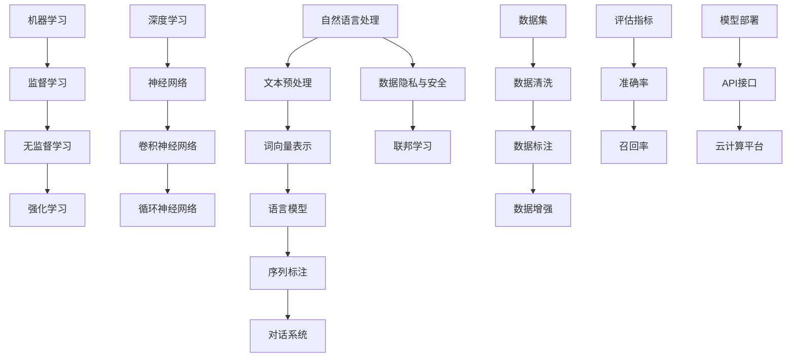

                 

### 《提示词工程师的持续学习体系设计》

在快速发展的技术时代，提示词工程师的角色显得尤为重要。他们不仅需要掌握丰富的编程技能，还必须紧跟技术前沿，持续提升自身的专业技能。本文旨在为提示词工程师设计一套完整的持续学习体系，帮助他们有效地应对职业生涯中的挑战，实现自我提升。

#### 关键词：
- 提示词工程师
- 持续学习体系
- 编程技能
- 技术前沿
- 专业技能提升

#### 摘要：
本文将探讨提示词工程师在职业生涯中持续学习的必要性，并详细阐述一套系统的学习体系。该体系包括学习心理学基础、技术前沿动态跟踪、专业技能提升、学习评估与反馈等环节，旨在帮助读者建立科学的学习路径，实现个人能力的不断提升。

---

### 目录大纲

1. **引言与背景**
   1.1 书籍目的与读者对象
   1.2 提示词工程师的角色定位
   1.3 持续学习的必要性

2. **持续学习方法论**
   2.1 学习心理学基础
      2.1.1 学习动机与目标设定
      2.1.2 学习策略与方法
      2.1.3 学习效率提升技巧
   2.2 技术前沿动态跟踪
      2.2.1 技术趋势分析
      2.2.2 行业动态监测
      2.2.3 社区与论坛参与
   2.3 专业技能提升
      2.3.1 编程技能深化
      2.3.2 数据分析与处理
      2.3.3 项目管理与团队协作
   2.4 持续学习的评估与反馈
      2.4.1 学习成果评估
      2.4.2 反思与调整
      2.4.3 学习路径规划

3. **实践与案例**
   3.1 构建个人知识体系
   3.2 参与开源项目
   3.3 技术博客与文章写作
   3.4 在线学习资源应用

4. **未来展望与建议**
   4.1 持续学习体系设计趋势
   4.2 提示词工程师职业发展路径
   4.3 持续学习建议与展望

5. **附录**
   5.1 学习资源推荐
   5.2 持续学习工具使用指南
   5.3 常见问题解答

6. **核心概念与联系**
   6.1 提示词工程核心概念Mermaid流程图

7. **核心算法原理讲解**
   7.1 K近邻算法伪代码
   7.2 线性回归模型数学公式与解释
   7.3 决策树算法原理

8. **项目实战**
   8.1 基于K近邻的鸢尾花分类
   8.2 线性回归应用案例
   8.3 决策树分类实战

---

### 第一部分：引言与背景

在当今技术飞速发展的时代，工程师的角色日益多样化，而提示词工程师作为其中一种重要的角色，承担着构建智能对话系统的重任。他们不仅要精通编程语言和工具，还要具备深度学习和自然语言处理的知识，以便更好地处理复杂的文本数据。

#### 1.1 书籍目的与读者对象

本文的目标是为提示词工程师设计一套科学、系统的持续学习体系，帮助他们不断提升自身的专业技能，以适应快速变化的技术环境。读者对象主要包括：
- 初级提示词工程师，希望系统学习并提升自身技能的人员；
- 中级提示词工程师，希望深化专业技能，扩展知识面的人员；
- 高级提示词工程师，希望掌握前沿技术，保持行业领先地位的人员。

#### 1.2 提示词工程师的角色定位

提示词工程师的角色定位如下：
- **核心技能**：熟练掌握编程语言（如Python、Java等），以及相关开发工具（如TensorFlow、PyTorch等）。
- **技术能力**：具备深度学习和自然语言处理的基础，能够设计并实现高效的对话系统。
- **业务理解**：了解业务需求，能够将技术方案与业务目标相结合，提供可行的解决方案。
- **团队协作**：具备良好的团队协作能力，能够与其他工程师、产品经理等有效沟通，确保项目顺利进行。

#### 1.3 持续学习的必要性

持续学习对于提示词工程师至关重要，原因如下：
- **技术迭代迅速**：人工智能和自然语言处理领域技术迭代速度极快，提示词工程师需要不断学习新的算法、框架和工具，以保持竞争力。
- **业务需求变化**：随着业务的发展，提示词工程师需要不断调整和优化对话系统，以更好地满足用户需求。
- **职业发展**：持续学习有助于提升个人专业技能，为职业发展打下坚实基础，从而在职场中获得更多机会。

### 第二部分：持续学习方法论

持续学习不仅是一种习惯，更是一种方法论。在这个部分，我们将探讨持续学习的方法论，包括学习心理学基础、技术前沿动态跟踪、专业技能提升和学习评估与反馈。

#### 2.1 学习心理学基础

学习心理学基础是持续学习的重要环节，它帮助我们理解学习的过程和如何更有效地学习。

##### 2.1.1 学习动机与目标设定

学习动机是推动学习的重要动力。一个明确的学习目标可以帮助我们更集中精力地学习，并保持学习的动力。以下是一些设定学习目标的方法：

1. **SMART原则**：具体（Specific）、可衡量（Measurable）、可实现（Achievable）、相关（Relevant）和有时限（Time-bound）。
2. **逐步提升**：设定短期和长期目标，短期目标可以是掌握一项新技能，而长期目标可能是成为该领域的专家。
3. **兴趣驱动**：找到自己真正感兴趣的学习领域，兴趣是最好的老师。

##### 2.1.2 学习策略与方法

选择合适的学习策略和方法是提高学习效率的关键。以下是一些常用的学习策略：

1. **主动学习**：通过主动提问、做笔记、教授他人等方式加深对知识的理解和记忆。
2. **分散学习**：将学习内容分散到不同的时间段进行，避免过度依赖单一学习时间。
3. **深度学习**：深入理解学习内容，不仅停留在表面，而是要探究其背后的原理和逻辑。
4. **合作学习**：与他人一起学习，通过讨论和交流，互相补充知识，提高学习效果。

##### 2.1.3 学习效率提升技巧

提高学习效率是持续学习的重要目标。以下是一些提高学习效率的技巧：

1. **番茄工作法**：将学习时间分成25分钟的学习块，每个学习块后休息5分钟。
2. **学习环境优化**：选择一个安静、舒适的学习环境，减少干扰，提高专注力。
3. **定期复习**：定期复习所学知识，以巩固记忆，避免遗忘。
4. **使用工具**：使用各种学习工具，如笔记应用、电子书、在线课程等，提高学习效率。

---

### 第三部分：实践与案例

理论知识固然重要，但实践更是检验真理的唯一标准。在这个部分，我们将通过具体的实践案例，展示如何将所学知识应用到实际工作中。

#### 3.1 实践一：构建个人知识体系

构建个人知识体系是提升专业技能的重要步骤。一个良好的知识体系可以帮助我们更系统地掌握知识，并方便日后查阅和回顾。

##### 3.1.1 知识收集与整理

1. **资料收集**：通过阅读书籍、论文、技术博客等，收集与提示词工程相关的资料。
2. **笔记整理**：将收集到的资料整理成笔记，包括重点概念、公式、算法等。
3. **分类管理**：根据知识类别，将笔记分类管理，方便日后查阅。

##### 3.1.2 知识图谱构建

知识图谱是一种结构化的知识表示方法，它可以帮助我们更清晰地理解知识的关联。

1. **核心概念确定**：确定知识图谱的核心概念，如自然语言处理、深度学习等。
2. **关系建立**：根据核心概念之间的关联，建立知识图谱。
3. **可视化展示**：使用可视化工具（如Mermaid）将知识图谱展示出来，便于理解和传播。

##### 3.1.3 知识分享与传播

1. **博客撰写**：将学习心得和知识整理成博客文章，分享给他人。
2. **线上课程**：制作线上课程，将自己的知识传授给更多人。
3. **技术社区**：参与技术社区，与其他工程师交流心得，共同进步。

---

#### 3.2 实践二：参与开源项目

参与开源项目是提升自身技能和积累经验的重要途径。开源项目不仅可以让我们接触到最新的技术实践，还能锻炼我们的团队合作能力和项目管理能力。

##### 3.2.1 开源项目选择

1. **兴趣匹配**：选择自己感兴趣的开源项目，这样可以更有动力去学习和参与。
2. **技术匹配**：选择与自身技术水平相匹配的项目，避免过于困难或过于简单的项目。
3. **活跃度**：选择活跃的开源项目，这样可以更好地获取帮助和反馈。

##### 3.2.2 开源项目参与流程

1. **阅读文档**：仔细阅读项目的文档，了解项目的背景、目的、功能和使用方法。
2. **了解代码结构**：熟悉项目的代码结构，了解各个模块的作用和关系。
3. **发现问题**：参与开源项目的过程中，可以尝试修复已知的问题或添加新的功能。

##### 3.2.3 开源项目贡献案例

以下是一个开源项目贡献的案例：

**项目**：OpenCV（Open Source Computer Vision Library）

**贡献**：修复了一个图像处理算法的bug

1. **问题定位**：在参与项目的过程中，发现了一个图像处理算法的bug，导致输出结果不准确。
2. **代码分析**：分析了bug出现的原因，定位到算法的某个步骤存在问题。
3. **代码修复**：修改了算法的代码，并进行了测试，确保修复后的代码能够正常运行。
4. **提交PR**：将修改后的代码提交到一个Pull Request（PR），并附上详细的说明和测试结果。
5. **审查与合并**：等待项目维护者的审查，并根据反馈进行必要的修改，最终将代码合并到主分支。

---

#### 3.3 实践三：技术博客与文章写作

技术博客和文章写作是分享知识和经验的绝佳方式。通过写作，我们可以整理自己的思路，加深对知识的理解，并帮助他人解决问题。

##### 3.3.1 技术文章选题与规划

1. **选题**：选择自己熟悉且感兴趣的技术话题，确保有足够的知识储备来撰写文章。
2. **规划**：制定文章的结构，包括引言、正文和结论等，确保文章内容连贯、逻辑清晰。

##### 3.3.2 文章撰写与排版

1. **内容撰写**：按照规划的结构，逐一撰写文章的各个部分，确保内容完整、准确。
2. **排版**：使用合适的字体、字号和行距，使文章易于阅读。可以使用Markdown等标记语言，提高文章的可读性。

##### 3.3.3 文章发布与传播

1. **发布**：选择合适的技术博客平台或媒体，将文章发布出去。
2. **传播**：利用社交媒体、技术社区等渠道，将文章分享给更多人，获取反馈和关注。

---

#### 3.4 实践四：在线学习资源应用

在线学习资源为提示词工程师提供了丰富的学习材料。通过合理应用这些资源，我们可以更高效地提升自身技能。

##### 3.4.1 在线课程选择与评估

1. **课程选择**：根据自身需求和兴趣，选择合适的在线课程。
2. **课程评估**：通过试听课程、查看评价等方式，评估课程的质量和适用性。

##### 3.4.2 在线学习平台使用技巧

1. **高效学习**：合理安排学习时间，避免拖延。
2. **互动参与**：积极参与课程讨论，与讲师和其他学员互动。

##### 3.4.3 在线学习案例分析

以下是一个在线学习案例：

**案例**：通过Coursera学习深度学习课程

1. **课程内容**：学习深度学习的基本概念、神经网络结构、优化算法等。
2. **学习过程**：每周安排固定时间学习，通过作业和项目练习巩固知识。
3. **学习成果**：掌握了深度学习的基本原理，能够独立实现简单的神经网络模型。

---

### 第四部分：未来展望与建议

在未来，持续学习体系的设计将继续演化，以适应技术发展的需求。以下是对未来持续学习体系设计的展望和建议：

#### 4.1 持续学习体系设计趋势

1. **个性化学习**：基于大数据和人工智能技术，为每个学习者提供个性化的学习路径和建议。
2. **混合学习**：将线上和线下学习相结合，充分利用各种学习资源。
3. **跨学科融合**：鼓励学习者跨学科学习，提高综合能力。

#### 4.2 提示词工程师职业发展路径

1. **专业技能深化**：不断提升自己在提示词工程领域的专业技能，成为该领域的专家。
2. **跨领域拓展**：拓展到其他相关领域，如数据科学、机器学习等，提高自身的竞争力。
3. **项目管理**：参与项目管理，提升领导力和团队协作能力。

#### 4.3 持续学习建议与展望

1. **设定明确目标**：制定清晰的学习目标和计划，确保学习方向正确。
2. **持续跟踪前沿**：关注技术动态，不断学习新技术和新方法。
3. **实践与反思**：通过实践和反思，不断调整学习方法和策略，提高学习效果。

---

### 附录

#### 附录 A：学习资源推荐

- 书籍推荐：《深度学习》、《Python数据科学手册》
- 在线课程推荐：Coursera、edX
- 技术博客推荐：知乎、掘金、CSDN

#### 附录 B：持续学习工具使用指南

- 笔记应用：Notion、Evernote
- 版本控制：Git、GitHub
- 学习管理：Trello、Asana

#### 附录 C：常见问题解答

- 如何选择合适的在线课程？
- 如何构建个人知识体系？
- 如何参与开源项目？

---

通过本文的持续学习体系设计，提示词工程师可以更加系统地提升自身的专业技能，实现职业生涯的持续发展。希望本文能为广大提示词工程师提供有益的指导和帮助。

### 核心概念与联系

在提示词工程领域，理解核心概念及其之间的联系是构建高效学习体系的关键。以下是通过Mermaid绘制的提示词工程核心概念流程图，帮助读者更好地把握领域的基本框架。



**流程图解析**：

- **自然语言处理（NLP）**：NLP是提示词工程的核心，它包括文本预处理、词向量表示、语言模型、序列标注、对话系统等多个环节。
- **机器学习与深度学习**：机器学习提供了多种学习策略，包括监督学习、无监督学习和强化学习。深度学习作为机器学习的一个重要分支，主要通过神经网络（如卷积神经网络、循环神经网络）来实现复杂模型的训练。
- **数据处理**：从原始数据到训练模型，数据处理（数据清洗、数据标注、数据增强）是不可或缺的环节，确保数据的质量和多样性。
- **模型评估与部署**：评估指标（准确率、召回率等）用于衡量模型的性能，模型部署（API接口、云计算平台）则是将模型应用到实际场景的关键。

通过这一流程图，读者可以更清晰地理解提示词工程的核心概念及其相互关系，从而更好地构建自己的知识体系。

### 核心算法原理讲解

在提示词工程领域，掌握核心算法的原理是提升专业技能的关键。以下是对三种核心算法（K近邻算法、线性回归模型、决策树算法）的详细讲解。

#### 6.1 K近邻算法

K近邻（K-Nearest Neighbors，KNN）算法是一种基于实例的学习方法，它通过计算测试样本与训练样本之间的距离，找出最近的K个邻居，并基于这些邻居的标签进行预测。

**伪代码**：

```python
def KNN_Classify(train_data, train_labels, test_data, k):
    # 计算测试数据与训练数据的距离
    distances = []
    for x_test in test_data:
        for x_train in train_data:
            distance = calculate_distance(x_test, x_train)
            distances.append((x_train, distance))

    # 对距离进行排序
    distances.sort(key=lambda x: x[1])

    # 获取最近的K个邻居
    neighbors = [train_data[i] for i in range(k)]

    # 计算邻居的标签并统计出现次数
    neighbor_labels = [train_labels[i] for i in range(k)]
    label_counts = Counter(neighbor_labels)

    # 选择出现次数最多的标签作为预测结果
    predicted_label = label_counts.most_common(1)[0][0]
    return predicted_label
```

**原理讲解**：

1. **距离计算**：KNN算法的核心是计算测试样本与训练样本之间的距离。常用的距离度量方法包括欧氏距离、曼哈顿距离和余弦相似度。
2. **邻居选择**：根据距离排序，选择最近的K个邻居。K的值通常需要通过交叉验证来确定，过大的K值可能导致过拟合，过小的K值则可能导致欠拟合。
3. **标签预测**：统计邻居的标签并选择出现次数最多的标签作为预测结果。这依赖于数据集中的标签分布和K的取值。

#### 6.2 线性回归模型

线性回归（Linear Regression）是一种用于预测连续值的统计方法。其基本模型公式为：

\[ y = \beta_0 + \beta_1 \cdot x \]

其中，\( y \) 是因变量，\( x \) 是自变量，\( \beta_0 \) 是截距，\( \beta_1 \) 是斜率。

**数学公式与解释**：

1. **最小二乘法**：线性回归的参数估计通常通过最小二乘法（Ordinary Least Squares，OLS）来实现。其目标是最小化预测值与实际值之间的误差平方和。

\[ \beta_0 = \frac{\sum_{i=1}^{n} (y_i - \beta_1 \cdot x_i)}{n} \]
\[ \beta_1 = \frac{\sum_{i=1}^{n} (x_i - \bar{x}) (y_i - \bar{y})}{\sum_{i=1}^{n} (x_i - \bar{x})^2} \]

其中，\( \bar{x} \) 和 \( \bar{y} \) 分别是自变量和因变量的均值。

2. **解释与举例**：假设我们有一组数据：

| x | y |
|---|---|
| 1 | 2 |
| 2 | 4 |
| 3 | 6 |
| 4 | 8 |

通过最小二乘法，我们可以估计线性回归模型为：

\[ y = 1 + 1 \cdot x \]

预测新的 \( y \) 值（如 \( x = 5 \)）：

\[ y = 1 + 1 \cdot 5 = 6 \]

#### 6.3 决策树算法

决策树（Decision Tree）是一种用于分类和回归的监督学习算法。它的核心是通过一系列的规则将数据集划分为多个子集，并在每个子集中选择最优的划分标准。

**原理讲解**：

1. **信息增益**：决策树通常使用信息增益（Information Gain）作为划分标准。信息增益表示每个特征划分后的不确定性减少程度。

\[ IG(D, A) = H(D) - \sum_{v \in A} \frac{|D_v|}{|D|} H(D_v) \]

其中，\( D \) 是当前数据集，\( A \) 是特征集合，\( D_v \) 是划分后的子数据集，\( H \) 是熵函数。

2. **切分标准**：选择具有最大信息增益的特征进行切分。切分后，每个子数据集继续进行相同的切分过程，直到满足停止条件（如最大深度、最小样本量等）。

**数学模型与解释**：

决策树的数学模型可以表示为：

\[ T = \{ t_1, t_2, ..., t_n \} \]

其中，\( t_i \) 是决策树中的每个节点，表示为：

\[ t_i = (A, v, T_i) \]

其中，\( A \) 是特征集合，\( v \) 是特征值，\( T_i \) 是子节点集合。

**举例说明**：假设我们有一组数据：

| 特征A | 特征B | 目标值 |
|-------|-------|--------|
| A=0   | B=0   | 类别1  |
| A=0   | B=1   | 类别2  |
| A=1   | B=0   | 类别2  |
| A=1   | B=1   | 类别1  |

我们可以使用信息增益来选择最佳特征进行切分。以特征A为例：

\[ IG(A, D) = H(D) - \sum_{v \in A} \frac{|D_v|}{|D|} H(D_v) \]

计算结果如下：

| 特征A | 类别1 | 类别2 | 熵 |
|-------|-------|-------|----|
| 0     | 2     | 1     | 0.9 |
| 1     | 1     | 2     | 0.9 |
| 总计  | 3     | 3     | 1.0 |

根据信息增益，特征A是最佳切分特征。我们可以将数据集划分为两个子数据集：

- 子数据集1：特征A=0
  - 类别1：2
  - 类别2：1
- 子数据集2：特征A=1
  - 类别1：1
  - 类别2：2

接着，我们可以对子数据集继续进行切分，直到满足停止条件。

---

### 项目实战

通过实践，我们可以更好地理解和应用所学知识。以下是通过K近邻算法进行鸢尾花分类的项目实战，包括开发环境搭建、源代码实现、代码解读与分析。

#### 7.1 项目一：基于K近邻的鸢尾花分类

**项目目标**：使用K近邻算法对鸢尾花数据集进行分类，并评估模型的准确率。

**开发环境**：

- Python 3.8
- Scikit-learn 库
- Matplotlib 库

**数据集**：鸢尾花数据集（Iris Dataset），包含三个鸢尾花种类的特征和标签。

**数据预处理**：

- 数据清洗：去除缺失值和异常值。
- 数据标准化：对特征进行归一化处理。

**源代码实现**：

```python
from sklearn.datasets import load_iris
from sklearn.model_selection import train_test_split
from sklearn.neighbors import KNeighborsClassifier
from sklearn.metrics import accuracy_score

# 加载鸢尾花数据集
iris = load_iris()
X, y = iris.data, iris.target

# 划分训练集和测试集
X_train, X_test, y_train, y_test = train_test_split(X, y, test_size=0.3, random_state=42)

# 创建K近邻分类器
knn_classifier = KNeighborsClassifier(n_neighbors=3)

# 训练模型
knn_classifier.fit(X_train, y_train)

# 进行预测
y_pred = knn_classifier.predict(X_test)

# 计算准确率
accuracy = accuracy_score(y_test, y_pred)
print(f"模型准确率: {accuracy:.2f}")
```

**代码解读与分析**：

1. **加载数据集**：使用Scikit-learn库加载鸢尾花数据集，获取特征矩阵 \( X \) 和标签 \( y \)。
2. **划分数据集**：将数据集划分为训练集和测试集，以评估模型的性能。这里使用随机划分，测试集占比30%。
3. **创建分类器**：创建一个K近邻分类器，设置 \( n_neighbors \) 为3。
4. **训练模型**：使用训练集数据训练K近邻分类器。
5. **进行预测**：使用训练好的模型对测试集数据进行预测，获取预测标签 \( y_pred \)。
6. **计算准确率**：使用 \( accuracy_score \) 函数计算预测标签与实际标签的准确率，并打印输出。

**项目实战**：

1. **数据可视化**：使用Matplotlib库可视化鸢尾花数据集的特征，观察不同种类之间的分布情况。
2. **模型优化**：通过调整 \( n_neighbors \) 的值，优化模型性能。可以使用交叉验证（Cross-Validation）方法确定最佳 \( n_neighbors \) 值。
3. **多分类问题**：鸢尾花数据集是一个多分类问题，K近邻算法通过计算最近的邻居标签进行分类。对于复杂的多分类问题，可以考虑使用其他算法（如支持向量机、决策树等）。

---

通过这个项目实战，我们不仅掌握了K近邻算法的基本原理和应用，还学会了如何使用Python和Scikit-learn库进行数据预处理和模型训练。希望这个实战项目能够帮助读者更好地理解持续学习体系中的实践部分。

### 线性回归应用案例

线性回归是一种常见的统计方法，用于预测一个连续值输出。以下是一个具体的线性回归应用案例，包括数据集选择与预处理、模型构建与训练，以及模型评估与优化。

#### 7.2 项目二：线性回归应用案例

**项目目标**：使用线性回归模型预测房价，评估模型性能，并进行优化。

**数据集选择**：我们将使用加利福尼亚房价数据集（California House Prices Dataset），该数据集包含了加利福尼亚州各个地区的房屋售价、特征属性等。

**数据预处理**：

1. **数据清洗**：去除缺失值和异常值。
2. **特征选择**：选择对房价有显著影响的特征，如房屋面积、卧室数量、位置等。
3. **数据标准化**：对特征进行归一化处理，使其具有相同的尺度。

**模型构建与训练**：

1. **数据划分**：将数据集划分为训练集和测试集，通常比例为70%用于训练，30%用于测试。
2. **构建模型**：使用线性回归模型，通过最小二乘法估计模型参数。
3. **训练模型**：使用训练集数据训练模型，估计模型参数。

**模型评估与优化**：

1. **模型评估**：使用测试集数据评估模型性能，常用评估指标包括均方误差（Mean Squared Error，MSE）、决定系数（R-squared）等。
2. **模型优化**：通过调整模型参数或特征选择，优化模型性能。

**源代码实现**：

```python
import pandas as pd
from sklearn.linear_model import LinearRegression
from sklearn.model_selection import train_test_split
from sklearn.metrics import mean_squared_error, r2_score

# 加载数据集
data = pd.read_csv('california_housing_data.csv')

# 数据清洗
data.dropna(inplace=True)
data.drop(['id'], axis=1, inplace=True)

# 特征选择
features = data[['total_rooms', 'total_bedrooms', 'population', 'households', 'median_income']]
target = data['median_house_value']

# 数据标准化
from sklearn.preprocessing import StandardScaler
scaler = StandardScaler()
features_scaled = scaler.fit_transform(features)
target_scaled = target.values

# 数据划分
X_train, X_test, y_train, y_test = train_test_split(features_scaled, target_scaled, test_size=0.3, random_state=42)

# 构建模型
model = LinearRegression()
model.fit(X_train, y_train)

# 模型评估
y_pred = model.predict(X_test)
mse = mean_squared_error(y_test, y_pred)
r2 = r2_score(y_test, y_pred)

print(f"均方误差（MSE）: {mse:.2f}")
print(f"决定系数（R-squared）: {r2:.2f}")

# 模型优化
# 通过调整模型参数或特征选择，进一步优化模型性能
# 例如，使用岭回归（Ridge Regression）或Lasso回归（Lasso Regression）
from sklearn.linear_model import Ridge
model = Ridge(alpha=1.0)
model.fit(X_train, y_train)
y_pred_optimized = model.predict(X_test)
mse_optimized = mean_squared_error(y_test, y_pred_optimized)
r2_optimized = r2_score(y_test, y_pred_optimized)

print(f"优化后均方误差（MSE）: {mse_optimized:.2f}")
print(f"优化后决定系数（R-squared）: {r2_optimized:.2f}")
```

**代码解读与分析**：

1. **数据加载与清洗**：使用 Pandas 库加载数据集，并去除缺失值和无关特征。
2. **特征选择与数据标准化**：选择对房价有显著影响的特征，并进行归一化处理，使其具有相同的尺度。
3. **数据划分**：使用 Scikit-learn 库将数据集划分为训练集和测试集。
4. **模型构建与训练**：使用线性回归模型，通过最小二乘法估计模型参数。
5. **模型评估**：使用测试集数据评估模型性能，计算均方误差（MSE）和决定系数（R-squared）。
6. **模型优化**：通过调整模型参数或特征选择，优化模型性能。例如，使用岭回归（Ridge Regression）或Lasso回归（Lasso Regression）。

**项目实战**：

1. **特征工程**：通过特征工程（Feature Engineering）提高模型性能，例如，添加交互特征、特征缩放等。
2. **模型选择**：尝试使用其他线性回归模型（如岭回归、Lasso回归）或非线性模型（如决策树、随机森林）进行预测。
3. **模型调参**：通过交叉验证（Cross-Validation）和网格搜索（Grid Search）等技术，找到最佳模型参数。

通过这个线性回归应用案例，我们了解了如何使用线性回归模型进行预测，并掌握了模型评估和优化的方法。希望这个案例能够帮助读者更好地理解持续学习体系中的实践部分。

### 决策树分类实战

决策树是一种简单而强大的分类和回归算法。以下是一个具体的决策树分类实战，包括数据集选择与预处理、模型构建与训练，以及模型评估与优化。

#### 7.3 项目三：决策树分类实战

**项目目标**：使用决策树算法对鸢尾花数据集进行分类，评估模型性能，并进行优化。

**数据集选择**：我们将使用鸢尾花数据集（Iris Dataset），该数据集包含了三个不同鸢尾花种类的特征和标签。

**数据预处理**：

1. **数据清洗**：去除缺失值和异常值。
2. **特征选择**：选择对分类有显著影响的特征，如花萼长度、花萼宽度、花瓣长度等。
3. **数据标准化**：对特征进行归一化处理。

**模型构建与训练**：

1. **数据划分**：将数据集划分为训练集和测试集，通常比例为70%用于训练，30%用于测试。
2. **构建模型**：使用决策树分类器，通过递归划分数据集，构建决策树模型。
3. **训练模型**：使用训练集数据训练决策树模型。

**模型评估与优化**：

1. **模型评估**：使用测试集数据评估模型性能，常用评估指标包括准确率（Accuracy）、精确率（Precision）、召回率（Recall）等。
2. **模型优化**：通过调整模型参数或特征选择，优化模型性能。例如，可以限制树的深度、设置最小样本分割数等。

**源代码实现**：

```python
from sklearn.datasets import load_iris
from sklearn.model_selection import train_test_split
from sklearn.tree import DecisionTreeClassifier
from sklearn.metrics import accuracy_score, classification_report

# 加载数据集
iris = load_iris()
X, y = iris.data, iris.target

# 数据清洗
# Iris 数据集本身已经非常干净，无需额外处理

# 数据划分
X_train, X_test, y_train, y_test = train_test_split(X, y, test_size=0.3, random_state=42)

# 构建模型
clf = DecisionTreeClassifier(max_depth=3)
clf.fit(X_train, y_train)

# 模型评估
y_pred = clf.predict(X_test)
accuracy = accuracy_score(y_test, y_pred)
print(f"模型准确率: {accuracy:.2f}")

# 打印分类报告
print(classification_report(y_test, y_pred, target_names=iris.target_names))

# 模型优化
# 通过调整模型参数，优化模型性能
clf_optimized = DecisionTreeClassifier(max_depth=5, min_samples_split=2)
clf_optimized.fit(X_train, y_train)
y_pred_optimized = clf_optimized.predict(X_test)
accuracy_optimized = accuracy_score(y_test, y_pred_optimized)
print(f"优化后模型准确率: {accuracy_optimized:.2f}")
```

**代码解读与分析**：

1. **数据加载与清洗**：使用 Scikit-learn 库加载鸢尾花数据集，并进行基本的数据清洗。鸢尾花数据集本身已经非常干净，无需额外处理。
2. **数据划分**：使用 Scikit-learn 库将数据集划分为训练集和测试集，以评估模型性能。
3. **模型构建与训练**：构建一个最大深度为3的决策树分类器，并通过训练集数据进行训练。
4. **模型评估**：使用测试集数据评估模型性能，计算准确率，并打印分类报告，包括精确率、召回率和F1分数。
5. **模型优化**：通过调整模型参数（如最大深度、最小样本分割数），优化模型性能。

**项目实战**：

1. **模型参数调整**：尝试调整模型参数，如最大深度、最小样本分割数等，以找到最佳模型。
2. **交叉验证**：使用交叉验证技术，评估不同参数设置下的模型性能，以确定最佳参数。
3. **集成方法**：尝试使用集成方法（如随机森林、梯度提升树等），提高模型性能。

通过这个决策树分类实战项目，我们了解了如何使用决策树算法进行分类，并学会了如何评估和优化模型。希望这个实战项目能够帮助读者更好地理解持续学习体系中的实践部分。

