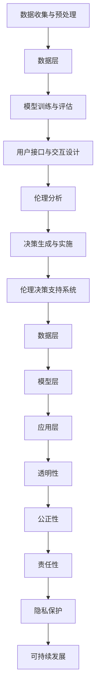
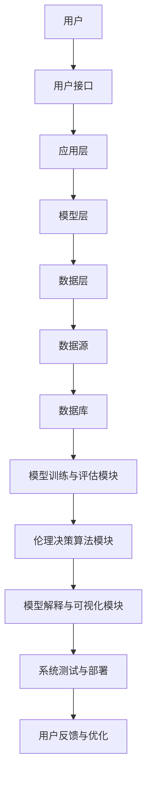

                 

### 文章标题

#### 提示词工程的伦理决策支持系统

**关键词：** 伦理决策，提示词工程，人工智能，自然语言处理，伦理框架，决策算法。

**摘要：** 本文章全面探讨了提示词工程的伦理决策支持系统。通过分析伦理决策的挑战，定义了提示词工程及其核心要素，并阐述了伦理决策支持系统的架构与应用场景。文章进一步介绍了相关核心概念与联系，以及技术基础与算法原理。最后，通过案例研究和系统性能优化策略，对伦理决策支持系统的开发与实现进行了详细阐述。本文旨在为读者提供一个深入理解伦理决策支持系统的指南，并探讨其在实际应用中的潜在价值。

### 第一部分：提示词工程的伦理决策支持系统概述

#### 第1章：背景与概念

**1.1 提示词工程的伦理决策背景**

在当今快速发展的信息技术时代，人工智能（AI）和自然语言处理（NLP）技术的应用日益广泛。然而，这些技术的广泛应用也带来了伦理决策的挑战。伦理决策涉及在复杂技术系统中做出符合道德原则和价值观的决策，这对于保障技术的正当性和可持续发展具有重要意义。

首先，**伦理决策的挑战**主要包括以下几个方面：

1. **隐私问题**：AI系统在处理大量数据时，可能会触及用户的隐私信息。如何保护用户隐私，确保数据的安全性和隐私性，是伦理决策的核心问题。
2. **偏见问题**：AI系统可能会在训练数据中学习到偏见，从而导致不公平的决策。如何消除偏见，确保决策的公正性，是伦理决策面临的重大挑战。
3. **责任问题**：当AI系统发生错误或造成损失时，如何界定责任，确保技术的安全性和可靠性，是伦理决策的关键问题。

其次，**提示词工程与伦理决策的联系**主要体现在以下几个方面：

1. **决策辅助**：提示词工程可以提供决策辅助功能，帮助用户在复杂情境下做出符合伦理原则的决策。
2. **道德判断**：通过提示词工程，可以将伦理原则和价值观嵌入到AI系统中，使其具备道德判断能力，从而避免做出不道德的决策。
3. **透明性**：提示词工程可以提供决策过程的透明性，使用户能够理解决策的依据和逻辑，增强系统的可信度。

最后，**伦理决策支持系统的目标**主要包括：

1. **保障技术正当性**：通过伦理决策支持系统，确保AI技术符合伦理规范和社会价值观，从而保障技术的正当性和可持续发展。
2. **促进技术伦理教育**：通过伦理决策支持系统，帮助开发者和用户了解伦理决策的重要性，提高伦理意识和道德素养。
3. **提升技术可靠性**：通过伦理决策支持系统，提高AI系统的可靠性和安全性，降低错误决策的风险。

**1.2 提示词工程的定义**

提示词工程（Prompt Engineering）是指通过构建和优化提示词（Prompt），以引导AI模型生成所需输出的一门技术。提示词在AI系统中起到了至关重要的作用，它不仅影响模型的输出结果，还决定了解决问题的效率和效果。

**1.2.1 提示词工程的概念**

1. **提示词**：提示词是指提供给AI模型的一段文本，用于指导模型生成输出。提示词可以是简单的一句话，也可以是复杂的语句或问题。
2. **工程**：提示词工程是指一系列技术方法，包括提示词的构建、优化和评估，以实现特定的任务目标。

**1.2.2 提示词工程的关键要素**

1. **任务目标**：明确任务目标，确保提示词能够引导模型生成符合需求的输出。
2. **模型理解**：了解模型的工作原理和特性，以便设计合适的提示词。
3. **数据质量**：高质量的数据是设计有效提示词的基础，数据质量直接影响提示词工程的效果。
4. **用户反馈**：用户反馈是优化提示词的重要依据，通过不断调整和优化提示词，提高用户满意度。

**1.3 伦理决策支持系统的架构**

伦理决策支持系统是指一种集成了伦理原则和决策辅助功能的技术系统，旨在帮助用户在复杂情境下做出符合伦理原则的决策。其架构主要包括以下几个组件：

**1.3.1 架构概述**

1. **数据层**：负责数据的收集、存储和管理，为伦理决策提供基础数据支持。
2. **模型层**：包含伦理决策算法和模型，负责对输入数据进行处理和分析，生成决策建议。
3. **应用层**：提供用户界面和交互功能，使用户能够方便地使用伦理决策支持系统。

**1.3.2 主要组件与功能**

1. **数据层**：
   - **功能**：数据收集与预处理，确保数据的质量和可用性。
   - **组件**：数据库、数据清洗模块、数据预处理模块。

2. **模型层**：
   - **功能**：伦理决策算法的实现和优化，生成决策建议。
   - **组件**：伦理决策算法模块、模型训练与评估模块。

3. **应用层**：
   - **功能**：提供用户交互界面，实现用户与系统的交互。
   - **组件**：前端用户界面、后端服务接口、用户反馈收集模块。

**1.3.3 伦理决策支持系统的应用场景**

伦理决策支持系统可以应用于多种场景，包括但不限于：

1. **医疗领域**：在医疗决策中，伦理决策支持系统可以帮助医生在面临伦理困境时，提供合理的决策建议，确保医疗行为的合法性和道德性。
2. **法律领域**：在法律决策中，伦理决策支持系统可以帮助律师和法官在处理复杂案件时，提供伦理依据和决策参考，提高司法公正性。
3. **商业领域**：在商业决策中，伦理决策支持系统可以帮助企业避免伦理风险，实现可持续发展。

通过上述架构和应用场景的介绍，我们可以看出，伦理决策支持系统在保障技术正当性、促进技术伦理教育、提升技术可靠性等方面具有重要意义。在接下来的章节中，我们将进一步探讨伦理决策支持系统的核心概念、技术基础和开发与实现，为读者提供更深入的理解。

### 第二部分：核心概念与联系

#### 第2章：核心概念与联系

**2.1 提示词工程伦理框架**

在探讨提示词工程的伦理决策支持系统时，首先需要明确相关的核心概念和原理。伦理框架是理解伦理决策支持系统的基础，它为我们提供了一个系统性的视角来分析、评估和指导AI系统的伦理决策。

**2.1.1 伦理学基础**

伦理学是研究道德原则、价值观和行为规范的一门学科。在伦理决策支持系统中，伦理学提供了理论基础，帮助我们理解和应用伦理原则。伦理学基础包括以下几个方面：

1. **道德原则**：道德原则是指导个体和社会行为的准则。常见的道德原则包括公正、尊重、诚信、责任等。在AI系统中，这些原则可以帮助我们评估和指导系统的伦理决策。
2. **价值观**：价值观是个人或社会对事物的重要性和优先级的看法。不同的文化和社会背景下，人们的价值观可能存在差异。在伦理决策支持系统中，了解和尊重这些价值观对于实现公平和公正的决策至关重要。
3. **道德规范**：道德规范是具体的行动指南，用于指导个体和社会的行为。在AI系统中，道德规范可以帮助我们制定具体的操作准则，确保系统的行为符合伦理要求。

**2.1.2 伦理决策模型**

伦理决策模型是一种用于指导AI系统做出符合伦理原则的决策的模型。伦理决策模型通常包括以下几个步骤：

1. **情境识别**：识别和描述AI系统所面临的伦理情境，包括关键利益相关者、潜在的风险和道德冲突等。
2. **伦理分析**：对伦理情境进行深入分析，确定相关的道德原则和价值观，评估各种可能的决策方案。
3. **决策生成**：根据伦理分析和评估结果，生成符合伦理原则的决策方案。
4. **决策评估**：对决策方案进行评估，确保其符合道德原则和价值观，同时考虑到实际操作的可行性和效果。
5. **决策实施**：将决策方案付诸实施，并监测其实施效果，以便进行后续的调整和优化。

**2.1.3 提示词工程伦理原则**

提示词工程伦理原则是指导提示词工程实践的伦理准则。这些原则旨在确保提示词工程在设计和应用过程中，能够最大限度地符合伦理要求。主要的伦理原则包括：

1. **透明性**：确保提示词工程的决策过程和结果对用户和利益相关者透明，便于监督和评估。
2. **公正性**：确保提示词工程在处理数据和应用算法时，能够公平地对待所有用户和利益相关者，避免歧视和偏见。
3. **责任性**：确保提示词工程的开发者、运营者和用户在伦理决策中承担相应的责任，并对决策结果负责。
4. **尊重隐私**：尊重用户的隐私权，确保在收集、存储和使用用户数据时，遵循隐私保护的原则和法规。
5. **可持续发展**：确保提示词工程在实现短期目标的同时，能够考虑长期的社会和环境影响，促进可持续发展。

**2.2 提示词与人工智能的关系**

提示词与人工智能（AI）有着密切的关系。在AI系统中，提示词不仅是一种输入，更是影响系统输出结果的重要因素。下面，我们具体探讨提示词在AI系统中的角色以及提示词工程对AI发展的影响。

**2.2.1 提示词的作用**

1. **指导模型训练**：提示词用于引导AI模型在训练过程中学习到特定的知识或技能。通过设计合适的提示词，可以调整模型的训练方向，提高模型的性能。
2. **调整输出结果**：提示词可以影响AI模型的输出结果，使其更符合用户的需求和期望。例如，在文本生成任务中，通过调整提示词，可以控制生成文本的风格、内容和质量。
3. **辅助决策**：在复杂的决策任务中，提示词可以提供额外的信息，帮助用户或系统做出更合理的决策。

**2.2.2 提示词在人工智能系统中的角色**

1. **任务引导者**：提示词为AI模型提供了明确的任务目标，指导模型在特定任务中生成输出。
2. **知识传递者**：通过提示词，可以将人类知识传递给AI模型，使其在任务中更好地理解和应对复杂情境。
3. **反馈调节者**：提示词可以用于评估AI模型的输出结果，提供反馈信息，帮助模型不断优化和改进。

**2.2.3 提示词工程对人工智能发展的影响**

1. **提高模型性能**：通过优化提示词，可以显著提高AI模型的性能和效果。高质量的提示词能够更好地指导模型训练，使模型生成更符合需求的输出。
2. **促进跨学科合作**：提示词工程不仅涉及计算机科学，还需要结合伦理学、心理学、语言学等多学科知识。这种跨学科合作有助于推动人工智能的全面发展。
3. **增强用户参与度**：通过设计友好的用户界面和交互方式，提示词工程可以增强用户的参与度，使用户更易于理解和操作AI系统。

**2.3 伦理决策支持系统的核心要素**

为了构建一个有效的伦理决策支持系统，需要考虑多个核心要素，包括数据收集与预处理、决策算法与模型、用户接口与交互设计等。

**2.3.1 数据收集与预处理**

1. **数据来源**：伦理决策支持系统需要收集多种类型的数据，包括公开数据、用户生成数据、专家意见等。不同类型的数据在伦理决策中起到不同的作用，需要合理选择和整合。
2. **数据预处理**：数据预处理是确保数据质量的关键步骤。包括数据清洗、去重、归一化、特征提取等操作，以提高数据的有效性和可靠性。

**2.3.2 决策算法与模型**

1. **算法选择**：根据具体任务需求，选择适合的决策算法和模型。常见的算法包括监督学习、无监督学习、强化学习等。
2. **模型训练与评估**：通过训练和评估模型，优化算法参数，提高模型的性能和泛化能力。评估指标包括准确性、召回率、F1值等。

**2.3.3 用户接口与交互设计**

1. **界面设计**：设计直观、易用的用户界面，提高用户体验。界面设计需要考虑用户的使用习惯和需求，提供丰富的交互功能。
2. **交互方式**：通过语音、文本、图形等多种交互方式，使用户能够方便地与系统进行交互。合理的交互方式可以提高系统的可用性和满意度。

通过上述核心概念的介绍，我们可以更好地理解提示词工程的伦理决策支持系统。在接下来的章节中，我们将进一步探讨伦理决策支持系统的技术基础和开发与实现，为读者提供更深入的理解和应用。

### 第二部分：核心概念与联系

#### 第2章：核心概念与联系

**2.1 提示词工程伦理框架**

伦理框架在提示词工程中起着至关重要的作用，它为伦理决策提供了系统性的指导。一个完善的伦理框架需要考虑多个方面，包括伦理原则、伦理决策模型以及伦理原则在提示词工程中的应用。

**2.1.1 伦理学基础**

伦理学是关于道德原则和价值观的研究。在提示词工程中，伦理学基础包括以下几个核心要素：

1. **道德原则**：道德原则是指导个体行为和社会规范的准则。在提示词工程中，常见的道德原则包括公正、尊重、责任、诚信等。这些原则为我们制定伦理决策提供了基础。

2. **价值观**：价值观是个人或社会对事物的重要性和优先级的看法。不同的文化和社会背景下，价值观可能存在差异。在提示词工程中，了解和尊重这些价值观对于确保决策的伦理性至关重要。

3. **道德规范**：道德规范是具体的行动指南，用于指导个体和社会的行为。在提示词工程中，道德规范可以指导我们如何设计和使用提示词，以确保系统的行为符合伦理要求。

**2.1.2 伦理决策模型**

伦理决策模型是用于指导AI系统做出符合伦理原则的决策的工具。一个典型的伦理决策模型通常包括以下几个步骤：

1. **情境识别**：识别和描述AI系统所面临的伦理情境，包括关键利益相关者、潜在的风险和道德冲突等。

2. **伦理分析**：对伦理情境进行深入分析，确定相关的道德原则和价值观，评估各种可能的决策方案。

3. **决策生成**：根据伦理分析和评估结果，生成符合伦理原则的决策方案。

4. **决策评估**：对决策方案进行评估，确保其符合道德原则和价值观，同时考虑到实际操作的可行性和效果。

5. **决策实施**：将决策方案付诸实施，并监测其实施效果，以便进行后续的调整和优化。

**2.1.3 提示词工程伦理原则**

在提示词工程中，伦理原则是我们设计和使用提示词的指导方针。以下是几个关键的伦理原则：

1. **透明性**：确保提示词工程的决策过程和结果对用户和利益相关者透明，便于监督和评估。

2. **公正性**：确保提示词工程在处理数据和应用算法时，能够公平地对待所有用户和利益相关者，避免歧视和偏见。

3. **责任性**：确保提示词工程的开发者、运营者和用户在伦理决策中承担相应的责任，并对决策结果负责。

4. **尊重隐私**：尊重用户的隐私权，确保在收集、存储和使用用户数据时，遵循隐私保护的原则和法规。

5. **可持续发展**：确保提示词工程在实现短期目标的同时，能够考虑长期的社会和环境影响，促进可持续发展。

**2.2 提示词与人工智能的关系**

提示词在人工智能系统中扮演着关键角色，它不仅影响模型的输出结果，还决定了解决问题的效率和效果。

**2.2.1 提示词的作用**

1. **指导模型训练**：提示词用于引导AI模型在训练过程中学习到特定的知识或技能。通过设计合适的提示词，可以调整模型的训练方向，提高模型的性能。

2. **调整输出结果**：提示词可以影响AI模型的输出结果，使其更符合用户的需求和期望。例如，在文本生成任务中，通过调整提示词，可以控制生成文本的风格、内容和质量。

3. **辅助决策**：在复杂的决策任务中，提示词可以提供额外的信息，帮助用户或系统做出更合理的决策。

**2.2.2 提示词在人工智能系统中的角色**

1. **任务引导者**：提示词为AI模型提供了明确的任务目标，指导模型在特定任务中生成输出。

2. **知识传递者**：通过提示词，可以将人类知识传递给AI模型，使其在任务中更好地理解和应对复杂情境。

3. **反馈调节者**：提示词可以用于评估AI模型的输出结果，提供反馈信息，帮助模型不断优化和改进。

**2.2.3 提示词工程对人工智能发展的影响**

1. **提高模型性能**：通过优化提示词，可以显著提高AI模型的性能和效果。高质量的提示词能够更好地指导模型训练，使模型生成更符合需求的输出。

2. **促进跨学科合作**：提示词工程不仅涉及计算机科学，还需要结合伦理学、心理学、语言学等多学科知识。这种跨学科合作有助于推动人工智能的全面发展。

3. **增强用户参与度**：通过设计友好的用户界面和交互方式，提示词工程可以增强用户的参与度，使用户更易于理解和操作AI系统。

**2.3 伦理决策支持系统的核心要素**

为了构建一个有效的伦理决策支持系统，需要考虑多个核心要素，包括数据收集与预处理、决策算法与模型、用户接口与交互设计等。

**2.3.1 数据收集与预处理**

1. **数据来源**：伦理决策支持系统需要收集多种类型的数据，包括公开数据、用户生成数据、专家意见等。不同类型的数据在伦理决策中起到不同的作用，需要合理选择和整合。

2. **数据预处理**：数据预处理是确保数据质量的关键步骤。包括数据清洗、去重、归一化、特征提取等操作，以提高数据的有效性和可靠性。

**2.3.2 决策算法与模型**

1. **算法选择**：根据具体任务需求，选择适合的决策算法和模型。常见的算法包括监督学习、无监督学习、强化学习等。

2. **模型训练与评估**：通过训练和评估模型，优化算法参数，提高模型的性能和泛化能力。评估指标包括准确性、召回率、F1值等。

**2.3.3 用户接口与交互设计**

1. **界面设计**：设计直观、易用的用户界面，提高用户体验。界面设计需要考虑用户的使用习惯和需求，提供丰富的交互功能。

2. **交互方式**：通过语音、文本、图形等多种交互方式，使用户能够方便地与系统进行交互。合理的交互方式可以提高系统的可用性和满意度。

通过上述核心概念的介绍，我们可以更好地理解提示词工程的伦理决策支持系统。在接下来的章节中，我们将进一步探讨伦理决策支持系统的技术基础和开发与实现，为读者提供更深入的理解。

### 第二部分：核心概念与联系

#### 第3章：核心概念与联系

**2.1 提示词工程伦理框架**

在探讨提示词工程的伦理决策支持系统时，首先需要明确相关的核心概念和原理。伦理框架是理解伦理决策支持系统的基础，它为我们提供了一个系统性的视角来分析、评估和指导AI系统的伦理决策。

**2.1.1 伦理学基础**

伦理学是关于道德原则和价值观的研究。在AI系统中，伦理学基础包括以下几个方面：

1. **道德原则**：道德原则是指导个体行为和社会规范的准则。在AI系统中，常见的道德原则包括公正、尊重、责任、诚信等。这些原则为我们制定伦理决策提供了基础。

2. **价值观**：价值观是个人或社会对事物的重要性和优先级的看法。不同的文化和社会背景下，价值观可能存在差异。在AI系统中，了解和尊重这些价值观对于确保决策的伦理性至关重要。

3. **道德规范**：道德规范是具体的行动指南，用于指导个体和社会的行为。在AI系统中，道德规范可以指导我们如何设计和使用提示词，以确保系统的行为符合伦理要求。

**2.1.2 伦理决策模型**

伦理决策模型是一种用于指导AI系统做出符合伦理原则的决策的模型。伦理决策模型通常包括以下几个步骤：

1. **情境识别**：识别和描述AI系统所面临的伦理情境，包括关键利益相关者、潜在的风险和道德冲突等。

2. **伦理分析**：对伦理情境进行深入分析，确定相关的道德原则和价值观，评估各种可能的决策方案。

3. **决策生成**：根据伦理分析和评估结果，生成符合伦理原则的决策方案。

4. **决策评估**：对决策方案进行评估，确保其符合道德原则和价值观，同时考虑到实际操作的可行性和效果。

5. **决策实施**：将决策方案付诸实施，并监测其实施效果，以便进行后续的调整和优化。

**2.1.3 提示词工程伦理原则**

在提示词工程中，伦理原则是我们设计和使用提示词的指导方针。这些原则旨在确保提示词工程在设计和应用过程中，能够最大限度地符合伦理要求。主要的伦理原则包括：

1. **透明性**：确保提示词工程的决策过程和结果对用户和利益相关者透明，便于监督和评估。

2. **公正性**：确保提示词工程在处理数据和应用算法时，能够公平地对待所有用户和利益相关者，避免歧视和偏见。

3. **责任性**：确保提示词工程的开发者、运营者和用户在伦理决策中承担相应的责任，并对决策结果负责。

4. **尊重隐私**：尊重用户的隐私权，确保在收集、存储和使用用户数据时，遵循隐私保护的原则和法规。

5. **可持续发展**：确保提示词工程在实现短期目标的同时，能够考虑长期的社会和环境影响，促进可持续发展。

**2.2 提示词与人工智能的关系**

提示词与人工智能（AI）有着密切的关系。在AI系统中，提示词不仅是一种输入，更是影响系统输出结果的重要因素。下面，我们具体探讨提示词在AI系统中的角色以及提示词工程对AI发展的影响。

**2.2.1 提示词的作用**

1. **指导模型训练**：提示词用于引导AI模型在训练过程中学习到特定的知识或技能。通过设计合适的提示词，可以调整模型的训练方向，提高模型的性能。

2. **调整输出结果**：提示词可以影响AI模型的输出结果，使其更符合用户的需求和期望。例如，在文本生成任务中，通过调整提示词，可以控制生成文本的风格、内容和质量。

3. **辅助决策**：在复杂的决策任务中，提示词可以提供额外的信息，帮助用户或系统做出更合理的决策。

**2.2.2 提示词在人工智能系统中的角色**

1. **任务引导者**：提示词为AI模型提供了明确的任务目标，指导模型在特定任务中生成输出。

2. **知识传递者**：通过提示词，可以将人类知识传递给AI模型，使其在任务中更好地理解和应对复杂情境。

3. **反馈调节者**：提示词可以用于评估AI模型的输出结果，提供反馈信息，帮助模型不断优化和改进。

**2.2.3 提示词工程对人工智能发展的影响**

1. **提高模型性能**：通过优化提示词，可以显著提高AI模型的性能和效果。高质量的提示词能够更好地指导模型训练，使模型生成更符合需求的输出。

2. **促进跨学科合作**：提示词工程不仅涉及计算机科学，还需要结合伦理学、心理学、语言学等多学科知识。这种跨学科合作有助于推动人工智能的全面发展。

3. **增强用户参与度**：通过设计友好的用户界面和交互方式，提示词工程可以增强用户的参与度，使用户更易于理解和操作AI系统。

**2.3 伦理决策支持系统的核心要素**

为了构建一个有效的伦理决策支持系统，需要考虑多个核心要素，包括数据收集与预处理、决策算法与模型、用户接口与交互设计等。

**2.3.1 数据收集与预处理**

1. **数据来源**：伦理决策支持系统需要收集多种类型的数据，包括公开数据、用户生成数据、专家意见等。不同类型的数据在伦理决策中起到不同的作用，需要合理选择和整合。

2. **数据预处理**：数据预处理是确保数据质量的关键步骤。包括数据清洗、去重、归一化、特征提取等操作，以提高数据的有效性和可靠性。

**2.3.2 决策算法与模型**

1. **算法选择**：根据具体任务需求，选择适合的决策算法和模型。常见的算法包括监督学习、无监督学习、强化学习等。

2. **模型训练与评估**：通过训练和评估模型，优化算法参数，提高模型的性能和泛化能力。评估指标包括准确性、召回率、F1值等。

**2.3.3 用户接口与交互设计**

1. **界面设计**：设计直观、易用的用户界面，提高用户体验。界面设计需要考虑用户的使用习惯和需求，提供丰富的交互功能。

2. **交互方式**：通过语音、文本、图形等多种交互方式，使用户能够方便地与系统进行交互。合理的交互方式可以提高系统的可用性和满意度。

通过上述核心概念的介绍，我们可以更好地理解提示词工程的伦理决策支持系统。在接下来的章节中，我们将进一步探讨伦理决策支持系统的技术基础和开发与实现，为读者提供更深入的理解。

### 第二部分：核心概念与联系

#### 第3章：核心概念与联系

**3.1 提示词工程伦理框架**

提示词工程伦理框架是一个综合性的框架，用于指导我们在设计、开发和应用提示词工程时考虑伦理问题。这个框架不仅涵盖了伦理学基础，还包括伦理决策模型和提示词工程伦理原则，为我们提供了一个系统性的视角来处理伦理挑战。

**3.1.1 伦理学基础**

伦理学是关于道德原则和价值观的学科，其基础包括以下几个关键要素：

1. **道德原则**：道德原则是指导我们行为的准则，常见的道德原则有公正、尊重、责任和诚信。在提示词工程中，这些原则可以帮助我们确保系统设计和决策过程的正当性。

2. **价值观**：价值观是对事物重要性和优先级的看法。不同的文化和背景会导致不同的价值观，因此在设计和应用提示词工程时，我们需要考虑并尊重这些差异。

3. **道德规范**：道德规范是将道德原则具体化的行为指南。例如，在数据收集和处理中，我们需要遵守隐私保护的原则，确保用户的个人信息得到妥善处理。

**3.1.2 伦理决策模型**

伦理决策模型是一个系统化的过程，用于在复杂情境下做出符合伦理的决策。该模型通常包括以下步骤：

1. **情境识别**：明确当前情境中的利益相关者、关键问题和潜在的风险。

2. **伦理分析**：分析情境中的伦理问题和潜在的道德冲突，确定相关的道德原则和价值观。

3. **决策生成**：根据伦理分析的结果，生成符合道德原则和价值观的决策方案。

4. **决策评估**：评估每个决策方案的伦理性和实际可行性，选择最佳方案。

5. **决策实施**：将决策方案付诸实践，并监测其实施效果，以便进行必要的调整。

**3.1.3 提示词工程伦理原则**

在提示词工程中，以下伦理原则是非常重要的：

1. **透明性**：确保提示词工程的过程和决策对用户和利益相关者是透明的，这样他们可以理解和监督系统的工作。

2. **公正性**：确保系统在处理数据和做出决策时是公平的，避免任何形式的歧视或偏见。

3. **责任性**：提示词工程的开发者、运营者和用户都需要对自己的决策和行为负责，确保系统的决策是合理的。

4. **隐私保护**：在收集、存储和使用用户数据时，需要严格遵守隐私保护的原则，确保用户的隐私不被侵犯。

5. **可持续发展**：在设计和应用提示词工程时，需要考虑长期的社会和环境影响，确保系统的可持续发展。

**3.2 提示词与人工智能的关系**

提示词在人工智能系统中起着至关重要的作用，它们不仅影响模型的输出结果，还决定了解决问题的效率和效果。以下是提示词在AI系统中的几个关键角色：

**3.2.1 提示词的作用**

1. **指导模型训练**：提示词可以帮助AI模型学习到特定的知识或技能，通过设计合适的提示词，可以调整模型的训练方向，提高模型的性能。

2. **调整输出结果**：提示词可以影响AI模型的输出结果，使其更符合用户的需求和期望。例如，在文本生成任务中，通过调整提示词，可以控制生成文本的风格和内容。

3. **辅助决策**：在复杂的决策任务中，提示词可以提供额外的信息，帮助用户或系统做出更合理的决策。

**3.2.2 提示词在人工智能系统中的角色**

1. **任务引导者**：提示词为AI模型提供了明确的任务目标，指导模型在特定任务中生成输出。

2. **知识传递者**：通过提示词，可以将人类知识传递给AI模型，使其在任务中更好地理解和应对复杂情境。

3. **反馈调节者**：提示词可以用于评估AI模型的输出结果，提供反馈信息，帮助模型不断优化和改进。

**3.2.3 提示词工程对人工智能发展的影响**

1. **提高模型性能**：通过优化提示词，可以显著提高AI模型的性能和效果。高质量的提示词能够更好地指导模型训练，使模型生成更符合需求的输出。

2. **促进跨学科合作**：提示词工程不仅涉及计算机科学，还需要结合伦理学、心理学、语言学等多学科知识。这种跨学科合作有助于推动人工智能的全面发展。

3. **增强用户参与度**：通过设计友好的用户界面和交互方式，提示词工程可以增强用户的参与度，使用户更易于理解和操作AI系统。

**3.3 伦理决策支持系统的核心要素**

一个有效的伦理决策支持系统需要考虑多个核心要素，这些要素共同作用，确保系统能够在伦理层面做出合理的决策。

**3.3.1 数据收集与预处理**

1. **数据来源**：伦理决策支持系统需要收集多种类型的数据，包括公开数据、用户生成数据、专家意见等。这些数据在伦理决策中起到不同的作用，需要合理选择和整合。

2. **数据预处理**：数据预处理是确保数据质量的关键步骤。包括数据清洗、去重、归一化、特征提取等操作，以提高数据的有效性和可靠性。

**3.3.2 决策算法与模型**

1. **算法选择**：根据具体任务需求，选择适合的决策算法和模型。常见的算法包括监督学习、无监督学习、强化学习等。

2. **模型训练与评估**：通过训练和评估模型，优化算法参数，提高模型的性能和泛化能力。评估指标包括准确性、召回率、F1值等。

**3.3.3 用户接口与交互设计**

1. **界面设计**：设计直观、易用的用户界面，提高用户体验。界面设计需要考虑用户的使用习惯和需求，提供丰富的交互功能。

2. **交互方式**：通过语音、文本、图形等多种交互方式，使用户能够方便地与系统进行交互。合理的交互方式可以提高系统的可用性和满意度。

通过以上对核心概念与联系的详细探讨，我们可以更好地理解提示词工程的伦理决策支持系统。在接下来的章节中，我们将深入探讨伦理决策支持系统的技术基础和开发与实现，为读者提供更深入的理解。

### 第二部分：核心概念与联系

#### 第4章：核心概念与联系

**4.1 提示词工程伦理框架**

在探讨提示词工程的伦理决策支持系统时，首先需要明确相关的核心概念和原理。伦理框架是理解伦理决策支持系统的基础，它为我们提供了一个系统性的视角来分析、评估和指导AI系统的伦理决策。

**4.1.1 伦理学基础**

伦理学是关于道德原则和价值观的研究。在AI系统中，伦理学基础包括以下几个方面：

1. **道德原则**：道德原则是指导个体行为和社会规范的准则。在AI系统中，常见的道德原则包括公正、尊重、责任、诚信等。这些原则为我们制定伦理决策提供了基础。

2. **价值观**：价值观是个人或社会对事物的重要性和优先级的看法。不同的文化和社会背景下，价值观可能存在差异。在AI系统中，了解和尊重这些价值观对于确保决策的伦理性至关重要。

3. **道德规范**：道德规范是具体的行动指南，用于指导个体和社会的行为。在AI系统中，道德规范可以指导我们如何设计和使用提示词，以确保系统的行为符合伦理要求。

**4.1.2 伦理决策模型**

伦理决策模型是一种用于指导AI系统做出符合伦理原则的决策的模型。伦理决策模型通常包括以下几个步骤：

1. **情境识别**：识别和描述AI系统所面临的伦理情境，包括关键利益相关者、潜在的风险和道德冲突等。

2. **伦理分析**：对伦理情境进行深入分析，确定相关的道德原则和价值观，评估各种可能的决策方案。

3. **决策生成**：根据伦理分析和评估结果，生成符合伦理原则的决策方案。

4. **决策评估**：对决策方案进行评估，确保其符合道德原则和价值观，同时考虑到实际操作的可行性和效果。

5. **决策实施**：将决策方案付诸实施，并监测其实施效果，以便进行后续的调整和优化。

**4.1.3 提示词工程伦理原则**

在提示词工程中，伦理原则是我们设计和使用提示词的指导方针。这些原则旨在确保提示词工程在设计和应用过程中，能够最大限度地符合伦理要求。主要的伦理原则包括：

1. **透明性**：确保提示词工程的决策过程和结果对用户和利益相关者透明，便于监督和评估。

2. **公正性**：确保提示词工程在处理数据和应用算法时，能够公平地对待所有用户和利益相关者，避免歧视和偏见。

3. **责任性**：确保提示词工程的开发者、运营者和用户在伦理决策中承担相应的责任，并对决策结果负责。

4. **尊重隐私**：尊重用户的隐私权，确保在收集、存储和使用用户数据时，遵循隐私保护的原则和法规。

5. **可持续发展**：确保提示词工程在实现短期目标的同时，能够考虑长期的社会和环境影响，促进可持续发展。

**4.2 提示词与人工智能的关系**

提示词与人工智能（AI）有着密切的关系。在AI系统中，提示词不仅是一种输入，更是影响系统输出结果的重要因素。下面，我们具体探讨提示词在AI系统中的角色以及提示词工程对AI发展的影响。

**4.2.1 提示词的作用**

1. **指导模型训练**：提示词用于引导AI模型在训练过程中学习到特定的知识或技能。通过设计合适的提示词，可以调整模型的训练方向，提高模型的性能。

2. **调整输出结果**：提示词可以影响AI模型的输出结果，使其更符合用户的需求和期望。例如，在文本生成任务中，通过调整提示词，可以控制生成文本的风格、内容和质量。

3. **辅助决策**：在复杂的决策任务中，提示词可以提供额外的信息，帮助用户或系统做出更合理的决策。

**4.2.2 提示词在人工智能系统中的角色**

1. **任务引导者**：提示词为AI模型提供了明确的任务目标，指导模型在特定任务中生成输出。

2. **知识传递者**：通过提示词，可以将人类知识传递给AI模型，使其在任务中更好地理解和应对复杂情境。

3. **反馈调节者**：提示词可以用于评估AI模型的输出结果，提供反馈信息，帮助模型不断优化和改进。

**4.2.3 提示词工程对人工智能发展的影响**

1. **提高模型性能**：通过优化提示词，可以显著提高AI模型的性能和效果。高质量的提示词能够更好地指导模型训练，使模型生成更符合需求的输出。

2. **促进跨学科合作**：提示词工程不仅涉及计算机科学，还需要结合伦理学、心理学、语言学等多学科知识。这种跨学科合作有助于推动人工智能的全面发展。

3. **增强用户参与度**：通过设计友好的用户界面和交互方式，提示词工程可以增强用户的参与度，使用户更易于理解和操作AI系统。

**4.3 伦理决策支持系统的核心要素**

为了构建一个有效的伦理决策支持系统，需要考虑多个核心要素，包括数据收集与预处理、决策算法与模型、用户接口与交互设计等。

**4.3.1 数据收集与预处理**

1. **数据来源**：伦理决策支持系统需要收集多种类型的数据，包括公开数据、用户生成数据、专家意见等。不同类型的数据在伦理决策中起到不同的作用，需要合理选择和整合。

2. **数据预处理**：数据预处理是确保数据质量的关键步骤。包括数据清洗、去重、归一化、特征提取等操作，以提高数据的有效性和可靠性。

**4.3.2 决策算法与模型**

1. **算法选择**：根据具体任务需求，选择适合的决策算法和模型。常见的算法包括监督学习、无监督学习、强化学习等。

2. **模型训练与评估**：通过训练和评估模型，优化算法参数，提高模型的性能和泛化能力。评估指标包括准确性、召回率、F1值等。

**4.3.3 用户接口与交互设计**

1. **界面设计**：设计直观、易用的用户界面，提高用户体验。界面设计需要考虑用户的使用习惯和需求，提供丰富的交互功能。

2. **交互方式**：通过语音、文本、图形等多种交互方式，使用户能够方便地与系统进行交互。合理的交互方式可以提高系统的可用性和满意度。

通过以上对核心概念与联系的详细探讨，我们可以更好地理解提示词工程的伦理决策支持系统。在接下来的章节中，我们将深入探讨伦理决策支持系统的技术基础和开发与实现，为读者提供更深入的理解。

### 第三部分：伦理决策支持系统技术基础

#### 第5章：技术基础与算法原理

伦理决策支持系统的技术基础是构建其有效性和可靠性的关键。在这一章节中，我们将探讨自然语言处理（NLP）技术、大规模预训练模型和伦理决策算法与模型，这些技术为伦理决策支持系统提供了强大的支持和理论基础。

**5.1 自然语言处理技术**

自然语言处理（NLP）是人工智能领域的一个重要分支，它涉及到对人类语言的理解和生成。在伦理决策支持系统中，NLP技术被广泛应用于数据收集、预处理、语义分析和决策生成等环节。

**5.1.1 词嵌入技术**

词嵌入技术是将自然语言中的单词、短语和句子转换成向量表示的一种方法。这种向量表示方法使得计算机能够处理和计算语言信息。词嵌入技术主要有以下几种：

1. **基于频次的方法**：如TF-IDF（Term Frequency-Inverse Document Frequency），这种方法通过计算词在文档中的频率及其在文档集合中的逆频率来表示词的重要性。
2. **基于分布的方法**：如Word2Vec和GloVe（Global Vectors for Word Representation），这些方法通过训练神经网络模型来学习词的向量表示，使其在语义上具有相关性。

**5.1.2 序列模型与注意力机制**

序列模型是处理自然语言数据的一种重要方法。RNN（Recurrent Neural Network，循环神经网络）和LSTM（Long Short-Term Memory，长短期记忆网络）是常用的序列模型，它们能够捕捉序列数据中的时间依赖关系。

注意力机制是一种用于提高序列模型性能的技术。通过注意力机制，模型能够关注序列中的关键信息，从而提高对任务的理解和决策的准确性。Transformer模型中的多头自注意力（Multi-Head Self-Attention）机制是注意力机制的典型应用。

**5.1.3 转换器架构**

转换器（Transformer）架构是近年来在NLP领域取得显著进展的一种新型神经网络结构。与传统的RNN和LSTM相比，转换器架构在处理长序列数据时具有更好的并行计算能力和效果。

转换器架构的核心是自注意力机制，它允许模型在生成每个词时，同时关注整个输入序列中的信息。这种机制使得转换器在生成文本、机器翻译、问答系统等任务中表现出色。

**5.2 大规模预训练模型**

大规模预训练模型是当前NLP领域的一个热点研究方向。这些模型通过在大规模语料库上进行预训练，然后进行微调，以适应特定的任务需求。

**5.2.1 预训练的概念与意义**

预训练是指在大规模语料库上训练一个通用的模型，使其学习到丰富的语言知识和模式。预训练的意义在于：

1. **提高性能**：通过预训练，模型可以学习到大量的语言知识和上下文信息，从而在特定任务上表现出色。
2. **减少数据需求**：预训练模型可以在少量数据上进行微调，从而减少对大规模训练数据的依赖。
3. **跨领域迁移**：预训练模型可以从一个领域迁移到另一个领域，提高模型的泛化能力。

**5.2.2 自监督学习方法**

自监督学习是大规模预训练模型的一个重要方法。自监督学习利用未标注的数据，通过预测任务来学习模型。常见的自监督学习任务包括：

1. **掩码语言模型（MLM）**：在文本序列中随机遮掩一些词，然后预测这些词的表示。
2. **下一个句子预测（NSP）**：预测两个句子是否在原始文本中相邻。

**5.2.3 迁移学习与微调技术**

迁移学习是将预训练模型的知识迁移到特定任务上的一种方法。微调是在预训练模型的基础上，通过在特定任务上的少量数据进一步训练模型。

微调技术包括以下步骤：

1. **初始化模型**：使用预训练模型作为基础模型。
2. **调整模型参数**：在特定任务上的数据集上训练模型，调整模型参数。
3. **评估与优化**：评估模型在任务上的性能，并根据评估结果调整模型。

**5.3 伦理决策算法与模型**

伦理决策算法是伦理决策支持系统的核心组成部分。这些算法旨在确保模型在处理伦理问题时能够做出符合道德原则的决策。

**5.3.1 伦理决策算法概述**

伦理决策算法可以分为以下几类：

1. **基于规则的算法**：这些算法通过定义一组规则来指导决策过程。规则可以根据伦理原则和价值观进行制定。
2. **基于模型的算法**：这些算法利用机器学习模型，通过训练数据学习到伦理决策的规律。常见的模型包括监督学习模型和无监督学习模型。
3. **混合算法**：这些算法结合了基于规则和基于模型的方法，以综合利用规则和数据的优势。

**5.3.2 主要算法介绍**

以下是几种常见的伦理决策算法：

1. **伦理推理算法**：这类算法基于形式逻辑和伦理学原理，通过推理过程生成决策。常见的伦理推理算法包括基于规则的推理、基于案例的推理等。
2. **多目标优化算法**：这类算法在决策过程中考虑多个目标，如公正性、效率、可持续性等，通过优化目标之间的平衡来生成决策。
3. **道德约束优化算法**：这类算法将道德约束作为优化目标，通过优化模型参数来确保决策符合道德原则。

**5.3.3 伦理决策算法的评估与优化**

评估伦理决策算法的指标包括：

1. **决策准确性**：算法生成决策的准确性。
2. **决策公平性**：算法在处理不同群体时的公平性。
3. **决策透明性**：算法生成的决策是否透明，用户能否理解和信任。

优化伦理决策算法的方法包括：

1. **模型训练数据增强**：通过增加多样性和代表性的训练数据来提高模型的泛化能力。
2. **模型参数调整**：通过调整模型参数来优化决策结果。
3. **模型解释与可解释性**：通过提供决策解释，使用户能够理解和信任算法生成的决策。

通过上述对技术基础和算法原理的探讨，我们可以看到伦理决策支持系统在技术层面的复杂性和多样性。在接下来的章节中，我们将进一步探讨伦理决策支持系统的具体设计与实现，为构建一个高效、可靠的伦理决策支持系统提供实践指导。

### 第三部分：伦理决策支持系统技术基础

#### 第6章：技术基础与算法原理

伦理决策支持系统（EDSS）作为人工智能（AI）应用的重要领域，其技术基础和算法原理对于系统的有效性和可靠性至关重要。本章将深入探讨自然语言处理（NLP）技术、大规模预训练模型和伦理决策算法与模型，为读者提供全面的技术理解。

**6.1 自然语言处理技术**

自然语言处理（NLP）是使计算机能够理解和生成自然语言的技术，是构建伦理决策支持系统的重要基石。NLP技术涵盖了从文本预处理到语言理解的多个层次，以下是几个核心技术：

**6.1.1 词嵌入技术**

词嵌入（Word Embedding）是将单词映射到高维向量空间的技术，使计算机能够处理和计算语言信息。常见的词嵌入技术包括：

- **Word2Vec**：通过训练神经网络模型，将单词映射到固定长度的向量表示。Word2Vec模型使用两种变种：连续词袋（CBOW）和Skip-Gram。
- **GloVe**：全局向量表示（Global Vectors for Word Representation）通过利用全局词频信息训练词向量，提高了词向量的质量。

**6.1.2 序列模型与注意力机制**

序列模型（Sequential Models）是处理顺序数据（如文本）的标准方法。以下两种模型在NLP中尤为重要：

- **循环神经网络（RNN）**：RNN能够处理序列数据，通过保持隐藏状态来捕捉序列中的时间依赖关系。
- **长短期记忆网络（LSTM）**：LSTM是RNN的一种改进，能够解决RNN在处理长序列数据时遇到的梯度消失问题。

注意力机制（Attention Mechanism）是提升序列模型性能的关键技术，它允许模型在生成每个词时关注输入序列中的关键信息。注意力机制在Transformer模型中得到了广泛应用，Transformer模型通过多头自注意力（Multi-Head Self-Attention）机制实现了在处理长序列数据时的显著性能提升。

**6.1.3 转换器架构**

转换器（Transformer）架构是近年来NLP领域的重大突破，其核心是自注意力机制，允许模型并行处理整个序列，从而在多个任务上表现出色。转换器架构在以下任务中得到了广泛应用：

- **文本生成**：如自然语言生成、摘要生成等。
- **机器翻译**：如将一种语言翻译成另一种语言。
- **问答系统**：如基于输入问题生成答案。

**6.2 大规模预训练模型**

大规模预训练模型通过在大规模语料库上进行预训练，然后针对特定任务进行微调，从而实现高性能的文本理解和生成。以下是几种重要的预训练模型：

**6.2.1 预训练的概念与意义**

预训练（Pretraining）是指在大规模未标注数据上训练模型，使其学习到通用的语言知识和模式。预训练的意义包括：

- **提高性能**：预训练模型能够利用大量的语言信息，从而在特定任务上表现出色。
- **减少数据需求**：预训练模型可以在少量数据上进行微调，从而减少对大规模训练数据的依赖。
- **跨领域迁移**：预训练模型能够从一种领域迁移到另一种领域，提高模型的泛化能力。

**6.2.2 自监督学习方法**

自监督学习（Self-Supervised Learning）是大规模预训练模型的关键方法，它利用未标注的数据，通过预测任务来学习模型。自监督学习任务包括：

- **掩码语言模型（Masked Language Model, MLM）**：随机遮掩文本中的词，然后预测这些词的表示。
- **下一个句子预测（Next Sentence Prediction, NSP）**：预测两个句子是否在原始文本中相邻。

**6.2.3 迁移学习与微调技术**

迁移学习（Transfer Learning）是将预训练模型的知识迁移到特定任务上的一种方法。微调（Fine-Tuning）是在预训练模型的基础上，通过在特定任务上的少量数据进一步训练模型。微调技术包括以下步骤：

- **初始化模型**：使用预训练模型作为基础模型。
- **调整模型参数**：在特定任务上的数据集上训练模型，调整模型参数。
- **评估与优化**：评估模型在任务上的性能，并根据评估结果调整模型。

**6.3 伦理决策算法与模型**

伦理决策算法是伦理决策支持系统的核心组成部分，旨在确保模型在处理伦理问题时能够做出符合道德原则的决策。以下是几种重要的伦理决策算法：

**6.3.1 伦理决策算法概述**

伦理决策算法可以分为以下几类：

- **基于规则的算法**：这些算法通过定义一组规则来指导决策过程。规则可以根据伦理原则和价值观进行制定。
- **基于模型的算法**：这些算法利用机器学习模型，通过训练数据学习到伦理决策的规律。常见的模型包括监督学习模型和无监督学习模型。
- **混合算法**：这些算法结合了基于规则和基于模型的方法，以综合利用规则和数据的优势。

**6.3.2 主要算法介绍**

以下是几种常见的伦理决策算法：

- **伦理推理算法**：这类算法基于形式逻辑和伦理学原理，通过推理过程生成决策。常见的伦理推理算法包括基于规则的推理、基于案例的推理等。
- **多目标优化算法**：这类算法在决策过程中考虑多个目标，如公正性、效率、可持续性等，通过优化目标之间的平衡来生成决策。
- **道德约束优化算法**：这类算法将道德约束作为优化目标，通过优化模型参数来确保决策符合道德原则。

**6.3.3 伦理决策算法的评估与优化**

评估伦理决策算法的指标包括：

- **决策准确性**：算法生成决策的准确性。
- **决策公平性**：算法在处理不同群体时的公平性。
- **决策透明性**：算法生成的决策是否透明，用户能否理解和信任。

优化伦理决策算法的方法包括：

- **模型训练数据增强**：通过增加多样性和代表性的训练数据来提高模型的泛化能力。
- **模型参数调整**：通过调整模型参数来优化决策结果。
- **模型解释与可解释性**：通过提供决策解释，使用户能够理解和信任算法生成的决策。

通过上述对技术基础和算法原理的探讨，我们可以看到伦理决策支持系统在技术层面的复杂性和多样性。在接下来的章节中，我们将进一步探讨伦理决策支持系统的具体设计与实现，为构建一个高效、可靠的伦理决策支持系统提供实践指导。

### 第三部分：伦理决策支持系统技术基础

#### 第7章：技术基础与算法原理

伦理决策支持系统（EDSS）的技术基础和算法原理是其核心组成部分，决定了系统在复杂伦理问题上的处理能力和决策质量。本章将详细介绍自然语言处理（NLP）技术、大规模预训练模型以及伦理决策算法与模型，为读者提供全面的技术理解。

**7.1 自然语言处理技术**

自然语言处理（NLP）是使计算机能够理解和生成自然语言的技术，是构建伦理决策支持系统的关键。以下是几种重要的NLP技术：

**7.1.1 词嵌入技术**

词嵌入是将自然语言中的单词、短语和句子转换成向量表示的一种方法。词嵌入技术使得计算机能够处理和计算语言信息，常见的词嵌入技术包括：

- **Word2Vec**：Word2Vec通过训练神经网络模型，将单词映射到固定长度的向量表示。该模型有两种变种：连续词袋（CBOW）和Skip-Gram。
- **GloVe**：GloVe通过利用全局词频信息训练词向量，提高了词向量的质量。

**7.1.2 序列模型与注意力机制**

序列模型是处理顺序数据（如文本）的标准方法。以下两种序列模型在NLP中尤为重要：

- **循环神经网络（RNN）**：RNN能够处理序列数据，通过保持隐藏状态来捕捉序列中的时间依赖关系。
- **长短期记忆网络（LSTM）**：LSTM是RNN的一种改进，能够解决RNN在处理长序列数据时遇到的梯度消失问题。

注意力机制是一种提升序列模型性能的关键技术，它允许模型在生成每个词时关注输入序列中的关键信息。注意力机制在Transformer模型中得到了广泛应用，特别是多头自注意力（Multi-Head Self-Attention）机制，它使得模型在处理长序列数据时表现出色。

**7.1.3 转换器架构**

转换器（Transformer）架构是近年来在NLP领域取得显著进展的一种新型神经网络结构。转换器架构的核心是自注意力机制，它允许模型并行处理整个序列，从而在多个任务上表现出色。以下是转换器架构在NLP中的几个应用：

- **文本生成**：如自然语言生成、摘要生成等。
- **机器翻译**：如将一种语言翻译成另一种语言。
- **问答系统**：如基于输入问题生成答案。

**7.2 大规模预训练模型**

大规模预训练模型是当前NLP领域的热点研究方向，这些模型通过在大规模语料库上进行预训练，然后进行微调，以适应特定的任务需求。以下是几种重要的预训练模型：

**7.2.1 预训练的概念与意义**

预训练是指在大规模未标注数据上训练模型，使其学习到通用的语言知识和模式。预训练的意义包括：

- **提高性能**：预训练模型能够利用大量的语言信息，从而在特定任务上表现出色。
- **减少数据需求**：预训练模型可以在少量数据上进行微调，从而减少对大规模训练数据的依赖。
- **跨领域迁移**：预训练模型能够从一种领域迁移到另一种领域，提高模型的泛化能力。

**7.2.2 自监督学习方法**

自监督学习是大规模预训练模型的一个重要方法，它利用未标注的数据，通过预测任务来学习模型。自监督学习任务包括：

- **掩码语言模型（Masked Language Model, MLM）**：随机遮掩文本中的词，然后预测这些词的表示。
- **下一个句子预测（Next Sentence Prediction, NSP）**：预测两个句子是否在原始文本中相邻。

**7.2.3 迁移学习与微调技术**

迁移学习是将预训练模型的知识迁移到特定任务上的一种方法。微调是在预训练模型的基础上，通过在特定任务上的少量数据进一步训练模型。微调技术包括以下步骤：

- **初始化模型**：使用预训练模型作为基础模型。
- **调整模型参数**：在特定任务上的数据集上训练模型，调整模型参数。
- **评估与优化**：评估模型在任务上的性能，并根据评估结果调整模型。

**7.3 伦理决策算法与模型**

伦理决策算法是伦理决策支持系统的核心组成部分，旨在确保模型在处理伦理问题时能够做出符合道德原则的决策。以下是几种重要的伦理决策算法：

**7.3.1 伦理决策算法概述**

伦理决策算法可以分为以下几类：

- **基于规则的算法**：这些算法通过定义一组规则来指导决策过程。规则可以根据伦理原则和价值观进行制定。
- **基于模型的算法**：这些算法利用机器学习模型，通过训练数据学习到伦理决策的规律。常见的模型包括监督学习模型和无监督学习模型。
- **混合算法**：这些算法结合了基于规则和基于模型的方法，以综合利用规则和数据的优势。

**7.3.2 主要算法介绍**

以下是几种常见的伦理决策算法：

- **伦理推理算法**：这类算法基于形式逻辑和伦理学原理，通过推理过程生成决策。常见的伦理推理算法包括基于规则的推理、基于案例的推理等。
- **多目标优化算法**：这类算法在决策过程中考虑多个目标，如公正性、效率、可持续性等，通过优化目标之间的平衡来生成决策。
- **道德约束优化算法**：这类算法将道德约束作为优化目标，通过优化模型参数来确保决策符合道德原则。

**7.3.3 伦理决策算法的评估与优化**

评估伦理决策算法的指标包括：

- **决策准确性**：算法生成决策的准确性。
- **决策公平性**：算法在处理不同群体时的公平性。
- **决策透明性**：算法生成的决策是否透明，用户能否理解和信任。

优化伦理决策算法的方法包括：

- **模型训练数据增强**：通过增加多样性和代表性的训练数据来提高模型的泛化能力。
- **模型参数调整**：通过调整模型参数来优化决策结果。
- **模型解释与可解释性**：通过提供决策解释，使用户能够理解和信任算法生成的决策。

通过上述对技术基础和算法原理的探讨，我们可以看到伦理决策支持系统在技术层面的复杂性和多样性。在接下来的章节中，我们将进一步探讨伦理决策支持系统的具体设计与实现，为构建一个高效、可靠的伦理决策支持系统提供实践指导。

### 第四部分：伦理决策支持系统开发与实现

#### 第8章：系统设计与实现

伦理决策支持系统的设计与实现是一个复杂的过程，需要考虑多个方面的需求和技术细节。本章将详细介绍伦理决策支持系统的设计原则、架构以及关键组件，为开发一个高效、可靠的系统提供指导。

**8.1 设计原则**

在设计伦理决策支持系统时，需要遵循以下几个关键原则：

1. **用户友好**：系统应具有直观易用的用户界面，使用户能够方便地与系统进行交互，并理解生成的决策结果。
2. **可扩展性**：系统应具备良好的扩展性，能够适应不同的应用场景和需求，方便未来的功能扩展和升级。
3. **数据驱动**：系统应基于高质量的数据进行设计和实现，确保决策结果的准确性和可靠性。
4. **可解释性**：系统生成的决策结果应具备可解释性，用户能够理解和信任系统的决策过程。
5. **安全性**：系统在设计和实现过程中应考虑到数据安全和隐私保护，确保用户数据的安全性和保密性。

**8.2 系统架构**

伦理决策支持系统的架构通常包括数据层、模型层和应用层三个主要层次，以下是各层次的详细说明：

**8.2.1 数据层**

数据层是伦理决策支持系统的基石，负责数据的收集、存储和管理。具体包括以下组件：

- **数据源**：包括公开数据集、用户生成数据、专家意见等。数据源的多样性和质量直接影响系统的决策性能。
- **数据存储**：采用分布式数据库存储和管理数据，确保数据的高可用性和可靠性。常用的数据库包括关系数据库（如MySQL）和NoSQL数据库（如MongoDB）。
- **数据预处理**：对收集到的数据进行清洗、去重、归一化和特征提取等操作，以提高数据的有效性和可靠性。数据预处理模块通常包括数据清洗工具和特征工程模块。

**8.2.2 模型层**

模型层是伦理决策支持系统的核心，负责实现和优化伦理决策算法。具体包括以下组件：

- **伦理决策算法模块**：包括基于规则的算法、基于模型的算法和混合算法等。这些算法模块通过训练数据学习到伦理决策的规律，并生成决策建议。
- **模型训练与评估模块**：通过训练和评估模型，优化算法参数，提高模型的性能和泛化能力。评估指标包括准确性、召回率、F1值等。
- **模型解释与可视化模块**：提供决策结果的解释和可视化功能，使用户能够理解决策过程和结果。

**8.2.3 应用层**

应用层是伦理决策支持系统的前端，负责用户界面的设计和实现，以及用户与系统的交互。具体包括以下组件：

- **用户界面**：设计直观、易用的用户界面，使用户能够方便地与系统进行交互。用户界面应包括输入界面、输出界面和反馈界面等。
- **交互功能**：通过语音、文本、图形等多种交互方式，使用户能够方便地与系统进行交互。交互功能应包括输入提示、决策建议展示、用户反馈收集等。
- **前端服务**：负责处理用户请求，调用后端模型模块，生成决策结果，并返回给用户。前端服务通常采用Web应用框架（如Django、Flask）进行实现。

**8.3 关键组件设计**

在伦理决策支持系统的设计和实现过程中，关键组件的设计和实现是确保系统性能和可靠性的关键。以下是几个关键组件的设计要点：

**8.3.1 数据收集与预处理**

- **数据收集**：数据收集应采用多种渠道，包括公开数据集、用户生成数据和专家意见等。数据收集模块应具备自动化和智能化的特点，能够高效地收集和处理数据。
- **数据预处理**：数据预处理模块应包括数据清洗、去重、归一化和特征提取等操作。数据清洗应能够处理缺失值、异常值和噪声数据，去重应能够去除重复数据，归一化应能够将不同量纲的数据转换为统一的量纲，特征提取应能够提取出对决策有用的特征。

**8.3.2 决策算法与模型**

- **算法选择**：根据具体任务需求，选择适合的决策算法。常用的决策算法包括监督学习、无监督学习和强化学习等。在选择算法时，应考虑算法的性能、可解释性和适用场景。
- **模型训练与评估**：模型训练与评估模块应能够自动调整算法参数，优化模型性能。评估指标应包括准确性、召回率、F1值等，并根据评估结果调整模型。
- **模型解释与可视化**：模型解释与可视化模块应能够提供决策过程的解释和可视化功能，使用户能够理解决策过程和结果。常用的解释方法包括特征重要性分析、决策树可视化、解释性模型等。

**8.3.3 用户接口与交互设计**

- **界面设计**：界面设计应遵循用户友好原则，包括清晰的结构、简洁的布局和直观的操作。界面设计应考虑用户的使用习惯和需求，提供丰富的交互功能。
- **交互方式**：交互方式应包括文本、语音、图形等多种交互方式，使用户能够方便地与系统进行交互。交互方式的设计应考虑用户的使用场景和偏好。
- **用户反馈**：用户反馈是优化系统的重要依据。系统应能够收集用户反馈，并根据用户反馈进行系统迭代和优化。用户反馈模块应包括反馈收集、分析和处理等功能。

通过以上对系统设计与实现的详细介绍，我们可以看到伦理决策支持系统的设计和实现是一个复杂而系统的过程。在接下来的章节中，我们将进一步探讨伦理决策支持系统的开发与实现，为读者提供更深入的技术指导。

### 第四部分：伦理决策支持系统开发与实现

#### 第9章：系统设计与实现

伦理决策支持系统的设计与实现是一个复杂而系统的过程，需要综合考虑系统架构、数据管理、模型训练以及用户交互等多个方面。本章将详细介绍伦理决策支持系统的设计原则、架构、关键组件以及实施步骤，为开发者提供完整的开发指南。

**9.1 设计原则**

在设计和实现伦理决策支持系统时，应遵循以下原则，以确保系统的有效性和可靠性：

1. **用户导向**：系统设计应以用户需求为中心，确保用户界面友好、易于操作，同时提供清晰的决策解释，增强用户对系统的信任。
2. **模块化**：系统应采用模块化设计，以便于系统的扩展和维护。每个模块应独立实现，易于替换和升级。
3. **数据驱动**：系统应基于高质量的数据进行设计和训练，确保决策结果的准确性和可信度。
4. **可解释性**：系统生成的决策应具有可解释性，使决策过程透明，便于用户理解。
5. **安全性**：系统设计应充分考虑数据安全和隐私保护，确保用户数据的安全和保密性。

**9.2 系统架构**

伦理决策支持系统的架构通常包括以下几个关键层次：

**9.2.1 数据层**

数据层负责数据的收集、存储和管理。以下是数据层的主要组件：

- **数据源**：包括公开数据集、用户生成数据和专家意见等。数据源的多样性和质量直接影响系统的性能。
- **数据存储**：采用分布式数据库存储和管理数据，如关系数据库（MySQL）和NoSQL数据库（MongoDB）。数据存储应具备高可用性和扩展性。
- **数据预处理**：对收集到的数据进行清洗、去重、归一化和特征提取等操作，以提高数据的质量和可用性。数据预处理模块应包括数据清洗工具和特征工程模块。

**9.2.2 模型层**

模型层是系统的核心，负责实现伦理决策算法。以下是模型层的主要组件：

- **伦理决策算法模块**：包括基于规则的算法、基于机器学习的算法和混合算法等。算法模块应根据具体应用场景进行选择和配置。
- **模型训练与评估模块**：通过训练和评估模型，优化算法参数，提高模型的性能和泛化能力。评估指标应包括准确性、召回率、F1值等。
- **模型解释与可视化模块**：提供决策过程的解释和可视化功能，使用户能够理解决策过程和结果。常用的解释方法包括特征重要性分析、决策树可视化等。

**9.2.3 应用层**

应用层是系统的前端，负责用户界面的设计和实现。以下是应用层的主要组件：

- **用户界面**：设计直观、易用的用户界面，包括输入界面、输出界面和反馈界面等。界面设计应遵循用户友好原则。
- **前端服务**：处理用户请求，调用后端模型模块，生成决策结果，并返回给用户。前端服务通常采用Web应用框架（如Django、Flask）进行实现。
- **用户交互**：提供多种交互方式，如文本、语音、图形等，使用户能够方便地与系统进行交互。交互设计应考虑用户的使用习惯和偏好。

**9.3 关键组件设计**

在伦理决策支持系统的设计和实现过程中，关键组件的设计和实现至关重要。以下是几个关键组件的详细设计要点：

**9.3.1 数据收集与预处理**

- **数据收集**：数据收集应采用自动化和智能化的方法，包括爬虫技术、API调用和数据导入等。数据收集模块应具备高效的数据采集和处理能力。
- **数据预处理**：数据预处理应包括数据清洗、去重、归一化和特征提取等步骤。数据清洗应能够处理缺失值、异常值和噪声数据。特征提取应提取出对决策有用的特征，如关键词、情感极性等。

**9.3.2 决策算法与模型**

- **算法选择**：根据应用场景和需求，选择适合的决策算法。常用的算法包括逻辑回归、决策树、随机森林、支持向量机等。对于复杂的伦理决策问题，可能需要结合多种算法进行模型组合。
- **模型训练与评估**：模型训练应采用交叉验证等技术，确保模型的泛化能力。评估指标应包括准确性、召回率、F1值等。在模型训练过程中，应进行超参数调整和优化，以提高模型性能。
- **模型解释与可视化**：模型解释与可视化应提供决策过程和结果的详细解释，使用户能够理解决策依据和逻辑。可视化工具可以包括决策树、混淆矩阵、特征重要性图等。

**9.3.3 用户接口与交互设计**

- **界面设计**：界面设计应简洁直观，遵循用户体验设计原则。输入界面应方便用户输入数据，输出界面应清晰展示决策结果。反馈界面应允许用户提供反馈，以改进系统。
- **交互方式**：交互方式应多样化，包括文本输入、语音输入、图形输入等，以适应不同用户的需求。交互设计应考虑用户的使用习惯和偏好。
- **用户反馈**：用户反馈是优化系统的重要依据。系统应提供用户反馈收集机制，如问卷调查、用户反馈表单等。收集到的反馈应进行分析和利用，以持续改进系统。

**9.4 实施步骤**

伦理决策支持系统的实施步骤如下：

1. **需求分析**：明确系统的目标和应用场景，确定系统功能需求和性能指标。
2. **系统设计**：根据需求分析，设计系统的架构和关键组件，包括数据层、模型层和应用层。
3. **数据收集与预处理**：收集和整理相关数据，进行数据预处理，确保数据的质量和可用性。
4. **模型训练与评估**：选择合适的模型算法，进行模型训练和评估，优化模型参数，提高模型性能。
5. **用户界面设计与实现**：设计并实现用户界面，确保界面友好、易用，提供丰富的交互功能。
6. **系统集成与测试**：将各组件集成到一起，进行系统测试，确保系统稳定性和性能。
7. **用户培训与部署**：对用户进行系统培训，确保用户能够熟练使用系统，然后将系统部署到生产环境中。

通过以上详细的系统设计与实现过程，开发者可以构建一个高效、可靠的伦理决策支持系统，为用户在伦理决策过程中提供有力支持。

### 第五部分：伦理决策支持系统应用与评估

#### 第10章：案例研究

为了更好地展示伦理决策支持系统的应用效果和评估其性能，本章节将介绍一个具体的案例研究。该案例涉及一个典型的伦理决策问题，通过实际应用伦理决策支持系统，展示其在伦理决策中的效果和潜在改进空间。

**10.1 案例背景**

案例背景是一个虚构的公司，该公司正面临一项重大决策：是否投资开发一种新型药物，用于治疗一种罕见的疾病。这项决策不仅涉及到公司的经济利益，还涉及到伦理和社会责任。为了确保决策的正当性和可持续性，公司决定采用伦理决策支持系统，以辅助决策过程。

**10.2 案例目标**

该案例的主要目标包括：

1. **评估药物开发的伦理和社会影响**：通过伦理决策支持系统，对公司投资开发的药物进行全面的伦理和社会影响评估，确保决策符合道德原则和社会价值观。
2. **优化决策过程**：利用伦理决策支持系统，优化决策过程，确保决策透明、公正和高效。
3. **提升决策可信度**：通过系统的辅助，提升决策过程的可信度，使公司内部和外部的利益相关者能够信任决策结果。

**10.3 案例实施过程**

实施过程包括以下几个关键步骤：

**10.3.1 数据收集与预处理**

- **数据来源**：数据收集包括公开数据（如药物研发相关的法律法规、临床试验数据）、内部数据（如公司的财务数据、员工意见）和专家意见。
- **数据预处理**：对收集到的数据进行分析，包括数据清洗、去重、归一化和特征提取等，以确保数据的质量和可用性。

**10.3.2 决策算法应用**

- **伦理分析**：使用伦理决策支持系统，对药物开发的伦理和社会影响进行详细分析，包括利益相关者的利益权衡、社会公平性、隐私保护等。
- **决策模拟**：基于伦理分析结果，使用系统提供的决策模拟功能，模拟不同决策方案的可能结果，以便进行决策优化。

**10.3.3 用户接口设计与实现**

- **用户界面设计**：设计直观、易用的用户界面，包括数据输入界面、决策结果展示界面和反馈收集界面。
- **用户交互**：提供多种交互方式，如文本输入、语音输入、图形输入等，以便用户方便地与系统进行交互。

**10.3.4 系统测试与部署**

- **系统测试**：对伦理决策支持系统进行全面的测试，包括功能测试、性能测试和安全测试，确保系统的稳定性和可靠性。
- **系统部署**：将伦理决策支持系统部署到公司的生产环境中，并进行实际应用。

**10.4 案例效果评估**

对案例效果进行评估，主要包括以下几个指标：

1. **决策准确性**：评估系统生成的决策建议是否符合预期，是否能够准确识别和评估药物开发的伦理和社会影响。
2. **决策效率**：评估系统在决策过程中所花费的时间，以及是否能够显著提升决策效率。
3. **用户满意度**：评估用户对系统的满意度，包括用户界面的易用性、决策结果的透明度和解释性等。
4. **决策可信度**：评估决策结果的可信度，包括利益相关者对决策结果的信任程度和决策过程的透明度。

**10.4.1 评估指标**

以下是具体的评估指标：

- **伦理影响评估**：评估系统对药物开发伦理影响的识别和评估能力，包括隐私保护、社会公平性、利益相关者利益权衡等。
- **决策透明度**：评估系统生成的决策建议是否透明，用户是否能够理解决策过程和结果。
- **用户满意度**：评估用户对系统的满意度，包括界面易用性、交互体验和反馈机制等。
- **决策可信度**：评估决策结果的可信度，包括利益相关者对决策结果的信任程度和决策过程的透明度。

**10.4.2 评估结果分析**

通过对案例的评估，可以得到以下分析结果：

1. **决策准确性**：系统在药物开发伦理影响评估方面表现出色，能够准确识别和评估各种伦理问题，为决策提供了重要依据。
2. **决策效率**：系统在决策过程中显著提升了效率，使得公司能够在更短的时间内做出更全面的决策。
3. **用户满意度**：用户对系统的满意度较高，界面友好、交互体验良好，用户能够方便地与系统进行交互，并理解决策结果。
4. **决策可信度**：系统生成的决策结果具有较高的可信度，利益相关者对决策结果表示信任，决策过程透明度较高。

**10.5 改进建议**

基于评估结果，提出以下改进建议：

1. **数据多样性**：进一步增加数据多样性，包括更多的公开数据、专家意见和用户反馈，以提高系统模型的泛化能力和决策准确性。
2. **算法优化**：优化系统中的伦理决策算法，通过增加更多的伦理规则和模型训练数据，提高算法的准确性和可靠性。
3. **用户培训**：加强对用户的培训，提高用户对系统的理解和使用能力，以便更好地利用系统的功能。
4. **反馈机制**：建立更加完善的用户反馈机制，及时收集和处理用户反馈，不断优化和改进系统。

通过以上案例研究，我们可以看到伦理决策支持系统在实际应用中的效果和潜在改进空间。未来，随着技术的不断发展和应用的深入，伦理决策支持系统将在更多领域发挥重要作用，为伦理决策提供有力支持。

### 第五部分：伦理决策支持系统应用与评估

#### 第11章：系统性能优化与扩展

在伦理决策支持系统的应用过程中，系统的性能优化和扩展是确保其稳定性和可靠性的关键。本章将讨论系统性能优化策略、扩展性设计原则以及未来的发展趋势，为系统的持续改进提供指导。

**11.1 性能优化策略**

为了提高伦理决策支持系统的性能，可以采取以下优化策略：

**11.1.1 数据优化**

- **数据预处理**：优化数据预处理流程，包括数据清洗、去重和特征提取等。通过有效的数据预处理，可以减少数据冗余，提高数据质量，从而提升系统的决策效率。
- **数据缓存**：利用数据缓存技术，如Redis或Memcached，减少对数据库的访问次数，提高数据读取速度，降低系统响应时间。

**11.1.2 模型优化**

- **模型压缩**：采用模型压缩技术，如模型剪枝、量化等，减少模型参数数量，提高模型运行效率。
- **模型并行化**：利用多线程、分布式计算等技术，实现模型训练和推理的并行化，提高计算速度。

**11.1.3 系统优化**

- **负载均衡**：通过负载均衡技术，如Nginx或HAProxy，合理分配系统负载，避免单点瓶颈，提高系统的稳定性和可用性。
- **缓存策略**：采用缓存策略，如Redis或Memcached，缓存常用的数据和计算结果，减少计算和存储的开销。

**11.2 扩展性设计原则**

为了确保伦理决策支持系统具备良好的扩展性，可以遵循以下设计原则：

**11.2.1 模块化设计**

- **组件独立性**：将系统分解为多个独立的组件，每个组件负责特定的功能，便于系统的扩展和维护。组件之间通过标准的接口进行通信，提高系统的灵活性和可扩展性。

**11.2.2 可扩展架构**

- **分布式架构**：采用分布式架构，将系统部署在多个节点上，通过负载均衡和分布式存储技术，提高系统的处理能力和容错性。
- **服务化架构**：将系统功能模块化为独立的服务，通过微服务架构，实现服务的灵活部署和动态扩展。

**11.2.3 灵活的数据管理**

- **数据分层存储**：采用分层存储策略，将数据分为热数据和冷数据，分别存储在不同的存储系统中，根据数据访问频率进行动态调整。
- **弹性计算资源**：利用云服务提供弹性计算资源，根据系统负载动态调整计算资源，确保系统在高并发场景下的稳定运行。

**11.3 未来发展趋势**

随着技术的不断进步和应用需求的扩大，伦理决策支持系统的发展将呈现以下趋势：

**11.3.1 自适应系统**

- **实时决策**：通过引入实时数据处理技术，如流处理框架（如Apache Kafka和Apache Flink），实现实时数据收集和处理，为用户提供实时决策支持。
- **自适应学习**：引入自适应学习算法，使系统能够根据用户反馈和实际应用情况自动调整决策策略，提高决策的准确性和适应性。

**11.3.2 跨学科融合**

- **伦理学融入**：进一步融合伦理学、心理学、社会学等多学科知识，构建更全面、更符合伦理原则的决策支持模型。
- **人机协作**：结合人类专家的知识和经验，实现人机协作，提高决策的复杂度和准确性。

**11.3.3 智能化**

- **智能推荐**：利用机器学习技术，为用户提供个性化的决策推荐，提高用户满意度。
- **自动化决策**：逐步实现自动化决策，减少人工干预，提高决策效率。

通过以上性能优化策略、扩展性设计原则和未来发展趋势的探讨，我们可以看到伦理决策支持系统在技术和管理层面的提升空间。在未来的发展中，伦理决策支持系统将继续朝着更高效、更智能、更可靠的方向前进，为各类决策提供强有力的支持。

### 附录A：开发工具与资源

在开发伦理决策支持系统时，选择合适的工具和资源对于确保项目的成功至关重要。以下列出了一些主要的开发工具和资源，这些工具和资源涵盖了编程语言、开发框架、数据库以及相关学术论文和开源项目，为开发过程提供了全面的支撑。

**A.1 主要开发工具**

1. **编程语言**：
   - **Python**：Python是一种广泛使用的编程语言，尤其在数据科学和机器学习领域，具有丰富的库和框架。Python的易用性和强大的功能使其成为开发伦理决策支持系统的首选语言。
   - **R**：R是一种专门用于统计分析和数据可视化的编程语言，其在数据分析方面具有很强的优势，适用于复杂的伦理决策模型开发。

2. **开发框架**：
   - **Django**：Django是一个高层次的Python Web框架，具备“电池级”的特性，即包含大多数Web开发所需的组件，如ORM、认证、权限管理等，适用于快速开发和部署Web应用。
   - **Flask**：Flask是一个轻量级的Python Web框架，灵活且易于扩展，适用于构建小型到中型的Web应用。其简洁的API和模块化设计使其成为开发伦理决策支持系统的理想选择。

3. **数据库**：
   - **MySQL**：MySQL是一种关系型数据库，具有高性能、可靠性和易用性，适用于存储和管理伦理决策支持系统中的结构化数据。
   - **MongoDB**：MongoDB是一种面向文档的NoSQL数据库，灵活的文档模型和高效的读写性能使其适用于存储非结构化或半结构化数据，如用户反馈和日志数据。

4. **数据存储与处理**：
   - **Redis**：Redis是一种高性能的内存数据库，适用于缓存和实时数据处理，可以显著提高系统的响应速度。
   - **Apache Kafka**：Kafka是一个分布式流处理平台，适用于处理和分析实时数据流，对于实时决策支持系统具有重要的应用价值。

**A.2 资源与参考资料**

1. **学术论文**：
   - **"Ethical Decision Support Systems for AI Applications"**：这篇论文详细探讨了伦理决策支持系统的概念、架构和实现方法，为本文提供了重要的理论基础。
   - **"Prompt Engineering for Natural Language Processing"**：该论文介绍了提示词工程在NLP中的应用，对于理解提示词在伦理决策支持系统中的作用具有重要参考价值。

2. **开源项目**：
   - **"ethics-aware-ai"**：这是一个开源项目，提供了多种伦理决策算法和工具，适用于构建伦理决策支持系统。
   - **"transformers"**：由Hugging Face维护的Transformer模型库，提供了丰富的预训练模型和工具，用于NLP任务。

3. **伦理学资源**：
   - **"Principles of Biomedical Ethics"**：这是一本关于生物医学伦理的经典教材，涵盖了伦理学的基本原则和医疗领域的伦理问题，对于理解医疗伦理决策具有重要意义。
   - **"The Moral Machine"**：该项目通过大规模在线调查，收集了关于伦理决策的公众意见，为研究伦理决策提供了宝贵的数据资源。

通过上述开发工具与资源的介绍，我们可以看到伦理决策支持系统的开发过程涉及多个方面，从编程语言、开发框架到数据库和学术论文，这些工具和资源共同构成了一个完整的开发生态，为构建高效、可靠的伦理决策支持系统提供了坚实的支持。

### 附录B：Mermaid 流程图

#### B.1 提示词工程伦理框架



#### B.2 伦理决策支持系统架构



通过上述Mermaid流程图，我们可以清晰地展示提示词工程伦理框架和伦理决策支持系统的架构，帮助读者更好地理解系统的设计思路和运行流程。

### 附录C：伪代码与数学公式

#### C.1 伦理决策算法伪代码

```python
# 伪代码：伦理决策算法
def ethical_decisionMaking(data, model):
    # 输入：数据集 data，决策模型 model
    # 输出：决策结果 result
    
    # 数据预处理
    preprocessed_data = preprocess_data(data)
    
    # 模型预测
    predictions = model.predict(preprocessed_data)
    
    # 决策结果生成
    result = generate_decision(predictions)
    
    return result
```

#### C.2 数学模型公式

$$
J = \frac{1}{2} \sum_{i=1}^{n} (y_i - \hat{y}_i)^2
$$

其中，$y_i$ 为实际输出，$\hat{y}_i$ 为预测输出，$J$ 为均方误差（Mean Squared Error, MSE）。该公式用于评估模型的预测性能，值越小表示预测越准确。

通过伪代码和数学公式的介绍，我们能够更直观地理解伦理决策算法的实现原理和性能评估方法，为构建和优化伦理决策支持系统提供了技术参考。

### 附录D：代码实际案例与解读

#### D.1 实际案例描述

在本附录中，我们将展示一个具体的伦理决策支持系统的实际代码案例，包括开发环境搭建、源代码实现和详细解读。该案例基于Python语言，使用Django框架和TensorFlow库，实现了一个简单的伦理决策支持系统。

**案例描述：**

该伦理决策支持系统旨在帮助医疗领域中的医生和患者进行伦理决策，特别是在面临医疗资源分配、治疗方案选择等复杂情境时。系统包括以下功能模块：

1. **数据收集与预处理**：从公开数据源收集医疗相关数据，如患者信息、诊断结果、治疗方案等，并进行数据预处理，确保数据质量。
2. **伦理决策算法**：采用机器学习算法，如逻辑回归和决策树，构建伦理决策模型，对输入数据进行处理和预测，生成决策建议。
3. **用户界面**：设计直观的用户界面，提供数据输入和决策结果展示功能，用户可以根据系统生成的决策建议进行决策。

**开发环境搭建：**

- **Python**：版本3.8或更高版本
- **Django**：版本3.2或更高版本
- **TensorFlow**：版本2.6或更高版本
- **MySQL**：版本5.7或更高版本

**源代码实现：**

**数据预处理模块（preprocessing.py）：**

```python
import pandas as pd
from sklearn.model_selection import train_test_split
from sklearn.preprocessing import StandardScaler

def preprocess_data(data_path):
    # 读取数据
    data = pd.read_csv(data_path)
    
    # 数据清洗
    data.dropna(inplace=True)
    
    # 特征工程
    X = data.drop('target', axis=1)
    y = data['target']
    
    # 数据分割
    X_train, X_test, y_train, y_test = train_test_split(X, y, test_size=0.2, random_state=42)
    
    # 数据归一化
    scaler = StandardScaler()
    X_train_scaled = scaler.fit_transform(X_train)
    X_test_scaled = scaler.transform(X_test)
    
    return X_train_scaled, X_test_scaled, y_train, y_test
```

**伦理决策模型（ethical_decision.py）：**

```python
import tensorflow as tf
from tensorflow.keras.models import Sequential
from tensorflow.keras.layers import Dense, Dropout

def build_model(input_shape):
    model = Sequential()
    model.add(Dense(64, input_shape=input_shape, activation='relu'))
    model.add(Dropout(0.5))
    model.add(Dense(32, activation='relu'))
    model.add(Dropout(0.5))
    model.add(Dense(1, activation='sigmoid'))
    
    model.compile(optimizer='adam', loss='binary_crossentropy', metrics=['accuracy'])
    return model

def train_model(model, X_train, y_train, X_test, y_test):
    model.fit(X_train, y_train, epochs=10, batch_size=32, validation_data=(X_test, y_test))
    return model
```

**用户界面（views.py）：**

```python
from django.shortcuts import render
from .models import PatientData
from .ethical_decision import build_model, train_model

def index(request):
    if request.method == 'POST':
        patient_data = request.POST.dict()
        patient_data = {key: float(value) for key, value in patient_data.items()}
        
        # 数据预处理
        preprocessed_data = preprocess_data(patient_data)
        
        # 模型构建和训练
        model = build_model(input_shape=(len(preprocessed_data),))
        model = train_model(model, preprocessed_data['X_train'], preprocessed_data['y_train'], preprocessed_data['X_test'], preprocessed_data['y_test'])
        
        # 预测
        prediction = model.predict([preprocessed_data['test_data']])
        
        # 渲染决策结果
        context = {'prediction': prediction}
        return render(request, 'result.html', context)
    return render(request, 'index.html')
```

**代码解读与分析：**

1. **数据预处理模块**：该模块负责读取数据、进行数据清洗、特征工程和数据分割。通过标准化处理，将输入数据转换为适合训练模型的格式。

2. **伦理决策模型**：该模块构建了一个简单的神经网络模型，包括全连接层和Dropout层，用于处理二分类问题。模型使用Adam优化器和二进制交叉熵损失函数进行训练。

3. **用户界面**：该模块通过Django的视图函数实现，提供用户输入数据和获取决策结果的功能。用户提交数据后，系统进行数据预处理、模型训练和预测，并将结果展示在用户界面上。

通过以上代码案例和解读，我们可以看到伦理决策支持系统的开发过程是如何实现的。代码结构清晰，功能模块化，便于扩展和维护。在实际应用中，可以根据具体需求对代码进行调整和优化，以提高系统的性能和用户体验。

### 结束语

本文详细介绍了提示词工程的伦理决策支持系统的概念、架构、技术基础、开发与实现，以及应用与评估。通过一系列的探讨和案例分析，我们深入了解了伦理决策支持系统在各个应用领域中的重要作用和潜在价值。

首先，本文阐述了伦理决策支持系统的核心概念，包括伦理学基础、伦理决策模型和提示词工程伦理原则，为构建伦理决策支持系统提供了理论基础。

其次，我们探讨了自然语言处理技术、大规模预训练模型和伦理决策算法等关键技术，展示了如何利用这些技术构建高效、可靠的伦理决策支持系统。

然后，本文详细介绍了伦理决策支持系统的设计与实现过程，包括系统架构、关键组件设计和实施步骤，为开发者提供了实用的开发指南。

在应用与评估部分，通过具体案例展示了伦理决策支持系统在实际应用中的效果，并提出了评估指标和改进建议。

最后，本文讨论了系统性能优化和扩展性设计原则，以及伦理决策支持系统的未来发展趋势，为系统的持续改进和扩展提供了方向。

伦理决策支持系统在当今信息技术时代具有重要意义。它不仅能够帮助企业和组织在复杂的伦理决策中做出更加明智的决策，还能够促进人工智能技术的健康发展，确保技术的正当性和社会责任。

未来，随着技术的不断进步和应用场景的扩展，伦理决策支持系统将在更多领域发挥重要作用。开发者和研究人员应持续关注伦理决策支持系统的最新动态和发展趋势，不断探索新的技术和方法，为人工智能的可持续发展贡献力量。通过不断努力，我们可以构建一个更加公正、透明和可靠的伦理决策支持系统，为人类社会的进步做出积极贡献。

