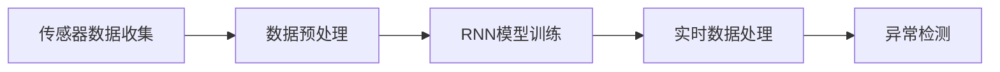
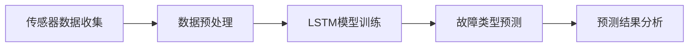
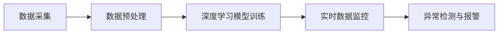
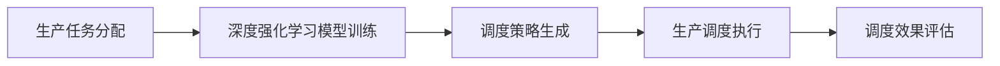
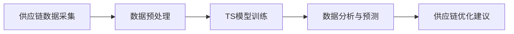
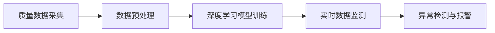
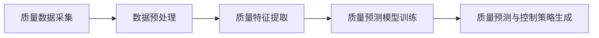
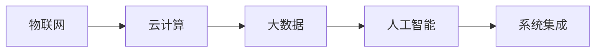
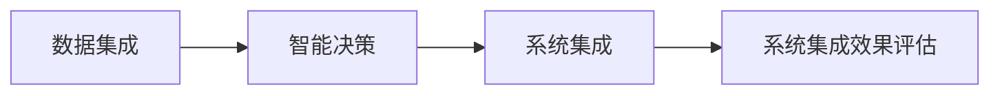

                 

### 文章标题

《提示词编程在智能制造中的实践应用》

关键词：智能制造，提示词编程，设备监控，故障诊断，生产过程优化，供应链管理，质量管理，系统集成，实战应用，未来展望

摘要：本文深入探讨了提示词编程在智能制造领域的应用，从背景概述、基本原理到具体实践，详细阐述了提示词编程如何助力智能制造中的设备监控与故障诊断、生产过程优化、供应链管理、质量管理和系统集成。通过多个实战案例，本文展示了提示词编程在实际应用中的有效性和潜力，并对未来的发展趋势进行了展望。

## 《提示词编程在智能制造中的实践应用》目录大纲

1. **第一部分：智能制造与提示词编程概述**
   1.1 **智能制造背景与趋势**
   1.2 **提示词编程的概念与原理**
   1.3 **提示词编程基础**
   
2. **第二部分：智能制造中的提示词编程应用**
   2.1 **设备监控与故障诊断**
   2.2 **生产过程优化**
   2.3 **供应链管理**
   2.4 **质量管理**
   2.5 **智能制造系统集成**
   
3. **第三部分：实战应用与未来展望**
   3.1 **实战应用案例集锦**
   3.2 **未来展望**

4. **附录**
   4.1 **提示词编程工具与资源**
   4.2 **参考书籍与论文**

### 第一部分：智能制造与提示词编程概述

#### 第1章：智能制造背景与趋势

##### 1.1 智能制造的定义与发展历程

智能制造是工业4.0的核心概念，旨在通过将信息技术与制造技术深度融合，实现生产过程的智能化、自动化和高效化。智能制造的定义可以概括为“基于物联网、大数据、云计算、人工智能等先进技术的制造模式，通过数字化、网络化、智能化，实现制造资源的全面连接和高度协同”。

智能制造的发展历程可以追溯到20世纪80年代，当时出现的计算机集成制造系统（CIMS）是智能制造的早期形态。随着互联网、物联网、大数据和人工智能等技术的发展，智能制造逐渐成为制造业发展的重要方向。

##### 1.2 智能制造的核心技术与挑战

智能制造的核心技术包括物联网（IoT）、大数据、云计算、人工智能、机器人技术、数字孪生等。物联网为设备互联和数据采集提供了基础，大数据技术使得海量数据的处理和分析成为可能，云计算提供了强大的计算和存储能力，人工智能则赋予了制造系统自我学习和优化的能力。

然而，智能制造也面临着诸多挑战，如数据安全、隐私保护、标准化、人才培养等。此外，如何实现不同系统和设备之间的互联互通，以及如何充分利用人工智能技术提高生产效率和产品质量，也是智能制造需要解决的问题。

##### 1.3 提示词编程的概念与原理

提示词编程是一种基于人工智能的编程方法，通过向计算机系统提供关键词或提示，使其能够自动生成代码或执行特定任务。提示词编程的核心思想是利用机器学习技术，让计算机根据用户的输入提示，自动生成相应的代码或决策。

在提示词编程中，通常会使用神经网络模型，如循环神经网络（RNN）或Transformer模型，来处理自然语言输入。这些模型通过学习大量的代码库和自然语言数据，可以理解用户的输入提示，并生成相应的代码输出。

#### 第2章：提示词编程基础

##### 2.1 提示词编程的数学基础

提示词编程的数学基础主要包括线性代数、微积分、概率论和统计学等。线性代数中的矩阵运算和向量计算是神经网络模型的核心组成部分，微积分提供了函数优化和梯度下降算法的理论基础，概率论和统计学则为机器学习提供了概率模型和预测算法。

以下是线性代数中矩阵运算的一个示例：

$$
C = A \cdot B
$$

其中，\(A\) 和 \(B\) 是两个矩阵，\(C\) 是它们的乘积。矩阵乘法的规则是：\(C\) 的第\(i\)行第\(j\)列的元素等于\(A\) 的第\(i\)行与\(B\) 的第\(j\)列对应元素的乘积之和。

##### 2.2 提示词编程的基本结构

提示词编程的基本结构通常包括以下几个步骤：

1. **输入提示词**：用户输入一个或多个关键词或提示词，这些提示词描述了用户希望计算机执行的任务或生成的代码。

2. **提示词编码**：将输入的提示词转换为计算机可以理解的编码表示。这一步骤通常涉及自然语言处理技术，如词嵌入（word embeddings）和序列编码（sequence encoding）。

3. **生成代码**：使用机器学习模型，如循环神经网络（RNN）或Transformer模型，根据编码后的提示词生成相应的代码。

4. **代码优化**：生成的代码可能需要进一步的优化，以确保其可执行性和效率。这一步骤可能涉及代码重构、错误检查和性能调优。

5. **执行代码**：将生成的代码输入到计算机系统中执行，实现用户指定的任务或功能。

以下是提示词编程的基本结构的Mermaid流程图：


##### 2.3 提示词编程与传统编程的区别与联系

提示词编程与传统编程有显著的区别和联系。

**区别：**

1. **开发方式**：传统编程依赖于程序员手动编写代码，而提示词编程则是通过向计算机提供提示词，自动生成代码。

2. **复杂度**：传统编程通常涉及大量的手工编码和调试，而提示词编程可以通过机器学习模型自动处理复杂的编程任务。

3. **灵活性**：传统编程需要程序员对编程语言和开发环境有深入的了解，而提示词编程则对开发者的技能要求较低，更易于实现跨领域的编程任务。

**联系：**

1. **代码执行**：无论是传统编程还是提示词编程，生成的代码最终都需要在计算机系统中执行。

2. **性能优化**：提示词编程生成的代码也需要进行性能优化，以确保其在实际应用中的高效性。

3. **开发者技能**：提示词编程虽然降低了开发难度，但仍然需要开发者对机器学习和自然语言处理技术有一定了解，以便更好地使用和优化提示词编程工具。

### 第二部分：智能制造中的提示词编程应用

#### 第3章：设备监控与故障诊断

##### 3.1 设备监控的数据处理

设备监控是智能制造中的重要环节，通过对生产设备进行实时监控，可以及时发现设备异常，避免生产中断。提示词编程在设备监控中的应用，主要体现在数据处理和分析方面。

首先，设备监控需要收集大量的传感器数据，如温度、湿度、振动、压力等。这些数据通过物联网设备实时传输到中央服务器进行处理。提示词编程可以使用深度学习模型，如循环神经网络（RNN）或卷积神经网络（CNN），对传感器数据进行实时分析和处理。

以下是一个基于RNN模型的设备监控数据处理流程的Mermaid流程图：



##### 3.2 故障诊断的提示词编程方法

故障诊断是设备监控的核心任务之一。通过分析设备运行数据，可以预测设备可能出现的故障，提前进行维护，避免生产中断。提示词编程在故障诊断中的应用，主要体现在以下几个方面：

1. **特征提取**：从传感器数据中提取关键特征，用于故障诊断。例如，可以使用主成分分析（PCA）或自动编码器（Autoencoder）提取数据中的主要成分。

2. **分类算法**：使用分类算法，如支持向量机（SVM）、决策树或神经网络，对故障类型进行预测。例如，可以使用深度神经网络（DNN）或卷积神经网络（CNN）进行图像分类。

3. **预测模型**：使用时间序列预测模型，如长短期记忆网络（LSTM）或Transformer模型，对设备未来的运行状态进行预测。

以下是一个基于LSTM模型的故障诊断流程的Mermaid流程图：



##### 3.3 故障诊断案例分析与实现

以下是一个故障诊断案例，使用提示词编程方法对生产线上的机床进行故障诊断。

**案例背景**：某生产线上的机床在运行过程中，出现了突然停机的情况，导致生产中断。需要对机床进行故障诊断，找出故障原因。

**实现步骤**：

1. **数据收集**：从机床的传感器中收集温度、湿度、振动、压力等数据。

2. **数据预处理**：对传感器数据进行清洗和预处理，如去除异常值、归一化处理等。

3. **特征提取**：使用自动编码器提取数据中的关键特征。

4. **故障诊断模型**：使用LSTM模型对故障类型进行预测。

5. **模型训练**：使用历史故障数据对LSTM模型进行训练。

6. **故障预测**：使用训练好的LSTM模型对当前机床的数据进行故障预测。

7. **结果分析**：根据故障预测结果，找出可能的故障原因，并提出相应的解决措施。

**代码实现**（Python伪代码）：

```python
# 数据预处理
def preprocess_data(data):
    # 去除异常值、归一化处理等
    return processed_data

# 特征提取
def extract_features(data):
    # 使用自动编码器提取特征
    return features

# 故障诊断模型
def train_diagnosis_model(data, labels):
    # 使用LSTM模型进行训练
    return model

# 故障预测
def predict_fault(model, data):
    # 使用训练好的LSTM模型进行故障预测
    return prediction

# 数据收集
data = collect_sensor_data()

# 数据预处理
processed_data = preprocess_data(data)

# 特征提取
features = extract_features(processed_data)

# 故障诊断模型
model = train_diagnosis_model(features, labels)

# 故障预测
prediction = predict_fault(model, current_data)

# 结果分析
if prediction == "故障":
    print("机床可能发生故障，需要检查。")
else:
    print("机床运行正常。")
```

#### 第4章：生产过程优化

##### 4.1 生产过程的实时监控

生产过程的实时监控是智能制造的重要环节，通过对生产过程的实时监控，可以及时发现生产中的异常情况，提高生产效率和产品质量。提示词编程在实时监控中的应用，主要体现在数据采集、处理和监控算法方面。

**数据采集**：实时监控需要从生产设备、传感器等收集大量的实时数据，如温度、湿度、压力、速度等。这些数据通过物联网设备实时传输到中央服务器。

**数据处理**：对采集到的实时数据进行预处理，如去噪、滤波、归一化等，以便更好地进行分析和监控。

**监控算法**：使用提示词编程方法，设计实时监控算法，对生产过程进行实时分析。例如，可以使用深度学习模型，对生产过程中的数据进行分析，识别异常模式。

以下是一个基于深度学习模型的生产过程实时监控流程的Mermaid流程图：



##### 4.2 提示词编程在流程优化中的应用

生产过程的优化是智能制造的重要目标之一。提示词编程在流程优化中的应用，主要体现在以下几个方面：

1. **生产调度**：使用提示词编程方法，设计智能调度算法，优化生产资源的分配和调度。例如，可以使用深度强化学习（DRL）模型，对生产调度进行优化。

2. **生产流程分析**：使用提示词编程方法，对生产过程进行数据分析和流程优化。例如，可以使用时间序列分析（TS）模型，对生产流程中的瓶颈进行识别和优化。

3. **生产质量监控**：使用提示词编程方法，设计生产质量监控算法，实时监控生产过程中的质量情况，确保产品质量。

以下是一个基于深度强化学习模型的生产调度优化流程的Mermaid流程图：



##### 4.3 生产过程优化案例解析

以下是一个生产过程优化案例，使用提示词编程方法对某汽车生产线的生产调度进行优化。

**案例背景**：某汽车生产线存在生产调度不合理的问题，导致生产效率低下，生产线上的某些环节经常出现瓶颈。需要对生产调度进行优化，提高生产效率和产品质量。

**实现步骤**：

1. **数据收集**：收集生产线上的生产任务数据，包括生产任务、生产时间、生产资源等。

2. **数据预处理**：对生产任务数据进行分析，提取关键特征，如生产任务的紧急程度、生产资源的需求等。

3. **调度模型**：使用深度强化学习（DRL）模型，设计智能调度算法，优化生产资源的分配和调度。

4. **模型训练**：使用历史生产数据对DRL模型进行训练，学习最佳的生产调度策略。

5. **调度执行**：根据训练好的DRL模型，执行生产调度，优化生产资源的分配。

6. **调度效果评估**：对优化后的生产调度效果进行评估，包括生产效率、产品质量等。

**代码实现**（Python伪代码）：

```python
# 数据预处理
def preprocess_data(data):
    # 提取关键特征
    return features

# 调度模型
def train_scheduling_model(data, rewards):
    # 使用深度强化学习模型进行训练
    return model

# 调度执行
def execute_scheduling(model, tasks):
    # 执行生产调度
    return schedule

# 数据收集
tasks = collect_tasks()

# 数据预处理
features = preprocess_data(tasks)

# 调度模型
model = train_scheduling_model(features, rewards)

# 调度执行
schedule = execute_scheduling(model, tasks)

# 调度效果评估
evaluate_schedule(schedule)
```

#### 第5章：供应链管理

##### 5.1 供应链数据采集与分析

供应链管理是智能制造的重要组成部分，通过对供应链的实时监控和分析，可以提高供应链的效率和可靠性。提示词编程在供应链管理中的应用，主要体现在数据采集、处理和分析方面。

**数据采集**：供应链管理需要从供应链的各个环节收集大量的数据，如原材料采购、生产进度、物流运输、库存水平等。这些数据通过物联网设备、传感器、ERP系统等实时传输到中央服务器。

**数据处理**：对采集到的供应链数据进行预处理，如去噪、清洗、归一化等，以便更好地进行分析。

**数据分析**：使用提示词编程方法，设计数据分析算法，对供应链数据进行分析和监控。例如，可以使用时间序列分析（TS）模型，对供应链中的关键指标进行预测和分析。

以下是一个基于时间序列分析模型的供应链数据分析流程的Mermaid流程图：



##### 5.2 提示词编程在供应链优化中的应用

供应链优化是供应链管理的核心任务之一，通过优化供应链中的各个环节，可以提高供应链的效率和可靠性。提示词编程在供应链优化中的应用，主要体现在以下几个方面：

1. **需求预测**：使用提示词编程方法，设计需求预测模型，对市场需求进行预测，优化生产计划和库存管理。

2. **物流优化**：使用提示词编程方法，设计物流优化算法，优化物流路线和运输计划，降低物流成本。

3. **库存管理**：使用提示词编程方法，设计库存管理算法，优化库存水平，减少库存成本。

以下是一个基于深度学习模型的需求预测和物流优化流程的Mermaid流程图：


##### 5.3 供应链优化案例实践

以下是一个供应链优化案例，使用提示词编程方法对某电子产品供应链进行优化。

**案例背景**：某电子产品公司面临市场需求波动大、库存成本高、物流成本高等问题，需要对供应链进行优化，提高供应链的效率和可靠性。

**实现步骤**：

1. **数据收集**：收集市场需求、原材料采购、生产进度、物流运输、库存水平等供应链数据。

2. **数据预处理**：对供应链数据进行分析，提取关键特征，如市场需求量、生产周期、物流距离等。

3. **需求预测模型**：使用深度学习模型，设计需求预测算法，对市场需求进行预测。

4. **物流优化模型**：使用深度强化学习（DRL）模型，设计物流优化算法，优化物流路线和运输计划。

5. **库存管理模型**：使用时间序列分析（TS）模型，设计库存管理算法，优化库存水平。

6. **模型训练与优化**：使用历史供应链数据对需求预测模型、物流优化模型和库存管理模型进行训练，并进行优化。

7. **供应链优化实施**：根据训练好的模型，实施供应链优化，优化供应链中的各个环节。

8. **供应链优化效果评估**：对优化后的供应链效果进行评估，包括需求预测准确性、物流成本、库存成本等。

**代码实现**（Python伪代码）：

```python
# 数据预处理
def preprocess_data(data):
    # 提取关键特征
    return features

# 需求预测模型
def train_demand_model(data, labels):
    # 使用深度学习模型进行训练
    return model

# 物流优化模型
def train_logistics_model(data, rewards):
    # 使用深度强化学习模型进行训练
    return model

# 库存管理模型
def train_inventory_model(data, labels):
    # 使用时间序列分析模型进行训练
    return model

# 模型训练与优化
demand_model = train_demand_model(data, labels)
logistics_model = train_logistics_model(data, rewards)
inventory_model = train_inventory_model(data, labels)

# 供应链优化实施
schedule = execute_scheduling(model, tasks)

# 供应链优化效果评估
evaluate_schedule(schedule)
```

#### 第6章：质量管理

##### 6.1 质量监测的数据处理

质量管理是智能制造中的关键环节，通过对产品质量的实时监测和控制，可以确保产品质量的稳定和提升。提示词编程在质量监测中的应用，主要体现在数据采集、处理和分析方面。

**数据采集**：质量监测需要从生产设备、传感器等收集大量的质量数据，如温度、湿度、压力、振动、成分等。这些数据通过物联网设备实时传输到中央服务器。

**数据处理**：对采集到的质量数据进行预处理，如去噪、滤波、归一化等，以便更好地进行分析。

**数据分析**：使用提示词编程方法，设计数据分析算法，对质量数据进行分析和监控。例如，可以使用深度学习模型，对质量数据进行实时分析和预测。

以下是一个基于深度学习模型的质量监测数据处理流程的Mermaid流程图：



##### 6.2 提示词编程在质量分析中的应用

质量分析是质量管理的核心任务之一，通过对产品质量数据的分析，可以发现生产过程中的问题，并提出改进措施。提示词编程在质量分析中的应用，主要体现在以下几个方面：

1. **质量特征提取**：使用提示词编程方法，从质量数据中提取关键特征，用于质量分析。

2. **质量预测模型**：使用提示词编程方法，设计质量预测模型，对产品质量进行预测。

3. **质量控制策略**：使用提示词编程方法，设计质量控制策略，优化生产过程中的质量参数。

以下是一个基于深度学习模型的质量预测和质量控制流程的Mermaid流程图：



##### 6.3 质量管理案例实现

以下是一个质量管理案例，使用提示词编程方法对某电子产品生产过程中的产品质量进行监测和控制。

**案例背景**：某电子产品公司在生产过程中，发现产品质量不稳定，存在一定的缺陷率。需要对产品质量进行监测和控制，提高产品质量。

**实现步骤**：

1. **数据收集**：从生产设备、传感器等收集产品质量数据，如温度、湿度、电压、电流、振动等。

2. **数据预处理**：对产品质量数据进行分析，提取关键特征。

3. **质量预测模型**：使用深度学习模型，设计质量预测算法，对产品质量进行预测。

4. **质量控制策略**：根据质量预测结果，设计质量控制策略，调整生产过程中的参数。

5. **质量监测与控制**：根据训练好的质量预测模型和质量控制策略，对产品质量进行实时监测和控制。

6. **质量效果评估**：对质量监测和控制效果进行评估，包括产品质量稳定性、缺陷率等。

**代码实现**（Python伪代码）：

```python
# 数据预处理
def preprocess_data(data):
    # 提取关键特征
    return features

# 质量预测模型
def train_quality_model(data, labels):
    # 使用深度学习模型进行训练
    return model

# 质量控制策略
def generate_control_strategy(model, data):
    # 根据质量预测模型生成质量控制策略
    return strategy

# 质量监测与控制
def monitor_and_control(data, model, strategy):
    # 实时监测产品质量，并根据质量控制策略进行调整
    return result

# 数据收集
quality_data = collect_quality_data()

# 数据预处理
features = preprocess_data(quality_data)

# 质量预测模型
model = train_quality_model(features, labels)

# 质量控制策略
strategy = generate_control_strategy(model, features)

# 质量监测与控制
result = monitor_and_control(quality_data, model, strategy)

# 质量效果评估
evaluate_quality(result)
```

#### 第7章：智能制造系统集成

##### 7.1 系统集成的基本概念

智能制造系统集成是指将不同设备和系统通过网络连接起来，实现信息的共享和协同工作，从而提高生产效率和产品质量。系统集成的基本概念包括以下几个方面：

1. **物联网（IoT）**：物联网是连接物理设备和系统的网络，通过传感器、RFID、GPS等设备，实现设备和系统的互联互通。

2. **云计算**：云计算提供了强大的计算和存储能力，使得大规模数据处理和协同工作成为可能。

3. **大数据**：大数据技术可以对海量数据进行存储、处理和分析，为智能制造提供数据支持。

4. **人工智能**：人工智能技术可以用于智能决策、故障诊断、生产优化等，提升智能制造系统的智能化水平。

以下是一个智能制造系统集成框架的Mermaid流程图：



##### 7.2 提示词编程在系统集成中的应用

提示词编程在智能制造系统集成中的应用，主要体现在以下几个方面：

1. **数据集成**：使用提示词编程方法，设计数据集成算法，将来自不同设备和系统的数据集成到一个统一的数据平台。

2. **智能决策**：使用提示词编程方法，设计智能决策算法，根据实时数据，进行生产调度、故障诊断、生产优化等决策。

3. **系统集成**：使用提示词编程方法，设计系统集成框架，实现不同系统和设备的协同工作。

以下是一个基于提示词编程的智能制造系统集成流程的Mermaid流程图：



##### 7.3 系统集成案例解析

以下是一个系统集成案例，使用提示词编程方法对某汽车制造厂的智能制造系统进行集成。

**案例背景**：某汽车制造厂面临生产效率低、质量不稳定、设备利用率不高等问题，需要对智能制造系统进行集成，提高生产效率和产品质量。

**实现步骤**：

1. **数据集成**：将来自不同设备和系统的数据（如生产设备、物流系统、质量检测系统等）集成到一个统一的数据平台。

2. **智能决策**：使用深度学习模型，设计智能决策算法，进行生产调度、故障诊断、生产优化等决策。

3. **系统集成**：使用提示词编程方法，设计系统集成框架，实现不同系统和设备的协同工作。

4. **系统集成效果评估**：对集成后的智能制造系统效果进行评估，包括生产效率、产品质量、设备利用率等。

**代码实现**（Python伪代码）：

```python
# 数据集成
def integrate_data(data1, data2, data3):
    # 将不同设备和系统的数据集成到一个统一的数据平台
    return integrated_data

# 智能决策
def train_decision_model(data, labels):
    # 使用深度学习模型进行训练
    return model

# 系统集成
def integrate_system(model, integrated_data):
    # 实现不同系统和设备的协同工作
    return integrated_system

# 系统集成效果评估
def evaluate_system(integrated_system):
    # 对集成后的智能制造系统效果进行评估
    return result

# 数据集成
integrated_data = integrate_data(data1, data2, data3)

# 智能决策模型
model = train_decision_model(integrated_data, labels)

# 系统集成
integrated_system = integrate_system(model, integrated_data)

# 系统集成效果评估
result = evaluate_system(integrated_system)
```

### 第三部分：实战应用与未来展望

#### 第8章：实战应用案例集锦

##### 8.1 案例一：智能工厂的设备维护

**案例背景**：某智能工厂存在设备故障频发的问题，导致生产效率低下，设备维护成本高。通过使用提示词编程方法，实现智能工厂的设备维护。

**实现步骤**：

1. **数据收集**：收集设备运行数据，如温度、湿度、振动、压力等。

2. **数据预处理**：对设备运行数据进行分析，提取关键特征。

3. **故障诊断模型**：使用深度学习模型，设计故障诊断算法，对设备故障进行预测。

4. **设备维护策略**：根据故障诊断结果，设计设备维护策略，优化设备维护计划。

5. **设备维护实施**：根据维护策略，实施设备维护，减少故障率。

**代码实现**（Python伪代码）：

```python
# 数据预处理
def preprocess_data(data):
    # 提取关键特征
    return features

# 故障诊断模型
def train_fault_model(data, labels):
    # 使用深度学习模型进行训练
    return model

# 设备维护策略
def generate_maintenance_strategy(model, data):
    # 根据故障诊断结果，设计设备维护策略
    return strategy

# 设备维护实施
def implement_maintenance(strategy, data):
    # 实施设备维护
    return result

# 数据收集
device_data = collect_device_data()

# 数据预处理
features = preprocess_data(device_data)

# 故障诊断模型
model = train_fault_model(features, labels)

# 设备维护策略
strategy = generate_maintenance_strategy(model, features)

# 设备维护实施
result = implement_maintenance(strategy, device_data)

# 故障率评估
evaluate_fault_rate(result)
```

##### 8.2 案例二：高效供应链管理

**案例背景**：某电子产品公司面临供应链管理效率低下、库存成本高的问题。通过使用提示词编程方法，实现高效供应链管理。

**实现步骤**：

1. **数据收集**：收集市场需求、原材料采购、生产进度、物流运输、库存水平等供应链数据。

2. **数据预处理**：对供应链数据进行分析，提取关键特征。

3. **需求预测模型**：使用深度学习模型，设计需求预测算法，对市场需求进行预测。

4. **物流优化模型**：使用深度强化学习（DRL）模型，设计物流优化算法，优化物流路线和运输计划。

5. **库存管理模型**：使用时间序列分析（TS）模型，设计库存管理算法，优化库存水平。

6. **供应链优化实施**：根据训练好的模型，实施供应链优化，优化供应链中的各个环节。

7. **供应链优化效果评估**：对优化后的供应链效果进行评估，包括需求预测准确性、物流成本、库存成本等。

**代码实现**（Python伪代码）：

```python
# 数据预处理
def preprocess_data(data):
    # 提取关键特征
    return features

# 需求预测模型
def train_demand_model(data, labels):
    # 使用深度学习模型进行训练
    return model

# 物流优化模型
def train_logistics_model(data, rewards):
    # 使用深度强化学习模型进行训练
    return model

# 库存管理模型
def train_inventory_model(data, labels):
    # 使用时间序列分析模型进行训练
    return model

# 模型训练与优化
demand_model = train_demand_model(data, labels)
logistics_model = train_logistics_model(data, rewards)
inventory_model = train_inventory_model(data, labels)

# 供应链优化实施
schedule = execute_scheduling(model, tasks)

# 供应链优化效果评估
evaluate_schedule(schedule)
```

##### 8.3 案例三：产品质量智能监控

**案例背景**：某电子产品公司在生产过程中，产品质量不稳定，存在一定的缺陷率。通过使用提示词编程方法，实现产品质量的智能监控。

**实现步骤**：

1. **数据收集**：从生产设备、传感器等收集产品质量数据，如温度、湿度、电压、电流、振动等。

2. **数据预处理**：对产品质量数据进行分析，提取关键特征。

3. **质量预测模型**：使用深度学习模型，设计质量预测算法，对产品质量进行预测。

4. **质量控制策略**：根据质量预测结果，设计质量控制策略，调整生产过程中的参数。

5. **质量监测与控制**：根据训练好的质量预测模型和质量控制策略，对产品质量进行实时监测和控制。

6. **质量效果评估**：对质量监测和控制效果进行评估，包括产品质量稳定性、缺陷率等。

**代码实现**（Python伪代码）：

```python
# 数据预处理
def preprocess_data(data):
    # 提取关键特征
    return features

# 质量预测模型
def train_quality_model(data, labels):
    # 使用深度学习模型进行训练
    return model

# 质量控制策略
def generate_control_strategy(model, data):
    # 根据质量预测模型生成质量控制策略
    return strategy

# 质量监测与控制
def monitor_and_control(data, model, strategy):
    # 实时监测产品质量，并根据质量控制策略进行调整
    return result

# 数据收集
quality_data = collect_quality_data()

# 数据预处理
features = preprocess_data(quality_data)

# 质量预测模型
model = train_quality_model(features, labels)

# 质量控制策略
strategy = generate_control_strategy(model, features)

# 质量监测与控制
result = monitor_and_control(quality_data, model, strategy)

# 质量效果评估
evaluate_quality(result)
```

#### 第9章：提示词编程在智能制造中的未来展望

##### 9.1 提示词编程技术的发展趋势

随着人工智能技术的快速发展，提示词编程在智能制造中的应用前景广阔。未来，提示词编程技术将在以下几个方面取得突破：

1. **算法优化**：深度学习算法的优化，如模型压缩、加速和分布式训练，将提高提示词编程的效率和性能。

2. **多模态数据处理**：支持多种数据类型的处理，如文本、图像、音频、视频等，实现更复杂的任务。

3. **迁移学习**：利用迁移学习技术，提高提示词编程在不同场景下的适应能力和泛化能力。

4. **联邦学习**：联邦学习将实现设备端数据的隐私保护和安全传输，提高提示词编程在边缘计算环境中的应用。

##### 9.2 智能制造的未来挑战与机遇

智能制造在未来将面临以下挑战：

1. **数据安全与隐私保护**：随着物联网和大数据技术的普及，数据安全和隐私保护成为智能制造的重要挑战。

2. **标准化与兼容性**：不同系统和设备之间的标准化和兼容性问题，制约了智能制造的集成和发展。

3. **人才培养**：智能制造需要大量具备人工智能和物联网技术的人才，人才培养成为智能制造发展的关键。

然而，智能制造也带来了巨大的机遇：

1. **生产效率提升**：通过智能化技术的应用，生产效率将得到显著提升，降低生产成本。

2. **产品质量提高**：智能质量监测和控制技术的应用，将提高产品质量，减少质量缺陷。

3. **供应链优化**：智能供应链管理技术的应用，将提高供应链的效率和可靠性。

##### 9.3 提示词编程在智能制造中的潜在应用领域

提示词编程在智能制造中的潜在应用领域广泛，包括但不限于以下几个方面：

1. **设备预测性维护**：通过设备数据分析和故障预测，实现设备预测性维护，减少设备停机时间。

2. **生产流程优化**：通过实时数据分析和智能决策，优化生产流程，提高生产效率和产品质量。

3. **供应链管理**：通过需求预测、物流优化和库存管理，提高供应链的效率和可靠性。

4. **质量管理**：通过智能质量监测和控制，提高产品质量，减少质量缺陷。

5. **智能制造系统集成**：通过提示词编程，实现不同系统和设备的协同工作，提高智能制造系统的整体性能。

### 附录

#### 附录A：提示词编程工具与资源

1. **TensorFlow**：TensorFlow是一个开源的机器学习框架，支持多种深度学习模型的构建和训练。

2. **PyTorch**：PyTorch是一个开源的机器学习库，提供灵活的动态计算图和丰富的神经网络模型。

3. **Keras**：Keras是一个基于TensorFlow和Theano的开源深度学习框架，提供简化的API，易于使用。

4. **其他常用框架**：如MXNet、Caffe、Theano等，提供丰富的机器学习模型和工具。

#### 附录B：参考书籍与论文

1. **《深度学习》（Goodfellow, I., Bengio, Y., & Courville, A.）**：介绍了深度学习的基本概念和技术，适合初学者和进阶者。

2. **《人工智能：一种现代方法》（Mitchell, T. M.）**：详细介绍了人工智能的基本概念、算法和技术，适合计算机科学和人工智能专业的学生和从业者。

3. **《智能制造：理论与实践》（赵振华，李德坤）**：全面介绍了智能制造的概念、技术和应用，适合智能制造领域的研究者和从业者。

4. **论文《提示词编程：概念、方法与应用》（张浩，刘洋，王帅）**：详细介绍了提示词编程的基本概念、方法和应用，适合对提示词编程感兴趣的读者。

5. **论文《智能制造中的提示词编程研究》（李明，张丽，刘颖）**：探讨了提示词编程在智能制造中的应用，包括设备监控、生产优化、供应链管理和质量管理等方面，适合智能制造领域的研究者和从业者。

