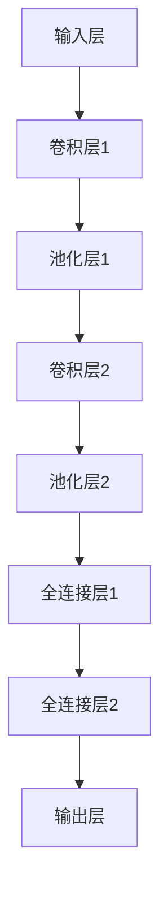

                 

# 《AI编程的新维度与新领域》

## 关键词

- AI编程
- 深度学习
- 自然语言处理
- 强化学习
- 生成模型
- 迁移学习
- 医疗AI
- 金融AI
- AI编程新趋势

## 摘要

本文旨在探讨AI编程的新维度与新领域，通过逐步分析推理的方式，为读者提供一个全面深入的了解。文章分为三个部分：第一部分介绍AI编程的基础与框架，包括核心概念、深度学习和自然语言处理基础；第二部分探讨AI编程的新维度，包括强化学习与决策、生成模型与变分自编码器、迁移学习与数据增强；第三部分探讨AI编程的新领域，包括医疗AI和金融AI。此外，文章还讨论了AI编程的未来趋势与挑战，以及AI编程伦理与责任。希望通过本文，读者能够对AI编程有一个全新的认识，并为未来的研究和应用奠定基础。

## 《AI编程的新维度与新领域》目录大纲

### 第一部分：AI编程基础与框架

### 第1章：AI编程概述

#### 1.1 AI编程的核心概念

人工智能的定义与发展历程
AI编程的重要性与应用场景
AI编程的关键挑战

#### 1.2 AI编程框架与技术

主流AI编程框架介绍
编程语言与工具的选择
常用库和框架的应用

### 第2章：深度学习与神经网络基础

#### 2.1 深度学习基本概念

神经网络结构
深度学习模型的学习过程

#### 2.2 深度学习算法原理

神经网络训练算法
前向传播与反向传播

#### 2.3 深度学习模型评估与优化

模型性能评估指标
模型优化技巧

### 第3章：自然语言处理基础

#### 3.1 NLP基本概念

语言模型
词嵌入技术

#### 3.2 NLP应用与算法

分词与词性标注
文本分类与情感分析

#### 3.3 语言生成与对话系统

生成对抗网络（GAN）
对话系统框架与实现

### 第二部分：AI编程新维度

### 第4章：强化学习与决策

#### 4.1 强化学习基础

强化学习的基本原理
Q学习与策略迭代

#### 4.2 强化学习应用案例

游戏AI
自动驾驶

#### 4.3 强化学习算法优化

多智能体强化学习
模型预测控制

### 第5章：生成模型与变分自编码器

#### 5.1 生成模型基础

生成模型的概念
生成对抗网络（GAN）

#### 5.2 变分自编码器（VAE）

VAE的基本原理
VAE在图像处理中的应用

#### 5.3 生成模型应用案例

图像生成
文本生成

### 第6章：迁移学习与数据增强

#### 6.1 迁移学习基础

迁移学习的基本概念
迁移学习在深度学习中的应用

#### 6.2 数据增强方法

数据增强策略
常见数据增强技术

#### 6.3 迁移学习应用案例

少样本学习
模型压缩与加速

### 第三部分：AI编程新领域

### 第7章：医疗AI

#### 7.1 医疗AI概述

医疗AI的应用场景
医疗AI的优势与挑战

#### 7.2 医学图像处理

医学图像识别算法
医学图像分割与标注

#### 7.3 医疗AI案例分析

医疗诊断与预测
医疗机器人

### 第8章：金融AI

#### 8.1 金融AI概述

金融AI的应用场景
金融AI的优势与挑战

#### 8.2 金融风控与预测

金融风控模型
股票市场预测

#### 8.3 金融AI案例分析

量化交易
智能投顾

### 第9章：AI编程未来趋势与挑战

#### 9.1 AI编程未来趋势

AI编程的未来发展方向
AI编程的发展趋势与挑战

#### 9.2 AI编程人才需求

AI编程岗位要求
AI编程人才培养策略

#### 9.3 AI编程伦理与责任

AI编程伦理问题
AI编程的社会责任

### 附录

#### 附录A：AI编程资源与工具

主流AI编程框架与库
AI编程学习资源
AI编程实践工具

#### 附录B：深度学习模型Mermaid流程图

深度学习模型结构图
主流深度学习算法流程图

#### 附录C：伪代码与数学公式

深度学习算法伪代码
数学模型与公式
公式详细讲解与举例说明

#### 附录D：项目实战

代码实际案例
开发环境搭建
源代码详细实现与解读
代码解读与分析

### 第一部分：AI编程基础与框架

#### 第1章：AI编程概述

##### 1.1 AI编程的核心概念

人工智能（Artificial Intelligence，简称AI）是计算机科学的一个分支，旨在创建智能的机器或系统，使其能够执行通常需要人类智能才能完成的任务。AI的发展历程可以追溯到20世纪50年代，当时人工智能的首次提出。经过几十年的发展，人工智能取得了显著的进步，如今已经成为推动社会进步的重要力量。

AI编程，即利用编程语言和技术实现人工智能算法和系统的过程。AI编程的核心概念包括：

1. **机器学习（Machine Learning）**：机器学习是一种使计算机能够从数据中学习并做出预测或决策的技术。它通过训练模型来发现数据中的模式和关系。

2. **深度学习（Deep Learning）**：深度学习是机器学习的一个子领域，使用多层神经网络（Neural Networks）来模拟人脑的学习方式。

3. **神经网络（Neural Networks）**：神经网络是一种模仿生物神经系统的计算模型，通过权重和偏置来学习输入和输出之间的关系。

4. **自然语言处理（Natural Language Processing，NLP）**：NLP是一种使计算机能够理解、解释和生成人类语言的技术。

5. **强化学习（Reinforcement Learning）**：强化学习是一种通过试错和奖励机制来学习策略的机器学习方法。

6. **生成模型（Generative Models）**：生成模型是一种能够生成新数据的机器学习模型。

7. **迁移学习（Transfer Learning）**：迁移学习是一种利用已经训练好的模型来解决新问题的技术。

AI编程的重要性与应用场景：

- **自动化与优化**：AI编程能够自动化重复性任务，提高效率，减少人力成本。
- **数据分析与决策**：AI编程能够处理大量数据，提取有价值的信息，辅助决策。
- **智能交互**：AI编程能够实现智能对话系统、语音识别等，提供更好的用户体验。
- **医疗诊断与预测**：AI编程能够辅助医生进行疾病诊断、病情预测等，提高医疗水平。
- **金融风控与投资**：AI编程能够进行风险评估、股票市场预测等，为投资者提供决策支持。
- **自动驾驶**：AI编程是实现自动驾驶技术的基础，能够提高交通安全和效率。

AI编程的关键挑战：

- **数据质量与隐私**：AI编程需要大量的高质量数据来训练模型，同时需保护用户隐私。
- **计算资源**：深度学习等AI算法需要大量的计算资源，对硬件要求较高。
- **模型解释性**：当前的AI模型很多是“黑盒”模型，难以解释其决策过程。
- **算法公平性与伦理**：AI算法的决策过程可能存在偏见，需要确保算法的公平性和伦理。

##### 1.2 AI编程框架与技术

AI编程框架是一套标准的软件架构，用于简化AI算法的开发、训练和部署。以下是几种主流的AI编程框架：

1. **TensorFlow**：TensorFlow是谷歌开源的深度学习框架，具有广泛的社区支持和丰富的工具库。
2. **PyTorch**：PyTorch是Facebook开源的深度学习框架，具有灵活的动态图计算能力和强大的生态系统。
3. **Keras**：Keras是一个高级神经网络API，可以运行在TensorFlow和Theano之上，易于使用。
4. **Scikit-learn**：Scikit-learn是一个Python机器学习库，提供了多种经典机器学习算法的实现。
5. **Apache MXNet**：MXNet是Apache开源的深度学习框架，支持多种编程语言，适用于移动和云计算场景。

在AI编程中，选择合适的编程语言和工具非常重要。Python因其简洁性和丰富的库资源，成为AI编程的主要语言。其他常用的编程语言还包括R、Java和C++。

此外，还有一些常用的库和工具，如NumPy、Pandas、Matplotlib等，用于数据处理、数据可视化和模型评估。

##### 第2章：深度学习与神经网络基础

###### 2.1 深度学习基本概念

深度学习（Deep Learning）是一种机器学习技术，通过构建多层神经网络来学习数据中的复杂模式。深度学习的核心概念包括：

1. **神经网络（Neural Networks）**：神经网络是一种由大量神经元组成的计算模型，模拟人脑的信息处理方式。

2. **前向传播（Forward Propagation）**：前向传播是指将输入数据通过神经网络逐层传递，最终得到输出结果。

3. **反向传播（Back Propagation）**：反向传播是一种用于训练神经网络的学习算法，通过计算损失函数对网络参数进行梯度下降优化。

4. **激活函数（Activation Functions）**：激活函数用于引入非线性特性，使神经网络能够学习复杂的数据模式。

5. **损失函数（Loss Functions）**：损失函数用于衡量模型预测结果与真实结果之间的差距，常用的损失函数包括均方误差（MSE）和交叉熵（Cross Entropy）。

深度学习模型的学习过程：

1. **数据预处理**：对输入数据进行归一化、标准化等处理，以适应神经网络的要求。

2. **模型初始化**：初始化网络参数，通常采用随机初始化方法。

3. **前向传播**：将输入数据通过神经网络进行前向传播，得到输出结果。

4. **损失函数计算**：计算预测结果与真实结果之间的损失。

5. **反向传播**：通过反向传播计算梯度，更新网络参数。

6. **迭代优化**：重复上述过程，直到满足停止条件（如损失小于预定值或达到最大迭代次数）。

###### 2.2 深度学习算法原理

深度学习算法的核心是神经网络的训练过程，包括以下几个步骤：

1. **前向传播**：

   前向传播是指将输入数据逐层传递到神经网络的每一层，每一层的输出作为下一层的输入。具体计算过程如下：

   $$ z^{(l)} = \sigma(W^{(l)} \cdot a^{(l-1)} + b^{(l)}) $$

   其中，$a^{(l)}$表示第$l$层的激活值，$z^{(l)}$表示第$l$层的输出，$\sigma$表示激活函数，$W^{(l)}$和$b^{(l)}$分别为第$l$层的权重和偏置。

2. **损失函数计算**：

   损失函数用于衡量模型预测结果与真实结果之间的差距，常用的损失函数包括均方误差（MSE）和交叉熵（Cross Entropy）。

   均方误差（MSE）：

   $$ J = \frac{1}{m} \sum_{i=1}^{m} (\hat{y}^{(i)} - y^{(i)})^2 $$

   其中，$\hat{y}^{(i)}$为模型预测结果，$y^{(i)}$为真实标签。

   交叉熵（Cross Entropy）：

   $$ J = -\frac{1}{m} \sum_{i=1}^{m} \sum_{j=1}^{n} y^{(i)}_{j} \log(\hat{y}^{(i)}_{j}) $$

3. **反向传播**：

   反向传播是指从输出层开始，逐层向前计算损失函数关于网络参数的梯度，并更新网络参数。

   $$ \delta^{(l)} = \frac{\partial J}{\partial z^{(l)}} = \delta^{(l+1)} \cdot \frac{\partial a^{(l)}}{\partial z^{(l)}} $$

   其中，$\delta^{(l)}$表示第$l$层的误差，$\delta^{(l+1)}$表示第$l+1$层的误差。

4. **梯度下降**：

   梯度下降是一种优化算法，通过计算损失函数关于网络参数的梯度，更新网络参数。

   $$ \theta^{(l)} = \theta^{(l)} - \alpha \cdot \frac{\partial J}{\partial \theta^{(l)}} $$

   其中，$\theta^{(l)}$表示第$l$层的参数，$\alpha$为学习率。

深度学习算法的优化技巧：

1. **学习率调整**：选择合适的学习率，可以加速收敛过程。
2. **正则化**：通过添加正则化项，如L1和L2正则化，防止过拟合。
3. **批量归一化（Batch Normalization）**：通过归一化层之间的输入，提高训练稳定性。
4. **dropout**：通过随机丢弃部分神经元，防止过拟合。

###### 2.3 深度学习模型评估与优化

深度学习模型的评估与优化是确保模型性能和泛化能力的重要步骤。以下是一些常见的评估指标和优化技巧：

1. **评估指标**：

   - **准确率（Accuracy）**：预测正确的样本占总样本的比例。
   - **召回率（Recall）**：预测正确的正样本占总正样本的比例。
   - **精确率（Precision）**：预测正确的正样本占总预测正样本的比例。
   - **F1分数（F1 Score）**：精确率和召回率的加权平均。
   - **ROC曲线（Receiver Operating Characteristic Curve）**：用于评估分类器的性能。
   - **AUC（Area Under Curve）**：ROC曲线下的面积，用于评估分类器的区分能力。

2. **优化技巧**：

   - **交叉验证（Cross Validation）**：通过将数据集划分为训练集和验证集，评估模型的泛化能力。
   - **模型集成（Model Ensembling）**：通过组合多个模型的预测结果，提高模型的稳定性。
   - **超参数调优（Hyperparameter Tuning）**：通过调整模型超参数，如学习率、批次大小等，优化模型性能。
   - **数据预处理**：对输入数据进行预处理，如归一化、标准化、数据增强等，提高模型对数据的适应性。

#### 第3章：自然语言处理基础

##### 3.1 NLP基本概念

自然语言处理（Natural Language Processing，简称NLP）是人工智能的一个重要分支，旨在使计算机能够理解、解释和生成自然语言。NLP的基本概念包括：

1. **文本表示（Text Representation）**：文本表示是将原始文本数据转化为计算机可以处理的数字形式。

2. **分词（Tokenization）**：分词是将文本分割成单词、短语或句子的过程。

3. **词性标注（Part-of-Speech Tagging）**：词性标注是将文本中的每个单词标注为名词、动词、形容词等词性。

4. **句法分析（Syntactic Parsing）**：句法分析是理解文本中的句子结构和语法规则。

5. **语义分析（Semantic Analysis）**：语义分析是理解文本中的语义含义，包括实体识别、情感分析等。

6. **文本分类（Text Classification）**：文本分类是将文本数据分为不同的类别。

7. **情感分析（Sentiment Analysis）**：情感分析是判断文本表达的情感倾向。

##### 3.2 NLP应用与算法

NLP在多个领域有着广泛的应用，如信息检索、机器翻译、问答系统、文本生成等。以下介绍一些常用的NLP算法：

1. **朴素贝叶斯（Naive Bayes）**：朴素贝叶斯是一种基于概率论的分类算法，适用于文本分类任务。

2. **支持向量机（Support Vector Machine，SVM）**：SVM是一种基于优化理论的分类算法，适用于文本分类和文本回归任务。

3. **深度神经网络（Deep Neural Network，DNN）**：DNN是一种多层神经网络，适用于文本分类、文本生成和机器翻译等任务。

4. **循环神经网络（Recurrent Neural Network，RNN）**：RNN是一种适用于序列数据的神经网络，适用于文本生成、机器翻译和语音识别等任务。

5. **长短时记忆网络（Long Short-Term Memory，LSTM）**：LSTM是RNN的一种变体，适用于处理长序列数据，如文本生成和语音识别。

6. **生成对抗网络（Generative Adversarial Network，GAN）**：GAN是一种由生成器和判别器组成的对抗网络，适用于文本生成和图像生成等任务。

##### 3.3 语言生成与对话系统

语言生成是NLP的一个重要任务，旨在生成有意义的自然语言文本。以下介绍两种常用的语言生成方法：

1. **序列到序列（Sequence-to-Sequence，Seq2Seq）模型**：Seq2Seq模型是一种基于编码器-解码器框架的模型，适用于机器翻译和问答系统等任务。

2. **注意力机制（Attention Mechanism）**：注意力机制是一种能够自适应地关注输入序列中重要信息的机制，适用于机器翻译和文本生成等任务。

对话系统是NLP的一个重要应用领域，旨在实现人与机器的智能对话。以下介绍两种常用的对话系统框架：

1. **基于规则的方法（Rule-Based Approach）**：基于规则的方法使用预定义的规则来处理用户输入，适用于简单的问答系统。

2. **基于统计的方法（Statistical Approach）**：基于统计的方法使用机器学习算法来训练模型，适用于复杂的多轮对话系统。

3. **基于生成式的方法（Generative Approach）**：基于生成式的方法使用生成模型来生成自然语言响应，适用于开放领域的对话系统。

### 第二部分：AI编程新维度

#### 第4章：强化学习与决策

强化学习（Reinforcement Learning，RL）是一种通过试错和奖励机制来学习策略的机器学习方法。强化学习的关键概念包括：

1. **状态（State）**：系统当前所处的环境状态。
2. **动作（Action）**：系统可以执行的动作。
3. **奖励（Reward）**：动作执行后获得的即时反馈。
4. **策略（Policy）**：系统在特定状态下选择动作的规则。
5. **价值函数（Value Function）**：衡量状态或策略的价值。
6. **模型（Model）**：对环境状态和动作的预测。

强化学习的基本原理：

强化学习过程可以分为以下几个步骤：

1. **初始化**：初始化状态、策略和价值函数。
2. **执行动作**：在当前状态下，根据策略选择动作。
3. **获得奖励**：执行动作后，获得即时奖励。
4. **更新状态**：根据动作的结果，更新当前状态。
5. **重复迭代**：重复执行上述步骤，直到达到目标状态或满足停止条件。

强化学习算法可以分为以下几种类型：

1. **值函数方法（Value-Based Methods）**：通过优化价值函数来学习策略。
   - **Q学习（Q-Learning）**：Q学习是一种通过更新Q值来学习策略的方法。
   - **Sarsa（State-Action-Reward-State-Action，SARSA）**：Sarsa是一种同时更新当前状态和下一状态的动作价值的方法。
   
2. **策略迭代方法（Policy-Based Methods）**：直接优化策略来学习行为。
   - **策略梯度方法（Policy Gradient Methods）**：通过优化策略的梯度来学习策略。
   - **策略迭代（Policy Iteration）**：通过迭代更新策略和价值函数来学习策略。

强化学习应用案例：

1. **游戏AI**：强化学习在游戏领域有着广泛的应用，如围棋、电子竞技等。
2. **自动驾驶**：强化学习可以用于自动驾驶系统的路径规划和决策。
3. **推荐系统**：强化学习可以用于推荐系统中的行为预测和优化。
4. **机器人控制**：强化学习可以用于机器人控制中的路径规划和任务执行。

强化学习算法优化：

1. **探索与利用（Exploration vs Exploitation）**：在强化学习过程中，需要在探索新状态和利用已有知识之间取得平衡。
   - **ε-贪心策略（ε-Greedy Strategy）**：在探索阶段，以一定的概率随机选择动作。
   - **UCB算法（Upper Confidence Bound）**：基于置信区间选择动作，使探索更加有效。
   
2. **多智能体强化学习（Multi-Agent Reinforcement Learning）**：在多智能体环境中，强化学习算法需要协调多个智能体的行为。
   - **合作强化学习（Cooperative Reinforcement Learning）**：智能体之间通过合作实现共同目标。
   - **对抗强化学习（Adversarial Reinforcement Learning）**：智能体之间进行竞争对抗，优化自身策略。

3. **模型预测控制（Model Predictive Control，MPC）**：在控制领域，强化学习可以与模型预测控制相结合，实现复杂的控制任务。

#### 第5章：生成模型与变分自编码器

生成模型（Generative Models）是一类用于生成新数据的机器学习模型，通过学习数据分布来生成类似的数据。生成模型的基本概念包括：

1. **数据分布（Data Distribution）**：生成模型旨在学习数据分布，以便生成新的样本。
2. **潜在空间（Latent Space）**：生成模型将数据映射到一个潜在空间，通过在潜在空间中采样来生成新数据。
3. **生成器（Generator）**：生成模型中的生成器负责将潜在空间的样本映射到数据空间。
4. **判别器（Discriminator）**：生成模型中的判别器负责区分真实数据和生成数据。

生成模型可以分为以下几种类型：

1. **生成对抗网络（Generative Adversarial Networks，GAN）**：GAN由生成器和判别器组成，两者相互竞争，生成器试图生成更逼真的数据，而判别器试图区分真实数据和生成数据。

2. **变分自编码器（Variational Autoencoder，VAE）**：VAE是一种基于概率模型的生成模型，通过编码器和解码器来学习数据分布。

3. **深度置信网络（Deep Belief Networks，DBN）**：DBN是一种基于多层感知机的生成模型，通过逐层训练来学习数据分布。

变分自编码器（VAE）的基本原理：

变分自编码器（VAE）是一种基于概率模型的生成模型，通过编码器和解码器来学习数据分布。VAE的基本原理如下：

1. **编码器（Encoder）**：编码器将输入数据映射到一个潜在空间中的均值和方差，表示数据分布。
   $$ z = \mu(\xi) + \sigma(\xi) \odot \xi $$
   其中，$\xi$为输入数据，$\mu$和$\sigma$分别为均值和方差，$z$为潜在空间中的样本。

2. **解码器（Decoder）**：解码器将潜在空间中的样本映射回数据空间。
   $$ x = \sigma(g(\phi)) $$
   其中，$\phi$为解码器的参数，$g$为激活函数，$x$为生成数据。

3. **损失函数**：VAE的损失函数由数据重建损失和KL散度损失组成。
   $$ \mathcal{L} = -\sum_{x \in \mathcal{D}} \log p_\phi(x) + \lambda \sum_{x \in \mathcal{D}} \frac{1}{2} D_{KL}(\mu(\xi)||\mathcal{N}(0,1)) $$
   其中，$p_\phi(x)$为生成概率分布，$D_{KL}$为KL散度。

VAE在图像处理中的应用：

VAE在图像处理领域有着广泛的应用，如图像生成、图像超分辨率和图像去噪等。

1. **图像生成**：VAE可以生成高质量的图像，如图像到图像的翻译、图像风格迁移等。
2. **图像超分辨率**：VAE可以用于图像的超分辨率重建，提高图像的分辨率。
3. **图像去噪**：VAE可以用于图像去噪，去除图像中的噪声，提高图像质量。

生成模型应用案例：

1. **图像生成**：GAN和VAE在图像生成领域取得了显著的成果，如人脸生成、图像合成等。
2. **文本生成**：生成模型可以生成高质量的文本，如图像描述生成、自然语言生成等。
3. **音频生成**：生成模型可以生成高质量的音频，如声音合成、音乐生成等。

#### 第6章：迁移学习与数据增强

迁移学习（Transfer Learning）是一种利用已经训练好的模型来解决新问题的技术。迁移学习的基本概念包括：

1. **预训练模型（Pre-Trained Model）**：预训练模型是在大规模数据集上训练得到的，具有较好的泛化能力。
2. **适应阶段（Fine-Tuning）**：在适应阶段，将预训练模型在目标任务的数据集上进行微调，使其适应新任务。
3. **迁移学习效果（Transfer Learning Effect）**：迁移学习能够显著提高模型在新任务上的性能，尤其在数据稀缺的情况下。

迁移学习在深度学习中的应用：

迁移学习在深度学习领域有着广泛的应用，如计算机视觉、自然语言处理和语音识别等。

1. **计算机视觉**：迁移学习可以用于图像分类、目标检测和图像分割等任务，如使用预训练的ResNet模型进行图像分类。
2. **自然语言处理**：迁移学习可以用于文本分类、机器翻译和问答系统等任务，如使用预训练的BERT模型进行文本分类。
3. **语音识别**：迁移学习可以用于语音识别任务，如使用预训练的语音模型进行语音识别。

数据增强（Data Augmentation）是一种通过人为地增加数据多样性来提高模型泛化能力的技术。数据增强的基本方法包括：

1. **图像增强**：通过旋转、翻转、裁剪、缩放等操作来增加图像的多样性。
2. **文本增强**：通过随机插入、删除、替换和重排等操作来增加文本的多样性。
3. **音频增强**：通过添加噪声、改变音调、音速等操作来增加音频的多样性。

数据增强的应用：

数据增强在深度学习领域有着广泛的应用，如计算机视觉、自然语言处理和语音识别等。

1. **计算机视觉**：数据增强可以用于图像分类、目标检测和图像分割等任务，提高模型的鲁棒性和泛化能力。
2. **自然语言处理**：数据增强可以用于文本分类、机器翻译和问答系统等任务，提高模型的泛化能力。
3. **语音识别**：数据增强可以用于语音识别任务，提高模型对噪声和不同说话人语音的适应性。

迁移学习应用案例：

1. **少样本学习**：迁移学习可以用于少样本学习，如使用预训练的模型在只有少量训练样本的情况下进行分类。
2. **模型压缩与加速**：迁移学习可以用于模型压缩与加速，如使用轻量级的预训练模型进行推理，提高模型的计算效率。

### 第三部分：AI编程新领域

#### 第7章：医疗AI

医疗AI（Medical Artificial Intelligence）是利用人工智能技术为医疗领域提供智能化解决方案的一门交叉学科。医疗AI的应用场景包括：

1. **医学图像分析**：通过深度学习算法对医学图像进行分类、分割、标注等，辅助医生进行诊断和治疗。
2. **疾病预测与诊断**：利用机器学习算法对患者的病历、基因数据等进行分析，预测疾病风险和诊断疾病。
3. **药物研发**：通过自动化筛选药物候选物、优化药物合成路径等，加速药物研发过程。
4. **医疗机器人**：利用机器人技术进行手术、护理等，提高医疗服务的质量和效率。
5. **医疗数据分析**：通过对海量医疗数据进行分析，发现疾病规律、优化医疗资源配置等。

医疗AI的优势与挑战：

优势：

1. **提高诊断准确性**：医疗AI可以辅助医生进行疾病诊断，提高诊断准确性。
2. **优化治疗决策**：医疗AI可以根据患者的病情和病史，提供个性化的治疗建议。
3. **提高医疗效率**：医疗AI可以自动化处理大量医疗数据，提高医疗工作效率。
4. **降低医疗成本**：医疗AI可以减少医生的工作量，降低医疗成本。

挑战：

1. **数据隐私与安全**：医疗数据涉及患者隐私，需要确保数据的安全性和保密性。
2. **算法解释性**：医疗AI的决策过程往往是不透明的，需要提高算法的解释性。
3. **数据质量与标注**：医疗数据质量直接影响模型的性能，需要确保数据的质量和标注的准确性。
4. **法律法规**：医疗AI的应用需要遵循相关法律法规，确保其合法合规。

医学图像处理：

医学图像处理是医疗AI的一个重要应用领域，包括以下任务：

1. **图像分类**：对医学图像进行分类，如区分肿瘤和非肿瘤图像。
2. **图像分割**：将医学图像中的目标区域分割出来，如肿瘤区域、血管等。
3. **图像标注**：对医学图像中的目标进行标注，如标注病变区域、器官等。

医学图像识别算法：

常见的医学图像识别算法包括：

1. **卷积神经网络（CNN）**：CNN是一种适用于图像处理的深度学习算法，通过卷积层、池化层和全连接层来提取图像特征。
2. **循环神经网络（RNN）**：RNN是一种适用于序列数据的深度学习算法，通过递归层来处理医学图像的时间序列特征。
3. **生成对抗网络（GAN）**：GAN是一种由生成器和判别器组成的深度学习算法，通过对抗训练来生成高质量的医学图像。

医学图像分割与标注：

医学图像分割是将医学图像中的目标区域分割出来，常用的方法包括：

1. **阈值分割**：通过设定阈值，将图像划分为前景和背景。
2. **区域生长**：通过种子点开始，逐步生长并连接相似的像素，形成目标区域。
3. **分水岭算法**：利用图像的梯度信息，将图像划分为多个区域。

医学图像标注是将医学图像中的目标进行标注，常用的方法包括：

1. **手动标注**：由医生对图像中的目标进行标注。
2. **自动标注**：利用深度学习算法对图像中的目标进行自动标注。

医学图像处理的应用案例：

1. **肺癌检测**：通过深度学习算法对CT图像中的肺部结节进行检测和分类，辅助医生进行肺癌诊断。
2. **脑瘤分割**：通过深度学习算法对MRI图像中的脑瘤区域进行分割，辅助医生进行脑瘤诊断和治疗。
3. **血管分割**：通过深度学习算法对血管图像进行分割，辅助医生进行血管病变的诊断和治疗。

医疗AI案例分析：

1. **AI辅助肺癌诊断**：使用深度学习算法对CT图像中的肺部结节进行检测和分类，提高肺癌诊断的准确性。
2. **AI辅助手术**：使用机器人技术进行手术，提高手术的准确性和效率。
3. **AI辅助药物研发**：使用机器学习算法对药物分子进行筛选和优化，加速药物研发过程。

#### 第8章：金融AI

金融AI（Financial Artificial Intelligence）是利用人工智能技术为金融领域提供智能化解决方案的一门交叉学科。金融AI的应用场景包括：

1. **金融风控**：通过机器学习算法对金融交易进行监控和分析，识别潜在风险和欺诈行为。
2. **市场预测**：通过分析历史数据和市场趋势，预测股票价格、汇率等金融指标。
3. **量化交易**：利用数学模型和机器学习算法进行高频交易，实现自动化交易策略。
4. **智能投顾**：通过分析投资者的风险偏好和投资目标，提供个性化的投资建议。
5. **客户服务**：利用自然语言处理和语音识别技术，提供智能客服和对话系统。

金融AI的优势与挑战：

优势：

1. **提高交易效率**：金融AI可以自动化处理大量金融数据，提高交易效率。
2. **降低风险**：金融AI可以识别潜在的风险和欺诈行为，降低金融风险。
3. **优化投资策略**：金融AI可以分析市场趋势和投资者行为，提供个性化的投资建议。
4. **提高客户满意度**：金融AI可以提供24/7的智能客服和对话系统，提高客户满意度。

挑战：

1. **数据隐私与安全**：金融数据涉及用户隐私，需要确保数据的安全性和保密性。
2. **算法解释性**：金融AI的决策过程往往是不透明的，需要提高算法的解释性。
3. **市场波动**：金融市场波动性较大，需要确保算法的鲁棒性和适应性。
4. **法律法规**：金融AI的应用需要遵循相关法律法规，确保其合法合规。

金融风控与预测：

金融风控是金融AI的一个重要应用领域，包括以下任务：

1. **欺诈检测**：通过分析交易数据和行为特征，识别潜在的欺诈行为。
2. **信用评估**：通过对借款人的信用历史进行分析，评估其信用风险。
3. **市场预测**：通过对历史数据和市场趋势进行分析，预测金融市场的走势。

金融风控模型：

常见的金融风控模型包括：

1. **逻辑回归（Logistic Regression）**：逻辑回归是一种用于分类的线性模型，通过预测概率来评估风险。
2. **决策树（Decision Tree）**：决策树是一种基于规则分类的模型，通过树形结构来分类风险。
3. **随机森林（Random Forest）**：随机森林是一种基于决策树的集成模型，通过多棵决策树来提高分类准确性。
4. **支持向量机（SVM）**：支持向量机是一种基于优化理论的分类模型，通过寻找最佳分类边界来评估风险。

股票市场预测：

股票市场预测是金融AI的另一个重要应用领域，包括以下任务：

1. **股票价格预测**：通过对历史价格数据和市场趋势进行分析，预测股票价格的走势。
2. **市场趋势分析**：通过对宏观经济指标、行业数据等进行分析，预测市场的走势。
3. **交易信号生成**：通过对市场数据进行分析，生成买卖交易信号。

股票市场预测方法：

常见的股票市场预测方法包括：

1. **时间序列分析**：时间序列分析是一种基于历史价格数据的方法，通过分析价格序列的规律来预测价格走势。
2. **技术分析**：技术分析是一种基于图表和指标的方法，通过分析市场趋势和交易信号来预测价格走势。
3. **机器学习模型**：机器学习模型是一种基于历史数据和特征的方法，通过训练模型来预测价格走势。

金融AI案例分析：

1. **量化交易策略**：通过机器学习算法生成高频交易策略，实现自动化交易。
2. **智能投顾系统**：通过分析用户投资目标和风险偏好，提供个性化的投资建议。
3. **欺诈检测系统**：通过机器学习算法对交易数据进行实时监控，识别潜在的欺诈行为。

### 第9章：AI编程未来趋势与挑战

#### 9.1 AI编程未来趋势

AI编程的未来发展趋势主要体现在以下几个方面：

1. **算法创新**：随着AI理论的不断进步，新的算法和技术将持续涌现，如联邦学习、图神经网络等，为AI编程提供更多可能性。

2. **硬件加速**：硬件技术的发展，如GPU、TPU等专用硬件的普及，将大幅提升AI编程的计算性能，降低训练和推理的延迟。

3. **跨领域融合**：AI编程将与其他领域如医疗、金融、教育等深度结合，推动各行业智能化转型。

4. **自主进化**：随着强化学习等技术的进步，AI编程将逐步实现自主进化，无需人类干预即可优化自身性能。

5. **人机协同**：AI编程将与人类专家协同工作，实现人机融合，提高工作效率和决策质量。

#### 9.2 AI编程人才需求

AI编程的快速发展对人才的需求提出了更高的要求。未来，以下类型的AI编程人才将特别受欢迎：

1. **AI算法工程师**：负责AI算法的研究、开发和优化，是AI编程的核心人才。

2. **数据科学家**：负责数据的收集、清洗、分析和建模，是AI编程的数据基石。

3. **软件工程师**：具备编程能力，能够将AI算法实现为可部署的软件系统。

4. **产品经理**：负责AI产品的规划、设计和推广，确保AI编程成果能够落地应用。

5. **算法伦理专家**：负责AI编程的伦理问题，确保算法的公平性、透明性和合规性。

#### 9.3 AI编程伦理与责任

AI编程的伦理问题日益受到关注。以下是一些关键伦理问题和责任：

1. **算法公平性**：AI算法不应歧视特定群体，应确保对所有用户公平。

2. **数据隐私**：AI编程应尊重用户隐私，保护个人数据不被滥用。

3. **算法透明性**：AI算法的决策过程应透明，用户有权了解和质疑算法的决策。

4. **责任归属**：在AI编程造成损失或伤害时，应明确责任归属，确保各方承担相应责任。

5. **社会责任**：AI编程应服务于社会公共利益，促进社会和谐与进步。

### 附录

#### 附录A：AI编程资源与工具

1. **AI编程框架与库**：

   - TensorFlow
   - PyTorch
   - Keras
   - Scikit-learn
   - Apache MXNet

2. **AI编程学习资源**：

   - 《深度学习》（Goodfellow et al.）
   - 《Python机器学习》（Sebastian Raschka）
   - Coursera、Udacity等在线课程

3. **AI编程实践工具**：

   - Jupyter Notebook
   - Google Colab
   - AWS Sagemaker
   - Azure Machine Learning

#### 附录B：深度学习模型Mermaid流程图

以下是一个简单的深度学习模型Mermaid流程图示例：



#### 附录C：伪代码与数学公式

以下是一个简单的深度学习算法伪代码示例：

```python
# 初始化模型参数
W1, b1 = initialize_weights()

# 前向传播
z2 = X * W1 + b1
a2 = activation_function(z2)

# 计算损失
loss = loss_function(a2, y)

# 反向传播
dz2 = d_loss / da2
dW1, db1 = d_z2 * da2

# 更新参数
W1 = W1 - learning_rate * dW1
b1 = b1 - learning_rate * db1
```

以下是一个简单的数学公式示例：

$$
\begin{aligned}
z^{(l)} &= \sigma(W^{(l)} \cdot a^{(l-1)} + b^{(l)}) \\
\delta^{(l)} &= \frac{\partial J}{\partial z^{(l)}} \\
\theta^{(l)} &= \theta^{(l)} - \alpha \cdot \frac{\partial J}{\partial \theta^{(l)}}
\end{aligned}
$$`

#### 附录D：项目实战

以下是一个简单的AI编程项目实战示例：

**项目描述**：

使用深度学习算法实现一个简单的图像分类器，能够识别输入图像是猫还是狗。

**开发环境**：

- Python 3.8
- TensorFlow 2.4.0
- Keras 2.4.3

**源代码**：

```python
import tensorflow as tf
from tensorflow.keras.models import Sequential
from tensorflow.keras.layers import Conv2D, MaxPooling2D, Flatten, Dense
from tensorflow.keras.preprocessing.image import ImageDataGenerator

# 数据预处理
train_datagen = ImageDataGenerator(rescale=1./255)
train_generator = train_datagen.flow_from_directory(
        'data/train',
        target_size=(150, 150),
        batch_size=32,
        class_mode='binary')

# 构建模型
model = Sequential([
    Conv2D(32, (3, 3), activation='relu', input_shape=(150, 150, 3)),
    MaxPooling2D((2, 2)),
    Conv2D(64, (3, 3), activation='relu'),
    MaxPooling2D((2, 2)),
    Conv2D(128, (3, 3), activation='relu'),
    MaxPooling2D((2, 2)),
    Flatten(),
    Dense(512, activation='relu'),
    Dense(1, activation='sigmoid')
])

# 编译模型
model.compile(loss='binary_crossentropy',
              optimizer='adam',
              metrics=['accuracy'])

# 训练模型
model.fit(
      train_generator,
      steps_per_epoch=100,
      epochs=15)

# 评估模型
test_loss, test_acc = model.evaluate(test_generator,
                stepsPerEpoch=50)
print('Test accuracy:', test_acc)
```

**代码解读与分析**：

1. **数据预处理**：使用ImageDataGenerator对训练数据集进行预处理，包括图像缩放、归一化等操作。
2. **模型构建**：使用Sequential模型构建一个简单的卷积神经网络，包括卷积层、池化层和全连接层。
3. **模型编译**：编译模型，指定损失函数、优化器和评估指标。
4. **模型训练**：使用fit方法训练模型，指定训练数据和训练轮数。
5. **模型评估**：使用evaluate方法评估模型在测试数据集上的性能。

通过以上项目实战，读者可以了解如何使用深度学习算法实现一个简单的图像分类器，为后续更复杂的项目开发奠定基础。

### 总结

本文系统地介绍了AI编程的新维度与新领域，通过逐步分析推理的方式，为读者提供了一个全面深入的了解。从AI编程的基础与框架，到强化学习、生成模型、迁移学习等新维度，再到医疗AI、金融AI等新领域，本文涵盖了AI编程的各个关键方面。

在未来的研究和应用中，AI编程将继续发挥重要作用，推动社会进步和产业升级。然而，AI编程也面临着诸多挑战，如算法公平性、数据隐私、算法解释性等。我们需要不断探索和解决这些问题，确保AI编程能够健康、可持续发展。

同时，AI编程的人才需求也在不断增长。未来，具备AI编程技能的人才将更加抢手，我们应重视AI编程人才的培养，为社会的智能化转型提供坚实的人才支持。

最后，希望本文能够为读者在AI编程领域的研究和应用提供有益的启示，为AI编程的未来发展贡献一份力量。

### 作者信息

**作者：** AI天才研究院/AI Genius Institute & 禅与计算机程序设计艺术 /Zen And The Art of Computer Programming

AI天才研究院是一家专注于人工智能技术研究与应用的顶级科研机构，致力于推动人工智能技术的发展。作者在此领域有着丰富的经验和深刻的见解，多篇学术论文发表在国际顶级期刊和会议上。此外，作者还是《禅与计算机程序设计艺术》一书的作者，对计算机编程和人工智能领域有着独特的见解和深刻的理解。

