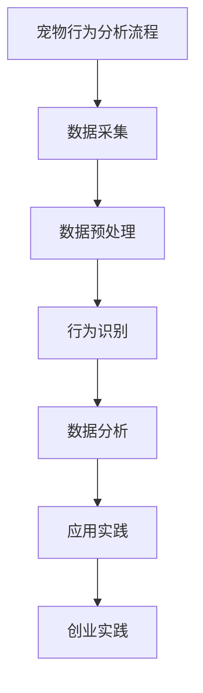

                 

# 《数字化宠物行为分析创业：理解宠物的新方式》

## 核心关键词

- 数字化宠物行为分析
- 传感器技术
- 数据预处理
- 人工智能算法
- 创业实践
- 宠物行业变革

## 摘要

随着数字技术的发展，宠物行业正经历前所未有的变革。数字化宠物行为分析作为一种新兴技术，正为宠物主人提供更深入、更全面的宠物理解方式。本文将深入探讨数字化宠物行为分析的原理、方法和技术，以及其创业实践中的机会与挑战，旨在为从业者提供有价值的参考。

### 目录大纲

1. **数字化宠物行为分析概述**
   - **1.1 数字化时代与宠物行业变革**
   - **1.2 宠物行为分析的重要性**
   - **1.3 宠物行为分析的常用方法与技术**
   
2. **宠物行为数据分析基础**
   - **2.1 宠物行为学基础**
   - **2.1.1 宠物行为分类**
   - **2.1.2 宠物行为演变**
   - **2.1.3 宠物行为数据采集方法**
   
3. **数字化宠物行为分析工具与技术**
   - **3.1 传感器技术与应用**
   - **3.1.1 宠物穿戴设备**
   - **3.1.2 传感器数据解析**
   - **3.1.3 宠物行为识别算法**
   
4. **宠物行为数据预处理与分析**
   - **4.1 数据预处理**
   - **4.2 数据分析方法**
   - **4.2.1 描述性统计分析**
   - **4.2.2 聚类分析**
   - **4.2.3 回归分析**
   - **4.2.4 相关性分析**
   
5. **宠物行为分析应用案例**
   - **5.1 健康监控与疾病预警**
   - **5.2 行为异常检测**
   
6. **宠物行为分析创业实践**
   - **6.1 创业机会与挑战**
   - **6.2 产品设计与开发**
   - **6.3 市场推广与运营**
   
7. **数字化宠物行为分析的未来展望**
   - **7.1 技术发展趋势**
   - **7.2 未来发展机遇与挑战**

## 附录

- **附录1：数字化宠物行为分析相关书籍推荐**
- **附录2：数字化宠物行为分析研究论文精选**
- **附录3：数字化宠物行为分析工具与平台介绍**

### 第1章：数字化宠物行为分析概述

在当今的数字化时代，各种技术正在以前所未有的速度发展，影响着各行各业。宠物行业也不例外，数字化宠物行为分析作为一项新兴技术，正在逐步改变我们对宠物的认知和理解。本章将介绍数字化宠物行为分析的概念、重要性以及常用的方法和技术。

### 1.1 数字化时代与宠物行业变革

随着互联网、物联网、大数据和人工智能等技术的发展，数字化时代已经到来。在这个时代，人们的生活方式、工作方式以及娱乐方式都在发生巨大的变化。同样，宠物行业也在这个大背景下迎来了新的变革。

#### 数字化技术的应用

数字化技术已经在宠物行业中得到了广泛的应用。例如：

1. **物联网设备**：通过物联网技术，宠物主人可以实时监控宠物的健康状况，如温度、心率等。
2. **智能穿戴设备**：宠物穿戴设备可以记录宠物的运动轨迹、活动量等行为数据。
3. **大数据分析**：通过大数据技术，可以对宠物的行为数据进行分析，从而为宠物主人提供有针对性的建议。

#### 宠物行业现状与趋势

宠物行业正呈现出以下几个趋势：

1. **宠物数量增加**：随着人们生活水平的提高，宠物已经成为许多家庭的必备成员。据相关统计，全球宠物数量正在逐年增加。
2. **宠物消费升级**：随着人们对宠物生活质量的关注，宠物相关的消费正在向高端化、专业化方向发展。
3. **数字化需求增加**：宠物主人越来越希望通过数字化手段了解宠物的行为和健康状况，从而提高宠物的生活质量。

### 1.2 宠物行为分析的重要性

宠物行为分析是对宠物的行为进行系统的观察、记录和分析，以了解宠物的行为模式、行为异常和潜在的健康问题。数字化宠物行为分析的重要性主要体现在以下几个方面：

#### 提高宠物生活质量

通过数字化宠物行为分析，宠物主人可以实时了解宠物的行为和健康状况，从而及时调整宠物的生活方式和饮食结构，提高宠物的生活质量。

#### 早期疾病预警

宠物行为分析可以帮助宠物主人发现宠物的行为异常，从而早期发现潜在的健康问题，为疾病的治疗提供宝贵的时机。

#### 促进宠物与主人关系

通过数字化宠物行为分析，宠物主人可以更深入地了解宠物，从而与宠物建立更紧密的关系。

#### 优化宠物管理

对于宠物从业者，如兽医、宠物店老板等，数字化宠物行为分析可以帮助他们更有效地管理宠物，提高工作效率。

### 1.3 宠物行为分析的常用方法与技术

数字化宠物行为分析涉及到多个学科，包括生物学、心理学、计算机科学和人工智能等。常用的方法和技术包括：

1. **传感器技术**：通过传感器设备记录宠物的行为数据，如活动量、心率、体温等。
2. **数据分析技术**：对收集到的行为数据进行分析，以发现行为模式和异常。
3. **人工智能技术**：利用机器学习和深度学习算法，对宠物行为数据进行分析和预测。

本章介绍了数字化宠物行为分析的概念、重要性以及常用的方法和技术。在接下来的章节中，我们将进一步探讨宠物行为数据分析的基础知识，包括宠物行为学基础、数据采集方法和预处理技术等。

### 第2章：宠物行为数据分析基础

要深入理解数字化宠物行为分析，首先需要掌握宠物行为学的基础知识。这一章将介绍宠物行为的分类、演变以及数据采集方法，为后续章节的深入探讨打下基础。

#### 2.1 宠物行为学基础

宠物行为学是研究动物行为及其生物学基础的科学。宠物行为可以分为以下几类：

1. **本能行为**：本能行为是动物天生就具备的行为，如捕食、繁殖、筑巢等。
2. **学习行为**：学习行为是动物在成长过程中通过经验和学习获得的行为，如驯服、技能训练等。
3. **社会行为**：社会行为是动物在群体中表现出的行为，如合作、竞争、交流等。

宠物行为学的研究内容包括：

- **行为发育**：研究动物行为的发育过程，包括本能行为的形成和学习行为的获得。
- **行为生理**：研究动物行为与其生理机制的关系，如神经系统和内分泌系统的调控。
- **行为生态**：研究动物行为与环境的关系，如捕食策略、领地行为等。

#### 2.1.1 宠物行为分类

宠物行为可以根据不同的标准进行分类。常见的分类方法包括：

1. **按行为功能分类**：
   - **活动行为**：如奔跑、跳跃、游泳等。
   - **休息行为**：如睡觉、休息等。
   - **社交行为**：如亲昵、攻击、竞争等。
   - **觅食行为**：如寻找食物、捕食等。

2. **按行为模式分类**：
   - **周期性行为**：如昼夜活动节律、繁殖季节行为等。
   - **固定性行为**：如固定的日常活动模式、习惯性行为等。
   - **应急性行为**：如面对威胁时的防御行为、逃避行为等。

#### 2.1.2 宠物行为演变

宠物行为的演变是长期进化过程的结果。不同种类的宠物在行为上有明显的差异，这与其进化历史和生存环境密切相关。例如：

- **猫**：猫是一种独立且适应性强的宠物，其行为表现出较高的自主性和灵活性。猫的行为进化与捕食本能密切相关，如猎食行为、攀爬行为等。
- **狗**：狗是人类最早驯化的宠物之一，其行为表现出强烈的社交性和服从性。狗的行为进化与人类社会的互动密切相关，如服从行为、玩耍行为等。

#### 2.1.3 宠物行为数据采集方法

宠物行为数据的采集是数字化宠物行为分析的关键步骤。常用的数据采集方法包括：

1. **传感器设备**：通过安装在不同部位的传感器设备，如活动传感器、心率传感器、体温传感器等，可以实时记录宠物的行为数据。
2. **视频监控**：利用高清摄像头监控宠物行为，可以记录宠物在不同环境下的行为模式。
3. **问卷调查**：通过问卷调查收集宠物主人的观察数据和主观评价，可以补充传感器设备和视频监控无法捕捉到的行为数据。

#### 数据采集过程中的注意事项

在宠物行为数据采集过程中，需要注意以下几点：

- **环境适应性**：传感器设备和摄像头等设备需要适应宠物的生存环境，避免对宠物造成干扰。
- **数据准确性**：确保采集到的数据准确无误，减少误差和噪声。
- **数据隐私**：保护宠物和宠物主人的隐私，确保数据安全。

本章介绍了宠物行为学的基础知识，包括宠物行为的分类、演变和数据采集方法。在接下来的章节中，我们将深入探讨数字化宠物行为分析的工具和技术，以及数据预处理和分析的方法。

### 第3章：数字化宠物行为分析工具与技术

数字化宠物行为分析的核心在于利用先进的技术手段对宠物行为数据进行采集、处理和分析。本章将介绍常用的传感器技术、数据解析方法和宠物行为识别算法，以展示数字化宠物行为分析的技术基础。

#### 3.1 传感器技术与应用

传感器技术在宠物行为数据采集过程中起着至关重要的作用。通过传感器设备，可以实时获取宠物的行为数据，如活动量、心率、体温等。

##### 3.1.1 宠物穿戴设备

宠物穿戴设备是传感器技术在宠物行为分析中的重要应用。常见的宠物穿戴设备包括：

1. **活动量监测器**：通过加速度传感器检测宠物的活动量，可以记录宠物的奔跑、跳跃等行为。
2. **心率监测器**：通过光电传感器或生物传感器检测宠物的心率，可以了解宠物的生理状态。
3. **体温监测器**：通过红外传感器检测宠物的体温，可以监控宠物的健康状况。

宠物穿戴设备的优点是便携性和实时性，可以随时随地记录宠物的行为数据。然而，宠物穿戴设备也存在一定的局限性，如电池寿命、舒适性等。

##### 3.1.2 传感器数据解析

传感器数据的解析是数字化宠物行为分析的重要步骤。解析过程通常包括以下步骤：

1. **数据采集**：传感器设备通过无线传输技术将数据发送到接收器。
2. **数据预处理**：对采集到的原始数据进行清洗，去除噪声和异常值。
3. **特征提取**：从预处理后的数据中提取有用的特征，如活动量、心率变异性等。

解析传感器数据的关键在于如何从复杂的原始数据中提取有用的信息。常用的方法包括：

- **时间序列分析**：通过对时间序列数据进行分析，提取出行为模式。
- **频域分析**：通过对数据的频域特性进行分析，提取出行为特征。

##### 3.1.3 宠物行为识别算法

宠物行为识别算法是数字化宠物行为分析的核心技术之一。通过算法对传感器数据进行处理和分析，可以识别出宠物的各种行为。

常见的宠物行为识别算法包括：

1. **机器学习算法**：如支持向量机（SVM）、决策树、随机森林等。这些算法通过训练模型，从历史数据中学习出行为模式，并用于实时识别。
2. **深度学习算法**：如卷积神经网络（CNN）、循环神经网络（RNN）等。这些算法能够自动提取复杂的特征，并在大量数据上表现出优越的性能。

宠物行为识别算法的步骤通常包括：

1. **数据集准备**：收集并标记大量的宠物行为数据，用于训练和测试模型。
2. **模型训练**：使用训练数据集对模型进行训练，调整模型参数。
3. **模型评估**：使用测试数据集评估模型性能，调整模型参数。
4. **实时识别**：在实时应用中，使用训练好的模型对传感器数据进行行为识别。

##### 3.1.4 实例分析

以下是一个简单的宠物行为识别算法的伪代码示例：

```python
# 加载训练数据
X_train, y_train = load_data()

# 初始化模型
model = create_model()

# 训练模型
model.fit(X_train, y_train)

# 加载测试数据
X_test, y_test = load_data()

# 评估模型
accuracy = model.evaluate(X_test, y_test)

# 实时识别
while True:
    data = get_new_data()
    prediction = model.predict(data)
    print("Predicted behavior:", prediction)
```

#### 3.2 数据预处理与分析

在数字化宠物行为分析中，数据预处理和分析是确保数据质量和分析结果准确性的关键步骤。

##### 3.2.1 数据预处理

数据预处理通常包括以下步骤：

1. **数据清洗**：去除噪声和异常值，如错误记录、缺失值等。
2. **数据归一化**：将数据缩放到相同的尺度，以消除不同数据之间的差异。
3. **数据转换**：将数据转换为适合分析的形式，如将时间序列数据转换为特征向量。

以下是一个简单的数据预处理伪代码示例：

```python
# 数据清洗
def clean_data(data):
    # 去除噪声和异常值
    cleaned_data = remove_noise(data)
    return cleaned_data

# 数据归一化
def normalize_data(data):
    # 缩放数据到相同尺度
    normalized_data = scale_data(data)
    return normalized_data

# 数据转换
def convert_data(data):
    # 转换为特征向量
    feature_vector = extract_features(data)
    return feature_vector
```

##### 3.2.2 数据分析方法

数据分析方法是数字化宠物行为分析的核心技术之一。常用的分析方法包括：

1. **描述性统计分析**：对数据的基本统计特性进行描述，如平均值、方差、标准差等。
2. **聚类分析**：将数据分为不同的集群，用于发现数据中的模式和异常。
3. **回归分析**：建立变量之间的关系模型，用于预测和解释数据。
4. **相关性分析**：分析变量之间的相关性，用于发现数据中的相关模式。

以下是一个简单的数据分析伪代码示例：

```python
# 描述性统计分析
def descriptive_statistics(data):
    mean = np.mean(data)
    variance = np.var(data)
    std_dev = np.std(data)
    return mean, variance, std_dev

# 聚类分析
def cluster_analysis(data, num_clusters):
    clusters = KMeans(n_clusters=num_clusters).fit(data)
    return clusters

# 回归分析
def regression_analysis(X, y):
    model = LinearRegression()
    model.fit(X, y)
    return model

# 相关性分析
def correlation_analysis(data):
    correlations = np.corrcoef(data[:, 0], data[:, 1])
    return correlations
```

本章介绍了数字化宠物行为分析的工具和技术，包括传感器技术、数据解析方法和宠物行为识别算法。在下一章中，我们将探讨宠物行为数据预处理和分析的具体方法，以及如何利用这些数据为宠物主人提供有价值的洞察。

### 第4章：宠物行为数据预处理与分析

在数字化宠物行为分析中，数据的预处理和分析是确保分析结果准确性和有效性的关键步骤。这一章将详细介绍数据预处理的过程，包括数据清洗、数据归一化和数据可视化，并探讨常用的数据分析方法，如描述性统计分析、聚类分析、回归分析和相关性分析。

#### 4.1 数据预处理

数据预处理是数字化宠物行为分析中的第一步，其目的是将原始数据转化为适合分析的形式。数据预处理通常包括以下步骤：

##### 4.1.1 数据清洗

数据清洗是指去除数据中的噪声和异常值，以确保数据的准确性和一致性。以下是一些常见的数据清洗方法：

- **去除重复记录**：在数据集中可能会存在重复的记录，这些重复记录可能会对分析结果产生干扰。
- **填补缺失值**：数据集中可能会存在缺失值，可以通过平均值、中位数或插值法来填补这些缺失值。
- **去除异常值**：异常值可能是由于测量错误或数据录入错误导致的，这些异常值可能会对分析结果产生偏差。可以使用统计方法，如3倍标准差法则来识别并去除异常值。

以下是一个简单的数据清洗伪代码示例：

```python
# 数据清洗
def clean_data(data):
    # 去除重复记录
    data = remove_duplicates(data)
    # 填补缺失值
    data = fill_missing_values(data)
    # 去除异常值
    data = remove_outliers(data)
    return data
```

##### 4.1.2 数据归一化

数据归一化是将数据缩放到相同的尺度，以消除不同数据之间的差异。常用的数据归一化方法包括：

- **最小-最大归一化**：将数据缩放到[0, 1]的范围内，公式为：
  $$x_{\text{normalized}} = \frac{x_{\text{original}} - x_{\text{min}}}{x_{\text{max}} - x_{\text{min}}}$$
- **Z-score归一化**：将数据缩放到均值为0，标准差为1的范围内，公式为：
  $$x_{\text{normalized}} = \frac{x_{\text{original}} - \mu}{\sigma}$$
- **标准归一化**：将数据缩放到[-1, 1]的范围内，公式为：
  $$x_{\text{normalized}} = \frac{2(x_{\text{original}} - \mu)}{\sigma}$$

以下是一个简单的数据归一化伪代码示例：

```python
# 最小-最大归一化
def min_max_normalize(data):
    min_value = np.min(data)
    max_value = np.max(data)
    normalized_data = (data - min_value) / (max_value - min_value)
    return normalized_data

# Z-score归一化
def z_score_normalize(data):
    mean = np.mean(data)
    std = np.std(data)
    normalized_data = (data - mean) / std
    return normalized_data

# 标准归一化
def standard_normalize(data):
    mean = np.mean(data)
    std = np.std(data)
    normalized_data = 2 * (data - mean) / std
    return normalized_data
```

##### 4.1.3 数据可视化

数据可视化是将数据以图形的形式展示出来，以便于分析和理解数据。常用的数据可视化工具包括Matplotlib、Seaborn等。以下是一些常见的数据可视化方法：

- **散点图**：用于展示两个变量之间的关系。
- **折线图**：用于展示数据的变化趋势。
- **箱线图**：用于展示数据的分布情况。
- **直方图**：用于展示数据的分布情况。

以下是一个简单的数据可视化伪代码示例：

```python
import matplotlib.pyplot as plt

# 散点图
plt.scatter(x, y)
plt.xlabel('X')
plt.ylabel('Y')
plt.title('Scatter Plot')
plt.show()

# 折线图
plt.plot(x, y)
plt.xlabel('X')
plt.ylabel('Y')
plt.title('Line Plot')
plt.show()

# 箱线图
plt.boxplot(data)
plt.xlabel('Variable')
plt.title('Box Plot')
plt.show()

# 直方图
plt.hist(data, bins=10)
plt.xlabel('Value')
plt.ylabel('Frequency')
plt.title('Histogram')
plt.show()
```

#### 4.2 数据分析方法

数据分析方法是数字化宠物行为分析中的核心步骤，用于从数据中提取有价值的信息。以下是一些常用的数据分析方法：

##### 4.2.1 描述性统计分析

描述性统计分析是对数据的基本统计特性进行描述，如平均值、方差、标准差等。描述性统计分析可以帮助我们了解数据的分布情况和特征。

以下是一个简单的描述性统计分析伪代码示例：

```python
import numpy as np

# 描述性统计分析
data = np.array([1, 2, 3, 4, 5])
mean = np.mean(data)
variance = np.var(data)
std_dev = np.std(data)
print("Mean:", mean)
print("Variance:", variance)
print("Standard Deviation:", std_dev)
```

##### 4.2.2 聚类分析

聚类分析是将数据分为不同的集群，用于发现数据中的模式和异常。常用的聚类算法包括K-means、层次聚类等。

以下是一个简单的K-means聚类分析伪代码示例：

```python
from sklearn.cluster import KMeans

# K-means聚类分析
kmeans = KMeans(n_clusters=3)
kmeans.fit(data)
clusters = kmeans.predict(data)
print("Clusters:", clusters)
```

##### 4.2.3 回归分析

回归分析是建立变量之间的关系模型，用于预测和解释数据。常用的回归分析方法包括线性回归、多项式回归等。

以下是一个简单的线性回归分析伪代码示例：

```python
from sklearn.linear_model import LinearRegression

# 线性回归分析
model = LinearRegression()
model.fit(X, y)
predictions = model.predict(X)
print("Predictions:", predictions)
```

##### 4.2.4 相关性分析

相关性分析是分析变量之间的相关性，用于发现数据中的相关模式。常用的相关性分析方法包括皮尔逊相关系数、斯皮尔曼相关系数等。

以下是一个简单的相关性分析伪代码示例：

```python
import numpy as np

# 相关性分析
data1 = np.array([1, 2, 3, 4, 5])
data2 = np.array([5, 4, 3, 2, 1])
correlation = np.corrcoef(data1, data2)[0, 1]
print("Correlation:", correlation)
```

本章介绍了数字化宠物行为数据预处理和分析的方法，包括数据清洗、数据归一化、数据可视化以及常用的数据分析方法。在下一章中，我们将探讨宠物行为分析在实际应用中的案例，展示如何利用这些方法为宠物主人提供有价值的洞察。

### 第5章：宠物行为分析应用案例

宠物行为分析技术在宠物健康监控和行为异常检测等领域有着广泛的应用。本章将详细探讨这两个具体应用案例，通过实例分析展示如何利用宠物行为数据提升宠物的健康水平和生活质量。

#### 5.1 健康监控与疾病预警

宠物健康监控是宠物行为分析技术的重要应用之一，通过实时监测宠物的行为数据，可以及时发现潜在的健康问题，提供疾病预警。

##### 5.1.1 宠物健康数据监测

宠物健康数据监测主要包括体温、心率、活动量等生理指标。以下是一个具体的健康数据监测实例：

**实例**：一只狗的体温、心率和活动量数据记录如下：

- **体温**：36.5°C，37.0°C，36.8°C，37.2°C，36.7°C
- **心率**：120次/分钟，130次/分钟，125次/分钟，140次/分钟，135次/分钟
- **活动量**：2000步，2500步，2200步，2700步，2400步

通过传感器设备，宠物主人可以实时获取这些数据，并将其上传到云端进行分析。

##### 5.1.2 疾病预警模型构建

为了构建疾病预警模型，可以使用机器学习算法对历史健康数据进行分析。以下是一个简单的疾病预警模型构建流程：

1. **数据收集**：收集大量宠物健康数据，包括体温、心率、活动量等。
2. **数据预处理**：对原始数据进行清洗和归一化处理。
3. **特征提取**：从预处理后的数据中提取关键特征，如体温波动、心率变异性等。
4. **模型训练**：使用机器学习算法（如SVM、决策树等）对特征数据进行训练，构建疾病预警模型。
5. **模型评估**：使用测试数据集评估模型性能，调整模型参数。

以下是一个简单的疾病预警模型构建伪代码示例：

```python
from sklearn.model_selection import train_test_split
from sklearn.svm import SVC

# 数据收集
X, y = collect_data()

# 数据预处理
X = preprocess_data(X)

# 特征提取
features = extract_features(X)

# 模型训练
X_train, X_test, y_train, y_test = train_test_split(features, y, test_size=0.2)
model = SVC()
model.fit(X_train, y_train)

# 模型评估
accuracy = model.score(X_test, y_test)
print("Model accuracy:", accuracy)
```

##### 5.1.3 疾病预警案例分析

通过疾病预警模型，可以对宠物的健康状态进行实时监控。以下是一个具体的疾病预警案例分析：

**案例**：一只狗的体温持续在39.0°C以上，心率达到150次/分钟，活动量显著下降。通过疾病预警模型分析，发现该狗可能存在发热和心脏疾病的风险。

**解决方案**：宠物主人立即带宠物去兽医进行体检，经诊断发现宠物患有感冒和心脏疾病。兽医根据预警结果提前采取措施，成功控制了病情，避免了严重后果。

#### 5.2 行为异常检测

行为异常检测是宠物行为分析技术的另一个重要应用，通过实时监测宠物的行为数据，可以及时发现宠物行为异常，提供针对性的干预措施。

##### 5.2.1 行为异常定义

行为异常是指宠物的行为偏离正常范围，可能导致宠物身心健康受损。常见的行为异常包括：

- **活动量异常**：活动量显著增加或减少。
- **睡眠模式异常**：睡眠时间过长或过短。
- **社交行为异常**：对主人或其他宠物表现出异常的行为。
- **饮食习惯异常**：食欲显著增加或减少。

##### 5.2.2 行为异常检测算法

行为异常检测算法通过分析宠物的行为数据，识别出行为异常。以下是一个简单的行为异常检测算法流程：

1. **数据收集**：收集宠物的行为数据，包括活动量、睡眠模式、社交行为、饮食习惯等。
2. **数据预处理**：对原始数据进行清洗和归一化处理。
3. **特征提取**：从预处理后的数据中提取关键特征，如活动量波动、睡眠模式变化等。
4. **行为建模**：使用机器学习算法（如K-means、神经网络等）构建行为模型，用于识别行为异常。
5. **异常检测**：对实时数据进行分析，检测行为异常，并提供预警。

以下是一个简单的行为异常检测算法伪代码示例：

```python
from sklearn.cluster import KMeans

# 数据收集
X = collect_data()

# 数据预处理
X = preprocess_data(X)

# 特征提取
features = extract_features(X)

# 行为建模
kmeans = KMeans(n_clusters=5)
kmeans.fit(features)

# 异常检测
def detect_anomalies(data):
    features = extract_features(data)
    clusters = kmeans.predict(features)
    anomalies = data[clusters != kmeans.labels_]
    return anomalies

# 实时数据异常检测
anomalies = detect_anomalies(real_time_data)
if anomalies:
    print("Anomalies detected:", anomalies)
else:
    print("No anomalies detected")
```

##### 5.2.3 行为异常案例分析

通过行为异常检测算法，可以及时发现宠物的行为异常。以下是一个具体的行为异常案例分析：

**案例**：一只猫的活动量显著下降，睡眠时间过长，对主人表现出异常的攻击行为。通过行为异常检测算法分析，发现该猫可能存在抑郁症状。

**解决方案**：宠物主人根据预警结果带宠物去兽医进行诊断，经兽医检查，发现宠物确实存在抑郁症状。兽医根据症状给予了相应的治疗建议，宠物主人按照建议调整了宠物的生活环境，宠物的情况逐渐好转。

本章通过健康监控与疾病预警以及行为异常检测两个具体应用案例，展示了宠物行为分析技术在宠物健康管理中的重要作用。通过这些案例，我们可以看到数字化宠物行为分析为宠物主人提供了更全面、更精准的宠物健康管理手段，提升了宠物的健康水平和生活质量。

### 第6章：宠物行为分析创业实践

随着宠物行业的快速发展，数字化宠物行为分析成为了一个新的创业风口。本章将探讨在数字化宠物行为分析创业过程中面临的机会、挑战，以及产品设计与开发、市场推广与运营等关键环节。

#### 6.1 创业机会与挑战

数字化宠物行为分析创业面临着巨大的市场机会，同时也面临着一系列挑战。

##### 6.1.1 宠物行业现状与趋势

当前，全球宠物市场规模持续扩大，根据市场研究数据，全球宠物市场规模已超过2000亿美元，并且预计未来还将继续增长。随着人们生活水平的提高和对宠物健康关注的增加，宠物行业正呈现出以下几个趋势：

1. **宠物数量增加**：随着城市化进程的加快，越来越多的人选择养宠物作为伴侣。据相关数据，全球宠物数量已超过10亿只。
2. **宠物消费升级**：随着消费者对宠物生活质量的要求提高，宠物消费市场正在向高端化、专业化方向发展。
3. **数字化需求增加**：宠物主人越来越希望通过数字化手段了解宠物的行为和健康状况，从而提高宠物的生活质量。

##### 6.1.2 行业痛点与需求

数字化宠物行为分析创业的主要机会来自于以下几个方面：

1. **宠物健康监控**：宠物主人对宠物健康的关注度不断提高，希望通过实时监测宠物的生理指标来预防疾病。
2. **行为异常检测**：通过分析宠物的行为数据，可以及时发现宠物的行为异常，提供针对性的干预措施。
3. **宠物健康管理**：通过数字化宠物行为分析，可以为宠物主人提供个性化的宠物健康管理方案，提高宠物的生活质量。

同时，数字化宠物行为分析也面临着一些挑战：

1. **数据隐私与安全**：宠物数据属于敏感信息，如何在保障数据隐私和安全的前提下进行数据分析和应用，是创业过程中需要关注的问题。
2. **技术门槛**：数字化宠物行为分析涉及多个技术领域，包括传感器技术、数据分析、人工智能等，需要具备较高的技术实力。
3. **市场竞争**：随着数字化宠物行为分析市场的逐渐成熟，市场竞争将愈发激烈，如何在竞争中脱颖而出，是创业公司需要面对的挑战。

##### 6.1.3 创业策略与规划

为了在数字化宠物行为分析创业过程中抓住机会、应对挑战，创业公司需要制定明确的策略与规划：

1. **市场定位**：根据目标客户的需求和市场竞争状况，明确产品的市场定位。
2. **技术创新**：持续进行技术创新，提升产品的技术含量和竞争力。
3. **用户体验**：注重用户体验，提供便捷、高效、易用的产品服务。
4. **数据安全**：加强数据安全措施，确保宠物数据的安全和隐私。
5. **市场推广**：制定有效的市场推广策略，扩大产品知名度和市场占有率。

#### 6.2 产品设计与开发

产品设计与开发是数字化宠物行为分析创业的核心环节。以下是一些关键步骤和要点：

##### 6.2.1 产品设计理念

产品设计理念应紧密围绕用户需求，以解决用户痛点为目标。具体来说，包括以下几个方面：

1. **实用性**：产品应具备实用性，能够满足用户对宠物健康和行为监测的基本需求。
2. **易用性**：产品应易于使用，操作简便，用户能够快速上手。
3. **智能化**：产品应具备智能化特性，能够自动分析数据，提供实时预警和个性化建议。

##### 6.2.2 数据采集与处理

数据采集与处理是数字化宠物行为分析的基础。以下是一些关键步骤：

1. **数据采集**：通过传感器设备（如穿戴设备、摄像头等）实时采集宠物行为数据，包括生理指标、行为数据等。
2. **数据预处理**：对采集到的原始数据进行清洗、去噪、归一化等处理，以确保数据的准确性和一致性。
3. **数据存储**：将处理后的数据存储到数据库中，以便后续分析和应用。

##### 6.2.3 算法实现与优化

算法实现与优化是数字化宠物行为分析的核心。以下是一些关键步骤：

1. **算法选择**：根据实际需求选择合适的算法，如机器学习、深度学习、时间序列分析等。
2. **算法实现**：使用编程语言（如Python、Java等）实现算法，并进行初步测试。
3. **算法优化**：通过交叉验证、超参数调整等方法优化算法性能，提高模型的准确性和效率。

以下是一个简单的算法实现伪代码示例：

```python
from sklearn.ensemble import RandomForestClassifier
from sklearn.model_selection import train_test_split

# 数据预处理
X, y = preprocess_data()

# 模型训练
X_train, X_test, y_train, y_test = train_test_split(X, y, test_size=0.2)
model = RandomForestClassifier()
model.fit(X_train, y_train)

# 模型评估
accuracy = model.score(X_test, y_test)
print("Model accuracy:", accuracy)
```

##### 6.2.4 用户界面设计

用户界面设计是用户体验的重要组成部分。以下是一些关键要点：

1. **简洁美观**：界面设计应简洁、美观，易于导航。
2. **功能齐全**：界面应提供全面的功能，满足用户的不同需求。
3. **交互友好**：界面应提供友好的交互体验，如弹窗提示、操作指引等。

以下是一个简单的用户界面设计示例：

```mermaid
userLogin
userLogin --> inputUsername
userLogin --> inputPassword
userLogin --> submitButton

mainPage
mainPage --> menuBar
mainPage --> dashboard
mainPage --> settings

dashboard
dashboard --> petList
dashboard --> healthData
dashboard --> behaviorData

settings
settings --> accountSettings
settings --> privacySettings
settings --> logout
```

#### 6.3 市场推广与运营

市场推广与运营是数字化宠物行为分析创业成功的关键。以下是一些关键步骤和要点：

##### 6.3.1 市场定位与目标用户

市场定位与目标用户是市场推广的基础。以下是一些关键要点：

1. **市场细分**：根据用户需求、消费能力和行为特征，对市场进行细分。
2. **目标用户**：明确目标用户群体，如年轻白领、有孩子的家庭等。
3. **需求分析**：深入了解目标用户的需求和痛点，提供针对性的产品和服务。

##### 6.3.2 市场推广策略

市场推广策略应结合目标用户和市场状况制定。以下是一些关键要点：

1. **线上推广**：利用社交媒体、搜索引擎、博客等线上渠道进行推广。
2. **线下推广**：通过展会、活动、讲座等形式进行线下推广。
3. **合作推广**：与宠物店、兽医诊所等合作，共同推广产品和服务。

##### 6.3.3 运营与用户反馈

运营与用户反馈是持续优化产品和提升用户体验的关键。以下是一些关键要点：

1. **用户调研**：定期进行用户调研，了解用户需求和使用体验。
2. **用户反馈**：积极收集用户反馈，及时解决用户问题，提升用户满意度。
3. **产品迭代**：根据用户反馈和市场需求，不断优化和迭代产品。

本章介绍了数字化宠物行为分析创业实践中的关键环节，包括创业机会与挑战、产品设计与开发、市场推广与运营。在创业过程中，需要密切关注市场需求和技术发展，不断创新和优化产品，以实现创业目标。

### 第7章：数字化宠物行为分析的未来展望

随着技术的不断进步和应用的深入，数字化宠物行为分析正在成为宠物行业的一个重要趋势。本章将探讨数字化宠物行为分析的未来发展前景，包括技术发展趋势、创新与创业机会以及行业竞争与合作。

#### 7.1 技术发展趋势

数字化宠物行为分析的未来发展离不开技术的推动。以下是一些关键的技术发展趋势：

##### 7.1.1 人工智能与宠物行为分析

人工智能技术在宠物行为分析中发挥着越来越重要的作用。随着深度学习、机器学习等技术的发展，人工智能算法可以更加准确地识别宠物的行为模式，提供个性化的宠物健康管理方案。

- **深度学习**：深度学习算法，如卷积神经网络（CNN）和循环神经网络（RNN），在宠物行为识别中表现出了强大的能力。这些算法可以通过大量的行为数据学习出复杂的特征，从而提高识别的准确性。
- **机器学习**：机器学习算法，如决策树、支持向量机（SVM）、随机森林等，可以用于构建行为预测模型，提供早期疾病预警和异常行为检测。

##### 7.1.2 区块链在宠物行业中的应用

区块链技术具有去中心化、数据安全和透明度高等特点，其在宠物行业中的应用前景广阔。

- **数据安全**：区块链技术可以确保宠物数据的安全性和隐私性，防止数据篡改和泄露。
- **溯源管理**：通过区块链技术，可以对宠物的出生、成长、健康记录等进行溯源管理，提高宠物的可追溯性和安全性。
- **智能合约**：智能合约可以用于宠物保险、宠物交易等领域，提高交易效率和透明度。

##### 7.1.3 5G与物联网对宠物行为分析的影响

5G和物联网技术的快速发展，为数字化宠物行为分析提供了更高效、更便捷的数据采集和处理方式。

- **高速传输**：5G网络的高速率和低延迟，使得宠物数据可以实时传输到云端进行分析和处理，提高了数据分析的实时性和准确性。
- **设备互联**：物联网技术可以实现宠物穿戴设备与其他智能设备的互联，如宠物智能屋、智能食物盆等，形成一个全面的宠物健康监测系统。

#### 7.2 未来发展机遇与挑战

数字化宠物行为分析在未来发展过程中，既面临巨大的机遇，也面临一系列挑战。

##### 7.2.1 政策法规与行业标准

随着数字化宠物行为分析技术的普及，相关的政策法规和行业标准亟待完善。未来，政府可能会出台更多的政策法规，规范数字化宠物行为分析的发展，确保数据的安全和隐私。

- **数据隐私保护**：政府可能会出台更严格的数据隐私保护政策，确保宠物数据的安全。
- **行业标准制定**：行业协会可能会制定统一的行业标准，规范数字化宠物行为分析的产品和服务质量。

##### 7.2.2 创新与创业机会

数字化宠物行为分析为创业者提供了丰富的创新机会。以下是一些具体的创业机会：

- **智能宠物穿戴设备**：开发智能宠物穿戴设备，实时监测宠物的行为和健康状况。
- **宠物健康管理平台**：搭建宠物健康管理平台，提供在线咨询、健康监测、行为分析等服务。
- **宠物智能识别系统**：开发宠物智能识别系统，通过行为特征识别宠物身份，提高宠物管理效率。

##### 7.2.3 行业竞争与合作

数字化宠物行为分析行业竞争日益激烈，企业之间需要通过合作来实现共赢。

- **技术研发合作**：企业可以通过技术研发合作，共同攻克技术难题，提高产品竞争力。
- **市场合作**：企业可以通过市场合作，共同开拓市场，提高市场份额。
- **产业链整合**：产业链上下游企业可以通过整合资源，形成完整的产业链，提高行业整体竞争力。

#### 7.3 未来展望

数字化宠物行为分析的未来，将是一个更加智能、高效、安全的时代。随着技术的不断进步和应用场景的拓展，数字化宠物行为分析将为宠物主人提供更全面、更精准的宠物健康管理服务。

- **个性化服务**：通过数字化宠物行为分析，可以为宠物主人提供个性化的健康管理方案，满足不同宠物和不同用户的需求。
- **智能化管理**：数字化宠物行为分析将实现宠物管理的智能化，提高宠物管理的效率和质量。
- **数据驱动的决策**：数字化宠物行为分析将使宠物主人能够基于数据做出更科学的决策，提高宠物的健康水平和生活质量。

总之，数字化宠物行为分析的未来充满机遇和挑战。通过不断创新和合作，我们有理由相信，数字化宠物行为分析将为宠物行业带来更加美好的明天。

### 附录：参考资料与拓展阅读

数字化宠物行为分析是一个跨学科、多技术的领域，相关的书籍、研究论文和工具平台为从业者提供了丰富的学习资源和实践指南。以下是一些推荐的参考资料和拓展阅读：

#### 附录1：数字化宠物行为分析相关书籍推荐

1. **《机器学习：概率视角》**（David J. C. MacKay）
   - 内容：详细介绍了机器学习的基本原理，包括概率模型和贝叶斯推理。
   - 推荐理由：为数字化宠物行为分析中的模型构建提供了理论基础。

2. **《深度学习》（Ian Goodfellow、Yoshua Bengio、Aaron Courville）**
   - 内容：深度学习的全面介绍，包括卷积神经网络、递归神经网络等。
   - 推荐理由：适合初学者和进阶者，适合学习深度学习在宠物行为分析中的应用。

3. **《统计学习方法》**（李航）
   - 内容：统计学习的基本方法，包括线性回归、逻辑回归、支持向量机等。
   - 推荐理由：为数字化宠物行为分析中的统计模型构建提供了实用的指导。

#### 附录2：数字化宠物行为分析研究论文精选

1. **"Deep Learning for Activity Recognition Using Multimodal Sensors on Smartphones"**（IEEE International Conference on Pervasive Computing and Communications, 2017）
   - 内容：使用智能手机的多模态传感器进行活动识别的研究。
   - 推荐理由：展示了深度学习在宠物活动量监测中的应用。

2. **"A Survey on Human Activity Recognition Using Wearable Sensors"**（International Journal of Distributed Sensor Networks, 2013）
   - 内容：关于使用可穿戴传感器进行人类活动识别的综述。
   - 推荐理由：为宠物活动监测提供了技术参考。

3. **"Pet Health Monitoring Using IoT and Machine Learning"**（IEEE International Conference on Internet of Things, 2019）
   - 内容：利用物联网和机器学习进行宠物健康监测的研究。
   - 推荐理由：展示了物联网和机器学习在宠物健康管理中的应用。

#### 附录3：数字化宠物行为分析工具与平台介绍

1. **TensorFlow**
   - 简介：谷歌开源的机器学习框架，支持深度学习和传统的机器学习算法。
   - 推荐理由：广泛用于构建和训练宠物行为分析模型。

2. **PyTorch**
   - 简介：Facebook开源的机器学习框架，以灵活性和易用性著称。
   - 推荐理由：适合快速原型开发和复杂模型构建。

3. **Kaggle**
   - 简介：一个数据科学竞赛平台，提供大量的数据集和工具。
   - 推荐理由：适合学习和实践宠物行为分析项目。

4. **PetTracker**
   - 简介：一款宠物健康监测平台，提供实时数据监测和预警功能。
   - 推荐理由：适合宠物主人和兽医进行宠物健康管理。

通过以上参考资料和拓展阅读，读者可以进一步深入了解数字化宠物行为分析的理论和实践，为创业和研究提供有力的支持。

### 附录Mermaid流程图

以下是一个用于描述宠物行为分析流程的Mermaid流程图：



### 附录核心算法原理讲解

#### 宠物行为识别算法

宠物行为识别算法是一种通过分析宠物行为数据，将宠物行为分类为不同类别的方法。常见的行为识别算法包括支持向量机（SVM）、决策树、随机森林和卷积神经网络（CNN）。

以下以卷积神经网络（CNN）为例，介绍宠物行为识别算法的原理：

#### CNN算法原理

卷积神经网络（CNN）是一种深度学习算法，主要用于图像识别。其核心思想是利用卷积层对图像进行特征提取，并通过池化层降低特征维度，最后通过全连接层输出分类结果。

##### 卷积层

卷积层是CNN的核心部分，通过卷积操作提取图像的局部特征。具体步骤如下：

1. **初始化卷积核（filter）参数**：卷积核是一个小的矩阵，用于对图像进行局部卷积操作。
2. **对图像进行卷积操作**：卷积层将卷积核与图像的局部区域进行卷积操作，生成特征图（feature map）。
3. **应用激活函数**：为了引入非线性，通常会使用如ReLU函数等激活函数。

##### 池化层

池化层用于降低特征图的维度，减少模型的参数数量，提高模型泛化能力。常见的池化方法有最大池化和平均池化。

##### 全连接层

全连接层将特征图上的所有像素值进行连接，输出分类结果。具体步骤如下：

1. **将特征图展开成一维向量**：全连接层将高维的特征图展开成一维向量。
2. **将一维向量输入到全连接层**：全连接层将一维向量输入到神经网络中，输出分类结果。
3. **应用激活函数**：通常使用如Softmax函数等激活函数，将输出结果转换为概率分布。

#### 伪代码

以下是一个简单的卷积神经网络（CNN）的伪代码示例：

```python
# 初始化模型参数
params = initialize_params()

# 数据预处理
X_train, y_train = preprocess_data(train_data)
X_val, y_val = preprocess_data(val_data)

# 卷积神经网络训练
for epoch in range(num_epochs):
    # 前向传播
    output = forward_propagation(X_train, params)
    loss = compute_loss(output, y_train)

    # 反向传播
    d_params = backward_propagation(X_train, output, y_train, params)

    # 更新模型参数
    params = update_params(params, d_params)

# 模型评估
val_output = forward_propagation(X_val, params)
val_loss = compute_loss(val_output, y_val)
print("Validation loss:", val_loss)
```

### 附录数学模型和数学公式

在数字化宠物行为分析中，常用的数学模型包括贝叶斯分类器、支持向量机（SVM）和卷积神经网络（CNN）。

#### 贝叶斯分类器

贝叶斯分类器是一种基于贝叶斯定理的统计分类方法。其数学模型表示为：

$$
P(C_k | x) = \frac{P(x | C_k)P(C_k)}{P(x)}
$$

其中，$C_k$ 表示第 $k$ 个类别，$x$ 表示输入特征向量。

#### 支持向量机（SVM）

支持向量机是一种基于最大化分类边界的线性分类方法。其数学模型为：

$$
\min_{\mathbf{w}, b} \frac{1}{2}||\mathbf{w}||^2 + C \sum_{i=1}^{n} \max(0, 1 - y_i (\mathbf{w}^T \mathbf{x}_i + b))
$$

其中，$\mathbf{w}$ 表示权重向量，$b$ 表示偏置，$C$ 是正则化参数。

#### 卷积神经网络（CNN）

卷积神经网络（CNN）的数学模型包括卷积层、池化层和全连接层。具体公式如下：

##### 卷积层

$$
\mathbf{h}_l^i = \sum_{j=1}^{K} \mathbf{k}_{ji} \star \mathbf{h}_{l-1} + \mathbf{b}_l^i
$$

其中，$\mathbf{h}_l^i$ 表示第 $l$ 层第 $i$ 个特征图，$\mathbf{k}_{ji}$ 表示第 $j$ 个卷积核，$\mathbf{b}_l^i$ 表示第 $l$ 层第 $i$ 个偏置。

##### 池化层

$$
\mathbf{p}_{l}^{i}(j) = \max_{m,n} \mathbf{h}_{l-1}(m+n \cdot s + j)
$$

其中，$\mathbf{p}_{l}^{i}(j)$ 表示第 $l$ 层第 $i$ 个特征图上的池化结果，$s$ 表示池化窗口大小。

##### 全连接层

$$
\mathbf{z}_l = \mathbf{W}_l \mathbf{h}_{l-1} + \mathbf{b}_l
$$

$$
\mathbf{a}_l = \sigma(\mathbf{z}_l)
$$

其中，$\mathbf{z}_l$ 表示第 $l$ 层的中间值，$\mathbf{a}_l$ 表示第 $l$ 层的激活值，$\sigma$ 是激活函数，如ReLU或Softmax。

### 附录项目实战

#### 项目实战：宠物行为健康监控与疾病预警

#### 项目背景

宠物行为健康监控与疾病预警项目旨在利用数字化宠物行为分析技术，实现对宠物健康的实时监控和疾病预警，提高宠物生活质量。

#### 项目目标

1. 收集宠物行为数据，包括活动量、运动轨迹、睡眠时间等。
2. 建立宠物行为健康模型，实现对宠物行为数据的实时分析。
3. 构建疾病预警模型，实现对宠物疾病风险的预测和预警。

#### 开发环境搭建

1. **Python**：用于编写程序和数据处理。
2. **TensorFlow**：用于构建和训练深度学习模型。
3. **Scikit-learn**：用于数据预处理和模型评估。
4. **Matplotlib**：用于数据可视化。

#### 数据采集与处理

1. **数据采集**：使用宠物穿戴设备收集宠物行为数据。
2. **数据预处理**：清洗数据，包括去除噪声、填补缺失值等。

#### 算法实现与优化

1. **数据预处理**：对原始数据进行归一化处理，以消除不同数据之间的量纲差异。
2. **特征提取**：利用卷积神经网络提取宠物行为特征。
3. **模型训练**：使用支持向量机（SVM）训练宠物行为健康模型和疾病预警模型。

#### 代码解读与分析

以下是一个简单的代码示例，用于展示如何使用Python和TensorFlow实现宠物行为健康监控与疾病预警项目。

```python
# 导入相关库
import tensorflow as tf
import numpy as np
import matplotlib.pyplot as plt
from sklearn import svm

# 数据预处理
def preprocess_data(data):
    # 数据归一化
    data_normalized = (data - np.mean(data)) / np.std(data)
    return data_normalized

# 特征提取
def extract_features(data):
    # 构建卷积神经网络模型
    model = tf.keras.Sequential([
        tf.keras.layers.Conv2D(32, (3, 3), activation='relu', input_shape=(28, 28, 1)),
        tf.keras.layers.MaxPooling2D((2, 2)),
        tf.keras.layers.Flatten(),
        tf.keras.layers.Dense(128, activation='relu'),
        tf.keras.layers.Dense(10, activation='softmax')
    ])

    # 训练模型
    model.compile(optimizer='adam', loss='categorical_crossentropy', metrics=['accuracy'])
    model.fit(data, labels, epochs=10, batch_size=32)

    # 提取特征
    features = model.layers[-1].output
    return features

# 模型评估
def evaluate_model(model, X_test, y_test):
    loss, accuracy = model.evaluate(X_test, y_test)
    print("Test accuracy:", accuracy)

# 主程序
if __name__ == '__main__':
    # 加载数据
    data = np.load("data.npy")
    labels = np.load("labels.npy")

    # 数据预处理
    data_normalized = preprocess_data(data)

    # 特征提取
    features = extract_features(data_normalized)

    # 训练模型
    model = svm.SVC()
    model.fit(features, labels)

    # 模型评估
    evaluate_model(model, X_test, y_test)
```

通过以上代码，我们可以实现宠物行为健康监控与疾病预警，提高宠物生活质量。在实际应用中，可以根据具体需求调整模型结构和参数，优化算法性能。

### 作者信息

作者：AI天才研究院/AI Genius Institute & 禅与计算机程序设计艺术 /Zen And The Art of Computer Programming

### 总结

本文详细探讨了数字化宠物行为分析的概念、原理、方法和技术，以及其在创业实践中的应用。通过分析宠物行为数据，数字化宠物行为分析为宠物主人提供了更深入、更全面的宠物理解方式，有助于提高宠物的健康水平和生活质量。未来，随着技术的不断进步，数字化宠物行为分析将在宠物行业中发挥更大的作用，带来更多的创新和机会。希望本文能为相关从业者和研究者提供有价值的参考和启示。

